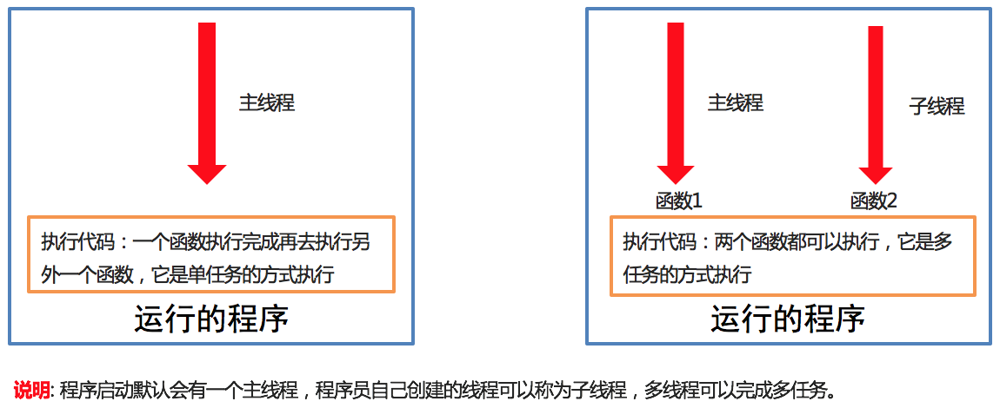
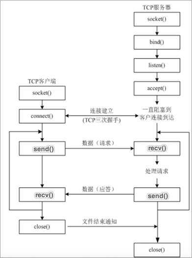
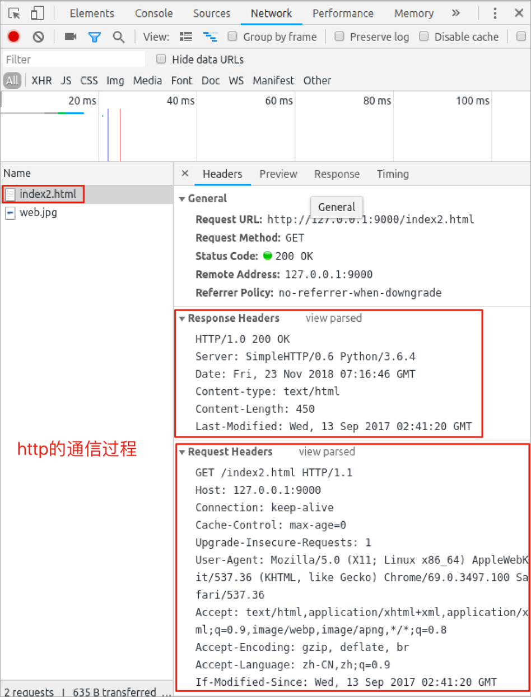
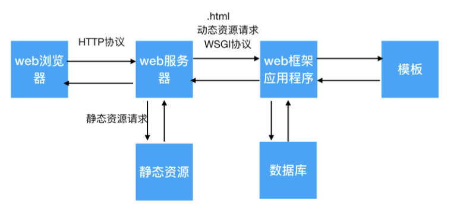
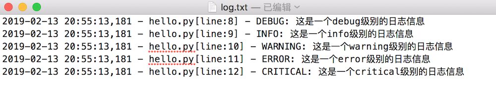

# 多任务编程

## 多任务的介绍

### 1. 提问

**利用现学知识能够让两个函数或者方法同时执行吗?**

不能，因为之前所写的程序都是**单任务的**，也就是说一个函数或者方法执行完成另外一个函数或者方法才能执行，要想实现这种操作就需要使用**多任务**。
多任务的最大好处是**充分利用CPU资源，提高程序的执行效率**。

### 2. 多任务的执行方式

- 并发
- 并行

**并发:**

在一段时间内**交替**去执行任务。

**例如:**

对于单核cpu处理多任务,操作系统轮流**让各个软件交替执行**，假如:软件1执行0.01秒，切换到软件2，软件2执行0.01秒，再切换到软件3，执行0.01秒……这样反复执行下去。表面上看，每个软件都是交替执行的，但是，由于CPU的执行速度实在是太快了，我们感觉就像这些软件都在同时执行一样，这里需要注意单核cpu是并发的执行多任务的。

**并行:**

对于多核cpu处理多任务，操作系统会给cpu的每个内核安排一个执行的软件，**多个内核是真正的一起执行软件**。这里需要注意**多核cpu是并行的执行多任务，始终有多个软件一起执行**。

在 Python 中处理 CPU 密集型任务时，应该优先选择多进程。当涉及到 I/O 密集型任务时，可以考虑使用多线程。


## 进程

### 1. 进程的介绍

在Python程序中，想要实现多任务可以使用进程来完成，进程是实现多任务的一种方式。

### 2. 进程的概念

一个正在运行的程序或者软件就是一个进程，**它是操作系统进行资源分配的基本单位**，也就是说每启动一个进程，操作系统都会给其分配一定的运行资源(内存资源)保证进程的运行。

比如:现实生活中的公司可以理解成是一个进程，公司提供办公资源(电脑、办公桌椅等)，真正干活的是员工，员工可以理解成线程。

**注意:**

**一个程序运行后至少有一个进程，一个进程默认有一个线程**，进程里面可以创建多个线程，**线程是依附在进程里面的，没有进程就没有线程**。

### 3. 进程的作用

**单进程效果图:**


**多进程效果图:**


**说明:**

多进程可以完成多任务，每个进程就好比一家独立的公司，每个公司都各自在运营，每个进程也各自在运行，执行各自的任务。


## 多进程的使用

### 1 导入进程包

```py
import multiprocessing #导入进程包
```

### 2. Process进程类的说明

**Process([group [, target [, name [, args [, kwargs]]]]])**

- group：指定进程组，目前只能使用None
- target：执行的目标任务名，即需要被执行的函数
- name：进程名字
- args：以`元组`方式给执行任务传参
- kwargs：以`字典`方式给执行任务传参

**Process创建的实例对象的常用方法:**

- start()：启动子进程实例（创建子进程）
- join()：等待子进程执行结束
- terminate()：不管任务是否完成，立即终止子进程

**Process创建的实例对象的常用属性:**

name：当前进程的别名，默认为Process-N（N为从1开始递增的整数）

### 3. 多进程完成多任务的代码

```py
import multiprocessing
import time

# 跳舞任务
def dance():
    for i in range(5):
        print("跳舞中...")
        time.sleep(0.2)

# 唱歌任务
def sing():
    for i in range(5):
        print("唱歌中...")
        time.sleep(0.2)

if __name__ == '__main__':
    # 创建跳舞的子进程
    # group: 表示进程组，目前只能使用None
    # target: 表示执行的目标任务名(函数名、方法名)
    # name: 进程名称, 默认是Process-1, .....
    dance_process = multiprocessing.Process(target=dance, name="myprocess1") # 创建子进程对象
    sing_process = multiprocessing.Process(target=sing) # 创建子进程对象

    # 启动子进程执行对应的任务
    dance_process.start()
    sing_process.start()
```

**执行结果:**

```py
唱歌中...
跳舞中...
唱歌中...
跳舞中...
唱歌中...
跳舞中...
唱歌中...
```


## 获取进程编号

### 1. 获取进程编号的目的

**获取进程编号的目的是验证主进程和子进程的关系，可以得知子进程是由那个主进程创建出来的。**

获取进程编号的两种操作

- 获取当前进程编号
- 获取当前父进程编号

### 2. 获取当前进程编号

**os.getpid()** 表示获取当前进程编号

**示例代码:**

```py
import multiprocessing
import time
import os

# 跳舞任务
def dance():
    print("dance:", os.getpid()) # 获取当前进程的编号
    print("dance:", multiprocessing.current_process()) # 获取当前进程
    for i in range(5):
        print("跳舞中...")
        time.sleep(0.2)
        os.kill(os.getpid(), 9)  # 扩展:根据进程编号杀死指定进程

# 唱歌任务
def sing():
    print("sing:", os.getpid()) # 获取当前进程的编号
    print("sing:", multiprocessing.current_process()) # 获取当前进程
    for i in range(5):
        print("唱歌中...")
        time.sleep(0.2)

if __name__ == '__main__':
    print("main:", os.getpid()) # 获取当前进程的编号
    print("main:", multiprocessing.current_process()) # 获取当前进程
    # 创建跳舞的子进程
    # group: 表示进程组，目前只能使用None
    # target: 表示执行的目标任务名(函数名、方法名)
    # name: 进程名称, 默认是Process-1, .....
    dance_process = multiprocessing.Process(target=dance, name="myprocess1")
    sing_process = multiprocessing.Process(target=sing)

    # 启动子进程执行对应的任务
    dance_process.start()
    sing_process.start()
```

**执行结果:**

```py
main: 70763
main: <_MainProcess(MainProcess, started)>
dance: 70768
dance: <Process(myprocess1, started)>
跳舞中...
sing: 70769
sing: <Process(Process-2, started)>
唱歌中...
唱歌中...
唱歌中...
唱歌中...
唱歌中...
```

### 3. 获取当前父进程编号

**os.getppid()** 表示获取当前父进程编号

**示例代码:**

```py
import multiprocessing
import time
import os

# 跳舞任务
def dance():
    print("dance:", os.getpid()) # 获取当前进程的编号
    print("dance:", multiprocessing.current_process()) # 获取当前进程
    print("dance的父进程编号:", os.getppid()) # 获取父进程的编号
    for i in range(5):
        print("跳舞中...")
        time.sleep(0.2)
        os.kill(os.getpid(), 9) # 扩展:根据进程编号杀死指定进程

# 唱歌任务
def sing():
    print("sing:", os.getpid()) # 获取当前进程的编号
    print("sing:", multiprocessing.current_process()) # 获取当前进程
    print("sing的父进程编号:", os.getppid()) # 获取父进程的编号
    for i in range(5):
        print("唱歌中...")
        time.sleep(0.2)

if __name__ == '__main__':
    print("main:", os.getpid()) # 获取当前进程的编号
    print("main:", multiprocessing.current_process()) # 获取当前进程
    # 创建跳舞的子进程
    # group: 表示进程组，目前只能使用None
    # target: 表示执行的目标任务名(函数名、方法名)
    # name: 进程名称, 默认是Process-1, .....
    dance_process = multiprocessing.Process(target=dance, name="myprocess1")
    sing_process = multiprocessing.Process(target=sing)

    # 启动子进程执行对应的任务
    dance_process.start()
    sing_process.start()
```

```python
main: 70860
main: <_MainProcess(MainProcess, started)>
dance: 70861
dance: <Process(myprocess1, started)>
dance的父进程编号: 70860
跳舞中...
sing: 70862
sing: <Process(Process-2, started)>
sing的父进程编号: 70860
唱歌中...
唱歌中...
唱歌中...
唱歌中...
唱歌中...
```


## 进程执行带有参数的任务

### 1. 进程执行带有参数的任务的介绍

前面我们使用进程执行的任务是没有参数的，假如我们使用进程执行的任务带有参数，如何给函数传参呢?

Process类执行任务并给任务传参数有两种方式:

- args 表示以元组的方式给执行任务传参
- kwargs 表示以字典方式给执行任务传参

### 2. args参数的使用

**示例代码:**

```py
import multiprocessing
import time

# 带有参数的任务
def task(count):
    for i in range(count):
        print("任务执行中..")
        time.sleep(0.2)
    else:
        print("任务执行完成")


if __name__ == '__main__':
    # 创建子进程
    # args: 以元组的方式给任务传入参数
    sub_process = multiprocessing.Process(target=task, args=(5,))
    sub_process.start()
```

**执行结果:**

```py
任务执行中..
任务执行中..
任务执行中..
任务执行中..
任务执行中..
任务执行完成
```

### 3. kwargs参数的使用

**示例代码:**

```py
import multiprocessing
import time

# 带有参数的任务
def task(count):
    for i in range(count):
        print("任务执行中..")
        time.sleep(0.2)
    else:
        print("任务执行完成")

if __name__ == '__main__':
    # 创建子进程
    # kwargs: 表示以字典方式传入参数
    sub_process = multiprocessing.Process(target=task, kwargs={"count": 3})
    sub_process.start()
```

**执行结果:**

```py
任务执行中..
任务执行中..
任务执行中..
任务执行完成
```


## 进程的注意点

### 1. 进程的注意点介绍

1. 进程之间不共享全局变量
2. 主进程会等待所有的子进程执行结束再结束

### 2. 进程之间不共享全局变量

```py
import multiprocessing
import time

g_list = list() # 定义全局变量

# 添加数据的任务
def add_data():
    for i in range(5):
        g_list.append(i)
        print("add:", i)
        time.sleep(0.2)
    print("add_data:", g_list) # 代码执行到此，说明数据添加完成

def read_data():
    print("read_data", g_list)

if __name__ == '__main__':
    add_data_process = multiprocessing.Process(target=add_data)  # 创建添加数据的子进程
    read_data_process = multiprocessing.Process(target=read_data) # 创建读取数据的子进程

    add_data_process.start() # 启动子进程执行对应的任务
    add_data_process.join() # 主进程等待添加数据的子进程执行完成以后程序再继续往下执行，读取数据
    read_data_process.start()

    print("main:", g_list)
    # 总结: 多进程之间不共享全局变量
```

**执行结果:**

```py
add: 0
add: 1
add: 2
add: 3
add: 4
add_data: [0, 1, 2, 3, 4]
main: []
read_data []
```

**进程之间不共享全局变量的解释效果图:**


### 3. 进程之间共享全局变量方法

`multiprocessing` 模块提供了一些机制来在进程之间共享数据，例如使用 `multiprocessing.Queue`、`multiprocessing.Pipe`、`multiprocessing.Array` 和 `multiprocessing.Value` 等。通过这些工具，你可以在多个进程之间安全地传递和共享数据。

以下是一个简单的示例，展示如何使用 `multiprocessing.Queue` 在两个子进程之间共享数据：

```python
import multiprocessing

def producer(queue):
    for i in range(5):
        queue.put(i)
        print(f"Producer put {i} into queue")

def consumer(queue):
    while not queue.empty():
        item = queue.get()
        print(f"Consumer got {item} from queue")

if __name__ == "__main__":
    queue = multiprocessing.Queue()
    
    producer_process = multiprocessing.Process(target=producer, args=(queue,))
    consumer_process = multiprocessing.Process(target=consumer, args=(queue,))
    
    producer_process.start()
    consumer_process.start()
    
    producer_process.join()
    consumer_process.join()
```

### 4. 主进程会等待所有的子进程执行结束再结束

假如我们现在创建一个子进程，这个子进程执行完大概需要2秒钟，现在让主进程执行0.5秒钟就退出程序，查看一下执行结果，示例代码如下:

```py
import multiprocessing
import time

# 定义进程所需要执行的任务
def task():
    for i in range(10):
        print("任务执行中...")
        time.sleep(0.2)

if __name__ == '__main__':
    sub_process = multiprocessing.Process(target=task) # 创建子进程
    sub_process.start()

    time.sleep(0.5) # 主进程延时0.5秒钟
    print("over")
    exit()
    # 总结： 主进程会等待所有的子进程执行完成以后程序再退出
```

**执行结果:**

```py
任务执行中...
任务执行中...
任务执行中...
over
任务执行中...
任务执行中...
任务执行中...
任务执行中...
任务执行中...
任务执行中...
任务执行中...
```

**说明:**

通过上面代码的执行结果，我们可以得知: **主进程会等待所有的子进程执行结束再结束**

假如我们就让主进程执行0.5秒钟，子进程就销毁不再执行，那怎么办呢?

- 我们可以设置**守护主进程** 或者 在主进程退出之前 **让子进程销毁**

**守护主进程:**

- 守护主进程就是主进程退出子进程销毁不再执行

**子进程销毁:**

- 子进程执行结束

**保证主进程正常退出的示例代码:**

```py
import multiprocessing
import time

# 定义进程所需要执行的任务
def task():
    for i in range(10):
        print("任务执行中...")
        time.sleep(0.2)

if __name__ == '__main__':
    sub_process = multiprocessing.Process(target=task) # 创建子进程
    # 设置守护主进程，主进程退出子进程直接销毁，子进程的生命周期依赖与主进程
    # sub_process.daemon = True
    sub_process.start()

    time.sleep(0.5)
    print("over")
    
    sub_process.terminate() # 让子进程销毁
    exit()
    # 总结： 主进程会等待所有的子进程执行完成以后程序再退出
    # 如果想要主进程退出子进程销毁，可以设置守护主进程或者在主进程退出之前让子进程销毁
```

**执行结果:**

```py
任务执行中...
任务执行中...
任务执行中...
over
```

### 5. 主进程会等待所有的子进程执行结束再结束的小结

- 为了保证子进程能够正常的运行，主进程会等所有的子进程执行完成以后再销毁，设置守护主进程的目的是**主进程退出子进程销毁，不让主进程再等待子进程去执行**。
- 设置守护主进程方式： **子进程对象.daemon = True**
- 销毁子进程方式： **子进程对象.terminate()**


## 线程

### 1. 线程的介绍

在Python中，想要实现多任务除了使用进程，还可以使用线程来完成，线程是实现多任务的另外一种方式。

### 2. 线程的概念

线程是进程中执行代码的一个分支，每个执行分支（线程）要想工作执行代码需要cpu进行调度 ，也就是说线程是cpu调度的基本单位，每个进程至少都有一个线程，而这个线程就是我们通常说的主线程。

### 3. 线程的作用

多线程可以完成多任务

**多线程效果图:**

## 多线程的使用

### 1. 导入线程模块

```py
import threading # 导入线程模块
```

### 2. 线程类Thread参数说明

Thread([group [, target [, name [, args [, kwargs]]]]])

- group: 线程组，目前只能使用None
- target: 执行的目标任务名
- args: 以元组的方式给执行任务传参
- kwargs: 以字典方式给执行任务传参
- name: 线程名，一般不用设置

### 3. 启动线程

启动线程使用start方法

### 4. 多线程完成多任务的代码

```py
import threading
import time

# 唱歌任务
def sing():
    # 扩展： 获取当前线程
    # print("sing当前执行的线程为：", threading.current_thread())
    for i in range(3):
        print("正在唱歌...%d" % i)
        time.sleep(1)

# 跳舞任务
def dance():
    # 扩展： 获取当前线程
    # print("dance当前执行的线程为：", threading.current_thread())
    for i in range(3):
        print("正在跳舞...%d" % i)
        time.sleep(1)


if __name__ == '__main__':
    # 扩展： 获取当前线程
    # print("当前执行的线程为：", threading.current_thread())
    # 创建唱歌的线程
    # target： 线程执行的函数名
    sing_thread = threading.Thread(target=sing)

    # 创建跳舞的线程
    dance_thread = threading.Thread(target=dance)

    # 开启线程
    sing_thread.start()
    dance_thread.start()
```

**执行结果:**

```py
正在唱歌...0
正在跳舞...0
正在唱歌...1
正在跳舞...1
正在唱歌...2
正在跳舞...2
```


## 线程执行带有参数的任务

### 1. 线程执行带有参数的任务的介绍

前面我们使用线程执行的任务是没有参数的，假如我们使用线程执行的任务带有参数，如何给函数传参呢?

Thread类执行任务并给任务传参数有两种方式:

- args 表示以元组的方式给执行任务传参
- kwargs 表示以字典方式给执行任务传参

### 2. args参数的使用

**示例代码:**

```py
import threading
import time

# 带有参数的任务
def task(count):
    for i in range(count):
        print("任务执行中..")
        time.sleep(0.2)
    else:
        print("任务执行完成")

if __name__ == '__main__':
    # 创建子线程
    # args: 以元组的方式给任务传入参数
    sub_thread = threading.Thread(target=task, args=(5,))
    sub_thread.start()
```

**执行结果:**

```py
任务执行中..
任务执行中..
任务执行中..
任务执行中..
任务执行中..
任务执行完成
```

### 3. kwargs参数的使用

**示例代码:**

```py
import threading
import time

# 带有参数的任务
def task(count):
    for i in range(count):
        print("任务执行中..")
        time.sleep(0.2)
    else:
        print("任务执行完成")

if __name__ == '__main__':
    # 创建子线程
    # kwargs: 表示以字典方式传入参数
    sub_thread = threading.Thread(target=task, kwargs={"count": 3})
    sub_thread.start()
```

**执行结果:**

```py
任务执行中..
任务执行中..
任务执行中..
任务执行完成
```

## 线程的注意点

### 1. 线程的注意点介绍

1. 线程之间执行是无序的
2. 主线程会等待所有的子线程执行结束再结束
3. 线程之间共享全局变量
4. 线程之间共享全局变量数据出现错误问题

### 2. 线程之间执行是无序的

```py
import threading
import time

def task():
    time.sleep(1)
    print("当前线程:", threading.current_thread().name)

if __name__ == '__main__':
   for _ in range(5):
       sub_thread = threading.Thread(target=task)
       sub_thread.start()
```

**执行结果:**

```py
当前线程: Thread-1
当前线程: Thread-2
当前线程: Thread-4
当前线程: Thread-5
当前线程: Thread-3
```

**说明:**

- 线程之间执行是无序的，它是由cpu调度决定的 ，cpu调度哪个线程，哪个线程就先执行，没有调度的线程不能执行。
- 进程之间执行也是无序的，它是由操作系统调度决定的，操作系统调度哪个进程，哪个进程就先执行，没有调度的进程不能执行。

### 3. 主线程会等待所有的子线程执行结束再结束

假如我们现在创建一个子线程，这个子线程执行完大概需要2.5秒钟，现在让主线程执行1秒钟就退出程序，查看一下执行结果，示例代码如下:

```py
import threading
import time

def show_info(): # 测试主线程是否会等待子线程执行完成以后程序再退出
    for i in range(5):
        print("test:", i)
        time.sleep(0.5)

if __name__ == '__main__':
    sub_thread = threading.Thread(target=show_info)
    sub_thread.start()
   
    time.sleep(1)  # 主线程延时1秒
    print("over")
```

**执行结果:**

```py
test: 0
test: 1
over
test: 2
test: 3
test: 4
```

**说明:**

通过上面代码的执行结果，我们可以得知: **主线程会等待所有的子线程执行结束再结束**

假如我们就让主线程执行1秒钟，子线程就销毁不再执行，那怎么办呢?

- 我们可以设置**守护主线程**

**守护主线程:**

- 守护主线程就是主线程退出子线程销毁不再执行

**设置守护主线程有两种方式：**

1. threading.Thread(target=show_info, daemon=True)
2. 线程对象.setDaemon(True)

**设置守护主线程的示例代码:**

```py
import threading
import time

def show_info(): # 测试主线程是否会等待子线程执行完成以后程序再退出
    for i in range(5):
        print("test:", i)
        time.sleep(0.5)

if __name__ == '__main__':
    # 创建子线程守护主线程 
    # daemon=True 守护主线程
    # 守护主线程方式1
    sub_thread = threading.Thread(target=show_info, daemon=True)
    # 设置成为守护主线程，主线程退出后子线程直接销毁不再执行子线程的代码
    # 守护主线程方式2
    # sub_thread.setDaemon(True)
    sub_thread.start()

    time.sleep(1) # 主线程延时1秒
    print("over")
```

**执行结果:**

```py
test: 0
test: 1
over
```

### 3. 线程之间共享全局变量

**需求:**

1. 定义一个列表类型的全局变量
2. 创建两个子线程分别执行向全局变量添加数据的任务和向全局变量读取数据的任务
3. 查看线程之间是否共享全局变量数据

```py
import threading
import time

my_list = list() # 定义全局变量

def write_data(): # 写入数据任务
    for i in range(5):
        my_list.append(i)
        time.sleep(0.1)
    print("write_data:", my_list)

def read_data(): # 读取数据任务
    print("read_data:", my_list)

if __name__ == '__main__':
    write_thread = threading.Thread(target=write_data)  # 创建写入数据的线程
    read_thread = threading.Thread(target=read_data) # 创建读取数据的线程
    
    write_thread.start()
    # 延时
    # time.sleep(1)
    # 主线程等待写入线程执行完成以后代码在继续往下执行
    write_thread.join()
    print("开始读取数据啦")
    read_thread.start()
```

**执行结果:**

```py
write_data: [0, 1, 2, 3, 4]
开始读取数据啦
read_data: [0, 1, 2, 3, 4]
```

### 4. 线程之间共享全局变量数据出现错误问题

**需求:**

1. 定义两个函数，实现循环100万次，每循环一次给全局变量加1
2. 创建两个子线程执行对应的两个函数，查看计算后的结果

```py
import threading

g_num = 0 # 定义全局变量

# 循环一次给全局变量加1
def sum_num1():
    for i in range(1000000):
        global g_num # 声明在函数内部要修改的变量，如果在函数内部要修改全局变量的值，需要使用 global 关键字显式声明。
        g_num += 1
    print("sum1:", g_num)

# 循环一次给全局变量加1
def sum_num2():
    for i in range(1000000):
        global g_num
        g_num += 1
    print("sum2:", g_num)

if __name__ == '__main__':
    # 创建两个线程
    first_thread = threading.Thread(target=sum_num1)
    second_thread = threading.Thread(target=sum_num2)

    first_thread.start() # 启动线程
    second_thread.start() # 启动线程
```

**执行结果:**

```py
sum1: 1210949
sum2: 1496035
```

**注意点:**

**多线程同时对全局变量操作数据发生了错误**

**错误分析:**

两个线程first_thread和second_thread都要对全局变量g_num(默认是0)进行加1运算，但是由于是多线程同时操作，有可能出现下面情况：

1. 在g_num=0时，first_thread取得g_num=0。此时系统把first_thread调度为”sleeping”状态，把second_thread转换为”running”状态，t2也获得g_num=0
2. 然后second_thread对得到的值进行加1并赋给g_num，使得g_num=1
3. 然后系统又把second_thread调度为”sleeping”，把first_thread转为”running”。线程t1又把它之前得到的0加1后赋值给g_num。
4. 这样导致虽然first_thread和first_thread都对g_num加1，但结果仍然是g_num=1

**全局变量数据错误的解决办法:**

线程同步: 保证同一时刻只能有一个线程去操作全局变量 同步: 就是协同步调，按预定的先后次序进行运行。如:你说完，我再说, 好比现实生活中的对讲机

线程同步的方式:

1. **线程等待(join)**
2. **互斥锁**

**线程等待的示例代码:**

```py
import threading

g_num = 0 # 定义全局变量

# 循环1000000次每次给全局变量加1
def sum_num1():
    for i in range(1000000):
        global g_num
        g_num += 1
    print("sum1:", g_num)

# 循环1000000次每次给全局变量加1
def sum_num2():
    for i in range(1000000):
        global g_num
        g_num += 1
    print("sum2:", g_num)

if __name__ == '__main__':
    # 创建两个线程
    first_thread = threading.Thread(target=sum_num1)
    second_thread = threading.Thread(target=sum_num2)

    # 启动线程
    first_thread.start()
    # 主线程等待第一个线程执行完成以后代码再继续执行，让其执行第二个线程
    # 线程同步： 一个任务执行完成以后另外一个任务才能执行，同一个时刻只有一个任务在执行
    first_thread.join()
    # 启动线程
    second_thread.start()
```

**执行结果:**

```py
sum1: 1000000
sum2: 2000000
```

## 互斥锁

### 1.互斥锁的概念

互斥锁: 对共享数据进行锁定，保证同一时刻只能有一个线程去操作。

注意:

- 互斥锁是**多个线程一起去抢**，抢到锁的线程先执行，没有抢到锁的线程需要等待，等互斥锁使用完释放后，其它等待的线程再去抢这个锁。

### 3. 互斥锁的使用

threading模块中定义了Lock变量，这个变量本质上是一个函数，通过调用这个函数可以获取一把互斥锁。

**互斥锁使用步骤:**

```py
mutex = threading.Lock()	# 创建锁
mutex.acquire() # 上锁

...这里编写代码能保证同一时刻只能有一个线程去操作, 对共享数据进行锁定...

mutex.release() # 释放锁
```

**注意点:**

- **acquire和release方法之间的代码同一时刻只能有一个线程去操作**
- **如果在调用acquire方法的时候 其他线程已经使用了这个互斥锁，那么此时acquire方法会堵塞，直到这个互斥锁释放后才能再次上锁。**

### 4. 使用互斥锁完成2个线程对同一个全局变量各加100万次的操作

```py
import threading

g_num = 0 # 定义全局变量
lock = threading.Lock() # 创建全局互斥锁

# 循环一次给全局变量加1
def sum_num1():
    lock.acquire() # 上锁
    for i in range(1000000):
        global g_num
        g_num += 1
    print("sum1:", g_num)
    lock.release() # 释放锁

# 循环一次给全局变量加1
def sum_num2():
    # 上锁
    lock.acquire()
    for i in range(1000000):
        global g_num
        g_num += 1
    print("sum2:", g_num)
    lock.release() # 释放锁

if __name__ == '__main__':
    # 创建两个线程
    first_thread = threading.Thread(target=sum_num1)
    second_thread = threading.Thread(target=sum_num2)
    # 启动线程
    first_thread.start()
    second_thread.start()
    # 提示：加上互斥锁，那个线程抢到这个锁我们决定不了，那线程抢到锁那个线程先执行，没有抢到的线程需要等待
    # 加上互斥锁多任务瞬间变成单任务，性能会下降，也就是说同一时刻只能有一个线程去执行
```

**执行结果:**

```py
sum1: 1000000
sum2: 2000000
```

**说明:**

通过执行结果可以地址**互斥锁能够保证多个线程访问共享数据不会出现数据错误问题**

## 死锁

### 1. 死锁的概念

死锁: 一直等待对方释放锁的情景就是死锁

**死锁的结果**

- 会造成应用程序的停止响应，不能再处理其它任务了。

### 2. 死锁示例

**需求:**

根据下标在列表中取值, 保证同一时刻只能有一个线程去取值

```py
import threading
import time

lock = threading.Lock() # 创建互斥锁

def get_value(index): # 根据下标去取值， 保证同一时刻只能有一个线程去取值
    lock.acquire() # 上锁
    print(threading.current_thread())
    my_list = [3,6,8,1]
    if index >= len(my_list): # 判断下标释放越界
        print("下标越界:", index)
        return
    value = my_list[index]
    print(value)
    time.sleep(0.2)
    lock.release() # 释放锁

if __name__ == '__main__':
    # 模拟大量线程去执行取值操作
    for i in range(30):
        sub_thread = threading.Thread(target=get_value, args=(i,))
        sub_thread.start()
```

### 3. 避免死锁

- 在合适的地方释放锁

```py
import threading
import time

lock = threading.Lock() # 创建互斥锁

# 根据下标去取值， 保证同一时刻只能有一个线程去取值
def get_value(index):
    lock.acquire()   # 上锁
    print(threading.current_thread())
    my_list = [3,6,8,1]
    if index >= len(my_list):
        print("下标越界:", index)
        lock.release()  # 当下标越界需要释放锁，让后面的线程还可以取值
        return
    value = my_list[index]
    print(value)
    time.sleep(0.2)
    lock.release()  # 释放锁

if __name__ == '__main__':
    for i in range(30):  # 模拟大量线程去执行取值操作
        sub_thread = threading.Thread(target=get_value, args=(i,))
        sub_thread.start()
```


## 进程和线程的对比

### 关系对比

1. 线程是依附在进程里面的，没有进程就没有线程。
2. 一个进程默认提供一条线程，进程可以创建多个线程。


### 区别对比

1. 进程之间不共享全局变量
2. 线程之间共享全局变量，但是要注意资源竞争的问题，解决办法: 互斥锁或者线程同步
3. 创建进程的资源开销要比创建线程的资源开销要大
4. 进程是操作系统资源分配的基本单位，线程是CPU调度的基本单位
5. 线程不能够独立执行，必须依存在进程中
6. 多进程开发比单进程多线程开发稳定性要强

### 优缺点对比

- 进程优缺点:
  - 优点：可以用多核
  - 缺点：资源开销大
- 线程优缺点:
  - 优点：资源开销小
  - 缺点：不能使用多核


# 网络编程

## socket 的介绍

### 1. 问题思考

到目前为止我们学习了 ip 地址和端口号还有 tcp 传输协议，为了保证数据的完整性和可靠性我们使用 tcp 传输协议进行数据的传输，为了能够找到对应设备我们需要使用 ip 地址，为了区别某个端口的应用程序接收数据我们需要使用端口号，那么通信数据是如何完成传输的呢？	使用 **socket** 来完成

### 2. socket 的概念

socket (简称 套接字) 是**进程之间通信一个工具**，好比现实生活中的**插座**，所有的家用电器要想工作都是基于插座进行，**进程之间想要进行网络通信需要基于这个 socket**。

**插座效果图:**


**socket 效果图:**


### 3. socket 的作用

负责**进程之间的网络数据传输**，好比数据的搬运工。 不夸张的说，只要跟**网络相关的应用程序或者软件都使用到了 socket** 。


## TCP 网络应用程序开发流程

### 1. TCP 网络应用程序开发流程的介绍

TCP 网络应用程序开发分为:

- TCP 客户端程序开发
- TCP 服务端程序开发

**说明:**

客户端程序是指运行在**用户设备上的程序** 服务端程序是指运行在**服务器设备上的程序**，专门为客户端提供数据服务。

### 2. TCP 客户端程序开发流程的介绍



**步骤说明:**

1. 创建客户端套接字对象
2. 和服务端套接字建立连接
3. 发送数据
4. 接收数据
5. 关闭客户端套接字

### 3. TCP 服务端程序开发流程的介绍


**步骤说明:**

1. 创建服务端端套接字对象
2. 绑定端口号
3. 设置监听
4. 等待接受客户端的连接请求
5. 接收数据
6. 发送数据
7. 关闭套接字

## TCP 客户端程序开发

### 1. 开发 TCP 客户端程序开发步骤回顾

1. 创建客户端套接字对象
2. 和服务端套接字建立连接
3. 发送数据
4. 接收数据
5. 关闭客户端套接字

### 2. socket 类的介绍

```python
import socket # 导入 socket 模块
socket.socket(AddressFamily, Type)  # 创建客户端 socket 对象
```

**参数说明:**

- AddressFamily 表示IP地址类型, 分为TPv4和IPv6
- Type 表示传输协议类型

**方法说明:**

- connect((host, port)) 表示和服务端套接字建立连接, host是服务器ip地址，port是应用程序的端口号
- send(data) 表示发送数据，data是二进制数据
- recv(buffersize) 表示接收数据, buffersize是每次接收数据的长度

### 3. TCP 客户端程序开发示例代码

```py
import socket

if __name__ == '__main__':
    # 创建tcp客户端套接字
    # 1. AF_INET：表示ipv4	# 2. SOCK_STREAM: tcp传输协议
    tcp_client_socket = socket.socket(socket.AF_INET, socket.SOCK_STREAM)
    tcp_client_socket.connect(("192.168.131.62", 8080))  # 和服务端应用程序建立连接
    # 代码执行到此，说明连接建立成功

    send_data = "你好服务端，我是客户端小黑!".encode("gbk") # 准备发送的数据
    tcp_client_socket.send(send_data)  # 发送数据
    recv_data = tcp_client_socket.recv(1024) # 接收数据, 这次接收的数据最大字节数是1024

    print(recv_data)  # 返回的直接是服务端程序发送的二进制数据

    recv_content = recv_data.decode("gbk") # 对数据进行解码
    print("接收服务端的数据为:", recv_content)

    tcp_client_socket.close() # 关闭套接字
```

**执行结果:**

```py
b'hello'
接收服务端的数据为: hello
```

**说明**

1. str.encode(编码格式) 表示把字符串编码成为二进制
2. data.decode(编码格式) 表示把二进制解码成为字符串


## TCP服务端程序开发

### 1. 开发 TCP 服务端程序开发步骤回顾

1. 创建服务端端套接字对象
2. 绑定端口号
3. 设置监听
4. 等待接受客户端的连接请求
5. 接收数据
6. 发送数据
7. 关闭套接字

### 2. socket 类的介绍

```python
import socket #  导入 socket 模块
socket.socket(AddressFamily, Type) # 创建服务端 socket 对象
```

**参数说明:**

- AddressFamily 表示IP地址类型, 分为TPv4和IPv6
- Type 表示传输协议类型

**方法说明:**

- bind((host, port)) 表示绑定端口号, host 是 ip 地址，port 是端口号，ip 地址一般不指定，表示本机的任何一个ip地址都可以。
- listen (backlog) 表示设置监听，backlog参数表示最大等待建立连接的个数。
- accept() 表示等待接受客户端的连接请求
- send(data) 表示发送数据，data 是二进制数据
- recv(buffersize) 表示接收数据, buffersize 是每次接收数据的长度

### 3. TCP 服务端程序开发示例代码

```py
import socket

if __name__ == '__main__':
    # 创建tcp服务端套接字
    tcp_server_socket = socket.socket(socket.AF_INET, socket.SOCK_STREAM)
    # 设置端口号复用，让程序退出端口号立即释放
    tcp_server_socket.setsockopt(socket.SOL_SOCKET, socket.SO_REUSEADDR, True) 
    tcp_server_socket.bind(("", 8989))  # 给程序绑定端口号
    # 设置监听
    # 128:最大等待建立连接的个数，提示：目前是单任务的服务端，同一时刻只能服务与一个客户端，后续使用多任务能够让服务端同时服务与多个客户端，不需要让客户端进行等待建立连接
    # listen后的这个套接字只负责接收客户端连接请求，不能收发消息，收发消息使用返回的这个新套接字来完成
    tcp_server_socket.listen(128)
    # 等待客户端建立连接的请求, 只有客户端和服务端建立连接成功代码才会解阻塞，代码才能继续往下执行
    # 1. 专门和客户端通信的套接字： service_client_socket	# 2. 客户端的ip地址和端口号： ip_port
    service_client_socket, ip_port = tcp_server_socket.accept()
    # 代码执行到此说明连接建立成功
    print("客户端的ip地址和端口号:", ip_port)
   
    recv_data = service_client_socket.recv(1024)  # 接收客户端发送的数据, 这次接收数据的最大字节数是1024
    recv_data_length = len(recv_data) # 获取数据的长度
    print("接收数据的长度为:", recv_data_length)
    
    recv_content = recv_data.decode("gbk") # 对二进制数据进行解码
    print("接收客户端的数据为:", recv_content)
    
    send_data = "ok, 问题正在处理中...".encode("gbk") # 准备发送的数据
    service_client_socket.send(send_data) # 发送数据给客户端
    service_client_socket.close()  # 关闭服务与客户端的套接字， 终止和客户端通信的服务
    tcp_server_socket.close() # 关闭服务端的套接字, 终止和客户端提供建立连接请求的服务
```

**执行结果:**

```py
客户端的ip地址和端口号: ('172.16.47.209', 52472)
接收数据的长度为: 5
接收客户端的数据为: hello
```

**说明:**

当客户端和服务端建立连接后，**服务端程序退出后端口号不会立即释放，需要等待大概1-2分钟。**

解决办法有两种:

1. 更换服务端端口号
2. 设置端口号复用(推荐大家使用)，也就是说让服务端程序退出后端口号立即释放。

设置端口号复用的代码如下:

```py
# 参数1: 表示当前套接字
# 参数2: 设置端口号复用选项
# 参数3: 设置端口号复用选项对应的值
tcp_server_socket.setsockopt(socket.SOL_SOCKET, socket.SO_REUSEADDR, True)
```


## TCP网络应用程序的注意点

1. 当 TCP 客户端程序想要和 TCP 服务端程序进行通信的时候必须要先**建立连接**
2. TCP 客户端程序一般不需要绑定端口号，因为客户端是主动发起建立连接的。
3. **TCP 服务端程序必须绑定端口号**，否则客户端找不到这个 TCP 服务端程序。
4. listen 后的套接字是被动套接字，**只负责接收新的客户端的连接请求，不能收发消息。**
5. 当 TCP 客户端程序和 TCP 服务端程序连接成功后， TCP 服务器端程序会产生一个**新的套接字**，收发客户端消息使用该套接字。
6. **关闭 accept 返回的套接字意味着和这个客户端已经通信完毕**。
7. **关闭 listen 后的套接字意味着服务端的套接字关闭了，会导致新的客户端不能连接服务端，但是之前已经接成功的客户端还能正常通信。**
8. **当客户端的套接字调用 close 后，服务器端的 recv 会解阻塞，返回的数据长度为0**，服务端可以通过返回数据的长度来判断客户端是否已经下线，反之**服务端关闭套接字，客户端的 recv 也会解阻塞，返回的数据长度也为0**。

## 案例-多任务版TCP服务端程序开发

### 1. 需求

目前我们开发的TCP服务端程序只能服务于一个客户端，如何开发一个多任务版的TCP服务端程序能够服务于多个客户端呢?

完成多任务，可以使用**线程**，比进程更加节省内存资源。

### 2. 具体实现步骤

1. 编写一个TCP服务端程序，循环等待接受客户端的连接请求
2. 当客户端和服务端建立连接成功，创建子线程，使用子线程专门处理客户端的请求，防止主线程阻塞
3. 把创建的子线程设置成为守护主线程，防止主线程无法退出。

### 3. 多任务版TCP服务端程序的示例代码:

```py
import socket
import threading

# 处理客户端的请求操作
def handle_client_request(service_client_socket, ip_port):
    # 循环接收客户端发送的数据
    while True:
        # 接收客户端发送的数据
        recv_data = service_client_socket.recv(1024)
        # 容器类型判断是否有数据可以直接使用if语句进行判断，如果容器类型里面有数据表示条件成立，否则条件失败
        # 容器类型: 列表、字典、元组、字符串、set、range、二进制数据
        if recv_data:
            print(recv_data.decode("gbk"), ip_port)
            # 回复
            service_client_socket.send("ok，问题正在处理中...".encode("gbk"))

        else:
            print("客户端下线了:", ip_port)
            break
    
    service_client_socket.close() # 终止和客户端进行通信


if __name__ == '__main__':
    # 创建tcp服务端套接字
    tcp_server_socket = socket.socket(socket.AF_INET, socket.SOCK_STREAM)
    # 设置端口号复用，让程序退出端口号立即释放
    tcp_server_socket.setsockopt(socket.SOL_SOCKET, socket.SO_REUSEADDR, True)
    tcp_server_socket.bind(("", 9090)) # 绑定端口号
    tcp_server_socket.listen(128) # 设置监听, listen后的套接字是被动套接字，只负责接收客户端的连接请求
    
    while True: # 循环等待接收客户端的连接请求
        service_client_socket, ip_port = tcp_server_socket.accept() # 等待接收客户端的连接请求
        print("客户端连接成功:", ip_port)
        # 当客户端和服务端建立连接成功以后，需要创建一个子线程，不同子线程负责接收不同客户端的消息
        sub_thread = threading.Thread(target=handle_client_request, args=(service_client_socket, ip_port))
        sub_thread.setDaemon(True) # 设置守护主线程
        sub_thread.start() # 启动子线程

    # tcp_server_socket.close() # tcp服务端套接字可以不需要关闭，因为服务端程序需要一直运行
```

**执行结果:**

```py
客户端连接成功: ('172.16.47.209', 51528)
客户端连接成功: ('172.16.47.209', 51714)
hello1 ('172.16.47.209', 51528)
hello2 ('172.16.47.209', 51714)
```

## socket之send和recv原理剖析

### 1. 认识TCP socket的发送和接收缓冲区

当创建一个TCP socket对象的时候会有一个**发送缓冲区**和一个**接收缓冲区**，**这个发送和接收缓冲区指的就是内存中的一片空间。**

### 2. send原理剖析

send是不是直接把数据发给服务端?

不是，要想发数据，必须得**通过网卡发送数据**，应用程序是无法直接通过网卡发送数据的，它需要调用操作系统接口，也就是说，应用程序把发送的数据先写入到**发送缓冲区**(内存中的一片空间)，再**由操作系统控制网卡把发送缓冲区的数据发送给服务端网卡** 。

### 3. recv原理剖析

recv是不是直接从客户端接收数据?

不是，**应用软件是无法直接通过网卡接收数据的**，它需要调用操作系统接口，**由操作系统通过网卡接收数据**，把接收的数据**写入到接收缓冲区**(内存中的一片空间），应用程序**再从接收缓存区获取客户端发送的数据**。

### 4. send和recv原理剖析图


**说明:**

- 发送数据是发送到发送缓冲区
- 接收数据是从接收缓冲区 获取


# HTTP协议和静态Web服务器

## 1. HTTP 协议的介绍

HTTP 协议的全称是(HyperText Transfer Protocol)，翻译过来就是**超文本传输协议**。

超文本是超级文本的缩写，是指超越文本限制或者超链接，比如:图片、音乐、视频、超链接等等都属于超文本。

HTTP 协议的制作者是**蒂姆·伯纳斯-李**，1991年设计出来的，**HTTP 协议设计之前目的是传输网页数据的，现在允许传输任意类型的数据**。

**传输 HTTP 协议格式的数据是基于 TCP 传输协议的，发送数据之前需要先建立连接。**

## 2. HTTP 协议的作用

它**规定了浏览器和 Web 服务器通信数据的格式，也就是说浏览器和web服务器通信需要使用http协议**。

## 3. 浏览器访问web服务器的通信过程

**通信效果图:**


## URL

### 1. URL的概念

URL的英文全拼是(Uniform Resoure Locator),表达的意思是统一资源定位符，通俗理解就是网络资源地址，也就是我们常说的网址。

### 2. URL的组成

**URL的样子:**

https://news.163.com/18/1122/10/E178J2O4000189FH.html

**URL的组成部分:**

1. **协议部分**: https://、http://、ftp://
2. **域名部分**: news.163.com
3. **资源路径部分**: /18/1122/10/E178J2O4000189FH.html

**域名:**

域名就是**IP地址的别名**，它是用点进行分割使用英文字母和数字组成的名字，**使用域名目的就是方便的记住某台主机IP地址**。

**URL的扩展:**

https://news.163.com/hello.html?page=1&count=10

- **查询参数部分**: ?page=1&count=10

**参数说明:**

- ? 后面的 page 表示第一个参数，后面的参数都使用 & 进行连接

## 查看HTTP协议的通信过程

### 1. 谷歌浏览器开发者工具的使用

首先需要安装Google Chrome浏览器，然后Windows和Linux平台按**F12**调出开发者工具, mac OS选择 视图 -> 开发者 -> 开发者工具或者直接使用 **alt+command+i** 这个快捷键，还有一个多平台通用的操作就是在**网页右击选择检查**。

**开发者工具的效果图:**


**开发者工具的标签选项说明:**

- 元素（Elements）：用于查看或修改HTML标签
- 控制台（Console）：执行js代码
- 源代码（Sources）：查看静态资源文件，断点调试JS代码
- 网络（Network）：查看http协议的通信过程

**开发者工具使用效果图:**


**开发者工具的使用说明:**

1. 点击Network标签选项
2. 在浏览器的地址栏输入百度的网址，就能看到请求百度首页的http的通信过程
3. **这里的每项记录都是请求+响应的一次过程**


## 搭建Python自带静态Web服务器

### 1. 静态Web服务器是什么？

可以**为发出请求的浏览器提供静态文档的程序**。

平时我们浏览百度新闻数据的时候，**每天的新闻数据都会发生变化，那访问的这个页面就是动态的**，而我们开发的是**静态的，页面的数据不会发生变化**。

### 2. 如何搭建Python自带的静态Web服务器

搭建Python自带的静态Web服务器使用 **python3 -m http.server 端口号**, 效果图如下:

```sh
root@lnb:~# python3 -m http.server 9000
Serving HTTP on 0.0.0.0 port 9000 (http://0.0.0.0:9000/) ...
```

**-m选项说明:**

-m表示**运行包里面的模块**，执行这个命令的时候，需要进入你**自己指定静态文件的目录**，然后通过浏览器就能访问对应的 html文件了，这样一个静态的web服务器就搭建好了。

### 3. 查看浏览器和搭建的静态Web服务器的通信过

查看http的通信过程,效果图如下:



## 静态Web服务器-返回固定页面数据

### 1. 开发自己的静态Web服务器

**实现步骤:**

1. 编写一个TCP服务端程序
2. 获取浏览器发送的http请求报文数据
3. 读取固定页面数据，把页面数据组装成HTTP响应报文数据发送给浏览器。
4. HTTP响应报文数据发送完成以后，关闭服务于客户端的套接字。

### 2. 静态Web服务器-返回固定页面数据的示例代码

```py
import socket

if __name__ == '__main__':
    # 创建tcp服务端套接字
    tcp_server_socket = socket.socket(socket.AF_INET, socket.SOCK_STREAM)
    # 设置端口号复用, 程序退出端口立即释放
    tcp_server_socket.setsockopt(socket.SOL_SOCKET, socket.SO_REUSEADDR, True)
    # 绑定端口号
    tcp_server_socket.bind(("", 9000))
    # 设置监听
    tcp_server_socket.listen(128)
    while True:
        new_socket, ip_port = tcp_server_socket.accept() # 等待接受客户端的连接请求
        recv_client_data = new_socket.recv(4096) # 代码执行到此，说明连接建立成功
        recv_client_content = recv_client_data.decode("utf-8")  # 对二进制数据进行解码
        print(recv_client_content)

        with open("static/index.html", "rb") as file:
            file_data = file.read()  # 读取文件数据

        response_line = "HTTP/1.1 200 OK\r\n" # 响应行
        response_header = "Server: PWS1.0\r\n"  # 响应头
        response_body = file_data  # 响应体

        # 拼接响应报文
        response_data = (response_line + response_header + "\r\n").encode("utf-8") + response_body
        new_socket.send(response_data)  # 发送数据
        new_socket.close()  # 关闭服务与客户端的套接字
```

## 静态Web服务器-返回指定页面数据

### 1. 静态Web服务器的问题


目前的Web服务器，不管用户访问什么页面，返回的都是固定页面的数据，接下来需要根据用户的请求返回指定页面的数据

**返回指定页面数据的实现步骤:**

1. 获取用户请求资源的路径
2. 根据请求资源的路径，读取指定文件的数据
3. 组装指定文件数据的响应报文，发送给浏览器
4. 判断请求的文件在服务端不存在，组装404状态的响应报文，发送给浏览器

### 2. 静态Web服务器-返回指定页面数据的示例代码

```py
import socket

def main():
    # 创建tcp服务端套接字
    tcp_server_socket = socket.socket(socket.AF_INET, socket.SOCK_STREAM)
    # 设置端口号复用, 程序退出端口立即释放
    tcp_server_socket.setsockopt(socket.SOL_SOCKET, socket.SO_REUSEADDR, True)
    tcp_server_socket.bind(("", 9000))  # 绑定端口号
    tcp_server_socket.listen(128) # 设置监听
    while True:
        new_socket, ip_port = tcp_server_socket.accept() # 等待接受客户端的连接请求
        recv_client_data = new_socket.recv(4096) # 代码执行到此，说明连接建立成功
        if len(recv_client_data) == 0:
            print("关闭浏览器了")
            new_socket.close()
            return

        recv_client_content = recv_client_data.decode("utf-8") # 对二进制数据进行解码
        print(recv_client_content)

        request_list = recv_client_content.split(" ", maxsplit=2) # 根据指定字符串进行分割， 最大分割次数指定2

        # 获取请求资源路径
        request_path = request_list[1]
        print(request_path)

        # 判断请求的是否是根目录，如果条件成立，指定首页数据返回
        if request_path == "/":
            request_path = "/index.html"

        try:
            with open("static" + request_path, "rb") as file: # 动态打开指定文件
                file_data = file.read() # 读取文件数据
        except Exception as e:
            # 请求资源不存在，返回404数据
            response_line = "HTTP/1.1 404 Not Found\r\n" # 响应行
            response_header = "Server: PWS1.0\r\n"  # 响应头
            with open("static/error.html", "rb") as file:
                file_data = file.read()
            
            response_body = file_data # 响应体
            response_data = (response_line + response_header + "\r\n").encode("utf-8") + response_body # 拼接响应报文
            new_socket.send(response_data) # 发送数据
        else:
            response_line = "HTTP/1.1 200 OK\r\n" # 响应行
            response_header = "Server: PWS1.0\r\n"  # 响应头
            response_body = file_data # 响应体
            response_data = (response_line + response_header + "\r\n").encode("utf-8") + response_body  # 拼接响应报文
            new_socket.send(response_data) # 发送数据
        finally:
            
            new_socket.close() # 关闭服务与客户端的套接字

if __name__ == '__main__':
    main()
```


## 静态Web服务器-多任务版

### 1. 静态Web服务器的问题

目前的Web服务器，不能支持多用户同时访问，只能一个一个的处理客户端的请求，那么如何开发多任务版的web服务器同时处理 多个客户端的请求?

可以使用**多线程**，比进程更加节省内存资源。

**多任务版web服务器程序的实现步骤:**

1. 当客户端和服务端建立连接成功，创建子线程，使用子线程专门处理客户端的请求，防止主线程阻塞。
2. 把创建的子线程设置成为守护主线程，防止主线程无法退出。

### 2. 静态Web服务器-多任务版的示例代码

```py
import socket
import threading

# 处理客户端的请求
def handle_client_request(new_socket):
    # 代码执行到此，说明连接建立成功
    recv_client_data = new_socket.recv(4096)
    if len(recv_client_data) == 0:
        print("关闭浏览器了")
        new_socket.close()
        return

    recv_client_content = recv_client_data.decode("utf-8") # 对二进制数据进行解码
    print(recv_client_content)
    
    request_list = recv_client_content.split(" ", maxsplit=2) # 根据指定字符串进行分割， 最大分割次数指定2
    # 获取请求资源路径
    request_path = request_list[1]
    print(request_path)

    # 判断请求的是否是根目录，如果条件成立，指定首页数据返回
    if request_path == "/":
        request_path = "/index.html"

    try:
        with open("static" + request_path, "rb") as file: # 动态打开指定文件
            file_data = file.read() # 读取文件数据
    except Exception as e:
        # 请求资源不存在，返回404数据
        response_line = "HTTP/1.1 404 Not Found\r\n"  # 响应行
        response_header = "Server: PWS1.0\r\n" # 响应头
        with open("static/error.html", "rb") as file:
            file_data = file.read()
        
        response_body = file_data # 响应体
        response_data = (response_line + response_header + "\r\n").encode("utf-8") + response_body # 拼接响应报文
        new_socket.send(response_data) # 发送数据
    else:
        response_line = "HTTP/1.1 200 OK\r\n" # 响应行
        response_header = "Server: PWS1.0\r\n" # 响应头
        response_body = file_data  # 响应体
        response_data = (response_line + response_header + "\r\n").encode("utf-8") + response_body # 拼接响应报文
        new_socket.send(response_data) # 发送数据
    finally:
        new_socket.close() # 关闭服务与客户端的套接字


# 程序入口函数
def main():
    # 创建tcp服务端套接字
    tcp_server_socket = socket.socket(socket.AF_INET, socket.SOCK_STREAM)
    # 设置端口号复用, 程序退出端口立即释放
    tcp_server_socket.setsockopt(socket.SOL_SOCKET, socket.SO_REUSEADDR, True)
    tcp_server_socket.bind(("", 9000)) # 绑定端口号
    tcp_server_socket.listen(128) # 设置监听

    while True:
        new_socket, ip_port = tcp_server_socket.accept() # 等待接受客户端的连接请求
        print(ip_port)
        # 当客户端和服务器建立连接程，创建子线程
        sub_thread = threading.Thread(target=handle_client_request, args=(new_socket,))
        sub_thread.setDaemon(True)  # 设置守护主线程
        sub_thread.start() # 启动子线程执行对应的任务

if __name__ == '__main__':
    main()
```

## 静态Web服务器-面向对象开发

### 1. 以面向对象的方式开发静态Web服务器

**实现步骤:**

1. 把提供服务的Web服务器抽象成一个类(HTTPWebServer)
2. 提供Web服务器的初始化方法，在初始化方法里面创建socket对象
3. 提供一个开启Web服务器的方法，让Web服务器处理客户端请求操作。

### 2. 静态Web服务器-面向对象开发的示例代码

```py
import socket
import threading

class HttpWebServer(object): # 定义web服务器类
    def __init__(self):
        tcp_server_socket = socket.socket(socket.AF_INET, socket.SOCK_STREAM) # 创建tcp服务端套接字
        tcp_server_socket.setsockopt(socket.SOL_SOCKET, socket.SO_REUSEADDR, True) # 设置端口号复用, 程序退出端口立即释放
        tcp_server_socket.bind(("", 9000)) # 绑定端口号
        tcp_server_socket.listen(128) # 设置监听
        self.tcp_server_socket = tcp_server_socket  # 保存创建成功的服务器套接字

    # 处理客户端的请求
    @staticmethod
    def handle_client_request(new_socket):
        recv_client_data = new_socket.recv(4096) # 代码执行到此，说明连接建立成功
        if len(recv_client_data) == 0:
            print("关闭浏览器了")
            new_socket.close()
            return

        recv_client_content = recv_client_data.decode("utf-8") # 对二进制数据进行解码
        print(recv_client_content)
        request_list = recv_client_content.split(" ", maxsplit=2) # 根据指定字符串进行分割， 最大分割次数指定2
        request_path = request_list[1] # 获取请求资源路径
        print(request_path)

        # 判断请求的是否是根目录，如果条件成立，指定首页数据返回
        if request_path == "/":
            request_path = "/index.html"

        try:
            with open("static" + request_path, "rb") as file: # 动态打开指定文件
                file_data = file.read() # 读取文件数据
        except Exception as e:
            # 请求资源不存在，返回404数据
            response_line = "HTTP/1.1 404 Not Found\r\n" # 响应行
            response_header = "Server: PWS1.0\r\n"  # 响应头
            with open("static/error.html", "rb") as file:
                file_data = file.read()
            response_body = file_data # 响应体

            # 拼接响应报文
            response_data = (response_line + response_header + "\r\n").encode("utf-8") + response_body
            new_socket.send(response_data) # 发送数据
        else:
            response_line = "HTTP/1.1 200 OK\r\n" # 响应行
            response_header = "Server: PWS1.0\r\n" # 响应头
            response_body = file_data  # 响应体

            # 拼接响应报文
            response_data = (response_line + response_header + "\r\n").encode("utf-8") + response_body
            new_socket.send(response_data)# 发送数据
        finally:
            
            new_socket.close() # 关闭服务与客户端的套接字

    def start(self): # 启动web服务器进行工作
        while True:
            # 等待接受客户端的连接请求
            new_socket, ip_port = self.tcp_server_socket.accept()
            # 当客户端和服务器建立连接程，创建子线程
            sub_thread = threading.Thread(target=self.handle_client_request, args=(new_socket,))
            sub_thread.setDaemon(True)  # 设置守护主线程
            sub_thread.start() # 启动子线程执行对应的任务


def main(): # 程序入口函数
    web_server = HttpWebServer() # 创建web服务器对象
    web_server.start() # 启动web服务器进行工作


if __name__ == '__main__':
    main()
```

## 静态Web服务器-命令行启动动态绑定端口号

### 1. 开发命令行启动动态绑定端口号的静态web服务器

**实现步骤:**

1. 获取执行python程序的终端命令行参数
2. 判断参数的类型，设置端口号必须是整型
3. 给Web服务器类的初始化方法添加一个端口号参数，用于绑定端口号

### 2. 静态Web服务器-命令行启动动态绑定端口号的示例代码

```py
import socket
import threading
import sys

class HttpWebServer(object): # 定义web服务器类
    def __init__(self, port):
        tcp_server_socket = socket.socket(socket.AF_INET, socket.SOCK_STREAM) # 创建tcp服务端套接字
        tcp_server_socket.setsockopt(socket.SOL_SOCKET, socket.SO_REUSEADDR, True) # 设置端口号复用, 程序退出端口立即释放
        tcp_server_socket.bind(("", port)) # 绑定端口号
        tcp_server_socket.listen(128)  # 设置监听
        self.tcp_server_socket = tcp_server_socket # 保存创建成功的服务器套接字

    # 处理客户端的请求
    @staticmethod
    def handle_client_request(new_socket):
        recv_client_data = new_socket.recv(4096)  # 代码执行到此，说明连接建立成功
        if len(recv_client_data) == 0:
            print("关闭浏览器了")
            new_socket.close()
            return

        recv_client_content = recv_client_data.decode("utf-8") # 对二进制数据进行解码
        print(recv_client_content)
        
        request_list = recv_client_content.split(" ", maxsplit=2) # 根据指定字符串进行分割， 最大分割次数指定2
        request_path = request_list[1] # 获取请求资源路径
        print(request_path)

        # 判断请求的是否是根目录，如果条件成立，指定首页数据返回
        if request_path == "/":
            request_path = "/index.html"

        try:
            with open("static" + request_path, "rb") as file: # 动态打开指定文件
                file_data = file.read() # 读取文件数据
        except Exception as e:
            # 请求资源不存在，返回404数据
            response_line = "HTTP/1.1 404 Not Found\r\n" # 响应行
            response_header = "Server: PWS1.0\r\n"  # 响应头
            with open("static/error.html", "rb") as file:
                file_data = file.read()
            response_body = file_data # 响应体
            # 拼接响应报文
            response_data = (response_line + response_header + "\r\n").encode("utf-8") + response_body
           
            new_socket.send(response_data)  # 发送数据
        else:
            response_line = "HTTP/1.1 200 OK\r\n" # 响应行
            response_header = "Server: PWS1.0\r\n" # 响应头
            response_body = file_data # 响应体
            # 拼接响应报文
            response_data = (response_line + response_header + "\r\n").encode("utf-8") + response_body
            new_socket.send(response_data) # 发送数据
        finally:
            new_socket.close() # 关闭服务与客户端的套接字

    def start(self): # 启动web服务器进行工作
        while True:
            # 等待接受客户端的连接请求
            new_socket, ip_port = self.tcp_server_socket.accept()
            # 当客户端和服务器建立连接程，创建子线程
            sub_thread = threading.Thread(target=self.handle_client_request, args=(new_socket,))
            sub_thread.setDaemon(True) # 设置守护主线程
            sub_thread.start() # 启动子线程执行对应的任务


def main(): # 程序入口函数
    print(sys.argv)
    if len(sys.argv) != 2: # 判断命令行参数是否等于2,
        print("执行命令如下: python3 xxx.py 8000")
        return

    if not sys.argv[1].isdigit():  # 判断字符串是否都是数字组成
        print("执行命令如下: python3 xxx.py 8000")
        return

    port = int(sys.argv[1]) # 获取终端命令行参数
    web_server = HttpWebServer(port) # 创建web服务器对象
    web_server.start()  # 启动web服务器进行工作


if __name__ == '__main__':
    main()
```


# 闭包

## 1. 闭包的介绍

我们前面已经学过了函数，我们知道当函数调用完，函数内定义的变量都销毁了，但是我们有时候需要保存函数内的这个变量，每次在这个变量的基础上完成一些列的操作，比如: 每次在这个变量的基础上和其它数字进行求和计算，那怎么办呢?

我们就可以通过咱们今天学习的**闭包**来解决这个需求。

**闭包的定义:**

在函数嵌套的前提下，内部函数使用了外部函数的变量，并且外部函数返回了内部函数，我们把这个**使用外部函数变量的内部函数称为闭包**。

## 2. 闭包的构成条件

通过闭包的定义，我们可以得知闭包的形成条件:

1. 在函数嵌套(函数里面再定义函数)的前提下
2. 内部函数使用了外部函数的变量(还包括外部函数的参数)
3. 外部函数返回了内部函数

## 3. 简单闭包的示例代码

```py
def func_out(num1): # 定义一个外部函数
    def func_inner(num2):  # 定义一个内部函数
        result = num1 + num2 # 内部函数使用了外部函数的变量(num1)
        print("结果是:", result)
    return func_inner  # 外部函数返回了内部函数，这里返回的内部函数就是闭包

f = func_out(1)# 创建闭包实例   

f(2) # 执行闭包
f(3)
```

**运行结果:**

```py
结果是: 3
结果是: 4
```

**闭包执行结果的说明:**

通过上面的输出结果可以看出闭包保存了外部函数内的变量num1，每次执行闭包都是在num1 = 1 基础上进行计算。

## 4. 闭包的作用

- 闭包可以保存外部函数内的变量，不会随着外部函数调用完而销毁。

**注意点:**

- 由于闭包引用了外部函数的变量，则外部函数的变量没有及时释放，消耗内存。

## 闭包的使用

### 1. 案例

需求: 根据配置信息使用闭包实现不同人的对话信息，例如对话:

张三: 到北京了吗? 李四: 已经到了，放心吧。

### 2. 实现步骤说明

1. 定义外部函数接收不同的配置信息参数，参数是人名
2. 定义内部函数接收对话信息参数
3. 在内部函数里面把配置信息和对话信息进行拼接输出

### 3. 功能代码的实现

```py
def config_name(name): # 外部函数
    def say_info(info): # 内部函数
        print(name + ": " + info)
    return say_info

tom = config_name("Tom")

tom("你好!")
tom("你好, 在吗?")

jerry = config_name("jerry")
jerry("不在, 不和玩!")
```

**运行结果:**

```py
Tom: 你好!
Tom: 你好, 在吗?
jerry: 不在, 不和玩!
```

**闭包案例说明:**

- 闭包还可以提高代码的可重用性，不需要再手动定义额外的功能函数。

## 修改闭包内使用的外部变量

### 1. 修改闭包内使用的外部变量

**修改闭包内使用的外部变量的错误示例:**

```py
def func_out(num1): # 定义一个外部函数
    def func_inner(num2): # 定义一个内部函数
        # 这里本意想要修改外部num1的值，实际上是在内部函数定义了一个局部变量num1
        num1 = 10
        result = num1 + num2 # 内部函数使用了外部函数的变量(num1)
        print("结果是:", result)
    print(num1)
    func_inner(1)
    print(num1)
    return func_inner # 外部函数返回了内部函数，这里返回的内部函数就是闭包

f = func_out(1) # 创建闭包实例
f(2)# 执行闭包
```

**修改闭包内使用的外部变量的错误示例:**

```py
def func_out(num1): # 定义一个外部函数
    def func_inner(num2):  # 定义一个内部函数
        # 这里本意想要修改外部num1的值，实际上是在内部函数定义了一个局部变量num1
        nonlocal num1  # 告诉解释器，此处使用的是 外部变量a
        num1 = 10 # 修改外部变量num1
        result = num1 + num2  # 内部函数使用了外部函数的变量(num1)
        print("结果是:", result)

    print(num1)
    func_inner(1)
    print(num1)

    return func_inner # 外部函数返回了内部函数，这里返回的内部函数就是闭包

f = func_out(1) # 创建闭包实例
f(2)# 执行闭包
```


# 装饰器

## 1. 装饰器的定义

就是**给已有函数增加额外功能的函数，它本质上就是一个闭包函数**。

**装饰器的功能特点:**

1. 不修改已有函数的源代码
2. 不修改已有函数的调用方式
3. 给已有函数增加额外的功能

## 2. 装饰器的示例代码

```py
def check(fn): # 添加一个登录验证的功能
    def inner():
        print("请先登录....")
        fn()
    return inner

def comment():
    print("发表评论")

comment = check(comment) # 使用装饰器来装饰函数
comment()

# 装饰器的基本雏形
# def decorator(fn): # fn:目标函数.
#     def inner():
#         '''执行函数之前'''
#         fn() # 执行被装饰的函数
#         '''执行函数之后'''
#     return inner
```

**代码说明:**

- 闭包函数有且只有一个参数，必须是函数类型，这样定义的函数才是装饰器。
- 写代码要遵循开放封闭原则，它规定已经实现的功能代码不允许被修改，但可以被扩展。

**执行结果:**

```py
请先登录....
发表评论
```

## 3. 装饰器的语法糖写法

如果有多个函数都需要添加登录验证的功能，每次都需要编写func = check(func)这样代码对已有函数进行装饰，这种做法还是比较麻烦。

Python给提供了一个装饰函数更加简单的写法，那就是语法糖，语法糖的书写格式是: @装饰器名字，通过语法糖的方式也可以完成对已有函数的装饰

```py
# 添加一个登录验证的功能
def check(fn):
    print("装饰器函数执行了")
    def inner():
        print("请先登录....")
        fn()
    return inner

# 使用语法糖方式来装饰函数
@check
def comment():
    print("发表评论")


comment()
```

**说明:**

- @check 等价于 comment = check(comment)
- 装饰器的执行时间是加载模块时立即执行。

**执行结果:**

```py
请先登录....
发表评论
```

## 装饰器的使用

### 1. 装饰器的使用场景

1. 函数执行时间的统计
2. 输出日志信息

### 2. 装饰器实现已有函数执行时间的统计

```py
import time

# 装饰器函数
def get_time(func):
    def inner():
        begin = time.time()
        func()
        end = time.time()
        print("函数执行花费%f" % (end-begin))
    return inner

@get_time
def func1():
    for i in range(100000):
        print(i)


func1()
```

**执行结果:**

```py
...
99995
99996
99997
99998
99999
函数执行花费0.329066
```

## 通用装饰器的使用

### 1. 装饰带有参数的函数

```py
# 添加输出日志的功能
def logging(fn):
    def inner(num1, num2):
        print("--正在努力计算--")
        fn(num1, num2)
    return inner

# 使用装饰器装饰函数
@logging
def sum_num(a, b):
    result = a + b
    print(result)


sum_num(1, 2)
```

**运行结果:**

```py
--正在努力计算--
3
```

### 2. 装饰带有返回值的函数

```py
# 添加输出日志的功能
def logging(fn):
    def inner(num1, num2):
        print("--正在努力计算--")
        result = fn(num1, num2)
        return result
    return inner

# 使用装饰器装饰函数
@logging
def sum_num(a, b):
    result = a + b
    return result


result = sum_num(1, 2)
print(result)
```

**运行结果:**

```py
--正在努力计算--
3
```

### 3. 装饰带有不定长参数的函数

```py
# 添加输出日志的功能
def logging(fn):
    def inner(*args, **kwargs):
        print("--正在努力计算--")
        fn(*args, **kwargs)
    return inner

# 使用语法糖装饰函数
@logging
def sum_num(*args, **kwargs):
    result = 0
    for value in args:
        result += value

    for value in kwargs.values():
        result += value

    print(result)

sum_num(1, 2, a=10)
```

**运行结果:**

```py
--正在努力计算--
13
```

### 4. 通用装饰器

```py
# 添加输出日志的功能
def logging(fn):
    def inner(*args, **kwargs):
        print("--正在努力计算--")
        result = fn(*args, **kwargs)
        return result
    return inner

# 使用语法糖装饰函数
@logging
def sum_num(*args, **kwargs):
    result = 0
    for value in args:
        result += value

    for value in kwargs.values():
        result += value

    return result

@logging
def subtraction(a, b):
    result = a - b
    print(result)

result = sum_num(1, 2, a=10)
print(result)

subtraction(4, 2)
```

**运行结果:**

```py
--正在努力计算--
13
--正在努力计算--
2
```

## 多个装饰器的使用

### 1. 多个装饰器的使用示例代码

```py
def make_div(func):
    """对被装饰的函数的返回值 div标签"""
    def inner(*args, **kwargs):
        return "<div>" + func() + "</div>"
    return inner

def make_p(func):
    """对被装饰的函数的返回值 p标签"""
    def inner(*args, **kwargs):
        return "<p>" + func() + "</p>"
    return inner

# 装饰过程: 1 content = make_p(content) 2 content = make_div(content)
# content = make_div(make_p(content))
@make_div
@make_p
def content():
    return "人生苦短"

result = content()
print(result)
```

**代码说明:**

- 多个装饰器的装饰过程是: 离函数最近的装饰器先装饰，然后外面的装饰器再进行装饰，由内到外的装饰过程

## 带有参数的装饰器

### 1. 带有参数的装饰器介绍

带有参数的装饰器就是使用装饰器装饰函数的时候可以传入指定参数，**语法格式: @装饰器(参数,...)**

**错误写法:**

```py
def decorator(fn, flag):
    def inner(num1, num2):
        if flag == "+":
            print("--正在努力加法计算--")
        elif flag == "-":
            print("--正在努力减法计算--")
        result = fn(num1, num2)
        return result
    return inner


@decorator('+')
def add(a, b):
    result = a + b
    return result

result = add(1, 3)
print(result)
```

**执行结果:**

```py
Traceback (most recent call last):
  File "/home/python/Desktop/test/hho.py", line 12, in <module>
    @decorator('+')
TypeError: decorator() missing 1 required positional argument: 'flag'
```

**代码说明:**

- 装饰器只能接收一个参数，并且还是函数类型。

**正确写法:**

在装饰器外面再包裹上一个函数，让最外面的函数接收参数，返回的是装饰器，因为@符号后面必须是装饰器实例。

```py
def logging(flag): # 添加输出日志的功能
    def decorator(fn):
        def inner(num1, num2):
            if flag == "+":
                print("--正在努力加法计算--")
            elif flag == "-":
                print("--正在努力减法计算--")
            result = fn(num1, num2)
            return result
        return inner
    return decorator # 返回装饰器

# 使用装饰器装饰函数
@logging("+")
def add(a, b):
    result = a + b
    return result

@logging("-")
def sub(a, b):
    result = a - b
    return result

result = add(1, 2)
print(result)

result = sub(1, 2)
print(result)
```

## 类装饰器的使用

### 1. 类装饰器的介绍

装饰器还有一种特殊的用法就是类装饰器，就是通过定义一个类来装饰函数。

**类装饰器示例代码:**

```py
class Check(object):
    def __init__(self, fn):
        # 初始化操作在此完成
        self.__fn = fn

    # 实现__call__方法，表示对象是一个可调用对象，可以像调用函数一样进行调用。
    def __call__(self, *args, **kwargs):
        # 添加装饰功能
        print("请先登陆...")
        self.__fn()

@Check
def comment():
    print("发表评论")


comment()
```

**代码说明:**

- @Check 等价于 comment = Check(comment), 所以需要提供一个**init**方法，并多增加一个fn参数。
- 要想类的实例对象能够像函数一样调用，需要在类里面使用**call**方法，把类的实例变成可调用对象(callable)，也就是说可以像调用函数一样进行调用。
- 在**call**方法里进行对fn函数的装饰，可以添加额外的功能。

**执行结果:**

```py
请先登陆...
发表评论
```

# mini-Web框架

## web框架概述

### 1. web框架和web服务器的关系介绍

前面已经学习过web服务器, 我们知道web服务器主要是接收用户的http请求,根据用户的请求返回不同的资源数据，但是之前我们开发的是静态web服务器，返回的都是静态资源数据，假如我们想要web服务器返回动态资源那么该如何进行处理呢？

这里我们给大家介绍一个web框架，**使用web框架专门负责处理用户的动态资源请求，这个web框架其实就是一个为web服务器提供服务的应用程序**，简称web框架。



**关系说明:**

- web服务器接收浏览器发起的请求，如果是动态资源请求找web框架来处理
- web框架负责处理浏览器的动态资源请求，把处理的结果发生给web服务器
- web服务器再把响应结果发生给浏览器

### 2. 静态资源

不需要经常变化的资源，这种资源web服务器可以提前准备好，比如: png/jpg/css/js等文件。

### 3. 动态资源

和静态资源相反, 这种资源会经常变化，比如: 我们在京东浏览商品时经常会根据条件进行筛选，选择不同条件, 浏览的商品就不同，这种资源web服务器无法提前准备好，需要web框架来帮web服务器进行准备，在这里web服务器可以把.html的资源请求认为是动态资源请求交由web框架进行处理。

### 4. WSGI协议

它是web服务器和web框架之间进行协同工作的一个规则，WSGI协议规定web服务器把动态资源的请求信息传给web框架处理，web框架把处理好的结果返回给web服务器。

## 框架程序开发

### 1. 框架职责介绍

- 接收web服务器的动态资源请求，给web服务器提供处理动态资源请求的服务。

### 2. 动态资源判断

- 根据请求资源路径的后缀名进行判断
  - 如果请求资源路径的后缀名是.html则是动态资源请求, 让web框架程序进行处理。
  - 否则是静态资源请求，让web服务器程序进行处理。

**web服务器程序(web.py)代码:**

```py
import socket
import threading
import sys
import framework

# 定义web服务器类
class HttpWebServer(object):
    def __init__(self, port):
        # 创建tcp服务端套接字
        tcp_server_socket = socket.socket(socket.AF_INET, socket.SOCK_STREAM)
        # 设置端口号复用, 程序退出端口立即释放
        tcp_server_socket.setsockopt(socket.SOL_SOCKET, socket.SO_REUSEADDR, True)
        tcp_server_socket.bind(("", port)) # 绑定端口号
        tcp_server_socket.listen(128)  # 设置监听
        self.tcp_server_socket = tcp_server_socket

    # 处理客户的请求
    @staticmethod
    def handle_client_quest(new_socket):
        # 代码执行到此，说明连接建立成功
        recv_client_data = new_socket.recv(4096)
        if len(recv_client_data) == 0:
            print("关闭浏览器了")
            new_socket.close() # 关闭服务与客户端的套接字
            return

        recv_client_content = recv_client_data.decode("utf-8") # 对二进制数据进行解码
        print(recv_client_content)
        request_list = recv_client_content.split(" ", maxsplit=2) # 根据指定字符串进行分割， 最大分割次数指定2

        # 获取请求资源路径
        request_path = request_list[1]
        print(request_path)

        # 判断请求的是否是根目录，如果条件成立，指定首页数据返回
        if request_path == "/":
            request_path = "/index.html"

        # 判断是否是动态资源请求
        if request_path.endswith(".html"):
            """这里是动态资源请求，把请求信息交给框架处理"""
            # 字典存储用户的请求信息
            env = {
                "request_path": request_path
            }

            status, headers, response_body = framework.handle_request(env) # 获取处理结果

            # 使用框架处理的数据拼接响应报文
            response_line = "HTTP/1.1 %s\r\n" % status # 响应行
            response_header = "" # 响应头
            for header in headers: # 遍历头部信息
                response_header += "%s: %s\r\n" % header # 拼接多个响应头
            response_data = (response_line +
                             response_header +
                             "\r\n" +
                             response_body).encode("utf-8")
            new_socket.send(response_data) # 发送数据
            
            new_socket.close() # 关闭socket

        else:
            """这里是静态资源请求"""
            try:
                with open("static" + request_path, "rb") as file: # 动态打开指定文件
                    file_data = file.read() # 读取文件数据
            except Exception as e:
                # 请求资源不存在，返回404数据
                response_line = "HTTP/1.1 404 Not Found\r\n" # 响应行
                response_header = "Server: PWS1.0\r\n" # 响应头
                with open("static/error.html", "rb") as file:
                    file_data = file.read()
                
                response_body = file_data # 响应体

                # 拼接响应报文
                response_data = (response_line + response_header + "\r\n").encode("utf-8") + response_body
                # 发送数据
                new_socket.send(response_data)
            else:
                response_line = "HTTP/1.1 200 OK\r\n"  # 响应行
                response_header = "Server: PWS1.0\r\n" # 响应头
                response_body = file_data # 响应体
                # 拼接响应报文
                response_data = (response_line + response_header + "\r\n").encode("utf-8") + response_body
                new_socket.send(response_data) # 发送数据
            finally:
                new_socket.close() # 关闭服务与客户端的套接字

    def start(self):
        while True:
            new_socket, ip_port = self.tcp_server_socket.accept() # 等待接受客户端的连接请求
            sub_thread = threading.Thread(target=self.handle_client_quest, args=(new_socket,))
            sub_thread.setDaemon(True) # 设置守护线程
            sub_thread.start()

# 程序入口函数
def main():
    # 获取命令行参数判断长度
    if len(sys.argv) != 2:
        print("执行命令如下: python3 xxx.py 9000")
        return

    # 判断端口号是否是数字
    if not sys.argv[1].isdigit():
        print("执行命令如下: python3 xxx.py 9000")
        return

    port = int(sys.argv[1]) # 需要转成int类型
    web_server = HttpWebServer(port) # 创建web服务器
    web_server.start() # 启动web服务器

if __name__ == '__main__':
    main()
```

### 3. 处理客户端的动态资源请求

1. 创建web框架程序
2. 接收web服务器的动态资源请求
3. 处理web服务器的动态资源请求并把处理结果返回给web服务器
4. web服务器把处理结果组装成响应报文发送给浏览器

**web框架程序(framework.py)代码:**

```py
"""miniweb框架，负责处理动态资源请求"""
import time

# 获取首页数据
def index():
    status = "200 OK"; # 响应状态
    response_header = [("Server", "PWS2.0")] # 响应头
    data = time.ctime() # 处理后的数据
    return status, response_header, data

# 没有找到动态资源
def not_found():
    status = "404 Not Found"; # 响应状态
    response_header = [("Server", "PWS2.0")] # 响应头
    data = "not found" # 处理后的数据
    return status, response_header, data

# 处理动态资源请求
def handle_request(env):
    request_path = env["request_path"] # 获取动态请求资源路径
    print("接收到的动态资源请求:", request_path)

    if request_path == "/index.html":
        result = index()  # 获取首页数据
        return result
    else:
        result = not_found() # 没有找到动态资源
        return result
```

## 模板替换功能开发

### 1. 读取股票信息模板文件

**framework.py示例代码:**

```py
# 获取首页数据
def index():
    status = "200 OK"; # 响应状态
    response_header = [("Server", "PWS2.0")] # 响应头
    
    with open("template/index.html", "r") as file: # 打开模板文件，读取数据
        file_data = file.read()
```

### 2. 使用模拟数据替换模板变量

**framework.py示例代码:**

```py
# 获取首页数据
def index():
    status = "200 OK"; # 响应状态
    response_header = [("Server", "PWS2.0")] # 响应头

    # 1. 打开模板文件，读取数据
    with open("template/index.html", "r") as file:
        file_data = file.read()

    data = time.ctime() # 处理后的数据, 从数据库查询
    result = file_data.replace("", data) # 2. 替换模板文件中的模板遍历
    return status, response_header, result
```


## 路由列表功能开发

### 1. 路由的介绍

接着上面程序的判断场景，假如咱们再处理一个个人中心的动态资源请求非常简单，再添加一个函数和更加一个分支判断就可以实现了。

**framework.py 示例代码:**

```py
# 获取个人中心数据
def center():
    status = "200 OK"; # 响应状态
    response_header = [("Server", "PWS2.0")] # 响应头

    with open("template/center.html", "r") as file: # 打开模板文件，读取数据
        file_data = file.read()

    data = time.ctime() # 处理后的数据, 从数据库查询
    result = file_data.replace("", data) # 替换模板文件中的模板遍历
    return status, response_header, result

# 处理动态资源请求
def handle_request(env):
    request_path = env["request_path"] # 获取动态请求资源路径
    print("接收到的动态资源请求:", request_path)

    if request_path == "/index.html":
        result = index() # 获取首页数据
        return result
    elif request_path == "/center.html":
        result = center() # 获取个人中心数据
        return result
    else:
        result = not_found() # 没有找到动态资源
        return result
```

那如果咱们的框架处理的页面请求路径再多一些，比如:5个路径判断，大家可能感觉条件分支完全可以胜任，如果是40个甚至更多呢? 如果这是还是用普通的条件分支简直无法忍受。

解决办法: **可以使用路由**

**什么是路由？**

路由就是请求的URL到处理函数的映射，也就是说提前把请求的URL和处理函数关联好。

**路由列表**

这么多的路由如何管理呢， 可以使用一个路由列表进行管理，通过路由列表保存每一个路由。

| 请求路径     | 处理函数   |
| :----------- | :--------- |
| /login.html  | login函数  |
| /index.html  | index函数  |
| /center.html | center函数 |

### 2. 在路由列表添加路由

**framework.py 示例代码:**

```py
# 定义路由列表
route_list = [
    ("/index.html", index),
    ("/center.html", center)
]
```

### 3. 根据用户请求遍历路由列表处理用户请求

**framework.py 示例代码:**

```py
# 处理动态资源请求
def handle_request(env):
    request_path = env["request_path"] # 获取动态请求资源路径
    print("接收到的动态资源请求:", request_path)
    # 遍历路由列表，选择执行的函数
    for path, func in route_list:
        if request_path == path:
            result = func()
            return result
    else:
        result = not_found()  # 没有找到动态资源
        return result

    # if request_path == "/index.html":
    #     # 获取首页数据
    #     result = index()
    #     return result
    # elif request_path == "/center.html":
    #     # 获取个人中心数据
    #     result = center()
    #     return result
    # else:
    #     # 没有找到动态资源
    #     result = not_found()
    #     return result
```

## 装饰器方式的添加路由

### 1. 使用带有参数的装饰器添加路由

前面我们已经实现了路由列表，但是每次添加路由都需要手动添加来完成，接下来我们想要完成路由的自动添加，可以通过装饰器来实现，在使用装饰器对处理函数进行装饰的时候我们需要知道装饰的函数和那个请求路径进行关联，也就是说装饰器需要接收一个url参数，这样我们定义的装饰器是一个带有参数的装饰器。

**示例代码:**

```py
"""miniweb框架，负责处理动态资源请求"""
import time

# 定义路由列表
route_list = []

# 定义带有参数的装饰器
def route(path):
    # 装饰器
    def decorator(func):
        # 当执行装饰器装饰指定函数的时候，把路径和函数添加到路由列表
        route_list.append((path, func))
        def inner():
            return func() # 执行指定函数
        return inner
    return decorator # 返回装饰器

# 获取首页数据
@route("/index.html")
def index():
    status = "200 OK"; # 响应状态
    response_header = [("Server", "PWS2.0")] # 响应头

    with open("template/index.html", "r") as file: # 打开模板文件，读取数据
        file_data = file.read()

    data = time.ctime() # 处理后的数据, 从数据库查询
    result = file_data.replace("", data)# 替换模板文件中的模板遍历
    return status, response_header, result

# 获取个人中心数据
@route("/center.html")
def center():
    status = "200 OK"; # 响应状态
    response_header = [("Server", "PWS2.0")]  # 响应头
    with open("template/center.html", "r") as file: # 打开模板文件，读取数据
        file_data = file.read()
    
    data = time.ctime() # 处理后的数据, 从数据库查询
    result = file_data.replace("", data) # 替换模板文件中的模板遍历
    return status, response_header, result

# 没有找到动态资源
def not_found():
    status = "404 Not Found"; # 响应状态
    response_header = [("Server", "PWS2.0")] # 响应头
    data = "not found" # 处理后的数据
    return status, response_header, data

# 处理动态资源请求
def handle_request(env):
    request_path = env["request_path"] # 获取动态请求资源路径
    print("接收到的动态资源请求:", request_path)
    # 遍历路由列表，选择执行的函数
    for path, func in route_list:
        if request_path == path:
            result = func()
            return result
    else:
        result = not_found() # 没有找到动态资源
        return result
```

## 显示股票信息页面的开发

### 1. 数据准备

```sql
-- 创建数据库
create database stock_db charset=utf8;
-- 切换数据库
use stock_db;
-- 执行sql文件
source stock_db.sql;
```

### 2. 根据sql语句查询股票信息

**示例代码:**

```py
# 获取首页数据
@route("/index.html")
def index():
    status = "200 OK"; # 响应状态
    response_header = [("Server", "PWS2.0")] # 响应头

    with open("template/index.html", "r") as file: # 打开模板文件，读取数据
        file_data = file.read()

    conn = pymysql.connect(host="localhost", # 处理后的数据, 从数据库查询
                           port=3306,
                           user="root",
                           password="mysql",
                           database="stock_db",
                           charset="utf8")

    cursor = conn.cursor() # 获取游标
    sql = "select * from info;" # 查询sql语句
    cursor.execute(sql)  # 执行sql
    result = cursor.fetchall() # 获取结果集
    print(result)
```

### 3. 使用查询数据替换模板变量

**示例代码:**

```py
# 获取首页数据
@route("/index.html")
def index():
    status = "200 OK"; # 响应状态
    response_header = [("Server", "PWS2.0")] # 响应头
    
    with open("template/index.html", "r") as file: # 打开模板文件，读取数据
        file_data = file.read()

    conn = pymysql.connect(host="localhost", # 处理后的数据, 从数据库查询
                           port=3306,
                           user="root",
                           password="mysql",
                           database="stock_db",
                           charset="utf8")

    cursor = conn.cursor()  # 获取游标
    sql = "select * from info;" # 查询sql语句
    cursor.execute(sql) # 执行sql
    result = cursor.fetchall() # 获取结果集
    print(result)

    data = ""
    for row in result:
        data += '''<tr>
                    <td>%s</td>
                    <td>%s</td>
                    <td>%s</td>
                    <td>%s</td>
                    <td>%s</td>
                    <td>%s</td>
                    <td>%s</td>
                    <td>%s</td>
                    <td><input type="button" value="添加" id="toAdd" name="toAdd" systemidvaule="000007"></td>
                   </tr>''' % row

    # 替换模板文件中的模板遍历
    result = file_data.replace("", data)
    return status, response_header, result
```

## 个人中心数据接口的开发

### 1. 根据sql语句查询个人中心数据

```py
# 个人中心数据接口开发
@route("/center_data.html")
def center_data():
    status = "200 OK";  # 响应状态
    response_header = [("Server", "PWS2.0"), ("Content-Type", "text/html;charset=utf-8")] # 响应头
    conn = pymysql.connect(host="localhost",
                           port=3306,
                           user="root",
                           password="mysql",
                           database="stock_db",
                           charset="utf8")

    
    cursor = conn.cursor() # 获取游标
    # 查询sql语句
    sql = '''select i.code, i.short, i.chg, 
             i.turnover, i.price, i.highs, f.note_info 
             from info as i inner join focus as f on i.id = f.info_id;'''
   
    cursor.execute(sql)  # 执行sql
    result = cursor.fetchall() # 获取结果集
    cursor.close() # 关闭游标
    conn.close() # 关闭数据库连接
    print(result)
```

### 2. 将个人中心数据转成json字符串并返回

```py
# 个人中心数据接口开发
@route("/center_data.html")
def center_data():
    status = "200 OK"; # 响应状态
    response_header = [("Server", "PWS2.0"), ("Content-Type", "text/html;charset=utf-8")] # 响应头
    conn = pymysql.connect(host="localhost",
                           port=3306,
                           user="root",
                           password="mysql",
                           database="stock_db",
                           charset="utf8")

    cursor = conn.cursor() # 获取游标
    # 查询sql语句
    sql = '''select i.code, i.short, i.chg, 
             i.turnover, i.price, i.highs, f.note_info 
             from info as i inner join focus as f on i.id = f.info_id;'''

    cursor.execute(sql) # 执行sql
    result = cursor.fetchall() # 获取结果集
    cursor.close()  # 关闭游标
    conn.close()  # 关闭数据库连接
    center_data_list = list() # 个人中心数据列表
    # 遍历每一行数据转成字典
    for row in result:
        center_dict = dict() # 创建空的字典
        center_dict["code"] = row[0]
        center_dict["short"] = row[1]
        center_dict["chg"] = row[2]
        center_dict["turnover"] = row[3]
        center_dict["price"] = str(row[4])
        center_dict["highs"] = str(row[5])
        center_dict["note_info"] = row[6]
        center_data_list.append(center_dict) # 添加每个字典信息

    # 把列表字典转成json字符串, 并在控制台显示
    json_str = json.dumps(center_data_list,ensure_ascii=False)
    print(json_str)
    return status, response_header, json_str
```

**代码说明:**

- json.dumps函数把字典转成json字符串
  1. 函数的第一个参数表示要把指定对象转成json字符串
  2. 参数的第二个参数ensure_ascii=False表示不使用ascii编码，可以在控制台显示中文。
- 响应头添加Content-Type表示指定数据的编码格式

## ajax请求数据渲染个人中心页面

### 1. 根据用户请求返回个人中心空模板文件数据

```py
# 获取个人中心数据
@route("/center.html")
def center():
    status = "200 OK" # 响应状态
    response_header = [("Server", "PWS2.0")] # 响应头

    # 打开模板文件，读取数据
    with open("template/center.html", "r") as file:
        file_data = file.read()

    result = file_data.replace("", "") # 替换模板文件中的模板遍历
    return status, response_header, result
```

### 2. 在个人中心模板文件添加ajax请求获取个人中心数据

```js
// 发送ajax请求获取个人中心页面数据
// 路径写成 center_data.html，发送ajax的时候路径其实是http://ip地址:端口号/center.data.html
$.get("center_data.html", function (data) {
        alert(data);
    }
}, "json");
```

### 3. 将个人中心数据在页面完成展示

```js
// 发送ajax请求获取个人中心页面数据
$.get("center_data.html", function (data) {
    var data_array = data;
    var $table = $(".table") // 获取table标签对象
    
    for(var i = 0; i < data_array.length; i++){
        var center_obj = data_array[i]; // 获取每一条对象
        var row_html = '<tr>' +
            '<td>'+ center_obj.code +'</td>' +
            '<td>'+ center_obj.short +'</td>' +
            '<td>'+ center_obj.chg +'</td>' +
            '<td>'+ center_obj.turnover +'</td>' +
            '<td>'+ center_obj.price +'</td>' +
            '<td>'+ center_obj.highs +'</td>' +
            '<td>'+ center_obj.note_info +'</td>' +
            '<td><a type="button" class="btn btn-default btn-xs" href="/update/000007.html"> <span class="glyphicon glyphicon-star" aria-hidden="true"></span> 修改 </a></td><td><input type="button" value="删除" id="toDel" name="toDel" systemidvaule="000007"></td></tr>';
        // 为table标签添加每一行组装的html数据
        $table.append(row_html);
    }
}, "json");
```

## logging日志

### 1. logging日志的介绍

在现实生活中，记录日志非常重要，比如:银行转账时会有转账记录；飞机飞行过程中，会有个黑盒子（飞行数据记录器）记录着飞机的飞行过程，那在咱们python程序中想要记录程序在运行时所产生的日志信息，怎么做呢?

可以使用 **logging** 这个包来完成

**记录程序日志信息的目的是:**

1. 可以很方便的了解程序的运行情况
2. 可以分析用户的操作行为、喜好等信息
3. 方便开发人员检查bug

### 2. logging日志级别介绍

日志等级可以分为5个，从低到高分别是:

1. DEBUG
2. INFO
3. WARNING
4. ERROR
5. CRITICAL

**日志等级说明:**

- DEBUG：程序调试bug时使用
- INFO：程序正常运行时使用
- WARNING：程序未按预期运行时使用，但并不是错误，如:用户登录密码错误
- ERROR：程序出错误时使用，如:IO操作失败
- CRITICAL：特别严重的问题，导致程序不能再继续运行时使用，如:磁盘空间为空，一般很少使用
- 默认的是WARNING等级，当在WARNING或WARNING之上等级的才记录日志信息。
- 日志等级从低到高的顺序是: DEBUG < INFO < WARNING < ERROR < CRITICAL

### 3. logging日志的使用

在 logging 包中记录日志的方式有两种:

1. 输出到控制台
2. 保存到日志文件

**日志信息输出到控制台的示例代码:**

```py
import logging

logging.debug('这是一个debug级别的日志信息')
logging.info('这是一个info级别的日志信息')
logging.warning('这是一个warning级别的日志信息')
logging.error('这是一个error级别的日志信息')
logging.critical('这是一个critical级别的日志信息')
```

**运行结果:**

```py
WARNING:root:这是一个warning级别的日志信息
ERROR:root:这是一个error级别的日志信息
CRITICAL:root:这是一个critical级别的日志信息
```

**说明:**

- 日志信息只显示了大于等于WARNING级别的日志，这说明默认的日志级别设置为WARNING

**logging日志等级和输出格式的设置:**

```py
import logging

# 设置日志等级和输出日志格式
logging.basicConfig(level=logging.DEBUG,
                    format='%(asctime)s - %(filename)s[line:%(lineno)d] - %(levelname)s: %(message)s')

logging.debug('这是一个debug级别的日志信息')
logging.info('这是一个info级别的日志信息')
logging.warning('这是一个warning级别的日志信息')
logging.error('这是一个error级别的日志信息')
logging.critical('这是一个critical级别的日志信息')
```

**运行结果:**

```py
2019-02-13 20:41:33,080 - hello.py[line:6] - DEBUG: 这是一个debug级别的日志信息
2019-02-13 20:41:33,080 - hello.py[line:7] - INFO: 这是一个info级别的日志信息
2019-02-13 20:41:33,080 - hello.py[line:8] - WARNING: 这是一个warning级别的日志信息
2019-02-13 20:41:33,080 - hello.py[line:9] - ERROR: 这是一个error级别的日志信息
2019-02-13 20:41:33,080 - hello.py[line:10] - CRITICAL: 这是一个critical级别的日志信息
```

**代码说明:**

- level 表示设置的日志等级
- format 表示日志的输出格式, 参数说明:
  - %(levelname)s: 打印日志级别名称
  - %(filename)s: 打印当前执行程序名
  - %(lineno)d: 打印日志的当前行号
  - %(asctime)s: 打印日志的时间
  - %(message)s: 打印日志信息

**日志信息保存到日志文件的示例代码:**

```py
import logging

logging.basicConfig(level=logging.DEBUG,
                    format='%(asctime)s - %(filename)s[line:%(lineno)d] - %(levelname)s: %(message)s',
                    filename="log.txt",
                    filemode="w")

logging.debug('这是一个debug级别的日志信息')
logging.info('这是一个info级别的日志信息')
logging.warning('这是一个warning级别的日志信息')
logging.error('这是一个error级别的日志信息')
logging.critical('这是一个critical级别的日志信息')
```

**运行结果:**



### 4. logging日志在mini-web项目中应用

**web.py 程序使用logging日志示例:**

1. 程序入口模块设置logging日志的设置

   ```py
    import socket
    import threading
    import sys
    import framework
    import logging
   
    # logging日志的配置
    logging.basicConfig(level=logging.DEBUG,
                        format='%(asctime)s - %(filename)s[line:%(lineno)d] - %(levelname)s: %(message)s',
                        filename="log.txt",
                        filemode="w")
   ```

2. INFO级别的日志输出，示例代码:

   ```py
    # 判断是否是动态资源请求
    if request_path.endswith(".html"):
        """这里是动态资源请求，把请求信息交给框架处理"""
        logging.info("动态资源请求:" + request_path)
        ...
    else:
        """这里是静态资源请求"""
        logging.info("静态资源请求:" + request_path)
        ...
   ```

3. WARNING级别的日志输出，示例代码:

   ```py
    # 获取命令行参数判断长度
    if len(sys.argv) != 2:
        print("执行命令如下: python3 xxx.py 9000")
        logging.warning("用户在命令行启动程序参数个数不正确!")
        return
   
    # 判断端口号是否是数字
    if not sys.argv[1].isdigit():
        print("执行命令如下: python3 xxx.py 9000")
        logging.warning("用户在命令行启动程序参数不是数字字符串!")
        return
   ```

**framework.py 程序使用logging日志示例:**

1. ERROR级别的日志输出，示例代码:

   ```py
    # 处理动态资源请求
    def handle_request(env):
        # 获取动态请求资源路径
        request_path = env["request_path"]
        print("接收到的动态资源请求:", request_path)
        # 遍历路由列表，选择执行的函数
        for path, func in route_list:
            if request_path == path:
                result = func()
                return result
        else:
            logging.error("没有设置相应的路由:" + request_path)
            # 没有找到动态资源
            result = not_found()
            return result
   ```

**说明:**

- logging日志配置信息在程序入口模块设置一次，整个程序都可以生效。
  - logging.basicConfig 表示 logging 日志配置操作

# 正则表达式

## 正则表达式的概述

### 1. 正则表达式的介绍

在实际开发过程中经常会有查找符合某些复杂规则的字符串的需要，比如:邮箱、图片地址、手机号码等，这时候想匹配或者查找符合某些规则的字符串就可以使用正则表达式了。

### 2. 正则表达式概念

**正则表达式就是记录文本规则的代码**

### 3. 正则表达式的样子

0\d{2}-\d{8} 这个就是一个正则表达式，表达的意思是匹配的是座机号码

### 4. 正则表达式的特点

- 正则表达式的语法很令人头疼，可读性差
- 正则表达式通用行很强，能够适用于很多编程语言

## re模块介绍

### 1. re模块的介绍

在Python中需要通过正则表达式对字符串进行匹配的时候，可以使用一个 re 模块

```py
# 导入re模块
import re

# 使用match方法进行匹配操作
result = re.match(正则表达式,要匹配的字符串)

# 如果上一步匹配到数据的话，可以使用group方法来提取数据
result.group()
```

### 2. re模块的使用

```py
import re

result = re.match("itcast","itcast.cn") # 使用match方法进行匹配操作
info = result.group() # 获取匹配结果
print(info)
```

**运行结果:**

```py
itcast
```

## 匹配单个字符

### 1. 匹配单个字符

在上一小节中，了解到通过re模块能够完成使用正则表达式来匹配字符串

本小节，将要讲解正则表达式的单字符匹配

| 代码 | 功能                                     |
| :--: | :--------------------------------------- |
|  .   | 匹配任意1个字符（除了\n）                |
| [ ]  | 匹配[ ]中列举的字符                      |
|  \d  | 匹配数字，即0-9                          |
|  \D  | 匹配非数字，即不是数字                   |
|  \s  | 匹配空白，即 空格，tab键                 |
|  \S  | 匹配非空白                               |
|  \w  | 匹配非特殊字符，即a-z、A-Z、0-9、_、汉字 |
|  \W  | 匹配特殊字符，即非字母、非数字、非汉字   |

### 示例1： .

```python
import re

ret = re.match(".","M")
print(ret.group())

ret = re.match("t.o","too")
print(ret.group())

ret = re.match("t.o","two")
print(ret.group())
```

运行结果：

```python
M
too
two
```

### 示例2：[]

```python
import re

# 如果hello的首字符小写，那么正则表达式需要小写的h
ret = re.match("h","hello Python") 
print(ret.group())

# 如果hello的首字符大写，那么正则表达式需要大写的H
ret = re.match("H","Hello Python") 
print(ret.group())

# 大小写h都可以的情况
ret = re.match("[hH]","hello Python")
print(ret.group())
ret = re.match("[hH]","Hello Python")
print(ret.group())
ret = re.match("[hH]ello Python","Hello Python")
print(ret.group())

# 匹配0到9第一种写法
ret = re.match("[0123456789]Hello Python","7Hello Python")
print(ret.group())

# 匹配0到9第二种写法
ret = re.match("[0-9]Hello Python","7Hello Python")
print(ret.group())

ret = re.match("[0-35-9]Hello Python","7Hello Python")
print(ret.group())

# 下面这个正则不能够匹配到数字4，因此ret为None
ret = re.match("[0-35-9]Hello Python","4Hello Python")
# print(ret.group())
```

运行结果：

```python
h
H
h
H
Hello Python
7Hello Python
7Hello Python
7Hello Python
```

### 示例3：\d

```python
import re

# 普通的匹配方式
ret = re.match("嫦娥1号","嫦娥1号发射成功") 
print(ret.group())

ret = re.match("嫦娥2号","嫦娥2号发射成功") 
print(ret.group())

ret = re.match("嫦娥3号","嫦娥3号发射成功") 
print(ret.group())

# 使用\d进行匹配
ret = re.match("嫦娥\d号","嫦娥1号发射成功") 
print(ret.group())

ret = re.match("嫦娥\d号","嫦娥2号发射成功") 
print(ret.group())

ret = re.match("嫦娥\d号","嫦娥3号发射成功") 
print(ret.group())
```

运行结果：

```python
嫦娥1号
嫦娥2号
嫦娥3号
嫦娥1号
嫦娥2号
嫦娥3号
```

### 示例4：\D

```python
import re

match_obj = re.match("\D", "f")
if match_obj:
    print(match_obj.group()) # 获取匹配结果
else:
    print("匹配失败")
```

运行结果:

```python
f
```

### 示例5：\s

```python
import re

# 空格属于空白字符
match_obj = re.match("hello\sworld", "hello world")
if match_obj:
    result = match_obj.group()
    print(result)
else:
    print("匹配失败")

# \t 属于空白字符
match_obj = re.match("hello\sworld", "hello\tworld")
if match_obj:
    result = match_obj.group()
    print(result)
else:
    print("匹配失败")
```

运行结果:

```python
hello world
hello world
```

### 示例6：\S

```python
import re

match_obj = re.match("hello\Sworld", "hello&world")
if match_obj:
	result = match_obj.group()
	print(result)
else:
	print("匹配失败")


match_obj = re.match("hello\Sworld", "hello$world")
if match_obj:
	result = match_obj.group()
	print(result)
else:
	print("匹配失败")
```

运行结果:

```python
hello&world  
hello$world
```

### 示例7：\w

```python
import re

# 匹配非特殊字符中的一位
match_obj = re.match("\w", "A")
if match_obj:
    print(match_obj.group())  # 获取匹配结果
else:
    print("匹配失败")
```

执行结果:

```
A
```

### 示例8：\W

```python
# 匹配特殊字符中的一位
match_obj = re.match("\W", "&")
if match_obj:
    print(match_obj.group()) # 获取匹配结果
else:
    print("匹配失败")
```

执行结果:

```
&
```

## 匹配多个字符

### 1. 匹配多个字符

| 代码  | 功能                                                |
| :---: | :-------------------------------------------------- |
|   *   | 匹配前一个字符出现0次或者无限次，即可有可无         |
|   +   | 匹配前一个字符出现1次或者无限次，即至少有1次        |
|   ?   | 匹配前一个字符出现1次或者0次，即要么有1次，要么没有 |
|  {m}  | 匹配前一个字符出现m次                               |
| {m,n} | 匹配前一个字符出现从m到n次                          |

### 示例1：*

需求：匹配出一个字符串第一个字母为大小字符，后面都是小写字母并且这些小写字母可 有可无

```python
import re

ret = re.match("[A-Z][a-z]*","M")
print(ret.group())

ret = re.match("[A-Z][a-z]*","MnnM")
print(ret.group())

ret = re.match("[A-Z][a-z]*","Aabcdef")
print(ret.group())
```

运行结果：

```python
M
Mnn
Aabcdef
```

### 示例2：+

需求：匹配一个字符串，第一个字符是t,最后一个字符串是o,中间至少有一个字符

```python
import re

match_obj = re.match("t.+o", "two")
if match_obj:
    print(match_obj.group())
else:
    print("匹配失败")
```

运行结果：

```python
two
```

### 示例3：?

需求：匹配出这样的数据，但是https 这个s可能有，也可能是http 这个s没有

```python
import re

match_obj = re.match("https?", "http")
if match_obj:
    print(match_obj.group())
else:
    print("匹配失败")
```

运行结果：

```python
https
```

### 示例4：{m}、{m,n}

需求：匹配出，8到20位的密码，可以是大小写英文字母、数字、下划线

```python
import re

ret = re.match("[a-zA-Z0-9_]{6}","12a3g45678")
print(ret.group())

ret = re.match("[a-zA-Z0-9_]{8,20}","1ad12f23s34455ff66")
print(ret.group())
```

运行结果：

```python
12a3g4
1ad12f23s34455ff66
```

## 匹配开头和结尾

### 1. 匹配开头和结尾

| 代码 | 功能           |
| :--: | :------------- |
|  ^   | 匹配字符串开头 |
|  $   | 匹配字符串结尾 |

### 示例1：^

需求：匹配以数字开头的数据

```python
import re

# 匹配以数字开头的数据
match_obj = re.match("^\d.*", "3hello")
if match_obj:
    print(match_obj.group()) # 获取匹配结果
else:
    print("匹配失败")
```

运行结果:

```python
3hello
```

### 示例2：$

需求: 匹配以数字结尾的数据

```python
import re

# 匹配以数字结尾的数据
match_obj = re.match(".*\d$", "hello5")
if match_obj:
    print(match_obj.group()) # 获取匹配结果
else:
    print("匹配失败")
```

运行结果：

```python
hello5
```

### 示例3：^ 和 $

需求: 匹配以数字开头中间内容不管以数字结尾

```python
match_obj = re.match("^\d.*\d$", "4hello4")
if match_obj:
    print(match_obj.group()) # 获取匹配结果
else:
    print("匹配失败")
```

运行结果:

```python
4hello4
```

### 2.除了指定字符以外都匹配

[^指定字符]: 表示除了指定字符都匹配

需求: 第一个字符除了aeiou的字符都匹配

```python
import re

match_obj = re.match("[^aeiou]", "h")
if match_obj:
    print(match_obj.group()) # 获取匹配结果
else:
    print("匹配失败")
```

执行结果

```
h
```

## 匹配分组

### 1. 匹配分组相关正则表达式

|     代码     | 功能                             |
| :----------: | :------------------------------- |
|      \|      | 匹配左右任意一个表达式           |
|     (ab)     | 将括号中字符作为一个分组         |
|    `\num`    | 引用分组num匹配到的字符串        |
| `(?P<name>)` | 分组起别名                       |
|  (?P=name)   | 引用别名为name分组匹配到的字符串 |

### 示例1：|

需求：在列表中["apple", "banana", "orange", "pear"]，匹配apple和pear

```python
import re

# 水果列表
fruit_list = ["apple", "banana", "orange", "pear"]

# 遍历数据
for value in fruit_list:
    # |    匹配左右任意一个表达式
    match_obj = re.match("apple|pear", value)
    if match_obj:
        print("%s是我想要的" % match_obj.group())
    else:
        print("%s不是我要的" % value)
```

执行结果:

```python
apple是我想要的
banana不是我要的
orange不是我要的
pear是我想要的
```

### 示例2：( )

需求：匹配出163、126、qq等邮箱

```python
import re

match_obj = re.match("[a-zA-Z0-9_]{4,20}@(163|126|qq|sina|yahoo)\.com", "hello@163.com")
if match_obj:
    print(match_obj.group())
    print(match_obj.group(1)) # 获取分组数据
else:
    print("匹配失败")
```

执行结果:

```
hello@163.com
163
```

需求: 匹配qq:10567这样的数据，提取出来qq文字和qq号码

```python
import re

match_obj = re.match("(qq):([1-9]\d{4,10})", "qq:10567")
if match_obj:
    print(match_obj.group())
    # 分组:默认是1一个分组，多个分组从左到右依次加1
    print(match_obj.group(1))
    # 提取第二个分组数据
    print(match_obj.group(2))
else:
    print("匹配失败")
```

执行结果:

```
qq
10567
```

### 示例3：\num

需求：匹配出`<html>hh</html>`

```python
match_obj = re.match("<[a-zA-Z1-6]+>.*</[a-zA-Z1-6]+>", "<html>hh</div>")
if match_obj:
    print(match_obj.group())
else:
    print("匹配失败")

match_obj = re.match("<([a-zA-Z1-6]+)>.*</\\1>", "<html>hh</html>")
if match_obj:
    print(match_obj.group())
else:
    print("匹配失败")
```

运行结果：

```html
<html>hh</div>
<html>hh</html>
```

需求：匹配出`<html><h1>www.itcast.cn</h1></html>`

```python
match_obj = re.match("<([a-zA-Z1-6]+)><([a-zA-Z1-6]+)>.*</\\2></\\1>", "<html><h1>www.itcast.cn</h1></html>")

if match_obj:
    print(match_obj.group())
else:
    print("匹配失败")
```

运行结果：

```html
<html><h1>www.itcast.cn</h1></html>
```

### 示例4：`(?P<name>)` `(?P=name)`

需求：匹配出`<html><h1>www.itcast.cn</h1></html>`

```python
match_obj = re.match("<(?P<name1>[a-zA-Z1-6]+)><(?P<name2>[a-zA-Z1-6]+)>.*</(?P=name2)></(?P=name1)>", "<html><h1>www.itcast.cn</h1></html>")

if match_obj:
    print(match_obj.group())
else:
    print("匹配失败")
```

运行结果：

```html
<html><h1>www.itcast.cn</h1></html>
```


