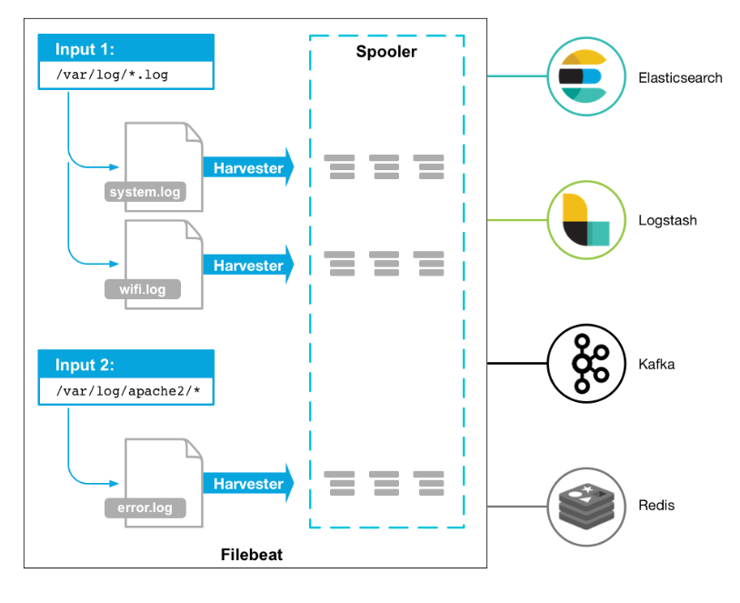
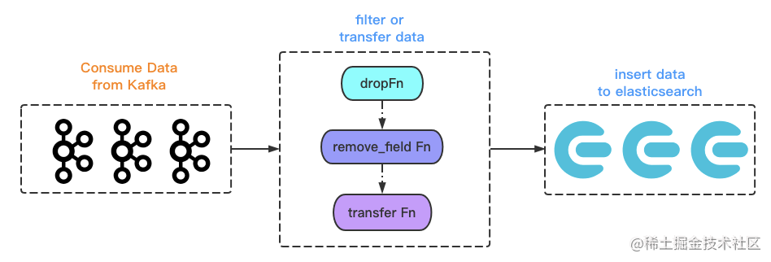

# Filebeat:

Filebeat是Elasticsearch提供的一个轻量级日志数据收集器。它能够监视指定的日志文件或位置，并将数据发送到Elasticsearch、Logstash或Kafka等地方。Filebeat通常用于构建日志收集管道，以便后续对日志进行分析和可视化。

[一篇文章搞懂filebeat（ELK） - 一寸HUI - 博客园 (cnblogs.com)](https://www.cnblogs.com/zsql/p/13137833.html)

## 一、filebeat是什么

### 1.1、filebeat和beats的关系

　　首先filebeat是Beats中的一员。
　　Beats在是一个轻量级日志采集器，其实Beats家族有6个成员，早期的ELK架构中使用Logstash收集、解析日志，但是Logstash对内存、cpu、io等资源消耗比较高。相比Logstash，Beats所占系统的CPU和内存几乎可以忽略不计。
目前Beats包含六种工具：

- Packetbeat：网络数据（收集网络流量数据）
- Metricbeat：指标（收集系统、进程和文件系统级别的CPU和内存使用情况等数据）
- Filebeat：日志文件（收集文件数据）
- Winlogbeat：windows事件日志（收集Windows事件日志数据）
- Auditbeat：审计数据（收集审计日志）
- Heartbeat：运行时间监控（收集系统运行时的数据）

### 1.2、filebeat是什么

　　Filebeat是用于转发和集中日志数据的轻量级传送工具。Filebeat监视您指定的日志文件或位置，收集日志事件，并将它们转发到Elasticsearch或 Logstash进行索引。

　　Filebeat的工作方式如下：启动Filebeat时，它将启动一个或多个输入，这些输入将在为日志数据指定的位置中查找。对于Filebeat所找到的每个日志，Filebeat都会启动收集器。每个收集器都读取单个日志以获取新内容，并将新日志数据发送到libbeat，libbeat将聚集事件，并将聚集的数据发送到为Filebeat配置的输出。

​    工作的流程图如下：



 

### 1.3、filebeat和logstash的关系

　　因为logstash是jvm跑的，资源消耗比较大，所以后来作者又用golang写了一个功能较少但是资源消耗也小的轻量级的logstash-forwarder。不过作者只是一个人，加入http://elastic.co公司以后，因为es公司本身还收购了另一个开源项目packetbeat，而这个项目专门就是用golang的，有整个团队，所以es公司干脆把logstash-forwarder的开发工作也合并到同一个golang团队来搞，于是新的项目就叫filebeat了。

# Kafka:

   Kafka是一个分布式流处理平台和消息代理系统。它设计用于处理实时数据流，具有高吞吐量、容错性和水平扩展等特点。Kafka常被用于构建实时数据管道，如日志收集、事件驱动架构和实时分析等场景。

# Go-stash:

Go-stash是一个使用Go语言编写的日志收集工具，类似于Logstash，（在项目中作用是日志收集后过滤）。它的作用是从不同来源收集日志数据，并将其转发到指定的目标，如Elasticsearch或Kafka等。[极速精简 Go 版 Logstash - 万俊峰Kevin - 博客园 (cnblogs.com)](https://www.cnblogs.com/kevinwan/p/14620139.html)

## 前言

今天来介绍 `go-zero` 生态的另一个组件 `go-stash`。这是一个 `logstash` 的 Go 语言替代版，我们用 `go-stash` 相比原先的 `logstash` 节省了2/3的服务器资源。如果你在用 `logstash`，不妨试试，也可以看看基于 `go-zero` 实现这样的工具是多么的容易，这个工具作者仅用了两天时间。

## 整体架构

先从它的配置中，我们来看看设计架构。

```yaml
Clusters:
  - Input:
      Kafka:
        # Kafka 配置 --> 联动 go-queue
    Filters:
    	# filter action
      - Action: drop            
      - Action: remove_field
      - Action: transfer      
    Output:
      ElasticSearch:
        # es 配置 {host, index}
```

看配置名：`kafka` 是数据输出端，`es` 是数据输入端，`filter` 抽象了数据处理过程。

对，整个 `go-stash` 就是如 config 配置中显示的，所见即所得。



# Elasticsearch:

Elasticsearch是一个实时的分布式搜索和分析引擎。它支持全文搜索、结构化查询、分析和可视化等功能，常用于构建各种类型的应用程序，包括日志分析、指标监控和安全分析等。


# Kibana:

Kibana是一个用于数据分析和可视化的开源工具，常与Elasticsearch一起使用。它提供了丰富的图表和可视化组件，用于搜索、查看和与存储在Elasticsearch中的索引进行交互。

# Prometheus:

Prometheus是一个开源的系统监控和警报工具包。它采集时间序列数据，并提供强大的查询语言和灵活的警报机制，用于监控应用程序和基础设施的状态。

# Grafana:

Grafana是一个开源的分析和监控平台，用于可视化指标并监控应用程序、服务和基础设施。它支持多种数据源，并提供丰富的图表和仪表板功能。

# Jaeger:

Jaeger是一个分布式追踪系统，用于监视和故障排除微服务架构中的事务。它能够跟踪事务的调用链，并提供可视化的分布式跟踪数据。

`Jaeger` 的全链路追踪功能主要由三个角色完成:

- `client`：负责全链路上各个调用点的计时、采样，并将 `tracing` 数据发往本地 `agent`。
- `agent`：负责收集 `client` 发来的 `tracing` 数据，并以 `thrift` 协议转发给 `collector`。
- `collector`：负责搜集所有 `agent` 上报的 `tracing` 数据，统一存储。


# Go-queue 和 Asynq:

Go-queue和Asynq是使用Go语言编写的消息队列系统，用于处理异步任务和消息传递。它们提供了高性能的队列服务，可用于构建异步处理和事件驱动的应用程序。

kafka ， 发布订阅使用的是go-zero开发团队开发的go-queue，链接：https://github.com/zeromicro/go-queue

这里使用kq，kq是基于kafka做的高性能发布订阅

消息队列、延迟队列、定时任务本项目使用的是asynq ，基于redis开发的简单中间件，https://github.com/hibiken/asynq


# Asynqmon:

 Asynqmon是一个用于监控Asynq的Web UI和API。它提供了实时的队列状态和统计信息，帮助用户了解异步任务的执行情况。


# Modd:

 Modd是一个用于自动化开发环境的工具，能够监视文件更改并触发相应的操作，如重新编译代码或重新加载应用程序。它有助于提高开发效率，特别是在开发过程