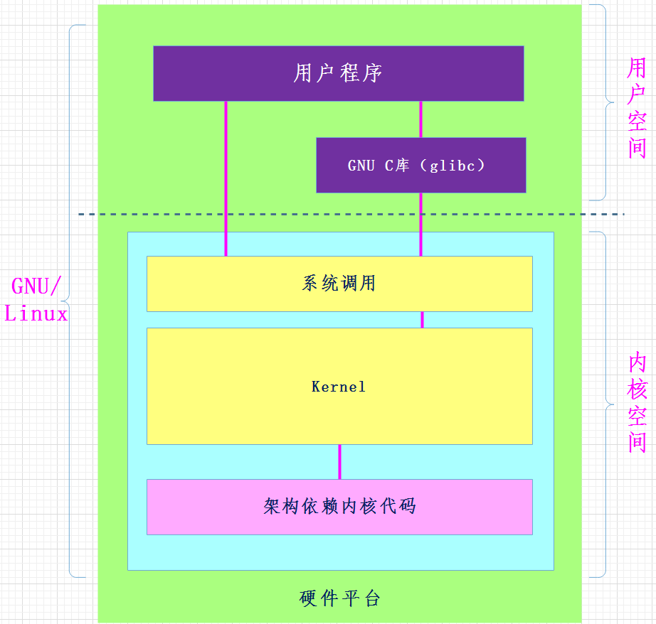

## 1 前言

### 1.1 环境

平台：Centos7.6

工具：vim，gcc，make

### 1.2 GCC

Linux系统下的GCC（`GNU Compiler Collection`）是GNU推出的功能强大、性能优越的多平台编译器，是GNU的代表作品之一。gcc是可以在多种硬体平台上编译出可执行程序的超级编译器，其执行效率与一般的编译器相比平均效率要高20%~30%。

GCC编译器能将C、C++语言源程序、汇程式化序和目标程序编译、链接成可执行文件，如果没有给出可执行文件的名字，gcc将生成一个名为`a.out`的文件。

GCC编译器编译C源文件为可执行文件的步骤：

- C源文件—->预处理`.i`—->编译`.s`（生成汇编文件）—->汇编`.o/.obj`（生成目标文件）—->链接`.out`（生成可执行文件）—->可执行文件

> gcc命令参数（选项）

| 参数 | 含义                                                         | 示例                                                      |
| :--- | :----------------------------------------------------------- | :-------------------------------------------------------- |
| `-c` | 对文件进行预处理、编译和汇编，生成obj文件                    | `gcc -c hello.c`                                          |
| `-S` | 只进行预处理和编译，生成汇编代码                             | `gcc -S hello.c`                                          |
| `-E` | 只进行预处理，这个选项不生成文件，可以使用重定向或者`-o`选项使其生成一个文件 | `gcc -E hello.c > hello.i`或者`gcc -E hello.c -o hello.i` |
| `-o` | 指定目标的名称，默认为a.out                                  | `gcc -o hello hello.c`                                    |

> 过程演示

例如源代码`main.c`：

```
#include<stdio.h>

int main(void) {
    printf("Hello World!\n");
    return 0; 
}
```

- 预编译：这个过程处理宏定义和include，去除注释，不会对语法进行检查。可以看到预编译后，源文件的代码从6行扩展了很多行，生成`main.i`

```
BASH
gcc -E main.c > main.i # 或者 gcc -E main.c -o main.i
C
// ...
// 只展示了一部分
extern int ftrylockfile (FILE *__stream) __attribute__ ((__nothrow__ , __leaf__)) ;


extern void funlockfile (FILE *__stream) __attribute__ ((__nothrow__ , __leaf__));
# 943 "/usr/include/stdio.h" 3 4

# 2 "main.c" 2
int main(void) {
    printf("Hello World!\n");
    return 0;
}
```

- 编译：这个阶段，检查语法，生成**汇编**代码`main.s`

```
BASH
gcc -S main.c -o main.s
```

`main.s`的内容：

```
PLAINTEXT
        .file   "main.c"
        .section        .rodata
.LC0:
        .string "Hello World!"
        .text
        .globl  main
        .type   main, @function
main:
.LFB0:
        .cfi_startproc
        pushq   %rbp
        .cfi_def_cfa_offset 16
        .cfi_offset 6, -16
        movq    %rsp, %rbp
        .cfi_def_cfa_register 6
        movl    $.LC0, %edi
        call    puts
        movl    $0, %eax
        popq    %rbp
        .cfi_def_cfa 7, 8
        ret
        .cfi_endproc
.LFE0:
        .size   main, .-main
        .ident  "GCC: (GNU) 4.8.5 20150623 (Red Hat 4.8.5-44)"
        .section        .note.GNU-stack,"",@progbits
```

- 汇编：这个阶段，生成目标代码`main.o`

```
BASH
gcc -c main.s -o main.o
```

- 链接：生成可执行代码

  ```
  main
  ```

  。

  - 链接分为两种，一种是静态链接，另外一种是动态链接。
  - 使用静态链接的好处是，依赖的动态链接库较少，对动态链接库的版本不会很敏感，具有较好的兼容性；缺点是生成的程序比较大。
  - 使用动态链接的好处是，生成的程序比较小，占用较少的内存。

```
BASH
gcc main.o -o main
```

- 运行

```
BASH
[root@HongyiZeng c]# ./main
Hello World!
```

------

一步到位：

```
BASH
gcc main.c -o
```

此时会默认生成一个名为`a.out`的可执行文件。

```
BASH
gcc main.c -o myHello
```

此时会生成一个名为`myHello`的可执行文件

### 1.3 make

make命令是GNU工程化中的一个编译工具。make是依赖于Makefile来编译多个源文件的工具。在Makefile里同样是用gcc（或者别的编译器）来编译程序。

可以使用以下命令直接生成可执行文件：

```
BASH
make main
```

### 1.4 makefile

一个工程中的源文件不计其数，其按类型、功能、模块分别放在若干个目录中，`makefile`定义了一系列的规则来指定哪些文件需要先编译，哪些文件需要后编译，哪些文件需要重新编译，甚至于进行更复杂的功能操作。


#### 1.4.1 使用gcc的例子

- 创建文件

```
BASH
touch main.c tool1.c tool1.h tool2.c tool2.h
```

可以使用`vim * -p`打开当前目录下的所有文件。`-p`是打开多个文件的选项。

在命令模式下，`gt`切换到下一个标签页，`gT`切换到上一个标签页。

退出多个标签时，可加上`a`，例如`:qa`或者`:wqa`等

- `tool1.h`和`tool1.c`

```
C
#ifndef __TOOL1_H__
#define __TOOL1_H__
    void mytool1();
#endif
C
#include <stdio.h>
#include "tool1.h" 
void mytool1() {
	printf("tool1 print...\n");
}
```

- `tool2.h`和`tool2.c`

```
C
#ifndef __TOOL2_H__
#define __TOOL2_H__
    void mytool2();
#endif
C
#include <stdio.h>
#include "tool2.h"

void mytool2() {
    printf("tool2 print...\n");
}
```

- `main.c`

```
C
#include "tool1.h"
#include "tool2.h"

int main(void) {
    mytool1();
    mytool2();
    return 0;
}
```

对所有文件进行编译：

```
BASH
gcc *.c
```

执行`a.out`

```
BASH
[root@HongyiZeng makefile]# ./a.out 
tool1 print...
tool2 print...
```

#### 1.4.2 语法规则

```
PLAINTEXT
目标 ... : 依赖 ...
	命令1
	命令2
	. . .
```

- 目标即要生成的文件。如果目标文件的更新时间晚于依赖文件更新时间，则说明依赖文件没有改动，目标文件不需要重新编译。否则会进行重新编译并更新目标文件。默认情况下Makefile的第一个目标为**终极目标**。
- 依赖：即目标文件由哪些文件生成。
- 命令：即通过执行命令由依赖文件生成目标文件。注意每条命令之前必须有一个tab保持缩进。

> 代码示例

- 新建makefile，`touch makefile`

```
MAKEFILE
mytool:main.o tool1.o tool2.o
    gcc main.o tool1.o tool2.o -o mytool
main.o:main.c
    gcc -c main.c -o main.o
tool1.o:tool1.c
    gcc -c tool1.c -o tool1.o
tool2.o:tool2.c
    gcc -c tool2.c -o tool2.o
```

- 执行`make`即可。

------

makefile会监视哪些源文件发生了变化，一旦发生变化，则会在有这个变化文件的编译链上重新编译。

- 假设没有变化

```
BASH
[root@HongyiZeng makefile]# make
make: `mytool' is up to date.
```

- 将`tool1.c`修改一点，再次make

```
BASH
[root@HongyiZeng makefile]# make
gcc -c tool1.c -o tool1.o
gcc main.o tool1.o tool2.o -o mytool
[root@HongyiZeng makefile]# ./mytool 
tool1.c is updated...
tool2 print...
```

发现只有`tool1.c`影响到的地方被重新编译了，没有发生变化的地方则不会被重新编译。

------

- 代码清理`clean`：我们可以编译一条属于自己的clean语句，来清理make命令所产生的所有文件，例如：

```
MAKEFILE
mytool:main.o tool1.o tool2.o
    gcc main.o tool1.o tool2.o -o mytool
main.o:main.c
    gcc -c main.c -o main.o
tool1.o:tool1.c
    gcc -c tool1.c -o tool1.o
tool2.o:tool2.c
    gcc -c tool2.c -o tool2.o
    
clean:
	rm *.o mytool -rf
```

使用：

```
BASH
make clean
```

------

- 变量：`$`符号表示取变量的值，当变量名多于一个字符时，使用`()`

- 变量赋值：

  - `=`：最普通的等号，在Makefile中容易搞错赋值等号，使用 `=`进行赋值，变量的值是整个Makefile中**最后被指定**的值。

    ```
    MAKEFILE
    VIR_A = A
    VIR_B = $(VIR_A) B
    VIR_A = AA
    ```

    经过上面的赋值后，最后VIR_B的值是`AA B`，而不是`A B`，在make时，会把整个Makefile展开，来决定变量的值

  - `:=`：表示直接赋值，赋予当前位置的值。

    ```
    MAKEFILE
    VIR_A := A
    VIR_B := $(VIR_A) B
    VIR_A := AA
    ```

    最后BIR_B的值是`A B`，即根据当前位置进行赋值。

  - `?=`：表示如果该变量没有被赋值，赋值予等号后面的值。

    ```
    MAKEFILE
    VIR ?= new_value
    ```

    如果VIR在之前没有被赋值，那么VIR的值就为new_value。

    ```
    MAKEFILE
    VIR := old_value
    VIR ?= new_value
    ```

    这种情况下，VIR的值就是old_value

  - `+=`：和平时写代码的理解是一样的，表示将符号后面的值添加到前面的变量上

- 预定义变量`CC`：c编译器的名称，默认值为`gcc`

> GCC编译选项`CFLAGS`参数

| 选项    | 说明                                                         |
| ------- | ------------------------------------------------------------ |
| `-c`    | 用于把源码文件编译成 .o 对象文件,不进行链接过程              |
| `-o`    | 用于连接生成可执行文件，在其后可以指定输出文件的名称         |
| `-g`    | 用于在生成的目标可执行文件中，添加调试信息，可以使用GDB进行调试 |
| `-Wall` | 生成常见的所有告警信息，且停止编译，具体是哪些告警信息，请参见GCC手册，一般用这个足矣！ |
| `-w`    | 关闭所有告警信息                                             |
| `-O`    | 表示编译优化选项，其后可跟优化等级0\1\2\3，默认是0，不优化   |

> GCC链接选项`LDFLAGS`参数

| 选项        | 说明                                                         |
| ----------- | ------------------------------------------------------------ |
| `-llibrary` | 链接时在标准搜索目录中寻找库文件，搜索名为liblibrary.a 或 liblibrary.so |
| `-Ldir`     | 用于把新目录添加到库搜索路径上，可以使用相对和绝对路径，“-L.”、“-L./include”、“-L/opt/include” |
| `-static`   | 使用静态库链接生成目标文件，避免使用共享库，生成目标文件会比使用动态链接库大 |

使用示例：例如posix线程中，查看创建线程的介绍`pthread_create`中：


需要在编译和链接的选项中加上`-pthread`，因此，在编写makefile时需要加上：

```
MAKEFILE
CFLAGS+=-pthread
LDFLAGS+=-pthread
```

执行make时：

```
BASH
cc -pthread -phread test.c -o test
```

> 改造后的makefile

```
MAKEFILE
OBJS=main.o tool1.o tool2.o
CFLAGS+=-c -Wall -g # 编译选项

mytool:$(OBJS)
    $(CC) $(OBJS) -o mytool
main.o:main.c
    $(CC) $(CFLAGS) main.c -o main.o
tool1.o:tool1.c
    $(CC) $(CFLAGS) tool1.c -o tool1.o
tool2.o:tool2.c
    $(CC) $(CFLAGS) tool2.c -o tool2.o

clean:
    rm *.o mytool -rf
```

`$`的其他用法：

- `$^` 表示所有的依赖文件
- `$@` 表示生成的目标文件
- `$<` 代表第一个依赖文件

> 再次改造后的makefile

```
MAKEFILE
OBJS=main.o tool1.o tool2.o
CFLAGS+=-c -Wall -g

mytool:$(OBJS)
    $(CC) $^ -o $@
main.o:main.c
    $(CC) $(CFLAGS) $^ -o $@
tool1.o:tool1.c
    $(CC) $(CFLAGS) $^ -o $@
tool2.o:tool2.c
    $(CC) $(CFLAGS) $^ -o $@

clean:
    rm *.o mytool -rf
```

------

实际上上面的三段代码都有固定的模式，如下：

```
MAKEFILE
xxx.o:xxx.c
	$(CC) $(CFLAGS) $^ -o $@
```

相同的部分`xxx`可以用通配符`%`代替。可以简化为：

```
MAKEFILE
OBJS=main.o tool1.o tool2.o
CFLAGS+=-c -Wall -g

mytool:$(OBJS)
    $(CC) $^ -o $@
%.o:%.c
    $(CC) $(CFLAGS) $^ -o $@
    
clean:
    rm *.o mytool -rf
```

### 1.5 POSIX

来源：https://zhuanlan.zhihu.com/p/392588996 侵权必删

#### 1.5.1 简介

POSIX：可移植操作系统接口（`Portable Operating System Interface of UNIX`，缩写为 POSIX ）；

发布者为电气与电子工程师协会（Institute of Electrical and Electronics Engineers），简称IEEE。

POSIX是IEEE为要在各种UNIX操作系统上运行的软件而定义的一系列API标准的总称，其正式称呼为IEEE 1003，而国际标准名称为ISO/IEC 9945。

#### 1.5.2 历史

POSIX是Unix的标准。

1974年，贝尔实验室正式对外发布Unix。因为涉及到反垄断等各种原因，加上早期的Unix不够完善，于是贝尔实验室以慷慨的条件向学校提供源代码，所以Unix在大专院校里获得了很多支持并得以持续发展。

于是出现了好些独立开发的与Unix基本兼容但又不完全兼容的OS，通称Unix-like OS。包括：

1. 美国加州大学伯克利分校的Unix4.xBSD(Berkeley Software Distribution)。
2. 贝尔实验室发布的自己的版本，称为System V Unix。
3. 其他厂商的版本，比如Sun Microsystems的Solaris系统,则是从这些原始的BSD和System V版本中衍生而来。

20世纪80年代中期，Unix厂商试图通过加入新的、往往不兼容的特性来使它们的程序与众不同。

为了提高兼容性和应用程序的可移植性，阻止这种趋势， IEEE开始努力标准化Unix的开发，后来由 Richard Stallman命名为`Posix`。

这套标准涵盖了很多方面，比如Unix系统调用的C语言接口、shell程序和工具、线程及网络编程。

#### 1.5.3 可移植性

##### ① 系统调用和库函数

Linux下对文件操作有两种方式：**系统调用**（system call）和**库函数调用**（Library functions）。

- 系统调用：系统调用是通向操作系统本身的接口，是面向底层硬件的。通过系统调用，可以使得用户态运行的进程与硬件设备(如CPU、磁盘、打印机等)进行交互，是操作系统留给应用程序的一个接口。
- 库函数调用：库函数（Library function）是把函数放到库里，供别人使用的一种方式。

方法是把一些常用到的函数编完放到一个文件里，供不同的人进行调用。一般放在`.lib`文件中。

库函数调用则是面向应用开发的，库函数可分为两类：

1. 一类是C语言标准规定的库函数，
2. 一类是编译器特定的库函数。

(由于版权原因，库函数的源代码一般是不可见的，但在头文件中你可以看到它对外的接口)。

`glibc` 是 Linux 下使用的开源的标准 C 库，它是 GNU 发布的 libc 库，即运行时库。这些基本函数都是被标准化了的，而且这些函数通常都是用汇编直接实现的。

glibc 为程序员提供丰富的 API（Application Programming Interface），这些API都是遵循POSIX标准的，API的函数名，返回值，参数类型等都必须按照POSIX标准来定义。

**POSIX兼容也就指定这些接口函数兼容，但是并不管API具体如何实现。**

##### ② 区别



如上图所示：

- 库函数是语言或应用程序的一部分，而系统调用是内核提供给应用程序的接口，属于系统的一部分
- 库函数在用户地址空间执行，系统调用是在内核地址空间执行，库函数运行时间属于用户时间，系统调用属于系统时间，库函数开销较小，系统调用开销较大
- 系统调用依赖于平台，库函数并不依赖

|          | 函数库调用                                  | 系统调用                                     |
| -------- | ------------------------------------------- | -------------------------------------------- |
| 定义差别 | 在所有的ANSI C编译器版本中，C函数库是相同的 | 各个操作系统的系统调用是不同的               |
| 调用差别 | 它调用函数库中的一段程序或函数              | 调用系统内核的服务                           |
| 运行空间 | 用户地址空间                                | 内核地址空间                                 |
| 开销     | 属于过程调用，开销小                        | 需要在用户空间和内核空间上下文切换，开销较大 |
| 个数     | 在C函数库libc中大约有300个函数              | 在Linux中大约有100多个系统调用               |
| 典型调用 | pringf，fread，malloc                       | chdir，fork，write，brk                      |

**系统调用是为了方便使用操作系统的接口，而库函数则是为了人们编程的方便。**

**库函数调用与系统无关，不同的系统，调用库函数，库函数会调用不同的底层函数实现，因此可移植性好。**

#### 1.5.4 实例

当应用程序调用printf()函数时，printf函数会调用C库中的printf，继而调用C库中的write，C库最后调用内核的write()。

而另一些则不会使用系统调用，比如strlen, strcat, memcpy等。


printf函数执行过程中，程序运行状态切换如下：

```
PLAINTEXT
用户态–>系统调用–>内核态–>返回用户态
```

printf函数、glibc库和系统调用在系统中关系图如下：


## 2 标准IO

该节对应`APUE`的第五章——标准IO库