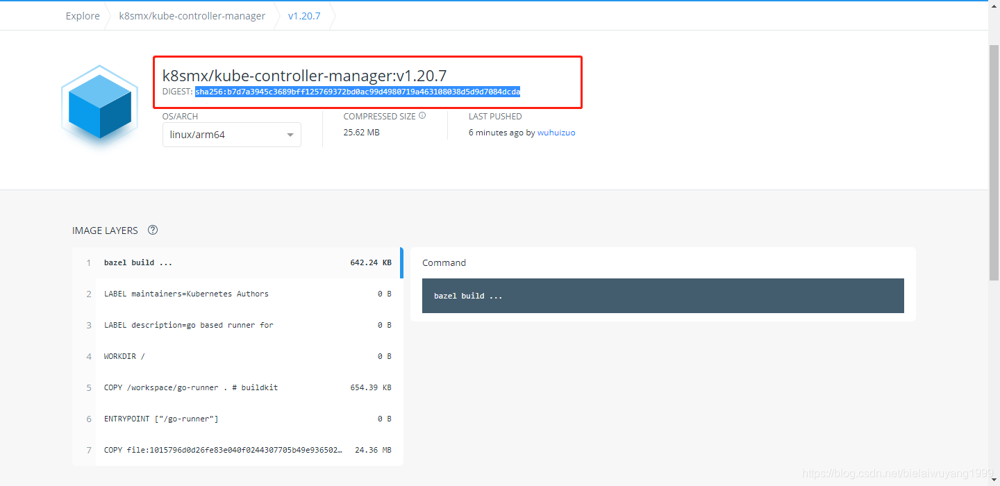

Docker是一种容器技术，解决软件跨环境迁移的问题

优势; 更快速的交付和部署	更高效的资源利用	更轻松的迁移和扩展	更简单的更新管理

 

Docker是一个开源的应用容器引擎	(c/s模式)构建Paas层的应用

基于Go语言实现。可以让开发者打包应用(及依赖包)到一个可移植的容器中然后发布到其他liunx机器实现虚拟化。容器完全使用虚拟化沙箱机制，相互之间不会有任何接口

Docker引擎 包括支持在桌面系统或云平台安装 Docker，以及为企业提供简单安全弹性的容器集群编排和管理，17.3版本后分为CE社区版和EE企业版

DockerHub 官方提供的云托管服务，可以提供公有或私有的镜像仓库

DockerCloud 官方提供的容器云服务，可以完成容器的部署与管理，可以完整地支持容器化项目，还有CI/CD功能

 

●**Docker daemon**:运行在宿主机上，Docker守护进程， 用户通过Docker client(Docker命令)与Docker daemon交互
●**Docker elient**: Docker命令行工具，是用户使用Docker的主要方式，Docker client与Docker daemon通信并将结果返回给用户，Docker client也可以通过socket或者RESTful api访问远程的Docker daemon
●**Docker image**:镜像是只读的，镜像中包含有需要运行的文件。镜像用来创建container，-个镜像可以运行多个
container;镜像可以通过Dockerfile创建，也可以从Docker hub/registry上下载
●**Docker container**:容器是Docker的运行组件，启动一个镜像就是一个容器，容器是一个隔离环境，多个容器之间不会相互影响，保证容器中的程序运行在一个相对安全的环境中
●**Docker hub/registry**:共享和管理Docker镜像，用户可以上传或者下载上面的镜像，[Docker hub官方地址](https://hub.docker.com/search?q=golang)，也可以搭建自己私有的Docker registry

不了解Linux内核的Cgroups技术，无法知道容器是如何做资源(CPU、 内存等)限制的

不了解Linux的Namespace技术，无法知道容器是如何做主机名、网络、文件等资源隔离的

dockerd负责响应和处理来自Docker客户端的请求然后将客户端的请求转化为Docker的具体操作


Docker是基于Namespace、Cgroups 和联合文件系统实现的

Cgroups不仅可以用于容器资源的的限制，还可以提供容器的资源使用率

Cgroups的工作目录/sys/fs/cgroup下包含了Cgroups的所有内容

 

容器的本质是进程而不是一个完整操作系统


# 安装docker-ce包社区版

[docker安装 官方文档](https://docs.docker.com/engine/install/ubuntu/)

## 一、在线安装Docker

1: 安装必要的一些系统工具	`yum install -y yum-utils`

2: 添加软件源信息

```sh
yum-config-manager  --add-repo https://download.docker.com/linux/centos/docker-ce.repo
```

3: 更新并安装Docker-CE

```sh
yum install docker-ce docker-ce-cli containerd.io docker-buildx-plugin docker-compose-plugin -y
```

**配置镜像加速器 vim /etc/docker/daemon.json**

```sh
{"registry-mirrors": ["https://ustc-edu-cn.mirror.aliyuncs.com","https://docker.mirrors.ustc.edu.cn"]}
```

`systemctl daemon-reload && systemctl restart docker`	#重新加载配置文件及服务

## **二、离线二进制安装**

```sh
curl -O https://download.docker.com/linux/static/stable/x86_64/docker-20.10.8.tgz 
cp docker/* /usr/bin/ #复制到可执行目录
dockerd &  #启动Docker守护程序
docker-api操作，/etc/sysconfig/docker

[root@localhost ~]# systemctl enable docker	#添加/var/run/docker.sock文件
OPTIONS='--selinux-enabled --log-driver=journald -H tcp://0.0.0.0:2375 -H unix:///var/run/docker.sock' #添加api接口
```

## **三、脚本安装**

#运行docker便捷安装脚本

```sh
$ curl -fsSL https://get.docker.com -o get-docker.sh
$ sudo sh get-docker.sh
```

[Docker官方文档](https://docs.docker.com/engine/install/centos/ )

卸载docker

•  检查安装的docker			`yum list installed | grep docker`

•  如查找出内容需要先进行docker卸载，无内容即可正常安装

•  卸载docker					`yum -y remove docker 名称`

•  删除镜像或者容器等等		`rm -rf docker路径`

# image镜像操作

## Docker镜像原理

思考:

1. Docker 镜像本质是什么?
●是一个分层文件系统
2. Docker中一个centos镜像为什么只有200MB，而一个centos操作系统的iso文件要几个个G?
●Centos的iso镜像文件包含bootfs和rootfs，而docker的centos镜像复用操作系统的bootfs，只有rotfs和其他镜像层
3. Docker中一个tomcat镜像为什么有500MB，而一个tomcat安装包只有70多MB?
●由于docker中镜像是分层的，tomcat虽然只有70多MB，但他需要依赖于父镜像和基础镜像，所有整个对外暴露的tomcat镜像大小500多MB

Docker镜像：是一个只读的Docker容器模板，包含启动容器所需要的所有文件系统结构和内容

 

 

## docker images镜像操作

查看镜像`man docker-images`

从容器导出镜像，镜像打包成tar文件（-o指定保存目录）`docker save -o zi_redis.tar zi_redis:1.0`

镜像保存成一个文件`docker save 0fdf2b4c26d3 > hangge_server.tar`

导入镜像docker load < zi_redis.tar压缩文件还原成镜像文件

注: 数据卷目录不能被制作成自制镜像的一部分

上传镜像docker push test:latest 上传本地的test :latest镜像

获取镜像docker pull redis:3.2拉取相应镜像版本(默认latest最新版)	-a获取仓库中的所有镜像


查看镜像docker images查看本地镜像						-a列出所有（包括临时文件）镜像文件

-f since=centos过滤列出来自centos库的镜像				-q仅输出ID信息

`Docker tag  ubunbu:latest  xxx:lates`添加xxx标签(类似链接的作用)

`docker inspect centos/a1`查看镜像或容器信息				-f {{".Architecture"}} nginx指定查看内容

`docker history ubuntu:18.04`查看镜像创建各层级的具体信息

搜索镜像`Docker search Ubuntu` 搜索Ubuntu镜像				-f is-official=true nginx过滤出官方的镜像

删除清理镜像`docker  rmi  redis:3.2`删除镜像(id号也行)		-f强制删除即使有容器依赖它

`docker image prune -a`删除所有无用镜像不光是临时镜像

docker images prune -f删除所有name和tag为<none>的镜像

-f is-official=true nginx出官方的镜像 						-f自动清理且强制删除镜像不进行提示确认

```sh
ll *.tar|awk '{print $NF}'|sed -r 's#(.*)#docker load -i \1#' |bash #批量导入镜像
```


## docker image拉取拉取不同架构的镜像



在docker中运行拉取镜像命令，直接粘贴我们刚复制的pull命令然后输入一个@在粘贴digest的值。代码如下

```sh
docker pull k8smx/kube-controller-manager:v1.20.7@sha256:b7d7a3945c3689bff125769372bd0ac99d4980719a463108038d5d9d7084dcda
```


# Dockerfile创建镜像

 

 

dockerfile书写原则https://www.cnblogs.com/ainimore/p/14409165.html

创建docker-file文件夹进入编写vim dockerfile1（构建ssh镜像文件）

```dockerfile
FROM 192.168.2.5:5000/centos/latest:latest
MAINTAINER  liu  <2581210093@qq.com>
RUN rm -f /etc/yum.repos.d/*
ADD yum.repo /etc/yum.repos.d/	#本地相对路径文件yum.repo，添加至容器内部目录下/etc/yum.repos.d/
RUN yum repolist
RUN yum install mariadb-server -y
RUN mysql_install_db --user=mysql	#使用mysql用户初始化数据库
ENV LC_ALL en_US.UTF-8			#语言环境设置
ENV MYSQL_USER xiandian MYSQL_PASS xiandian		#环境设置
EXPOSE 3306
CMD mysql_safe	#运行命令
```

`docker build -t centos:v1 . `			`docker build -f /test/Dockerfile .`

\#构建镜像，-f指定dockerfile文件，-t指定镜像标签

`docker run -it --name c5 -p 9999:22 centos_sshd:1.0` #映射端口进入


## Docker build

**docker build** 命令用于使用 Dockerfile 创建镜像。

### 语法

```
docker build [OPTIONS] PATH | URL | -
```

**实例**

使用当前目录的 Dockerfile 创建镜像，标签为 runoob/ubuntu:v1。

```
docker build -t runoob/ubuntu:v1 . 
```

使用URL **github.com/creack/docker-firefox** 的 Dockerfile 创建镜像。

```
docker build github.com/creack/docker-firefox
```

也可以通过 -f Dockerfile 文件的位置：

```
$ docker build -f /path/to/a/Dockerfile .
```

在 Docker 守护进程执行 Dockerfile 中的指令前，首先会对 Dockerfile 进行语法检查，有语法错误时会返回：

```
$ docker build -t test/myapp .
Sending build context to Docker daemon 2.048 kB
Error response from daemon: Unknown instruction: RUNCMD
```

### OPTIONS说明

- **--tag, -t:** 镜像的名字及标签，通常 name:tag 或者 name 格式；可以在一次构建中为一个镜像设置多个标签。
- **-f :**指定要使用的Dockerfile路径；
- **--force-rm :**设置镜像过程中删除中间容器；
- **--build-arg=[] :**设置镜像创建时的变量；
- **--cpu-shares :**设置 cpu 使用权重；
- **--cpu-period :**限制 CPU CFS周期；
- **--cpu-quota :**限制 CPU CFS配额；
- **--cpuset-cpus :**指定使用的CPU id；
- **--cpuset-mems :**指定使用的内存 id；
- **--disable-content-trust :**忽略校验，默认开启；
- **--isolation :**使用容器隔离技术；
- **--label=[] :**设置镜像使用的元数据；
- **-m :**设置内存最大值；
- **--memory-swap :**设置Swap的最大值为内存+swap，"-1"表示不限swap；
- **--no-cache :**创建镜像的过程不使用缓存；
- **--pull :**尝试去更新镜像的新版本；
- **--quiet, -q :**安静模式，成功后只输出镜像 ID；
- **--rm :**设置镜像成功后删除中间容器；
- **--shm-size :**设置/dev/shm的大小，默认值是64M；
- **--ulimit :**Ulimit配置。
- **--squash :**将 Dockerfile 中所有的操作压缩为一层。
- **--network:** 默认 default。在构建期间设置RUN指令的网络模式


## Dockerfile关键字 （区分大小写）

| Dockerfile 指令 | 说明                                                         | 使用示例                                                     |
| :-------------- | :----------------------------------------------------------- | ------------------------------------------------------------ |
| FROM            | 指定基础镜像，用于后续的指令构建。                           | FROM centos:7                                                |
| MAINTAINER      | 指定Dockerfile的作者/维护者。（已弃用，推荐使用LABEL指令）   | MAINTAINER lb codelnb@qq.com                                 |
| LABEL           | 添加镜像的元数据，使用键值对的形式。                         | LABEL version="l.0.0-rc3" LABEL author="yeasy@github" date="2020-01-01" |
| RUN             | 在构建过程中在镜像中执行命令。                               | 格式为 RUN <command＞（前者默认将在 shell 终端中运行命令，即／bin/sh -c，命令较长时可以使用＼来换行）或 RUN ["executable "，”paraml”，”param2”]，RUN [“/bin/bash”，“-c”，echo hello”］#指定bash环境 |
| CMD             | 指定容器创建时的默认命令。（可以被覆盖）                     | CMD ["-g"，"daemon off;"]	#至附加参数                     |
| ENTRYPOINT      | 设置容器创建时的主要命令。（不可被覆盖）                     | 镜像的默认入口命令，入口命令在启动容器时作为根命令执行，所有传入值作为该命令的参数，ENTRYPOINT ["nginx"]	#nginx命令 |
| EXPOSE          | 声明容器运行时监听的特定网络端口。                           | EXPOSE 22 8080/udp                                           |
| ENV             | 在容器内部设置环境变量。                                     | ENV APP VERSION=l.0.0 ，ENV APP_HOME=/usr/local/app ，ENV PATH /usr/local/mysql/bin:$PATH |
| ADD             | 将文件、目录或远程URL复制到镜像中。                          | ADD http://nginx.org/download/nginx-1.12.2.tar.gz .          |
| COPY            | 将文件或目录复制到镜像中。                                   | COPY /media /sss                                             |
| VOLUME          | 为容器创建挂载点或声明卷。                                   | VOLUME ["/emdia"]                                            |
| WORKDIR         | 设置后续指令的工作目录。                                     | WORKDIR /path/to/workdir                                     |
| USER            | 指定后续指令的用户上下文。                                   | USER root                                                    |
| ARG             | 定义在构建过程中传递给构建器的变量，可使用 "docker build" 命令设置。 | ARG VERSION=9.3                                              |
| ONBUILD         | 当该镜像被用作另一个构建过程的基础时，添加触发器。           | ONBUILD ADD . / app/src ONBUILD RUN /usr / local/bin/python build --dir / app/src |
| STOPSIGNAL      | 设置发送给容器以退出的系统调用信号。                         | STOPSIGNAL signal                                            |
| HEALTHCHECK     | 定义周期性检查容器健康状态的命令。                           |                                                              |
| SHELL           | 覆盖Docker中默认的shell，用于RUN、CMD和ENTRYPOINT指令。      | SHELL [”executable”，”parameters”]                           |

 

## .dockerignore文件

 

# docker容器操作

**(ctrl +p +q退出不中止)**

创建容器`docker create -it --name=a1 ubuntu:latest`	新建一个容器

启动容器`docker start a1`启动一个已经创建的容器

运行进入容器docker run			-i 以交互模式运行容器			-t为容器分配一个伪终端

-d后台运行容器，并返回容器ID	**--name**为容器指定一个名称		-u执行命令的用户名或ID	

--privileged指定容器为特权容器，特权容器拥有所有的capabilities		--rm容器在终止后会立刻删除

-m设置容器使用内存最大值		-u指定容器的用户				-w指定容器的工作目录

-e，--env=指定环境变量，容器中可以使用该环境变量		--entrypoint=""， 覆盖image的入口点

--restart=no，默认策略，在容器退出时不重启容器

on-failure，在容器非正常退出时（退出状态非0），才会重启容器

on-failure:3，在容器非正常退出时重启容器，最多重启3次

always，在容器退出时总是重启容器 

unless-stopped，容器退出时总是重启容器(不考虑在Docker守护进程启动前就停止的容器

docker run -d --restart=always ubuntu:latest ping www.docker.com

运行一个在后台不断执行的容器，同时带有命令，程序被终止后还能重启继续跑，还能用控制台管理

--cidfile运行容器后，在指定文件中写入容器PID值，一种典型的监控系统用法

**--cpuset="0-2" or --cpuset="0，1，2":** 绑定容器到指定CPU运行

--env-file=[]， 指定环境变量文件，文件格式为每行一个环境变量


`docker run -it --name=a1 centos:7.6 /bin/bash`创建且进入容器a1以/bin/bash环境运行（默认退出中断）

`docker exec -it a1 /bin/bash`进入容器

**过程创建容器过程：**

> 检查本地是否存在指定的镜像，不存在就从公有仓库下载
>
> 利用镜像创建一个容器，并启动该容器
>
> 分配一个文件系统给容器，并在只读的镜像层外面挂载一层可读写层
>
> 从宿主主机配置的网桥接口中桥接一个虚拟接口到容器中去
>
> 从网桥的地址池配置一个 IP 地址给容器
>
> 进入交互式终端
>

Exit退出后容器自动终止

查看容器docker ps查看正在运行的容器 		-a查看所有运行过的容器	-q只查看ID号  -n=1最后退出的容器

`docker top test`查看容器内进程					-a输出所有容器统计信息，默认仅在运行中

`docker info`查看docker服务运行详细信息		docker port ubunt查看容器的端口映射

`docker stats ubunt`查看容器占用硬件资源情况	docker logs ubunt查看容器日志信息(历史命令)

`docker logs --tail=5 9b53baf2246a`	#显示日志最后5行

`docker diff ubunt`查看容器内文件的变更信息

`docker inspect container/images -f {{.Size}}`	 #查看容器或镜像的详细信息	-f 过滤"key1=value"

`docker ps -qf status=exited/running/paused`	#查看状态停止容器 ID

`docker ps -f ancestor=nginx`	#根据镜像过滤

`docker stats --no-stream 49a877175264`	#查询 registry 容器的 CPU、内存等统计信息

停止删除容器`docker stop  {c1，c2}`停止多个容器		docker pause test暂停一个运行中的容器

`docker rm $(docker ps -qa)`删除所有容器				-v删除容器挂载的数据卷

－f强行终止并删除一个运行中的容器				-l删除容器的连接，保留容器

docker rm `docker ps -a|grep Exited|awk '{print $1}'`

`docker system prune -a`清理dangling镜像、退出的容器、无用的数据卷和网络、未使用的镜像[自动档]

导入导出容器docker export -o test.tar ubunt导出容器(不管是否运行 -o指定保存目录)

`docker export ubunt >test.tar`

`docker import test.tar liunx:1.0`导入容器

复制文件`docker cp test.sh ubunt:/ `在容器和主机之间复制文件		-a复制文件带有原始的uid/gid 信息

链接容器在两个互联的容器之间创建了一个安全隧道，而且不用映射它们的端口到宿主主机上

在启动db容器的时候没有使用 -p 和 -P 标记，从而避免了暴露数据库端口到外部网络上

`docker run -it --name c5 --link c1:c5  centos  bash`		通过查看hosts文件获取链接信息

`docker run -d -it  --name mysqldb  -P  192.168.2.5:5000/mysql/8.0  /bin/bash`

\#链接

6bdaa58b581e7b14ebd9cec3b0b9bb4688e4b3813df8a36dae271a039d7a4768

`docker run -d -it  --name nginxweb  -P --link mysqldb:db  192.168.2.5:5000/nginx/latest  /bin/bash`

\#链接数据库容器的db

b15a009ebcdca820c6f92de7c104f414fd9fc6def115094078eb500fb282557d

`docker inspect --format {{.HostConfig.Links}} b15a009ebcdc`

[/mysqldb:/nginxweb/db]

修改容器docker update修改容器配置信息

基于运行容器创建镜像docker commit 基于已有容器创建镜像		-a作者信息	-m描述信息

`docker commit -a "liu" -m "nginx"  cc  centos_nginx:1.0`以容器cc为基础创建centos_nginx镜像

基于本地模板导入`cat ubuntu-18.04-x86_64-minimal.tar.gz I docker import - ubuntu:18.04`

## 私有仓库

Docker官方的[Docker hub](https://hub.docker.com)是一个用于管理公共镜像的仓库，我们可以从上面拉取镜像到本地，也可以把我们自己的镜像推送上去。但是，有时候我们的服务器无法访问互联网，或者你不希望将自己的镜像放到公网当中，那么我们就需要搭建自己的私有仓库来存储和管理自己的镜像

**docker容器虚拟化与传统虚拟机比较**

容器就是将软件打包成标准化单元，以用于开发、交付和部署。
	●容器镜像是轻量的、可执行的独立软件包，包含软件运行所需的所有内容:代码、运行时环境、系统工具系统库和设置。
	●容器化软件在任何环境中都能够始终如一地运行。
	●容器赋予了软件独立性，使其免受外在环境差异的影响，从而有助于减少团队间在相同基础设施上运行不同软件时的冲突。
相同:
	●容器和虚拟机具有相似的资源隔离和分配优势
不同:
	●容器虚拟化的是操作系统，虚拟机虚拟化的是硬件。
	●传统虚拟机可以运行不同的操作系统，容器只能运行同一类型操作系统。

 

 

 

**## Docker 私有仓库**

**一、私有仓库搭建**

1、拉取私有仓库镜像 	`docker pull registry`

2、启动私有仓库容器 	`docker run -id --name=registry -p 5000:5000 registry`

3、打开浏览器 http://私有仓库服务器ip:5000/v2/_catalog，看到{"repositories":[]} 表示私有仓库搭建成功

4、修改daemon.json  `vim /etc/docker/daemon.json`

在上述文件中添加一个key，保存退出。此步用于让 docker 信任私有仓库地址；注意将私有仓库服务器ip修改为自己私有仓库服务器真实ip 	{"insecure-registries":["私有仓库服务器ip:5000"]} 

5、重启docker 服务 	systemctl restart docker		docker start registry

 **二、将镜像上传至私有仓库**(服务开启状态)

1、标记镜像为私有仓库的镜像   docker tag centos:7 私有仓库服务器IP:5000/centos:7

2、上传标记的镜像   		docker push 私有仓库服务器IP:5000/centos:7

**三、 从私有仓库拉取镜像** 	docker pull 私有仓库服务器ip:5000/centos:7

# docker网络管理

## Docker网络基础理论

docker使用Linux桥接网卡，在宿主机虚拟一个docker容器网桥（docker0），docker启动一个容器时会根据docker网桥的网段分配给容器一个IP地址，称为Container-IP，同时Docker网桥是每个容器的默认网络网关。因为在同一宿主机内的容器都接入同一个网桥，这样容器之间就能够通过容器的Container-IP直接通信。

docker网桥是宿主机虚拟出来的，并不是真实存在的网络设备，外部网络是无法寻址到的，这也意味着外部网络无法通过直接Container-IP访问到容器。

如果容器希望外部访问能够访问到，可以通过映射容器端口到宿主主机(端口映射)，即docker run创建容器时候通过-p或-P参数来启用，访问容器的时候就通过`宿主机IP:容器端口`访问容器。

## Docker网络模式

| Docker网络模式   | 配置                      | 说明                                                         |
| ---------------- | ------------------------- | ------------------------------------------------------------ |
| host模式         | –net=host                 | 容器和宿主机共享`Network namespace`。容器将不会虚拟出自己的网卡，配置自己的IP 等，而是使用宿主机的IP和端口。 |
| container模式    | –net=container:NAME_or_ID | 容器和另外一个容器共享`Network namespace`。kubernetes中的pod就是多个容器共享一个Network namespace。创建的容器不会创建自己的网卡，配置自己的 IP， 而是和`一个指定的容器共享IP、端口范围`。 |
| none模式         | –net=none                 | 容器有独立的Network namespace，并没有对其进行任何网络设置，如分配veth pair和网桥连接，配置IP等。 `该模式关闭了容器的网络功能。` |
| bridge模式       | –net=bridge               | (默认模式)。此模式会为每一个容器分配、设置IP等，并将容器连接到一个`docker0虚拟网桥`，通过`docker0网桥`以及`Iptable nat`表配置与宿主机通信 |
| Macvlan/ network | 无                        | 容器具备Mac地址，使其显示为网络上的物理 设备                 |
| Overlay          | 无                        | (覆盖网络): 利用VXLAN实现的bridge模式                        |

## bridge模式

默认的网络模式。bridge模式下容器没有一个公有ip,只有宿主机可以直接访问,外部主机是不可见的,但容器通过宿主机的NAT规则后可以访问外网。

### Bridge桥接模式的实现步骤

Docker Daemon利用veth pair技术，在宿主机上创建两个虚拟网络接口设备，假设为veth0 和veth1。而veth pair技术的特性可以保证无论哪一个veth接收到网络报文，都会将报文传输给另一方。

Docker Daemon将veth0附加到Docker Daemon创建的docker0网桥上。保证宿主机的网络报 文可以发往veth0;

Docker Daemon 将veth1添加到Docker Container所属的namespace下，并被改名为eth0。 如此一来，保证宿主机的网络报文若发往veth0则立即会被eth0接收，实现宿主机到Docker Container网络的联通性;同时也保证Docker Container单独使用eth0，实现容器网络环境的隔离性。

### Bridge模式的缺陷

Docker Container不具有一个公有IP，即和宿主机eth0不处于同一个网段。导致的结果是宿主机以外的世界不能直接和容器进行通信。

#### 注意

eth设备是成双成对出现的，一端是容器内部命名为eth0，一端是加入到网桥并命名的veth(通常命名为veth)，它们组成了一个数据传输通道，一端进一端出，veth设备连接了两个网络设备并实现了数据通信。

## Host网络模式

host模式相当于Vmware中的NAT模式，与宿主机在同一个网络中，但`没有独立IP地址`。

启动容器使用host模式，容器将不会获得一个独立的Network Namespace，而是和宿主机共用一个Network Namespace。

容器将不会虚拟出自己的网卡，配置自己的IP等，而是使用宿主机的IP和端口。除此之外容器的其他方面，比如文件系统、进程列表等还是和宿主机隔离

使用host模式的容器可以直接使用宿主机的IP地址与外界通信，容器内部的服务端口也可以使用宿主机的端口，不需要进行NAT，`host最大的优势就是网络性能比较好`，docker host上已经使用的端口就不能再用了，网络的隔离性不好。

host网络模式需要在容器创建时指定–network=host

host模式是bridge桥接模式很好的补充。采用host模式的Docker Container，可以直接使用宿主机的IP地址与外界进行通信，若宿主机的eth0是一个公有IP，那么容器也拥有这个公有IP。同时容器内服务的端口也可以使用宿主机的端口，无需额外进行NAT转换。

host模式可以让容器共享宿主机网络栈,这样的好处是外部主机与容器直接通信,但是容器的网络缺少隔离性。

### Host模式的缺陷

使用Host模式的容器不再拥有隔离、独立的网络环境。虽然可以让容器内部的服务和传统情况无差别、无改造的使用，但是由于网络隔离性的弱化，该容器会与宿主机共享竞争网络栈的使用; 另外，容器内部将不再拥有所有的端口资源，原因是部分端口资源已经被宿主机本身的服务占用，还有部分端口已经用以bridge网络模式容器的端口映射。

## Container网络模式

一种特殊host网络模式， ontainer网络模式是Docker中一种较为特别的网络的模式。在容器创建时使用– network=container:vm1指定。(vm1指定的是运行的容器名)处于这个模式下的 Docker 容器会共享一个网络环境,这样两个容器之间可以使用localhost高效快速通信。

### Container模式的缺陷

Container网络模式没有改善容器与宿主机以外世界通信的情况(和桥接模式一样，不能连接宿主机以外的其他设备)。

这个模式指定新创建的容器和已经存在的一个容器共享一个Network Namespace，而不是和宿主机共享。新创建的容器不会创建自己的网卡，配置自己的IP，而是和一个指定的容器共享IP、端口范围等。 同样，两个容器除了网络方面，其他的如文件系统、进程列表等还是隔离的。两个容器的进程可以通过lo网卡设备通信

## none模式

使用none模式，Docker容器拥有自己的Network Namespace，但是，并不为Docker容器进行任何网络配置。`Docker容器没有网卡、IP、路由等信息。需要我们自己为Docker容器添加网卡、配置IP等。`

这种网络模式下容器只有lo回环网络，没有其他网卡。none模式可以在容器创建时通过-- network=none来指定。`这种类型的网络没有办法联网，封闭的网络能很好的保证容器的安全性。`

## 解决容器IP地址变化(新建bridge网络)

解决重启容器IP地址会发生变化的问题

```
docker network create -d bridge test-bridge
参数-d : 指DRIVER的类型，
test-bridge : network的自定义名称，这个和docker0是类似的。
```

1、如何把容器连接到test-bridge这个网络。

```
docker network ls
docker network inspect test-bridge
docker run -itd --name nginx3 --network test-bridge nginx:1.19.3-alpine
docker network inspect test-bridg
```

2、把一个运行中容器连接到test-bridge网络

```
docker network connect test-bridge nginx2
docker network inspect test-bridge
```

## docker网络命令汇总

查看已经建立的网络对象

```
docker network ls [OPTIONS]
常用参数:
-f --filter filter 过滤条件(如 'driver=bridge’)
	--format string
	--no-trunc
-q, --quiet 格式化打印结果 不缩略显示 只显示网络对象的ID

基本使用:
docker network ls --no-trunc
docker network ls -f 'driver=host'
```

### 创建网络(docker network create)

创建新的网络对象

```
docker network create [OPTIONS] NETWORK
常用参数:
--driver string 指定网络的驱动(默认 "bridge")
--subnet strings 指定子网网段(如192.168.0.0/16、172.88.0.0/24)
--ip-range strings  执行容器的IP范围，格式同subnet参数
--gateway strings 子网的IPv4 or IPv6网关，如(192.168.0.1)

基本使用
docker network create -d bridge my-bridge
```

### 网络删除(docker network rm)

删除一个或多个网络

```bash
docker network rm NETWORK [NETWORK...]
```

### 查看网络详细信息（docker network inspect）

查看一个或多个网络的详细信息

```sh
docker network inspect [OPTIONS] NETWORK [NETWORK...]
docker inspect [OPTIONS] NETWORK [NETWORK...]
常见参数
- -f, --format string 根据format输出结果
```

### 使用网络（docker run –-network）

为启动的容器指定网络模式

```lua
docker run/create --network NETWORK
```

### 网络连接与断开(docker network connect/disconnect)

```arduino
docker network connect [OPTIONS] NETWORK CONTAINER 
docker network disconnect [OPTIONS] NETWORK CONTAINER
常见参数
- -f, --force 强制断开连接(用于disconnect)
```

### 容器镜像设定固定ip

```sql
docker network create -d bridge --subnet=172.172.0.0/24  --gateway 172.172.0.1 network
# 172.172.0.0/24: 24代表子码掩码是255.255.255.0 172.172.0.0/16: 16 代表子码掩码

docker network ls
docker run -itd --name nginx3 -p 80:80 --net network --ip 172.172.0.10 nginx:1.19.3-alpine
--net mynetwork:选择存在的网络
--ip 172.172.0.10:给nginx分配固定的IP地址

docker network inspect network
```


# volume数据卷

 

==数据卷==

●数据卷是宿主机中的一个目录或文件
●当容器目录和数据卷目录绑定后，对方的修改会立即同步
●一个数据卷可以被多个容器同时挂载
●一个容器也可以被挂载多个数据卷

==数据卷作用==

●容器数据持久化
●外部机器和容器间接通信
●容器之间数据交换

注：1、目录必须是绝对路径	2、容器内被映射目录没有则会创建，有且目录下有文件则会清空	3、可以挂载多个数据卷	

==容器卷挂载和目录挂载的区别==

容器卷挂载不修改容器内数据，目录挂载覆盖容器内数据

**数据卷类型type**

1、volume普通数据卷，默认映射到主机/var/lib/docker/volumes路径下

2、bind绑定数据卷，映射到主机指定路径下

3、tmpfs临时数据卷，只存在于内存中

**使用参数**：

```sh
[root@izoq008ryseuupz docker]# docker volume help
	create      Create a volume
  inspect     Display detailed information on one or more volumes
  ls          List volumes
  prune       Remove all unused local volumes
  rm          Remove one or more volumes
```

-v，--volume=[]，给容器挂载存储卷，挂载到容器的某个目录

--volumes-from=[]，给容器挂载其他容器上的卷，挂载到容器的某个目录

普通数据卷

```
docker run -it --name=c1 -v /media:/media : ro -v /media:/sss centos:latest  bash
```

创建运行c1映射主机的/media以只读到容器的/media目录下

```sh
docker volume create test //建立本地数据卷
```

绑定数据卷

```sh
docker run -id  --name c1 --mount type=bind，source=/media，target=/sss，readonly  ubuntu bash
//创建容器c1挂载类型bind将主机目录/media绑定到容器/sss以只读的形式
//src/source主机挂载点		target/destination/dst映射文件夹	ro/readonly指定数据卷只可读
```

显示数据卷具体内容
```sh
[root@izoq008ryseuupz _data]# docker volume inspect centos-volume
[
    {
        "CreatedAt": "2020-11-25T17:30:06+08:00",
        "Driver": "local",
        "Labels": {},
        "Mountpoint": "/var/lib/docker/volumes/centos-volume/_data",
        "Name": "centos-volume",
        "Options": {},
        "Scope": "local"
    }
]
```


## 容器使用数据卷

 

创建数据卷容器（默认映主机/var/lib/docker/volumes/）

```sh
docker run -it --name=c1  -v :/sss centos:latest /bin/bash #创建c1数据卷容器
docker run -it --name=c2 --volumes-from c1 centos:latest #容器c2映射/sss目录
```

使用--volumes-from参数所挂载数据卷的容器并不需要在运行状态

删除容器后，数据卷并不会消失， docker rm -v 可删除容器挂载的数据卷 

```sh
docker run -it --name=c3 --volumes-from c1 -v $(pwd):/backup centos tar cvf /backup/backup.tar /sss #备份
```

创建c3将c1的数据卷/sss挂载到c3，再将主机当前目录映射到/backup，进入容器后将数据卷/sss打包成tar

```sh
docker run –name c4 --volumes-from c3 -v $(pwd) :/backup c3 tar xvf /backup/backup.tar # 恢复
```

创建c4，挂载c3数据卷到容器，映射主机当前目录到c4，使用tar解压backup.tar备份文件到当前c4目录

# 网络操作

- bridge --net=bridge 指定，此模式会为每一个容器分配、设置IP等，并将容器连接到一个docker0虚拟网桥，通过docker0网桥以及Iptables nat表配置与宿主机通信


- host --net=host 指定，容器不会虚拟出自己的网卡，配置自己的IP等，而是使用宿主机的IP和端口


- none --net=none 指定，将容器放置在它自己的网络栈中，不进行任何配置。该模式关闭了容器的网络功能，在以下两种情况下是有用的：容器并不需要网络（例如只需要写磁盘卷的批处理任务）


container，创建的容器不会创建自己的网卡，配置自己的IP，而是和一个指定的容器共享IP、端口范围

创建docker network create -d bridge lll创建网络定义驱动类型为bridge

```sh
#创建subnet子网，ip地址范围为5网段，网关为5.1
docker network create --subnet=192.168.5.0/24 --ip-range=192.168.5.0/24 --gateway=192.168.5.1 xd_net
```

```sh
[root@server ~]#docker inspect -f '{{.State.Pid}}' ce3271024189  #查找指定容器的pid号
1337
[root@server ~]#mkdir /var/run/netns # 创建命名空间
[root@server ~]#ln -s /proc/1337/ns/net  /var/run/netns/rancher-server  #建立软链接
[root@server ~]#ip netns list #查看所有network namespace
rancher-server
[root@server ~]#ip netns exec rancher-server ip a #查看容器内ip
```

查看docker network ls查看网络

`docker network inspect -f {{.IPAM.Config}} xd_net`	#查看网络内部信息

`docker inspect -f {{.NetworkSettings.Networks.xd_net.IPAddress}}  xd_net `

\#进行筛选，以搜索{{}}开始xd_net网络，下一级用点好隔开

断开`docker network disconnet test-network centos`移除网络之前需要断开所有连接到网络的容器

删除`docker network rm test-network`移除网络

连接`docker network connect test-network c1`将c1容器加入到test-network网络

`docker run -it --name c1 --network=lll centos bash`创建容器指定网络连接方式

--device=[]， 添加主机设备给容器，相当于设备直通

--dns 8.8.8.8: 指定容器使用的DNS服务器，默认和宿主一致

--dns-search example.com: 指定容器DNS搜索域名，默认和宿主一致

报错：WARNING: IPv4 forwarding is disabled. Networking will not work

容器要想通过宿主机访问到外部网络，则需要宿主机进行辅助转发

开启ipv4转发`echo net.ipv4.ip_forward=1 >>/etc/sysctl.conf`

\# 重启network服务，查看是否修改成功		`systemctl restart network && sysctl -p`

`docker run -d -p 192.168.127.10::80/udp centos bash`

192.168.127.10映射地址随机映射端口到容器80端口udp协议

\#-P随机映射端口		-p指定映射端口		-h指定容器的主机名

`docker run -d -P --name web --link c1:c2 centos bash`建立互联关系

# docker应用部署

## Portainer可视化管理

Portainer是一个轻量级的管理UI，可让您轻松管理不同的Docker环境（Docker主机或Swarm集群）。 Portainer的意图是易于部署和使用。它由一个可以在任何Docker引擎上运行的容器组成（可以部署为Linux容器或Windows本机容器，也支持其他平台）。 Portainer允许您管理所有Docker资源（容器，映像，卷，网络等）！它与独立的Docker引擎和 Docker Swarm模式兼容。

优点
（1）支持容器管理、镜像管理(导入、导出)
（2）轻量级，消耗资源少
（3）基于docker api，安全性高，可指定docker api端口，支持TLS证书认证
（4）支持权限分配
（5）支持集群
（6）github上目前持续维护更新

### 一、下载Portainer镜像

```sh
docker pull portainer/portainer
```

### 二、运行Portainer镜像

运行方式有两种：单机运行 和 集群运行

单机运行

```shell
docker run -d -p 9000:9000 --restart=always -v /var/run/docker.sock:/var/run/docker.sock -v portainer_data:/data --name prtainer-libai portainer/portainer
```

参数说明：
-d：容器在后台运行；
-p 9000:9000 ：宿主机9000端口映射容器中的9000端口（前面的是宿主机端口，后面的是容器端口）；
–restart 标志会检查容器的退出代码，并据此来决定是否要重启容器，默认不会重启；
–restart=always：自动重启该容器；
-v /var/run/docker.sock:/var/run/docker.sock ：把宿主机的Docker守护进程(Docker daemon)默认监听的Unix域套接字挂载到容器中；
-v portainer_data:/data ：把宿主机portainer_data数据卷挂载到容器/data目录；
–name prtainer-test ： 给容器起名为portainer-libai；

### 三、汉化安装：

默认安装的是英文版的，有需要中文汉化的可以上传汉化包进行汉化。（汉化版点击下载）提取码：6chp

将解压后的public文件夹上传到centos系统的根目录下，请注意，是centos系统的根目录。

然后执行以下命令：
docker run -d -p 9000:9000 --restart=always -v /var/run/docker.sock:/var/run/docker.sock -v portainer_data:/data -v /public:/public --name prtainer-test portainer/portainer（如果已部署，需要将已部署的容器删除）

## Nginx和Apache

```sh
docker pull httpd #拉取镜像
docker run -it -p 8080:80 httpd /bin/bash #创建容器及映射端口
docker cp daff89e81c3c:/usr/local/apache2/conf/httpd.conf httpd.conf #复制配置文件
# docker cp httpd.conf daff89e81c3c:/usr/local/apache2/conf/httpd.conf
#ServerName www.example.com:80 >> ServerName localhost:80 #修改文件

bin/apachectl start #容器内启动服务
nginx命令启动		#nginx -c /etc/nginx/nginx.conf #指定配置文件启动
```


### nginx负载均衡

```sh
docker run -itdP -v /tmp/w1:/usr/local/tomcat/webapps/ROOT 192.168.2.5:5000/tomcat/latest
docker run -itdP -v /tmp/w2:/usr/local/tomcat/webapps/ROOT 192.168.2.5:5000/tomcat/latest
```

启动两台tomcat为后端服务器，启动nginx为负载均衡服务器

`docker run -it -p 80:80 -v /tmp/nginx:/nginx 192.168.2.5:5000/nginx/latest bash`

```sh
location / {	#/etc/nginx/nginx.conf文件
		proxy_pass http://192.168.2.5;	#指定http代理网址
#     root  /usr/share/nginx/html;
#     index  index.html index.htm;
}

upstream 192.168.2.5 {		#/etc/nginx/conf.d/default.conf文件
  server 192.168.2.5:32768 weight=1;		#需要增加权重，nginx有详细配置
  server 192.168.2.5:32769 weight=2;
}
```

## SSH

```sh
docker run -it --name c1  centos:7 bash创建容器
yum install  openssh-server openssh-clients -y安装所需软件包		ssh-keygen -A生成证书
passwd修改root密码		/usr/sbin/sshd -D & #启动sshd服务

docker commit  c1  sshd:centos #根据容器创建镜像
docker run -it --name c3 -p  5555:22  ssh:centos  bash使用ssh镜像映射端口进入容器
/usr/sbin/sshd -D & #启动sshd服务
```

## FTP

```sh
docker run -itd --name ftp --privileged  centos  /usr/sbin/init
--privileged获取宿主机root特殊权限
systemctl start vsftpd
```


## Mysql

 

## Tomcat

`docker run -id --name=c_tomcat -p 8080:8080 -v $PWD:/usr/local/tomcat/webapps/ROOT tomcat`

```shell
/usr/local/tomcat/webapps/ROOT：**将主机中当前目录挂载到容器的ROOT下
```

创建测试目录 mkdir text 		`echo “ni hao!!!” > index.jsp`

使用外部浏览器访问tomcat	http://192.168.100.132:8080

## Redis

3. 创建容器，设置端口映射		`docker run -id --name=c_redis -p 6379:6379 redis:5.0`
4. 使用外部机器连接redis		`./redis-cli.exe -h 192.168.149.135 -p 6379`

# docker集群应用部署

## Mysql PXC集群环境部署

### MySQL常用集群方案

前后端系统架构图

 

了解 MySQL 集群之前，先看看单节点数据库的弊病

- 大型互联网程序用户群体庞大，所以架构需要特殊设计。
- 单节点数据库无法满足大并发时性能上的要求。
- 单节点的数据库没有冗余设计，无法满足高可用。
- 单节点 MySQL无法承载巨大的业务量，数据库负载巨大

常见 MySQL 集群方案

-   Repliaction 集群方案
-   PXC 集群方案（ Percona XtraDB Cluster ）

两种集群方案特性如下图


#### PXC方案 和 Replication方案对比

PXC方案


很明显 PXC方案在任何一个节点写入的数据都会同步到其他节点，数据双向同步的（在任何节点上都可以同时读写）

#### Replication 集群方案


**PXC 数据的强一致性**

- PXC 采用同步复制，事务在所有集群节点要么同时提交，要么不提交。
- Replication 采用异步复制，无法保证数据的一致性。

PXC写入操作


当一个写入请求到达PXC集群中的一个 mysql（node1数据库） 数据库时，node1数据库会将该写入请求同步给集群中的其他所有数据库，等待所有数据库都成功提交事务后，node1节点才会将写入成功的结果告诉给 node1的客户端。

PXC 的强一致性对保存高价值数据时特别重要。

在看Replication集群写入操作：


当一个写入请求到达 Master数据库时，Master数据库执行写入操作，然后 Master 向客户端返回写入成功，同时异步的复制写入操作给 Slave数据库，如果异步复制时出现问题，从数据库将无法执行写入操作，而客户端得到的是写入成功。这也

是弱一致性的体现

### 创建MySQL PXC集群

1 安装PXC镜像

```
docker pull percona/percona-xtradb-cluster:5.7.21　　
```

2 为PXC镜像改名

```
docker tag percona/percona-xtradb-cluster:5.7.21 pxc
```


 3 创建net1网段

```
docker network create --subnet=172.18.0.0/16 net1
```

4 创建5个数据卷　　

```
docker volume create --name v1``docker volume create --name v2``docker volume create --name v3``docker volume create --name v4``docker volume create --name v5
```

 5 创建备份数据卷（用于热备份数据）

```
docker volume create --name backup
```

6 创建5节点的PXC集群　　

注意，每个MySQL容器创建之后，因为要执行PXC的初始化和加入集群等工作，耐心等待1分钟左右再用客户端连接MySQL。另外，必须第1个MySQL节点启动成功，用MySQL客户端能连接上之后，再去创建其他MySQL节点。　　

创建第1个MySQL节点

```
docker run -d -p 3306:3306 -e MYSQL_ROOT_PASSWORD=abc123456 -e CLUSTER_NAME=PXC -e XTRABACKUP_PASSWORD=abc123456 -v v1:/``var``/lib/mysql -v backup:/data --privileged --name=node1 --net=net1 --ip 172.18.0.2 pxc　
```


创建第2个MySQL节点

```
docker run -d -p 3307:3306 -e MYSQL_ROOT_PASSWORD=abc123456 -e CLUSTER_NAME=PXC -e XTRABACKUP_PASSWORD=abc123456 -e CLUSTER_JOIN=node1 -v v2:/``var``/lib/mysql -v backup:/data --privileged --name=node2 --net=net1 --ip 172.18.0.3 pxc　　
```

创建第3个MySQL节点

```
docker run -d -p 3308:3306 -e MYSQL_ROOT_PASSWORD=abc123456 -e CLUSTER_NAME=PXC -e XTRABACKUP_PASSWORD=abc123456 -e CLUSTER_JOIN=node1 -v v3:/``var``/lib/mysql --privileged --name=node3 --net=net1 --ip 172.18.0.4 pxc　　
```

创建第4个MySQL节点

```
docker run -d -p 3309:3306 -e MYSQL_ROOT_PASSWORD=abc123456 -e CLUSTER_NAME=PXC -e XTRABACKUP_PASSWORD=abc123456 -e CLUSTER_JOIN=node1 -v v4:/``var``/lib/mysql --privileged --name=node4 --net=net1 --ip 172.18.0.5 pxc　　
```

创建第5个MySQL节点

```
docker run -d -p 3310:3306 -e MYSQL_ROOT_PASSWORD=abc123456 -e CLUSTER_NAME=PXC -e XTRABACKUP_PASSWORD=abc123456 -e CLUSTER_JOIN=node1 -v v5:/``var``/lib/mysql -v backup:/data --privileged --name=node5 --net=net1 --ip 172.18.0.6 pxc
```

查看容器运行状态　　

```
docker container ls
```

 可以发现在任意节点创建的数据都会同步到其他节点

### 数据库负载均衡

虽然搭建了集群,但是不使用数据库负载均衡,单节点处理所有请求，负载高，性能差

 

将请求均匀地发送给集群中的每一个节点。

- 所有请求发送给单一节点，其负载过高，性能很低，而其他节点却很空闲。
- 使用Haproxy做负载均衡，可以将请求均匀地发送给每个节点，单节点负载低，性能好


####  负载均衡中间件对比

负载均衡首先是数据库的集群，加入5个集群，每次请求都是第一个的话，有可能第一个数据库就挂掉了，所以更优的方案是对不同的节点都进行请求，这就需要有中间件进行转发，比较好的中间件有nginx，haproxy等，因nginx 支持插件，但是

刚刚支持了tcp/ip 协议，haproxy 是一个老牌的中间转发件。如果要用haproxy的话，可以从官方下载镜像，然后呢对镜像进行配置（自己写好配置文件，因为这个镜像是没有配置文件的，配置好之后再运行镜像的时候进行文件夹的映射，配置文

件开放3306（数据库请求，然后根据check心跳检测访问不同的数据库，8888 对数据库集群进行监控））。配置文件里面设置用户（用户在数据库进行心跳检测，判断哪个数据库节点是空闲的，然后对空闲的进行访问），还有各种算法（比如

轮训），最大连接数，时间等，还有对集群的监控。配置文件写好以后运行这个镜像，镜像运行成功后进入容器启动配置文件 。其实haprocy返回的也是一个数据库实例（但是并不存储任何的数据，只是转发请求），这个实例用来check其他节

点。


####  安装haproxy

[参考文档](https://zhangge.net/5125.html)

1 从Docker仓库拉取haproxy镜像：https://hub.docker.com/_/haproxy

```
docker pull haproxy
```

2 创建Haproxy配置文件。供Haproxy容器使用（docker中未生成配置文件，我们需要在宿主机中自己创建配置文件）　

```
mkdir /home/soft/haproxy
vi /home/soft/haproxy/haproxy.cfg
```

 配置信息如下

```
global
    #工作目录
    chroot /usr/local/etc/haproxy
    #日志文件，使用rsyslog服务中local5日志设备（/var/log/local5），等级info
    log 127.0.0.1 local5 info
    #守护进程运行
    daemon

defaults
    log    global
    mode    http
    #日志格式
    option    httplog
    #日志中不记录负载均衡的心跳检测记录
    option    dontlognull
    #连接超时（毫秒）
    timeout connect 5000
    #客户端超时（毫秒）
    timeout client  50000
    #服务器超时（毫秒）
    timeout server  50000

#监控界面    
listen  admin_stats
    #监控界面的访问的IP和端口
    bind  0.0.0.0:8888
    #访问协议
    mode        http
    #URI相对地址
    stats uri   /dbs
    #统计报告格式
    stats realm     Global\ statistics
    #登陆帐户信息
    stats auth  admin:abc123456
#数据库负载均衡
listen  proxy-mysql
    #访问的IP和端口
    bind  0.0.0.0:3306  
    #网络协议
    mode  tcp
    #负载均衡算法（轮询算法）
    #轮询算法：roundrobin
    #权重算法：static-rr
    #最少连接算法：leastconn
    #请求源IP算法：source 
    balance  roundrobin
    #日志格式
    option  tcplog
    #在MySQL中创建一个没有权限的haproxy用户，密码为空。Haproxy使用这个账户对MySQL数据库心跳检测
    option  mysql-check user haproxy
    server  MySQL_1 172.18.0.2:3306 check weight 1 maxconn 2000  
    server  MySQL_2 172.18.0.3:3306 check weight 1 maxconn 2000  
    server  MySQL_3 172.18.0.4:3306 check weight 1 maxconn 2000 
    server  MySQL_4 172.18.0.5:3306 check weight 1 maxconn 2000
    server  MySQL_5 172.18.0.6:3306 check weight 1 maxconn 2000
    #使用keepalive检测死链
    option  tcpka  
```

[](javascript:void(0);)

3 在数据库集群中创建空密码、无权限用户haproxy，来供Haproxy对MySQL数据库进行心跳检测

```
create user 'haproxy'@'%' identified by '';
```


 4 创建Haproxy容器(name=h1的原因是为了高可用) 这里要加 --privileged

```
docker run -it -d -p 4001:8888 -p 4002:3306 -v /home/soft/haproxy:/usr/local/etc/haproxy --name h1 --privileged --net=net1 --ip 172.18.0.7 haproxy
```


5 进入容器，在容器bash中启动Haproxy

```
docker exec -it h1 bash
haproxy -f /usr/local/etc/haproxy/haproxy.cfg
```

6 接下来便可以在浏览器中打开Haproxy监控界面，端口4001，在配置文件中定义有用户名admin，密码abc123456。

我这边访问的是http://192.168.163.129:4001***\*/dbs，并且要使用用户名密码进行登录（小插曲，使用的是Basic登录，我的Chrome不知为何被屏蔽了，我最后用的火狐）\****　　


 这时候我们手动挂掉一个Docker节点，看一下变化（我们会发现已经显示挂掉了）

```
docker stop node1　
```


Haproxy不存储数据，只转发数据。可以在数据库中建立Haproxy的连接，端口4002，用户名和密码为数据库集群的用户名和密码（用户名：root密码：abc123456）

****

### 为什么要采用双机热备

单节点Haproxy不具备高可用,必须要有冗余设计

双机就是两个请求处理程序，比如两个haproxy，当一个挂掉的时候，另外 一个可以顶上。热备我理解就是keepalive。在haproxy 容器中安装keepalive


####  虚拟ip

linux系统可以在一个网卡中定义多个IP地址，把这些地址分配给多个应用程序，这些地址就是虚拟IP，Haproxy的双机热备方案最关键的技术就是虚拟IP。

关键就是虚拟ip，定义一个虚拟ip，然后比如两个haproxy分别安装keepalive镜像，因为haproxy是ubuntu系统的，所以安装用apt-get，keepalive是作用是抢占虚拟ip，抢到的就是主服务器，没有抢到的就是备用服务器，然后两个keepalive进行

心跳检测（就是创建一个用户到对方那里试探，看是否还活着，mysql的集群之间也是心跳检测），如果 挂掉抢占ip。所以在启动keepalive 之前首先要编辑好他的配置文件，怎么抢占，权重是什么，虚拟ip是什么，创建的用户交什么。配置完启

动完以后可以ping一下看是否正确，然后将虚拟ip映射到局域网的ip


 使用keepalive实现双机热备

- 定义虚拟IP
- 在Docker中启动两个Haproxy容器，每个容器中还需要安装Keepalived程序（以下简称KA）
- 两个KA会争抢虚拟IP，一个抢到后，另一个没抢到就会等待，抢到的作为主服务器，没抢到的作为备用服务器
- 两个KA之间会进行心跳检测，如果备用服务器没有受到主服务器的心跳响应，说明主服务器发生故障，那么备用服务器就可以争抢虚拟IP，继续工作
- 我们向虚拟IP发送数据库请求，一个Haproxy挂掉，可以有另一个接替工作


 haproxy双机热备方案


- Docker中创建两个Haproxy，并通过Keepalived抢占Docker内地虚拟IP
- Docker内的虚拟IP不能被外网，所以需要借助宿主机Keepalived映射成外网可以访问地虚拟IP

1 进入Haproxy容器，安装Keepalived：　　

```
docker exec -it h1 bash
apt-get update
apt-get install keepalived
```

2 Keepalived配置文件(Keepalived.conf)：

Keepalived的配置文件是/etc/keepalived/keepalived.conf　　

```
vrrp_instance  VI_1 {
    state  MASTER
    interface  eth0
    virtual_router_id  51
    priority  100
    advert_int  1
    authentication {
        auth_type  PASS
        auth_pass  123456
    }
    virtual_ipaddress {
        172.18.0.201
    }
}
```

启动Keepalived　　

```
service keepalived start
```

启动成功后，通过 ip a 可以查看网卡中虚拟IP是否成功，另外可以在宿主机中ping成功虚拟IP 172.18.0.201 　

可以按照以上步骤，再另外创建一个Haproxy容器，注意映射的宿主机端口不能重复，Haproxy配置一样。然后在容器中安装Keepalived，配置也基本一样（可以修改优先权重）。这样便基本实现了Haproxy双机热备方案
命令如下：

创建Haproxy容器(name=h2的原因是为了高可用)

```
docker run -it -d -p 4003:8888 -p 4004:3306 -v /home/soft/haproxy:/usr/local/etc/haproxy --name h2 --net=net1 --ip 172.18.0.8 --privileged haproxy
```

进入容器，在容器bash中启动Haproxy

```
docker exec -it h2 bash
haproxy -f /usr/local/etc/haproxy/haproxy.cfg
```

接下来便可以在浏览器中打开Haproxy监控界面，端口4003，在配置文件中定义有用户名admin，密码abc123456。

我这边访问的是http://192.168.63.144:4003***\*/dbs，并且要使用用户名密码进行登录（小插曲，使用的是Basic登录，我的Chrome不知为何被屏蔽了，我最后用的火狐）\****　　

进入h2容器

```
docker exec -it h2 bash
#更新软件包
apt-get update
#安装VIM
apt-get install vim
#安装Keepalived
apt-get install keepalived
#编辑Keepalived配置文件
vim /etc/keepalived/keepalived.conf
#启动Keepalived
service keepalived start
#宿主机执行ping命令
ping 172.18.0.201
```

配置文件内容如下：

```
vrrp_instance  VI_1 {
    state  MASTER
    interface  eth0
    virtual_router_id  51
    priority  100
    advert_int  1
    authentication {
        auth_type  PASS
        auth_pass  123456
    }
    virtual_ipaddress {
        172.18.0.201
    }
}
```

### 实现外网访问虚拟ip

宿主机安装 keepalive

```
apt-get update
apt-get install keepalived
```

Keepalived配置文件(Keepalived.conf)：

Keepalived的配置文件是/etc/keepalived/keepalived.conf　　

```
#宿主机执行安装Keepalived
yum -y install keepalived
#修改Keepalived配置文件
vi /etc/keepalived/keepalived.conf
#启动Keepalived
service keepalived start
```

Keepalived配置文件如下：　　

```
vrrp_instance VI_1 {
    state MASTER
    interface ens33
    virtual_router_id 51
    priority 100
    advert_int 1
    authentication {
        auth_type PASS
        auth_pass 1111
    }
    virtual_ipaddress {
        192.168.99.150
    }
}

virtual_server 192.168.99.150 8888 {
    delay_loop 3
    lb_algo rr
    lb_kind NAT
    persistence_timeout 50
    protocol TCP
    real_server 172.18.0.201 8888 {
        weight 1
    }
}

virtual_server 192.168.99.150 3306 {
    delay_loop 3
    lb_algo rr
    lb_kind NAT
    persistence_timeout 50
    protocol TCP
    real_server 172.18.0.201 3306 {
        weight 1
    }
}
```

启动Keepalived服务

```
service keepalived restart
```

1. 之后其他电脑便可以通过虚拟IP 192.168.63.160 的8888和3306端口来访问宿主机Docker中的 172.18.0.201 的相应端口。

### 暂停PXC集群的办法

```
vi /etc/sysctl.conf
#文件中添加net.ipv4.ip_forward=1这个配置
systemctl restart network
```

### 热备份数据　　

冷备份

- 冷备份是关闭数据库时候的备份方式，通常做法是拷贝数据文件
- 是简单安全的一种备份方式，不能在数据库运行时备份。
- 大型网站无法做到关闭业务备份数据,所以冷备份不是最佳选择

热备份

- 热备份是在系统运行状态下备份数据

MySQL常见的热备份有LVM和XtraBackup两种方案

- LVM：linux的分区备份命令，可以备份任何数据库；但是会对数据库加锁，只能读取；而且命令复杂
- XtraBackup：不需要锁表，而且免费

XtraBackup

XtraBackup是一款基于InnoDB的在线热备工具,具有开源免费,支持在线热备,占用磁盘空间小,能够非常快速地备份与恢复mysql数据库

- 备份过程中不锁表，快速可靠
- 备份过程中不会打断正在执行地事务
- 备份数据经过压缩，占用磁盘空间小

全量备份和增量备份

- 全量备份：备份全部数据。备份过程时间长，占用空间大。第一次备份要使用全量备份
- 增量备份： 只备份变化的那部分数据。备份的时间短，占用空间小。第二次以后使用增量备份

#### PXC全量备份

备份要在某个PXC节点的容器内进行，但应该把备份数据保存到宿主机内。所以采用目录映射技术。先新建Docker卷：

```
docker volume create backup
```

挑选一个PXC节点node1，将其容器停止并删除，然后重新创建一个增加了backup目录映射的node1容器　　

```
docker stop node1
docker rm node1    # 数据库数据保存在Docker卷v1中，不会丢失
# 参数改变：
# 1. -e CLUSTER_JOIN=node2;原来其他节点是通过node1加入集群的，现在node1重新创建，需要选择一个其他节点加入集群
# 2. -v backup:/data;将Docker卷backup映射到容器的/data目录
docker run -d -u root -p 3306:3306 -e MYSQL_ROOT_PASSWORD=abc123456 -e CLUSTER_NAME=PXC -e XTRABACKUP_PASSWORD=abc123456 -e CLUSTER_JOIN=node2 -v v1:/var/lib/mysql -v backup:/data --network=net1 --ip 172.18.0.2 --name=node1 pxc
```

在node1容器中安装 `percona-xtrabackup-24`　　

```
docker exec -it node1 bash
apt-get update
apt-get install percona-xtrabackup-24
```

之后便可以执行如下命令进行全量备份，备份后的数据会保存在 `/data/backup/full` 目录下：　　

```
mkdir /data/backup
mkdir /data/backup/full
#不建议，已过时 innobackupex --backup -u root -p abc123456 --target-dir=/data/backup/full
xtrabackup --backup -uroot -pabc123456 --target-dir=/data/backup/full
```

官方文档已经不推荐使用 `innobackupex`，而推荐使用 `xtrabackup` 命令　　

### PXC全量还原

数据库可以热备份，但是不能热还原，否则会造成业务数据和还原数据的冲突。

对于PXC集群为了避免还原过程中各节点数据同步冲突的问题，我们要先解散原来的集群，删除节点。然后新建节点空白数据库，执行还原，最后再建立起其他集群节点。

还原前还要将热备份保存的未提交的事务回滚，还原之后重启MySQL

1 停止并删除PXC集群所有节点

```
docker stop node1 node2 node3 node4 node5
docker rm node1 node2 node3 node4 node5
docker volume rm v1 v2 v3 v4 v5
```

2 按照之前的步骤重新创建node1容器，并进入容器，执行冷还原　　

```
# 创建卷
docker volume create v1
# 创建容器
docker run -d -p 3306:3306 -e MYSQL_ROOT_PASSWORD=abc123456 -e CLUSTER_NAME=PXC -e XTRABACKUP_PASSWORD=abc123456 -v v1:/var/lib/mysql -v backup:/data --name=node1 --network=net1 --ip 172.18.0.2 pxc
# 以root身份进入容器
docker exec -it -uroot node1 bash
# 删除数据
rm -rf /var/lib/mysql/*
# 准备阶段
xtrabackup --prepare --target-dir=/data/backup/full/
# 执行冷还原
xtrabackup --copy-back --target-dir=/data/backup/full/
# 更改还原后的数据库文件属主
chown -R mysql:mysql /var/lib/mysql
# 退出容器后，重启容器
docker stop node1
docker start node1
```


# registry私有仓库搭建

registry 用于保存docker 镜像，包括镜像的层次结构和元数据。

启动容器时，docker daemon会试图从本地获取相关的镜像；本地镜像不存在时，其将从registry中下载该镜像并保存到本地；

拉取镜像时，如果不知道registry仓库地址，默认从Docker Hub搜索拉取镜像

`docker run -itd -p 5000:5000 --restart=always registry`	#保证registry私有仓库自动重启

`docker tag docker.io/registry 192.168.2.7:5000/registry:v1`	#添加标签

`docker push 192.168.2.7:5000/registry:v1`		#上传镜像

docker 默认不允许http 方式推送镜像

```sh
{ "insecure-registries" : ["192.168.60.18:5000"] } >> /etc/docker/daemon.json
echo ADD_REGISTRY='--add-registry 192.168.2.7:5000' >>/etc/sysconfig/docker	#增添私有仓库
echo INSECURE_REGISTRY='--insecure-registry 192.168.2.10:5000' >>/etc/sysconfig/docker	#添加不安全仓库
```

验证：docker info命令输出最后一行有：

registries: master.example.com:5000 (insecure)，docker.io (secure)

`curl http://192.168.2.7:5000/v2/_catalog	`	#查看registry私有仓库镜像

# docker-compose服务编排

微服务架构的应用系统中-般包含若干个微服务,每个微服务一般都会部署多个实例，如果每个微服务都要手动启停，维护的工作量会很大。

- 要从Dockerfile build image或者去dockerhub拉取image
- 要创建多个container
- 要管理这些container (启动停止删除)

**服务编排**：按照一定的业务规则批量管理容器
Docker Compose是一个编排多容器分布式部署的工具，提供命令集管理容器化应用的完整开发周期,包括服务构建,启动和停止。使用步骤:
	1.利用Dockerfile定义运行环境镜像
	2.使用docker- compose.yml定义组成应用的各服务
	3.运行docker-compose up启动应用

 

## Docker-compose安装使用

**一、安装Docker Compose	【需要梯子】**

\# Compose目前已经完全支持Linux、Mac OS和Windows，在我们安装Compose之前，需要先安装Docker。下面我 们以编译好的二进制包方式安装在Linux系统中。 

```sh
apt-get install docker-compose -y
```

*你可以也通过执行下面的命令，高速安装 Docker Compose。*v2.4.1版本号可替换

```sh
$ curl -SL https://github.com/docker/compose/releases/download/v2.20.3/docker-compose-linux-x86_64 
$ chmod +x docker-compose
$ docker compose version
$ Docker Compose version v2.20.3
```

\# 设置文件可执行权限 	chmod +x /usr/local/bin/docker-compose

\# 查看版本信息 		docker-compose -version

 **二、卸载Docker Compose**

\# 二进制包方式安装的，删除二进制文件即可	rm /usr/local/bin/docker-compose

**三、 使用docker compose编排nginx+springboot项目**

1. 创建docker-compose目录

```sh
mkdir ~/docker-compose
cd ~/docker-compose
```

2. 编写 vim docker-compose.yml 文件

```yaml
version: '3'
services:
 nginx:
 image: nginx	#指定镜像tag或者ID
 	restart: always #重启策略
 ports:	#映射端口号
 - 80:80
  links:
  - app
 volumes:		#目录映射
  - /nginx/conf.d:/etc/nginx/conf.d
 app:				#第二个容器
 image: app
 expose:	#提供container之间的端口访问，不会暴露给主机使用
   - "8080"	
```

docker compose up -d 

docker-compose restart 重新启动

## docker-compose基本操作：

docker-compose来管理harbor。注意必须切换到docker-compose.yml同级目录下运行一下命令

子命令：

```sh
stop/start/restart/up #docker-compose 停止/启动/重启/构建、启动容器
ps：列出所有运行容器 #docker-compose ps
logs：查看服务日志输出	#docker-compose logs
port：打印绑定的公共端口，下面命令可以输出 eureka 服务 8761 端口所绑定的公共端口
docker-compose port eureka 8761
build：构建或者重新构建服务 #docker-compose build
start：启动指定服务已存在的容器 #docker-compose start eureka
stop：停止已运行的服务的容器 #docker-compose stop eureka
rm：删除指定服务的容器 #docker-compose rm eureka
kill：通过发送 SIGKILL 信号来停止指定服务的容器 #docker-compose kill eureka
pull：下载服务镜像
scale：设置指定服务运气容器的个数，以 service=num 形式指定docker-compose scale user=3 movie=3
run：在一个服务上执行一个命令docker-compose run web bash
```

选项

```sh
-h 帮助					-d 在后台运行服务容器
–build 在启动容器前构建服务镜像
-f --file FILE指定Compose模板文件，默认为docker-compose.yml
-p --project-name NAME 指定项目名称，默认使用当前所在目录为项目名
-v，-version 打印版本并退出		--verbose  输出更多调试信息
--log-level LEVEL 定义日志等级(DEBUG，INFO，WARNING，ERROR，CRITICAL)
-no-color 不是有颜色来区分不同的服务的控制输出
-no-deps 不启动服务所链接的容器
--force-recreate 强制重新创建容器，不能与-no-recreate同时使用
–no-recreate 如果容器已经存在，则不重新创建，不能与–force-recreate同时使用
–no-build 不自动构建缺失的服务镜像
–abort-on-container-exit 停止所有容器，如果任何一个容器被停止，不能与-d同时使用
-t，–timeout TIMEOUT 停止容器时候的超时（默认为10秒）
–remove-orphans 删除服务中没有在compose文件中定义的容器
```

## yaml文件关键字：

```sh
version  指定 compose 文件的版本 //最新版本，也是推荐使用版本
services 定义所有的 service 信息
image   指定为镜像名称或镜像 ID(如果镜像在本地不存在，Compose 将会尝试拉取这个镜像)
pid    跟主机系统共享进程命名空间。容器和宿主机系统之间可以通过进程 ID 来相互访问和操作
ports   暴露端口信息
command  覆盖容器启动后默认执行的命令：command: bundle exec thin -p 3000
build：  #指定 Dockerfile 所在文件夹的路径
 context: ./dir #路径
 dockerfile: Dockerfile-alternate #指定编排文件
 args:
  buildno: 1
restart	 指定容器退出后的重启策略为始终重启，保持服务始终运行，推荐配置为 always 或者 unless-stopped
depends_on:	#服务依赖容器，将会优先于服务创建并启动依赖，一般是mysql、redis等
expose  	暴露端口，但不映射到宿主机，只被连接的服务访问
extends:		#继承自当前yml文件或者其它文件中定义的服务，可以选择性的覆盖原有配置
 file: common.yml
 service: webapp		#service必须有，file可选。service是需要继承的服务，例如web、database
environment:		#添加环境变量。可以是数组或者字典格式
 \- RACK_ENV=development
 \- SESSION_SECRET
external_links:	#链接搭配docker-compose.yml文件或者Compose之外定义的服务，通常是提供共享或公共服务
 \- redis_1
 \- project_db_1:mysql	#注意：external_links链接的服务与当前服务必须是同一个网络环境
environment    设置环境变量。可使用数组或字典两种格式
depends_on    解决容器的依赖、启动先后的问题(服务不会等待依赖容器完全启动之后才启动)
volumes:			 #数据卷所挂载路径设置，可以设置为宿主机路径或者数据卷名称
 \- /var/lib/mysql
 \- cache/:/tmp/cache
 \- ~/configs:/etc/configs/:ro
volumes_from:	#挂载数据卷容器，挂载是容器。container:container_name格式仅支持version 2
 \- service_name
 \- service_name:ro
 \- container:container_name:rw
links:			#链接到其他服务中的容器，别名将自动会在容器的/etc/hosts文件里创建相应记录
 \- db
 \- db:mysql
 \- redis
external_links  #链接到docker-compose.yml外部的容器，甚至不是Compose管理的容器
extra_hosts:		#添加主机名映射
 \- "somehost:162.242.195.82"
 \- "otherhost:50.31.209.229"
将会在/etc/hosts创建记录：
162.242.195.82  somehost
50.31.209.229  otherhost
cap_add  让容器拥有内核的某项能力
cap_drop 去掉容器内核的某项能力
cgroup_parent   指定父 cgroup 组，意味着将继承该组的资源限制
container_name  指定容器名称。默认将会使用 项目名称_服务名称_序号 这样的格式
devices  指定设备映射关系
dns:		#自定义 DNS 服务器。可以是一个值，也可以是一个列表
 \- 8.8.8.8
 \- 9.9.9.9
dns_search    配置 DNS 搜索域。可以是一个值，也可以是一个列表
tmpfs   挂载一个 tmpfs文件系统到容器
env_file 从文件中获取环境变量，可为单独的文件路径或列表(如有变量名称与environment指令冲突则>以后者为准)
extra_hosts    类似 Docker 中的 --add-host 参数，指定额外的 host 名称映射信息
healthcheck    通过命令检查容器是否健康运行
logging  配置日志选项，目前支持三种日志驱动类型(json-file、syslog和none)
network  设置网络模式
net: "bridge"
net: "none"
net: "container:[name or id]"
net: "host"
networks 配置容器连接的网络
secrets  存储敏感数据，例如 mysql 服务密码
security_opt   指定容器模板标签（label）机制的默认属性（用户、角色、类型、级别等）
stop_signal    设置另一个信号来停止容器。在默认情况下使用的是 SIGTERM 停止容器
working_dir    指定容器中工作目录
```


## dcoker-compose案例

```yml
version: "3.3"
services:
  wordpress:
    image: 10.0.0.3/library/wordpress:latest
    depends_on:
      - db
    ports:
      - 80
    restart: always
    environment:
      WORDPRESS_DB_HOST: db:3306
      WORDPRESS_DB_USER: wordpress
      WORDPRESS_DB_NAME: wordpress
      WORDPRESS_DB_PASSWORD: wordpress
  
  db:
    image: 10.0.0.3/library/mysql:5.6
    restart: always
    environment:
      MYSQL_ROOT_PASSWORD: wordpress#必须初始化
      MYSQL_DATABASE: wordpress
      MYSQL_USER: wordpress
      MYSQL_PASSWORD: wordpress
    volumes:
      - db_data: {}
```

# docker hub官方仓库登录

docker login 

docker push 推送

# Harbor（企业级 Registry 服务）

Harbor是由VMware公司开源的企业级的Docker Registry管理项目，主要提供管理UI。Harbor的目标是帮助用户迅速搭建一个企业级的Docker registry服务。以Docker公司开源的registry为基础

**特性**：

基于角色的访问控制 ：用户与Docker镜像仓库通过“项目”进行组织管理，一个用户可以对多个镜像仓库在同一命名空间（project）里有不同的权限

**镜像复制** ： 镜像可以在多个Registry实例中复制（同步）。尤其适合于负载均衡，高可用，混合云和多云的场景

**图形化用户界面** ： 用户可以通过浏览器来浏览，检索当前Docker镜像仓库，管理项目和命名空间

**AD/LDAP 支持** ： Harbor可以集成企业内部已有的AD/LDAP，用于鉴权认证管理

审计管理 ： 所有针对镜像仓库的操作都可以被记录追溯，用于审计管理

**国际化** ： 已拥有英文、中文、德文、日文和俄文的本地化版本。更多的语言将会添加进来

RESTful API ： RESTful API 提供给管理员对于Harbor更多的操控，使得与其它管理软件集成变得更容易

**部署简单** ： 提供在线和离线两种安装工具， 也可以安装到vSphere平台(OVA方式)虚拟设备

Harbor的每个组件都是以Docker容器的形式构建的。用于部署Harbor的Docker Compose模板位于 harbor/docker-compose.yml，打开这个模板文件，发现Harbor是由7个容器组成的；

- nginx：nginx负责流量转发和安全验证，对外提供的流量都是从nginx中转，所以开放https的443端口，它将流量分发到后端的ui和正在docker镜像存储的docker registry。


- harbor-jobservice：harbor-jobservice 是harbor的job管理模块，job在harbor里面主要是为了镜像仓库之前同步使用的;


- harbor-ui：harbor-ui是web管理页面，主要是前端的页面和后端CURD的接口;


- registry：registry就是docker原生的仓库，负责保存镜像。


- harbor-adminserver：harbor-adminserver是harbor系统管理接口，可以修改系统配置以及获取系统信息。


- harbor-db：harbor-db是harbor的数据库，这里保存了系统的job以及项目、人员权限管理。由于本harbor的认证也是通过数据，在生产环节大多对接到企业的ldap中；


- harbor-log：harbor-log是harbor的日志服务，统一管理harbor的日志。通过inspect可以看出容器统一将日志输出的syslog。


这几个容器通过Docker link的形式连接在一起，这样，在容器之间可以通过容器名字互相访问。对终端用户而言，只需要暴露proxy （即Nginx）的服务端口。

## 启动私有 Registry

启动一个私有仓库也非常简单，在服务器上执行命令

```cobol
docker run -d -p 5000:5000 --name="docker-registry" --restart=always -v /docker/registry/:/var/lib/registry/ registry
```

上传所需docker、docker-compose、harbor文件

chmod +x  /usr/local/bin/docker-compose #移动到/usr目录下设置为可执行文件，并执行

docker-compose -v #查看版本号

tar -xvf harbor-offline-installer-v1.5.3.tgz #进行解压

harbor.cfg是Harbor的配置文件

hostname = 192.168.2.7 #修改此为服务器IP，访问用户界面和register服务

 

\# ./prepare #启动harbor

\# ./install.sh--with-clair #进行安装

docker-compose ps #查看harbor启动容器

进入浏览器登陆http://http://192.168.2.7，默认的用户名 admin，密码 Harbor12345

认证安装后会自动创建一个名称为library的项目，且访问级别为公开(即任何人都可以下载该项目中的镜像)

docker重启harbor也需重启

```sh
docker login/logout 127.0.0.1 #命令行登录/退出harbor：本地通过127.0.0.1登录和推送镜像
docker pull nginx #拉取镜像
docker tag nginx 仓库服务器地址/项目名/服务名：版本号
docker tag nginx 127.0.0.1/project/nginx:v1 #镜像打上标签
docker images #查看镜像
docker push 127.0.0.1/project/nginx:v1 #将打上标签的镜像上传
```

 

（上面的操作都是harbor服务器的本地操作，下面做的是从其他客户端上传镜像到harbor ）

登录报错原因:dockerregistry交互默认使用https服务，但是搭建私有镜像默认使用http服务。未在docker启动文件中添加--insecure-registry信任关系！因为你没有添加信任关系的话，docker默认使用的是https协议，所以端口不对(443)，会报连接拒绝这个错误； 或者提示你 "服务器给HTTPS端的是HTTP响应" 这个错误，因为你没添加端口信任，服务器认为这是默认的https访问，返回的却是http数据！

vi /etc/docker/daemon.json #编辑加速器

```sh
{
  "registry-mirrors":["https://k4i1aeje.mirror.aliyuncs.com","https://docker.mirrors.ustc.edu.cn"],"insecure-registries": ["localhost"]
}
```

harbor支持http和https，但如果使用http的话，在拉取镜像的时候，会抛出仓库不受信任的异常

需要在所有的docker客户端的docker配置文件/etc/docker/daemon.json中添加如下配置:

```sh
{
  "insecure-registries": ["192.168.4.6:5000"]
}
```

添加用户，添加项目管理用户

**Harbo**r中的用户有 3 种角色：项目管理员（ MDRWS）、开发人员（RWS）和访客（RS），当然还有一个最高管理员权限 admin 系统管理员

 

# rancher容器管理平台

帮助组织在生产环境中轻松快捷的部署和管理容器。Rancher可以轻松地管理各种环境的Kubernetes，满足IT需求并为DevOps团队提供支持

Rancher支持各类集中式身份验证系统来管理Kubernetes集群

Rancher为DevOps工程师提供了一个直观的用户界面来管理他们的服务容器，用户不需要深入了解Kubernetes概念就可以开始使用Rancher

docker run -itd --restart=always -p 8080:8080 192.168.2.5:5000/rancher/server:v1.6.5	#从私有仓库

Gogs（极易搭建的自助 Git 服务，默认8080）、Elasticsearch（基于Lucene的搜索服务器，默认80）

Prometheus （开源的服务监控系统和时间序列数据库）、Grafana（可视化监控信息工具）


# 容器限制块设备I/O速率

创建容器，对容器进行数据写入速度测试，及限制为通过修改相应的Cgroup文件来限制写磁盘的速度为1024000字节

```sh
[root@46214e213d1a /]# dd if=/dev/zero of=testfile0 bs=8k count=5000 oflag=direct	#dd进行测试
5000+0 records in
5000+0 records out
40960000 bytes (41 MB) copied，0.731665 s，56.0 MB/s

[root@46214e213d1a /]# df -h	#容器内查看
Filesystem                                             Size  Used Avail Use% Mounted on
/dev/mapper/docker-253:0-420471-e9a8dc0ebddd4375ed80ae215da42e330ebd21580d1bc90ce46484deb8abfa7a  10G  250M  9.8G  3% /

[root@localhost ~]# ll /dev/mapper/	#查看这个创建时间
lrwxrwxrwx 1 root root    7 Nov 29 04:54 docker-253:0-420471-e9a8dc0ebddd4375ed80ae215da42e330ebd21580d1bc90ce46484deb8abfa7a -> ../dm-5

[root@localhost ~]# ll /dev/dm-5	查看这个设备的编码(253，5)
brw-rw---- 1 root disk 253，5 Nov 29 04:54 /dev/dm-5

[root@localhost ~]# echo "253:5 1024000" >/sys/fs/cgroup/blkio/system.slice/docker-46214e213d1a1a182e0cee3a1c8e6d13634d7cb11ccf5375cf574b3dae34ac66.scope/blkio.throttle.write_bps_device	#输入数据

[root@46214e213d1a /]# dd if=/dev/zero of=testfile0 bs=8k count=5000 oflag=direct	#再次测试
```


# 容器硬盘热扩容

Docker容器动态扩展的优点：

1）不需要修改docker配置，不需要重启docker服务；

2）可以直接对运行中的容器进行动态扩展（只能增，无法缩）；

Docker容器动态扩展的条件：

1）docker所在宿主机分区的格式必须是ext2、ext3、ext4；

2）docker存储引擎必须是devicemapper

使用dmsetup查看该文件扇区信息.下面命令结果中的第二个数字（即20971520）是设备的大小，表示有多少个 512－bytes 的扇区. 这个值略高于 10GB 的大小。

```sh
[root@localhost ~]# dmsetup table /dev/mapper/docker-8:3-4850707-813389572d7f569e7b3705070033b43cf9e42ed9d304e03662c92533838ddec3

0 20971520 thin 253:0 13
```

 

计算20G所需扇区数目

```sh
[root@localhost ~]# echo $((20*1024*1024*1024/512))
41943040
```

精简快照目标的一个神奇的特点是它不会限制卷的大小。当创建它的时候，一个精简的卷使用0个块，当开始往块里面写入的时候，它们会从共用的块池中进行分配。

可以写0个块，或者是10亿个块，这个和精简快照目标没关系。文件系统的大小只和Device Mapper表有关系。

只需要装载一个新的表，这个完全和之前的是一样的，但是有更多的扇区。仅此而已。

将新的扇区大小写入，注意只是改变旧表中的第二个数字20971520的数字，其他数字不变！

```sh
[root@localhost ~]# echo 0 41943040 thin 253:0 13 | dmsetup load /dev/mapper/docker-8:3-4850707-813389572d7f569e7b3705070033b43cf9e42ed9d304e03662c92533838ddec3
```

 

将修改后的容器存储文件激活

```sh
[root@localhost ~]# dmsetup resume /dev/mapper/docker-8:3-4850707-813389572d7f569e7b3705070033b43cf9e42ed9d304e03662c92533838ddec3
```

 

重新查看文件信息

```sh
[root@localhost ~]# dmsetup table /dev/mapper/docker-8:3-4850707-813389572d7f569e7b3705070033b43cf9e42ed9d304e03662c92533838ddec3

0 41943040 thin 253:0 13
```

 

更改文件系统大小，使变更生。

```sh
[root@localhost ~]# resize2fs /dev/mapper/docker-8:3-4850707-813389572d7f569e7b3705070033b43cf9e42ed9d304e03662c92533838ddec3

resize2fs 1.41.12 (17-May-2010)

Filesystem at /dev/mapper/docker-8:3-4850707-813389572d7f569e7b3705070033b43cf9e42ed9d304e03662c92533838ddec3 is mounted on /var/lib/docker/devicemapper/mnt/813389572d7f569e7b3705070033b43cf9e42ed9d304e03662c92533838ddec3; on-line resizing required

old desc_blocks = 1，new_desc_blocks = 2

Performing an on-line resize of /dev/mapper/docker-8:3-4850707-813389572d7f569e7b3705070033b43cf9e42ed9d304e03662c92533838ddec3 to 5242880 (4k) blocks.

The filesystem on /dev/mapper/docker-8:3-4850707-813389572d7f569e7b3705070033b43cf9e42ed9d304e03662c92533838ddec3 is now 5242880 blocks long.
```

\-----------------------------------------------------------------------------------------------------------

如果这一步出现下面报错：

resize2fs 1.42.9 (28-Dec-2013)

resize2fs: 设备或资源忙 当尝试打开 /dev/mapper/docker-253:0-268868570-2163383f446357876b301fb3942b706436b5eea111c06a3acba0006ec5272372 时找不到有效的文件系统超级块.

原因是resize2fs仅能支持ext2、ext3、ext4，不支持xfs。将docker服务器的文件系统格式调整为ext4即可。

本文操作机是centos6系统，分区都是ext4格式，故不会出现这个报错

\-----------------------------------------------------------------------------------------------------------

再次登录my-test容器，发现容器大小已经更新为20G！

```sh
[root@localhost ~]# docker exec -ti my-test /bin/bash
[root@813389572d7f /]# df -hT
Filesystem                                            Type  Size  Used Avail Use% Mounted on
/dev/mapper/docker-8:3-4850707-813389572d7f569e7b3705070033b43cf9e42ed9d304e03662c92533838ddec3 ext4   20G  708M  18G  4% /
tmpfs                                              tmpfs  32G   0  32G  0% /dev
shm                                               tmpfs  64M   0  64M  0% /dev/shm
/dev/sda3                                            ext4  193G  103G  80G  57% /etc/hosts
```

扩容后可能出现的问题：停止该容器后，无法重新启动-

当容器扩容之后，由于dm认为设备块大小仍然为之前设置的初始大小，所以会发生无法起启动的情况，这时只要重新操作即可。

1)必须要先启动一下，让其生成dm文件才能修改

```sh
[root@localhost ~]# docker start my-test
```

此时会报错，不要理会，执行以下操作即可

```sh
[root@localhost ~]# echo 0 41943040 thin 253:3 725 | dmsetup load /dev/mapper/docker-8:3-4850707-813389572d7f569e7b3705070033b43cf9e42ed9d304e03662c92533838ddec3

[root@localhost ~]# dmsetup resume /dev/mapper/docker-8:3-4850707-813389572d7f569e7b3705070033b43cf9e42ed9d304e03662c92533838ddec3
```

 

```sh
#!/bin/bash
#This script is dynamic modify docker container disk容器动态扩容脚本
if [ -z $1 ] || [ -z $2 ]; then
  echo "Usage: container_name increase_capacity"
  echo "Example: I want increase 11G to test"
  echo "The command is:  sh `basename $0` test 11"
  exit 1
fi
if [ `docker inspect $1 &>>/dev/null &&  echo 0 || echo 1` -eq 1 ];then
  echo "The container $1 is no exist!"
  exit 1
fi
container_id=`docker inspect -f '{{ .Id }}' $1`
now_disk=`dmsetup table /dev/mapper/docker-*-$container_id|awk '{print $2}'`
disk=$(($2*1024*1024*1024/512))
if [ $disk -lt $now_disk ];then
  echo "I can't shink container $1 from $(($now_disk*512/1024/1024/1024))G to ${2}G!I only modify contanier increase disk!"
  exit 1
fi
dmsetup table /dev/mapper/docker-*-$container_id|sed "s/0 [0-9]* thin/0 $disk thin/"|dmsetup load /dev/mapper/docker-*-$container_id
dmsetup resume /dev/mapper/docker-*-$container_id
resize2fs /dev/mapper/docker-*-$container_id
if [ $? -eq 0 ];then
  echo "dynamic container $1 disk to ${2}G is success!"
else
  echo "dynamic container $1 disk to ${2}G is fail!"
fi
```

容器日志

容器日志几乎可以保存所有的操作记录。rsyslog可以将所有服务器上的Docker日志收集汇总到一台服务器上统一管理

包：rsyslog				端口port：514

```sh
vim /etc/rsyslog.conf			#编辑主配置文件

# Provides UDP syslog reception	#启用UDP端口
$ModLoad imudp
$UDPServerRun 514

# Provides TCP syslog reception	#启用TCP端口
$ModLoad imtcp
$InputTCPServerRun 514
```

 


可视化工具

Docker 	UI只能连接当前服务器，安全度低

`docker run -d -p 9000:9000 —privileged -v /var/run/docker.sock:/var/run/docker.sock	ifd/ui-for-docker`访问端口即可

portainer目前比较流行，

`docker run -d -p 9001:9000 —privileged -v /var/run/docker.sock:/var/run/docker.sock portainer/portainer`访问端口即可

 

Namespace技术

 

Namespace是Linux内核的一项功能，该功能对内核资源进行分区，以使一组进程看到一组资源，而另一组进程看到另一组资源。Namespace 的工作方式通过为一组资源和进程设置相同的Namespace而起作用，但是这些Namespace引用了不同的资源。资源可能存在于多个Namespace中。这些资源可以是进程ID、主机名、用户ID、文件名、与网络访问相关的名称和进程间通信

 

https://blog.csdn.net/butterfly5211314/article/details/122753954

 

Cgroup技术

 

 

 

 

 

 

 

 