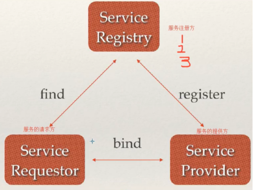
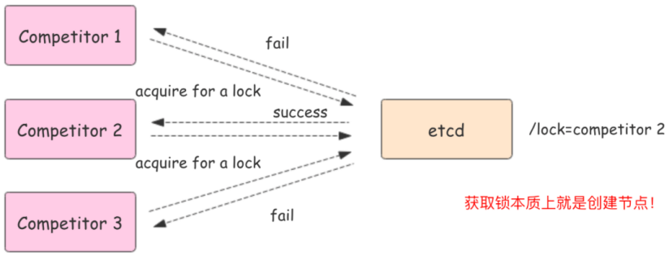
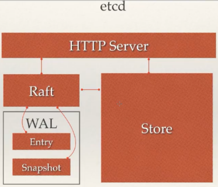

etcd是一个开源、高可用的分布式key-value存储，可以用于配置共享和服务注册和发现.
类似的项目有Zookeeper和consul，提供Restful的接口，使用简单，基于raft算法的强一致性，高可用的服务存储目录。
[etcd安装地址](go.etcd.io/etcd/client/v3)

**etcd具有以下特点:**
完全复制：集群中的每个节点都可以使用完整的存档
高可用性：Etcd可用于避免硬件的单点故障或网络问题
一致性：每次读取都会返回跨多主机的最新写入
简单：包括一个定义良好、面向用户的API（gRPC）
快速：每秒10000次写入的基准速度
可靠：使用Raft算法实现强一致性、高可用服务存储目录

# 一、Raft协议

1、选举
2、日志复制机制
3、异常处理(脑裂)
4、zookeeper的zad协议的区别
raft算法是一种分布式一致性算法，用于保证分布式系统中数据的一致性和可靠性。


1.etcd底层如何实现watch给客户发通知(websocket)

# 二、etcd应用场景
服务发现：在同一个分布式集群中的进程或服务,要如何才能找到对方并建立连接。服务发现就是想要了解集群中是否有进程在监听udp或tcp口，且通过名字就可以查找和连接。




## 配置中心
将一些配置信息放到etcd.上进行集中管理。
这类场景的使用肪式通常是这样:应用在启动的时候主动从etcd获取-次配置信息, 同时，在etcd节点上注册一个Watcher并等待,以后每次配置有更新的时候，etcd 都会实时通知订阅者，以此达到获取最新配置信息的目的。

## 分布式锁
因为etcd使用Raft算法保持了数据的强一致性,次操作存储到集群中的值必然是全局一致的,所以很容易实现分布式锁。锁服务有两种使用方式，-是保持独占，二是控制时序。
●保持独占即所有获取锁的用户最终只有一个可以得到。etcd 为此提供了一套实现分布式锁原子操作CAS ( CompareAndswap)的API。通过设置prevExist值，可以保证在多个节点同时去创建某个目绿时，只有一个成功。而创建成功的用户就可以认为是获得了锁。
●控制时序，即所有想要获得锁的用户都会被安排执行，但是获得锁的顺序也是全局唯一-的， 同时决定了执行顺序。etcd 为此也提供了一套 API (自动创建有序键)，对一个录建值时指定为POST动作，这样etcd会自动在目录下生成一个当前最大的值为键，存储这个新的值(客户端编号)。同时还可以使用API按顺序列出所有当前目录下的键值。此时这些键的值就是客户端的时序，而这些键中存储的值可以是代表客户端的编号。



# 为什么用etcd而不用ZooKeeper?
etcd实现的这些功能，ZooKeeper都能实现。那么为什么要用etcd而非直接使用ZooKeeper呢?
相较之下，ZooKeeper有如 下缺点:
	1.复杂。ZooKeeper的部署维护复杂,管理员需要掌握一系列的知识和技能; 而Paxos强一致性算法也是素来以复杂难懂而闻名于世外, ZooKeeper的使用也比较复杂,需要安装客户端，官方只提供了Java和C两种语言的接口。
	2.Java编写。这里不是对Java有偏见，而是Java本身就偏向于重型应用，它会引入大量的依赖。而运维人员则普遍希望保持强一致、可用的机器集群尽可能简单,维护起来也不易出错。
	3.发展缓慢。Apache 基金会项目特有的"Apache Way"在开源界饱受争议,其中一大原因就是由于基金会庞大的结构以及松散的管理导致项目发展缓慢。

## etcd优点

1.简单。使用Go语言编写部署简单;使用HTTP作为接口使用简单;使用Raft算法保证强- -致性让用户易于理解。
2.数据持久化。etcd 默认数据一更新就进行持久化。
3.安全。etcd 支持SSL客户端安全认证。
最后，etcd作为-个年轻的项目,真正告诉迭代和开发中,这既是一个优点, 也是一个缺点。 优点是它的未来具有无限的可能性,缺点是无法得到大项目长时间使用的检验。然而，目前CoreOS、Kubernetes和CloudFoundry等知名项目均在生产环境中使用了etcd,所以总的来说，etcd 值得你去尝试。

# etcd架构

**过程**：一个用户的请求发送过来，会经由HTTP Server转发给Store进行具体的事务处理，如果涉及到节点的修改，则交给Raft模块进行状态的变更、日志的记录，然后再同步给别的etcd节点以确认数据提交，最后进行数据的提交，再次同步。

从etcd的架构图中我们可以看到，**etcd 主要分为四个部分**。
●HTTP Server: 用于处理用户发送的API请求以及其它etcd节点的同步与心跳信息请求。
●Store: 用于处理etcd支持的各类功能的事务,包括数据索引、节点状态变更、监控与反馈、事件处理与执行等等，是etcd对用户提供的大多数API功能的具体实现。
●Raft: Raft强一致性算法的具体实现，是etcd的核心。
●WAL: Write Ahead Log (预写式日志)，是etcd的数据存储方式。除了在内存中存有所有数据的状态以及节点的索引以外，etcd就通过WAL进行持久化存储。WAL中，所有的数据提交前都会事先记录日志。Snapshot 是为了防止数据过多而进行的状态快照; Entry 表示存储的具体日志内容。

# etcd集群

etcd 作为一个高可用键值存储系统，天生就是为集群化而设计的。由于 Raft 算法在做决策时需要多数节点的投票，所以 etcd 一般部署集群推荐奇数个节点，推荐的数量为 3、5 或者 7 个节点构成一个集群。
搭建一个3节点集群示例：
在每个etcd节点指定集群成员，为了区分不同的集群最好同时配置一个独一无二的token。
下面是提前定义好的集群信息，其中n1、n2和n3表示3个不同的etcd节点。
官方的etcd 端口是 2379 用于客户端请求，2380 用于对等通信。每个集群成员和代理都接受键值读取和键值写入。
[部署参照github项目](https://github.com/etcd-io/etcd/releases)

```shell
./etcd  --listen-client-urls 'http://0.0.0.0:2379' --advertise-client-urls  'http://0.0.0.0:2379'  &		##后台启动
./etcdctl --endpoints=localhost:2379 put foo bar  ##插入/更新key-values数据
./etcdctl get foo ###按key值查询
./etcdctl get --print-value-only foo	##不显示key只限制values
./etcdctl get --prefix fo #按key前缀查找
etcdctl get --from-key "" ## 查找所有key
etcdctl del name11 ## 删除key name11
etcdctl del --prev-kv name12	## 删除key name12时并返回被删除的键值对
etcdctl del --prev-kv --from-key name3	 ## 删除指定字节排序起始值后的key
etcdctl del --prev-kv --prefix name	##删除指定前缀的key`
```

# Go操作etcd
这里使用官方的etcd/client/v3包来连接etcd并进行相关操作。go get go.etcd.io/etcd/client/v3
put命令用来设置键值对数据，get命令用来根据key获取值。
watch用来判断值是否改变并发出通知。