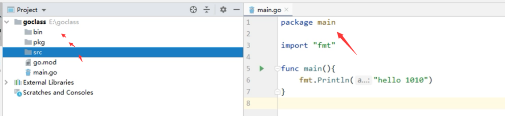
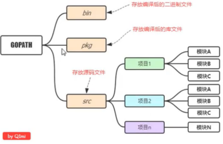
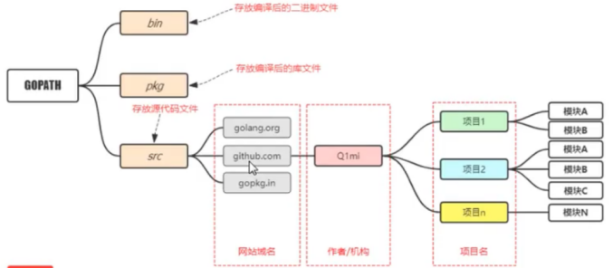

写代码逻辑：
1、向chatGPT发送需求，要求写明步骤，将细节或业务逻辑分步，再分步，

Go语言采用utf-8编码

运行主程序，包必须改成main

个人开发目录结构



企业常用目录结构


# Linux下配置Golang环境

[Go下载地址](https://golang.google.cn/dl/)

```shell
wget https://go.dev/dl/go1.20.2.linux-amd64.tar.gz  //Linux下配置go环境	
tar -zxvf  go1.20.2.linux-amd64.tar.gz -C /usr/local/
tee -a /etc/profile <<'EOF'
export GOROOT=/usr/local/go
export GOPATH=$HOME/go
export PATH=$PATH:$GOROOT/bin:$GOPATH/bin
export GO111MODULE=auto
EOF
```

刷新：source /etc/profile		测试：go version
配置远程代理仓库 ：

`go env -w GOPROXY=https://goproxy.cn,direct` 

`go env -w GOPROXY=https://mirrors.aliyun.com/goproxy/ `

GOROOT和GOPATH都是环境变量

GOROOT是我们安装go开发包的路径

Go 1.8版本开始，Go开发包在安装完成后会为GOPATH设置一个默认目录，并且在Go1.14及之后的版本中启用了Go Module模式之后，不一定非要将代码写到GOPATH目录下，所以也就不需要我们再自己配置GOPATH了，使用默认的即可。

```go
go env //查看电脑上的GOPATH路径
```


# go build编译命令

`go build fileName`用来启动编译，它可以将Go语言程序与相关依赖编译成一个可执行文件
	-o指定输出的可执行文件名，`build -o myexec  main.go  lib.go`
`go build+`包，直接根据包名进行编译，即便包内文件被增（加）删（除）也不影响编译指令

| 参数 | 解释                                        |
| ---- | ------------------------------------------- |
| -v   | 编译时显示包名                              |
| -p n | 开启并发编译，默认情况下该值为 CPU 逻辑核数 |

`go run fileName`命令将编译和执行指令合二为一，会在编译之后立即执行Go语言程序，但是不会生成可执行文件
`go install`分为两步:

​	1、先执行go build，编译得到.exe文件	2、将exe文件拷贝到项目中的bin下面


# Go mod包依赖管理

go mod命令如下：

| 命令            | 解释                                                     |
| --------------- | -------------------------------------------------------- |
| go mod download | 下载依赖的module到本地cache（默认为$GOPATH/pkg/mod目录） |
| go mod edit     | 编辑go.mod文件                                           |
| go mod graph    | 打印模块依赖图                                           |
| go mod init     | 初始化当前文件夹, 创建go.mod文件                         |
| go mod vendor   | 将依赖复制到vendor下                                     |
| go mod tidy     | 下载缺少的依赖，删除无用的依赖                           |
| go mod verify   | 校验依赖                                                 |
| go mod why      | 解释为什么需要依赖                                       |

go get命令可以下载依赖包，并且还可以指定下载的版本。

| 命令                   | 解释                                                         |
| ---------------------- | ------------------------------------------------------------ |
| go get -u              | 将会升级到最新的次要版本或者修订版本(x.y.z, z是修订版本号， y是次要版本号) |
| go get -u=patch        | 将会升级到最新的修订版本                                     |
| go get package@version | 将会升级到指定的版本号version                                |

`go get -d -v` 自动下载项目依赖包

| 参数 | 解释                                       | 参数 | 解释                       |
| ---- | ------------------------------------------ | ---- | -------------------------- |
| -d   | 让命令程序只执行下载动作，而不执行安装动作 | -v   | 打印出被构建的代码包的名字 |

如果下载所有依赖可以使用`go mod download`命令。


# GOPROXY
Go1.13之后GOPROXY默认值为https://proxy.golang.org，在国内是无法访问的，所以十分建议大家设置

```go
go env -w GOPROXY=https://goproxy.cn,direct		//GOPROXY的两个地址：goproxy.io、athens.azurefd.net
|—bin	项目编译的二进制文件
|—pkg	项目编译的中间产物，加速编译
|—src	项目源码
```

go.mod文件记录了项目所有的依赖信息，第三方的依赖包都下载到了GOPATH/ pkg/ mod目录下。
其结构大致如下：

```go
module github.com/Q1mi/studygo/blogger

go 1.12

require (
	github.com/DeanThompson/ginpprof v0.0.0-20190408063150-3be636683586 //版本-时间-hash值
	google.golang.org/appengine v1.6.1 // indirect：间接引用
)
```

`module`用来定义包名，一定要加上前缀
`require`用来定义依赖包及版本
`indirect`表示间接引用

```go
replace ( //在国内访问golang.org/x的各个包都需要翻墙，你可以在
	golang.org/x/net v0.0.0-20180821023952-922f4815f713 => github.com/golang/net v0.0.0-20180826012351-8a410e7b638d
	golang.org/x/text v0.3.0 => github.com/golang/text v0.3.0
)
```

go.sum文件，详细包名和版本信息


# 整理依赖

我们在代码中删除依赖代码后，相关的依赖库并不会在go.mod文件中自动移除。这种情况下我们可以使用`go mod tidy`命令更新go.mod中的依赖关系。

| 命令                                       | 解释                                                         |
| ------------------------------------------ | ------------------------------------------------------------ |
| go mod edit -fmt                           | 格式化。因为我们可以手动修改go.mod文件，所以有些时候需要格式化该文件 |
| go mod edit -require=golang.org/x/text     | 添加依赖项                                                   |
| go mod edit -droprequire=package path      | 如果只是想修改go.mod文件中的内容，比如要在go.mod中移除golang.org/x/text包 |
| go mod edit -droprequire=golang.org/x/text | 移除依赖项                                                   |


更多用法可以通过`go help mod edit`查看。

在项目中使用`go module`
如果需要对一个已经存在的项目启用go module，可以按照以下步骤操作：
在项目目录下执行`go mod init`，生成一个go.mod文件。
执行`go get`，查找并记录当前项目的依赖，同时生成一个go.sum记录每个依赖库的版本和哈希值。


# 创建新项目
对于一个新创建的项目，我们可以在项目文件夹下按照以下步骤操作：
执行`go mod init `项目名命令，在当前项目文件夹下创建一个go.mod文件。
手动编辑go.mod中的require依赖项或执行go get自动发现、维护依赖。

**问题**：当go get的时候报错如下(或者golang的版本升级之后报错如下)

> go: go.mod file not found in current directory or any parent directory; see 'go help modules'

**解决办法**
1：开启go modules功能，命令行输入

```sh
go env -w GO111MODULE=on
```

2：在该项目目录下，初始化Go moudle，运行下面命令

```sh
go mod init xxx //xxx代表文件夹名
```

导入本地包
**包**：模块化的开发理念（支持代码模块化和代码复用）。
在一个项目（project）下我们是可以定义多个包（package）的。一个包中只能有一个main函数
标识符可见性：只有那些首字母是大写的标识符才是对其他包可见的

`Init(){ }函数`：特殊的函数不接收任何参数也没有任何返回值。不能在代码中主动调用它。
当程序启动的时候，init函数会按照它们声明的顺序自动执行。 


go.mod作用：它的作用是用于指示 Go 在拉取模块时遇到错误会回源到模块版本的源地址去抓取(比如 GitHub 等）

```go
import (
   ca "calculator" //使用ca别名
   "fmt"
)
```

```go
"mypackage"		//不在同一个项目下
require "mypackage" v0.0.0
replace "mypackage" => "../mypackage"	
├── moduledemo  
│   ├── go.mod
│   └── main.go
└── mypackage
    ├── go.mod
    └── mypackage.go

"moduledemo/mypackage"  // 导入同一项目下的mypackage包
moduledemo
├── go.mod
├── main.go
└── mypackage
    └── mypackage.go
```
