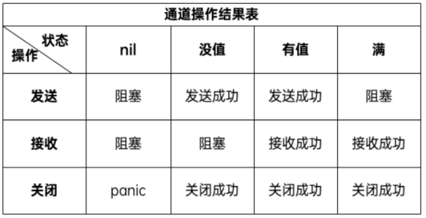

# 并发
**并发编程相关的基本概念**：

> 串行：我们都是先读小学，小学毕业后再读初中，读完初中再读高中。
> 并发：同一时间段内执行多个任务（你在用微信和两个女朋友聊天）。
> 并行：同一时刻执行多个任务（你和你朋友都在用微信和女朋友聊天）。

> 进程（process）：程序在操作系统中的一次执行过程，系统进行资源分配和调度的一个独立单位>
> 线程（thread）：操作系统基于进程开启的轻量级进程，是操作系统调度执行的最小单位>
> 协程（coroutine）：非操作系统提供而是由用户自行创建和控制的用户态‘线程’，比线程更轻量级

Go语言的并发通过goroutine 实现。goroutine 类似于线程,属于用户态的线程，我们可以根据需要创建成千，上万
个goroutine并发工作。goroutine是由Go语言的运行时(runtime) 调度完成，而线程是由操作系统调度完成。
Go语言还提供channel在多个goroutine间进行通信。goroutine 和channel是Go语言秉承的CSP (Communicating Sequential Process)并发模式的重要实现基础。

## 并发模型：

业界将如何实现并发编程总结归纳为各式各样的并发模型，常见的并发模型有以下几种：

> 线程&锁模型		Actor模型		CSP模型		Fork&Join模型

Go语言中的并发程序主要是通过基于CSP（communicating sequential processes）的goroutine和channel来实现，当然也支持使用传统的多线程共享内存的并发方式。

## Goroutine：
Goroutine 类似于“线程”，是 Go 程序中最基本的并发执行单元。
每一个 Go 程序都至少包含一个 goroutine——`main goroutine`，当 Go 程序启动时它会自动创建。
在函数或方法调用前加上go关键字就可以创建一个 goroutine ，从而让该函数或方法在新创建的 goroutine 中执行。
一个goroutine会以一个很小的栈开始其生命周期，一般只需要2KB。goroutine 的调度顺序是随机的。
Go提供channel在多个goroutine间进行通信。

> ​	#在Go语言编程中你不需要去自己写进程、线程、协程，你的技能包里只有一个技能——goroutine，当你需要让某个任务并发执行的时候，你只需要把这个任务包装成一个函数，开启一个 goroutine 去执行这个函数就可以了，就是这么简单粗暴。
>

# 并发---关键字go
只需要在函数或方法调用前加上go关键字就可以创建一个 goroutine ，从而让该函数或方法在新创建的 goroutine 中执行。
main函数自带一个goroutine

```go
go f()  // 创建一个新的 goroutine 运行函数f 
```

## 创建单个协程
```go
go func(){   ...}() //匿名函数也支持使用go关键字创建 goroutine 去执行
```

一个 goroutine 必定对应一个函数/方法，可以创建多个 goroutine 去执行相同的函数/方法。


串行执行的问题：无法保证父进程在子进程后结束。

> 为什么会先打印你好呢？
> 这是因为在程序中创建 goroutine 执行函数需要一定的开销，而与此同时 main 函数所在的 goroutine 是继续执行的。

## 创建多个协程
`wg Sync.WaitGroup`结构体提供了一些常用的并发原语，等待一组 goroutines 完成

```go
wg.Add(1) // 启动一个goroutine就登记+1		
wg.Done() // goroutine结束就登记-1
wg.Wait() // 等待所有登记的goroutine都结束
```

## Goroutine与os线程的区别：

操作系统的os线程一般都有固定的栈内存（通常为2MB）
Go是动态栈，goroutine 非常轻量级，一个 goroutine 的初始栈空间很小（一般为2KB），所以在 Go 语言中一次创建数万个 goroutine 也是可能的。并且 goroutine 的栈不是固定的，可以根据需要动态地增大或缩小， Go 的 runtime 会自动为 goroutine 分配合适的栈空间。

### Goroutine调度---GMP

操作系统的线程会被操作系统内核调度时会挂起当前执行的线程并将它的寄存器内容保存到内存中，选出下一次要执行的线程并从内存中恢复该线程的寄存器信息，然后恢复执行该线程的现场并开始执行线程。从一个线程切换到另一个线程需要完整的上下文切换。因为可能需要多次内存访问，索引这个切换上下文的操作开销较大，会增加运行的cpu周期。
区别于操作系统内核调度操作系统线程，goroutine 的调度是Go语言运行时（runtime）层面的实现，是完全由 Go 语言本身实现的一套调度系统——`go scheduler`。它的作用是按照一定的规则将所有的 goroutine 调度到操作系统线程上执行。
目前 Go 语言的调度器采用的是 GMP 调度模型。G (goroutine协程)、M (thread线程)、P (Processor调度器)


`G`：表示 goroutine，包含要执行的函数和上下文信息(如所在P的绑定信息)	
`全局队列（Global Queue）`：存放等待运行的 G（还未放入P中的G）

`P`：表示 goroutine 执行所需的CPU资源，最多有 GOMAXPROCS 个（可设置）
`P 的本地队列`：同全局队列类似，存放的也是等待运行的G，存的数量有限，不超过256个。新建 G 时，G 优先加入到 P 的本地队列，如果本地队列满了会批量移动部分 G 到全局队列。

`M`：表示映射的os线程，线程想运行任务就得获取 P，从 P 的本地队列获取 G，
当 P 的本地队列为空时，M 也会尝试从全局队列或其他 P 的本地队列获取 G。
M 运行 G，G 执行之后，M 会从 P 获取下一个 G，不断重复下去。

Goroutine 调度器和操作系统调度器是通过 M 结合起来的，每个 M 都代表了1个内核线程，操作系统调度器负责把内核线程分配到 CPU 的核上执行。

单从线程调度讲，Go语言相比起其他语言的优势在于OS线程是由OS内核来调度的， goroutine 则是由Go运行时（runtime）自己的调度器调度的，完全是在用户态下完成的， 不涉及内核态与用户态之间的频繁切换，包括内存的分配与释放，都是在用户态维护着一块大的内存池， 不直接调用系统的malloc函数（除非内存池需要改变），成本比调度OS线程低很多。 另一方面充分利用了多核的硬件资源，近似的把若干goroutine均分在物理线程上， 再加上本身 goroutine 的超轻量级，以上种种特性保证了 goroutine 调度方面的性能。

### GOMAXPROCS最大CPU调度参数：
Go调度器使用GOMAXPROCS参数来确定需要使用多少个 OS 线程来同时执行 Go 代码。（默认值是满CPU核心数）

> 例如：在一个 8 核心的机器上，GOMAXPROCS 默认为 8。
> Go语言中可以通过runtime.GOMAXPROCS函数设置当前程序并发时占用的 CPU逻辑核心数。

Go语言中的操作系统线程和goroutine用户级线程的关系:

​	1、一个操作系统线程对应用户态多个goroutine。

​	2、go程序可以同时使用多个操作系统线程。

​	3、goroutine和OS线程是多对多的关系，即m:n，将m个goroutine分配到n个OS线程上。

## channel通道
单纯地将函数并发执行是没有意义的。函数与函数间需要交换数据才能体现并发执行函数的意义。

> ​	#虽然可以使用共享内存进行数据交换，但是共享内存在不同的 goroutine 中容易发生竞态问题。为了保证数据交换的正确性，很多并发模型中必须使用互斥量对内存进行加锁，这种做法势必造成性能问题。

并发模型：`CSP(Communicating Sequential Processes通讯连续进程)`，提倡通过通信共享内存而不是通过共享内存而实现通信。(不用时就关闭)
Go的CSP并发模型，是通过goroutine和channel来实现的：
goroutine 是Go程序并发的执行体。channel就是它们之间的连接。
channel是可以让一个 goroutine 发送特定值到另一个 goroutine 的通信机制。

Go 语言中的通道（channel）是一种特殊的类型。通道像一个传送带或者队列，总是遵循“先入先出（First In First Out）”的规则，保证收发数据的顺序。每一个通道都是一个具体类型的导管，也就是声明channel的时候需要为其指定元素类型。

Channel通道声明（默认零值是nil）
var 变量名称 chan 元素类型			(元素类型：是指通道中传递元素的类型)
channel初始化：声明的通道类型变量需要使用内置的make函数初始化之后才能使用。
make(chan 元素类型, [缓冲大小])  // 缓冲大小是可选的。

定义单向通道：

```go
<-chan int  // 接收通道，只能接收不能发送			
chan<- int  // 发送通道，只能发送不能接收
```

> ​	#对关闭的通道取值，是能够取到的。如果还有值，则取到的值为ok为ture，否则为false，取到的值为对应基本类型的零值

channel三种操作（都使用<-符号）：

> 发送（send）、接收(receive）和关闭（close）

close(ch)关闭通道：通过调用内置的close函数来关闭通道

通道发送/取值

```go
value, ok := <- ch := make(chan int,num)	// value为接收到的值，ok为缓冲区状态ture或false
```

for range循环从通道中接收值，当通道被关闭后，会在通道内的所有值被接收完毕后会自动退出循环。

> ​	#目前Go语言中并没有提供一个,不对通道进行读取操作就能判断通道是否被关闭的方法。不能简单的通过len(ch)操作来判断通道是否被关闭。
>
> ​	#无缓冲通道可以进行编译，但执行会报错



## select多路复用（取值）

当需要同时从多个通道接收/发送数据。
如果没有数据可以被接收那么当前 goroutine 将会发生阻塞。尝试使用遍历的方式来实现从多个通道中接收值。
select关键字：使用它可以同时响应多个通道的操作

```go
For {select {case <-ch1:
	case data := <-ch2:
	case ch3 <- 10:
	default: //默认操作，通道关闭时执行 
 }
```

Select 语句具有以下特点：
	1、可处理一个或多个 channel 的发送/接收操作。
	2、如果多个 case 同时满足，select 会随机选择一个执行。
	3、对于没有符合case 的 select 会一直阻塞，可用于阻塞 main 函数，防止退出。

## sync同步包---读写安全和锁
产生原因：代码中可能会存在多个 goroutine 同时操作一个资源（临界区）的情况，可能发生竞态问题（数据竞态）。
产生结果：两个 goroutine 在访问和修改全局的x变量时就会存在数据竞争，某个 goroutine 中对全局变量x的修改可能会覆盖掉另一个 goroutine 中的操作，所以导致最后的结果与预期不符。

### 互斥锁
一种常用的控制共享资源访问的方法。能够保证同一时间有且只有一个 goroutine 进入临界区访问数据，其他的 goroutine 则在等待锁；
当互斥锁释放后，等待的 goroutine 才可以获取锁进入临界区，多个 goroutine 同时等待一个锁时，唤醒的策略是随机的。
`sync.Mutex`结构体类型来实现互斥锁。提供了两个内置方法：

| 方法名                 | 功能       | 方法名                   | 功能       |
| ---------------------- | ---------- | ------------------------ | ---------- |
| func (m *Mutex) Lock() | 获取互斥锁 | func (m *Mutex) Unlock() | 释放互斥锁 |


### 读写互斥锁
互斥锁是完全互斥的，但是实际上有很多场景是读>写的。故能够极大地提高程序的性能
当并发的去读取一个资源而不涉及资源修改的时候是没有必要加互斥锁的，这种场景下使用读写锁是更好的一种选择。
读写锁`sync.RWMutex`结构体类型提供了以下5个方法:

| 方法名                              | 功能                           | 方法名                     | 功能     |
| ----------------------------------- | ------------------------------ | -------------------------- | -------- |
| func (rw *RWMutex) Lock()           | 获取写锁                       | func (rw *RWMutex) RLock() | 获取读锁 |
| func (rw *RWMutex) Unlock()         | 释放写锁                       | func (rw *RWMutex) RUnlock | 释放读锁 |
| func (rw *RWMutex) RLocker() Locker | 返回一个实现Locker接口的读写锁 |                            |          |

读写锁分为读锁和写锁：
当一个 goroutine 获取到读锁之后，其他的 goroutine 如果是获取读锁会继续获得锁，
如果是获取写锁就会等待；而当一个 goroutine 获取写锁之后，其他的 goroutine 获取读锁和写锁都会等待。


### sync.WaitGroup并发同步计数器
在代码中生硬的使用time.Sleep肯定是不合适的，Go语言中使用sync.WaitGroup来实现并发任务的同步，有以下几个方法：

| 方法名                               | 功能                | 方法名                      | 功能     |
| ------------------------------------ | ------------------- | --------------------------- | -------- |
| func (wg * WaitGroup) Add(delta int) | 计数器+delta        | func (wg *WaitGroup) Done() | 计数器-1 |
| func (wg *WaitGroup) Wait()          | 阻塞直到计数器变为0 |                             |          |

`sync.WaitGroup`内部维护着一个计数器，计数器的值可以增加和减少。
例如当我们启动了 N 个并发任务时，就将计数器值增加N。每个任务完成时通过调用 Done 方法将计数器减1。通过调用 Wait 来等待并发任务执行完，当计数器值为 0 时，表示所有并发任务已经完成。

### sync.Once一次异步并发

在某些操作即在高并发的场景下只会被执行一次，例如只加载一次配置文件等。
Go语言中的sync包中提供了一个针对只执行一次场景的解决方案——`sync.Once.Do()`方法，其签名如下：

```go
func (o *Once) Do(f func())	//注意：如果要执行的函数f需要传递参数就需要搭配闭包来使用。
```

延迟一个开销很大的初始化操作到真正用到它的时候再执行是一个很好的实践。因为预先初始化一个变量（比如在init函数中完成初始化）会增加程序的启动耗时，而且有可能实际执行过程中这个变量没有用上，那么这个初始化操作就不是必须要做的。

`sync.Once内部`：包含一个互斥锁和一个布尔值，互斥锁保证布尔值和数据的安全，而布尔值用来记录初始化是否完成。
这样设计就能保证初始化操作的时候是并发安全的并且初始化操作也不会被执行多次。

### sync.Map
#内置的 map 并发不安全，需要使用到sync.Map加锁来保证并发的安全性。
Go语言的sync包中提供了一个开箱即用的并发安全版`sync.Map`。
不需要使用 make 函数初始化就能直接使用。同时内置数据操作方法：

```go
func (m *Map) Store(key, value interface{})	//存储key-value数据
func (m *Map) Load(key interface{}) (value interface{}, ok bool) //查询key对应的value
func (m *Map) LoadOrStore(key, value interface{}) (actual interface{}, loaded bool)	//查询或存储key对应的value
func (m *Map) LoadAndDelete(key interface{}) (value interface{}, loaded bool) //查询并删除key
func (m *Map) Delete(key interface{}) //删除key
func (m *Map) Range(f func(key, value interface{}) bool) //对map中的每个key-value依次调用f
```


### atomic包原子操作
atomic包针对整数数据类型（int32、uint32、int64、uint64）我们还可以使用原子操作来保证并发安全，
使用原子操作比使用锁操作效率更高。由内置的标准库sync/atomic提供。
方法	解释
func LoadInt32(addr *int32) (val int32)
func LoadInt64(addr *int64) (val int64)
func LoadUint32(addr *uint32) (val uint32)
func LoadUint64(addr *uint64) (val uint64)
func LoadUintptr(addr *uintptr) (val uintptr)
func LoadPointer(addr *unsafe.Pointer) (val unsafe.Pointer)	读取操作
func StoreInt32(addr *int32, val int32)
...
func StoreUint64(addr *uint64, val uint64)
func StoreUintptr(addr *uintptr, val uintptr)
func StorePointer(addr *unsafe.Pointer, val unsafe.Pointer)	写入操作
func AddInt32(addr *int32, delta int32) (new int32)
...
func AddUint64(addr *uint64, delta uint64) (new uint64)
func AddUintptr(addr *uintptr, delta uintptr) (new uintptr)	修改操作
func SwapInt32(addr *int32, new int32) (old int32)
...
func SwapUint64(addr *uint64, new uint64) (old uint64)
func SwapUintptr(addr *uintptr, new uintptr) (old uintptr)
func SwapPointer(addr *unsafe.Pointer, new unsafe.Pointer) (old unsafe.Pointer)	交换操作
func CompareAndSwapInt32(addr *int32, old, new int32) (swapped bool)
...
func CompareAndSwapUint64(addr *uint64, old, new uint64) (swapped bool)
func CompareAndSwapUintptr(addr *uintptr, old, new uintptr) (swapped bool)
func CompareAndSwapPointer(addr *unsafe.Pointer, old, new unsafe.Pointer) (swapped bool)	比较并交换操作

# context库
**context标准库**：它定义了Context类型，专门用来简化于处理单个请求的多个goroutine之间与请求域的数据、取消信号、截止时间等相关操作，这些操作可能涉及多个 API 调用。
对服务器传入的请求应该创建上下文，而对服务器的传出调用应该接受上下文。
它们之间的函数调用链必须传递上下文，或者可以使用`WithCancel`、`WithDeadline(相对时间)`、`WithTimeout(绝对时间)`或`WithValue`创建的派生上下文。当一个上下文被取消时，它派生的所有上下协程也被取消。

```go
context.Background()  //返回一个非 nil 的空上下文，作为一个初始结束节点
ctx, cancel := context.WithCancel(context.Background()) //返回具有“结束“命令的父级副本和cancel结束命令
cancel() // 作用：通知所有子goroutine结束命令，支持递归传递
```

​	**例**：在 Go http包的Server中，每一个请求在都有一个对应的 goroutine 去处理。请求处理函数通常会启动额外的 goroutine 用来访问后端服务，比如数据库和RPC服务。
用来处理一个请求的 goroutine 通常需要访问一些与请求特定的数据，比如终端用户的身份认证信息、验证相关的token、请求的截止时间。
当一个请求被取消或超时时，所有用来处理该请求的 goroutine 都应该迅速退出，然后系统才能释放这些 goroutine 占用的资源。

`context.Context`是一个接口，该接口定义了四个需要实现的方法。具体签名如下：

```go
type Context interface {
    Deadline() (deadline time.Time, ok bool)
    Done() <-chan struct{}
    Err() error
    Value(key interface{}) interface{}  }
```

`Deadline方法`需要返回当前Context被取消的时间，也就是完成工作的截止时间（deadline）；
`Done方法`需要返回一个Channel，这个Channel会在当前工作完成或者上下文被取消之后关闭，多次调用Done方法会返回同一个Channel；
`Err方法`会返回当前Context结束的原因，它只会在Done返回的Channel被关闭时才会返回非空的值；
如果当前Context被取消就会返回Canceled错误；
如果当前Context超时就会返回DeadlineExceeded错误；

`Value方法`会从Context中返回键对应的值，对于同一个上下文来说，多次调用Value 并传入相同的Key会返回相同的结果，该方法仅用于传递跨API和进程间跟请求域的数据；


## Background()和TODO()函数
这两个函数分别返回一个实现了Context接口的`background`和`todo`。我们代码中最开始都是以这两个内置的上下文对象作为最顶层的partent context，衍生出更多的子上下文对象。

`Background()`主要用于main函数、初始化以及测试代码中，作为Context这个树结构的最顶层的Context，也就是根Context。
`TODO()`，它目前还不知道具体的使用场景，如果我们不知道该使用什么Context的时候，可以使用这个。

background和todo本质上都是emptyCtx结构体类型，是一个不可取消，没有设置截止时间，没有携带任何值的Context。

## with系列函数

```go
WithCancel(parent Context) (ctx Context, cancel CancelFunc)
```

返回带有新Done通道的父节点的副本。当调用返回的cancel函数或关闭父上下文的Done通道时，将关闭返回上下文的Done通道，无论先发生什么情况。
取消此上下文将释放与其关联的资源，因此代码应该在此上下文中运行的操作完成后立即调用cancel。

```go
WithDeadline(parent Context, deadline time.Time) (Context, CancelFunc)	//绝对时间
```

返回具有“结束“命令的父级副本，并指定结束时间deadline（调用CancelFunc()函数也会提前结束）。

```go
WithTimeout(parent Context, timeout time.Duration) (Context, CancelFunc) #相对时间
WithDeadline(parent, time.Now().Add(timeout))  //取消此上下文将释放与其相关的资源，因此代码应该在此上下文中运行的操作完成后立即调用cancel，通常用于数据库或者网络连接的超时控制。
```

`WithValue函数`能够将请求作用域的数据与 Context 对象建立关系。

```go
func WithValue(parent Context, key, val interface{}) Context // 返回父节点的副本，其中与key关联的值为val。
```

仅对API和进程间传递请求域的数据使用上下文值，而不是使用它来传递可选参数给函数。
提供可比较的键，并且不应该是string类型或任何其他内置类型，以避免使用上下文在包之间发生冲突。WithValue的用户应该为键定义自己的类型。为了避免在分配给interface{}时进行分配，上下文键通常具有具体类型struct{}。或者，导出的上下文关键变量的静态类型应该是指针或接口。

## 使用Context的注意事项
推荐以参数的方式显示传递Context
以Context作为参数的函数方法，应该把Context作为第一个参数。
给一个函数方法传递Context的时候，不要传递nil，如果不知道传递什么，就使用`context.TODO()`
Context的Value相关方法应该传递请求域的必要数据，不应该用于传递可选参数
Context是线程安全的，可以放心的在多个goroutine中传递

