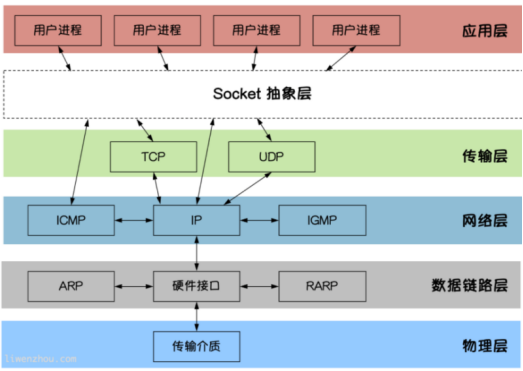
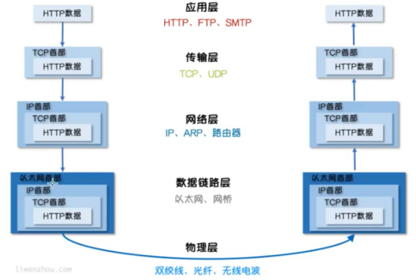
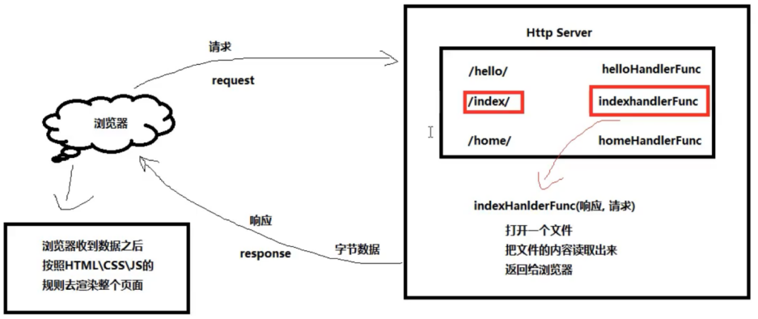

net/http包提供了HTTP客户端和服务端的实现。
Socket是BSD UNIX的进程通信机制，通常也称作”套接字”，用于描述IP地址和端口，是一个通信链的句柄。Socket可以理解为TCP/IP网络的API，它定义了许多函数或例程，程序员可以用它们来开发TCP/IP网络上的应用程序。电脑上运行的应用程序通常通过”套接字”向网络发出请求或者应答网络请求。

**socket图解**
Socket编程是在应用层与TCP/IP协议族通信的中间软件抽象层。在设计模式中，Socket其实就是一个门面模式，它把复杂的TCP/IP协议族隐藏在Socket后面，对用户来说只需要调用Socket规定的相关函数，让Socket去组织符合指定的协议数据然后进行通信。





## TCP通信

### TCP协议
TCP/IP(Transmission Control Protocol/Internet Protocol) 即传输控制协议/网间协议，是一种面向连接（连接导向）的、可靠的、基于字节流的传输层（Transport layer）通信协议，因为是面向连接的协议，数据像水流一样传输，会存在黏包问题。

### TCP服务端

##一个TCP服务端可以同时连接很多个客户端，例如世界各地的用户使用自己电脑上的浏览器访问淘宝网。因为Go语言中创建多个goroutine实现并发非常方便和高效，所以我们可以每建立一次链接就创建一个goroutine去处理。

TCP服务端程序的处理流程：1、监听端口 2、接收客户端请求建立链接	3、创建goroutine处理链接。
TCP客户端进行TCP通信的流程如下：1、建立与服务端的链接	2、进行数据收发	3、关闭链接


### “粘包”现象：
客户端分10次发送的数据，在服务端并没有成功的输出10次，而是多条数据“粘”到了一起。
为什么会出现粘包：主要原因就是tcp数据传递模式是流模式，在保持长连接的时候可以进行多次的收和发。

###“粘包”可发生在发送端也可发生在接收端
由Nagle算法造成的发送端的粘包：Nagle算法是一种改善网络传输效率的算法。简单来说就是当我们提交一段数据给TCP发送时，TCP并不立刻发送此段数据，而是等待一小段时间看看在等待期间是否还有要发送的数据，若有则会一次把这两段数据发送出去。
接收端接收不及时造成的接收端粘包：TCP会把接收到的数据存在自己的缓冲区中，然后通知应用层取数据。当应用层由于某些原因不能及时的把TCP的数据取出来，就会造成TCP缓冲区中存放了几段数据。

### 解决办法：
出现”粘包”的关键在于接收方不确定将要传输的数据包的大小，因此我们可以对数据包进行封包和拆包的操作。
封包：封包就是给一段数据加上包头，这样一来数据包就分为包头和包体两部分内容了(过滤非法包时封包会加入”包尾”内容)。包头部分的长度是固定的，并且它存储了包体的长度，根据包头长度固定以及包头中含有包体长度的变量就能正确的拆分出一个完整的数据包。
我们可以自己定义一个协议，比如数据包的前4个字节为包头，里面存储的是发送的数据的长度。
定义的proto包的Decode和Encode函数处理数据
其中包含大端和小端的知识


## UDP通信
UDP协议（User Datagram Protocol）中文名称是用户数据报协议，是OSI（Open System Interconnection，开放式系统互联）参考模型中一种无连接的传输层协议，不需要建立连接就能直接进行数据发送和接收，属于不可靠的、没有时序的通信，但是UDP协议的实时性比较好，通常用于视频直播相关领域。


## http编程
HTTP协议：超文本传输协议（HTTP，HyperText Transfer Protocol)是互联网上应用最为广泛的一种网络传输协议，所有的WWW文件都必须遵守这个标准。设计HTTP最初的目的是为了提供一种发布和接收HTML页面的方法。

Go语言内置的net/http包提供了HTTP客户端和服务端的实现。

### HTTP客户端
基本的HTTP/HTTPS请求
Get、Head、Post和PostForm函数发出HTTP/HTTPS请求：

```go
http.Get("http://example.com/")...
http.Post("http://example.com/upload", "image/jpeg", &buf)...
http.PostForm("http://example.com/form",url.Values{"key": {"Value"}, "id": {"123"}})

defer resp.Body.Close()  //程序在使用完response后必须关闭回复的主体
body, err := ioutil.ReadAll(resp.Body)// 
```




### 自定义Client
要管理HTTP客户端的头域、重定向策略和其他设置，创建一个Client
```go
client := &http.Client{
	CheckRedirect: redirectPolicyFunc,}
resp, err := client.Get("http://example.com")// ...
req, err := http.NewRequest("GET", "http://example.com", nil)// ...
req.Header.Add("If-None-Match", `W/"wyzzy"`)
resp, err := client.Do(req)// ...
```


### 自定义Transport

要管理代理、TLS配置、keep-alive、压缩和其他设置，创建一个Transport

```go
tr := &http.Transport{
	TLSClientConfig:    &tls.Config{RootCAs: pool},
	DisableCompression: true,}
client := &http.Client{Transport: tr}
resp, err := client.Get("https://example.com")
```

Client和Transport类型都可以安全的被多个goroutine同时使用。出于效率考虑，应该一次建立、尽量重用

### 服务端

默认的Server
ListenAndServe使用指定的监听地址和处理器启动一个HTTP服务端。处理器参数通常是nil，这表示采用包变量DefaultServeMux作为处理器。
Handle和HandleFunc函数可以向DefaultServeMux添加处理器。

```go
http.Handle("/foo", fooHandler)
http.HandleFunc("/bar", func(w http.ResponseWriter, r *http.Request) {
	fmt.Fprintf(w, "Hello, %q", html.EscapeString(r.URL.Path))})
log.Fatal(http.ListenAndServe(":8080", nil))
```

net/http包来编写一个简单的接收HTTP请求的Server端示例，net/http包是对net包的进一步封装，专门用来处理HTTP协议的数据

## http/template包

html/template包实现了数据驱动的模板，用于生成可防止代码注入的安全的HTML内容。它提供了和text/template包相同的接口，Go语言中输出HTML的场景都应使用html/template这个包。
### 模板与渲染
在一些前后端不分离的Web架构中，我们通常需要在后端将一些数据渲染到HTML文档中，从而实现动态的网页（网页的布局和样式大致一样，但展示的内容并不一样）效果。
我们这里说的模板可以理解为事先定义好的HTML文档文件，模板渲染的作用机制可以简单理解为文本替换操作–使用相应的数据去替换HTML文档中事先准备好的标记。
很多编程语言的Web框架中都使用各种模板引擎，比如Python语言中Flask框架中使用的jinja2模板引擎。

### Go语言的模板引擎
Go语言内置了文本模板引擎text/template和用于HTML文档的html/template。它们的作用机制可以简单归纳如下：
模板文件通常定义为.tmpl和.tpl为后缀（也可以使用其他的后缀），必须使用UTF8编码。
模板文件中使用{{和}}包裹和标识需要传入的数据。
传给模板这样的数据就可以通过点号（.）来访问，如果数据是复杂类型的数据，可以通过{ { .FieldName }}来访问它的字段。
除{{和}}包裹的内容外，其他内容均不做修改原样输出。

### 模板引擎的使用
Go语言模板引擎的使用可以分为三部分：定义模板文件、解析模板文件和模板渲染.
#### 1、定义模板文件
其中，定义模板文件时需要我们按照相关语法规则去编写，后文会详细介绍。
#### 2、解析模板文件
上面定义好了模板文件之后，可以使用下面的常用方法去解析模板文件，得到模板对象：

```go
func (t *Template) Parse(src string) (*Template, error)
func ParseFiles(filenames ...string) (*Template, error)
func ParseGlob(pattern string) (*Template, error)
```

当然，你也可以使用func New(name string) *Template函数创建一个名为name的模板，然后对其调用上面的方法去解析模板字符串或模板文件。
#### 3、模板渲染
渲染模板简单来说就是使用数据去填充模板，当然实际上可能会复杂很多。

```go
func (t *Template) Execute(wr io.Writer, data interface{}) error
func (t *Template) ExecuteTemplate(wr io.Writer, name string, data interface{}) error
```


### 模板语法
{{.}}
模板语法都包含在{{和}}中间，其中{{.}}中的点表示当前对象。
当我们传入一个结构体对象时，我们可以根据.来访问结构体的对应字段。
当我们传入的变量是map时，也可以在模板文件中通过.根据key来取值。

#### 注释
{{/* a comment */}}
注释，执行时会忽略。可以多行。注释不能嵌套，并且必须紧贴分界符始止。

#### pipeline
pipeline是指产生数据的操作。比如{{.}}、{{.Name}}等。Go的模板语法中支持使用管道符号|链接多个命令，用法和unix下的管道类似：|前面的命令会将运算结果(或返回值)传递给后一个命令的最后一个位置。
注意：并不是只有使用了|才是pipeline。Go的模板语法中，pipeline的概念是传递数据，只要能产生数据的，都是pipeline。


变量
我们还可以在模板中声明变量，用来保存传入模板的数据或其他语句生成的结果。具体语法如下：
$obj := {{.}}，其中$obj是变量的名字，在后续的代码中就可以使用该变量了。

移除空格
有时候我们在使用模板语法的时候会不可避免的引入一下空格或者换行符，这样模板最终渲染出来的内容可能就和我们想的不一样，这个时候可以使用{{-语法去除模板内容左侧的所有空白符号， 使用-}}去除模板内容右侧的所有空白符号。
例如：
{{- .Name -}}，注意：-要紧挨{{和}}，同时与模板值之间需要使用空格分隔。

条件判断
Go模板语法中的条件判断有以下几种:

```
{{if pipeline}} T1 {{end}}
{{if pipeline}} T1 {{else}} T0 {{end}}
{{if pipeline}} T1 {{else if pipeline}} T0 {{end}}
```

range
Go的模板语法中使用range关键字进行遍历，有以下两种写法，其中pipeline的值必须是数组、切片、字典或者通道。
{{range pipeline}} T1 {{end}}
如果pipeline的值其长度为0，不会有任何输出
{{range pipeline}} T1 {{else}} T0 {{end}}
如果pipeline的值其长度为0，则会执行T0。

with
{{with pipeline}} T1 {{end}}
如果pipeline为empty不产生输出，否则将dot设为pipeline的值并执行T1。不修改外面的dot。
{{with pipeline}} T1 {{else}} T0 {{end}}
如果pipeline为empty，不改变dot并执行T0，否则dot设为pipeline的值并执行T1。

预定义函数
执行模板时，函数从两个函数字典中查找：首先是模板函数字典，然后是全局函数字典。一般不在模板内定义函数，而是使用Funcs方法添加函数到模板里。

预定义的全局函数如下：
`and函数`返回它的第一个empty参数或者最后一个参数；
    就是说"and x y"等价于"if x then y else x"；所有参数都会执行；
`or`返回第一个非empty参数或者最后一个参数；
    亦即"or x y"等价于"if x then x else y"；所有参数都会执行；
`not`返回它的单个参数的布尔值的否定
`len`返回它的参数的整数类型长度
`index`执行结果为第一个参数以剩下的参数为索引/键指向的值；
	如"index x 1 2 3"返回x[1][2][3]的值；每个被索引的主体必须是数组、切片或者字典。
`print`即fmt.Sprint	，printf即fmt.Sprintf	，println即fmt.Sprintln
`html`返回与其参数的文本表示形式等效的转义HTML。
    这个函数在html/template中不可用。
`urlquery`以适合嵌入到网址查询中的形式返回其参数的文本表示的转义值。
    这个函数在html/template中不可用。
`js`返回与其参数的文本表示形式等效的转义JavaScript。
`call`执行结果是调用第一个参数的返回值，该参数必须是函数类型，其余参数作为调用该函数的参数；
	如"call .X.Y 1 2"等价于go语言里的dot.X.Y(1, 2)；
    其中Y是函数类型的字段或者字典的值，或者其他类似情况；
    call的第一个参数的执行结果必须是函数类型的值（和预定义函数如print明显不同）；
    该函数类型值必须有1到2个返回值，如果有2个则后一个必须是error接口类型；
    如果有2个返回值的方法返回的error非nil，模板执行会中断并返回给调用模板执行者该错误；
`比较函数`布尔函数会将任何类型的零值视为假，其余视为真。

| 符号 | 含义                     | 符号 | 含义                     |
| ---- | ------------------------ | ---- | ------------------------ |
| eq   | 如果arg1 == arg2则返回真 | ne   | 如果arg1 != arg2则返回真 |
| lt   | 如果arg1 < arg2则返回真  | le   | 如果arg1 <= arg2则返回真 |
| gt   | 如果arg1 > arg2则返回真  | ge   | 如果arg1 >= arg2则返回真 |

为了简化多参数相等检测，eq（只有eq）可以接受2个或更多个参数，它会将第一个参数和其余参数依次比较，
{{eq arg1 arg2 arg3}}
比较函数只适用于基本类型（或重定义的基本类型，如”type Celsius float32”）。但是，整数和浮点数不能互相比较。


#### 自定义函数
Go的模板支持自定义函数。

```go
func New(name string) *Template{}  ，//定义模板文件
func (t *Template) Funcs(funcMap FuncMap) *Template  ，//嵌入模板函数
```


#### 嵌套template
我们可以在template中嵌套其他的template。这个template可以是单独的文件，也可以是通过define定义的template。

#### block
{{block "name" pipeline}} T1 {{end}}
block是定义模板{{define "name"}} T1 {{end}}和执行{{template "name" pipeline}}缩写，典型的用法是定义一组根模板，然后通过在其中重新定义块模板进行自定义。

###如果我们的模板名称冲突了，例如不同业务线下都定义了一个index.tmpl模板，我们可以通过下面两种方法来解决。

在模板文件开头使用{{define 模板名}}语句显式的为模板命名，默认使用文件名。
可以把模板文件存放在templates文件夹下面的不同目录中，然后使用template.ParseGlob("templates/**/*.tmpl")解析模板。

#### 修改默认的标识符

Go标准库的模板引擎使用的花括号{{和}}作为标识，而许多前端框架（如Vue和 AngularJS）也使用{{和}}作为标识符，所以当我们同时使用Go语言模板引擎和以上前端框架时就会出现冲突，这个时候我们需要修改标识符，修改前端的或者修改Go语言的。这里演示如何修改Go语言模板引擎默认的标识符：

```go
template.New("test").Delims("{[", "]}").ParseFiles("./t.tmpl")
```


### text/template与html/tempalte的区别
html/template针对的是需要返回HTML内容的场景，在模板渲染过程中会对一些有风险的内容进行转义（如用户评论中有xss注入），以此来防范跨站脚本攻击。