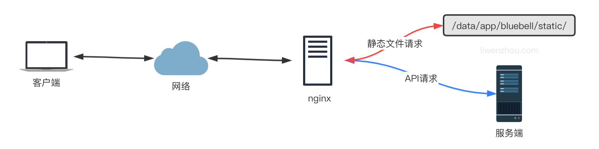

Go语言采用utf-8编码

运行主程序，包必须改成main

**个人开发目录结构**


**企业常用目录结构**


# Windows 配置go环境变量


```go
// PATH路径中添加，GOROOT路径
变量名：GOPATH
变量值：GOPATH=D:\Program Files\GO\bin
```

```go
go env -w GOPROXY=https://goproxy.cn,direct
```


# Linux下配置Golang环境

[Go下载地址](https://golang.google.cn/dl/)

```shell
$ wget https://go.dev/dl/go1.20.7.linux-amd64.tar.gz  //Linux下配置go环境
$ tar -zxvf  go1.20.7.linux-amd64.tar.gz -C /usr/local/
$ tee -a /etc/profile <<'EOF'
export GOROOT=/usr/local/go
export GOPATH=$HOME/go
export PATH=$PATH:$GOROOT/bin:$GOPATH/bin
export GO111MODULE=auto
EOF

$ source /etc/profile	//刷新
```

以上默认/root/go目录下

测试：

```sh
go version
```

配置远程代理仓库 ：

```sh
go env -w GOPROXY=https://goproxy.cn,direct
```
## GOROOT和GOPATH

1. `GOROOT`：`GOROOT` 是指向 Go 安装目录的环境变量。它指示 Go 编译器和其他工具在哪里找到 Go 的标准库和运行时文件。Go 的安装程序会自动设置 `GOROOT` 环境变量，指向 Go 的安装路径。
2. `GOPATH`：`GOPATH` 是指向 Go 工作区（workspace）的环境变量。Go 工作区是您在开发过程中创建的项目和导入包的根目录，也是`外部标准库`下载存放的地址。`GOPATH` 包含三个重要的子目录：`src`、`pkg` 和 `bin`。
   - `src`：源码文件所在的目录。您的项目代码和导入的外部包都应该放在这里。
   - `pkg`：编译后的包文件（`.a` 文件）所在的目录。
   - `bin`：可执行文件所在的目录。

Go 1.8版本开始，Go开发包在安装完成后会为GOPATH设置一个默认目录，并且在Go1.14及之后的版本中启用了Go Module模式之后，不一定非要将代码写到GOPATH目录下，所以也就不需要我们再自己配置GOPATH了，使用默认的即可。

```go
go env //查看电脑上的GOPATH路径
```

## linux部署缺少依赖包解决

1、寻找GOPATH目录

```sh
$ go env
GOPATH=E:\Project\Go
```

2、复制依赖库。将该目录下的E:\Project\Go\pkg\mod文件夹打包，覆盖linux服务器GOPATH路径下的mod目录

```sh
$ ls ~/go/pkg/mod
cache       golang.org         gorm.io                           mod.zip
gitee.com   go.mongodb.org     gotest.tools                      rsc.io
github.com  google.golang.org  gotest.tools@v2.2.0+incompatible  sigs.k8s.io
go.etcd.io  gopkg.in           go.uber.org
```

# 创建新项目

使用goland新建项目时，选择最新的方式GO（而非GOPATH传统方式），

创建2个文件夹

```go
D:\Program Files>GOROOT //go 安装目录
D:\Program Files>GOPATH //go 工作区
```

对于一个新创建的项目，我们可以在项目文件夹下按照以下步骤操作：
执行`go mod init `项目名命令，在当前项目文件夹下创建一个go.mod文件。
手动编辑go.mod中的require依赖项或执行go get自动发现、维护依赖。

**问题**：当go get的时候报错如下(或者golang的版本升级之后报错如下)

> go: go.mod file not found in current directory or any parent directory; see 'go help modules'

**解决办法**
1：开启go modules功能，命令行输入

```go
go env -w GO111MODULE=on
```

2：在该项目目录下(**一定要记住在该项目目录下**)，初始化Go moudle，运行下面命令

```go
go mod init test //test是项目名 ,项目位于GOPATH根目录下，#这里指定项目初始化项目
```

# 导入本地包

**包**：模块化的开发理念（支持代码模块化和代码复用）。
在一个项目（project）下我们是可以定义多个包（package）的。一个包中只能有一个main函数
标识符可见性：只有那些首字母是大写的标识符才是对其他包可见的

确定各个文件下package包名一致，全局只有根目录下有一个mod文件

## 在同一个项目下

**注意**：在一个项目（project）下我们是可以定义多个包（package）的。

### 目录结构

现在的情况是，我们在`moduledemo/main.go`中调用了`mypackage`这个包。

```bash
moduledemo
├── go.mod
├── main.go
└── mypackage
    └── mypackage.go
```

### 导入包

这个时候，我们需要在`moduledemo/go.mod`中按如下定义：

```go
module moduledemo

go 1.14
```

然后在`moduledemo/main.go`中按如下方式导入`mypackage`

```go
package main

import (
	"fmt"
	"moduledemo/mypackage"  // 导入同一项目下的mypackage包
)
func main() {
	mypackage.New()
	fmt.Println("main")
}
```

### 举个例子

举一反三，假设我们现在有文件目录结构如下：

```bash
└── bubble
    ├── dao
    │   └── mysql.go
    ├── go.mod
    └── main.go
```

其中`bubble/go.mod`内容如下：

```go
module github.com/q1mi/bubble

go 1.14
```

`bubble/dao/mysql.go`内容如下：

```go
package dao

import "fmt"

func New(){
	fmt.Println("mypackage.New")
}
```

`bubble/main.go`内容如下：

```go
package main

import (
	"fmt"
	"github.com/q1mi/bubble/dao"
)
func main() {
	dao.New()
	fmt.Println("main")
}
```

## 不在同一个项目下

### 目录结构

```bash
├── moduledemo
│   ├── go.mod
│   └── main.go
└── mypackage
    ├── go.mod
    └── mypackage.go
```

### 导入包

这个时候，`mypackage`也需要进行module初始化，即拥有一个属于自己的`go.mod`文件，内容如下：

```go
module mypackage

go 1.14
```

然后我们在`moduledemo/main.go`中按如下方式导入：

```go
import (
	"fmt"
	"mypackage"
)
func main() {
	mypackage.New()
	fmt.Println("main")
}
```

因为这两个包不在同一个项目路径下，你想要导入本地包，并且这些包也没有发布到远程的github或其他代码仓库地址。这个时候我们就需要在`go.mod`文件中使用`replace`指令。

在调用方也就是`moduledemo/go.mod`中按如下方式指定使用相对路径来寻找`mypackage`这个包。

```go
module moduledemo

go 1.14


require "mypackage" v0.0.0
replace "mypackage" => "../mypackage"
```

### 举个例子

最后我们再举个例子巩固下上面的内容。

我们现在有文件目录结构如下：

```bash
├── p1
│   ├── go.mod
│   └── main.go
└── p2
    ├── go.mod
    └── p2.go
```

`p1/main.go`中想要导入`p2.go`中定义的函数。

`p2/go.mod`内容如下：

```go
module liwenzhou.com/q1mi/p2

go 1.14
```

`p1/main.go`中按如下方式导入

```go
import (
	"fmt"
	"liwenzhou.com/q1mi/p2"
)
func main() {
	p2.New()
	fmt.Println("main")
}
```

因为我并没有把`liwenzhou.com/q1mi/p2`这个包上传到`liwenzhou.com`这个网站，我们只是想导入本地的包，这个时候就需要用到`replace`这个指令了。

`p1/go.mod`内容如下：

```go
module github.com/q1mi/p1

go 1.14

require "liwenzhou.com/q1mi/p2" v0.0.0
replace "liwenzhou.com/q1mi/p2" => "../p2"
```

此时，我们就可以正常编译`p1`这个项目了。

说再多也没用，自己动手试试吧。


# go build编译命令

`go build fileName`用来启动编译，它可以将Go语言程序与相关依赖编译成一个可执行文件
	-o指定输出的可执行文件名，`build -o myexec  main.go  lib.go`
`go build+`包，直接根据包名进行编译，即便包内文件被增（加）删（除）也不影响编译指令

| 参数 | 解释                                        |
| ---- | ------------------------------------------- |
| -v   | 编译时显示包名                              |
| -p n | 开启并发编译，默认情况下该值为 CPU 逻辑核数 |

`go run fileName`命令将编译和执行指令合二为一，会在编译之后立即执行Go语言程序，但是不会生成可执行文件
`go install`分为两步:

​	1、先执行go build，编译得到.exe文件	2、将exe文件拷贝到项目中的bin下面

# GOPROXY
Go1.13之后GOPROXY默认值为https://proxy.golang.org，在国内是无法访问的，所以十分建议大家设置

```go
go env -w GOPROXY=https://goproxy.cn,direct
|—bin	项目编译的二进制文件
|—pkg	项目编译的中间产物，加速编译
|—src	项目源码
```

go.mod文件记录了项目所有的依赖信息，第三方的依赖包都下载到了GOPATH/ pkg/ mod目录下。
其结构大致如下：

```go
module github.com/Q1mi/studygo/blogger

go 1.12

require (
	github.com/DeanThompson/ginpprof v0.0.0-20190408063150-3be636683586 //版本-时间-hash值
	google.golang.org/appengine v1.6.1 // indirect：间接引用
)
```

`module`用来定义包名，一定要加上前缀
`require`用来定义依赖包及版本
`indirect`表示间接引用

```go
replace ( //在国内访问golang.org/x的各个包都需要翻墙，你可以在
	golang.org/x/net v0.0.0-20180821023952-922f4815f713 => github.com/golang/net v0.0.0-20180826012351-8a410e7b638d
	golang.org/x/text v0.3.0 => github.com/golang/text v0.3.0
)
```

go.sum文件，详细包名和版本信息

# Go mod包依赖管理

go mod命令如下：

| 命令            | 解释                                                     |
| --------------- | -------------------------------------------------------- |
| go mod download | 下载依赖的module到本地cache（默认为$GOPATH/pkg/mod目录） |
| **go mod tidy** | 下载缺少的依赖，删除无用的依赖                           |
| go mod graph    | 打印模块依赖图                                           |
| go mod init     | 初始化当前文件夹, 创建go.mod文件                         |
| go mod vendor   | 将依赖复制到vendor下                                     |
| go mod edit     | 编辑go.mod文件                                           |
| go mod verify   | 校验依赖                                                 |
| go mod why      | 解释为什么需要依赖                                       |

go get命令可以下载依赖包，并且还可以指定下载的版本。

| 命令                   | 解释                                                         |
| ---------------------- | ------------------------------------------------------------ |
| go get -u              | 将会升级到最新的次要版本或者修订版本(x.y.z, z是修订版本号， y是次要版本号) |
| go get -u=patch        | 将会升级到最新的修订版本                                     |
| go get package@version | 将会升级到指定的版本号version                                |

`go get -d -v` 自动下载项目依赖包

| 参数 | 解释                                       | 参数 | 解释                       |
| ---- | ------------------------------------------ | ---- | -------------------------- |
| -d   | 让命令程序只执行下载动作，而不执行安装动作 | -v   | 打印出被构建的代码包的名字 |

如果下载所有依赖可以使用`go mod download`命令。

## 整理依赖

我们在代码中删除依赖代码后，相关的依赖库并不会在go.mod文件中自动移除。这种情况下我们可以使用`go mod tidy`命令更新go.mod中的依赖关系。d

| 命令                                       | 解释                                                         |
| ------------------------------------------ | ------------------------------------------------------------ |
| go mod edit -fmt                           | 格式化。因为我们可以手动修改go.mod文件，所以有些时候需要格式化该文件 |
| go mod edit -require=golang.org/x/text     | 添加依赖项                                                   |
| go mod edit -droprequire=package path      | 如果只是想修改go.mod文件中的内容，比如要在go.mod中移除golang.org/x/text包 |
| go mod edit -droprequire=golang.org/x/text | 移除依赖项                                                   |


更多用法可以通过`go help mod edit`查看。

在项目中使用`go module`
如果需要对一个已经存在的项目启用go module，可以按照以下步骤操作：
在项目目录下执行`go mod init`，生成一个go.mod文件。
执行`go get`，查找并记录当前项目的依赖，同时生成一个go.sum记录每个依赖库的版本和哈希值。


# 部署Go语言项目的 N 种方法

本文以部署 Go Web 程序为例，介绍了在 CentOS7 服务器上部署 Go 语言程序的若干方法。

## 独立部署

Go 语言支持跨平台交叉编译，也就是说我们可以在 Windows 或 Mac 平台下编写代码，并且将代码编译成能够在 Linux amd64 服务器上运行的程序。

对于简单的项目，通常我们只需要将编译后的二进制文件拷贝到服务器上，然后设置为后台守护进程运行即可。

### 编译

编译可以通过以下命令或编写 makefile 来操作。

```bash
CGO_ENABLED=0 GOOS=linux GOARCH=amd64 go build -o ./bin/bluebell
```

下面假设我们将本地编译好的 bluebell 二进制文件、配置文件和静态文件等上传到服务器的`/data/app/bluebell`目录下。

补充一点，如果嫌弃编译后的二进制文件太大，可以在编译的时候加上`-ldflags "-s -w"`参数去掉符号表和调试信息，一般能减小20%的大小。

```bash
CGO_ENABLED=0 GOOS=linux GOARCH=amd64 go build -ldflags "-s -w" -o ./bin/bluebell
```

如果还是嫌大的话可以继续使用 upx 工具对二进制可执行文件进行压缩。

我们编译好 bluebell 项目后，相关必要文件的目录结构如下：

```bash
├── bin
│   └── bluebell
├── conf
│   └── config.yaml
├── static
│   ├── css
│   │   └── app.0afe9dae.css
│   ├── favicon.ico
│   ├── img
│   │   ├── avatar.7b0a9835.png
│   │   ├── iconfont.cdbe38a0.svg
│   │   ├── logo.da56125f.png
│   │   └── search.8e85063d.png
│   └── js
│       ├── app.9f3efa6d.js
│       ├── app.9f3efa6d.js.map
│       ├── chunk-vendors.57f9e9d6.js
│       └── chunk-vendors.57f9e9d6.js.map
└── templates
    └── index.html
```

### nohup

nohup 用于在系统后台**不挂断**地运行命令，不挂断指的是退出执行命令的终端也不会影响程序的运行。

我们可以使用 nohup 命令来运行应用程序，使其作为后台守护进程运行。由于在主流的 Linux 发行版中都会默认安装 nohup 命令工具，我们可以直接输入以下命令来启动我们的项目：

```bash
sudo nohup ./bin/bluebell conf/config.yaml > nohup_bluebell.log 2>&1 &
```

其中：

- `./bluebell conf/config.yaml`是我们应用程序的启动命令
- `nohup ... &`表示在后台不挂断的执行上述应用程序的启动命令
- `> nohup_bluebell.log`表示将命令的标准输出重定向到 nohup_bluebell.log 文件
- `2>&1`表示将标准错误输出也重定向到标准输出中，结合上一条就是把执行命令的输出都定向到 nohup_bluebell.log 文件

上面的命令执行后会返回进程 id

```bash
[1] 6338
```

当然我们也可以通过以下命令查看 bluebell 相关活动进程：

```bash
ps -ef | grep bluebell
```

输出：

```bash
root      6338  4048  0 08:43 pts/0    00:00:00 ./bin/bluebell conf/config.yaml
root      6376  4048  0 08:43 pts/0    00:00:00 grep --color=auto bluebell
```

此时就可以打开浏览器输入`http://服务器公网ip:端口`查看应用程序的展示效果了。


### supervisor

Supervisor 是业界流行的一个通用的进程管理程序，它能将一个普通的命令行进程变为后台守护进程，并监控该进程的运行状态，当该进程异常退出时能将其自动重启。

首先使用 yum 来安装 supervisor：

如果你还没有安装过 EPEL，可以通过运行下面的命令来完成安装，如果已安装则跳过此步骤：

```bash
sudo yum install epel-release
```

安装 supervisor

```bash
sudo yum install supervisor
```

Supervisor 的配置文件为：`/etc/supervisord.conf` ，Supervisor 所管理的应用的配置文件放在 `/etc/supervisord.d/` 目录中，这个目录可以在 supervisord.conf 中的`include`配置。

```bash
[include]
files = /etc/supervisord.d/*.conf
```

启动supervisor服务：

```bash
sudo supervisord -c /etc/supervisord.conf
```

我们在`/etc/supervisord.d`目录下创建一个名为`bluebell.conf`的配置文件，具体内容如下。

```bash
[program:bluebell]  ;程序名称
user=root  ;执行程序的用户
command=/data/app/bluebell/bin/bluebell /data/app/bluebell/conf/config.yaml  ;执行的命令
directory=/data/app/bluebell/ ;命令执行的目录
stopsignal=TERM  ;重启时发送的信号
autostart=true  
autorestart=true  ;是否自动重启
stdout_logfile=/var/log/bluebell-stdout.log  ;标准输出日志位置
stderr_logfile=/var/log/bluebell-stderr.log  ;标准错误日志位置
```

创建好配置文件之后，重启supervisor服务

```bash
sudo supervisorctl update # 更新配置文件并重启相关的程序
```

查看bluebell的运行状态：

```bash
sudo supervisorctl status bluebell
```

输出：

```bash
bluebell                         RUNNING   pid 10918, uptime 0:05:46
```

最后补充一下常用的supervisr管理命令：

```bash
supervisorctl status       # 查看所有任务状态
supervisorctl shutdown     # 关闭所有任务
supervisorctl start 程序名  # 启动任务
supervisorctl stop 程序名   # 关闭任务
supervisorctl reload       # 重启supervisor
```

接下来就是打开浏览器查看网站是否正常了。

## 搭配nginx部署

在需要静态文件分离、需要配置多个域名及证书、需要自建负载均衡层等稍复杂的场景下，我们一般需要搭配第三方的web服务器（Nginx、Apache）来部署我们的程序。

### 正向代理与反向代理

正向代理可以简单理解为客户端的代理，你访问墙外的网站用的那个属于正向代理。


反向代理可以简单理解为服务器的代理，通常说的 Nginx 和 Apache 就属于反向代理。


Nginx 是一个免费的、开源的、高性能的 HTTP 和反向代理服务，主要负责负载一些访问量比较大的站点。Nginx 可以作为一个独立的 Web 服务，也可以用来给 Apache 或是其他的 Web 服务做反向代理。相比于 Apache，Nginx 可以处理更多的并发连接，而且每个连接的内存占用的非常小。

### 使用yum安装nginx

EPEL 仓库中有 Nginx 的安装包。如果你还没有安装过 EPEL，可以通过运行下面的命令来完成安装：

```bash
sudo yum install epel-release
```

安装nginx

```bash
sudo yum install nginx
```

安装完成后，执行下面的命令设置Nginx开机启动：

```bash
sudo systemctl enable nginx
```

启动Nginx

```bash
sudo systemctl start nginx
```

查看Nginx运行状态：

```bash
sudo systemctl status nginx
```

### Nginx配置文件

通过上面的方法安装的 nginx，所有相关的配置文件都在 `/etc/nginx/` 目录中。Nginx 的主配置文件是 `/etc/nginx/nginx.conf`。

默认还有一个`nginx.conf.default`的配置文件示例，可以作为参考。你可以为多个服务创建不同的配置文件（建议为每个服务（域名）创建一个单独的配置文件），每一个独立的 Nginx 服务配置文件都必须以 `.conf `结尾，并存储在 `/etc/nginx/conf.d` 目录中。

### Nginx常用命令

补充几个 Nginx 常用命令。

```bash
nginx -s stop    # 停止 Nginx 服务
nginx -s reload  # 重新加载配置文件
nginx -s quit    # 平滑停止 Nginx 服务
nginx -t         # 测试配置文件是否正确
```

### Nginx反向代理部署

我们推荐使用 nginx 作为反向代理来部署我们的程序，按下面的内容修改 nginx 的配置文件。

```bash
worker_processes  1;

events {
    worker_connections  1024;
}

http {
    include       mime.types;
    default_type  application/octet-stream;

    sendfile        on;
    keepalive_timeout  65;

    server {
        listen       80;
        server_name  localhost;

        access_log   /var/log/bluebell-access.log;
        error_log    /var/log/bluebell-error.log;

        location / {
            proxy_pass                 http://127.0.0.1:8084;
            proxy_redirect             off;
            proxy_set_header           Host             $host;
            proxy_set_header           X-Real-IP        $remote_addr;
            proxy_set_header           X-Forwarded-For  $proxy_add_x_forwarded_for;
        }
    }
}
```

执行下面的命令检查配置文件语法：

```bash
nginx -t
```

执行下面的命令重新加载配置文件：

```bash
nginx -s reload
```

接下来就是打开浏览器查看网站是否正常了。

当然我们还可以使用 nginx 的 upstream 配置来添加多个服务器地址实现负载均衡。

```bash
worker_processes  1;

events {
    worker_connections  1024;
}

http {
    include       mime.types;
    default_type  application/octet-stream;

    sendfile        on;
    keepalive_timeout  65;

    upstream backend {
      server 127.0.0.1:8084;
      # 这里需要填真实可用的地址，默认轮询
      #server backend1.example.com;
      #server backend2.example.com;
    }

    server {
        listen       80;
        server_name  localhost;

        access_log   /var/log/bluebell-access.log;
        error_log    /var/log/bluebell-error.log;

        location / {
            proxy_pass                 http://backend/;
            proxy_redirect             off;
            proxy_set_header           Host             $host;
            proxy_set_header           X-Real-IP        $remote_addr;
            proxy_set_header           X-Forwarded-For  $proxy_add_x_forwarded_for;
        }
    }
}
```

### Nginx分离静态文件请求

上面的配置是简单的使用 nginx 作为反向代理处理所有的请求并转发给我们的 Go 程序处理，其实我们还可以有选择的将静态文件部分的请求直接使用 nginx 处理，而将 API 接口类的动态处理请求转发给后端的 Go 程序来处理。



下面继续修改我们的 nginx 的配置文件来实现上述功能。

```bash
worker_processes  1;

events {
    worker_connections  1024;
}

http {
    include       mime.types;
    default_type  application/octet-stream;

    sendfile        on;
    keepalive_timeout  65;

    server {
        listen       80;
        server_name  bluebell;

        access_log   /var/log/bluebell-access.log;
        error_log    /var/log/bluebell-error.log;

		# 静态文件请求
        location ~ .*\.(gif|jpg|jpeg|png|js|css|eot|ttf|woff|svg|otf)$ {
            access_log off;
            expires    1d;
            root       /data/app/bluebell;
        }

        # index.html页面请求
        # 因为是单页面应用这里使用 try_files 处理一下，避免刷新页面时出现404的问题
        location / {
            root /data/app/bluebell/templates;
            index index.html;
            try_files $uri $uri/ /index.html;
        }

		# API请求
        location /api {
            proxy_pass                 http://127.0.0.1:8084;
            proxy_redirect             off;
            proxy_set_header           Host             $host;
            proxy_set_header           X-Real-IP        $remote_addr;
            proxy_set_header           X-Forwarded-For  $proxy_add_x_forwarded_for;
        }
    }
}
```

### 前后端分开部署

前后端的代码没必要都部署到相同的服务器上，也可以分开部署到不同的服务器上，下图是前端服务将 API 请求转发至后端服务的方案。


上面的部署方案中，所有浏览器的请求都是直接访问前端服务，而如果是浏览器直接访问后端API服务的部署模式下，如下图。

此时前端和后端通常不在同一个域下，我们还需要在后端代码中添加跨域支持。


这里使用[github.com/gin-contrib/cors](https://github.com/gin-contrib/cors)库来支持跨域请求。

最简单的允许跨域的配置是使用`cors.Default()`，它默认允许所有跨域请求。

```go
func main() {
	router := gin.Default()
	// same as
	// config := cors.DefaultConfig()
	// config.AllowAllOrigins = true
	// router.Use(cors.New(config))
	router.Use(cors.Default())
	router.Run()
}
```

此外，还可以使用`cors.Config`自定义具体的跨域请求相关配置项：

```go
package main

import (
	"time"

	"github.com/gin-contrib/cors"
	"github.com/gin-gonic/gin"
)

func main() {
	router := gin.Default()
	// CORS for https://foo.com and https://github.com origins, allowing:
	// - PUT and PATCH methods
	// - Origin header
	// - Credentials share
	// - Preflight requests cached for 12 hours
	router.Use(cors.New(cors.Config{
		AllowOrigins:     []string{"https://foo.com"},
		AllowMethods:     []string{"PUT", "PATCH"},
		AllowHeaders:     []string{"Origin"},
		ExposeHeaders:    []string{"Content-Length"},
		AllowCredentials: true,
		AllowOriginFunc: func(origin string) bool {
			return origin == "https://github.com"
		},
		MaxAge: 12 * time.Hour,
	}))
	router.Run()
}
```

## 容器部署

容器部署方案可参照我之前的博客：[使用Docker和Docker Compose部署Go Web应用](https://www.liwenzhou.com/posts/Go/how_to_deploy_go_app_using_docker/)，这里就不再赘述了。
