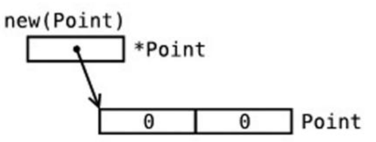
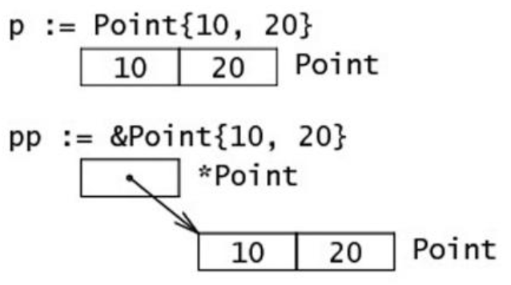
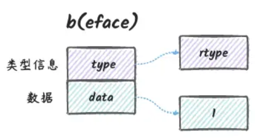

[golang八股文整理（持续搬运）_golang面试八股文-CSDN博客](https://blog.csdn.net/qq_43716830/article/details/124405506#t13)

# go程序基本要素

**标识符：**
在编程语言中标识符就是程序员定义的具有特殊意义的词，比如变量名、常量名、函数名等等。 Go语言中标识符由字母数字和_(下划线）组成，并且只能以字母和_开头。 举几个例子：abc, _, _123, a123。

函数外的每个语句都必须以关键字开始（var、const、func等）
`:=`：不能使用在函数外。
`_`：多用于占位，表示忽略值。

**关键字25个：**

> | break    | default     | func   | interface | select |
> | -------- | ----------- | ------ | --------- | ------ |
> | case     | defer       | go     | map       | struct |
> | chan     | else        | goto   | package   | switch |
> | const    | fallthrough | if     | range     | type   |
> | continue | for         | import | return    | var    |

**保留字37个：**

> Constants:    true  false  iota  nil
> Types:    int  int8  int16  int32  int64
> 		uint  uint8  uint16  uint32  uint64  uintptr
> 		float32  float64  complex128  complex64
> 		bool  byte  rune  string  error
> Functions:   make  len  cap  new  append  copy  close  delete
> 					complex  real  imag
> 					panic  recover

# 常量const

`Iota常量计数器`：只能在常量的表达式中使用。在const关键字出现时将被重置为0。能简化定义，在定义枚举时很有用。

`const`中每新增一行常量声明将使iota计数一次(iota可理解为const语句块中的行索引)。 

`“_”匿名变量`：用于变量的声明或赋值（任何类型都可以赋值给它），但任何赋给这个标识符的值都将被抛弃

> 匿名变量不占用内存空间，不会分配内存。匿名变量与匿名变量之间也不会因为多次声明而无法使用

# 基本数据类型

GO中除了基本的整型、浮点型、布尔型、字符串外，还有array数组、slice切片、struct结构体、func函数、map、通道（channel）等。编译器在访问变量时，会遵守”由远到近”原则，先访问本地再访问其他包。

**值类型**：基本数据类型，int,float,bool,string,以及数组和struct
		特点：值类型变量直接存储数据值本身。当把一个值类型变量赋值给另一个变量时，会复制该值。

**引用类型**：引用类型变量存储的是数据的内存地址（指针），通过这个地址可以访问和操作实际的数据。
		特定：Go 语言中的引用类型主要包括切片（`slice`）、映射（`map`）、通道（`channel`）和指针。

**打印自定义类型字符串**

当一个自定义类型实现了 `String()` 方法后，在使用 `fmt.Println` 打印这个类型的值时，`fmt` 包会自动调用这个类型的 `String()` 方法来获取要打印的字符串表示。

```go
type myint int
var my = myint(1)

func (m myint) String() string {
	return "myInt"
}

func Test_err(t *testing.T) {
	fmt.Println(my)
}
```


## int整形

`Int`表示有符号，32位操作系统上默认就是int32，64位操作系统上默认就是int64
`uInt`表示无符号，赋值只能是非负数

**int8整数类型（byte 类型）**：即2^8次方=255，代表了ASCII码的一个字符，未赋值默认为（包括complex64/128）为 0
**int32和rune字符(用’’)**，等同于int32：表示单个字符或特殊字符”/”等，使用unicode和 UTF-8字符，未赋值默认为（空字符串）
**String字符串，””或\`\`反引号**：(不支持转移字符)进行表示，字符串类型是不能修改的

**[]byte字节切片**，使用`[]byte`来处理需要修改的字节序列或二进制数据

​	**uint8单字符**，从字符串中取出的单字符
**float32和float64**两种浮点型数
**complex64和complex128复数**

`uintptr无符号整型`，用于存放一个指针
以下几种类型为 nil：

> var a *int			var a []int				var a map[string] int
> var a chan int		var a func(string) int		var a error // error 是接口

​	#变量名或自定义函数名，首字母大写即为公有，小写为私有。

数字字面量语法，这样便于开发者以二进制、八进制或十六进制浮点数的格式定义数字，例如：

```go
v := 0b00101101， 代表二进制的 101101，相当于十进制的 45。
v := 0o377，代表八进制的 377，相当于十进制的 255。
v := 0x1p-2，代表十六进制的 1 除以 2²，也就是 0.25。
```

而且还允许我们用 _ 来分隔数字，比如说： `v := 123_456` 表示 v 的值等于 123456。

> uint8	无符号 8位整型 (0 到 255)
> uint16	无符号 16位整型 (0 到 65535)
> uint32	无符号 32位整型 (0 到 4294967295)
> uint64	无符号 64位整型 (0 到 18446744073709551615)
> int8	有符号 8位整型 (-128 到 127)
> int16	有符号 16位整型 (-32768 到 32767)
> int32	有符号 32位整型 (-2147483648 到 2147483647)
> int64	有符号 64位整型 (-9223372036854775808 到 9223372036854775807)

## bool布尔值

Go语言中以bool类型进行声明布尔型数据，布尔型数据只有true（真）和false（假）两个值。
**注意**：
布尔类型变量的默认值为false。
Go 语言中不允许将整型强制转换为布尔型
布尔型无法参与数值运算，也无法与其他类型进行转换


# 常用运算符

**常数时间的操作**（从快到慢）:
常见的位运算`(>>、 >>>、 <<、|、 &、 ^等)`
常见的算术运算`(+、-、*、/、%等)`
赋值、比较、自增、自减操作等
数组寻址操作

## 逻辑运算符

`&&	`逻辑 AND 运算符。 如果两边的操作数都是 True，则为 True，否则为 False。
`||	`逻辑 OR 运算符。 如果两边的操作数有一个 True，则为 True，否则为 False。
`!	`逻辑 NOT 运算符。 如果条件为 True，则为 False，否则为 True。

## 位运算符

假设我们有两个整数 `a` 和 `b`，它们的二进制表示如下：

- `a = 1`，二进制表示为 `0001`
- `b = 0`，二进制表示为 `0000`

**按位与 (`&`)**：

```go
a & b // 0001 & 0000 = 0000 (0)  // 每一位都进行或操作，只要有一个对应位是 1，结果就是 1。
```

**按位或 (`|`)**

```go
a | b // 0001 | 0000 = 0001 (1)  // 每一位都进行或操作，只要有一个对应位是 1，结果就是 1。
```

**按位异或 (`^`)**

```go
a ^ b // 0001 ^ 0000 = 0001 (1)	// 每一位都进行异或操作，当两个对应位不同时结果是 1。
```

**按位与非 (`&^`)**

```go
a &^ b // 0001 &^ 0000 = 0001 (1)	// 每一位都进行与非操作，当b的对应位是 1 时，结果是0，否则结果是a的对应位。
```

**左移 (`<<`)**

```go
a << 1 // 0001 << 1 = 0010 (2)	// 将a的位，向左移动 1 位，右侧补 0。
```

**右移 (`>>`)**

```go
a >> 1 // 0001 >> 1 = 0000 (0)	// 将a的位向右移动 1 位，左侧补 0。
```

**按位取反 (`^`)**

```go
^a // ^0001 = 1110 (-2 in 2's complement form)	// 对a的每一位进行取反操作。在二进制补码表示中，结果是 -2
```


# 流程控制

## if判断

`if条件判断`的格式如下：

```go
if 表达式1 {
    分支1
	} else if 表达式2 {
    分支2
	} else{
    分支3
	}
}
```

## for循环

`for range(键值循环)`：遍历数组、切片、字符串、map 及通道（channel）。 通过for range遍历的返回值有以下规律：

1. 数组、切片、字符串返回索引和值（其中字符串的值为uint32类型，打印需用string函数转换）。
2. map返回键和值。
3. 通道（channel）只返回通道内的值。

```go
// 1、普通写法
for i := 0 ; i < 10 {
		fmt.Println(i)
		i++
}

// 2、 for循环中，使用逗号分隔的方式在 for 循环中定义和初始化多个变量
for i, j := 0, 10; i < j; i, j = i+1, j-1 {
	fmt.Println(i, j)
}

// 3、 for rang 方式
for _, value := range split {
		fmt.Printf("%s\n", value)
}
```

## switch分支

`switch语句`中可以使用fallthrough强制执行后面的case代码，且fallthrough必须是case子句的最后一行

```go
func switchDemo1() {
 	s := "a"
	finger := 3
	switch finger { 
	case 1:
		fmt.Println("大拇指")
	case 2:
		fmt.Println("食指")
    case 1, 3, 5, 7, 9:
		fmt.Println("奇数")
	case 2, 4, 6, 8: //多个匹配项
		fmt.Println("偶数")
	case age > 25 && age < 35:
		fmt.Println("好好工作吧")
	case s == "c":
		fmt.Println("c")
	default:
		fmt.Println("无效的输入！")
	}
}
```

```go
func main() {
	t := time.Now()
	switch { // 没有条件的 switch。case匹配用局部变量
	case t.Hour() < 12:
		fmt.Println("Good morning!")
	case t.Hour() < 17:
		fmt.Println("Good afternoon.")
	default:
		fmt.Println("Good evening.")
	}
}
```

跳转语句：goto、continue、break都可以跳转至指定标签处，label标签内容一般放在代码块最后

```go
func gotoDemo2() {
	for i := 0; i < 10; i++ {
		for j := 0; j < 10; j++ {
			if j == 2 {
				goto breakTag // 设置退出标签
			}
			fmt.Printf("%v-%v\n", i, j)
		}
	}
	return
	
breakTag: // 标签
	fmt.Println("结束for循环")
}
```

## break(跳出循环)

`break`语句可以结束`for`、`switch`和`select`的代码块。

`break`语句还可以在语句后面添加标签，表示退出某个标签对应的代码块，标签要求必须定义在对应的`for`、`switch`和 `select`的代码块上。 举个例子：

```go
func breakDemo1() {
BREAKDEMO1:
	for i := 0; i < 10; i++ {
		for j := 0; j < 10; j++ {
			if j == 2 {
				break BREAKDEMO1
			}
			fmt.Printf("%v-%v\n", i, j)
		}
	}
	fmt.Println("...")
}
```

## continue(继续下次循环)

`continue`语句可以结束当前循环，开始下一次的循环迭代过程，仅限在`for`循环内使用。

在 `continue`语句后添加标签时，表示开始标签对应的循环。例如：

```go
func continueDemo() {
forloop1:
	for i := 0; i < 5; i++ {
		// forloop2:
		for j := 0; j < 5; j++ {
			if i == 2 && j == 2 {
				continue forloop1
			}
			fmt.Printf("%v-%v\n", i, j)
		}
	}
}
```

# String字符串

## 单字符

将单个字符转换为其对应的整数值（ASCII码）来实现单字符转`int`类型。以下是一个示例代码：

```go
func main() {
    char := 'A' // 单字符
    num := int(char) // 转换为int类型
    fmt.Println("字符的整数值:", num)
}
```

在这个示例中，字符`'A'`被转换为其对应的整数值（ASCII码），并输出结果。

单字符是int32类型

## String方法

字符串支持s[index]索引操作也支持for ... range 操作（但是他们的值都是为int32类型需string()方法转换）

| 方法                 | 解释                                              | 方法                                 | 解释                                                      |
| -------------------- | ------------------------------------------------- | ------------------------------------ | --------------------------------------------------------- |
| func len(v Type) int | 求长度，返回int                                   | strings.HasPrefix,strings.HasSuffix  | 前缀/后缀判断，返回bool                                   |
| +或fmt.Sprint        | 拼接字符串，返回 string                           | strings.Index(),strings.LastIndex()  | 子串出现的位置，返回 int                                  |
| strings.Split()      | 按指定字符，分割为slice切片，返回[]string         | strings.Join(a []string, sep string) | 字符串数组之间添加sep字符并拼接返回一个字符串，返回string |
| strings.Contains()   | 判断是否包含，返回 bool                           | 将其转换成[]rune或**[]byte**         | 修改字符串，返回                                          |
| strings.ToLower()    | 将所有字母都转为对应的小写版本的拷贝，返回 string | strings.ToUpper()                    | 将所有字母都转为对应的大写版本的拷贝，返回 string         |
| strings.ReplaceAll   | 去除字符串中的所有指定字符                        | re.ReplaceAllString(str, "")         | 正则表达式去除所有空格                                    |


> #当有大量的string需要拼接时，用strings.Builder效率最高

```sh
s := "hello"
b := []byte(s)  // string 转换为 []byte
s2 := string(b) // []byte 转换为 string
```

### strings.Builder高性能拼接

strings.Builder 是 Golang  中的一个用于高效构建字符串的类型，使用了一个循环缓冲区来存储字符数据，避免了频繁的内存分配和拷贝操作，尤其适用于频繁拼接字符串的场景。结构体定义和对应的方法如下：

```go
type Builder struct {
  addr *Builder // of receiver, to detect copies by value
  buf  []byte
}

func (b *Builder) Grow(n int)
func (b *Builder) Len() int
func (b *Builder) Cap() int
func (b *Builder) Reset()			// 重置 Builder 中的字符串内容，使得 Builder 可以重新生成新的字符串。
func (b *Builder) String() string	// 返回字符串
func (b *Builder) Write(p []byte) (int, error)
func (b *Builder) WriteByte(c byte) error
func (b *Builder) WriteRune(r rune) (int, error)
func (b *Builder) WriteString(s string) (int, error) //追加一个s字符串，并返回字符串追加后的长度以及可能存在的错误。
```

**使用优势**
与许多语言一样，Golang 中的 string 类型也是不可变的，如果想在一个字符串的基础上得到另一个字符串，只能基于这个字符串做截取、拼接，截取可以使用切片表达式、拼接可以使用“+”运算符来实现。

如果代码中有大量的使用切片表达式和“+”运算符进行截取拼接，会导致频繁的内存分配。在底层，一个 string 类型的值会被存储到一块连续的内存空间中，可以把这块内存的内容看成一个字节数组，string 值则包含了指向字节数组头部的指针值，使用切片表达式操作 string 就相当于对底层的字节数组做切片。很显然，大量的字符串拼接操作会导致很大的内存分配压力。

使用示例：

```go
import (
	"fmt"
	"strings"
)

func main() {
	var str strings.Builder    // 声明一个 Builder 变量
	str.WriteString("Hello, ") // 追加字符串
	str.WriteString("world!")  // 追加字符串
    fmt.Println(str.String())  // 输出结果: Hello, world!
}
```

首先创建了一个 strings.Builder 对象 builder，然后使用 WriteString 方法向缓冲区中写入字符串，最后使用 String 方法将缓冲区中的字符数据转换为字符串。


对于有大量字符串拼接的场景，建议使用 strings.Builder，而不是直接使用“+”运算符来拼接字符串，以避免频繁的内存分配问题。在使用 strings.Builder 对象时，如果想重复使用，可以使用 Reset() 方法来清空 Builder 中的字符串。如果在使用 strings.Builder 进行字符串拼接的时候需要一定的缓存空间，可以使用 Grow(n int) 方法来预分配内存，提高程序的执行效率。例如：

```go
var builder strings.Builder
builder.Grow(1024) // 预分配 1K 内存空间
```


### 字符串中取出单个字符

假设 `s` 是一个字符串（本质上是一个字节数组），那么就可以直接通过 `c := []byte(s)` 来获取一个字节的切片 `c` 。另外，您还可以通过 `copy()` 函数来达到相同的目的：`copy(dst []byte, src string)`。也可以使用 for-range 来获得每个元素：

```go
str := "asdfga"
for _, value := range str { // value是int32类型
    print(value) 			//9711510010210397
}
```

### 获取字符串的某一部分

使用 `substr := str[start:end]` 可以从字符串 str 获取到从索引 `start` 开始到 `end-1` 位置的子字符串。同样的，`str[start:]` 则表示获取从 `start` 开始到 `len(str)-1` 位置的子字符串。而 `str[:end]` 表示获取从 0 开始到 `end-1` 的子字符串。

### 取出单个字符

1、**通过索引取出字节：** 这种方法只适用于ASCII编码的字符串。

```go
s := "Hello, world!"
b := s[7]  
fmt.Println(string(b) // b的值 = byte('w') ， string(b) = w
```

2、**使用`range`遍历字符串：** 这种方法可以正确处理UTF-8编码的字符串。

```go
s := "你好，世界！"
for i, r := range s {
    if i == 6 {
        fmt.Println(string(r))  // 输出"世"
        break
    }
}
```

在上面的代码中，`range`会按照UTF-8编码遍历字符串，每次返回一个字符的Unicode码点。注意，这里的`i`是字符的字节索引，而不是字符的位置索引，所以不能直接使用`s[i]`来获取字符。

3、**字符串转为byte数组**

```go
t := []byte("hello")
```

### 修改字符串中的某个字符

Go 语言中的字符串是不可变的，也就是说 `str[index]` 这样的表达式是不可以被放在等号左侧的。如果尝试运行 `str[i] = 'D'` 会得到错误：`cannot assign to str[i]`。

因此，您必须先将字符串转换成字节数组，然后再通过修改数组中的元素值来达到修改字符串的目的，最后将字节数组转换回字符串格式。例如，将字符串 `"hello"` 转换为 `"cello"`：

```go
s := "hello"
c := []byte(s)
c[0] = 'c'
s2 := string(c) // s2 == "cello"
```

所以，您可以通过操作切片来完成对字符串的操作。

# Array数组

**引用类型**：数组array，指针，slice，map，chan等都是引用类型
	**特点**：变量存储的是一个地址，这个地址存储最终的值。内存通常在堆上分配，通过GC回收。

**引用类型拥有更复杂的存储结构**:
	(1)分配内存
	(2)初始化一系列属性等一个引用类型的变量r1存储的是r1的值所在的内存地址（数字），或内存地址中第一个字所在的位置，这个内存地址被称之为指针，这个指针实际上也被存在另外的某一个字中。 

## 数组定义

```bash
var 数组变量名 [元素数量]T
```

比如：`var a [5]int`， 数组的长度必须是常量，并且长度是数组类型的一部分。一旦定义，长度不能变。 `[5]int`和`[10]int`是不同的类型。

```go
var a [3]int
var b [4]int
a = b //不可以这样做，因为此时a和b是不同的类型
// var res [s]int 错误定义 ， 数组的长度必须是一个常量表达式，不能使用变量来指定数组的长度
```

## 数组的初始化

**方法一**：初始化数组时可以使用初始化列表来设置数组元素的值。

```go
nums1 := make([]int, len(nums))
var testArray [3]int		//数组会初始化为int类型的零值 //[0 0 0]
var numArray = [3]int{1,2}	//使用指定的初始值完成初始化 //[1 2 0]
var cityArray = [3]string{"北京", "上海", "深圳"} //使用指定的初始值完成初始化 //[北京 上海 深圳]
```

**方法二**：按照上面的方法每次都要确保提供的初始值和数组长度一致，一般情况下我们可以让编译器根据初始值的个数自行推断数组的长度，例如：

```go
var testArray [3]int  //[0 0 0]
var numArray = [...]int{1, 2} //[1 2]
var cityArray = [...]string{"北京", "上海", "深圳"} //[北京 上海 深圳]
```

**方法三**：我们还可以使用指定索引值的方式来初始化数组，例如:

```go
a := [...]int{1: 1, 3: 5} // [0 1 0 5]
```

## 数组的遍历

遍历数组a有以下两种方法：

```go
func main() {
	var a = [...]string{"北京", "上海", "深圳"}
	for i := 0; i < len(a); i++ { // 方法1：for循环遍历
		fmt.Println(a[i])
	}

	for index, value := range a { // 方法2：for range遍历
		fmt.Println(index, value)
	}
}
```

## 多维数组

Go语言是支持多维数组的，我们这里以二维数组为例（数组中又嵌套数组）。

### 二维数组的定义

```go
var newInt [][]int
newInt[0][0] = 1

a := [3][2]string{{"北京", "上海"},{"广州", "深圳"},{"成都", "重庆"}}
fmt.Println(a) 				//[[北京 上海] [广州 深圳] [成都 重庆]]
fmt.Println(a[2][1]) 		//支持索引取值:重庆

rows := [9]map[rune]bool{{'a': false}} 		// map类型的数组
mapOfStructs := map[string][]Point{ 		// 数组类型的map 。创建一个 map，其值为 Point 结构体的数组
	"line1": {{X: 0, Y: 0}, {X: 1, Y: 1}},
	"line2": {{X: 2, Y: 2}, {X: 3, Y: 3}},
}
```

### 二维数组的遍历

```go
for _, v1 := range a {
	for _, v2 := range v1 {
		fmt.Printf("%s\t", v2)
	}
	fmt.Println()
}

//输出：
北京	上海	
广州	深圳	
成都	重庆	
```

**注意：** 多维数组**只有第一层**可以使用`...`来让编译器推导数组长度。例如：

```go
a := [...][2]string{ //支持的写法
	{"北京", "上海"},
	{"广州", "深圳"},
	{"成都", "重庆"},
}

b := [3][...]string{ //不支持多维数组的内层使用...
	{"北京", "上海"},
	{"广州", "深圳"},
	{"成都", "重庆"},
}
```

## 数组是值类型

数组是值类型，赋值和传参会**复制整个数组**。因此改变副本的值，不会改变本身的值。

**注意：**

1. 数组支持 “==“、”!=” 操作符，因为内存总是被初始化过的。
2. `[n]*T`表示指针数组，`*[n]T`表示数组指针 。

# Slice切片

## 1、切片初始化

`切片（Slice）`是一个拥有相同类型元素的可变长度的序列。它是基于数组类型做的一层封装（切片和数组很像。可以说是一种特殊数组）。它非常灵活，支持自动扩容。

```go
var name []int  //定义切片
name := []int{1, 2, 3} //切片初始化，并赋值，自动进行扩充，（这是第一种定义方式）
```

#定义和初始化是不同的概念，定义是声明（此时为nil），初始化是创造物理地址（不然为nil）

## 2、切片完整表达式

`A [low : high : max]`切片是一个引用类型，它的内部结构包含地址、长度和容量。

切片一般用于快速地操作一块数据集合。

一个nil值的切片并没有底层数组，一个nil值的切片的长度和容量都是0，但是我们不能说一个长度和容量都是0的切片一定是nil

切片的本质就是对底层数组的封装，它包含了三个信息：底层数组的指针、切片的长度（`len`）和切片的容量（`cap`）。

**举个例子**

现在有一个数组`a := [8]int{0, 1, 2, 3, 4, 5, 6, 7}`，切片`s1 := a[:5]`，相应示意图如下。

切片`s2 := a[3:6]`，相应示意图如下：


## 3、判断切片为空

要检查切片是否为空，请始终使用`len(s) == 0`来判断，而不应该使用`s == nil`来判断。

`cap(s)`输出切片的容量大小

## 3、使用make()函数构造切片

```go
make([]T, len, cap)
`T`:切片的元素类型
`len`:切片中元素的数量
`cap`:切片的容量
```

函数中`a ...interface{}`作为接收值时，`a`代表将接收到的值作为一个slice整体，`a...`代表将接收到的slice进行拆分传递

```go
a := make([]int, 2, 10)
fmt.Println(a)      //[0 0]

var s5 = []interface{}{1, 3, 5, 7, 9}  //接口类型切片
//type:[]interface {} ,value:[[1 3 5 7 9]]
//type:[]interface {} ,value:[1 3 5 7 9]

len(s) == 0 // 判断切片是否为空
```

## 4、切片进阶操作

### for切片遍历

切片的遍历方式和数组是一致的，支持索引遍历和`for range`遍历。

```go
func main() {
	s := []int{1, 3, 5}
	for i := 0; i < len(s); i++ { //方法1
		fmt.Println(i, s[i])
	}

	for index, value := range s { //方法2
		fmt.Println(index, value)
	}
}
```

### append添加元素

Go语言的内建函数`append()`可以为切片动态添加元素。 可以一次添加一个元素，可以添加多个元素，也可以添加另一个切片中的元素（后面加…）。

```go
func main(){
	var s []int
	s = append(s, 1)        // [1]
	s = append(s, 2, 3, 4)  // [1 2 3 4]
	s2 := []int{5, 6, 7}  
	s = append(s, s2...)    // [1 2 3 4 5 6 7]
}
```

1. 将切片 `b` 的元素追加到切片 `a` 之后：`a = append(a, b...)`

2. 复制切片 `a` 的元素到新的切片 `b` 上：

   ```go
   b = make([]T, len(a))
   copy(b, a)
   ```

3. 为切片 `a` 扩展 `j` 个元素长度：`a = append(a, make([]T, j)...)`

4. 在索引 `i` 的位置插入元素 `x`：`a = append(a[:i], append([]T{x}, a[i:]...)...)`

5. 在索引 `i` 的位置插入长度为 `j` 的新切片：`a = append(a[:i], append(make([]T, j), a[i:]...)...)`

6. 在索引 `i` 的位置插入切片 `b` 的所有元素：`a = append(a[:i], append(b, a[i:]...)...)`

7. 取出位于切片 `a` 最末尾的元素 `x`：`x, a = a[len(a)-1], a[:len(a)-1]`

8.  去除最后一个元素 a = a[:len(a)-1]

因此，您可以使用切片和 `append()` 操作来表示任意可变长度的序列。

从数学的角度来看，切片相当于向量，如果需要的话可以定义一个向量作为切片的别名来进行操作。

### copy切片复制

`copy(destSlice, srcSlice []T)`    //`srcSlice`: 数据来源切片、`destSlice`: 目标切片

```go
func main() { 			// copy()复制切片
	a := []int{1, 2, 3, 4, 5}
	c := make([]int, 5, 5)
	copy(c, a)     		//使用copy()函数将切片a中的元素复制到切片c
	fmt.Println(a) 		//[1 2 3 4 5]
	fmt.Println(c) 		//[1 2 3 4 5]
	c[0] = 1000
	fmt.Println(a) 		//[1 2 3 4 5]
	fmt.Println(c) 		//[1000 2 3 4 5]
}
```

### 删除元素

Go语言中并没有删除切片元素的专用方法，我们可以使用切片本身的特性来删除元素。 

删除位于索引 `i` 的元素（前含后不含）：`a = append(a[:i], a[i+1:]...)`

```go
func main() { 			// 从切片中删除元素
	a := []int{30, 31, 32, 33, 34, 35, 36, 37}
	a = append(a[:2], a[3:]...) 		// 1、要删除索引为2的元素
	fmt.Println(a) 		// [30 31 33 34 35 36 37]

    a = a[:len(a)-1]	// 2、去除最后一个元素
    fmt.Println(a) 		// [30 31 33 34 35 36]
}
```

### 打印slice中所有数据

```go
func main() {
    data := []int{1, 2, 3, 4, 5}	 // 创建一个包含一些数据的切片
    fmt.Println(data[:])	// 使用切片切片（slice slicing）来获取整个切片，并打印其中的数据
}
```

## 切片--搜索/排序/反转

标准库提供了 `sort` 包来实现常见的搜索和排序操作。可以使用 `sort` 包中的函数 `func Ints(a []int)` 来实现对 `int` 类型的切片排序。

**排序**

```go
sort.Ints(arri)										// 变量 arri就是需要被升序排序的数组或切片。
sort.IntsAreSorted(a []int) bool					// 可以检查某个数组是否已经被排序，返回 `true` 则表示已经被排序。
sort.Float64s(a []float64) 							// 来排序 float64 的元素
sort.Strings(a []string) 							// 排序字符串元素。
sort.IntsAreSorted(a) 								// IsSorted函数用于判断是否有序
sort.Slice(x any, less func(i int, j int) bool) 	// 用于对一个Slice进行排序，函数接收两个参数
slices.Reverse[S interface{ ~[] E }, E any](s S)	// 将切片的元素反转到位。
```

```go
func main() {	// 第一个是需要排序的Slice，第二个是Slice元素比较函数。可以对二维切片进行比较。
	interval := [][]int{
		{2,3},
		{1,3},
		{2,4},
		{2,2},
	}
	sort.Slice(interval, func(i, j int) bool {
		return interval[i][0] < interval[j][0]
	})
	fmt.Println(interval)
}
```

**反转数组**

```go
s := []int{5, 2, 6, 3, 1, 4} // unsorted
sort.Sort(sort.Reverse(sort.IntSlice(s)))
fmt. Println(s)     // Output: [6 5 4 3 2 1]

names := []string{"alice", "Bob", "VERA"}
slices.Reverse(names)
fmt.Println(names)
```

**搜索 `float64` 和字符串**：

```go
//在数组或切片中搜索一个元素，该数组或切片必须先被排序（因为标准库的搜索算法使用的是二分法）
sort.SearchInts(a,3) 							//用于二分查找指定元素的位置
sort.SearchInts(a []int, n int) int 			//返回对应结果的索引值
sort.SearchFloat64s(a []float64, x float64) int
sort.SearchStrings(a []string, x string) int
```

## 切片垃圾回收

切片的底层指向一个数组，该数组的实际容量可能要大于切片所定义的容量。只有在没有任何切片指向的时候，底层的数组内存才会被释放，这种特性有时会导致程序占用多余的内存。

**示例** 函数 `FindDigits()` 将一个文件加载到内存，然后搜索其中所有的数字并返回一个切片。

```go
var digitRegexp = regexp.MustCompile("[0-9]+")

func FindDigits(filename string) []byte {
    b, _ := ioutil.ReadFile(filename)
    return digitRegexp.Find(b)
}
```

这段代码可以顺利运行，但返回的 `[]byte` 指向的底层是整个文件的数据。只要该返回的切片不被释放，垃圾回收器就不能释放整个文件所占用的内存。换句话说，一点点有用的数据却占用了整个文件的内存。

想要避免这个问题，可以通过拷贝我们需要的部分到一个新的切片中：

```go
func FindDigits(filename string) []byte {
   b, _ := ioutil.ReadFile(filename)
   b = digitRegexp.Find(b)
   c := make([]byte, len(b))
   copy(c, b)
   return c
}
```

事实上，上面这段代码只能找到第一个匹配正则表达式的数字串。要想找到所有的数字，可以尝试下面这段代码：

```go
func FindFileDigits(filename string) []byte {
   fileBytes, _ := ioutil.ReadFile(filename)
   b := digitRegexp.FindAll(fileBytes, len(fileBytes))
   c := make([]byte, 0)
   for _, bytes := range b {
      c = append(c, bytes...)
   }
   return c
}
```

## append()扩容策略

`append()`切片的容量：按照1，2，4，8，16这样的规则自动进行扩容，每次扩容后都是扩容前的2倍

**首先 **判断，如果新申请容量（cap）> 2倍的旧容量（old.cap），最终容量（newcap）就是新申请的容量（cap）。
**否则 **判断，如果旧切片的长度< 1024，则最终容量(newcap)就是旧容量(old.cap)的两倍，即（newcap=doublecap），
		如果旧切片长度>= 1024，则最终容量（newcap）从旧容量（old.cap）开始循环增加原来的1/4，即（newcap=old.cap,for {newcap += newcap/4}）直到最终容量（newcap）大于等于新申请的容量(cap)，即（newcap >= cap）
		如果最终容量（cap）计算值溢出，则最终容量（cap）就是新申请容量（cap）。

**go1.18之后**：
低于256，每次扩容两倍。超过256，不再是每次扩容1/4，而是每次增加（旧容量+3*256）/4即1.25倍+192

# 指针

## 1、指针基本操作

Go语言中不存在指针操作,只需要记住两个符号:	
（1. & :取地址		（2. * :读根据地址取值

```go
func reverseList(head *ListNode) *ListNode {
	var pre *ListNode
	println(pre) //0x0 //当pre指向内容没有初始化时，则pre.Val没有内容，打印会出错
	pre = head
	println(pre) //0xc00005bf20
	println(pre.Val) //0
	return pre
}
```

变量、指针地址、指针变量、取地址、取值的相互关系和特性如下（#Go语言中只能读取不能修改指针地址）：
对变量进行取地址（&）操作，可以获得这个变量的指针变量。
指针变量的值是指针地址。
对指针变量进行取值（*）操作，可以获得指针变量指向的原变量的值。

任何程序数据载入内存后，在内存都有他们的地址，这就是指针。

```go
ptr := &v    // v的类型为T
```

> v:代表被取地址的变量，类型为T
> ptr:用于接收地址的变量，ptr的类型就为*T，称做T的指针类型。*代表指针。

## 2、创造指针的函数

```go
func make(t Type, size ...IntegerType) Type
```

`make`主要用来分配引用类型，比如`channel`、`map`、`slice`变量的内存创建，而且它只返回这三个类型本身，而不是他们的指针类型，因为这三种类型就是引用类型，所以就没有必要返回他们的指针了

​	#指针和数组：谁在前就叫什么

> `*[n]T`表示数组指针：var arrPtr *[size] Type		//一个指针指向数组
> `[n]*T`表示指针数组：var ptrArr [size] *Type		//一个数组里面存放的是指针

```go
func new(Type) *Type
```

​	new很少用，一般用来给基本数据类型申请内存, string、int ,struct结构体,返回的是对应类型的指针(*string、*int)。

# Map键值对

map是一种无序的基于`key-value`的数据结构，

​	Go语言中的map是引用类型，必须初始化才能使用
​	Go语言中提供的映射关系容器为map

> #底层使用散列表（hash table）实现

## 使用

Map映射关系容器，其内部使用散列表（hash）实现。一种无序的基于key-value的数据结构，Go语言中的map是引用类型，必须初始化才能使用。

```go
var map[KeyType]ValueType 		//定义
make(map[KeyType]ValueType, [cap]) //初始化	//cap：指定map的容量，非必须
HasMap := map[rune]int{} 		//赋值初始化，为空
```
`KeyType`:表示键的类型。			`ValueType`:表示键对应的值的类型。

map类型的变量默认初始值为`nil`，需要使用make()函数来分配内存。

```go
scoreMap := make(map[string]int, 2) //赋值
scoreMap["张三"] = 90
scoreMap["小明"] = 100

fmt.Println(scoreMap)
fmt.Println(scoreMap["小明"])
fmt.Printf("type of a:%T\n", scoreMap)

// 输出：
map[小明:100 张三:90]
100
type of a:map[string]int
```

> 使用 `make(map[string]int, 2)` 创建一个初始容量为 2 的 `map`，并不意味着这个 `map` 只能存储两个键值对。
>
> 初始容量只是一个提示，让 Go 运行时在创建 `map` 时预先分配一定的内存空间来存储键值对，以减少后续扩容操作的次数。当向 `map` 中添加键值对时，如果超过了初始容量，`map` 会自动进行扩容，以容纳更多的键值对。


## 判断

某个键或值，是否存在

Go语言中有个判断map中键是否存在的特殊写法，格式如下:

```go
value, ok := map[key]
```

举个例子：

```go
scoreMap := make(map[string]int)
scoreMap["张三"] = 90
scoreMap["小明"] = 100

v, ok := scoreMap["张三"] // 如果key存在ok为true,v为对应的值；不存在ok为false,v为值类型的零值
if ok {
	fmt.Println(v)
} else {
	fmt.Println("查无此人")
}
```

## 遍历

遍历map。遍历map时的元素顺序与添加键值对的顺序无关。

```go
for k, v := range scoreMap {  // 遍历map
	fmt.Println(k, v)
}

for k := range scoreMap { 	// 遍历map
	fmt.Println(k)
}
```

## 删除键值对

使用`delete()`内建函数从map中删除一组键值对，`delete()`函数的格式如下：

```go
delete(map, key)
```

- map:表示要删除键值对的map名
- key:表示要删除的键值对的key键

```go
scoreMap := make(map[string]int)
scoreMap["小明"] = 100

delete(scoreMap, "小明")		// 将小明:100从map中删除
for k,v := range scoreMap{
	fmt.Println(k, v)
}
```

## 切片和Map混合使用

谁在前就是谁

```go
func main() {
	var mapSlice = make([]map[string]string, 3) //1、map类型的切片
	for index, value := range mapSlice {
		fmt.Printf("index:%d value:%v\n", index, value)
	}

	mapSlice[0] = make(map[string]string, 10) // 对切片中的map元素进行初始化
	mapSlice[0]["name"] = "小王子"
	for index, value := range mapSlice {
		fmt.Printf("index:%d value:%v\n", index, value)
	}
}

func main() {
	var sliceMap = make(map[string][]string, 3) //2、切片类型的map
	key := "中国"
	value, ok := sliceMap[key]
	if !ok {
		value = make([]string, 0, 2)
	}
	value = append(value, "北京", "上海")
	sliceMap[key] = value
	fmt.Println(sliceMap)
}
```

## map 的排序

`map` 默认是无序的，不管是按照 key 还是按照 value 默认都不排序。

如果你想为 `map` 排序，需要将 key（或者 value）拷贝到一个切片，再对切片排序，使用 `sort` 包，然后可以使用切片的 for-range 方法打印出所有的 key 和 value。

```go
var (
	barVal = map[string]int{"alpha": 34, "bravo": 56, "charlie": 23,"delta": 87,}
)

func main() {
	fmt.Println("unsorted:")
	for k, v := range barVal {
		fmt.Printf("Key: %v, Value: %v / ", k, v)
	}

	keys := make([]string, len(barVal))
	for i := 0; k, _ := range barVal {
		keys[i] = k
		i++
	}
	sort.Strings(keys) // key值，字符串排序，对slice进行排序

	fmt.Println("sorted:")
	for _, k := range keys { 
		fmt.Printf("Key: %v, Value: %v / ", k, barVal[k]) // 根据key返回value
	}
}
```

输出结果：

```go
unsorted:
Key: bravo, Value: 56 / Key: echo, Value: 56 / Key: indio, Value: 87 / Key: juliet, Value: 65 / Key: alpha, Value: 34 / Key: charlie, Value: 23 / Key: delta, Value: 87 / Key: foxtrot, Value: 12 / Key: golf, Value: 34 / Key: hotel, Value: 16 / Key: kili, Value: 43 / Key: lima, Value: 98 /
sorted:
Key: alpha, Value: 34 / Key: bravo, Value: 56 / Key: charlie, Value: 23 / Key: delta, Value: 87 / Key: echo, Value: 56 / Key: foxtrot, Value: 12 / Key: golf, Value: 34 / Key: hotel, Value: 16 / Key: indio, Value: 87 / Key: juliet, Value: 65 / Key: kili, Value: 43 / Key: lima, Value: 98 /
```

但是如果你想要一个排序的列表，那么最好使用结构体切片，这样会更有效：

```go
type name struct {
	key string
	value int
}
```

## 将 map 的键值对调

这里对调是指调换 key 和 value。如果 `map` 的值类型可以作为 key 且所有的 value 是唯一的，那么通过下面的方法可以简单的做到键值对调。

```go
var (
	barVal = map[string]int{"alpha": 34, "bravo": 56, "charlie": 23,
							"delta": 87, "echo": 56, "foxtrot": 12,
							"golf": 34, "hotel": 16, "indio": 87,
							"juliet": 65, "kili": 43, "lima": 98}
)

func main() {
	invMap := make(map[int]string, len(barVal))
	for k, v := range barVal {
		invMap[v] = k
	}
}
```

如果原始 value 值不唯一那这么做肯定会出问题；这种情况下不会报错，但是当遇到不唯一的 key 时应当直接停止对调，且此时对调后的 `map` 很可能没有包含原 `map` 的所有键值对！一种解决方法就是仔细检查唯一性并且使用多值 `map`，比如使用 `map[int][]string` 类型。

# 函数

**函数定义**：函数使用`func`关键字，函数名：由字母、数字、下划线组成。但函数名的第一个字母不能是数字。在同一个包内，函数名称也不能重名

具体格式如下：

```go
func 函数名(参数1，参数2...) (返回值1，返回值2,返回值3) { 
    函数体...
}
```

> 参数：参数传递的是副本（即cp的一份），参数由参数变量和参数变量的类型组成。
>
> 返回值：返回值由返回值变量和其变量类型组成，也可以只写返回值的类型，多个返回值必须用()包裹，并用,分隔。
>
> 函数体：实现指定功能的代码块。

​	#函数的可变参数是通过切片来实现的。

## init()函数

**初始化函数**

`Init(){ }函数`：特殊的函数不接收任何参数也没有任何返回值。不能在代码中主动调用它。

```go
func init() { /* ... */ }
```

> #匿名函数没有函数名，没办法像普通函数那样调用，所以匿名函数需要保存到某个变量或者作为立即执行函数
> #匿名函数的优越性在于可以直接使用函数内的变量，不必申明。匿名函数多用于实现回调函数和闭包。

**包级别的`Init()`执行顺序**：当一个 Go 程序启动时，首先会初始化`main`包。在初始化`main`包之前，会按照`import`语句的 **顺序递归地** 初始化所有被`main`包直接或间接导入的包。对于每个包，`init()`函数只会被执行一次。

- 例如，假设有以下包结构：`packageA`、`packageB`和`main`包，其中`main`包导入了`packageA`，`packageA`又导入了`packageB`。那么初始化的顺序是先`packageB`的`init()`函数，然后是`packageA`的`init()`函数，最后是`main`包的`init()`函数。

**同一包内`init()`函数的执行顺序**：在同一个包内，如果有多个`init()`函数（这种情况可能是因为在同一个包的多个文件中都定义了`init()`函数），它们的执行顺序是不确定的。Go 语言规范并没有规定在一个包内多个`init()`函数的执行顺序，所以开发者不应该依赖于某个特定的执行顺序。


init初始化函数除了不能被调用或引用外，其他行为和普通函数类似。在每个文件中的init初始化函数，在程序开始执行时按照它们声明的顺序被自动调用

`unsafe.Sizeof()函数`：获取变量所占内存大小
	#递归适合处理那种问题相同问题的规模越来越小的场景，递归一定要有一个明确的退出条件

## defer()函数

`defer语句`：存储在栈内（后进先出），定义的顺序与实际执的行顺序是相反的，也就是最先声明的最后才执行（**类似栈**）。
`defer作用`：多用于函数结束之前释放资源(文件句柄、数据库连接、socket连接)
`defer执行时机`：返回值赋值（返回值和return变量不一致时，以返回值为准）->defer函数->真正的RET指令。具体如下图：


## 计算函数执行时间

有时候，能够知道一个计算执行消耗的时间是非常有意义的，尤其是在对比和基准测试中。最简单的一个办法就是在计算开始之前设置一个起始时间，再记录计算结束时的结束时间，最后计算它们的差值，就是这个计算所消耗的时间。想要实现这样的做法，可以使用 `time` 包中的 `Now()` 和 `Sub()` 函数：

```go
start := time.Now()
longCalculation()
end := time.Now()
delta := end.Sub(start)
fmt.Printf("longCalculation took this amount of time: %s\n", delta)
```

## 内置函数介绍

| 方法   | 解释                                                         | 方法           | 解释                                                         |
| ------ | ------------------------------------------------------------ | -------------- | ------------------------------------------------------------ |
| close  | 主要用来关闭channel                                          | len            | 用来求长度，比如string、array、slice、map、channel           |
| new    | 用来分配内存，主要用来分配值类型，比如int、struct。返回的是指针 | make           | 用来分配内存，主要用来分配引用结构类型，比如chan、map、slice切片 |
| append | 用来追加元素到数组、slice中                                  | panic和recover | 用来做错误处理                                               |

## painc()函数

作用：panic/recover模式用来处理错误。 panic可以在任何地方引发。

1、何时会发生panic：

> 运行时错误会导致panic,比如数组越界、除0
> 程序主动调用panic(error)

2、panic会执行什么：

> 1.逆序执行当前goroutine的defer链(recover从这里介入)
> 2.打印错误信息和调用堆栈
> 3.调用exit(2)结束整 个进程

```go
func funcA() {
	fmt.Println("func A")
}

func funcB() {
	panic("panic in B")
}

func funcC() {
	fmt.Println("func C")
}
func main() {
	funcA()
	funcB()
	funcC()
}

// 输出:
func A
panic: panic in B

goroutine 1 [running]:
main.funcB(...)
        .../code/func/main.go:12
main.main()
        .../code/func/main.go:20 +0x98
```

但recover只有在defer调用的函数中有效，defer一定要在可能引发panic的语句之前定义

```go
func funcA() {
	fmt.Println("func A")
}

func funcB() {
	defer func() {
		err := recover() //如果程序出出现了panic错误,可以通过recover恢复过来
		if err != nil {
			fmt.Println("recover in B")
		}
	}()
	panic("panic in B")
}

func funcC() {
	fmt.Println("func C")
}
func main() {
	funcA()
	funcB()
	funcC()
}
```

> #recover必须搭配defer使用
> ​#defer一定要在可能引发panic的语句之前定义


## 匿名函数

**匿名函数**

函数当然还可以作为返回值，但是在Go语言中函数内部不能再像之前那样定义函数了，只能定义匿名函数。匿名函数就是没有函数名的函数，匿名函数的定义格式如下：

```go
func(参数) (返回值){
    函数体
}
```

匿名函数因为没有函数名，所以没办法像普通函数那样调用，所以匿名函数需要保存到某个变量或者作为立即执行函数:

```go
func main() {
	add := func(x, y int) { // 将匿名函数保存到变量
		fmt.Println(x + y)
	}
	add(10, 20) // 传入变量

	func(x, y int) { //自执行函数：匿名函数定义完加()直接执行
		fmt.Println(x + y)
	}(10, 30) // 传入变量，不使用上写文变量
}
```

匿名函数多用于实现回调函数和闭包。

## 闭包

闭包：指的是一个函数和与其相关的引用环境组合而成的实体。简单来说，`闭包=函数+引用环境`。
举例说明：变量f是一个函数并且它引用了其外部作用域中的x变量，此时f就是一个闭包。 在f的生命周期内，变量x也一直有效。

**闭包的主要意义** ：缩小变量作用域，减少对全局变量的污染。下面的累加如果用全局变量进行实现，全局变量容易被其他人污染。

首先我们来看一个例子：

```go
func adder() func(int) int {
	var x int					// 定义内部变量，初始化为0
	return func(y int) int {	// 返回内容
		x += y
		return x
	}
}

func main() {
	var f = adder()
	fmt.Println(f(10)) //10
	fmt.Println(f(20)) //30
	fmt.Println(f(30)) //60

	f1 := adder()
	fmt.Println(f1(40)) //40
	fmt.Println(f1(50)) //90
}
```

闭包进阶示例1：

```go
func adder2(x int) func(int) int {
	return func(y int) int {
		x += y
		return x
	}
}
func main() {
	var f = adder2(10)
	fmt.Println(f(10)) //20
	fmt.Println(f(20)) //40
	fmt.Println(f(30)) //70

	f1 := adder2(20)
	fmt.Println(f1(40)) //60
	fmt.Println(f1(50)) //110
}
```

闭包进阶示例2：

```go
func makeSuffixFunc(suffix string) func(string) string {
	return func(name string) string {
		if !strings.HasSuffix(name, suffix) {
			return name + suffix
		}
		return name
	}
}

func main() {
	jpgFunc := makeSuffixFunc(".jpg")
	txtFunc := makeSuffixFunc(".txt")
	fmt.Println(jpgFunc("test")) 		// test.jpg
	fmt.Println(txtFunc("test")) 		// test.txt
}
```

闭包进阶示例3：

```go
func calc(base int) (func(int) int, func(int) int) {
	add := func(i int) int {
		base += i
		return base
	}

	sub := func(i int) int {
		base -= i
		return base
	}
	return add, sub
}

func main() {
	f1, f2 := calc(10)
	fmt.Println(f1(1), f2(2)) //11 9
	fmt.Println(f1(3), f2(4)) //12 8
	fmt.Println(f1(5), f2(6)) //13 7
}
```

闭包其实并不复杂，只要牢记`闭包=函数+引用环境`。


# 结构体

## 1、定义

Go语言中通过结构体的内嵌再配合接口比面向对象具有更高的扩展性和灵活性。结构体是用来描述一组值。
自定义类型：是定义了一个全新的类型，
`type MyInt int`类型定义：通过type关键字的定义MyInt就是一种新的类型，它具有int的特性。
`type MyInt = int`类型别名：MyInt类型只会在代码中存在，编译完成时并不会有MyInt类型。

**结构体的定义**：

```go
type 类型名 struct {  //类型名：标识自定义结构体的名称，在同一个包内不能重复。
    字段名 字段类型  //字段名：表示结构体字段名。结构体中的字段名必须唯一。
	字段名 字段类型 
    …
} //字段类型：表示结构体字段的具体类型。
```

> ​	#结构体占用一块连续的内存。空结构体是不占用空间的。
> ​	#如果结构体比较复杂的话，值拷贝性能开销会比较大，所以该构造函数返回的是&结构体指针类型。

## 2、结构体实例化

只有当结构体实例化时，才会**真正地分配内存**。也就是必须实例化后才能使用结构体的字段。

结构体本身也是一种类型，我们可以像声明内置类型一样使用`var`关键字声明结构体类型。

```go
var 结构体实例 结构体类型
```

```go
type person struct {
	name string
	age  int8
}

type Person1 struct { 	//	结构体匿名字段
		string 			//	结构体匿名字段，允许没有字段名
		int
}

func main() {
	var p1 person
	p1.name = "沙河娜扎" 
    p1.age = 18 		// 访问结构体的成员

    var user struct{Name string; Age int} //匿名结构体，多用于临时场景

    var v struct{} //空结构体
	fmt.Println(unsafe.Sizeof(v))  // 0  //空结构体是不占用空间的。
}
```

**注意：**这里匿名字段的说法并不代表没有字段名，而是默认会采用类型名作为字段名，结构体要求字段名称必须唯一，因此一个结构体中同种类型的匿名字段只能有一个。

**取结构体的地址实例化**

使用`&`对结构体进行取地址操作相当于对该结构体类型进行了一次`new`实例化操作。

```go
p3 := &person{}
```

**创建指针类型结构体**

我们还可以通过使用`new`关键字对结构体进行实例化，得到的是结构体的地址。 格式如下：

```go
var p2 = new(person)
fmt.Printf("%T\n", p2)     // *main.person
fmt.Printf("p2=%#v\n", p2) // p2=&main.person{name:"", city:"", age:0}
```



## 3、结构体初始化

没有初始化的结构体，其成员变量都是对应其类型的零值。

**使用键值对初始化**

使用键值对对结构体进行初始化时，键对应结构体的字段，值对应该字段的初始值。

当某些字段没有初始值的时候，该字段可以不写。此时，没有指定初始值的字段的值就是该字段类型的零值。

```go
p5 := person{
	name: "小王子",
}
p6 := &person{ 		// 也可以对结构体指针进行键值对初始化，例如：
	name: "小王子",
}

var p = person{ 	// 初始化全局结构体
	name: "小王子",
}
```



**使用值的列表初始化**

初始化结构体的时候可以简写，也就是初始化的时候不写键，直接写值：

```go
p8 := &person{
	"沙河娜扎",
	"北京",
	28,
}
```

使用这种格式初始化时，需要注意：

1. 必须初始化结构体的所有字段。
2. 初始值的填充顺序必须与字段在结构体中的声明顺序一致。
3. 该方式不能和键值初始化方式混用。

## 4、构造函数

使用工厂方法创建结构体实例

构造结构体变量的函数（返回时使用结构体指针，减少程序的内存开销）

> 约定成俗用new开头：newPerson
> 指针类型变量名以er结尾，reader

```go
func newPerson(name, city string, age int8) *person {  // 返回结构体指针
		return &person{……} 
}
```

## 5、结构体方法：

```go
func (接收者变量 *接收者类型) 方法名(参数列表) (返回参数) {  // 使用接收者类型指针
    	函数体
}
```

`接收者变量`：接收者中的参数变量名在命名时，**官方建议**：使用接收者类型名称首字母的小写，而不是self、this之类的命名。

​	**例如**，Person类型的接收者变量应该命名为 p，Connector类型的接收者变量应该命名为c等。

`接收者类型`：接收者类型和参数类似，可以是指针类型和非指针类型。

### 5.1指针类型的接收者

指针类型的接收者由一个结构体的指针组成，由于指针的特性，调用方法时==可以修改接收者指针的任意成员变量==，在方法结束后，修改都是有效的。例如我们为`Person`添加一个`SetAge`方法，来修改实例变量的年龄。

```go
func (p *Person) SetAge(newAge int8) { // 使用指针接收者 ，能真正的修改变量内的数据
	p.age = newAge // SetAge 设置p的年龄 
}
```

调用该方法：

```go
func main() {
	p1 := NewPerson("小王子", 25)
	p1.SetAge(30)
	fmt.Println(p1.age) // 30，修改成功
}
```

### 5.2值类型的接收者

当方法作用于值类型接收者时，Go语言会在代码运行时将接收者的值复制一份。在值类型接收者的方法中可以获取接收者的成员值，但修改操作只是针对副本，==无法修改接收者变量本身==。

```go
func (p Person) SetAge2(newAge int8) { // 使用值接收者 // SetAge2 设置p的年龄
	p.age = newAge 
}

func main() {
	p1 := NewPerson("小王子", 25)
	p1.Dream()
	fmt.Println(p1.age) // 25
	p1.SetAge2(30) // (*p1).SetAge2(30)
	fmt.Println(p1.age) // 25，修改不成功
}
```

### 什么时候使用指针类型接收者

1. 需要修改接收者中的值
2. 接收者是拷贝代价比较大的大对象
3. 保证一致性，如果有某个方法使用了指针接收者，那么其他的方法也应该使用指针接收者。


### 任意类型添加方法

在Go语言中，接收者的类型可以是任何类型，不仅仅是结构体，任何类型都可以拥有方法。 举个例子，我们基于内置的`int`类型使用type关键字可以定义新的自定义类型，然后为我们的自定义类型添加方法。

```go
type MyInt int //MyInt 将int定义为自定义MyInt类型

func (m MyInt) SayHello() { //SayHello 为MyInt添加一个SayHello的方法
	fmt.Println("Hello, 我是一个int。")
}
```

**注意事项：** 非本地类型不能定义方法，也就是说我们不能给别的包的类型定义方法。

## 6、嵌套结构体：

一个结构体中可以嵌套包含另一个结构体（也可以采用匿名字段的方式）或结构体指针

```go
type Address struct { //Address 地址结构体
	Province string
	City     string
}
type User struct {  //User 用户结构体
	Name    string
	Gender  string
	Address Address
    //Address 		//也可以写成，匿名字段
}

func main() {
	user1 := User{
		Name:   "小王子",
		Gender: "男",
		Address: Address{
			Province: "山东",
			City:     "威海",
		},
	}
	fmt.Printf("user1=%#v\n", user1)
    //user1=main.User{Name:"小王子", Gender:"男", Address:main.Address{Province:"山东", City:"威海"}}
}
```

> ​	#当访问结构体成员时会先在结构体中查找该字段，找不到再去嵌套的匿名字段中查找。

**嵌套结构体的字段名冲突**：
嵌套结构体内部可能存在相同的字段名。为了避免歧义需要通过指定具体的内嵌结构体字段名。

```go
user3.Email.CreateTime = "2000"
```


## 7、结构体的“继承”

结构体也可以实现其他编程语言中面向对象的继承。

```go
type Animal struct { //Animal 动物
	name string
}

func (a *Animal) move() {
	fmt.Printf("%s会动！\n", a.name)
}

type Dog struct { //Dog 狗
	Feet    int8
	*Animal //通过嵌套匿名结构体实现继承
}

func (d *Dog) wang() {
	fmt.Printf("%s会汪汪汪~\n", d.name)
}

func main() {
	d1 := &Dog{
		Feet: 4,
		Animal: &Animal{ //注意嵌套的是结构体指针
			name: "乐乐",
		},
	}
	d1.wang() //乐乐会汪汪汪~
	d1.move() //乐乐会动！
}
```

**结构体字段的可见性**：
	结构体中字段大写开头表示可公开访问，小写表示私有（仅在定义当前结构体的包中可访问）。

## 8、结构体和JSON序列化

`JSON(JavaScript Object Notation) `是一种轻量级的数据交换格式。易于人阅读和编写。同时也易于机器解析和生成。JSON键值对是用来保存JS对象的一种方式，键/值对组合中的键名写在前面并用双引号""包裹，使用冒号:分隔，然后紧接着值；多个键值之间使用英文,分隔。

```go
data, err := json.Marshal(c) // JSON序列化：结构体-->JSON格式的字符串

// JSON反序列化：JSON格式的字符串-->结构体
str := `{"Title":"101","Students":[{"ID":0,"Gender":"男","Name":"stu00"},]}`
c1 := &Class{}
err = json.Unmarshal([]byte(str), c1)
```

**结构体标签（Tag）**

```go
ID int  `json:"id"` 		// 通过指定tag实现json序列化该字段时的key
```

​	Tag是结构体的元信息，可以在运行的时候通过反射的机制读取出来。 Tag在结构体字段的后方定义，由一对反引号包裹起来。

**注意事项：**为结构体编写Tag时，必须严格遵守键值对的规则。结构体标签的解析代码的容错能力很差，一旦格式写错，编译和运行时都不会提示任何错误，通过反射也无法正确取值。例如不要在key和value之间添加空格。


## 结构体内置数组修改补充知识点

因为slice和map这两种数据类型都包含了指向底层数据的指针，因此我们在需要复制它们时要特别注意。我们来看下面的例子：

```go
type Person struct {
	name   string
	age    int8
	dreams []string
}

func (p *Person) SetDreams(dreams []string) {
	p.dreams = dreams
}

func main() {
	p1 := Person{name: "小王子", age: 18}
	data := []string{"吃饭", "睡觉", "打豆豆"}
	p1.SetDreams(data)

	// 你真的想要修改 p1.dreams 吗？
	data[1] = "不睡觉"
	fmt.Println(p1.dreams)  // ?
}
```

正确的做法是在方法中使用传入的slice的拷贝进行结构体赋值。

```go
func (p *Person) SetDreams(dreams []string) {
	p.dreams = make([]string, len(dreams))
	copy(p.dreams, dreams)
}
```

同样的问题也存在于返回值slice和map的情况，在实际编码过程中一定要注意这个问题。

# 接口

## 1、接口定义

接口（interface）是一种类型（如int类型），它定义了一个对象的行为规范。具体地说，接口定义了一个对象需要实现的方法集合，但不会对这些方法的具体实现进行限制。一个接口类型就是一组方法的集合，它规定了需要实现的所有方法。

**接口与结构体内置方法绑定**：

​	在结构体的内置方法中，接受参数为接口类型时，不关心参数类型（即任何参数类型都可以调用该方法）

**类型与接口的关系**：

- 一个类型可以实现多个接口	

- 多种类型也可以实现同一接口

**接口的作用有以下几点**：

1. 实现多态：通过接口，可以将不同的类型视为同一类型，从而实现多态。这样，在代码中就可以高度抽象，降低了代码的耦合度，提高了代码的可维护性和可扩展性。
2. 约束类型：通过接口的定义，可以约束某个类型必须实现什么方法。这样，在编译期间就可以检查是否实现了所有必要的方法，并避免了运行时错误。
3. 解耦代码：通过接口，可以将接口与具体实现分离开来，从而达到解耦的效果。这样，可以方便地替换具体实现，而不必修改使用接口的代码。

```go
type 接口类型名 interface{
	方法名1( 参数列表1 ) 返回值列表1，… 		// 接口中不能重复方法名
}
```

`接口类型名`：Go语言的接口在命名时，**一般会在单词后面添加er**，如有写操作的接口叫Writer，有关闭操作的接口叫closer等。接口名最好要能突出该接口的类型含义。
`方法名`：当方法名首字母是大写且这个接口类型名首字母也是大写时，这个方法可以被接口所在的包（package）之外的代码访问。
`参数列表、返回值列表`：参数列表和返回值列表中的参数变量名可以省略。

## 2、接口的实现

**鸭子类型**：鸭子类型（Duck Typing）是一种动态类型的编程方式，其核心思想是关注对象的行为而非类型。鸭子类型的基本定义可以概括为：“如果看起来像鸭子、叫声像鸭子，那么它就是鸭子。”

使用接口实现面向接口编程的示例

```go
type Animal interface {	// 定义接口
    Say() string
}

type Cat struct {}	// 定义猫结构体
func (c Cat) Say() string {	// 实现Animal接口方法
    return "喵喵喵"
}

type Dog struct {}	// 定义狗结构体
func (d Dog) Say() string {	// 实现Animal接口方法
    return "汪汪汪"
}

func main() {
    var animal Animal	 // 定义Animal类型的变量
    
    animal = Cat{}		// 创建猫对象并赋值给Animal变量
    fmt.Println(animal.Say())  // 输出：喵喵喵
    
    animal = Dog{}	// 创建狗对象并赋值给Animal变量
    fmt.Println(animal.Say())  // 输出：汪汪汪
}
```

接口可以作为函数的参数，可以处理不同类型的对象，只要它们实现了相同的接口。这样可以实现更灵活的代码设计。

这个示例展示了面向接口编程的基本思想，即通过接口来定义行为规范，然后让不同的对象去实现这个规范。这样，在代码中就可以高度抽象，降低了代码的耦合度，提高了代码的可维护性和可扩展性。

### 接口类型变量

按照上面的代码，那实现了接口又有什么用呢？一个接口类型的变量能够存储所有实现了该接口的类型变量。

```go
// 接受接口作为参数的函数
func makeSound(a Animal) { // 这种方式使得函数可以处理不同类型的对象（如cat和dog），只要它们实现了相同的接口。
    fmt.Println(a.Say())
}

func main() {
    dog := Dog{}
    cat := Cat{}

    makeSound(dog) // 输出: Woof!
    makeSound(cat) // 输出: Meow!
}
```


## 3、空接口

空接口是指没有定义任何方法的接口类型。因此任何类型都可以视为实现了空接口。

```go
var x interface{}  			// 声明一个空接口类型变量x
```

### 空接口作为函数的参数

使用空接口实现可以接收任意类型的函数参数。

```go
func show(a interface{}) { // 空接口作为函数参数
	fmt.Printf("type:%T value:%v\n", a, a)
}
```

### 空接口作为map的值

使用空接口实现可以保存任意值的字典。

```go
var studentInfo = make(map[string]interface{}) // 空接口作为map值
studentInfo["name"] = "沙河娜扎"
studentInfo["age"] = 18
studentInfo["married"] = false
fmt.Println(studentInfo)
```

### 复制数据切片至空接口切片

假设你有一个 `myType` 类型的数据切片，你想将切片中的数据复制到一个空接口切片中，类似：

```go
var dataSlice []myType = FuncReturnSlice()
var interfaceSlice []interface{} = dataSlice
```

可惜不能这么做，编译时会出错：`cannot use dataSlice (type []myType) as type []interface { } in assignment`。

原因是它们俩在内存中的布局是不一样的。必须使用 `for-range` 语句来一个一个显式地赋值：

```go
var dataSlice []myType = FuncReturnSlice()
var interfaceSlice []interface{} = make([]interface{}, len(dataSlice))
for i, d := range dataSlice {
    interfaceSlice[i] = d
}
```

### 通用类型的节点数据结构

我们遇到了诸如列表和树这样的数据结构，在它们的定义中使用了一种叫节点的递归结构体类型，节点包含一个某种类型的数据字段。现在可以使用空接口作为数据字段的类型，这样我们就能写出通用的代码。

下面是实现一个二叉树的部分代码：通用定义、用于创建空节点的 `NewNode` 方法，及设置数据的 `SetData` 方法。

```go
type Node struct {
	le   *Node
	data interface{}
	ri   *Node
}

func NewNode(left, right *Node) *Node {		// 创建树节点
	return &Node{left, nil, right}
}

func (n *Node) SetData(data interface{}) {	// 树节点添加数据
	n.data = data
}

func main() {
	root := NewNode(nil, nil)
	root.SetData("root node")

	// make child (leaf) nodes:
	a := NewNode(nil, nil)
	a.SetData("left node")

	b := NewNode(nil, nil)
	b.SetData("right node")
	root.le = a
	root.ri = b
	fmt.Printf("%v\n", root) // Output: &{0x125275f0 root node 0x125275e0}
}
```

## 接口组合

接口与接口之间可以通过互相嵌套形成新的接口类型，例如Go标准库`io`源码中就有很多接口之间互相组合的示例。

```go
// src/io/io.go
type Reader interface {
	Read(p []byte) (n int, err error)
}

type Writer interface {
	Write(p []byte) (n int, err error)
}

type Closer interface {
	Close() error
}

type ReadWriter interface {	// ReadWriter 是组合Reader接口和Writer接口形成的新接口类型
	Reader
	Writer
}

type ReadCloser interface {	// ReadCloser 是组合Reader接口和Closer接口形成的新接口类型
	Reader
	Closer
}

type WriteCloser interface { // WriteCloser 是组合Writer接口和Closer接口形成的新接口类型
	Writer
	Closer
}
```

对于这种由多个接口类型组合形成的新接口类型，同样只需要实现新接口类型中规定的所有方法就算实现了该接口类型。

接口也可以作为结构体的一个字段，我们来看一段Go标准库`sort`源码中的示例。

```go
// src/sort/sort.go
type Interface interface {	// Interface 定义通过索引对元素排序的接口类型
    Len() int
    Less(i, j int) bool
    Swap(i, j int)
}

type reverse struct {	// reverse 结构体中嵌入了Interface接口 
    Interface
}
```

通过在结构体中嵌入一个接口类型，从而让该结构体类型实现了该接口类型，并且还可以改写该接口的方法。

```go
func (r reverse) Less(i, j int) bool {	// Less 为reverse类型添加Less方法，重写原Interface接口类型的Less方法
	return r.Interface.Less(j, i)
}
```

`Interface`类型原本的`Less`方法签名为` Less(i, j int) bool`，此处重写为`r.Interface.Less(j, i)`，即通过将索引参数交换位置实现反转。

在这个示例中还有一个需要注意的地方是`reverse`结构体本身是不可导出的（结构体类型名称首字母小写），`sort.go`中通过定义一个可导出的`Reverse`函数来让使用者创建`reverse`结构体实例。

```go
func Reverse(data Interface) Interface {
	return &reverse{data}
}
```

这样做的目的是保证得到的`reverse`结构体中的`Interface`属性一定不为`nil`，否者`r.Interface.Less(j, i)`就会出现空指针panic。

此外在Go内置标准库`database/sql`中也有很多类似的结构体内嵌接口类型的使用示例，各位读者可自行查阅。

## 4、接口值

由于接口类型的值可以是任意一个实现了该接口的类型值，所以接口值除了需要记录具体**值**之外，还需要记录这个值属于的**类型**。也就是说接口值由“类型”和“值”组成，鉴于这两部分会根据存入值的不同而发生变化，

**接口类型变量分两部分**：动态类型和动态值（动态是因为不确定，可重写）


值接收者实现接口方法，无论使用值类型还是指针类型都没有问题。
指针接收者实现接口方法，只能是指针类型。

**接口值**：由于接口类型的值可以是任意一个实现了该接口的类型值，所以接口值除了需要记录具体值之外，还需要记录这个值属于的类型。
	也就是说接口值由“类型”和“值”组成，鉴于这两部分会根据存入值的不同而发生变化，我们称之为接口的动态类型和动态值。

> 只有当有两个或两个以上的具体类型必须[以相同的方式进行处理时]才需要定义接口，不要为了使用接口类型而增加不必要的抽象，导致不必要的运行时损耗


## 5、接口类型断言

接口值可能赋值为任意类型的值，那我们如何从接口值获取其存储的具体数据呢？

**类型断言**：判断接口值类型（接口值赋值可为任意类型的值）

```go
x.(T)		x：表示接口类型的变量名			T：表示断言x可能是的类型。
```

该语法返回两个参数：

- 第一个参数是x转化为T类型后的变量，第二个值是一个布尔值


- 若为true则表示断言成功，为false则表示断言失败。


```go
func justifyType(x interface{}) { 	// justifyType 对传入的空接口类型变量x进行类型断言
	switch v := x.(type) { 			// 只能在switch中使用
	case string:
		fmt.Printf("x is a string，value is %v\n", v)
	case int:
		fmt.Printf("x is a int is %v\n", v)
	case bool:
		fmt.Printf("x is a bool is %v\n", v)
	default:
		fmt.Println("unsupport type！")
	}
}
```

**小技巧：** 下面的代码可以在程序编译阶段验证某一结构体是否满足特定的接口类型。

```go
// 摘自gin框架routergroup.go
type IRouter interface{ ... }
type RouterGroup struct { ... }

var _ IRouter = &RouterGroup{}  // 确保RouterGroup实现了接口IRouter
```

上面的代码中也可以使用`var _ IRouter = (*RouterGroup)(nil)`进行验证。

# reflect反射

## 反射概述

**反射** 是这样一种机制，它是可以让我们在程序运行时（runtime）访问、检测和修改对象本身状态或行为的一种能力。 比如，从一个变量推断出其类型信息、以及存储的数据的一些信息，又或者获取一个对象有什么方法可以调用等。 反射经常用在一些需要同时处理不同类型变量的地方，比如序列化、反序列化、`ORM` 等等，如标准库里面的 `json.Marshal`。

## 变量的内在机制

Go语言中的变量是分为两部分的:

> 1、类型信息：预先定义好的元信息
>
> 2、值信息：程序运行过程中可动态变化的

```go
var a = 1
var b interface{} = a
```

对于这个例子，`b` 的类型信息是 `int`，数据信息是 `1`，这两部分信息都是存储在 `b` 里面的。`b` 的内存结构如下：



`b` 的类型实际上是 `eface`，它是一个空接口，它的定义如下：

```go
type eface struct {
    _type *_type
    data  unsafe.Pointer
}
```

也就是说，**一个 interface{} 中实际上既包含了变量的类型信息，也包含了类型的数据。** 正因为如此，我们才可以通过反射来获取到变量的类型信息，以及变量的数据信息。

## reflect包

在Go语言的反射机制中，任何接口值都由是`一个具体类型`和`具体类型的值`两部分组成的(我们在上一篇接口的博客中有介绍相关概念)。 在Go语言中反射的相关功能由内置的`reflect包`提供，

**用法**

任意接口值在反射中都可以理解为由`reflect.Type`和`reflect.Value`两部分组成

- 调用`reflect.TypeOf`函数：可以获得任意值的类型对象（`reflect.Type`）
- 调用`reflect.ValueOf`函数：可以获得任意值的类型对象的值（`reflect.Value`）

通过reflect反射区分结构体和具体(cat)类型：

```go
type cat struct{}
```

### reflect.TypeOf

使用`reflect.TypeOf()`函数可以获得任意值的类型对象（reflect.Type），程序通过类型对象可以访问任意值的类型信息。

```go
func reflectType(x interface{}) {
	v := reflect.TypeOf(x)
	fmt.Printf("type:%v\n", v)
}
func main() {
	var a float32 = 3.14
	reflectType(a) // type:float32
	var b int64 = 100
	reflectType(b) // type:int64
}
```

#### reflect.TypeOf.name和reflect.TypeOf.kind

在反射中关于类型`reflect.TypeOf`还划分为两种：

**类型（reflect.TypeOf().name()）**

- `类型（name）`：使用type关键字构造很多自定义类型(如cat类型)

**种类（reflect.TypeOf().Kind()）**

- `种类（Kind）`：指底层的（引用或基本）类型。在反射中，当需要区分指针、结构体等大品种的类型时，就会用到`种类（Kind）`

举个例子，我们定义了两个指针类型和两个结构体类型，通过反射查看它们的类型和种类

```go
type myInt int64

func reflectType(x interface{}) {
	t := reflect.TypeOf(x)
	fmt.Printf("type:%v kind:%v\n", t.Name(), t.Kind())
}

func main() {
	var a *float32 // 指针
	var b myInt    // 自定义类型
	var c rune     // 类型别名
	reflectType(a) // type: 	 kind:ptr
	reflectType(b) // type:myInt kind:int64
	reflectType(c) // type:int32 kind:int32

	type person struct {
		name string
		age  int
	}
	type book struct{ title string }
	var d = person{
		name: "沙河小王子",
		age:  18,
	}
	var e = book{title: "《跟小王子学Go语言》"}
	reflectType(d) // type:person kind:struct
	reflectType(e) // type:book kind:struct
}
```

Go语言的反射中像数组、切片、Map、指针等类型的变量，它们的`.Name()`都是返回`空`。

在`reflect`包中定义的Kind类型如下：

```go
type Kind uint
const (
    Invalid Kind = iota  // 非法类型
    Bool                 // 布尔型
    Int                  // 有符号整型
    Int8                 // 有符号8位整型
    Int16                // 有符号16位整型
    Int32                // 有符号32位整型
    Int64                // 有符号64位整型
    Uint                 // 无符号整型
    Uint8                // 无符号8位整型
    Uint16               // 无符号16位整型
    Uint32               // 无符号32位整型
    Uint64               // 无符号64位整型
    Uintptr              // 指针
    Float32              // 单精度浮点数
    Float64              // 双精度浮点数
    Complex64            // 64位复数类型
    Complex128           // 128位复数类型
    Array                // 数组
    Chan                 // 通道
    Func                 // 函数
    Interface            // 接口
    Map                  // 映射
    Ptr                  // 指针
    Slice                // 切片
    String               // 字符串
    Struct               // 结构体
    UnsafePointer        // 底层指针
)
```

### reflect.ValueOf

其中包含了原始值的值信息。`reflect.Value`与原始值之间可以互相转换。

通过反射获取值：reflect.Value()常用内置方法：

|           方法           |                             说明                             |
| :----------------------: | :----------------------------------------------------------: |
| Interface() interface {} | 将值以 interface{} 类型返回，可以通过类型断言转换为指定类型  |
|       Int() int64        |     将值以 int 类型返回，所有有符号整型均可以此方式返回      |
|      Uint() uint64       |     将值以 uint 类型返回，所有无符号整型均可以此方式返回     |
|     Float() float64      | 将值以双精度（float64）类型返回，所有浮点数（float32、float64）均可以此方式返回 |
|       Bool() bool        |                     将值以 bool 类型返回                     |
|     Bytes() []bytes      |               将值以字节数组 []bytes 类型返回                |
|     String() string      |                     将值以字符串类型返回                     |

#### 通过反射获取值

```go
func reflectValue(x interface{}) {
	v := reflect.ValueOf(x)
	k := v.Kind()
	switch k {
	case reflect.Int64:
		// v.Int()从反射中获取整型的原始值，然后通过int64()强制类型转换
		fmt.Printf("type is int64, value is %d\n", int64(v.Int()))
	case reflect.Float32:
		// v.Float()从反射中获取浮点型的原始值，然后通过float32()强制类型转换
		fmt.Printf("type is float32, value is %f\n", float32(v.Float()))
	case reflect.Float64:
		// v.Float()从反射中获取浮点型的原始值，然后通过float64()强制类型转换
		fmt.Printf("type is float64, value is %f\n", float64(v.Float()))
	}
}
```

### 通过反射设置变量的值

想要在函数中通过反射修改变量的值，需要注意函数参数传递的是值拷贝，必须传递变量地址才能修改变量值。而反射中使用专有的`Elem()`方法来获取指针对应的值。

```go
func reflectSetValue1(x interface{}) {
	v := reflect.ValueOf(x)
	if v.Kind() == reflect.Int64 {
		v.SetInt(200) //修改的是副本，reflect包会引发panic
	}
}
func reflectSetValue2(x interface{}) {
	v := reflect.ValueOf(x)
	if v.Elem().Kind() == reflect.Int64 { // 反射中使用 Elem()方法获取指针对应的值
		v.Elem().SetInt(200)
	}
}

func main() {
	var a int64 = 100
	// reflectSetValue1(a) //panic: reflect: reflect.Value.SetInt using unaddressable value
	reflectSetValue2(&a)
	fmt.Println(a)
}
```

#### isNil()和isValid()

**isNil()**：报告v持有的值是否为nil。v持有的值的分类必须是通道、函数、接口、映射、指针、切片之一；否则IsNil函数会导致panic。

```go
func (v Value) IsNil() bool
```

**isValid()**：返回v是否持有一个值。如果v是Value零值会返回假，此时v除了IsValid、String、Kind之外的方法都会导致panic。

```go
func (v Value) IsValid() bool
```

`IsNil()`常被用于判断指针是否为空；`IsValid()`常被用于判定返回值是否有效。

```go
func main() {
	var a *int // *int类型空指针
	fmt.Println("var a *int IsNil:", reflect.ValueOf(a).IsNil())
	fmt.Println("nil IsValid:", reflect.ValueOf(nil).IsValid()) // nil值

	b := struct{}{} // 实例化一个匿名结构体
	// 尝试从结构体中查找"abc"字段
	fmt.Println("不存在的结构体成员:", reflect.ValueOf(b).FieldByName("abc").IsValid())
	// 尝试从结构体中查找"abc"方法
	fmt.Println("不存在的结构体方法:", reflect.ValueOf(b).MethodByName("abc").IsValid())

	c := map[string]int{} // map
	fmt.Println("map中不存在的键：", reflect.ValueOf(c).MapIndex(reflect.ValueOf("娜扎")).IsValid()) // 尝试从map中查找一个不存在的键
}
```


## 结构体反射

## 与结构体相关的方法

任意值通过 **reflect.TypeOf()** 获得反射对象信息后，如果它的类型是结构体，可以通过反射值对象（reflect.Type）的 **NumField()** 和**Field()方法 **获得结构体成员的详细信息。

**reflect.TypeOf()与获取结构体成员相关的的方法：**

| 方法                                                        | 说明                                                         |
| :---------------------------------------------------------- | :----------------------------------------------------------- |
| Field(i int) StructField                                    | 根据索引，返回索引对应的结构体字段的信息。                   |
| NumField() int                                              | 返回结构体成员字段数量。                                     |
| FieldByName(name string) (StructField, bool)                | 根据给定字符串返回字符串对应的结构体字段的信息。             |
| FieldByIndex(index []int) StructField                       | 多层成员访问时，根据 []int 提供的每个结构体的字段索引，返回字段的信息。 |
| FieldByNameFunc(match func(string) bool) (StructField,bool) | 根据传入的匹配函数匹配需要的字段。                           |
| NumMethod() int                                             | 返回该类型的方法集中方法的数目                               |
| Method(int) Method                                          | 返回该类型方法集中的第i个方法                                |
| MethodByName(string)(Method, bool)                          | 根据方法名返回该类型方法集中的方法                           |

StructField类型用来描述结构体中的一个字段的信息，定义如下：

```go
type StructField struct {
    Name    string		// Name是字段的名字
    PkgPath string		//PkgPath是非导出字段的包路径，对导出字段该字段为""。
    Type      Type      // 字段的类型
    Tag       StructTag // 字段的标签
    Offset    uintptr   // 字段在结构体中的字节偏移量
    Index     []int     // 用于Type.FieldByIndex时的索引切片
    Anonymous bool      // 是否匿名字段}
```

### 反射是把双刃剑

反射是一个强大并富有表现力的工具，能让我们写出更灵活的代码。但是反射不应该被滥用，原因有以下三个。
	1、基于反射的代码是极其脆弱的，反射中的类型错误会在真正运行的时候才会引发panic，那很可能是在代码写完的很长时间之后。
	2、大量使用反射的代码通常难以理解。
	3、反射的性能低下，基于反射实现的代码通常比正常代码运行速度慢一到两个数量级。

```go
type Kind uintconst () //查询reflect库
type Type interface {}
```


# go tag标签

[Go Tag 标签 详解 | Go 技术论坛 (learnku.com)](https://learnku.com/articles/78000)

在 Go 语言中，标签（Tag）是附加到结构体字段的元信息，它是以字符串的形式存储的。这些标签可以通过反射（reflection）机制来获取，并可以被用于各种目的。例如，一些库会使用标签来控制序列化和反序列化，如 JSON 或 XML 库；还有一些库可能会使用标签来进行数据验证或进行数据库到结构体的映射。

以下是在 Go 中定义结构体并添加标签的示例：

```go
type User struct {
 Name    string `json:"name"`
 Email   string `json:"email"`
 Age     int    `json:"age"`
}
```

在这个例子中，Name、Email 和 Age 这三个字段都有一个 json 标签，这些标签可以被 JSON 库使用，以控制如何将结构体字段编码为 JSON，或者如何从 JSON 解码到这些字段。例如，当你将一个 User 结构体实例编码为 JSON 时，字段的名称会使用标签中指定的名称，而不是结构体中的字段名称。

需要注意的是，标签只有在程序运行时才能通过反射机制来访问，它们不会影响程序的运行性能。此外，标签的解析和使用完全取决于你使用的库或你自己的代码。
