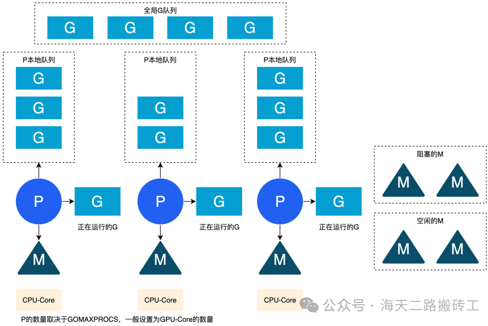
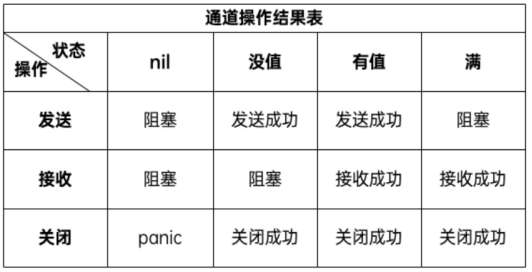

# 并发

**并发编程相关的基本概念**：

> 串行：我们都是先读小学，小学毕业后再读初中，读完初中再读高中。
> 并发：同一时间段内执行多个任务（你在用微信和两个女朋友聊天）。
> 并行：同一时刻执行多个任务（你和你朋友都在用微信和女朋友聊天）。

> 进程（process）：程序在操作系统中的一次执行过程，系统进行资源分配和调度的一个独立单位	》
> 线程（thread）：操作系统基于进程开启的轻量级进程，是操作系统调度执行的最小单位			》
> 协程（coroutine）：非操作系统提供而是由用户自行创建和控制的用户态‘线程’，比线程更轻量级

Go语言的并发通过goroutine 实现。goroutine 类似于线程,属于用户态的线程，我们可以根据需要创建成千，上万个goroutine并发工作。

goroutine是由Go语言的运行时(runtime) 调度完成，而线程是由操作系统调度完成。

Go语言还提供channel在多个goroutine间进行通信。goroutine 和channel是Go语言秉承的CSP (Communicating Sequential Process)并发模式的重要实现基础。

# 并发模型：

业界将如何实现并发编程总结归纳为各式各样的并发模型，常见的并发模型有以下几种：

> 线程&锁模型		Actor模型		CSP模型		Fork&Join模型

Go语言中的并发程序主要是通过基于**并发编程模式CSP**（communicating sequential processes）的goroutine和channel来实现，当然也支持使用传统的多线程共享内存的并发方式。**以通信的方式来共享内存**

**Goroutine**

Goroutine 类似于“线程”，是 Go 程序中最基本的并发执行单元。
每一个 Go 程序都至少包含一个 goroutine——`main goroutine`，当 Go 程序启动时它会自动创建。
在函数或方法调用前加上go关键字就可以创建一个 goroutine ，从而让该函数或方法在新创建的 goroutine 中执行。
一个goroutine会以一个很小的栈开始其生命周期，一般只需要2KB。goroutine 的调度顺序是随机的。
Go提供channel在多个goroutine间进行通信。

> ​	#在Go语言编程中你不需要去自己写进程、线程、协程，你的技能包里只有一个技能——goroutine，当你需要让某个任务并发执行的时候，你只需要把这个任务包装成一个函数，开启一个 goroutine 去执行这个函数就可以了，就是这么简单粗暴。
>

# 并发关键字go

只需要在函数或方法调用前加上go关键字就可以创建一个 goroutine ，从而让该函数或方法在新创建的 goroutine 中执行。
main函数自带一个goroutine

```go
go f()  // 创建一个新的 goroutine 运行函数f 
```

## 创建单个协程

```go
go func(){   	// 匿名函数也支持使用go关键字创建 goroutine 去执行
    ...
}()
```

一个 goroutine 必定对应一个函数/方法，可以创建多个 goroutine 去执行相同的函数/方法。


串行执行的问题：无法保证父进程在子进程后结束。

> 为什么会先打印你好呢？
> 这是因为在程序中创建 goroutine 执行函数需要一定的开销，而与此同时 main 函数所在的 goroutine 是继续执行的。

## 创建多个协程

`wg Sync.WaitGroup`结构体提供了一些常用的并发原语，等待一组 goroutines 完成

```go
wg.Add(1) // 启动一个goroutine就登记+1
wg.Done() // goroutine结束就登记-1
wg.Wait() // 等待所有登记的goroutine都结束
```

# goroutine与os线程的区别：

操作系统的os线程一般都有固定的栈内存（通常为2MB）
**Go是动态栈**，goroutine 非常轻量级，一个 goroutine 的初始栈空间很小（一般为 **2KB** ），所以在 Go 语言中一次创建数万个 goroutine 也是可能的。并且 goroutine 的栈不是固定的，可以根据需要动态地增大或缩小， Go 的 runtime 会自动为 goroutine 分配合适的栈空间。

# Goroutine调度模型GMP

目前 Go 语言的调度器采用的是 **GMP 调度模型**。**G (goroutine协程)、M (machine系统线程)、P (processor调度器)**



**1. G：`goroutine`的基本概念与特性**

G代表`goroutine`，是Go并发模型的执行单元。每个`goroutine`都代表着一个可以并行执行的任务。

与传统的线程模型相比，`goroutines`是极其轻量级的，它们的初始栈空间小，且可以根据需要动态伸缩。这种设计使得创建数以万计的`goroutines`成为可能，而不会对系统资源造成过大压力。

`goroutines`之间的调度不是由操作系统内核管理，而是由Go运行时`runtime`进行，这使得调度过程更加高效。`goroutines`在逻辑上是并发执行的，但实际上可能会被多个线程复用，这取决于GMP调度器的策略。

**2. M：操作系统线程（`machine`）的角色与限制**

M代表`Machine`，实际上就是操作系统的线程。在Go的并发模型中，M是执行`goroutine`代码的实体。每个M都会被分配一个P（我们很快会讲到），并从P的本地运行队列中获取G来执行。

M的数量通常由可用的硬件线程数（如CPU核心数）决定，Go运行时会尝试最大限度地利用所有的硬件线程。然而，M的数量并不是固定的，当存在阻塞调用（如系统调用）时，Go运行时可能会创建额外的M来保持CPU的利用率。

**3. P：处理器（`processor`）的调度作用**

P代表`Processor`，它是G和M之间的调度中介。每个P都有一个本地的`goroutine`队列，它负责维护和调度这些`goroutines`到M上执行。P的数量在程序启动时被设置，并且通常等于机器的逻辑CPU数量。

P的存在使得Go的调度器可以有效地平衡负载，通过本地队列减少全局锁的竞争。当M因为某些操作（如系统调用）被阻塞时，它会释放P，这样其他的M就可以接管P并继续执行`goroutines`，从而保持系统的高效运行。

## GMP模型的工作原理

GMP模型的工作原理是Go并发调度的核心，它决定了`goroutines`是如何在操作系统线程上执行的。

**1. G与M的绑定机制**

在Go的运行时中，`goroutines`（G）并不直接绑定到操作系统线程（M）上。相反，它们被调度到处理器（P）的本地运行队列中。当一个M需要执行工作时，它会从与之关联的P的本地队列中取出一个G来执行。如果一个M完成了它的G的执行或者G被阻塞，M会再次从P的队列中取出另一个G来执行。

这种绑定机制是临时的，因为G在执行完毕或者被阻塞后，M可以转而去执行其他的G。这种设计使得`goroutines`能够在多个线程之间高效地调度，而不需要固定的线程关联，从而减少了线程创建和销毁的开销。

**2. P的本地运行队列**

每个P都有一个本地运行队列，用于存储准备好执行的`goroutines`。当一个P的本地队列为空时，它可以尝试从全局运行队列或者其他P的本地队列中“偷取”`goroutines`来执行。这种工作窃取算法可以有效地平衡负载，确保所有的P都有工作可做，从而提高CPU的利用率。

**3. M的休眠与唤醒**

当一个M在其关联的P的本地队列中找不到可运行的G时，它可能会进入休眠状态。在休眠状态下，M不会消耗CPU资源。当新的`goroutines`被创建或者有`goroutines`变为可运行状态时，休眠中的M可以被唤醒来处理这些任务。

## G的状态转换

goroutines在其生命周期中会经历几种状态：

- **可运行（Runnable）**：G已经准备好执行，但还没有被分配到M上。
- **运行中（Running）**：G正在M上执行。
- **休眠（Waiting）**：G在等待某些事件（如I/O操作、channel通信或定时器）。
- **死亡（Dead）**：G的执行已经完成，或者被显式地终止。


当G在执行过程中遇到会导致阻塞的操作时，它会从M上解绑并进入休眠状态，等待被唤醒。一旦阻塞的操作完成，G会变回可运行状态，并等待被调度器重新分配到M上执行。如果G完成了所有的工作，它就会进入死亡状态，等待垃圾回收。

## GMP模型的调度策略

GMP模型的调度策略是Go语言高效并发的关键所在。这些策略确保了`goroutines`能够平滑地在多核心处理器上运行，同时最小化了上下文切换和同步的开销。下面我们来详细探讨这些策略。

**1. 工作窃取（Work Stealing）**

工作窃取是GMP模型中用于[负载均衡](https://cloud.tencent.com/product/clb?from_column=20065&from=20065)的主要策略。当一个处理器（P）上的本地运行队列中的`goroutines`都已经被分配给线程（M）执行时，这个P就会尝试从其他P的队列中“偷取”一半的`goroutines`来执行。这种策略可以确保所有的处理器都尽可能地保持忙碌状态，从而提高整体的CPU利用率。

**2. 手动与自动栈增长**

Go语言的`goroutines`拥有非常小的初始栈空间，通常只有几KB。这个栈会根据需要自动增长和缩减。当`goroutine`的栈空间不足时，Go运行时会自动检测这一情况并分配更多的栈空间，这个过程对程序员来说是透明的。这种自动栈管理机制减少了程序员在编写代码时需要考虑的内存管理问题，同时也保证了内存的高效使用。

**3. 系统调用与网络轮询器的影响**

当`goroutine`进行系统调用，如文件操作或网络I/O时，这可能会导致它被阻塞。在传统的线程模型中，这会导致整个线程被阻塞，从而浪费宝贵的CPU资源。

在Go中，当一个`goroutine`进行系统调用时，它所在的线程（M）会被阻塞，但Go运行时会尝试将该线程（M）上的处理器（P）分配给其他的线程（M），这样其他的goroutines就可以继续执行，从而避免了CPU资源的浪费。

此外，Go语言还提供了一个网络轮询器（netpoller），它是一个高效的多路复用器，用于监控网络I/O事件。当goroutine等待网络I/O时，它会被放入网络轮询器，而不是阻塞线程。一旦I/O操作准备就绪，网络轮询器会唤醒相应的goroutine，这时goroutine会重新进入调度器的运行队列，等待执行。


# GOMAXPROCS：

Go调度器使用**GOMAXPROCS参数**来确定需要使用多少个 OS 线程来同时执行 Go 代码。（默认值是满CPU核心数）

> 例如：在一个 8 核心的机器上，GOMAXPROCS 默认为 8。
> Go语言中可以通过runtime.GOMAXPROCS()函数设置当前程序并发时占用的 CPU逻辑核心数。
>
> #`runtime.NumCPU()`函数获取当前计算机上的逻辑CPU核心数

Go语言中的操作系统线程和goroutine用户级线程的关系:

​	1、一个操作系统线程对应用户态多个goroutine。

​	2、go程序可以同时使用多个操作系统线程。

​	3、goroutine和OS线程是多对多的关系，即m:n，将m个goroutine分配到n个OS线程上。

# channel通道

单纯地将函数并发执行是没有意义的。函数与函数间需要 **交换数据** 才能体现并发执行函数的意义。

> #虽然可以使用共享内存进行数据交换，但是共享内存在不同的 goroutine 中容易发生竞态问题。为了保证数据交换的正确性，很多并发模型中必须使用互斥量对内存进行加锁，这种做法势必造成性能问题。

**并发模型CSP(Communicating Sequential Processes通讯连续进程)：提倡通过通信共享内存而不是通过共享内存而实现通信。(不用时就关闭)** 
Go的CSP并发模型，是通过goroutine和channel来实现的：
goroutine 是Go程序并发的执行体。channel就是它们之间的连接。
channel是可以让一个 goroutine 发送特定值到另一个 goroutine 的通信机制。

Go 语言中的通道（channel）是一种特殊的类型。通道像一个传送带或者队列，总是遵循“先入先出（First In First Out）”的规则，保证收发数据的顺序。每一个通道都是一个具体类型的导管，也就是声明channel的时候需要为其指定元素类型。

> #底层是一个环形队列

## chan通道声明

Channel通道声明（默认零值是nil）
var 变量名称 chan 元素类型			(元素类型：是指通道中传递元素的类型)
channel初始化：声明的通道类型变量需要使用内置的make函数初始化之后才能使用。
make(chan 元素类型, [缓冲大小])  // 缓冲大小是可选的。

定义单向通道：

```go
<-chan int  // 接收通道，只能接收不能发送
chan<- int  // 发送通道，只能发送不能接收

var ch1 chan int   // 未初始化的通道类型变量其默认零值是nil
var ch2 chan bool  // 声明一个传递布尔型的通道
var ch3 chan []int // 声明一个传递int切片的通道
```

> ​	#对关闭的通道取值，是能够取到的。如果还有值，则取到的值为ok为ture，否则为false，取到的值为对应基本类型的零值

## chan使用及操作

channel三种操作（都使用<-符号）：

> 发送（send）、接收(receive）和关闭（close）

```go
ch <- 10 // 发送：把10发送到ch中

x := <- ch // 接收1：从ch中接收值并赋值给变量x
<-ch       // 接收2：从ch中接收值，忽略结果

close(ch) //关闭通道：通过调用内置的close函数来关闭通道

value, ok := <- ch := make(chan int,num)	// value为接收到的值，ok为缓冲区状态ture或false
```

for range循环从通道中接收值，当通道被关闭后，会在通道内的所有值被接收完毕后会自动退出循环。

```go
for v := range ch {
	fmt.Println(v)
}
```


> #目前Go语言中并没有提供一个,不对通道进行读取操作就能判断通道是否被关闭的方法。不能简单的通过len(ch)操作来判断通道是否被关闭。
>
> #无缓冲通道可以进行编译，但执行会报错



## 无缓冲的通道

无缓冲的通道又称为阻塞的通道或者**同步通道**。我们来看一下如下代码片段。

```go
func main() {
	ch := make(chan int)
	ch <- 10
	fmt.Println("发送成功")
}
```

上面这段代码能够通过编译，但是执行的时候会出现以下错误：

```bash
fatal error: all goroutines are asleep - deadlock!

goroutine 1 [chan send]:
main.main()
        .../main.go:8 +0x54
```

`deadlock`表示我们程序中的 goroutine 都被挂起导致程序死锁了。为什么会出现`deadlock`错误呢？

因为我们使用`ch := make(chan int)`创建的是无缓冲的通道，无缓冲的通道只有在有接收方能够接收值的时候才能发送成功，否则会一直处于等待发送的阶段。同理，如果对一个无缓冲通道执行接收操作时，没有任何向通道中发送值的操作那么也会导致接收操作阻塞。就像田径比赛中的4x100接力赛，想要完成交棒必须有一个能够接棒的运动员，否则只能等待。简单来说就是无缓冲的通道必须有至少一个接收方才能发送成功。

上面的代码会阻塞在`ch <- 10`这一行代码形成死锁，那如何解决这个问题呢？

其中一种可行的方法是创建一个 goroutine 去接收值，例如：

```go
func recv(c chan int) {
	ret := <-c
	fmt.Println("接收成功", ret)
}

func main() {
	ch := make(chan int)
	go recv(ch) // 创建一个 goroutine 从通道接收值
	ch <- 10
	fmt.Println("发送成功")
}
```

首先无缓冲通道`ch`上的发送操作会阻塞，直到另一个 goroutine 在该通道上执行接收操作，这时数字10才能发送成功，两个 goroutine 将继续执行。相反，如果接收操作先执行，接收方所在的 goroutine 将阻塞，直到 main goroutine 中向该通道发送数字10。

使用无缓冲通道进行通信将导致发送和接收的 goroutine 同步化。因此，无缓冲通道也被称为 **同步通道**。

## 有缓冲的通道

还有另外一种解决上面死锁问题的方法，那就是使用有缓冲区的通道。我们可以在使用 make 函数初始化通道时，可以为其指定通道的容量，例如：

```go
func main() {
	ch := make(chan int, 1) // 创建一个容量为1的有缓冲区通道
	ch <- 10
	fmt.Println("发送成功")
}
```

只要通道的容量大于零，那么该通道就属于有缓冲的通道，通道的容量表示通道中最大能存放的元素数量。

- 当通道内已有元素数达到最大容量后，再向通道执行发送操作就会阻塞，除非有从通道执行接收操作。就像你小区的快递柜只有那么个多格子，格子满了就装不下了，就阻塞了，等到别人取走一个快递员就能往里面放一个。
- 当管道关闭时，如果管道内还有数据，接收操作仍然可以成功接收这些数据。只有当管道内的数据全部被接收完后，再次进行接收操作时，才会返回零值和 `false`。

我们可以使用内置的`len`函数获取通道内元素的数量，使用`cap`函数获取通道的容量，虽然我们很少会这么做。


## 多返回值模式

当向通道中发送完数据时，我们可以通过`close`函数来关闭通道。当一个通道被关闭后，再往该通道发送值会引发`panic`，从该通道取值的操作会先取完通道中的值。通道内的值被接收完后再对通道执行接收操作得到的值会一直都是对应元素类型的零值。那**我们如何判断一个通道是否被关闭了呢？**

对一个通道执行接收操作时支持使用如下多返回值模式。

```go
value, ok := <- ch
```

其中：

- value：从通道中取出的值，如果通道被关闭则返回对应类型的零值。
- ok：通道ch关闭时返回 false，否则返回 true。

下面代码片段中的`f2`函数会循环从通道`ch`中接收所有值，直到通道被关闭后退出。

```go
func f2(ch chan int) {
	for {
		v, ok := <-ch
		if !ok {
			fmt.Println("通道已关闭")
			break
		}
		fmt.Printf("v:%#v ok:%#v\n", v, ok)
	}
}

func main() {
	ch := make(chan int, 2)
	ch <- 1
	ch <- 2
	close(ch)
	f2(ch)
}
```

## 单向通道

在某些场景下我们可能会将通道作为参数在多个任务函数间进行传递，通常我们会选择在不同的任务函数中对通道的使用进行限制，比如限制通道在某个函数中只能执行发送或只能执行接收操作。想象一下，我们现在有`Producer`和`Consumer`两个函数，其中`Producer`函数会返回一个通道，并且会持续将符合条件的数据发送至该通道，并在发送完成后将该通道关闭。而`Consumer`函数的任务是从通道中接收值进行计算，这两个函数之间通过`Processer`函数返回的通道进行通信。完整的示例代码如下。

```go
package main

import (
	"fmt"
)

// Producer 返回一个通道
// 并持续将符合条件的数据发送至返回的通道中
// 数据发送完成后会将返回的通道关闭
func Producer() chan int {
	ch := make(chan int, 2)
	// 创建一个新的goroutine执行发送数据的任务
	go func() {
		for i := 0; i < 10; i++ {
			if i%2 == 1 {
				ch <- i
			}
		}
		close(ch) // 任务完成后关闭通道
	}()

	return ch
}

// Consumer 从通道中接收数据进行计算
func Consumer(ch chan int) int {
	sum := 0
	for v := range ch {
		sum += v
	}
	return sum
}

func main() {
	ch := Producer()

	res := Consumer(ch)
	fmt.Println(res) // 25

}
```

从上面的示例代码中可以看出正常情况下`Consumer`函数中只会对通道进行接收操作，但是这不代表不可以在`Consumer`函数中对通道进行发送操作。作为`Producer`函数的提供者，我们在返回通道的时候可能只希望调用方拿到返回的通道后只能对其进行接收操作。但是我们没有办法阻止在`Consumer`函数中对通道进行发送操作。

Go语言中提供了**单向通道**来处理这种需要限制通道只能进行某种操作的情况。

```go
<- chan int // 只接收通道，只能接收不能发送
chan <- int // 只发送通道，只能发送不能接收
```

其中，箭头`<-`和关键字`chan`的相对位置表明了当前通道允许的操作，这种限制将在编译阶段进行检测。另外对一个只接收通道执行close也是不允许的，因为默认通道的关闭操作应该由发送方来完成。

我们使用单向通道将上面的示例代码进行如下改造。

```go
// Producer2 返回一个接收通道
func Producer2() <-chan int {
	ch := make(chan int, 2)
	// 创建一个新的goroutine执行发送数据的任务
	go func() {
		for i := 0; i < 10; i++ {
			if i%2 == 1 {
				ch <- i
			}
		}
		close(ch) // 任务完成后关闭通道
	}()

	return ch
}

// Consumer2 参数为接收通道
func Consumer2(ch <-chan int) int {
	sum := 0
	for v := range ch {
		sum += v
	}
	return sum
}

func main() {
	ch2 := Producer2()
  
	res2 := Consumer2(ch2)
	fmt.Println(res2) // 25
}
```

这一次，`Producer`函数返回的是一个只接收通道，这就从代码层面限制了该函数返回的通道只能进行接收操作，保证了数据安全。很多读者看到这个示例可能会觉着这样的限制是多余的，但是试想一下如果`Producer`函数可以在其他地方被其他人调用，你该如何限制他人不对该通道执行发送操作呢？并且返回限制操作的单向通道也会让代码语义更清晰、更易读。

在函数传参及任何赋值操作中全向通道（正常通道）可以转换为单向通道，但是无法反向转换。

```go
var ch3 = make(chan int, 1)
ch3 <- 10
close(ch3)
Consumer2(ch3) // 函数传参时将ch3转为单向通道

var ch4 = make(chan int, 1)
ch4 <- 10
var ch5 <-chan int // 声明一个只接收通道ch5
ch5 = ch4          // 变量赋值时将ch4转为单向通道
<-ch5
```

## for range接收值

通常我们会选择使用`for range`循环从通道中接收值，当通道被关闭后，会在通道内的所有值被接收完毕后会自动退出循环。上面那个示例我们使用`for range`改写后会很简洁。

```go
func f3(ch chan int) {
	for v := range ch {
		fmt.Println(v)
	}
}
```

**注意：**目前Go语言中并没有提供一个不对通道进行读取操作就能判断通道是否被关闭的方法。不能简单的通过`len(ch)`操作来判断通道是否被关闭。

## select多路复用（取值）

用于处理多个通道的操作。它可以监听多个通道上的数据流动，并在其中任何一个通道准备好读取或写入时进行相应的操作。
当没有 **default默认选项** 和 **没有数据** 可以被接收时，那么当前 goroutine 将会发生阻塞。

接收数据操作，尝试使用遍历的方式来实现从多个通道中接收值。

```go
for {
  select {
  	case <-ch1:
    ...
	case data := <-ch2:
    ...
	case ch3 <- 10:
    ...
  	case <- time.NewTimer(time.Second): // 延时操作
    ...
	default: // 默认操作，上面条件都不满足时执行
	}
}
```

Select 语句具有以下特点：
	1、可处理一个或多个 channel 的发送/接收操作。
	2、如果多个 case 同时满足，select 会随机选择一个执行。
	3、对于没有符合case 的 select 会一直阻塞，可用于阻塞 main 函数，防止退出。

## 通道误用示例

接下来，我们将展示两个因误用通道导致程序出现 bug 的代码片段，希望能够加深读者对通道操作的印象。

### 示例1

各位读者可以查看以下示例代码，尝试找出其中存在的问题。

```go
func demo1() {	// demo1 通道误用导致的bug
	wg := sync.WaitGroup{}

	ch := make(chan int, 10)
	for i := 0; i < 10; i++ {
		ch <- i
	}
	close(ch)

	wg.Add(3)
	for j := 0; j < 3; j++ {
		go func() {
			for {
				task := <-ch
				// 这里假设对接收的数据执行某些操作
				fmt.Println(task)
			}
			wg.Done()
		}()
	}
	wg.Wait()
}
```

将上述代码编译执行后，匿名函数所在的 goroutine 并不会按照预期在通道被关闭后退出。因为`task := <- ch`的接收操作在通道被关闭后会一直接收到零值，而不会退出。此处的接收操作应该使用`task, ok := <- ch `，通过判断布尔值`ok`为假时退出；或者使用select 来处理通道。

### 示例2

各位读者阅读下方代码片段，尝试找出其中存在的问题。

```go
func demo2() {	// demo2 通道误用导致的bug
	ch := make(chan string)
	go func() {
		// 这里假设执行一些耗时的操作
		time.Sleep(3 * time.Second)
		ch <- "job result"
	}()

	select {
	case result := <-ch:
		fmt.Println(result)
	case <-time.After(time.Second): // 较小的超时时间
		return
	}
}
```

上述代码片段可能导致 goroutine 泄露（goroutine 并未按预期退出并销毁）。由于 select 命中了超时逻辑，导致通道没有消费者（无接收操作），而其定义的通道为无缓冲通道，因此 goroutine 中的`ch <- "job result"`操作会一直阻塞，最终导致 goroutine 泄露。

# sync资源锁

使用sync同步包

产生原因：代码中可能会存在多个 goroutine 同时操作一个资源（临界区）的情况，可能发生竞态问题（数据竞态）。
产生结果：两个 goroutine 在访问和修改全局的x变量时就会存在数据竞争，某个 goroutine 中对全局变量x的修改可能会覆盖掉另一个 goroutine 中的操作，所以导致最后的结果与预期不符。

## sync.Mutex互斥锁

一种常用的控制共享资源访问的方法。能够保证同一时间有且只有一个 goroutine 进入临界区访问数据，其他的 goroutine 则在等待锁；
当互斥锁释放后，等待的 goroutine 才可以获取锁进入临界区，多个 goroutine 同时等待一个锁时，唤醒的策略是随机的。
`sync.Mutex`结构体类型来实现互斥锁。提供了两个内置方法：

| 方法名                 | 功能       | 方法名                   | 功能       |
| ---------------------- | ---------- | ------------------------ | ---------- |
| func (m *Mutex) Lock() | 获取互斥锁 | func (m *Mutex) Unlock() | 释放互斥锁 |

```go
var (
	x int64
	wg sync.WaitGroup 	// 等待组
	m sync.Mutex 		// 互斥锁
)

func add() { 		// add 对全局变量x执行5000次加1操作
	for i := 0; i < 5000; i++ {
		m.Lock() 	// 修改x前加锁
		x = x + 1
		m.Unlock() 	// 改完解锁
	}
	wg.Done()
}

func main() {
	wg.Add(2)

	go add()
	go add()

	wg.Wait()
	fmt.Println(x)
}
```


## sync.RWMutex读写互斥锁

互斥锁是完全互斥的，但是实际上有很多场景是读>写的。故能够极大地提高程序的性能
当并发的去读取一个资源而不涉及资源修改的时候是没有必要加互斥锁的，这种场景下使用读写锁是更好的一种选择。
读写锁`sync.RWMutex`结构体类型提供了以下5个方法:

| 方法名                              | 功能                           | 方法名                       | 功能     |
| ----------------------------------- | ------------------------------ | ---------------------------- | -------- |
| func (rw *RWMutex) Lock()           | 获取写锁                       | func (rw *RWMutex) RLock()   | 获取读锁 |
| func (rw *RWMutex) Unlock()         | 释放写锁                       | func (rw *RWMutex) RUnlock() | 释放读锁 |
| func (rw *RWMutex) RLocker() Locker | 返回一个实现Locker接口的读写锁 |                              |          |

读写锁分为读锁和写锁：
当一个 goroutine 获取到读锁之后，其他的 goroutine 如果是获取读锁会继续获得锁，
如果是获取写锁就会等待；而当一个 goroutine 获取写锁之后，其他的 goroutine 获取读锁和写锁都会等待。

```go
var (
	x       int64
	wg      sync.WaitGroup
	mutex   sync.Mutex
	rwMutex sync.RWMutex
)

func writeWithLock() {	// writeWithLock 使用互斥锁的写操作
	mutex.Lock() // 加互斥锁
	x = x + 1
	time.Sleep(10 * time.Millisecond) // 假设读操作耗时10毫秒
	mutex.Unlock()                    // 解互斥锁
	wg.Done()
}

func readWithLock() {	// readWithLock 使用互斥锁的读操作
	mutex.Lock()                 // 加互斥锁
	time.Sleep(time.Millisecond) // 假设读操作耗时1毫秒
	mutex.Unlock()               // 释放互斥锁
	wg.Done()
}

func writeWithRWLock() {	// writeWithLock 使用读写互斥锁的写操作
	rwMutex.Lock() // 加写锁
	x = x + 1
	time.Sleep(10 * time.Millisecond) // 假设读操作耗时10毫秒
	rwMutex.Unlock()                  // 释放写锁
	wg.Done()
}

func readWithRWLock() {	// readWithRWLock 使用读写互斥锁的读操作
	rwMutex.RLock()              // 加读锁
	time.Sleep(time.Millisecond) // 假设读操作耗时1毫秒
	rwMutex.RUnlock()            // 释放读锁
	wg.Done()
}

func do(wf, rf func(), wc, rc int) {
	start := time.Now()
	for i := 0; i < wc; i++ {	// wc个并发写操作
		wg.Add(1)
		go wf()
	}

	for i := 0; i < rc; i++ { 	// rc个并发读操作
		wg.Add(1)
		go rf()
	}

	wg.Wait()
	cost := time.Since(start)
	fmt.Printf("x:%v cost:%v\n", x, cost)
}
```


## sync.Pool

**sync.Pool 作用**：创建一个临时对象池，缓存组对象用于重复利用，以此来减少内存分配和降低GC的压力

**sync.Pool 应用场景**：可用于连接池(grpc 客户端、网络连接等)等场景

**注意事项**

1、用于缓存一些创建成本较高，使用比较频繁的对象
2、PooL的长度默认为机器CPU线程数
3、存储在PooL中的对象随时都可能在不被通知的情况下被回收
4、没有什么创建成本的对象不建议使用对象池

## sync.WaitGroup并发同步计数器

在代码中生硬的使用time.Sleep肯定是不合适的，Go语言中使用sync.WaitGroup来实现并发任务的同步，有以下几个方法：

| 方法名                               | 功能                | 方法名                      | 功能     |
| ------------------------------------ | ------------------- | --------------------------- | -------- |
| func (wg * WaitGroup) Add(delta int) | 计数器+delta        | func (wg *WaitGroup) Done() | 计数器-1 |
| func (wg *WaitGroup) Wait()          | 阻塞直到计数器变为0 |                             |          |

`sync.WaitGroup`内部维护着一个计数器，计数器的值可以增加和减少。

**例如**：当我们启动了 N 个并发任务时，就将计数器值增加N。

​	每个任务完成时通过调用 Done 方法将计数器减1。通过调用 Wait 来等待并发任务执行完，当计数器值为 0 时，表示所有并发任务已经完成。

**sync. WaitGroup 陷阱**

1、协程间传递时需要 **以指针的方式** 或闭包的方式引用WaitGroup对象。否则将会造成死锁

2、也可以设置全局变量，来进行引用

## sync.Cond

**作用**

1、设置一组协程根据条件阻塞，可以根据不同的条件阻塞
2、可以根据条件唤醒相对应的协程

**应用场景**

应用于一发多收的场景，即一组协程需要等待某个 协程完成些前 置准备的情况。

**注意事项**
1、被叫方必须持有锁
2、主叫方可以持有锁，但允许不持有
3、尽可能的减少无效唤醒


## sync.Once一次异步并发

在某些操作即在高并发的场景下只会被执行一次

**例如**：只加载一次配置文件等。

Go语言中的sync包中提供了一个针对只执行一次场景的解决方案——`sync.Once.Do()`方法，其签名如下：

```go
func (o *Once) Do(f func())	// 注意：如果要执行的函数f需要传递参数就需要搭配闭包来使用。
```

延迟一个开销很大的初始化操作到真正用到它的时候再执行是一个很好的实践。因为预先初始化一个变量（比如在init函数中完成初始化）会增加程序的启动耗时，而且有可能实际执行过程中这个变量没有用上，那么这个初始化操作就不是必须要做的。

`sync.Once内部`：包含一个互斥锁和一个布尔值，互斥锁保证布尔值和数据的安全，而布尔值用来记录初始化是否完成。
这样设计就能保证初始化操作的时候是并发安全的并且初始化操作也不会被执行多次。

```go
var icons map[string]image.Image
var loadIconsOnce sync.Once

func loadIcons() {
	icons = map[string]image.Image{
		"left":  loadIcon("left.png"),
		"up":    loadIcon("up.png"),
		"right": loadIcon("right.png"),
		"down":  loadIcon("down.png"),
	}
}

func Icon(name string) image.Image {	// Icon 是并发安全的
	loadIconsOnce.Do(loadIcons)
	return icons[name]
}
```


## sync.Map

内置的 map 并发不安全，需要使用到sync.Map加锁来保证并发的安全性。
Go语言的sync包中提供了一个开箱即用的并发安全版`sync.Map`。不需要使用 make 函数初始化就能直接使用。同时内置数据操作方法：

```go
func (m *Map) Store(key, value interface{})	//存储key-value数据
func (m *Map) Load(key interface{}) (value interface{}, ok bool) //查询key对应的value
func (m *Map) LoadOrStore(key, value interface{}) (actual interface{}, loaded bool)	//查询或存储key对应的value
func (m *Map) LoadAndDelete(key interface{}) (value interface{}, loaded bool) 		//查询并删除key
func (m *Map) Delete(key interface{}) 		//删除key
func (m *Map) Range(f func(key, value interface{}) bool) 		//对map中的每个key-value依次调用f
```

# atomic包原子操作

atomic包针对整数数据类型（int32、uint32、int64、uint64）我们还可以使用原子操作来保证并发安全，
使用原子操作比使用锁操作效率更高。由内置的标准库sync/atomic提供。

**sync/atomic 作用**
atomic包提 供底层的原子级内存操作，用于实现同步算法

**应用场景**
1.通过内存通实现通信

**注意事项**
1.atomic属于底层原子操作，如无必要请使用通道或者sync包的其他函数或类型实现同步算法

2.如果没有把握正确使用atomic那么请不要使用

```go
方法																			解释
func LoadInt32(addr *int32) (val int32)
func LoadInt64(addr *int64) (val int64)
func LoadUint32(addr *uint32) (val uint32)
func LoadUint64(addr *uint64) (val uint64)
func LoadUintptr(addr *uintptr) (val uintptr)
func LoadPointer(addr *unsafe.Pointer) (val unsafe.Pointer)					读取操作
func StoreInt32(addr *int32, val int32)
...
func StoreUint64(addr *uint64, val uint64)
func StoreUintptr(addr *uintptr, val uintptr)
func StorePointer(addr *unsafe.Pointer, val unsafe.Pointer)					写入操作
func AddInt32(addr *int32, delta int32) (new int32)
...
func AddUint64(addr *uint64, delta uint64) (new uint64)
func AddUintptr(addr *uintptr, delta uintptr) (new uintptr)					修改操作
func SwapInt32(addr *int32, new int32) (old int32)
...
func SwapUint64(addr *uint64, new uint64) (old uint64)
func SwapUintptr(addr *uintptr, new uintptr) (old uintptr)
func SwapPointer(addr *unsafe.Pointer, new unsafe.Pointer) (old unsafe.Pointer)	交换操作
func CompareAndSwapInt32(addr *int32, old, new int32) (swapped bool)
...
func CompareAndSwapUint64(addr *uint64, old, new uint64) (swapped bool)
func CompareAndSwapUintptr(addr *uintptr, old, new uintptr) (swapped bool)
func CompareAndSwapPointer(addr *unsafe.Pointer, old, new unsafe.Pointer) (swapped bool)	比较并交换操作
```


# context库

实现如何优雅的控制子goroutine退出？

## 认识context

**context标准库**：它定义了Context类型，专门用来简化于处理单个请求的多个goroutine之间与请求域的数据、取消信号、截止时间等相关操作，这些操作可能涉及多个 API 调用。

对服务器传入的请求应该创建上下文，而对服务器的传出调用应该接受上下文。
它们之间的函数调用链必须传递上下文，或者可以使用**WithCancel、WithDeadline(相对时间)、WithTimeout(绝对时间)或WithValue**创建的派生上下文。当一个上下文被取消时，它派生的所有上下协程也被取消。

当协程还有子协程时，传入ctx，调用cancel()时能够一同取消

```go
// 返回一个非 nil 的空上下文，作为一个初始结束节点
context.Background()

//返回具有“结束“命令的父级副本和cancel结束命令
ctx, cancel := context.WithCancel(context.Background()) 

// 等待通知
ctx.Done()
// 作用：通知所有子goroutine结束命令，支持递归传递
cancel()
```

```go
var wg sync.WaitGroup

func worker(ctx context.Context) {
	go worker2(ctx) 		// 开启子协程
	for {
		fmt.Println("worker")
		time.Sleep(time.Second)
		select {
		case <-ctx.Done(): // 等待上级通知
			break LOOP
		default:
		}
	}
	wg.Done()
}

func worker2(ctx context.Context) {
	for {
		fmt.Println("worker2")
		time.Sleep(time.Second)
		select {
		case <-ctx.Done(): // 等待上级通知
			break LOOP
		default:
		}
	}
}

func main() {
	ctx, cancel := context.WithCancel(context.Background())
	wg.Add(1)
	go worker(ctx)
	time.Sleep(time.Second * 3)
	cancel() 				// 通知子goroutine结束
	wg.Wait()
	fmt.Println("over")
}
```

## Context接口设计

**例**：在 Go http包的Server中，每一个请求在都有一个对应的 goroutine 去处理。请求处理函数通常会启动额外的 goroutine 用来访问后端服务，比如数据库和RPC服务。
用来处理一个请求的 goroutine 通常需要访问一些与请求特定的数据，比如终端用户的身份认证信息、验证相关的token、请求的截止时间。
当一个请求被取消或超时时，所有用来处理该请求的 goroutine 都应该迅速退出，然后系统才能释放这些 goroutine 占用的资源。

`context.Context`是一个接口，该接口定义了四个需要实现的方法。具体签名如下：

```go
type Context interface {
    Deadline() (deadline time.Time, ok bool)
    Done() <-chan struct{}
    Err() error
    Value(key interface{}) interface{}
}
```

`Deadline方法`：需要返回当前Context被取消的时间，也就是完成工作的截止时间（deadline）；

`Done方法`：需要返回一个Channel，这个Channel会在当前工作完成或者上下文被取消之后关闭，多次调用Done方法会返回同一个Channel；

`Err方法`：会返回当前Context结束的原因，它只会在Done返回的Channel被关闭时才会返回非空的值；

- 如果当前Context被取消就会返回Canceled错误；
- 如果当前Context超时就会返回DeadlineExceeded错误；

`Value方法`：会从Context中返回键对应的值，对于同一个上下文来说，多次调用Value 并传入相同的Key会返回相同的结果，该方法仅用于传递跨API和进程间跟请求域的数据；


## Background()和TODO()

我们代码中最开始都是以这两个内置的上下文对象作为最顶层的partent context，衍生出更多的子上下文对象。

`Context.Background()`作为Context这个树结构的最顶层的Context，也就是根Context或者称为起点。
`Context.TODO()`，它目前还不知道具体的使用场景，如果我们不知道该使用什么Context的时候，可以使用这个。

background和todo本质上都是emptyCtx结构体类型，是一个不可取消，没有设置截止时间，没有携带任何值的Context。

## context内函数介绍

### WithCancel

```go
WithCancel(parent Context) (ctx Context, cancel CancelFunc)
```

返回带有新Done通道的父节点的副本。当调用返回的cancel函数或关闭父上下文的Done通道时，将关闭返回上下文的Done通道，无论先发生什么情况。
取消此上下文将释放与其关联的资源，因此代码应该在此上下文中运行的操作完成后立即调用cancel。

```go
func gen(ctx context.Context) <-chan int {
		dst := make(chan int)
		n := 1
		go func() {
			for {
				select {
				case <-ctx.Done():
					return // return结束该goroutine，防止泄露
				case dst <- n:
					n++
				}
			}
		}()
		return dst
}

func main() {
	ctx, cancel := context.WithCancel(context.Background())
	defer cancel() // 当我们取完需要的整数后调用cancel

	for n := range gen(ctx) {
		fmt.Println(n)
		if n == 5 {
			break
		}
	}
}
```

### WithDeadline

```go
WithDeadline(parent Context, deadline time.Time) (Context, CancelFunc)	//绝对时间
```

返回父上下文的副本，并将deadline调整为不迟于d。如果父上下文的deadline已经早于d，则WithDeadline(parent, d)在语义上等同于父上下文。当截止日过期时，当调用返回的cancel函数时，或者当父上下文的Done通道关闭时，返回上下文的Done通道将被关闭，以最先发生的情况为准。

取消此上下文将释放与其关联的资源，因此代码应该在此上下文中运行的操作完成后立即调用cancel。

```go
func main() {
	d := time.Now().Add(50 * time.Millisecond)
	ctx, cancel := context.WithDeadline(context.Background(), d)

	// 尽管ctx会过期，但在任何情况下调用它的cancel函数都是很好的实践。
	// 如果不这样做，可能会使上下文及其父类存活的时间超过必要的时间。
	defer cancel()

	select {
	case <-time.After(1 * time.Second):
		fmt.Println("overslept")
	case <-ctx.Done():
		fmt.Println(ctx.Err())
	}
}
```

上面的代码中，定义了一个50毫秒之后过期的deadline，然后我们调用`context.WithDeadline(context.Background(), d)`得到一个上下文（ctx）和一个取消函数（cancel），然后使用一个select让主程序陷入等待：等待1秒后打印`overslept`退出或者等待ctx过期后退出。

在上面的示例代码中，因为ctx 50毫秒后就会过期，所以`ctx.Done()`会先接收到context到期通知，并且会打印ctx.Err()的内容。


### WithTimeout

`WithTimeout`的函数签名如下：

```go
func WithTimeout(parent Context, timeout time.Duration) (Context, CancelFunc)
```

`WithTimeout`返回`WithDeadline(parent, time.Now().Add(timeout))`。

取消此上下文将释放与其相关的资源，因此代码应该在此上下文中运行的操作完成后立即调用cancel，通常用于数据库或者网络连接的超时控制。具体示例如下：

```go
var wg sync.WaitGroup	// context.WithTimeout

func worker(ctx context.Context) {
	for {
		fmt.Println("db connecting ...")
		time.Sleep(time.Millisecond * 10) // 假设正常连接数据库耗时10毫秒
		select {
		case <-ctx.Done(): // 50毫秒后自动调用
			break LOOP
		default:
		}
	}
	fmt.Println("worker done!")
	wg.Done()
}

func main() {
	ctx, cancel := context.WithTimeout(context.Background(), time.Millisecond*50)	// 设置一个50毫秒的超时
	wg.Add(1)
	go worker(ctx)
	time.Sleep(time.Second * 5)
	cancel() // 通知子goroutine结束
	wg.Wait()
	fmt.Println("over")
}
```


### WithValue

`WithValue函数`能够将请求作用域的数据与 Context 对象建立关系。

```go
func WithValue(parent Context, key, val interface{}) Context // 返回父节点的副本，其中与key关联的值为val。
```

仅对API和进程间传递请求域的数据使用上下文值，而不是使用它来传递可选参数给函数。
提供可比较的键，并且不应该是string类型或任何其他内置类型，以避免使用上下文在包之间发生冲突。

WithValue的用户应该为键定义自己的类型。为了避免在分配给interface{}时进行分配，上下文键通常具有具体类型struct{}。或者，导出的上下文关键变量的静态类型应该是指针或接口。

```go
type TraceCode string
var wg sync.WaitGroup

func worker(ctx context.Context) {
	key := TraceCode("TRACE_CODE")
	traceCode, ok := ctx.Value(key).(string) // 在子goroutine中获取trace code
	if !ok {
		fmt.Println("invalid trace code")
	}
	for {
		fmt.Printf("worker, trace code:%s\n", traceCode)
		time.Sleep(time.Millisecond * 10) // 假设正常连接数据库耗时10毫秒
		select {
		case <-ctx.Done(): // 50毫秒后自动调用
			break LOOP
		default:
		}
	}
	fmt.Println("worker done!")
	wg.Done()
}

func main() {
	ctx, cancel := context.WithTimeout(context.Background(), time.Millisecond*50)	// 设置一个50毫秒的超时
	// 在系统的入口中设置trace code传递给后续启动的goroutine实现日志数据聚合
	ctx = context.WithValue(ctx, TraceCode("TRACE_CODE"), "12512312234")
	wg.Add(1)
	go worker(ctx)
	time.Sleep(time.Second * 5)
	cancel() // 通知子goroutine结束
	wg.Wait()
	fmt.Println("over")
}
```


## Context使用注意事项

推荐以参数的方式显示传递Context
以Context作为参数的函数方法，应该把Context作为第一个参数。
给一个函数方法传递Context的时候，不要传递nil，如果不知道传递什么，就使用`context.TODO()`
Context的Value相关方法应该传递请求域的必要数据，不应该用于传递可选参数
Context是线程安全的，可以放心的在多个goroutine中传递

# 处理并发错误

在Go语言中十分便捷地开启goroutine去并发地执行任务，但是如何有效的处理并发过程中的错误则是一个很棘手的问题，本文介绍了一些处理并发错误的方法。

- 1、在每个goroutine中捕获错误，并将错误发送到一个channel通道中
- 2、可以用`context`包在goroutine之间传递取消信号，从而在发生错误时取消其他goroutine
- 3、`errgroup`包是`sync`包的一个扩展，提供了更方便的错误处理机制

## recover goroutine中的panic

我们知道可以在代码中使用 recover 来会恢复程序中意想不到的 panic，而 panic 只会触发当前 goroutine 中的 defer 操作。

例如在下面的示例代码中，无法在 main 函数中 recover 另一个goroutine中引发的 panic。

```go
func f1() {
	defer func() {
		if e := recover(); e != nil {
			fmt.Printf("recover panic:%v\n", e)
		}
	}()
	go func() { // 开启一个goroutine执行任务
		fmt.Println("in goroutine....")
		panic("panic in goroutine") // 只能触发当前goroutine中的defer
	}()

	time.Sleep(time.Second)
	fmt.Println("exit")
}
```

执行上面的 f1 函数会得到如下结果：

```bash
in goroutine....
panic: panic in goroutine

goroutine 6 [running]:
main.f1.func2()
        /Users/liwenzhou/workspace/github/the-road-to-learn-golang/ch12/goroutine_recover.go:20 +0x65
created by main.f1
        /Users/liwenzhou/workspace/github/the-road-to-learn-golang/ch12/goroutine_recover.go:17 +0x48

Process finished with exit code 2
```

从输出结果可以看到程序并没有正常退出，而是由于 panic 异常退出了（exit code 2）。

正如上面示例演示的那样，在启用 goroutine 去执行任务的场景下，如果想要 recover goroutine中可能出现的 panic 就需要在 goroutine 中使用 recover。就像下面的 f2 函数那样。

```go
func f2() {
	defer func() {
		if r := recover(); r != nil {
			fmt.Printf("recover outer panic:%v\n", r)
		}
	}()
	go func() { // 开启一个goroutine执行任务
		defer func() {
			if r := recover(); r != nil {
				fmt.Printf("recover inner panic:%v\n", r)
			}
		}()
		fmt.Println("in goroutine....")
		panic("panic in goroutine") // 只能触发当前goroutine中的defer
	}()
	time.Sleep(time.Second)
	fmt.Println("exit")
}
```

执行 f2 函数会得到如下输出结果。

```go
in goroutine....
recover inner panic:panic in goroutine
exit
```

程序中的 panic 被 recover 成功捕获，程序最终正常退出。

## errgroup

在以往演示的并发示例中，我们通常像下面的示例代码那样在 go 关键字后，调用一个函数或匿名函数。

```go
go func(){
  // ...
}

go foo()
```

在之前讲解并发的代码示例中我们默认被并发的那些函数都不会返回错误，但真实的情况往往是事与愿违。

当我们想要将一个任务拆分成多个子任务交给多个 goroutine 去运行，这时我们该如何获取到子任务可能返回的错误呢？

假设我们有多个网址需要并发去获取它们的内容，这时候我们会写出类似下面的代码。

```go
func fetchUrlDemo() { // fetchUrlDemo 并发获取url内容
	wg := sync.WaitGroup{}
	var urls = []string{
		"http://pkg.go.dev",
		"http://www.liwenzhou.com",
		"http://www.yixieqitawangzhi.com",
	}

	for _, url := range urls {
		wg.Add(1)
		go func(url string) {
			defer wg.Done()
			resp, err := http.Get(url)
			if err == nil {
				fmt.Printf("获取%s成功\n", url)
				resp.Body.Close()
			}
			return // 如何将错误返回呢？
		}(url)
	}
	wg.Wait()
	// 如何获取goroutine中可能出现的错误呢？
}
```

执行上述`fetchUrlDemo`函数得到如下输出结果，由于 [http://www.yixieqitawangzhi.com](http://www.yixieqitawangzhi.com/) 是我随意编造的一个并不真实存在的 url，所以对它的 HTTP 请求会返回错误。

```bash
获取http://pkg.go.dev成功
获取http://www.liwenzhou.com成功
```

在上面的示例代码中，我们开启了 3 个 goroutine 分别去获取3个 url 的内容。类似这种将任务分为若干个子任务的场景会有很多，那么我们如何获取子任务中可能出现的错误呢？

errgroup 包就是为了解决这类问题而开发的，它能为处理公共任务的子任务而开启的一组 goroutine 提供同步、error 传播和基于context 的取消功能。

errgroup 包中定义了一个 Group 类型，它包含了若干个不可导出的字段。

```go
type Group struct {
	cancel func()

	wg sync.WaitGroup

	errOnce sync.Once
	err     error
}
```

errgroup.Group 提供了`Go`和`Wait`两个方法。

```go
func (g *Group) Go(f func() error)
```

- Go 函数会在新的 goroutine 中调用传入的函数f。
- 第一个返回非零错误的调用将取消该Group；下面的Wait方法会返回该错误

```go
func (g *Group) Wait() error
```

- Wait 会阻塞直至由上述 Go 方法调用的所有函数都返回，然后从它们返回第一个非nil的错误（如果有）。

下面的示例代码演示了如何使用 errgroup 包来处理多个子任务 goroutine 中可能返回的 error。

```go
func fetchUrlDemo2() error { // fetchUrlDemo2 使用errgroup并发获取url内容
	g := new(errgroup.Group) // 创建等待组（类似sync.WaitGroup）
	var urls = []string{
		"http://pkg.go.dev",
		"http://www.liwenzhou.com",
		"http://www.yixieqitawangzhi.com",
	}
	for _, url := range urls {
		url := url // 注意此处声明新的变量
		g.Go(func() error { // 启动一个goroutine去获取url内容
			resp, err := http.Get(url)
			if err == nil {
				fmt.Printf("获取%s成功\n", url)
				resp.Body.Close()
			}
			return err // 返回错误
		})
	}
	if err := g.Wait(); err != nil { // 处理可能出现的错误
		fmt.Println(err) 
		return err
	}
	fmt.Println("所有goroutine均成功")
	return nil
}
```

执行上面的`fetchUrlDemo2`函数会得到如下输出结果。

```bash
获取http://pkg.go.dev成功
获取http://www.liwenzhou.com成功
Get "http://www.yixieqitawangzhi.com": dial tcp: lookup www.yixieqitawangzhi.com: no such host
```

当子任务的 goroutine 中对`http://www.yixieqitawangzhi.com` 发起 HTTP 请求时会返回一个错误，这个错误会由 errgroup.Group 的 Wait 方法返回。

通过阅读下方 errgroup.Group 的 Go 方法源码，我们可以看到当任意一个函数 f 返回错误时，会通过`g.errOnce.Do`只将第一个返回的错误记录，并且如果存在 cancel 方法则会调用cancel。

```go
func (g *Group) Go(f func() error) {
	g.wg.Add(1)

	go func() {
		defer g.wg.Done()

		if err := f(); err != nil {
			g.errOnce.Do(func() {
				g.err = err
				if g.cancel != nil {
					g.cancel()
				}
			})
		}
	}()
}
```

那么如何创建带有 cancel 方法的 errgroup.Group 呢？

答案是通过 errorgroup 包提供的 WithContext 函数。

```go
func WithContext(ctx context.Context) (*Group, context.Context)
```

WithContext 函数接收一个父 context，返回一个新的 Group 对象和一个关联的子 context 对象。下面的代码片段是一个官方文档给出的示例。

```go
package main

import (
	"context"
	"crypto/md5"
	"fmt"
	"io/ioutil"
	"log"
	"os"
	"path/filepath"

	"golang.org/x/sync/errgroup"
)

// Pipeline demonstrates the use of a Group to implement a multi-stage
// pipeline: a version of the MD5All function with bounded parallelism from
// https://blog.golang.org/pipelines.
func main() {
	m, err := MD5All(context.Background(), ".")
	if err != nil {
		log.Fatal(err)
	}

	for k, sum := range m {
		fmt.Printf("%s:\t%x\n", k, sum)
	}
}

type result struct {
	path string
	sum  [md5.Size]byte
}

// MD5All reads all the files in the file tree rooted at root and returns a map
// from file path to the MD5 sum of the file's contents. If the directory walk
// fails or any read operation fails, MD5All returns an error.
func MD5All(ctx context.Context, root string) (map[string][md5.Size]byte, error) {
	// ctx is canceled when g.Wait() returns. When this version of MD5All returns
	// - even in case of error! - we know that all of the goroutines have finished
	// and the memory they were using can be garbage-collected.
	g, ctx := errgroup.WithContext(ctx)
	paths := make(chan string)

	g.Go(func() error {

		return filepath.Walk(root, func(path string, info os.FileInfo, err error) error {
			if err != nil {
				return err
			}
			if !info.Mode().IsRegular() {
				return nil
			}
			select {
			case paths <- path:
			case <-ctx.Done():
				return ctx.Err()
			}
			return nil
		})
	})

	// Start a fixed number of goroutines to read and digest files.
	c := make(chan result)
	const numDigesters = 20
	for i := 0; i < numDigesters; i++ {
		g.Go(func() error {
			for path := range paths {
				data, err := ioutil.ReadFile(path)
				if err != nil {
					return err
				}
				select {
				case c <- result{path, md5.Sum(data)}:
				case <-ctx.Done():
					return ctx.Err()
				}
			}
			return nil
		})
	}
	go func() {
		g.Wait()
		close(c)
	}()

	m := make(map[string][md5.Size]byte)
	for r := range c {
		m[r.path] = r.sum
	}
	// Check whether any of the goroutines failed. Since g is accumulating the
	// errors, we don't need to send them (or check for them) in the individual
	// results sent on the channel.
	if err := g.Wait(); err != nil {
		return nil, err
	}
	return m, nil
}
```

或者这里有另外一个示例。

```go
func GetFriends(ctx context.Context, user int64) (map[string]*User, error) {
  g, ctx := errgroup.WithContext(ctx)
  friendIds := make(chan int64)

  g.Go(func() error { // Produce
     defer close(friendIds)
     for it := GetFriendIds(user); ; {
        if id, err := it.Next(ctx); err != nil {
           if err == io.EOF {
              return nil
           }
           return fmt.Errorf("GetFriendIds %d: %s", user, err)
        } else {
           select {
           case <-ctx.Done():
              return ctx.Err()
           case friendIds <- id:
           }
        }
     }
  })

  friends := make(chan *User)

  // Map
  workers := int32(nWorkers)
  for i := 0; i < nWorkers; i++ {
     g.Go(func() error {
        defer func() {
           // Last one out closes shop
           if atomic.AddInt32(&workers, -1) == 0 {
              close(friends)
           }
        }()

        for id := range friendIds {
           if friend, err := GetUserProfile(ctx, id); err != nil {
              return fmt.Errorf("GetUserProfile %d: %s", user, err)
           } else {
              select {
              case <-ctx.Done():
                 return ctx.Err()
              case friends <- friend:
              }
           }
        }
        return nil
     })
  }

  // Reduce
  ret := map[string]*User{}
  g.Go(func() error {
     for friend := range friends {
        ret[friend.Name] = friend
     }
     return nil
  })

  return ret, g.Wait()
}
```

可惜这两个示例不太好理解。。。
