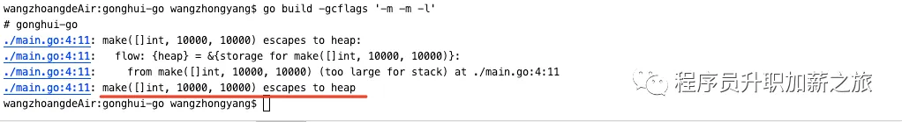
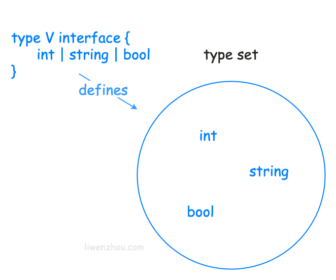

# 错误处理

Go 有一个预先定义的 error 接口类型

```go
type error interface {
    Error() string
}
```

# Error接口和错误处理

Go 语言中的错误处理与其他语言不太一样，它把错误当成一种值来处理，更强调判断错误、处理错误，不支持其他语言中使用try/catch捕获异常的方式。
Go 语言中使用一个名为 error 接口来表示错误类型：

```go
type error interface {  Error() string }
```

Error接口只包含一个方法——Error，这个函数需要返回一个描述错误信息的字符串

errors.New创建一个错误:
	我们可以根据需求自定义 error，最简单的方式是使用errors 包提供的New函数创建一个错误

```go
fmt.Errorf("查询数据库失败，err:%w", err) //当我们需要传入格式化的错误描述信息时
```

二次包装的错误，errors包中提供了以下三个方法：

```go
func Unwrap(err error) error                 // 获得err包含下一层错误
func Is(err, target error) bool              // 判断err是否包含target
func As(err error, target interface{}) bool  // 判断err是否为target类型
```


# Go内存分配和逃逸分析

逃逸分析是Go语言中的一项重要优化技术，可以帮助程序减少内存分配和垃圾回收的开销，从而提高程序的性能。下面是一道涉及逃逸分析的面试题及其详解。

## 问题描述：

有如下Go代码：

```
func foo() *int {
    x := 1
    return &x
}

func main() {
    p := foo()
    fmt.Println(*p)
}
```

请问上面的代码中，变量x是否会发生逃逸？

## 答案解析：

在上面的代码中，变量x只在函数foo()中被定义和初始化，然后其地址被返回给了主函数main()。因为返回值是指针类型，需要在堆上分配内存，所以变量x会发生逃逸。

**所谓逃逸，就是指变量的生命周期不仅限于函数栈帧，而是超出了函数的范围，需要在堆上分配内存。**

如果变量x没有发生逃逸，那么它会被分配在函数栈帧中，随着函数的返回而被自动销毁。而如果发生了逃逸，变量x就需要在堆上分配内存，并由垃圾回收器负责回收。在实际的程序中，大量的逃逸会导致内存分配和垃圾回收的开销增加，从而影响程序的性能。

逃逸分析是Go语言的一项优化技术，可以在编译期间分析代码，确定变量的生命周期和分配位置，从而避免不必要的内存分配和垃圾回收。通过逃逸分析的优化，可以有效地提高程序的性能和可靠性。

更多逃逸分析的内容，可以阅读我之前分享的文章：[内存分配和逃逸分析详解](https://mp.weixin.qq.com/s?__biz=MzIyNjM0MzQyNg==&mid=2247485774&idx=1&sn=ec7ab97654d105d9cc9661d137ba9b15&scene=21#wechat_redirect)

[1. 逃逸分析 | Golang |《Go面试宝典》| Go 技术论坛 (learnku.com)](https://learnku.com/docs/go-interviews/1-tao-yi-fen-xi/16568)


要搞清楚GO的逃逸分析一定要先搞清楚内存分配和堆栈：

内存既可以分配到堆中，也可以分配到栈中。

> GO语言是如何进行内存分配的呢？其设计初衷和实现原理是什么呢？

要搞清楚上面的问题，我们先来聊一下内存管理和堆、栈的知识点：

## 内存管理

内存管理主要包括两个动作：分配与释放。逃逸分析就是服务于内存分配的，而内存的释放由GC负责。

## 栈

在Go语言中，**栈的内存是由编译器自动进行分配和释放的**，栈区往往存储着函数参数、局部变量和调用函数帧，**它们随着函数的创建而分配，随着函数的退出而销毁**。

Go应用程序运行时，每个 goroutine 都维护着一个自己的栈区，这个栈区只能自己使用不能被其他 goroutine 使用。栈是调用栈（call stack）的简称。**一个栈通常又包含了许多栈帧（stack frame），它描述的是函数之间的调用关系**

## 堆

**与栈不同的是，堆区的内存一般由编译器和工程师自己共同进行管理分配，交给 Runtime GC 来释放。在堆上分配时，必须找到一块足够大的内存来存放新的变量数据。后续释放时，垃圾回收器扫描堆空间寻找不再被使用的对象。**

我们可以简单理解为：**我们用GO语言开发过程中，要考虑的内存管理只是针对堆内存而言的。**

程序在运行期间可以主动从堆上申请内存，这些内存通过Go的内存分配器分配，并由垃圾收集器回收。

为了方便大家理解，我们再从以下角度对比一下堆栈：

## 堆和栈的对比

### 加锁

- **栈不需要加锁**：每个goroutine都独享自己的栈空间，这就意味着栈上的内存操作是不需要加锁的。
- **堆有时需要加锁**：堆上的内存，有时需要加锁防止多线程冲突

> 延伸知识点：为什么堆上的内存有时需要加锁？而不是一直需要加锁呢？

因为Go的内存分配策略学习了TCMalloc的线程缓存思想，他为每个处理器分配了一个mcache，注意：从mcache分配内存也是无锁的。

关注我，后面带大家详解这部分知识点。

### 性能

- **栈内存管理 性能好**：栈上的内存，它的分配与释放非常高效的。简单地说，它只需要两个CPU指令：一个是分配入栈，另外一个是栈内释放。只需要借助于栈相关寄存器即可完成。
- **堆内存管理 性能差**：对于程序堆上的内存回收，还需要有标记清除阶段，例如Go采用的三色标记法。

### 缓存策略

- **栈缓存性能更好**
- **堆缓存性能较差**

原因是：栈内存能更好地利用CPU的缓存策略，因为栈空间相较于堆来说是更连续的。

下面就介绍今天的重头戏了：

# 逃逸分析

上面说了这么多堆和栈的知识点，目的是为了让大家更好的理解**逃逸分析**。

正如上面讲的，**相比于把内存分配到堆中，分配到栈中优势更明显。**

Go语言也是这么做的：**Go编译器会尽可能将变量分配到到栈上。**

**但是，在函数返回后无法证明变量未被引用，则该变量将被分配到堆上，该变量不随函数栈的回收而回收。以此避免悬挂指针（dangling pointer）的问题。**

另外，如果局部变量占用内存非常大，也会将其分配在堆上。

> Go是如何确定内存是分配到栈上还是堆上的呢？

答案就是：**逃逸分析。**

**编译器通过逃逸分析技术去选择堆或者栈，逃逸分析的基本思想如下：检查变量的生命周期是否是完全可知的，如果通过检查，则在栈上分配。否则，就是所谓的逃逸，必须在堆上进行分配。**

## 逃逸分析原则

Go语言虽然没有明确说明逃逸分析原则，但是有以下几点准则，是可以参考的。

- 不同于JAVA JVM的运行时逃逸分析，Go的逃逸分析是在编译期完成的：编译期无法确定的参数类型**必定**放到堆中；
- 如果变量在函数外部存在引用，则**必定**放在堆中；
- 如果变量占用内存较大时，则**优先**放到堆中；
- 如果变量在函数外部没有引用，则**优先**放到栈中；

## 逃逸分析举例

我们使用这个命令来查看逃逸分析的结果：`go build -gcflags '-m -m -l'`

### 1.参数是interface类型

```go
package main

import "fmt"

func main() {
a := 666
fmt.Println(a)
}
```

#### 运行结果


#### 原因分析

因为Println(a ...interface{})的参数是`interface{}`类型，编译期无法确定其具体的参数类型，所以内存分配到堆中。


### 2. 变量在函数外部有引用

```
package main

func test() *int {
a := 10
return &a
}

func main() {
_ = test()
}
```

#### 运行结果


#### 原因分析

变量a在函数外部存在引用。

我们来分析一下执行过程：**当函数执行完毕，对应的栈帧就被销毁，但是引用已经被返回到函数之外。如果这时外部通过引用地址取值，虽然地址还在，但是这块内存已经被释放回收了，这就是非法内存。**

为了避免上述非法内存的情况，在这种情况下变量的内存分配必须分配到堆上。

### 3. 变量内存占用较大

```
package main

func test() {
a := make([]int, 10000, 10000)
for i := 0; i < 10000; i++ {
a[i] = i
}
}

func main() {
test()
}
```

#### 运行结果



#### 原因分析

我们定义了一个容量为10000的int类型切片，发生了逃逸，内存分配到了堆上（heap）。

**注意看：**

我们再简单修改一下代码，将切片的容量和长度修改为1，再次查看逃逸分析的结果，我们发现，没有发生逃逸，内存默认分类到了栈上。


所以，当变量占用内存较大时，会发生逃逸分析，将内存分配到堆上。

### 4. 变量大小不确定时

我们再简单修改一下上面的代码：

```
package main

func test() {
l := 1
a := make([]int, l, l)
for i := 0; i < l; i++ {
a[i] = i
}
}

func main() {
test()
}
```

#### 运行结果


#### 原因分析

我们通过控制台的输出结果可以很明显的看出：发生了逃逸，分配到了heap堆中。

原因是这样的：

**我们虽然在代码段中给变量 l 赋值了1，但是编译期间只能识别到初始化int类型切片时，传入的长度和容量是变量l，编译期并不能确定变量l的值，所以发生了逃逸，会把内存分配到堆中。**

## 思考题

好了，我们举了4个逃逸分析的经典案例，相信聪明的你已经理解了逃逸分析的作用和发生逃逸的场景。

我们来想一下，在理解逃逸分析的原理之后，在开发的过程中如何更好的编码，进而提高程序的效率，更好的利用内存呢？

## 如何实践？

理解逃逸分析一定能帮助我们写出更好的程序。知道变量分配在栈堆之上的差别后，我们就要尽量写出分配在栈上的代码。因为堆上的变量变少后，可以减轻内存分配的开销，减小GC的压力，提高程序的运行速度。

但是我们也要有**过犹不及**的指导思想。

我认为没有一成不变的开发模式，我们一定是在不断的需求变化，业务变化中求得平衡的：

### 举个栗子

举个日常开发中函数传参例子：

**有些场景下我们不应该传递结构体指针，而应该直接传递结构体。**

为什么会这样呢？虽然直接传递结构体需要值拷贝，但是这是在栈上完成的操作，开销远比变量逃逸后动态地在堆上分配内存少的多。

当然这种做法不是绝对的，要根据场景去分析：

- **如果结构体较大，传递结构体指针更合适，因为指针类型相比值类型能节省大量的内存空间**
- **如果结构体较小，传递结构体更适合，因为在栈上分配内存，可以有效减少GC压力**

## 总结

通过本文的介绍，相信你一定加深了堆栈的理解；搞清楚逃逸分析的作用和原理之后能够指导我们写出更优雅的代码。

我们在日常开发中，要根据实际场景考虑，如何将内存尽量分配到栈中，减少GC的压力，提高性能。

如何找到应用开发效率、程序运行效率、对机器的压力及负载的平衡点，是程序员进阶之旅中的必修课。

# 泛型

## 什么是泛型

泛型即开发过程中编写适用于所有类型的模板，只有在具体使用的时候才能确定其真正的类型

泛型是一种独立于所使用的特定类型的编写代码的方法。使用泛型可以编写出适用于一组类型中的任何一种的函数和类型。

#泛型限制 

1. 匿名结构体与匿名函数不支持泛型
2. 不支持类型断言
3. 不支持泛型方法，只能通过receiver来实现方法的泛型处理
4. 之后的类型必须为基本类型，不能为接口类型

## 为什么需要泛型

**泛型的作用与应用场景**
1.增加代码的复用，从同类型的复用到不同类型的代码复用
2.应用于不同类型间代码复用的场景，即不同类型需要写相同的处理逻辑时，最适合用泛型

**泛型的利弊**
1.提高了代码复用率，提高了编程效率
2.不同类型间代码复用，使得代码风格更加优雅
3.增加了编译器的负担，降低了编译效率

假设我们需要实现一个反转切片的函数——`reverse`。

```go
func reverse(s []int) []int {
    l := len(s)
    r := make([]int, l)

    for i, e := range s {
        r[l-i-1] = e
    }
    return r
}

fmt.Println(reverse([]int{1, 2, 3, 4}))  // [4 3 2 1]
```

可是这个函数只能接收`[]int`类型的参数，如果我们想支持`[]float64`类型的参数，我们就需要再定义一个`reverseFloat64Slice`函数。

```go
func reverseFloat64Slice(s []float64) []float64 {
    l := len(s)
    r := make([]float64, l)

    for i, e := range s {
        r[l-i-1] = e
    }
    return r
}
```

如果要想支持`[]string`类型切片就要定义`reverseStringSlice`函数，如果想支持`[]xxx`就需要定义一个`reverseXxxSlice`…

一遍一遍地编写相同的功能是低效的，实际上这个反转切片的函数并不需要知道切片中元素的类型，但为了适用不同的类型我们把一段代码重复了很多遍。

Go1.18之前我们可以尝试使用反射去解决上述问题，但是使用反射在运行期间获取变量类型会降低代码的执行效率并且失去编译期的类型检查，同时大量的反射代码也会让程序变得晦涩难懂。

类似这样的场景就非常适合使用泛型。从Go1.18开始，使用泛型就能够编写出适用所有元素类型的“普适版”`reverse`函数。

```go
func reverseWithGenerics[T any](s []T) []T {
	l := len(s)
	r := make([]T, l)

	for i, e := range s {
		r[l-i-1] = e
	}
	return r
}
```

## 泛型语法

泛型为Go语言添加了三个新的重要特性:

1. 函数和类型的类型参数。
2. 将接口类型定义为类型集，包括没有方法的类型。
3. 类型推断，它允许在调用函数时在许多情况下省略类型参数。


### 类型参数

#### 类型形参和类型实参

我们之前已经知道函数定义时可以指定形参，函数调用时需要传入实参。


现在，Go语言中的函数和类型支持添加类型参数。类型参数列表看起来像普通的参数列表，只不过它使用方括号（`[]`）而不是圆括号（`()`）。


借助泛型，我们可以声明一个适用于**一组类型**的`min`函数。

```go
func min[T int | float64](a, b T) T {
	if a <= b {
		return a
	}
	return b
}
```

#### 类型实例化

这次定义的`min`函数就同时支持`int`和`float64`两种类型，也就是说当调用`min`函数时，我们既可以传入`int`类型的参数。

```go
m1 := min[int](1, 2)  // 1
```

也可以传入`float64`类型的参数。

```go
m2 := min[float64](-0.1, -0.2)  // -0.2
```

向 `min` 函数提供类型参数(在本例中为`int`和`float64`)称为实例化（ *instantiation* ）。

类型实例化分两步进行：

1. 首先，编译器在整个泛型函数或类型中将所有类型形参（type parameters）替换为它们各自的类型实参（type arguments）。
2. 其次，编译器验证每个类型参数是否满足相应的约束。

在成功实例化之后，我们将得到一个非泛型函数，它可以像任何其他函数一样被调用。例如：

```go
fmin := min[float64] // 类型实例化，编译器生成T=float64的min函数
m2 = fmin(1.2, 2.3)  // 1.2
```

`min[float64]`得到的是类似我们之前定义的`minFloat64`函数——`fmin`，我们可以在函数调用中使用它。

#### 类型参数的使用

除了函数中支持使用类型参数列表外，类型也可以使用类型参数列表。

```go
type Slice[T int | string] []T

type Map[K int | string, V float32 | float64] map[K]V

type Tree[T interface{}] struct {
	left, right *Tree[T]
	value       T
}
```

在上述泛型类型中，`T`、`K`、`V`都属于类型形参，类型形参后面是类型约束，类型实参需要满足对应的类型约束。

泛型类型可以有方法，例如为上面的`Tree`实现一个查找元素的`Lookup`方法。

```go
func (t *Tree[T]) Lookup(x T) *Tree[T] { ... }
```

要使用泛型类型，必须进行实例化。`Tree[string]`是使用类型实参`string`实例化 `Tree` 的示例。

```go
var stringTree Tree[string]
```

#### 类型约束

普通函数中的每个参数都有一个类型; 该类型定义一系列值的集合。例如，我们上面定义的非泛型函数`minFloat64`那样，声明了参数的类型为`float64`，那么在函数调用时允许传入的实际参数就必须是可以用`float64`类型表示的浮点数值。

类似于参数列表中每个参数都有对应的参数类型，类型参数列表中每个类型参数都有一个**类型约束**。类型约束定义了一个类型集——只有在这个类型集中的类型才能用作类型实参。

Go语言中的类型约束是接口类型。

就以上面提到的`min`函数为例，我们来看一下类型约束常见的两种方式。

类型约束接口可以直接在类型参数列表中使用。

```go
func min[T interface{ int | float64 }](a, b T) T { // 类型约束字面量，通常外层interface{}可省略
	if a <= b {
		return a
	}
	return b
}
```

作为类型约束使用的接口类型可以事先定义并支持复用。

```go
type Value interface { // 事先定义好的类型约束类型
	int | float64
}
func min[T Value](a, b T) T {
	if a <= b {
		return a
	}
	return b
}
```

在使用类型约束时，如果省略了外层的`interface{}`会引起歧义，那么就不能省略。例如：

```go
type IntPtrSlice [T *int] []T  // T*int ?
type IntPtrSlice[T *int,] []T  // 只有一个类型约束时可以添加`,`
type IntPtrSlice[T interface{ *int }] []T // 使用interface{}包裹
```

### 类型集

**Go1.18开始接口类型的定义也发生了改变，由过去的接口类型定义方法集（method set）变成了接口类型定义类型集（type set）。**也就是说，接口类型现在可以用作值的类型，也可以用作类型约束。


把接口类型当做类型集相较于方法集有一个优势: 我们可以显式地向集合添加类型，从而以新的方式控制类型集。

Go语言扩展了接口类型的语法，让我们能够向接口中添加类型。例如

```go
type V interface {
	int | string | bool
}
```

上面的代码就定义了一个包含 `int`、 `string` 和 `bool` 类型的类型集。

在 Go 1.18中，接口既可以像以前一样包含方法和嵌入式接口，但也可以嵌入非接口类型、类型并集和基础类型的集合。

当用作类型约束时，由接口定义的类型集精确地指定允许作为相应类型参数的类型。

- `|`符号

  `T1 | T2`表示类型约束为T1和T2这两个类型的并集，例如下面的`Integer`类型表示由`Signed`和`Unsigned`组成。

  ```go
  type Integer interface {
      Signed | Unsigned
  }
  ```

- `~`符号

  `~T`表示所以底层类型是T的类型，例如`~string`表示所有底层类型是`string`的类型集合。

  ```go
  type MyString string  // MyString的底层类型是string
  ```

  **注意：**`~`符号后面只能是基本类型。

接口作为类型集是一种强大的新机制，是使类型约束能够生效的关键。目前，使用新语法表的接口只能用作类型约束。

#### any

空接口在类型参数列表中很常见，在Go 1.18引入了一个新的预声明标识符，作为空接口类型的别名。

```go
// src/builtin/builtin.go
type any = interface{}
```

由此，我们可以使用如下代码：

```go
func foo[S ~[]E, E any]() {
	// ...
}
```

#### constrains

https://pkg.go.dev/golang.org/x/exp/constraints 包提供了一些常用类型。

### 类型推断

最后一个新的主要语言特征是类型推断。从某些方面来说，这是语言中最复杂的变化，但它很重要，因为它能让人们在编写调用泛型函数的代码时更自然。

#### 函数参数类型推断

对于类型参数，需要传递类型参数，这可能导致代码冗长。回到我们通用的 `min`函数：

```go
func min[T int | float64](a, b T) T {
	if a <= b {
		return a
	}
	return b
}
```

类型形参`T`用于指定`a`和`b`的类型。我们可以使用显式类型实参调用它：

```go
var a, b, m float64
m = min[float64](a, b) // 显式指定类型实参
```

在许多情况下，编译器可以从普通参数推断 `T` 的类型实参。这使得代码更短，同时保持清晰。

```go
var a, b, m float64
m = min(a, b) // 无需指定类型实参
```

这种从实参的类型推断出函数的类型实参的推断称为函数实参类型推断。函数实参类型推断只适用于函数参数中使用的类型参数，而不适用于仅在函数结果中或仅在函数体中使用的类型参数。例如，它不适用于像 `MakeT [ T any ]() T` 这样的函数，因为它只使用 `T` 表示结果。

#### 约束类型推断

Go 语言支持另一种类型推断，即*约束类型推断*。接下来我们从下面这个缩放整数的例子开始：

```go
func Scale[E constraints.Integer](s []E, c E) []E { // Scale 返回切片中每个元素都乘c的副本切片
    r := make([]E, len(s))
    for i, v := range s {
        r[i] = v * c
    }
    return r
}
```

这是一个泛型函数适用于任何整数类型的切片。

现在假设我们有一个多维坐标的 `Point` 类型，其中每个 `Point` 只是一个给出点坐标的整数列表。这种类型通常会实现一些业务方法，这里假设它有一个`String`方法。

```go
type Point []int32

func (p Point) String() string {
    b, _ := json.Marshal(p)
    return string(b)
}
```

由于一个`Point`其实就是一个整数切片，我们可以使用前面编写的`Scale`函数：

```go
func ScaleAndPrint(p Point) {
    r := Scale(p, 2)
    fmt.Println(r.String()) // 编译失败
}
```

不幸的是，这代码会编译失败，输出`r.String undefined (type []int32 has no field or method String`的错误。

问题是`Scale`函数返回类型为`[]E`的值，其中`E`是参数切片的元素类型。当我们使用`Point`类型的值调用`Scale`（其基础类型为[]int32）时，我们返回的是`[]int32`类型的值，而不是`Point`类型。这源于泛型代码的编写方式，但这不是我们想要的。

为了解决这个问题，我们必须更改 `Scale` 函数，以便为切片类型使用类型参数。

```go
func Scale[S ~[]E, E constraints.Integer](s S, c E) S {
    r := make(S, len(s))
    for i, v := range s {
        r[i] = v * c
    }
    return r
}
```

我们引入了一个新的类型参数`S`，它是切片参数的类型。我们对它进行了约束，使得基础类型是`S`而不是`[]E`，函数返回的结果类型现在是`S`。由于`E`被约束为整数，因此效果与之前相同：第一个参数必须是某个整数类型的切片。对函数体的唯一更改是，现在我们在调用`make`时传递`S`，而不是`[]E`。

现在这个`Scale`函数，不仅支持传入普通整数切片参数，也支持传入`Point`类型参数。

这里需要思考的是，为什么不传递显式类型参数就可以写入 `Scale` 调用？也就是说，为什么我们可以写 `Scale(p, 2)`，没有类型参数，而不是必须写 `Scale[Point, int32](p, 2)` ？

新 `Scale` 函数有两个类型参数——`S` 和 `E`。在不传递任何类型参数的 `Scale(p, 2)` 调用中，如上所述，函数参数类型推断让编译器推断 `S` 的类型参数是 `Point`。但是这个函数也有一个类型参数 `E`，它是乘法因子 `c` 的类型。相应的函数参数是`2`，因为`2`是一个非类型化的常量，函数参数类型推断不能推断出 `E` 的正确类型(最好的情况是它可以推断出`2`的默认类型是 `int`，而这是错误的，因为Point 的基础类型是`[]int32`)。相反，编译器推断 `E` 的类型参数是切片的元素类型的过程称为**约束类型推断**。

约束类型推断从类型参数约束推导类型参数。当一个类型参数具有根据另一个类型参数定义的约束时使用。当其中一个类型参数的类型参数已知时，约束用于推断另一个类型参数的类型参数。

通常的情况是，当一个约束对某种类型使用 *~type* 形式时，该类型是使用其他类型参数编写的。我们在 `Scale` 的例子中看到了这一点。`S` 是 `~[]E`，后面跟着一个用另一个类型参数写的类型`[]E`。如果我们知道了 `S` 的类型实参，我们就可以推断出`E`的类型实参。`S` 是一个切片类型，而 `E`是该切片的元素类型。

## 总结

总之，如果你发现自己多次编写完全相同的代码，而这些代码之间的唯一区别就是使用的类型不同，这个时候你就应该考虑是否可以使用类型参数。

泛型和接口类型之间并不是替代关系，而是相辅相成的关系。泛型的引入是为了配合接口的使用，让我们能够编写更加类型安全的Go代码，并能有效地减少重复代码。

参考资料：

- https://go.dev/blog/intro-generics
- https://go.dev/doc/tutorial/generics


# 何时使用Go泛型【译】

Go 1.18版本增加了一个主要的新语言特性: 对泛型的支持。在本文中，我不会描述泛型是什么，也不会描述如何使用它们。本文讨论在 Go 代码中何时使用泛型，以及何时不使用它们。

事先声明，本文提供的是一般指导建议，而不是硬性规定。是否使用泛型需要你自己的判断。但如果你不确定，那么建议使用这里讨论的指南。

## 编写代码

让我们从编写 Go 程序的一般准则开始：通过编写代码而不是定义类型来编写 Go 程序。在泛型方面，如果通过定义类型参数约束开始编写程序，那么你就错了。应该从编写函数开始。如果明确知道类型参数有用的情况下，很容易在以后添加类型参数。

## 应该使用类型参数

让我们看一下类型参数对哪些情况有用。

### 使用语言定义的容器类型时

当我们编写的是操作 Go 语言定义的特殊容器类型（slice、map和chennel）的函数。如果函数具有包含这些类型的参数，并且函数的代码并不关心元素的类型，那么使用类型参数可能是有用的。

例如，这里有一个函数，它的功能是返回任何类型map中所有的key：

```go
// MapKeys 返回m中所有key组成的切片
func MapKeys[Key comparable, Val any](m map[Key]Val) []Key {
    s := make([]Key, 0, len(m))
    for k := range m {
        s = append(s, k)
    }
    return s
}
```

这段代码并不关注 map 中键的类型，也根本没有使用 map 值类型。它适用于任何map类型。这是使用类型参数的一个很好示例。

在引入类型参数之前，想要实现类似功能通常是使用反射，但是使用反射实现通常是复杂的，并且在编译期间不会进行静态类型检查，在运行时通常速度也更慢。

### 通用数据结构

类型参数另一个适用场景就是用于通用数据结构。通用数据结构类似于slice或map，但不是内置在语言中的，例如链表或二叉树。

之前需要这种数据结构的程序通常采用下面两种方法中的一个：使用特定的元素类型编写数据结构，或者使用接口类型。用类型参数替换特定的元素类型可以生成更通用的数据结构，该数据结构可以在程序的其他部分或其他程序中使用。用类型参数替换接口类型可以更有效地存储数据，节省内存资源；它还允许代码避免类型断言，并在构建时进行完全的类型检查。

例如，下面是使用类型参数的二叉树数据结构的一部分：

```go
// Tree is a binary tree.
type Tree[T any] struct {
    cmp  func(T, T) int
    root *node[T]
}

// A node in a Tree.
type node[T any] struct {
    left, right  *node[T]
    val          T
}

// find returns a pointer to the node containing val,
// or, if val is not present, a pointer to where it
// would be placed if added.
func (bt *Tree[T]) find(val T) **node[T] {
    pl := &bt.root
    for *pl != nil {
        switch cmp := bt.cmp(val, (*pl).val); {
        case cmp < 0:
            pl = &(*pl).left
        case cmp > 0:
            pl = &(*pl).right
        default:
            return pl
        }
    }
    return pl
}

// Insert inserts val into bt if not already there,
// and reports whether it was inserted.
func (bt *Tree[T]) Insert(val T) bool {
    pl := bt.find(val)
    if *pl != nil {
        return false
    }
    *pl = &node[T]{val: val}
    return true
}
```

树中的每个节点都包含类型参数 T 的值。使用特定类型参数实例化树时，该类型的值将直接存储在节点中。它们不会被存储为接口类型。

这是对类型参数的合理使用，因为 Tree 数据结构(包括方法中的代码)在很大程度上与元素类型 T 无关。

Tree数据结构需要知道如何比较元素类型T的值；它为此使用传入的比较函数。你可以在find方法的第四行，即对bt.cmp的调用中看到这一点。除此之外，type参数根本不重要。

### 对于类型参数，优先选择函数而不是方法

Tree 示例说明了另一个一般原则：当你需要比较函数之类的东西时，更喜欢使用函数而不是方法。

我们可以定义 Tree 类型，这样元素类型就必须有一个 Compare 或 Less 方法。这可以通过编写一个需要该方法的约束来实现，这意味着用于实例化 Tree 类型的任何类型参数都需要该方法。

这样做的结果是，任何想使用像 int 这样的简单数据类型的 Tree 的人都必须定义自己的整数类型，并编写自己的比较方法。如果我们像上面所示的代码那样定义 Tree 以获取比较函数，那么很容易传递所需的函数。编写比较函数和编写方法一样容易。

如果 Tree 元素类型碰巧已经有一个 Compare 方法，那么我们可以简单地使用一个类似 ElementType 的方法表达式。作为比较函数进行比较。

换句话说，将方法转换为函数要比将方法添加到类型中简单得多。因此，对于通用数据类型，更喜欢使用函数而不是编写需要方法的约束。

### 实现通用方法

类型参数可能有用的另一种情况是，不同类型需要实现某些公共方法，而不同类型的实现看起来都是相同的。

例如，考虑标准库的 `sort.Interface`，它要求类型实现三个方法: `Len`、 `Swap` 和 `Less`。

下面是一个泛型类型 `SliceFn` 的示例，它为切片类型实现 `sort.Interface`：

```go
// SliceFn 为T类型切片实现 sort.Interface 
type SliceFn[T any] struct {
    s    []T
    less func(T, T) bool
}

func (s SliceFn[T]) Len() int {
    return len(s.s)
}
func (s SliceFn[T]) Swap(i, j int) {
    s.s[i], s.s[j] = s.s[j], s.s[i]
}
func (s SliceFn[T]) Less(i, j int) bool {
    return s.less(s.s[i], s.s[j])
}
```

对于任意切片类型，`Len` 和 `Swap` 方法完全相同。`Less` 方法需要进行比较，这是名称 `SliceFn` 中的 `Fn` 的部分。与前面的 `Tree` 示例一样，我们将在创建 `SliceFn` 时传入一个函数。

下面是如何通过 `SliceFn`函数使用比较函数对任意切片进行排序：

```go
// SortFn 使用比较函数进行排序。
func SortFn[T any](s []T, less func(T, T) bool) {
    sort.Sort(SliceFn[T]{s, less})
}
```

这类似于标准库函数`sort.Slice`，但比较函数是使用值而不是切片索引编写的。

对这类代码使用类型参数是合适的，因为所有切片类型的方法看起来完全相同。

## 不应该使用类型参数

接下来谈谈何时不使用类型参数。

### 不要用类型参数替换接口类型

众所周知，Go有接口类型。接口类型允许一种通用编程。

例如，广泛使用的`io.Reader`接口提供了一种通用机制，用于从包含信息（例如文件）或产生信息（例如随机数生成器）的任何值读取数据。如果对某个类型的值只需要调用该值的方法，则使用接口类型，而不是类型参数。读卡器易于阅读、高效且有效。不需要使用类型参数通过调用read方法从值中读取数据。

例如，你可能会尝试将这里的第一个函数签名（仅使用接口类型）更改为第二个版本（使用类型参数）。

```go
func ReadSome(r io.Reader) ([]byte, error)

func ReadSome[T io.Reader](r T) ([]byte, error)
```

不要做出那种改变。省略type参数使函数更容易编写，更容易读取，并且执行时间可能相同。

最后一点值得强调。虽然可以用几种不同的方式实现泛型，而且随着时间的推移，实现也会发生变化和改进，但在许多情况下，Go 1.18中使用的实现将处理类型为类型参数的值，就像处理类型为接口类型的值一样。这意味着使用类型参数通常不会比使用接口类型快。因此，不要为了速度而从接口类型更改为类型参数，因为它可能不会运行得更快。

### 如果方法实现不同，不要使用类型参数

在决定是否使用类型参数或接口类型时，请考虑方法的实现。前面我们说过，如果一个方法的实现对于所有类型都是相同的，那么就使用一个类型参数。相反，如果每种类型的实现都不同，则使用接口类型并编写不同的方法实现，不要使用类型参数。

例如，从文件读取的实现与从随机数生成器读取的实现完全不同。这意味着我们应该编写两个不同的Read方法，并使用像io.Reader这样的接口类型。

### 在适当的地方使用反射

Go具有运行时反射。反射允许一种泛型编程，因为它允许你编写适用于任何类型的代码。

如果某些操作甚至必须支持没有方法的类型（不能使用接口类型），并且每个类型的操作都不同（不能使用类型参数），请使用反射。

encoding/json包就是一个例子。我们不想要求我们编码的每个类型都有MarshalJSON方法，所以我们不能使用接口类型。但对接口类型的编码与对结构类型的编码不同，因此我们不应该使用类型参数。相反，该包使用反射。代码不简单，但它有效。有关详细信息，请参阅[源代码](https://go.dev/src/encoding/json/encode.go)。

## 一个简单的准则

最后，关于何时使用泛型的讨论可以简化为一个简单的指导原则。

如果您发现自己多次编写完全相同的代码，其中副本之间的唯一区别是代码使用不同的类型，请考虑是否可以使用类型参数。

另一种说法是，在注意到要多次编写完全相同的代码之前，应该避免使用类型参数。

原文链接：https://go.dev/blog/when-generics
