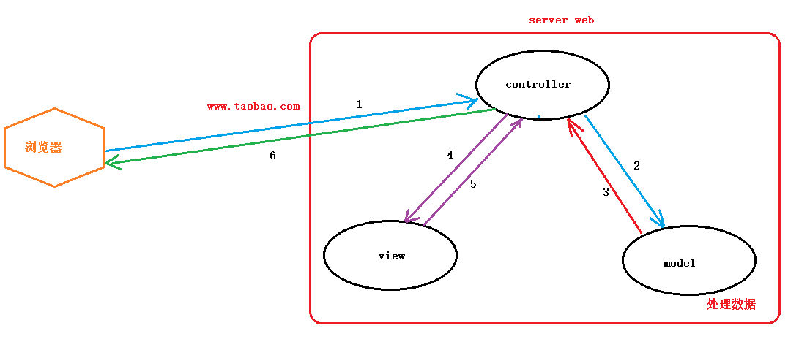

# 单例模式

单例模式（Singleton Pattern）是一种创建型设计模式，确保一个类只有一个实例，并提供一个全局访问点。它常用于需要控制资源的共享，例如数据库连接或配置管理。

### 在 Go 中实现单例模式

```go
// Singleton 是单例结构体
type Singleton struct {
    // 其他字段
}

// 声明一个私有的单例实例
var instance *Singleton
var once sync.Once

// GetInstance 返回单例实例
func GetInstance() *Singleton {
    once.Do(func() {
        instance = &Singleton{}
    })
    return instance
}
```

1. **私有变量**: `instance` 是一个私有变量，存储单例的实例。
2. **sync.Once**: `once` 确保 `instance` 只被初始化一次，避免并发问题。
3. **GetInstance**: 该函数返回单例实例，使用 `once.Do` 确保初始化逻辑只执行一次。


# 装饰模式

**装饰模式**：是一种结构性设计模式，它允许在不改变对象自身的情况下，动态地给对象添加额外的功能。通过使用装饰模式，可以将功能分解为多个小的类，每个类负责一个特定的功能，从而实现灵活的组合。

## 装饰模式的主要组成部分：

1. **组件接口**：定义一个接口，所有具体组件和装饰者都需要实现这个接口。
2. **具体组件**：实现组件接口的类，表示被装饰的对象。
3. **装饰者**：持有一个组件接口的引用，并实现相同的接口，允许在调用组件的方法时添加额外的行为。

## 装饰模式的优点：

- 增强了类的功能。
- 提高了代码的灵活性和可扩展性。
- 避免了类的膨胀。

下面是一个使用 Go 语言实现装饰模式的简单示例。这个示例展示了如何通过装饰器为一个 **基本的文本消息** 添加额外的功能。

```go
type Message interface { // Message 接口
	GetContent() string
}

type BasicMessage struct { // BasicMessage 结构体
	content string
}

func (m *BasicMessage) GetContent() string { // GetContent 方法
	return m.content
}

func NewBasicMessage(content string) *BasicMessage { // NewBasicMessage 构造函数
	return &BasicMessage{content: content}
}

type MessageDecorator struct { // MessageDecorator 装饰器结构体
	Message Message
}

func NewMessageDecorator(m Message) *MessageDecorator { // NewMessageDecorator 构造函数
	return &MessageDecorator{Message: m}
}

type EncryptedMessage struct { // EncryptedMessage 装饰器
	*MessageDecorator
}

func (e *EncryptedMessage) GetContent() string { // GetContent 方法
	return "Encrypted: " + e.Message.GetContent()
}

type UppercaseMessage struct { // UppercaseMessage 装饰器
	*MessageDecorator
}

func (u *UppercaseMessage) GetContent() string { // GetContent 方法
	return fmt.Sprintf("Uppercase: %s", u.Message.GetContent())
}

func main() {
	// 创建基本消息
	msg := NewBasicMessage("Hello, Decorator Pattern!")

	// 使用装饰器
	encryptedMsg := &EncryptedMessage{NewMessageDecorator(msg)}				// 1
	uppercaseMsg := &UppercaseMessage{NewMessageDecorator(encryptedMsg)}    // 2

	// 输出结果
	fmt.Println(uppercaseMsg.GetContent())
}
```

### 说明

1. **Message 接口**：定义了获取消息内容的方法。
2. **BasicMessage 结构体**：实现了 `Message` 接口，表示基本消息。
3. **MessageDecorator 结构体**：作为装饰器的基类，持有一个 `Message` 对象。
4. **EncryptedMessage 和 UppercaseMessage**：具体的装饰器，分别实现了加密和大写功能。
5. **main 函数**：创建基本消息并通过装饰器添加功能，最后输出结果。

这个示例展示了如何使用装饰模式来动态地为对象添加新功能。


# 策略模式

策略模式：是一种行为设计模式，它定义了一系列算法，将每个算法封装起来，并使它们可以互换。策略模式使得算法的变化独立于使用算法的客户。

## 策略模式的主要组成部分：

1. **策略接口**：定义一系列算法的接口。
2. **具体策略**：实现策略接口的具体算法。
3. **上下文**：持有一个策略的引用，并可以在运行时选择不同的策略。

## 策略模式的优点：

- 提高了代码的灵活性和可扩展性。
- 避免了使用多重条件语句（如 if-else 或 switch-case）。
- 可以在运行时选择不同的算法。

示例代码（Golang）：以下是一个简单的策略模式的用例，展示了如何实现不同的支付策略。

```go
// Strategy interface
type PaymentStrategy interface {
	Pay(amount float64)
}

// 1、Concrete strategy: Credit Card
type CreditCard struct {
	CardNumber string
}

func (c *CreditCard) Pay(amount float64) {
	fmt.Printf("Paid %.2f using Credit Card: %s\n", amount, c.CardNumber)
}

// 2、Concrete strategy: PayPal
type PayPal struct {
	Email string
}

func (p *PayPal) Pay(amount float64) {
	fmt.Printf("Paid %.2f using PayPal: %s\n", amount, p.Email)
}

// Context
type ShoppingCart struct {
	PaymentMethod PaymentStrategy
}

func (cart *ShoppingCart) SetPaymentMethod(method PaymentStrategy) {
	cart.PaymentMethod = method
}

func (cart *ShoppingCart) Checkout(amount float64) {
	cart.PaymentMethod.Pay(amount)
}

func main() {
	cart := &ShoppingCart{}

	// Using Credit Card
	cart.SetPaymentMethod(&CreditCard{CardNumber: "1234-5678-9012-3456"})
	cart.Checkout(100.0)

	// Using PayPal
	cart.SetPaymentMethod(&PayPal{Email: "user@example.com"})
	cart.Checkout(200.0)
}
```

### 运行结果：
```
Paid 100.00 using Credit Card: 1234-5678-9012-3456
Paid 200.00 using PayPal: user@example.com
```

在这个示例中，`PaymentStrategy` 是策略接口，`CreditCard` 和 `PayPal` 是具体策略。`ShoppingCart` 是上下文，它可以在运行时选择不同的支付策略。


# 简单工厂模式

工厂模式是一种创建性设计模式，它提供了一种创建对象的接口，但不暴露对象创建的具体逻辑。工厂模式可以帮助将对象的创建与使用分离，从而提高代码的灵活性和可维护性。

## 工厂模式的主要组成部分：

1. **产品接口**：定义产品的接口。
2. **具体产品**：实现产品接口的具体类。
3. **工厂接口**：定义创建产品的接口。
4. **具体工厂**：实现工厂接口，负责创建具体产品的实例。

## 工厂模式的优点：

- 封装了对象的创建过程。
- 提高了代码的灵活性和可扩展性。
- 可以在不修改客户端代码的情况下引入新产品。

示例代码（Golang）：以下是一个简单的工厂模式的用例，展示了如何创建不同类型的动物。

```go
// Product interface
type Animal interface {
	Speak() string
}

// Concrete products
type Dog struct{}

func (d *Dog) Speak() string {
	return "Woof!"
}

type Cat struct{}

func (c *Cat) Speak() string {
	return "Meow!"
}

// Factory interface
type AnimalFactory interface {
	CreateAnimal() Animal
}

// Concrete factories
type DogFactory struct{}

func (f *DogFactory) CreateAnimal() Animal {
	return &Dog{}
}

type CatFactory struct{}

func (f *CatFactory) CreateAnimal() Animal {
	return &Cat{}
}

// Client code
func main() {
	var factory AnimalFactory

	// Create a Dog
	factory = &DogFactory{}
	dog := factory.CreateAnimal()
	fmt.Println("Dog says:", dog.Speak())

	// Create a Cat
	factory = &CatFactory{}
	cat := factory.CreateAnimal()
	fmt.Println("Cat says:", cat.Speak())
}
```

### 运行结果：
```
Dog says: Woof!
Cat says: Meow!
```

在这个示例中，`Animal` 是产品接口，`Dog` 和 `Cat` 是具体产品。`AnimalFactory` 是工厂接口，`DogFactory` 和 `CatFactory` 是具体工厂。客户端代码通过工厂接口创建不同类型的动物，而不需要了解具体的创建逻辑。


# MVC模式

- 是一种常见的 “代码组织架构”， 可以在开发中，对数据进行处理并解耦。
  - model：模型。 处理数据库相关的文件。
  - veiw：视图。处理显示相关的文件。 网站：html
  - controller：控制器。处理具体业务！  联动 m 和 v
- MVC 与语言无关！是常见的 代码组织架构。



# 其他开发设计模式

**页面驱动设计**：每位客户端开发的同学要开展工作都离不开UI设计师的设计稿。我称这种编程思维是：**“页面驱动设计”**

**数据驱动设计**：只要产品同学确定好PRD产品说明文档，我就可以开发了，开发的顺序往往是这样的：

1. 通读一遍需求文档和原型图
2. 梳理业务逻辑，进行抽象，明确有多少个功能需求要开发
3. 根据功能需求创建数据库，创建表，添加字段，设置合适的字段类型，长度，主外键等
4. 考虑业务场景，创建索引...
5. 开始疯狂的CRUD...
6. 开始疯狂的加Cache...
7. 开发疯狂的给客户端提供数据接口...
8. 持续迭代：根据业务增长做负载均衡、分库分表、读写分离....

**你认为上面哪个步骤最重要呢?**

我认为**设计数据库表结构**是最重要的环节：对业务的理解程度，对可扩展性的考虑程度都直接影响到了我们会“如何设计数据库表结构”；**数据库表结构设计**是否合理，也直接影响了我们后续开发业务逻辑是否顺利。

我称这种编程思维是：**“数据驱动设计”**。

（PS：*网络上关于“数据驱动设计”这一名词更主流的解释：通过不断的数据积累和反馈，来指导产品的更新迭代。*）


# DDD领域开发模式

除了安卓客户端开发提到的”**页面驱动设计**“和服务端开发的”**数据驱动设计**“的场景，这样能更好的理解DDD。

## 什么是DDD?

> DDD (Domain Driven Design)：领域驱动设计。

我不想复制粘贴官方对于DDD晦涩难懂的定义，下面我将用最简单易懂的话告诉你DDD是什么？你值得知道的几个概念，对一线开发人员来说，知道这些，足矣。

## 1. 核心思想

1. DDD的核心思想就是避免业务逻辑的复杂性和技术实现的复杂性耦合在一起。
2. 明确业务复杂性和技术复杂性的边界，隔离双方的复杂性，站在更高的角度实现解耦。

## 2. 最大价值

DDD最大的价值就是梳理业务需求，抽象出一个个“领域”，并形成各个领域之间的接口交互，方便团队协作，推进项目前进。

## 3. 必懂概念

### 领域

领域就是一种**边界**的划分，首先举一些生活中的例子：

比如互联网、机械制造、种植业、养殖业等等这就是不同的领域；

再比如互联网中的：移动互联网、互联网金融、互联网健康这也是不同的领域；

我们把领域抽象一下，领域还可以这样划分：

1. 核心领域：业务系统中的核心价值
2. 通用领域：提供通用服务的领域，比如消息系统
3. 支撑领域：作为基础设施，专注于业务系统中的某个重要业务，比如日志系统

在明确领域的概念之后，还有个更重要的概念：

### 领域模型

DDD的核心就是通过一套科学的方法论告诉大家如何创建不同的领域，如何确定领域的边界。

“模型”是DDD中的重要概念：模型是对领域的抽象和模拟。

“建模”是DDD中重要的手段：建模是针对特定问题建立领域的合理模型。

### “不以用户为中心”

**DDD领域驱动设计，还有一个有意思的观点：“不以用户为中心”。**

为什么会这么说呢？

因为DDD认为，“以用户为中心”其实是表层需求，真正的需求应该是基于领域的，领域之所以有意义，一定是和人有关的。

所以做领域驱动设计时，应该做到“客观设计”，就是无论是谁使用，如何使用，这个领域都是这样的，挖掘深层次的需求。

讲个小故事：

> 在汽车出现之前，那时候人们的需求就是想要一辆更快的马车，如果当时被限制在“用户需求”的框框里，怎么能发明出来汽车呢？

仔细品品这个小故事，是不是很有意思。

### 阶段性小结

对于小白来说，关于DDD了解到这里就足够了。

毕竟设计思想这种东西需要长时间的积累，需要不断的通过项目实战才能领悟。

目前也有不少人喷“DDD”，认为这是给CTO、项目经理、老板吹水用的。

对于一线开发人员来讲，与其关注DDD，不如关注如何用好“微服务架构”。

以我的经验，当我看了很多DDD的资料之后还是云里雾里，但是当我使用微服务架构去开发了一个项目，回过头来再思考DDD，就清晰多了。

**下面开始介绍微服务是如何让DDD落地的？**

## 微服务

微服务的特点如下，大家先有个整体的概念，后面我会使用go-micro和go-zero框架带大家进行微服务项目的实践。

### 1. 单一职责

DDD思想指导我们对业务逻辑进行拆分，明确各自边界，形成不同的领域，不同的领域对应不同的微服务，这就是单一职责。

### 2. 团队独立

不同的领域对应不同的业务团队，也对应着不同的技术团队，彼此之间是解耦的。

### 3. 技术独立

不同的领域，不同的团队可以使用不同的开发语言，各自独立，只要按规范提供服务即可。

### 4. 数据库分离

每个领域（每个服务）都拥有自己的数据源。

### 5. 独立部署

每个领域（每个服务）都是独立的组件，可复用，可替换，降低耦合，易维护，易集群Docker部署服务

