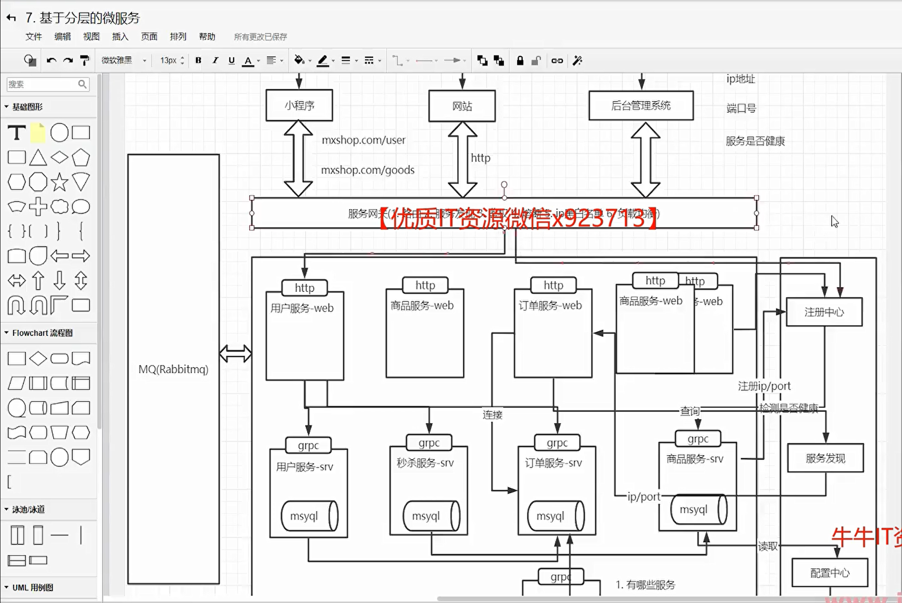
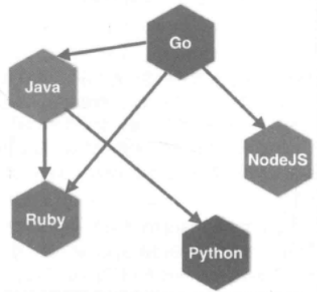
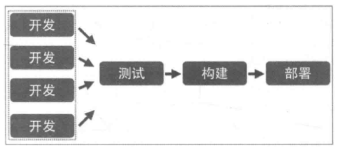
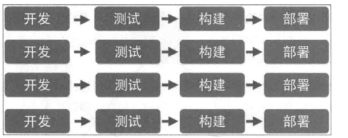
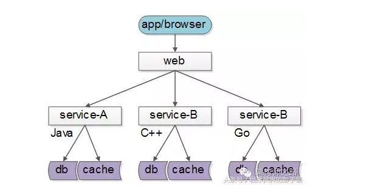
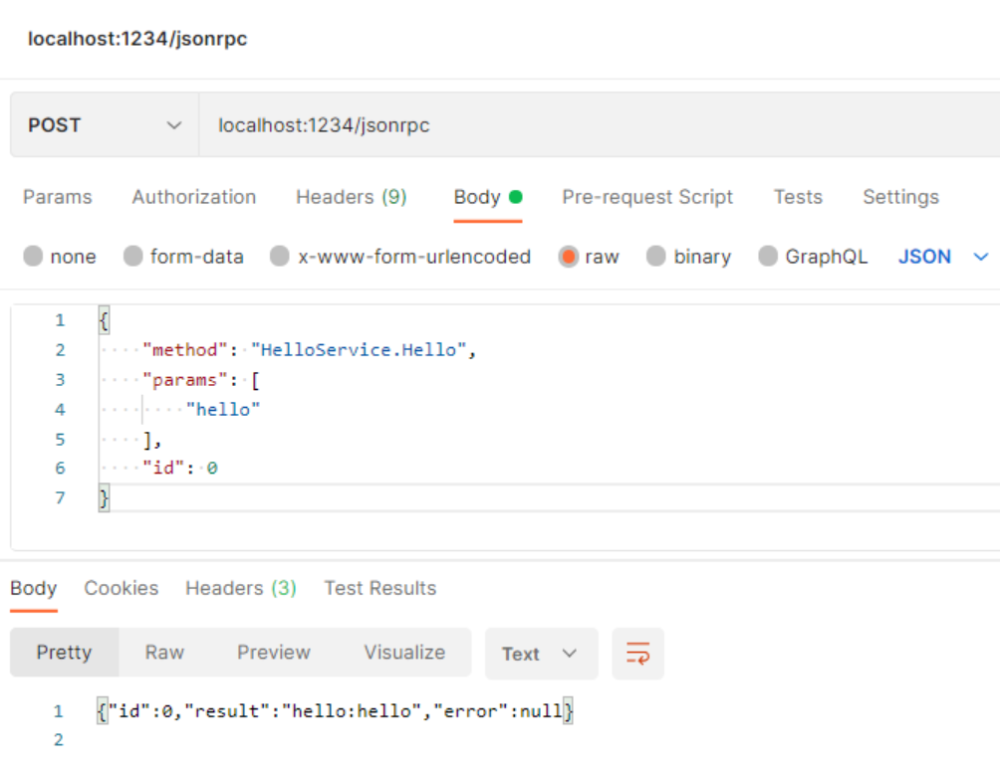

# 1、微服务（micro services）

## 1.1 什么是微服务？

> 服务拆分原则：高内聚低耦合

​       在介绍微服务时，首先得先理解什么是微服务，顾名思义，微服务得从两个方面去理解，什么是"微"、什么是"服务"？

​       微（micro）狭义来讲就是体积小，著名的"2 pizza 团队"很好的诠释了这一解释（2 pizza 团队最早是亚马逊 CEO Bezos提出来的，意思是说单个服务的设计，所有参与人从设计、开发、测试、运维所有人加起来 只需要2个披萨就够了 ）。 

​       服务（service）一定要区别于系统，服务一个或者一组相对较小且独立的功能单元，是用户可以感知最小功能集。

 那么广义上来讲，微服务是一种分布式系统解决方案，推动细粒度服务的使用，这些服务协同工作。



- 服务网关：确保服务提供者对客户端的透明，这一层可以进行反向路由、安全认证、灰度发布、日志监控等前置动作
- 服务发现：注册并维护远程服务及服务提供者的地址，供服务消费者发现和调用，为保证可用性，比如etcd，nacos，consul等
- 服务框架：用于实现微服务的 RPC 框架，包含服务接口描述及实现方案、向注册中心发布服务等功能，比如grpc，Thrift等
- 服务监控：对服务消费者与提供者之间的调用情况进行监控和数据展示，比如prometheus等
- 服务追踪：记录对每个请求的微服务调用完整链路，以便进行问题定位和故障分析，比如jeager，zipkin等
- 服务治理：服务治理就是通过一系列的手段来保证在各种意外情况下，服务调用仍然能够正常进行，这些手段包括熔断、隔离、限流、降级、负载均衡等。比如Sentinel，Istio等
- 基础设施：用以提供服务底层的基础数据服务，比如分布式消息队列、日志存储、数据库、缓存、文件服务器、搜索集群等。比如Kafka，Mysql，PostgreSQL，MongoDB，Redis，Minio，ElasticSearch等
- 分布式配置中心：统一配置，比如nacos，consul，apollo等
- 分布式事务：seata，dtm等
- 容器以及容器编排：docker，k8s等
- 定时任务


## 1.2 微服务这个概念的由来

​       **“简而言之，微服务架构风格是将单个应用程序作为一组小型服务开发的方法，每个服务程序都在自己的进程中运行，并与轻量级机制（通常是HTTP资源API）进行通信。这些服务是围绕业务功能构建的。可以通过全自动部署机器独立部署。这些服务器可以用不同的编程语言编写，使用不同的数据存储技术，并尽量不用集中式方式进行管理”**

​    在这里我们可能会混淆一个点，那就是微服务和微服务架构，这是两个不同的概念，而我们平时说到的微服务已经包含了这两个概念了，我们需要把它们说清楚以免学习中纠结。微服务架构是一种设计方法，而微服务这是指使用这种方法而设计的一个应用。所以我们必要对微服务的概念做出一个比较明确的定义。

​       **微服务架构**是将复杂的系统使用组件化的方式进行拆分，并使用轻量级通讯方式进行整合的一种设计方法。

​       **微服务**是通过这种架构设计方法拆分出来的一个独立的组件化的小应用。

​       微服务架构定义的精髓，可以用一句话来描述，那就是“**分而治之，合而用之**”。将复杂的系统进行拆分的方法，就是“分而治之”。分而治之，可以让复杂的事情变的简单，这很符合我们平时处理问题的方法。 使用轻量级通讯等方式进行整合的设计，就是“合而用之”的方法，合而用之可以让微小的力量变动强大。


## 1.3 微服务和单体式架构区别

和微服务架构相反的就是单体式架构，我们来看看单体式架构设计的缺点，就更能体会微服务的好处了。单体架构在规模比较小的情况下工作情况良好，但是随着系统规模的扩大，它暴露出来的问题也越来越多，主要有以下几点：

**复杂性逐渐变高**

> 中软国际   boss计费系统   十几年了     移动联通缴费平台   几个亿
>
> 自己封装函数    代码冗余度特别大

比如有几十万行代码的大项目，代码越多复杂性越高，越难解决遇到的问题。

**技术债务逐渐上升**

> 离职证明  留下了64个bug未解决就离职了

公司的人员流动是再正常不过的事情，有的员工在离职之前，疏于代码质量的自我管束，导致留下来很多坑，由于单体项目代码量庞大的惊人，留下的坑很难被发觉，这就给新来的员工带来很大的烦恼，人员流动越大所留下的坑越多，也就是所谓的技术债务越来越多。

**耦合度太高，维护成本大**

当应用程序的功能越来越多、团队越来越大时，沟通成本、管理成本显著增加。当出现 bug 时，可能引起 bug 的原因组合越来越多，导致分析、定位和修复的成本增加；并且在对全局功能缺乏深度理解的情况下，容易在修复 bug 时引入新的 bug。

**持续交付周期长**

 构建和部署时间会随着功能的增多而增加，任何细微的修改都会触发部署流水线。新人培养周期长：新成员了解背景、熟悉业务和配置环境的时间越来越长。

**技术选型成本高**

单块架构倾向于采用统一的技术平台或方案来解决所有问题，如果后续想引入新的技术或框架，成本和风险都很大。

**可扩展性差**

随着功能的增加，垂直扩展的成本将会越来越大；而对于水平扩展而言，因为所有代码都运行在同一个进程，没办法做到针对应用程序的部分功能做独立的扩展。


了解了单体式结构的缺点之后，我们来看看**微服务架构的解决方案：**

1. **单一职责**

   微服务架构中的每个服务，都是具有业务逻辑的，符合高内聚、低耦合原则以及单一职责原则的单元，不同的服务通过“管道”的方式灵活组合，从而构建出庞大的系统。

2. **轻量级通信**

   服务之间通过轻量级的通信机制实现互通互联，而所谓的轻量级，通常指语言无关、平台无关的交互方式。

   

   对于轻量级通信的格式而言，我们熟悉的 XML 和 JSON，它们是语言无关、平台无关的；对于通信的协议而言，通常基于 HTTP，能让服务间的通信变得标准化、无状态化。使用轻量级通信机制，可以让团队选择更适合的语言、工具或者平台来开发服务本身。

3. **独立性**

   每个服务在应用交付过程中，独立地开发、测试和部署。

   在单体式架构中所有功能都在同一个代码库，功能的开发不具有独立性；当不同小组完成多个功能后，需要经过集成和回归测试，测试过程也不具有独立性；当测试完成后，应用被构建成一个包，如果某个功能存在 bug，将导致整个部署失败或者回滚。

   

    在微服务架构中，每个服务都是独立的业务单元，与其他服务高度解耦，只需要改变当前服务本身，就可以完成独立的开发、测试和部署。

   

   

4. **进程隔离**

   单块架构中，整个系统运行在同一个进程中，当应用进行部署时，必须停掉当前正在运行的应用，部署完成后再重启进程，无法做到独立部署。

   在微服务架构中，应用程序由多个服务组成，每个服务都是高度自治的独立业务实体，可以运行在独立的进程中，不同的服务能非常容易地部署到不同的主机上。


**单体式和微服务对比**

| 新功能开发 | 需要时间               | 容易开发和实现                                   |
| ---------- | ---------------------- | ------------------------------------------------ |
|            | 传统单体架构           | 分布式微服务化架构                               |
| 部署       | 不经常而且容易部署     | 经常发布，部署复杂                               |
| 隔离性     | 故障影响范围大         | 故障影响范围小                                   |
| 架构设计   | 初期技术选型难度大     | 设计逻辑难度大                                   |
| 系统性能   | 相对时间快，吞吐量小   | 相对时间慢，吞吐量大                             |
| 系统运维   | 运维难度简单           | 运维难度复杂                                     |
| 新人上手   | 学习曲线大（应用逻辑） | 学习曲线大（架构逻辑）                           |
| 技术       | 技术单一而且封闭       | 技术多样而且容易开发                             |
| 测试和差错 | 简单                   | 复杂（每个服务都要进行单独测试，还需要集群测试） |
| 系统扩展性 | 扩展性差               | 扩展性好                                         |
| 系统管理   | 重点在于开发成本       | 重点在于服务治理和调度                           |


# 2、单体式和微服务

微服务适用于许多应用场景，以下是其中的一些：

1. Web应用程序：Golang可以为Web应用程序提供高效的、并发的、快速的API服务。在这种情况下，Golang的并发模型和轻量级的协程可以帮助处理高并发请求，并确保应用程序的性能不会受到影响。
2. 大数据处理：Golang可以处理大规模数据的处理和分析，例如实时数据处理和流式处理等。Golang的高性能可以确保数据处理任务的高效完成。
3. 云计算：Golang可以为云计算提供高效的、可扩展的服务。Golang的轻量级和高性能可以使开发者更容易创建可扩展云服务，并在应用程序需要增加负载时快速适应。
4. 通信和消息传递：Golang可以作为一个高效的通信和消息传递平台，用于构建分布式系统和微服务。Golang的Channel机制可以使开发者更容易地编写并发代码，并管理消息传递。
5. 嵌入式系统：Golang可以被用于嵌入式系统开发中，因为它可以生成非常小的二进制文件，并且能够与底层硬件进行交互。


# 3、RPC协议

​	简单了解了微服务定义和优缺点之后，在我们正式学习微服务框架之前，需要首先了解一下RPC协议。为什么要了解RPC协议？RPC协议具体是什么呢？

## 3.1 RPC的概念

​	**RPC(Remote Procedure Call Protocol)**，是远程过程调用的缩写，通俗的说就是调用远处的一个函数。与之相对应的是本地函数调用，我们先来看一下本地函数调用。当我们写下如下代码的时候：

```go
result := Add(1,2)
```

我们知道，我们传入了1，2两个参数，调用了本地代码中的一个Add函数，得到result这个返回值。这时参数，返回值，代码段都在一个进程空间内，这是本地函数调用。

**那有没有办法，我们能够调用一个跨进程（所以叫"远程"，典型的事例，这个进程部署在另一台服务器上）的函数呢?**


这也是RPC主要实现的功能。


## 3.2 为什么微服务需要RPC

我们使用微服务化的一个好处就是，不限定服务的提供方使用什么技术选型，能够实现公司跨团队的技术解耦，如下图：



这样的话，**如果没有统一的服务框架，RPC框架**，各个团队的服务提供方就需要各自实现一套序列化、反序列化、网络框架、连接池、收发线程、超时处理、状态机等“业务之外”的重复技术劳动，造成整体的低效。所以，**统一RPC框架**把上述“业务之外”的技术劳动统一处理，是服务化首要解决的问题。

## 3.3 什么是RPC

Remote Procedure Call Protocol   —— 远程过程调用协议！

IPC： 进程间通信（InterProcess Communication）

RPC：远程进通信 —— 应用层协议（http协议同层）。底层使用 TCP 实现。

> 回顾：
>
> OSI 7 层模型架构：物、数、网、传、会、表、应
>
> TCP/IP 4 层架构：链路层、网络层、传输层、应用层

- 理解RPC：
    - 像调用本地函数一样，去调用远程函数。
        - 通过rpc协议，传递：函数名、函数参数。达到在本地，调用远端函数，得返回值到本地的目标。
- 为什么微服务使用 RPC：

    1. 每个服务都被封装成 进程。彼此”独立“。
2. 进程和进程之间，可以使用不同的语言实现。

## 3.4 RPC 相关函数

go标准库中自带net/rpc库

1. 注册 rpc 服务。rpc远程调用方法是特定的类方法

    ```go
    func (server *Server) RegisterName(name string, rcvr interface{}) error
    //		name：服务名。字符串类型。
    /* 		rcvr：对应 rpc 对象。该对象绑定方法要满足如下条件：
    		1）方法必须是导出的 —— 包外可见。 首字母大写。
    		2）方法必须有两个参数， 都是导出类型、內建类型。
    		3）方法的第二个参数必须是 “指针” （传出参数）
    		4）方法只有一个 error 接口类型的 返回值。		*/
    
    
    // rcvr举例：
    type World stuct {
    }
    
    func (this *World) HelloWorld (name string, resp *string) error {
    }
    
    rpc.RegisterName("服务名"， new(World))
    ```

2. 绑定 rpc 服务

    ```go
    func (server *Server) ServeConn(conn io.ReadWriteCloser)
    	// conn: 成功建立好连接的 socket —— conn
    ```

3. 调用远程函数：

    ```go
    func (client *Client) Call(serviceMethod string, args interface{}, reply interface{}) error
    	// serviceMethod: “服务名.方法名”
    	// args：传入参数。 方法需要的数据。
    	// reply：传出参数。定义 var 变量，&变量名  完成传参。
    ```

## 3.5 实现RPC通信

整个流程：注册rpc服务，绑定类方法-->注册socket监听器--->监听端口，建立连接-->绑定服务

server端

```go
type World struct { // 定义类对象
}

func (this *World) HelloWorld (name string, resp *string) error { // 绑定类方法
	*resp = name + " 你好!"
	return nil
}

func main() {
	err := rpc.RegisterName("hello", new(World)) // 1. rpc, 注册RPC服务, 绑定对象方法（rpc格式的类方法）
	if err != nil {
		fmt.Println("注册 rpc 服务失败!", err)
		return
	}

	listener, err := net.Listen("tcp", "127.0.0.1:8800") // 2. net,设置tcp监听器
	if err != nil {
		fmt.Println("net.Listen err:", err)
		return
	}
	defer listener.Close()

	fmt.Println("开始监听 ...")
	conn, err := listener.Accept() // 3. net,建立链接
	if err != nil {
		fmt.Println("Accept() err:", err)
		return
	}
	defer conn.Close()
	fmt.Println("链接成功...")

	rpc.ServeConn(conn) // 4. net，rpc，绑定服务
}
```

client端

```go
func main()  {
	conn, err := rpc.Dial("tcp", "127.0.0.1:8800") 	// 1. rpc 链接服务器 --Dial()
	if err != nil {
		fmt.Println("Dial err:", err)
		return
	}
	defer conn.Close()

	var reply string // 接受返回值 --- 传出参数
	err = conn.Call("hello.HelloWorld", "李白", &reply) // 2. 调用远程函数
	if err != nil {
		fmt.Println("Call:", err)
		return
	}

	fmt.Println(reply) // 3、使用rpc的返回数据
}
```

# 4、rpc序列化工具

RPC序列化工具：指进行远程过程调用（RPC）时，将数据结构序列化为二进制格式以便在网络中传输的工具。

- 序列化：是将数据结构转换为二进制格式的过程，以便能够在网络中进行传输。

- 反序列化：是将接收到的二进制数据转换回原始数据结构的过程。

当两个或多个计算机之间需要进行通信并调用对方提供的函数或方法时，可以使用RPC来实现。

## jsonrpc数据序列化

- 01-使用命令 `nc -l 0.0.0.0 880` 充当服务器。
-  02-client.go 充当 客户端。 发起通信。接收出现问题 —— 乱码。
    - 因为：RPC 使用了go语言特有的数据序列化 gob（json 版 rpc）。 其他编程语言不能解析。
- 使用通用的序列化、反序列化。 —— json、protobuf

**修改客户端**

修改客户端，使用jsonrpc：

```go
func main() {
	dial, err := jsonrpc.Dial("tcp", "192.168.0.5:8800")
	if err != nil {
		fmt.Println("the error of rpc Dial is :", err)
		return
	}

	var reply string
	err = dial.Call("Hello.HelloWorld", "李白", &reply)
	if err != nil {
		fmt.Println("the error of dial Call is :", err)
		return
	}

	fmt.Printf(reply)
}
```

使用 nc -l 127.0.0.1 880 充当服务器。看到结果：

```sh
{"method":"hello.HelloWorld","params":["李白"],"id":0}
```

**修改服务器端**

修改服务器端，使用 jsonrpc：

```go
jsonrpc.ServeConn(conn)
```

使用 nc 127.0.0.1 880 充当客户端。看到结果：

```sh
echo -e '{"method":"hello.HelloWorld","params":["李白"],"id":0}' | nc 127.0.0.1 8800
```


## gob编码

gob：标准库的RPC默认采用Go语言特有的编码。

​	标准库gob是golang提供的“私有”的编解码方式，它的效率会比json，xml等更高，特别适合在Go语言程序间传递数据

写个测试用例

```go
func TestGobCode(t *testing.T) {
	t1 := &TestStruct{"name", "value"}
	resp, err := service.GobEncode(t1)
	fmt.Println(resp, err)

	t2 := &TestStruct{}
	service.GobDecode(resp, t2)
	fmt.Println(t2, err)
}
```


## Json ON TCP

gob是golang提供的“私有”的编解码方式，因此从其它语言调用Go语言实现的RPC服务将比较困难

因此我们可以选用所有语言都支持的比较好的一些编码:

- MessagePack: 高效的二进制序列化格式。它允许你在多种语言(如JSON)之间交换数据。但它更快更小
- JSON：文本编码
- XML：文本编码
- Protobuf：二进制编码

Go语言的RPC框架有两个比较有特色的设计：

- RPC数据打包时可以通过插件实现自定义的编码和解码；
- RPC建立在抽象的io.ReadWriteCloser接口之上的，我们可以将RPC架设在不同的通讯协议之上。

这里我们将尝试通过官方自带的net/rpc/jsonrpc扩展实现一个跨语言的RPC。

服务端:

```go
func main() {
    rpc.RegisterName("HelloService", new(HelloService))

    listener, err := net.Listen("tcp", ":1234")
    if err != nil {
        log.Fatal("ListenTCP error:", err)
    }

    for {
        conn, err := listener.Accept()
        if err != nil {
            log.Fatal("Accept error:", err)
        }

		// 代码中最大的变化是用rpc.ServeCodec函数替代了rpc.ServeConn函数，
		// 传入的参数是针对服务端的json编解码器
        go rpc.ServeCodec(jsonrpc.NewServerCodec(conn))
    }
}
```

客户端:

```go
func DialHelloService(network, address string) (*HelloServiceClient, error) {
	// c, err := rpc.Dial(network, address)
	// if err != nil {
	// 	return nil, err
	// }

	// 建立链接
	conn, err := net.Dial("tcp", "localhost:1234")
	if err != nil {
		log.Fatal("net.Dial:", err)
	}

	// 采用Json编解码的客户端
	c := rpc.NewClientWithCodec(jsonrpc.NewClientCodec(conn))
	return &HelloServiceClient{Client: c}, nil
}
```

验证功能是否正常

由于没有合适的tcp工具, 比如nc, 同学可以下来自己验证

```
$ echo -e '{"method":"HelloService.Hello","params":["hello"],"id":1}' | nc localhost 1234
{"id":1,"result":"hello:hello","error":null}
```


## Json ON HTTP

Go语言内在的RPC框架已经支持在Http协议上提供RPC服务, 为了支持跨语言，编码我们依然使用Json

新的RPC服务其实是一个类似REST规范的接口，

接收请求并采用相应处理流程：

​	首先我们依然要解决JSON编解码的问题，我们需要将HTTP接口的Handler参数传递给jsonrpc，

​	因此需要满足jsonrpc接口，我们需要提前构建也给conn io.ReadWriteCloser, writer现成的 reader就是request的body, 直接内嵌就可以

```go
func NewRPCReadWriteCloserFromHTTP(w http.ResponseWriter, r *http.Request) *RPCReadWriteCloser {
	return &RPCReadWriteCloser{w, r.Body}
}

type RPCReadWriteCloser struct {
	io.Writer
	io.ReadCloser
}
```

服务端:

```go
func main() {
	rpc.RegisterName("HelloService", new(HelloService))
	// RPC的服务架设在“/jsonrpc”路径，
	// 在处理函数中基于http.ResponseWriter和http.Request类型的参数构造一个io.ReadWriteCloser类型的conn通道。
	// 然后基于conn构建针对服务端的json编码解码器。
	// 最后通过rpc.ServeRequest函数为每次请求处理一次RPC方法调用
	http.HandleFunc("/jsonrpc", func(w http.ResponseWriter, r *http.Request) {
		conn := NewRPCReadWriteCloserFromHTTP(w, r)
		rpc.ServeRequest(jsonrpc.NewServerCodec(conn))
	})

	http.ListenAndServe(":1234", nil)
}
```



这种用法常见于你的rpc服务需要暴露多种协议的时候, 其他时候还是老老实实写Restful API


# rpc 封装

**如果，绑定方法返回值的 error 不为空？ 无论传出参数是否有值，服务端都不会返回数据。** 

这时就需要用到rpc封装

作用：如果定义该方法不符合要求，则编译报错

### 服务端封装

要求, 服务端在注册rpc对象是, 能让编译期检测出 注册对象是否合法.

```go
type MyInterface interface { // 创建接口, 在接口中定义方法原型
	HelloWorld(string, *string) error
}

// 调用该方法时, 需要给 i 传参, 参数应该是 实现了 HelloWorld 方法的类对象!
func RegisterService(i MyInterface)  {
	rpc.RegisterName("hello", i)
}
```


### 客户端封装

```go
// 向调用本地函数一样,调用远程函数.
type Myclient struct { // 定义类
	c *rpc.Client
}

// 由于使用了 c 调用 Call, 因此需要初始化 c
func InitClient(addr string) Myclient {
	conn, _ := jsonrpc.Dial("tcp", addr)
	return Myclient{c:conn}
}

// 实现函数, 原型参照上面的 Interface来实现.
func (this *Myclient) HelloWorld (a string, b *string) error {
	// 参数1, 参照上面的 Interface , RegisterName 而来.  a :传入参数  b:传出参数.
	return this.c.Call("hello.HelloWorld", a, b)
}
```


