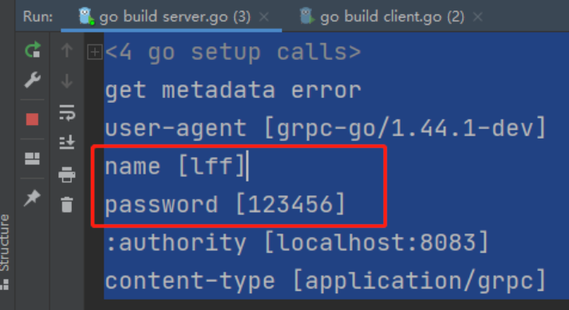

# gRPC介绍

gRPC 是一个高性能、开源和通用的 RPC 框架，面向移动和 HTTP/2 设计。其主要特点如下：

1. **基于 HTTP/2**: gRPC 基于 HTTP/2 标准设计，带来诸如双向流、流控、头部压缩、单连接上的多复用请求等特性。这些特性使得其成为构建高性能和伸缩性系统的理想选择。
2. **Protobuf 序列化**: gRPC 使用 Protobuf 作为接口定义语言，用于描述服务接口和消息结构。Protobuf 是一种语言无关、平台无关、可扩展的序列化结构数据的协议，使得系统间数据交互更加高效。
3. **多语言支持**: gRPC 支持多种语言，并提供了语言插件用于生成语言相关的客户端和服务端接口代码。目前已经支持 C、Java、Python、Go、Ruby、Node.js 等多种语言。
4. **工具支持**: gRPC 提供了一系列工具用于生成服务端、客户端代码及相关的消息类型接口。
5. **双向流和流控制**: gRPC 允许客户端和服务器之间进行双向流通信，并提供了完善的流控制机制。
6. **拦截器**: gRPC 允许开发者通过拦截器对请求进行预处理和对响应进行后处理。
7. **安全**: gRPC 支持 TLS/SSL 和 Token 基础的认证，可以确保数据的安全传输。

 

## 原始的grpc

服务端

```go
package main

import (
  "fmt"
  "net"
  "net/http"
  "net/rpc"
)

type Server struct {
}
type Req struct { //请求
  Num1 int
  Num2 int
}
type Res struct { //接收
  Num int
}

func (s Server) Add(req Req, res *Res) error {
  res.Num = req.Num1 + req.Num2
  return nil
}

func main() {
  rpc.Register(new(Server))	 // 注册rpc服务
  rpc.HandleHTTP()
  listen, err := net.Listen("tcp", ":8080")
  if err != nil {
    fmt.Println(err)
    return
  }
  http.Serve(listen, nil)
}
```

客户端

```go
package main

import (
  "fmt"
  "net/rpc"
)

type Req struct { //请求
  Num1 int
  Num2 int
}
type Res struct { //接收
  Num int
}

func main() {
  req := Req{1, 2}
  client, err := rpc.DialHTTP("tcp", ":8080")
  if err != nil {
    fmt.Println(err)
    return
  }
  var res Res
  client.Call("Server.Add", req, &res)
  fmt.Println(res)
}
```

原生rpc的问题：

1. 编写相对复杂，需要自己去关注实现过程
2. 没有代码提示，容易写错


# protobuf介绍

 [protobuf 官网文档 (protobuf.dev)](https://protobuf.dev/overview/)

Protocol Buffers（通常被称为 Protobuf）是 Google 开发的一种数据序列化协议（类似于 XML、JSON、YAML 等），它可用于数据存储、通信协议等方面。Protobuf 是一种语言无关、平台无关、可扩展的序列化结构数据的协议，它比 XML 和 JSON 更小、更快、更简单。

以下是 Protobuf3 的一些主要特性：

1. **简洁高效**: Protobuf 的数据大小通常要比 XML 小 3 到 10 倍，速度快 20 到 100 倍。这使得 Protobuf 非常适合用于扩展数据存储、RPC 数据交换格式或者任何需要高效存储和读写的地方。
2. **语言无关和平台无关**: Protobuf 提供了 C++、Java、Python 以及更多其他语言的库，你可以在不同的系统和不同的语言间使用 Protobuf，它们可以无缝地进行数据交换。
3. **可扩展**: Protobuf 是可扩展的，你可以很方便地更新数据结构而保持向后兼容。
4. **使用 .proto 文件定义数据结构**: 你需要定义数据结构的 .proto 文件，然后使用 protobuf 编译器生成对应语言的代码，这样就可以在代码中使用定义的数据结构了。

**劣势：**

​	1：应用不够广(相比xml和json)

​	2：二进制格式导致可读性差

​	3：缺乏自描述

## protobuf安装

[Releases下载地址 · protocolbuffers/protobuf (github.com)](https://github.com/protocolbuffers/protobuf/releases)

**protobuf编译器安装**


https://github.com/protocolbuffers/protobuf/releases/download/v3.9.0/protoc-3.9.0-win64.zip

解压压缩文件

```go
D:\Program Files\protoc-25.1-win64
```

添加protoc变量到系统环境变量中

```go
D:\Program Files\protoc-25.1-win64\bin
```

**下载go依赖包**

google接管后的新版本

```shell
// 都需要安装的依赖
go get github.com/golang/protobuf/proto
go get google.golang.org/grpc
go install github.com/golang/protobuf/protoc-gen-go
```

## protobuf编写和编译

[语法参考文档（需翻墙）](https://developers.google.com/protocol-buffers/docs/proto3)

1. message 成员编号， 可以不从1开始, 但是不能重复. -- 不能使用 19000 - 19999
2. 可以使用 message 嵌套
3. 定义数组、切片 使用 repeated 关键字
4. 可以使用枚举 enum
5. 可以使用联合体。 oneof 关键字。成员编号，不能重复

```protobuf
syntax = "proto3";	// 默认是 proto2
package go_RPC;     // 指定生成的包名
option go_package = "/go_proto";	// 指定需要生成的go包名
// option go_package = ".;go_proto"; // .为路径，go_proto为生成文件名

enum Week { // 定义枚举类型
    Monday = 0;   // 枚举值,必须从 0 开始.
    Turesday = 1;
}

service HelloService { //定义grpc服务
  rpc SayHello (HelloRequest) returns (HelloResponse) {}   // 定义grpc接口，定义接口名，传入参数 ，输出内容
}

message Student { // 定义消息体
    int32 age = 1;  // 可以不从1开始, 但是不能重复. -- 不能使用 19000 - 19999
    string name = 2;
    People p = 3;
    repeated int32 score = 4;  // 数组
    Week w = 5; // 枚举
    oneof data { // 联合体
        string teacher = 6;
        string class = 7;
    }
}

message People { // 消息体可以嵌套
    int32 weight = 1;
}
```

**编译 protobuf**

go 语言中编译命令：

```go
protoc -I . --go_out=plugins=grpc:. .\*.proto     // 生成xxx.pb.go 文件。
```

- -I：-IPATH, --proto_path=PATH, 指定proto文件搜索的路径, 如果有多个路径 可以多次使用-I 来指定, 如果不指定默认为当前目录
- --go_out: --go指插件的名称, 我们安装的插件为: protoc-gen-go, 而protoc-gen是插件命名规范, go是插件名称, 因此这里是--go, 而--go_out 表示的是 go插件的 out参数, 这里指编译产物的存放目录
- --go_opt: protoc-gen-go插件opt参数, 这里的module指定了go module, 生成的go pkg 会去除掉module路径，生成对应pkg
- pb/hello.proto: 我们proto文件路径


# grpc示例程序

使用Protocol Buffers带来的便利性。只需要去实现和注重业务方法。将其和grpc相绑定

==server端==：

监听socket端口，创建grpc服务器示例，将protobuf生成的服务与创建的结构体和grpc服务器绑定。

```go
package main

import (
	"GoNotebook/go_RPC/hello_grpc"
	"context"
	"fmt"
	"google.golang.org/grpc"
	"google.golang.org/grpc/grpclog"

	"net"
)

// HelloServer1 得有一个结构体，需要实现这个服务的全部方法,叫什么名字不重要
type HelloServer1 struct {
}

func (HelloServer1) SayHello(ctx context.Context, request *hello_grpc.HelloRequest) (pd *hello_grpc.HelloResponse, err error) {
	fmt.Println("入参：", request.Name, request.Message)
	pd = new(hello_grpc.HelloResponse)
	pd.Name = "你好"
	pd.Message = "ok"
	return
}

func main() {
	// 监听端口
	listen, err := net.Listen("tcp", ":8080")
	if err != nil {
		grpclog.Fatalf("Failed to listen: %v", err)
	}

	// 创建一个gRPC服务器实例。
	s := grpc.NewServer()
	server := HelloServer1{}
	// 将grpc服务器实例和结构体的方法与protoc buffer生成的服务名绑定，注册为gRPC服务。
	hello_grpc.RegisterHelloServiceServer(s, &server)
	fmt.Println("grpc server running :8080")
	// 开始处理客户端请求。
	err = s.Serve(listen)
}
```


==client端==：

进行grpc地址拨号连接，将protobuf生成的服务客户端和连接相绑定。调用微服务

```go
package main

import (
	"GoNotebook/go_RPC/hello_grpc"
	"context"
	"fmt"
	"google.golang.org/grpc"
	"google.golang.org/grpc/credentials/insecure"
	"log"
)

func main() {
	addr := ":8080"
	// 使用 grpc.Dial 创建一个到指定地址的 gRPC 连接。
	// 此处使用不安全的证书来实现 SSL/TLS 连接
	conn, err := grpc.Dial(addr, grpc.WithTransportCredentials(insecure.NewCredentials()))
	if err != nil {
		log.Fatalf(fmt.Sprintf("grpc connect addr [%s] 连接失败 %s", addr, err))
	}
	defer conn.Close()

	client := hello_grpc.NewHelloServiceClient(conn) // 初始化客户端
	result, err := client.SayHello(context.Background(), &hello_grpc.HelloRequest{
		Name:    "枫枫",
		Message: "ok",
	})
	fmt.Println(result, err)
}
```


# grpc的4种模式介绍

**1、简单模式（Simple RPC）**
简单模式：也称简单 RPC，即客户端发起一次请求，服务端响应处理后返回一个结果给客户端。

在 proto 文件中可如下定义：

```go
rpc SayHello(HelloRequest) returns (HelloResponse);
```


**2、服务端数据流模式（Server-side streaming RPC）**
服务端数据流模式：也称服务端流式 RPC，即客户端发起一次请求，服务端可以连续返回数据流。
比如：客户端向服务端发送了一个查询数据库的请求，服务端持续返回多次结果。（即客户端发送一次请求，服务端查询到数据库有一万条数据，服务端分批返回10次，每次返回1000条数据给客户端）。

在 proto 文件中可如下定义：

```go
rpc LotsOfReplies(HelloRequest) returns (stream HelloResponse); //返回结果加上stream代表流
```


**3、客户端数据流模式（Client-side streaming RPC）**
客户端数据流模式：也称客户端流式 RPC，与服务端数据流模式相反，客户端持续向服务端发送数据流，在发送结束后，由服务端返回一个响应。
比如：客户端有一万条数据 ，分批多次请求服务端，服务端接收后把这些数据都存到数据库，然后返回一次结果给客户端。

在 proto 文件中可如下定义：

```go
rpc LotsOfGreetings(stream HelloRequest) returns (HelloResponse); //接收参数加上stream代表流
```

**4、双向数据流模式（Bidirectional streaming RPC）**
双向数据流模式：也称双向流式 RPC，即客户端和服务端都可以向对方多次收发数据。

比如：客户端有一万条数据 ，分批多次请求服务端，服务端每次接收后存到数据库后都发送一次结果给客户端。

在 proto 文件中可如下定义：

```go
rpc BidiHello(stream HelloRequest) returns (stream HelloResponse); //接收参数和返回结果，加上stream代表流
```


## 双向数据流模式 示例文件

proto

```protobuf
syntax = "proto3";
option go_package = "/proto";

message Request {
  string name = 1;
}
message Response {
  string Text = 1;
}

service BothStream{
  rpc Chat(stream Request)returns(stream Response){}
}
```

### 服务端

```go
package main

import (
  "fmt"
  "google.golang.org/grpc"
  "grpc_study/stream_proto/proto"
  "log"
  "net"
)

type BothStream struct{}

func (BothStream) Chat(stream proto.BothStream_ChatServer) error {
  for i := 0; i < 10; i++ {
    request, _ := stream.Recv()
    fmt.Println(request)
    stream.Send(&proto.Response{
      Text: "你好",
    })
  }
  return nil
}

func main() {
  listen, err := net.Listen("tcp", ":8080")
  if err != nil {
    log.Fatal(err)
  }
  server := grpc.NewServer()
  proto.RegisterBothStreamServer(server, &BothStream{})

  server.Serve(listen)
}
```

### 客户端

```go
package main

import (
  "context"
  "fmt"
  "google.golang.org/grpc"
  "google.golang.org/grpc/credentials/insecure"
  "grpc_study/stream_proto/proto"
  "log"
)

func main() {
  addr := ":8080"
  // 使用 grpc.Dial 创建一个到指定地址的 gRPC 连接。
  // 此处使用不安全的证书来实现 SSL/TLS 连接
  conn, err := grpc.Dial(addr, grpc.WithTransportCredentials(insecure.NewCredentials()))
  if err != nil {
    log.Fatalf(fmt.Sprintf("grpc connect addr [%s] 连接失败 %s", addr, err))
  }
  defer conn.Close()
  // 初始化客户端
  client := proto.NewBothStreamClient(conn)
  stream, err := client.Chat(context.Background())

  for i := 0; i < 10; i++ {
    stream.Send(&proto.Request{
      Name: fmt.Sprintf("第%d次", i),
    })
    response, err := stream.Recv()
    fmt.Println(response, err)
  }
}

syntax = "proto3";
option go_package = "/proto";

service Simple {
  rpc Fun(Request)returns(Response){}
}

// 服务端流式
service ServiceStream{
  rpc Fun(Request)returns(stream Response){}
  rpc DownLoadFile(Request)returns(stream FileResponse){}
}
// 客户端流式
service ClientStream{
  rpc UploadFile(stream FileRequest)returns(Response){}
}

// 双向流
service BothStream{
  rpc Chat(stream Request)returns(stream Response){}
}


message Request {
  string name = 1;
}
message Response {
  string Text = 1;
}

message FileRequest{
  string file_name = 1;
  bytes content = 2;
}

message FileResponse{
  string file_name = 1;
  bytes content = 2;
}
```

```go
// protoc -I . --go_out=plugins=grpc:./stream_proto .\stream_proto\stream.proto
```


 

# metadata元数据使用

gRPC 让我们可以像本地调用一样进行远程调用。在每次的 RPC 调用中，可能需要在 header 中传递一些数据，这些数据可以通过 metadata 来传递。

Metadata 是以 key-value 的形式存储数据的，其中 key 是 string 类型，而 value 是 []string 类型，即一个字符串切片类型。Metadata 使得客户端和服务器能够为对方提供关于本次调用的一些信息，这与 HTTP 请求的 RequestHeader 和 ResponseHeader 类似。就像 HTTP 中的 header 的生命周期是一次 HTTP 请求，gRPC 中的 metadata 的生命周期是一次 RPC 调用。

需要注意的是，gRPC 的 metadata 实际上分为两种：传入（incoming）和传出（outgoing）。传入 metadata 是服务器从客户端接收的，传出 metadata 是服务器发送给客户端的。在服务器端，传入 metadata 包含客户端发送的所有 metadata，传出 metadata 是服务器想要发送给客户端的任何额外信息。在客户端，传入 metadata 是从服务器接收的响应的一部分，传出 metadata 是要发送给服务器的请求的一部分。

## 1、go中使用metadata

项目源代码路径：https://github.com/grpc/grpc-go/tree/master/metadata

项目文档：https://github.com/grpc/grpc-go/blob/master/Documentation/grpc-metadata.md

使用的go包："google.golang.org/grpc/metadata"

### 1）新建metadata
MD 类型实际上是map，key是string，value是string类型的slice。

```go
type MD map[string][]string
```

创建的时候可以像创建普通的map类型一样使用new关键字进行创建：

```go
//第一种方式
md := metadata.New(map[string]string{"key1": "val1", "key2": "val2"})

//第二种方式 key不区分大小写，会被统一转成小写
md := metadata.Pairs(
    "key1", "val1",
    "key1", "val1-2", // "key1" will have map value []string{"val1", "val1-2"}
    "key2", "val2",
)
```

### 2）发送metadata

```go
md := metadata.Pairs("key", "val")

// 新建一个有 metadata 的 context
ctx := metadata.NewOutgoingContext(context.Background(), md)

// 单向 RPC
response, err := client.SomeRPC(ctx, someRequest)
```

### 3）接收metadata

```go
func (s *server) SomeRPC(ctx context.Context, in *pb.SomeRequest) (*pb.SomeResponse, err) {
    md, ok := metadata.FromIncomingContext(ctx)
    // do something with metadata
}
```

## 2、gRPC中使用metadata

### 1）proto

```go
syntax = "proto3";
option go_package = "./;proto";

service Greeter {
  rpc SayHello (HelloRequest) returns (HelloReply) {}
}

message HelloRequest {
  string name = 1;
}

message HelloReply {
  string message = 1;
}
```

执行命令编译文件，生成.pb.go文件：protoc -I . test.proto --go_out=plugins=grpc:.

### 2）client 

```go
package main

import (
	"context"
	"fmt"
	"go-class/rpc/07metadata/proto"
	"google.golang.org/grpc"
	"google.golang.org/grpc/metadata"
)

func main() {
	conn, err := grpc.Dial(":8083", grpc.WithInsecure())
	if err != nil {
		panic(err)
	}
	defer conn.Close()
	c := proto.NewGreeterClient(conn)

	//写入metadata***********
	md := metadata.New(map[string]string{
		"name": "lff",
		"password": "123456",
	})
	ctx := metadata.NewOutgoingContext(context.Background(), md)
	r, err := c.SayHello(ctx, &proto.HelloRequest{Name: "lff111"})
	if err != nil {
		panic(err)
	}
	fmt.Println(r.Message)

}
```

### 3）server

```go
package main

import (
	"context"
	"fmt"
	"net"

	"google.golang.org/grpc"
	"google.golang.org/grpc/metadata"
	 
	"go-class/rpc/07metadata/proto"
)

type Server struct {}

func (s *Server) SayHello(ctx context.Context, req *proto.HelloRequest) (*proto.HelloReply, error) {
    //获取header*********
	md, ok := metadata.FromIncomingContext(ctx)
	if ok {
		fmt.Println("get metadata error")
	}
	for key, val := range md {
		fmt.Println(key, val)
	}
    //获取header中的name*********
	//if nameSlice, ok := md["name"]; ok {
	//	fmt.Println(nameSlice)
	//	for i, e := range nameSlice {
	//		fmt.Println(i, e)
	//	}
	//}
	return &proto.HelloReply{
		Message: "Hello " + req.Name,
	}, nil
}

func main(){
	g := grpc.NewServer()
	proto.RegisterGreeterServer(g, &Server{})
	lis, err := net.Listen("tcp", "127.0.0.1:8083")
	if err != nil {
		panic("failed to listen：" + err.Error())
	}
	err = g.Serve(lis)
	if err != nil {
		panic("failed to start grpc：" + err.Error())
	}
}
```

先启动server，在启动client端，结果看到打印出的header




# grpc拦截器

gRPC 提供了拦截器（Interceptors）的功能，这是一种中间件机制，可以用来处理或者改变 RPC 调用的行为。拦截器可以用来处理各种跨切面（cross-cutting）的任务，例如日志记录、身份验证、负载均衡等。

在 gRPC 中，有两种类型的拦截器：一种是 Unary Interceptor，用于处理普通的一元 RPC 调用；另一种是 Stream Interceptor，用于处理流式 RPC 调用。

以下是在 Go 中使用 Unary Interceptor 的一个简单示例：

```go
// HelloServer1 得有一个结构体，需要实现这个服务的全部方法,叫什么名字不重要
type HelloServer1 struct {
}

func (HelloServer1) SayHello(ctx context.Context, request *hello_grpc.HelloRequest) (pd *hello_grpc.HelloResponse, err error) {
	fmt.Println("入参：", request.Name, request.Message)
	pd = new(hello_grpc.HelloResponse)
	pd.Name = "你好"
	pd.Message = "ok"
	return
}

func main() {
	listen, err := net.Listen("tcp", ":8080")
	if err != nil {
		grpclog.Fatalf("Failed to listen: %v", err)
	}

	Interceptor := func(ctx context.Context, req any, info *grpc.UnaryServerInfo, handler grpc.UnaryHandler) (resp any, err error) {
		println("这是grpc拦截器，现有一个连接请求发送过来了")
		return handler(ctx, nil)
	}

	ServerInterceptorOption := grpc.UnaryInterceptor(Interceptor) // 创建拦截器
	s := grpc.NewServer(ServerInterceptorOption)                  // 创建一个包含拦截器的gRPC服务器实例。
	server := HelloServer1{}
	// 将server结构体注册为gRPC服务。
	hello_grpc.RegisterHelloServiceServer(s, &server)
	fmt.Println("grpc server running :8080")
	// 开始处理客户端请求。
	err = s.Serve(listen)
}
```

在这个例子中，我们创建了一个 UnaryServerInterceptor。这个拦截器记录了每个 RPC 调用的方法名、执行时间和可能的错误。然后，我们在创建 gRPC 服务器时，使用 `grpc.NewServer` 函数的 `grpc.UnaryInterceptor` 选项将拦截器添加到服务器中。

注意，你可以通过调用 `handler(ctx, req)` 来继续 RPC 调用的处理。在调用 `handler` 之前的代码是在处理 RPC 之前执行的（pre-processing），在调用 `handler` 之后的代码是在处理 RPC 之后执行的（post-processing）。

同样的，你也可以创建和使用 Stream Interceptor，但是由于流式 RPC 的复杂性，其代码会稍微复杂一些。

[关于grpc开源的拦截器推荐](https://github.com/grpc-ecosystem/go-grpc-middleware)


#  实现grpc的auth认证

auth认证作用：验证请求的用户身份，避免破坏者伪造身份获取他人数据隐私。auth认证是通过拦截器和metadata实现一起实现的

gRPC的用户认证可以用两句话总结：

- gRPC客户端提供在每一次调用注入用户凭证的能力
- gRPC服务端使用拦截器来验证每一个客户端的请求

要实现在每一次调用注入用户凭证的能力，我们需要实现`credentials.PerRPCCredentials`接口，并且在客户端创建链接的时候指定`grpc.WithPerRPCCredentials(credentials.PerRPCCredentials)`


下面是server和client的两种认证方式

```go
func main() { //server端
	listen, err := net.Listen("tcp", ":8080")
	if err != nil {
		grpclog.Fatalf("Failed to listen: %v", err)
	}

	Interceptor := func(ctx context.Context, req any, info *grpc.UnaryServerInfo, handler grpc.UnaryHandler) (resp any, err error) {
		println("这是grpc拦截器，现有一个连接请求发送过来了")
		md, ok := metadata.FromIncomingContext(ctx) 
		if !ok {
			return resp, status.Error(codes.Unauthenticated, "not token authentication context")
		}
		var (
			appid    string
			password string
		)
		value, ok := md["appid"]
		if ok {
			appid = value[0]
		}
		if value, ok = md["password"]; ok {
			password = value[0]
		}

		if appid != "111111" || password != "123456" { //这里可以是连接数据库认证
			return resp, status.Error(codes.PermissionDenied, "not authentication failed")
		}

		return handler(ctx, req)
	}

	ServerInterceptorOption := grpc.UnaryInterceptor(Interceptor) // 创建拦截器
	s := grpc.NewServer(ServerInterceptorOption)                  // 创建一个包含拦截器的gRPC服务器实例。
	server := HelloServer1{}
	// 将server结构体注册为gRPC服务。
	hello_grpc.RegisterHelloServiceServer(s, &server)
	fmt.Println("grpc server running :8080")
	// 开始处理客户端请求。
	err = s.Serve(listen)
}
```

client端，方式一：通过grpc的拦截器和metadata实现auth验证

```go
func main() {
	addr := ":8080" // gRPC服务器地址
	// 创建客户端拦截器，拦截器在每次gRPC调用之前运行，用于记录调用的耗时
	ClientInterceptor := func(ctx context.Context, method string, req interface{}, reply interface{}, cc *grpc.ClientConn, invoker grpc.UnaryInvoker, opts ...grpc.CallOption) error {
		start := time.Now() // 记录开始时间
		md := metadata.New(map[string]string{
			"appid":    "111111",
			"password": "123456",
		})
		ctx = metadata.NewOutgoingContext(context.Background(), md)
		err := invoker(ctx, method, req, reply, cc, opts...)
		fmt.Println("Elapsed time:", time.Since(start)) // 打印调用耗时
		return err
	}
	var opts []grpc.DialOption
	opts = append(opts, grpc.WithTransportCredentials(insecure.NewCredentials()))
	opts = append(opts, grpc.WithUnaryInterceptor(ClientInterceptor)) // 创建带有拦截器的gRPC选项

	// 通过地址和选项创建gRPC连接
	// 使用grpc.WithInsecure()选项表示不使用TLS
	conn, err := grpc.Dial(addr, opts...)
	if err != nil {
		log.Fatalf("Failed to connect to gRPC server at [%s]: %s", addr, err) // 如果连接失败，打印错误并退出
	}
	defer conn.Close() // 确保在函数退出时关闭连接

	// 使用连接初始化gRPC客户端
	client := hello_grpc.NewHelloServiceClient(conn)

	result, err := client.SayHello(context.Background(), &hello_grpc.HelloRequest{
		Name:    "枫枫",
		Message: "ok",
	})

	// 打印调用结果和可能的错误
	fmt.Println(result, err)
}
```

client端，方式二：通过grpc自带封装的方法实现auth认证

```go
type ClientCredentials struct{}

func (c ClientCredentials) GetRequestMetadata(ctx context.Context, uri ...string) (map[string]string, error) {
	return map[string]string{
		"appid":    "111111",
		"password": "123456",
	}, nil
}

func (c ClientCredentials) RequireTransportSecurity() bool {
	return false
}

func main() {
	addr := ":8080" // gRPC服务器地址
	var opts []grpc.DialOption
	opts = append(opts, grpc.WithTransportCredentials(insecure.NewCredentials()))
	opts = append(opts, grpc.WithPerRPCCredentials(ClientCredentials{})) // 创建带有auth认证的gRPC选项

	conn, err := grpc.Dial(addr, opts...)
	if err != nil {
		log.Fatalf("Failed to connect to gRPC server at [%s]: %s", addr, err) // 如果连接失败，打印错误并退出
	}
	defer conn.Close() // 确保在函数退出时关闭连接

	client := hello_grpc.NewHelloServiceClient(conn) // 使用连接初始化gRPC客户端
	result, err := client.SayHello(context.Background(), &hello_grpc.HelloRequest{
		Name:    "枫枫",
		Message: "ok",
	})

	fmt.Println(result, err) // 打印调用结果和可能的错误
}
```


# grpc验证器

https://github.com/envoyproxy/protoc-gen-validate

protoc-gen-validate（PGV）是一个用于生成多语言消息验证器的原型插件。

[bufbuild/protovalidate-go: Protocol Buffer Validation for Go (github.com)](https://github.com/bufbuild/protovalidate-go)


**需要PGV工具链 （GO ≥ v1.19）**

若要安装包，请在 Go 模块中使用以下命令：`go get`

```
go get github.com/bufbuild/protovalidate-go
```

将包导入 Go 项目：

```
import "github.com/bufbuild/protovalidate-go"
```


# grpc状态码和错误处理

[grpc/doc/statuscodes.md at master · grpc/grpc (github.com)](https://github.com/grpc/grpc/blob/master/doc/statuscodes.md)

grpc的异常处理

```go
func (HelloServer) SayHello(ctx context.Context, request *hello_grpc.HelloRequest) (*hello_grpc.HelloResponse, error) {
	fmt.Println("入参：", request.Name, request.Message)
	//return nil, status.Error(codes.NotFound, "记录未找到")
	return nil, status.Errorf(codes.NotFound, "记录未找到:%s", request.Name)
}
```

2.客户端

```go
func main() {
	addr := ":8080"
	// 使用 grpc.Dial 创建一个到指定地址的 gRPC 连接。
	// 此处使用不安全的证书来实现 SSL/TLS 连接
	conn, err := grpc.Dial(addr, grpc.WithTransportCredentials(insecure.NewCredentials()))
	if err != nil {
		log.Fatalf(fmt.Sprintf("grpc connect addr [%s] 连接失败 %s", addr, err))
	}
	defer conn.Close()
	// 初始化客户端
	client := hello_grpc.NewHelloServiceClient(conn)
	ResponseBody, err := client.SayHello(context.Background(), &hello_grpc.HelloRequest{
		Name:    "枫枫",
		Message: "ok",
	})
	if err != nil {
		st, _ := status.FromError(err)
		fmt.Println("Code", st.Code(), "Message") //  提取返回err中的状态码和信息
	}
	fmt.Println(ResponseBody.GetName())
}
```


# grpc超时机制

gRPC默认的请求的超时时间是很长的，当你没有设置请求超时时间时，所有在运行的请求都占用大量资源且可能运行很长的时间，导致服务资源损耗过高，使得后来的请求响应过慢，甚至会引起整个进程崩溃。

为了避免这种情况，我们的服务应该设置超时时间。前面的[入门教程](https://github.com/Bingjian-Zhu/go-grpc-example)提到，当客户端发起请求时候，需要传入上下文`context.Context`，用于结束`超时`或`取消`的请求。

客户端，请求设置超时时间

```go
func main() {
	addr := ":8080"
	conn, err := grpc.Dial(addr, grpc.WithTransportCredentials(insecure.NewCredentials()))
	if err != nil {
		log.Fatalf(fmt.Sprintf("grpc connect addr [%s] 连接失败 %s", addr, err))
	}
	defer conn.Close()
	
	client := hello_grpc.NewHelloServiceClient(conn) // 初始化客户端
	ctxDeadline, _ := context.WithTimeout(context.Background(), time.Second*3)
	result, err := client.SayHello(ctxDeadline, &hello_grpc.HelloRequest{
		Name:    "枫枫",
		Message: "ok",
	})
	fmt.Println(result, err)
}
```

服务端，设置超过超时时间 大于客户端超时限制

```go
func (HelloServer1) SayHello(ctx context.Context, request *hello_grpc.HelloRequest) (pd *hello_grpc.HelloResponse, err error) {
	fmt.Println("入参：", request.Name, request.Message)
	time.Sleep(time.Second * 4)
	return &hello_grpc.HelloResponse{
		Name:    "你好",
		Message: "ok",
	}, nil
}
```


# gRPC-Gateway介绍

[gRPC-Gateway](https://github.com/grpc-ecosystem/grpc-gateway) 是一个 protoc 插件。它读取 gRPC 服务定义并生成一个反向代理服务器，该服务器将 RESTful JSON API 转换为 gRPC。此服务器根据 gRPC 定义中的自定义选项生成。

鉴于复杂的外部环境 gRPC 并不是万能的工具。在某些情况下，我们仍然希望提供传统的 HTTP/JSON API，来满足维护向后兼容性或者那些不支持 gRPC 的客户端。但是为我们的RPC服务再编写另一个服务只是为了对外提供一个 HTTP/JSON API，这是一项相当耗时和乏味的任务。

GRPC-Gateway 能帮助你同时提供 gRPC 和 RESTful 风格的 API。GRPC-Gateway 是 Google protocol buffers 编译器 protoc 的一个插件。它读取 Protobuf 服务定义并生成一个反向代理服务器，该服务器将 RESTful HTTP API 转换为 gRPC。该服务器是根据服务定义中的 google.api.http 注释生成的。


# 使用protobuf定义 gRPC 服务

新建一个项目`greeter`，在项目目录下执行`go mod init`命令完成go module初始化。

在项目目录下创建一个`proto/helloworld/hello_world.proto`文件，其内容如下。

```protobuf
syntax = "proto3";

package helloworld;

option go_package="github.com/Q1mi/greeter/proto/helloworld";

service Greeter { // 定义一个Greeter服务
  rpc SayHello (HelloRequest) returns (HelloReply) {}  // 打招呼方法
}

message HelloRequest { // 定义请求的message
  string name = 1;
}

message HelloReply { // 定义响应的message
  string message = 1;
}
```

## 生成代码

```bash
$ protoc -I=proto \
   --go_out=proto --go_opt=paths=source_relative \
   --go-grpc_out=proto --go-grpc_opt=paths=source_relative \
   helloworld/hello_world.proto
```

*Windows执行失败的话就去掉上述命令中的`\`。*

生成pb和gRPC相关代码后，在`main`函数中注册RPC服务并启动gRPC Server。

```go
package main // greeter/main.go

import (
	"context"
	"log"
	"net"

	"google.golang.org/grpc"

	helloworldpb "github.com/Q1mi/greeter/proto/helloworld"
)

type server struct {
	helloworldpb.UnimplementedGreeterServer
}

func NewServer() *server {
	return &server{}
}

func (s *server) SayHello(ctx context.Context, in *helloworldpb.HelloRequest) (*helloworldpb.HelloReply, error) {
	return &helloworldpb.HelloReply{Message: in.Name + " world"}, nil
}

func main() {
	lis, err := net.Listen("tcp", ":8080") // Create a listener on TCP port
	if err != nil {
		log.Fatalln("Failed to listen:", err)
	}

	s := grpc.NewServer() // 创建一个gRPC server对象
	helloworldpb.RegisterGreeterServer(s, &server{}) // 注册Greeter service到server
	log.Println("Serving gRPC on 0.0.0.0:8080") // 启动gRPC Server
	log.Fatal(s.Serve(lis))
}
```

此时的文件目录如下：

```bash
greeter
├── go.mod
├── go.sum
├── main.go
└── proto
    └── helloworld
        ├── hello_world.pb.go
        ├── hello_world.proto
        └── hello_world_grpc.pb.go
```

至此一个简单的GRPC服务就写好了。

接下来我们将介绍如何快速的为GRPC服务生成HTTP API代码。

## 将 gRPC-Gateway 注释添加到现有的proto文件

现在我们已经有了一个可以运行的 Go gRPC 服务器，接下来需要添加 gRPC-Gateway 注释。这些注释定义了 gRPC 服务如何映射到 JSON 请求和响应。使用 protocol buffers时，每个 RPC 服务必须使用 `google.api.HTTP` 注释来定义 HTTP 方法和路径。

因此，我们需要将 `google/api/http.proto` 导入到 `proto` 文件中。我们还需要添加所需的 HTTP-> gRPC 映射。在本例中，我们将 `POST /v1/example/echo` 映射到 `SayHello` RPC。

修改后的`proto/helloworld/hello_world.proto`文件，内容如下。

```protobuf
syntax = "proto3";

package helloworld;

option go_package="github.com/Q1mi/greeter/proto/helloworld";

// 导入google/api/annotations.proto
import "google/api/annotations.proto";

service Greeter { // 定义一个Greeter服务
  rpc SayHello (HelloRequest) returns (HelloReply) { // 打招呼方法
    option (google.api.http) = { // 这里添加了google.api.http注释
      post: "/v1/example/echo"
      body: "*"
    };
  }
}

message HelloRequest { // 定义请求的message
  string name = 1;
}

message HelloReply { // 定义响应的message
  string message = 1;
}
```

# 生成gRPC-Gateway stubs

现在我们已经将 gRPC-Gateway 注释添加到 proto 文件中，接下来需要使用 gRPC-Gateway 生成器来生成存根。

## 引入依赖包

在我们可以使用 `protoc` 生成存根之前，我们需要将一些依赖项复制到我们的 proto 文件结构中。将 `googleapis` 的一个子集从[官方库](https://github.com/googleapis/googleapis)复制到您的本地原型文件结构中。拷贝后的目录应该是这样的:

```bash
greeter
├── go.mod
├── go.sum
├── main.go
└── proto
    ├── google
    │   └── api
    │       ├── annotations.proto
    │       └── http.proto
    └── helloworld
        ├── hello_world.pb.go
        ├── hello_world.proto
        └── hello_world_grpc.pb.go
```

## 安装gRPC-Gateway工具

需要安装`protoc-gen-grpc-gateway`插件来生成对应的 grpc-gateway 代码。

```bash
go install github.com/grpc-ecosystem/grpc-gateway/v2/protoc-gen-grpc-gateway@v2
```

如果不安装该插件，就无法生成grpc-gateway相关的代码。报错如下：

```bash
protoc-gen-grpc-gateway: program not found or is not executable
Please specify a program using absolute path or make sure the program is available in your PATH system variable
--grpc-gateway_out: protoc-gen-grpc-gateway: Plugin failed with status code 1.
```

## 生成代码

现在我们需要将 gRPC-Gateway 生成器添加到 protoc 的调用命令中:

```bash
$ protoc -I=proto \
   --go_out=proto --go_opt=paths=source_relative \
   --go-grpc_out=proto --go-grpc_opt=paths=source_relative \
   --grpc-gateway_out=proto --grpc-gateway_opt=paths=source_relative \
   helloworld/hello_world.proto
```

执行上述命令应该会生成一个 `*.gw.pb.go` 文件。

# 添加HTTP Server代码

我们还需要在 `main.go` 文件中添加和启动`gRPC-Gateway mux`。按如下代码所示修改我们的`main`函数。

```go
package main

import (
	"context"
	"log"
	"net"
	"net/http"

	helloworldpb "github.com/Q1mi/greeter/proto/helloworld"

	"github.com/grpc-ecosystem/grpc-gateway/v2/runtime" // 注意v2版本
	"google.golang.org/grpc"
	"google.golang.org/grpc/credentials/insecure"
)

type server struct {
	helloworldpb.UnimplementedGreeterServer
}

func NewServer() *server {
	return &server{}
}

func (s *server) SayHello(ctx context.Context, in *helloworldpb.HelloRequest) (*helloworldpb.HelloReply, error) {
	return &helloworldpb.HelloReply{Message: in.Name + " world"}, nil
}

func main() {
	lis, err := net.Listen("tcp", ":8080") // Create a listener on TCP port
	if err != nil {
		log.Fatalln("Failed to listen:", err)
	}

	s := grpc.NewServer() // 创建一个gRPC server对象
	helloworldpb.RegisterGreeterServer(s, &server{}) // 注册Greeter service到server
	log.Println("Serving gRPC on 0.0.0.0:8080") // 8080端口启动gRPC Server
	go func() {
		log.Fatalln(s.Serve(lis))
	}()

	// 创建一个连接到我们刚刚启动的 gRPC 服务器的客户端连接
	// gRPC-Gateway 就是通过它来代理请求（将HTTP请求转为RPC请求）
	conn, err := grpc.DialContext(
		context.Background(),
		"0.0.0.0:8080",
		grpc.WithBlock(),
		grpc.WithTransportCredentials(insecure.NewCredentials()),
	)
	if err != nil {
		log.Fatalln("Failed to dial server:", err)
	}

	gwmux := runtime.NewServeMux()
	err = helloworldpb.RegisterGreeterHandler(context.Background(), gwmux, conn) // 注册Greeter
	if err != nil {
		log.Fatalln("Failed to register gateway:", err)
	}

	gwServer := &http.Server{
		Addr:    ":8090",
		Handler: gwmux,
	}
	log.Println("Serving gRPC-Gateway on http://0.0.0.0:8090") // 8090端口提供gRPC-Gateway服务
	log.Fatalln(gwServer.ListenAndServe())
}
```

**注意**

1. 导入的”github.com/grpc-ecosystem/grpc-gateway/v2/runtime”是v2版本。
2. 需要使用单独的goroutine启动gRPC服务。

# 测试gRPC-Gateway

首先启动服务。

```bash
go run main.go
```

然后我们使用 cURL 发送 HTTP 请求:

```bash
curl -X POST -k http://localhost:8090/v1/example/echo -d '{"name": " hello"}'
```

得到响应结果。

```bash
{"message":"hello world"}
```

至此 gRPC-Gateway 的基础使用教程就结束啦，完整的示例代码可查看https://github.com/Q1mi/greeter。

# 同一个端口提供HTTP API和gRPC API

上面的程序在`8080`端口提供了gRPC API，在`8090`端口提供了HTTP API。但是在有些场景下我们可能希望由同一个端口同时提供gRPC API和HTTP API两种服务，由请求方来决定具体使用哪个协议。

下面的代码将同时在本机的`8091`端口对外提供gRPC API和HTTP API服务。

因为我们的示例中没有启用 TLS加密通信，所以这里使用`h2c`包实现对HTTP/2的支持。h2c 协议是 HTTP/2的非 TLS 版本。

```go
package main

import (
	"context"
	"log"
	"net"
	"net/http"
	"strings"

	helloworldpb "github.com/Q1mi/greeter/proto/helloworld"
	"github.com/grpc-ecosystem/grpc-gateway/v2/runtime" // 注意v2版本
	"golang.org/x/net/http2"
	"golang.org/x/net/http2/h2c"
	"google.golang.org/grpc"
	"google.golang.org/grpc/credentials/insecure"
)

type server struct {
	helloworldpb.UnimplementedGreeterServer
}

func NewServer() *server {
	return &server{}
}

func (s *server) SayHello(ctx context.Context, in *helloworldpb.HelloRequest) (*helloworldpb.HelloReply, error) {
	return &helloworldpb.HelloReply{Message: in.Name + " world"}, nil
}

func main() {
	// Create a listener on TCP port
	lis, err := net.Listen("tcp", ":8091")
	if err != nil {
		log.Fatalln("Failed to listen:", err)
	}

	// 创建一个gRPC server对象
	s := grpc.NewServer()
	// 注册Greeter service到server
	helloworldpb.RegisterGreeterServer(s, &server{})

	// gRPC-Gateway mux
	gwmux := runtime.NewServeMux()
	dops := []grpc.DialOption{grpc.WithTransportCredentials(insecure.NewCredentials())}
	err = helloworldpb.RegisterGreeterHandlerFromEndpoint(context.Background(), gwmux, "127.0.0.1:8091", dops)
	if err != nil {
		log.Fatalln("Failed to register gwmux:", err)
	}

	mux := http.NewServeMux()
	mux.Handle("/", gwmux)

	// 定义HTTP server配置
	gwServer := &http.Server{
		Addr:    "127.0.0.1:8091",
		Handler: grpcHandlerFunc(s, mux), // 请求的统一入口
	}
	log.Println("Serving on http://127.0.0.1:8091")
	log.Fatalln(gwServer.Serve(lis)) // 启动HTTP服务
}

// grpcHandlerFunc 将gRPC请求和HTTP请求分别调用不同的handler处理
func grpcHandlerFunc(grpcServer *grpc.Server, otherHandler http.Handler) http.Handler {
	return h2c.NewHandler(http.HandlerFunc(func(w http.ResponseWriter, r *http.Request) {
		if r.ProtoMajor == 2 && strings.Contains(r.Header.Get("Content-Type"), "application/grpc") {
			grpcServer.ServeHTTP(w, r)
		} else {
			otherHandler.ServeHTTP(w, r)
		}
	}), &http2.Server{})
}
```

将上述代码编译后运行，在`8091`端口启动。 测试gRPC API：

```bash
./greeter_client -name="hello"
```

得到响应结果。

```bash
resp:hello world
```

测试HTTP API：

```bash
curl -X POST -k http://127.0.0.1:8091/v1/example/echo -d '{"name": " hello"}'
```

得到响应结果。

```bash
{"message":"hello world"}
```