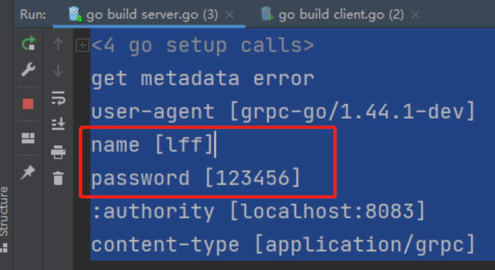

rpc是一种协议，protobuf是一个代码和消息体生成工具，grpc是一个框架组合了rpc+protobuf使用，go-zero也是而且更完善

# [gRPC](https://grpc.io/docs/languages/go/quickstart/)

`gRPC`是一种现代化开源的**高性能RPC框架**，能够运行于任意环境之中。最初由谷歌进行开发。它使用HTTP/2作为传输协议。

1. **基于 HTTP/2**: gRPC 基于 HTTP/2 标准设计，带来诸如双向流、流控、头部压缩、单连接上的多复用请求等特性。这些特性使得其成为构建高性能和伸缩性系统的理想选择。
2. **Protobuf 序列化**: gRPC 使用 Protobuf 作为接口定义语言，用于描述服务接口和消息结构。Protobuf 是一种语言无关、平台无关、可扩展的序列化结构数据的协议，使得系统间数据交互更加高效。
3. **多语言支持**: gRPC 支持多种语言，并提供了语言插件用于生成语言相关的客户端和服务端接口代码。目前已经支持 C、Java、Python、Go、Ruby、Node.js 等多种语言。
4. **工具支持**: gRPC 提供了一系列工具用于生成服务端、客户端代码及相关的消息类型接口。
5. **双向流和流控制**: gRPC 允许客户端和服务器之间进行双向流通信，并提供了完善的流控制机制。
6. **拦截器**: gRPC 允许开发者通过拦截器对请求进行预处理和对响应进行后处理。
7. **安全**: gRPC 支持 TLS/SSL 和 Token 基础的认证，可以确保数据的安全传输。

# 为什么要用gRPC？

使用gRPC，可以一次性的在一个`.proto`文件中定义服务并使用任何支持它的语言去实现客户端和服务端。

反过来，它们可以应用在各种场景中，从Google的服务器到你自己的平板电脑—— gRPC帮你解决了不同语言及环境间通信的复杂性。

使用`protocol buffers`还能获得其他好处，包括高效的序列化，简单的IDL以及容易进行接口更新。总之一句话，使用gRPC能让我们更容易编写跨语言的分布式代码。

> IDL（Interface description language）是指接口描述语言，是用来描述软件组件接口的一种计算机语言，是跨平台开发的基础。IDL通过一种中立的方式来描述接口，使得在不同平台上运行的对象和用不同语言编写的程序可以相互通信交流；比如，一个组件用C++写成，另一个组件用Go写成。

**安装protoc-gen-go-grpc插件**：生成 Go 语言的 gRPC 服务端和客户端代码

```sh
go install google.golang.org/grpc/cmd/protoc-gen-go-grpc

import "google.golang.org/grpc"			# 导入时自动安装
go get google.golang.org/grpc			# 也可自行安装grpc
```

安装好之后，需要将protoc-gen-go.exe的目录和protoc的bin目录添加到环境变量中


# 编写protobuf

[语法参考文档（需翻墙）](https://developers.google.com/protocol-buffers/docs/proto3)

```protobuf
syntax = "proto3";  	// 默认是 proto2
package hello_proto;     // 指定生成的包名，与go_package参数一致
option go_package = "/hello_proto";  // 指定需要生成的go包名
// option go_package = ".;hello_proto"; // .为路径，go_proto为生成文件名

enum Week {// 定义枚举类型
  Monday = 0;   // 枚举值,必须从 0 开始.
  Turesday = 1;
}

service HelloService {//定义grpc服务
  rpc SayHello (Student) returns (Student) {}   // 定义grpc接口，定义接口名，传入参数 ，输出内容
}

message Student {// 定义消息体
  int32 age = 1;  // 可以不从1开始, 但是不能重复. -- 不能使用 19000 - 19999
  string name = 2;
  People p = 3;
  repeated int32 score = 4;  // 数组
  Week w = 5; // 枚举
  oneof data {// 联合体
    string teacher = 6;
    string class = 7;
  }

  message People {// 消息体可以嵌套
    int32 weight = 1;
  }
}
```

本级目录下即会生成 `hello_proto\hello.pb.go`文件

## 编译 protobuf

go 语言中编译命令：

```sh
protoc -I . --go_out=plugins=grpc:. ./*.proto     // 生成xxx.pb.go 文件。

# protoc: ProtocBuff编译器的可执行文件。来编译指定目录下的所有 .proto 文件并生成相应的 Go 语言代码，同时还会为 gRPC 支持生成必要的代码。
# -I .: 指定编译目录。-I 选项可以用来指定多个目录，如果 .proto 文件位于其他目录，可以在这里添加相应的路径。
# --go_out=plugins=grpc:.: 用于指定编译器生成的 Go 语言代码的输出目录 和 生成代码时使用的插件（指定了 plugins=grpc）。后面的 . 表示输出目录与 .proto 文件所在的相同目录。
# ./*.proto: 这是一个通配符，用于指定要编译的 .proto 文件。在这个例子中，* 匹配当前目录下的所有 .proto 文件。
```

# grpc简单模式示例程序

[gRPC](https://grpc.io/) 的 [Go](https://golang.org/) 实现：高性能、开源、通用 将移动和 HTTP/2 放在首位的 RPC 框架。

```go
import "google.golang.org/grpc"
```

使用Protocol Buffers带来的便利性。只需要去实现和注重业务方法，将其和grpc相绑定。该模式也是简单数据流模式。

==server端==：整个流程：注册socket监听器-->注册grpc服务，绑定类方法--->将socket和grpc服务相绑定

```go
package main

import (
	"GoNotebook/go_RPC/hello_grpc"
	"context"
	"fmt"
	"google.golang.org/grpc"
	"google.golang.org/grpc/grpclog"

	"net"
)

// HelloServer1 得有一个结构体，需要实现这个服务的全部方法,叫什么名字不重要
type HelloServer1 struct {
}

func (HelloServer1) SayHello(ctx context.Context, request *hello_grpc.HelloRequest) (pd *hello_grpc.HelloResponse, err error) {
	fmt.Println("入参：", request.Name, request.Message)
	pd = new(hello_grpc.HelloResponse)
	pd.Name = "你好"
	pd.Message = "ok"
	return
}

func main() {
	listen, err := net.Listen("tcp", ":8080") // 1、监听端口。创建socket进程间通信
	if err != nil {
		grpclog.Fatalf("Failed to listen: %v", err)
	}
	
	s := grpc.NewServer()	// 2、创建一个gRPC服务器实例
	server := HelloServer1{}
	
	hello_grpc.RegisterHelloServiceServer(s, &server) // 3、将grpc服务器实例和结构体类方法绑定，注册为gRPC服务
	fmt.Println("grpc server running :8080")
	
	err = s.Serve(listen) // 开始处理客户端请求。
}
```

==client端==：进行grpc地址拨号连接，将protobuf生成的服务客户端和连接相绑定。调用微服务

```go
package main

import (
	"GoNotebook/go_RPC/hello_grpc"
	"context"
	"fmt"
	"google.golang.org/grpc"
	"google.golang.org/grpc/credentials/insecure"
	"log"
)

func main() {
	// 1、拨号，连接远程服务器。 此处使用不安全的证书来实现 SSL/TLS 连接
	conn, err := grpc.Dial(":8080", grpc.WithTransportCredentials(insecure.NewCredentials()))
	if err != nil {
		log.Fatalf(fmt.Sprintf("grpc connect addr [%s] 连接失败 %s", addr, err))
	}
	defer conn.Close()
	
	client := hello_grpc.NewHelloServiceClient(conn) // 创建grpc初始化客户端
	result, err := client.SayHello(context.Background(), &hello_grpc.HelloRequest{ // 2、调用远程服务
		Name:    "枫枫",
		Message: "ok",
	})
	fmt.Println(result, err)
}
```


# 4种服务模式介绍

**1、简单模式（Simple RPC）**
简单模式：也称简单 RPC，即客户端发起一次请求，服务端响应处理后返回一个结果给客户端。

在 proto 文件中可如下定义：

```go
rpc SayHello(HelloRequest) returns (HelloResponse);
```


**2、服务端数据流模式（Server-side streaming RPC）**
服务端数据流模式：也称服务端流式 RPC，即客户端发起一次请求，服务端可以连续返回数据流。
比如：客户端向服务端发送了一个查询数据库的请求，服务端持续返回多次结果。（即客户端发送一次请求，服务端查询到数据库有一万条数据，服务端分批返回10次，每次返回1000条数据给客户端）。

在 proto 文件中可如下定义：

```go
rpc LotsOfReplies(HelloRequest) returns (stream HelloResponse); //返回结果加上stream代表流
```

**3、客户端数据流模式（Client-side streaming RPC）**
客户端数据流模式：也称客户端流式 RPC，与服务端数据流模式相反，客户端持续向服务端发送数据流，在发送结束后，由服务端返回一个响应。
比如：客户端有一万条数据 ，分批多次请求服务端，服务端接收后把这些数据都存到数据库，然后返回一次结果给客户端。

在 proto 文件中可如下定义：

```go
rpc LotsOfGreetings(stream HelloRequest) returns (HelloResponse); //接收参数加上stream代表流
```

**4、双向数据流模式（Bidirectional streaming RPC）**
双向数据流模式：也称双向流式 RPC，即客户端和服务端都可以向对方多次收发数据。

比如：客户端有一万条数据 ，分批多次请求服务端，服务端每次接收后存到数据库后都发送一次结果给客户端。

在 proto 文件中可如下定义：

```go
rpc BidiHello(stream HelloRequest) returns (stream HelloResponse); //接收参数和返回结果，加上stream代表流
```


## server数据流模式--示例

protobuf文件

```protobuf
syntax = "proto3";
package proto;
option go_package = "/proto";

service Calculator {
    rpc SquareStream(SquareRequest) returns (stream SquareResponse) {}
}

message SquareRequest {
    int32 number = 1;
}

message SquareResponse {
    int32 result = 1;
}
```

server端

```go
type server struct{}

func (s *server) SquareStream(req *proto.SquareRequest, stream proto.Calculator_SquareStreamServer) error {
	for i := 1; i < int(req.Number); i++ {
		result := i * i
		if err := stream.Send(&proto.SquareResponse{Result: int32(result)}); err != nil {
			return err
		}
		time.Sleep(time.Second) // Simulate processing time
	}
	return nil
}

func main() {
	lis, err := net.Listen("tcp", ":50051")
	if err != nil {
		log.Fatalf("failed to listen: %v", err)
	}
	s := grpc.NewServer()
	proto.RegisterCalculatorServer(s, &server{})
	log.Println("Server started at :50051")
	if err := s.Serve(lis); err != nil {
		log.Fatalf("failed to serve: %v", err)
	}
}
```

client端

```go
func main() {
	conn, err := grpc.Dial(":50051", grpc.WithTransportCredentials(insecure.NewCredentials()))
	if err != nil {
		log.Fatalf("did not connect: %v", err)
	}
	defer conn.Close()
	client := proto.NewCalculatorClient(conn)

	number := int32(5)
	stream, err := client.SquareStream(context.Background(), &proto.SquareRequest{Number: number})
	if err != nil {
		log.Fatalf("error while calling SquareStream RPC: %v", err)
	}
	for {
		response, err := stream.Recv()
		if err != nil {
			log.Fatalf("error while receiving response: %v", err)
		}
		log.Printf("Square of %d is: %d", response.Result, response.Result)
	}
}
```


## client数据流模式--示例

proto文件

```go
syntax = "proto3";
package proto;
option go_package = "/proto";

service Calculator {
    rpc SquareBatch(stream SquareRequest) returns (SquareResponse) {}
}

message SquareRequest {
    int32 number = 1;
}

message SquareResponse {
    int32 result = 1;
}
```

Server 端代码：

```go
type server struct{}

func (s *server) SquareBatch(stream proto.Calculator_SquareBatchServer) error {
	var result int32 = 1
	for {
		req, err := stream.Recv()
		if err != nil {
			return err
		}
		result *= req.Number
	}
	return stream.SendAndClose(&proto.SquareResponse{Result: result})
}

func main() {
	lis, err := net.Listen("tcp", ":50051")
	if err != nil {
		log.Fatalf("failed to listen: %v", err)
	}
	s := grpc.NewServer()
	proto.RegisterCalculatorServer(s, &server{})
	log.Println("Server started at :50051")
	if err := s.Serve(lis); err != nil {
		log.Fatalf("failed to serve: %v", err)
	}
}
```

client端

```go
func main() {
	conn, err := grpc.Dial(":50051", grpc.WithTransportCredentials(insecure.NewCredentials()))
	if err != nil {
		log.Fatalf("did not connect: %v", err)
	}
	defer conn.Close()
	client := proto.NewCalculatorClient(conn)

	stream, err := client.SquareBatch(context.Background())
	if err != nil {
		log.Fatalf("error while calling SquareBatch RPC: %v", err)
	}

	numbers := []int32{2, 3, 4, 5}
	for _, number := range numbers {
		if err := stream.Send(&proto.SquareRequest{Number: number}); err != nil {
			log.Fatalf("error while sending request: %v", err)
		}
	}

	response, err := stream.CloseAndRecv()
	if err != nil {
		log.Fatalf("error while receiving response: %v", err)
	}
	log.Printf("Result of batch square is: %d", response.Result)
}
```


## 双向数据流模式--示例

proto文件

```protobuf
syntax = "proto3";
package proto;
option go_package = "/proto";

service Calculator {
    rpc SquareUpdates(stream SquareRequest) returns (stream SquareResponse) {}
}

message SquareRequest {
    int32 number = 1;
}

message SquareResponse {
    int32 result = 1;
}
```

server服务端

```go
type server struct{}

func (s *server) SquareUpdates(stream proto.Calculator_SquareUpdatesServer) error {
	for {
		req, err := stream.Recv()
		if err != nil {
			return err
		}
		result := req.Number * req.Number
		if err := stream.Send(&proto.SquareResponse{Result: result}); err != nil {
			return err
		}
	}
}

func main() {
	lis, err := net.Listen("tcp", ":50051")
	if err != nil {
		log.Fatalf("failed to listen: %v", err)
	}
	s := grpc.NewServer()
	proto.RegisterCalculatorServer(s, &server{})
	log.Println("Server started at :50051")
	if err := s.Serve(lis); err != nil {
		log.Fatalf("failed to serve: %v", err)
	}
}
```

client客户端

```go
func main() {
	conn, err := grpc.Dial(":50051", grpc.WithTransportCredentials(insecure.NewCredentials()))
	if err != nil {
		log.Fatalf("did not connect: %v", err)
	}
	defer conn.Close()
	client := proto.NewCalculatorClient(conn)

	stream, err := client.SquareUpdates(context.Background())
	if err != nil {
		log.Fatalf("error while calling SquareUpdates RPC: %v", err)
	}

	numbers := []int32{2, 3, 4, 5}
	for _, number := range numbers {
		if err := stream.Send(&proto.SquareRequest{Number: number}); err != nil {
			log.Fatalf("error while sending request: %v", err)
		}
		time.Sleep(time.Second) // Simulate processing time
		response, err := stream.Recv()
		if err != nil {
			log.Fatalf("error while receiving response: %v", err)
		}
		log.Printf("Square of %d is: %d", number, response.Result)
	}
	stream.CloseSend()
}
```


# metadata元数据

gRPC 让我们可以像本地调用一样进行远程调用。在每次的 RPC 调用中，可能需要在 header 中传递一些数据，这些数据可以通过 metadata 来传递。

Metadata 是以 key-value 的形式存储数据的`map[string][]string` 类型。Metadata 使得客户端和服务器能够为对方提供关于本次调用的一些信息，这与 HTTP 请求的 RequestHeader 和 ResponseHeader 类似。就像 HTTP 中的 header 的生命周期是一次 HTTP 请求，gRPC 中的 metadata 的生命周期是一次 RPC 调用。

metadata 实际上分为两种：传入和传出。传入 metadata 是服务器从客户端接收的，传出 metadata 是服务器发送给客户端的。

- 在服务器端，传入 metadata 包含客户端发送的所有 metadata，传出 metadata 是服务器想要发送给客户端的任何额外信息。

- 在客户端，传入 metadata 是从服务器接收的响应的一部分，传出 metadata 是要发送给服务器的请求的一部分。

## 1、rpc中使用metadata

项目源代码路径：https://github.com/grpc/grpc-go/tree/master/metadata

项目文档：https://github.com/grpc/grpc-go/blob/master/Documentation/grpc-metadata.md

使用的go包："google.golang.org/grpc/metadata"

### 1）新建metadata

MD 类型实际上是map，key是string，value是string类型的slice。

```go
type MD map[string][]string
```

创建的时候可以像创建普通的map类型一样使用new关键字进行创建：

```go
//第一种方式
md := metadata.New(map[string]string{"key1": "val1", "key2": "val2"})

//第二种方式 ，所有的键将自动转换为小写
md := metadata.Pairs(
    "key1", "val1",
    "key1", "val1-2", // "key1" will have map value []string{"val1", "val1-2"}
    "key2", "val2",
)
```

### 2）元数据中存储二进制数据

在元数据中，键始终是字符串。但是值可以是字符串或二进制数据。要在元数据中存储二进制数据值，只需在密钥中添加“-bin”后缀。在创建元数据时，将对带有“-bin”后缀键的值进行编码:

```go
md := metadata.Pairs(
    "key", "string value",
    "key-bin", string([]byte{96, 102}), // 二进制数据在发送前会进行(base64) 编码
                                        // 收到后会进行解码
)
```

### 3）从请求上下文中获取元数据

可以使用 `FromIncomingContext` 方法从RPC请求的上下文中获取元数据:

```go
func (s *server) SomeRPC(ctx context.Context, in *pb.SomeRequest) (*pb.SomeResponse, err) {
    md, ok := metadata.FromIncomingContext(ctx)
    // do something with metadata
}
```

### 发送和接收元数据-客户端

#### 发送metadata

方式一：使用 `AppendToOutgoingContext` 将 kv 对附加到context。无论context中是否已经有元数据都可以使用这个方法。如果先前没有元数据，则添加元数据; 如果context中已经存在元数据，则将 kv 对合并进去。

```go
// 创建带有metadata的context
ctx := metadata.AppendToOutgoingContext(ctx, "k1", "v1", ) 

// 添加一些 metadata 到 context (e.g. in an interceptor)
ctx := metadata.AppendToOutgoingContext(ctx, "k3", "v4")

// 发起普通RPC请求
response, err := client.SomeRPC(ctx, someRequest)

// 或者发起流式RPC请求
stream, err := client.SomeStreamingRPC(ctx)
```

方式二：使用 `NewOutgoingContext` 将元数据附加到context。但是，这将替换context中的任何已有的元数据，因此必须注意保留现有元数据(如果需要的话)。这个方法比使用 `AppendToOutgoingContext` 要慢。这方面的一个例子如下:

```go
// 创建带有metadata的context
md := metadata.Pairs("k1", "v1", "k1", "v2", "k2", "v3")
ctx := metadata.NewOutgoingContext(context.Background(), md)

// 添加一些metadata到context (e.g. in an interceptor)
send, _ := metadata.FromOutgoingContext(ctx)
newMD := metadata.Pairs("k3", "v3")
ctx = metadata.NewOutgoingContext(ctx, metadata.Join(send, newMD))

// 发起普通RPC请求
response, err := client.SomeRPC(ctx, someRequest)

// 或者发起流式RPC请求
stream, err := client.SomeStreamingRPC(ctx)
```

#### 接收metadata

客户端可以接收的元数据包括header和trailer。

> trailer可以用于服务器希望在处理请求后给客户端发送任何内容，例如在流式RPC中只有等所有结果都流到客户端后才能计算出负载信息，这时候就不能使用headers（header在数据之前，trailer在数据之后）。

引申：[HTTP trailer](https://developer.mozilla.org/zh-CN/docs/Web/HTTP/Headers/Trailer)

##### 普通调用

可以使用 [CallOption](https://godoc.org/google.golang.org/grpc#CallOption) 中的 [Header](https://godoc.org/google.golang.org/grpc#Header) 和 [Trailer](https://godoc.org/google.golang.org/grpc#Trailer) 函数来获取普通RPC调用发送的header和trailer:

```go
var header, trailer metadata.MD // 声明存储header和trailer的变量
r, err := client.SomeRPC(
    ctx,
    someRequest,
    grpc.Header(&header),    // 将会接收header
    grpc.Trailer(&trailer),  // 将会接收trailer
)

// do something with header and trailer
```

##### 流式调用

流式调用包括：

- 客户端流式
- 服务端流式
- 双向流式

使用接口 [ClientStream](https://godoc.org/google.golang.org/grpc#ClientStream) 中的 `Header` 和 `Trailer` 函数，可以从返回的流中接收 Header 和 Trailer:

```go
stream, err := client.SomeStreamingRPC(ctx)
header, err := stream.Header() // 接收 header
trailer := stream.Trailer() // 接收 trailer
```

### 发送和接收元数据-服务器端

#### 接收metadata

要读取客户端发送的元数据，服务器需要从 RPC 上下文检索它。如果是普通RPC调用，则可以使用 RPC 处理程序的上下文。对于流调用，服务器需要从流中获取上下文。

##### 普通调用

```go
func (s *server) SomeRPC(ctx context.Context, in *pb.someRequest) (*pb.someResponse, error) {
    md, ok := metadata.FromIncomingContext(ctx)
    // do something with metadata
}
```

##### 流式调用

```go
func (s *server) SomeStreamingRPC(stream pb.Service_SomeStreamingRPCServer) error {
    md, ok := metadata.FromIncomingContext(stream.Context()) // get context from stream
    // do something with metadata
}
```

#### 发送metadata

##### 普通调用

在普通调用中，服务器可以调用 [grpc](https://godoc.org/google.golang.org/grpc) 模块中的 [SendHeader](https://godoc.org/google.golang.org/grpc#SendHeader) 和 [SetTrailer](https://godoc.org/google.golang.org/grpc#SetTrailer) 函数向客户端发送header和trailer。这两个函数将context作为第一个参数。它应该是 RPC 处理程序的上下文或从中派生的上下文：

```go
func (s *server) SomeRPC(ctx context.Context, in *pb.someRequest) (*pb.someResponse, error) {
    header := metadata.Pairs("header-key", "val") // 创建和发送 header
    grpc.SendHeader(ctx, header)
    
    trailer := metadata.Pairs("trailer-key", "val") // 创建和发送 trailer
    grpc.SetTrailer(ctx, trailer)
}
```

##### 流式调用

对于流式调用，可以使用接口 [ServerStream](https://godoc.org/google.golang.org/grpc#ServerStream) 中的 `SendHeader` 和 `SetTrailer` 函数发送header和trailer:

```go
func (s *server) SomeStreamingRPC(stream pb.Service_SomeStreamingRPCServer) error {
    header := metadata.Pairs("header-key", "val") // 创建和发送 header
    stream.SendHeader(header)
    
    trailer := metadata.Pairs("trailer-key", "val") // 创建和发送 trailer
    stream.SetTrailer(trailer)
}
```

## 2、gRPC中使用metadata

### 1）proto

```go
syntax = "proto3";
option go_package = "./;proto";

service Greeter {
  rpc SayHello (HelloRequest) returns (HelloReply) {}
}

message HelloRequest {
  string name = 1;
}

message HelloReply {
  string message = 1;
}
```

执行命令编译文件，生成.pb.go文件：protoc -I . test.proto --go_out=plugins=grpc:.

### 2）client 

```go
func main() {
	conn, err := grpc.Dial(":8083", grpc.WithTransportCredentials(insecure.NewCredentials()))
	if err != nil {
		panic(err)
	}
	defer conn.Close()
	c := proto.NewGreeterClient(conn) // 创建grpc客户端实例

	md := metadata.New(map[string]string{ // 写入metadata
		"name": "lff",
		"password": "123456",
	})
	ctx := metadata.NewOutgoingContext(context.Background(), md) //使用metadata创建携带数据的ctx
	r, err := c.SayHello(ctx, &proto.HelloRequest{Name: "lff111"}) // 传入ctx到类方法中
	if err != nil {
		panic(err)
	}
	fmt.Println(r.Message)
}
```

### 3）server

```go
type Server struct {}

func (s *Server) SayHello(ctx context.Context, req *proto.HelloRequest) (*proto.HelloReply, error) {
	md, ok := metadata.FromIncomingContext(ctx) //从ctx中获取header
	if ok {
		fmt.Println("get metadata error")
	}
	for key, val := range md {
		fmt.Println(key, val)
	}

	return &proto.HelloReply{
		Message: "Hello " + req.Name,
	}, nil
}

func main(){
	g := grpc.NewServer()
	proto.RegisterGreeterServer(g, &Server{})
	lis, err := net.Listen("tcp", "127.0.0.1:8083")
	if err != nil {
		panic("failed to listen：" + err.Error())
	}
	err = g.Serve(lis)
	if err != nil {
		panic("failed to start grpc：" + err.Error())
	}
}
```

先启动server，在启动client端，结果看到打印出的header



### 3、普通RPC调用metadata示例

#### client端的metadata操作

下面的代码片段演示了client端如何设置和获取metadata。

```go
// unaryCallWithMetadata 普通RPC调用客户端metadata操作
func unaryCallWithMetadata(c pb.GreeterClient, name string) {
	fmt.Println("--- UnarySayHello client---")
	md := metadata.Pairs( // 创建metadata
		"token", "app-test-q1mi",
		"request_id", "1234567",
	)
	
	ctx := metadata.NewOutgoingContext(context.Background(), md) // 基于metadata创建context.
	// RPC调用
	var header, trailer metadata.MD
	r, err := c.SayHello(
		ctx,
		&pb.HelloRequest{Name: name},
		grpc.Header(&header),   // 接收服务端发来的header
		grpc.Trailer(&trailer), // 接收服务端发来的trailer
	)
	if err != nil {
		log.Printf("failed to call SayHello: %v", err)
		return
	}
	// 从header中取location
	if t, ok := header["location"]; ok {
		fmt.Printf("location from header:\n")
		for i, e := range t {
			fmt.Printf(" %d. %s\n", i, e)
		}
	} else {
		log.Printf("location expected but doesn't exist in header")
		return
	}
    // 获取响应结果
	fmt.Printf("got response: %s\n", r.Reply)
	// 从trailer中取timestamp
	if t, ok := trailer["timestamp"]; ok {
		fmt.Printf("timestamp from trailer:\n")
		for i, e := range t {
			fmt.Printf(" %d. %s\n", i, e)
		}
	} else {
		log.Printf("timestamp expected but doesn't exist in trailer")
	}
}
```

#### server端metadata操作

下面的代码片段演示了server端如何设置和获取metadata。

```go
// UnarySayHello 普通RPC调用服务端metadata操作
func (s *server) UnarySayHello(ctx context.Context, in *pb.HelloRequest) (*pb.HelloResponse, error) {
	defer func() { // 通过defer中设置trailer.
		trailer := metadata.Pairs("timestamp", strconv.Itoa(int(time.Now().Unix())))
		grpc.SetTrailer(ctx, trailer)
	}()

	// 从客户端请求上下文中读取metadata.
	md, ok := metadata.FromIncomingContext(ctx)
	if !ok {
		return nil, status.Errorf(codes.DataLoss, "UnarySayHello: failed to get metadata")
	}
	if t, ok := md["token"]; ok {
		fmt.Printf("token from metadata:\n")
		if len(t) < 1 || t[0] != "app-test-q1mi" {
			return nil, status.Error(codes.Unauthenticated, "认证失败")
		}
	}

	// 创建和发送header.
	header := metadata.New(map[string]string{"location": "BeiJing"})
	grpc.SendHeader(ctx, header)
	fmt.Printf("request received: %v, say hello...\n", in)

	return &pb.HelloResponse{Reply: in.Name}, nil
}
```

### 4、流式RPC调用metadata示例

这里以双向流式RPC为例演示客户端和服务端如何进行metadata操作。

#### client端的metadata操作

下面的代码片段演示了client端在服务端流式RPC模式下如何设置和获取metadata。

```go
// bidirectionalWithMetadata 流式RPC调用客户端metadata操作
func bidirectionalWithMetadata(c pb.GreeterClient, name string) {
	md := metadata.Pairs("token", "app-test-q1mi") // 创建metadata和context.
	ctx := metadata.NewOutgoingContext(context.Background(), md)

	// 使用带有metadata的context执行RPC调用.
	stream, err := c.BidiHello(ctx)
	if err != nil {
		log.Fatalf("failed to call BidiHello: %v\n", err)
	}

	go func() {
		// 当header到达时读取header.
		header, err := stream.Header()
		if err != nil {
			log.Fatalf("failed to get header from stream: %v", err)
		}
		if l, ok := header["location"]; ok { // 从返回响应的header中读取数据.
			fmt.Printf("location from header:\n")
			for i, e := range l {
				fmt.Printf(" %d. %s\n", i, e)
			}
		} else {
			log.Println("location expected but doesn't exist in header")
			return
		}

		// 发送所有的请求数据到server.
		for i := 0; i < 5; i++ {
			if err := stream.Send(&pb.HelloRequest{Name: name}); err != nil {
				log.Fatalf("failed to send streaming: %v\n", err)
			}
		}
		stream.CloseSend()
	}()

	// 读取所有的响应.
	var rpcStatus error
	fmt.Printf("got response:\n")
	for {
		r, err := stream.Recv()
		if err != nil {
			rpcStatus = err
			break
		}
		fmt.Printf(" - %s\n", r.Reply)
	}
	if rpcStatus != io.EOF {
		log.Printf("failed to finish server streaming: %v", rpcStatus)
		return
	}

	// 当RPC结束时读取trailer
	trailer := stream.Trailer()
	// 从返回响应的trailer中读取metadata.
	if t, ok := trailer["timestamp"]; ok {
		fmt.Printf("timestamp from trailer:\n")
		for i, e := range t {
			fmt.Printf(" %d. %s\n", i, e)
		}
	} else {
		log.Printf("timestamp expected but doesn't exist in trailer")
	}
}
```

#### server端的metadata操作

下面的代码片段演示了server端在服务端流式RPC模式下设置和操作metadata。

```go
// BidirectionalStreamingSayHello 流式RPC调用客户端metadata操作
func (s *server) BidirectionalStreamingSayHello(stream pb.Greeter_BidiHelloServer) error {
	defer func() { // 在defer中创建trailer记录函数的返回时间.
		trailer := metadata.Pairs("timestamp", strconv.Itoa(int(time.Now().Unix())))
		stream.SetTrailer(trailer)
	}()

	md, ok := metadata.FromIncomingContext(stream.Context()) // 从client读取metadata.
	if !ok {
		return status.Errorf(codes.DataLoss, "BidirectionalStreamingSayHello: failed to get metadata")
	}
	if t, ok := md["token"]; ok {
		fmt.Printf("token from metadata:\n")
		for i, e := range t {
			fmt.Printf(" %d. %s\n", i, e)
		}
	}

	// 创建和发送header.
	header := metadata.New(map[string]string{"location": "X2Q"})
	stream.SendHeader(header)

	for { // 读取请求数据发送响应数据.
		in, err := stream.Recv()
		if err == io.EOF {
			return nil
		}
		if err != nil {
			return err
		}
		fmt.Printf("request received %v, sending reply\n", in)
		if err := stream.Send(&pb.HelloResponse{Reply: in.Name}); err != nil {
			return err
		}
	}
}
```

# grpc拦截器

gRPC 提供了拦截器（Interceptors）的功能，这是一种中间件机制，可以用来处理或者改变 RPC 调用的行为。拦截器可以用来处理各种跨切面的任务，例如日志记录、身份验证、负载均衡、指标收集以及许多其他可以跨 RPC 共享的功能。

在 gRPC 中，有两种类型的拦截器：

- Unary Interceptor普通拦截器（一元拦截器），用于处理普通的一元 RPC 调用；
- Stream Interceptor流拦截器，用于处理流式 RPC 调用。而客户端和服务端都有自己的普通拦截器和流拦截器类型。因此，在 gRPC 中总共有四种不同类型的拦截器。

## client端端拦截器

### 普通拦截器

[UnaryClientInterceptor](https://godoc.org/google.golang.org/grpc#UnaryClientInterceptor) 是客户端一元拦截器的类型，它的函数前面如下：

```go
func(ctx context.Context, method string, req, reply interface{}, cc *ClientConn, invoker UnaryInvoker, opts ...CallOption) error
```

一元拦截器的实现通常可以分为三个部分: 调用 RPC 方法之前（预处理）、调用 RPC 方法（RPC调用）、调用 RPC 方法之后（调用后）。

- 预处理：用户可以通过检查传入的参数(如 RPC 上下文、方法字符串、要发送的请求和 CallOptions 配置)来获得有关当前 RPC 调用的信息。
- RPC调用：预处理完成后，可以通过执行`invoker`执行 RPC 调用。
- 调用后：一旦调用者返回应答和错误，用户就可以对 RPC 调用进行后处理。通常，它是关于处理返回的响应和错误的。 若要在 `ClientConn` 上安装一元拦截器，请使用`DialOptionWithUnaryInterceptor`的`DialOption`配置 Dial 。

### 流拦截器

[StreamClientInterceptor](https://godoc.org/google.golang.org/grpc#StreamClientInterceptor)是客户端流拦截器的类型。它的函数签名是

```go
func(ctx context.Context, desc *StreamDesc, cc *ClientConn, method string, streamer Streamer, opts ...CallOption) (ClientStream, error)
```

流拦截器的实现通常包括预处理和流操作拦截。

- 预处理：类似于上面的普通拦截器。
- 流操作拦截：流拦截器并没有事后进行 RPC 方法调用和后处理，而是拦截了用户在流上的操作。首先，拦截器调用传入的`streamer`以获取 `ClientStream`，然后包装 `ClientStream` 并用拦截逻辑重载其方法。最后，拦截器将包装好的 `ClientStream` 返回给用户进行操作。

若要为 `ClientConn` 安装流拦截器，请使用`WithStreamInterceptor`的 DialOption 配置 Dial。

## server端拦截器

服务器端拦截器与客户端类似，但提供的信息略有不同。

### 普通拦截器

[UnaryServerInterceptor](https://godoc.org/google.golang.org/grpc#UnaryServerInterceptor)是服务端的一元拦截器类型，它的函数签名是

```go
func(ctx context.Context, req interface{}, info *UnaryServerInfo, handler UnaryHandler) (resp interface{}, err error)
```

服务端一元拦截器具体实现细节和客户端版本的类似。

若要为服务端安装一元拦截器，请使用 `UnaryInterceptor` 的`ServerOption`配置 `NewServer`。

### 流拦截器

[StreamServerInterceptor](https://godoc.org/google.golang.org/grpc#StreamServerInterceptor)是服务端流式拦截器的类型，它的签名如下：

```go
func(srv interface{}, ss ServerStream, info *StreamServerInfo, handler StreamHandler) error
```

实现细节类似于客户端流拦截器部分。

若要为服务端安装流拦截器，请使用 `StreamInterceptor` 的`ServerOption`来配置 `NewServer`。

## 拦截器示例

下面将演示一个完整的拦截器示例，我们为一元RPC和流式RPC服务都添加上拦截器。

我们首先定义一个名为`valid`的校验函数。

```go
func valid(authorization []string) bool { // valid 校验认证信息.
	if len(authorization) < 1 {
		return false
	}
	token := strings.TrimPrefix(authorization[0], "Bearer ")
	// 执行token认证的逻辑 ，这里是为了演示方便简单判断token是否与"some-secret-token"相等
	return token == "some-secret-token"
}
```

### 客户端拦截器定义

#### 普通拦截器

```go
// unaryInterceptor 客户端普通拦截器
func unaryInterceptor(ctx context.Context, method string, req, reply interface{}, cc *grpc.ClientConn, invoker grpc.UnaryInvoker, opts ...grpc.CallOption) error {
	var credsConfigured bool
	for _, o := range opts {
		_, ok := o.(grpc.PerRPCCredsCallOption)
		if ok {
			credsConfigured = true
			break
		}
	}
	if !credsConfigured {
		opts = append(opts, grpc.PerRPCCredentials(oauth.NewOauthAccess(&oauth2.Token{
			AccessToken: "some-secret-token",
		})))
	}
	start := time.Now()
	err := invoker(ctx, method, req, reply, cc, opts...)
	end := time.Now()
	fmt.Printf("RPC: %s, start time: %s, end time: %s, err: %v\n", method, start.Format("Basic"), end.Format(time.RFC3339), err)
	return err
}
```

其中，`grpc.PerRPCCredentials()`函数指明每个 RPC 请求使用的凭据，它接收一个`credentials.PerRPCCredentials`接口类型的参数。`credentials.PerRPCCredentials`接口的定义如下：

```go
type PerRPCCredentials interface {
	// GetRequestMetadata 获取当前请求的元数据,如果需要则会设置token。
	// 传输层在每个请求上调用，并且数据会被填充到headers或其他context。
	GetRequestMetadata(ctx context.Context, uri ...string) (map[string]string, error)
	// RequireTransportSecurity 指示该 Credentials 的传输是否需要需要 TLS 加密
	RequireTransportSecurity() bool
}
```

而示例代码中使用的`oauth.NewOauthAccess()`是内置oauth包提供的一个函数，用来返回包含给定token的`PerRPCCredentials`。

```go
// NewOauthAccess constructs the PerRPCCredentials using a given token.
func NewOauthAccess(token *oauth2.Token) credentials.PerRPCCredentials {
	return oauthAccess{token: *token}
}

func (oa oauthAccess) GetRequestMetadata(ctx context.Context, uri ...string) (map[string]string, error) {
	ri, _ := credentials.RequestInfoFromContext(ctx)
	if err := credentials.CheckSecurityLevel(ri.AuthInfo, credentials.PrivacyAndIntegrity); err != nil {
		return nil, fmt.Errorf("unable to transfer oauthAccess PerRPCCredentials: %v", err)
	}
	return map[string]string{
		"authorization": oa.token.Type() + " " + oa.token.AccessToken,
	}, nil
}

func (oa oauthAccess) RequireTransportSecurity() bool {
	return true
}
```

#### 流式拦截器

自定义一个`ClientStream`类型。

```go
type wrappedStream struct {
	grpc.ClientStream
}
```

`wrappedStream`重写`grpc.ClientStream`接口的`RecvMsg`和`SendMsg`方法。

```go
func (w *wrappedStream) RecvMsg(m interface{}) error {
	logger("Receive a message (Type: %T) at %v", m, time.Now().Format(time.RFC3339))
	return w.ClientStream.RecvMsg(m)
}

func (w *wrappedStream) SendMsg(m interface{}) error {
	logger("Send a message (Type: %T) at %v", m, time.Now().Format(time.RFC3339))
	return w.ClientStream.SendMsg(m)
}

func newWrappedStream(s grpc.ClientStream) grpc.ClientStream {
	return &wrappedStream{s}
}
```

> 这里的`wrappedStream`嵌入了`grpc.ClientStream`接口类型，然后又重新实现了一遍`grpc.ClientStream`接口的方法。

下面就定义一个流式拦截器，最后返回上面定义的`wrappedStream`。

```go
// streamInterceptor 客户端流式拦截器
func streamInterceptor(ctx context.Context, desc *grpc.StreamDesc, cc *grpc.ClientConn, method string, streamer grpc.Streamer, opts ...grpc.CallOption) (grpc.ClientStream, error) {
	var credsConfigured bool
	for _, o := range opts {
		_, ok := o.(*grpc.PerRPCCredsCallOption)
		if ok {
			credsConfigured = true
			break
		}
	}
	if !credsConfigured {
		opts = append(opts, grpc.PerRPCCredentials(oauth.NewOauthAccess(&oauth2.Token{
			AccessToken: "some-secret-token",
		})))
	}
	s, err := streamer(ctx, desc, cc, method, opts...)
	if err != nil {
		return nil, err
	}
	return newWrappedStream(s), nil
}
```

### 服务端拦截器定义

#### 一元拦截器

服务端定义一个一元拦截器，对从请求元数据中获取的`authorization`进行校验。

```go
// unaryInterceptor 服务端一元拦截器
func unaryInterceptor(ctx context.Context, req interface{}, info *grpc.UnaryServerInfo, handler grpc.UnaryHandler) (interface{}, error) {
	// authentication (token verification)
	md, ok := metadata.FromIncomingContext(ctx)
	if !ok {
		return nil, status.Errorf(codes.InvalidArgument, "missing metadata")
	}
	if !valid(md["authorization"]) {
		return nil, status.Errorf(codes.Unauthenticated, "invalid token")
	}
	m, err := handler(ctx, req)
	if err != nil {
		fmt.Printf("RPC failed with error %v\n", err)
	}
	return m, err
}
```

### 流拦截器

同样为流RPC也定义一个从元数据中获取认证信息的流式拦截器。

```go
// streamInterceptor 服务端流拦截器
func streamInterceptor(srv interface{}, ss grpc.ServerStream, info *grpc.StreamServerInfo, handler grpc.StreamHandler) error {
	// authentication (token verification)
	md, ok := metadata.FromIncomingContext(ss.Context())
	if !ok {
		return status.Errorf(codes.InvalidArgument, "missing metadata")
	}
	if !valid(md["authorization"]) {
		return status.Errorf(codes.Unauthenticated, "invalid token")
	}

	err := handler(srv, newWrappedStream(ss))
	if err != nil {
		fmt.Printf("RPC failed with error %v\n", err)
	}
	return err
}
```

### 注册拦截器

客户端注册拦截器

```go
conn, err := grpc.Dial("127.0.0.1:8972",
	grpc.WithTransportCredentials(creds),
	grpc.WithUnaryInterceptor(unaryInterceptor),
	grpc.WithStreamInterceptor(streamInterceptor),
)
```

服务端注册拦截器

```go
s := grpc.NewServer(
	grpc.Creds(creds),
	grpc.UnaryInterceptor(unaryInterceptor),
	grpc.StreamInterceptor(streamInterceptor),
)
```

## go-grpc-middleware

社区中有很多开源的常用的grpc中间件——[go-grpc-middleware](https://github.com/grpc-ecosystem/go-grpc-middleware)，大家可以根据需要选择使用。

[关于grpc开源的拦截器推荐](https://github.com/grpc-ecosystem/go-grpc-middleware)

## 示例

以下是在 Go 中使用 Unary Interceptor 的一个简单示例：

```go
type HelloServer1 struct {
}

func (HelloServer1) SayHello(ctx context.Context, req *hello_grpc.HelloRequest) (pd *hello_grpc.HelloResponse, err error) {
	fmt.Println("入参：", req.Name, req.Message)
	pd = new(hello_grpc.HelloResponse)
	pd.Name = "你好"
	pd.Message = "ok"
	return
}

func main() {
	listen, err := net.Listen("tcp", ":8080")
	if err != nil {
		grpclog.Fatalf("Failed to listen: %v", err)
	}

	Interceptor := func(ctx context.Context, req any, info *grpc.UnaryServerInfo, handler grpc.UnaryHandler) (resp any, err error) {
		println("这是grpc拦截器，现有一个连接请求发送过来了")
		return handler(ctx, nil)
	}

	ServerInterceptorOption := grpc.UnaryInterceptor(Interceptor) // grpc中添加拦截器
	s := grpc.NewServer(ServerInterceptorOption)                  // 创建一个包含拦截器的gRPC服务器实例。
	server := HelloServer1{}
	hello_grpc.RegisterHelloServiceServer(s, &server) 			// 将server结构体注册为gRPC服务。
	fmt.Println("grpc server running :8080")

	err = s.Serve(listen) // 开始处理客户端请求。
}
```

在这个例子中，我们创建了一个 UnaryServerInterceptor。这个拦截器记录了每个 RPC 调用的方法名、执行时间和可能的错误。然后，我们在创建 gRPC 服务器时，使用 `grpc.NewServer` 函数的 `grpc.UnaryInterceptor` 选项将拦截器添加到服务器中。

注意，你可以通过调用 `handler(ctx, req)` 来继续 RPC 调用的处理。在调用 `handler` 之前的代码是在处理 RPC 之前执行的（pre-processing），在调用 `handler` 之后的代码是在处理 RPC 之后执行的（post-processing）。

同样的，你也可以创建和使用 Stream Interceptor，但是由于流式 RPC 的复杂性，其代码会稍微复杂一些。


#  grpc的auth认证

auth认证作用：验证请求的用户身份，避免破坏者伪造身份获取他人数据隐私。auth认证是通过拦截器和metadata实现一起实现的

gRPC的用户认证可以用两句话总结：

- gRPC客户端提供在每一次调用注入用户凭证的能力
- gRPC服务端使用拦截器来验证每一个客户端的请求

要实现在每一次调用注入用户凭证的能力，我们需要实现`credentials.PerRPCCredentials`接口，并且在客户端创建链接的时候指定`grpc.WithPerRPCCredentials(credentials.PerRPCCredentials)`


下面是server和client的两种认证方式

相同的server端代码：

```go
func main() {
	listen, err := net.Listen("tcp", ":8080")
	if err != nil {
		grpclog.Fatalf("Failed to listen: %v", err)
	}

	Interceptor := func(ctx context.Context, req any, info *grpc.UnaryServerInfo, handler grpc.UnaryHandler) (resp any, err error) {
		println("这是grpc拦截器，现有一个连接请求发送过来了")
		md, ok := metadata.FromIncomingContext(ctx) 
		if !ok {
			return resp, status.Error(codes.Unauthenticated, "not token authentication context")
		}
		var (
			appid    string
			password string
		)
		value, ok := md["appid"]
		if ok {
			appid = value[0]
		}
		if value, ok = md["password"]; ok {
			password = value[0]
		}

		if appid != "111111" || password != "123456" { // 这里可以是连接数据库认证
			return resp, status.Error(codes.PermissionDenied, "not authentication failed")
		}
		return handler(ctx, req)
	}

	ServerInterceptorOption := grpc.UnaryInterceptor(Interceptor) // 创建拦截器
	s := grpc.NewServer(ServerInterceptorOption)                  // 创建一个包含拦截器的gRPC服务器实例。
	server := HelloServer1{}
	hello_grpc.RegisterHelloServiceServer(s, &server) 			// 将server结构体注册为gRPC服务。
	fmt.Println("grpc server running :8080")
	
	err = s.Serve(listen) // 开始处理客户端请求。
}
```

## 通过grpc拦截器和metadata实现auth验证

client端，方式一

```go
func main() {
	addr := ":8080" // gRPC服务器地址
	// 创建客户端拦截器，拦截器在每次gRPC调用之前运行，用于记录调用的耗时
	ClientInterceptor := func(ctx context.Context, method string, req interface{}, reply interface{}, cc *grpc.ClientConn, invoker grpc.UnaryInvoker, opts ...grpc.CallOption) error {
		start := time.Now() // 记录开始时间
		md := metadata.New(map[string]string{
			"appid":    "111111",
			"password": "123456",
		})
		ctx = metadata.NewOutgoingContext(context.Background(), md)
		err := invoker(ctx, method, req, reply, cc, opts...)
		fmt.Println("Elapsed time:", time.Since(start)) // 打印调用耗时
		return err
	}
	var opts []grpc.DialOption
	opts = append(opts, grpc.WithTransportCredentials(insecure.NewCredentials()))
	opts = append(opts, grpc.WithUnaryInterceptor(ClientInterceptor)) // 创建带有拦截器的gRPC选项

	// 通过地址和选项创建gRPC连接
	// 使用grpc.WithInsecure()选项表示不使用TLS
	conn, err := grpc.Dial(addr, opts...)
	if err != nil {
		log.Fatalf("Failed to connect to gRPC server at [%s]: %s", addr, err) // 如果连接失败，打印错误并退出
	}
	defer conn.Close() // 确保在函数退出时关闭连接

	// 使用连接初始化gRPC客户端
	client := hello_grpc.NewHelloServiceClient(conn)

	result, err := client.SayHello(context.Background(), &hello_grpc.HelloRequest{
		Name:    "枫枫",
		Message: "ok",
	})

	// 打印调用结果和可能的错误
	fmt.Println(result, err)
}
```

## 通过grpc自带封装的方法实现auth认证

client端，方式二

```go
type ClientCredentials struct{}

func (c ClientCredentials) GetRequestMetadata(ctx context.Context, uri ...string) (map[string]string, error) {
	return map[string]string{
		"appid":    "111111",
		"password": "123456",
	}, nil
}

func (c ClientCredentials) RequireTransportSecurity() bool {
	return false
}

func main() {
	addr := ":8080" // gRPC服务器地址
	var opts []grpc.DialOption
	opts = append(opts, grpc.WithTransportCredentials(insecure.NewCredentials()))
	opts = append(opts, grpc.WithPerRPCCredentials(ClientCredentials{})) // 创建带有auth认证的gRPC选项

	conn, err := grpc.Dial(addr, opts...)
	if err != nil {
		log.Fatalf("Failed to connect to gRPC server at [%s]: %s", addr, err) // 如果连接失败，打印错误并退出
	}
	defer conn.Close() // 确保在函数退出时关闭连接

	client := hello_grpc.NewHelloServiceClient(conn) // 使用连接初始化gRPC客户端
	result, err := client.SayHello(context.Background(), &hello_grpc.HelloRequest{
		Name:    "枫枫",
		Message: "ok",
	})

	fmt.Println(result, err) // 打印调用结果和可能的错误
}
```


# grpc验证器

https://github.com/envoyproxy/protoc-gen-validate

protoc-gen-validate（PGV）是一个用于生成多语言消息验证器的原型插件。

[bufbuild/protovalidate-go: Protocol Buffer Validation for Go (github.com)](https://github.com/bufbuild/protovalidate-go)


**需要PGV工具链 （GO ≥ v1.19）**

若要安装包，请在 Go 模块中使用以下命令：`go get`

```
go get github.com/bufbuild/protovalidate-go
```

将包导入 Go 项目：

```
import "github.com/bufbuild/protovalidate-go"
```


# grpc状态码和错误处理

[grpc状态码文档](https://github.com/grpc/grpc/blob/master/doc/statuscodes.md)

**grpc code状态码**

类似于HTTP定义了一套响应状态码，gRPC也定义有一些状态码。Go语言中此状态码本质上是一个uint32。

```go
错误处理codes.NotFound //未找到的状态码
```

**grpc status错误处理**

Go语言使用的gRPC Status 定义在[google.golang.org/grpc/status](https://pkg.go.dev/google.golang.org/grpc/status)，使用时需导入。

```go
import "google.golang.org/grpc/status"
```

RPC服务的方法应该返回 `nil` 或来自`status.Status`类型的错误。客户端可以直接访问错误。

## 创建错误

当遇到错误时，gRPC服务的方法函数应该创建一个 `status.Status`。通常我们会使用 `status.New`函数并传入适当的`status.Code`和错误描述来生成一个`status.Status`。调用`status.Err`方法便能将一个`status.Status`转为`error`类型。也存在一个简单的`status.Error`方法直接生成`error`。下面是两种方式的比较。

```go
st := status.New(codes.NotFound, "some description") // 创建status.Status
err := st.Err()  // 转为error类型

// vs.

err := status.Error(codes.NotFound, "some description")
```

## 为错误添加其他详细信息

在某些情况下，可能需要为服务器端的特定错误添加详细信息。`status.WithDetails`就是为此而存在的，它可以添加任意多个`proto.Message`，我们可以使用`google.golang.org/genproto/googleapis/rpc/errdetails`中的定义或自定义的错误详情。

```go
st := status.New(codes.ResourceExhausted, "Request limit exceeded.")
ds, _ := st.WithDetails(
	// proto.Message
)
return nil, ds.Err()
```

然后，客户端可以通过首先将普通`error`类型转换回`status.Status`，然后使用`status.Details`来读取这些详细信息。

```go
s := status.Convert(err)
for _, d := range s.Details() {
	// ...
}
```


## 使用示例

server服务端

```go
type HelloServer struct {
}

func (*HelloServer) SayHello(ctx context.Context, request *hello_grpc.HelloRequest) (*hello_grpc.HelloResponse, error) {
	fmt.Println("入参：", request.Name, request.Message)
	//return nil, status.Error(codes.NotFound, "记录未找到")
	return nil, status.Errorf(codes.NotFound, "记录未找到:%s", request.Name)
}

func main() {
	listen, err := net.Listen("tcp", ":8080") // 监听端口
	if err != nil {
		grpclog.Fatalf("Failed to listen: %v", err)
	}

	s := grpc.NewServer() // 创建一个gRPC服务器实例。
	server := HelloServer{}
	hello_grpc.RegisterHelloServiceServer(s, &server) // 将server结构体注册为gRPC服务。
	fmt.Println("grpc server running :8080")

	err = s.Serve(listen) // 开始处理客户端请求。
}
```

client客户端

```go
func main() {
	// 使用 grpc.Dial 创建一个到指定地址的 gRPC 连接。 此处使用不安全的证书来实现 SSL/TLS 连接
	conn, err := grpc.Dial(":8080", grpc.WithTransportCredentials(insecure.NewCredentials()))
	if err != nil {
		log.Fatalf(fmt.Sprintf("grpc connect addr :8080 连接失败 %s", err))
	}
	defer conn.Close()

	client := hello_grpc.NewHelloServiceClient(conn) // 初始化客户端
	ResponseBody, err := client.SayHello(context.Background(), &hello_grpc.HelloRequest{
		Name:    "枫枫",
		Message: "ok",
	})
	if err != nil {
		st, _ := status.FromError(err)
		fmt.Println("Code", st.Code(), "Message") //  提取返回err中的状态码和信息
	}
	fmt.Println(ResponseBody.GetName())
}
```


# grpc超时机制

gRPC默认的请求的超时时间是很长的，当你没有设置请求超时时间时，所有在运行的请求都占用大量资源且可能运行很长的时间，导致服务资源损耗过高，使得后来的请求响应过慢，甚至会引起整个进程崩溃。

为了避免这种情况，我们的服务应该设置超时时间。前面的[入门教程](https://github.com/Bingjian-Zhu/go-grpc-example)提到，当客户端发起请求时候，需要传入上下文`context.Context`，用于结束`超时`或`取消`的请求。

客户端，请求设置超时时间

```go
func main() {
	addr := ":8080"
	conn, err := grpc.Dial(addr, grpc.WithTransportCredentials(insecure.NewCredentials()))
	if err != nil {
		log.Fatalf(fmt.Sprintf("grpc connect addr [%s] 连接失败 %s", addr, err))
	}
	defer conn.Close()
	
	client := hello_grpc.NewHelloServiceClient(conn) // 初始化客户端
	ctxDeadline, _ := context.WithTimeout(context.Background(), time.Second*3)
	result, err := client.SayHello(ctxDeadline, &hello_grpc.HelloRequest{
		Name:    "枫枫",
		Message: "ok",
	})
	fmt.Println(result, err)
}
```

服务端，设置超过超时时间 大于客户端超时限制

```go
func (HelloServer1) SayHello(ctx context.Context, request *hello_grpc.HelloRequest) (pd *hello_grpc.HelloResponse, err error) {
	fmt.Println("入参：", request.Name, request.Message)
	time.Sleep(time.Second * 4)
	return &hello_grpc.HelloResponse{
		Name:    "你好",
		Message: "ok",
	}, nil
}
```

# 动态获取可用端口号


# gRPC-Gateway介绍

[gRPC-Gateway](https://github.com/grpc-ecosystem/grpc-gateway) 是一个 protoc 插件。它读取 gRPC 服务定义并生成一个反向代理服务器，该服务器将 RESTful JSON API 转换为 gRPC。此服务器根据 gRPC 定义中的自定义选项生成。

鉴于复杂的外部环境 gRPC 并不是万能的工具。在某些情况下，我们仍然希望提供传统的 HTTP/JSON API，来满足维护向后兼容性或者那些不支持 gRPC 的客户端。但是为我们的RPC服务再编写另一个服务只是为了对外提供一个 HTTP/JSON API，这是一项相当耗时和乏味的任务。

GRPC-Gateway 能帮助你同时提供 gRPC 和 RESTful 风格的 API。GRPC-Gateway 是 Google protocol buffers 编译器 protoc 的一个插件。它读取 Protobuf 服务定义并生成一个反向代理服务器，该服务器将 RESTful HTTP API 转换为 gRPC。该服务器是根据服务定义中的 google.api.http 注释生成的。


# 使用protobuf定义 gRPC 服务

新建一个项目`greeter`，在项目目录下执行`go mod init`命令完成go module初始化。

在项目目录下创建一个`proto/helloworld/hello_world.proto`文件，其内容如下。

```protobuf
syntax = "proto3";

package helloworld;

option go_package="github.com/Q1mi/greeter/proto/helloworld";

service Greeter { // 定义一个Greeter服务
  rpc SayHello (HelloRequest) returns (HelloReply) {}  // 打招呼方法
}

message HelloRequest { // 定义请求的message
  string name = 1;
}

message HelloReply { // 定义响应的message
  string message = 1;
}
```

## 生成代码

```bash
$ protoc -I=proto \
   --go_out=proto --go_opt=paths=source_relative \
   --go-grpc_out=proto --go-grpc_opt=paths=source_relative \
   helloworld/hello_world.proto

# Windows执行失败的话就去掉上述命令中的`\`
```

生成pb和gRPC相关代码后，在`main`函数中注册RPC服务并启动gRPC Server。

```go
package main // greeter/main.go

import (
	"context"
	"log"
	"net"

	"google.golang.org/grpc"

	helloworldpb "github.com/Q1mi/greeter/proto/helloworld"
)

type server struct {
	helloworldpb.UnimplementedGreeterServer
}

func NewServer() *server {
	return &server{}
}

func (s *server) SayHello(ctx context.Context, in *helloworldpb.HelloRequest) (*helloworldpb.HelloReply, error) {
	return &helloworldpb.HelloReply{Message: in.Name + " world"}, nil
}

func main() {
	lis, err := net.Listen("tcp", ":8080") // Create a listener on TCP port
	if err != nil {
		log.Fatalln("Failed to listen:", err)
	}

	s := grpc.NewServer() // 创建一个gRPC server对象
	helloworldpb.RegisterGreeterServer(s, &server{}) // 注册Greeter service到server
	log.Println("Serving gRPC on 0.0.0.0:8080") // 启动gRPC Server
	log.Fatal(s.Serve(lis))
}
```

此时的文件目录如下：

```bash
greeter
├── go.mod
├── go.sum
├── main.go
└── proto
    └── helloworld
        ├── hello_world.pb.go
        ├── hello_world.proto
        └── hello_world_grpc.pb.go
```

至此一个简单的GRPC服务就写好了。

接下来我们将介绍如何快速的为GRPC服务生成HTTP API代码。

## 将 gRPC-Gateway 注释添加到现有的proto文件

现在我们已经有了一个可以运行的 Go gRPC 服务器，接下来需要添加 gRPC-Gateway 注释。这些注释定义了 gRPC 服务如何映射到 JSON 请求和响应。使用 protocol buffers时，每个 RPC 服务必须使用 `google.api.HTTP` 注释来定义 HTTP 方法和路径。

因此，我们需要将 `google/api/http.proto` 导入到 `proto` 文件中。我们还需要添加所需的 HTTP-> gRPC 映射。在本例中，我们将 `POST /v1/example/echo` 映射到 `SayHello` RPC。

修改后的`proto/helloworld/hello_world.proto`文件，内容如下。

```protobuf
syntax = "proto3";

package helloworld;

option go_package="github.com/Q1mi/greeter/proto/helloworld";

// 导入google/api/annotations.proto
import "google/api/annotations.proto";

service Greeter { // 定义一个Greeter服务
  rpc SayHello (HelloRequest) returns (HelloReply) { // 打招呼方法
    option (google.api.http) = { // 这里添加了google.api.http注释
      post: "/v1/example/echo"
      body: "*"
    };
  }
}

message HelloRequest { // 定义请求的message
  string name = 1;
}

message HelloReply { // 定义响应的message
  string message = 1;
}
```

# 生成gRPC-Gateway stubs

现在我们已经将 gRPC-Gateway 注释添加到 proto 文件中，接下来需要使用 gRPC-Gateway 生成器来生成存根。

## 引入依赖包

在我们可以使用 `protoc` 生成存根之前，我们需要将一些依赖项复制到我们的 proto 文件结构中。将 `googleapis` 的一个子集从[官方库](https://github.com/googleapis/googleapis)复制到您的本地原型文件结构中。拷贝后的目录应该是这样的:

```bash
greeter
├── go.mod
├── go.sum
├── main.go
└── proto
    ├── google
    │   └── api
    │       ├── annotations.proto
    │       └── http.proto
    └── helloworld
        ├── hello_world.pb.go
        ├── hello_world.proto
        └── hello_world_grpc.pb.go
```

## 安装gRPC-Gateway工具

需要安装`protoc-gen-grpc-gateway`插件来生成对应的 grpc-gateway 代码。

```sh
go install github.com/grpc-ecosystem/grpc-gateway/v2/protoc-gen-grpc-gateway@v2
# 如果不安装该插件，就无法生成grpc-gateway相关的代码。报错如下：
protoc-gen-grpc-gateway: program not found or is not executable
Please specify a program using absolute path or make sure the program is available in your PATH system variable
--grpc-gateway_out: protoc-gen-grpc-gateway: Plugin failed with status code 1.
```

## 生成代码

现在我们需要将 gRPC-Gateway 生成器添加到 protoc 的调用命令中:

```bash
$ protoc -I=proto \
   --go_out=proto --go_opt=paths=source_relative \
   --go-grpc_out=proto --go-grpc_opt=paths=source_relative \
   --grpc-gateway_out=proto --grpc-gateway_opt=paths=source_relative \
   helloworld/hello_world.proto
```

执行上述命令应该会生成一个 `*.gw.pb.go` 文件。

# 添加HTTP Server代码

我们还需要在 `main.go` 文件中添加和启动`gRPC-Gateway mux`。按如下代码所示修改我们的`main`函数。

```go
package main

import (
	"context"
	"log"
	"net"
	"net/http"

	helloworldpb "github.com/Q1mi/greeter/proto/helloworld"

	"github.com/grpc-ecosystem/grpc-gateway/v2/runtime" // 注意v2版本
	"google.golang.org/grpc"
	"google.golang.org/grpc/credentials/insecure"
)

type server struct {
	helloworldpb.UnimplementedGreeterServer
}

func NewServer() *server {
	return &server{}
}

func (s *server) SayHello(ctx context.Context, in *helloworldpb.HelloRequest) (*helloworldpb.HelloReply, error) {
	return &helloworldpb.HelloReply{Message: in.Name + " world"}, nil
}

func main() {
	lis, err := net.Listen("tcp", ":8080") // Create a listener on TCP port
	if err != nil {
		log.Fatalln("Failed to listen:", err)
	}

	s := grpc.NewServer() // 创建一个gRPC server对象
	helloworldpb.RegisterGreeterServer(s, &server{}) // 注册Greeter service到server
	log.Println("Serving gRPC on 0.0.0.0:8080") // 8080端口启动gRPC Server
	go func() {
		log.Fatalln(s.Serve(lis))
	}()

	// 创建一个连接到我们刚刚启动的 gRPC 服务器的客户端连接
	// gRPC-Gateway 就是通过它来代理请求（将HTTP请求转为RPC请求）
	conn, err := grpc.DialContext(
		context.Background(),
		"0.0.0.0:8080",
		grpc.WithBlock(),
		grpc.WithTransportCredentials(insecure.NewCredentials()),
	)
	if err != nil {
		log.Fatalln("Failed to dial server:", err)
	}

	gwmux := runtime.NewServeMux()
	err = helloworldpb.RegisterGreeterHandler(context.Background(), gwmux, conn) // 注册Greeter
	if err != nil {
		log.Fatalln("Failed to register gateway:", err)
	}

	gwServer := &http.Server{
		Addr:    ":8090",
		Handler: gwmux,
	}
	log.Println("Serving gRPC-Gateway on http://0.0.0.0:8090") // 8090端口提供gRPC-Gateway服务
	log.Fatalln(gwServer.ListenAndServe())
}
```

**注意**

1. 导入的”github.com/grpc-ecosystem/grpc-gateway/v2/runtime”是v2版本。
2. 需要使用单独的goroutine启动gRPC服务。

# 测试gRPC-Gateway

首先启动服务。

```bash
go run main.go
```

然后我们使用 cURL 发送 HTTP 请求:

```bash
curl -X POST -k http://localhost:8090/v1/example/echo -d '{"name": " hello"}'
```

得到响应结果。

```bash
{"message":"hello world"}
```

至此 gRPC-Gateway 的基础使用教程就结束啦，完整的示例代码可查看https://github.com/Q1mi/greeter。

# 同一个端口提供HTTP API和gRPC API

上面的程序在`8080`端口提供了gRPC API，在`8090`端口提供了HTTP API。但是在有些场景下我们可能希望由同一个端口同时提供gRPC API和HTTP API两种服务，由请求方来决定具体使用哪个协议。

下面的代码将同时在本机的`8091`端口对外提供gRPC API和HTTP API服务。

因为我们的示例中没有启用 TLS加密通信，所以这里使用`h2c`包实现对HTTP/2的支持。h2c 协议是 HTTP/2的非 TLS 版本。

```go
package main

import (
	"context"
	"log"
	"net"
	"net/http"
	"strings"

	helloworldpb "github.com/Q1mi/greeter/proto/helloworld"
	"github.com/grpc-ecosystem/grpc-gateway/v2/runtime" // 注意v2版本
	"golang.org/x/net/http2"
	"golang.org/x/net/http2/h2c"
	"google.golang.org/grpc"
	"google.golang.org/grpc/credentials/insecure"
)

type server struct {
	helloworldpb.UnimplementedGreeterServer
}

func NewServer() *server {
	return &server{}
}

func (s *server) SayHello(ctx context.Context, in *helloworldpb.HelloRequest) (*helloworldpb.HelloReply, error) {
	return &helloworldpb.HelloReply{Message: in.Name + " world"}, nil
}

func main() {
	// Create a listener on TCP port
	lis, err := net.Listen("tcp", ":8091")
	if err != nil {
		log.Fatalln("Failed to listen:", err)
	}

	// 创建一个gRPC server对象
	s := grpc.NewServer()
	// 注册Greeter service到server
	helloworldpb.RegisterGreeterServer(s, &server{})

	// gRPC-Gateway mux
	gwmux := runtime.NewServeMux()
	dops := []grpc.DialOption{grpc.WithTransportCredentials(insecure.NewCredentials())}
	err = helloworldpb.RegisterGreeterHandlerFromEndpoint(context.Background(), gwmux, "127.0.0.1:8091", dops)
	if err != nil {
		log.Fatalln("Failed to register gwmux:", err)
	}

	mux := http.NewServeMux()
	mux.Handle("/", gwmux)

	// 定义HTTP server配置
	gwServer := &http.Server{
		Addr:    "127.0.0.1:8091",
		Handler: grpcHandlerFunc(s, mux), // 请求的统一入口
	}
	log.Println("Serving on http://127.0.0.1:8091")
	log.Fatalln(gwServer.Serve(lis)) // 启动HTTP服务
}

// grpcHandlerFunc 将gRPC请求和HTTP请求分别调用不同的handler处理
func grpcHandlerFunc(grpcServer *grpc.Server, otherHandler http.Handler) http.Handler {
	return h2c.NewHandler(http.HandlerFunc(func(w http.ResponseWriter, r *http.Request) {
		if r.ProtoMajor == 2 && strings.Contains(r.Header.Get("Content-Type"), "application/grpc") {
			grpcServer.ServeHTTP(w, r)
		} else {
			otherHandler.ServeHTTP(w, r)
		}
	}), &http2.Server{})
}
```

将上述代码编译后运行，在`8091`端口启动。 测试gRPC API：

```bash
./greeter_client -name="hello"
```

得到响应结果。

```bash
resp:hello world
```

测试HTTP API：

```bash
curl -X POST -k http://127.0.0.1:8091/v1/example/echo -d '{"name": " hello"}'
```

得到响应结果。

```bash
{"message":"hello world"}
```