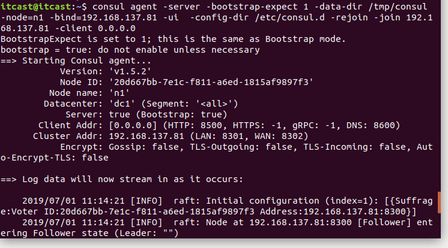
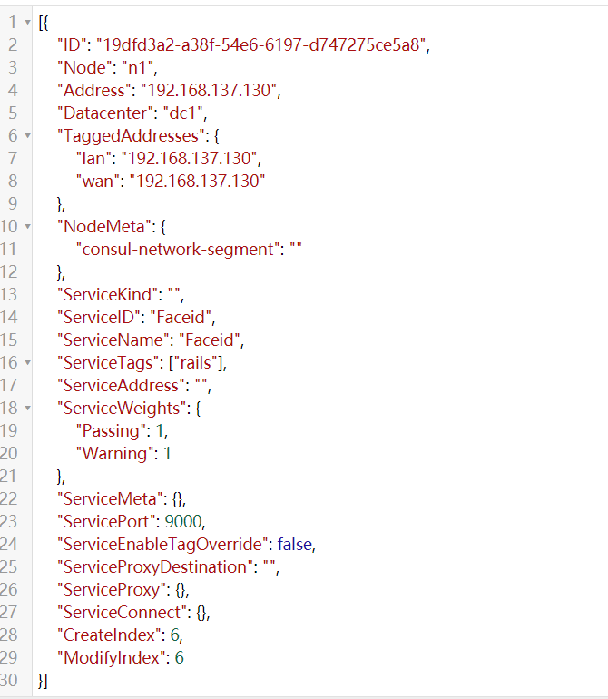

# go-micro框架

在了解go-micro之前，我们先来了解一下什么是micro。

Micro是一个专注于简化分布式系统开发的微服务生态系统。由开源库和工具组成。主要包含以下几种库：

+ **go-micro：**用于编写微服务的可插入Go-RPC框架;	**服务发现**，客户端/服务器rpc，pub/sub等，是整个Micro的核心。

  > 默认使用mdns做服务发现，可以在插件中替换成consul,etcd,k8s等
  >
  > 组播   广播

+ **go-plugins：**go-micro的插件，包括etcd，kubernetes(k8s)，nats，rabbitmq，grpc等 

+ **micro：**一个包含传统入口点的微服务工具包; API网关，CLI，Slack Bot，Sidecar和Web UI。

其他各种库和服务可以在**github.com/micro**找到。

我们主要使用的框架也是go-micro，在使用之前我们先来了解一下**服务发现**是个什么东西？有什么作用？

# consul服务发现

我们在做微服务开发的时候，客户端的一个接口可能需要调用N个服务，客户端必须知道所有服务的网络位置（ip+port），如下图所示


以往的做法是把服务的地址放在配置文件活数据库中，这样就有以下几个问题：

+ 需要配置N个服务的网络位置，加大配置的复杂性
+ 服务的网络位置变化，需要改变每个调用者的配置
+ 集群的情况下，难以做负载（反向代理的方式除外）

总结起来一句话：**服务多了，配置很麻烦，问题一大堆**

所以现在就选择**服务发现**来解决这些问题。我们来看一下，服务发现如何解决这个问题，具体设计如下：


与之前解决方法不同的是，加了个服务发现模块。服务端把当前自己的网络位置注册到服务发现模块（这里注册的意思就是告诉），服务发现就以K-V的方式记录下，K一般是服务名，V就是IP:PORT。服务发现模块定时的轮询查看这些服务能不能访问的了（这就是健康检查）。客户端在调用服务A-N的时候，就跑去服务发现模块问下它们的网络位置，然后再调用它们的服务。这样的方式是不是就可以解决上面的问题了呢？客户端完全不需要记录这些服务的网络位置，客户端和服务端完全解耦！

常见的服务发现框架有：Etcd、Eureka、**Consul**、Zookeeper

这里我们选择go-micro默认的服务发现框架consul来做一个详细介绍。

# 了解consul并使用

Consul是HashiCorp公司推出的开源工具，用于实现分布式系统的服务发现与配置。包含多个组件,但是作为一个整体,为你的基础设施提供服务发现和服务配置的工具.他提供以下关键特性:

**服务发现**：consul通过DNS或者HTTP接口使服务注册和服务发现变的很容易，一些外部服务，例如saas提供的也可以一样注册。

**健康检查**：健康检测使consul可以快速的告警在集群中的操作。和服务发现的集成，可以防止服务转发到故障的服务上面。(心跳机制)

**键/值存储**：一个用来存储动态配置的系统。提供简单的HTTP接口，可以在任何地方操作。

**多数据中心**：无需复杂的配置，即可支持任意数量的区域。

> 官方建议：最好是三台或者三台以上的consul在运行，同名服务最好是三台或三台以上，默认可以搭建集群

## 1 consul安装

​	Consul用Golang实现，因此具有天然可移植性 (支持 Linux、windows和macOS)。安装包仅包含一个可执行文件。 Consul安装非常简单，只需要下载对应系统的软件包并解压后就可使用。

安装步骤如下：

```shell
# 这里以 ubuntu系统为例：
$ wget https://releases.hashicorp.com/consul/1.5.2/consul_1.5.2_linux_amd64.zip
$ unzip consul_1.5.2_linux_amd64.zip
$ sudo mv consul /usr/local/bin/
```

> 教室网速原因，用老师给的离线包解压即可
>
> 其他系统版本可以在这里下载：https://www.consul.io/downloads.html

安装验证：

安装 Consul后，通过执行 consul命令，你可以看到命令列表的输出


> 没有报错就成功了


## 2 consul的命令行

consul安装好之后，我们来使用一下吧。首先我们来看一下consul都有哪些命令。使用命令`consul -h`可以查看consul支持的所有参数，而且每个参数里面还支持其他参数，下面我们来具体看看。

**agent：**指令是consul的核心，它运行agent来维护成员的重要信息、运行检查、服务宣布、查询处理等等。

```shell
==> Usage: consul agent [options]
  Starts the Consul agent and runs until an interrupt is received. The
  agent represents a single node in a cluster.
Options:
  -advertise=addr                  Sets the advertise address to use
  -advertise-wan=addr              Sets address to advertise on wan instead of
                                   advertise addr
  -bootstrap                       Sets server to bootstrap mode
  -bind=0.0.0.0                    Sets the bind address for cluster
                                   communication
  -http-port=8500                  Sets the HTTP API port to listen on
  -bootstrap-expect=0              Sets server to expect bootstrap mode.
  -client=127.0.0.1                Sets the address to bind for client access.
                                   This includes RPC, DNS, HTTP and HTTPS (if
                                   configured)
  -config-file=foo                 Path to a JSON file to read configuration
                                   from. This can be specified multiple times.
  -config-dir=foo                  Path to a directory to read configuration
                                   files from. This will read every file ending
                                   in ".json" as configuration in this
                                   directory in alphabetical order. This can be
                                   specified multiple times.
  -data-dir=path                   Path to a data directory to store agent
                                   state
  -dev                             Starts the agent in development mode.
  -recursor=1.2.3.4                Address of an upstream DNS server.
                                   Can be specified multiple times.
  -dc=east-aws                     Datacenter of the agent (deprecated: use
                                   'datacenter' instead).
  -datacenter=east-aws             Datacenter of the agent.
  -encrypt=key                     Provides the gossip encryption key
  -join=1.2.3.4                    Address of an agent to join at start time.
                                   Can be specified multiple times.
  -join-wan=1.2.3.4                Address of an agent to join -wan at start
                                   time. Can be specified multiple times.
  -retry-join=1.2.3.4              Address of an agent to join at start time
                                   with retries enabled. Can be specified
                                   multiple times.
  -retry-interval=30s              Time to wait between join attempts.
  -retry-max=0                     Maximum number of join attempts. Defaults to
                                   0, which will retry indefinitely.
  -retry-join-ec2-region           EC2 Region to use for discovering servers to
                                   join.
  -retry-join-ec2-tag-key          EC2 tag key to filter on for server
                                   discovery
  -retry-join-ec2-tag-value        EC2 tag value to filter on for server
                                   discovery
  -retry-join-gce-project-name     Google Compute Engine project to discover
                                   servers in
  -retry-join-gce-zone-pattern     Google Compute Engine region or zone to
                                   discover servers in (regex pattern)
  -retry-join-gce-tag-value        Google Compute Engine tag value to filter
                                   for server discovery
  -retry-join-gce-credentials-file Path to credentials JSON file to use with
                                   Google Compute Engine
  -retry-join-wan=1.2.3.4          Address of an agent to join -wan at start
                                   time with retries enabled. Can be specified
                                   multiple times.
  -retry-interval-wan=30s          Time to wait between join -wan attempts.
  -retry-max-wan=0                 Maximum number of join -wan attempts.
                                   Defaults to 0, which will retry
                                   indefinitely.
  -log-level=info                  Log level of the agent.
  -node=hostname                   Name of this node. Must be unique in the
                                   cluster
  -node-meta=key:value             An arbitrary metadata key/value pair for
                                   this node.
                                   This can be specified multiple times.
  -protocol=N                      Sets the protocol version. Defaults to
                                   latest.
  -rejoin                          Ignores a previous leave and attempts to
                                   rejoin the cluster.
  -server                          Switches agent to server mode.
  -syslog                          Enables logging to syslog
  -ui                              Enables the built-in static web UI server
  -ui-dir=path                     Path to directory containing the Web UI
                                   resources
  -pid-file=path                   Path to file to store agent PID
```

**info：**指令提供了各种操作时可以用到的debug信息，对于client和server，info有返回不同的子系统信息，目前有以下几个KV信息：agent(提供agent信息)，consul(提供consul库的信息)，raft(提供raft库的信息)，serf_lan(提供LAN gossip pool),serf_wan(提供WAN gossip pool)

**leave：**指令触发一个优雅的离开动作并关闭agent，节点离开后不会尝试重新加入集群中。运行在server状态的节点，节点会被优雅的删除，这是很严重的，在某些情况下一个不优雅的离开会影响到集群的可用性。

**members：**指令输出consul agent目前所知道的所有的成员以及它们的状态，节点的状态只有alive、left、failed三种状态。

> -detailed：输出每个节点更详细的信息。
> -rpc-addr：一个rpc地址，agent可以链接上来发送命令，如果没有指定，默认是127.0.0.1:8400。
> -status：过滤出符合正则规则的节点

**reload：**指令可以重新加载agent的配置文件。SIGHUP指令在重新加载配置文件时使用，任何重新加载的错误都会写在agent的log文件中，并不会打印到屏幕。

## 3 consul简单使用

首先我们要运行consul，运行有两种模式，分别是==server==和==client==，通过下面的命令开启：

```shell
consul agent -server
consul agent 
```

每个数据中心至少必须拥有一个server。一个client是一个非常轻量级的进程.用于注册服务,运行健康检查和转发对server的查询.agent必须在集群中的每个主机上运行.

接着我们以server的模式启动一个consul：

### server模式启动

```shell
$ consul agent -server -bootstrap-expect 1 -data-dir /tmp/consul -node=n1 -bind=192.168.6.108 -ui -rejoin -config-dir=/etc/consul.d/ -client 0.0.0.0
```




> 需要先在/etc/下面创建consul.d目录
>
> - `-server` ： 定义agent运行在server模式
> - `-bootstrap-expect` ：在一个datacenter中期望提供的server节点数目，当该值提供的时候，consul一直等到达到指定sever数目的时候才会引导整个集群，该标记不能和bootstrap共用
> - `-bind`：该地址用来在集群内部的通讯，集群内的所有节点到地址都必须是可达的，默认是0.0.0.0
> - `-node`：节点在集群中的名称，在一个集群中必须是唯一的，默认是该节点的主机名
> - `-ui`： 启动web界面  :8500
> - `-rejoin`：使consul忽略先前的离开，在再次启动后仍旧尝试加入集群中。
> - `-config-dir`：配置文件目录，里面所有以.json结尾的文件都会被加载
> - `-client`：consul服务侦听地址，这个地址提供HTTP、DNS、RPC等服务，默认是127.0.0.1所以不对外提供服务，如果你要对外提供服务改成0.0.0.0
> - `data-dir`：提供一个目录用来存放agent的状态，所有的agent允许都需要该目录，该目录必须是稳定的，系统重启后都继续存在

### **client模式启动**

```shell
$ consul agent -data-dir /tmp/consul -node=n2 -bind=192.168.137.82 -config-dir /etc/consul.d -rejoin -join 192.168.137.81
```

> 运行cosnul agent以client模式，-join 加入到已有的集群中去。

### **查看consul成员**

```shell
$ consul members
#节点  网络地址                状态     类型     版本   协议       数据中心  分管部分 
Node  Address                Status  Type    Build  Protocol  DC   Segment

n1    192.168.137.130:8301   alive   server  1.1.0  2         dc1  <all>
n3    192.168.137.81:8301    alive   client  1.1.0  2         dc1  <default>
```

### **停止agent**

你可以使用Ctrl-C 优雅的关闭Agent. 中断Agent之后你可以看到他离开了集群并关闭.

​	在退出中,Consul提醒其他集群成员,这个节点离开了.如果你强行杀掉进程.集群的其他成员应该能检测到这个节点失效了.当一个成员离开,他的服务和检测也会从目录中移除.当一个成员失效了,他的健康状况被简单的标记为危险,但是不会从目录中移除.Consul会自动尝试对失效的节点进行重连.允许他从某些网络条件下恢复过来.离开的节点则不会再继续联系.

​	此外,如果一个agent作为一个服务器,一个优雅的离开是很重要的,可以避免引起潜在的可用性故障影响达成一致性协议.
consul优雅的退出：

```shell
$ consul leave
```

### **注册服务**

搭建好conusl集群后，用户或者程序就能到consul中去查询或者注册服务。可以通过提供服务定义文件或者调用HTTP API来注册一个服务.

这里我们使用定义服务文件来注册一个服务:

```json
{"service": {
    "name": "Faceid",
    "tags": ["rails"],
    "port": 9000
	}
}
```

> 服务定义文件在我们的配置目录下面，`/etc/consul.d/`，文件都是以.json结尾。

注册完服务之后，我们重启consul，


> 红圈里面的就是表示agent从配置文件中载入了服务定义,并且成功注册到服务目录.
>
> 如果需要注册多个服务，就需要创建多个服务定义文件。

### **查询服务**

一旦agent启动并且服务同步了.我们可以通过DNS或者HTTP的API来查询服务.这里我们通过HTTP来查询服务：

```shell
$ curl -s 127.0.0.1:8500/v1/catalog/service/faceid
```

得到一串json数据，不过格式不够清晰，拷贝到在线json格式解析器中，如下所示：



我们还可以打开web页面，查看注册的服务。默认consul对应的端口是8500，在浏览器输入地址`localhost:8500`


也能看到我们注册的服务。

### **健康检查**

健康检查是服务发现的关键组件.预防使用到不健康的服务.和服务注册类似,一个检查可以通过检查定义或HTTP API请求来注册.我们将使用和检查定义来注册检查.和服务类似,因为这是建立检查最常用的方式.

在/etc/consul.d/目录下面创建文件web2.json,内容如下：

```json
{"service": {
    "name": "web",
    "tags": ["extract", "verify", "compare", "idcard"],
    "address": "192.168.137.130",
    "port": 9000,
    "check": {
        "id": "api",
        "name": "HTTP API on port 9000",
        "http": "http://localhost:9000",
        "interval": "10s",
        "timeout": "1s"
        }
   }
}
```

> 这时候我们没有开启这个服务，所以这个时候健康检查会出错。打开web界面，如下

consul做健康检查的必须是**Script、HTTP、TCP、TTL**中的一种。

**Script类型需要提供Script脚本和interval变量。**具体配置如下：

```json
{  
  "check": {  
    "id": "mem-util",  
    "name": "Memory utilization",  
    "script": "/usr/local/bin/check_mem.py",  
    "interval": "10s",  
    "timeout": "1s"  
  }  
} 
```

> 通过执行外部应用进行健康检查：这种外部程序具有退出代码，并可能产生一些输出；脚本按照指预置时间间隔来调用（比如，每30秒调用一次），类似于Nagios插件系统，脚本输出限制在4K以内，输出大于4K将截断。默认情况下，脚本超时时间为30秒——可通过timeout来配置。

**HTTP类型必须提供http和Interval字段。**具体代码如下：

```json
{  
  "check": {  
    "id": "api",  
    "name": "HTTP API on port 5000",  
    "http": "http://localhost:5000/health",  
    "interval": "10s",  
    "timeout": "1s"  
  }  
}  
```

> 这种检查将按照预设的时间间隔创建一个HTTP “get”请求。HTTP响应代码来标示服务所处状态：任何2xx代码视为正常，429表示警告——有很多请求；其他值表示失败。
>
> 这种类型的检查应使用curl或外部程序来处理HTTP操作。默认情况下，HTTP Checks中，请求超时时间等于调用请求的间隔时间，最大10秒。有可能使用客制的HTTP check，可以自由配置timeout时间，输出限制在4K以内，输出大于4K将截断。

**TCP类型需要提供tcp和Interval字段。**具体代码如下：

```json
{  
  "check": {  
    "id": "ssh",  
    "name": "SSH TCP on port 22",  
    "tcp": "localhost:22",  
    "interval": "10s",  
    "timeout": "1s"  
  }  
}  
```

> 这种检查将按照预设的时间间隔与指定的IP/Hostname和端口创建一个TCP连接。服务的状态依赖于TCP连接是否成功——如果连接成功，则状态是“success”；否则状态是“critical”。如果一个Hostname解析为一个IPv4和一个IPv6，将尝试连接这两个地址，第一次连接成功则服务状态是“success”。默认情况下，TCP checks中，请求超时时间等于调用请求的间隔时间，最大10秒。也是可以自由配置的。

**TTL（**Timeto Live生存时间**）类型只需提供ttl**，具体配置如下：

```json
{  
  "check": {  
    "id": "web-app",  
    "name": "Web App Status",  
    "notes": "Web app does a curl internally every 10 seconds",  
    "ttl": "30s"  
  }  
}  
```

> 这种checks为给定TTL保留了最后一种状态，checks的状态必须通过HTTP接口周期性更新，如果外部接口没有更新状态，那么状态就会被认定为不正常。 TTL checks同时会将其最后已知状态更新至磁盘，这允许Agent通过重启后恢复到已知的状态。通过TTL端上一次check来维持健康状态的有效性。


我们也可以通过页面来查看,在浏览器输入网址：http://192.68.130.137:8500


其他更多consul功能，我们可以参考http://www.liangxiansen.cn/2017/04/06/consul/


## 4 consul和grpc结合使用

学完了consul命令行的使用，接着我们来看一下，在代码中如何通过，这里我们用grpc和consul结合使用。

我们操作consul使用的是github.com/hashicorp/consul/包，我们先来下载一下，命令如下：

```shell
$ go get -u -v github.com/hashicorp/consul
```

然后我们先注册一个服务到consul上：

### **把grpc服务注册到consul上**

代码如下：

```go
func main(){
    //初始化consul配置
	consulConfig := api.DefaultConfig()

	//获取consul操作对象
	registry,_ := api.NewClient(consulConfig)

	//注册服务,服务的常规配置
	registerService := api.AgentServiceRegistration{
		ID:"1",
		Tags:[]string{"testHello"},
		Name:"HelloService",
		Port:8080,
		Address:"192.168.137.130",
		Check:&api.AgentServiceCheck{
			TCP:"192.168.137.130:8080",
			Timeout:"5s",
			Interval:"5s",
		},
	}
	//注册服务到consul上
	registry.Agent().ServiceRegister(&registerService)
    
    //获取grpc服务端对象
	grpcServer := grpc.NewServer()
    
    //注册grpc服务
	pb.RegisterHelloServiceServer(grpcServer,new(HelloService))

    //设置服务端监听
	lis,err := net.Listen("tcp",":1234")
	if err != nil {
		panic(err)
	}
    //在指定端口上提供grpc服务
	grpcServer.Serve(lis)
}
```

### **服务发现**

```go
func main(){
    //初始化consul配置, 客户端服务器需要一致
	consulConfig := api.DefaultConfig()
    
    //获取consul操作对象
    registerClient,_ := api.NewClient(consulConfig)

	//获取地址
	serviceEntry,_,_ :=registerClient.Health().Service("HelloService","testHello",false,&api.QueryOptions{})

    //和grpc服务建立连接
	conn,err := grpc.Dial(serviceEntry[0].Service.Address+":"+strconv.Itoa(serviceEntry[0].Service.Port),grpc.WithInsecure())
	if err != nil {
		panic(err)
	}

	defer conn.Close()

	client := pb.NewHelloServiceClient(conn)
	reply, err := client.Hello(context.Background(),&pb.Person{Name:"lisi",Age:100})
	if err != nil {
		panic(err)
	}

	fmt.Println("reply,",reply)
}
```

### **注销服务**

```go
func main(){
	 //初始化consul配置,客户端服务器需要一致
	consulConfig := api.DefaultConfig()
    
    //获取consul操作对象
    registerClient,_ := api.NewClient(consulConfig)


	//注销服务
     client.Agent().ServiceDeregister("1")
}
```

> etcd、  zookeeper


# go-micro安装

做了这么久的铺垫，接着让我们来进入主题，go-micro的学习，首先我们先来安装一下go-micro开发环境。安装步骤如下：

```shell
#安装go-micro
go get -u -v github.com/micro/go-micro
#安装工具集
go get -u -v github.com/micro/micro
#安装protobuf插件
go get -u github.com/golang/protobuf/{proto,protoc-gen-go}
go get -u github.com/micro/protoc-gen-micro
```

或者通过docker镜像安装：

```shell
$ docker pull microhq/micro
```

安装之后输入micro命令，显示如下就证明安装成功


接着我们来看一下go-micro的使用。


# go-micro使用

首先我们先来创建一个go micro框架的项目，我们使用micro命令，可以创建微服务，web项目等，具体用法如下：

```shell
new		Create a new Micro service by specifying a directory path relative to your $GOPATH
#创建	通过指定相对于$GOPATH的目录路径，创建一个新的微服务。

USAGE:
#用法
micro new [command options][arguments...]
#指定服务的命名空间
--namespace "go.micro"	Namespace for the service e.g com.example
#服务类型，可以是微服务srv,或者web项目,或者api等						
--type "srv"			Type of service e.g api, fnc, srv, web
#服务的正式完整定义						
--fqdn 					FQDN of service e.g com.example.srv.service (defaults to namespace.type.alias)
#别名是在指定时作为组合名的一部分使用的短名称  别名						
--alias 				Alias is the short name used as part of combined name if specified

```

我们常用的就是创建微服务和web项目，如下：

**创建一个web项目**

```shell
micro new --type "web" micro/rpc/web
Creating service go.micro.web.web in /home/itcast/go/src/micro/rpc/web
.
#主函数
├── main.go 
#插件文件
├── plugin.go
#被调用处理函数
├── handler
│   └── handler.go
#前端页面
├── html
│   └── index.html
#docker生成文件
├── Dockerfile
├── Makefile
└── README.md

#编译后将web端呼叫srv端的客户端连接内容修改为srv的内容
#需要进行调通
```

打开我们web项目下的main.go文件，内容如下：

```go
package main

import (
    "github.com/micro/go-log"
	"net/http"
    "github.com/micro/go-web"
    "micro/rpc/web/handler"
)

func main() {
	// 创建1个web服务
        service := web.NewService(
           //注册服务名
                web.Name("go.micro.web.web"),
            //服务的版本号
                web.Version("latest"),
                //！添加端口
                web.Address(":8080"),
        )

	//服务进行初始化
        if err := service.Init(); err != nil {
                log.Fatal(err)
        }

	//处理请求  / 的路由   //当前这个web微服务的 html文件进行映射
	service.Handle("/", http.FileServer(http.Dir("html")))

	//处理请求 /example/call  的路由   这个相应函数 在当前项目下的handler
	service.HandleFunc("/example/call", handler.ExampleCall)

	//运行服务
        if err := service.Run(); err != nil {
                log.Fatal(err)
        }
}
```

接着我们再来看一下我们重点需要操作的文件，handle.go,内容如下：

```go
package handler

import (
	"context"
	"encoding/json"
	"net/http"
	"time"

	"github.com/micro/go-micro/client"
    //将srv中的proto的文件导入进来进行通信的使用
	example "micro/rpc/srv/proto/example"
)
//相应请求的业务函数
func ExampleCall(w http.ResponseWriter, r *http.Request) {
	// 将传入的请求解码为json
	var request map[string]interface{}
	if err := json.NewDecoder(r.Body).Decode(&request); err != nil {
		http.Error(w, err.Error(), 500)
		return
	}

	// 调用服务
    //替换掉原有的服务名
    //通过服务名和
	exampleClient := example.NewExampleService("go.micro.srv.srv", client.DefaultClient)
	rsp, err := exampleClient.Call(context.TODO(), &example.Request{
		Name: request["name"].(string),
	})
	if err != nil {
		http.Error(w, err.Error(), 500)
		return
	}

	// we want to augment the response
	response := map[string]interface{}{
		"msg": rsp.Msg,
		"ref": time.Now().UnixNano(),
	}

	// encode and write the response as json
	if err := json.NewEncoder(w).Encode(response); err != nil {
		http.Error(w, err.Error(), 500)
		return
	}
}

```

**创建微服务**

```shell
$micro new --type "srv" t1/t1
#"srv" 是表示当前创建的微服务类型
#micro是相对于go/src下的文件夹名称 可以根据项目进行设置 
#srv是当前创建的微服务的文件名
Creating service go.micro.srv.srv in /home/itcast/go/src/t1/t1

.
#主函数存放位置
├── main.go
#插件
├── plugin.go
#服务提供函数的实现
├── handler
│   └── example.go
#订阅服务
├── subscriber
│   └── example.go
#proto协议
├── proto/example
│   └── example.proto
#docker生成文件
├── Dockerfile
#编译文件
├── Makefile
└── README.md

#插件提示，已安装，可忽略
download protobuf for micro:

brew install protobuf
go get -u github.com/golang/protobuf/{proto,protoc-gen-go}
go get -u github.com/micro/protoc-gen-micro

compile the proto file example.proto:

cd /home/itcast/go/src/micro/rpc/srv
protoc --proto_path=. --go_out=. --micro_out=. proto/example/example.proto
```

我们来看一下微服务中的main.go文件：

```go
package main

import (
        "github.com/micro/go-micro/util/log"
        "github.com/micro/go-micro"
        "t1/t1/handler"
        "t1/t1/subscriber"

        t1 "t1/t1/proto/t1"
)

func main() {
        // 创建一个micro服务
        service := micro.NewService(
                micro.Name("go.micro.srv.t1"),
                micro.Version("latest"),
        )

        // 初始化服务
        service.Init()

        // 注册服务
        t1.RegisterT1Handler(service.Server(), new(handler.T1))

        // 注册一个发布器
        micro.RegisterSubscriber("go.micro.srv.t1", service.Server(), new(subscriber.T1))

        // 注册一个函数到发布器
        micro.RegisterSubscriber("go.micro.srv.t1", service.Server(), subscriber.Handler)

        // 运行服务
        if err := service.Run(); err != nil {
                log.Fatal(err)
        }
}
```

默认情况下，go micro框架使用的是自己封装的rpc通信，这里我们可以替换成grpc，代码如下：

```go
package main

import (
        "github.com/micro/go-micro/util/log"
        "github.com/micro/go-micro"
        "t1/t1/handler"
        "t1/t1/subscriber"
		"github.com/micro/go-grpc"//go micro内嵌了grpc框架
        t1 "t1/t1/proto/t1"
)

func main() {
        // 创建一个micro服务
        service := grpc.NewService(
                micro.Name("go.micro.srv.t1"),
                micro.Version("latest"),
        )

        // 初始化服务
        service.Init()

        // 注册服务
        t1.RegisterT1Handler(service.Server(), new(handler.T1))

        // 注册一个发布器
        micro.RegisterSubscriber("go.micro.srv.t1", service.Server(), new(subscriber.T1))

        // 注册一个函数到发布器
        micro.RegisterSubscriber("go.micro.srv.t1", service.Server(), subscriber.Handler)

        // 运行服务
        if err := service.Run(); err != nil {
                log.Fatal(err)
        }
}
```


**服务发现：**

在go-micro包中，共有4种注册实现consul、gossip、mdns、memory，前两个都是基于hashicorp公司的协议，mdns则是基于组网广播实现，memory则是本地实现。

consul 依赖hashicorp的组件，但是功能强大、完整
gossip 基于SWIM协议广播，零依赖
mdns 轻量、零依赖，但是对环境有要求，某些环境不支持mdns的无法正常使用
memory 本地解决方案，不可跨主机访问
另外在go-plugins中有其它注册实现，比如etcd、eureka、k8s、nats、zk等等


大体解释下接口中每个方法的作用

- Init 初始化
- Options 获取配置选项
- Register 注册服务
- Deregister 卸载服务
- GetService 获取指定服务
- ListServices 列出所有服务
- Watch watcher 负责侦听变动
- String 注册信息转成字符串描述

```go
package main

import (
        "github.com/micro/go-micro/util/log"
        "github.com/micro/go-micro"
        "t1/t1/handler"
        "t1/t1/subscriber"
		"github.com/micro/go-grpc"
        "github.com/micro/go-micro/registry/consul"
        "github.com/micro/go-micro/registry"
        t1 "t1/t1/proto/t1"
)

func main() {
        //初始化服务发现
        reg := consul.NewRegistry(func(options *registry.Options) {
                options.Addrs = []string{
                        "192.168.137.130:8500",
                }
        })

    
        // 创建一个micro服务
        service := grpc.NewService(
                micro.Name("go.micro.srv.t1"),
                micro.Version("latest"),
            	micro.Registry(reg),
        )

        // 初始化服务
        service.Init()

        // 注册服务
        t1.RegisterT1Handler(service.Server(), new(handler.T1))

        // 注册一个发布器
        micro.RegisterSubscriber("go.micro.srv.t1", service.Server(), new(subscriber.T1))

        // 注册一个函数到发布器
        micro.RegisterSubscriber("go.micro.srv.t1", service.Server(), subscriber.Handler)

        // 运行服务
        if err := service.Run(); err != nil {
                log.Fatal(err)
        }
}
```

## 

