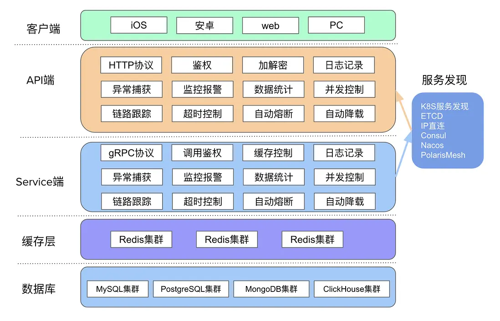
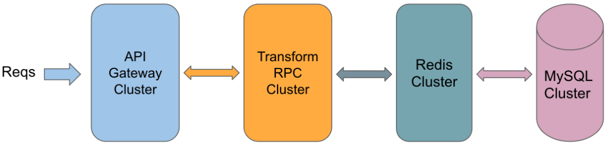
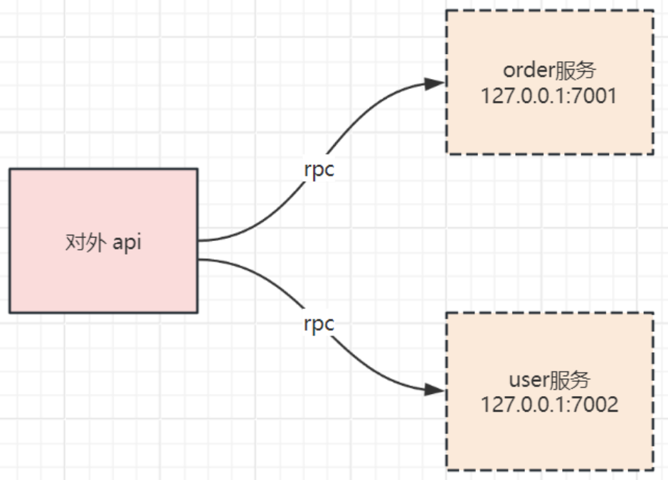
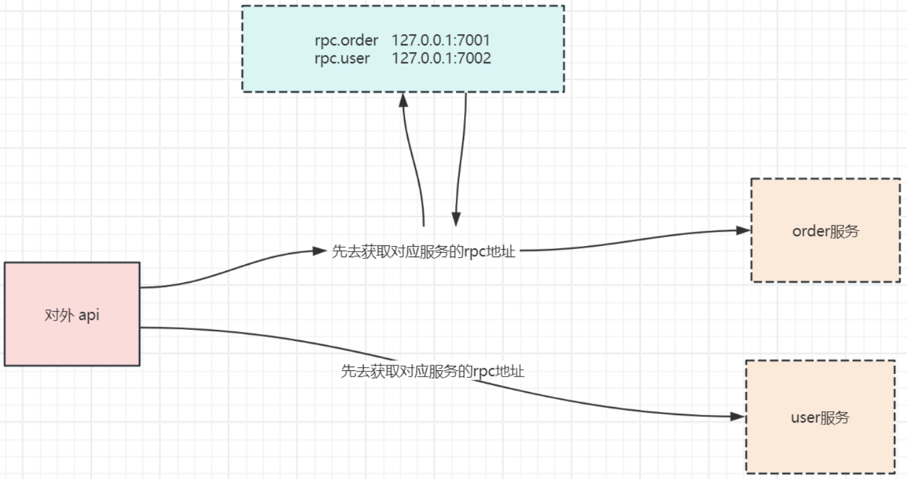
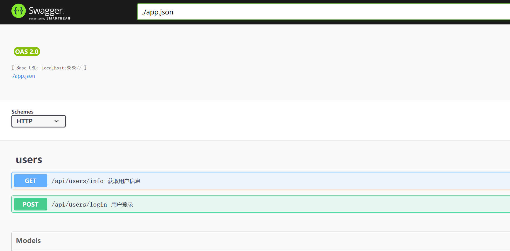
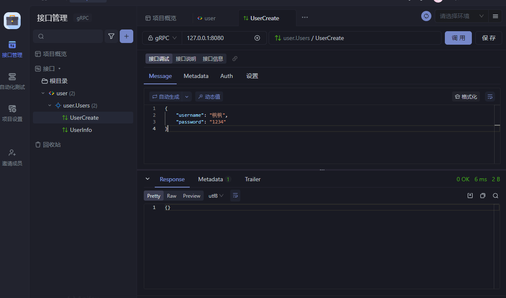
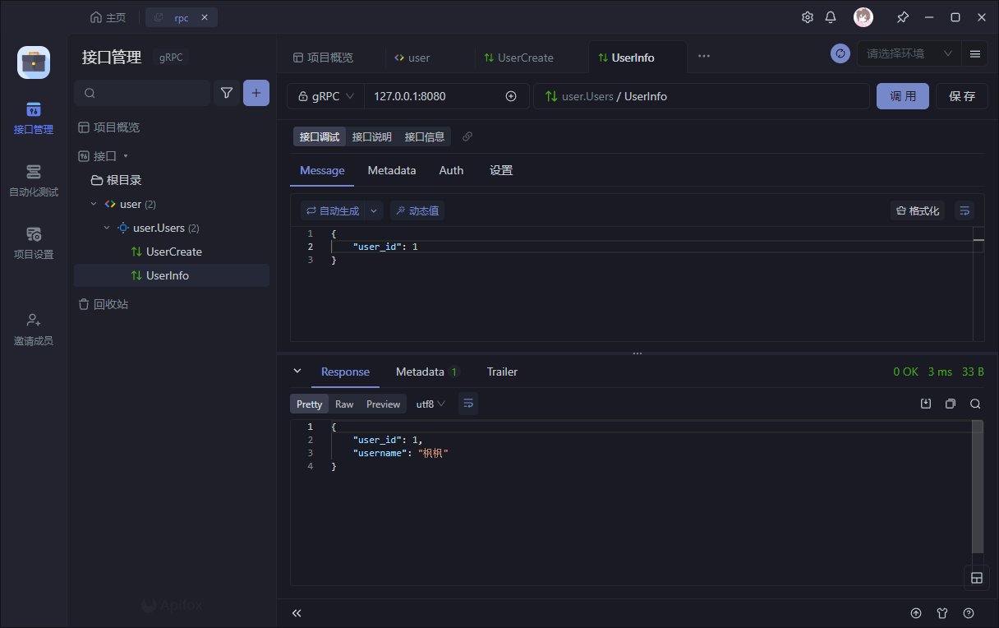
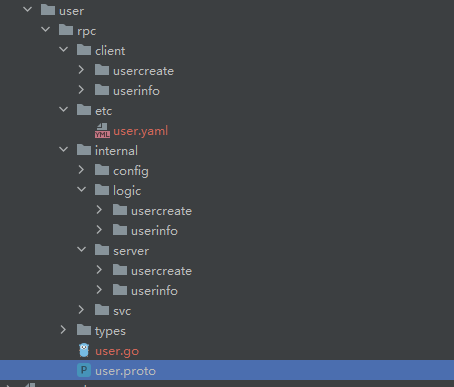
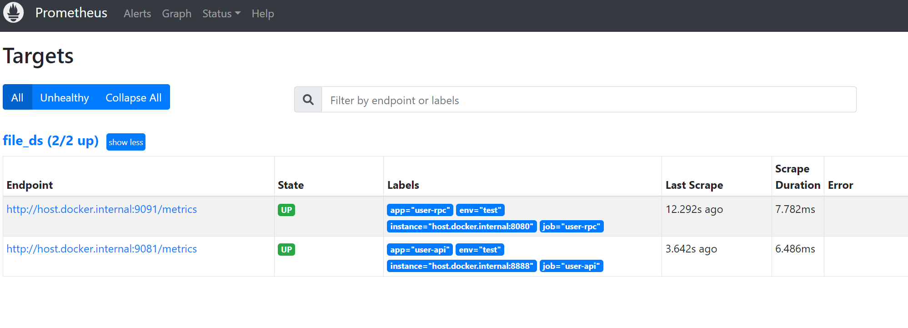
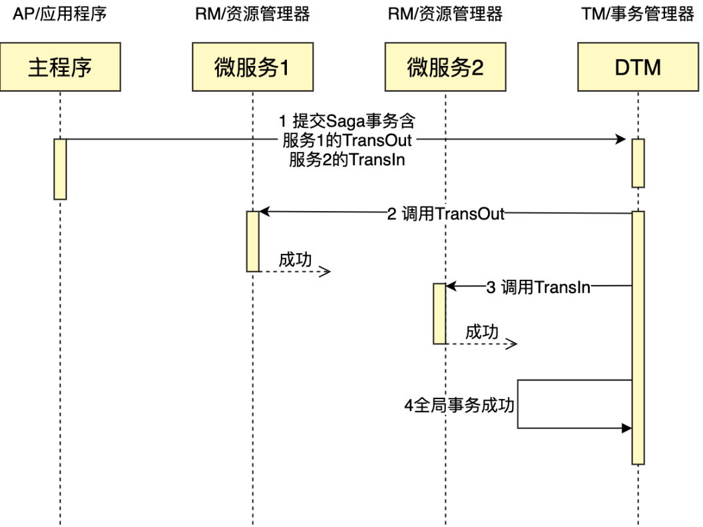

[go-zero-looklook · go-zero实践项目](https://github.com/Mikaelemmmm/go-zero-looklook/blob/main/README-cn.md)

# go-zero介绍

官网：https://go-zero.dev/ | [go-zero Documentation](https://go-zero.dev/docs/tutorials)

go-zero 是一个集成了各种工程实践的 web 和 rpc 框架。通过弹性设计保障了大并发服务端的稳定性，经受了充分的实战检验。

整体架构图如下



**go-zero安装**

[环境搭建参考文档](https://blog.csdn.net/xwh3165037789/article/details/131577365) | [官方参考文档](https://go-zero.dev/docs/tasks/installation/goctl) 

安装goctl脚手架

```sh
go install github.com/zeromicro/go-zero/tools/goctl@latest
```

安装protoc，通过脚手架安装

```sh
goctl env check --install --verbose --force
```

项目中安装go-zero库
```
go get -u github.com/zeromicro/go-zero@latest
```

# 短链微服务架构图

 

- 这里只用了 `Transform RPC` 一个微服务，并不是说 API Gateway 只能调用一个微服务，只是为了最简演示 API Gateway 如何调用 RPC 微服务而已
- 在真正项目里要尽可能每个微服务使用自己的数据库，数据边界要清晰

# 创建api接口--api Gateway

api接口是对外提供的地址

## 生成 API 代码

通过goctl脚手架快速生成，在 `shorturl/api` 目录下通过 goctl 生成 `api/shorturl.api`文件：

```sh
goctl api -o shorturl.api
```

生成代码文件 `api/shorturl.api`，内容为如下：

```go
type ( // type 用法和 go 一致
  expandReq {
    shorten string `form:"shorten"`
  }

  expandResp {
    url string `json:"url"`
  }
)

service shorturl-api { // 定义 HTTP 服务
  @server( 				// 部分用来定义 server 端用到的属性
    handler: ShortenHandler	// 定义api端 服务接口名
  )
  get /shorten (shortenReq) returns(shortenResp) // 定义了 get 方法的路由、请求参数、返回参数等
}
```

在 api 目录下，使用 goctl 生成 API Gateway 代码

```
goctl api go -api shorturl.api -dir .
```

## 通过.api文件生成api服务

```sh
goctl api new api
```

api服务目录结构：

```go
├── api // 单个服务目录，一般是某微服务名称。这里示例为 api Gateway
│   ├── etc // etc：静态配置文件目录
│   │   └── shorturl-api.yaml         // 存放配置信息的文件
│   ├── internal // internal：单个服务 内部文件，其可见范围仅限当前服务
│   │   ├── config // config：静态配置文件对应的结构体声明目录
│   │   │   └── config.go             // 使用etc/yaml配置文件的结构体代码
│   │   ├── handler // handler：可选，一般 http 服务会有这一层做路由管理，handler 为固定后缀
│   │   │   ├── expandhandler.go      // 处理请求的handler
│   │   │   ├── routes.go             // 定义路由处理
│   │   │   └── shortenhandler.go     // 实现 shortenHandler
│   │   ├── logic // logic：业务目录，所有业务编码文件都存放在这个目录下面，logic 为固定后缀
│   │   │   ├── expandlogic.go        // 实现 ExpandLogic
│   │   │   └── shortenlogic.go       // 实现 ShortenLogic
│   │   ├── svc // svc：依赖注入目录，所有 logic 层需要用到的依赖都要在这里进行显式注入
│   │   │   └── servicecontext.go     // 定义 ServiceContext
│   │   └── types // types：通过.api文件生成的结构体存放目录
│   │       └── types.go              // 定义请求、返回结构体
│   ├── shorturl.api
│   └── shorturl.go                   // main 入口定义
├── go.mod
└── go.sum
```

然后需要实现逻辑，user/api/internal/logic/apilogic.go文件

```go
func (l *ApiLogic) Api(req *types.Request) (resp *types.Response, err error) {
  // todo: add your logic here and delete this line
  return &types.Response{Message: "枫枫"}, nil
}
```

1、现在就可以启动api.go文件

```go
go run api.go -f etc/shorturl-api.yaml // -f 指定配置文件
```

> 如果发生报错，就在user/api/路劲下安装相应依赖go mod tidy

2、访问：

```go
curl http://127.0.0.1:8888/from/me
```

- 返回如下：

  ```sh
  HTTP/1.1 200 OK
  Content-Type: application/json; charset=utf-8
  Traceparent: 00-a9e12f21fa866a09fadf19a29c8d86cb-9d4be07f5c2c789a-00
  Date: Thu, 10 Aug 2023 02:06:20 GMT
  Content-Length: 4
  
  null%
  ```

  可以看到我们 API Gateway 其实啥也没干，就返回了个 null，接下来我们会在 rpc 服务里实现业务逻辑

- 可以修改 `internal/svc/servicecontext.go` 来传递服务依赖（如果需要）

- 实现逻辑可以修改 `internal/logic` 下的对应文件

- 可以通过 `goctl` 生成各种客户端语言的 api 调用代码

# 创建rpc服务--service

在 `rpc/transform` 目录下编写 `transform.proto` 文件

可以通过命令生成 proto 文件模板

```sh
goctl rpc -o transform.proto
```

文件内容如下：

```protobuf
syntax = "proto3";
package transform;
option go_package = "./transform";

message expandReq{
  string shorten = 1;
}

message expandResp{
  string url = 1;
}

service  transformer{ // 定义 transformer 服务
  rpc expand(expandReq) returns(expandResp);
}
```

用 `goctl` 生成 rpc 代码，在 `rpc/transform` 目录下执行命令

```sh
goctl rpc protoc transform.proto --go_out=. --go-grpc_out=. --zrpc_out=.
```

## 通过.proto文件生成rpc服务

**快速创建一个rpc服务**

```sh
goctl rpc new rpc
```

文件结构如下：

```protobuf
rpc/transform
├── etc
│   └── transform.yaml              // 配置文件
├── internal
│   ├── config
│   │   └── config.go               // 配置定义
│   ├── logic
│   │   ├── expandlogic.go          // expand 业务逻辑在这里实现
│   │   └── shortenlogic.go         // shorten 业务逻辑在这里实现
│   ├── server
│   │   └── transformerserver.go    // 调用入口, 不需要修改
│   └── svc
│       └── servicecontext.go       // 定义 ServiceContext，传递依赖
├── transform
│   ├── transform.pb.go
│   └── transform_grpc.pb.go
├── transform.go                    // rpc 服务 main 函数
├── transform.proto					// proto文件
└── transformer
    └── transformer.go              // 提供了外部调用方法，无需修改
```

然后需要实现逻辑，user/rpc/internal/logic/apilogic.go文件

```go
func (l *GetUserLogic) GetUser(in *user.IdRequest) (*user.UserResponse, error) {
	// todo: add your logic here and delete this line
	return &user.UserResponse{
		Id:     in.Id,
		Name:   "湖南省，长沙市",
		Gender: true,
	}, nil
}
```

1、启动 etcd server

2、启动 rpc 服务直接可以运行，如下：

```go
$ go run transform.go -f etc/transform.yaml  // -f 指定配置文件
Starting rpc server at 127.0.0.1:8080...
```

> 如果发生报错，就在user/api/路劲下安装相应依赖go mod tidy

3、查看服务是否注册，以下值为参考值，主要观察 etcd 有注册到 transform.rpc 的 key 和 8080 端口即可，各自机器的 ip 结果不一样。

```sh
$ ETCDCTL_API=3 etcdctl get transform.rpc --prefix
transform.rpc/7587872530397098244
192.168.3.37:8080
```

# 将api 和 rpc服务连通

1、修改配置文件 `shorturl-api.yaml`，增加如下内容

```yaml
Transform: // api服务名
  Etcd:
    Hosts:
      - localhost:2379 // 可配置多个地址
    Key: transform.rpc
```

通过 etcd 自动去发现可用的 transform 服务

2、修改 `shorturl/api/internal/config/config.go` 如下，增加 transform 服务依赖

```go
type Config struct {
  rest.RestConf
  Transform zrpc.RpcClientConf     // 手动代码，导入 rpc客户端配置
}
```

3、修改 `shorturl/api/internal/svc/servicecontext.go`，如下：

```go
type ServiceContext struct {
  Config    config.Config
  Transformer transformer.Transformer                                          // 手动代码,定义 rpc客户端
}

func NewServiceContext(c config.Config) *ServiceContext {
  return &ServiceContext{
    Config:    c,
    Transformer: transformer.NewTransformer(zrpc.MustNewClient(c.Transform)),  // 手动代码,实例化 rpc客户端
  }
}
```

通过 ServiceContext 在不同业务逻辑之间传递依赖

4、修改 `shorturl/api/internal/logic/expandlogic.go` 里的 `Expand` 方法，如下：

```go
func (l *ExpandLogic) Expand(req types.ExpandReq) (types.ExpandResp, error) {
  rpcResp, err := l.svcCtx.Transformer.Expand(l.ctx, &transformer.ExpandReq{ // 手动代码开始 
      Shorten: req.Shorten,
  })
  if err != nil {
      return nil, err
  }

  return &types.ExpandResp{ // 手动代码结束
      Url: rpcResp.Url,
  }, nil
}
```

通过调用 `transformer` 的 `Expand` 方法实现短链恢复到 url

5、修改 `shorturl/api/internal/logic/shortenlogic.go`，如下：

```go
func (l *ShortenLogic) Shorten(req types.ShortenReq) (types.ShortenResp, error) {
  rpcResp, err := l.svcCtx.Transformer.Shorten(l.ctx, &transformer.ShortenReq{ // 手动代码开始
      Url: req.Url,
  })
  if err != nil {
      return nil, err
  }

  return &types.ShortenResp{  // 手动代码结束
      Shorten: rpcResp.Shorten,
  }, nil
}
```

有的版本生成返回值可能是指针类型，需要自己调整下

通过调用 `transformer` 的 `Shorten` 方法实现 url 到短链的变换

至此，API Gateway 修改完成，虽然贴的代码多，但是其中修改的是很少的一部分，为了方便理解上下文，我贴了完整代码，接下来处理 CRUD+cache

# 3.etcd

Etcd是一个高可用的分布式键值存储系统，主要用于共享配置信息和服务发现。它采用Raft一致性算法来保证数据的强一致性，并且支持对数据进行监视和更新

## 为什么要用etcd

主要是用于微服务的配置中心，服务发现0



在对外api这个应用里面，怎么知道order服务的rpc地址呢？

写在配置文件里面？

如果服务的ip地址变化了怎么办？在传统的配置文件模式，修改配置文件，应用程序是需要重启才能解决的

所以etcd就是来做这个事情的



至于为什么不用redis，大家只需要记住，etcd的数据可靠性更强

## 安装

[windows安装 软件](https://github.com/etcd-io/etcd/releases) | [源码安装](https://blog.csdn.net/Mr_XiMu/article/details/127923827) | yum安装

```sh
apt-get install etcd
yum install etcd
```

docker安装

```sh
docker run --name etcd -d -p 2379:2379 -p 2380:2380 -e ALLOW_NONE_AUTHENTICATION=yes bitnami/etcd etcd 
```

## 基本命令

```go
etcdctl put name 张三 // 设置或更新值
etcdctl get name // 获取值
etcdctl get name --print-value-only // 只要value
etcdctl get --prefix name // 获取name前缀的键值对
etcdctl del name // 删除键值对
etcdctl watch name // 监听键的变化
```

## 参考文档

etcd windows安装 https://www.cnblogs.com/wujuntian/p/12837926.html

etcdctl指令 https://www.jianshu.com/p/67cbef492812

为什么用etcd https://www.elecfans.com/d/1890103.html


# 4.最简单的微服务demo

这个demo是：

rpc服务：一个user用户微服务，用户微服务就要提供一个方法，根据用户id返回用户信息

api服务：一个video视频微服务，video视频微服务需要提供一个http接口，用户查询一个视频的信息，并且把关联用户id的用户名也查出来

## user用户rpc服务

1、编写rpc的proto文件。user/rpc/user.proto

```protobuf
syntax = "proto3";
package user;
option go_package = "./user";

message IdRequest {
  string id = 1;
}

message UserResponse {
  string id = 1; // 用户id
  string name = 2; // 用户名称
  bool gender = 3; // 用户性别
}

service User {
  rpc getUser(IdRequest) returns(UserResponse);
}
```

生成代码

```sh
goctl rpc protoc user/rpc/user.proto --go_out=user/rpc/types --go-grpc_out=user/rpc/types --zrpc_out=user/rpc/
```

- `goctl rpc protoc`: 这部分指定了要使用 `goctl` 工具执行 RPC 服务的代码生成操作。
- `user/rpc/user.proto`: 这是指定的protobuf文件的路径和文件名。
- `--go_out=user/rpc/types`: 指定生成的Go 语言代码的输出路径`user/rpc/types` 中。
- `--go-grpc_out=user/rpc/types`: 指定生成 gRPC 服务端和客户端的 Go 语言代码的输出路径。
- `--zrpc_out=user/rpc/`:指定生成 zRPC 服务端和客户端的代码的输出路径。

2、修改go_zero_use\user\rpc\etc\user.yaml配置文件

```go
Name: user.rpc // rpc 服务名
ListenOn: 0.0.0.0:8080 // 监听地址端口
Etcd: // 配置连接Etcd的ip、端口
  Hosts:
  - 192.168.0.7:2379
  Key: user.rpc // 在etcd中配置 user-rpc服务的key
```

- 使用`go mod tidy`下载依赖--->go run user.go启动--->curl 访问

3、在 `user/rpc/internal/logic/getuserlogic.go` 填写必要的逻辑

```go
func (l *GetUserLogic) GetUser(in *user.IdRequest) (*user.UserResponse, error) {
  // todo: add your logic here and delete this line
  return &user.UserResponse{
    Id:     in.Id,
    Name:   "湖南省，长沙市",
    Gender: true,
  }, nil
}
```

## video视频api服务

1、创建api，video/api/video.api

```go
type (
  VideoReq {
    Id string `path:"id"`
  }

  VideoRes {
    Id   string `json:"id"`
    Name string `json:"name"`
  }
)
service video { // 服务名
  @handler getVideo // 函数名
  get /api/videos/:id (VideoReq) returns (VideoRes) // post请求方法, 访问路径， 请求参数，响应参数
}
```

生成代码

```go
E:\project_BackEnd\go_zero_use\> goctl api go -api video/api/video.api -dir video/api/
```

- `goctl api go`: 这个命令告诉 Goctl 工具我们要生成一个 Go 语言的 API 项目。
- `-api video/api/video.api`: 指定了API 接口定义文件的路径。这个接口定义文件描述了 API 的路由、请求参数、响应等信息。
- `-dir video/api/`: 指定了生成的项目目录。生成的项目会放在 `video/api/` 目录下。

2、添加user-rpc配置

因为要在video里面调用user的rpc服务，video/api/internal/config/config.go

```go
type Config struct {
  rest.RestConf
  UserRpc zrpc.RpcClientConf // 手动，添加user-rpc服务配置
}
```

3、完善服务依赖，video/api/internal/svc/servicecontext.go

```go
type ServiceContext struct {
  Config  config.Config
  UserRpc userclient.User // 手动，添加user-rpc服务，client端结构体
}

func NewServiceContext(c config.Config) *ServiceContext {
  return &ServiceContext{
    Config:  c,
    UserRpc: userclient.NewUser(zrpc.MustNewClient(c.UserRpc)), // 手动，返回user-rpc服务client实例
  }
}
```

4、添加yaml配置，video/api/etc/video.yaml

```go
Name: video // api 服务名
Host: 0.0.0.0 // 监听地址
Port: 8888
UserRpc: // 配置连接UserRpc的etcd
  Etcd: // 配置etcd的ip、端口
    Hosts:
      - 127.0.0.1:2379
    Key: user.rpc  // 配置在etcd中查找user-api服务的key
```

5、完善服务依赖，video/api/internal/logic/getvideologic.go

```go
func (l *GetVideoLogic) GetVideo(req *types.VideoReq) (resp *types.VideoRes, err error) {
  // 手动，video-api端调用user-rpc端服务函数
  user1, err := l.svcCtx.UserRpc.GetUser(l.ctx, &user.IdRequest{ Id: "1" })
  if err != nil {
    return nil, err
  }
  return &types.VideoRes{
    Id:   req.Id,
    Name: user1.Name,
  }, nil
}
```

## 服务启动

```sh
go run user\rpc\user.go -f user\rpc\etc\user.yaml 	# 运行user rpc
go run video\api\video.go -f video\api\etc\video.yaml # 运行video api
```

测试请求：

```go
curl 127.0.0.1:8888/api/videos/1
{"id":"1","name":"湖南省，长沙市"}
```

这样就大功告成了

## 知识回顾

回顾一下，我们做了哪些操作

1. 编写user用户微服务的rpc服务的proto文件--->生成代码-->添加自己的逻辑
4. 编写video视频微服务的api服务的api文件--->生成代码--->添加自己的逻辑--->完善依赖，配置--->测试

> 这就是使用go-zero的好处，让我们专注于业务的开发


# 5.api相关

在go-zero中，api文件就是对这个服务所有api的描述

我们以用户管理的两个重要接口为例，去编写它的api文件

```go
type LoginRequest {
  UserName string `json:"userName"`
  Password string `json:"password"`
}

type Response {
  Code int    `json:"code"`
  Data string `json:"data"`
  Msg  string `json:"msg"`
}

type UserInfo {
  UserName string `json:"userName"`
  Addr     string `json:"addr"`
  Id       uint   `json:"id"`
}

type UserInfoResponse {
  Code int      `json:"code"`
  Data UserInfo `json:"data"`
  Msg  string   `json:"msg"`
}

service users { // 服务名
  @handler login // 函数名
  post /api/users/login (LoginRequest) returns (Response) // post请求方法, 访问路径， 请求参数，响应参数
  
  @handler userInfo
  get /api/users/info returns (UserInfoResponse)
}
// goctl api go -api v1.api -dir .
```

通过这个示例，我们发现实际操作起来还是有些问题

1. 响应如何封装？
2. 统一api前缀
3. 用户信息接口应该要进行jwt验证
4. api文档

## 响应封装

不把code，data，msg写在api里面，我们通过封装统一响应

在统一响应里面去加上code data msg

```go
type LoginRequest {
  UserName string `json:"userName"`
  Password string `json:"password"`
}

type UserInfoResponse {
  UserName string `json:"userName"`
  Addr     string `json:"addr"`
  Id       uint   `json:"id"`
}

service users {
  @handler login
  post /login (LoginRequest) returns (string)
  
  @handler userInfo
  get /info returns (UserInfoResponse)
}
// goctl api go -api v1.api -dir .
```

在common/response/enter.go中

```go
package response

import (
  "github.com/zeromicro/go-zero/rest/httpx"
  "net/http"
)

type Body struct {
  Code uint32      `json:"code"`
  Msg  string      `json:"msg"`
  Data interface{} `json:"data"`
}

// Response http返回
func Response(r *http.Request, w http.ResponseWriter, resp interface{}, err error) {
  if err == nil { // 成功返回
    r := &Body{
      Code: 0,
      Msg:  "成功",
      Data: resp,
    }
    httpx.WriteJson(w, http.StatusOK, r)
    return
  }
 
  errCode := uint32(10086)  //错误返回
  errMsg := "服务器错误" // 可以根据错误码，返回具体错误信息
  httpx.WriteJson(w, http.StatusBadRequest, &Body{
    Code: errCode,
    Msg:  errMsg,
    Data: nil,
  })
}
```

修改一下handler的响应逻辑

```go
l := logic.NewLoginLogic(r.Context(), svcCtx)
resp, err := l.Login(&req)
response.Response(r, w, resp, err)
```

然后完善逻辑即可

```go
func (l *LoginLogic) Login(req *types.LoginRequest) (resp string, err error) {
  // todo: add your logic here and delete this line
  fmt.Println(req.UserName, req.Password)
  return "xxxx.xxxx.xxx", nil
}
```

### 模板定制化

当然官方提供了修改模板的方式，避免每次生成都要去改

https://go-zero.dev/docs/tutorials/customization/template

先全局搜一下 `handler.tpl`这个文件

如果没有就先用这个命令生成

```go
goctl template init
```

修改为：

```go
package handler

import (
    "net/http"
    "github.com/zeromicro/go-zero/rest/httpx"
    "go_test/common/response"
    {{.ImportPackages}}
)

func {{.HandlerName}}(svcCtx *svc.ServiceContext) http.HandlerFunc {
    return func(w http.ResponseWriter, r *http.Request) {
        {{if .HasRequest}}var req types.{{.RequestType}}
        if err := httpx.Parse(r, &req); err != nil {
            httpx.Error(w, err)
            return
        }{{end}}

        l := logic.New{{.LogicType}}(r.Context(), svcCtx)
        {{if .HasResp}}resp, {{end}}err := l.{{.Call}}({{if .HasRequest}}&req{{end}})
        {{if .HasResp}}response.Response(r, w, resp, err){{else}}response.Response(r, w, nil, err){{end}}

    }
}
```

## prefix前缀

假设我们有一个user用户服务，我们需要通过路由来区分不同的版本，我们可以通过 api 语言来声明路由前缀：

```
https://example.com/v1/users
https://example.com/v2/users
```

在上文路由中，我们通过版本 `v1` 和 `v2` 来区分了 `/users` 路由，我们可以通过 api 语言来声明路由前缀：

```go
syntax = "v1"

type UserV1 {
    Name string `json:"name"`
}
type UserV2 {
    Name string `json:"name"`
}

@server (
    prefix: /v1  // 路由前缀
)
service user-api {
    @handler usersv1
    get /users returns ([]UserV1)
}

@server (
    prefix: /v2
)
service user-api {
    @handler usersv2
    get /users returns ([]UserV2)
}
```

在上文中，我们通过在 `@server` 中来通过 `prefix` 关键字声明了路由前缀，然后通过 `@handler` 来声明了路由处理函数，这样我们就可以通过路由前缀来区分不同的版本了。

下面简单看一下生成的路由代码：

```go
func RegisterHandlers(server *rest.Server, serverCtx *svc.ServiceContext) {
    server.AddRoutes(
        []rest.Route{
            {
                Method:  http.MethodGet,
                Path:    "/users",
                Handler: usersv1Handler(serverCtx),
            },
        },
        rest.WithPrefix("/v1"),
    )

    server.AddRoutes(
        []rest.Route{
            {
                Method:  http.MethodGet,
                Path:    "/users",
                Handler: usersv2Handler(serverCtx),
            },
        },
        rest.WithPrefix("/v2"),
    )
}
```

在上文中，我们可以看到，我们声明的 `prefix` 其实在生成代码后通过 `rest.WithPrefix` 来声明了路由前缀，这样我们就可以通过路由前缀来区分不同的版本了。


## jwt及验证

JWT（JSON Web Token）是一种开放标准（RFC 7519），用于在网络应用间传递声明式信息。它是一种基于JSON的轻量级的**身份验证和授权机制**，用于在客户端和服务器之间安全地传输信息。

```go
type LoginRequest {
  UserName string `json:"userName"`
  Password string `json:"password"`
}

type UserInfoResponse {
  UserId uint `json:"user_id"`
  Username string `json:"username"`
}

@server(
  prefix: /api/users
)
service users {
  @handler login
  post /login (LoginRequest) returns (string)
}

@server(
  prefix: /api/users
  jwt: Auth  			// 开启 jwt 认证
)
service users {
  @handler userInfo
  get /info returns (UserInfoResponse)		// 进行jwt验证的接口
}
// goctl.exe api go -api user.api -dir .
```

转换之后，修改.config配置文件

```go
Name: users
Host: 0.0.0.0
Port: 8888
Auth:								// 开启jwt验证
  AccessSecret: duerueudfnd235sdh  // 密钥长度 > 8位
  AccessExpire: 3600				// 过期时间,单位是秒(s)
```

签发jwt公共代码

```go
package jwts

import (
  "errors"
  "github.com/golang-jwt/jwt/v4"
  "time"
)

// JwtPayLoad jwt中payload数据
type JwtPayLoad struct {
  UserID   uint   `json:"user_id"`
  Username string `json:"username"` // 用户名
  Role     int    `json:"role"`     // 权限  1 普通用户  2 管理员
}

type CustomClaims struct {
  JwtPayLoad
  jwt.RegisteredClaims
}

// GenToken 创建 Token
func GenToken(user JwtPayLoad, accessSecret string, expires int64) (string, error) {
  claim := CustomClaims{
    JwtPayLoad: user,
    RegisteredClaims: jwt.RegisteredClaims{
      ExpiresAt: jwt.NewNumericDate(time.Now().Add(time.Hour * time.Duration(expires))),
    },
  }

  token := jwt.NewWithClaims(jwt.SigningMethodHS256, claim)
  return token.SignedString([]byte(accessSecret))
}

// ParseToken 解析 token
func ParseToken(tokenStr string, accessSecret string, expires int64) (*CustomClaims, error) {
  token, err := jwt.ParseWithClaims(tokenStr, &CustomClaims{}, func(token *jwt.Token) (interface{}, error) {
    return []byte(accessSecret), nil
  })
  if err != nil {
    return nil, err
  }
  if claims, ok := token.Claims.(*CustomClaims); ok && token.Valid {
    return claims, nil
  }
  return nil, errors.New("invalid token")
}
```

在登录成功之后签发jwt，loginlogic.go

```go
func (l *LoginLogic) Login(req *types.LoginRequest) (resp string, err error) {
  // todo: add your logic here and delete this line
  auth := l.svcCtx.Config.Auth
  token, err := jwts.GenToken(jwts.JwtPayLoad{
    UserID:   1,
    Username: "枫枫",
    Role:     1,
  }, auth.AccessSecret, auth.AccessExpire)
  if err != nil {
    return "", err
  }
  return token, err
}
```

然后在userinfologic.go里面加上必要的逻辑

```go
func (l *UserInfoLogic) UserInfo() (resp *types.UserInfoResponse, err error) {
  // todo: add your logic here and delete this line
  userId := l.ctx.Value("user_id").(json.Number)
  fmt.Printf("%v, %T, \n", userId, userId)
  username := l.ctx.Value("username").(string)
  uid, _ := userId.Int64()

  return &types.UserInfoResponse{
    UserId:   uint(uid),
    Username: username,
  }, nil
}
```

userinfo这个接口就已经自动加上jwt的验证了

不过这个token是需要这样加

```go
headers:{
  Authorization: "Bearer token"
}
```

没有通过jwt的响应是401，这个需要留意一下

当然，也能修改jwt验证的响应

在main中，加上jwt验证的回调函数即可

```go
func main() {
  flag.Parse()

  var c config.Config
  conf.MustLoad(*configFile, &c)

  server := rest.MustNewServer(c.RestConf, rest.WithUnauthorizedCallback(JwtUnauthorizedResult))
  defer server.Stop()

  ctx := svc.NewServiceContext(c)
  handler.RegisterHandlers(server, ctx)

  fmt.Printf("Starting server at %s:%d...\n", c.Host, c.Port)
  server.Start()
}

// JwtUnauthorizedResult jwt验证失败的回调
func JwtUnauthorizedResult(w http.ResponseWriter, r *http.Request, err error) {
  fmt.Println(err) // 具体的错误，没带token，token过期？伪造token？
  httpx.WriteJson(w, http.StatusOK, response.Body{10087, "鉴权失败", nil})
}
```

## yaml示例文件

```yaml
Name: order-api
Host: 0.0.0.0
Port: 1001
Mode: dev

#jwtAuth
JwtAuth:
  AccessSecret: ae0536f9-6450-4606-8e13-5a19ed505da0

Log:
  ServiceName: order-api
  Level: error

#监控
Prometheus:
  Host: 0.0.0.0
  Port: 4001
  Path: /metrics

#链路追踪
Telemetry:
  Name: order-api
  Endpoint: http://jaeger:14268/api/traces
  Sampler: 1.0
  Batcher: jaeger

#rpc
OrderRpcConf:
  Endpoints:
    - 127.0.0.1:2001
  NonBlock: true

PaymentRpcConf:
  Endpoints:
    - 127.0.0.1:2002
  NonBlock: true

TravelRpcConf:
  Endpoints:
    - 127.0.0.1:2003
  NonBlock: true
```


## 生成api文档

后端对外的api，肯定要和前端进行对接

那么在go-zero里面怎么生成api接口文档呢

1. 安装goctl-swagger

```go
go install github.com/zeromicro/goctl-swagger@latest
```

1. 生成app.json

如果没有doc目录，需要创建

```go
goctl api plugin -plugin goctl-swagger="swagger -filename app.json -host localhost:8888 -basepath /" -api v1.api -dir ./doc
```

1. 使用docker，查看这个swagger页面

```go
docker run -d --name swag -p 8087:8080 -e SWAGGER_JSON=/opt/app.json -v D:\IT\go_project3\go_test\v1\api\doc\:/opt swaggerapi/swagger-ui
```

可以再完善下api信息

```go
@server(
  prefix: /api/users
)
service users {
  @doc(
    summary: "用户登录"
  )
  @handler login
  post /login (LoginRequest) returns (string)
}

@server(
  jwt: Auth
  prefix: /api/users
)
service users {
  @doc(
    summary: "获取用户信息"
  )
  @handler userInfo
  get /info returns (UserInfoResponse)
}
```

改为再重新生成一下 json



> 但是，我发现这个swagger体验不怎么好，使用了自定义响应之后，swag这里改不了

公司项目的话，都是有自己的api平台

团队项目的话，也可以用apifox

所以，个人用swagger的话，凑活着用也不是不行


# 6.操作mysql

将mysql中的数据表取出

定义数据库表结构后，通过.sql文件生成 crud+cache 代码。v1/model/user.sql

```sql
CREATE TABLE user (
    id        bigint AUTO_INCREMENT,
    username  varchar(36) NOT NULL,
    password  varchar(64) default '',
    UNIQUE name_index (username),
    PRIMARY KEY (id)
) ENGINE = InnoDB COLLATE utf8mb4_general_ci;
```

生成go代码 crud+cache 

```go
goctl model mysql ddl --src user.sql --dir .
```

也可以用 `datasource` 命令代替 `ddl` 来指定数据库链接直接从 schema 生成

生成操作mysql的 crud+cache 文件结构如下：

```go
rpc/transform/model				  // model文件夹下存放mysql crud+cache代码
├── shorturl.sql
├── shorturlmodel.go              // 扩展代码
├── shorturlmodel_gen.go          // mysql的 CRUD+cache 代码
└── vars.go                       // 定义常量和变量
```

生成的go代码，自动为我们生成了增删改查的代码

我们如何使用呢？

## 修改rpc代码调用 crud+cache 代码

1、修改 `rpc/transform/etc/transform.yaml`，增加如下内容：

```yaml
Name: users
Host: 0.0.0.0
Port: 8888
Mysql:		# 用户名和密码为你本地 mysql-server 密码，并非完全一致
  DataSource: root:root@tcp(127.0.0.1:3306)/zero_db?charset=utf8mb4&parseTime=True&loc=Local
```

可以使用多个 redis 作为 cache，支持 redis 单点或者 redis 集群

2、修改 `rpc/transform/internal/config/config.go`，如下：在config里面写上mysql配置

```go
type Config struct {
  rest.RestConf
  Mysql struct {
    DataSource string
  }
}
```

先在依赖注入的地方创建连接，v1/api/internal/svc/servicecontext.go

```go
type ServiceContext struct {
  Config     config.Config
  UsersModel model.UserModel
}

func NewServiceContext(c config.Config) *ServiceContext {
  mysqlConn := sqlx.NewMysql(c.Mysql.DataSource)
  return &ServiceContext{
    Config:     c,
    UsersModel: model.NewUserModel(mysqlConn),
  }
}
```

> 为了简单，我就直接在登录逻辑里面，写逻辑了

```go
func (l *LoginLogic) Login(req *types.LoginRequest) (resp string, err error) {
  // 增
  l.svcCtx.UsersModel.Insert(context.Background(), &model.User{
    Username: "枫枫",
    Password: "123456",
  })

  // 查
  user, err := l.svcCtx.UsersModel.FindOne(context.Background(), 1)
  fmt.Println(user, err)
  // 查
  user, err = l.svcCtx.UsersModel.FindOneByUsername(context.Background(), "枫枫")
  fmt.Println(user, err)

  // 改
  l.svcCtx.UsersModel.Update(context.Background(), &model.User{
    Username: "枫枫1",
    Password: "1234567",
    Id:       1,
  })
  user, err = l.svcCtx.UsersModel.FindOne(context.Background(), 1)
  fmt.Println(user, err)
  // 删
  l.svcCtx.UsersModel.Delete(context.Background(), 1)
  user, err = l.svcCtx.UsersModel.FindOne(context.Background(), 1)
  fmt.Println(user, err)
  return
}
```

## 结合gorm

以上情况，差不多是直接使用原生sql进行查询的

其实大部分场景，结合gorm会更加高效

当然也可以使用其他的orm

直接编写model文件

因为直接编写sql文件再转换，会有些地方有问题

```go
package model

import "gorm.io/gorm"

type UserModel struct {
  gorm.Model
  Username string `gorm:"size:32" json:"username"`
  Password string `gorm:"size:64" json:"password"`
}

```

在common里面写上gorm的连接语句

common/init_db/init_gorm.go

```go
package init_db

import (
  "fmt"
  "gorm.io/driver/mysql"
  "gorm.io/gorm"
)

// InitGorm gorm初始化
func InitGorm(MysqlDataSource string) *gorm.DB {
  db, err := gorm.Open(mysql.Open(MysqlDataSource), &gorm.Config{})
  if err != nil {
    panic("连接mysql数据库失败, error=" + err.Error())
  } else {
    fmt.Println("连接mysql数据库成功")
  }
  return db
}

```

然后在context里面进行注入

```go
package svc

import (
  "go_test/common/init_db"
  "go_test/v1/api/internal/config"
  "go_test/v1/model"
  "gorm.io/gorm"
)

type ServiceContext struct {
  Config config.Config
  DB     *gorm.DB
}

func NewServiceContext(c config.Config) *ServiceContext {
  mysqlDb := init_db.InitGorm(c.Mysql.DataSource)
  mysqlDb.AutoMigrate(&model.User{})
  return &ServiceContext{
    Config: c,
    DB:     mysqlDb,
  }
}

```

使用就很简单了，和gorm是一模一样的

```go
func (l *LoginLogic) Login(req *types.LoginRequest) (resp string, err error) {
  var user models.UserModel
  err = l.svcCtx.DB.Take(&user, "username = ? and password = ?", req.Username, req.Password).Error
  if err != nil {
    return "", errors.New("登录失败")
  }
  return user.Username, nil
}
```

## [参考文档](https://docs.fengfengzhidao.com/#/docs/go-zero文档/6.mysql操作?id=参考文档)

sqlx使用 https://blog.csdn.net/Mr_XiMu/article/details/131658247


# 7.rpc服务

proto文件的编写可以参考我之前讲解grpc的教程

## [单rpc服务模式](https://docs.fengfengzhidao.com/#/docs/go-zero文档/7.rpc服务?id=单rpc服务模式)

我们编写一个proto文件

提供两个服务，一个是获取用户信息方法，一个是用户添加的方法

user.proto

```Protocol
syntax = "proto3";

package user;
option go_package = "./user";

message UserInfoRequest {
  uint32 user_id = 1;
}

message UserInfoResponse {
  uint32 user_id = 1;
  string username = 2;
}


message UserCreateRequest {
  string username = 1;
  string password = 2;
}

message UserCreateResponse {

}

service Users {
  rpc UserInfo(UserInfoRequest) returns(UserInfoResponse);
  rpc UserCreate(UserCreateRequest) returns(UserCreateResponse);
}


// goctl rpc protoc user.proto --go_out=./types --go-grpc_out=./types --zrpc_out=.

```

> 和传统grpc不一样的是，go-zero里面的proto文件不能外部引入message

在logic种完善对应的逻辑

```go
func (l *UserInfoLogic) UserInfo(in *user.UserInfoRequest) (*user.UserInfoResponse, error) {
  fmt.Println(in.UserId)
  return &user.UserInfoResponse{
    UserId:   in.UserId,
    Username: "枫枫",
  }, nil
}

func (l *UserCreateLogic) UserCreate(in *user.UserCreateRequest) (*user.UserCreateResponse, error) {
  fmt.Println(in.Username, in.Password)

  return &user.UserCreateResponse{}, nil
}

```

使用apifox调用grpc





## 服务分组

默认情况下，一个proto文件里面只能有一个service

有多个的话，转换会报错

如果一个rpc服务，有很多方法，转换之后的目录就很不直观了

我们可以在转换的时候，使用-m参数指定服务分组

```Protocol
syntax = "proto3";

package user;
option go_package = "./user";

message UserInfoRequest {
  uint32 user_id = 1;
}

message UserInfoResponse {
  uint32 user_id = 1;
  string username = 2;
}


message UserCreateRequest {
  string username = 1;
  string password = 2;
}

message UserCreateResponse {

}

service UserCreate {
  rpc UserCreate(UserCreateRequest) returns(UserCreateResponse);
}


service UserInfo {
  rpc UserInfo(UserInfoRequest) returns(UserInfoResponse);
}


// goctl rpc protoc user.proto --go_out=./types --go-grpc_out=./types --zrpc_out=. -m
```



## [结合gorm](https://docs.fengfengzhidao.com/#/docs/go-zero文档/7.rpc服务?id=结合gorm)

```Protocol
syntax = "proto3";

package user;

option go_package = "./user";


message UserInfoRequest {
  uint32 user_id = 1;
}
message UserInfoResponse {
  uint32 user_id = 1;
  string username = 2;
}


message UserCreateRequest {
  string username = 1;
  string password = 2;
}
message UserCreateResponse {
  uint32 user_id = 1;
  string err = 2;
}


service user{
  rpc UserInfo(UserInfoRequest)returns(UserInfoResponse);
  rpc UserCreate(UserCreateRequest)returns(UserCreateResponse);
}


// goctl rpc protoc user.proto --go_out=./types --go-grpc_out=./types --zrpc_out=.

```

models定义

rpc_study/user_gorm/models/user_model.go

```go
package models

import "gorm.io/gorm"

type UserModel struct {
  gorm.Model
  Username string `gorm:"size:32" json:"username"`
  Password string `gorm:"size:64" json:"password"`
}

```

配置文件，添加mysql的相关配置

rpc_study/user_gorm/rpc/etc/user.yaml

```YAML
Name: user.rpc
ListenOn: 0.0.0.0:8080
Etcd:
  Hosts:
  - 127.0.0.1:2379
  Key: user.rpc
Mysql:
  DataSource: root:root@tcp(127.0.0.1:3307)/zero_db?charset=utf8mb4&parseTime=True&loc=
```

填写对应的配置映射

rpc_study/user_gorm/rpc/internal/config/config.go

```go
package config

import "github.com/zeromicro/go-zero/zrpc"

type Config struct {
  zrpc.RpcServerConf
  Mysql struct {
    DataSource string
  }
}

```

在服务依赖的地方，进入注入

rpc_study/user_gorm/rpc/internal/svc/servicecontext.go

```go
package svc

import (
  "gorm.io/gorm"
  "zero_study/common/init_gorm"
  "zero_study/rpc_study/user_gorm/models"
  "zero_study/rpc_study/user_gorm/rpc/internal/config"
)

type ServiceContext struct {
  Config config.Config
  DB     *gorm.DB
}

func NewServiceContext(c config.Config) *ServiceContext {
  db := init_gorm.InitGorm(c.Mysql.DataSource)
  db.AutoMigrate(&models.UserModel{})
  return &ServiceContext{
    Config: c,
    DB:     db,
  }
}

```

创建逻辑

```go
func (l *UserCreateLogic) UserCreate(in *user.UserCreateRequest) (pd *user.UserCreateResponse, err error) {

  pd = new(user.UserCreateResponse)
  var model models.UserModel
  err = l.svcCtx.DB.Take(&model, "username = ?", in.Username).Error
  if err == nil {
    pd.Err = "该用户名已存在"
    return
  }
  model = models.UserModel{
    Username: in.Username,
    Password: in.Password,
  }
  err = l.svcCtx.DB.Create(&model).Error
  if err != nil {
    logx.Error(err)
    pd.Err = err.Error()
    err = nil
    return
  }
  pd.UserId = uint32(model.ID)
  return
}
```

查询逻辑

```go
func (l *UserInfoLogic) UserInfo(in *user.UserInfoRequest) (*user.UserInfoResponse, error) {
  var model models.UserModel
  err := l.svcCtx.DB.Take(&model, in.UserId).Error
  if err != nil {
    return nil, errors.New("用户不存在")
  }
  return &user.UserInfoResponse{
    UserId:   uint32(model.ID),
    Username: model.Username,
  }, nil
}

```

## [结合api](https://docs.fengfengzhidao.com/#/docs/go-zero文档/7.rpc服务?id=结合api)

api

```go
type UserCreateRequest {
  Username string `json:"username"`
  Password string `json:"password"`
}

type UserInfoRequest {
  ID uint `path:"id"`
}

type UserInfoResponse {
  UserId   uint   `json:"user_id"`
  Username string `json:"username"`
}

@server(
  prefix: /api/users
)
service users {
  @handler userInfo
  get /:id (UserInfoRequest) returns (UserInfoResponse)
  @handler userCreate
  post / (UserCreateRequest) returns (string )
}

// goctl api go -api user.api -dir .
```

在配置文件里面填写rpc服务的key

```YAML
Name: users
Host: 0.0.0.0
Port: 8888
UserRpc:
  Etcd:
    Hosts:
      - 127.0.0.1:2379
    Key: user.rpc
```

填写配置文件

```go
package config

import (
  "github.com/zeromicro/go-zero/rest"
  "github.com/zeromicro/go-zero/zrpc"
)

type Config struct {
  rest.RestConf
  UserRpc zrpc.RpcClientConf
}

```

依赖注入，初始化rpc的客户端

```go
package svc

import (
  "github.com/zeromicro/go-zero/zrpc"
  "zero_study/rpc_study/user_api_rpc/api/internal/config"
  "zero_study/rpc_study/user_api_rpc/rpc/userclient"
)

type ServiceContext struct {
  Config  config.Config
  UserRpc userclient.User
}

func NewServiceContext(c config.Config) *ServiceContext {
  return &ServiceContext{
    Config:  c,
    UserRpc: userclient.NewUser(zrpc.MustNewClient(c.UserRpc)),
  }
}

```

创建用户

```go
func (l *UserCreateLogic) UserCreate(req *types.UserCreateRequest) (resp string, err error) {

  response, err := l.svcCtx.UserRpc.UserCreate(l.ctx, &user.UserCreateRequest{
    Username: req.Username,
    Password: req.Password,
  })
  if err != nil {
    return "", err
  }
  if response.Err != "" {
    return "", errors.New(response.Err)
  }
  return
}

```

用户信息

```go
func (l *UserInfoLogic) UserInfo(req *types.UserInfoRequest) (resp *types.UserInfoResponse, err error) {

  response, err := l.svcCtx.UserRpc.UserInfo(l.ctx, &user.UserInfoRequest{
    UserId: uint32(req.ID),
  })

  if err != nil {
    return nil, err
  }

  return &types.UserInfoResponse{UserId: uint(response.UserId), Username: response.Username}, nil
}

```

## 参考文档

服务分组 https://go-zero.dev/docs/tutorials/proto/services/group

在 HTTP 开发中，中间件是非常常见的需求，比如我们需要对请求进行鉴权，或者对请求进行日志记录，这些都是非常常见的需求。

# 中间件声明

假设我们有一个用户服务，我们需要将 user-agent 信息存入到 context 信息中，然后在 logic 层根据 user-agent 做业务处理，我们可以通过 api 语言来声明中间件， 在 api 语言中，我们可以通过 `middleware` 关键字来声明中间件，中间件的声明格式如下：

```go
type LoginRequest {
	UserName string `json:"userName"`
	Password string `json:"password"`
}

type UserInfoResponse {
	UserId   uint   `json:"user_id"`
	Username string `json:"username"`
}

@server (
	prefix:     /api/users
	middleware: MidExample // 路由中间件声明
)

service users {
	@handler login
	post /login (LoginRequest) returns (string)

	@handler userInfo
	get /info returns (UserInfoResponse)
}
```

在上面的例子中，我们声明了一个中间件 `UserAgentMiddleware`，然后在 `@server` 中通过 `middileware` 关键字来声明中间件。 我们来看一下生成的中间件代码：

中间件代码(未填充逻辑)

- useragentmiddleware.go

```go
type UserAgentMiddleware struct {
}

func NewUserAgentMiddleware() *UserAgentMiddleware {
    return &UserAgentMiddleware{}
}

func (m *UserAgentMiddleware) Handle(next http.HandlerFunc) http.HandlerFunc {
    return func(w http.ResponseWriter, r *http.Request) {
        // TODO generate middleware implement function, delete after code implementation
		println("middleware before ----------")
		// Passthrough to next handler if need
		next(w, r)
		println("middleware end ----------")
    }
}
```

- servicecontext.go

```go
type ServiceContext struct {
    Config              config.Config
    UserAgentMiddleware rest.Middleware
}

func NewServiceContext(c config.Config) *ServiceContext {
    return &ServiceContext{
        Config:              c,
        UserAgentMiddleware: middleware.NewUserAgentMiddleware().Handle,
    }
}
```

- routes.go

```go
func RegisterHandlers(server *rest.Server, serverCtx *svc.ServiceContext) {
    server.AddRoutes(
        rest.WithMiddlewares(
            []rest.Middleware{serverCtx.UserAgentMiddleware},
            []rest.Route{
                {
                    Method:  http.MethodGet,
                    Path:    "/user/info/:id",
                    Handler: userinfoHandler(serverCtx),
                },
            }...,
        ),
    )
}
```

你可以看到，中间件的代码是通过 goctl 自动生成的，中间件的代码是一个结构体，结构体中有一个 `Handle` 方法，这个方法是中间件的核心方法，这个方法接收一个 `http.HandlerFunc` 类型的参数，然后返回一个 `http.HandlerFunc` 类型的参数，这个方法的作用是对请求进行处理，然后将请求传递给下一个中间件或者 handler。

你可以在 `Handle` 方法中对请求进行处理，比如鉴权，日志记录等等，然后将请求传递给下一个中间件或者 handler。

如上需求例子，我们可以在中间件中将 header 中的 `User-Agent` 信息存到 context中，中间件实现如下：

```go
type UserAgentMiddleware struct {
}

func NewUserAgentMiddleware() *UserAgentMiddleware {
    return &UserAgentMiddleware{}
}

func (m *UserAgentMiddleware) Handle(next http.HandlerFunc) http.HandlerFunc {
    return func(w http.ResponseWriter, r *http.Request) {
        val := r.Header.Get("User-Agent")
        reqCtx := r.Context()
        ctx := context.WithValue(reqCtx, "User-Agent", val)
        newReq := r.WithContext(ctx)
        next(w, newReq)
    }
}
```

## 全局中间件

定义全局中间件，go_zero_use\common\middleware\middleware.go

```go
type GlobalMiddleware struct {
}

func NewGlobalMiddleware() *GlobalMiddleware {
	return &GlobalMiddleware{}
}

func (m *GlobalMiddleware) Handle(next http.HandlerFunc) http.HandlerFunc {
	return func(w http.ResponseWriter, r *http.Request) {
		println("Global middleware before ----------")
		next(w, r)
		println("Global middleware end ----------")
	}
}
```

使用全局中间件

```go
server.Use(middleware.NewGlobalMiddleware().GlobalHandle)
```

示例，go_zero_use\api_study\user\api_middleware\users.go

```go
func main() {
	flag.Parse()

	var c config.Config
	conf.MustLoad(*configFile, &c)

	server := rest.MustNewServer(c.RestConf)
	defer server.Stop()
	server.Use(middleware.NewGlobalMiddleware().GlobalHandle) // 使用全局中间件

	ctx := svc.NewServiceContext(c)
	handler.RegisterHandlers(server, ctx)

	fmt.Printf("Starting server at %s:%d...\n", c.Host, c.Port)
	server.Start()
}
```

# 拦截器

go-zero拦截器借鉴了grpc中的拦截器

server端拦截器

```go
var configFile = flag.String("f", "rpc/etc/user.yaml", "the config file")

func main() {
	flag.Parse()
	
	var c config.Config
	conf.MustLoad(*configFile, &c) // 1.读取配置文件解析到Config结构体上
	ctx := svc.NewServiceContext(c) // 2.创房服务运行上下文

	//3.将服务注册到rpc服务器,并且监听指定端口启动服务
	//参数一"c.RpcServerConf":保存了当前rpc服务配置信息
	//参数二"func(grpcServer *grpc.Server)"一个函数,当执行该函数时
	//会调用通过proto生成的RegisterXXXServer(),将当前rpc服务实现注册到rpc服务器
	s := zrpc.MustNewServer(c.RpcServerConf,
		func(grpcServer *grpc.Server) {
			user.RegisterUserServer(grpcServer, server.NewUserServer(ctx))

			if c.Mode == service.DevMode || c.Mode == service.TestMode {
				reflection.Register(grpcServer)
			}
		})
	s.AddUnaryInterceptors(interceptor)	// 添加UnaryInterceptor一元拦截器
	s.AddStreamInterceptors(StreamLoggerInterceptor) // 添加StreamInterceptor流式拦截器
	defer s.Stop()
	fmt.Printf("Starting rpc server at %s...\n", c.ListenOn)
	s.Start()
}

// 自定义一元拦截器函数
func interceptor(ctx context.Context, req interface{}, info *grpc.UnaryServerInfo, handler grpc.UnaryHandler) (interface{}, error) {
	// 获取metadata 这里的metadata类似http的header,不合法直接return
	md, ok := metadata.FromIncomingContext(ctx)
	if !ok {
		return nil, errors.New("获取metadata失败")
	}
	if values, ok := md["header"]; ok {
		fmt.Printf("接收请求头: %v", values)
	}

	logx.Info("拦截器前...")
	// 记录开始时间和请求的方法
	log.Println("start:" + time.Now().Format("2006-01-02 15:04:05") + " " + info.FullMethod)

	resp, err := handler(ctx, req)
	logx.Info("拦截器后...")
	// 正常结束，记录结束时间和方法
	log.Println("end:" + time.Now().Format("2006-01-02 15:04:05") + " " + info.FullMethod)
	return resp, err
}

// 自定义流式拦截器函数
func StreamLoggerInterceptor(srv interface{}, ss grpc.ServerStream, info *grpc.StreamServerInfo, handler grpc.StreamHandler) error {
	logx.Info("拦截器前...")
	log.Println(time.Now().Format("2006-01-02 15:04:05") + " " + info.FullMethod)
	err := handler(srv, ss)
	logx.Info("拦截器后...")
	if err != nil {
		log.Println(time.Now().Format("2006-01-02 15:04:05") + " " + err.Error())
		return err
	}
	log.Println(time.Now().Format("2006-01-02 15:04:05") + " " + info.FullMethod)
	return nil
}
```

client端拦截器

```go
type ServiceContext struct {
	Config config.Config 
	RpcUser userclient.User // 用来创建rpc客户端的结构体
	UserAuthResp *user.UserAuthResp // 访问rpc服务接口返回的数据
}

func NewServiceContext(c config.Config) *ServiceContext {
	zrpc.WithUnaryClientInterceptor(interceptor)
	return &ServiceContext{
		Config: c,
		//添加初始化rpc客户端逻辑
        // 注册客户端拦截器
		RpcUser: userclient.NewUser(zrpc.MustNewClient(
			c.RpcClientConf,
			zrpc.WithUnaryClientInterceptor(interceptor),                    //添加一元拦截
			zrpc.WithStreamClientInterceptor(ClientStreamLoggerInterceptor), //添加流式拦截器
		)),
	}
}

// 客户端一元拦截器函数
func interceptor(ctx context.Context, method string, req, reply interface{}, cc *grpc.ClientConn, invoker grpc.UnaryInvoker, opts ...grpc.CallOption) error {
	md := metadata.New(map[string]string{"name": "lsz"})
	ctx = metadata.NewOutgoingContext(ctx, md)
	logx.Info("调用rpc服务前")
	err := invoker(ctx, method, req, reply, cc)
	if err != nil {
		return err
	}
	logx.Info("调用rpc服务后")
	return nil
}

// 客户端流式拦截器函数(示例,函数内部为空,不能实际使用)
func ClientStreamLoggerInterceptor(ctx context.Context, desc *grpc.StreamDesc, cc *grpc.ClientConn, method string, streamer grpc.Streamer, opts ...grpc.CallOption) (grpc.ClientStream, error) {
	return nil, nil
}
```


# log日志

logc 和 logx 是 go-zero 的日志库，我们可以轻松实现日志的打印的能力。[go-zero logc日志库](https://github.com/zeromicro/go-zero/core/logc)

开启log日志的配置文件，在/etc/config.yaml文件中配置

```yaml
Name: users
Host: 0.0.0.0
Port: 8888

Log: // 日志配置
  ServiceName: users // 记录服务名
  Mode: console // 打印模式
  Level: info // 记录顶级
  Encoding: json // 记录格式 plain
  KeepDays: 7 // 保存天数
  Compress: true // 压缩
```

## 简单的日志打印

```go
logc.Info(context.Background(), "hello world")
// {"@timestamp":"2023-04-22T20:35:42.681+08:00","caller":"inherit/main.go:40","content":"hello world","level":"info"}
```

我们直接使用 logc 进行 info 的日志打印，其中 logc，是需要带上 conext 的，我们会将 ctx 中的 traceID 等信息也打印出来。

## 输出日志到文件

```go
func main() {
    var cfg logx.LogConf
    _ = conf.FillDefault(&cfg)
    cfg.Mode = "file"

    logc.MustSetup(cfg) // 日志的初始化与相关的配置
    defer logc.Close()
    logc.Info(context.Background(), "hello world")
}
```

这样我们就可以在当前的路径下面看到 **logs** 文件夹，里面就有我们的所有日志文件。 当然你也可以使用 **cfg.Path = "/tmp/logs"** 修改日志的路径。

## 日志中带上额外信息

```go
logc.Infow(context.Background(), "hello world", logc.Field("key", "value"))
// {"@timestamp":"2023-04-22T20:48:12.516+08:00","caller":"inherit/main.go:11","content":"hello world","key":"value","level":"info"}
```

我们可以通过 logc.Filed 对我们的日志进行扩展。

## 日志带上自定义的key

我们可以在所有的日志上面带上一些默认的 key和value，例如：我们希望在 api 所有链路上面都带上 路由信息，我们可以将信息注入到ctx中，这样后面的方法在打印的时候就会自动带上 kv 信息。 例如：

```go
ctx := logx.ContextWithFields(context.Background(), logx.Field("path", "/user/info"))

logc.Infow(ctx, "hello world")
logc.Error(ctx, "error log")
// {"@timestamp":"2023-04-22T20:53:00.593+08:00","caller":"inherit/main.go:13","content":"hello world","level":"info","path":"/user/info"}
// {"@timestamp":"2023-04-22T20:53:00.593+08:00","caller":"inherit/main.go:14","content":"error log","level":"error","path":"/user/info"}
```


# Prometheus监控

在微服务的开发当中，监控也是一件非常重要的事情，很多线上问题都需要通过监控来触发告警，从而进行及时处理。

Prometheus是目前应用最广，使用最多的监控中间件。

同样，我们先部署prometheus

```yaml
  prometheus:
    container_name: prometheus
    image: bitnami/prometheus:2.40.7
    environment:
      - TZ=Asia/Shanghai
    privileged: true
    volumes:
      - ${PRO_DIR}/prometheus.yml:/opt/bitnami/prometheus/conf/prometheus.yml  # 将 prometheus 配置文件挂载到容器里
      - ${PRO_DIR}/target.json:/opt/bitnami/prometheus/conf/targets.json  # 将 prometheus 配置文件挂载到容器里
    ports:
      - "9090:9090"                     # 设置容器9090端口映射指定宿主机端口，用于宿主机访问可视化web
    restart: always
```

prometheus.yml

```yaml
# my global config
global:
  scrape_interval: 15s # Set the scrape interval to every 15 seconds. Default is every 1 minute.
  evaluation_interval: 15s # Evaluate rules every 15 seconds. The default is every 1 minute.
  # scrape_timeout is set to the global default (10s).

# Alertmanager configuration
alerting:
  alertmanagers:
    - static_configs:
        - targets:
          # - alertmanager:9093

# Load rules once and periodically evaluate them according to the global 'evaluation_interval'.
rule_files:
# - "first_rules.yml"
# - "second_rules.yml"

# A scrape configuration containing exactly one endpoint to scrape:
# Here it's Prometheus itself.
scrape_configs:
  # The job name is added as a label `job=<job_name>` to any timeseries scraped from this config.
  - job_name: 'file_ds'
    file_sd_configs:
      - files:
          - targets.json
```

targets.json

```json
[
  {
    "targets": ["host.docker.internal:9081"],
    "labels": {
      "job": "user-api",
      "app": "user-api",
      "env": "test",
      "instance": "host.docker.internal:8888"
    }
  },
  {
    "targets": ["host.docker.internal:9091"],
    "labels": {
      "job": "user-rpc",
      "app": "user-rpc",
      "env": "test",
      "instance": "host.docker.internal:8080"
    }
  }
]
```

在userapi添加配置

```yaml
Prometheus:
  Host: 127.0.0.1
  Port: 9081
  Path: /metrics
```

在user模块添加配置

```yaml
Prometheus:
  Host: 127.0.0.1
  Port: 9091
  Path: /metrics
```

访问：http://localhost:9090/targets?search=



# jaeger链路追踪

jaeger是一个用于链路追踪的中间件。

部署jaeger

```sh
docker run -d --name jaeger \
  -e COLLECTOR_OTLP_ENABLED=true \
  -e COLLECTOR_ZIPKIN_HOST_PORT=:9411 \
  -p 5775:5775/udp \
  -p 6831:6831/udp \
  -p 6832:6832/udp \
  -p 5778:5778 \
  -p 16686:16686 \
  -p 14250:14250 \
  -p 14268:14268 \
  -p 14269:14269 \
  -p 4317:4317 \
  -p 4318:4318 \
  -p 9411:9411 \
  jaegertracing/all-in-one:1.56
```

Jaeger all-in-one 是一个特殊的发行版，它将三个 Jaeger 组件、[代理](https://www.jaegertracing.io/docs/1.56/deployment/#agent)、[收集器](https://www.jaegertracing.io/docs/1.56/deployment/#collector)和[查询服务/UI](https://www.jaegertracing.io/docs/1.56/deployment/#query-service--ui) 组合在一个二进制或容器映像中。它适用于单节点部署，其中跟踪卷足够轻，可以由单个实例处理。默认情况下，一体机从存储开始，这意味着它将在重新启动时丢失所有数据。所有其他[跨度存储后端](https://www.jaegertracing.io/docs/1.56/deployment/#span-storage-backends)也可以与一体机一起使用，但仅限于一体机，因为它们不能在实例之间共享。

在之前的user-api加入配置：

```yaml
Telemetry: # 链路追踪
  Name: user-api
  Endpoint: http://localhost:14268/api/traces # jaeger服务地址
  Sampler: 1.0
  Batcher: jaeger
```

user-rpc模块中加入配置：

```yaml
Telemetry: # 链路追踪
  Name: user-rpc
  Endpoint: http://localhost:14268/api/traces # jaeger服务地址
  Sampler: 1.0
  Batcher: jaeger
```

启动访问`http://localhost:16686/`进行测试。

# dtm分布式事务

[DTM项目文档](https://dtm.pub/guide/why.html)

## 概述

Distributed Transaction Manage（分布式事务管理）是指涉及多个服务的一系列操作，这些操作要么全部成功完成，要么全部失败回滚。在微服务架构中，由于服务之间的调用可能涉及到多个资源的更新，因此需要一种机制来保证这些操作的一致性。

在微服务架构中，当我们需要跨服务保证数据一致性时，原先的数据库事务力不从心，无法将跨库、跨服务的多个操作放在一个事务中。这样的应用场景非常多，我们可以列举出很多：

- 订单系统：需要保证创建订单和扣减库存要么同时成功，要么同时回滚
- 跨行转账场景：数据不在一个数据库，但需要保证余额扣减和余额增加要么同时成功，要么同时失败
- 积分兑换场景：需要保证积分扣减和权益增加同时成功，或者同时失败
- 出行订票场景：需要在第三方系统同时定几张票，要么同时成功，要么全部取消

面对这些本地事务无法解决的场景，我们需要分布式事务的解决方案，保证跨服务、跨数据库更新数据的一致性。

## 解决方案

go-zero 与[dtm](https://github.com/dtm-labs/dtm)强强联合，推出了在 go-zero 中无缝接入 dtm 的极简方案，是 go 生态中首家提供分布式事务能力的微服务框架。该方案具备以下特征：

- dtm 服务可以通过配置，直接注册到 go-zero 的注册中心
- go-zero 能够以内建的 target 格式访问 dtm 服务器
- dtm 能够识别 go-zero 的 target 格式，动态访问 go-zero 中的服务

详细的接入方式，参见 dtm 文档：[go-zero 支持](https://dtm.pub/ref/gozero.html)

go-zero使用了dtm的方案来解决分布式事务问题，[dtm官网地址](https://www.dtm.pub/)也是国人开发。

整个事务最终成功完成，时序图如下：



## 安装dtm

**源码编译安装**

需要go语言环境1.16以上

```go
git clone https://github.com/dtm-labs/dtm && cd dtm
go build
```

`./dtm` 即可运行

**docker安装**

需要docker 20.04版本及以上

```
docker run -itd  --name dtm -p 36789:36789 -p 36790:36790  yedf/dtm:latest
```

**二进制包下载安装**

github上面的[发布版本](https://github.com/dtm-labs/dtm/releases/latest)提供了各个版本的二进制包下载，提供了Mac、linux、windows三个平台的可运行文件：

- 苹果m1：dtm_$ver_darwin_arm64.tar.gz
- 苹果非m1：dtm_$ver_darwin_amd64.tar.gz
- linux：dtm_$ver_linux_amd64.tar.gz
- windows：dtm_$ver_windows_amd64.tar.gz

下载安装包，解压后即可运行

**运行**

dtm运行后，会监听两个端口

- http：36789
- grpc：36790

## dtm示例

```go
// 事务参与者的服务地址
const qsBusiAPI = "/api/busi_start"
const qsBusiPort = 8082

var qsBusi = fmt.Sprintf("http://localhost:%d%s", qsBusiPort, qsBusiAPI)

func main() {
	QsStartSvr()
	_ = QsFireRequest()
	select {}
}

// QsStartSvr quick start: start server
func QsStartSvr() {
	app := gin.New()
	qsAddRoute(app)
	log.Printf("quick start examples listening at %d", qsBusiPort)
	go func() {
		_ = app.Run(fmt.Sprintf(":%d", qsBusiPort))
	}()
	time.Sleep(100 * time.Millisecond)
}

func qsAddRoute(app *gin.Engine) {
	app.POST(qsBusiAPI+"/TransIn", func(c *gin.Context) {
		log.Printf("TransIn")
		c.JSON(200, "")
		// c.JSON(409, "") // Status 409 for Failure. Won't be retried // 409为特定失败回滚状态码
	})
	app.POST(qsBusiAPI+"/TransInCompensate", func(c *gin.Context) {
		log.Printf("TransInCompensate")
		c.JSON(200, "")
	})
	app.POST(qsBusiAPI+"/TransOut", func(c *gin.Context) {
		log.Printf("TransOut")
		c.JSON(200, "")
	})
	app.POST(qsBusiAPI+"/TransOutCompensate", func(c *gin.Context) {
		log.Printf("TransOutCompensate")
		c.JSON(200, "")
	})
}

const dtmServer = "http://localhost:36789/api/dtmsvr"

// QsFireRequest quick start: fire request
func QsFireRequest() string {
	req := &gin.H{"amount": 30} // 微服务的载荷
	saga := dtmcli.NewSaga(dtmServer, dtmcli.MustGenGid(dtmServer)). // DtmServer为DTM服务的地址
		// 添加一个TransOut的子事务，
    	// 正向操作为url: qsBusi+"/TransOut"， 逆向操作为url: qsBusi+"/TransOutCompensate"
		Add(qsBusi+"/TransOut", qsBusi+"/TransOutCompensate", req).
		// 添加一个TransIn的子事务，正向操作为url: qsBusi+"/TransOut"， 逆向操作为url: qsBusi+"/TransInCompensate"
		Add(qsBusi+"/TransIn", qsBusi+"/TransInCompensate", req)
	
	err := saga.Submit() // 提交saga事务，dtm会完成所有的子事务/回滚所有的子事务
	if err != nil {
		panic(err)
	}
	log.Printf("transaction: %s submitted", saga.Gid)
	return saga.Gid
}
```


业务失败与临时故障

Saga默认情况下:

- 失败回滚需要业务明确返回：HTTP409/gRPC Aborted
- 未知错误不是业务失败，会不断重试
- 业务应当监控重试超过3次的情况，意味着故障或者bug


#  goctl命令介绍

[goctl 指令概览 | go-zero Documentation](https://go-zero.dev/docs/tutorials/cli/overview)

## 生成文件格式

```bash
goctl api go -api userapi.api -dir ./gen
```

我们在之前生成代码的时候，文件名如果是多个字母组成，那么是小写字母连在一起，比如`userhandler`

但是根据不同团队或者不同人的编程风格，会有多种，比如采用驼峰式或者是snake形式

那么我们可以这么做：

```bash
goctl api go -api userapi.api -dir ./gen -style go_zero
```

`-style `代表文件名命名格式。

- `gozero` ：默认格式，全部小写
- `goZero`：驼峰命名格式
- `go_zero`：下划线命名格式

文档地址：https://github.com/zeromicro/go-zero/blob/master/tools/goctl/config/readme.md

**生成proto文件**

```bash
goctl rpc template -o=user.proto
```

**生成rpc服务代码**

```bash
$ goctl rpc protoc user.proto --go_out=. --go-grpc_out=. --zrpc_out=.
```

**model**

```bash
goctl model mysql ddl -src="./*.sql" -dir="./sql/model" -c
```

类型转换规则：

| mysql dataType | golang dataType | golang dataType(if null&&default null) |
| -------------- | --------------- | -------------------------------------- |
| bool           | int64           | sql.NullInt64                          |
| boolean        | int64           | sql.NullInt64                          |
| tinyint        | int64           | sql.NullInt64                          |
| smallint       | int64           | sql.NullInt64                          |
| mediumint      | int64           | sql.NullInt64                          |
| int            | int64           | sql.NullInt64                          |
| integer        | int64           | sql.NullInt64                          |
| bigint         | int64           | sql.NullInt64                          |
| float          | float64         | sql.NullFloat64                        |
| double         | float64         | sql.NullFloat64                        |
| decimal        | float64         | sql.NullFloat64                        |
| date           | time.Time       | sql.NullTime                           |
| datetime       | time.Time       | sql.NullTime                           |
| timestamp      | time.Time       | sql.NullTime                           |
| time           | string          | sql.NullString                         |
| year           | time.Time       | sql.NullInt64                          |
| char           | string          | sql.NullString                         |
| varchar        | string          | sql.NullString                         |
| binary         | string          | sql.NullString                         |
| varbinary      | string          | sql.NullString                         |
| tinytext       | string          | sql.NullString                         |
| text           | string          | sql.NullString                         |
| mediumtext     | string          | sql.NullString                         |
| longtext       | string          | sql.NullString                         |
| enum           | string          | sql.NullString                         |
| set            | string          | sql.NullString                         |
| json           | string          | sql.NullString                         |

我个人建议是，这块生成的代码去拿取数据model即可，其他的最好还是自己实现。

## 生成dockerfile

```bash
goctl docker -go hello.go
```

## 生成k8s资源清单

```bash
$ goctl kube deploy -name redis -namespace adhoc -image redis:6-alpine -o redis.yaml -port 6379
```

## api语法

文档地址：https://go-zero.dev/cn/docs/design/grammar

我们以官方为主，所以直接看官方文档

不使用goctl的前提下，也可以使用go-zero进行快速开发。

基础上，使用goctl加快开发速度。
