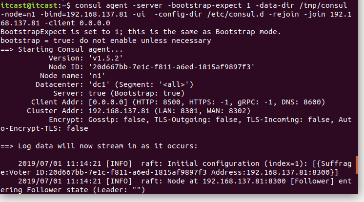
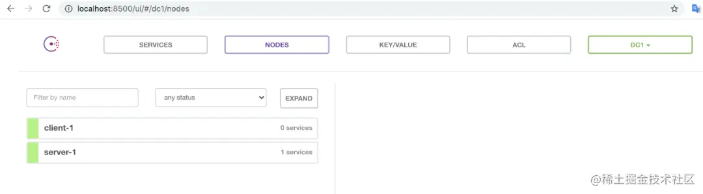
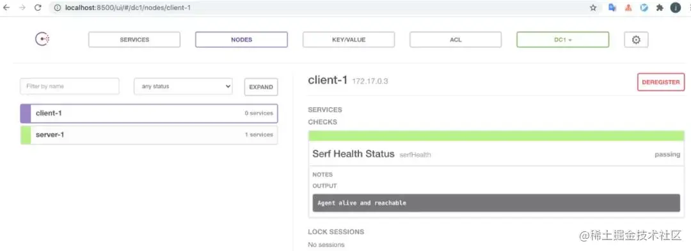
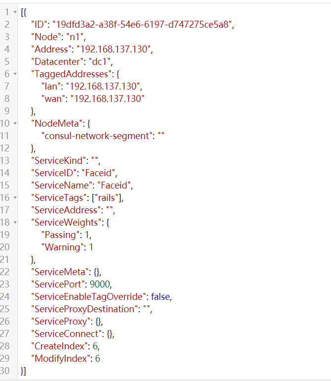
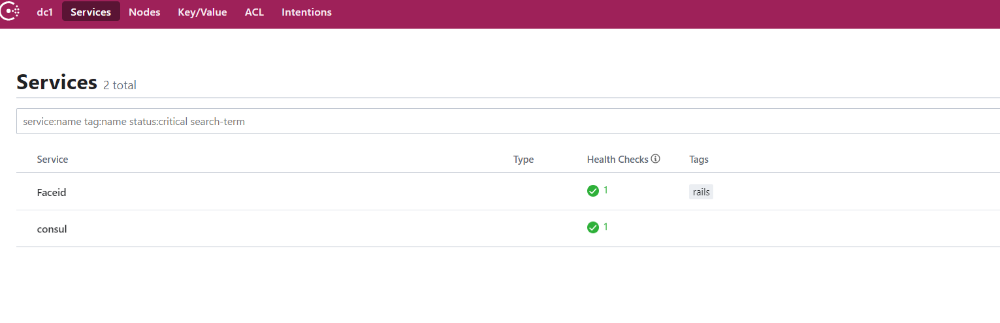
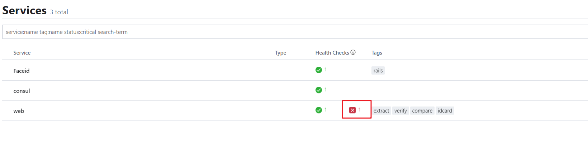

# 什么是consul

[Consul 使用中文文档 - Consul 中文文档 (gitbook.io)](https://kingfree.gitbook.io/consul/)

[Consul | HashiCorp Developer开发者手册](https://developer.hashicorp.com/consul)

Consul是服务网格（service mesh）的一种解决方案，`Consul`是有**服务发现**，**配置**和**分段 **功能的全功能**控制平面**。这些功能可以根据需要单独使用，也可以一起使用以构建完整的服务网格。`Consul`需要一个数据平面，并支持代理和本机集成模型。`Consul`附带了一个简单的内置代理，因此开箱即用，但也支持`Envoy`等第三方代理集成。

Consul其实解决了运行微服务和云原生基础架构的网络和安全挑战。Consul提供了一种云原生的软件驱动路由和分段方法。它还带来了其他好处，比如故障处理，重试和网络可观察。

上面说到了**服务网格**和**数据平面**，服务网格通常是和微服务在一起说的**服务网格**，数据平面很好理解就是软件和服务架构中处理数据请求的那层，相比之下，控制平面就是配置和关闭数据平面的软件部分，这里Consul就起到了控制平面的作用。

Consul的主要特点有以下：

- 服务发现

  Consul的客户端可以注册服务，例如api或mysql，客户端可以使用Consul来发现已注册的服务。使用DNS或HTTP，应用程序可以轻松找到它们依赖的服务。

- 健康检测

  Consul客户端可以提供任何数量的运行状况检查，这些检查可以与给定服务（“ Web服务器是否返回200 OK”）或本地节点（“内存利用率低于90％”）相关。你可以使用此信息来监视群集的运行状况，服务发现组件可以使用这些信息将流量从不正常的主机转移走。

- KV存储

  你应用程序可以将Consul的分层 键/值 存储用于多种目的，不限于 动态配置，功能标记，协调，集群leader选举等等。Consul提供的简单HTTP API使其非常易于使用。

- 安全的服务通信

  Consul可以为服务生成和分发TLS证书然后建立相互的TLS连接。意图 用于定义允许哪些服务进行通信。可以实时更改意图轻松管理服务分段，而不使用复杂的网络拓扑和静态防火墙规则。

- 多数据中心

Consul开箱即用地支持多个数据中心。这意味着Consul的用户不必担心会构建其他抽象层以扩展到多个区域

Consul的设计对DevOps社区和应用程序开发人员非常友好，使其非常适合现代，灵活的基础架构。

> 官方建议：最好是三台或者三台以上的consul在运行，同名服务最好是三台或三台以上，默认可以搭建集群

# Consul的基本架构

Consul是一个分布式，高度可用系统。本节将介绍基础知识，有意省略一些不必要的细节，可以快速了解Consul的工作方式。

向Consul提供服务的每个节点都运行着Consul的代理，当用来发现服务 或者 获取配置的键值对数据时，代理可以不需要。代理负责节点上的服务以及节点本身的健康检测。

代理与一台或多台Consul服务器通信。Consul服务器是存储和复制数据的地方。服务器本身选举一个领导者。虽然Consul可以在一台服务器上运行，但建议3到5个节点，以避免发生故障导致数据丢失。建议为每个数据中心都使用Consul服务器集群。

服务器维护一个目录，该目录是通过汇总代理提交的数据生成的。该目录维护着集群的高级视图，包括哪些服务可用，哪些节点运行这些服务，运行状况信息等等。

需要发现其他服务或节点的基础组件，可以查询任何Consul服务器或任何Consul代理。代理将查询自动转发到服务器。

每个数据中心运行一个Consul服务器集群。当发出跨数据中心的服务发现或配置请求时，本地Consul服务器将请求转发到远程数据中心并返回结果。

# Consul的安装

## docker方式

我这里安装为了环境方便，采用的是docker的方式，之前也尝试过虚拟机，笔记本物理机等等，都不如用docker安装方便。

- 获取镜像文件

```sh
docker pull consul
```

- 检查下是否下载完成

```go
docker images -f 'reference=consul' 
REPOSITORY          TAG                 IMAGE ID            CREATED             SIZE consul              latest              2823bc69f80f        4 weeks ago         120MB
```

- 启动Consul服务器

```go
docker run -d 
   -p 8500:8500 
   -p 8600:8600/udp 
   consul agent -server -ui -node=server-1 -bootstrap-expect=1 -client=0.0.0.0
```

-d: 表示后台启动

-p: 表示映射本机的8500和8600到docker容器的8500和8600/udp端口

最后一行就是consul 启动服务器的命令

除此之外，我们来看一下命令最后的几个参数：

- `agent` 表示启动一个Agent进程
- `-server` 表示该节点类型为`Server`节点（下面会讲解集群中的节点类型）
- `-ui` 开启网页可视化管理界面
- `-node` 指定该节点名称，注意**每个节点的名称必须唯一不能重复**！上面指定了第一台服务器节点的名称为`n1`，那么别的节点就得用其它名称
- `-bootstrap-expect` 最少集群的`Server`节点数量，少于这个值则集群失效，这个选项**必须指定**，由于这里是单机部署，因此设定为`1`即可
- `-advertise` 这里要指定本节点外网地址，用于在集群时告诉其它节点自己的地址，如果是**在自己电脑上或者是内网搭建单节点/集群则不需要带上这个参数**
- `-client` 指定可以外部连接的地址，`0.0.0.0`表示外网全部可以连接

## package方式

Consul用Golang实现，因此具有天然可移植性 (支持 Linux、windows和macOS)。安装包仅包含一个可执行文件。 Consul安装非常简单，只需要下载对应系统的软件包并解压后就可使用。

安装步骤如下：

```shell
# 这里以 ubuntu系统为例：
$ wget https://releases.hashicorp.com/consul/1.5.2/consul_1.5.2_linux_amd64.zip
$ unzip consul_1.5.2_linux_amd64.zip
$ sudo mv consul /usr/local/bin/
```

> 其他系统版本可以在这里下载：https://www.consul.io/downloads.html

安装验证：

安装 Consul后，通过执行 consul命令，你可以看到命令列表的输出

```sh
Available commands are:
    acl            Interact with Consul's ACLs
    agent          Runs a Consul agent
    catalog        Interact with the catalog
    config         Interact with Consul's Centralized Configurations
    connect        Interact with Consul Connect
    debug          Records a debugging archive for operators
    event          Fire a new event
    exec           Executes a command on Consul nodes
    force-leave    Forces a member of the cluster to enter the "left" state
    info           Provides debugging information for operators.
    intention      Interact with Connect service intentions
    join           Tell Consul agent to join cluster
    keygen         Generates a new encryption key
    keyring        Manages gossip layer encryption keys
    kv             Interact with the key-value store
    leave          Gracefully leaves the Consul cluster and shuts down
    lock           Execute a command holding a lock
    login          Login to Consul using an auth method
    logout         Destroy a Consul token created with login
    maint          Controls node or service maintenance mode
    members        Lists the members of a Consul cluster
    monitor        Stream logs from a Consul agent
    operator       Provides cluster-level tools for Consul operators
    reload         Triggers the agent to reload configuration files
    rtt            Estimates network round trip time between nodes
    services       Interact with services
    snapshot       Saves, restores and inspects snapshots of Consul server state
    tls            Builtin helpers for creating CAs and certificates
    validate       Validate config files/directories
    version        Prints the Consul version
    watch          Watch for changes in Consul
```


# Consul启动

## server模式启动

```shell
$ consul agent -server -bootstrap-expect 1 -data-dir /tmp/consul -node=n1 -bind=192.168.6.108 -ui -rejoin -config-dir=/etc/consul.d/ -client 0.0.0.0
```




> 需要先在/etc/下面创建consul.d目录
>
> - `-server` ： 定义agent运行在server模式
> - `-bootstrap-expect` ：在一个datacenter中期望提供的server节点数目，当该值提供的时候，consul一直等到达到指定sever数目的时候才会引导整个集群，该标记不能和bootstrap共用
> - `-bind`：该地址用来在集群内部的通讯，集群内的所有节点到地址都必须是可达的，默认是0.0.0.0
> - `-node`：节点在集群中的名称，在一个集群中必须是唯一的，默认是该节点的主机名
> - `-ui`： 启动web界面  :8500
> - `-rejoin`：使consul忽略先前的离开，在再次启动后仍旧尝试加入集群中。
> - `-config-dir`：配置文件目录，里面所有以.json结尾的文件都会被加载
> - `-client`：consul服务侦听地址，这个地址提供HTTP、DNS、RPC等服务，默认是127.0.0.1所以不对外提供服务，如果你要对外提供服务改成0.0.0.0
> - `data-dir`：提供一个目录用来存放agent的状态，所有的agent允许都需要该目录，该目录必须是稳定的，系统重启后都继续存在

## **client模式启动**

```shell
$ consul agent -data-dir /tmp/consul -node=n2 -bind=192.168.137.82 -config-dir /etc/consul.d -rejoin -join 192.168.137.81
```

> 运行cosnul agent以client模式，-join 加入到已有的集群中去。


# Consul的简单使用

首先我们要运行consul，运行有两种模式，分别是==server==和==client==，通过下面的命令开启：

```shell
consul agent -server
consul agent 
```

每个数据中心至少必须拥有一个server。一个client是一个非常轻量级的进程.用于注册服务,运行健康检查和转发对server的查询.agent必须在集群中的每个主机上运行.

接着我们以server的模式启动一个consul：


#  Consul的命令行

consul安装好之后，我们来使用一下吧。首先我们来看一下consul都有哪些命令。使用命令`consul -h`可以查看consul支持的所有参数，而且每个参数里面还支持其他参数，下面我们来具体看看。

**agent：**指令是consul的核心，它运行agent来维护成员的重要信息、运行检查、服务宣布、查询处理等等。

```shell
==> Usage: consul agent [options]
  Starts the Consul agent and runs until an interrupt is received. The
  agent represents a single node in a cluster.
Options:
  -advertise=addr                  Sets the advertise address to use
  -advertise-wan=addr              Sets address to advertise on wan instead of
                                   advertise addr
  -bootstrap                       Sets server to bootstrap mode
  -bind=0.0.0.0                    Sets the bind address for cluster
                                   communication
  -http-port=8500                  Sets the HTTP API port to listen on
  -bootstrap-expect=0              Sets server to expect bootstrap mode.
  -client=127.0.0.1                Sets the address to bind for client access.
                                   This includes RPC, DNS, HTTP and HTTPS (if
                                   configured)
  -config-file=foo                 Path to a JSON file to read configuration
                                   from. This can be specified multiple times.
  -config-dir=foo                  Path to a directory to read configuration
                                   files from. This will read every file ending
                                   in ".json" as configuration in this
                                   directory in alphabetical order. This can be
                                   specified multiple times.
  -data-dir=path                   Path to a data directory to store agent
                                   state
  -dev                             Starts the agent in development mode.
  -recursor=1.2.3.4                Address of an upstream DNS server.
                                   Can be specified multiple times.
  -dc=east-aws                     Datacenter of the agent (deprecated: use
                                   'datacenter' instead).
  -datacenter=east-aws             Datacenter of the agent.
  -encrypt=key                     Provides the gossip encryption key
  -join=1.2.3.4                    Address of an agent to join at start time.
                                   Can be specified multiple times.
  -join-wan=1.2.3.4                Address of an agent to join -wan at start
                                   time. Can be specified multiple times.
  -retry-join=1.2.3.4              Address of an agent to join at start time
                                   with retries enabled. Can be specified
                                   multiple times.
  -retry-interval=30s              Time to wait between join attempts.
  -retry-max=0                     Maximum number of join attempts. Defaults to
                                   0, which will retry indefinitely.
  -retry-join-ec2-region           EC2 Region to use for discovering servers to
                                   join.
  -retry-join-ec2-tag-key          EC2 tag key to filter on for server
                                   discovery
  -retry-join-ec2-tag-value        EC2 tag value to filter on for server
                                   discovery
  -retry-join-gce-project-name     Google Compute Engine project to discover
                                   servers in
  -retry-join-gce-zone-pattern     Google Compute Engine region or zone to
                                   discover servers in (regex pattern)
  -retry-join-gce-tag-value        Google Compute Engine tag value to filter
                                   for server discovery
  -retry-join-gce-credentials-file Path to credentials JSON file to use with
                                   Google Compute Engine
  -retry-join-wan=1.2.3.4          Address of an agent to join -wan at start
                                   time with retries enabled. Can be specified
                                   multiple times.
  -retry-interval-wan=30s          Time to wait between join -wan attempts.
  -retry-max-wan=0                 Maximum number of join -wan attempts.
                                   Defaults to 0, which will retry
                                   indefinitely.
  -log-level=info                  Log level of the agent.
  -node=hostname                   Name of this node. Must be unique in the
                                   cluster
  -node-meta=key:value             An arbitrary metadata key/value pair for
                                   this node.
                                   This can be specified multiple times.
  -protocol=N                      Sets the protocol version. Defaults to
                                   latest.
  -rejoin                          Ignores a previous leave and attempts to
                                   rejoin the cluster.
  -server                          Switches agent to server mode.
  -syslog                          Enables logging to syslog
  -ui                              Enables the built-in static web UI server
  -ui-dir=path                     Path to directory containing the Web UI
                                   resources
  -pid-file=path                   Path to file to store agent PID
```

**info：**指令提供了各种操作时可以用到的debug信息，对于client和server，info有返回不同的子系统信息，目前有以下几个KV信息：agent(提供agent信息)，consul(提供consul库的信息)，raft(提供raft库的信息)，serf_lan(提供LAN gossip pool),serf_wan(提供WAN gossip pool)

**leave：**指令触发一个优雅的离开动作并关闭agent，节点离开后不会尝试重新加入集群中。运行在server状态的节点，节点会被优雅的删除，这是很严重的，在某些情况下一个不优雅的离开会影响到集群的可用性。

**members：**指令输出consul agent目前所知道的所有的成员以及它们的状态，节点的状态只有alive、left、failed三种状态。

> -detailed：输出每个节点更详细的信息。
> -rpc-addr：一个rpc地址，agent可以链接上来发送命令，如果没有指定，默认是127.0.0.1:8400。
> -status：过滤出符合正则规则的节点

**reload：**指令可以重新加载agent的配置文件。SIGHUP指令在重新加载配置文件时使用，任何重新加载的错误都会写在agent的log文件中，并不会打印到屏幕。


# Consul agent停止

你可以使用Ctrl-C 优雅的关闭Agent. 中断Agent之后你可以看到他离开了集群并关闭.

​	在退出中,Consul提醒其他集群成员,这个节点离开了.如果你强行杀掉进程.集群的其他成员应该能检测到这个节点失效了.当一个成员离开,他的服务和检测也会从目录中移除.当一个成员失效了,他的健康状况被简单的标记为危险,但是不会从目录中移除.Consul会自动尝试对失效的节点进行重连.允许他从某些网络条件下恢复过来.离开的节点则不会再继续联系.

​	此外,如果一个agent作为一个服务器,一个优雅的离开是很重要的,可以避免引起潜在的可用性故障影响达成一致性协议.
consul优雅的退出：

```shell
$ consul leave
```


# 查看consul成员

```shell
$ consul members
#节点  网络地址                状态     类型     版本   协议       数据中心  分管部分 
Node  Address                Status  Type    Build  Protocol  DC   Segment

n1    192.168.137.130:8301   alive   server  1.1.0  2         dc1  <all>
n3    192.168.137.81:8301    alive   client  1.1.0  2         dc1  <default>
```


# Consul观察启动日志

因为刚才是后台启动的，也看不到日志情况，可以通过下面的方式查看

```sh
docker logs d2806ac2b7e1 // 后面的这个id就是容器的id，可以通过 docker -ps -l 查看
```

看到这样的日志，说明就是启动没问题的

```yaml
==> Starting Consul agent...
           Version: '1.9.1'
           Node ID: '5cea9bb5-53f2-e71e-1a46-b23f188da307'
         Node name: 'server-1'
        Datacenter: 'dc1' (Segment: '<all>')
            Server: true (Bootstrap: true)
       Client Addr: [0.0.0.0] (HTTP: 8500, HTTPS: -1, gRPC: -1, DNS: 8600)
      Cluster Addr: 172.17.0.2 (LAN: 8301, WAN: 8302)
           Encrypt: Gossip: false, TLS-Outgoing: false, TLS
           ....
           ==> Consul agent running!
           ....
```

现在服务端启动了，接下来应该要启动一个客户端去连接这个服务端，这里有个问题，我怎么知道我启动这个服务端的IP地址和端口号，docker提供了可以直接执行容器内Consul命令的方式。

```sh
docker exec d2806ac2b7e1 consul members
Node      Address          Status  Type    Build  Protocol  DC   Segment
server-1  172.17.0.2:8301  alive   server  1.9.1  2         dc1  <all>
```

当然你也可以直接进去到容器内部,进去容器内部，使用的是exec命令

```sh
docker exec -it d2806ac2b7e1 /bin/sh
consul members
```

docker执行容器内支持的命令方式为：

```sh
docker exec <container_id> consul members
```

这里发现 服务端的地址是`172.17.0.2:8301`

- 配置运行客户端

```sh
docker run  --name=test-1 consul agent -node=client-1 -join=172.17.0.2
==> Starting Consul agent...
==> Joining cluster...
    Join completed. Synced with 1 initial agents
==> Consul agent running!
           Version: 'v1.4.4'
           Node ID: '4b6da3c6-b13f-eba2-2b78-446ffa627633'
         Node name: 'client-1'
        Datacenter: 'dc1' (Segment: '')
            Server: false (Bootstrap: false)
       Client Addr: [127.0.0.1] (HTTP: 8500, HTTPS: -1, gRPC: -1, DNS: 8600)
      Cluster Addr: 172.17.0.4 (LAN: 8301, WAN: 8302)
           Encrypt: Gossip: false, TLS-Outgoing: false, TLS-Incoming: false
```

通过再次在容器中执行`consul Members`命令来检查客户端是否已加入

```sh
docker exec d2806ac2b7e1 consul members
```

发现已经变成两个了，并且状态都是可用状态

```sh
$ docker exec d2806ac2b7e1 consul members
Node      Address          Status  Type    Build  Protocol  DC   Segment
server-1  172.17.0.2:8301  alive   server  1.9.1  2         dc1  <all>
client-1  172.17.0.3:8301  alive   client  1.9.1  2         dc1  <default>
```

现在有了一个小的数据中心，就可以注册服务或者配置数据玩了。

其实，查看数据中心的方式，还可以通过web的方式来查看，Consul默认的http接口是`8500`端口，这个端口启动的ui接口，可以方便的管理配置数据中心。打开如图，点击NODES 查看节点



点击节点，右边可以看到节点的健康状态，代理是否可用等



# Consul内的微服务管理

## 注册服务

服务可以通过[服务定义](https://www.consul.io/docs/agent/services.html)，或者调用 [HTTP API](https://www.consul.io/api/agent/service.html#register-service) 进行注册。

服务定义是最常用的注册服务方式，所以我们以此为例。

首先，创建 Consul 配置目录，Consul 会加载目录下所有配置文件。Unix 系统可以创建一个 `/etc/consul.d` 。

```sh
$ mkdir ./consul.d
```

接着，编写服务定义配置文件。假设有一个名叫“web”服务运行在 80 端口，写入如下配置：

```sh
$ echo '{"service": {"name": "web", "tags": ["rails"], "port": 80}}' > ./consul.d/web.json
```

现在，重启 agent，加上配置目录选项：

```sh
$ consul agent -dev -config-dir=./consul.d
==> Starting Consul agent...
...
[INFO] agent: Synced service 'web'
...
```

注意到输出中“已同步(synced)”了该服务，表示服务定义已从配置文件中读取，并成功注册进入服务编目。

如果你想注册多个服务， 可以在 Consul 配置目录中创建多个服务定义配置文件。


注意：在生产环境，你应当打开健康检查，并运行在 80 端口。简单起见，这里都没有做。

## 查询服务

一旦agent启动并且服务同步了.我们可以通过DNS或者HTTP的API来查询服务.这里我们通过HTTP来查询服务：

```shell
$ curl -s 127.0.0.1:8500/v1/catalog/service/faceid
```

得到一串json数据，不过格式不够清晰，拷贝到在线json格式解析器中，如下所示：



我们还可以打开web页面，查看注册的服务。默认consul对应的端口是8500，在浏览器输入地址`localhost:8500`



也能看到我们注册的服务。

## 更新服务

修改配置文件将会更新服务定义，并发送 `SIGHUP` 信号给 agent。这使你的服务不至于下线或者不可用。

另外，HTTP API 可以动态地添加、移除和修改服务。

## 健康检查

健康检查是服务发现的关键组件.预防使用到不健康的服务.和服务注册类似,一个检查可以通过检查定义或HTTP API请求来注册.我们将使用和检查定义来注册检查.和服务类似,因为这是建立检查最常用的方式.

在/etc/consul.d/目录下面创建文件web2.json,内容如下：

```json
{"service": {
    "name": "web",
    "tags": ["extract", "verify", "compare", "idcard"],
    "address": "192.168.137.130",
    "port": 9000,
    "check": {
        "id": "api",
        "name": "HTTP API on port 9000",
        "http": "http://localhost:9000",
        "interval": "10s",
        "timeout": "1s"
        }
   }
}
```

> 这时候我们没有开启这个服务，所以这个时候健康检查会出错。打开web界面，如下

consul做健康检查的必须是**Script、HTTP、TCP、TTL**中的一种。

**Script类型需要提供Script脚本和interval变量。**具体配置如下：

```json
{  
  "check": {  
    "id": "mem-util",  
    "name": "Memory utilization",  
    "script": "/usr/local/bin/check_mem.py",  
    "interval": "10s",  
    "timeout": "1s"  
  }  
} 
```

> 通过执行外部应用进行健康检查：这种外部程序具有退出代码，并可能产生一些输出；脚本按照指预置时间间隔来调用（比如，每30秒调用一次），类似于Nagios插件系统，脚本输出限制在4K以内，输出大于4K将截断。默认情况下，脚本超时时间为30秒——可通过timeout来配置。

**HTTP类型必须提供http和Interval字段。**具体代码如下：

```json
{  
  "check": {  
    "id": "api",  
    "name": "HTTP API on port 5000",  
    "http": "http://localhost:5000/health",  
    "interval": "10s",  
    "timeout": "1s"  
  }  
}  
```

> 这种检查将按照预设的时间间隔创建一个HTTP “get”请求。HTTP响应代码来标示服务所处状态：任何2xx代码视为正常，429表示警告——有很多请求；其他值表示失败。
>
> 这种类型的检查应使用curl或外部程序来处理HTTP操作。默认情况下，HTTP Checks中，请求超时时间等于调用请求的间隔时间，最大10秒。有可能使用客制的HTTP check，可以自由配置timeout时间，输出限制在4K以内，输出大于4K将截断。

**TCP类型需要提供tcp和Interval字段。**具体代码如下：

```json
{  
  "check": {  
    "id": "ssh",  
    "name": "SSH TCP on port 22",  
    "tcp": "localhost:22",  
    "interval": "10s",  
    "timeout": "1s"  
  }  
}  
```

> 这种检查将按照预设的时间间隔与指定的IP/Hostname和端口创建一个TCP连接。服务的状态依赖于TCP连接是否成功——如果连接成功，则状态是“success”；否则状态是“critical”。如果一个Hostname解析为一个IPv4和一个IPv6，将尝试连接这两个地址，第一次连接成功则服务状态是“success”。默认情况下，TCP checks中，请求超时时间等于调用请求的间隔时间，最大10秒。也是可以自由配置的。

**TTL（**Timeto Live生存时间**）类型只需提供ttl**，具体配置如下：

```json
{  
  "check": {  
    "id": "web-app",  
    "name": "Web App Status",  
    "notes": "Web app does a curl internally every 10 seconds",  
    "ttl": "30s"  
  }  
}  
```

> 这种checks为给定TTL保留了最后一种状态，checks的状态必须通过HTTP接口周期性更新，如果外部接口没有更新状态，那么状态就会被认定为不正常。 TTL checks同时会将其最后已知状态更新至磁盘，这允许Agent通过重启后恢复到已知的状态。通过TTL端上一次check来维持健康状态的有效性。


我们也可以通过页面来查看,在浏览器输入网址：http://192.68.130.137:8500



其他更多consul功能，我们可以参考http://www.liangxiansen.cn/2017/04/06/consul/


# 使用Go-SDK注册consul服务

[Consul HTTP API 的官方 Go 客户端 API文档](https://developer.hashicorp.com/consul/api-docs/libraries-and-sdks)

安装consul库

```go
go get "github.com/hashicorp/consul/api"
```

[api 包 - github.com/hashicorp/consul/api - Go 包](https://pkg.go.dev/github.com/hashicorp/consul/api#section-readme)

```go
package main

import (
	"fmt"

	"github.com/hashicorp/consul/api"
)

func Register(address string, port int, name string, tags []string, id string) error {
	cfg := api.DefaultConfig()
	cfg.Address = "192.168.1.103:8500"

	client, err := api.NewClient(cfg)
	if err != nil {
		panic(err)
	}
	//生成对应的检查对象
	check := &api.AgentServiceCheck{
		HTTP:                           "http://192.168.1.102:8021/health",
		Timeout:                        "5s",
		Interval:                       "5s",
		DeregisterCriticalServiceAfter: "10s",
	}

	//生成注册对象
	registration := new(api.AgentServiceRegistration)
	registration.Name = name
	registration.ID = id
	registration.Port = port
	registration.Tags = tags
	registration.Address = address
	registration.Check = check

	err = client.Agent().ServiceRegister(registration)
	client.Agent().ServiceDeregister(name) //注销服务
	if err != nil {
		panic(err)
	}
	return nil
}

func AllServices() {
	cfg := api.DefaultConfig()
	cfg.Address = "192.168.1.103:8500"

	client, err := api.NewClient(cfg)
	if err != nil {
		panic(err)
	}

	data, err := client.Agent().Services() //返回本地注册的服务
	if err != nil {
		panic(err)
	}
	for key, _ := range data {
		fmt.Println(key)
	}
}

func FilterSerivice() {
	cfg := api.DefaultConfig()
	cfg.Address = "192.168.1.103:8500"

	client, err := api.NewClient(cfg)
	if err != nil {
		panic(err)
	}

	data, err := client.Agent().ServicesWithFilter(`Service == "user-web"`) // 根据filter筛选服务
	if err != nil {
		panic(err)
	}
	for key, _ := range data {
		fmt.Println(key)
	}
}

func main() {
	//_ = Register("192.168.1.102", 8021, "user-web", []string{"mxshop", "bobby"}, "user-web")
	//AllServices()
	//FilterSerivice()
	fmt.Println(fmt.Sprintf(`Service == "%s"`, "user-srv"))
}
```


## grpc使用Consul整体步骤

1.  创建 proto文件 ， 指定 rpc 服务
2.  启动 consul 服务发现  consul agent -dev
3.  启动server
    1. 获取consul 对象。
    2. 使用 consul对象，将 server 信息，注册给 consul 
    3. 启动服务
4.  启动client
    1. 获取consul 对象。
    2. 使用consul对象，从consul 上获取健康的 服务。
    3. 再访问服务 （grpc远程调用）

### grpc使用Consul注册服务

服务端注册consul服务和使用Consul健康检查，代码如下

```go
func main(){
	consulConfig := api.DefaultConfig() //初始化consul配置
	registry,_ := api.NewClient(consulConfig) //获取consul client操作对象
	registerService := api.AgentServiceRegistration{ //注册服务,服务的常规配置
		ID:"1",
		Tags:[]string{"testHello"},
		Name:"HelloService",
		Port:8080,
		Address:"192.168.137.130",
		Check:&api.AgentServiceCheck{ //配置Consul健康检查方式
			TCP:"192.168.137.130:8080",
			Timeout:"5s",
			Interval:"5s",
		},
	}

	registry.Agent().ServiceRegister(&registerService) //注册服务到consul上
	grpcServer := grpc.NewServer() //获取grpc服务端对象
	pb.RegisterHelloServiceServer(grpcServer,new(HelloService)) //注册grpc服务

	lis,err := net.Listen("tcp",":1234") //设置服务端监听
	if err != nil {
		panic(err)
	}

	grpcServer.Serve(lis) //在指定端口上提供grpc服务
}
```


### grpc使用Consul服务发现

客户端查询consul服务和使用Consul服务，代码如下

```go
func main()  {
	consulConfig := api.DefaultConfig()	// 初始化 consul 配置

	// 创建consul对象 -- (可以重新指定 consul 属性: IP/Port , 也可以使用默认)
	consulClient, err := api.NewClient(consulConfig)

	// 服务发现. 从consuL上, 获取健康的服务
	services, _, err := consulClient.Health().Service("grpc And Consul", "grcp", true, nil)

	// 简单的负载均衡
	addr := services[0].Service.Address + ":" + strconv.Itoa(services[0].Service.Port)
	
//////////////////////以下为 grpc 服务远程调用///////////////////////////
	// 1. 链接服务
	//grpcConn, _ := grpc.Dial("127.0.0.1:8800", grpc.WithInsecure())

	// 使用 服务发现consul 上的 IP/port 来与服务建立链接
	grpcConn, _ := grpc.Dial(addr, grpc.WithInsecure())

	// 2. 初始化 grpc 客户端
	grpcClient := pb.NewHelloClient(grpcConn)

	var person pb.Person
	person.Name = "Andy"
	person.Age = 18

	// 3. 调用远程函数
	p, err := grpcClient.SayHello(context.TODO(), &person)
	fmt.Println(p, err)
}
```

### grpc使用Consul注销服务

```go
func main(){
	consulConfig := api.DefaultConfig() //初始化consul配置,客户端服务器需要一致
  registerClient,_ := api.NewClient(consulConfig) //获取consul操作对象
  client.Agent().ServiceDeregister("helloPerson") //注销服务
}
```


## gRPC使用Consul健康检查协议

[grpc/doc/health-checking.md 在 master ·GRPC/GRPC (github.com)](https://github.com/grpc/grpc/blob/master/doc/health-checking.md)

健康检查用于检测服务端能否正常处理rpc请求，客户端对服务端的健康检查可以点对点进行，也可以通过某些控制系统（如负载平衡）进行。客户端可以根据服务端返回的状态执行对应的策略。

因为GRPC服务可以用于简单的客户端到服务端场景和其他控制系统（如负载平衡）的健康检查，所以gRPC健康检查协议借助了gRPC服务来实现。使用GRPC服务来实现健康检查有以下好处：

1. 执行健康检查的格式与普通rpc相同，
2. 具有丰富的语义，例如每个服务的健康状态，
3. 能够重用所有现有的计费、配额基础设施等，因此服务器可以完全控制健康检查服务的访问。

### gRPC中健康检查服务定义

因为gRPC健康检查协议是通过gRPC服务实现的，我们首先看下这个服务的定义：

```protobuf
syntax = "proto3";

package grpc.health.v1;

message HealthCheckRequest {
  string service = 1;
}

message HealthCheckResponse {
  enum ServingStatus {
    UNKNOWN = 0;
    SERVING = 1;
    NOT_SERVING = 2;
  }
  ServingStatus status = 1;
}

service Health {
  rpc Check(HealthCheckRequest) returns (HealthCheckResponse);
}
```

客户端可以通过调用Check方法（需要设置截止时）查询服务器的运行状况，客户端可以通过设置服务名称来检查对应服务的健康状况。服务名称的格式建议为package_names.ServiceName，例如grpc.health.v1.Health。

服务端要注册所有服务并设置各个服务的状态，包括空服务名称及其状态。对于接收到的每个请求，如果在配置列表中找到了对应服务，需要根据当前服务情况返回SERVING或NOT_SERVING的状态。如果在配置列表没找到对应服务，则返回NOT_FOUND状态。

服务端应使用空字符串作为整体健康状态的键，以便对特定服务不感兴趣的客户端可以通过空请求查询服务的状态。服务端可以只对服务名称进行精确匹配也可以实现更复杂的匹配方式。

如果一次rpc调用在一段时间后都没有收到响应，可以认为服务端挂了，需要执行应对服务端挂掉情况的策略。

客户端可以调用Watch方法来使用基于stream方式的健康检查。服务器会立即发回一条代表当前服务状态的消息。只要服务的状态发生变化，就会发送一条新消息。
