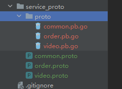

# protobuf数据序列化格式

[protobuf 官网文档](https://protobuf.dev/overview/) | [Protobuf3 语言指南（中文）](https://lixiangyun.gitbook.io/protobuf3/#oneof)

Protocol Buffers（简称 Protobuf）是一种由 Google 开发的跨平台、语言无关、高效的**数据序列化格式**。它类似于 XML 或 JSON 这样的数据交换格式，但更轻量级、更高效。

以下是 Protobuf3 的一些主要特性：

1. **简洁高效**: Protobuf 的数据大小通常要比 XML 小 3 到 10 倍，速度快 20 到 100 倍。这使得 Protobuf 非常适合用于扩展数据存储、RPC 数据交换格式或者任何需要高效存储和读写的地方。
2. **语言无关和平台无关**: Protobuf 提供了 C++、Java、Python 以及更多其他语言的库，你可以在不同的系统和不同的语言间使用 Protobuf，它们可以无缝地进行数据交换。
3. **可扩展**: Protobuf 是可扩展的，你可以很方便地更新数据结构而保持向后兼容。
4. **使用 .proto 文件定义数据结构**: 你需要定义数据结构的 .proto 文件，然后使用 protobuf 编译器生成对应语言的代码，这样就可以在代码中使用定义的数据结构了。

**劣势：**

​	1：应用不够广(相比xml和json)

​	2：二进制格式导致可读性差

​	3：缺乏自描述

# 安装

[Releases下载地址 · protobuf (github.com)](https://github.com/protocolbuffers/protobuf/releases) | [protobuf编译器 win版](https://github.com/protocolbuffers/protobuf/releases/download/v3.9.0/protoc-3.9.0-win64.zip)

**1、安装protobuf编译器（protoc）**


解压压缩文件后，添加protoc变量到系统环境变量中

```sh
D:\Program Files\protoc-25.1-win64\bin
> protoc --version		# 验证
libprotoc 26.1
```

**2、下载go依赖包**

我们是使用Go语言做开发，接下来执行下面的命令安装`protoc`的Go插件。[google接管后的新版本](https://github.com/protocolbuffers/protobuf-go)

**安装protobuf运行时库**：安装Go语言的protobuf运行时库。您可以通过以下命令安装：

```sh
go get google.golang.org/protobuf/proto
```

**安装protoc-gen-go插件**：用于生成Go代码的protoc插件。您可以通过以下命令使用Go工具链安装该插件：

```sh
go install google.golang.org/protobuf/cmd/protoc-gen-go@latest
```

# 生成go文件

```protobuf
syntax = "proto3"; // 指定proto版本
package hello_grpc;     // 指定默认包名

option go_package = "/hello_grpc";	// 指定golang包名
//option go_package = ".;xxx";		// go_package 表示在当前目录生成go文件，文件的包名是xxx

service HelloService { //定义rpc服务
  rpc SayHello (HelloRequest) returns (HelloResponse) {} // 定义函数
}

message HelloRequest { // HelloRequest 请求内容
  string name = 1;  // 消息号
  string message = 2;
}

message HelloResponse{ // HelloResponse 响应内容
  string name = 1;
  string message = 2;
}
```

```go
protoc -I . --go_out=plugins=grpc:./grpc_proto .\grpc_proto\hello.proto
```

proto文件只是定义接口方法

# proto语法

service 对应的就是go里面的接口，可以作为服务端，客户端

rpc 对应的就是结构体中的方法

message对应的也是结构体

# 数据类型

## 基本数据类型

```protobuf
message Request {
  double a1 = 1;
  float a2 = 2;
  int32 a3 = 3;
  uint32 a4 = 4;
  uint64 a5 = 5;
  sint32 a6 = 6;
  sint64 a7 = 7;
  fixed32 a8 = 8;
  fixed64 a9 = 9;
  sfixed32 a10 = 10;
  sfixed64 a11 = 11;
  bool a12 = 12;
  string a13 = 13;
  bytes a14 = 14;
}
```

对应go类型

```go
type Request struct {
  state         protoimpl.MessageState
  sizeCache     protoimpl.SizeCache
  unknownFields protoimpl.UnknownFields

  A1  float64 `protobuf:"fixed64,1,opt,name=a1,proto3" json:"a1,omitempty"`
  A2  float32 `protobuf:"fixed32,2,opt,name=a2,proto3" json:"a2,omitempty"`
  A3  int32   `protobuf:"varint,3,opt,name=a3,proto3" json:"a3,omitempty"`
  A4  uint32  `protobuf:"varint,4,opt,name=a4,proto3" json:"a4,omitempty"`
  A5  uint64  `protobuf:"varint,5,opt,name=a5,proto3" json:"a5,omitempty"`
  A6  int32   `protobuf:"zigzag32,6,opt,name=a6,proto3" json:"a6,omitempty"`
  A7  int64   `protobuf:"zigzag64,7,opt,name=a7,proto3" json:"a7,omitempty"`
  A8  uint32  `protobuf:"fixed32,8,opt,name=a8,proto3" json:"a8,omitempty"`
  A9  uint64  `protobuf:"fixed64,9,opt,name=a9,proto3" json:"a9,omitempty"`
  A10 int32   `protobuf:"fixed32,10,opt,name=a10,proto3" json:"a10,omitempty"`
  A11 int64   `protobuf:"fixed64,11,opt,name=a11,proto3" json:"a11,omitempty"`
  A12 bool    `protobuf:"varint,12,opt,name=a12,proto3" json:"a12,omitempty"`
  A13 string  `protobuf:"bytes,13,opt,name=a13,proto3" json:"a13,omitempty"`
  A14 []byte  `protobuf:"bytes,14,opt,name=a14,proto3" json:"a14,omitempty"`
}
```

标量类型

| .proto Type | 解释                                                         | Go Type |
| ----------- | ------------------------------------------------------------ | ------- |
| double      |                                                              | float64 |
| float       |                                                              | float32 |
| int32       | 使用变长编码，对于负值的效率很低，如果你的域有可能有负值，请使用sint64替代 | int32   |
| uint32      | 使用变长编码                                                 | uint32  |
| uint64      | 使用变长编码                                                 | uint64  |
| sint32      | 使用变长编码，这些编码在负值时比int32高效的多                | int32   |
| sint64      | 使用变长编码，有符号的整型值。编码时比通常的int64高效        | int64   |
| fixed32     | 总是4个字节，如果数值总是比总是比228大的话，这个类型会比uint32高效。 | uint32  |
| fixed64     | 总是8个字节，如果数值总是比总是比256大的话，这个类型会比uint64高效。 | uint64  |
| sfixed32    | 总是4个字节                                                  | int32   |
| sfixed64    | 总是8个字节                                                  | int64   |
| bool        |                                                              | bool    |
| string      | 一个字符串必须是UTF-8编码或者7-bit ASCII编码的文本           | string  |
| bytes       | 可能包含任意顺序的字节数据                                   | []byte  |

**标量类型如果没有被赋值，则不会被序列化，解析时，会赋予默认值**

- strings：空字符串
- bytes：空序列
- bools：false
- 数值类型：0

## 数组类型

`repeated` 关键字用于表示一个字段可以包含零个或多个值，也就是说，这个字段是一个数组或列表。

```go
message ArrayRequest {
  repeated int64 a1 = 1;
  repeated string a2 = 2;
  repeated Request request_list = 3;
}
```

go类型

```go
type ArrayRequest struct {
  A1          []int64 
  A2          []string   
  RequestList []*Request
}

arrayRequest := &pb.ArrayRequest{
		A1: []int64{1, 2, 3},
		A2: []string{"hello", "world"},
}
```

## map类型

键只能是基本类型

```go
message MapRequest {
  map<int64, string> mis = 1;
  map<string, bool> mib = 2;
  map<string, ArrayRequest> miarr = 3;
}
```

go类型

```go
type MapRequest struct {
  MIS   map[int64]string
  MIB   map[string]bool
  MIArr map[string]*ArrayRequest
}
```

## enum枚举类型

```go
enum Color {
  RED = 0;
  GREEN = 1;
  BLUE = 2;
}

message MyMessage {
  Color color = 1;
}
```

 `protoc` 编译器将 `.proto` 文件转换为 Go 源代码时的内容：

```go
type Color int32

const (
	Color_RED   Color = 0
	Color_GREEN Color = 1
	Color_BLUE  Color = 2
)
```

在 Go 代码中使用这个 `Color` 类型，就像使用其他类型一样：

```go
color := pb.Color_RED
```

## 时间戳类型

需要引入protobuf源文件

```go
import "google/protobuf/timestamp.proto";

message MyMessage {
  google.protobuf.Timestamp time = 1;
}
```

对应的go文件

```go
import (
	"time"

	timestamppb "google.golang.org/protobuf/types/known/timestamppb"
)

func main() {
  // 使用 timestamppb.New 函数将 Go 的 time.Time 类型转换为 *timestamppb.Timestamp 类型
	t := timestamppb.New(time.Now())
}
```


## 嵌套类型

内层嵌套

```go
message Q1 {
  message Q2{
    string name2 = 2;
  }
  string name1 = 1;
  Q2 q2 = 2;
}

type Q1 struct {
  state         protoimpl.MessageState
  sizeCache     protoimpl.SizeCache
  unknownFields protoimpl.UnknownFields

  Name1 string `protobuf:"bytes,1,opt,name=name1,proto3" json:"name1,omitempty"`
  Q2    *Q1_Q2 `protobuf:"bytes,2,opt,name=q2,proto3" json:"q2,omitempty"`
}
```

外层嵌套

```go
message Result { // 定义Result消息
  string url = 1;
  string title = 2;
  repeated string snippets = 3; // 字符串数组类型
}

message SearchResponse { // 定义SearchResponse消息
  // 引用上面定义的Result消息类型，作为results字段的类型
  repeated Result results = 1; // repeated关键词标记，说明results字段是一个数组
}
```

使用嵌套消息体示例：

```go
proto.SearchResponse_Result{}
```


# 编写风格

1. 文件名建议下划线，例如：my_student.proto
2. 包名和目录名对应
3. 服务名、方法名、消息名均为大驼峰
4. 字段名为下划线

# 多服务proto文件编写

```go
syntax = "proto3"; // 指定proto版本
// 指定golang包名
option go_package = "/duo_proto";

service VideoService {
  rpc Look(Request)returns(Response){}
}

message Request{
  string name = 1;
}
message Response{
  string name = 1;
}

service OrderService {
  rpc Buy(Request)returns(Response){}
}
```

## 服务端

```go
package main

import (
  "context"
  "fmt"
  "google.golang.org/grpc"
  "grpc_study/grpc_proto/duo_proto"
  "log"
  "net"
)

type VideoServer struct {
}

func (VideoServer) Look(ctx context.Context, request *duo_proto.Request) (res *duo_proto.Response, err error) {
  fmt.Println("video:", request)
  return &duo_proto.Response{
    Name: "fengfeng",
  }, nil
}

type OrderServer struct {
}

func (OrderServer) Buy(ctx context.Context, request *duo_proto.Request) (res *duo_proto.Response, err error) {
  fmt.Println("order:", request)
  return &duo_proto.Response{
    Name: "fengfeng",
  }, nil
}

func main() {
  listen, err := net.Listen("tcp", ":8080")
  if err != nil {
    log.Fatal(err)
  }
  s := grpc.NewServer()
  duo_proto.RegisterVideoServiceServer(s, &VideoServer{})
  duo_proto.RegisterOrderServiceServer(s, &OrderServer{})
  fmt.Println("grpc server程序运行在：8080")
  err = s.Serve(listen)
}
```

## 客户端

```go
package main

import (
  "context"
  "fmt"
  "google.golang.org/grpc"
  "google.golang.org/grpc/credentials/insecure"
  "grpc_study/grpc_proto/duo_proto"
  "log"
)

func main() {
  addr := ":8080"
  // 使用 grpc.Dial 创建一个到指定地址的 gRPC 连接。
  // 此处使用不安全的证书来实现 SSL/TLS 连接
  conn, err := grpc.Dial(addr, grpc.WithTransportCredentials(insecure.NewCredentials()))
  if err != nil {
    log.Fatalf(fmt.Sprintf("grpc connect addr [%s] 连接失败 %s", addr, err))
  }
  defer conn.Close()

  orderClient := duo_proto.NewOrderServiceClient(conn)
  res, err := orderClient.Buy(context.Background(), &duo_proto.Request{
    Name: "枫枫",
  })
  fmt.Println(res, err)

  videoClient := duo_proto.NewVideoServiceClient(conn)
  res, err = videoClient.Look(context.Background(), &duo_proto.Request{
    Name: "枫枫",
  })
  fmt.Println(res, err)
}
```

# 多个proto文件

引入其他proto文件，使用其他文件内变量

当项目大起来之后，会有很多个service，rpc，message

我们会将不同服务放在不同的proto文件中

还可以放一些公共的proto文件

对于这方面的资料，可以说全网的正确资料真的相当少

其实本质就是生成go文件，需要在一个包内



video.proto

```protobuf
syntax = "proto3";
package proto1;
option go_package = "/proto";
import "common.proto";
import "google/protobuf/empty.proto"

service VideoService {
  rpc Look(Request)returns(Response){}
}
service Greeter {
	rpc SayHello (HelloRequest) returns (HelloReply);
	rpc Ping(google.protoEmpty) returns (Pong); //使用其他proto文件内变量
}
```

order.proto

```protobuf
syntax = "proto3";
package proto;
option go_package = "/proto";
import "common.proto";

service OrderService {
  rpc Look(Request)returns(Response){}
}
```

common.proto

```protobuf
syntax = "proto3";
package proto;
option go_package = "/proto";

message Request{
  string name = 1;
}
message Response{
  string name = 1;
}
```

生成命令

```protobuf
protoc -I .\service_proto --go_out=plugins=grpc:./service_proto .\service_proto\order.proto
protoc -I .\service_proto --go_out=plugins=grpc:./service_proto .\service_proto\video.proto
protoc -I .\service_proto --go_out=plugins=grpc:./service_proto .\service_proto\common.proto
```

有几个点需要注意

如果有import的话，必须得加上package

并且要和import的package相同

使用，还是和之前一样使用

服务端

```go
package main

import (
  "context"
  "fmt"
  "google.golang.org/grpc"
  "grpc_study/service_proto/proto"
  "log"
  "net"
)

type VideoServer struct {
}

func (VideoServer) Look(ctx context.Context, request *proto.Request) (res *proto.Response, err error) {
  fmt.Println("video:", request)
  return &proto.Response{
    Name: "fengfeng",
  }, nil
}

type OrderServer struct {
}

func (OrderServer) Look(ctx context.Context, request *proto.Request) (res *proto.Response, err error) {
  fmt.Println("order:", request)
  return &proto.Response{
    Name: "fengfeng",
  }, nil
}

func main() {
  listen, err := net.Listen("tcp", ":8080")
  if err != nil {
    log.Fatal(err)
  }
  s := grpc.NewServer()
  proto.RegisterVideoServiceServer(s, &VideoServer{})
  proto.RegisterOrderServiceServer(s, &OrderServer{})
  fmt.Println("grpc server程序运行在：8080")
  err = s.Serve(listen)
}
```

客户端

```go
package main

import (
  "context"
  "fmt"
  "google.golang.org/grpc"
  "google.golang.org/grpc/credentials/insecure"
  "grpc_study/service_proto/proto"
  "log"
)

func main() {
  addr := ":8080"
  // 使用 grpc.Dial 创建一个到指定地址的 gRPC 连接。
  // 此处使用不安全的证书来实现 SSL/TLS 连接
  conn, err := grpc.Dial(addr, grpc.WithTransportCredentials(insecure.NewCredentials()))
  if err != nil {
    log.Fatalf(fmt.Sprintf("grpc connect addr [%s] 连接失败 %s", addr, err))
  }
  defer conn.Close()

  orderClient := proto.NewOrderServiceClient(conn)
  res, err := orderClient.Look(context.Background(), &proto.Request{
    Name: "枫枫",
  })
  fmt.Println(res, err)

  videoClient := proto.NewVideoServiceClient(conn)
  res, err = videoClient.Look(context.Background(), &proto.Request{
    Name: "枫枫",
  })
  fmt.Println(res, err)

}
```