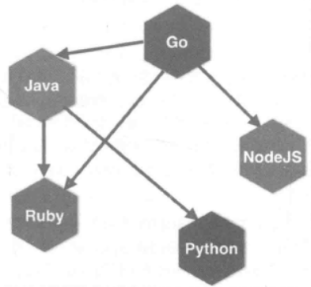
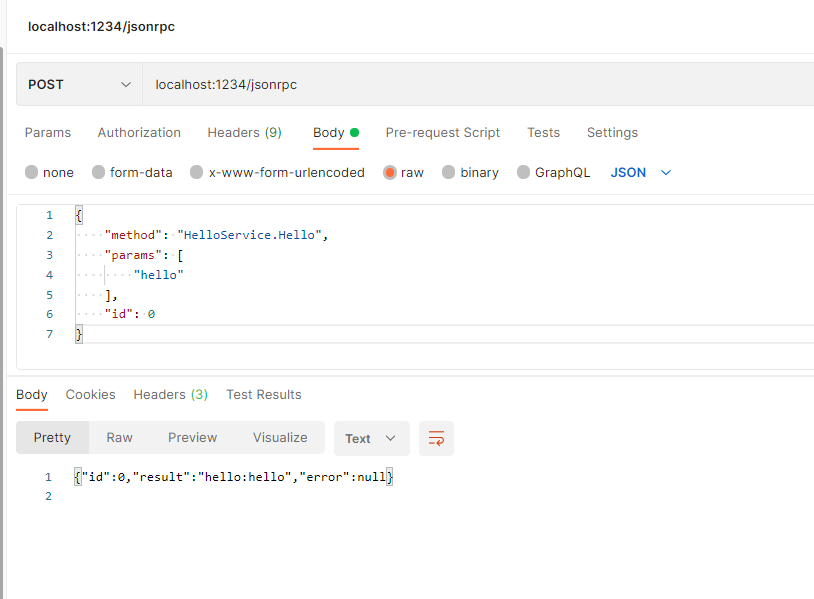
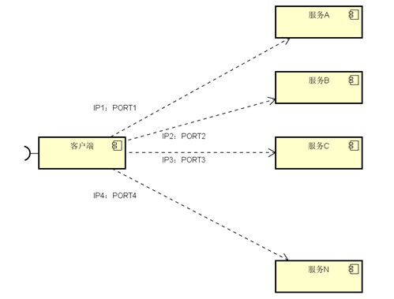
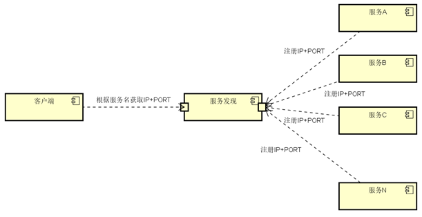
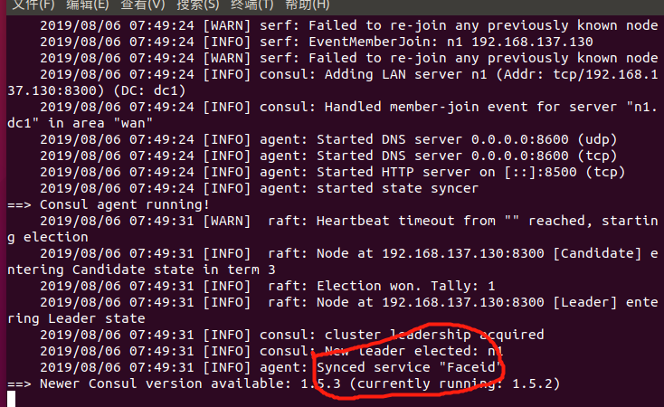
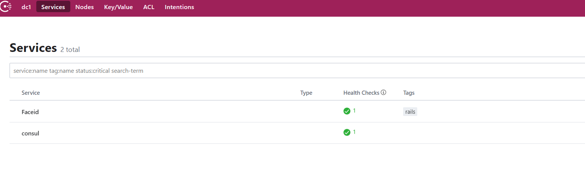
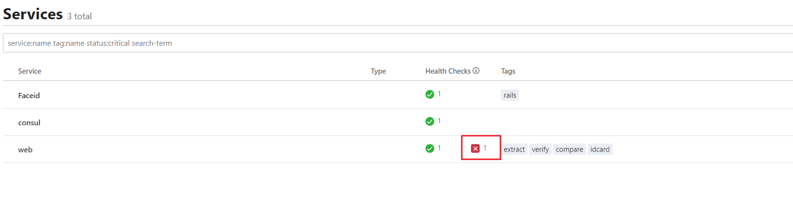
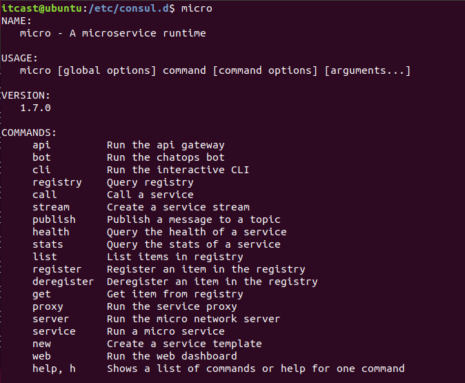

# 1. 微服务（micro services）


​	近几年,微服这个词闯入了我们的视线范围。在百度与谷歌中随便搜一搜也有几千万条的结果。那么，什么是微服务呢？微服务的概念是怎么产生的呢？
​	我们首先来了解一下Go语言与微服务的千丝万缕与来龙去脉。


## 1.1 什么是微服务？

> 服务拆分原则：高内聚低耦合

​       在介绍微服务时，首先得先理解什么是微服务，顾名思义，微服务得从两个方面去理解，什么是"微"、什么是"服务"？

​       微（micro）狭义来讲就是体积小，著名的"2 pizza 团队"很好的诠释了这一解释（2 pizza 团队最早是亚马逊 CEO Bezos提出来的，意思是说单个服务的设计，所有参与人从设计、开发、测试、运维所有人加起来 只需要2个披萨就够了 ）。 

​       服务（service）一定要区别于系统，服务一个或者一组相对较小且独立的功能单元，是用户可以感知最小功能集。

 那么广义上来讲，微服务是一种分布式系统解决方案，推动细粒度服务的使用，这些服务协同工作。


## 1.2 微服务这个概念的由来

​       据说，早在19xx,非IT行业提出的概念，在威尼斯附近的软件架构师讨论会上，就有人提出了微服务架构设计的概念，用它来描述与会者所见的一种通用的架构设计风格。时隔一年之后，在同一个讨论会上，大家决定将这种架构设计风格用微服务架构来表示。

​       起初，对微服务的概念，没有一个明确的定义，大家只能从各自的角度说出了微服务的理解和看法。

​       在2014年3月，詹姆斯·刘易斯（James Lewis）与马丁·福勒（Martin Fowler）所发表的一篇博客中，总结了微服务架构设计的一些共同特点，这应该是一个对微服务比较全面的描述。

​       原文链接       https://martinfowler.com/articles/microservices.html   

​       这篇文章中认为：**“简而言之，微服务架构风格是将单个应用程序作为一组小型服务开发的方法，每个服务程序都在自己的进程中运行，并与轻量级机制（通常是HTTP资源API）进行通信。这些服务是围绕业务功能构建的。可以通过全自动部署机器独立部署。这些服务器可以用不同的编程语言编写，使用不同的数据存储技术，并尽量不用集中式方式进行管理”**

​    在这里我们可能会混淆一个点，那就是微服务和微服务架构，这是两个不同的概念，而我们平时说到的微服务已经包含了这两个概念了，我们需要把它们说清楚以免学习中纠结。微服务架构是一种设计方法，而微服务这是指使用这种方法而设计的一个应用。所以我们必要对微服务的概念做出一个比较明确的定义。

​       **微服务架构**是将复杂的系统使用组件化的方式进行拆分，并使用轻量级通讯方式进行整合的一种设计方法。

​       **微服务**是通过这种架构设计方法拆分出来的一个独立的组件化的小应用。

​       微服务架构定义的精髓，可以用一句话来描述，那就是“**分而治之，合而用之**”。将复杂的系统进行拆分的方法，就是“分而治之”。分而治之，可以让复杂的事情变的简单，这很符合我们平时处理问题的方法。 使用轻量级通讯等方式进行整合的设计，就是“合而用之”的方法，合而用之可以让微小的力量变动强大。


## 1.3 微服务和单体式架构区别

和微服务架构相反的就是单体式架构，我们来看看单体式架构设计的缺点，就更能体会微服务的好处了。单体架构在规模比较小的情况下工作情况良好，但是随着系统规模的扩大，它暴露出来的问题也越来越多，主要有以下几点：

**复杂性逐渐变高**

> 中软国际   boss计费系统   十几年了     移动联通缴费平台   几个亿
>
> 自己封装函数    代码冗余度特别大

比如有几十万行代码的大项目，代码越多复杂性越高，越难解决遇到的问题。

**技术债务逐渐上升**

> 离职证明  留下了64个bug未解决就离职了

公司的人员流动是再正常不过的事情，有的员工在离职之前，疏于代码质量的自我管束，导致留下来很多坑，由于单体项目代码量庞大的惊人，留下的坑很难被发觉，这就给新来的员工带来很大的烦恼，人员流动越大所留下的坑越多，也就是所谓的技术债务越来越多。

**耦合度太高，维护成本大**

当应用程序的功能越来越多、团队越来越大时，沟通成本、管理成本显著增加。当出现 bug 时，可能引起 bug 的原因组合越来越多，导致分析、定位和修复的成本增加；并且在对全局功能缺乏深度理解的情况下，容易在修复 bug 时引入新的 bug。

**持续交付周期长**

 构建和部署时间会随着功能的增多而增加，任何细微的修改都会触发部署流水线。新人培养周期长：新成员了解背景、熟悉业务和配置环境的时间越来越长。

**技术选型成本高**

单块架构倾向于采用统一的技术平台或方案来解决所有问题，如果后续想引入新的技术或框架，成本和风险都很大。

**可扩展性差**

随着功能的增加，垂直扩展的成本将会越来越大；而对于水平扩展而言，因为所有代码都运行在同一个进程，没办法做到针对应用程序的部分功能做独立的扩展。


了解了单体式结构的缺点之后，我们来看看**微服务架构的解决方案：**

1. **单一职责**

   微服务架构中的每个服务，都是具有业务逻辑的，符合高内聚、低耦合原则以及单一职责原则的单元，不同的服务通过“管道”的方式灵活组合，从而构建出庞大的系统。

2. **轻量级通信**

   服务之间通过轻量级的通信机制实现互通互联，而所谓的轻量级，通常指语言无关、平台无关的交互方式。

   

   对于轻量级通信的格式而言，我们熟悉的 XML 和 JSON，它们是语言无关、平台无关的；对于通信的协议而言，通常基于 HTTP，能让服务间的通信变得标准化、无状态化。使用轻量级通信机制，可以让团队选择更适合的语言、工具或者平台来开发服务本身。

3. **独立性**

   每个服务在应用交付过程中，独立地开发、测试和部署。

   在单体式架构中所有功能都在同一个代码库，功能的开发不具有独立性；当不同小组完成多个功能后，需要经过集成和回归测试，测试过程也不具有独立性；当测试完成后，应用被构建成一个包，如果某个功能存在 bug，将导致整个部署失败或者回滚。

   

    在微服务架构中，每个服务都是独立的业务单元，与其他服务高度解耦，只需要改变当前服务本身，就可以完成独立的开发、测试和部署。

   

   

4. **进程隔离**

   单块架构中，整个系统运行在同一个进程中，当应用进行部署时，必须停掉当前正在运行的应用，部署完成后再重启进程，无法做到独立部署。

   在微服务架构中，应用程序由多个服务组成，每个服务都是高度自治的独立业务实体，可以运行在独立的进程中，不同的服务能非常容易地部署到不同的主机上。


微服务这么多好处，就没有缺点吗？当然不是这样的，事务都有两面性，我们来看看微服务的不足之处。

1. **运维要求比较高**

   对于单体架构来讲，我们只需要维护好这一个项目就可以了，但是对于微服务架构来讲，由于项目是由多个微服务构成的，每个模块出现问题都会造成整个项目运行出现异常，想要知道是哪个模块造成的问题往往是不容易的，因为我们无法一步一步通过debug的方式来跟踪，这就对运维人员提出了很高的要求。

2. **分布式的复杂性**

   对于单体架构来说，分布式是用来优化项目的，可有可无，但是对于微服务来说，分布式几乎是必会用的技术，由于分布式本身的复杂性，导致微服务架构也变得复杂起来。

   > bug不好调试

3. **接口成本高**

   比如我们的前面的电商项目每个模块做成微服务的话，用户微服务是要被订单微服务和购物车微服务所调用的，一旦用户微服务的接口发生大的变动，那么所有依赖它的微服务都要做相应的调整，由于微服务可能非常多，那么调整接口所造成的成本将会明显提高。

4. **重复劳动**

   对于单体架构来讲，如果某段业务被多个模块所共同使用，我们便可以抽象成一个工具类，被所有模块直接调用，但是微服务却无法这样做，因为这个微服务的工具类是不能被其它微服务所直接调用的，从而我们便不得不在每个微服务上都建这么一个工具类，从而导致代码的重复。

5. **业务不好分离**

   程序员的业务理解程度


**既然微服务也有这么多的缺点，那为什么还要用微服务架构呢？**

1. **开发简单**

   微服务架构将复杂系统进行拆分之后，让每个微服务应用都开发变得非常简单，没有太多的累赘。对于每一个开发者来说，这无疑是一种解脱，因为再也不用进行繁重的劳动了，每天都在一种轻松愉快的氛围中工作，其效率也会整备地提高

2. **能够快速相应需求变化**

   一般的需求变化都来自于局部功能的改变，这种变化将落实到每个微服务上，二每个微服务的功能相对来说都非常简单，更改起来非常容易，所以微服务非常适合敏捷开发方法，能够快速的影响业务的需求变化。

3. **随时随地更新**

4. 不停服更新

   一方面，微服务的部署和更新并不会影响全局系统的正常运行；另一方面，使用多实例的部署方法，可以做到一个服务的重启和更新在不易察觉的情况下进行。所以每个服务任何时候都可以进行更新部署。

5. **系统更加稳定可靠**

   微服务运行在一个高可用的分布式环境之中，有配套的监控和调度管理机制，并且还可以提供自由伸缩的管理，充分保障了系统的稳定可靠性


**单体式和微服务对比**

| 新功能开发 | 需要时间               | 容易开发和实现                                   |
| ---------- | ---------------------- | ------------------------------------------------ |
|            | 传统单体架构           | 分布式微服务化架构                               |
| 部署       | 不经常而且容易部署     | 经常发布，部署复杂                               |
| 隔离性     | 故障影响范围大         | 故障影响范围小                                   |
| 架构设计   | 初期技术选型难度大     | 设计逻辑难度大                                   |
| 系统性能   | 相对时间快，吞吐量小   | 相对时间慢，吞吐量大                             |
| 系统运维   | 运维难度简单           | 运维难度复杂                                     |
| 新人上手   | 学习曲线大（应用逻辑） | 学习曲线大（架构逻辑）                           |
| 技术       | 技术单一而且封闭       | 技术多样而且容易开发                             |
| 测试和差错 | 简单                   | 复杂（每个服务都要进行单独测试，还需要集群测试） |
| 系统扩展性 | 扩展性差               | 扩展性好                                         |
| 系统管理   | 重点在于开发成本       | 重点在于服务治理和调度                           |


# 2. RPC协议

​		简单了解了微服务定义和优缺点之后，在我们正式学习微服务框架之前，需要首先了解一下RPC协议。为什么要了解RPC协议？RPC协议具体是什么呢？

## 2.1 RPC的概念

​		**RPC(Remote Procedure Call Protocol)**，是远程过程调用的缩写，通俗的说就是调用远处的一个函数。与之相对应的是本地函数调用，我们先来看一下本地函数调用。当我们写下如下代码的时候：

规则

```go
result := Add(1,2)
```

我们知道，我们传入了1，2两个参数，调用了本地代码中的一个Add函数，得到result这个返回值。这时参数，返回值，代码段都在一个进程空间内，这是本地函数调用。

**那有没有办法，我们能够调用一个跨进程（所以叫"远程"，典型的事例，这个进程部署在另一台服务器上）的函数呢?**


这也是RPC主要实现的功能。


## 2.2 为什么微服务需要RPC

我们使用微服务化的一个好处就是，不限定服务的提供方使用什么技术选型，能够实现公司跨团队的技术解耦，如下图：


这样的话，**如果没有统一的服务框架，RPC框架**，各个团队的服务提供方就需要各自实现一套序列化、反序列化、网络框架、连接池、收发线程、超时处理、状态机等“业务之外”的重复技术劳动，造成整体的低效。所以，**统一RPC框架**把上述“业务之外”的技术劳动统一处理，是服务化首要解决的问题。


# 单体式和微服务

Golang的微服务适用于许多应用场景，以下是其中的一些：

1. Web应用程序：Golang可以为Web应用程序提供高效的、并发的、快速的API服务。在这种情况下，Golang的并发模型和轻量级的协程可以帮助处理高并发请求，并确保应用程序的性能不会受到影响。
2. 大数据处理：Golang可以处理大规模数据的处理和分析，例如实时数据处理和流式处理等。Golang的高性能可以确保数据处理任务的高效完成。
3. 云计算：Golang可以为云计算提供高效的、可扩展的服务。Golang的轻量级和高性能可以使开发者更容易创建可扩展云服务，并在应用程序需要增加负载时快速适应。
4. 通信和消息传递：Golang可以作为一个高效的通信和消息传递平台，用于构建分布式系统和微服务。Golang的Channel机制可以使开发者更容易地编写并发代码，并管理消息传递。
5. 嵌入式系统：Golang可以被用于嵌入式系统开发中，因为它可以生成非常小的二进制文件，并且能够与底层硬件进行交互。

## 单体式架构服务

—— 过往大家熟悉的服务器。

特性：

1.  复杂性随着开发越来越高， 遇到问题解决困难。
2.  技术债务逐渐上升。
3.  耦合度高，维护成本大！
    1. 出现bug， 不容易排查
    2. 解决旧bug， 会出新bug
4.  持续交付时间较长。
5.  技术选型成本高，风险大。
6.  扩展性较差
    1. 垂直扩展：通过增加单个系统程的负荷来实现扩展。
    2. 水平扩展：通过增加更多的系统成员来实现扩展。

## 微服务

| 优点       | 缺点         |
| ---------- | ------------ |
| 职责单一   | 运维成本高   |
| 轻量级通信 | 分部式复杂度 |
| 独立性     | 接口成本高   |
| 迭代开发   | 重复性劳动   |
|            | 业务分离困难 |

## 单体式服务和微服务对比

| 新功能开发 | 需要时间               | 容易开发和实现                                   |
| ---------- | ---------------------- | ------------------------------------------------ |
|            | 传统单体架构           | 分布式微服务化架构                               |
| 部署       | 不经常而且容易部署     | 经常发布，部署复杂                               |
| 隔离性     | 故障影响范围大         | 故障影响范围小                                   |
| 架构设计   | 初期技术选型难度大     | 设计逻辑难度大                                   |
| 系统性能   | 相对时间快，吞吐量小   | 相对时间慢，吞吐量大                             |
| 系统运维   | 运维难度简单           | 运维难度复杂                                     |
| 新人上手   | 学习曲线大（应用逻辑） | 学习曲线大（架构逻辑）                           |
| 技术       | 技术单一而且封闭       | 技术多样而且容易开发                             |
| 测试和差错 | 简单                   | 复杂（每个服务都要进行单独测试，还需要集群测试） |
| 系统扩展性 | 扩展性差               | 扩展性好                                         |
| 系统管理   | 重点在于开发成本       | 重点在于服务治理和调度                           |


# RPC 协议

## 什么是RPC

Remote Procedure Call Protocol   —— 远程过程调用协议！

IPC： 进程间通信（InterProcess Communication）

RPC：远程进通信 —— 应用层协议（http协议同层）。底层使用 TCP 实现。

> 回顾：
>
> OSI 7 层模型架构：物、数、网、传、会、表、应
>
> TCP/IP 4 层架构：链路层、网络层、传输层、应用层

- 理解RPC：
    - 像调用本地函数一样，去调用远程函数。
        - 通过rpc协议，传递：函数名、函数参数。达到在本地，调用远端函数，得返回值到本地的目标。

- 为什么微服务使用 RPC：

    1. 每个服务都被封装成 进程。彼此”独立“。

    2. 进程和进程之间，可以使用不同的语言实现。


### RPC 入门使用

远程 —— 网络！！

> 回顾：Go语言 一般性 网络socket通信 
>
> server端：
>
> ​		net.Listen()  —— listener      创建监听器
>
> ​		listener.Accpet()  —— conn   启动监听，建立连接
>
> ​		conn.read() 
>
> ​        conn.write()
>
> ​        defer conn.Close() / listener.Close()
>
> client端：
>
> ​		net.Dial()  —— conn
>
> ​		conn.Write() 
>
> ​		conn.Read()
>
> ​        defer conn.Close()


### RPC 使用的步骤

rpc标准库：`net/rpc`

---- 服务端：

1.  注册 rpc 服务对象。给对象绑定方法（ 1. 定义类， 2. 绑定类方法 ）

    ```go
    rpc.RegisterName("服务名"，回调对象)
    ```

2.  创建监听器 

    ```go
    listener, err := net.Listen()
    ```

3.  建立连接

    ```go
    conn, err := listener.Accept()
    ```

4.  将连接 绑定 rpc 服务。

    ```go
    rpc.ServeConn(conn)
    ```


---- 客户端：

1. 用 rpc 连接服务器。

    ```go
    conn, err := rpc.Dial()
    ```

2. 调用远程函数。

    ```go
    conn.Call("服务名.方法名", 传入参数, 传出参数)
    ```


## RPC 相关函数

1. 注册 rpc 服务

    ```go
    func (server *Server) RegisterName(name string, rcvr interface{}) error
    	name：服务名。字符串类型。
    	rcvr：对应 rpc 对象。 该对象绑定方法要满足如下条件：
    		1）方法必须是导出的 —— 包外可见。 首字母大写。
    		2）方法必须有两个参数， 都是导出类型、內建类型。
    		3）方法的第二个参数必须是 “指针” （传出参数）
    		4）方法只有一个 error 接口类型的 返回值。
    
    rcvr举例：
    type World stuct {
    }
    
    func (this *World) HelloWorld (name string, resp *string) error {
    }
    
    rpc.RegisterName("服务名"， new(World))
    ```

2. 绑定 rpc 服务

    ```go
    func (server *Server) ServeConn(conn io.ReadWriteCloser)
    	conn: 成功建立好连接的 socket —— conn
    ```

3. 调用远程函数：

    ```go
    func (client *Client) Call(serviceMethod string, args interface{}, reply interface{}) error
    	serviceMethod: “服务名.方法名”
    	args：传入参数。 方法需要的数据。
    	reply：传出参数。定义 var 变量，&变量名  完成传参。
    ```


### 实现

server端

```go
import (
	"net/rpc"
	"fmt"
	"net"
)

type World struct { // 定义类对象
}

func (this *World) HelloWorld (name string, resp *string) error { // 绑定类方法
	*resp = name + " 你好!"
	return nil
}

func main()  {
	err := rpc.RegisterName("hello", new(World)) // 1. 注册RPC服务, 绑定对象方法
	if err != nil {
		fmt.Println("注册 rpc 服务失败!", err)
		return
	}

	listener, err := net.Listen("tcp", "127.0.0.1:8800") // 2. 设置监听
	if err != nil {
		fmt.Println("net.Listen err:", err)
		return
	}
	defer listener.Close()

	fmt.Println("开始监听 ...")
	conn, err := listener.Accept() // 3. 建立链接
	if err != nil {
		fmt.Println("Accept() err:", err)
		return
	}
	defer conn.Close()
	fmt.Println("链接成功...")

	rpc.ServeConn(conn) // 4. 绑定服务
}
```

client端

```go
import (
	"net/rpc"
	"fmt"
)

func main()  {
	// 1. 用 rpc 链接服务器 --Dial()
	conn, err := rpc.Dial("tcp", "127.0.0.1:8800")
	if err != nil {
		fmt.Println("Dial err:", err)
		return
	}
	defer conn.Close()

	// 2. 调用远程函数
	var reply string 		// 接受返回值 --- 传出参数
	err = conn.Call("hello.HelloWorld", "李白", &reply)
	if err != nil {
		fmt.Println("Call:", err)
		return
	}

	fmt.Println(reply)
}
```


## jsonrpc数据序列化

- 使用命令 `nc -l 0.0.0.0 880` 充当服务器。
-  02-client.go 充当 客户端。 发起通信。接收出现问题 —— 乱码。 
    - 因为：RPC 使用了go语言特有的数据序列化 gob（json 版 rpc）。 其他编程语言不能解析。
- 使用通用的序列化、反序列化。 —— json、protobuf

### 修改客户端

修改客户端，使用jsonrpc：

```go
func main() {
	dial, err := jsonrpc.Dial("tcp", "192.168.0.5:8800")
	if err != nil {
		fmt.Println("the error of rpc Dial is :", err)
		return
	}

	var reply string
	err = dial.Call("Hello.HelloWorld", "李白", &reply)
	if err != nil {
		fmt.Println("the error of dial Call is :", err)
		return
	}

	fmt.Printf(reply)
}
```

使用 nc -l 127.0.0.1 880 充当服务器。看到结果：

```sh
{"method":"hello.HelloWorld","params":["李白"],"id":0}
```

### 修改服务器端

修改服务器端，使用 jsonrpc：

```go
jsonrpc.ServeConn(conn)
```

使用 nc 127.0.0.1 880 充当客户端。看到结果：

```sh
echo -e '{"method":"hello.HelloWorld","params":["李白"],"id":0}' | nc 127.0.0.1 8800
```

**如果，绑定方法返回值的 error 不为空？ 无论传出参数是否有值，服务端都不会返回数据。** 

## rpc 封装

作用：如果定义该方法不符合要求，则编译报错

### 服务端封装

1. ```go
    type xxx interface { // 定义接口
        方法名(传入参数，传出参数) error
    }
    
    type MyInterface interface {
        HelloWorld(string, *string) error
    }
    ```
    
2. ```go
    func RegisterService (i MyInterface) { // 封装注册服务方法
        rpc.RegisterName("hello", i)
    }
    ```

### 客户端封装

1. ```go
    type MyClient struct {	// 定义类
        c *rpc.Client
    }
    
    func （this *MyClient）HelloWorld(a string, b *string) error {	// 绑定类方法
       return  this.c.Call("hello.HelloWorld", a, b)
    }
    ```
    
3. ```go
    func InitClient(addr string) error {	// 初始客户端
        conn, _ := jsonrpc.Dial("tcp", adddr)
        return MyClient{c:conn}
    }
    ```
    

## gob编码

标准库的RPC默认采用Go语言特有的gob编码, 标准库gob是golang提供的“私有”的编解码方式，它的效率会比json，xml等更高，特别适合在Go语言程序间传递数据

写个测试用例测测

```go
func TestGobCode(t *testing.T) {
	t1 := &TestStruct{"name", "value"}
	resp, err := service.GobEncode(t1)
	fmt.Println(resp, err)

	t2 := &TestStruct{}
	service.GobDecode(resp, t2)
	fmt.Println(t2, err)
}
```


## Json ON TCP

gob是golang提供的“私有”的编解码方式，因此从其它语言调用Go语言实现的RPC服务将比较困难

因此我们可以选用所有语言都支持的比较好的一些编码:

- MessagePack: 高效的二进制序列化格式。它允许你在多种语言(如JSON)之间交换数据。但它更快更小
- JSON: 文本编码
- XML：文本编码
- Protobuf 二进制编码

Go语言的RPC框架有两个比较有特色的设计：

- RPC数据打包时可以通过插件实现自定义的编码和解码；
- RPC建立在抽象的io.ReadWriteCloser接口之上的，我们可以将RPC架设在不同的通讯协议之上。

这里我们将尝试通过官方自带的net/rpc/jsonrpc扩展实现一个跨语言的RPC。

服务端:

```go
func main() {
    rpc.RegisterName("HelloService", new(HelloService))

    listener, err := net.Listen("tcp", ":1234")
    if err != nil {
        log.Fatal("ListenTCP error:", err)
    }

    for {
        conn, err := listener.Accept()
        if err != nil {
            log.Fatal("Accept error:", err)
        }

		// 代码中最大的变化是用rpc.ServeCodec函数替代了rpc.ServeConn函数，
		// 传入的参数是针对服务端的json编解码器
        go rpc.ServeCodec(jsonrpc.NewServerCodec(conn))
    }
}
```

客户端:

```go
func DialHelloService(network, address string) (*HelloServiceClient, error) {
	// c, err := rpc.Dial(network, address)
	// if err != nil {
	// 	return nil, err
	// }

	// 建立链接
	conn, err := net.Dial("tcp", "localhost:1234")
	if err != nil {
		log.Fatal("net.Dial:", err)
	}

	// 采用Json编解码的客户端
	c := rpc.NewClientWithCodec(jsonrpc.NewClientCodec(conn))
	return &HelloServiceClient{Client: c}, nil
}
```

验证功能是否正常

由于没有合适的tcp工具, 比如nc, 同学可以下来自己验证

```
$ echo -e '{"method":"HelloService.Hello","params":["hello"],"id":1}' | nc localhost 1234
{"id":1,"result":"hello:hello","error":null}
```


## Json ON HTTP

Go语言内在的RPC框架已经支持在Http协议上提供RPC服务, 为了支持跨语言，编码我们依然使用Json

新的RPC服务其实是一个类似REST规范的接口，接收请求并采用相应处理流程

首先我们依然要解决JSON编解码的问题, 我们需要将HTTP接口的Handler参数传递给jsonrpc, 因此需要满足jsonrpc接口, 因此我们需要提前构建也给conn io.ReadWriteCloser, writer现成的 reader就是request的body, 直接内嵌就可以

```go
func NewRPCReadWriteCloserFromHTTP(w http.ResponseWriter, r *http.Request) *RPCReadWriteCloser {
	return &RPCReadWriteCloser{w, r.Body}
}

type RPCReadWriteCloser struct {
	io.Writer
	io.ReadCloser
}
```

服务端:

```go
func main() {
	rpc.RegisterName("HelloService", new(HelloService))
	// RPC的服务架设在“/jsonrpc”路径，
	// 在处理函数中基于http.ResponseWriter和http.Request类型的参数构造一个io.ReadWriteCloser类型的conn通道。
	// 然后基于conn构建针对服务端的json编码解码器。
	// 最后通过rpc.ServeRequest函数为每次请求处理一次RPC方法调用
	http.HandleFunc("/jsonrpc", func(w http.ResponseWriter, r *http.Request) {
		conn := NewRPCReadWriteCloserFromHTTP(w, r)
		rpc.ServeRequest(jsonrpc.NewServerCodec(conn))
	})

	http.ListenAndServe(":1234", nil)
}
```



这种用法常见于你的rpc服务需要暴露多种协议的时候, 其他时候还是老老实实写Restful API


# protobuf工具

[参考文档（需翻墙）](https://developers.google.com/protocol-buffers/docs/proto3)

Protobuf（Protocol Buffers）是一种语言无关、平台无关、可扩展的序列化数据格式，由Google开发并开源。它被广泛用于各种场景中，包括分布式系统通信、数据存储和RPC（Remote Procedure Call）等。在Golang中，Protobuf提供了官方支持的生成器工具，可以方便地将定义好的消息类型转化为Go语言的结构体，并提供了相应的序列化和反序列化方法。使用Protobuf可以提供高效的数据交换和存储方式，同时保持了良好的可读性和可维护性。

Protobuf在Golang中的应用范围非常广泛，以下是一些主要的应用场景：

1. 分布式系统通信：Protobuf可以作为跨语言、跨平台的数据交换格式，用于不同系统之间的通信。通过定义统一的消息格式，可以简化不同系统之间的数据传输和解析过程，提高系统的可扩展性和兼容性。
2. 数据存储：Protobuf可以作为数据存储格式，用于将结构化数据序列化为二进制格式进行存储。相比于JSON或XML等文本格式，Protobuf在存储空间和解析速度上具有明显的优势，尤其适用于大规模数据存储和处理的场景。
3. RPC框架：Protobuf可以与RPC框架（如gRPC）结合使用，实现跨网络的远程过程调用。通过定义RPC服务接口和消息类型，可以快速、高效地进行分布式系统之间的通信，提高系统的性能和可维护性。
4. 消息队列：Protobuf可以作为消息队列中的消息格式，用于在不同服务之间传递数据。通过定义统一的消息格式，可以简化消息的生产和消费过程，提高消息系统的可靠性和性能。

总而言之，Protobuf在Golang中是一种强大的数据序列化和通信工具，适用于各种场景中的数据交换、存储和通信需求。它具有高效、可扩展、跨语言等优势，是现代分布式系统中常用的技术之一。

## 需要了解两点

> 1. protobuf是类似与json一样的数据描述语言（数据格式）
> 2. protobuf非常适合于RPC数据交换格式

接着我们来看一下protobuf的优势和劣势：

**优势： **

1：序列化后体积相比Json和XML很小，适合网络传输 

2：支持跨平台多语言 

3：消息格式升级和兼容性还不错 

4：序列化反序列化速度很快，快于Json的处理速度

**劣势：**

1：应用不够广(相比xml和json)

2：二进制格式导致可读性差

3：缺乏自描述

## protobuf编写和编译的注意事项

1. message 成员编号， 可以不从1开始, 但是不能重复. -- 不能使用 19000 - 19999
2. 可以使用 message 嵌套
3. 定义数组、切片 使用 repeated 关键字
4. 可以使用枚举 enum
5. 可以使用联合体。 oneof 关键字。成员编号，不能重复

```protobuf
// 默认是 proto2
syntax = "proto3";

// 指定所在包包名
package pb;

// 定义枚举类型
enum Week {
    Monday = 0;   // 枚举值,必须从 0 开始.
    Turesday = 1;
}

// 定义消息体
message Student {
    int32 age = 1;  // 可以不从1开始, 但是不能重复. -- 不能使用 19000 - 19999
    string name = 2;
    People p = 3;
    repeated int32 score = 4;  // 数组
    // 枚举
    Week w = 5;
    // 联合体
    oneof data {
        string teacher = 6;
        string class = 7;
    }
}

// 消息体可以嵌套
message People {
    int32 weight = 1;
}
```


**编译 protobuf**

go 语言中编译命令：

`protoc --go_out=./ *proto`      --->  xxx.pb.go 文件。


## 添加 rpc 服务

- 语法：

    ```protobuf
    syntax = "proto3";
    
    package hello;
    option go_package="gitee.com/infraboard/go-course/day21/pb";
    
    message String {
        string value = 1;
    }
    ```
    
- 知识点：

    - 默认，protobuf，编译期间，不编译服务。 要想使之编译。 需要使用 gRPC。
    - 使用的编译指令为：

```go
$ protoc -I=. --go_out=./pb --go_opt=module="gitee.com/infraboard/go-course/day21/pb" pb/hello.proto
```

- -I：-IPATH, --proto_path=PATH, 指定proto文件搜索的路径, 如果有多个路径 可以多次使用-I 来指定, 如果不指定默认为当前目录
- --go_out: --go指插件的名称, 我们安装的插件为: protoc-gen-go, 而protoc-gen是插件命名规范, go是插件名称, 因此这里是--go, 而--go_out 表示的是 go插件的 out参数, 这里指编译产物的存放目录
- --go_opt: protoc-gen-go插件opt参数, 这里的module指定了go module, 生成的go pkg 会去除掉module路径，生成对应pkg
- pb/hello.proto: 我们proto文件路径


这样我们就在当前目录下生成了Go语言对应的pkg, 我们的message String 被生成为了一个Go Struct, 至于Proto3的语法和与Go语言数据结构的对应关系后面将讲到

```go
// Code generated by protoc-gen-go. DO NOT EDIT.
// versions:
// 	protoc-gen-go v1.27.1
// 	protoc        v3.19.1
// source: pb/hello.proto

package pb

import (
	protoreflect "google.golang.org/protobuf/reflect/protoreflect"
	protoimpl "google.golang.org/protobuf/runtime/protoimpl"
	reflect "reflect"
	sync "sync"
)

const (
	// Verify that this generated code is sufficiently up-to-date.
	_ = protoimpl.EnforceVersion(20 - protoimpl.MinVersion)
	// Verify that runtime/protoimpl is sufficiently up-to-date.
	_ = protoimpl.EnforceVersion(protoimpl.MaxVersion - 20)
)

type String struct {
	state         protoimpl.MessageState
	sizeCache     protoimpl.SizeCache
	unknownFields protoimpl.UnknownFields

	Value string `protobuf:"bytes,1,opt,name=value,proto3" json:"value,omitempty"`
}
...
```


###  序列化与反序列化

基于上面生成的Go 数据结构, 我们就可以来进行 数据的交互了(序列化与反序列化)

我们使用google.golang.org/protobuf/proto工具提供的API来进行序列化与反序列化:

- Marshal: 序列化
- Unmarshal: 反序列化

下来来模拟一个 客户端 ---> 服务端 基于protobuf的数据交互过程

```go
package main

import (
	"fmt"
	"log"
	"google.golang.org/protobuf/proto"
	"gitee.com/infraboard/go-course/day21/pb"
)

func main() {
	clientObj := &pb.String{Value: "hello proto3"}

	// 序列化
	out, err := proto.Marshal(clientObj)
	if err != nil {
		log.Fatalln("Failed to encode obj:", err)
	}

	// 二进制编码
	fmt.Println("encode bytes: ", out)

	// 反序列化
	serverObj := &pb.String{}
	err = proto.Unmarshal(out, serverObj)
	if err != nil {
		log.Fatalln("Failed to decode obj:", err)
	}
	fmt.Println("decode obj: ", serverObj)
}

// encode bytes:  [10 12 104 101 108 108 111 32 112 114 111 116 111 51]
// decode obj:  value:"hello proto3"
```


## 作业：grpc 远程调用。

- 服务端 grpc 
    1. 初始一个 grpc 对象
    2. 注册服务
    3. 设置监听， 指定 IP、port
    4. 启动服务。---- serve()
- 客户端 grpc
    1. 连接 grpc 服务
    2. 初始化 grpc 客户端
    3. 调用远程服务。

## protobuf的安装

[protobuf 官网安装](https://github.com/protocolbuffers/protobuf)

1. 下载 protobuf

   ```shell
   方法一:===> 或者将准备好的压缩包进行拖入
   	解压到$GOPATH/src/github.com/protocolbuffers/下面
   	Unzip protobuf.zip
   
   方法二:===> apt install protobuf-compiler -y 
   ```

2. 安装（ubuntu）

   ```shell
   (1)安装依赖工具（联网）
   sudo apt-get install autoconf automake libtool curl make g++ unzip libffi-dev -y
   
   (2)进入protobuf文件
   git clone https://github.com/protocolbuffers/protobuf.git
   cd protobuf/
   
   (3)进行安装检测 并生成自动安装脚本
   ./autogen.sh
   ./configure --prefix=/usr/local/protobuf
   
   (4)进行编译C代码
   make
   sudo make install
   
   (5)刷新linux共享库关系
   sudo ldconfig
   ```
   
3. 测试protobuf编译工具

   ```sh
   protoc -h //如果正常输出 相关指令 没有报任何error，为安装成功
   ```

4. 安装protobuf的go语言插件

   > 由于protobuf并没直接支持go语言需要我们手动安装相关插件

   ```shell
   (1)下载
   方法一:===> go get -v -u github.com/golang/protobuf/proto
   方法二:===>或者将 github.com-golang-protobuf.zip拖入 进行解压到 $GOPATH/src/github.com/golang
   
   (2)进入到文件夹内进行编译
   $ cd $GOPATH/src/github.com/golang/protobuf/protoc-gen-go
   $ go build
   
   (3)将生成的 protoc-gen-go可执行文件，放在/bin目录下
   $ sudo cp protoc-gen-go /bin/
   
   (4)尝试补齐protoc-gen-go 如果可以补齐代表成功，如果执行不报错 代表工具成功
   ```


# 5. go-micro框架

在了解go-micro之前，我们先来了解一下什么是micro。

Micro是一个专注于简化分布式系统开发的微服务生态系统。由开源库和工具组成。主要包含以下几种库：

+ **go-micro：**用于编写微服务的可插入Go-RPC框架;	**服务发现**，客户端/服务器rpc，pub/sub等，是整个Micro的核心。

  > 默认使用mdns做服务发现，可以在插件中替换成consul,etcd,k8s等
  >
  > 组播   广播

+ **go-plugins：**go-micro的插件，包括etcd，kubernetes(k8s)，nats，rabbitmq，grpc等 

+ **micro：**一个包含传统入口点的微服务工具包; API网关，CLI，Slack Bot，Sidecar和Web UI。

其他各种库和服务可以在**github.com/micro**找到。

我们主要使用的框架也是go-micro，在使用之前我们先来了解一下**服务发现**是个什么东西？有什么作用？

## 5.1 服务发现

我们在做微服务开发的时候，客户端的一个接口可能需要调用N个服务，客户端必须知道所有服务的网络位置（ip+port），如下图所示



以往的做法是把服务的地址放在配置文件活数据库中，这样就有以下几个问题：

+ 需要配置N个服务的网络位置，加大配置的复杂性
+ 服务的网络位置变化，需要改变每个调用者的配置
+ 集群的情况下，难以做负载（反向代理的方式除外）

总结起来一句话：**服务多了，配置很麻烦，问题一大堆**

所以现在就选择**服务发现**来解决这些问题。我们来看一下，服务发现如何解决这个问题，具体设计如下：




与之前解决方法不同的是，加了个服务发现模块。服务端把当前自己的网络位置注册到服务发现模块（这里注册的意思就是告诉），服务发现就以K-V的方式记录下，K一般是服务名，V就是IP:PORT。服务发现模块定时的轮询查看这些服务能不能访问的了（这就是健康检查）。客户端在调用服务A-N的时候，就跑去服务发现模块问下它们的网络位置，然后再调用它们的服务。这样的方式是不是就可以解决上面的问题了呢？客户端完全不需要记录这些服务的网络位置，客户端和服务端完全解耦！

常见的服务发现框架有：Etcd、Eureka、**Consul**、Zookeeper

这里我们选择go-micro默认的服务发现框架consul来做一个详细介绍。

## 5.2 了解consul并使用

Consul是HashiCorp公司推出的开源工具，用于实现分布式系统的服务发现与配置。包含多个组件,但是作为一个整体,为你的基础设施提供服务发现和服务配置的工具.他提供以下关键特性:

**服务发现**：consul通过DNS或者HTTP接口使服务注册和服务发现变的很容易，一些外部服务，例如saas提供的也可以一样注册。

**健康检查**：健康检测使consul可以快速的告警在集群中的操作。和服务发现的集成，可以防止服务转发到故障的服务上面。(心跳机制)

**键/值存储**：一个用来存储动态配置的系统。提供简单的HTTP接口，可以在任何地方操作。

**多数据中心**：无需复杂的配置，即可支持任意数量的区域。

> 官方建议：最好是三台或者三台以上的consul在运行，同名服务最好是三台或三台以上，默认可以搭建集群

### 5.2.1 consul安装

​	Consul用Golang实现，因此具有天然可移植性 (支持 Linux、windows和macOS)。安装包仅包含一个可执行文件。 Consul安装非常简单，只需要下载对应系统的软件包并解压后就可使用。

安装步骤如下：

```shell
# 这里以 ubuntu系统为例：
$ wget https://releases.hashicorp.com/consul/1.5.2/consul_1.5.2_linux_amd64.zip
$ unzip consul_1.5.2_linux_amd64.zip
$ sudo mv consul /usr/local/bin/
```

> 教室网速原因，用老师给的离线包解压即可
>
> 其他系统版本可以在这里下载：https://www.consul.io/downloads.html

安装验证：

安装 Consul后，通过执行 consul命令，你可以看到命令列表的输出


> 没有报错就成功了


### 5.2.2 consul的命令行

consul安装好之后，我们来使用一下吧。首先我们来看一下consul都有哪些命令。使用命令`consul -h`可以查看consul支持的所有参数，而且每个参数里面还支持其他参数，下面我们来具体看看。

**agent：**指令是consul的核心，它运行agent来维护成员的重要信息、运行检查、服务宣布、查询处理等等。

```shell
==> Usage: consul agent [options]
  Starts the Consul agent and runs until an interrupt is received. The
  agent represents a single node in a cluster.
Options:
  -advertise=addr                  Sets the advertise address to use
  -advertise-wan=addr              Sets address to advertise on wan instead of
                                   advertise addr
  -bootstrap                       Sets server to bootstrap mode
  -bind=0.0.0.0                    Sets the bind address for cluster
                                   communication
  -http-port=8500                  Sets the HTTP API port to listen on
  -bootstrap-expect=0              Sets server to expect bootstrap mode.
  -client=127.0.0.1                Sets the address to bind for client access.
                                   This includes RPC, DNS, HTTP and HTTPS (if
                                   configured)
  -config-file=foo                 Path to a JSON file to read configuration
                                   from. This can be specified multiple times.
  -config-dir=foo                  Path to a directory to read configuration
                                   files from. This will read every file ending
                                   in ".json" as configuration in this
                                   directory in alphabetical order. This can be
                                   specified multiple times.
  -data-dir=path                   Path to a data directory to store agent
                                   state
  -dev                             Starts the agent in development mode.
  -recursor=1.2.3.4                Address of an upstream DNS server.
                                   Can be specified multiple times.
  -dc=east-aws                     Datacenter of the agent (deprecated: use
                                   'datacenter' instead).
  -datacenter=east-aws             Datacenter of the agent.
  -encrypt=key                     Provides the gossip encryption key
  -join=1.2.3.4                    Address of an agent to join at start time.
                                   Can be specified multiple times.
  -join-wan=1.2.3.4                Address of an agent to join -wan at start
                                   time. Can be specified multiple times.
  -retry-join=1.2.3.4              Address of an agent to join at start time
                                   with retries enabled. Can be specified
                                   multiple times.
  -retry-interval=30s              Time to wait between join attempts.
  -retry-max=0                     Maximum number of join attempts. Defaults to
                                   0, which will retry indefinitely.
  -retry-join-ec2-region           EC2 Region to use for discovering servers to
                                   join.
  -retry-join-ec2-tag-key          EC2 tag key to filter on for server
                                   discovery
  -retry-join-ec2-tag-value        EC2 tag value to filter on for server
                                   discovery
  -retry-join-gce-project-name     Google Compute Engine project to discover
                                   servers in
  -retry-join-gce-zone-pattern     Google Compute Engine region or zone to
                                   discover servers in (regex pattern)
  -retry-join-gce-tag-value        Google Compute Engine tag value to filter
                                   for server discovery
  -retry-join-gce-credentials-file Path to credentials JSON file to use with
                                   Google Compute Engine
  -retry-join-wan=1.2.3.4          Address of an agent to join -wan at start
                                   time with retries enabled. Can be specified
                                   multiple times.
  -retry-interval-wan=30s          Time to wait between join -wan attempts.
  -retry-max-wan=0                 Maximum number of join -wan attempts.
                                   Defaults to 0, which will retry
                                   indefinitely.
  -log-level=info                  Log level of the agent.
  -node=hostname                   Name of this node. Must be unique in the
                                   cluster
  -node-meta=key:value             An arbitrary metadata key/value pair for
                                   this node.
                                   This can be specified multiple times.
  -protocol=N                      Sets the protocol version. Defaults to
                                   latest.
  -rejoin                          Ignores a previous leave and attempts to
                                   rejoin the cluster.
  -server                          Switches agent to server mode.
  -syslog                          Enables logging to syslog
  -ui                              Enables the built-in static web UI server
  -ui-dir=path                     Path to directory containing the Web UI
                                   resources
  -pid-file=path                   Path to file to store agent PID
```

**info：**指令提供了各种操作时可以用到的debug信息，对于client和server，info有返回不同的子系统信息，目前有以下几个KV信息：agent(提供agent信息)，consul(提供consul库的信息)，raft(提供raft库的信息)，serf_lan(提供LAN gossip pool),serf_wan(提供WAN gossip pool)

**leave：**指令触发一个优雅的离开动作并关闭agent，节点离开后不会尝试重新加入集群中。运行在server状态的节点，节点会被优雅的删除，这是很严重的，在某些情况下一个不优雅的离开会影响到集群的可用性。

**members：**指令输出consul agent目前所知道的所有的成员以及它们的状态，节点的状态只有alive、left、failed三种状态。

> -detailed：输出每个节点更详细的信息。
> -rpc-addr：一个rpc地址，agent可以链接上来发送命令，如果没有指定，默认是127.0.0.1:8400。
> -status：过滤出符合正则规则的节点

**reload：**指令可以重新加载agent的配置文件。SIGHUP指令在重新加载配置文件时使用，任何重新加载的错误都会写在agent的log文件中，并不会打印到屏幕。

### 5.2.3 consul简单使用

首先我们要运行consul，运行有两种模式，分别是==server==和==client==，通过下面的命令开启：

```shell
consul agent -server
consul agent 
```

每个数据中心至少必须拥有一个server。一个client是一个非常轻量级的进程.用于注册服务,运行健康检查和转发对server的查询.agent必须在集群中的每个主机上运行.

接着我们以server的模式启动一个consul：

#### server模式启动

```shell
$ consul agent -server -bootstrap-expect 1 -data-dir /tmp/consul -node=n1 -bind=192.168.6.108 -ui -rejoin -config-dir=/etc/consul.d/ -client 0.0.0.0
```


> 需要先在/etc/下面创建consul.d目录
>
> - `-server` ： 定义agent运行在server模式
> - `-bootstrap-expect` ：在一个datacenter中期望提供的server节点数目，当该值提供的时候，consul一直等到达到指定sever数目的时候才会引导整个集群，该标记不能和bootstrap共用
> - `-bind`：该地址用来在集群内部的通讯，集群内的所有节点到地址都必须是可达的，默认是0.0.0.0
> - `-node`：节点在集群中的名称，在一个集群中必须是唯一的，默认是该节点的主机名
> - `-ui`： 启动web界面  :8500
> - `-rejoin`：使consul忽略先前的离开，在再次启动后仍旧尝试加入集群中。
> - `-config-dir`：配置文件目录，里面所有以.json结尾的文件都会被加载
> - `-client`：consul服务侦听地址，这个地址提供HTTP、DNS、RPC等服务，默认是127.0.0.1所以不对外提供服务，如果你要对外提供服务改成0.0.0.0
> - `data-dir`：提供一个目录用来存放agent的状态，所有的agent允许都需要该目录，该目录必须是稳定的，系统重启后都继续存在

#### **client模式启动**

```shell
$ consul agent -data-dir /tmp/consul -node=n2 -bind=192.168.137.82 -config-dir /etc/consul.d -rejoin -join 192.168.137.81
```

> 运行cosnul agent以client模式，-join 加入到已有的集群中去。

#### **查看consul成员**

```shell
$ consul members
#节点  网络地址                状态     类型     版本   协议       数据中心  分管部分 
Node  Address                Status  Type    Build  Protocol  DC   Segment

n1    192.168.137.130:8301   alive   server  1.1.0  2         dc1  <all>
n3    192.168.137.81:8301    alive   client  1.1.0  2         dc1  <default>
```

#### **停止agent**

你可以使用Ctrl-C 优雅的关闭Agent. 中断Agent之后你可以看到他离开了集群并关闭.

​	在退出中,Consul提醒其他集群成员,这个节点离开了.如果你强行杀掉进程.集群的其他成员应该能检测到这个节点失效了.当一个成员离开,他的服务和检测也会从目录中移除.当一个成员失效了,他的健康状况被简单的标记为危险,但是不会从目录中移除.Consul会自动尝试对失效的节点进行重连.允许他从某些网络条件下恢复过来.离开的节点则不会再继续联系.

​	此外,如果一个agent作为一个服务器,一个优雅的离开是很重要的,可以避免引起潜在的可用性故障影响达成一致性协议.
consul优雅的退出：

```shell
$ consul leave
```

#### **注册服务**

搭建好conusl集群后，用户或者程序就能到consul中去查询或者注册服务。可以通过提供服务定义文件或者调用HTTP API来注册一个服务.

这里我们使用定义服务文件来注册一个服务:

```json
{"service": {
    "name": "Faceid",
    "tags": ["rails"],
    "port": 9000
	}
}
```

> 服务定义文件在我们的配置目录下面，`/etc/consul.d/`，文件都是以.json结尾。

注册完服务之后，我们重启consul，



> 红圈里面的就是表示agent从配置文件中载入了服务定义,并且成功注册到服务目录.
>
> 如果需要注册多个服务，就需要创建多个服务定义文件。

#### **查询服务**

一旦agent启动并且服务同步了.我们可以通过DNS或者HTTP的API来查询服务.这里我们通过HTTP来查询服务：

```shell
$ curl -s 127.0.0.1:8500/v1/catalog/service/faceid
```

得到一串json数据，不过格式不够清晰，拷贝到在线json格式解析器中，如下所示：


我们还可以打开web页面，查看注册的服务。默认consul对应的端口是8500，在浏览器输入地址`localhost:8500`



也能看到我们注册的服务。

#### **健康检查**

健康检查是服务发现的关键组件.预防使用到不健康的服务.和服务注册类似,一个检查可以通过检查定义或HTTP API请求来注册.我们将使用和检查定义来注册检查.和服务类似,因为这是建立检查最常用的方式.

在/etc/consul.d/目录下面创建文件web2.json,内容如下：

```json
{"service": {
    "name": "web",
    "tags": ["extract", "verify", "compare", "idcard"],
    "address": "192.168.137.130",
    "port": 9000,
    "check": {
        "id": "api",
        "name": "HTTP API on port 9000",
        "http": "http://localhost:9000",
        "interval": "10s",
        "timeout": "1s"
        }
   }
}
```

> 这时候我们没有开启这个服务，所以这个时候健康检查会出错。打开web界面，如下

consul做健康检查的必须是**Script、HTTP、TCP、TTL**中的一种。

**Script类型需要提供Script脚本和interval变量。**具体配置如下：

```json
{  
  "check": {  
    "id": "mem-util",  
    "name": "Memory utilization",  
    "script": "/usr/local/bin/check_mem.py",  
    "interval": "10s",  
    "timeout": "1s"  
  }  
} 
```

> 通过执行外部应用进行健康检查：这种外部程序具有退出代码，并可能产生一些输出；脚本按照指预置时间间隔来调用（比如，每30秒调用一次），类似于Nagios插件系统，脚本输出限制在4K以内，输出大于4K将截断。默认情况下，脚本超时时间为30秒——可通过timeout来配置。

**HTTP类型必须提供http和Interval字段。**具体代码如下：

```json
{  
  "check": {  
    "id": "api",  
    "name": "HTTP API on port 5000",  
    "http": "http://localhost:5000/health",  
    "interval": "10s",  
    "timeout": "1s"  
  }  
}  
```

> 这种检查将按照预设的时间间隔创建一个HTTP “get”请求。HTTP响应代码来标示服务所处状态：任何2xx代码视为正常，429表示警告——有很多请求；其他值表示失败。
>
> 这种类型的检查应使用curl或外部程序来处理HTTP操作。默认情况下，HTTP Checks中，请求超时时间等于调用请求的间隔时间，最大10秒。有可能使用客制的HTTP check，可以自由配置timeout时间，输出限制在4K以内，输出大于4K将截断。

**TCP类型需要提供tcp和Interval字段。**具体代码如下：

```json
{  
  "check": {  
    "id": "ssh",  
    "name": "SSH TCP on port 22",  
    "tcp": "localhost:22",  
    "interval": "10s",  
    "timeout": "1s"  
  }  
}  
```

> 这种检查将按照预设的时间间隔与指定的IP/Hostname和端口创建一个TCP连接。服务的状态依赖于TCP连接是否成功——如果连接成功，则状态是“success”；否则状态是“critical”。如果一个Hostname解析为一个IPv4和一个IPv6，将尝试连接这两个地址，第一次连接成功则服务状态是“success”。默认情况下，TCP checks中，请求超时时间等于调用请求的间隔时间，最大10秒。也是可以自由配置的。

**TTL（**Timeto Live生存时间**）类型只需提供ttl**，具体配置如下：

```json
{  
  "check": {  
    "id": "web-app",  
    "name": "Web App Status",  
    "notes": "Web app does a curl internally every 10 seconds",  
    "ttl": "30s"  
  }  
}  
```

> 这种checks为给定TTL保留了最后一种状态，checks的状态必须通过HTTP接口周期性更新，如果外部接口没有更新状态，那么状态就会被认定为不正常。 TTL checks同时会将其最后已知状态更新至磁盘，这允许Agent通过重启后恢复到已知的状态。通过TTL端上一次check来维持健康状态的有效性。


我们也可以通过页面来查看,在浏览器输入网址：http://192.68.130.137:8500



其他更多consul功能，我们可以参考http://www.liangxiansen.cn/2017/04/06/consul/


### 5.2.4 consul和grpc结合使用

学完了consul命令行的使用，接着我们来看一下，在代码中如何通过，这里我们用grpc和consul结合使用。

我们操作consul使用的是github.com/hashicorp/consul/包，我们先来下载一下，命令如下：

```shell
$ go get -u -v github.com/hashicorp/consul
```

然后我们先注册一个服务到consul上：

#### **把grpc服务注册到consul上**

代码如下：

```go
func main(){
    //初始化consul配置
	consulConfig := api.DefaultConfig()

	//获取consul操作对象
	registry,_ := api.NewClient(consulConfig)

	//注册服务,服务的常规配置
	registerService := api.AgentServiceRegistration{
		ID:"1",
		Tags:[]string{"testHello"},
		Name:"HelloService",
		Port:8080,
		Address:"192.168.137.130",
		Check:&api.AgentServiceCheck{
			TCP:"192.168.137.130:8080",
			Timeout:"5s",
			Interval:"5s",
		},
	}
	//注册服务到consul上
	registry.Agent().ServiceRegister(&registerService)
    
    //获取grpc服务端对象
	grpcServer := grpc.NewServer()
    
    //注册grpc服务
	pb.RegisterHelloServiceServer(grpcServer,new(HelloService))

    //设置服务端监听
	lis,err := net.Listen("tcp",":1234")
	if err != nil {
		panic(err)
	}
    //在指定端口上提供grpc服务
	grpcServer.Serve(lis)
}
```

#### **服务发现**

```go
func main(){
    //初始化consul配置, 客户端服务器需要一致
	consulConfig := api.DefaultConfig()
    
    //获取consul操作对象
    registerClient,_ := api.NewClient(consulConfig)

	//获取地址
	serviceEntry,_,_ :=registerClient.Health().Service("HelloService","testHello",false,&api.QueryOptions{})

    //和grpc服务建立连接
	conn,err := grpc.Dial(serviceEntry[0].Service.Address+":"+strconv.Itoa(serviceEntry[0].Service.Port),grpc.WithInsecure())
	if err != nil {
		panic(err)
	}

	defer conn.Close()

	client := pb.NewHelloServiceClient(conn)
	reply, err := client.Hello(context.Background(),&pb.Person{Name:"lisi",Age:100})
	if err != nil {
		panic(err)
	}

	fmt.Println("reply,",reply)
}
```

#### **注销服务**

```go
func main(){
	 //初始化consul配置,客户端服务器需要一致
	consulConfig := api.DefaultConfig()
    
    //获取consul操作对象
    registerClient,_ := api.NewClient(consulConfig)


	//注销服务
     client.Agent().ServiceDeregister("1")
}
```

> etcd、  zookeeper


## 5.3 go-micro安装

做了这么久的铺垫，接着让我们来进入主题，go-micro的学习，首先我们先来安装一下go-micro开发环境。安装步骤如下：

```shell
#安装go-micro
go get -u -v github.com/micro/go-micro
#安装工具集
go get -u -v github.com/micro/micro
#安装protobuf插件
go get -u github.com/golang/protobuf/{proto,protoc-gen-go}
go get -u github.com/micro/protoc-gen-micro
```

或者通过docker镜像安装：

```shell
$ docker pull microhq/micro
```

安装之后输入micro命令，显示如下就证明安装成功



接着我们来看一下go-micro的使用。


## 5.4 go-micro使用

首先我们先来创建一个go micro框架的项目，我们使用micro命令，可以创建微服务，web项目等，具体用法如下：

```shell
new		Create a new Micro service by specifying a directory path relative to your $GOPATH
#创建	通过指定相对于$GOPATH的目录路径，创建一个新的微服务。

USAGE:
#用法
micro new [command options][arguments...]
#指定服务的命名空间
--namespace "go.micro"	Namespace for the service e.g com.example
#服务类型，可以是微服务srv,或者web项目,或者api等						
--type "srv"			Type of service e.g api, fnc, srv, web
#服务的正式完整定义						
--fqdn 					FQDN of service e.g com.example.srv.service (defaults to namespace.type.alias)
#别名是在指定时作为组合名的一部分使用的短名称  别名						
--alias 				Alias is the short name used as part of combined name if specified

```

我们常用的就是创建微服务和web项目，如下：

**创建一个web项目**

```shell
micro new --type "web" micro/rpc/web
Creating service go.micro.web.web in /home/itcast/go/src/micro/rpc/web
.
#主函数
├── main.go 
#插件文件
├── plugin.go
#被调用处理函数
├── handler
│   └── handler.go
#前端页面
├── html
│   └── index.html
#docker生成文件
├── Dockerfile
├── Makefile
└── README.md

#编译后将web端呼叫srv端的客户端连接内容修改为srv的内容
#需要进行调通
```

打开我们web项目下的main.go文件，内容如下：

```go
package main

import (
    "github.com/micro/go-log"
	"net/http"
    "github.com/micro/go-web"
    "micro/rpc/web/handler"
)

func main() {
	// 创建1个web服务
        service := web.NewService(
           //注册服务名
                web.Name("go.micro.web.web"),
            //服务的版本号
                web.Version("latest"),
                //！添加端口
                web.Address(":8080"),
        )

	//服务进行初始化
        if err := service.Init(); err != nil {
                log.Fatal(err)
        }

	//处理请求  / 的路由   //当前这个web微服务的 html文件进行映射
	service.Handle("/", http.FileServer(http.Dir("html")))

	//处理请求 /example/call  的路由   这个相应函数 在当前项目下的handler
	service.HandleFunc("/example/call", handler.ExampleCall)

	//运行服务
        if err := service.Run(); err != nil {
                log.Fatal(err)
        }
}
```

接着我们再来看一下我们重点需要操作的文件，handle.go,内容如下：

```go
package handler

import (
	"context"
	"encoding/json"
	"net/http"
	"time"

	"github.com/micro/go-micro/client"
    //将srv中的proto的文件导入进来进行通信的使用
	example "micro/rpc/srv/proto/example"
)
//相应请求的业务函数
func ExampleCall(w http.ResponseWriter, r *http.Request) {
	// 将传入的请求解码为json
	var request map[string]interface{}
	if err := json.NewDecoder(r.Body).Decode(&request); err != nil {
		http.Error(w, err.Error(), 500)
		return
	}

	// 调用服务
    //替换掉原有的服务名
    //通过服务名和
	exampleClient := example.NewExampleService("go.micro.srv.srv", client.DefaultClient)
	rsp, err := exampleClient.Call(context.TODO(), &example.Request{
		Name: request["name"].(string),
	})
	if err != nil {
		http.Error(w, err.Error(), 500)
		return
	}

	// we want to augment the response
	response := map[string]interface{}{
		"msg": rsp.Msg,
		"ref": time.Now().UnixNano(),
	}

	// encode and write the response as json
	if err := json.NewEncoder(w).Encode(response); err != nil {
		http.Error(w, err.Error(), 500)
		return
	}
}

```

**创建微服务**

```shell
$micro new --type "srv" t1/t1
#"srv" 是表示当前创建的微服务类型
#micro是相对于go/src下的文件夹名称 可以根据项目进行设置 
#srv是当前创建的微服务的文件名
Creating service go.micro.srv.srv in /home/itcast/go/src/t1/t1

.
#主函数存放位置
├── main.go
#插件
├── plugin.go
#服务提供函数的实现
├── handler
│   └── example.go
#订阅服务
├── subscriber
│   └── example.go
#proto协议
├── proto/example
│   └── example.proto
#docker生成文件
├── Dockerfile
#编译文件
├── Makefile
└── README.md

#插件提示，已安装，可忽略
download protobuf for micro:

brew install protobuf
go get -u github.com/golang/protobuf/{proto,protoc-gen-go}
go get -u github.com/micro/protoc-gen-micro

compile the proto file example.proto:

cd /home/itcast/go/src/micro/rpc/srv
protoc --proto_path=. --go_out=. --micro_out=. proto/example/example.proto
```

我们来看一下微服务中的main.go文件：

```go
package main

import (
        "github.com/micro/go-micro/util/log"
        "github.com/micro/go-micro"
        "t1/t1/handler"
        "t1/t1/subscriber"

        t1 "t1/t1/proto/t1"
)

func main() {
        // 创建一个micro服务
        service := micro.NewService(
                micro.Name("go.micro.srv.t1"),
                micro.Version("latest"),
        )

        // 初始化服务
        service.Init()

        // 注册服务
        t1.RegisterT1Handler(service.Server(), new(handler.T1))

        // 注册一个发布器
        micro.RegisterSubscriber("go.micro.srv.t1", service.Server(), new(subscriber.T1))

        // 注册一个函数到发布器
        micro.RegisterSubscriber("go.micro.srv.t1", service.Server(), subscriber.Handler)

        // 运行服务
        if err := service.Run(); err != nil {
                log.Fatal(err)
        }
}
```

默认情况下，go micro框架使用的是自己封装的rpc通信，这里我们可以替换成grpc，代码如下：

```go
package main

import (
        "github.com/micro/go-micro/util/log"
        "github.com/micro/go-micro"
        "t1/t1/handler"
        "t1/t1/subscriber"
		"github.com/micro/go-grpc"//go micro内嵌了grpc框架
        t1 "t1/t1/proto/t1"
)

func main() {
        // 创建一个micro服务
        service := grpc.NewService(
                micro.Name("go.micro.srv.t1"),
                micro.Version("latest"),
        )

        // 初始化服务
        service.Init()

        // 注册服务
        t1.RegisterT1Handler(service.Server(), new(handler.T1))

        // 注册一个发布器
        micro.RegisterSubscriber("go.micro.srv.t1", service.Server(), new(subscriber.T1))

        // 注册一个函数到发布器
        micro.RegisterSubscriber("go.micro.srv.t1", service.Server(), subscriber.Handler)

        // 运行服务
        if err := service.Run(); err != nil {
                log.Fatal(err)
        }
}
```


**服务发现：**

在go-micro包中，共有4种注册实现consul、gossip、mdns、memory，前两个都是基于hashicorp公司的协议，mdns则是基于组网广播实现，memory则是本地实现。

consul 依赖hashicorp的组件，但是功能强大、完整
gossip 基于SWIM协议广播，零依赖
mdns 轻量、零依赖，但是对环境有要求，某些环境不支持mdns的无法正常使用
memory 本地解决方案，不可跨主机访问
另外在go-plugins中有其它注册实现，比如etcd、eureka、k8s、nats、zk等等


大体解释下接口中每个方法的作用

- Init 初始化
- Options 获取配置选项
- Register 注册服务
- Deregister 卸载服务
- GetService 获取指定服务
- ListServices 列出所有服务
- Watch watcher 负责侦听变动
- String 注册信息转成字符串描述

```go
package main

import (
        "github.com/micro/go-micro/util/log"
        "github.com/micro/go-micro"
        "t1/t1/handler"
        "t1/t1/subscriber"
		"github.com/micro/go-grpc"
        "github.com/micro/go-micro/registry/consul"
        "github.com/micro/go-micro/registry"
        t1 "t1/t1/proto/t1"
)

func main() {
        //初始化服务发现
        reg := consul.NewRegistry(func(options *registry.Options) {
                options.Addrs = []string{
                        "192.168.137.130:8500",
                }
        })

    
        // 创建一个micro服务
        service := grpc.NewService(
                micro.Name("go.micro.srv.t1"),
                micro.Version("latest"),
            	micro.Registry(reg),
        )

        // 初始化服务
        service.Init()

        // 注册服务
        t1.RegisterT1Handler(service.Server(), new(handler.T1))

        // 注册一个发布器
        micro.RegisterSubscriber("go.micro.srv.t1", service.Server(), new(subscriber.T1))

        // 注册一个函数到发布器
        micro.RegisterSubscriber("go.micro.srv.t1", service.Server(), subscriber.Handler)

        // 运行服务
        if err := service.Run(); err != nil {
                log.Fatal(err)
        }
}
```

## 


