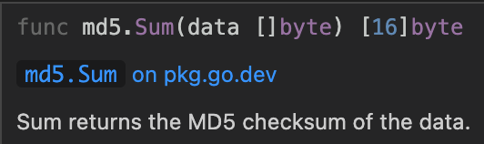

## 一、什么是MD5

MD5信息摘要算法，一种被广泛使用的密码散列函数，可以产生出一个128位（16字节）的散列值（hash value），用于确保信息传输完整一致，MD5算法因其普遍、稳定、快速的特点，仍广泛应用于普通数据的加密保护领域。

### 注意事项

请注意，MD5 哈希算法已被认为不安全，不应在新的系统中使用。在大多数情况下，应使用更安全的哈希算法，例如 SHA-2 或 SHA-3。另外，在使用 MD5 哈希算法时，还应该注意避免使用明文密码，因为 MD5 哈希算法是不可逆的。因此，建议在存储用户密码时使用盐（salt），以防止彩虹表攻击。

## 二、Go语言如何使用MD5加密字符串

Go 语言使用MD5加密主要的是标准库中的"crypto/md5"包来实现的。

通过md5.sum()方法可以将一个比特切片进行Md5加密，返回数据data的MD5校验和。



举例：

```go
package main

import (
	"crypto/md5"
	"fmt"
)

func MD5(str string) string {
	data := []byte(str) //切片
	has := md5.Sum(data)
	md5str := fmt.Sprintf("%x", has) //将[]byte转成16进制
	return md5str
}


func main(){
	str := MD5("hello")
	fmt.Println(str)
}
```

运行后得到md5校验和

```text
5d41402abc4b2a76b9719d911017c592
```


# MD5加盐

- 盐（salt）
  盐（salt）是一个随机字符串，用于加强散列函数的安全性。在存储用户密码时，可以将盐添加到密码中，然后使用散列函数计算哈希值。这样，即使两个用户使用相同的密码，它们也会产生不同的哈希值，因为它们使用的盐不同。
  例如，假设用户 A 和用户 B 都使用密码 "password"，并且使用盐 "salty" 和 "pepper"。在使用散列函数计算哈希值时，它们的密码分别为 "passwordsalty" 和 "passwordpepper"。这样，即使攻击者知道了用户 A 和用户 B 的哈希值，也无法确定它们使用的密码。
  为了防止彩虹表攻击，盐应当具有足够的随机性，且应存储在数据库中的密码哈希值之外。这样，即使攻击者获得了数据库中的哈希值，也无法使用彩虹表进行暴力破解
- 彩虹表攻击
  彩虹表是一种用于暴力破解散列函数的技术。它使用一张预先计算出的表格，该表格中包含了大量常用密码的哈希值。在攻击过程中，攻击者会使用彩虹表尝试匹配被攻击的数据库中的哈希值，如果匹配成功，则说明找到了对应的密码。
  举个例子，假设有一个名为 "users" 的数据库，其中包含了用户名和哈希后的密码。攻击者希望破解这个数据库，于是使用彩虹表攻击。首先，攻击者会使用彩虹表中的哈希值尝试匹配 "users" 数据库中的哈希值。如果匹配成功，则可以找到对应的密码，并使用该密码登录。
  为了防止彩虹表攻击，建议使用盐（salt）来加强散列函数的安全性。盐是一个随机字符串，可以在存储密码时与密码一起使用散列函数计算哈希值。这样，即使两个用户使用相同的密码，它们也会产生不同的哈希值，因为它们使用的盐不同。
- golang加盐
  在 Go 语言中，您可以使用 crypto/rand 包生成随机盐。例如，您可以使用 crypto/rand.Read 函数生成随机字节数组，然后将其转换为字符串即可。

```go
package main
import (
	"crypto/rand"
	"fmt"
	"io"
)

func generateSalt() string {
	b := make([]byte, 16)
	_, err := io.ReadFull(rand.Reader, b)
	if err != nil {
		return ""
	}
	return fmt.Sprintf("%x", b)
}

func main() {
	fmt.Println(generateSalt()) // Output: 8ec1c9b9a4b2e3f3d4c5a6b7c8d9e0f1
}
```

然后，您可以将盐与密码一起使用散列函数计算哈希值。
例如，使用 MD5 哈希算法：

```go
package main

import (
	"crypto/md5"
	"fmt"
	"io"
)

func hashPassword(password, salt string) string {
	h := md5.New()
	io.WriteString(h, password+salt)
	return fmt.Sprintf("%x", h.Sum(nil))
}

func main() {
	password := "password"
	salt := "salty"
	fmt.Println(hashPassword(password, salt)) // Output: b3b3c55a087b3fddb9f9aabcfd1f5bac
}
```

在存储密码时，需要将盐和哈希值一起存储到数据库中。在验证用户登录时，可以先获取用户输入的密码、盐和哈希值，然后使用相同的散列函数计算哈希，然后与数据库中存储的哈希值进行比对。如果匹配成功，则说明用户输入的密码正确，可以允许用户登录。


[anaskhan96/go-password-encoder：md5加盐](https://github.com/anaskhan96/go-password-encoder)