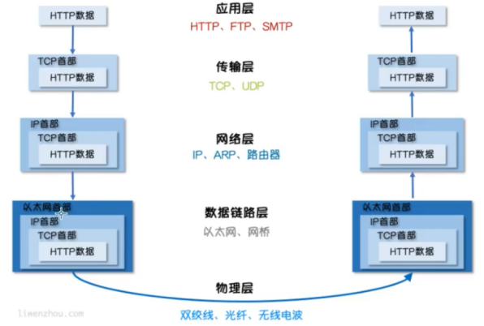

# net包

在go标准库中，net包提供了可移植的网络I/O接口，包括TCP/IP、UDP、域名解析和Unix域socket。本文向大家介绍net标准库的使用，希望对你有帮助。

Socket是BSD UNIX的进程通信机制，通常也称作”套接字”，用于描述IP地址和端口，是一个通信链的句柄。Socket可以理解为TCP/IP网络的API，它定义了许多函数或例程，程序员可以用它们来开发TCP/IP网络上的应用程序。电脑上运行的应用程序通常通过”套接字”向网络发出请求或者应答网络请求。

# Socket图解

Socket编程是在应用层与TCP/IP协议族通信的中间软件抽象层。在设计模式中，Socket其实就是一个门面模式，它把复杂的TCP/IP协议族隐藏在Socket后面，对用户来说只需要调用Socket规定的相关函数，让Socket去组织符合指定的协议数据然后进行通信。




# TCP通信

TCP/IP(Transmission Control Protocol/Internet Protocol) 即传输控制协议/网间协议，是一种面向连接（连接导向）的、可靠的、基于字节流的传输层（Transport layer）通信协议，因为是面向连接的协议，数据像水流一样传输，会存在黏包问题。

## TCP服务端

一个TCP服务端可以同时连接很多个客户端，例如世界各地的用户使用自己电脑上的浏览器访问淘宝网。因为Go语言中创建多个goroutine实现并发非常方便和高效，所以我们可以每建立一次链接就创建一个goroutine去处理。

TCP服务端程序的处理流程：

- 监听端口
- 接收客户端请求建立链接
- 创建goroutine处理链接。

我们使用Go语言的net包实现的TCP服务端代码如下：

```go
// TCP server端 处理函数
func main() {
	listen, err := net.Listen("tcp", "127.0.0.1:20000")
	if err != nil {
		fmt.Println("listen failed, err:", err)
		return
	}
	for {
		conn, err := listen.Accept() // 建立连接
		if err != nil {
			fmt.Println("accept failed, err:", err)
			continue
		}
		go process(conn) // 启动一个goroutine处理连接
	}
}

func process(conn net.Conn) {
	defer conn.Close() // 关闭连接
	for {
		reader := bufio.NewReader(conn)
		var buf [128]byte
		n, err := reader.Read(buf[:]) // 读取数据
		if err != nil {
			fmt.Println("read from client failed, err:", err)
			break
		}
		recvStr := string(buf[:n])
		fmt.Println("收到client端发来的数据：", recvStr)
		conn.Write([]byte(recvStr)) // 发送数据
	}
}
```

将上面的代码保存之后编译成`server`或`server.exe`可执行文件。

## TCP客户端

一个TCP客户端进行TCP通信的流程如下：

1. 建立与服务端的链接
2. 进行数据收发
3. 关闭链接

使用Go语言的net包实现的TCP客户端代码如下：

```go
// 客户端
func main() {
	conn, err := net.Dial("tcp", "127.0.0.1:20000")
	if err != nil {
		fmt.Println("err :", err)
		return
	}
	defer conn.Close() // 关闭连接
	inputReader := bufio.NewReader(os.Stdin)
	for {
		input, _ := inputReader.ReadString('\n') // 读取用户输入
		inputInfo := strings.Trim(input, "\r\n")
		if strings.ToUpper(inputInfo) == "Q" { // 如果输入q就退出
			return
		}
		_, err = conn.Write([]byte(inputInfo)) // 发送数据
		if err != nil {
			return
		}
		buf := [512]byte{}
		n, err := conn.Read(buf[:]) //读数据
		if err != nil {
			fmt.Println("recv failed, err:", err)
			return
		}
		fmt.Println(string(buf[:n]))
	}
}
```

将上面的代码编译成`client`或`client.exe`可执行文件，先启动server端再启动client端，在client端输入任意内容回车之后就能够在server端看到client端发送的数据，从而实现TCP通信。


## “粘包”现象：

黏包示例。服务端代码如下：

```go
// socket_stick/server/main.go
func process(conn net.Conn) {
	defer conn.Close()
	reader := bufio.NewReader(conn)
	var buf [1024]byte
	for {
		n, err := reader.Read(buf[:])
		if err == io.EOF {
			break
		}
		if err != nil {
			fmt.Println("read from client failed, err:", err)
			break
		}
		recvStr := string(buf[:n])
		fmt.Println("收到client发来的数据：", recvStr)
	}
}

func main() {
	listen, err := net.Listen("tcp", "127.0.0.1:30000")
	if err != nil {
		fmt.Println("listen failed, err:", err)
		return
	}
	defer listen.Close()
	for {
		conn, err := listen.Accept()
		if err != nil {
			fmt.Println("accept failed, err:", err)
			continue
		}
		go process(conn)
	}
}
```

客户端代码如下：

```go
// socket_stick/client/main.go
func main() {
	conn, err := net.Dial("tcp", "127.0.0.1:30000")
	if err != nil {
		fmt.Println("dial failed, err", err)
		return
	}
	defer conn.Close()
	for i := 0; i < 20; i++ {
		msg := `Hello, Hello. How are you?`
		conn.Write([]byte(msg))
	}
}
```

将上面的代码保存后，分别编译。先启动服务端再启动客户端，可以看到服务端输出结果如下：

```bash
收到client发来的数据： Hello, Hello. How are you?Hello, Hello. How are you?Hello, Hello. How are you?Hello, Hello. How are you?Hello, Hello. How are you?
收到client发来的数据： Hello, Hello. How are you?Hello, Hello. How are you?Hello, Hello. How are you?Hello, Hello. How are you?Hello, Hello. How are you?Hello, Hello. How are you?Hello, Hello. How are you?Hello, Hello. How are you?
收到client发来的数据： Hello, Hello. How are you?Hello, Hello. How are you?
收到client发来的数据： Hello, Hello. How are you?Hello, Hello. How are you?Hello, Hello. How are you?
收到client发来的数据： Hello, Hello. How are you?Hello, Hello. How are you?
```

客户端分10次发送的数据，在服务端并没有成功的输出10次，而是多条数据“粘”到了一起。
为什么会出现粘包：主要原因就是tcp数据传递模式是流模式，在保持长连接的时候可以进行多次的收和发。

**粘包”可发生在发送端也可发生在接收端**

由Nagle算法造成的发送端的粘包：Nagle算法是一种改善网络传输效率的算法。简单来说就是当我们提交一段数据给TCP发送时，TCP并不立刻发送此段数据，而是等待一小段时间看看在等待期间是否还有要发送的数据，若有则会一次把这两段数据发送出去。
接收端接收不及时造成的接收端粘包：TCP会把接收到的数据存在自己的缓冲区中，然后通知应用层取数据。当应用层由于某些原因不能及时的把TCP的数据取出来，就会造成TCP缓冲区中存放了几段数据。

## 粘包解决办法

出现”粘包”的关键在于接收方不确定将要传输的数据包的大小，因此我们可以对数据包进行封包和拆包的操作。

封包：封包就是给一段数据加上包头，这样一来数据包就分为包头和包体两部分内容了(过滤非法包时封包会加入”包尾”内容)。包头部分的长度是固定的，并且它存储了包体的长度，根据包头长度固定以及包头中含有包体长度的变量就能正确的拆分出一个完整的数据包。

我们可以自己定义一个协议，比如数据包的前4个字节为包头，里面存储的是发送的数据的长度。

```go
// socket_stick/proto/proto.go
// Encode 将消息编码
func Encode(message string) ([]byte, error) {
	// 读取消息的长度，转换成int32类型（占4个字节）
	var length = int32(len(message))
	var pkg = new(bytes.Buffer)
	// 写入消息头
	err := binary.Write(pkg, binary.LittleEndian, length)
	if err != nil {
		return nil, err
	}
	// 写入消息实体
	err = binary.Write(pkg, binary.LittleEndian, []byte(message))
	if err != nil {
		return nil, err
	}
	return pkg.Bytes(), nil
}

// Decode 解码消息
func Decode(reader *bufio.Reader) (string, error) {
	// 读取消息的长度
	lengthByte, _ := reader.Peek(4) // 读取前4个字节的数据
	lengthBuff := bytes.NewBuffer(lengthByte)
	var length int32
	err := binary.Read(lengthBuff, binary.LittleEndian, &length)
	if err != nil {
		return "", err
	}
	// Buffered返回缓冲中现有的可读取的字节数。
	if int32(reader.Buffered()) < length+4 {
		return "", err
	}

	// 读取真正的消息数据
	pack := make([]byte, int(4+length))
	_, err = reader.Read(pack)
	if err != nil {
		return "", err
	}
	return string(pack[4:]), nil
}
```

接下来在服务端和客户端分别使用上面定义的`proto`包的`Decode`和`Encode`函数处理数据。

服务端代码如下：

```go
// socket_stick/server2/main.go
func process(conn net.Conn) {
	defer conn.Close()
	reader := bufio.NewReader(conn)
	for {
		msg, err := proto.Decode(reader)
		if err == io.EOF {
			return
		}
		if err != nil {
			fmt.Println("decode msg failed, err:", err)
			return
		}
		fmt.Println("收到client发来的数据：", msg)
	}
}

func main() {
	listen, err := net.Listen("tcp", "127.0.0.1:30000")
	if err != nil {
		fmt.Println("listen failed, err:", err)
		return
	}
	defer listen.Close()
	for {
		conn, err := listen.Accept()
		if err != nil {
			fmt.Println("accept failed, err:", err)
			continue
		}
		go process(conn)
	}
}
```

客户端代码如下：

```go
// socket_stick/client2/main.go
func main() {
	conn, err := net.Dial("tcp", "127.0.0.1:30000")
	if err != nil {
		fmt.Println("dial failed, err", err)
		return
	}
	defer conn.Close()
	for i := 0; i < 20; i++ {
		msg := `Hello, Hello. How are you?`
		data, err := proto.Encode(msg)
		if err != nil {
			fmt.Println("encode msg failed, err:", err)
			return
		}
		conn.Write(data)
	}
}
```

# UDP通信

UDP协议（User Datagram Protocol）中文名称是用户数据报协议，是OSI（Open System Interconnection，开放式系统互联）参考模型中一种无连接的传输层协议，不需要建立连接就能直接进行数据发送和接收，属于不可靠的、没有时序的通信，但是UDP协议的实时性比较好，通常用于视频直播相关领域。

## UDP服务端

使用Go语言的`net`包实现的UDP服务端代码如下：

```go
// UDP server端
func main() {
	listen, err := net.ListenUDP("udp", &net.UDPAddr{
		IP:   net.IPv4(0, 0, 0, 0),
		Port: 30000,
	})
	if err != nil {
		fmt.Println("listen failed, err:", err)
		return
	}
	defer listen.Close()
	for {
		var data [1024]byte
		n, addr, err := listen.ReadFromUDP(data[:]) // 接收数据
		if err != nil {
			fmt.Println("read udp failed, err:", err)
			continue
		}
		fmt.Printf("data:%v addr:%v count:%v\n", string(data[:n]), addr, n)
		_, err = listen.WriteToUDP(data[:n], addr) // 发送数据
		if err != nil {
			fmt.Println("write to udp failed, err:", err)
			continue
		}
	}
}
```

## UDP客户端

使用Go语言的`net`包实现的UDP客户端代码如下：

```go
// UDP 客户端
func main() {
	socket, err := net.DialUDP("udp", nil, &net.UDPAddr{
		IP:   net.IPv4(0, 0, 0, 0),
		Port: 30000,
	})
	if err != nil {
		fmt.Println("连接服务端失败，err:", err)
		return
	}
	defer socket.Close()
	sendData := []byte("Hello server")
	_, err = socket.Write(sendData) // 发送数据
	if err != nil {
		fmt.Println("发送数据失败，err:", err)
		return
	}
	data := make([]byte, 4096)
	n, remoteAddr, err := socket.ReadFromUDP(data) // 接收数据
	if err != nil {
		fmt.Println("接收数据失败，err:", err)
		return
	}
	fmt.Printf("recv:%v addr:%v count:%v\n", string(data[:n]), remoteAddr, n)
}
```

# 更多示例

## 一、 服务端

### 1. 解析地址

在TCP服务端我们需要监听一个TCP地址，因此建立服务端前我们需要生成一个正确的TCP地址，这就需要用到下面的函数了。

```go
// ResolveTCPAddr函数会输出一个TCP连接地址和一个错误信息
func ResolveTCPAddr(network, address string) (*TCPAddr, error)
// 解析IP地址
func ResolveIPAddr(net, addr string) (*IPAddr, error)
// 解析UDP地址
func ResolveUDPAddr(net, addr string) (*UDPAddr, error)
// 解析Unix地址
func ResolveUnixAddr(net, addr string) (*UnixAddr, error)
```

### 2. 监听请求

我们可以通过 Listen方法监听我们解析后的网络地址。

```go
// 监听net类型，地址为laddr的地址
func Listen(net, laddr string) (Listener, error)
// 监听TCP地址
func ListenTCP(network string, laddr *TCPAddr) (*TCPListener, error) 
// 监听IP地址
func ListenIP(netProto string, laddr *IPAddr) (*IPConn, error)
// 监听UDP地址
func ListenMulticastUDP(net string, ifi *Interface, gaddr *UDPAddr) (*UDPConn, error)
func ListenUDP(net string, laddr *UDPAddr) (*UDPConn, error)
// 监听Unix地址
func ListenUnixgram(net string, laddr *UnixAddr) (*UnixConn, error)
func ListenUnix(net string, laddr *UnixAddr) (*UnixListener, error)
```

### 3. 接收请求

TCPAddr 实现了两个接受请求的方法，两者代码实现其实是一样的，唯一的区别是第一种返回了一个对象，第二种返回了一个接口。

```go
func (l *TCPListener) AcceptTCP() (*TCPConn, error)
func (l *TCPListener) Accept() (Conn, error) 
```

其他类型也有类似的方法，具体请参考go语言标准库文档。

### 4. 连接配置

- 配置监听器超时时间

```go
// 超过t之后监听器自动关闭，0表示不设置超时时间
func (l *TCPListener) SetDeadline(t time.Time) error

// 关闭监听器
func (l *TCPListener) Close() error
```

### 5、编写一个服务端

```go
func main() {
	// 解析服务端监听地址，本例以tcp为例
	addr, err := net.ResolveTCPAddr("tcp", "127.0.0.1:8000")
	if err != nil {
		log.Panic(err)
	}
	// 创建监听器
	listen, err := net.ListenTCP("tcp", addr)
	if err != nil {
		log.Panic(err)
	}
	for {
		// 监听客户端连接请求
		conn, err := listen.AcceptTCP()
		if err != nil {
			continue
		}
		// 处理客户端请求 这个函数可以自己编写
		go HandleConnectionForServer(conn)
	}
}
```

## 二、 TCP客户端

### 1. 解析TCP地址

在TCP服务端我们需要监听一个TCP地址，因此建立服务端前我们需要生成一个正确的TCP地址，这就需要用到下面的函数了。

```go
// ResolveTCPAddr函数会输出一个TCP连接地址和一个错误信息
func ResolveTCPAddr(network, address string) (*TCPAddr, error)
```

### 2. 发送连接请求

net包提供了多种连接方法

```go
// DialIP的作用类似于IP网络的拨号
func DialIP(network string, laddr, raddr *IPAddr) (*IPConn, error)
// Dial 连接到指定网络上的地址，涵盖
func Dial(network, address string) (Conn, error)
// 这个方法只是在Dial上面设置了超时时间
func DialTimeout(network, address string, timeout time.Duration) (Conn, error)
// DialTCP 专门用来进行TCP通信的
func DialTCP(network string, laddr, raddr *TCPAddr) (*TCPConn, error)
// DialUDP 专门用来进行UDP通信的
func DialUDP(network string, laddr, raddr *UDPAddr) (*UDPConn, error)
// DialUnix 专门用来进行 Unix 通信
func DialUnix(network string, laddr, raddr *UnixAddr) (*UnixConn, error)
```

### 3. 编写一个客户端

通过下面的例子我们看一下如何编写一个 TCP 客户端：

```go
func main() {
	// 解析服务端地址
	RemoteAddr, err := net.ResolveTCPAddr("tcp", "127.0.0.1:8000")
	if err != nil {
		panic(err)
	}
	// 解析本地连接地址
	LocalAddr, err := net.ResolveTCPAddr("tcp", "127.0.0.1")
	if err != nil {
		panic(err)
	}
	// 连接服务端
	conn, err := net.DialTCP("tcp", LocalAddr, RemoteAddr)
	if err != nil {
		panic(err)
	}
	// 连接管理
	HandleConnectionForClient(conn)
}
```

## 三、 管理连接

> 这里我们来实现一个智能机器人的功能。
> 其实下面的例子也相当于一个socket通信程序，可以通过telnet连接服务端，并进行交互。

### 1. 客户端

我们通过 HandleConnectionForClient(conn) 方法来处理客户端的消息，话不多说，看代码：

```go
package main

import (
	"bufio"
	"fmt"
	"net"
	"os"
	"os/signal"
	"strings"
	"syscall"
)

var sig = make(chan os.Signal)

func main() {
	// 解析服务端地址
	RemoteAddr, err := net.ResolveTCPAddr("tcp", "127.0.0.1:8000")
	if err != nil {
		panic(err)
	}
	// 解析本地连接地址
	LocalAddr, err := net.ResolveTCPAddr("tcp", "127.0.0.1:8001")
	if err != nil {
		panic(err)
	}
	// 连接服务端
	conn, err := net.DialTCP("tcp", LocalAddr, RemoteAddr)
	if err != nil {
		panic(err)
	}
	// 连接管理
	HandleConnectionForClient(conn)
}

// handleConnection 读取数据, 在这里我们可以编写自己的交互程序
func HandleConnectionForClient(conn net.Conn) {
	// 监控系统信号
	go signalMonitor(conn)
	// 初始化一个缓存区
	Stdin := bufio.NewReader(os.Stdin)
	for {
		// 接收服务端返回的消息
		getResponse(conn)
		// 读取用户输入的信息，遇到换行符结束。
		fmt.Print("[ random_w ]# ")
		input, err := Stdin.ReadString('\n')
		if err != nil {
			fmt.Println(err)
		}
		// 删除字符串前后的空格，主要是删除换行符。
		input = strings.TrimSpace(input)
		// 空行不做处理
		if len(input) == 0 {
			continue
		}
		// 是否接收到退出指令
		switch input {
		case "quit", "exit":
			sig <- syscall.SIGQUIT
		default:
			// 发送消息给服务端
			sendMsgToServer(conn, input)
		}
	}
}

// sendMsgToServer 发送消息给服务端
func sendMsgToServer(conn net.Conn, msg string) {
	for {
		_, err := conn.Write([]byte(msg))
		if err == nil {
			break
		}
	}
}

// getResponse 接收服务端返回的消息
func getResponse(conn net.Conn) {
	// 初始化一个1024字节的内存，用来接收服务端的消息
	respByte := make([]byte, 1024)
	// 接收服务端返回的消息
	length, err := conn.Read(respByte)
	if err != nil {
		fmt.Println("[ server ]# 接收消息失败")
	}
	for line, str := range strings.Split(string(respByte[:length]), "\n") {
		if len(str) != 0 {
			if line == 1 {
				fmt.Print(fmt.Sprintf("[ server ]# \n%s\n", str))
				continue
			}
			fmt.Println(str)
		}
	}
}

// signalMonitor 监听系统信号，如果程序收到退出到的信号通过 Goroutine 通知 server 端，关闭连接后退出。
func signalMonitor(conn net.Conn) {
	signal.Notify(sig, syscall.SIGQUIT, syscall.SIGKILL, syscall.SIGINT)
	// 接收到结束信号退出此程序
	select {
	case <-sig:
		// 通知服务端断开连接
		_, _ = conn.Write([]byte("exit"))
		fmt.Println("\nGood Bye !!!!!")
		os.Exit(0)
	}
}
```

### 2. 服务端

我们通过 HandleConnectionForServer(conn) 方法来处理服务端的连接信息。

```go
package main

import (
	"log"
	"net"
)

func main() {
	// 解析服务端监听地址
	addr, err := net.ResolveTCPAddr("tcp", "127.0.0.1:8000")
	if err != nil {
		log.Panic(err)
	}
	// 创建监听器
	listen, err := net.ListenTCP("tcp", addr)
	if err != nil {
		log.Panic(err)
	}
	for {
		// 监听客户端连接请求
		conn, err := listen.AcceptTCP()
		if err != nil {
			continue
		}
		// 处理客户端请求
		go handleConnectionForServer(conn)
	}
}

// handleConnection 读取数据, 在这里我们可以编写自己的交互程序
func handleConnectionForServer(conn net.Conn) {
	for flag := false; ; {
		// 设置消息长度为1024比特
		buf := make([]byte, 1024)
		if !flag {
			// 客户端连接成功，提示可以操作的内容
			if _, err := conn.Write([]byte(Usage())); err != nil {
				log.Println("Error: ", err)
			}
			flag = true
			continue
		}
		/* 读取客户端发送的数据，数据会保存到buf
		这里有一个知识点:
		conn.Read会返回接收到的值的长度，如果不指定长度，通过string转换的时候你会活得一个1024字节的字符串
		但我们不需要后面的初始化的值，因此通过buf[:length]提取我们想要的值。
		*/
		if length, err := conn.Read(buf); err != nil {
			// 读取失败
			writeResponse(parseRequest(""), conn)
		} else {
			// 读取成功
			req := string(buf[:length])
			if req == "exit" {
				break
			}
			writeResponse(parseRequest(req), conn)
		}
	}
}

func Usage() string {
	return `
---------------------------------------------------------------
Hello, my name is randow_w, I'm glad to serve you.
I can provide you with the following services:
1.查工资
2.猜年龄
3.查天气
----------------------------------------------------------------`
}

// writeResponse 返回信息给客户端
func writeResponse(resp string, conn net.Conn) {
	if _, err := conn.Write([]byte(resp)); err != nil {
		log.Println("Error: ", err)
	}
}

// parseRequest 解析客户端输入的信息
func parseRequest(req string) (resp string) {
	switch req {
	case "查工资":
		resp = checkSalary()
	case "猜年龄":
		resp = guessAge()
	case "查天气":
		resp = chat()
	default:
		resp = "对不起，我爸爸还没有教我怎么回答你，能不能换一个问题(*^_^*)"
	}
	return
}

// 查工资
func checkSalary() string {
	return "据权威机构推测，你未来有机会冲刺福布斯排行榜，加油哦(ง •_•)ง"
}

// 猜年龄
func guessAge() string {
	return "永远18岁"
}

// 聊天
func chat() string {
	return "你好，主人，今天是晴天，空气质量优，适合去爬山。"
}
```

注意：服务端里面你自己也可以定义一些方法用来处理客户端的请求，这里只写了几个简单的例子。

### 3. 测试

启动服务端：

```go
$ go run server.go
```

启动客户端：

```go
$ go run client.go
[ server ]#
---------------------------------------------------------------
Hello, my name is randow_w, I'm glad to serve you.
I can provide you with the following services:
1.查工资
2.猜年龄
3.查天气
----------------------------------------------------------------
[ random_w ]# 查工资
据权威机构推测，你未来有机会冲刺福布斯排行榜，加油哦(ง •_•)ง
[ random_w ]# 猜年龄
永远18岁
[ random_w ]# 查天气
你好，主人，今天是晴天，空气质量优，适合去爬山。
[ random_w ]# 你好
对不起，我还在爸爸没有教我怎么回答你，能不能换一个问题(*^_^*)
[ random_w ]# quit

Good Bye !!!!!
```

## 四、 UDP

> 通过net包我们还可以创建一个UDP连接，下面我们通过代码学习如何创建UDP通信的客户端和服务端。

### 1. UDP 服务端

```go
package main

import (
	"fmt"
	"log"
	"net"
)

func main() {
	// 解析服务端监听地址
	addr, err := net.ResolveUDPAddr("udp", "127.0.0.1:8000")
	if err != nil {
		log.Panic(err)
	}
	// 创建监听器
	listen, err := net.ListenUDP("udp", addr)
	if err != nil {
		log.Panic(err)
	}
	for {
		// 设置消息长度为1024比特
		buf := make([]byte, 1024)
		// 读取消息，UDP不是面向连接的因此不需要等待连接
		length, udpAddr, err := listen.ReadFromUDP(buf)
		if err != nil {
			log.Println("Error: ", err)
			continue
		}
		fmt.Println("[ server ]# UdpAddr: ", udpAddr, "Data: ", string(buf[:length]))
	}
}
```

### 2. UDP 客户端

```go
package main

import (
	"bufio"
	"fmt"
	"net"
	"os"
	"os/signal"
	"strings"
	"syscall"
)

var sig = make(chan os.Signal)

func main() {
	// 解析服务端地址
	RemoteAddr, err := net.ResolveUDPAddr("udp", "127.0.0.1:8000")
	if err != nil {
		panic(err)
	}
	// 解析本地连接地址
	LocalAddr, err := net.ResolveUDPAddr("udp", "127.0.0.1:8001")
	if err != nil {
		panic(err)
	}
	// 连接服务端
	conn, err := net.DialUDP("udp", LocalAddr, RemoteAddr)
	if err != nil {
		panic(err)
	}
	// 连接管理
	HandleConnectionForClient(conn)
}

// handleConnection 读取数据, 在这里我们可以编写自己的交互程序
func HandleConnectionForClient(conn net.Conn) {
	// 监控系统信号
	go signalMonitor(conn)
	// 初始化一个缓存区
	Stdin := bufio.NewReader(os.Stdin)
	for {
		// 读取用户输入的信息，遇到换行符结束。
		fmt.Print("[ random_w ]# ")
		input, err := Stdin.ReadString('\n')
		if err != nil {
			fmt.Println(err)
		}
		// 删除字符串前后的空格，主要是删除换行符。
		input = strings.TrimSpace(input)
		// 空行不做处理
		if len(input) == 0 {
			continue
		}
		// 是否接收到退出指令
		switch input {
		case "quit", "exit":
			sig <- syscall.SIGQUIT
		default:
			// 发送消息给服务端
			sendMsgToServer(conn, input)
		}
	}
}

// sendMsgToServer 发送消息给服务端
func sendMsgToServer(conn net.Conn, msg string) {
	for {
		_, err := conn.Write([]byte(msg))
		if err == nil {
			break
		}
	}
}

// signalMonitor 监听系统信号，如果程序收到退出到的信号通过 Goroutine 通知 server 端，关闭连接后退出。
func signalMonitor(conn net.Conn) {
	signal.Notify(sig, syscall.SIGQUIT, syscall.SIGKILL, syscall.SIGINT)
	// 接收到结束信号退出此程序
	select {
	case <-sig:
		// 通知服务端断开连接
		_, _ = conn.Write([]byte("exit"))
		fmt.Println("\nGood Bye !!!!!")
		os.Exit(0)
	}
}
```

### 3. 测试

开启服务端：

```bash
$ go run udpserver.go
```

开启客户端并传递信息：

```go
$ go run udpclient.go
[ random_w ]# hello world
[ random_w ]# udp test
[ random_w ]# exit
[ random_w ]#
Good Bye !!!!!
```

服务端接收到消息：

```go
$ go run udpserver.go
[ server ]# UdpAddr:  127.0.0.1:8001 Data:  hello world
[ server ]# UdpAddr:  127.0.0.1:8001 Data:  udp test
[ server ]# UdpAddr:  127.0.0.1:8001 Data:  exit
```

## 五、 域名解析

### 1. dns 正向解析

> CNAME 被称为规范名字。这种记录允许您将多个名字映射到同一台计算机。 通常用于同时提供WWW和MAIL服务的计算机。例如，有一台计算机名为“r0WSPFSx58.”（A记录）。 它同时提供WWW和MAIL服务，为了便于用户访问服务。可以为该计算机设置两个别名（CNAME）：WWW和MAIL。
>

- 域名解析到cname


```go
func LookupCNAME(name string) (cname string, err error)
```

- 域名解析到地址

```go
func LookupHost(host string) (addrs []string, err error)
```

- 域名解析到地址[]IP结构体.可以对具体ip进行相关操作(是否回环地址,子网,网络号等)

```go
func LookupIP(host string) (addrs []IP, err error)
```

### 2. dns 反向解析

```go
// 根据ip地址查找主机名地址(必须得是可以解析到的域名)[dig -x ipaddress]
func LookupAddr(addr string) (name []string, err error)
```

### 3. 应用

```go
package main

import (
	"fmt"
	"net"
)

func main() {
    // 域名改成自己要测试的
	dns := "www.baidu.com"
	// 解析cname
	cname, _ := net.LookupCNAME(dns)
	fmt.Println("cname:", cname)
	// 解析ip地址
	ips, err := net.LookupHost(dns)
	if err != nil {
		fmt.Println("Err: ", err.Error())
		return
	}
	fmt.Println(ips)
	// 反向解析(主机必须得能解析到地址), IP地址改成你的
	dnsName, _ := net.LookupAddr("10.X.X.X")
	fmt.Println("Hostname:", dnsName)
}
```

Output:

```go
$ go run main.go
cname: www.a.shifen.com.
[14.215.177.38 14.215.177.39]
Hostname: [paas.bk.com. cmdb.bk.com. job.bk.com.]
```
