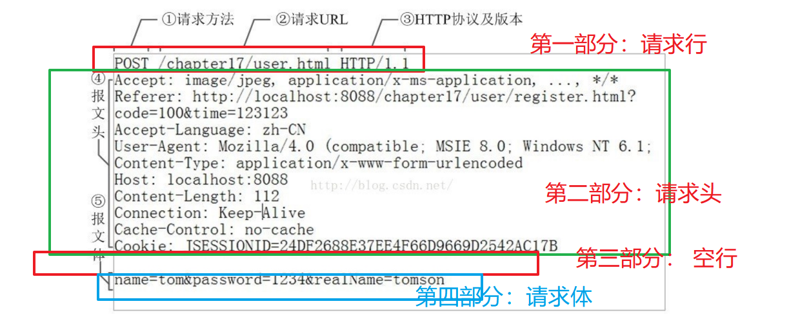
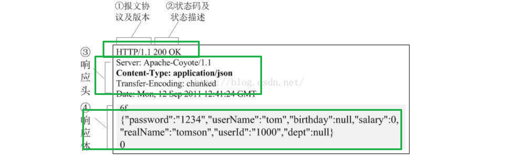
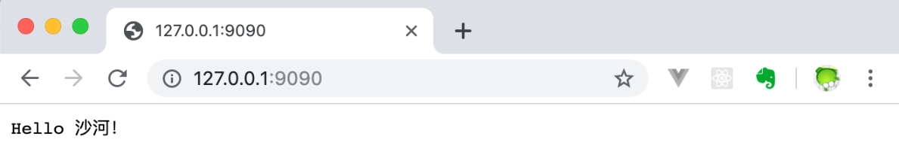
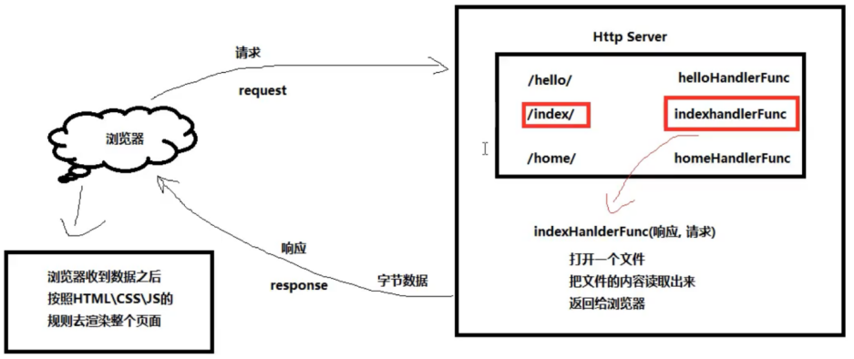

# net/http包

Go语言内置的`net/http`包提供了HTTP客户端和服务端的实现。
Socket是BSD UNIX的进程通信机制，通常也称作”套接字”，用于描述IP地址和端口，是一个通信链的句柄。Socket可以理解为TCP/IP网络的API，它定义了许多函数或例程，程序员可以用它们来开发TCP/IP网络上的应用程序。电脑上运行的应用程序通常通过”套接字”向网络发出请求或者应答网络请求。

# Socket图解

Socket编程是在应用层与TCP/IP协议族通信的中间软件抽象层。在设计模式中，Socket其实就是一个门面模式，它把复杂的TCP/IP协议族隐藏在Socket后面，对用户来说只需要调用Socket规定的相关函数，让Socket去组织符合指定的协议数据然后进行通信。


# TCP通信

## TCP协议

TCP/IP(Transmission Control Protocol/Internet Protocol) 即传输控制协议/网间协议，是一种面向连接（连接导向）的、可靠的、基于字节流的传输层（Transport layer）通信协议，因为是面向连接的协议，数据像水流一样传输，会存在黏包问题。

## TCP服务端

​	##一个TCP服务端可以同时连接很多个客户端，例如世界各地的用户使用自己电脑上的浏览器访问淘宝网。因为Go语言中创建多个goroutine实现并发非常方便和高效，所以我们可以每建立一次链接就创建一个goroutine去处理。

> TCP服务端程序的处理流程：
>
> 1、监听端口 2、接收客户端请求建立链接	3、创建goroutine处理链接。

> TCP客户端进行TCP通信的流程如下：
>
> 1、建立与服务端的链接	2、进行数据收发	3、关闭链接


## “粘包”现象：
客户端分10次发送的数据，在服务端并没有成功的输出10次，而是多条数据“粘”到了一起。
为什么会出现粘包：主要原因就是tcp数据传递模式是流模式，在保持长连接的时候可以进行多次的收和发。

###“粘包”可发生在发送端也可发生在接收端
由Nagle算法造成的发送端的粘包：Nagle算法是一种改善网络传输效率的算法。简单来说就是当我们提交一段数据给TCP发送时，TCP并不立刻发送此段数据，而是等待一小段时间看看在等待期间是否还有要发送的数据，若有则会一次把这两段数据发送出去。
接收端接收不及时造成的接收端粘包：TCP会把接收到的数据存在自己的缓冲区中，然后通知应用层取数据。当应用层由于某些原因不能及时的把TCP的数据取出来，就会造成TCP缓冲区中存放了几段数据。

## 解决办法：
出现”粘包”的关键在于接收方不确定将要传输的数据包的大小，因此我们可以对数据包进行封包和拆包的操作。
封包：封包就是给一段数据加上包头，这样一来数据包就分为包头和包体两部分内容了(过滤非法包时封包会加入”包尾”内容)。包头部分的长度是固定的，并且它存储了包体的长度，根据包头长度固定以及包头中含有包体长度的变量就能正确的拆分出一个完整的数据包。
我们可以自己定义一个协议，比如数据包的前4个字节为包头，里面存储的是发送的数据的长度。
定义的proto包的Decode和Encode函数处理数据
其中包含大端和小端的知识

# UDP通信

UDP协议（User Datagram Protocol）中文名称是用户数据报协议，是OSI（Open System Interconnection，开放式系统互联）参考模型中一种无连接的传输层协议，不需要建立连接就能直接进行数据发送和接收，属于不可靠的、没有时序的通信，但是UDP协议的实时性比较好，通常用于视频直播相关领域。


# HTTP协议

超文本传输协议（HTTP，HyperText Transfer Protocol)是互联网上应用最为广泛的一种网络传输协议，所有的WWW文件都必须遵守这个标准。设计HTTP最初的目的是为了提供一种发布和接收HTML页面的方法。

HTTP协议：超文本传输协议（HTTP，HyperText Transfer Protocol)是互联网上应用最为广泛的一种网络传输协议，所有的WWW文件都必须遵守这个标准。设计HTTP最初的目的是为了提供一种发布和接收HTML页面的方法。

Go语言内置的net/http包提供了HTTP客户端和服务端的实现。

# http请求报文格式



一个http请求可以分为4部分：

1. 请求行：包含三部分
   1. 格式：  方法   +   URL   + 协议版本号
   2. 实例： POST  +   /chapter17/user   + HTTP/1.1
   3. 请求方法：
      1. GET：获取数据
      2. POST：上传数据（表单格式，json格式）
      3. PUT：修改数据
      4. DELETE： 用于删除数据
2. 请求头
   1. 格式：  key ：value
   2. 可以有很多个键值对（包含协议自带，也包含用户自定义的）
   3. 常见重要头：
      1. Accept : 接收数据的格式
      2. User-Agent : 描述用户浏览器的信息
      3. Connection： Keep-Alive (长链接)， Close（短连接）
      4. Aceept-Encoding : gzip, xxx  , 描述可以接受的编码
      5. Cookie: 由服务器设置的key=value数据，客户端下次请求的时候可以携带过来
      6. Content-Type: 
         1. appliction/-form(表示上传的数据是表单格式), 
         2. application/json(表示body的数据是json格式)
      7. 用户可以自定义的：
         1. name : Duke
         2. age : 18
3. 空行
   1. 告诉服务器，请求头结束了，用于分割
4. 请求包体(可选的)
   1. 一般在POST方法时，会配套提供BODY
   2. 在GET的时候也可以提供BODY，但是这样容易让人混淆，建议不要这样使用
   3. 上传两种数据格式：
      1. 表单： 姓名，性别，年龄
      2. json数据格式


启动tcp的server案例，使用postman发起http请求，查看http请求头信息：

```go
import (
	"fmt"
	"net"
	"strings"
)

func main() {
	//创建监听
	ip := "127.0.0.1"
	port := 8848
	address := fmt.Sprintf("%s:%d", ip, port)

	//func Listen(network, address string) (Listener, error) {
	//net.Listen("tcp", ":8848") //简写，冒号前面默认是本机: 127.0.0.1
	listener, err := net.Listen("tcp", address)

	if err != nil {
		fmt.Println("net.Listen err:", err)
		return
	}
	fmt.Println("server start ...")

	//需求：
	// server可以接收多个连接， ====> 主go程负责监听，子go程负责数据处理
	// 每个连接可以接收处理多轮数据请求

	for {
		fmt.Println("监听中...")

		//Accept() (Conn, error)
		conn, err := listener.Accept()
		if err != nil {
			fmt.Println("listener.Accept err:", err)
			return
		}

		fmt.Println("连接建立成功!")

		go handleFunc(conn)
	}
}

//处理具体业务的逻辑，需要将conn传递进来，每一新连接，conn是不同的
func handleFunc(conn net.Conn) {
	for { //这个for循环，保证每一个连接可以多次接收处理客户端请求
		//创建一个容器，用于接收读取到的数据
		buf := make([]byte, 1024) //使用make来创建字节切片, byte ==> uint8

		fmt.Println("准备读取客户端发送的数据....")

		//Read(b []byte) (n int, err error)
		//cnt：真正读取client发来的数据的长度
		cnt, err := conn.Read(buf)
		if err != nil {
			fmt.Println("conn.Read err:", err)
			return
		}

		fmt.Println("Client =====> Server, 长度:", cnt, "，数据:", string(buf[0:cnt]))

		//服务器对客户端请求进行响应 ,将数据转成大写 "hello" ==> HELLO
		//func ToUpper(s string) string {
		upperData := strings.ToUpper(string(buf[0:cnt]))

		//Write(b []byte) (n int, err error)
		cnt, err = conn.Write([]byte(upperData))
		fmt.Println("Client  <====== Server, 长度:", cnt, "，数据:", upperData)
	}
	
	_ = conn.Close() //关闭连接
}
```

# http响应消息格式



http响应格式也分为4部分：

1. 第一部分：状态行

   1. 协议格式：   协议版本号 +   状态码   + 状态描述

   2. 实例1：HTTP/1.1   + 200  + OK

   3. 实例2：HTTP/1.1   +404 +  not found

   4. 常用的状态码：

      - 1xx  ===》客户端可以即系发送请求（一般感知不到）
      - 2xx  ===》正常访问， 200
      - 3xx  ===》重定向
      - 4xx
        - 401  ===》 未授权 not authorized
        - 404  ===> Not found
      - 5xx
        - 501 ==> Internal Error  （服务器内部错误）

2. 第二部分：响应头

   1. Content-Type : application/json
   2. Server: Apache
   3. Data : Mon, 12 Sep ...
   4. ....

3. 第三部分：空行

   1. 用于分割，表示下面没有响应头了

4. 第四部分：响应包体

   1. 通常是返回json数据

# HTTP服务端

http包中重要结构体说明：分两个部分`w http.ResponseWriter`, `r *http.Request`

```go
type ResponseWriter interface {
    Header() Header
    Write([]byte) (int, error)
    WriteHeader(statusCode int)
}
```

```go
type Request struct {
    Method           string
    URL              *url.URL
    Proto            string
    ProtoMajor       int
    ProtoMinor       int
    Header           Header
    Body             io.ReadCloser
    GetBody          func() (io.ReadCloser, error)
    ContentLength    int64
    TransferEncoding []string
    Close            bool
    Host             string
    Form             url.Values
    PostForm         url.Values
    MultipartForm    *multipart.Form
    Trailer          Header
    RemoteAddr       string
    RequestURI       string
    TLS              *tls.ConnectionState
    Cancel           <-chan struct{}
    Response         *Response
    ctx              context.Context
}
```

**Request**重要字段介绍：

Body：只能读取一次，意味着你读了别人就不能读了;别人读了你就不能读了;

GetBody：原则上是可以多次读取，但是在原生的http.Request里面，这个是 nil在读取到 body 之后，我们就可以用于反序列化。

比如说将ison格式的字符串转化为一个对象等

```go
	body := make([]byte, lens)
	r.Body.Read(body)         //将请求体读到Body中
	getBody, _ := r.GetBody() // GetBody()函数可以对body进行多次读取
	getBody.Read(body)
```


## 创建Server端

ListenAndServe使用指定的监听地址和处理器启动一个HTTP服务端。处理器参数通常是nil，这表示采用包变量DefaultServeMux作为处理器。

Handle和HandleFunc函数可以向DefaultServeMux添加处理器。

```go
http.Handle("/foo", fooHandler)
http.HandleFunc("/bar", func(w http.ResponseWriter, r *http.Request) {
	fmt.Fprintf(w, "Hello, %q", html.EscapeString(r.URL.Path))
})
log.Fatal(http.ListenAndServe(":8080", nil))
```

示例文件如下：

使用Go语言中的`net/http`包来编写一个简单的接收HTTP请求的Server端示例，`net/http`包是对net包的进一步封装，专门用来处理HTTP协议的数据。具体的代码如下：

```go
// http server
func sayHello(w http.ResponseWriter, r *http.Request) {
	fmt.Fprintln(w, "Hello 沙河！")
}

func main() {
	http.HandleFunc("/", sayHello)
	err := http.ListenAndServe(":9090", nil)
	if err != nil {
		fmt.Printf("http server failed, err:%v\n", err)
		return
	}
}
```

将上面的代码编译之后执行，打开你电脑上的浏览器在地址栏输入`127.0.0.1:9090`回车，此时就能够看到如下页面了。



## 自定义的Server端

要管理服务端的行为，可以创建一个自定义的Server：

```go
s := &http.Server{
	Addr:           ":8080",
	Handler:        myHandler,
	ReadTimeout:    10 * time.Second,
	WriteTimeout:   10 * time.Second,
	MaxHeaderBytes: 1 << 20,
}
log.Fatal(s.ListenAndServe())
```

## 参数获取

### 获取请求 URL中的参数

Request 结构中的 URL 字段用于表示请求行中包含的 URL，改字段是一个指向url.URL 结构的指针

#### type [URL]字段

```go
type URL struct {
    Scheme   string
    Opaque   string    // 编码后的不透明数据
    User     *Userinfo // 用户名和密码信息
    Host     string    // host或host:port
    Path     string
    RawQuery string // 编码后的查询字符串，没有'?'
    Fragment string // 引用的片段（文档位置），没有'#'
}
```

URL类型代表一个解析后的URL（或者说，一个URL参照）。URL基本格式如下：

```go
scheme://[userinfo@]host/path[?query][#fragment]
```

scheme后不是冒号加双斜线的URL被解释为如下格式：

```go
scheme:opaque[?query][#fragment]
```

注意路径字段是以解码后的格式保存的，如/%47%6f%2f会变成/Go/。这导致我们无法确定Path字段中的斜线是来自原始URL还是解码前的%2f。除非一个客户端必须使用其他程序/函数来解析原始URL或者重构原始URL，这个区别并不重要。此时，HTTP服务端可以查询req.RequestURI，而HTTP客户端可以使用URL{Host: "example.com", Opaque: "//example.com/Go%2f"}代替{Host: "example.com", Path: "/Go/"}。

#### Path 字段

获取请求的 URL

例如：http://localhost:8080/hello?username=admin&password=123456

​	通过 r.URL.Path 只能得到 **/hello**

#### RawQuery 字段

获取请求的 URL 后面?后面的查询字符串

例如：http://localhost:8080/hello?username=admin&password=123456

​	通过 r.URL.RawQuery 得到的是 username=admin&password=123456

### 获取请求头中的信息

通过 Request 结果中的 Header 字段用来获取请求头中的所有信息，Header 字段的类型是 Header 类型，而 Header 类型是一个 map[string][]string，string 类型的 key，string 切片类型的值。

```go
type Header map[string][]string
```

Header代表HTTP头域的键值对。

```
func (h Header) Get(key string) string
```

Get返回键对应的第一个值，如果键不存在会返回""。如要获取该键对应的值切片，请直接用规范格式的键访问map。

```
func (h Header) Set(key, value string)
```

Set添加键值对到h，如键已存在则会用只有新值一个元素的切片取代旧值切片。

```
func (h Header) Add(key, value string)
```

Add添加键值对到h，如键已存在则会将新的值附加到旧值切片后面。

```
func (h Header) Del(key string)
```

Del删除键值对。

```
func (h Header) Write(w io.Writer) error
```

Write以有线格式将头域写入w。

1) 获取请求头中的所有信息

**r.Header**得到的结果如下：、

**map**[User-Agent:[Mozilla/5.0 (Windows NT 10.0; Win64; x64) 

AppleWebKit/537.36 (KHTML, like Gecko) Chrome/67.0.3396.62 Safari/537.36] 

Accept:[text/html,application/xhtml+xml,application/xml;q=0.9,image/webp,ima

ge/apng,*/*;q=0.8] Accept-Encoding:[gzip, deflate, br] Accept-Language:[zh

CN,zh;q=0.9,en-US;q=0.8,en;q=0.7] Connection:[keep-alive] Upgrade-Insecure

Requests:[1]]

2) 获取请求头中的某个具体属性的值，如获取 Accept-Encoding 的值

方式一：**r.Header[“Accept-Encoding”]**

i. 得到的是一个字符串切片

ii. 结果[gzip, deflate, br]

方式二：**r.Header.Get(“Accept-Encoding”)**

i. 得到的是字符串形式的值，多个值使用逗号分隔

ii. 结果gzip, deflate, br

### **获取请求体中的信息**

请求和响应的主体都是有 Request 结构中的 Body 字段表示，这个字段的类型是io.ReadCloser 接口，该接口包含了 Reader 接口和 Closer 接口，Reader 接口拥有 Read方法，Closer 接口拥有 Close 方法

```
type ReadCloser interface {
	Reader
	Closer
}
```

ReadCloser是一个接口，它将基本的Read和Close方法组合在一起。

```
type Reader interface {
	Read(p []byte) (n int, err error)
}
```

Reader是包装基本Read方法的接口。

Read将len（p）个字节读入p。它返回字节数 read（0<= n<= len（p））和遇到的任何错误。即使阅读 返回n<len（p），它可以在调用期间使用所有p作为临时空间。 如果某些数据可用，但不是len（p）字节，则按常规读取 返回可用的而不是等待更多。

当读取遇到错误或文件结束条件时 成功阅读n>个字节，则返回 字节读取。它可能从同一个调用返回（非nil）错误 或者从后续调用返回错误（并且n == 0）。 这种一般情况的一个实例是返回 输入流末尾的非零字节数可以 返回err == EOF或err == nil。下一次阅读应该 return 0，EOF.调用方应始终处理之前返回的>n字节 考虑到误差Err.这样做可以正确处理I/O错误 在阅读一些字节之后发生的，并且 允许的EOF行为。

不鼓励Read的实现返回 零字节计数，错误为nil，除非len（p）== 0。 调用者应该把0和nil的返回值视为 什么都没发生特别地，它不指示EOF。

实现不能保留p。

```
type Closer interface {
	Close() error
}
```

Closer是包装基本Close方法的接口。

第一次调用后的Close行为未定义。 具体实现可以记录它们自己的行为。

```go
func handler(w http.ResponseWriter, r *http.Request) {//获取内容的长度
	length := r.ContentLength//创建一个字节切片
	body := make([]byte, length)//读取请求体
	r.Body.Read(body)
	fmt.Fprintln(w, "请求体中的内容是：", string(body))
}
```

> 请求体中的内容是： username=hanzong&password=666666

### 获取请求参数

下面我们就通过 net/http 库中的 Request 结构的字段以及方法获取**请求 URL 后面**的请求参数以及 **form 表单**中提交的请求参数

####  **Form 字段**

1)  **url.Values** 类型，Form 是解析好的表单数据，包括 URL 字段的 query参数和 POST 或 PUT 的表单数据。

```
type Values map[string][]string
```

Values将字符串键映射到值列表。 它通常用于查询参数和表单值。 与http.Header映射不同，Values映射中的键 区分大小写。

2) Form 字段只有在调用 Request 的 **ParseForm** 方法后才有效。在客户端，会忽略请求中的本字段而使用 Body 替代

```
func (r *Request) ParseForm() error
```

ParseForm解析URL中的查询字符串，并将解析结果更新到r.Form字段。

对于POST或PUT请求，ParseForm还会将body当作表单解析，并将结果既更新到r.PostForm也更新到r.Form。解析结果中，POST或PUT请求主体要优先于URL查询字符串（同名变量，主体的值在查询字符串的值前面）。

如果请求的主体的大小没有被MaxBytesReader函数设定限制，其大小默认限制为开头10MB。

ParseMultipartForm会自动调用ParseForm。重复调用本方法是无意义的。

3) 获取表单中提交的请求参数（username 和 password）

```go
r.ParseForm() //解析表单
fmt.Fprintln(w, "请求参数为：", r.Form)//获取所有请求参数
```

> 请求参数为： map[password:[666666] username:[hanzong]]

#### Value字段

**FormValue 方法**

快速地获取某一个请求参数，该方法调用之前会自动调用 ParseMultipartForm 和 ParseForm 方法对表单进行解析

```go
func (r *Request) FormValue(key string) string
```


窗体值返回查询的命名组件的第一个值。

**PostFormValue 方法**

快速地获取表单中的某一个请求参数，该方法调用之前会自动调用 ParseMultipartForm 和 ParseForm 方法对表单进行解析

```go
func (r *Request) PostFormValue(key string) string
```

PostFormValue 返回 POST、PATCH 或 PUT 请求正文的命名组件的第一个值。

 **MultipartForm 字段** 

为了取得 multipart/form-data 编码的表单数据，我们需要用到 Request 结构的ParseMultipartForm 方法和 MultipartForm 字段，我们通常上传文件时会将 form 表单的enctype 属性值设置为 multipart/form-data

```go
func (r *Request) ParseMultipartForm(maxMemory int64) error //解析表单
fmt.Fprintln(w, r.MultipartForm) //打印表单数据
```

> &{map[username:[hanzong]] map[photo:[0xc042126000]]}

将请求正文解析为多部分/表单数据。

## 自定义header头中Transport内容

要管理代理、TLS配置、keep-alive、压缩和其他设置，创建一个Transport：

```go
tr := &http.Transport{
	TLSClientConfig:    &tls.Config{RootCAs: pool},
	DisableCompression: true,
}
client := &http.Client{Transport: tr}
resp, err := client.Get("https://example.com")
```

Client和Transport类型都可以安全的被多个goroutine同时使用。出于效率考虑，应该一次建立、尽量重用。


## http/template包

html/template包实现了数据驱动的模板，用于生成可防止代码注入的安全的HTML内容。它提供了和text/template包相同的接口，Go语言中输出HTML的场景都应使用html/template这个包。

### Go语言的模板引擎

Go语言内置了文本模板引擎text/template和用于HTML文档的html/template。它们的作用机制可以简单归纳如下：
模板文件通常定义为.tmpl和.tpl为后缀（也可以使用其他的后缀），必须使用UTF8编码。
模板文件中使用{{和}}包裹和标识需要传入的数据。
传给模板这样的数据就可以通过点号（.）来访问，如果数据是复杂类型的数据，可以通过{ { .FieldName }}来访问它的字段。
除{{和}}包裹的内容外，其他内容均不做修改原样输出。

### 模板与渲染

在一些前后端不分离的Web架构中，我们通常需要在后端将一些数据渲染到HTML文档中，从而实现动态的网页（网页的布局和样式大致一样，但展示的内容并不一样）效果。
我们这里说的模板可以理解为事先定义好的HTML文档文件，模板渲染的作用机制可以简单理解为文本替换操作–使用相应的数据去替换HTML文档中事先准备好的标记。
很多编程语言的Web框架中都使用各种模板引擎，比如Python语言中Flask框架中使用的jinja2模板引擎。

### template模板引擎响应

Go 为我们提供了 **text/template** 库和 **html/template** 库这两个模板引擎，模板引擎通过将数据和模板组合在一起生成最终的 HTML，而处理器负责调用模板引擎并将引擎生成的 HTMl 返回给客户端。

Go 的模板都是文本文档（其中 Web 应用的模板通常都是 HTML），它们都嵌入了一些称为**动作**的指令。从模板引擎的角度来说，模板就是嵌入了动作的文本（这些文本通常包含在模板文件里面），而模板引擎则通过分析并执行这些文本来生成出另外一些文本。

Go语言模板引擎的使用可以分为三部分：定义模板文件、解析模板文件和模板渲染.

#### 定义HelloWorld模板

使用 Go 的 Web 模板引擎需要以下两个步骤:

(1) 、对文本格式的模板源进行语法分析，创建一个经过语法分析的模板结构，其中模板源既可以是一个字符串，也可以是模板文件中包含的内容。

(2)、经过语法分析的模板，将 ResponseWriter 和模板所需的动态数据传递给模板引擎，被调用的模板引擎会把经过语法分析的模板和传入的数据结合起来，生成出最终的 HTML，并将这些 HTML 传递给 ResponseWriter。

```go
func ParseFiles(filenames ...string) (*Template, error)
```

解析文件创建一个新模板，并从命名文件中解析 模板 定义。

当我们调用 ParseFiles 函数解析模板文件时，Go 会创建一个新的模板，并将给定的模板文件的名字作为新模板的名字，如果该函数中传入了多个文件名，那么也只会返回一个模板，而且以第一个文件的文件名作为模板的名字，至于其他文件对应的模板则会被放到一个 map 中。

```go
t, _ := template.ParseFiles("hello.html")
```

以上代码相当于调用 New 函数创建一个新模板，然后再调用 template 的ParseFiles 方法：

```go
t := template.New("hello.html")
t, _ = t.ParseFiles("hello.html")
t, _ := template.ParseGlob("*.html") //通过该函数可以通过指定一个规则一次性传入多个模板文件
```

#### 解析模板文件

上面定义好了模板文件之后，可以使用下面的常用方法去解析模板文件，得到模板对象：

```go
func (t *Template) Parse(src string) (*Template, error)
func ParseFiles(filenames ...string) (*Template, error)
func ParseGlob(pattern string) (*Template, error)
```

当然，你也可以使用func New(name string) *Template函数创建一个名为name的模板，然后对其调用上面的方法去解析模板字符串或模板文件。

#### 解析模板错误

在解析模板时都没有对错误进行处理，Go 提供了一个 Must 函数专门用来处理这个错误。Must 函数可以包裹起一个函数，被包裹的函数会返回一个指向模板的指针和一个错误，如果错误不是 nil，那么 Must 函数将产生一个 panic。

```go
t := template.Must(template.ParseFiles("hello.html"))
```

#### 模板渲染

渲染模板简单来说就是使用数据去填充模板，当然实际上可能会复杂很多。

```go
func (t *Template) Execute(wr io.Writer, data interface{}) error
func (t *Template) ExecuteTemplate(wr io.Writer, name string, data interface{}) error
```


#### **执行模板**

1) 通过 Execute 方法

```go
func (t *Template) Execute(wr io.Writer, data any) error
```

如果只有一个模板文件，调用这个方法总是可行的；但是如果有多个模板文件，调用这个方法只能得到第一个模板

2) 通过 ExecuteTemplate 方法

```go
t, _ := template.ParseFiles("hello.html", "hello2.html")
t.ExecuteTemplate(w, "hello2.html", "我要在 hello2.html 中显示")
```

变量 t 就是一个包含了两个模板的模板集合，第一个模板的名字是hello.html,第二个模板的名字是 hello2.html,如果直接调用 Execute 方法，则只有模板 hello.html 会被执行，如何想要执行模板 hello2.html，则需要调用 ExecuteTemplate 方法


### 模板语法

{{.}}
模板语法都包含在{{和}}中间，其中{{.}}中的点表示当前对象。
当我们传入一个结构体对象时，我们可以根据.来访问结构体的对应字段。
当我们传入的变量是map时，也可以在模板文件中通过.根据key来取值。

#### 注释

{{/* a comment */}}
注释，执行时会忽略。可以多行。注释不能嵌套，并且必须紧贴分界符始止。

#### pipeline

pipeline是指产生数据的操作。比如{{.}}、{{.Name}}等。Go的模板语法中支持使用管道符号|链接多个命令，用法和unix下的管道类似：|前面的命令会将运算结果(或返回值)传递给后一个命令的最后一个位置。
注意：并不是只有使用了|才是pipeline。Go的模板语法中，pipeline的概念是传递数据，只要能产生数据的，都是pipeline。

##### **变量**

我们还可以在模板中声明变量，用来保存传入模板的数据或其他语句生成的结果。具体语法如下：
$obj := {{.}}，其中$obj是变量的名字，在后续的代码中就可以使用该变量了。

##### **移除空格**

有时候我们在使用模板语法的时候会不可避免的引入一下空格或者换行符，这样模板最终渲染出来的内容可能就和我们想的不一样，这个时候可以使用{{-语法去除模板内容左侧的所有空白符号， 使用-}}去除模板内容右侧的所有空白符号。
**例如**：{{- .Name -}}，注意：-要紧挨{{和}}，同时与模板值之间需要使用空格分隔。

##### **条件判断**

Go模板语法中的条件判断有以下几种:

```
{{if pipeline}} T1 {{end}}
{{if pipeline}} T1 {{else}} T0 {{end}}
{{if pipeline}} T1 {{else if pipeline}} T0 {{end}}
```

##### **range**

Go的模板语法中使用range关键字进行遍历，有以下两种写法，其中pipeline的值必须是数组、切片、字典或者通道。
{{range pipeline}} T1 {{end}}
如果pipeline的值其长度为0，不会有任何输出
{{range pipeline}} T1 {{else}} T0 {{end}}
如果pipeline的值其长度为0，则会执行T0。

##### with

{{with pipeline}} T1 {{end}}
如果pipeline为empty不产生输出，否则将dot设为pipeline的值并执行T1。不修改外面的dot。
{{with pipeline}} T1 {{else}} T0 {{end}}
如果pipeline为empty，不改变dot并执行T0，否则dot设为pipeline的值并执行T1。

##### 预定义函数

执行模板时，函数从两个函数字典中查找：首先是模板函数字典，然后是全局函数字典。一般不在模板内定义函数，而是使用Funcs方法添加函数到模板里。

##### 全局函数

预定义的**全局函数**如下：
`and函数`返回它的第一个empty参数或者最后一个参数；
    就是说"and x y"等价于"if x then y else x"；所有参数都会执行；
`or`返回第一个非empty参数或者最后一个参数；
    亦即"or x y"等价于"if x then x else y"；所有参数都会执行；
`not`返回它的单个参数的布尔值的否定
`len`返回它的参数的整数类型长度
`index`执行结果为第一个参数以剩下的参数为索引/键指向的值；
	如"index x 1 2 3"返回x[1][2][3]的值；每个被索引的主体必须是数组、切片或者字典。
`print`即fmt.Sprint	，printf即fmt.Sprintf	，println即fmt.Sprintln
`html`返回与其参数的文本表示形式等效的转义HTML。
    这个函数在html/template中不可用。
`urlquery`以适合嵌入到网址查询中的形式返回其参数的文本表示的转义值。
    这个函数在html/template中不可用。
`js`返回与其参数的文本表示形式等效的转义JavaScript。
`call`执行结果是调用第一个参数的返回值，该参数必须是函数类型，其余参数作为调用该函数的参数；
	如"call .X.Y 1 2"等价于go语言里的dot.X.Y(1, 2)；
    其中Y是函数类型的字段或者字典的值，或者其他类似情况；
    call的第一个参数的执行结果必须是函数类型的值（和预定义函数如print明显不同）；
    该函数类型值必须有1到2个返回值，如果有2个则后一个必须是error接口类型；
    如果有2个返回值的方法返回的error非nil，模板执行会中断并返回给调用模板执行者该错误；
`比较函数`布尔函数会将任何类型的零值视为假，其余视为真。

| 符号 | 含义                     | 符号 | 含义                     |
| ---- | ------------------------ | ---- | ------------------------ |
| eq   | 如果arg1 == arg2则返回真 | ne   | 如果arg1 != arg2则返回真 |
| lt   | 如果arg1 < arg2则返回真  | le   | 如果arg1 <= arg2则返回真 |
| gt   | 如果arg1 > arg2则返回真  | ge   | 如果arg1 >= arg2则返回真 |

为了简化多参数相等检测，eq（只有eq）可以接受2个或更多个参数，它会将第一个参数和其余参数依次比较，
{{eq arg1 arg2 arg3}}
比较函数只适用于基本类型（或重定义的基本类型，如”type Celsius float32”）。但是，整数和浮点数不能互相比较。

#### 自定义函数

Go的模板支持自定义函数。

```go
func New(name string) *Template{}  ，//定义模板文件
func (t *Template) Funcs(funcMap FuncMap) *Template  ，//嵌入模板函数
```


#### 嵌套template

我们可以在template中嵌套其他的template。这个template可以是单独的文件，也可以是通过define定义的template。

#### block

{{block "name" pipeline}} T1 {{end}}
block是定义模板{{define "name"}} T1 {{end}}和执行{{template "name" pipeline}}缩写，典型的用法是定义一组根模板，然后通过在其中重新定义块模板进行自定义。

​	#如果我们的模板名称冲突了，例如不同业务线下都定义了一个index.tmpl模板，我们可以通过下面两种方法来解决。

在模板文件开头使用{{define 模板名}}语句显式的为模板命名，默认使用文件名。
可以把模板文件存放在templates文件夹下面的不同目录中，然后使用template.ParseGlob("templates/**/*.tmpl")解析模板。

#### 修改默认的标识符

Go标准库的模板引擎使用的花括号{{和}}作为标识，而许多前端框架（如Vue和 AngularJS）也使用{{和}}作为标识符，所以当我们同时使用Go语言模板引擎和以上前端框架时就会出现冲突，这个时候我们需要修改标识符，修改前端的或者修改Go语言的。这里演示如何修改Go语言模板引擎默认的标识符：

```go
template.New("test").Delims("{[", "]}").ParseFiles("./t.tmpl")
```

## text模板与html模板的区别

html/template针对的是需要返回HTML内容的场景，在模板渲染过程中会对一些有风险的内容进行转义（如用户评论中有xss注入），以此来防范跨站脚本攻击。


# HTTP客户端

客户端请求方式：



## 基本的HTTP/HTTPS请求

Get、Head、Post和PostForm函数发出HTTP/HTTPS请求。

```go
resp, err := http.Get("http://example.com/")
resp, err := http.Post("http://example.com/upload", "image/jpeg", &buf)
resp, err := http.PostForm("http://example.com/form",url.Values{"key": {"Value"}, "id": {"123"}})
```

程序在使用完response后必须关闭回复的主体。

```go
resp, err := http.Get("http://example.com/")
if err != nil {
	// handle error
}
defer resp.Body.Close()
body, err := ioutil.ReadAll(resp.Body)
// ...
```

## GET请求示例

使用`net/http`包编写一个简单的发送HTTP请求的Client端，代码如下：

```go
func main() {
	resp, err := http.Get("https://www.liwenzhou.com/")
	if err != nil {
		fmt.Printf("get failed, err:%v\n", err)
		return
	}
	defer resp.Body.Close()
  
	body, err := ioutil.ReadAll(resp.Body)
	if err != nil {
		fmt.Printf("read from resp.Body failed, err:%v\n", err)
		return
	}
	fmt.Print(string(body))
}
```

将上面的代码保存之后编译成可执行文件，执行之后就能在终端打印`liwenzhou.com`网站首页的内容了，我们的浏览器其实就是一个发送和接收HTTP协议数据的客户端，我们平时通过浏览器访问网页其实就是从网站的服务器接收HTTP数据，然后浏览器会按照HTML、CSS等规则将网页渲染展示出来。

## 带参数的GET请求示例

关于GET请求的参数需要使用Go语言内置的`net/url`这个标准库来处理。

```go
func main() {
	apiUrl := "http://127.0.0.1:9090/get"
	// URL param
	data := url.Values{}
	data.Set("name", "小王子")
	data.Set("age", "18")
	u, err := url.ParseRequestURI(apiUrl)
	if err != nil {
		fmt.Printf("parse url requestUrl failed, err:%v\n", err)
	}
	u.RawQuery = data.Encode() // URL encode
	fmt.Println(u.String())
	resp, err := http.Get(u.String())
	if err != nil {
		fmt.Printf("post failed, err:%v\n", err)
		return
	}
	defer resp.Body.Close()
  
	b, err := ioutil.ReadAll(resp.Body)
	if err != nil {
		fmt.Printf("get resp failed, err:%v\n", err)
		return
	}
	fmt.Println(string(b))
}
```

对应的Server端HandlerFunc如下：

```go
func getHandler(w http.ResponseWriter, r *http.Request) {
	defer r.Body.Close()
	data := r.URL.Query()
	fmt.Println(data.Get("name"))
	fmt.Println(data.Get("age"))
	answer := `{"status": "ok"}`
	w.Write([]byte(answer))
}
```

## Post请求示例

上面演示了使用`net/http`包发送`GET`请求的示例，发送`POST`请求的示例代码如下：

```go
func main() {
	url := "http://127.0.0.1:9090/post"
	// 表单数据
	//contentType := "application/x-www-form-urlencoded"
	//data := "name=小王子&age=18"
	// json
	contentType := "application/json"
	data := `{"name":"小王子","age":18}`
	resp, err := http.Post(url, contentType, strings.NewReader(data))
	if err != nil {
		fmt.Printf("post failed, err:%v\n", err)
		return
	}
	defer resp.Body.Close()
  
	b, err := ioutil.ReadAll(resp.Body)
	if err != nil {
		fmt.Printf("get resp failed, err:%v\n", err)
		return
	}
	fmt.Println(string(b))
}
```

对应的Server端HandlerFunc如下：

```go
func postHandler(w http.ResponseWriter, r *http.Request) {
	defer r.Body.Close()
	// 1. 请求类型是application/x-www-form-urlencoded时解析form数据
	r.ParseForm()
	fmt.Println(r.PostForm) // 打印form数据
	fmt.Println(r.PostForm.Get("name"), r.PostForm.Get("age"))
	// 2. 请求类型是application/json时从r.Body读取数据
	b, err := ioutil.ReadAll(r.Body)
	if err != nil {
		fmt.Printf("read request.Body failed, err:%v\n", err)
		return
	}
	fmt.Println(string(b))
	answer := `{"status": "ok"}`
	w.Write([]byte(answer))
}
```


## 客户端响应

1、HTTP 处理程序使用 ResponseWriter 接口来构造 HTTP 响应。

```go
type ResponseWriter interface {
    Header() Header
    Write([]byte) (int, error)
    WriteHeader(statusCode int)
}

func (ResponseWriter) Write([]byte) (int, error) //写入将数据作为 HTTP 回复的一部分写入连接。
```

2、给客户端响应 JSON 格式的数据

```go
	w.Header().Set("Content-Type", "application/json") //设置响应头中内容的类型
	user := User{
		ID:       1,
		Username: "admin",
		Password: "123456",
	}

	json, _ := json.Marshal(user) //将 user 转换为 json 格式
	w.Write(json)
```

响应报文中的内容

> HTTP/1.1 200 OK
>
> **Content-Type: application/json**
>
> Date: Fri, 10 Aug 2018 01:58:02 GMT
>
> Content-Length: 47

3、客户端重定向

```go
w.Header().Set("Location", "https:www.baidu.com") //以下操作必须要在 WriteHeader 之前进行
w.WriteHeader(302)
```

响应报文中的内容

> HTTP/1.1 302 Found
>
> **Location: https:www.baidu.c**om
>
> Date: Fri, 10 Aug 2018 01:45:04 GMT
>
> Content-Length: 0
>
> **Content-Type: text/plain; charset=utf-8**


## 自定义Client

要管理HTTP客户端的头域、重定向策略和其他设置，创建一个Client：

```go
client := &http.Client{
	CheckRedirect: redirectPolicyFunc,
}
resp, err := client.Get("http://example.com")
// ...
req, err := http.NewRequest("GET", "http://example.com", nil)
// ...
req.Header.Add("If-None-Match", `W/"wyzzy"`)
resp, err := client.Do(req)
// ...
```


