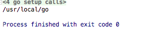
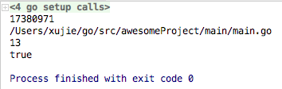

# runtime 包 

提供了运行时与系统的交互,比如控制协程函数，触发垃圾立即回收等等底层操作,下面我们就运行时能做的所有事情逐个进行说明与代码演示

runtime包提供和go运行时环境的互操作，如控制go程的函数。

```go
func Caller(skip int) (pc uintptr, file string, line int, ok bool)
```

Caller报告当前go程调用栈所执行的函数的文件和行号信息。
实参skip为上溯的栈帧数。0表示Callers自身的调用栈，>0数字表示Callers所在的调用栈。
返回值为调用pc栈标识符、file文件名、该调用在文件中的行号line。如果无法获得信息，ok会被设为false。

```go
func FuncForPC(pc uintptr) *Func
```

FuncForPC返回一个表示调用栈标识符pc对应的调用栈的*Func；如果该调用栈标识符没有对应的调用栈，函数会返回nil。每一个调用栈必然是对某个函数的调用。

```go
func (f *Func) Name() string
```

Name返回该调用栈所调用的函数的名字。

```go
func Base(path string) string
```

Base函数返回路径的最后一个元素。在提取元素前会求掉末尾的斜杠。如果路径是""，会返回"."；如果路径是只有一个斜杆构成，会返回"/"。

# 1.获取GOROOT环境变量

```
func GOROOT() string
```

GOROOT返回Go的根目录。如果存在GOROOT环境变量，返回该变量的值；否则，返回创建Go时的根目录

```go
func main() {
    fmt.Println(runtime.GOROOT())
}
```



------

# 2.获取GO的版本号

```
func Version() string
```

返回Go的版本字符串。它要么是递交的hash和创建时的日期；要么是发行标签如"go1.3"

```go
func main() {
    fmt.Println(runtime.Version())
}
```


------

# 3.获取本机CPU个数

```
func NumCPU() int
```

NumCPU返回本地机器的逻辑CPU个数

```go
func main() {
    fmt.Println(runtime.NumCPU())
}
```


image.png

------

# 4.设置最大可同时执行的最大CPU数

```
func GOMAXPROCS(n int) int
```

GOMAXPROCS设置可同时执行的最大CPU数，并返回先前的设置。 若 n < 1，它就不会更改当前设置。本地机器的逻辑CPU数可通过 NumCPU 查询。本函数在调度程序优化后会去掉

使用默认的cup数量 我的电脑是4核的

```go
func main() {
    //runtime.GOMAXPROCS(1)
    startTime := time.Now()
    var s1 chan  int64 = make(chan int64)
    var s2 chan  int64 = make(chan int64)
    var s3 chan  int64 = make(chan int64)
    var s4 chan  int64 = make(chan int64)
    go calc(s1)
    go calc(s2)
    go calc(s3)
    go calc(s4)
    <-s1
    <-s2
    <-s3
    <-s4
    endTime := time.Now()
    fmt.Println(endTime.Sub(startTime))
}

func calc(s  chan int64) {
    var count int64 = 0
    for i := 0 ;i < 1000000000;i++ {
        count += int64(i)
    }
    s <- count
}
```


下面我们将cup数量设置成1

```go
func main() {
    runtime.GOMAXPROCS(1)
    startTime := time.Now()
    var s1 chan  int64 = make(chan int64)
    var s2 chan  int64 = make(chan int64)
    var s3 chan  int64 = make(chan int64)
    var s4 chan  int64 = make(chan int64)
    go calc(s1)
    go calc(s2)
    go calc(s3)
    go calc(s4)
    <-s1
    <-s2
    <-s3
    <-s4
    endTime := time.Now()
    fmt.Println(endTime.Sub(startTime))

}
func calc(s  chan int64) {
    var count int64 = 0
    for i := 0 ;i < 1000000000;i++ {
        count += int64(i)
    }
    s <- count
}
```


很明显速度慢了很多

# 5.设置cup profile 记录的速录

```
func SetCPUProfileRate(hz int)
```

SetCPUProfileRate设置CPU profile记录的速率为平均每秒hz次。如果hz<=0，SetCPUProfileRate会关闭profile的记录。如果记录器在执行，该速率必须在关闭之后才能修改。

绝大多数使用者应使用runtime/pprof包或testing包的-test.cpuprofile选项而非直接使用SetCPUProfileRate。

# 6.查看cup profile 下一次堆栈跟踪数据

```
func CPUProfile() []byte
```

目前已废弃

# 7.立即执行一次垃圾回收

```
func GC()
```

GC执行一次垃圾回收

```go
type Student struct {
    name string
}

func main() {
    var i *Student = new(Student)
    runtime.SetFinalizer(i, func(i interface{}) {
        println("垃圾回收了")
    })
    runtime.GC()
    time.Sleep(time.Second)
}
```


我们创建了一个指针类型的变量Student 当我们调用runtime.GC的时候,内存立即会回收，你可以把`runtime.GC()`屏蔽掉,程序就不在执行了

------

# 8.给变量绑定方法,当垃圾回收的时候进行监听

```
func SetFinalizer(x, f interface{})
```

注意x必须是指针类型,f 函数的参数一定要和x保持一致,或者写interface{},不然程序会报错。示例如下

```go
type Student struct {
    name string
}

func main() {
    var i *Student = new(Student)
    runtime.SetFinalizer(i, func(i *Student) {
        println("垃圾回收了")
    })
    runtime.GC()
    time.Sleep(time.Second)
}
```


------

# 9.查看内存申请和分配统计信息

```
func ReadMemStats(m *MemStats)
```

我们可以获得下面的信息

```go
type MemStats struct {
    // 一般统计
    Alloc      uint64 // 已申请且仍在使用的字节数
    TotalAlloc uint64 // 已申请的总字节数（已释放的部分也算在内）
    Sys        uint64 // 从系统中获取的字节数（下面XxxSys之和）
    Lookups    uint64 // 指针查找的次数
    Mallocs    uint64 // 申请内存的次数
    Frees      uint64 // 释放内存的次数
    // 主分配堆统计
    HeapAlloc    uint64 // 已申请且仍在使用的字节数
    HeapSys      uint64 // 从系统中获取的字节数
    HeapIdle     uint64 // 闲置span中的字节数
    HeapInuse    uint64 // 非闲置span中的字节数
    HeapReleased uint64 // 释放到系统的字节数
    HeapObjects  uint64 // 已分配对象的总个数
    // L低层次、大小固定的结构体分配器统计，Inuse为正在使用的字节数，Sys为从系统获取的字节数
    StackInuse  uint64 // 引导程序的堆栈
    StackSys    uint64
    MSpanInuse  uint64 // mspan结构体
    MSpanSys    uint64
    MCacheInuse uint64 // mcache结构体
    MCacheSys   uint64
    BuckHashSys uint64 // profile桶散列表
    GCSys       uint64 // GC元数据
    OtherSys    uint64 // 其他系统申请
    // 垃圾收集器统计
    NextGC       uint64 // 会在HeapAlloc字段到达该值（字节数）时运行下次GC
    LastGC       uint64 // 上次运行的绝对时间（纳秒）
    PauseTotalNs uint64
    PauseNs      [256]uint64 // 近期GC暂停时间的循环缓冲，最近一次在[(NumGC+255)%256]
    NumGC        uint32
    EnableGC     bool
    DebugGC      bool
    // 每次申请的字节数的统计，61是C代码中的尺寸分级数
    BySize [61]struct {
        Size    uint32
        Mallocs uint64
        Frees   uint64
    }
}
```


```go
type Student struct {
    name string
}

func main() {
    var list = make([]*Student,0)
    for i:=0;i <100000 ;i++ {
        var s *Student = new(Student)
        list = append(list, s)
    }
    memStatus := runtime.MemStats{}
    runtime.ReadMemStats(&memStatus)
    fmt.Printf("申请的内存:%d\n",memStatus.Mallocs)
    fmt.Printf("释放的内存次数:%d\n",memStatus.Frees)
    time.Sleep(time.Second)
}
```


# 10.查看程序正在使用的字节数

```
func (r *MemProfileRecord) InUseBytes() int64
```

InUseBytes返回正在使用的字节数（AllocBytes – FreeBytes）

# 11.查看程序正在使用的对象数

```
func (r *MemProfileRecord) InUseObjects() int64
```

InUseObjects返回正在使用的对象数（AllocObjects - FreeObjects）

# 12.获取调用堆栈列表

```
func (r *MemProfileRecord) Stack() []uintptr
```

Stack返回关联至此记录的调用栈踪迹，即r.Stack0的前缀。

# 13.获取内存profile记录历史

```
func MemProfile(p []MemProfileRecord, inuseZero bool) (n int, ok bool)
```

MemProfile返回当前内存profile中的记录数n。若len(p)>=n，MemProfile会将此分析报告到p中并返回(n, true)；如果len(p)<n，MemProfile则不会更改p，而只返回(n, false)。

如果inuseZero为真，该profile就会包含无效分配记录（其中r.AllocBytes>0，而r.AllocBytes==r.FreeBytes。这些内存都是被申请后又释放回运行时环境的）。

大多数调用者应当使用runtime/pprof包或testing包的-test.memprofile标记，而非直接调用MemProfile

# 14.执行一个断点

```
func Breakpoint()
runtime.Breakpoint()
```


# 15.获取程序调用go协程的栈踪迹历史

```
func Stack(buf []byte, all bool) int
```

Stack将调用其的go程的调用栈踪迹格式化后写入到buf中并返回写入的字节数。若all为true，函数会在写入当前go程的踪迹信息后，将其它所有go程的调用栈踪迹都格式化写入到buf中。

```go
func main() {
    go showRecord()
    time.Sleep(time.Second)
    buf := make([]byte,10000)
    runtime.Stack(buf,true)
    fmt.Println(string(buf))
}

func showRecord(){
    tiker := time.Tick(time.Second)
    for t := range  tiker {
        fmt.Println(t)
    }
}
```


我们在调用`Stack`方法后,首先格式化当前go协程的信息，然后把其他正在运行的go协程也格式化后写入buf中

# 16.获取当前函数或者上层函数的标识号、文件名、调用方法在当前文件中的行号

```
func Caller(skip int) (pc uintptr, file string, line int, ok bool)
```

```go
func main() {
  pc,file,line,ok := runtime.Caller(0)
  fmt.Println(pc)
  fmt.Println(file)
  fmt.Println(line)
  fmt.Println(ok)
}
```



pc = 17380971 不是main函数自己的标识 `runtime.Caller` 方法的标识,line = 13 标识它在main方法中的第13行被调用

```go
func main() {
    pc,_,line,_ := runtime.Caller(1)
    fmt.Printf("main函数的pc:%d\n",pc)
    fmt.Printf("main函数被调用的行数:%d\n",line)
    show()
}

func show(){
    pc,_,line,_ := runtime.Caller(1)
    fmt.Printf("show函数的pc:%d\n",pc)
    fmt.Printf("show函数被调用的行数:%d\n",line)
    // 这个是main函数的栈
    pc,_,line,_ = runtime.Caller(2)
    fmt.Printf("show的上层函数的pc:%d\n",pc)
    fmt.Printf("show的上层函数被调用的行数:%d\n",line)
    pc,_,_,_ = runtime.Caller(3)
    fmt.Println(pc)
    pc,_,_,_ = runtime.Caller(4)
    fmt.Println(pc)
}
```


通过上面的例子我演示了如何追踪一个方法被调用的顺序,以及所有相关函数的信息

# 17.获取与当前堆栈记录相关链的调用栈踪迹

```
func Callers(skip int, pc []uintptr) int
```

函数把当前go程调用栈上的调用栈标识符填入切片pc中，返回写入到pc中的项数。实参skip为开始在pc中记录之前所要跳过的栈帧数，0表示Callers自身的调用栈，1表示Callers所在的调用栈。返回写入p的项数

```go
func main() {
  pcs := make([]uintptr,10)
  i := runtime.Callers(1,pcs)
  fmt.Println(pcs[:i])
}
```


我们获得了三个pc 其中有一个是main方法自身的

# 18.获取一个标识调用栈标识符pc对应的调用栈

```
func FuncForPC(pc uintptr) *Func
```

```go
func main() {
    pcs := make([]uintptr,10)
    i := runtime.Callers(1,pcs)
    for _,pc := range pcs[:i]{
        println(runtime.FuncForPC(pc))
    }
}
```


我们知道这个调用栈有什么用呢?请继续下想看

# 19.获取调用栈所调用的函数的名字

```
func (f *Func) Name() string
```

```go
func main() {
    pcs := make([]uintptr,10)
    i := runtime.Callers(1,pcs)
    for _,pc := range pcs[:i]{
        funcPC := runtime.FuncForPC(pc)
        println(funcPC.Name())
    }
}
```


# 20.获取调用栈所调用的函数的所在的源文件名和行号

```
func (f *Func) FileLine(pc uintptr) (file string, line int)
```

```go
func main() {
    pcs := make([]uintptr,10)
    i := runtime.Callers(1,pcs)
    for _,pc := range pcs[:i]{
        funcPC := runtime.FuncForPC(pc)
        file,line := funcPC.FileLine(pc)
        println(funcPC.Name(),file,line)
    }
}
```


------

# 21.获取该调用栈的调用栈标识符

```
func (f *Func) Entry() uintptr
```

```go
func main() {
    pcs := make([]uintptr,10)
    i := runtime.Callers(1,pcs)
    for _,pc := range pcs[:i]{
        funcPC := runtime.FuncForPC(pc)
        println(funcPC.Entry())
    }
}
```


------

# 22.获取当前进程执行的cgo调用次数

```
func NumCgoCall() int64
```

获取当前进程调用c方法的次数

```go
package main

import (
    "runtime"
)
/*
#include <stdio.h>
*/
import "C"

func main() {
    println(runtime.NumCgoCall())
}
```


注意我们没有调用c的方法为什么是1呢？因为`import c`是,会调用了c包中的init方法

下面我们看一个完整例子

```go
import (
    "runtime"
)
/*
#include <stdio.h>
// 自定义一个c语言的方法
static void myPrint(const char* msg) {
  printf("myPrint: %s", msg);
}
*/
import "C"

func main() {
    C.myPrint(C.CString("Hello,C\n"))	 // 调用c方法
    println(runtime.NumCgoCall())
}
```


# 23.获取当前存在的go协程数

```
func NumGoroutine() int
```

```go
func main() {
    go print()
    print()
    println(runtime.NumGoroutine())
}

func print(){
}
```


------

我们可以看到输出的是2 表示存在2个go协程 一个是`main.go` 另外一个是`go print()`

# 24.终止掉当前的go协程

```
func Goexit()
```

```go
func main() {
    print()  // 1
    fmt.Println("继续执行")
}

func print(){
    fmt.Println("准备结束go协程")
    runtime.Goexit()
    defer fmt.Println("结束了")
}
```


------

`Goexit`终止调用它的go协程,其他协程不受影响,`Goexit`会在终止该go协程前执行所有的defer函数，前提是defer必须在它前面定义,如果在main go协程调用本方法,会终止该go协程,但不会让main返回,因为main函数没有返回,程序会继续执行其他go协程,当其他go协程执行完毕后,程序就会崩溃

# 25.让其他go协程优先执行,等其他协程执行完后,在执行当前的协程

```
func Gosched()
```

```go
func main() {
    go print()  // 1
    fmt.Println("继续执行")
}

func print(){
    fmt.Println("执行打印方法")
}
```


我们在1处调用了`go print`方法,但是还未执行 main函数就执行完毕了,因为两个协程是并发的

那么我们应该怎么才能让每个协程都能够执行完毕呢?方法有很多种,不过就针对这个知识点,我们就使用 `runtime.Gosched()`来解决

```go
func main() {
    go print()  // 1
    runtime.Gosched()
    fmt.Println("继续执行")
}

func print(){
    fmt.Println("执行打印方法")
}
```


------

# 26.获取活跃的go协程的堆栈profile以及记录个数

```
func GoroutineProfile(p []StackRecord) (n int, ok bool)
```

# 27.将调用的go协程绑定到当前所在的操作系统线程，其它go协程不能进入该线程

```
func LockOSThread()
```

将调用的go程绑定到它当前所在的操作系统线程。除非调用的go程退出或调用UnlockOSThread，否则它将总是在该线程中执行，而其它go程则不能进入该线程

我们看下面一个例子

```go
func main() {
    go calcSum1()
    go calcSum2()
    time.Sleep(time.Second*100)
}

func calcSum1(){
    runtime.LockOSThread()
    start := time.Now()
    count := 0
    for i := 0; i < 10000000000 ; i++  {
        count += i
    }
    end := time.Now()
    fmt.Println("calcSum1耗时")
    fmt.Println(end.Sub(start))
    defer runtime.UnlockOSThread()
}

func calcSum2(){
    start := time.Now()
    count := 0
    for i := 0; i < 10000000000 ; i++  {
        count += i
    }
    end := time.Now()
    fmt.Println("calcSum2耗时")
    fmt.Println(end.Sub(start))
}
```


测试速度没有多大的差别,如果有需要协程,但是有一项重要的功能需要占一个线程，就需要它

# 28.解除go协程与操作系统线程的绑定关系

```
func UnlockOSThread()
```

将调用的go程解除和它绑定的操作系统线程。若调用的go程未调用LockOSThread，UnlockOSThread不做操作

# 29.获取线程创建profile中的记录个数

```
func ThreadCreateProfile(p []StackRecord) (n int, ok bool)
```

返回线程创建profile中的记录个数。如果len(p)>=n，本函数就会将profile中的记录到p中并返回(n, true)。若len(p)<n，则不会更改p，而只返回(n, false)。

绝大多数使用者应当使用runtime/pprof包，而非直接调用ThreadCreateProfile。

# 30.控制阻塞profile记录go协程阻塞事件的采样率

```
func SetBlockProfileRate(rate int)
```

SetBlockProfileRate控制阻塞profile记录go程阻塞事件的采样频率。对于一个阻塞事件，平均每阻塞rate纳秒，阻塞profile记录器就采集一份样本。

要在profile中包括每一个阻塞事件，需传入rate=1；要完全关闭阻塞profile的记录，需传入rate<=0。

# 31.返回当前阻塞profile中的记录个数

```
func BlockProfile(p []BlockProfileRecord) (n int, ok bool)
```

BlockProfile返回当前阻塞profile中的记录个数。如果len(p)>=n，本函数就会将此profile中的记录到p中并返回(n, true)。如果len(p)<n，本函数则不会修改p，而只返回(n, false)。

绝大多数使用者应当使用runtime/pprof包或testing包的-test.blockprofile标记， 而非直接调用 BlockProfile
