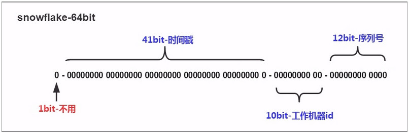
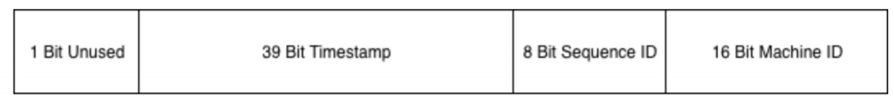

# 雪花算法

### 关于雪花

雪花(snowflake)在自然界中，是极具独特美丽，又变幻莫测的东西：

- 1.雪花属于六方晶系，它具有四个结晶轴，其中三个辅轴在一个基面上，互相以60度的角度相交，第四轴(主晶轴)与三个辅轴所形成的基面垂直；
- 2.雪花的基本形状是六角形，但是大自然中却几乎找不出两朵完全相同的雪花，每一个雪花都拥有自己的独有图案，就象地球上找不出两个完全相同的人一样。许多学者用显微镜观测过成千上万朵雪花，这些研究最后表明，形状、大小完全一样和各部分完全对称的雪花，在自然界中是无法形成的。

## 应用场景

**分布式ID生成器的特点**

- 全局唯⼀性：不能出现有重复的ID标识，这是基本要求。
- 递增性：确保⽣成ID对于⽤户或业务是递增的。
- ⾼可⽤性：确保任何时候都能⽣成正确的ID。
- ⾼性能性：在⾼并发的环境下依然表现良好。

不仅仅是⽤于⽤户ID，实际互联⽹中有很多场景需要能够⽣成类似MySQL⾃增ID这样不断增⼤，同时⼜不会重复的id。以⽀持业务中的⾼并发场景。

⽐较典型的场景有：电商促销时短时间内会有⼤量的订单涌⼊到系统，⽐如每秒10w+；明星出轨时微博短时间内会产⽣⼤量的相关微博转发和评论消息。在这些业务场景下将数据插⼊数据库之前，我们需要给这些订单和消息先分配⼀个唯⼀ID，然后再保存到数据库中。对这个id的要求是希望其中能带有⼀些时间信息，这样即使我们后端的系统对消息进⾏了分库分表，也能够以时间顺序对这些消息进⾏排序。

### 1.1.2. 雪花算法

雪花算法的原始版本是scala版，用于生成分布式ID（纯数字，时间顺序）,订单编号等。

> 自增ID：对于数据敏感场景不宜使用，且不适合于分布式场景。 GUID：采用无意义字符串，数据量增大时造成访问过慢，且不宜排序。



**算法描述**

- 最高位是符号位，始终为0，不可用。
- 41位的时间序列，精确到毫秒级，41位的长度可以使用69年。时间位还有一个很重要的作用是可以根据时间进行排序。
- 10位的机器标识，10位的长度最多支持部署1024个节点。
- 12位的计数序列号，序列号即一系列的自增id，可以支持同一节点同一毫秒生成多个ID序号，12位的计数序列号支持每个节点每毫秒产生4096个ID序号。

SnowFlake算法在同⼀毫秒内最多可以⽣成多少个全局唯⼀ID呢？

**同⼀毫秒的ID数量= 1024 X 4096 = 4194304**

# bwmarrin/snowflake包介绍

```go
go get github.com/bwmarrin/snowflake
```

[bwmarrin/snowflake (github.com)](https://github.com/bwmarrin/snowflake) 一个简单易用的 Go  包，用于生成或解析 Twitter 雪花 ID 。它提供

- 一个非常简单的 Twitter 雪花生成器。
- 解析现有 snowflake ID 的方法。
- 将 snowflake ID 转换为其他几种数据类型并返回的方法。
- JSON Marshal/Unmarshal 函数，用于在 JSON API 中轻松使用 Snowflake ID。
- 单调 Clock 计算可防止 clock drift。

## 生成ID 格式

默认情况下，ID 格式遵循原始的 Twitter 雪花格式。

- ID 作为一个整体是一个 63 位整数，存储在 int64 中
- 41 位用于使用自定义纪元以毫秒精度存储时间戳。
- 10 位用于存储节点 ID - 范围从 0 到 1023。
- 12 位用于存储序列号 - 范围从 0 到 4095。

## 这个怎么运作

每次生成 ID 时，它都会正常工作，如下所示。

- 具有毫秒精度的时间戳使用 ID 的 41 位存储。
- 然后，将 NodeID 添加到后续位中。
- 然后添加 Sequence Number （序列号），从 0 开始，并针对同一毫秒内生成的每个 ID 递增。如果您在序列滚动或溢出的同一毫秒内生成了足够的 ID，则 generate 函数将暂停，直到下一毫秒。

默认的 Twitter 格式如下所示。

```
+--------------------------------------------------------------------------+
| 1 Bit Unused | 41 Bit Timestamp |  10 Bit NodeID  |   12 Bit Sequence ID |
+--------------------------------------------------------------------------+
```

使用默认设置，这允许每个节点 ID 每毫秒生成 4096 个唯一 ID。

## 使用示例

将包导入到您的项目中，然后使用 唯一节点编号。默认设置允许节点编号范围从 0 到 1023。 如果您设置了自定义 NodeBits 值，则需要计算 node number 范围将为。使用 node 对象，调用 Generate（） 方法 生成并返回唯一的 snowflake ID。

请记住，您创建的每个节点都必须具有唯一的节点编号，甚至 跨多个服务器。如果不使节点编号保持唯一，则生成器 无法保证所有节点的 ID 唯一。

```go
package main

import (
	"fmt"

	"github.com/bwmarrin/snowflake"
)

func main() {
	// Create a new Node with a Node number of 1
	node, err := snowflake.NewNode(1)
	if err != nil {
		fmt.Println(err)
		return
	}

	// Generate a snowflake ID.
	id := node.Generate()

	// Print out the ID in a few different ways.
	fmt.Printf("Int64  ID: %d\n", id)
	fmt.Printf("String ID: %s\n", id)
	fmt.Printf("Base2  ID: %s\n", id.Base2())
	fmt.Printf("Base64 ID: %s\n", id.Base64())

	// Print out the ID's timestamp
	fmt.Printf("ID Time  : %d\n", id.Time())

	// Print out the ID's node number
	fmt.Printf("ID Node  : %d\n", id.Node())

	// Print out the ID's sequence number
	fmt.Printf("ID Step  : %d\n", id.Step())

  // Generate and print, all in one.
  fmt.Printf("ID       : %d\n", node.Generate().Int64())
}
```


# sony/sonyflake介绍

[sony/sonyflake - github](https://github.com/sony/sonyflake)

sonyflake是Sony公司的⼀个开源项⽬，基本思路和snowflake差不多，不过位分配上稍有不同:



这⾥的时间只⽤了39个bit，但时间的单位变成了10ms，所以理论上⽐41位表示的时间还要久(174年)。

Sequence ID 和之前的定义⼀致， Machine ID 其实就是节点id。 sonyflake 库有以下配置参数：

```go
type Settings struct {
    StartTime time.Time
    MachineID func() (uint16, error)
    CheckMachineID func(uint16) bool
}
```

其中：

- StartTime 选项和我们之前的 Epoch 差不多，如果不设置的话，默认是从 2014-09-0100:00:00 +0000 UTC 开始。
- MachineID 可以由⽤户⾃定义的函数，如果⽤户不定义的话，会默认将本机IP的低16位作为 machine id 。
- CheckMachineID 是由⽤户提供的检查 MachineID 是否冲突的函数

使⽤示例：

```go
package main
import (
    "fmt"
    "time"
    "github.com/sony/sonyflake"
)
var (
    sonyFlake *sonyflake.Sonyflake
    sonyMachineID uint16
)

func getMachineID() (uint16, error) {
    return sonyMachineID, nil
}

// 需传⼊当前的机器ID
func Init(startTime string, machineId uint16) (err error) {
    sonyMachineID = machineId
    var st time.Time
    st, err = time.Parse("2006-01-02", startTime)
    if err != nil {
        return err
    }
    settings := sonyflake.Settings{
        StartTime: st,
        MachineID: getMachineID,
    }
    sonyFlake = sonyflake.NewSonyflake(settings)
    return
}

// GenID ⽣成id
func GenID() (id uint64, err error) {
    if sonyFlake == nil {
        err = fmt.Errorf("snoy flake not inited")
        return
    }
    id, err = sonyFlake.NextID()
    return
}

func main() {
    if err := Init("2020-07-01", 1); err != nil {
        fmt.Printf("Init failed, err:%v\n", err)
        return
    }
    id, _ := GenID()
    fmt.Println(id)
}
```

