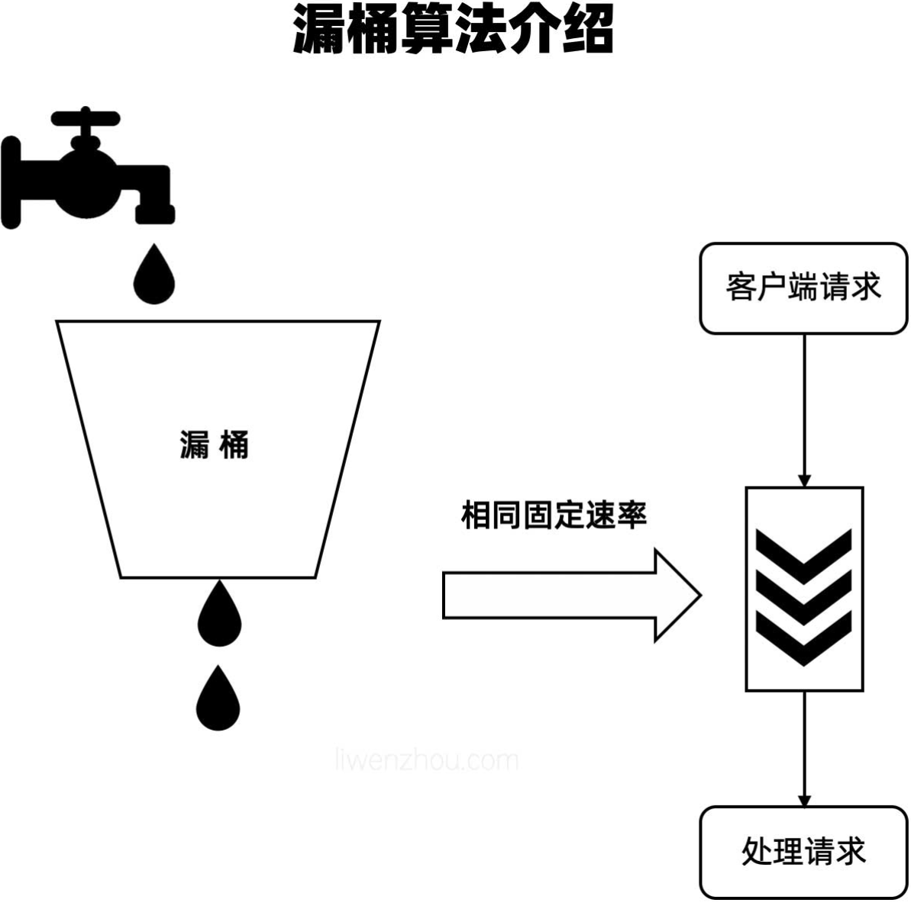

限流又称为流量控制（流控），通常是指限制到达系统的并发请求数，本文列举了常见的限流策略，并以gin框架为例演示了如何为项目添加限流组件。

# 一、服务限流的概念

服务限流是一种保护系统稳定性的技术手段。当系统面临超出其处理能力的请求流量时，通过限制流量的方式，确保系统能够在可承受的负载范围内稳定运行，避免系统崩溃或者性能过度下降。

例如，一个电商平台在进行大型促销活动时，可能会遭遇大量用户同时访问商品详情页、下单等操作。如果不进行限流，服务器可能会因为处理过多请求而变得缓慢甚至无法响应，就像一个水管，水流（请求）过大时，可能会导致水管破裂（系统崩溃），限流就相当于在水管口安装一个阀门，控制水的流量。

# 二、服务限流的重要性

**保护系统资源**

- 服务器的资源（如 CPU、内存、网络带宽等）是有限的。当大量请求涌入时，这些资源会被快速耗尽。通过限流，可以防止资源过度使用，确保系统的关键组件能够正常运行。
- 例如，一个数据分析系统，当同时进行过多的数据查询和复杂的计算请求时，如果没有限流，可能会导致内存溢出，系统崩溃。

**保障服务质量**

- 限流可以确保在高流量情况下，系统仍能为大部分用户提供基本的、可接受的服务质量。不会因为部分请求过多而导致所有用户的体验都变得很差。
- 以在线支付系统为例，在高峰时段限制非关键业务（如账户查询等）的流量，优先保障支付业务的处理，从而保障用户能够顺利完成支付。

# 三、常见的服务限流方式

## （一）计数器法

- **原理**：在一个固定的时间窗口内，统计请求的数量。当请求数量达到设定的阈值时，就开始限制后续的请求。例如，设定 1 分钟内最多允许 100 个请求，当 1 分钟内的请求数达到 100 后，就拒绝新的请求。
- **优点**：简单易实现，适用于对流量模式比较简单的系统。
- **缺点**：在时间窗口边界处可能会出现流量尖峰问题。比如，在两个相邻时间窗口交接的瞬间，可能会出现双倍的流量峰值。

## （二）滑动窗口法

**原理**：滑动窗口法是对计数器法的一种改进。它将时间窗口划分成多个小的时间片，每次请求到来时，都会更新窗口内的请求计数。通过不断滑动这个窗口来统计请求数量，这样可以更平滑地控制流量。

**优点**：能够有效避免计数器法的流量尖峰问题，对流量的控制更加精细和平滑。

**缺点**：实现相对复杂，需要维护窗口内的多个时间片的计数信息。


## （三）漏桶算法

**原理**：把请求看作是水滴，流入一个漏桶。漏桶有固定的容量和固定的流出速率。当请求进入漏桶的速度超过流出速度时，漏桶会装满，多余的请求就会被丢弃。就好像一个有漏洞的水桶，水（请求）以固定的速度从桶底流出，不管上面倒进来的水有多快，只要超过流出速度，桶满了水就会溢出。

**优点**：能够平滑流量，保证系统按照固定的速率处理请求，对下游系统有很好的保护作用。

**缺点**：在流量突发的情况下，可能会导致过多的请求被丢弃，因为它不考虑流量的突发情况，只关注流出的固定速率。

漏桶法限流很好理解，假设我们有一个水桶按固定的速率向下方滴落一滴水，无论有多少请求，请求的速率有多大，都按照固定的速率流出，对应到系统中就是按照固定的速率处理请求。



漏桶法的关键点在于漏桶始终按照固定的速率运行，但是它并不能很好的处理有大量突发请求的场景，毕竟在某些场景下我们可能需要提高系统的处理效率，而不是一味的按照固定速率处理请求。

关于漏桶的实现，uber团队有一个开源的[github.com/uber-go/ratelimit](https://github.com/uber-go/ratelimit)库。 这个库的使用方法比较简单，`Take()` 方法会返回漏桶下一次滴水的时间。

```go
import (
	"fmt"
	"time"

	"go.uber.org/ratelimit"
)

func main() {
    rl := ratelimit.New(100) // per second

    prev := time.Now()
    for i := 0; i < 10; i++ {
        now := rl.Take()
        fmt.Println(i, now.Sub(prev))
        prev = now
    }

    // Output:
    // 0 0
    // 1 10ms
    // 2 10ms
    // 3 10ms
    // 4 10ms
    // 5 10ms
    // 6 10ms
    // 7 10ms
    // 8 10ms
    // 9 10ms
}
```

它的源码实现也比较简单，这里大致说一下关键的地方，有兴趣的同学可以自己去看一下完整的源码。

限制器是一个接口类型，其要求实现一个`Take()`方法：

```go
type Limiter interface {
	// Take方法应该阻塞已确保满足 RPS
	Take() time.Time
}
```

实现限制器接口的结构体定义如下，这里可以重点留意下`maxSlack`字段，它在后面的`Take()`方法中的处理。

```go
type limiter struct {
	sync.Mutex                // 锁
	last       time.Time      // 上一次的时刻
	sleepFor   time.Duration  // 需要等待的时间
	perRequest time.Duration  // 每次的时间间隔
	maxSlack   time.Duration  // 最大的富余量
	clock      Clock          // 时钟
}
```

`limiter`结构体实现`Limiter`接口的`Take()`方法内容如下：

```go
// Take 会阻塞确保两次请求之间的时间走完
// Take 调用平均数为 time.Second/rate.
func (t *limiter) Take() time.Time {
	t.Lock()
	defer t.Unlock()

	now := t.clock.Now()

	// 如果是第一次请求就直接放行
	if t.last.IsZero() {
		t.last = now
		return t.last
	}

	// sleepFor 根据 perRequest 和上一次请求的时刻计算应该sleep的时间
	// 由于每次请求间隔的时间可能会超过perRequest, 所以这个数字可能为负数，并在多个请求之间累加
	t.sleepFor += t.perRequest - now.Sub(t.last)

	// 我们不应该让sleepFor负的太多，因为这意味着一个服务在短时间内慢了很多随后会得到更高的RPS。
	if t.sleepFor < t.maxSlack {
		t.sleepFor = t.maxSlack
	}

	// 如果 sleepFor 是正值那么就 sleep
	if t.sleepFor > 0 {
		t.clock.Sleep(t.sleepFor)
		t.last = now.Add(t.sleepFor)
		t.sleepFor = 0
	} else {
		t.last = now
	}

	return t.last
}
```

上面的代码根据记录每次请求的间隔时间和上一次请求的时刻来计算当次请求需要阻塞的时间——`sleepFor`，这里需要留意的是`sleepFor`的值可能为负，在经过间隔时间长的两次访问之后会导致随后大量的请求被放行，所以代码中针对这个场景有专门的优化处理。创建限制器的`New()`函数中会为`maxSlack`设置初始值，也可以通过`WithoutSlack`这个Option取消这个默认值。

```go
func New(rate int, opts ...Option) Limiter {
	l := &limiter{
		perRequest: time.Second / time.Duration(rate),
		maxSlack:   -10 * time.Second / time.Duration(rate),
	}
	for _, opt := range opts {
		opt(l)
	}
	if l.clock == nil {
		l.clock = clock.New()
	}
	return l
}
```

## （四）令牌桶算法

- **原理**：系统会以一个固定的速率生成令牌，并将令牌放入一个桶中。每个请求都需要从桶中获取一个令牌才能被处理。如果桶中没有令牌，请求就会被拒绝。当流量突发时，只要桶中有足够的令牌，请求就可以快速通过，这与漏桶算法不同。可以类比为有一个装有令牌的桶，每隔一段时间就会放入一定数量的令牌，请求就像需要用令牌才能进入的游客。
- **优点**：既能限制平均流量，又能允许一定程度的突发流量，灵活性较高。
- **缺点**：实现相对复杂，需要考虑令牌的生成、存储和获取等环节。


对于从桶里取不到令牌的场景，我们可以选择等待也可以直接拒绝并返回。

对于令牌桶的Go语言实现，大家可以参照[github.com/juju/ratelimit](https://github.com/juju/ratelimit)库。这个库支持多种令牌桶模式，并且使用起来也比较简单。

创建令牌桶的方法：

```go
// 创建指定填充速率和容量大小的令牌桶
func NewBucket(fillInterval time.Duration, capacity int64) *Bucket
// 创建指定填充速率、容量大小和每次填充的令牌数的令牌桶
func NewBucketWithQuantum(fillInterval time.Duration, capacity, quantum int64) *Bucket
// 创建填充速度为指定速率和容量大小的令牌桶
// NewBucketWithRate(0.1, 200) 表示每秒填充20个令牌
func NewBucketWithRate(rate float64, capacity int64) *Bucket
```

取出令牌的方法如下：

```go
// 取token（非阻塞）
func (tb *Bucket) Take(count int64) time.Duration
func (tb *Bucket) TakeAvailable(count int64) int64

// 最多等maxWait时间取token
func (tb *Bucket) TakeMaxDuration(count int64, maxWait time.Duration) (time.Duration, bool)

// 取token（阻塞）
func (tb *Bucket) Wait(count int64)
func (tb *Bucket) WaitMaxDuration(count int64, maxWait time.Duration) bool
```

虽说是令牌桶，但是我们没有必要真的去生成令牌放到桶里，我们只需要每次来取令牌的时候计算一下，当前是否有足够的令牌就可以了，具体的计算方式可以总结为下面的公式：

```bash
当前令牌数 = 上一次剩余的令牌数 + (本次取令牌的时刻-上一次取令牌的时刻)/放置令牌的时间间隔 * 每次放置的令牌数
```

[github.com/juju/ratelimit](https://github.com/juju/ratelimit)这个库中关于令牌数计算的源代码如下：

```go
func (tb *Bucket) currentTick(now time.Time) int64 {
	return int64(now.Sub(tb.startTime) / tb.fillInterval)
}
func (tb *Bucket) adjustavailableTokens(tick int64) {
	if tb.availableTokens >= tb.capacity {
		return
	}
	tb.availableTokens += (tick - tb.latestTick) * tb.quantum
	if tb.availableTokens > tb.capacity {
		tb.availableTokens = tb.capacity
	}
	tb.latestTick = tick
	return
}
```

获取令牌的`TakeAvailable()`函数关键部分的源代码如下：

```go
func (tb *Bucket) takeAvailable(now time.Time, count int64) int64 {
	if count <= 0 {
		return 0
	}
	tb.adjustavailableTokens(tb.currentTick(now))
	if tb.availableTokens <= 0 {
		return 0
	}
	if count > tb.availableTokens {
		count = tb.availableTokens
	}
	tb.availableTokens -= count
	return count
}
```

大家从代码中也可以看到其实令牌桶的实现并没有很复杂。


# 四、服务限流实现工具和框架

## gin框架中使用限流中间件

在gin框架构建的项目中，我们可以将限流组件定义成中间件。添加限流中间件

```go
	r := gin.New()	//初始化 gin Engine  新建一个没有任何默认中间件的路由
	//设置中间件
	r.Use(logger.GinLogger(),
		logger.GinRecovery(true), // Recovery 中间件会 recover掉项目可能出现的panic，并使用zap记录相关日志
		middlewares.RateLimitMiddleware(2*time.Second, 40), // 每两秒钟添加十个令牌  全局限流
	)
```

这里使用令牌桶作为限流策略，编写一个限流中间件如下：

```go
func RateLimitMiddleware(fillInterval time.Duration, cap int64) func(c *gin.Context) {
	bucket := ratelimit.NewBucket(fillInterval, cap)
	return func(c *gin.Context) {
		// 如果取不到令牌就中断本次请求返回 rate limit...
		if bucket.TakeAvailable(1) < 1 {
			c.String(http.StatusOK, "rate limit...")
			c.Abort()
			return
		}
		c.Next()
	}
}
```

对于该限流中间件的注册位置，我们可以按照不同的限流策略将其注册到不同的位置，例如：

1. 如果要对全站限流就可以注册成全局的中间件。
2. 如果是某一组路由需要限流，那么就只需将该限流中间件注册到对应的路由组即可。

## Nginx服务

- Nginx 是一个高性能的 HTTP 和反向代理服务器。它可以在服务器端实现简单的限流。可以通过`limit_req_zone`和`limit_req`指令来设置基于请求速率的限流规则。
- 例如，以下是一个简单的 Nginx 配置示例，用于限制对某个后端服务的请求速率：

```nginx
http {
    limit_req_zone $binary_remote_addr zone=myzone:10m rate=1r/s;
    server {
        listen       80;
        server_name  example.com;
        location / {
            limit_req zone=myzone;
            proxy_pass http://backend_service;
        }
    }
}
```

这个配置表示，对于每个客户端 IP（`$binary_remote_addr`），限制其每秒只能有 1 个请求访问`/`路径下的服务，请求超出限制后会被延迟处理。