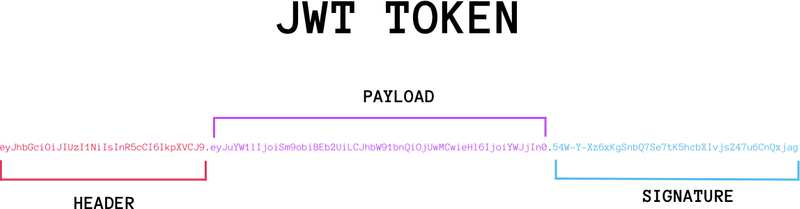

# 用户登录用jwt 还是token？

结论： 最直观的：**token** 需要查库验证 **token** 是否有效，而 **JWT** 不用查库或者少查库，直接在服务端进行校验，并且不用查库。 因为用户的信息及加密信息在第二部分 payload 和第三部分签证中已经生成，只要在服务端进行校验就行，并且校验也是**JWT**自己实现的。

# JWT和token的区别及优缺点

**一个单点登录的实现我们需要知道什么？**

我们首先应该知道的是什么是[单点登录](https://so.csdn.net/so/search?q=单点登录&spm=1001.2101.3001.7020)，单点登录是如何实现的，使用了什么技术，技术的选型、优缺点，应用和实现的步骤过程中的难点有哪些怎么解决的等。

技术的话：token与[JWT](https://so.csdn.net/so/search?q=JWT&spm=1001.2101.3001.7020)的区别、JWT和redis的区别应用、是否使用到了[消息中间件](https://so.csdn.net/so/search?q=消息中间件&spm=1001.2101.3001.7020)有的话kafka和其他MQ的比较、实现过程中的相关协议等。从其中总结对这些问题点进行总结。

## 一、结论：

最直观的：token需要查库验证token 是否有效，而JWT不用查库或者少查库，直接在服务端进行校验，并且不用查库。因为用户的信息及加密信息在第二部分payload和第三部分签证中已经生成，只要在服务端进行校验就行，并且校验也是JWT自己实现的。

## 二、TOKEN

**概念：**令牌， 是访问资源的凭证。是string类型的数据

**Token的认证流程：**

1. 用户输入用户名和密码，发送给服务器。
2. 服务器验证用户名和密码，正确的话就返回一个签名过的token（token 可以认为就是个长长的字符串），浏览器客户端拿到这个token。
3. 后续每次请求中，浏览器会把token作为http header发送给服务器，服务器验证签名是否有效，如果有效那么认证就成功，可以返回客户端需要的数据。

**特点：**这种方式的特点就是客户端的token中自己保留有大量信息，服务器没有存储这些信息。

## 三、JWT

**概念：**JWT是json web token缩写。它将用户信息加密到token里，服务器不保存任何用户信息。服务器通过使用保存的密钥验证token的正确性，只要正确即通过验证。

**组成：**JWT包含三个部分：Header头部，Payload负载和Signature签名。由三部分生成token，三部分之间用“.”号做分割。JWT通过`.`连接：

1. **Header（头部）**：描述JWT的元数据，通常包括类型（通常是`JWT`）和使用的签名算法（如`HS256`、`RS256`等）。
2. **Payload（载荷）**：包含声明（claims），即用户的相关信息。这些信息可以是公开的，也可以是私有的，但应避免放入敏感信息，因为该部分可以被解码查看。载荷中的声明可以验证，但不加密。
3. **Signature（签名）**：用于验证JWT的完整性和来源。它是通过将Header和Payload分别进行Base64编码后，再与一个秘钥（secret）一起通过指定的算法（如HMAC SHA256）计算得出的。

**JWT的工作流程大致如下**：

- **认证阶段**：用户向服务器提供凭证（如用户名和密码）。服务器验证凭证无误后，生成一个JWT，其中包含用户标识符和其他声明，并使用秘钥对其进行签名。
- **使用阶段**：客户端收到JWT后，可以在后续的每个请求中将其放在HTTP请求头中发送给服务器，以此证明自己的身份。
- **验证阶段**：服务器收到JWT后，会使用相同的秘钥验证JWT的签名，确保其未被篡改，并检查过期时间等其他声明，从而决定是否允许执行请求。

JWT的优势在于它的无状态性，服务器不需要存储会话信息，这减轻了服务器的压力，同时也方便了跨域认证。但需要注意的是，JWT的安全性依赖于秘钥的安全保管以及对JWT过期时间等的合理设置。

gin框架中有Jwt使用例子

