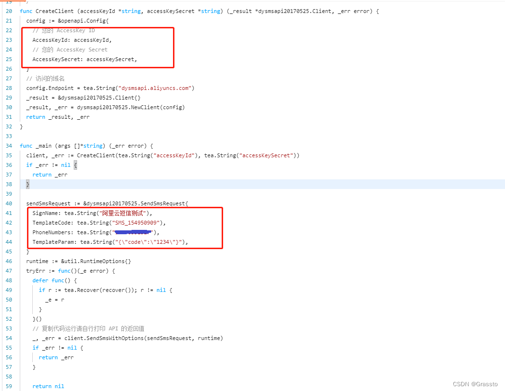

# 短信验证码使用简介

短信验证码还是比较常用的功能，已经有了很成熟的方案，本篇介绍的是对接阿里云的短信服务，一条短信大概两分钱。

# 基本的流程是：

到对应的云平台申请权限，大致费用都差不多
照着官方文档进行对接，并集成至自己的系统

简单说一下验证码的业务逻辑，需要注意的点：

1、短信验证码有效期控制，这里设置的是5分钟
2、随机生成6位验证码
3、同一个手机一分钟内只能发送一次验证码
4、同一手机号只能缓存一个验证码，若是之前的验证码没有过期，会直接覆盖

# 阿里云平台服务对接
阿里云相关的文档还是很齐全的，照着做就行，这里简单介绍下：

1、注册阿里云账号
2、申请 短信服务 测试权限，绑定测试手机号
3、根据申请后得到 AccessKeyId, AccessKeySecret, SignName, TemplateCode 等信息进行消息发送测试，官方示例如下：



文档的重要性，自己的项目有精力也要搞好。

# go 代码实现
测试代码，这里使用的是本地内存缓存，没有用 redis。下面的代码使用时注意替换标记 TODO 的地方。

给了一个 SmsOperation 的 interface，方便后续对接其他平台。代码目录结构如下：

- verifyCode
	- aliyun.go
	
	- sms.go

# sms.go

```go
package verifyCode

import (
	"fmt"
	"math/rand"
	"time"
)

type SmsOperation interface {
	SendVerificationCode(phoneNumber string) error
	CheckVerificationCode(phoneNumber, verificationCode string) error
}

func NewSms() SmsOperation {
	return getAliyunEntity()
}

// 创建6位随机数
func CreateRandCode() string {
	return fmt.Sprintf("%06v", rand.New(rand.NewSource(time.Now().UnixNano())).Int31n(1000000))
}
```


# aliyun.go
这里的缓存可以单独一个模块

```go
package verifyCode

import (
    "errors"
    openapi "github.com/alibabacloud-go/darabonba-openapi/client"
    dysmsapi20170525 "github.com/alibabacloud-go/dysmsapi-20170525/v2/client"
    aliyunUtil "github.com/alibabacloud-go/tea-utils/service"
    "github.com/alibabacloud-go/tea/tea"
    "github.com/patrickmn/go-cache"
    "sync"
    "time"
)

type aliyun struct {
    verificationCodeCache    *cache.Cache // 验证码 5 分钟过期
    verificationCodeReqCache *cache.Cache // 一分钟内只能发送一次验证码
}

var (
    aliyunOnce   sync.Once
    aliyunEntity *aliyun
)

func getAliyunEntity() *aliyun {
    aliyunOnce.Do(func() {
        aliyunEntity = new(aliyun)
        aliyunEntity.verificationCodeReqCache = cache.New(time.Minute, time.Minute)
        aliyunEntity.verificationCodeCache = cache.New(time.Minute*5, time.Minute*5)
    })
    return aliyunEntity
}

func (this *aliyun) SendVerificationCode(phoneNumber string) (err error) {
    // 验证是否可以获取验证码（1分钟有效期）
    _, found := this.verificationCodeReqCache.Get(phoneNumber)
    if found {
        err = errors.New("请勿重复发送验证码")
        return
    }

    // 生成验证码
    verifyCode := CreateRandCode()

    // 发送短信
    err = this.SendSms(this.getVerifyCodeReq(phoneNumber, verifyCode))
    if err != nil {
        return
    }

    // 验证码加入缓存
    this.verificationCodeReqCache.SetDefault(phoneNumber, 1)
    this.verificationCodeCache.SetDefault(phoneNumber, verifyCode)
    return
}

func (this *aliyun) CheckVerificationCode(phoneNumber, verificationCode string) (err error) {
    cacheCode, found := this.verificationCodeCache.Get(phoneNumber)
    if !found {
        err = errors.New("验证码已失效")
        return
    }

    cc, sure := cacheCode.(string)
    if !sure {
        err = errors.New("内部服务出错")
        return
    }
    if cc != verificationCode {
        err = errors.New("验证码输入错误")
        return
    }
    return
}

// 可以上官网查看示例 https://next.api.aliyun.com/api/Dysmsapi/2017-05-25/SendSms?params={}
/**
 * 使用AK&SK初始化账号Client
 * @param accessKeyId
 * @param accessKeySecret
 * @return Client
 * @throws Exception
   */
func (*aliyun) CreateClient(accessKeyId *string, accessKeySecret *string) (_result *dysmsapi20170525.Client, _err error) {
    config := &openapi.Config{
        // 您的 AccessKey ID
        AccessKeyId: accessKeyId,
        // 您的 AccessKey Secret
        AccessKeySecret: accessKeySecret,
    }
    // 访问的域名
    config.Endpoint = tea.String("dysmsapi.aliyuncs.com")
    _result = &dysmsapi20170525.Client{}
    _result, _err = dysmsapi20170525.NewClient(config)
    return _result, _err
}

func (this *aliyun) SendSms(req dysmsapi20170525.SendSmsRequest) (_err error) {
    // TODO your key，from config
    client, _err := this.CreateClient(tea.String("key id"), tea.String("key secret"))
    if _err != nil {
        return _err
    }

    defer func() {
        if r := tea.Recover(recover()); r != nil {
            _err = r
        }
    }()

    runtime := &aliyunUtil.RuntimeOptions{}
    result, _err := client.SendSmsWithOptions(&req, runtime)
    if _err != nil {
        return _err
    }

    if *result.Body.Code != "OK" {
        _err = errors.New(result.String())
        return
    }

    return _err
}

func (this *aliyun) getVerifyCodeReq(phoneNumber, code string) (req dysmsapi20170525.SendSmsRequest) {
    // TODO SignName TemplateCode
    req = dysmsapi20170525.SendSmsRequest{
        SignName:      tea.String("SignName"),
        TemplateCode:  tea.String("TemplateCode"),
        PhoneNumbers:  tea.String(phoneNumber),
        TemplateParam: tea.String(`{"code":"` + code + `"}`),
    }
    return
}
```


# 总结
1、对接的短信发送平台的文档要看下，会基础的使用方法。
2、验证码缓存，若是小型的业务，没有很大的数据量，放服务 session 缓存即可，若是分布式服务或者数据量大时，最好放 redis 存储，很成熟的方案。
3、注意防护下恶意攻击，毕竟每发一条短信都是钱啊。

# 参考
[阿里云发送短信示例](https://next.api.aliyun.com/api/Dysmsapi/2017-05-25/SendSms?spm=5176.25163407.quickstart-index-d6f48_f4003_0.d_65e2c_8da05_2.7131bb6eoVcvhp&params={"SignName":"阿里云短信测试","TemplateCode":"SMS_154950909","PhoneNumbers":"18896551527","TemplateParam":"{"code"%3A"1234"}"}&lang=GO)
[短信验证码最佳实践](https://www.163.com/dy/article/GLGTFSK90531A3HQ.html)

