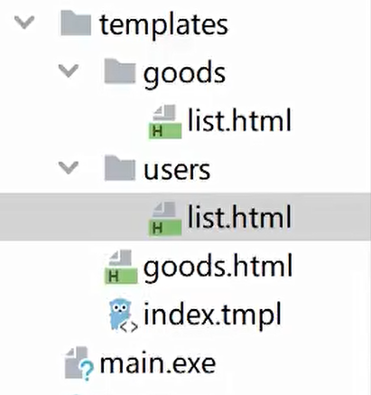

[示例 | Gin Web Framework (gin-gonic.com)](https://gin-gonic.com/zh-cn/docs/examples/)

Go世界里最流行的Web框架，[Github](https://github.com/gin-gonic/gin)上有`32K+`star。 基于[httprouter](https://github.com/julienschmidt/httprouter)开发的Web框架。 [中文文档示例](https://gin-gonic.com/zh-cn/docs/examples/)齐全，简单易用的轻量级框架。

# Gin框架介绍及使用

`Gin`是一个用Go语言编写的web框架。它是一个拥有更好性能的API框架, 由于使用了`httprouter`，速度提高了近40倍。 如果你是性能和高效的追求者, 你会爱上`Gin`。

下载并安装`Gin`:

```bash
go get -u github.com/gin-gonic/gin
```

# Gin返回渲染

## 自定义模板函数渲染

定义一个不转义相应内容的`safe`模板函数如下：

```go
	router.SetFuncMap(template.FuncMap{
		"safe": func(str string) template.HTML {
			return template.HTML(str)
		},
	})
```

## HTML渲染和模板应引用

我们首先定义一个存放模板文件的`templates`文件夹，然后在其内部按照业务分别定义一个`posts`文件夹和一个`users`文件夹。 `posts.html`和`users.html`文件的内容如下：
Gin框架中使用`gin.Default().LoadHTMLGlob()`或者`gin.Default().LoadHTMLFiles()`方法进行HTML模板渲染。

```go
//加载templates目录下所有 HTML 文件，并将结果与 HTML 渲染器相关联
r.LoadHTMLGlob("templates/*") 
//加载templates目录下所有目录和 HTML 文件
r.LoadHTMLGlob("templates/**") 
//加载 HTML 文件切片，并将结果与 HTML 渲染器相关联。
r.LoadHTMLFiles("templates/posts/index.html", "templates/users/index.html")
```
当不同目录下出现同文件名时，我们应该如何应引用html模板？

定义模板的时候需要通过 define 定义html模板名称



```go
{{define "posts/index.html"}}
<html lang="en">
<head>
    <meta charset="UTF-8">
    <meta content="width=device-width, initial-scale=1.0" name="viewport">
    <meta content="ie=edge" http-equiv="X-UA-Compatible">
    <title>posts/index</title>
</head>
<body>
{{.title}}
</body>
</html>
{{end}}
```

gin中使用

```go
r.GET("templates/list.html", func(c *gin.Context) {
		c.HTML(http.StatusOK, "posts/list.html", gin.H{
			"title": "posts/list.html",
		})
	})
```


## JSON渲染

```go
	r.GET("/someJSON", func(c *gin.Context) { // 方式一：自己拼接JSON
		c.JSON(http.StatusOK, gin.H{"message": "Hello world!"}) // gin.H 是map[string]interface{}的缩写
	})
	r.GET("/moreJSON", func(c *gin.Context) { // 方法二：使用结构体
		var msg struct {
			Name    string `json:"user"`
			Message string
			Age     int
		}
		msg.Name = "小王子"
		msg.Message = "Hello world!"
		msg.Age = 18
		c.JSON(http.StatusOK, msg)
	})
```

## XML渲染

注意需要使用具名的结构体类型。

```go
	r.GET("/someXML", func(c *gin.Context) { // 方式一：自己拼接JSON
		c.XML(http.StatusOK, gin.H{"message": "Hello world!"})
	})
	r.GET("/moreXML", func(c *gin.Context) { // 方法二：使用结构体
		type MessageRecord struct {
			Name    string
			Message string
			Age     int
		}
		var msg MessageRecord
		msg.Name = "小王子"
		msg.Message = "Hello world!"
		msg.Age = 18
		c.XML(http.StatusOK, msg)
	})
```

## YMAL渲染

```go
r.GET("/someYAML", func(c *gin.Context) {
	c.YAML(http.StatusOK, gin.H{"message": "ok", "status": http.StatusOK})
})
```

## Protobuf渲染

```go
r.GET("/someProtoBuf", func(c *gin.Context) {
	reps := []int64{int64(1), int64(2)}
	label := "test"
	data := &protoexample.Test{ // protobuf 的具体定义写在 testdata/protoexample 文件中。
		Label: &label,
		Reps:  reps,
	}
	// 请注意，数据在响应中变为二进制数据
	c.ProtoBuf(http.StatusOK, data) // 将输出被 protoexample.Test protobuf 序列化了的数据
})
```

## PureJSON渲染

通常，JSON 使用 unicode 替换特殊 HTML 字符，例如 < 变为 \ u003c。如果要按字面对这些字符进行编码，则可以使用 PureJSON。

```go
	r.GET("/json", func(c *gin.Context) {	// 提供 unicode 实体
		c.JSON(200, gin.H{
			"html": "<b> Hello, world!</b>",
		})
	})

	r.GET("/pureJson", func(c *gin.Context) {	// 提供字面字符
		c.PureJSON(200, gin.H{
			"html": "<b> Hello, world!</b>",
		})
	})
```

测试：

```go
$ curl 127.0.0.1:8080/json
{"html":"\u003cb\u003e Hello, world!\u003c/b\u003e"}
普通json 会将< > 特殊字符转为 unicode

$ curl 127.0.0.1:8080/pureJson
{"html":"<b> Hello, world!</b>"}
```

pureJson 将会保留特殊字符


## 静态文件处理

当我们渲染的HTML文件中引用了静态文件时，我们只需要按照以下方式在渲染页面前调用`gin.Static`方法即可。自动在static目录下寻找

```go
r.Static("xxx", "./static") // 指定静态文件处理路径
```

```html
<link href="xxx/index.html">
```


## 使用模板继承

Gin框架默认都是使用单模板，如果需要使用`block template`功能，可以通过`"github.com/gin-contrib/multitemplate"`库实现，具体示例如下：

首先，假设我们项目目录下的templates文件夹下有以下模板文件，其中`home.tmpl`和`index.tmpl`继承了`base.tmpl`：

```bash
templates
├── includes
│   ├── home.tmpl
│   └── index.tmpl
├── layouts
│   └── base.tmpl
└── scripts.tmpl
```

然后我们定义一个`loadTemplates`函数如下：

```go
func loadTemplates(templatesDir string) multitemplate.Renderer {
	r := multitemplate.NewRenderer()
	layouts, err := filepath.Glob(templatesDir + "/layouts/*.tmpl")
	if err != nil {
		panic(err.Error())
	}
	includes, err := filepath.Glob(templatesDir + "/includes/*.tmpl")
	if err != nil {
		panic(err.Error())
	}
	// 为layouts/和includes/目录生成 templates map
	for _, include := range includes {
		layoutCopy := make([]string, len(layouts))
		copy(layoutCopy, layouts)
		files := append(layoutCopy, include)
		r.AddFromFiles(filepath.Base(include), files...)
	}
	return r
}
```

我们在`main`函数中

```go
func indexFunc(c *gin.Context){
	c.HTML(http.StatusOK, "index.tmpl", nil)
}

func homeFunc(c *gin.Context){
	c.HTML(http.StatusOK, "home.tmpl", nil)
}

func main(){
	r := gin.Default()
	r.HTMLRender = loadTemplates("./templates")
	r.GET("/index", indexFunc)
	r.GET("/home", homeFunc)
	r.Run()
}
```

## 补充文件路径处理

关于模板文件和静态文件的路径，我们需要根据公司/项目的要求进行设置。可以使用下面的函数获取当前执行程序的路径。

```go
func getCurrentPath() string {
	if ex, err := os.Executable(); err == nil {
		return filepath.Dir(ex)
	}
	return "./"
}
```

# validator表单验证

对binding内字段的限制，和对传入数据的字段和类型进行验证。

[go-playground/validator](https://github.com/go-playground/validator)：包验证器根据标签对结构体和单个字段进行值验证规则。

```go
type Login struct {// Binding from JSON
  // binding:约束，required必填项 , min字符段最短为3
  User     string `form:"user" json:"user" binding:"required,min=3,max=8"` 
  Password string `form:"password" json:"password" binding:"required"`
}

type SignUpParam struct { //注册
	Age        uint   `json:"age" binding:"gte=1,lte=130"` //validator 字段内容
	Name       string `json:"name" binding:"required"`
	Email      string `json:"email" binding:"required, email"`
	Password   string `json:"password" binding:"required"`
	RePassword string `json:"re_password" binding:"required,eqfield=Password"` //eqfield与指定字段约束一样
}
```

[validator翻译和自定义错误](https://github.com/go-playground/validator/blob/master/_examples/translations/main.go)：定义中文报错提示

```go
import (
	"fmt"

	"github.com/go-playground/locales/en"
	ut "github.com/go-playground/universal-translator"
	"github.com/go-playground/validator/v10"
	en_translations "github.com/go-playground/validator/v10/translations/en" // validator的翻译器
)

func main() {
	// NOTE: ommitting allot of error checking for brevity
	en := en.New()
	uni = ut.New(en, en)

	// this is usually know or extracted from http 'Accept-Language' header
	// also see uni.FindTranslator(...)
	trans, _ := uni.GetTranslator("en")

	validate = validator.New()
	en_translations.RegisterDefaultTranslations(validate, trans)

	translateAll(trans)
	translateIndividual(trans)
	translateOverride(trans) // yep you can specify your own in whatever locale you want!
}
```


# 获取参数

从路径中获取参数

## 通过URL获取携带参数

`querystring`参数指的是URL中`?`后面携带的参数，

例如：`/user/search?username=小王子&address=沙河`。 获取请求的querystring参数的方法如下：

```go
	r.GET("/web", func(c *gin.Context) {
		address := c.Query("address") // 返回 url 中key对应的值（如果存在），否则返回空字符串
		//username ,err := c.GetQuery("username")
		username := c.DefaultQuery("username", "小王子") // 指定返回的默认值字符串
		c.JSON(http.StatusOK, gin.H{                  //输出json结果给调用方
			"message":  "ok",
			"username": username,
			"address":  address,
		})
	})
```

## 获取URL路径传递参数

请求的参数通过URL路径传递，例如：`/user/search/小王子/沙河`。 获取请求URL路径中的参数的方式如下。

```go
r.GET("/user/search/:username/:address", func(c *gin.Context) { // http://user/search/:xiaobai/:hunan
		username := c.Param("username") //获取对应路径下指定key的参数
		address := c.Param("address")
		c.JSON(http.StatusOK, gin.H{ //输出json结果给调用方
			"message":  "ok",
			"username": username,
			"address":  address,
		})
	})
```

## 通过POST请求获取参数

表单form参数，当前端请求的数据通过form表单提交时，例如向`/user/search`发送一个``POST`请求，获取请求数据的方式如下：

```go
	r.POST("/login", func(c *gin.Context) {
		//username := c.DefaultPostForm("username", "小王子")// DefaultPostForm取不到值时会返回指定的默认值
		username := c.PostForm("username")
		password := c.PostForm("password")
		c.JSON(http.StatusOK, gin.H{
			"message":  "ok",
			"username": username,
			"password": password,
		})
	})
```

## 获取json参数

当前端请求的数据通过JSON提交时，例如向`/json`发送一个POST请求，则获取请求参数的方式如下：

```go
r.POST("/json", func(c *gin.Context) { // 注意：下面为了举例子方便，暂时忽略了错误处理
	b, _ := c.GetRawData()  // 从c.Request.Body读取请求数据
	var m map[string]interface{} // 定义map或结构体
	_ = json.Unmarshal(b, &m) // 反序列化
	c.JSON(http.StatusOK, m)
})
```

更便利的获取请求参数的方式，参见下面的 **参数绑定** 小节。


## 参数绑定

为了能够更方便的获取请求相关参数，提高开发效率，我们可以基于请求的`Content-Type`识别请求数据类型并利用反射机制自动提取请求中`QueryString`、`form表单`、`JSON`、`XML`等参数到结构体中。

下面的示例代码演示了`.ShouldBind()`强大的功能，它能够基于请求自动提取`JSON`、`form表单`和`QueryString`类型的数据，并把值绑定到指定的结构体对象。

```go
	// 绑定JSON的示例 ({"user": "q1mi", "password": "123456"})
	router.POST("/loginJSON", func(c *gin.Context) {
		var login Login
		if err := c.ShouldBind(&login); err == nil {
			fmt.Printf("login info:%#v\n", login)
			c.JSON(http.StatusOK, gin.H{
				"user":     login.User,
				"password": login.Password,
			})
		} else {
			c.JSON(http.StatusBadRequest, gin.H{"error": err.Error()})
		}
	})

	// 绑定form表单示例 (user=q1mi&password=123456)
	router.POST("/loginForm", func(c *gin.Context) {
		var login Login
		// ShouldBind()会根据请求的Content-Type自行选择绑定器
		if err := c.ShouldBind(&login); err == nil {
			c.JSON(http.StatusOK, gin.H{
				"user":     login.User,
				"password": login.Password,
			})
		} else {
			c.JSON(http.StatusBadRequest, gin.H{"error": err.Error()})
		}
	})

	// 绑定QueryString示例 (/loginQuery?user=q1mi&password=123456)
	router.GET("/loginForm", func(c *gin.Context) {
		var login Login
		// ShouldBind()会根据请求的Content-Type自行选择绑定器
		if err := c.ShouldBind(&login); err == nil {
			c.JSON(http.StatusOK, gin.H{
				"user":     login.User,
				"password": login.Password,
			})
		} else {
			c.JSON(http.StatusBadRequest, gin.H{"error": err.Error()})
		}
	})
```

`ShouldBind`会按照下面的顺序解析请求中的数据完成绑定：

1. 如果是 `GET` 请求，只使用 `Form` 绑定引擎（`query`）。
2. 如果是 `POST` 请求，首先检查 `content-type` 是否为 `JSON` 或 `XML`，然后再使用 `Form`（`form-data`）。

区别

```go
c.ShouldBind()  //发生错误，会继续向下执行，错误自行处理
c.Bind() //发生错误，会停止执行
```


# 文件上传

## 单个文件上传

文件上传前端页面代码：

```html
<body>
<form action="/upload" method="post" enctype="multipart/form-data"><!--点击submit跳转到指定url: /upload -->
    <input type="file" name="f1">
    <input type="submit" value="上传">
</form>
</body>
```

后端gin框架部分代码：

```go
	r.LoadHTMLFiles("statics/fileUpload.html")
	r.GET("/fileupload", func(c *gin.Context) {
		c.HTML(http.StatusOK, "statics/fileUpload.html", nil)
	})

	r.POST("/upload", func(c *gin.Context) { //接收url：/upload 的 post请求
		file, err := c.FormFile("f1") // 单个文件，f1：前端请求name字段名
		if err != nil {               //传输有错误
			c.JSON(http.StatusInternalServerError, gin.H{
				"message": err.Error(),
			})
			return
		}

		log.Println(file.Filename)
		dst := fmt.Sprintf("./%s", file.Filename)

		c.SaveUploadedFile(file, dst) // 保存上传文件到指定的目录
		c.JSON(http.StatusOK, gin.H{
			"message": fmt.Sprintf("'%s' uploaded!", file.Filename),
		})
	})
```

## 多个文件上传

```go
	router.POST("/upload", func(c *gin.Context) {
		form, _ := c.MultipartForm()// Multipart form
		files := form.File["file"]

		for index, file := range files {
			log.Println(file.Filename)
			dst := fmt.Sprintf("./%s_%d", file.Filename, index)
			c.SaveUploadedFile(file, dst)// 上传文件到指定的目录
		}
		c.JSON(http.StatusOK, gin.H{
			"message": fmt.Sprintf("%d files uploaded!", len(files)),
		})
	})
```

# HTTP重定向和路由重定向

HTTP 重定向很容易。 内部、外部重定向均支持。

```go
r.GET("/test", func(c *gin.Context) {
	c.Redirect(http.StatusMovedPermanently, "http://www.sogo.com/")
})
```

路由重定向，使用`HandleContext`：

```go
r.GET("/test", func(c *gin.Context) {
    c.Request.URL.Path = "/test2" // 指定重定向的URL
    r.HandleContext(c)
})
r.GET("/test2", func(c *gin.Context) {
    c.JSON(http.StatusOK, gin.H{"hello": "world"})
})
```

# Gin路由

## 普通路由

```go
r.GET("/index", func(c *gin.Context) {...})
r.GET("/login", func(c *gin.Context) {...})
r.POST("/login", func(c *gin.Context) {...})
r.Any("/test", func(c *gin.Context) {...}) //一个可以匹配所有请求方法的`Any`方法（如GET、POST等）
```

## 错误路由

为没有配置处理函数的路由添加处理程序，默认情况下它返回404代码。为没有匹配到路由的请求都返回`views/404.html`页面。

```go
r.NoRoute(func(c *gin.Context) {
		c.HTML(http.StatusNotFound, "templates/404.html", nil)
	})
```

## 路由组

我们可以将拥有共同URL前缀的路由划分为一个路由组。习惯性一对`{}`包裹同组的路由，这只是为了看着清晰，你用不用`{}`包裹功能上没什么区别。

```go
	userGroup := r.Group("/user")
	{
		userGroup.GET("/index", func(c *gin.Context) {...})
		userGroup.GET("/login", func(c *gin.Context) {...})
		userGroup.POST("/login", func(c *gin.Context) {...})
	}
```

路由组也是支持嵌套的，例如：

```go
shopGroup := r.Group("/shop")
	{
		shopGroup.GET("/index", func(c *gin.Context) {...})
		shopGroup.GET("/cart", func(c *gin.Context) {...})
		shopGroup.POST("/checkout", func(c *gin.Context) {...})
		
		xx := shopGroup.Group("xx")// 嵌套路由组
		xx.GET("/oo", func(c *gin.Context) {...})
	}
```

通常我们将路由分组用在划分业务逻辑或划分API版本时。

## 路由原理

Gin框架中的路由使用的是[httprouter](https://github.com/julienschmidt/httprouter)这个库。其基本原理就是构造一个路由地址的前缀树。

# 路由拆分与注册

## 基本的路由注册

下面最基础的gin路由注册方式，适用于路由条目比较少的简单项目或者项目demo。

```go
func helloHandler(c *gin.Context) {
	c.JSON(http.StatusOK, gin.H{
		"message": "Hello q1mi!",
	})
}

func main() {
	r := gin.Default()
	r.GET("/hello", helloHandler)
	if err := r.Run(); err != nil {
		fmt.Println("startup service failed, err:%v\n", err)
	}
}
```

## 路由拆分成单独文件或包

当项目的规模增大后就不太适合继续在项目的`main.go`文件中去实现路由注册相关逻辑了，我们会倾向于把路由部分的代码都拆分出来，形成一个单独的文件或包：

我们在`routers.go`文件中定义并注册路由信息：

```go
func helloHandler(c *gin.Context) {
	c.JSON(http.StatusOK, gin.H{
		"message": "Hello q1mi!",
	})
}

func setupRouter() *gin.Engine {
	r := gin.Default()
	r.GET("/hello", helloHandler)
	return r
}
```

此时`main.go`中调用上面定义好的`setupRouter`函数：

```go
func main() {
	r := setupRouter()
	if err := r.Run(); err != nil {
		fmt.Println("startup service failed, err:%v\n", err)
	}
}
```

此时的目录结构：

```bash
gin_demo
├── go.mod
├── go.sum
├── main.go
└── routers.go
```

把路由部分的代码单独拆分成包的话也是可以的，拆分后的目录结构如下：

```bash
gin_demo
├── go.mod
├── go.sum
├── main.go
└── routers
    └── routers.go
```

`routers/routers.go`需要注意此时`setupRouter`需要改成首字母大写：

```go
func helloHandler(c *gin.Context) {
	c.JSON(http.StatusOK, gin.H{
		"message": "Hello q1mi!",
	})
}

func SetupRouter() *gin.Engine { // SetupRouter 配置路由信息
	r := gin.Default()
	r.GET("/hello", helloHandler)
	return r
}
```

`main.go`文件内容如下：

```go
func main() {
	r := routers.SetupRouter()
	if err := r.Run(); err != nil {
		fmt.Println("startup service failed, err:%v\n", err)
	}
}
```

## 路由拆分成多个文件

当我们的业务规模继续膨胀，单独的一个`routers`文件或包已经满足不了我们的需求了，

```go
func SetupRouter() *gin.Engine {
	r := gin.Default()
	r.GET("/hello", helloHandler)
  r.GET("/xx1", xxHandler1)
  ...
  r.GET("/xx30", xxHandler30)
	return r
}
```

因为我们把所有的路由注册都写在一个`SetupRouter`函数中的话就会太复杂了。

我们可以分开定义多个路由文件，例如：

```bash
gin_demo
├── go.mod
├── go.sum
├── main.go
└── routers
    ├── blog.go
    └── shop.go
```

`routers/shop.go`中添加一个`LoadShop`的函数，将shop相关的路由注册到指定的路由器：

```go
func LoadShop(e *gin.Engine)  {
  e.GET("/hello", helloHandler)
  e.GET("/goods", goodsHandler)
  e.GET("/checkout", checkoutHandler)
  ...
}
```

`routers/blog.go`中添加一个`LoadBlog的函数，将blog相关的路由注册到指定的路由器：

```go
func LoadBlog(e *gin.Engine) {
	e.GET("/post", postHandler)
  e.GET("/comment", commentHandler)
  ...
}
```

在main函数中实现最终的注册逻辑如下：

```go
func main() {
	r := gin.Default()
	routers.LoadBlog(r)
	routers.LoadShop(r)
	if err := r.Run(); err != nil {
		fmt.Println("startup service failed, err:%v\n", err)
	}
}
```

## 路由拆分到不同的APP

有时候项目规模实在太大，那么我们就更倾向于把业务拆分的更详细一些，例如把不同的业务代码拆分成不同的APP。

因此我们在项目目录下单独定义一个`app`目录，用来存放我们不同业务线的代码文件，这样就很容易进行横向扩展。大致目录结构如下：

```bash
gin_demo
├── app
│   ├── blog
│   │   ├── handler.go
│   │   └── router.go
│   └── shop
│       ├── handler.go
│       └── router.go
├── go.mod
├── go.sum
├── main.go
└── routers
    └── routers.go
```

其中`app/blog/router.go`用来定义`blog`相关的路由信息，具体内容如下：

```go
func Routers(e *gin.Engine) {
	e.GET("/post", postHandler)
	e.GET("/comment", commentHandler)
}
```

`app/shop/router.go`用来定义shop相关路由信息，具体内容如下：

```go
func Routers(e *gin.Engine) {
	e.GET("/goods", goodsHandler)
	e.GET("/checkout", checkoutHandler)
}
```

`routers/routers.go`中根据需要定义`Include`函数用来注册子app中定义的路由，`Init`函数用来进行路由的初始化操作：

```go
type Option func(*gin.Engine)

var options = []Option{}

func Include(opts ...Option) { // 注册app的路由配置
	options = append(options, opts...)
}

func Init() *gin.Engine { // 初始化
	r := gin.Default()
	for _, opt := range options {
		opt(r)
	}
	return r
}
```

`main.go`中按如下方式先注册子app中的路由，然后再进行路由的初始化：

```go
func main() {
	routers.Include(shop.Routers, blog.Routers) // 加载多个APP的路由配置
	r := routers.Init() // 初始化路由
	if err := r.Run(); err != nil {
		fmt.Println("startup service failed, err:%v\n", err)
	}
}
```

# Gin中间件

Gin框架允许开发者在处理请求的过程中，加入用户自己的钩子（Hook）函数。这个钩子函数就叫中间件，中间件适合处理一些公共的业务逻辑，比如登录认证、权限校验、数据分页、记录日志、耗时统计等。

## 定义中间件

Gin中的中间件必须是一个`gin.HandlerFunc`类型。例如：

```go
func StatCost() gin.HandlerFunc {}
```

### 记录接口耗时的中间件

定义一个统计请求耗时的中间件。

```go
func StatCost() gin.HandlerFunc { // 1、自定义中间件方式一 ， StatCost 是一个统计耗时请求耗时的中间件
	return func(c *gin.Context) {
		start := time.Now()
		c.Set("name", "小王子") // 可以通过c.Set在请求上下文中设置值，后续的处理函数能够取到该值
		c.Next()             // 直接调用该请求的剩余处理程序，如indexHandler中间件，执行完该中间件再向下执行
		// c.Abort() // 不调用该请求的剩余处理程序
		cost := time.Since(start) // 计算耗时
		log.Println(cost)
	}
}
```

### 记录响应体的中间件

我们有时候可能会想要记录下某些情况下返回给客户端的响应数据，这个时候就可以编写一个中间件来搞定。

```go
type bodyLogWriter struct {
	gin.ResponseWriter               // 嵌入gin框架ResponseWriter
	body               *bytes.Buffer // 我们记录用的response
}

func (w bodyLogWriter) Write(b []byte) (int, error) { // Write 写入响应体数据
	w.body.Write(b)                  // 我们记录一份
	return w.ResponseWriter.Write(b) // 真正写入响应
}

// ginBodyLogMiddleware 一个记录返回给客户端响应体的中间件
// https://stackoverflow.com/questions/38501325/how-to-log-response-body-in-gin
func ginBodyLogMiddleware(c *gin.Context) {
	blw := &bodyLogWriter{body: bytes.NewBuffer([]byte{}), ResponseWriter: c.Writer}
	c.Writer = blw // 使用我们自定义的类型替换默认的
	c.Next() // 执行业务逻辑

	fmt.Println("Response body: " + blw.body.String()) // 事后按需记录返回的响应
}
```

### 跨域中间件cors

推荐使用社区的https://github.com/gin-contrib/cors 库，一行代码解决前后端分离架构下的跨域问题。

**注意：** 该中间件需要注册在业务处理函数前面。

这个库支持各种常用的配置项，具体使用方法如下。

```go
func main() {
  router := gin.Default()
  // CORS for https://foo.com and https://github.com origins, allowing:
  // - PUT and PATCH methods
  // - Origin header
  // - Credentials share
  // - Preflight requests cached for 12 hours
  router.Use(cors.New(cors.Config{
    AllowOrigins:     []string{"https://foo.com"},  // 允许跨域发来请求的网站
    AllowMethods:     []string{"GET", "POST", "PUT", "DELETE",  "OPTIONS"},  // 允许的请求方法
    AllowHeaders:     []string{"Origin", "Authorization", "Content-Type"},
    ExposeHeaders:    []string{"Content-Length"},
    AllowCredentials: true,
    AllowOriginFunc: func(origin string) bool {  // 自定义过滤源站的方法
      return origin == "https://github.com"
    },
    MaxAge: 12 * time.Hour,
  }))
  router.Run()
}
```

当然你可以简单的像下面的示例代码那样使用默认配置，允许所有的跨域请求。

```go
func main() {
  router := gin.Default()
  // same as
  // config := cors.DefaultConfig()
  // config.AllowAllOrigins = true
  // router.Use(cors.New(config))
  router.Use(cors.Default())
  router.Run()
}
```

## 注册中间件

在gin框架中，我们可以为每个路由添加任意数量的中间件。

### 为全局路由注册

```go
	r := gin.New() // 新建一个没有任何默认中间件的路由
	r.Use(StatCost()) // 注册一个全局中间件
	r.GET("/test", func(c *gin.Context) {
		name := c.MustGet("name").(string) // 从上下文取值
		log.Println(name)
		c.JSON(http.StatusOK, gin.H{
			"message": "Hello world!",
		})
	})
```

### 为某个路由单独注册

```go
	r.GET("/test2", StatCost(), func(c *gin.Context) { // 给/test2路由单独注册中间件（可注册多个）
		name := c.MustGet("name").(string) // 从上下文取值
		log.Println(name)
		c.JSON(http.StatusOK, gin.H{
			"message": "Hello world!",
		})
	})
```

### 为路由组注册中间件

为路由组注册中间件有以下两种写法。

```go
shopGroup := r.Group("/shop", StatCost()) //写法1
//r.Group("/shop").Use(StatCost()) //写法2
{
    shopGroup.GET("/index", func(c *gin.Context) {...})
    ...
}
```


## 中间件中止

在Gin框架中，`c.Abort()`是一个常用的方法，用于中止当前请求的处理流程，并立即返回响应给客户端。当调用`c.Abort()`时，Gin会停止执行后续的中间件和处理函数，并直接返回响应。

```go
r.GET("/hello", func(c *gin.Context) {
		if someCondition {	// 检查某个条件，如果不满足则中止请求处理
			c.Abort()
			return
		}

		c.JSON(200, gin.H{	// 处理请求
			"message": "Hello, Gin!",
		})
})
```


## 插件化加载中间件

iam-apiserver 支持插件化地加载 Gin 中间件，通过这种插件机制，我们可以根据需要选择中间件。

那么，为什么要将中间件做成一种插件化的机制呢？一方面，每个中间件都完成某种功能，这些功能不是所有情况下都需要的；另一方面，中间件是追加在 HTTP 请求链路上的一个处理函数，会影响 API 接口的性能。为了保证 API 接口的性能，我们也需要选择性地加载中间件。

例如，在测试环境中为了方便 Debug，可以选择加载 dump 中间件。dump 中间件可以打印请求包和返回包信息，这些信息可以协助我们 Debug。但是在现网环境中，我们不需要 dump 中间件来协助 Debug，而且如果加载了 dump 中间件，请求时会打印大量的请求信息，严重影响 API 接口的性能。这时候，我们就期望中间件能够按需加载。

iam-apiserver 通过 [InstallMiddlewares](https://github.com/marmotedu/iam/blob/v1.0.4/internal/pkg/server/genericapiserver.go#L94) 函数来安装 Gin 中间件，函数代码如下：

```go
func (s *GenericAPIServer) InstallMiddlewares() {
    // necessary middlewares
    s.Use(middleware.RequestID())
    s.Use(middleware.Context())

    // install custom middlewares
    for _, m := range s.middlewares {
        mw, ok := middleware.Middlewares[m]
        if !ok {
            log.Warnf("can not find middleware: %s", m)

            continue
        }

        log.Infof("install middleware: %s", m)
        s.Use(mw)
    }
}
```

可以看到，安装中间件时，我们不仅安装了一些必备的中间件，还安装了一些可配置的中间件。

上述代码安装了两个默认的中间件： [RequestID](https://github.com/marmotedu/iam/blob/v1.0.4/internal/pkg/middleware/requestid.go#L22) 和 [Context](https://github.com/marmotedu/iam/blob/v1.0.4/internal/pkg/middleware/context.go#L17) 。

RequestID 中间件，主要用来在 HTTP 请求头和返回头中设置 `X-Request-ID` Header。如果 HTTP 请求头中没有 `X-Request-ID` HTTP 头，则创建 64 位的 UUID，如果有就复用。UUID 是调用 `github.com/satori/go.uuid` 包提供的 `NewV4().String()` 方法来生成的：

```go
rid = uuid.NewV4().String()
```

另外，这里有个 Go 常量的设计规范需要你注意：常量要跟该常量相关的功能包放在一起，不要将一个项目的常量都集中放在 const 这类包中。例如， [requestid.go](https://github.com/marmotedu/iam/blob/v1.0.4/internal/pkg/middleware/requestid.go) 文件中，我们定义了 `XRequestIDKey = "X-Request-ID"` 常量，其他地方如果需要使用 `XRequestIDKey`，只需要引入 `XRequestIDKey` 所在的包，并使用即可。

Context 中间件，用来在 gin.Context 中设置 `requestID` 和 `username` 键，在打印日志时，将 gin.Context 类型的变量传递给 `log.L()` 函数， `log.L()` 函数会在日志输出中输出 `requestID` 和 `username` 域：

```bash
2021-07-09 13:33:21.362 DEBUG   apiserver       v1/user.go:106  get 2 users from backend storage.       {"requestID": "f8477cf5-4592-4e47-bdcf-82f7bde2e2d0", "username": "admin"}
```

`requestID` 和 `username` 字段可以方便我们后期过滤并查看日志。

除了默认的中间件，iam-apiserver 还支持一些可配置的中间件，我们可以通过配置 iam-apiserver 配置文件中的 [server.middlewares](https://github.com/marmotedu/iam/blob/v1.0.4/configs/iam-apiserver.yaml#L11) 配置项，来配置这些这些中间件。

可配置以下中间件：

- recovery：捕获任何 panic，并恢复。
- secure：添加一些安全和资源访问相关的 HTTP 头。
- nocache：禁止客户端缓存 HTTP 请求的返回结果。
- cors：HTTP 请求跨域中间件。
- dump：打印出 HTTP 请求包和返回包的内容，方便 debug。注意，生产环境禁止加载该中间件。

当然，你还可以根据需要，添加更多的中间件。方法很简单，只需要编写中间件，并将中间件添加到一个 `map[string]gin.HandlerFunc` 类型的变量中即可：

```go
func defaultMiddlewares() map[string]gin.HandlerFunc {
    return map[string]gin.HandlerFunc{
        "recovery":  gin.Recovery(),
        "secure":    Secure,
        "options":   Options,
        "nocache":   NoCache,
        "cors":      Cors(),
        "requestid": RequestID(),
        "logger":    Logger(),
        "dump":      gindump.Dump(),
    }
}
```

上述代码位于 [internal/pkg/middleware/middleware.go](https://github.com/marmotedu/iam/blob/v1.0.4/internal/pkg/middleware/middleware.go#L56) 文件中。

## 中间件注意事项

### gin默认中间件

`gin.Default()`默认使用了`Logger()`和`Recovery()`中间件，其中：

- `Logger`中间件将日志写入`gin.DefaultWriter`，即使配置了`GIN_MODE=release`。
- `Recovery`中间件会recover任何`panic`。如果有panic的话，会写入500响应码。

`gin.New()`新建一个没有任何默认中间件的路由。

### gin中间件中使用goroutine

当在中间件或`handler`中启动新的`goroutine`时，**不能使用**原始的上下文（c *gin.Context），必须使用其只读副本（`c.Copy()`）。

```go
go funcXX(c.Copy())
```

# JWT

JWT全称JSON Web Token是一种跨域认证解决方案，属于一个开放的标准，它规定了一种Token实现方式，目前多用于前后端分离项目和OAuth2.0业务场景下。

## 为什么需要JWT？

在之前的一些web项目中，我们通常使用的是`Cookie-Session`模式实现用户认证。相关流程大致如下：

1. 用户在浏览器端填写用户名和密码，并发送给服务端
2. 服务端对用户名和密码校验通过后会生成一份保存当前用户相关信息的session数据和一个与之对应的标识（通常称为session_id）
3. 服务端返回响应时将上一步的session_id写入用户浏览器的Cookie
4. 后续用户来自该浏览器的每次请求都会自动携带包含session_id的Cookie
5. 服务端通过请求中的session_id就能找到之前保存的该用户那份session数据，从而获取该用户的相关信息。

这种方案依赖于客户端（浏览器）保存 Cookie，并且需要在服务端存储用户的session数据。

在移动互联网时代，我们的用户可能使用浏览器也可能使用APP来访问我们的服务，我们的web应用可能是前后端分开部署在不同的端口，有时候我们还需要支持第三方登录，这下`Cookie-Session`的模式就有些力不从心了。

JWT就是一种基于Token的轻量级认证模式，服务端认证通过后，会生成一个JSON对象，经过签名后得到一个Token（令牌）再发回给用户，用户后续请求只需要带上这个Token，服务端解密之后就能获取该用户的相关信息了。

想要了解JWT的原理，推荐大家阅读：[阮一峰的JWT入门教程](https://www.ruanyifeng.com/blog/2018/07/json_web_token-tutorial.html)

## 安装

我们使用 Go 语言社区中的 jwt 相关库来构建我们的应用，例如：https://github.com/golang-jwt/jwt。

```bash
go get github.com/golang-jwt/jwt/v4
go get -u github.com/golang-jwt/jwt/v5
```

本文将使用这个库来实现我们生成JWT和解析JWT的功能。

## 默认Claim

如果我们直接使用JWT中默认的字段，没有其他定制化的需求则可以直接使用这个包中的和方法快速生成和解析token。

```go
var mySigningKey = []byte("liwenzhou.com") // 用于签名的字符串

// GenRegisteredClaims 使用默认声明创建jwt
func GenRegisteredClaims() (string, error) {
	claims := &jwt.RegisteredClaims{ // 创建 Claims
		ExpiresAt: jwt.NewNumericDate(time.Now().Add(time.Hour * 24)), // 过期时间
		Issuer:    "qimi",                                             // 签发人
	}
	token := jwt.NewWithClaims(jwt.SigningMethodHS256, claims) // 使用指定的签名方法和声明创建新的token

	return token.SignedString(mySigningKey) // 生成签名字符串
}

// ParseRegisteredClaims 解析jwt
func ValidateRegisteredClaims(tokenString string) bool {
	token, err := jwt.Parse(tokenString, func(token *jwt.Token) (interface{}, error) { // 解析token
		return mySigningKey, nil
	})
	if err != nil { // 解析token失败
		return false
	}
	return token.Valid
}
```

## 自定义Claims

我们需要定制自己的需求来决定JWT中保存哪些数据，比如我们规定在JWT中要存储`username`信息，那么我们就定义一个`MyClaims`结构体如下：

```go
// jwt包自带的jwt.RegisteredClaims只包含了官方字段
// 假设我们这里需要额外记录一个username字段，所以要自定义结构体
// 如果想要保存更多信息，都可以添加到这个结构体中
type CustomClaims struct { 				// 自定义声明类型 并内嵌jwt.RegisteredClaims
	Username string `json:"username"` // 可根据需要自行添加字段
	jwt.RegisteredClaims        		// 内嵌标准的声明
}
```

然后我们定义JWT的过期时间，这里以24小时为例：

```go
const TokenExpireDuration = time.Hour * 24
```

接下来还需要定义一个用于签名的字符串：

```go
var CustomSecret = []byte("夏天夏天悄悄过去") // CustomSecret 用于加盐的字符串
```

## 生成JWT

我们可以根据自己的业务需要封装一个生成 token 的函数。

```go
// GenToken 生成JWT
func GenToken(username string) (string, error) {
	claims := CustomClaims{ // 创建一个我们自己的声明Claims
		username, // 自定义字段
		jwt.RegisteredClaims{
			ExpiresAt: jwt.NewNumericDate(time.Now().Add(TokenExpireDuration)),
			Issuer:    "my-project", // 签发人
		},
	}
	token := jwt.NewWithClaims(jwt.SigningMethodHS256, claims) // 使用指定的签名方法创建签名对象
	return token.SignedString(CustomSecret) // 使用指定的secret签名并获得完整的编码后的字符串token
}
```

## 解析JWT

根据给定的 JWT 字符串，解析出数据。

```go
func ParseToken(tokenString string) (*CustomClaims, error) { // ParseToken 解析JWT
	// 解析token
    // 直接使用标准的Claim则可以直接使用Parse方法
    // token, err := jwt.Parse(tokenString, func(token *jwt.Token) (i interface{}, err error) {
	// 如果是自定义Claim结构体则需要使用 ParseWithClaims 方法
	token, err := jwt.ParseWithClaims(tokenString, &CustomClaims{}, func(token *jwt.Token) (i interface{}, err error) { return CustomSecret, nil })
	if err != nil {
		return nil, err
	}
	// 对token对象中的Claim进行类型断言
	if claims, ok := token.Claims.(*CustomClaims); ok && token.Valid { // 校验token
		return claims, nil
	}
	return nil, errors.New("invalid token")
}
```

## 在gin框架中使用JWT

首先我们注册一条路由`/auth`，对外提供获取Token的渠道：

```go
r.POST("/auth", authHandler)
```

我们的`authHandler`定义如下：

```go
func authHandler(c *gin.Context) {
	var user UserInfo
	err := c.ShouldBind(&user) // 用户发送用户名和密码过来
	if err != nil {
		c.JSON(http.StatusOK, gin.H{
			"code": 2001,
			"msg":  "无效的参数",
		})
		return
	}
	// 校验用户名和密码是否正确
	if user.Username == "q1mi" && user.Password == "q1mi123" {
		tokenString, _ := GenToken(user.Username) // 生成Token
		c.JSON(http.StatusOK, gin.H{
			"code": 2000,
			"msg":  "success",
			"data": gin.H{"token": tokenString},
		})
		return
	}
	c.JSON(http.StatusOK, gin.H{
		"code": 2002,
		"msg":  "鉴权失败",
	})
	return
}
```

用户通过上面的接口获取Token之后，后续就会携带着Token再来请求我们的其他接口，这个时候就需要对这些请求的Token进行校验操作了，很显然我们应该实现一个检验Token的中间件，具体实现如下：

```go
func JWTAuthMiddleware() func(c *gin.Context) { // JWTAuthMiddleware 基于JWT的认证中间件
	return func(c *gin.Context) {
		// 客户端携带Token有三种方式 1.放在请求头 2.放在请求体 3.放在URI
		// 这里假设Token放在Header的Authorization中，并使用Bearer开头
		// 这里的具体实现方式要依据你的实际业务情况决定
		authHeader := c.Request.Header.Get("Authorization")
		if authHeader == "" {
			c.JSON(http.StatusOK, gin.H{
				"code": 2003,
				"msg":  "请求头中auth为空",
			})
			c.Abort()
			return
		}

		parts := strings.SplitN(authHeader, " ", 2) // 按空格分割
		if !(len(parts) == 2 && parts[0] == "Bearer") {
			c.JSON(http.StatusOK, gin.H{
				"code": 2004,
				"msg":  "请求头中auth格式有误",
			})
			c.Abort()
			return
		}

		mc, err := ParseToken(parts[1]) // parts[1]是获取到的tokenString，我们使用之前定义好的解析JWT的函数来解析它
		if err != nil {
			c.JSON(http.StatusOK, gin.H{
				"code": 2005,
				"msg":  "无效的Token",
			})
			c.Abort()
			return
		}

		c.Set("username", mc.Username) // 将当前请求的username信息保存到请求的上下文c上
		c.Next() // 后续的处理函数可以用过c.Get("username")来获取当前请求的用户信息
	}
}
```

注册一个`/home`路由，发个请求验证一下吧。

```go
r.GET("/home", JWTAuthMiddleware(), homeHandler)

func homeHandler(c *gin.Context) {
	username := c.MustGet("username").(string)
	c.JSON(http.StatusOK, gin.H{
		"code": 2000,
		"msg":  "success",
		"data": gin.H{"username": username},
	})
}
```

如果不想自己实现上述功能，你也可以使用Github上别人封装好的包，比如https://github.com/appleboy/gin-jwt。

## refresh token

在某些业务场景下，我们可能还需要使用refresh token。

这里可以参考 [RFC 6749 OAuth2.0中关于refresh token的介绍](https://datatracker.ietf.org/doc/html/rfc6749#section-1.5)

# Cookie和Session

**Cookie的由来**

HTTP协议是无状态的，这就存在一个问题。

无状态的意思是每次请求都是独立的，它的执行情况和结果与前面的请求和之后的请求都无直接关系，它不会受前面的请求响应情况直接影响，也不会直接影响后面的请求响应情况。

一句有意思的话来描述就是人生只如初见，对服务器来说，每次的请求都是全新的。

状态可以理解为客户端和服务器在某次会话中产生的数据，那无状态的就以为这些数据不会被保留。会话中产生的数据又是我们需要保存的，也就是说要“保持状态”。因此Cookie就是在这样一个场景下诞生。

**Cookie是什么**

在 Internet 中，Cookie 实际上是指小量信息，是由 Web 服务器创建的，将信息存储在用户计算机上（客户端）的数据文件。一般网络用户习惯用其复数形式 Cookies，指某些网站为了辨别用户身份、进行 Session 跟踪而存储在用户本地终端上的数据，而这些数据通常会经过加密处理。

**Cookie的机制**

Cookie是由服务器端生成，发送给User-Agent（一般是浏览器），浏览器会将Cookie的key/value保存到某个目录下的文本文件内，下次请求同一网站时就发送该Cookie给服务器（前提是浏览器设置为启用cookie）。Cookie名称和值可以由服务器端开发自己定义，这样服务器可以知道该用户是否是合法用户以及是否需要重新登录等，服务器可以设置或读取Cookies中包含信息，借此维护用户跟服务器会话中的状态。

总结一下Cookie的特点：

1. 浏览器发送请求的时候，自动把携带该站点之前存储的Cookie信息。
2. 服务端可以设置Cookie数据。
3. Cookie是针对单个域名的，不同域名之间的Cookie是独立的。
4. Cookie数据可以配置过期时间，过期的Cookie数据会被系统清除。

**查看Cookie**

我们使用Chrome浏览器打开一个网站，打开开发者工具查看该网站保存在我们电脑上的Cookie数据。

## Go操作Cookie

### Cookie

标准库`net/http`中定义了Cookie，它代表一个出现在HTTP响应头中Set-Cookie的值里或者HTTP请求头中Cookie的值的`HTTP cookie`。

```go
type Cookie struct {
    Name       string
    Value      string
    Path       string
    Domain     string
    Expires    time.Time
    RawExpires string
    // MaxAge=0表示未设置Max-Age属性
    // MaxAge<0表示立刻删除该cookie，等价于"Max-Age: 0"
    // MaxAge>0表示存在Max-Age属性，单位是秒
    MaxAge   int
    Secure   bool
    HttpOnly bool
    Raw      string
    Unparsed []string // 未解析的“属性-值”对的原始文本
}
```

### 设置Cookie

`net/http`中提供了如下`SetCookie`函数，它在w的头域中添加Set-Cookie头，该HTTP头的值为cookie。

```go
func SetCookie(w ResponseWriter, cookie *Cookie)
```

### 获取Cookie

`Request`对象拥有两个获取Cookie的方法和一个添加Cookie的方法：

获取Cookie的两种方法：

```go
// 解析并返回该请求的Cookie头设置的所有cookie
func (r *Request) Cookies() []*Cookie

// 返回请求中名为name的cookie，如果未找到该cookie会返回nil, ErrNoCookie。
func (r *Request) Cookie(name string) (*Cookie, error)
```

添加Cookie的方法：

```go
func (r *Request) AddCookie(c *Cookie) // AddCookie向请求中添加一个cookie。
```

## gin框架操作Cookie

```go
func main() {
    router := gin.Default()
    router.GET("/cookie", func(c *gin.Context) {
        cookie, err := c.Cookie("gin_cookie") // 获取Cookie
        if err != nil {
            cookie = "NotSet"
            c.SetCookie("gin_cookie", "test", 3600, "/", "localhost", false, true) // 设置Cookie
        }
        fmt.Printf("Cookie value: %s \n", cookie)
    })

    router.Run()
}
```

## Session

**Session的由来**

Cookie虽然在一定程度上解决了“保持状态”的需求，但是由于Cookie本身最大支持4096字节，以及Cookie本身保存在客户端，可能被拦截或窃取，因此就需要有一种新的东西，它能支持更多的字节，并且他保存在服务器，有较高的安全性。这就是`Session`。

问题来了，基于HTTP协议的无状态特征，服务器根本就不知道访问者是“谁”。那么上述的Cookie就起到桥接的作用。

用户登陆成功之后，我们在服务端为每个用户创建一个特定的session和一个唯一的标识，它们一一对应。其中：

- Session是在服务端保存的一个数据结构，用来跟踪用户的状态，这个数据可以保存在集群、数据库、文件中；
- 唯一标识通常称为`Session ID`会写入用户的Cookie中。

这样该用户后续再次访问时，请求会自动携带Cookie数据（其中包含了`Session ID`），服务器通过该`Session ID`就能找到与之对应的Session数据，也就知道来的人是“谁”。

总结而言：Cookie弥补了HTTP无状态的不足，让服务器知道来的人是“谁”；但是Cookie以文本的形式保存在本地，自身安全性较差；所以我们就通过Cookie识别不同的用户，对应的在服务端为每个用户保存一个Session数据，该Session数据中能够保存具体的用户数据信息。

另外，上述所说的Cookie和Session其实是共通性的东西，不限于语言和框架。

# Gin中运行多个服务

我们可以在多个端口启动服务，例如：

```go
var g errgroup.Group

func router01() http.Handler {
	e := gin.New()
	e.Use(gin.Recovery())
	e.GET("/", func(c *gin.Context) {
		c.JSON(
			http.StatusOK,
			gin.H{
				"code":  http.StatusOK,
				"error": "Welcome server 01",
			},
		)
	})
	return e
}

func router02() http.Handler {
	e := gin.New()
	e.Use(gin.Recovery())
	e.GET("/", func(c *gin.Context) {
		c.JSON(
			http.StatusOK,
			gin.H{
				"code":  http.StatusOK,
				"error": "Welcome server 02",
			},
		)
	})
	return e
}

func main() {
	server01 := &http.Server{
		Addr:         ":8080",
		Handler:      router01(),
		ReadTimeout:  5 * time.Second,
		WriteTimeout: 10 * time.Second,
	}

	server02 := &http.Server{
		Addr:         ":8081",
		Handler:      router02(),
		ReadTimeout:  5 * time.Second,
		WriteTimeout: 10 * time.Second,
	}
  
	g.Go(func() error {  // 借助errgroup.Group或者自行开启两个goroutine分别启动两个服务
		return server01.ListenAndServe()
	})
	g.Go(func() error {
		return server02.ListenAndServe()
	})

	if err := g.Wait(); err != nil {
		log.Fatal(err)
	}
}
```

# 优雅的重启服务

在讲优雅关停之前，先来看看不优雅的停止服务方式是什么样的。

当我们需要重启服务时，首先需要停止服务，这时可以通过两种方式来停止我们的服务：

- 在 Linux 终端键入 Ctrl + C（其实是发送 SIGINT 信号）。
- 发送 SIGTERM 信号，例如 `kill` 或者 `systemctl stop` 等。

当我们使用以上两种方式停止服务时，都会产生下面两个问题：

- 有些请求正在处理，如果服务端直接退出，会造成客户端连接中断，请求失败。
- 我们的程序可能需要做一些清理工作，比如等待进程内任务队列的任务执行完成，或者拒绝接受新的消息等。

这些问题都会对业务造成影响，所以我们需要一种优雅的方式来关停我们的应用。在 Go 开发中，通常通过拦截 `SIGINT` 和 `SIGTERM` 信号，来实现优雅关停。当收到这两个信号时，应用进程会做一些清理工作，然后结束阻塞状态，继续执行余下的代码，最后自然退出进程。

先来看一个简单的优雅关停的示例代码

```go
func main() {
    router := gin.Default()
    router.GET("/", func(c *gin.Context) {
        time.Sleep(5 * time.Second)
        c.String(http.StatusOK, "Welcome Gin Server")
    })

    srv := &http.Server{
        Addr:    ":8080",
        Handler: router,
    }

    go func() {
        // 将服务在 goroutine 中启动
        if err := srv.ListenAndServe(); err != nil && err != http.ErrServerClosed {
            log.Fatalf("listen: %s\n", err)
        }
    }()

    quit := make(chan os.Signal)
    signal.Notify(quit, os.Interrupt)
    <-quit // 阻塞等待接收 channel 数据
    log.Println("Shutdown Server ...")

    ctx, cancel := context.WithTimeout(context.Background(), 5*time.Second) // 5s 缓冲时间处理已有请求
    defer cancel()
    if err := srv.Shutdown(ctx); err != nil { // 调用 net/http 包提供的优雅关闭函数：Shutdown
        log.Fatal("Server Shutdown:", err)
    }
    log.Println("Server exiting")
}
```

# gin服务的健康检查

通常，我们会根据进程是否存在来判定 iam-apiserver 是否健康，例如执行 `ps -ef|grep iam-apiserver`。在实际开发中，我发现有时候服务进程仍然存在，但是 HTTP 服务却不能接收和处理请求，所以更加靠谱的检查方法是，直接请求 iam-apiserver 的健康检查接口。

我们可以在启动 iam-apiserver 进程后，手动调用 iam-apiserver 健康检查接口进行检查。但还有更方便的方法：启动服务后自动调用健康检查接口。这个方法的具体实现，你可以查看 GenericAPIServer 提供的 [ping](https://github.com/marmotedu/iam/blob/v1.0.4/internal/pkg/server/genericapiserver.go#L219) 方法。在 ping 方法中，你需要注意函数中的如下代码：

```go
url := fmt.Sprintf("http://%s/healthz", s.InsecureServingInfo.Address)
if strings.Contains(s.InsecureServingInfo.Address, "0.0.0.0") {
    url = fmt.Sprintf("http://127.0.0.1:%s/healthz", strings.Split(s.InsecureServingInfo.Address, ":")[1])
}
```

当 HTTP 服务监听在所有网卡时，请求 IP 为 `127.0.0.1`；当 HTTP 服务监听在指定网卡时，我们需要请求该网卡的 IP 地址。

