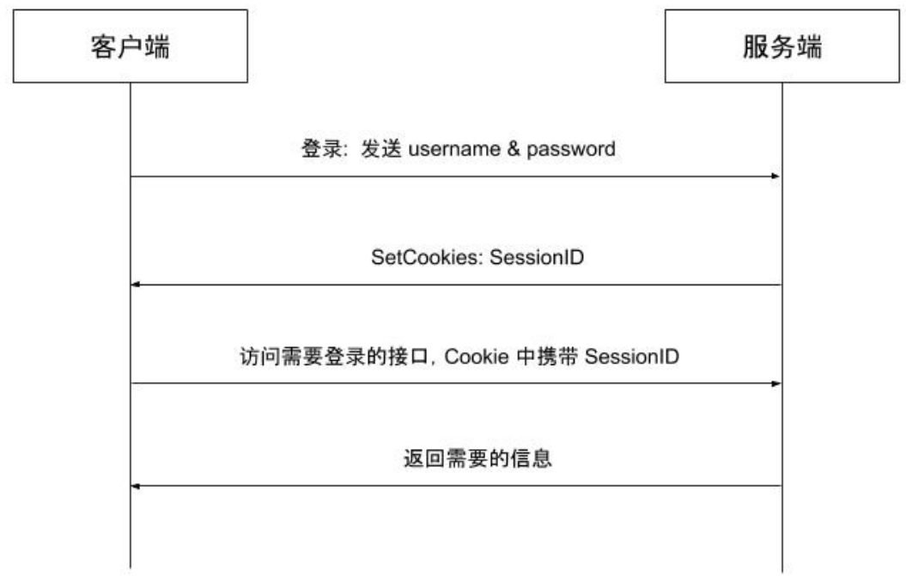
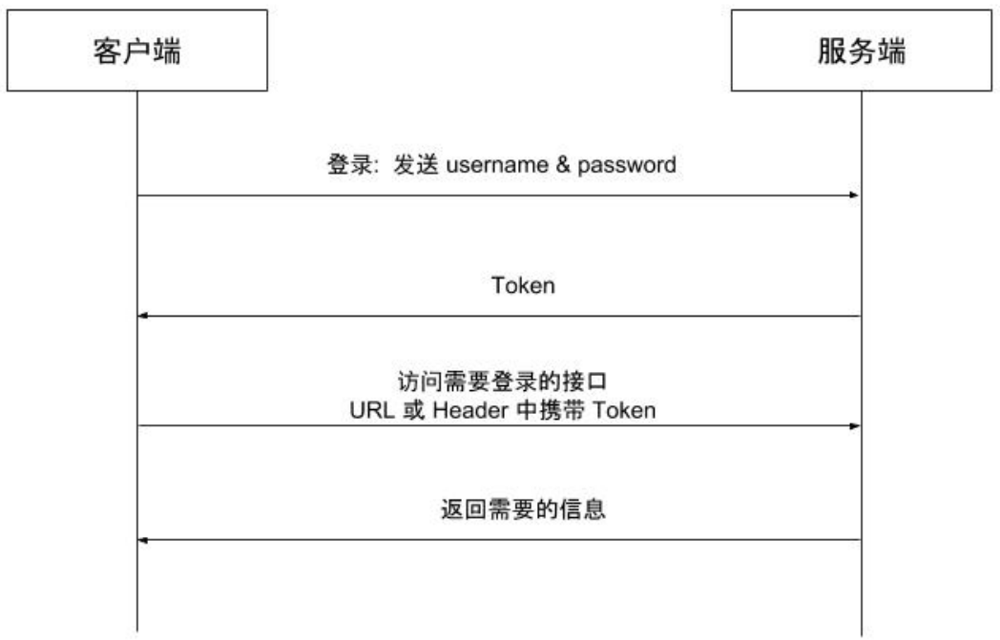
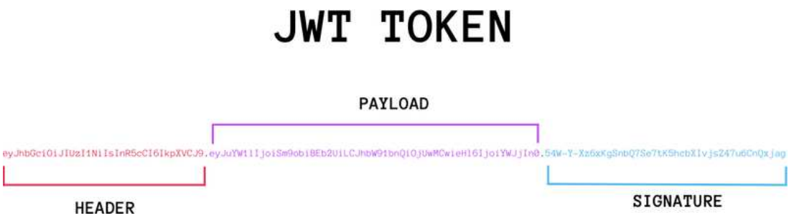
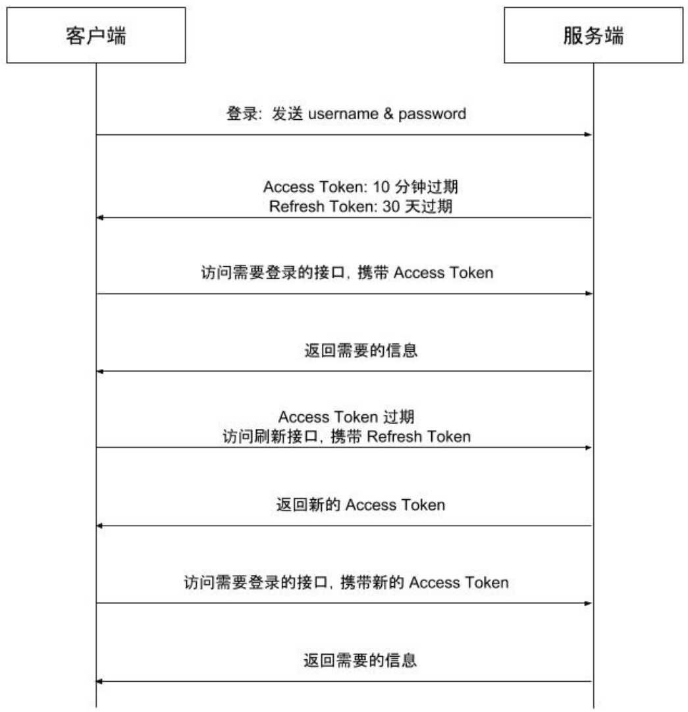

# 登录注册流程

**注册流程**

提交注册信息 --> 参数校验 --> ⼊库 --> 注册成功

**登录流程**

提交登录信息 --> 参数校验 --> 查询数据库 --> 登陆成功 --> 下发Token

**用户认证**

HTTP 是⼀个⽆状态的协议，⼀次请求结束后，下次在发送服务器就不知道这个请求是谁发来的了（同⼀个 IP 不代表同⼀个⽤户），在 Web 应⽤中，⽤户的认证和鉴权是⾮常重要的⼀环，实践中有多种可⽤⽅案，并且各有千秋。

# Cookie- Session 认证模式

在 Web 应⽤发展的初期，⼤部分采⽤基于Cookie-Session 的会话管理⽅式，逻辑如下。

- 客户端使⽤⽤户名、密码进⾏认证
- 服务端验证⽤户名、密码正确后⽣成并存储 Session，将 SessionID 通过 Cookie 返回给客户端
- 客户端访问需要认证的接⼝时在 Cookie 中携带 SessionID
- 服务端通过 SessionID 查找 Session 并进⾏鉴权，返回给客户端需要的数据



基于 Session 的⽅式存在多种问题。

- 服务端需要存储 Session，并且由于 Session 需要经常快速查找，通常存储在内存或内存数据库中，同时在线⽤户较多时需要占⽤⼤量的服务器资源。
- 当需要扩展时，创建 Session 的服务器可能不是验证 Session 的服务器，所以还需要将所有Session 单独存储并共享。
- 由于客户端使⽤ Cookie 存储 SessionID，在跨域场景下需要进⾏兼容性处理，同时这种⽅式也难以防范 CSRF 攻击。

# Token认证模式

鉴于基于 Session 的会话管理⽅式存在上述多个缺点，基于 Token 的⽆状态会话管理⽅式诞⽣了，所谓⽆状态，就是服务端可以不再存储信息，甚⾄是不再存储 Session，逻辑如下。

- 客户端使⽤⽤户名、密码进⾏认证
- 服务端验证⽤户名、密码正确后⽣成 Token 返回给客户端
- 客户端保存 Token，访问需要认证的接⼝时在 URL 参数或 HTTP Header 中加⼊ Token
- 服务端通过解码 Token 进⾏鉴权，返回给客户端需要的数据



基于 Token 的会话管理⽅式有效解决了基于 Session 的会话管理⽅式带来的问题。

- 服务端不需要存储和⽤户鉴权有关的信息，鉴权信息会被加密到 Token 中，服务端只需要读取Token 中包含的鉴权信息即可
- 避免了共享 Session 导致的不易扩展问题
- 不需要依赖 Cookie，有效避免 Cookie 带来的 CSRF 攻击问题
- 使⽤ CORS 可以快速解决跨域问题

# JWT 介绍 

JWT 是 JSON Web Token 的缩写，是为了在⽹络应⽤环境间传递声明⽽执⾏的⼀种基于JSON的开放标准（(RFC 7519)。JWT 本身没有定义任何技术实现，它只是定义了⼀种基于 Token 的会话管理的规则，涵盖 Token 需要包含的标准内容和 Token 的⽣成过程，特别适⽤于分布式站点的单点登录（SSO）场景。。

⼀个 JWT Token 就像这样：

```go
eyJhbGciOiJIUzI1NiIsInR5cCI6IkpXVCJ9.eyJ1c2VyX2lkIjoyODAxODcyNzQ4ODMyMzU4NSwiZ
XhwIjoxNTk0NTQwMjkxLCJpc3MiOiJibHVlYmVsbCJ9.lk_ZrAtYGCeZhK3iupHxP1kgjBJzQTVTtX
0iZYFx9wU
```

它是由 . 分隔的三部分组成，这三部分依次是：

- 头部（Header）
- 负载（Payload）
- 签名（Signature）

头部和负载以 JSON 形式存在，这就是 JWT 中的 JSON，三部分的内容都分别单独经过了 Base64 编码，以 . 拼接成⼀个 JWT Token。




**Header**

JWT 的 Header 中存储了所使⽤的加密算法和 Token 类型。

```go
{
    "alg": "HS256",
    "typ": "JWT"
}
```

**Payload**

Payload 表示负载，也是⼀个 JSON 对象，JWT 规定了7个官⽅字段供选⽤，

```go
iss (issuer)：签发⼈
exp (expiration time)：过期时间
sub (subject)：主题
aud (audience)：受众
nbf (Not Before)：⽣效时间
iat (Issued At)：签发时间
jti (JWT ID)：编号
```

除了官⽅字段，开发者也可以⾃⼰指定字段和内容，例如下⾯的内容。

```go
{
    "sub": "1234567890",
    "name": "John Doe",
    "admin": true
}
```

注意，JWT 默认是不加密的，任何⼈都可以读到，所以不要把秘密信息放在这个部分。这个 JSON 对象也要使⽤ Base64URL 算法转成字符串。

**Signature**

Signature 部分是对前两部分的签名，防⽌数据篡改。

⾸先，需要指定⼀个密钥（secret）。这个密钥只有服务器才知道，不能泄露给⽤户。然后，使⽤Header ⾥⾯指定的签名算法（默认是 HMAC SHA256），按照下⾯的公式产⽣签名。

```go
HMACSHA256(base64UrlEncode(header) + "." + base64UrlEncode(payload),secret)
```

## JWT优缺点

JWT 拥有基于 Token 的会话管理⽅式所拥有的⼀切优势，不依赖 Cookie，使得其可以防⽌ CSRF 攻击，也能在禁⽤ Cookie 的浏览器环境中正常运⾏。

⽽ JWT 的最⼤优势是服务端不再需要存储 Session，使得服务端认证鉴权业务可以⽅便扩展，避免存储Session 所需要引⼊的 Redis 等组件，降低了系统架构复杂度。但这也是 JWT 最⼤的劣势，由于有效期存储在 Token 中，JWT Token ⼀旦签发，就会在有效期内⼀直可⽤，⽆法在服务端废⽌，当⽤户进⾏登出操作，只能依赖客户端删除掉本地存储的 JWT Token，如果需要禁⽤⽤户，单纯使⽤ JWT 就⽆法做到了。

## 基于jwt实现认证实践

前⾯讲的 Token，都是 Access Token，也就是访问资源接⼝时所需要的 Token，还有另外⼀种Token，Refresh Token，通常情况下，Refresh Token 的有效期会⽐较⻓，⽽ Access Token 的有效期⽐较短，当 Access Token 由于过期⽽失效时，使⽤ Refresh Token 就可以获取到新的 Access Token，如果 Refresh Token 也失效了，⽤户就只能重新登录了。

在 JWT 的实践中，引⼊ Refresh Token，将会话管理流程改进如下。

- 客户端使⽤⽤户名密码进⾏认证
- 服务端⽣成有效时间较短的 Access Token（例如 10 分钟），和有效时间较⻓的 RefreshToken（例如 7 天）
- 客户端访问需要认证的接⼝时，携带 Access Token
- 如果 Access Token 没有过期，服务端鉴权后返回给客户端需要的数据
- 如果携带 Access Token 访问需要认证的接⼝时鉴权失败（例如返回 401 错误），则客户端使⽤Refresh Token 向刷新接⼝申请新的 Access Token
- 如果 Refresh Token 没有过期，服务端向客户端下发新的 Access Token
- 客户端使⽤新的 Access Token 访问需要认证的接⼝



后端需要对外提供⼀个刷新Token的接⼝，前端需要实现⼀个当Access Token过期时⾃动请求刷新Token接⼝获取新Access Token的拦截器。

## gin框架使⽤jwt

jwt-go 库的基本使⽤详⻅我的博客链接：https://www.liwenzhou.com/posts/Go/jwt_in_gin/

## 鉴权中间件开发

```go
const (
    ContextUserIDKey = "userID"
)
var (
    ErrorUserNotLogin = errors.New("当前⽤户未登录")
)

// JWTAuthMiddleware 基于JWT的认证中间件
func JWTAuthMiddleware() func(c *gin.Context) {
    return func(c *gin.Context) {
        // 客户端携带Token有三种⽅式 1.放在请求头 2.放在请求体 3.放在URI
        // 这⾥假设Token放在Header的中
        // 这⾥的具体实现⽅式要依据你的实际业务情况决定
        authHeader := c.Request.Header.Get("Auth")
        if authHeader == "" {
            ResponseErrorWithMsg(c, CodeInvalidToken, "请求头缺少Auth Token")
            c.Abort()
            return
        }
        mc, err := utils.ParseToken(authHeader)
        if err != nil {
            ResponseError(c, CodeInvalidToken)
            c.Abort()
            return
        }
        // 将当前请求的username信息保存到请求的上下⽂c上
        c.Set(ContextUserIDKey, mc.UserID)
        c.Next() // 后续的处理函数可以⽤过c.Get("userID")来获取当前请求的⽤户信息
    }
}
```

## 生成access token和refresh token

```go
// GenToken ⽣成access token 和 refresh token
func GenToken(userID int64) (aToken, rToken string, err error) {
    // 创建⼀个我们⾃⼰的声明
    c := MyClaims{
        userID, // ⾃定义字段
        jwt.StandardClaims{
            ExpiresAt: time.Now().Add(TokenExpireDuration).Unix(), // 过期时间
            Issuer: "bluebell", // 签发⼈
        },
    }
    // 加密并获得完整的编码后的字符串token
    aToken, err = jwt.NewWithClaims(jwt.SigningMethodHS256,
                                    c).SignedString(mySecret)
    // refresh token 不需要存任何⾃定义数据
    rToken, err = jwt.NewWithClaims(jwt.SigningMethodHS256, jwt.StandardClaims{
        ExpiresAt: time.Now().Add(time.Second * 30).Unix(), // 过期时间
        Issuer: "bluebell", // 签发⼈
    }).SignedString(mySecret)
    // 使⽤指定的secret签名并获得完整的编码后的字符串token
    return
}
```

## 解析access token

```go
// ParseToken 解析JWT
func ParseToken(tokenString string) (claims *MyClaims, err error) {
    // 解析token
    var token *jwt.Token
    claims = new(MyClaims)
    token, err = jwt.ParseWithClaims(tokenString, claims, keyFunc)
    if err != nil {
        return
    }
    if !token.Valid { // 校验token
        err = errors.New("invalid token")
    }
    return
}
```

## refresh token

```go
// RefreshToken 刷新AccessToken
func RefreshToken(aToken, rToken string) (newAToken, newRToken string, err
                                          error) {
    // refresh token⽆效直接返回
    if _, err = jwt.Parse(rToken, keyFunc); err != nil {
        return
    }
    // 从旧access token中解析出claims数据
    var claims MyClaims
    _, err = jwt.ParseWithClaims(aToken, &claims, keyFunc)
    v, _ := err.(*jwt.ValidationError)
    // 当access token是过期错误 并且 refresh token没有过期时就创建⼀个新的access token
    if v.Errors == jwt.ValidationErrorExpired {
        return GenToken(claims.UserID)
    }
    return
}
```

**参考链接**

http://www.ruanyifeng.com/blog/2018/07/json_web_token-tutorial.html

https://www.jianshu.com/p/25ab2f456904