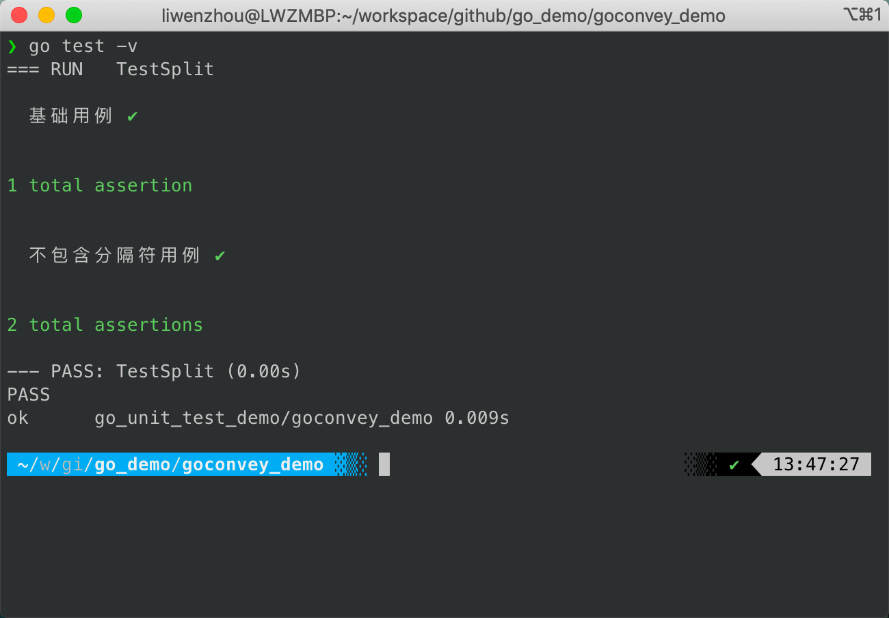
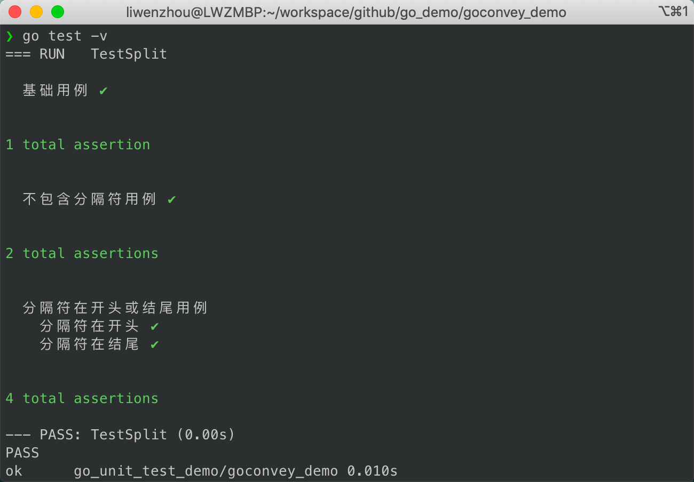

# GoConvey介绍

[GoConvey](https://github.com/smartystreets/goconvey)是一个非常非常好用的Go测试框架，它直接与`go test`集成，提供了很多丰富的断言函数，能够在终端输出可读的彩色测试结果，并且还支持全自动的Web UI。

## 安装

如果需要使用`goconvey`的Web UI程序，请执行下面的命令安装可执行程序。

```bash
go install github.com/smartystreets/goconvey@latest
```

如果只是想在项目中引入依赖，只需要在项目目录中执行以下命令。

```bash
go get github.com/smartystreets/goconvey
```

## 使用示例

我们使用`goconvey`来为最开始的基础示例中的`Split`函数编写单元测试。`Split`函数如下：

```go
// split.go
func Split(s, sep string) (result []string) {
	result = make([]string, 0, strings.Count(s, sep)+1)
	i := strings.Index(s, sep)
	for i > -1 {
		result = append(result, s[:i])
		s = s[i+len(sep):]
		i = strings.Index(s, sep)
	}
	result = append(result, s)
	return
}
```

单元测试文件内容如下：

```go
// split_test.go
import (
	"testing"

	c "github.com/smartystreets/goconvey/convey"  // 别名导入
)

func TestSplit(t *testing.T) {
	c.Convey("基础用例", t, func() {
		var (
			s      = "a:b:c"
			sep    = ":"
			expect = []string{"a", "b", "c"}
		)
		got := Split(s, sep)
		c.So(got, c.ShouldResemble, expect) // 断言
	})

	c.Convey("不包含分隔符用例", t, func() {
		var (
			s      = "a:b:c"
			sep    = "|"
			expect = []string{"a:b:c"}
		)
		got := Split(s, sep)
		c.So(got, c.ShouldResemble, expect) // 断言
	})
}
```

命令行执行单元测试，会在终端输出可读性非常好的彩色结果。



goconvey还支持在单元测试中根据需要嵌套调用，比如：

```go
func TestSplit(t *testing.T) {
	// ...

	// 只需要在顶层的Convey调用时传入t
	c.Convey("分隔符在开头或结尾用例", t, func() {
		tt := []struct {
			name   string
			s      string
			sep    string
			expect []string
		}{
			{"分隔符在开头", "*1*2*3", "*", []string{"", "1", "2", "3"}},
			{"分隔符在结尾", "1+2+3+", "+", []string{"1", "2", "3", ""}},
		}
		for _, tc := range tt {
			c.Convey(tc.name, func() { // 嵌套调用Convey
				got := Split(tc.s, tc.sep)
				c.So(got, c.ShouldResemble, tc.expect)
			})
		}
	})
}
```

这样输出最终的测试结果时也会分层级显示。



## 断言方法

GoConvey为我们提供了很多种类断言方法在`So()`函数中使用。

### 一般相等类

```go
So(thing1, ShouldEqual, thing2)
So(thing1, ShouldNotEqual, thing2)
So(thing1, ShouldResemble, thing2)		// 用于数组、切片、map和结构体相等
So(thing1, ShouldNotResemble, thing2)
So(thing1, ShouldPointTo, thing2)
So(thing1, ShouldNotPointTo, thing2)
So(thing1, ShouldBeNil)
So(thing1, ShouldNotBeNil)
So(thing1, ShouldBeTrue)
So(thing1, ShouldBeFalse)
So(thing1, ShouldBeZeroValue)
```

### 数字数量比较类

```go
So(1, ShouldBeGreaterThan, 0)
So(1, ShouldBeGreaterThanOrEqualTo, 0)
So(1, ShouldBeLessThan, 2)
So(1, ShouldBeLessThanOrEqualTo, 2)
So(1.1, ShouldBeBetween, .8, 1.2)
So(1.1, ShouldNotBeBetween, 2, 3)
So(1.1, ShouldBeBetweenOrEqual, .9, 1.1)
So(1.1, ShouldNotBeBetweenOrEqual, 1000, 2000)
So(1.0, ShouldAlmostEqual, 0.99999999, .0001)   // tolerance is optional; default 0.0000000001
So(1.0, ShouldNotAlmostEqual, 0.9, .0001)
```

### 包含类

```go
So([]int{2, 4, 6}, ShouldContain, 4)
So([]int{2, 4, 6}, ShouldNotContain, 5)
So(4, ShouldBeIn, ...[]int{2, 4, 6})
So(4, ShouldNotBeIn, ...[]int{1, 3, 5})
So([]int{}, ShouldBeEmpty)
So([]int{1}, ShouldNotBeEmpty)
So(map[string]string{"a": "b"}, ShouldContainKey, "a")
So(map[string]string{"a": "b"}, ShouldNotContainKey, "b")
So(map[string]string{"a": "b"}, ShouldNotBeEmpty)
So(map[string]string{}, ShouldBeEmpty)
So(map[string]string{"a": "b"}, ShouldHaveLength, 1) // supports map, slice, chan, and string
```

### 字符串类

```go
So("asdf", ShouldStartWith, "as")
So("asdf", ShouldNotStartWith, "df")
So("asdf", ShouldEndWith, "df")
So("asdf", ShouldNotEndWith, "df")
So("asdf", ShouldContainSubstring, "稍等一下")		// optional 'expected occurences' arguments?
So("asdf", ShouldNotContainSubstring, "er")
So("adsf", ShouldBeBlank)
So("asdf", ShouldNotBeBlank)
```

### panic类

```go
So(func(), ShouldPanic)
So(func(), ShouldNotPanic)
So(func(), ShouldPanicWith, "")		// or errors.New("something")
So(func(), ShouldNotPanicWith, "")	// or errors.New("something")
```

### 类型检查类

```go
So(1, ShouldHaveSameTypeAs, 0)
So(1, ShouldNotHaveSameTypeAs, "asdf")
```

### 时间和时间间隔类

```go
So(time.Now(), ShouldHappenBefore, time.Now())
So(time.Now(), ShouldHappenOnOrBefore, time.Now())
So(time.Now(), ShouldHappenAfter, time.Now())
So(time.Now(), ShouldHappenOnOrAfter, time.Now())
So(time.Now(), ShouldHappenBetween, time.Now(), time.Now())
So(time.Now(), ShouldHappenOnOrBetween, time.Now(), time.Now())
So(time.Now(), ShouldNotHappenOnOrBetween, time.Now(), time.Now())
So(time.Now(), ShouldHappenWithin, duration, time.Now())
So(time.Now(), ShouldNotHappenWithin, duration, time.Now())
```

### 自定义断言方法

如果上面列出来的断言方法都不能满足你的需要，那么你还可以按照下面的格式自定义一个断言方法。

注意：`<>`中的内容是你需要按照实际需求替换的内容。

```go
func should<do-something>(actual interface{}, expected ...interface{}) string {
    if <some-important-condition-is-met(actual, expected)> {
        return ""   // 返回空字符串表示断言通过
    }
    return "<一些描述性消息详细说明断言失败的原因...>"
}
```

### WebUI

goconvey提供全自动的WebUI，只需要在项目目录下执行以下命令。

```bash
goconvey
```

默认就会在本机的8080端口提供WebUI界面，十分清晰地展现当前项目的单元测试数据。


## 总结

本文通过一个完整的单元测试示例，介绍了如何使用`goconvey`工具编写测试用例、管理测试用例、断言测试结果，同时也介绍了`goconvey`丰富多样的测试结果输出形式。

在下一篇将是本系列的最后一篇，我们将重点介绍如何编写可测试的代码。

