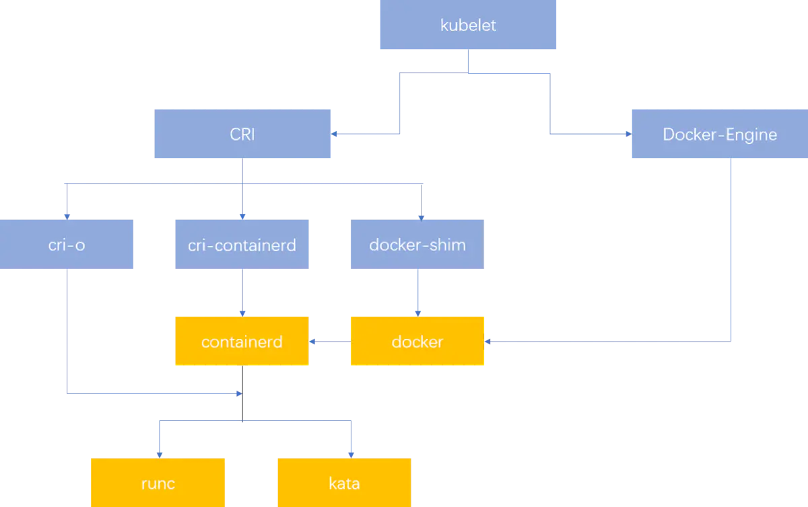
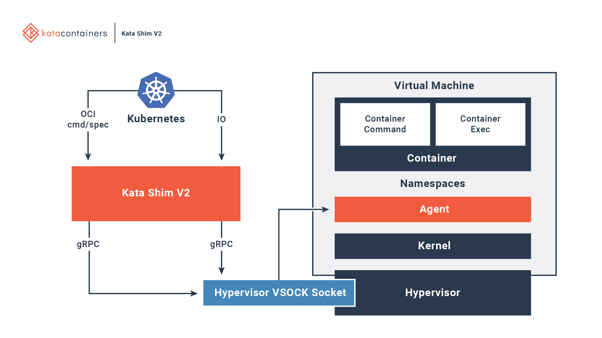
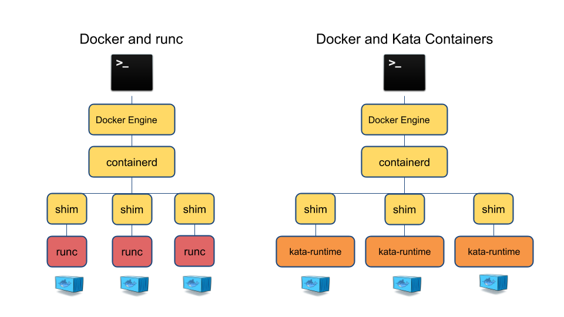
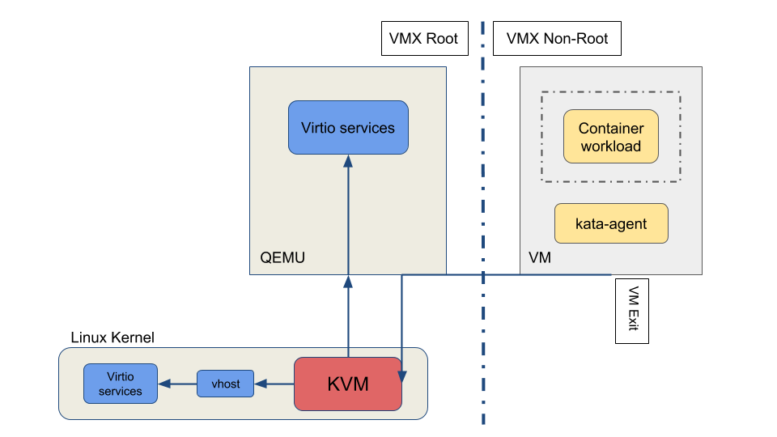

# Runtime

# Runc和Containerd概述

> 本文主要分析OCI，CRI，runc，containerd，cri-containerd，dockershim等组件说明及调用关系。

# 1. 概述

各个组件调用关系图如下：

[](https://camo.githubusercontent.com/fd1bb9b9be997beafc453daae14f7f0834f00cee62862cf3a139fe064ad9276b/68747470733a2f2f7265732e636c6f7564696e6172792e636f6d2f647178746e3069636b2f696d6167652f75706c6f61642f76313633313834353136332f61727469636c652f6b756265726e657465732f636f6e7461696e6572642f72756e74696d652e77656270)

> 图片来源：https://www.jianshu.com/p/62e71584d1cb

# 2. OCI（Open Container Initiative）

OCI（Open Container Initiative）即开放的容器运行时`规范`，目的在于定义一个容器运行时及镜像的相关标准和规范，其中包括

- runtime-spec：容器的生命周期管理，具体参考[runtime-spec](https://github.com/opencontainers/runtime-spec/blob/master/runtime.md)。
- image-spec：镜像的生命周期管理，具体参考[image-spec](https://github.com/opencontainers/image-spec/blob/main/spec.md)。

实现OCI标准的容器运行时有`runc`，`kata`等。

# 3.  RunC

`runc(run container)`是一个基于OCI标准实现的一个轻量级容器运行工具，用来创建和运行容器。而Containerd是用来维持通过runc创建的容器的运行状态。即runc用来创建和运行容器，containerd作为常驻进程用来管理容器。

runc包含libcontainer，包括对namespace和cgroup的调用操作。

命令参数：

```
To start a new instance of a container:

    # runc run [ -b bundle ] <container-id>
    
USAGE:
   runc [global options] command [command options] [arguments...]

COMMANDS:
   checkpoint  checkpoint a running container
   create      create a container
   delete      delete any resources held by the container often used with detached container
   events      display container events such as OOM notifications, cpu, memory, and IO usage statistics
   exec        execute new process inside the container
   init        initialize the namespaces and launch the process (do not call it outside of runc)
   kill        kill sends the specified signal (default: SIGTERM) to the container's init process
   list        lists containers started by runc with the given root
   pause       pause suspends all processes inside the container
   ps          ps displays the processes running inside a container
   restore     restore a container from a previous checkpoint
   resume      resumes all processes that have been previously paused
   run         create and run a container
   spec        create a new specification file
   start       executes the user defined process in a created container
   state       output the state of a container
   update      update container resource constraints
   help, h     Shows a list of commands or help for one command    
```


# 4. Containerd

`containerd（container daemon）`是一个daemon进程用来管理和运行容器，可以用来拉取/推送镜像和管理容器的存储和网络。其中可以调用runc来创建和运行容器。

## 4.1. containerd的架构图

[](https://camo.githubusercontent.com/5a6e4b902a211b147fe67e5b6b6f6e028fc91720067b1209cdbc4a5fe1f137c3/68747470733a2f2f7265732e636c6f7564696e6172792e636f6d2f647178746e3069636b2f696d6167652f75706c6f61642f76313633303633343534322f61727469636c652f6b756265726e657465732f636f6e7461696e6572642f636f6e7461696e6572642d617263682e706e67)

## 4.2. docker与containerd、runc的关系图

[](https://camo.githubusercontent.com/d1a3dd5f01dfb0785deed4fc403e78908ab0491a689705969a0dfddc2ffeb2df/68747470733a2f2f7265732e636c6f7564696e6172792e636f6d2f647178746e3069636b2f696d6167652f75706c6f61642f76313633313834373632352f61727469636c652f6b756265726e657465732f636f6e7461696e6572642f636f6e7461696e65722d65636f73797374656d2d646f636b65722e64726177696f2e706e67)

更具体的调用逻辑：

[](https://camo.githubusercontent.com/c4e0ff9d8110327bfac70abfa78b568e7526690526bfec8c001b8fb046d518c8/68747470733a2f2f7265732e636c6f7564696e6172792e636f6d2f647178746e3069636b2f696d6167652f75706c6f61642f76313633313835343230312f61727469636c652f6b756265726e657465732f636f6e7461696e6572642f636f6e7461696e6572642d7368696d2e706e67)

# 5. CRI（Container Runtime Interface)

**CRI即容器运行时接口，主要用来定义k8s与容器运行时的API调用**，kubelet通过CRI来调用容器运行时，只要实现了CRI接口的容器运行时就可以对接到k8s的kubelet组件。

[](https://camo.githubusercontent.com/edc9b03119d9c5d7883a34fbcd4ef7f8909db67933b844c8ce040bb30b665a78/68747470733a2f2f7265732e636c6f7564696e6172792e636f6d2f647178746e3069636b2f696d6167652f75706c6f61642f76313633313834393736342f61727469636c652f6b756265726e657465732f636f6e7461696e6572642f6b7562656c65742d6372692e706e67)

## 5.1. docker与k8s调用containerd的关系图

[](https://camo.githubusercontent.com/a6aec3127edcf22aa94e9a86358d21df00a280e97015fd7a83191b240a4495f2/68747470733a2f2f7265732e636c6f7564696e6172792e636f6d2f647178746e3069636b2f696d6167652f75706c6f61642f76313633313834373632352f61727469636c652f6b756265726e657465732f636f6e7461696e6572642f636f6e7461696e65722d65636f73797374656d2e64726177696f2e706e67)

## 5.2. cri-api

### 5.2.1. runtime service

```
// Runtime service defines the public APIs for remote container runtimes
service RuntimeService {
    // Version returns the runtime name, runtime version, and runtime API version.
    rpc Version(VersionRequest) returns (VersionResponse) {}

    // RunPodSandbox creates and starts a pod-level sandbox. Runtimes must ensure
    // the sandbox is in the ready state on success.
    rpc RunPodSandbox(RunPodSandboxRequest) returns (RunPodSandboxResponse) {}
    // StopPodSandbox stops any running process that is part of the sandbox and
    // reclaims network resources (e.g., IP addresses) allocated to the sandbox.
    // If there are any running containers in the sandbox, they must be forcibly
    // terminated.
    // This call is idempotent, and must not return an error if all relevant
    // resources have already been reclaimed. kubelet will call StopPodSandbox
    // at least once before calling RemovePodSandbox. It will also attempt to
    // reclaim resources eagerly, as soon as a sandbox is not needed. Hence,
    // multiple StopPodSandbox calls are expected.
    rpc StopPodSandbox(StopPodSandboxRequest) returns (StopPodSandboxResponse) {}
    // RemovePodSandbox removes the sandbox. If there are any running containers
    // in the sandbox, they must be forcibly terminated and removed.
    // This call is idempotent, and must not return an error if the sandbox has
    // already been removed.
    rpc RemovePodSandbox(RemovePodSandboxRequest) returns (RemovePodSandboxResponse) {}
    // PodSandboxStatus returns the status of the PodSandbox. If the PodSandbox is not
    // present, returns an error.
    rpc PodSandboxStatus(PodSandboxStatusRequest) returns (PodSandboxStatusResponse) {}
    // ListPodSandbox returns a list of PodSandboxes.
    rpc ListPodSandbox(ListPodSandboxRequest) returns (ListPodSandboxResponse) {}

    // CreateContainer creates a new container in specified PodSandbox
    rpc CreateContainer(CreateContainerRequest) returns (CreateContainerResponse) {}
    // StartContainer starts the container.
    rpc StartContainer(StartContainerRequest) returns (StartContainerResponse) {}
    // StopContainer stops a running container with a grace period (i.e., timeout).
    // This call is idempotent, and must not return an error if the container has
    // already been stopped.
    // The runtime must forcibly kill the container after the grace period is
    // reached.
    rpc StopContainer(StopContainerRequest) returns (StopContainerResponse) {}
    // RemoveContainer removes the container. If the container is running, the
    // container must be forcibly removed.
    // This call is idempotent, and must not return an error if the container has
    // already been removed.
    rpc RemoveContainer(RemoveContainerRequest) returns (RemoveContainerResponse) {}
    // ListContainers lists all containers by filters.
    rpc ListContainers(ListContainersRequest) returns (ListContainersResponse) {}
    // ContainerStatus returns status of the container. If the container is not
    // present, returns an error.
    rpc ContainerStatus(ContainerStatusRequest) returns (ContainerStatusResponse) {}
    // UpdateContainerResources updates ContainerConfig of the container.
    rpc UpdateContainerResources(UpdateContainerResourcesRequest) returns (UpdateContainerResourcesResponse) {}
    // ReopenContainerLog asks runtime to reopen the stdout/stderr log file
    // for the container. This is often called after the log file has been
    // rotated. If the container is not running, container runtime can choose
    // to either create a new log file and return nil, or return an error.
    // Once it returns error, new container log file MUST NOT be created.
    rpc ReopenContainerLog(ReopenContainerLogRequest) returns (ReopenContainerLogResponse) {}

    // ExecSync runs a command in a container synchronously.
    rpc ExecSync(ExecSyncRequest) returns (ExecSyncResponse) {}
    // Exec prepares a streaming endpoint to execute a command in the container.
    rpc Exec(ExecRequest) returns (ExecResponse) {}
    // Attach prepares a streaming endpoint to attach to a running container.
    rpc Attach(AttachRequest) returns (AttachResponse) {}
    // PortForward prepares a streaming endpoint to forward ports from a PodSandbox.
    rpc PortForward(PortForwardRequest) returns (PortForwardResponse) {}

    // ContainerStats returns stats of the container. If the container does not
    // exist, the call returns an error.
    rpc ContainerStats(ContainerStatsRequest) returns (ContainerStatsResponse) {}
    // ListContainerStats returns stats of all running containers.
    rpc ListContainerStats(ListContainerStatsRequest) returns (ListContainerStatsResponse) {}

    // UpdateRuntimeConfig updates the runtime configuration based on the given request.
    rpc UpdateRuntimeConfig(UpdateRuntimeConfigRequest) returns (UpdateRuntimeConfigResponse) {}

    // Status returns the status of the runtime.
    rpc Status(StatusRequest) returns (StatusResponse) {}
}
```


### 5.2.2. image service

```
// ImageService defines the public APIs for managing images.
service ImageService {
    // ListImages lists existing images.
    rpc ListImages(ListImagesRequest) returns (ListImagesResponse) {}
    // ImageStatus returns the status of the image. If the image is not
    // present, returns a response with ImageStatusResponse.Image set to
    // nil.
    rpc ImageStatus(ImageStatusRequest) returns (ImageStatusResponse) {}
    // PullImage pulls an image with authentication config.
    rpc PullImage(PullImageRequest) returns (PullImageResponse) {}
    // RemoveImage removes the image.
    // This call is idempotent, and must not return an error if the image has
    // already been removed.
    rpc RemoveImage(RemoveImageRequest) returns (RemoveImageResponse) {}
    // ImageFSInfo returns information of the filesystem that is used to store images.
    rpc ImageFsInfo(ImageFsInfoRequest) returns (ImageFsInfoResponse) {}
}
```


## 5.3. cri-containerd

[](https://camo.githubusercontent.com/14a1a5c66f58da578775caea4bf67ef7aa93a461b8c84901a0fae7ae891c4a99/68747470733a2f2f7265732e636c6f7564696e6172792e636f6d2f647178746e3069636b2f696d6167652f75706c6f61642f76313633313834393230332f61727469636c652f6b756265726e657465732f636f6e7461696e6572642f6372692d706c7567696e2d6172636869746563747572652e706e67)

### 5.3.1. CRI Plugin调用流程

1. kubelet调用CRI插件，通过CRI Runtime Service接口创建pod
2. cri通过CNI接口创建和配置pod的network namespace
3. cri调用containerd创建sandbox container（[pause container](https://www.ianlewis.org/en/almighty-pause-container) ）并将容器放入pod的cgroup和namespace中
4. kubelet调用CRI插件，通过image service接口拉取镜像，接着通过containerd来拉取镜像
5. kubelet调用CRI插件，通过runtime service接口运行拉取下来的镜像服务，最后通过containerd来运行业务容器，并将容器放入pod的cgroup和namespace中。

> 具体参考：https://github.com/containerd/cri/blob/release/1.4/docs/architecture.md

### 5.3.2. k8s对runtime调用的演进

由原来通过dockershim调用docker再调用containerd，直接变成通过cri-containerd调用containerd，从而减少了一层docker调用逻辑。

[](https://camo.githubusercontent.com/4f3e97cafa3e616da10096fa1965b96aa09673dbd29b8e86b61306ffa54d02cc/68747470733a2f2f7265732e636c6f7564696e6172792e636f6d2f647178746e3069636b2f696d6167652f75706c6f61642f76313633313835343030372f61727469636c652f6b756265726e657465732f636f6e7461696e6572642f6372692d706572666f726d616e63652e706e67)

> 具体参考：https://github.com/containerd/cri/blob/release/1.4/docs/proposal.md

## 5.4. Dockershim

在旧版本的k8s中，由于docker没有实现CRI接口，因此增加一个Dockershim来实现k8s对docker的调用。（shim：垫片，一般用来表示对第三方组件API调用的适配插件，例如k8s使用Dockershim来实现对docker接口的适配调用）

## [5.5. CRI-O](https://github.com/huweihuang/kubernetes-notes/blob/master/runtime/runtime.md#55-cri-o)

cri-o与containerd类似，用来实现容器的管理，可替换containerd的使用。

# Containerd
# 安装Containerd

# 1. Ubuntu安装containerd

以下以Ubuntu为例

> 说明：安装containerd与安装docker流程基本一致，差别在于不需要安装docker-ce
>
> - `containerd`: apt-get install -y containerd.io
> - `docker`: apt-get install docker-ce docker-ce-cli containerd.io

## 1. 卸载旧版本

```
 sudo apt-get remove docker docker-engine docker.io containerd runc
```


如果需要删除镜像及容器数据则执行以下命令

```
 sudo rm -rf /var/lib/docker
 sudo rm -rf /var/lib/containerd
```


## 2. 准备包环境

1、更新apt，允许使用https。

```
 sudo apt-get update
 sudo apt-get install \
    ca-certificates \
    curl \
    gnupg \
    lsb-release
```


2、添加docker官方GPG key。

```
sudo mkdir -p /etc/apt/keyrings
curl -fsSL https://download.docker.com/linux/ubuntu/gpg | sudo gpg --dearmor -o /etc/apt/keyrings/docker.gpg
```


3、设置软件仓库源

```
echo \
  "deb [arch=$(dpkg --print-architecture) signed-by=/etc/apt/keyrings/docker.gpg] https://download.docker.com/linux/ubuntu \
  $(lsb_release -cs) stable" | sudo tee /etc/apt/sources.list.d/docker.list > /dev/null
```


## 3. 安装containerd

```
# 安装containerd
sudo apt-get update
sudo apt-get install -y containerd.io

# 如果是安装docker则执行：
sudo apt-get install docker-ce docker-ce-cli containerd.io

# 查看运行状态
systemctl enable containerd
systemctl status containerd
```


安装指定版本

```
# 查看版本
apt-cache madison containerd

# sudo apt-get install containerd=<VERSION>
```


## 4. 修改配置

在 Linux 上，containerd 的默认 CRI 套接字是 `/run/containerd/containerd.sock`。

1、生成默认配置

```
containerd config default > /etc/containerd/config.toml
```


2、修改CgroupDriver为systemd

k8s官方推荐使用systemd类型的CgroupDriver。

```
[plugins."io.containerd.grpc.v1.cri".containerd.runtimes.runc]
  ...
  [plugins."io.containerd.grpc.v1.cri".containerd.runtimes.runc.options]
    SystemdCgroup = true
```


3、重启containerd

```
systemctl restart containerd
```


# 2. 离线二进制安装containerd

把`containerd`、`runc`、`cni-plugins`、`nerdctl`二进制下载到本地，再上传到对应服务器，解压文件到对应目录，修改containerd配置文件，启动containerd。

```
#!/bin/bash
set -e

ContainerdVersion=$1
ContainerdVersion=${ContainerdVersion:-1.6.6}

RuncVersion=$2
RuncVersion=${RuncVersion:-1.1.3}

CniVersion=$3
CniVersion=${CniVersion:-1.1.1}

NerdctlVersion=$4
NerdctlVersion=${NerdctlVersion:-0.21.0}

CrictlVersion=$5
CrictlVersion=${CrictlVersion:-1.24.2}

echo "--------------install containerd--------------"
wget https://github.com/containerd/containerd/releases/download/v${ContainerdVersion}/containerd-${ContainerdVersion}-linux-amd64.tar.gz
tar Cxzvf /usr/local containerd-${ContainerdVersion}-linux-amd64.tar.gz

echo "--------------install containerd service--------------"
wget https://raw.githubusercontent.com/containerd/containerd/681aaf68b7dcbe08a51c3372cbb8f813fb4466e0/containerd.service
mv containerd.service /lib/systemd/system/

mkdir -p /etc/containerd/
containerd config default > /etc/containerd/config.toml
sed -i 's/SystemdCgroup = false/SystemdCgroup = true/' /etc/containerd/config.toml

echo "--------------install runc--------------"
wget https://github.com/opencontainers/runc/releases/download/v${RuncVersion}/runc.amd64
chmod +x runc.amd64
mv runc.amd64 /usr/local/bin/runc

echo "--------------install cni plugins--------------"
wget https://github.com/containernetworking/plugins/releases/download/v${CniVersion}/cni-plugins-linux-amd64-v${CniVersion}.tgz
rm -fr /opt/cni/bin
mkdir -p /opt/cni/bin
tar Cxzvf /opt/cni/bin cni-plugins-linux-amd64-v${CniVersion}.tgz

echo "--------------install nerdctl--------------"
wget https://github.com/containerd/nerdctl/releases/download/v${NerdctlVersion}/nerdctl-${NerdctlVersion}-linux-amd64.tar.gz
tar Cxzvf /usr/local/bin nerdctl-${NerdctlVersion}-linux-amd64.tar.gz

echo "--------------install crictl--------------"
wget https://github.com/kubernetes-sigs/cri-tools/releases/download/v${CrictlVersion}/crictl-v${CrictlVersion}-linux-amd64.tar.gz
tar Cxzvf /usr/local/bin crictl-v${CrictlVersion}-linux-amd64.tar.gz

cat > /etc/crictl.yaml << \EOF
runtime-endpoint: unix:///run/containerd/containerd.sock
image-endpoint: unix:///run/containerd/containerd.sock
timeout: 2
debug: false
pull-image-on-create: false
EOF

# 启动containerd服务
systemctl daemon-reload
systemctl enable contaienrd
systemctl restart contaienrd
```


# 3. Containerd配置代理

由于节点到k8s官方仓库网络不通，或者设备处于内网，可以通过配置http_proxy代理的方式来拉取镜像。

```
vi /lib/systemd/system/containerd.service

# 添加代理环境变量
 [Unit]
Description=containerd container runtime
Documentation=https://containerd.io
After=network.target local-fs.target

[Service]
Environment="HTTP_PROXY=http://squid:3128/"   # 添加环境变量代理
Environment="HTTPS_PROXY=http://squid:3128/"  # 添加环境变量代理
ExecStartPre=-/sbin/modprobe overlay
ExecStart=/usr/local/bin/containerd

Type=notify
Delegate=yes
KillMode=process
Restart=always
RestartSec=5
# Having non-zero Limit*s causes performance problems due to accounting overhead
# in the kernel. We recommend using cgroups to do container-local accounting.
LimitNPROC=infinity
LimitCORE=infinity
LimitNOFILE=infinity
# Comment TasksMax if your systemd version does not supports it.
# Only systemd 226 and above support this version.
TasksMax=infinity
OOMScoreAdjust=-999

[Install]
WantedBy=multi-user.target


# 重启服务
systemctl daemon-reload
systemctl restart containerd
```

# Kata Container
# kata容器简介

# Kata-container简介

kata-container通过轻量型虚拟机技术构建一个安全的容器运行时，表现像容器一样，但通硬件虚拟化技术提供强隔离，作为第二层的安全防护。

**特点：**

- 安全：独立的内核，提供网络、I/O、内存的隔离。
- 兼容性：支持OCI容器标准，k8s的CRI接口。
- 性能：兼容虚拟机的安全和容器的轻量特点。
- 简单：使用标准的接口。

# 1. kata-container架构

[](https://camo.githubusercontent.com/2f75e3465fd4cc5fbac8270bd70e066506a5e249da87908cfb5d738a3d0dc38b/68747470733a2f2f7265732e636c6f7564696e6172792e636f6d2f647178746e3069636b2f696d6167652f75706c6f61642f76313536333336323033302f61727469636c652f6b6174612d636f6e7461696e65722f617263685f6469616772616d2e6a7067)

**kata-container与传统container的比较**

[](https://camo.githubusercontent.com/0538ef2ebf7aa2c455548a357368dd9d75ac52dacdffe51a0eaeba11d6520ac2/68747470733a2f2f7265732e636c6f7564696e6172792e636f6d2f647178746e3069636b2f696d6167652f75706c6f61642f76313536333336323033322f61727469636c652f6b6174612d636f6e7461696e65722f747261646974696f6e616c76736b6174612e6a7067)

# 2. kata-runtime

[Kata Containers runtime (`kata-runtime`)](https://github.com/kata-containers/runtime)通过`QEMU*/KVM`技术创建了一种轻量型的虚拟机，兼容 [OCI](https://github.com/opencontainers) [runtime specification](https://github.com/opencontainers/runtime-spec) 标准，支持[Kubernetes* Container Runtime Interface (CRI)](https://github.com/kubernetes/community/blob/master/contributors/devel/container-runtime-interface.md)接口，可替换[CRI shim runtime (runc)](https://github.com/opencontainers/runc) 通过k8s来创建pod或容器。

[](https://camo.githubusercontent.com/657e6c2b81070d3ba8bbd4d2d8530434d8140235cf01a0735edf73df2e0b60de/68747470733a2f2f7265732e636c6f7564696e6172792e636f6d2f647178746e3069636b2f696d6167652f75706c6f61642f76313536333336323032392f61727469636c652f6b6174612d636f6e7461696e65722f646f636b65722d6b6174612e706e67)

# 3. shim

`shim`类似Docker的 `containerd-shim` 或CRI-O的 `conmon`，主要用来监控和回收容器的进程，`kata-shim`需要处理所有的容器的IO流(`stdout`, `stdin` and `stderr`)和转发相关信号。

[containerd-shim-kata-v2](https://github.com/kata-containers/runtime/tree/master/containerd-shim-v2)实现了[Containerd Runtime V2 (Shim API)](https://github.com/containerd/containerd/tree/master/runtime/v2)，k8s可以通过`containerd-shim-kata-v2`（替代`2N+1`个`shims`[由一个`containerd-shim`和`kata-shim`组成]）来创建pod。

[](https://camo.githubusercontent.com/926506d8d6ee59ae0515db4661c05be12e369313d1a544362a117975d46037b0/68747470733a2f2f7265732e636c6f7564696e6172792e636f6d2f647178746e3069636b2f696d6167652f75706c6f61642f76313536333336323033302f61727469636c652f6b6174612d636f6e7461696e65722f7368696d76322e737667)

# 4. [kata-agent

在虚拟机内`kata-agent`作为一个daemon进程运行，并拉起容器的进程。kata-agent使用VIRTIO或VSOCK接口（QEMU在主机上暴露的socket文件）在guest虚拟机中运行gRPC服务器。kata-runtime通过grpc协议与kata-agent通信，向kata-agent发送管理容器的命令。该协议还用于容器和管理引擎（例如Docker Engine）之间传送I / O流（stdout，stderr，stdin）。

容器内所有的执行命令和相关的IO流都需要通过QEMU在宿主机暴露的`virtio-serial`或`vsock`接口，当使用VIRTIO的情况下，每个虚拟机会创建一个[Kata Containers proxy (`kata-proxy`)](https://github.com/kata-containers/proxy) 来处理命令和IO流。

`kata-agent`使用[`libcontainer`](https://github.com/opencontainers/runc/tree/master/libcontainer) 来管理容器的生命周期，复用了[`runc`](https://github.com/opencontainers/runc)的部分代码。

# 5. kata-proxy

`kata-proxy`提供了 `kata-shim` 和 `kata-runtime` 与VM中的`kata-agent`通信的方式，其中通信方式是使用`virtio-serial`或`vsock`，默认是使用`virtio-serial`。

# 6. Hypervisor

kata-container通过[QEMU](http://www.qemu-project.org/)/[KVM](http://www.linux-kvm.org/page/Main_Page)来创建虚拟机给容器运行，可以支持多种hypervisors。

[](https://camo.githubusercontent.com/1da2ad34c5706d60a5fe1900d5b8ac49a4874c5f6bf5f245d8ff1a17f7ea8864/68747470733a2f2f7265732e636c6f7564696e6172792e636f6d2f647178746e3069636b2f696d6167652f75706c6f61642f76313536333336323032382f61727469636c652f6b6174612d636f6e7461696e65722f71656d752e706e67)

# 7. QEMU/KVM

> 待补充

# kata配置

# 1. 配置文件路径

默认的配置文件位于`/usr/share/defaults/kata-containers/configuration.toml`，如果`/etc/kata-containers/configuration.toml`的配置文件存在，则会替代默认的配置文件。

查看配置文件的路径命令如下：

```
# kata-runtime --kata-show-default-config-paths
/etc/kata-containers/configuration.toml
/usr/share/defaults/kata-containers/configuration.toml
```


指定自定义配置文件运行

```
kata-runtime --kata-config=/some/where/configuration.toml ...
```


# 2. kata-env

查看runtime使用到的环境参数，

```
kata-runtime kata-env
```


输出内容如下：

```
[Meta]
  Version = "1.0.23"

[Runtime]
  Debug = false
  Trace = false
  DisableGuestSeccomp = true
  DisableNewNetNs = false
  Path = "/usr/bin/kata-runtime"
  [Runtime.Version]
    Semver = "1.7.2"
    Commit = "9b9282693cfbcf70d442916bea56771cc6fc3afe"
    OCI = "1.0.1-dev"
  [Runtime.Config]
    Path = "/usr/share/defaults/kata-containers/configuration.toml"

[Hypervisor]
  MachineType = "pc"
  Version = "QEMU emulator version 2.11.0\nCopyright (c) 2003-2017 Fabrice Bellard and the QEMU Project developers"
  Path = "/usr/bin/qemu-lite-system-x86_64"
  BlockDeviceDriver = "virtio-scsi"
  EntropySource = "/dev/urandom"
  Msize9p = 8192
  MemorySlots = 10
  Debug = false
  UseVSock = false
  SharedFS = "virtio-9p"

[Image]
  Path = "/usr/share/kata-containers/kata-containers-image_centos_1.7.2_agent_20190702.img"

[Kernel]
  Path = "/usr/share/kata-containers/vmlinuz-4.19.28.42-6.1.container"
  Parameters = "init=/usr/lib/systemd/systemd systemd.unit=kata-containers.target systemd.mask=systemd-networkd.service systemd.mask=systemd-networkd.socket systemd.mask=systemd-journald.service systemd.mask=systemd-journald.socket systemd.mask=systemd-journal-flush.service systemd.mask=systemd-journald-dev-log.socket systemd.mask=systemd-udevd.service systemd.mask=systemd-udevd.socket systemd.mask=systemd-udev-trigger.service systemd.mask=systemd-udevd-kernel.socket systemd.mask=systemd-udevd-control.socket systemd.mask=systemd-timesyncd.service systemd.mask=systemd-update-utmp.service systemd.mask=systemd-tmpfiles-setup.service systemd.mask=systemd-tmpfiles-cleanup.service systemd.mask=systemd-tmpfiles-cleanup.timer systemd.mask=tmp.mount systemd.mask=systemd-random-seed.service systemd.mask=systemd-coredump@.service"

[Initrd]
  Path = ""

[Proxy]
  Type = "kataProxy"
  Version = "kata-proxy version 1.7.2-a56df7c"
  Path = "/usr/libexec/kata-containers/kata-proxy"
  Debug = false

[Shim]
  Type = "kataShim"
  Version = "kata-shim version 1.7.2-2ea178c"
  Path = "/usr/libexec/kata-containers/kata-shim"
  Debug = false

[Agent]
  Type = "kata"
  Debug = false
  Trace = false
  TraceMode = ""
  TraceType = ""

[Host]
  Kernel = "4.14.105-1-tlinux3-0008"
  Architecture = "amd64"
  VMContainerCapable = true
  SupportVSocks = true
  [Host.Distro]
    Name = "Tencent tlinux"
    Version = "2.2"
  [Host.CPU]
    Vendor = "GenuineIntel"
    Model = "Intel(R) Xeon(R) CPU           X3440  @ 2.53GHz"

[Netmon]
  Version = "kata-netmon version 1.7.2"
  Path = "/usr/libexec/kata-containers/kata-netmon"
  Debug = false
  Enable = false
```


# 3. configuration.toml

```
# Copyright (c) 2017-2019 Intel Corporation
#
# SPDX-License-Identifier: Apache-2.0
#

# XXX: WARNING: this file is auto-generated.
# XXX:
# XXX: Source file: "cli/config/configuration-qemu.toml.in"
# XXX: Project:
# XXX:   Name: Kata Containers
# XXX:   Type: kata

[hypervisor.qemu]
path = "/usr/bin/qemu-lite-system-x86_64"
kernel = "/usr/share/kata-containers/vmlinuz.container"
image = "/usr/share/kata-containers/kata-containers.img"
machine_type = "pc"

# Optional space-separated list of options to pass to the guest kernel.
# For example, use `kernel_params = "vsyscall=emulate"` if you are having
# trouble running pre-2.15 glibc.
#
# WARNING: - any parameter specified here will take priority over the default
# parameter value of the same name used to start the virtual machine.
# Do not set values here unless you understand the impact of doing so as you
# may stop the virtual machine from booting.
# To see the list of default parameters, enable hypervisor debug, create a
# container and look for 'default-kernel-parameters' log entries.
kernel_params = ""

# Path to the firmware.
# If you want that qemu uses the default firmware leave this option empty
firmware = ""

# Machine accelerators
# comma-separated list of machine accelerators to pass to the hypervisor.
# For example, `machine_accelerators = "nosmm,nosmbus,nosata,nopit,static-prt,nofw"`
machine_accelerators=""

# Default number of vCPUs per SB/VM:
# unspecified or 0                --> will be set to 1
# < 0                             --> will be set to the actual number of physical cores
# > 0 <= number of physical cores --> will be set to the specified number
# > number of physical cores      --> will be set to the actual number of physical cores
default_vcpus = 1

# Default maximum number of vCPUs per SB/VM:
# unspecified or == 0             --> will be set to the actual number of physical cores or to the maximum number
#                                     of vCPUs supported by KVM if that number is exceeded
# > 0 <= number of physical cores --> will be set to the specified number
# > number of physical cores      --> will be set to the actual number of physical cores or to the maximum number
#                                     of vCPUs supported by KVM if that number is exceeded
# WARNING: Depending of the architecture, the maximum number of vCPUs supported by KVM is used when
# the actual number of physical cores is greater than it.
# WARNING: Be aware that this value impacts the virtual machine's memory footprint and CPU
# the hotplug functionality. For example, `default_maxvcpus = 240` specifies that until 240 vCPUs
# can be added to a SB/VM, but the memory footprint will be big. Another example, with
# `default_maxvcpus = 8` the memory footprint will be small, but 8 will be the maximum number of
# vCPUs supported by the SB/VM. In general, we recommend that you do not edit this variable,
# unless you know what are you doing.
default_maxvcpus = 0

# Bridges can be used to hot plug devices.
# Limitations:
# * Currently only pci bridges are supported
# * Until 30 devices per bridge can be hot plugged.
# * Until 5 PCI bridges can be cold plugged per VM.
#   This limitation could be a bug in qemu or in the kernel
# Default number of bridges per SB/VM:
# unspecified or 0   --> will be set to 1
# > 1 <= 5           --> will be set to the specified number
# > 5                --> will be set to 5
default_bridges = 1

# Default memory size in MiB for SB/VM.
# If unspecified then it will be set 2048 MiB.
default_memory = 2048
#
# Default memory slots per SB/VM.
# If unspecified then it will be set 10.
# This is will determine the times that memory will be hotadded to sandbox/VM.
#memory_slots = 10

# The size in MiB will be plused to max memory of hypervisor.
# It is the memory address space for the NVDIMM devie.
# If set block storage driver (block_device_driver) to "nvdimm",
# should set memory_offset to the size of block device.
# Default 0
#memory_offset = 0

# Disable block device from being used for a container's rootfs.
# In case of a storage driver like devicemapper where a container's
# root file system is backed by a block device, the block device is passed
# directly to the hypervisor for performance reasons.
# This flag prevents the block device from being passed to the hypervisor,
# 9pfs is used instead to pass the rootfs.
disable_block_device_use = false

# Shared file system type:
#   - virtio-9p (default)
#   - virtio-fs
shared_fs = "virtio-9p"

# Path to vhost-user-fs daemon.
virtio_fs_daemon = "/usr/bin/virtiofsd-x86_64"

# Default size of DAX cache in MiB
virtio_fs_cache_size = 1024

# Cache mode:
#
#  - none
#    Metadata, data, and pathname lookup are not cached in guest. They are
#    always fetched from host and any changes are immediately pushed to host.
#
#  - auto
#    Metadata and pathname lookup cache expires after a configured amount of
#    time (default is 1 second). Data is cached while the file is open (close
#    to open consistency).
#
#  - always
#    Metadata, data, and pathname lookup are cached in guest and never expire.
virtio_fs_cache = "always"

# Block storage driver to be used for the hypervisor in case the container
# rootfs is backed by a block device. This is virtio-scsi, virtio-blk
# or nvdimm.
block_device_driver = "virtio-scsi"

# Specifies cache-related options will be set to block devices or not.
# Default false
#block_device_cache_set = true

# Specifies cache-related options for block devices.
# Denotes whether use of O_DIRECT (bypass the host page cache) is enabled.
# Default false
#block_device_cache_direct = true

# Specifies cache-related options for block devices.
# Denotes whether flush requests for the device are ignored.
# Default false
#block_device_cache_noflush = true

# Enable iothreads (data-plane) to be used. This causes IO to be
# handled in a separate IO thread. This is currently only implemented
# for SCSI.
#
enable_iothreads = false

# Enable pre allocation of VM RAM, default false
# Enabling this will result in lower container density
# as all of the memory will be allocated and locked
# This is useful when you want to reserve all the memory
# upfront or in the cases where you want memory latencies
# to be very predictable
# Default false
#enable_mem_prealloc = true

# Enable huge pages for VM RAM, default false
# Enabling this will result in the VM memory
# being allocated using huge pages.
# This is useful when you want to use vhost-user network
# stacks within the container. This will automatically
# result in memory pre allocation
#enable_hugepages = true

# Enable swap of vm memory. Default false.
# The behaviour is undefined if mem_prealloc is also set to true
#enable_swap = true

# This option changes the default hypervisor and kernel parameters
# to enable debug output where available. This extra output is added
# to the proxy logs, but only when proxy debug is also enabled.
#
# Default false
#enable_debug = true

# Disable the customizations done in the runtime when it detects
# that it is running on top a VMM. This will result in the runtime
# behaving as it would when running on bare metal.
#
#disable_nesting_checks = true

# This is the msize used for 9p shares. It is the number of bytes
# used for 9p packet payload.
#msize_9p = 8192

# If true and vsocks are supported, use vsocks to communicate directly
# with the agent and no proxy is started, otherwise use unix
# sockets and start a proxy to communicate with the agent.
# Default false
#use_vsock = true

# VFIO devices are hotplugged on a bridge by default.
# Enable hotplugging on root bus. This may be required for devices with
# a large PCI bar, as this is a current limitation with hotplugging on
# a bridge. This value is valid for "pc" machine type.
# Default false
#hotplug_vfio_on_root_bus = true

# If host doesn't support vhost_net, set to true. Thus we won't create vhost fds for nics.
# Default false
#disable_vhost_net = true
#
# Default entropy source.
# The path to a host source of entropy (including a real hardware RNG)
# /dev/urandom and /dev/random are two main options.
# Be aware that /dev/random is a blocking source of entropy.  If the host
# runs out of entropy, the VMs boot time will increase leading to get startup
# timeouts.
# The source of entropy /dev/urandom is non-blocking and provides a
# generally acceptable source of entropy. It should work well for pretty much
# all practical purposes.
#entropy_source= "/dev/urandom"

# Path to OCI hook binaries in the *guest rootfs*.
# This does not affect host-side hooks which must instead be added to
# the OCI spec passed to the runtime.
#
# You can create a rootfs with hooks by customizing the osbuilder scripts:
# https://github.com/kata-containers/osbuilder
#
# Hooks must be stored in a subdirectory of guest_hook_path according to their
# hook type, i.e. "guest_hook_path/{prestart,postart,poststop}".
# The agent will scan these directories for executable files and add them, in
# lexicographical order, to the lifecycle of the guest container.
# Hooks are executed in the runtime namespace of the guest. See the official documentation:
# https://github.com/opencontainers/runtime-spec/blob/v1.0.1/config.md#posix-platform-hooks
# Warnings will be logged if any error is encountered will scanning for hooks,
# but it will not abort container execution.
#guest_hook_path = "/usr/share/oci/hooks"

[factory]
# VM templating support. Once enabled, new VMs are created from template
# using vm cloning. They will share the same initial kernel, initramfs and
# agent memory by mapping it readonly. It helps speeding up new container
# creation and saves a lot of memory if there are many kata containers running
# on the same host.
#
# When disabled, new VMs are created from scratch.
#
# Note: Requires "initrd=" to be set ("image=" is not supported).
#
# Default false
#enable_template = true

# Specifies the path of template.
#
# Default "/run/vc/vm/template"
#template_path = "/run/vc/vm/template"

# The number of caches of VMCache:
# unspecified or == 0   --> VMCache is disabled
# > 0                   --> will be set to the specified number
#
# VMCache is a function that creates VMs as caches before using it.
# It helps speed up new container creation.
# The function consists of a server and some clients communicating
# through Unix socket.  The protocol is gRPC in protocols/cache/cache.proto.
# The VMCache server will create some VMs and cache them by factory cache.
# It will convert the VM to gRPC format and transport it when gets
# requestion from clients.
# Factory grpccache is the VMCache client.  It will request gRPC format
# VM and convert it back to a VM.  If VMCache function is enabled,
# kata-runtime will request VM from factory grpccache when it creates
# a new sandbox.
#
# Default 0
#vm_cache_number = 0

# Specify the address of the Unix socket that is used by VMCache.
#
# Default /var/run/kata-containers/cache.sock
#vm_cache_endpoint = "/var/run/kata-containers/cache.sock"

[proxy.kata]
path = "/usr/libexec/kata-containers/kata-proxy"

# If enabled, proxy messages will be sent to the system log
# (default: disabled)
#enable_debug = true

[shim.kata]
path = "/usr/libexec/kata-containers/kata-shim"

# If enabled, shim messages will be sent to the system log
# (default: disabled)
#enable_debug = true

# If enabled, the shim will create opentracing.io traces and spans.
# (See https://www.jaegertracing.io/docs/getting-started).
#
# Note: By default, the shim runs in a separate network namespace. Therefore,
# to allow it to send trace details to the Jaeger agent running on the host,
# it is necessary to set 'disable_new_netns=true' so that it runs in the host
# network namespace.
#
# (default: disabled)
#enable_tracing = true

[agent.kata]
# If enabled, make the agent display debug-level messages.
# (default: disabled)
#enable_debug = true

# Enable agent tracing.
#
# If enabled, the default trace mode is "dynamic" and the
# default trace type is "isolated". The trace mode and type are set
# explicity with the `trace_type=` and `trace_mode=` options.
#
# Notes:
#
# - Tracing is ONLY enabled when `enable_tracing` is set: explicitly
#   setting `trace_mode=` and/or `trace_type=` without setting `enable_tracing`
#   will NOT activate agent tracing.
#
# - See https://github.com/kata-containers/agent/blob/master/TRACING.md for
#   full details.
#
# (default: disabled)
#enable_tracing = true
#
#trace_mode = "dynamic"
#trace_type = "isolated"

[netmon]
# If enabled, the network monitoring process gets started when the
# sandbox is created. This allows for the detection of some additional
# network being added to the existing network namespace, after the
# sandbox has been created.
# (default: disabled)
#enable_netmon = true

# Specify the path to the netmon binary.
path = "/usr/libexec/kata-containers/kata-netmon"

# If enabled, netmon messages will be sent to the system log
# (default: disabled)
#enable_debug = true

[runtime]
# If enabled, the runtime will log additional debug messages to the
# system log
# (default: disabled)
#enable_debug = true
#
# Internetworking model
# Determines how the VM should be connected to the
# the container network interface
# Options:
#
#   - bridged
#     Uses a linux bridge to interconnect the container interface to
#     the VM. Works for most cases except macvlan and ipvlan.
#
#   - macvtap
#     Used when the Container network interface can be bridged using
#     macvtap.
#
#   - none
#     Used when customize network. Only creates a tap device. No veth pair.
#
#   - tcfilter
#     Uses tc filter rules to redirect traffic from the network interface
#     provided by plugin to a tap interface connected to the VM.
#
internetworking_model="tcfilter"

# disable guest seccomp
# Determines whether container seccomp profiles are passed to the virtual
# machine and applied by the kata agent. If set to true, seccomp is not applied
# within the guest
# (default: true)
disable_guest_seccomp=true

# If enabled, the runtime will create opentracing.io traces and spans.
# (See https://www.jaegertracing.io/docs/getting-started).
# (default: disabled)
#enable_tracing = true

# If enabled, the runtime will not create a network namespace for shim and hypervisor processes.
# This option may have some potential impacts to your host. It should only be used when you know what you're doing.
# `disable_new_netns` conflicts with `enable_netmon`
# `disable_new_netns` conflicts with `internetworking_model=bridged` and `internetworking_model=macvtap`. It works only
# with `internetworking_model=none`. The tap device will be in the host network namespace and can connect to a bridge
# (like OVS) directly.
# If you are using docker, `disable_new_netns` only works with `docker run --net=none`
# (default: false)
#disable_new_netns = true

# Enabled experimental feature list, format: ["a", "b"].
# Experimental features are features not stable enough for production,
# They may break compatibility, and are prepared for a big version bump.
# Supported experimental features:
# 1. "newstore": new persist storage driver which breaks backward compatibility,
#				expected to move out of experimental in 2.0.0.
# (default: [])
experimental=[]
```

# GPU
# nvidia-device-plugin介绍

# 1. 简介

NVIDIA device plugin 通过k8s daemonset的方式部署到每个k8s的node节点上，实现了[Kubernetes device plugin](https://github.com/kubernetes/community/blob/master/contributors/design-proposals/resource-management/device-plugin.md)的接口。

提供以下功能：

- 暴露每个节点的GPU数量给集群
- 跟踪GPU的健康情况
- 使在k8s的节点可以运行GPU容器

# 2. 要求

- NVIDIA drivers ~= 384.81
- nvidia-docker version > 2.0 (see how to [install](https://github.com/NVIDIA/nvidia-docker) and it's [prerequisites](https://github.com/nvidia/nvidia-docker/wiki/Installation-(version-2.0)#prerequisites))
- docker configured with nvidia as the [default runtime](https://github.com/NVIDIA/nvidia-docker/wiki/Advanced-topics#default-runtime).
- Kubernetes version >= 1.10

# 3. 使用

## 3.1. 安装NVIDIA drivers和nvidia-docker

提供GPU节点的机器，准备工作如下

1. 安装NVIDIA drivers ~= 384.81
2. 安装nvidia-docker version > 2.0

## 3.2. 配置docker runtime

配置nvidia runtime作为GPU节点的默认runtime。

修改文件/etc/docker/daemon.json，增加以下runtime内容。

```
{
    "default-runtime": "nvidia",
    "runtimes": {
        "nvidia": {
            "path": "/usr/bin/nvidia-container-runtime",
            "runtimeArgs": []
        }
    }
}
```


## 3.3. 部署nvidia-device-plugin

```
$ kubectl create -f https://raw.githubusercontent.com/NVIDIA/k8s-device-plugin/1.0.0-beta4/nvidia-device-plugin.yml
```


nvidia-device-plugin的daemonset yaml文件如下：

```
# Copyright (c) 2019, NVIDIA CORPORATION.  All rights reserved.
#
# Licensed under the Apache License, Version 2.0 (the "License");
# you may not use this file except in compliance with the License.
# You may obtain a copy of the License at
#
#     http://www.apache.org/licenses/LICENSE-2.0
#
# Unless required by applicable law or agreed to in writing, software
# distributed under the License is distributed on an "AS IS" BASIS,
# WITHOUT WARRANTIES OR CONDITIONS OF ANY KIND, either express or implied.
# See the License for the specific language governing permissions and
# limitations under the License.

apiVersion: apps/v1
kind: DaemonSet
metadata:
  name: nvidia-device-plugin-daemonset
  namespace: kube-system
spec:
  selector:
    matchLabels:
      name: nvidia-device-plugin-ds
  updateStrategy:
    type: RollingUpdate
  template:
    metadata:
      # This annotation is deprecated. Kept here for backward compatibility
      # See https://kubernetes.io/docs/tasks/administer-cluster/guaranteed-scheduling-critical-addon-pods/
      annotations:
        scheduler.alpha.kubernetes.io/critical-pod: ""
      labels:
        name: nvidia-device-plugin-ds
    spec:
      tolerations:
      # This toleration is deprecated. Kept here for backward compatibility
      # See https://kubernetes.io/docs/tasks/administer-cluster/guaranteed-scheduling-critical-addon-pods/
      - key: CriticalAddonsOnly
        operator: Exists
      - key: nvidia.com/gpu
        operator: Exists
        effect: NoSchedule
      # Mark this pod as a critical add-on; when enabled, the critical add-on
      # scheduler reserves resources for critical add-on pods so that they can
      # be rescheduled after a failure.
      # See https://kubernetes.io/docs/tasks/administer-cluster/guaranteed-scheduling-critical-addon-pods/
      priorityClassName: "system-node-critical"
      containers:
      - image: nvidia/k8s-device-plugin:1.0.0-beta4
        name: nvidia-device-plugin-ctr
        securityContext:
          allowPrivilegeEscalation: false
          capabilities:
            drop: ["ALL"]
        volumeMounts:
          - name: device-plugin
            mountPath: /var/lib/kubelet/device-plugins
      volumes:
        - name: device-plugin
          hostPath:
            path: /var/lib/kubelet/device-plugins
```


## 3.4. 运行GPU任务

创建一个GPU的pod，pod的资源类型指定为`nvidia.com/gpu`。

```
apiVersion: v1
kind: Pod
metadata:
  name: gpu-pod
spec:
  containers:
    - name: cuda-container
      image: nvidia/cuda:9.0-devel
      resources:
        limits:
          nvidia.com/gpu: 2 # requesting 2 GPUs
    - name: digits-container
      image: nvidia/digits:6.0
      resources:
        limits:
          nvidia.com/gpu: 2 # requesting 2 GPUs
```


# 4. 构建和运行nvidia-device-plugin

## 4.1. docker方式

### 4.1.1. 编译

- 直接拉取dockerhub的镜像

```
$ docker pull nvidia/k8s-device-plugin:1.0.0-beta4
```


- 拉取代码构建镜像

```
$ docker build -t nvidia/k8s-device-plugin:1.0.0-beta4 https://github.com/NVIDIA/k8s-device-plugin.git#1.0.0-beta4
```


- 修改nvidia-device-plugin后构建镜像

```
$ git clone https://github.com/NVIDIA/k8s-device-plugin.git && cd k8s-device-plugin
$ git checkout 1.0.0-beta4
$ docker build -t nvidia/k8s-device-plugin:1.0.0-beta4 .
```


### 4.1.2. 运行

- docker本地运行

```
$ docker run --security-opt=no-new-privileges --cap-drop=ALL --network=none -it -v /var/lib/kubelet/device-plugins:/var/lib/kubelet/device-plugins nvidia/k8s-device-plugin:1.0.0-beta4
```


- daemonset运行

```
$ kubectl create -f nvidia-device-plugin.yml
```


## 4.2. 非docker方式

### 4.2.1. 编译

```
$ C_INCLUDE_PATH=/usr/local/cuda/include LIBRARY_PATH=/usr/local/cuda/lib64 go build
```


### 4.2.2. 本地运行

```
$ ./k8s-device-plugin
```