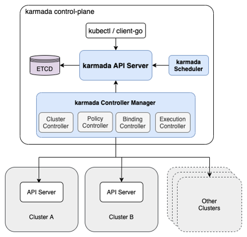
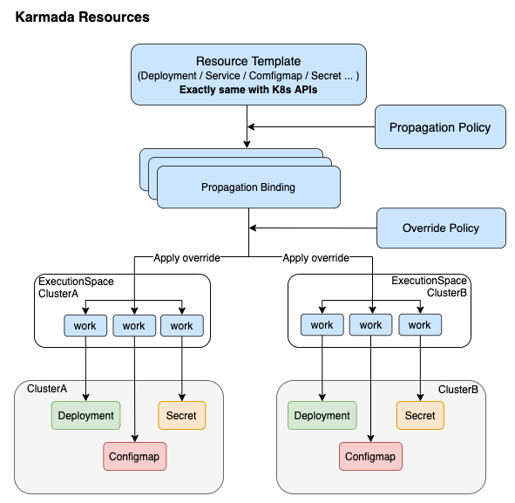

# k8s多集群管理的思考

# k8s多集群的思考

# 1. 为什么需要多集群

**1、k8s单集群的承载能力有限。**

Kubernetes v1.21 支持的最大节点数为 5000。 更具体地说，Kubernetes旨在适应满足以下*所有*标准的配置：

- 每个节点的 Pod 数量不超过 100
- 节点数不超过 5000
- Pod 总数不超过 150000
- 容器总数不超过 300000

> 参考：https://kubernetes.io/zh/docs/setup/best-practices/cluster-large/

且当节点数量较大时，会出现调度延迟，etcd读写延迟，apiserver负载高等问题，影响服务的正常创建。

**2、分散集群服务风险。**

全部服务都放在一个k8s集群中，当该集群出现异常，短期无法恢复的情况下，则影响全部服务和影响部署。为了避免机房等故障导致单集群异常，建议将k8s的master在分散在延迟较低的不同可用区部署，且在不同region部署多个k8s集群来进行集群级别的容灾。

**3、当前混合云的使用方式和架构**

当前部分公司会存在自建机房+不同云厂商的公有云从而来实现混部云的运营模式，那么自然会引入多集群管理的问题。

# 2. 多集群部署需要解决哪些问题

目标：**让用户像使用单集群一样来使用多集群**。

扩展集群的边界，服务的边界从单台物理机多个进程，发展到通过k8s集群来管理多台的物理机，再发展到管理多个的k8s集群。**服务的边界从物理机发展到集群**。

而多集群管理需要解决以下问题：

- **多集群服务的分发部署（deployment、daemonset等）**
- **跨集群自动迁移与调度（当某个集群异常，服务可以在其他集群自动部署）**
- **多集群服务发现，网络通信及负载均衡（service，ingress等）**

而多集群服务的网络通信可以由Service mesh等来解决，本文不做重点讨论。

以上几个问题，可以先从k8s管理节点的思维进行分析

|            | 物理机视角 | 单集群视角                                           | 多集群视角                                        |
| ---------- | ---------- | ---------------------------------------------------- | ------------------------------------------------- |
| 进程的边界 | 物理机     | k8s集群                                              | 多集群                                            |
| 调度单元   | 进程或线程 | 容器或pod                                            | 工作负载（deployment）                            |
| 服务的集合 |            | 工作负载（deployment）                               | 不同集群工作负载的集合体（workloadGroup）         |
| 服务发现   |            | service                                              | 不同集群service的集合体                           |
| 服务迁移   |            | 工作负载（deployment）控制器                         | 不同集群工作负载的集合体控制器                    |
| 服务调度   |            | nodename或者node selector                            | clustername或cluster selector                     |
|            |            | pod的反亲和（相同deployment下的pod不调度在相同节点） | workload反亲和（相同workloadGroup分散在不同集群） |

## 2.1. 多集群工作负载的分发

单集群中k8s的调度单元是pod，即一个pod只能跑在一个节点上，一个节点可以运行多个pod，而不同节点上的一组pod是通过一个workload来控制和分发。类似这个逻辑，那么在多集群的视角下，多集群的调度单元是一个集群的workload，一个workload只能跑在一个集群中，一个集群可以运行多个workload。

那么就需要有一个控制器来管理不同k8s集群的相同workload。例如 workloadGroup。而该workloadGroup在不侵入k8s原生API的情况下，主要包含两个部分。

**workloadGroup:**

- **资源模板（Resource Template**）：服务的描述（workload）
- **分发策略（Propagaion Policy）**：服务分发的集群（即多个workload应该被分发到哪些集群运行）

workload描述的是什么服务运行在什么节点，workloadGroup描述的是什么服务运行在什么集群。

**实现workloadGroup有两种方式**：

1. 一种是自定义API将workloadGroup中的Resource Template和Propagaion Policy合成在一个自定义的对象中，由用户直接指定该workloadGroup信息，从而将不同的workload分发到不同的集群中。
2. 另一种方式是通过一个k8s载体来记录一个具体的workload对象，再由用户指定Propagaion Policy关联该workload对象，从而让控制器自动根据用户指定的Propagaion Policy将workload分发到不同的集群中。

## 2.2. 跨集群自动迁移与调度

单集群中k8s中通过workload中的nodeselector或者nodename以及亲和性来控制pod运行在哪个节点上。而多集群的视角下，则需要有一个控制器来实现集群级别的调度逻辑，例如clustername，cluster selector，cluster AntiAffinity，从而来自动控制workloadGroup下的workload分散在什么集群上。

# 3. 目前的多集群方案

## 3.1. Kubefed[Federation v2]

简介

基本思想

## 3.2. virtual kubelet

简介

基本思想

## 3.3. Karmada

简介

基本思想

# Virtual Kubelet
# Virtual Kubelet介绍

# 1. 简介

`Virtual Kubelet`是 [Kubernetes kubelet](https://kubernetes.io/docs/reference/generated/kubelet/) 的一种实现，作为一种虚拟的kubelet用来连接k8s集群和其他平台的API。这允许k8s的节点由其他`提供者（provider）`提供支持，这些提供者例如serverless平台（ACI, AWS Fargate）、[IoT Edge](https://github.com/Azure/iot-edge-virtual-kubelet-provider)等。

一句话概括：Kubernetes API on top, programmable back。

# 2. 架构图

[](https://camo.githubusercontent.com/893885afb02f2048a70e87cee11867ab8fe2d1dbf458cedc6f747711a65e4091/68747470733a2f2f7265732e636c6f7564696e6172792e636f6d2f647178746e3069636b2f696d6167652f75706c6f61642f76313536363536303736372f61727469636c652f6b756265726e657465732f7669727475616c2d6b7562656c65742f766b2d6469616772616d2e737667)

# 3. 功能

virtual kubelet提供一个可以自定义k8s node的依赖库。

目前支持的功能如下：

- 创建、删除、更新 pod
- 容器的日志、exec命令、metrics
- 获取pod、pod列表、pod status
- node的地址、容量、daemon
- 操作系统
- 自定义virtual network

# 4. Providers

virtual kubelet提供一个插件式的**provider**接口，让开发者可以自定义实现传统kubelet的功能。自定义的provider可以用自己的配置文件和环境参数。

自定义的provider必须提供以下功能：

- 提供pod、容器、资源的生命周期管理的功能
- 符合virtual kubelet提供的API
- 不直接访问k8s apiserver，定义获取数据的回调机制，例如configmap、secrets

开源的provider

- [Alibaba Cloud ECI Provider](https://github.com/virtual-kubelet/alibabacloud-eci)
- [Azure Container Instances Provider](https://github.com/virtual-kubelet/azure-aci)
- [AWS Fargate Provider](https://github.com/virtual-kubelet/aws-fargate)

# 5. 自定义provider

创建自定义provider的目录。

```
git clone https://github.com/virtual-kubelet/virtual-kubelet
cd virtual-kubelet
mkdir providers/my-provider
```


## 5.1. PodLifecylceHandler

当pod被k8s创建、更新、删除时，会调用以下方法。

```
type PodLifecycleHandler interface {
    // CreatePod takes a Kubernetes Pod and deploys it within the provider.
    CreatePod(ctx context.Context, pod *corev1.Pod) error

    // UpdatePod takes a Kubernetes Pod and updates it within the provider.
    UpdatePod(ctx context.Context, pod *corev1.Pod) error

    // DeletePod takes a Kubernetes Pod and deletes it from the provider.
    DeletePod(ctx context.Context, pod *corev1.Pod) error

    // GetPod retrieves a pod by name from the provider (can be cached).
    GetPod(ctx context.Context, namespace, name string) (*corev1.Pod, error)

    // GetPodStatus retrieves the status of a pod by name from the provider.
    GetPodStatus(ctx context.Context, namespace, name string) (*corev1.PodStatus, error)

    // GetPods retrieves a list of all pods running on the provider (can be cached).
    GetPods(context.Context) ([]*corev1.Pod, error)
}
```


`PodLifecycleHandler`是被`PodController`来调用，来管理被分配到node上的pod。

```
pc, _ := node.NewPodController(podControllerConfig) // <-- instatiates the pod controller
pc.Run(ctx) // <-- starts watching for pods to be scheduled on the node
```


## 5.2. PodNotifier(optional)

`PodNotifier`是可选实现，该接口主要用来通知virtual kubelet的pod状态变化。如果没有实现该接口，virtual-kubelet会定期检查所有pod的状态。

```
type PodNotifier interface {
    // NotifyPods instructs the notifier to call the passed in function when
    // the pod status changes.
    //
    // NotifyPods should not block callers.
    NotifyPods(context.Context, func(*corev1.Pod))
}
```


## 5.3. NodeProvider

`NodeProvider`用来通知virtual-kubelet关于node状态的变化，virtual-kubelet会定期检查node是状态并相应地更新k8s。

```
type NodeProvider interface {
    // Ping checks if the node is still active.
    // This is intended to be lightweight as it will be called periodically as a
    // heartbeat to keep the node marked as ready in Kubernetes.
    Ping(context.Context) error

    // NotifyNodeStatus is used to asynchronously monitor the node.
    // The passed in callback should be called any time there is a change to the
    // node's status.
    // This will generally trigger a call to the Kubernetes API server to update
    // the status.
    //
    // NotifyNodeStatus should not block callers.
    NotifyNodeStatus(ctx context.Context, cb func(*corev1.Node))
}
```


`NodeProvider`是被NodeController调用，来管理k8s中的node对象。

```
nc, _ := node.NewNodeController(nodeProvider, nodeSpec) // <-- instantiate a node controller from a node provider and a kubernetes node spec
nc.Run(ctx) // <-- creates the node in kubernetes and starts up he controller
```


## 5.4. 测试

进入到项目根目录

```
make test
```


## 5.5. 示例代码

- Azure Container Instances Provider

  https://github.com/virtual-kubelet/azure-aci/blob/master/aci.go#L541

- Alibaba Cloud ECI Provider

  https://github.com/virtual-kubelet/alibabacloud-eci/blob/master/eci.go#L177

- AWS Fargate Provider

  https://github.com/virtual-kubelet/aws-fargate/blob/master/provider.go#L110

# Virtual Kubelet 命令

# virtual-kubelet --help

```
#./virtual-kubelet --help
virtual-kubelet implements the Kubelet interface with a pluggable
backend implementation allowing users to create kubernetes nodes without running the kubelet.
This allows users to schedule kubernetes workloads on nodes that aren't running Kubernetes.

Usage:
  virtual-kubelet [flags]
  virtual-kubelet [command]

Available Commands:
  help        Help about any command
  providers   Show the list of supported providers
  version     Show the version of the program

Flags:
      --cluster-domain string                 kubernetes cluster-domain (default is 'cluster.local') (default "cluster.local")
      --disable-taint                         disable the virtual-kubelet node taint
      --enable-node-lease                     use node leases (1.13) for node heartbeats
      --full-resync-period duration           how often to perform a full resync of pods between kubernetes and the provider (default 1m0s)
  -h, --help                                  help for virtual-kubelet
      --klog.alsologtostderr                  log to standard error as well as files
      --klog.log_backtrace_at traceLocation   when logging hits line file:N, emit a stack trace (default :0)
      --klog.log_dir string                   If non-empty, write log files in this directory
      --klog.log_file string                  If non-empty, use this log file
      --klog.log_file_max_size uint           Defines the maximum size a log file can grow to. Unit is megabytes. If the value is 0, the maximum file size is unlimited. (default 1800)
      --klog.logtostderr                      log to standard error instead of files (default true)
      --klog.skip_headers                     If true, avoid header prefixes in the log messages
      --klog.skip_log_headers                 If true, avoid headers when opening log files
      --klog.stderrthreshold severity         logs at or above this threshold go to stderr (default 2)
      --klog.v Level                          number for the log level verbosity
      --klog.vmodule moduleSpec               comma-separated list of pattern=N settings for file-filtered logging
      --kubeconfig string                     kube config file to use for connecting to the Kubernetes API server (default "/root/.kube/config")
      --log-level string                      set the log level, e.g. "debug", "info", "warn", "error" (default "info")
      --metrics-addr string                   address to listen for metrics/stats requests (default ":10255")
      --namespace string                      kubernetes namespace (default is 'all')
      --nodename string                       kubernetes node name (default "virtual-kubelet")
      --os string                             Operating System (Linux/Windows) (default "Linux")
      --pod-sync-workers int                  set the number of pod synchronization workers (default 10)
      --provider string                       cloud provider
      --provider-config string                cloud provider configuration file
      --startup-timeout duration              How long to wait for the virtual-kubelet to start
      --trace-exporter strings                sets the tracing exporter to use, available exporters: [jaeger ocagent]
      --trace-sample-rate string              set probability of tracing samples
      --trace-service-name string             sets the name of the service used to register with the trace exporter (default "virtual-kubelet")
      --trace-tag map                         add tags to include with traces in key=value form

Use "virtual-kubelet [command] --help" for more information about a command.
```


# Karmada
# Karmada介绍

# 简介

Karmada（Kubernetes Armada）是基于Kubernetes原生API的多集群管理系统。在多云和混合云场景下，Karmada提供可插拔，全自动化管理多集群应用，实现多云集中管理、高可用性、故障恢复和流量调度。

# 特性

基于K8s原生API的跨集群应用管理，用户可以方便快捷地将应用从单集群迁移到多集群。

- 中心式操作和管理Kubernetes集群。
- 跨集群应用可在多集群上自动扩展，故障转移和负载均衡。
- 高级的调度策略：区域，可用区，云提供商，集群亲和性/反亲和性。
- 支持创建分发用户自定义（CustomResourceDefinitions）资源。

# 框架结构

[](https://camo.githubusercontent.com/c6cb70fbf4ac42c1ed02bb436bf41510c01d168575b631a06d4ef89313f94c76/68747470733a2f2f737570706f72742e687561776569636c6f75642e636f6d2f70726f64756374646573632d6d63702f7a682d636e5f696d6167655f303030303030313039343633363737382e706e67)

- ETCD：存储Karmada API对象。
- Karmada Scheduler：提供高级的多集群调度策略。
- Karmada Controller Manager: 包含多个Controller，Controller监听karmada对象并且与成员集群API server进行通信并创建成员集群的k8s对象。
  - Cluster Controller：成员集群的生命周期管理与对象管理。
  - Policy Controller：监听PropagationPolicy对象，创建ResourceBinding，配置资源分发策略。
  - Binding Controller：监听ResourceBinding对象，并创建work对象响应资源清单。
  - Execution Controller：监听work对象，并将资源分发到成员集群中。

# 资源分发流程

**基本概念**

- 资源模板（Resource Template）：Karmada使用K8s原生API定义作为资源模板，便于快速对接K8s生态工具链。
- 分发策略（Propagaion Policy）：Karmada提供独立的策略API，用来配置资源分发策略。
- 差异化策略（Override Policy）：Karmada提供独立的差异化API，用来配置与集群相关的差异化配置。比如配置不同集群使用不同的镜像。

Karmada资源分发流程图：

[](https://camo.githubusercontent.com/4f7c19854c8f914dea8e9bfca6fe55bd0ba31d3a2670f566bbeb458ffb46a6f8/68747470733a2f2f737570706f72742e687561776569636c6f75642e636f6d2f70726f64756374646573632d6d63702f7a682d636e5f696d6167655f303030303030313134313331363736352e706e67)