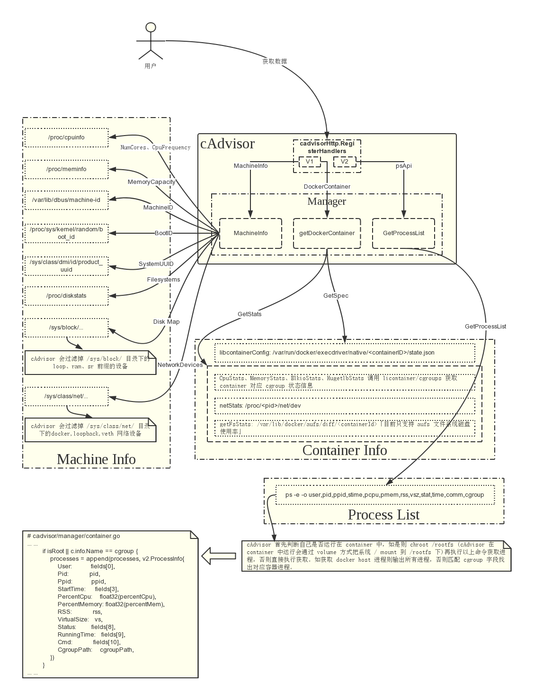

# 监控体系介绍

# 1. 概述

## 1.1. cAdvisor

cAdvisor对Node机器上的资源及容器进行实时监控和性能数据采集，包括CPU使用情况、内存使用情况、网络吞吐量及文件系统使用情况，cAdvisor集成在Kubelet中，当kubelet启动时会自动启动cAdvisor，即一个cAdvisor仅对一台Node机器进行监控。kubelet的启动参数--cadvisor-port可以定义cAdvisor对外提供服务的端口，默认为4194。可以通过浏览器`Node_IP:port`访问。项目主页：http://github.com/google/cadvisor。

## 1.2. Heapster

是对集群中的各个Node、Pod的资源使用数据进行采集，通过访问每个Node上Kubelet的API，再通过Kubelet调用cAdvisor的API来采集该节点上所有容器的性能数据。由Heapster进行数据汇聚，保存到后端存储系统中，例如InfluxDB，Google Cloud Logging等。项目主页为：https://github.com/kubernetes/heapster。

## [1.3. InfluxDB]

是分布式时序数据库（每条记录带有时间戳属性），主要用于实时数据采集、事件跟踪记录、存储时间图表、原始数据等。提供REST API用于数据的存储和查询。项目主页为[http://InfluxDB.com。](http://influxdb.com./)

## [1.4. Grafana]

通过Dashboard将InfluxDB的时序数据展现成图表形式，便于查看集群运行状态。项目主页为[http://Grafana.org。](http://grafana.org./)

## [1.5. 总体架构图]


其中当前Kubernetes中，Heapster、InfluxDB、Grafana均以Pod的形式启动和运行。Heapster与Master需配置安全连接。

# 2. 部署与使用

## 2.1. cAdvisor

kubelet的启动参数--cadvisor-port可以定义cAdvisor对外提供服务的端口，默认为4194。可以通过浏览器`Node_IP:port`访问。也提供了REST API供客户端远程调用，API返回的格式为JSON，可以采用URL访问：http://`hostname`:`port`/api/`version`/`request`/

例如：http://14.152.49.100:4194/api/v1.3/machine 获取主机信息。

## 2.2. Service

## 2.2.1. heapster-service

**heapster-service.yaml**

```
apiVersion:v1
kind:Service
metadata:
  label:
    kubenetes.io/cluster-service:"true"
    kubernetes.io/name:Heapster
  name:heapster
  namespace:kube-system
spec:
  ports:
    - port:80
      targetPort:8082
  selector:
    k8s-app:heapster
```


## 2.2.2. influxdb-service

**influxdb-service.yaml**

```
apiVersion:v1
kind:Service
metadata:
  label:null
  name:monitoring-InfluxDB
  namespace:kube-system
spec:
  type:Nodeport
  ports:
    - name:http
      port:80
      targetPort:8083
    - name:api
      port:8086
      targetPort:8086
      Nodeport:8086
  selector:
    name:influxGrafana
```


## 2.2.3. grafana-service

**grafana-service.yaml**

```
apiVersion:v1
kind:Service
metadata:
  label:
    kubenetes.io/cluster-service:"true"
    kubernetes.io/name:monitoring-Grafana
  name:monitoring-Grafana
  namespace:kube-system
spec:
  type:Nodeport
  ports:
      port:80
      targetPort:8080
      Nodeport:8085
  selector:
    name:influxGrafana
```


使用type=NodePort将InfluxDB和Grafana暴露在Node的端口上，以便通过浏览器进行访问。

## 2.2.4. 创建service

```
kubectl create -f heapster-service.yaml
kubectl create -f InfluxDB-service.yaml
kubectl create -f Grafana-service.yaml
```


## 2.3. ReplicationController

## 2.3.1. influxdb-grafana-controller

**influxdb-grafana-controller-v3.yaml**

```
apiVersion:v1
kind:ReplicationController
metadata:
  name:monitoring-influxdb-grafana-v3
  namespace:kube-system
  labels:
    k8s-app:influxGrafana
    version:v3
    kubernetes.io/cluster-service:"true
spec:
  replicas:1
  selector:
    k8s-app:influxGrafana
    version:v3
  template:
    metadata:
      labels:
        k8s-app:influxGrafana
        version:v3
        kubernetes.io/cluster-service:"true
    spec:
      containers:
        - image:gcr.io/google_containers/heapster_influxdb:v0.5
          name:influxdb
          resources:
            limits:
              cpu:100m
              memory:500Mi
            requests:
              cpu:100m
              memory:500Mi
          ports:
            - containerPort:8083
            - containerPort:8086
          volumeMounts:
            -name:influxdb-persistent-storage
             mountPath:/data
        - image:grc.io/google_containers/heapster_grafana:v2.6.0-2
          name:grafana
          resources:
            limits:
              cpu:100m
              memory:100Mi
            requests:
              cpu:100m
              memory:100Mi
          env:
            - name:INFLUXDB_SERVICE_URL
              value:http://monitoring-influxdb:8086
            - name:GF_AUTH_BASIC_ENABLED
              value:"false"
            - name:GF_AUTH_ANONYMOUS_ENABLED
              value:"true"
            - name:GF_AUTH_ANONYMOUS_ORG_ROLE
              value:Admin
            - name:GF_SERVER_ROOT_URL
              value:/api/v1/proxy/namespace/kube-system/services/monitoring-grafana/
          volumeMounts:
            - name:grafana-persistent-storage
              mountPath:/var
      volumes:
        - name:influxdb-persistent-storage
          emptyDir{}
        - name:grafana-persistent-storage
          emptyDir{}
```


## 2.3.2. heapster-controller

**heapster-controller.yaml**

```
apiVersion:v1
kind:ReplicationController
metadata:
    labels:
        k8s-app:heapster
        name:heapster
        version:v6
    name:heapster
    namespace:kube-system
spec:
    replicas:1
    selector:
        name:heapster
        k8s-app:heapster
        version:v6
    template:
        metadata:
            labels:
                k8s-app:heapster
                version:v6
        spec:
            containers:
                - image:gcr.io/google_containers/heapster:v0.17.0
                  name:heapster
                  command:
                    - /heapster
                    - --source=kubernetes:http://192.168.1.128:8080?inClusterConfig=flase&kubeletHttps=true&useServiceAccount=true&auth=
                    - --sink=InfluxDB:http://monitoring-InfluxDB:8086
```

Heapster设置启动参数说明：

1、–source

配置监控来源，本例中表示从k8s-Master获取各个Node的信息。在URL的参数部分，修改kubeletHttps、inClusterConfig、useServiceAccount的值。

2、–sink

配置后端的存储系统，本例中使用InfluxDB。URL中主机名的地址是InfluxDB的Service名字，需要DNS服务正常工作，如果没有配置DNS服务可使用Service的ClusterIP地址。

## 2.3.3. 创建ReplicationController

```
kubelet create -f InfluxDB-Grafana-controller.yaml
kubelet create -f heapster-controller.yaml
```


# 3. 查看界面及数据

## 3.1. InfluxDB

访问任意一台Node机器的30083端口。

## 3.2. Grafana

访问任意一台Node机器的30080端口。

# 4. 容器化部署

## 4.1. 拉取镜像

```
docker pull influxdb:latest
docker pull cadvisor:latest
docker pull grafana:latest
docker pull heapster:latest
```


## 4.2. 运行容器

## 4.2.1. influxdb

```
#influxdb
docker run -d -p 8083:8083 -p 8086:8086 --expose 8090 --expose 8099 --volume=/opt/data/influxdb:/data --name influxsrv influxdb:latest
```


## 4.2.2. cadvisor

```
#cadvisor
docker run --volume=/:/rootfs:ro --volume=/var/run:/var/run:rw --volume=/sys:/sys:ro --volume=/var/lib/docker/:/var/lib/docker:ro --publish=8080:8080 --detach=true --link influxsrv:influxsrv --name=cadvisor cadvisor:latest -storage_driver=influxdb -storage_driver_db=cadvisor -storage_driver_host=influxsrv:8086
```


## 4.2.3. grafana

```
#grafana
docker run -d -p 3000:3000 -e INFLUXDB_HOST=influxsrv -e INFLUXDB_PORT=8086 -e INFLUXDB_NAME=cadvisor -e INFLUXDB_USER=root -e INFLUXDB_PASS=root --link influxsrv:influxsrv --name grafana grafana:latest
```


## 4.2.4. heapster

```
docker run -d -p 8082:8082 --net=host heapster:canary --source=kubernetes:http://`k8s-server-ip`:8080?inClusterConfig=false/&useServiceAccount=false --sink=influxdb:http://`influxdb-ip`:8086
```


## 4.3. 访问

在浏览器输入`IP`:`PORT`

# cAdvisor介绍

# 1. cAdvisor简介

 cAdvisor对Node机器上的资源及容器进行实时监控和性能数据采集，包括CPU使用情况、内存使用情况、网络吞吐量及文件系统使用情况，cAdvisor集成在Kubelet中，当kubelet启动时会自动启动cAdvisor，即一个cAdvisor仅对一台Node机器进行监控。kubelet的启动参数--cadvisor-port可以定义cAdvisor对外提供服务的端口，默认为4194。可以通过浏览器<Node_IP:port>访问。项目主页：[http://github.com/google/cadvisor。](https://github.com/huweihuang/kubernetes-notes/blob/master/monitor)

# 2. cAdvisor结构图

[](https://camo.githubusercontent.com/e92f2ce31187395a97ec7e9ef9384569a5e30a3fe64a2e8f977e69b30316a8be/68747470733a2f2f7265732e636c6f7564696e6172792e636f6d2f647178746e3069636b2f696d6167652f75706c6f61642f76313531303537393035382f61727469636c652f6b756265726e657465732f6d6f6e69746f722f6341647669736f722e706e67)

# 3. Metrics

| 分类       | 字段               | 描述                                                  |
| ---------- | ------------------ | ----------------------------------------------------- |
| cpu        | cpu_usage_total    |                                                       |
|            | cpu_usage_system   |                                                       |
|            | cpu_usage_user     |                                                       |
|            | cpu_usage_per_cpu  |                                                       |
|            | load_average       | Smoothed average of number of runnable threads x 1000 |
| memory     | memory_usage       | Memory Usage                                          |
|            | memory_working_set | Working set size                                      |
| network    | rx_bytes           | Cumulative count of bytes received                    |
|            | rx_errors          | Cumulative count of receive errors encountered        |
|            | tx_bytes           | Cumulative count of bytes transmitted                 |
|            | tx_errors          | Cumulative count of transmit errors encountered       |
| filesystem | fs_device          | Filesystem device                                     |
|            | fs_limit           | Filesystem limit                                      |
|            | fs_usage           | Filesystem usage                                      |

# 4. cAdvisor源码

## 4.1. cAdvisor入口函数

**cadvisor.go**

```
func main() {
    defer glog.Flush()
    flag.Parse()
    if *versionFlag {
        fmt.Printf("cAdvisor version %s (%s)/n", version.Info["version"], version.Info["revision"])
        os.Exit(0)
    }
    setMaxProcs()
    memoryStorage, err := NewMemoryStorage()
    if err != nil {
        glog.Fatalf("Failed to initialize storage driver: %s", err)
    }
    sysFs, err := sysfs.NewRealSysFs()
    if err != nil {
        glog.Fatalf("Failed to create a system interface: %s", err)
    }
    collectorHttpClient := createCollectorHttpClient(*collectorCert, *collectorKey)
    containerManager, err := manager.New(memoryStorage, sysFs, *maxHousekeepingInterval, *allowDynamicHousekeeping, ignoreMetrics.MetricSet, &collectorHttpClient)
    if err != nil {
        glog.Fatalf("Failed to create a Container Manager: %s", err)
    }
    mux := http.NewServeMux()
    if *enableProfiling {
        mux.HandleFunc("/debug/pprof/", pprof.Index)
        mux.HandleFunc("/debug/pprof/cmdline", pprof.Cmdline)
        mux.HandleFunc("/debug/pprof/profile", pprof.Profile)
        mux.HandleFunc("/debug/pprof/symbol", pprof.Symbol)
    }
    // Register all HTTP handlers.
    err = cadvisorhttp.RegisterHandlers(mux, containerManager, *httpAuthFile, *httpAuthRealm, *httpDigestFile, *httpDigestRealm)
    if err != nil {
        glog.Fatalf("Failed to register HTTP handlers: %v", err)
    }
    cadvisorhttp.RegisterPrometheusHandler(mux, containerManager, *prometheusEndpoint, nil)
    // Start the manager.
    if err := containerManager.Start(); err != nil {
        glog.Fatalf("Failed to start container manager: %v", err)
    }
    // Install signal handler.
    installSignalHandler(containerManager)
    glog.Infof("Starting cAdvisor version: %s-%s on port %d", version.Info["version"], version.Info["revision"], *argPort)
    addr := fmt.Sprintf("%s:%d", *argIp, *argPort)
    glog.Fatal(http.ListenAndServe(addr, mux))
}
```


核心代码：

```
memoryStorage, err := NewMemoryStorage()
sysFs, err := sysfs.NewRealSysFs()
#创建containerManager
containerManager, err := manager.New(memoryStorage, sysFs, *maxHousekeepingInterval, *allowDynamicHousekeeping, ignoreMetrics.MetricSet, &collectorHttpClient)
#启动containerManager
err := containerManager.Start()
```


## 4.2. cAdvisor Client的使用

```
import "github.com/google/cadvisor/client"
func main(){
    client, err := client.NewClient("http://192.168.19.30:4194/")   //http://<host-ip>:<port>/
}
```


## 4.2.1 client定义

**cadvisor/client/client.go**

```
// Client represents the base URL for a cAdvisor client.
type Client struct {
    baseUrl string
}
// NewClient returns a new v1.3 client with the specified base URL.
func NewClient(url string) (*Client, error) {
    if !strings.HasSuffix(url, "/") {
        url += "/"
    }
    return &Client{
        baseUrl: fmt.Sprintf("%sapi/v1.3/", url),
    }, nil
}
```


## 4.2.2. client方法

**1）MachineInfo**

```
// MachineInfo returns the JSON machine information for this client.
// A non-nil error result indicates a problem with obtaining
// the JSON machine information data.
func (self *Client) MachineInfo() (minfo *v1.MachineInfo, err error) {
       u := self.machineInfoUrl()
       ret := new(v1.MachineInfo)
       if err = self.httpGetJsonData(ret, nil, u, "machine info"); err != nil {
              return
       }
       minfo = ret
       return
}
```


**2）ContainerInfo**

```
// ContainerInfo returns the JSON container information for the specified
// container and request.
func (self *Client) ContainerInfo(name string, query *v1.ContainerInfoRequest) (cinfo *v1.ContainerInfo, err error) {
       u := self.containerInfoUrl(name)
       ret := new(v1.ContainerInfo)
       if err = self.httpGetJsonData(ret, query, u, fmt.Sprintf("container info for %q", name)); err != nil {
              return
       }
       cinfo = ret
       return
}
```


**3）DockerContainer**

```
// Returns the JSON container information for the specified
// Docker container and request.
func (self *Client) DockerContainer(name string, query *v1.ContainerInfoRequest) (cinfo v1.ContainerInfo, err error) {
       u := self.dockerInfoUrl(name)
       ret := make(map[string]v1.ContainerInfo)
       if err = self.httpGetJsonData(&ret, query, u, fmt.Sprintf("Docker container info for %q", name)); err != nil {
              return
       }
       if len(ret) != 1 {
              err = fmt.Errorf("expected to only receive 1 Docker container: %+v", ret)
              return
       }
       for _, cont := range ret {
              cinfo = cont
       }
       return
}
```


**4）AllDockerContainers**

```
// Returns the JSON container information for all Docker containers.
func (self *Client) AllDockerContainers(query *v1.ContainerInfoRequest) (cinfo []v1.ContainerInfo, err error) {
       u := self.dockerInfoUrl("/")
       ret := make(map[string]v1.ContainerInfo)
       if err = self.httpGetJsonData(&ret, query, u, "all Docker containers info"); err != nil {
              return
       }
       cinfo = make([]v1.ContainerInfo, 0, len(ret))
       for _, cont := range ret {
              cinfo = append(cinfo, cont)
       }
       return
}
```

# Heapster介绍

# 1. heapster简介

Heapster是容器集群监控和性能分析工具，天然的支持Kubernetes和CoreOS。 Kubernetes有个出名的监控agent—cAdvisor。在每个kubernetes Node上都会运行cAdvisor，它会收集本机以及容器的监控数据(cpu,memory,filesystem,network,uptime)。

# 2. heapster部署与配置

## 2.1. 注意事项

需同步部署机器和被采集机器的时间：ntpdate time.windows.com

加入定时任务，定期同步时间

crontab –e

30 5 * * * /usr/sbin/ntpdate time.windows.com //每天早晨5点半执行

## 2.2. 容器式部署

```
#拉取镜像
docker pull heapster:latest
#运行容器
docker run -d -p 8082:8082 --net=host heapster:latest --source=kubernetes:http://<k8s-server-ip>:8080?inClusterConfig=false\&useServiceAccount=false --sink=influxdb:http://<influxdb-ip>:8086?db=<k8s_env_zone>
```


## 2.3. 配置说明

可以参考[官方文档](https://github.com/kubernetes/heapster/tree/master/docs)

## 2.3.1. –source

–source: 指定数据获取源。这里指定kube-apiserver即可。 后缀参数： inClusterConfig: kubeletPort: 指定kubelet的使用端口，默认10255 kubeletHttps: 是否使用https去连接kubelets(默认：false) apiVersion: 指定K8S的apiversion insecure: 是否使用安全证书(默认：false) auth: 安全认证 useServiceAccount: 是否使用K8S的安全令牌

## 2.3.2. –sink

–sink: 指定后端数据存储。这里指定influxdb数据库。 后缀参数： user: InfluxDB用户 pw: InfluxDB密码 db: 数据库名 secure: 安全连接到InfluxDB(默认：false) withfields： 使用InfluxDB fields(默认：false)。

# 3. Metrics

| 分类       | Metric Name                   | Description                                                  | 备注                |
| ---------- | ----------------------------- | ------------------------------------------------------------ | ------------------- |
| cpu        | cpu/limit                     | CPU hard limit in millicores.                                | CPU上限             |
|            | cpu/node_capacity             | Cpu capacity of a node.                                      | Node节点的CPU容量   |
|            | cpu/node_allocatable          | Cpu allocatable of a node.                                   | Node节点可分配的CPU |
|            | cpu/node_reservation          | Share of cpu that is reserved on the node allocatable.       |                     |
|            | cpu/node_utilization          | CPU utilization as a share of node allocatable.              |                     |
|            | cpu/request                   | CPU request (the guaranteed amount of resources) in millicores. |                     |
|            | cpu/usage                     | Cumulative CPU usage on all cores.                           | CPU总使用量         |
|            | cpu/usage_rate                | CPU usage on all cores in millicores.                        |                     |
| filesystem | filesystem/usage              | Total number of bytes consumed on a filesystem.              | 文件系统的使用量    |
|            | filesystem/limit              | The total size of filesystem in bytes.                       | 文件系统的使用上限  |
|            | filesystem/available          | The number of available bytes remaining in a the filesystem  | 可用的文件系统容量  |
|            | filesystem/inodes             | The number of available inodes in a the filesystem           |                     |
|            | filesystem/inodes_free        | The number of free inodes remaining in a the filesystem      |                     |
| memory     | memory/limit                  | Memory hard limit in bytes.                                  | 内存上限            |
|            | memory/major_page_faults      | Number of major page faults.                                 |                     |
|            | memory/major_page_faults_rate | Number of major page faults per second.                      |                     |
|            | memory/node_capacity          | Memory capacity of a node.                                   |                     |
|            | memory/node_allocatable       | Memory allocatable of a node.                                |                     |
|            | memory/node_reservation       | Share of memory that is reserved on the node allocatable.    |                     |
|            | memory/node_utilization       | Memory utilization as a share of memory allocatable.         |                     |
|            | memory/page_faults            | Number of page faults.                                       |                     |
|            | memory/page_faults_rate       | Number of page faults per second.                            |                     |
|            | memory/request                | Memory request (the guaranteed amount of resources) in bytes. |                     |
|            | memory/usage                  | Total memory usage.                                          |                     |
|            | memory/cache                  | Cache memory usage.                                          |                     |
|            | memory/rss                    | RSS memory usage.                                            |                     |
|            | memory/working_set            | Total working set usage. Working set is the memory being used and not easily dropped by the kernel. |                     |
| network    | network/rx                    | Cumulative number of bytes received over the network.        |                     |
|            | network/rx_errors             | Cumulative number of errors while receiving over the network. |                     |
|            | network/rx_errors_rate        | Number of errors while receiving over the network per second. |                     |
|            | network/rx_rate               | Number of bytes received over the network per second.        |                     |
|            | network/tx                    | Cumulative number of bytes sent over the network             |                     |
|            | network/tx_errors             | Cumulative number of errors while sending over the network   |                     |
|            | network/tx_errors_rate        | Number of errors while sending over the network              |                     |
|            | network/tx_rate               | Number of bytes sent over the network per second.            |                     |
|            | uptime                        | Number of milliseconds since the container was started.      | -                   |

# 4. Labels

| Label Name           | Description                                                  |
| -------------------- | ------------------------------------------------------------ |
| pod_id               | Unique ID of a Pod                                           |
| pod_name             | User-provided name of a Pod                                  |
| pod_namespace        | The namespace of a Pod                                       |
| container_base_image | Base image for the container                                 |
| container_name       | User-provided name of the container or full cgroup name for system containers |
| host_id              | Cloud-provider specified or user specified Identifier of a node |
| hostname             | Hostname where the container ran                             |
| labels               | Comma-separated(Default) list of user-provided labels. Format is 'key:value' |
| namespace_id         | UID of the namespace of a Pod                                |
| resource_id          | A unique identifier used to differentiate multiple metrics of the same type. e.x. Fs partitions under filesystem/usage |

# 5. heapster API

见官方文档：https://github.com/kubernetes/heapster/blob/master/docs/model.md

# Influxdb介绍

# 1. InfluxDB简介

InfluxDB是一个当下比较流行的时序数据库，InfluxDB使用 Go 语言编写，无需外部依赖，安装配置非常方便，适合构建大型分布式系统的监控系统。

主要特色功能：

1）基于时间序列，支持与时间有关的相关函数（如最大，最小，求和等）

2）可度量性：你可以实时对大量数据进行计算

3）基于事件：它支持任意的事件数据

# 2. InfluxDB安装

## 1）安装

wget https://dl.influxdata.com/influxdb/releases/influxdb-0.13.0.x86_64.rpm

yum localinstall influxdb-0.13.0.armhf.rpm

## 2）启动

service influxdb start

## 3）访问

[http://服务器IP:8083](http://xn--ip-fr5c86lx7z:8083/)

## 4）docker image方式安装

docker pull influxdb

docker run -d -p 8083:8083 -p 8086:8086 --expose 8090 --expose 8099 --volume=/opt/data/influxdb:/data --name influxsrv influxdb:latest

# 3. InfluxDB的基本概念

## 3.1. 与传统数据库中的名词做比较

| influxDB中的名词 | 传统数据库中的概念 |
| ---------------- | ------------------ |
| database         | 数据库             |
| measurement      | 数据库中的表       |
| points           | 表里面的一行数据   |

## 3.2. InfluxDB中独有的概念

## 3.2.1. Point

Point由时间戳（time）、数据（field）、标签（tags）组成。

Point相当于传统数据库里的一行数据，如下表所示：

| Point属性 | 传统数据库中的概念                                      |
| --------- | ------------------------------------------------------- |
| time      | 每个数据记录时间，是数据库中的主索引(会自动生成)        |
| fields    | 各种记录值（没有索引的属性）也就是记录的值：温度， 湿度 |
| tags      | 各种有索引的属性：地区，海拔                            |

## 3.2.2. series

所有在数据库中的数据，都需要通过图表来展示，而这个series表示这个表里面的数据，可以在图表上画成几条线：通过tags排列组合算出来

show series from cpu

# 4. InfluxDB的基本操作

InfluxDB提供三种操作方式：

1）客户端命令行方式

2）HTTP API接口

3）各语言API库

## 4.1. InfluxDB数据库操作

| 操作           | 命令                      |
| -------------- | ------------------------- |
| 显示数据库     | show databases            |
| 创建数据库     | create database `db_name` |
| 删除数据库     | drop database `db_name`   |
| 使用某个数据库 | use `db_name`             |

## 4.2. InfluxDB数据表操作

| 操作       | 命令                                                         | 说明                                                         |
| ---------- | ------------------------------------------------------------ | ------------------------------------------------------------ |
| 显示所有表 | SHOW MEASUREMENTS                                            |                                                              |
| 创建数据表 | insert `table_name`,hostname=server01 value=442221834240i 1435362189575692182 | 其中 disk_free 就是表名，hostname是索引，value=xx是记录值，记录值可以有多个，最后是指定的时间 |
| 删除数据表 | drop measurement `table_name`                                |                                                              |
| 查看表内容 | select * from `table_name`                                   |                                                              |
| 查看series | show series from `table_name`                                | series表示这个表里面的数据，可以在图表上画成几条线，series主要通过tags排列组合算出来 |