#   k8s介绍

k8s是谷歌以Borg为前身，基于谷歌15年生产环境经验的基础上开源的一个项目，k8s致力于提供跨主机集群的自动部署、扩展、高可用以及运行应用程序容器的平台。

# k8s的总架构图

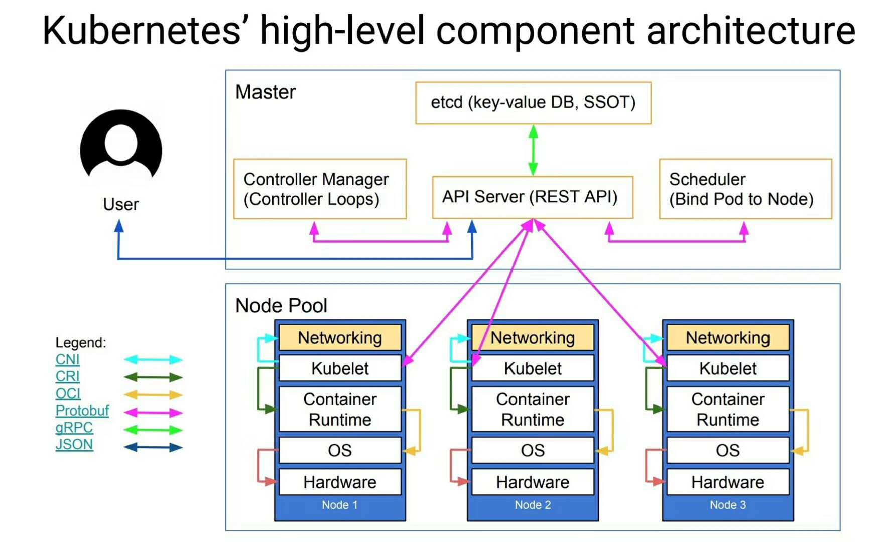

## 2 k8s各个组件介绍

### 2.1 master[控制节点]

**master的工作流程图**

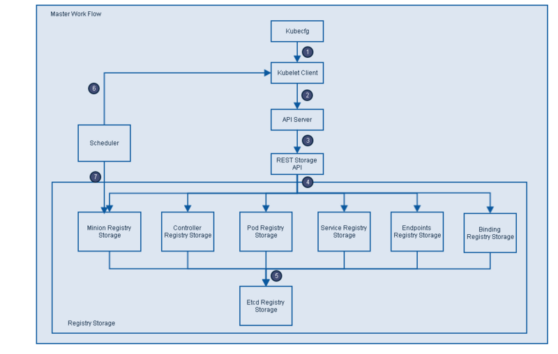

1. Kubecfg将特定的请求，比如创建Pod，发送给k8s Client。
2. k8s Client将请求发送给API server。
3. API Server根据请求的类型，比如创建Pod时storage类型是pods，然后依此选择何种REST Storage API对请求作出处理。
4. REST Storage API对的请求作相应的处理。
5. 将处理的结果存入高可用键值存储系统Etcd中。
6. 在API Server响应Kubecfg的请求后，Scheduler会根据k8s Client获取集群中运行Pod及Minion/Node信息。
7. 依据从k8s Client获取的信息，Scheduler将未分发的Pod分发到可用的Minion/Node节点上。

### 2.1.1 API-Server[资源操入口]

1. 提供了资源对象的唯一操作入口，其他所有组件都必须通过它提供的API来操作资源数据，只有API Server与存储通信，其他模块通过API Server访问集群状态。

   第一，是为了保证集群状态访问的安全。

   第二，是为了隔离集群状态访问的方式和后端存储实现的方式：API Server是状态访问的方式，不会因为后端存储技术etcd的改变而改变。

2. 作为k8s系统的入口，封装了核心对象的增删改查操作，以RESTFul接口方式提供给外部客户和内部组件调用。对相关的资源数据“全量查询”+“变化监听”，实时完成相关的业务功能。


### 2.1.2 Controller-Manager[内部管理控制中心]

1. 实现集群故障检测和恢复的自动化工作，负责执行各种控制器，主要有：
   - endpoint-controller：定期关联service和pod(关联信息由endpoint对象维护)，保证service到pod的映射总是最新的。
   - replication-controller：定期关联replicationController和pod，保证replicationController定义的复制数量与实际运行pod的数量总是一致的。

### 2.1.3 Scheduler[集群分发调度器]

1. Scheduler收集和分析当前k8s集群中所有Minion/Node节点的资源(内存、CPU)负载情况，然后依此分发新建的Pod到k8s集群中可用的节点。
2. 实时监测k8s集群中未分发和已分发的所有运行的Pod。
3. Scheduler也监测Minion/Node节点信息，由于会频繁查找Minion/Node节点，Scheduler会缓存一份最新的信息在本地。
4. 最后，Scheduler在分发Pod到指定的Minion/Node节点后，会把Pod相关的信息Binding写回API Server。

## 2.2 node[服务节点]

**kubelet结构图**

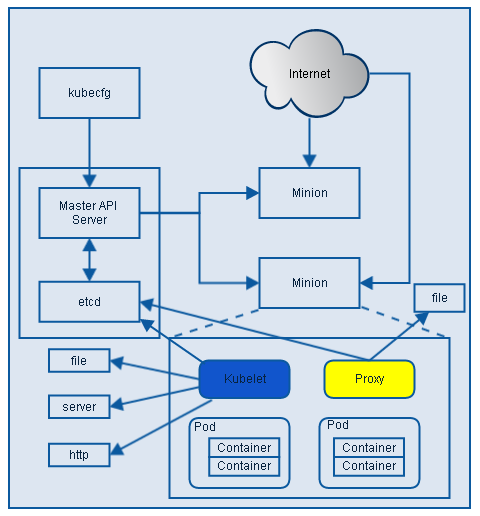

### 2.2.1 Kubelet[节点上的Pod管家]

1. 负责Node节点上pod的创建、修改、监控、删除等全生命周期的管理
2. 定时上报本Node的状态信息给API Server。
3. kubelet是Master API Server和Minion/Node之间的桥梁，接收Master API Server分配给它的commands和work，通过kube-apiserver间接与Etcd集群交互，读取配置信息。
4. 具体的工作如下：
   1. 设置容器的环境变量、给容器绑定Volume、给容器绑定Port、根据指定的Pod运行一个单一容器、给指定的Pod创建network 容器。
   2. 同步Pod的状态、同步Pod的状态、从cAdvisor获取container info、 pod info、 root info、 machine info。
   3. 在容器中运行命令、杀死容器、删除Pod的所有容器。


### 2.2.2 Proxy[负载均衡、路由转发]

1. Proxy是为了解决外部网络能够访问跨机器集群中容器提供的应用服务而设计的，运行在每个Minion/Node上。Proxy提供TCP/UDP sockets的proxy，每创建一种Service，Proxy主要从etcd获取Services和Endpoints的配置信息（也可以从file获取），然后根据配置信息在Minion/Node上启动一个Proxy的进程并监听相应的服务端口，当外部请求发生时，Proxy会根据Load Balancer将请求分发到后端正确的容器处理。
2. Proxy不但解决了同一主宿机相同服务端口冲突的问题，还提供了Service转发服务端口对外提供服务的能力，Proxy后端使用了随机、轮循负载均衡算法。

### 2.2.3 kubectl[集群管理命令行工具集]

1. 通过客户端的kubectl命令集操作，API Server响应对应的命令结果，从而达到对k8s集群的管理。


# kubectl详解

k8s 提供 kubectl (Command line tool) 是使用 k8s API 与 k8s 集群的 控制面 进行通信的命令行工具。

使用以下语法从终端窗口运行 `kubectl` 命令：

```shell
kubectl [command] [TYPE] [NAME] [flags]
```

其中 `command`、`TYPE`、`NAME` 和 `flags` 分别是：

- `command`：指定要对一个或多个资源执行的操作，例如 `create`、`get`、`describe`、`delete`。

- `TYPE`：指定[资源类型](https://k8s.io/zh-cn/docs/reference/kubectl/#resource-types)。资源类型不区分大小写， 可以指定单数、复数或缩写形式。例如，以下命令输出相同的结果：

  ```shell
  kubectl get pod pod1
  kubectl get pods pod1
  kubectl get po pod1
  ```

- `NAME`：指定资源的名称。名称区分大小写。 如果省略名称，则显示所有资源的详细信息。例如：`kubectl get pods`。

  在对多个资源执行操作时，你可以按类型和名称指定每个资源，或指定一个或多个文件：

- 要按类型和名称指定资源：

- 要对所有类型相同的资源进行分组，请执行以下操作：`TYPE1 name1 name2 name<#>`。
  例子：`kubectl get pod example-pod1 example-pod2`

- 分别指定多个资源类型：`TYPE1/name1 TYPE1/name2 TYPE2/name3 TYPE<#>/name<#>`。
  例子：`kubectl get pod/example-pod1 replicationcontroller/example-rc1`

- 用一个或多个文件指定资源：`-f file1 -f file2 -f file<#>`

- 使用 YAML 而不是 JSON， 因为 YAML 对用户更友好, 特别是对于配置文件。
  例子：`kubectl get -f ./pod.yaml`

- `flags`： 指定可选的参数。例如，可以使用 `-s` 或 `--server` 参数指定 k8s API 服务器的地址和端口。

> **注意：**
>
> 从命令行指定的参数会覆盖默认值和任何相应的环境变量。
>
> 如果你需要帮助，在终端窗口中运行 `kubectl help`。


## command(操作)

下表包含所有 kubectl 操作的简短描述和普通语法：

| 操作            | 语法                                                         | 描述                                                         |
| --------------- | ------------------------------------------------------------ | ------------------------------------------------------------ |
| `alpha`         | `kubectl alpha SUBCOMMAND [flags]`                           | 列出与 alpha 特性对应的可用命令，这些特性在 k8s 集群中默认情况下是不启用的。 |
| `annotate`      | `kubectl annotate (-f FILENAME | TYPE NAME | TYPE/NAME) KEY_1=VAL_1 ... KEY_N=VAL_N [--overwrite] [--all] [--resource-version=version] [flags]` | 添加或更新一个或多个资源的注解。                             |
| `api-resources` | `kubectl api-resources [flags]`                              | 列出可用的 API 资源。                                        |
| `api-versions`  | `kubectl api-versions [flags]`                               | 列出可用的 API 版本。                                        |
| `apply`         | `kubectl apply -f FILENAME [flags]`                          | 从文件或 stdin 对资源应用配置更改。                          |
| `attach`        | `kubectl attach POD -c CONTAINER [-i] [-t] [flags]`          | 挂接到正在运行的容器，查看输出流或与容器（stdin）交互。      |
| `auth`          | `kubectl auth [flags] [options]`                             | 检查授权。                                                   |
| `autoscale`     | `kubectl autoscale (-f FILENAME | TYPE NAME | TYPE/NAME) [--min=MINPODS] --max=MAXPODS [--cpu-percent=CPU] [flags]` | 自动扩缩由副本控制器管理的一组 pod。                         |
| `certificate`   | `kubectl certificate SUBCOMMAND [options]`                   | 修改证书资源。                                               |
| `cluster-info`  | `kubectl cluster-info [flags]`                               | 显示有关集群中主服务器和服务的端口信息。                     |
| `completion`    | `kubectl completion SHELL [options]`                         | 为指定的 Shell（Bash 或 Zsh）输出 Shell 补齐代码。           |
| `config`        | `kubectl config SUBCOMMAND [flags]`                          | 修改 kubeconfig 文件。有关详细信息，请参阅各个子命令。       |
| `convert`       | `kubectl convert -f FILENAME [options]`                      | 在不同的 API 版本之间转换配置文件。配置文件可以是 YAML 或 JSON 格式。注意 - 需要安装 `kubectl-convert` 插件。 |
| `cordon`        | `kubectl cordon NODE [options]`                              | 将节点标记为不可调度。                                       |
| `cp`            | `kubectl cp <file-spec-src> <file-spec-dest> [options]`      | 从容器复制文件、目录或将文件、目录复制到容器。               |
| `create`        | `kubectl create -f FILENAME [flags]`                         | 从文件或 stdin 创建一个或多个资源。                          |
| `delete`        | `kubectl delete (-f FILENAME | TYPE [NAME | /NAME | -l label | --all]) [flags]` | 基于文件、标准输入或通过指定标签选择器、名称、资源选择器或资源本身，删除资源。 |
| `describe`      | `kubectl describe (-f FILENAME | TYPE [NAME_PREFIX | /NAME | -l label]) [flags]` | 显示一个或多个资源的详细状态。                               |
| `diff`          | `kubectl diff -f FILENAME [flags]`                           | 在当前起作用的配置和文件或标准输之间作对比 (**BETA**)        |
| `drain`         | `kubectl drain NODE [options]`                               | 腾空节点以准备维护。                                         |
| `edit`          | `kubectl edit (-f FILENAME | TYPE NAME | TYPE/NAME) [flags]` | 使用默认编辑器编辑和更新服务器上一个或多个资源的定义。       |
| `events`        | `kubectl events`                                             | 列举事件。                                                   |
| `exec`          | `kubectl exec POD [-c CONTAINER] [-i] [-t] [flags] [-- COMMAND [args...]]` | 对 Pod 中的容器执行命令。                                    |
| `explain`       | `kubectl explain [--recursive=false] [flags]`                | 获取多种资源的文档。例如 Pod、Node、Service 等。             |
| `expose`        | `kubectl expose (-f FILENAME | TYPE NAME | TYPE/NAME) [--port=port] [--protocol=TCP|UDP] [--target-port=number-or-name] [--name=name] [--external-ip=external-ip-of-service] [--type=type] [flags]` | 将副本控制器、服务或 Pod 作为新的 k8s 服务暴露。             |
| `get`           | `kubectl get (-f FILENAME | TYPE [NAME | /NAME | -l label]) [--watch] [--sort-by=FIELD] [[-o | --output]=OUTPUT_FORMAT] [flags]` | 列出一个或多个资源。                                         |
| `kustomize`     | `kubectl kustomize [flags] [options]`                        | 列出从 kustomization.yaml 文件中的指令生成的一组 API 资源。参数必须是包含文件的目录的路径，或者是 git 存储库 URL，其路径后缀相对于存储库根目录指定了相同的路径。 |
| `label`         | `kubectl label (-f FILENAME | TYPE NAME | TYPE/NAME) KEY_1=VAL_1 ... KEY_N=VAL_N [--overwrite] [--all] [--resource-version=version] [flags]` | 添加或更新一个或多个资源的标签。                             |
| `logs`          | `kubectl logs POD [-c CONTAINER] [--follow] [flags]`         | 打印 Pod 中容器的日志。                                      |
| `options`       | `kubectl options`                                            | 全局命令行选项列表，这些选项适用于所有命令。                 |
| `patch`         | `kubectl patch (-f FILENAME | TYPE NAME | TYPE/NAME) --patch PATCH [flags]` | 使用策略合并流程更新资源的一个或多个字段。                   |
| `plugin`        | `kubectl plugin [flags] [options]`                           | 提供用于与插件交互的实用程序。                               |
| `port-forward`  | `kubectl port-forward POD [LOCAL_PORT:]REMOTE_PORT [...[LOCAL_PORT_N:]REMOTE_PORT_N] [flags]` | 将一个或多个本地端口转发到一个 Pod。                         |
| `proxy`         | `kubectl proxy [--port=PORT] [--www=static-dir] [--www-prefix=prefix] [--api-prefix=prefix] [flags]` | 运行访问 k8s API 服务器的代理。                              |
| `replace`       | `kubectl replace -f FILENAME`                                | 基于文件或标准输入替换资源。                                 |
| `rollout`       | `kubectl rollout SUBCOMMAND [options]`                       | 管理资源的上线。有效的资源类型包括：Deployment、 DaemonSet 和 StatefulSet。 |
| `run`           | `kubectl run NAME --image=image [--env="key=value"] [--port=port] [--dry-run=server | client | none] [--overrides=inline-json] [flags]` | 在集群上运行指定的镜像。                                     |
| `scale`         | `kubectl scale (-f FILENAME | TYPE NAME | TYPE/NAME) --replicas=COUNT [--resource-version=version] [--current-replicas=count] [flags]` | 更新指定副本控制器的大小。                                   |
| `set`           | `kubectl set SUBCOMMAND [options]`                           | 配置应用资源。                                               |
| `taint`         | `kubectl taint NODE NAME KEY_1=VAL_1:TAINT_EFFECT_1 ... KEY_N=VAL_N:TAINT_EFFECT_N [options]` | 更新一个或多个节点上的污点。                                 |
| `top`           | `kubectl top [flags] [options]`                              | 显示资源（CPU、内存、存储）的使用情况。                      |
| `uncordon`      | `kubectl uncordon NODE [options]`                            | 将节点标记为可调度。                                         |
| `version`       | `kubectl version [--client] [flags]`                         | 显示运行在客户端和服务器上的 k8s 版本。                      |
| `wait`          | `kubectl wait ([-f FILENAME] | resource.group/resource.name | resource.group [(-l label | --all)]) [--for=delete|--for condition=available] [options]` | 实验特性：等待一种或多种资源的特定状况。                     |


## 资源类型别名

下表列出所有受支持的资源类型及其缩写别名。

(以下输出可以通过 `kubectl api-resources` 获取，内容以 k8s 1.25.0 版本为准。)

| 资源名                            | 缩写名     | API 版本                             | 按命名空间 | 资源类型                       |
| --------------------------------- | ---------- | ------------------------------------ | ---------- | ------------------------------ |
| `bindings`                        |            | v1                                   | true       | Binding                        |
| `componentstatuses`               | `cs`       | v1                                   | false      | ComponentStatus                |
| `configmaps`                      | `cm`       | v1                                   | true       | ConfigMap                      |
| `endpoints`                       | `ep`       | v1                                   | true       | Endpoints                      |
| `events`                          | `ev`       | v1                                   | true       | Event                          |
| `limitranges`                     | `limits`   | v1                                   | true       | LimitRange                     |
| `namespaces`                      | `ns`       | v1                                   | false      | Namespace                      |
| `nodes`                           | `no`       | v1                                   | false      | Node                           |
| `persistentvolumeclaims`          | `pvc`      | v1                                   | true       | PersistentVolumeClaim          |
| `persistentvolumes`               | `pv`       | v1                                   | false      | PersistentVolume               |
| `pods`                            | `po`       | v1                                   | true       | Pod                            |
| `podtemplates`                    |            | v1                                   | true       | PodTemplate                    |
| `replicationcontrollers`          | `rc`       | v1                                   | true       | ReplicationController          |
| `resourcequotas`                  | `quota`    | v1                                   | true       | ResourceQuota                  |
| `secrets`                         |            | v1                                   | true       | Secret                         |
| `serviceaccounts`                 | `sa`       | v1                                   | true       | ServiceAccount                 |
| `services`                        | `svc`      | v1                                   | true       | Service                        |
| `mutatingwebhookconfigurations`   |            | admissionregistration.k8s.io/v1      | false      | MutatingWebhookConfiguration   |
| `validatingwebhookconfigurations` |            | admissionregistration.k8s.io/v1      | false      | ValidatingWebhookConfiguration |
| `customresourcedefinitions`       | `crd,crds` | apiextensions.k8s.io/v1              | false      | CustomResourceDefinition       |
| `apiservices`                     |            | apiregistration.k8s.io/v1            | false      | APIService                     |
| `controllerrevisions`             |            | apps/v1                              | true       | ControllerRevision             |
| `daemonsets`                      | `ds`       | apps/v1                              | true       | DaemonSet                      |
| `deployments`                     | `deploy`   | apps/v1                              | true       | Deployment                     |
| `replicasets`                     | `rs`       | apps/v1                              | true       | ReplicaSet                     |
| `statefulsets`                    | `sts`      | apps/v1                              | true       | StatefulSet                    |
| `tokenreviews`                    |            | authentication.k8s.io/v1             | false      | TokenReview                    |
| `localsubjectaccessreviews`       |            | authorization.k8s.io/v1              | true       | LocalSubjectAccessReview       |
| `selfsubjectaccessreviews`        |            | authorization.k8s.io/v1              | false      | SelfSubjectAccessReview        |
| `selfsubjectrulesreviews`         |            | authorization.k8s.io/v1              | false      | SelfSubjectRulesReview         |
| `subjectaccessreviews`            |            | authorization.k8s.io/v1              | false      | SubjectAccessReview            |
| `horizontalpodautoscalers`        | `hpa`      | autoscaling/v2                       | true       | HorizontalPodAutoscaler        |
| `cronjobs`                        | `cj`       | batch/v1                             | true       | CronJob                        |
| `jobs`                            |            | batch/v1                             | true       | Job                            |
| `certificatesigningrequests`      | `csr`      | certificates.k8s.io/v1               | false      | CertificateSigningRequest      |
| `leases`                          |            | coordination.k8s.io/v1               | true       | Lease                          |
| `endpointslices`                  |            | discovery.k8s.io/v1                  | true       | EndpointSlice                  |
| `events`                          | `ev`       | events.k8s.io/v1                     | true       | Event                          |
| `flowschemas`                     |            | flowcontrol.apiserver.k8s.io/v1beta2 | false      | FlowSchema                     |
| `prioritylevelconfigurations`     |            | flowcontrol.apiserver.k8s.io/v1beta2 | false      | PriorityLevelConfiguration     |
| `ingressclasses`                  |            | networking.k8s.io/v1                 | false      | IngressClass                   |
| `ingresses`                       | `ing`      | networking.k8s.io/v1                 | true       | Ingress                        |
| `networkpolicies`                 | `netpol`   | networking.k8s.io/v1                 | true       | NetworkPolicy                  |
| `runtimeclasses`                  |            | node.k8s.io/v1                       | false      | RuntimeClass                   |
| `poddisruptionbudgets`            | `pdb`      | policy/v1                            | true       | PodDisruptionBudget            |
| `podsecuritypolicies`             | `psp`      | policy/v1beta1                       | false      | PodSecurityPolicy              |
| `clusterrolebindings`             |            | rbac.authorization.k8s.io/v1         | false      | ClusterRoleBinding             |
| `clusterroles`                    |            | rbac.authorization.k8s.io/v1         | false      | ClusterRole                    |
| `rolebindings`                    |            | rbac.authorization.k8s.io/v1         | true       | RoleBinding                    |
| `roles`                           |            | rbac.authorization.k8s.io/v1         | true       | Role                           |
| `priorityclasses`                 | `pc`       | scheduling.k8s.io/v1                 | false      | PriorityClass                  |
| `csidrivers`                      |            | storage.k8s.io/v1                    | false      | CSIDriver                      |
| `csinodes`                        |            | storage.k8s.io/v1                    | false      | CSINode                        |
| `csistoragecapacities`            |            | storage.k8s.io/v1                    | true       | CSIStorageCapacity             |
| `storageclasses`                  | `sc`       | storage.k8s.io/v1                    | false      | StorageClass                   |
| `volumeattachments`               |            | storage.k8s.io/v1                    | false      | VolumeAttachment               |


## 输出选项

### 格式化输出

所有 `kubectl` 命令的默认输出格式都是人类可读的纯文本格式。要以特定格式在终端窗口输出详细信息， 可以将 `-o` 或 `--output` 参数添加到受支持的 `kubectl` 命令中。

**语法**

```sh
kubectl [command] [TYPE] [NAME] -o <output_format>
```

取决于具体的 `kubectl` 操作，支持的输出格式如下：

| 输出格式                            | 描述                                                         |
| ----------------------------------- | ------------------------------------------------------------ |
| `-o custom-columns=<spec>`          | 使用逗号分隔的[自定义列](https://k8s.io/zh-cn/docs/reference/kubectl/#custom-columns)列表打印表。 |
| `-o custom-columns-file=<filename>` | 使用 `<filename>` 文件中的[自定义列](https://k8s.io/zh-cn/docs/reference/kubectl/#custom-columns)模板打印表。 |
| `-o json`                           | 输出 JSON 格式的 API 对象                                    |
| `-o jsonpath=<template>`            | 打印 [jsonpath](https://k8s.io/zh-cn/docs/reference/kubectl/jsonpath/) 表达式定义的字段 |
| `-o jsonpath-file=<filename>`       | 打印 `<filename>` 文件中 [jsonpath](https://k8s.io/zh-cn/docs/reference/kubectl/jsonpath/) 表达式定义的字段。 |
| `-o name`                           | 仅打印资源名称而不打印任何其他内容。                         |
| `-o wide`                           | 以纯文本格式输出，包含所有附加信息。对于 Pod 包含节点名。    |
| `-o yaml`                           | 输出 YAML 格式的 API 对象。                                  |

**示例**

在此示例中，以下命令将单个 Pod 的详细信息输出为 YAML 格式的对象：

```shell
kubectl get pod web-pod-13je7 -o yaml
```

##### 自定义列

要定义自定义列并仅将所需的详细信息输出到表中，可以使用 `custom-columns` 选项。 你可以选择内联定义自定义列或使用模板文件：`-o custom-columns=<spec>` 或 `-o custom-columns-file=<filename>`。

**示例**

内联：

```shell
kubectl get pods <pod-name> -o custom-columns=NAME:.metadata.name,RSRC:.metadata.resourceVersion
```

模板文件：

```shell
kubectl get pods <pod-name> -o custom-columns-file=template.txt

NAME          RSRC
metadata.name metadata.resourceVersion

# 运行这两个命令之一的结果类似于：
NAME           RSRC
submit-queue   610995
```


##### Server-side 列

`kubectl` 支持从服务器接收关于对象的特定列信息。 这意味着对于任何给定的资源，服务器将返回与该资源相关的列和行，以便客户端打印。 通过让服务器封装打印的细节，这允许在针对同一集群使用的客户端之间提供一致的人类可读输出。

此功能默认启用。要禁用它，请将该 `--server-print=false` 参数添加到 `kubectl get` 命令中。

**例子**

要打印有关 Pod 状态的信息，请使用如下命令：

```shell
kubectl get pods <pod-name> --server-print=false

NAME       AGE
pod-name   1m
```

### 排序列表对象

要将对象排序后输出到终端窗口，可以将 `--sort-by` 参数添加到支持的 `kubectl` 命令。 通过使用 `--sort-by` 参数指定任何数字或字符串字段来对对象进行排序。 要指定字段，请使用 [jsonpath](https://k8s.io/zh-cn/docs/reference/kubectl/jsonpath/) 表达式。

**语法**

```shell
kubectl [command] [TYPE] [NAME] --sort-by=<jsonpath_exp>
```

**示例**

要打印按名称排序的 Pod 列表，请运行：

```shell
kubectl get pods --sort-by=.metadata.name
```

### 示例：常用操作

使用以下示例集来帮助你熟悉运行常用 kubectl 操作：

`kubectl apply` - 以文件或标准输入为准应用或更新资源。

```shell
# 使用 example-service.yaml 中的定义创建服务。
kubectl apply -f example-service.yaml

# 使用 example-controller.yaml 中的定义创建 replication controller。
kubectl apply -f example-controller.yaml

# 使用 <directory> 路径下的任意 .yaml、.yml 或 .json 文件 创建对象。
kubectl apply -f <directory>
```

`kubectl get` - 列出一个或多个资源。

```shell
# 以纯文本输出格式列出所有 Pod。
kubectl get pods

# 以纯文本输出格式列出所有 Pod，并包含附加信息(如节点名)。
kubectl get pods -o wide

# 以纯文本输出格式列出具有指定名称的副本控制器。提示：你可以使用别名 'rc' 缩短和替换 'replicationcontroller' 资源类型。
kubectl get replicationcontroller <rc-name>

# 以纯文本输出格式列出所有副本控制器和服务。
kubectl get rc,services

# 以纯文本输出格式列出所有守护程序集，包括未初始化的守护程序集。
kubectl get ds --include-uninitialized

# 列出在节点 server01 上运行的所有 Pod
kubectl get pods --field-selector=spec.nodeName=server01
```

`kubectl describe` - 显示一个或多个资源的详细状态，默认情况下包括未初始化的资源。

```shell
# 显示名为 <pod-name> 的 Pod 的详细信息。
kubectl describe nodes <node-name>

# 显示名为 <pod-name> 的 Pod 的详细信息。
kubectl describe pods/<pod-name>

# 显示由名为 <rc-name> 的副本控制器管理的所有 Pod 的详细信息。
# 记住：副本控制器创建的任何 Pod 都以副本控制器的名称为前缀。
kubectl describe pods <rc-name>

# 描述所有的 Pod
kubectl describe pods
```

**说明：**

`kubectl get` 命令通常用于检索同一资源类别的一个或多个资源。 它具有丰富的参数。

- 允许你使用 `-o` 或 `--output` 参数自定义输出格式。 

- 你可以指定 `-w` 或 `--watch` 参数以开始监测特定对象的更新。

 `kubectl describe` 命令更侧重于描述指定资源的许多相关方面。它可以调用对 `API 服务器` 的多个 API 调用来为用户构建视图。

 例如，该 `kubectl describe node` 命令不仅检索有关节点的信息，还检索在其上运行的 Pod 的摘要，为节点生成的事件等。

`kubectl delete` - 基于文件、标准输入或通过指定标签选择器、名称、资源选择器或资源来删除资源。

```shell
# 使用 pod.yaml 文件中指定的类型和名称删除 Pod。
kubectl delete -f pod.yaml

# 删除所有带有 '<label-key>=<label-value>' 标签的 Pod 和服务。
kubectl delete pods,services -l <label-key>=<label-value>

# 删除所有 Pod，包括未初始化的 Pod。
kubectl delete pods --all
```

`kubectl exec` - 对 Pod 中的容器执行命令。

```shell
# 从 Pod <pod-name> 中获取运行 'date' 的输出。默认情况下，输出来自第一个容器。
kubectl exec <pod-name> -- date

# 运行输出 'date' 获取在 Pod <pod-name> 中容器 <container-name> 的输出。
kubectl exec <pod-name> -c <container-name> -- date

# 获取一个交互 TTY 并在 Pod  <pod-name> 中运行 /bin/bash。默认情况下，输出来自第一个容器。
kubectl exec -ti <pod-name> -- /bin/bash
```

`kubectl logs` - 打印 Pod 中容器的日志。

```shell
kubectl logs <pod-name>					# 返回 Pod <pod-name> 的日志快照。
kubectl logs -f <pod-name>				# 从 Pod <pod-name> 开始流式传输日志。这类似于 'tail -f' Linux 命令。
```

`kubectl diff` - 查看集群建议更新的差异。

```shell
kubectl diff -f pod.json				# “pod.json”中包含的差异资源。
cat service.yaml | kubectl diff -f -	# 从标准输入读取的差异文件。
```

### 示例：创建和使用插件

使用以下示例来帮助你熟悉编写和使用 `kubectl` 插件：

```shell
# 用任何语言创建一个简单的插件，并为生成的可执行文件命名
# 以前缀 "kubectl-" 开始
cat ./kubectl-hello
#!/bin/sh

echo "hello world"	# 这个插件打印单词 "hello world"
```

这个插件写好了，把它变成可执行的：

```bash
sudo chmod a+x ./kubectl-hello

# 并将其移动到路径中的某个位置
sudo mv ./kubectl-hello /usr/local/bin
sudo chown root:root /usr/local/bin

# 你现在已经创建并"安装了"一个 kubectl 插件。
# 你可以开始使用这个插件，从 kubectl 调用它，就像它是一个常规命令一样
kubectl hello
hello world
# 你可以"卸载"一个插件，只需从你的 $PATH 中删除它
sudo rm /usr/local/bin/kubectl-hello
```

为了查看可用的所有 `kubectl` 插件，你可以使用 `kubectl plugin list` 子命令：

```shell
kubectl plugin list
```

输出类似于：

```
The following kubectl-compatible plugins are available:
/usr/local/bin/kubectl-hello
/usr/local/bin/kubectl-foo
/usr/local/bin/kubectl-bar
```

`kubectl plugin list` 指令也可以向你告警哪些插件被运行，或是被其它插件覆盖了，例如：

```shell
sudo chmod -x /usr/local/bin/kubectl-foo # 删除执行权限
kubectl plugin list
The following kubectl-compatible plugins are available:

/usr/local/bin/kubectl-hello
/usr/local/bin/kubectl-foo
  - warning: /usr/local/bin/kubectl-foo identified as a plugin, but it is not executable
/usr/local/bin/kubectl-bar

error: one plugin warning was found
```

你可以将插件视为在现有 kubectl 命令之上构建更复杂功能的一种方法：

```shell
cat ./kubectl-whoami
```

接下来的几个示例假设你已经将 `kubectl-whoami` 设置为以下内容：

```shell
#!/bin/bash
#这个插件利用 `kubectl config` 命令基于当前所选上下文输出当前用户的信息
kubectl config view --template='{{ range .contexts }}{{ if eq .name "'$(kubectl config current-context)'" }}Current user: {{ printf "%s\n" .context.user }}{{ end }}{{ end }}'
```

运行以上命令将为你提供一个输出，其中包含 KUBECONFIG 文件中当前上下文的用户：

```shell
#!/bin/bash
# 使文件成为可执行的
sudo chmod +x ./kubectl-whoami

# 然后移动到你的路径中
sudo mv ./kubectl-whoami /usr/local/bin

kubectl whoami
Current user: plugins-user
```


## 1 Master节点：整个集群的控制中枢

Ø Kube-APIServer：集群的控制中枢，各个模块之间信息交互都需要经过Kube-APIServer，同时它也是集群管理、资源配置、整个集群安全机制的入口。

Ø Controller-Manager：集群的状态管理器，保证Pod或其他资源达到期望值，也是需要和APIServer进行通信，在需要的时候创建、更新或删除它所管理的资源。

Ø Scheduler：集群的调度中心，它会根据指定的一系列条件，选择一个或一批最佳的节点，然后部署我们的Pod。

Ø Etcd：键值数据库，报错一些集群的信息，一般生产环境中建议部署三个以上节点（奇数个）。


## 2  Node：工作节点

​	Worker、node节点、minion节点

Ø Kubelet：负责监听节点上Pod的状态，同时负责上报节点和节点上面Pod的状态，负责与Master节点通信，并管理节点上面的Pod。

Ø Kube-proxy：负责Pod之间的通信和负载均衡，将指定的流量分发到后端正确的机器上。

​		查看Kube-proxy工作模式：curl 127.0.0.1:10249/proxyMode

​			1、Ipvs：监听Master节点增加和删除service以及endpoint的消息，调用Netlink接口创建相应的IPVS规则。通过IPVS规则，将流量转发至相应的Pod上。

​			2、Iptables：监听Master节点增加和删除service以及endpoint的消息，对于每一个Service，他都会场景一个iptables规则，将service的clusterIP代理到后端对应的Pod。


### 其他组件

Ø Calico：符合CNI标准的网络插件，给每个Pod生成一个唯一的IP地址，并且把每个节点当做一个路由器。Cilium

Ø CoreDNS：用于k8s集群内部Service的解析，可以让Pod把Service名称解析成IP地址，然后通过Service的IP地址进行连接到对应的应用上。

Ø Docker：容器引擎，负责对容器的管理。

# 基本概念和术语

## 资源对象概述

​	k8s 的基本概念和术语大多是围绕资源对象 Resource Object 来说的，而

资源对象在总体上可分为以下两类

1、某种资源的对象，例如节点 Node) Pod 服务 (Service) 、存储卷 (Volume）
2、与资源对象相关的事物与动作，例 如标签 Label 、注解(Annotation）、命名空间（Namespace）、部署(Deployment)、HPA、PVC


## 集群类

集群 (Cluster) 表示一个由 Master Node 组成的 ubernetes 集群
1、Master 上运行着以下关键进程：

-  Kubemetes API Server(kube-apiserver) ：提供 HTTP RESTful API 接口的主要服务，


   k8s 里对所有资源进行增、删 查等操作的唯 入口，也是集群控

   制的入口进程

- k8s Controller Manager ( kube-controller-manager): k8s 里所有 资源

对象的自动化控制中心 ，可以将其理解为资源对象的“大总管”。

- Kubemetes Scheduler kube-scheduler) ：负责资源调度 Pod 调度 的进程，相当

  千公交公司的调度室

2、Node上运行着以下关键进程：

- kubelet: 负责 Pod 对应容器的创建 启停等任务，同时与 Master 密切协作，实现

  集群管理的基本功能

- kube-proxy: 实现 Kubemetes Service 的通信与负载均衡机制的服务


  容器运行时（如 Docker ：负责本机的容器创建和管理


## 应用类

### Service 和 Pod

Service 指的是无状态服务 ，通常由多个程序副本提供服务 ，在特殊情况下也可以是有状态的单实例服务，比如 MySQL 这种数据存储类的服务。

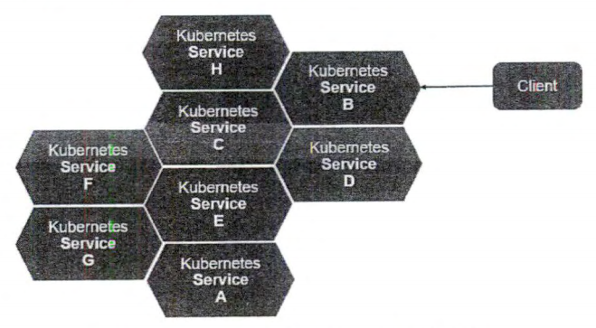

Pod 是k8s 中最重要的基本概念之 ，如图所示是 Pod 的组成示意图，我们看到每个 Pod 都有一个特殊的被称为“根容祥＂的 Pause 容器 Pause 器对应的镜像属千 k8s 平台的一部分，除了 Pause 容器，每个 Pod 都还包含一个或多个紧密相关的用户业务容器。

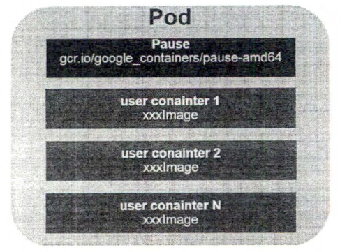

pod的yaml文件定义

```yaml
apiVersion : vl 
kind : Pod 
metadata : 
name: myweb 
labels: 
name : myweb 
spec: 
containers: 
- name : myweb 
image: kubeguideltomcat-app :vl 
ports : 
- containerPort : BOBO
```

Endpoint, 表此 Pod 里的 一个服务进程的对外通信地址

Even 是一个事的记录，记录了事件的最早产生时间、最后重现时间、重复次数、发起者、类型，以及导致此事 的原因等众多信息。

> 当我们发现某个Pod 迟迟无法创建时，可以用 ubectl describe pod xxxx 来查看它的描述信息，以定位问题的成因。


### Label 与Selector标签选择器

一个 Label（标签）是一个 key=value 的键值对，其中的 key、value由用户自己指定。

常用的 Label 示例：

> 版本标签： release : stable release : canary
>
> 环境标签： environment : dev nvironment : qa env onment : production
>
> 架构标签： tier : frontend tier : backend tier : middleware
>
> 分区标签： partition : customerA partition : customerB
>
> 质量管控标签 track : daily track : weekly

Label Selector 表达式

```
narne=redis-slave,env!=preduction 
name notin (php-frontend),env != production
```

Label Selector在Deployment中的应用

​	管理对象RC和Service通过Selector字段设置需要关联的Pod的Label

```
apiVersion : apps/vl
kind: Deployment
spec:
	replicas: 2	# Pod 的副本数量
	selector:	# 目标 Pod 的标签选择器
		matchLabels:	# 用于定义一组Label
		app: myweb
		matchExpressions:  # 用于定义一组Label集合
		- {key: tier, operator : In , values : [frontend]}
	template:	# 用于自动创建新 Pod 副本的模板
		metadata:
			labels:
			app: myweb 
		spec:
```


### Pod与Deployment

大部分 Service 都是无状态的服务，可以由多个 Pod 副本实例提供服务。通常情况下，每个 Service 对应的 Pod 服务实例数量都是固定的，如果一个一个地手工创Pod 实例，就太麻烦了，最好是用模板的思路，即提供一个 Pod 模板 (Template) ，然后由程序根据我们指定的模板自动创建指定数盘的 Pod 实例 。这就是 Deployment 这个源对象所要完成的事情了。

```
apiVersion : apps/vl 
kind: Deployment 
spec: 
	replicas : 2 	# Pod 的副本数量
	selector:		# 目标 Pod 的标签选择器
		matchLabels: 
			app: myweb 
	template:		# 用于自动创建新 Pod 副本的模板
		metadata : 
			labels: 
				app: myweb 
		spec:
```


## 存储类


## 安全类


# 服务发现

Label：对k8s中各种资源进行分类、分组，添加一个具有特别属性的一个标签。

Selector：通过一个过滤的语法进行查找到对应标签的资源

 

## Service

### 1、什么是Service？

Service可以简单的理解为逻辑上的一组Pod。一种可以访问Pod的策略，而且其他Pod可以通过这个Service访问到这个Service代理的Pod。相对于Pod而言，它会有一个固定的名称，一旦创建就固定不变。

### 2、Service类型

**Headless Service（无头服务）**：是Kubernetes中的一种服务类型，它允许直接访问Pod而不使用负载均衡机制。

正常情况下，Kubernetes中的Service会提供一个虚拟IP（Cluster IP）以及负载均衡的功能，将请求分发给后端Pod。这样可以实现服务的可发现性和负载均衡。但有时候，我们需要直接与某个特定的Pod进行通信，而不是通过负载均衡。

Headless Service通过设置Cluster IP为None来实现无头服务。这样，Kubernetes不会为该Service分配虚拟IP，并且DNS查询将返回所有Pod的IP地址。也就是说，每个Pod都有自己的唯一的DNS记录。

使用Headless Service主要有以下优势：

1. 直接访问Pod：无头服务允许直接与单个Pod通信，绕过了默认的负载均衡机制。这对于一些需要与特定Pod进行通信的场景非常有用，比如数据库复制集群中的主节点或分片集群中的各个节点。
2. 自定义服务发现：无头服务通过DNS记录返回所有Pod的IP地址，开发人员可以根据自己的需要自定义服务发现逻辑。这种灵活性使得可以根据实际需求选择适合的服务发现方式。
3. 高级网络配置：无头服务可以与其他网络功能和插件结合使用，例如使用自定义的网络策略或实现高级的路由规则。

需要注意的是，由于无头服务不提供负载均衡，所以需要自行在应用层面处理负载均衡的问题。此外，使用无头服务需要确保Pod的稳定性和可用性，以免因为Pod的变动导致通信中断或错误。

**ClusterIP service（集群内部服务）**：是Kubernetes中的一种服务类型，提供了在集群内部访问服务的能力。

在Kubernetes中，Service是抽象的逻辑概念，用于定义一组Pod的访问方式。而ClusterIP Service作为最常见的一种Service类型，会为每个Service分配一个虚拟IP地址（Cluster IP），同时也会负责将请求路由到后端Pod上。

使用ClusterIP Service可以实现以下优势：

1. 服务发现：ClusterIP Service为后端Pod提供稳定的DNS名称和IP地址，使得其他组件能够方便地与这些Pod通信，并且不需要知道它们的具体IP地址。
2. 负载均衡：ClusterIP Service将请求路由到后端Pod上，可以根据负载均衡策略将请求平均分配到多个Pod上，从而增加应用程序的可靠性和可扩展性。
3. 灵活配置：ClusterIP Service可以通过Labels选择器选择一组符合条件的Pod，这样就可以灵活地配置服务的后端，而不用手动指定每个Pod。

需要注意的是，ClusterIP Service只能在集群内部使用，外部无法直接访问到其提供的服务。如果需要将服务暴露给外部，可以考虑使用NodePort Service或LoadBalancer Service。此外，在使用ClusterIP Service时需要确保Pod的稳定性和可用性，以免因为Pod的变动导致服务中断或错误。

**ExternalName service**：通过返回定义的CNAME别名。

**NodePort service**：在所有安装了kube-proxy的节点上打开一个端口，此端口可以代理至后端Pod，然后集群外部可以使用节点的IP地址和NodePort的端口号访问到集群Pod的服务。NodePort端口范围默认是30000-32767。

**LoadBalancer service**：使用云提供商的负载均衡器公开服务。


### 3、Service资源清单

cat nginx-deploy.yaml

```
apiVersion: apps/v1
kind: Deployment
metadata:
 labels:
  app: nginx
 name: nginx
 namespace: default
spec:
 progressDeadlineSeconds: 600
 replicas: 2
 revisionHistoryLimit: 10
 selector:
  matchLabels:
   app: nginx
 strategy:
  rollingUpdate:
   maxSurge: 25%
   maxUnavailable: 25%
  type: RollingUpdate
 template:
  metadata:
   creationTimestamp: null
   labels:
​    app: nginx
  spec:
   containers:
   \- image: nginx:1.15.2
​    imagePullPolicy: IfNotPresent
​    name: nginx
​    resources: {}
​    terminationMessagePath: /dev/termination-log
​    terminationMessagePolicy: File
​    terminationMessagePath: /dev/termination-log
​    terminationMessagePolicy: File
   dnsPolicy: ClusterFirst
   restartPolicy: Always
   schedulerName: default-scheduler
   securityContext: {}
   terminationGracePeriodSeconds: 30
```

 

```
# cat nginx-svc.yaml
apiVersion: v1
kind: Service
metadata:
 labels:
  app: nginx-svc
 name: nginx-svc
spec:
 ports:
 \- name: http # Service端口的名称
  port: 80 # Service自己的端口, servicea --> serviceb http://serviceb,  http://serviceb:8080 
  protocol: TCP # UDP TCP SCTP default: TCP
  targetPort: 80 # 后端应用的端口
 \- name: https
  port: 443
  protocol: TCP
  targetPort: 443
 selector:
  app: nginx
 sessionAffinity: None
 type: ClusterIP
```


### 3、使用Service代理k8s外部应用

使用场景：

Ø 希望在生产环境中使用某个固定的名称而非IP地址进行访问外部的中间件服务

Ø 希望Service指向另一个Namespace中或其他集群中的服务

Ø 某个项目正在迁移至k8s集群，但是一部分服务仍然在集群外部，此时可以使用service代理至k8s集群外部的服务

```
\# cat nginx-svc-external.yaml 
apiVersion: v1
kind: Service
metadata:
 labels:
  app: nginx-svc-external
 name: nginx-svc-external
spec:
 ports:
 \- name: http # Service端口的名称
  port: 80 # Service自己的端口, servicea --> serviceb http://serviceb,  http://serviceb:8080 
  protocol: TCP # UDP TCP SCTP default: TCP
  targetPort: 80 # 后端应用的端口
 sessionAffinity: None
 type: ClusterIP
```


```
# cat nginx-ep-external.yaml 
apiVersion: v1
kind: Endpoints
metadata:
 labels:
  app: nginx-svc-external
 name: nginx-svc-external
 namespace: default
subsets:
- addresses:
 - ip: 140.205.94.189 
 ports:
 - name: http
  port: 80
  protocol: TCP
```

 

 

### 4、使用Service反代域名

```
# cat nginx-externalName.yaml 
apiVersion: v1
kind: Service
metadata:
 labels:
  app: nginx-externalname
 name: nginx-externalname
spec:
 type: ExternalName
 externalName: www.baidu.com
```

 

## Label & Selector

当k8s对系统的任何API对象如Pod和节点进行“分组”时，会对其添加Label（key=value形式的“键-值对”）用以精准地选择对应的API对象。而Selector（标签选择器）则是针对匹配对象的查询方法。注：键-值对就是key-value pair。

例如，常用的标签tier可用于区分容器的属性，如frontend、backend；或者一个release_track用于区分容器的环境，如canary、production等。

### 定义Label

应用案例：

公司与xx银行有一条专属的高速光纤通道，此通道只能与192.168.7.0网段进行通信，因此只能将与xx银行通信的应用部署到192.168.7.0网段所在的节点上，此时可以对节点进行Label（即加标签）：

```
[root@k8s-master01 ~]# kubectl label node k8s-node02 region=subnet7
node/k8s-node02 labeled
```

然后，可以通过Selector对其筛选：

```
[root@k8s-master01 ~]# kubectl get no -l region=subnet7
NAME     STATUS  ROLES   AGE   VERSION
k8s-node02  Ready   <none>  3d17h  v1.17.3
```

最后，在Deployment或其他控制器中指定将Pod部署到该节点：

```
containers:
 ......
dnsPolicy: ClusterFirst
nodeSelector:
 region: subnet7
restartPolicy: Always
......
```

也可以用同样的方式对Service进行Label：

```
[root@k8s-master01 ~]# kubectl label svc canary-v1 -n canary-production env=canary version=v1
service/canary-v1 labeled
```

查看Labels：

```
[root@k8s-master01 ~]# kubectl get svc -n canary-production --show-labels
NAME     TYPE     CLUSTER-IP    EXTERNAL-IP  PORT(S)   AGE  LABELS
canary-v1  ClusterIP  10.110.253.62  <none>     8080/TCP  24h  env=canary,version=v1
```

还可以查看所有Version为v1的svc：

```
[root@k8s-master01 canary]# kubectl get svc --all-namespaces -l version=v1
NAMESPACE      NAME     TYPE     CLUSTER-IP    EXTERNAL-IP  PORT(S)   AGE
canary-production  canary-v1  ClusterIP  10.110.253.62  <none>     8080/TCP  25h
```

其他资源的Label方式相同。

### Selector条件匹配

Selector主要用于资源的匹配，只有符合条件的资源才会被调用或使用，可以使用该方式对集群中的各类资源进行分配。

假如对Selector进行条件匹配，目前已有的Label如下：

```
[root@k8s-master01 ~]# kubectl get svc --show-labels
NAME      TYPE     CLUSTER-IP    EXTERNAL-IP  PORT(S)   AGE   LABELS
details    ClusterIP  10.99.9.178    <none>     9080/TCP  45h   app=details
k8s   ClusterIP  10.96.0.1     <none>     443/TCP   3d19h  component=apiserver,provider=k8s
nginx     ClusterIP  10.106.194.137  <none>     80/TCP   2d21h  app=productpage,version=v1
nginx-v2    ClusterIP  10.108.176.132  <none>     80/TCP   2d20h  <none>
productpage  ClusterIP  10.105.229.52   <none>     9080/TCP  45h   app=productpage,tier=frontend
ratings    ClusterIP  10.96.104.95   <none>     9080/TCP  45h   app=ratings
reviews    ClusterIP  10.102.188.143  <none>     9080/TCP  45h   app=reviews
```

选择app为reviews或者productpage的svc：

```
[root@k8s-master01 ~]# kubectl get svc -l  'app in (details, productpage)' --show-labels
NAME      TYPE     CLUSTER-IP    EXTERNAL-IP  PORT(S)   AGE   LABELS
details    ClusterIP  10.99.9.178    <none>     9080/TCP  45h   app=details
nginx     ClusterIP  10.106.194.137  <none>     80/TCP   2d21h  app=productpage,version=v1
productpage  ClusterIP  10.105.229.52   <none>     9080/TCP  45h   app=productpage,tier=frontend
```

选择app为productpage或reviews但不包括version=v1的svc：

```
[root@k8s-master01 ~]# kubectl get svc -l  version!=v1,'app in (details, productpage)' --show-labels
NAME      TYPE     CLUSTER-IP    EXTERNAL-IP  PORT(S)   AGE  LABELS
details    ClusterIP  10.99.9.178   <none>     9080/TCP  45h  app=details
productpage  ClusterIP  10.105.229.52  <none>     9080/TCP  45h  app=productpage,tier=frontend
```

选择labelkey名为app的svc：

```
[root@k8s-master01 ~]# kubectl get svc -l app --show-labels
NAME      TYPE     CLUSTER-IP    EXTERNAL-IP  PORT(S)   AGE   LABELS
details    ClusterIP  10.99.9.178    <none>     9080/TCP  45h   app=details
nginx     ClusterIP  10.106.194.137  <none>     80/TCP   2d21h  app=productpage,version=v1
productpage  ClusterIP  10.105.229.52   <none>     9080/TCP  45h   app=productpage,tier=frontend
ratings    ClusterIP  10.96.104.95   <none>     9080/TCP  45h   app=ratings
reviews    ClusterIP  10.102.188.143  <none>     9080/TCP  45h   app=reviews
```

### 修改标签（Label）

在实际使用中，Label的更改是经常发生的事情，可以使用overwrite参数修改标签。

修改标签，比如将version=v1改为version=v2：

```
[root@k8s-master01 canary]# kubectl get svc -n canary-production --show-labels
NAME     TYPE     CLUSTER-IP    EXTERNAL-IP  PORT(S)   AGE  LABELS
canary-v1  ClusterIP  10.110.253.62  <none>     8080/TCP  26h  env=canary,version=v1
[root@k8s-master01 canary]# kubectl label svc canary-v1 -n canary-production version=v2 **--overwrite**
service/canary-v1 labeled
[root@k8s-master01 canary]# kubectl get svc -n canary-production --show-labels
NAME     TYPE     CLUSTER-IP    EXTERNAL-IP  PORT(S)   AGE  LABELS
canary-v1  ClusterIP  10.110.253.62  <none>     8080/TCP  26h  env=canary,version=v2
```

### 删除标签（Label）

删除标签，比如删除version：

```
[root@k8s-master01 canary]# kubectl label svc canary-v1 -n canary-production **version-**
service/canary-v1 labeled
[root@k8s-master01 canary]# kubectl get svc -n canary-production --show-labels
NAME     TYPE     CLUSTER-IP    EXTERNAL-IP  PORT(S)   AGE  LABELS
canary-v1  ClusterIP  10.110.253.62  <none>     8080/TCP  26h  env=canary
```


## Ingress

### 1、ngress概念

通俗来讲，ingress和之前提到的Service、Deployment，也是一个k8s的资源类型，ingress用于实现用域名的方式访问k8s内部应用。

 

### 2、Ingress安装

首先安装helm管理工具：https://helm.sh/docs/intro/install/

使用helm安装ingress：[https://k8s.github.io/ingress-nginx/deploy/#using-helm](#using-helm)

1. 添加ingress的helm仓库（课程讲解的版本已经上传至百度网盘）

```
helm repo add ingress-nginx https://k8s.github.io/ingress-nginx
```

2. 下载ingress的helm包至本地

```
helm pull ingress-nginx/ingress-nginx
```

3. 更改对应的配置

```
tar xf ingress-nginx-3.6.0.tgz
cd ingress-nginx
vim values.yaml
```

4. 需要修改的位置

a) Controller和admissionWebhook的镜像地址，需要将公网镜像同步至公司内网镜像仓库（和课程不一致的版本，需要自行同步gcr镜像的，可以百度查一下使用阿里云同步gcr的镜像，也可以参考这个连接https://blog.csdn.net/weixin_39961559/article/details/80739352，或者参考这个连接： https://blog.csdn.net/sinat_35543900/article/details/103290782）

b) hostNetwork设置为true

c) dnsPolicy设置为 ClusterFirstWithHostNet

d) NodeSelector添加ingress: "true"部署至指定节点

e) 类型更改为kind: DaemonSet

5. 部署ingress

给需要部署ingress的节点上打标签

kubectl label node k8s-master03 ingress=true

kubectl create ns ingress-nginx

helm install ingress-nginx -n ingress-nginx .

6. 将ingress controller部署至Node节点（ingress controller不能部署在master节点，需要安装视频中的步骤将ingress controller部署至Node节点，生产环境最少三个ingress controller，并且最好是独立的节点）

kubectl label node k8s-node01 ingress=true

kubectl label node k8s-master03 ingress-

 

### 3、Ingress入门使用

创建一个ingress：

```
# cat ingress.yaml 
apiVersion: networking.k8s.io/v1beta1 # networking.k8s.io/v1 / extensions/v1beta1 
kind: Ingress
metadata:
 annotations:
  k8s.io/ingress.class: "nginx"
 name: example
spec:
 rules: # 一个Ingress可以配置多个rules
 - host: foo.bar.com # 域名配置，可以不写，匹配*， *.bar.com
  http:
   paths: # 相当于nginx的location配合，同一个host可以配置多个path / /abc
   - backend:
​     serviceName: nginx-svc 
​     servicePort: 80
​    path: /
```

创建一个多域名ingress

```
# cat ingress-mulDomain.yaml 
apiVersion: networking.k8s.io/v1beta1 # networking.k8s.io/v1 / extensions/v1beta1 
kind: Ingress
metadata:
 annotations:
  k8s.io/ingress.class: "nginx"
 name: example
spec:
 rules: # 一个Ingress可以配置多个rules
 - host: foo.bar.com # 域名配置，可以不写，匹配*， *.bar.com
  http:
   paths: # 相当于nginx的location配合，同一个host可以配置多个path / /abc
   - backend:
​     serviceName: nginx-svc 
​     servicePort: 80
​    path: /
 - host: foo2.bar.com # 域名配置，可以不写，匹配*， *.bar.com
  http:
   paths: # 相当于nginx的location配合，同一个host可以配置多个path / /abc
   - backend:
​     serviceName: nginx-svc-external
​     servicePort: 80
​    path: /
```


# 配置管理

## ConfigMap&Secret

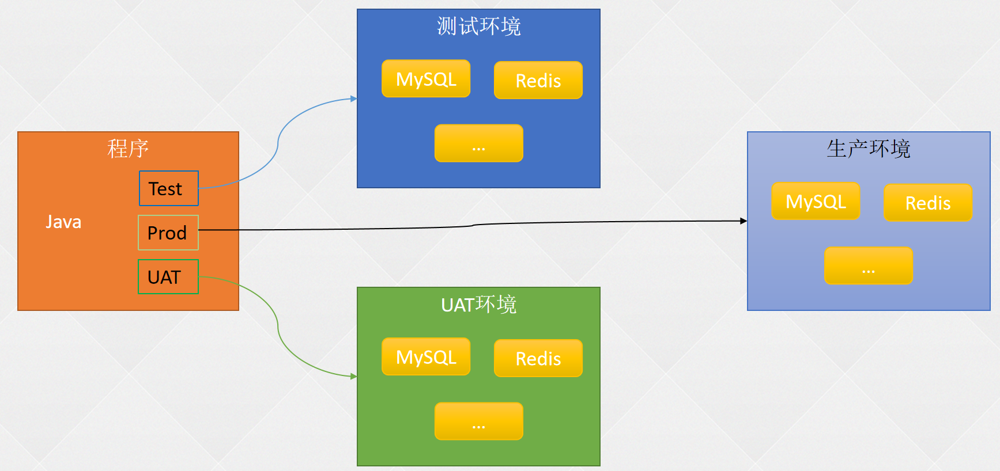


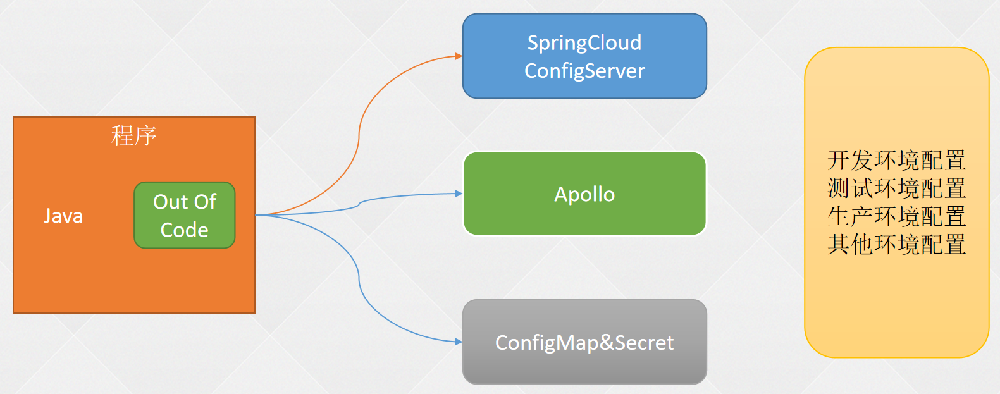


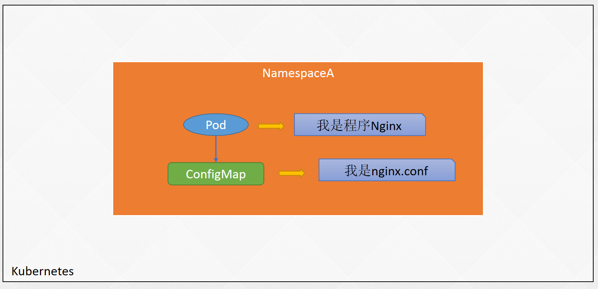

创建ConfigMap的几种形式

```
kubectl create configmap -h
kubectl create cm cmfromdir --from-file=conf/
kubectl create cm cmfromfile --from-file=conf/redis.conf 
kubectl create cm cmspecialname --from-file=game-conf=game.conf
kubectl create cm cmspecialname2 --from-file=game-conf=game.conf  --from-file=redis-conf=redis.conf
kubectl create cm gameenvcm --from-env-file=game.conf
kubectl create cm envfromliteral --from-literal=level=INFO --from-literal=PASSWORD=redis123
kubectl create -f cm.yaml
```

使用valueFrom定义环境变量

```
kubectl create deploy dp-cm \ 
--image=registry.cn-beijing.aliyuncs.com/dotbalo/nginx \
--dry-run=client -oyaml > dp-cm.yaml

env:
        - name: TEST_ENV
          value: testenv
        - name: LIVES
          valueFrom:
            configMapKeyRef:
              name: gameenvcm
              key: lives
        - name: test_env
          valueFrom:
            configMapKeyRef:
              name: gameenvcm
              key: test_env
```


使用envFrom定义环境变量

```
containers:
      - image: registry.cn-beijing.aliyuncs.com/dotbalo/nginx 
        name: nginx
        envFrom:
        - configMapRef:
            name: gameenvcm
          prefix: fromCm_
        env:
        - name: TEST_ENV
          value: testenv
        - name: LIVES
          valueFrom:
            configMapKeyRef:
              name: gameenvcm
              key: lives
        #- name: test_env
        #  valueFrom:
        #    configMapKeyRef:
        #      name: gameenvcm
        #      key: test_env
```

以文件的形式挂载ConfigMap

```
 spec:
      containers:
        - image: registry.cn-beijing.aliyuncs.com/dotbalo/nginx 
          name: nginx
          volumeMounts:
            - name: redisconf
              mountPath: /etc/config
            - name: cmfromfile 
              mountPath: /etc/config2
      volumes:
        - name: redisconf
          configMap:
            name: redis-conf
        - name: cmfromfile
          configMap:
            name: cmfromfile
```

自定义挂载权限及名称

```
volumes:
        - name: redisconf
          configMap:
            name: redis-conf
        - name: cmfromfile
          configMap:
            name: cmfromfile
            items:
              - key: redis.conf
                path: redis.conf.bak
              - key: redis.conf
                path: redis.conf.bak2
                mode: 0644 # 优先级高
            defaultMode: 0666  # 328
```

### Secret常用类型

```
Opaque：通用型Secret，默认类型；
k8s.io/service-account-token：作用于ServiceAccount，包含一个令牌，用于标识API服务账户；
k8s.io/dockerconfigjson：下载私有仓库镜像使用的Secret，
     和宿主机的/root/.docker/config.json一致，宿主机登录后即可产生该文件；
k8s.io/basic-auth：用于使用基本认证（账号密码）的Secret，可以使用Opaque取代；
k8s.io/ssh-auth：用于存储ssh密钥的Secret；
k8s.io/tls：用于存储HTTPS域名证书文件的Secret，可以被Ingress使用；
bootstrap.k8s.io/token：一种简单的 bearer token，
     用于创建新集群或将新节点添加到现有集群，在集群安装时可用于自动颁发集群的证书。
```

Secret：https://k8s.io/docs/concepts/configuration/secret/#creating-a-secret


### 使用Secret拉取私有仓库镜像

```
kubectl create secret docker-registry myregistrykey \
--docker-server=DOCKER_REGISTRY_SERVER \
--docker-username=DOCKER_USER \
--docker-password=DOCKER_PASSWORD \
--docker-email=DOCKER_EMAIL
```


```
docker-registry：指定Secret的类型
myregistrykey： Secret名称
DOCKER_REGISTRY_SERVER：镜像仓库地址
DOCKER_USER：镜像仓库用户名，需要有拉取镜像的权限
DOCKER_PASSWORD：镜像仓库密码
DOCKER_EMAIL：邮箱信息，可以为空
```


```
 spec:
      imagePullSecrets:
      - name: myregistry
      containers:
```

### 使用Secret管理HTTPS证书

```
openssl req -x509 -nodes -days 365 \
-newkey rsa:2048 -keyout tls.key -out tls.crt -subj "/CN=test.com"

kubectl -n default create secret tls nginx-test-tls --key=tls.key --cert=tls.crt
```


```
apiVersion: networking.k8s.io/v1beta1
kind: Ingress
metadata:
  name: nginx-https-test
  namespace: default
  annotations:
    k8s.io/ingress.class: "nginx"
spec:
  rules:
  - host: https-test.com
    http:
      paths:
      - backend:
          serviceName: nginx-svc
          servicePort: 80
  tls:
   - secretName: nginx-test-tls
```

ConfigMap&Secret热更新

```
kubectl  create cm nginx-conf --from-file=nginx.conf  --dry-run=client -oyaml | kubectl replace -f -
```


ConfigMap&Secret使用限制

```
提前场景ConfigMap和Secret
引用Key必须存在
envFrom、valueFrom无法热更新环境变量
envFrom配置环境变量，如果key是无效的，它会忽略掉无效的key
ConfigMap和Secret必须要和Pod或者是引用它资源在同一个命名空间
subPath也是无法热更新的
ConfigMap和Secret最好不要太大
```


## Secret


## DownwardAPI


# k8s常用对象

## 1. Master

集群的控制节点，负责整个集群的管理和控制，k8s的所有的命令基本都是发给Master，由它来负责具体的执行过程。

**Master的组件**

- kube-apiserver：资源增删改查的入口
- kube-controller-manager：资源对象的大总管
- kube-scheduler：负责资源调度（Pod调度）
- etcd Server:k8s的所有的资源对象的数据保存在etcd中。

## 2. Node

Node是集群的工作负载节点，默认情况kubelet会向Master注册自己，一旦Node被纳入集群管理范围，kubelet会定时向Master汇报自身的情报，包括操作系统，Docker版本，机器资源情况等。

如果Node超过指定时间不上报信息，会被Master判断为“失联”，标记为Not Ready，随后Master会触发Pod转移。

### 2.1. Node的组件

- kubelet:Pod的管家，与Master通信
- kube-proxy：实现k8s Service的通信与负载均衡机制的重要组件
- Docker：容器的创建和管理

### 2.2. Node相关命令

kubectl get nodes

kuebctl describe node {node_name}

### 2.3. describe命令的Node信息

- Node基本信息：名称、标签、创建时间等
- Node当前的状态，Node启动后会进行自检工作，磁盘是否满，内存是否不足，若都正常则切换为Ready状态。
- Node的主机地址与主机名
- Node上的资源总量：CPU,内存，最大可调度Pod数量等
- Node可分配资源量：当前Node可用于分配的资源量
- 主机系统信息：主机唯一标识符UUID，Linux kernel版本号，操作系统，k8s版本，kubelet与kube-proxy版本
- 当前正在运行的Pod列表及概要信息
- 已分配的资源使用概要，例如资源申请的最低、最大允许使用量占系统总量的百分比
- Node相关的Event信息。

## 3. Pod

Pod是k8s中操作的基本单元。每个Pod中有个根容器(Pause容器)，Pause容器的状态代表整个容器组的状态，其他业务容器共享Pause的IP，即Pod IP，共享Pause挂载的Volume，这样简化了同个Pod中不同容器之间的网络问题和文件共享问题。

[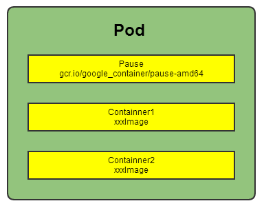](https://camo.githubusercontent.com/61b4dda3dfb2d008e8a5a102f5b031b57f2ac68e9ba53ec053d2d85e8be46e60/68747470733a2f2f7265732e636c6f7564696e6172792e636f6d2f647178746e3069636b2f696d6167652f75706c6f61642f76313531303537383933302f61727469636c652f6b756265726e657465732f636f6e636570742f706f642e706e67)

1. k8s集群中，同宿主机的或不同宿主机的Pod之间要求能够TCP/IP直接通信，因此采用虚拟二层网络技术来实现，例如Flannel，Openvswitch(OVS)等，这样在同个集群中，不同的宿主机的Pod IP为不同IP段的IP，集群中的所有Pod IP都是唯一的，不同Pod之间可以直接通信。
2. Pod有两种类型：普通Pod和静态Pod。静态Pod即不通过K8S调度和创建，直接在某个具体的Node机器上通过具体的文件来启动。普通Pod则是由K8S创建、调度，同时数据存放在ETCD中。
3. Pod IP和具体的容器端口（ContainnerPort）组成一个具体的通信地址，即Endpoint。一个Pod中可以存在多个容器，可以有多个端口，Pod IP一样，即有多个Endpoint。
4. Pod Volume是定义在Pod之上，被各个容器挂载到自己的文件系统中，可以用分布式文件系统实现后端存储功能。
5. Pod中的Event事件可以用来排查问题，可以通过kubectl describe pod xxx 来查看对应的事件。
6. 每个Pod可以对其能使用的服务器上的计算资源设置限额，一般为CPU和Memory。K8S中一般将千分之一个的CPU配置作为最小单位，用m表示，是一个绝对值，即100m对于一个Core的机器还是48个Core的机器都是一样的大小。Memory配额也是个绝对值，单位为内存字节数。
7. 资源配额的两个参数

- Requests:该资源的最小申请量，系统必须满足要求。
- Limits:该资源最大允许使用量，当超过该量，K8S会kill并重启Pod。

[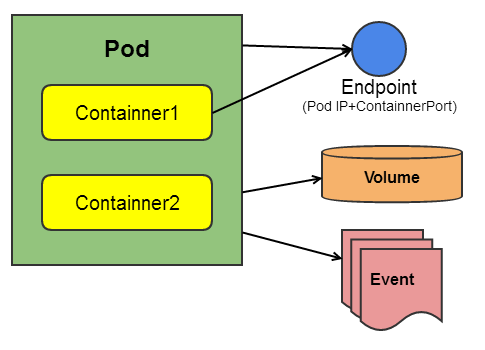](https://camo.githubusercontent.com/ee8c02edc12255e965a4b1722f5e4b7def780411a53464495c4ae16150b9749a/68747470733a2f2f7265732e636c6f7564696e6172792e636f6d2f647178746e3069636b2f696d6167652f75706c6f61642f76313531303537383933302f61727469636c652f6b756265726e657465732f636f6e636570742f706f64322e706e67)

## 4. Label

1. Label是一个键值对，可以附加在任何对象上，比如Node,Pod,Service,RC等。Label和资源对象是多对多的关系，即一个Label可以被添加到多个对象上，一个对象也可以定义多个Label。
2. Label的作用主要用来实现精细的、多维度的资源分组管理，以便进行资源分配，调度，配置，部署等工作。
3. Label通俗理解就是“标签”，通过标签来过滤筛选指定的对象，进行具体的操作。k8s通过Label Selector(标签选择器)来筛选指定Label的资源对象，类似SQL语句中的条件查询（WHERE语句）。
4. Label Selector有基于等式和基于集合的两种表达方式，可以多个条件进行组合使用。

- 基于等式：name=redis-slave（匹配name=redis-slave的资源对象）;env!=product(匹配所有不具有标签env=product的资源对象)
- 基于集合：name in (redis-slave,redis-master);name not in (php-frontend)（匹配所有不具有标签name=php-frontend的资源对象）

**使用场景**

1. kube-controller进程通过资源对象RC上定义的Label Selector来筛选要监控的Pod副本数，从而实现副本数始终保持预期数目。
2. kube-proxy进程通过Service的Label Selector来选择对应Pod，自动建立每个Service到对应Pod的请求转发路由表，从而实现Service的智能负载均衡机制。
3. kube-scheduler实现Pod定向调度：对Node定义特定的Label，并且在Pod定义文件中使用NodeSelector标签调度策略。

## 5. Replication Controller(RC)

RC是k8s系统中的核心概念，定义了一个期望的场景。

主要包括：

- Pod期望的副本数（replicas）
- 用于筛选目标Pod的Label Selector
- 用于创建Pod的模板（template）

RC特性说明：

1. Pod的缩放可以通过以下命令实现：kubectl scale rc redis-slave --replicas=3
2. 删除RC并不会删除该RC创建的Pod，可以将副本数设置为0，即可删除对应Pod。或者通过kubectl stop /delete命令来一次性删除RC和其创建的Pod。
3. 改变RC中Pod模板的镜像版本可以实现滚动升级（Rolling Update）。具体操作见https://k8s.io/docs/tasks/run-application/rolling-update-replication-controller/
4. k8s1.2以上版本将RC升级为Replica Set，它与当前RC的唯一区别在于Replica Set支持基于集合的Label Selector(Set-based selector)，而旧版本RC只支持基于等式的Label Selector(equality-based selector)。
5. k8s1.2以上版本通过Deployment来维护Replica Set而不是单独使用Replica Set。即控制流为：Delpoyment→Replica Set→Pod。即新版本的Deployment+Replica Set替代了RC的作用。

## 6. Deployment

Deployment是k8s 1.2引入的概念，用来解决Pod的编排问题。Deployment可以理解为RC的升级版（RC+Reolicat Set）。特点在于可以随时知道Pod的部署进度，即对Pod的创建、调度、绑定节点、启动容器完整过程的进度展示。

**使用场景**

1. 创建一个Deployment对象来生成对应的Replica Set并完成Pod副本的创建过程。
2. 检查Deployment的状态来确认部署动作是否完成（Pod副本的数量是否达到预期值）。
3. 更新Deployment以创建新的Pod(例如镜像升级的场景)。
4. 如果当前Deployment不稳定，回退到上一个Deployment版本。
5. 挂起或恢复一个Deployment。

可以通过kubectl describe deployment来查看Deployment控制的Pod的水平拓展过程。

## 7. Horizontal Pod Autoscaler(HPA)

Horizontal Pod Autoscaler(HPA)即Pod横向自动扩容，与RC一样也属于k8s的资源对象。

HPA原理：通过追踪分析RC控制的所有目标Pod的负载变化情况，来确定是否针对性调整Pod的副本数。

Pod负载度量指标：

- CPUUtilizationPercentage：Pod所有副本自身的CPU利用率的平均值。即当前Pod的CPU使用量除以Pod Request的值。
- 应用自定义的度量指标，比如服务每秒内响应的请求数（TPS/QPS）。

## 8. Service(服务)

### 8.1. Service概述

[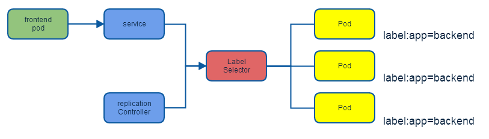](https://camo.githubusercontent.com/f3a695a5b8be96e9c3c98b9d6425b2b56505d327b433e3afd787895202e63a0e/68747470733a2f2f7265732e636c6f7564696e6172792e636f6d2f647178746e3069636b2f696d6167652f75706c6f61642f76313531303537383933302f61727469636c652f6b756265726e657465732f636f6e636570742f736572766963652e706e67)

Service定义了一个服务的访问入口地址，前端应用通过这个入口地址访问其背后的一组由Pod副本组成的集群实例，Service与其后端的Pod副本集群之间是通过Label Selector来实现“无缝对接”。RC保证Service的Pod副本实例数目保持预期水平。

### 8.2. k8s的服务发现机制

主要通过kube-dns这个组件来进行DNS方式的服务发现。

### 8.3. 外部系统访问Service的问题

| IP类型     | 说明             |
| ---------- | ---------------- |
| Node IP    | Node节点的IP地址 |
| Pod IP     | Pod的IP地址      |
| Cluster IP | Service的IP地址  |

### 8.3.1. Node IP

NodeIP是集群中每个节点的物理网卡IP地址，是真实存在的物理网络，k8s集群之外的节点访问k8s内的某个节点或TCP/IP服务的时候，需要通过NodeIP进行通信。

### 8.3.2. Pod IP

Pod IP是每个Pod的IP地址，是Docker Engine根据docker0网桥的IP段地址进行分配的，是一个虚拟二层网络，集群中一个Pod的容器访问另一个Pod中的容器，是通过Pod IP进行通信的，而真实的TCP/IP流量是通过Node IP所在的网卡流出的。

### 8.3.3. Cluster IP

1. Service的Cluster IP是一个虚拟IP，只作用于Service这个对象，由k8s管理和分配IP地址（来源于Cluster IP地址池）。
2. Cluster IP无法被ping通，因为没有一个实体网络对象来响应。
3. Cluster IP结合Service Port组成的具体通信端口才具备TCP/IP通信基础，属于k8s集群内，集群外访问该IP和端口需要额外处理。
4. k8s集群内Node IP 、Pod IP、Cluster IP之间的通信采取k8s自己的特殊的路由规则，与传统IP路由不同。

### 8.3.4. 外部访问k8s集群

通过宿主机与容器端口映射的方式进行访问，例如：Service定位文件如下：

可以通过任意Node的IP 加端口访问该服务。也可以通过Nginx或HAProxy来设置负载均衡。

## 9. Volume(存储卷)

### 9.1. Volume的功能

1. Volume是Pod中能够被多个容器访问的共享目录，可以让容器的数据写到宿主机上或者写文件到网络存储中
2. 可以实现容器配置文件集中化定义与管理，通过ConfigMap资源对象来实现。

### 9.2. Volume的特点

k8s中的Volume与Docker的Volume相似，但不完全相同。

1. k8s上Volume定义在Pod上，然后被一个Pod中的多个容器挂载到具体的文件目录下。
2. k8s的Volume与Pod生命周期相关而不是容器是生命周期，即容器挂掉，数据不会丢失但是Pod挂掉，数据则会丢失。
3. k8s中的Volume支持多种类型的Volume：Ceph、GlusterFS等分布式系统。

### 9.3. Volume的使用方式

先在Pod上声明一个Volume，然后容器引用该Volume并Mount到容器的某个目录。

### 9.4 Volume类型

#### 9.4.1 emptyDir

emptyDir Volume是在Pod分配到Node时创建的，初始内容为空，无须指定宿主机上对应的目录文件，由K8S自动分配一个目录，当Pod被删除时，对应的emptyDir数据也会永久删除。

**作用**：

1. 临时空间，例如程序的临时文件，无须永久保留
2. 长时间任务的中间过程CheckPoint的临时保存目录
3. 一个容器需要从另一个容器中获取数据的目录（即多容器共享目录）

**说明**：

目前用户无法设置emptyVolume的使用介质，如果kubelet的配置使用硬盘则emptyDir将创建在该硬盘上。

#### 9.4.2 hostPath

hostPath是在Pod上挂载宿主机上的文件或目录。

**作用**：

1. 容器应用日志需要持久化时，可以使用宿主机的高速文件系统进行存储
2. 需要访问宿主机上Docker引擎内部数据结构的容器应用时，可以通过定义hostPath为宿主机/var/lib/docker目录，使容器内部应用可以直接访问Docker的文件系统。

**注意点：**

1. 在不同的Node上具有相同配置的Pod可能会因为宿主机上的目录或文件不同导致对Volume上目录或文件的访问结果不一致。
2. 如果使用了资源配额管理，则k8s无法将hostPath在宿主机上使用的资源纳入管理。

#### 9.4.3 gcePersistentDisk

表示使用谷歌公有云提供的永久磁盘（Persistent Disk ,PD）存放Volume的数据，它与EmptyDir不同，PD上的内容会被永久保存。当Pod被删除时，PD只是被卸载时，但不会被删除。需要先创建一个永久磁盘，才能使用gcePersistentDisk。

使用gcePersistentDisk的限制条件：

- Node(运行kubelet的节点)需要是GCE虚拟机。
- 虚拟机需要与PD存在于相同的GCE项目中和Zone中。

## 10. Persistent Volume

Volume定义在Pod上，属于“计算资源”的一部分，而Persistent Volume和Persistent Volume Claim是网络存储，简称PV和PVC，可以理解为k8s集群中某个网络存储中对应的一块存储。

- PV是网络存储，不属于任何Node，但可以在每个Node上访问。
- PV不是定义在Pod上，而是独立于Pod之外定义。
- PV常见类型：GCE Persistent Disks、NFS、RBD等。

PV是有状态的对象，状态类型如下：

- Available:空闲状态
- Bound:已经绑定到某个PVC上
- Released:对应的PVC已经删除，但资源还没有回收
- Failed:PV自动回收失败

## 11. Namespace

Namespace即命名空间，主要用于多租户的资源隔离，通过将资源对象分配到不同的Namespace上，便于不同的分组在共享资源的同时可以被分别管理。

k8s集群启动后会默认创建一个“default”的Namespace。可以通过kubectl get namespaecs查看。

可以通过kubectl config use-context `namespace`配置当前k8s客户端的环境，通过kubectl get pods获取当前namespace的Pod。或者通过kubectl get pods --namespace=`NAMESPACE`来获取指定namespace的Pod。

**Namespace yaml文件的定义**

## 12. Annotation(注解)

Annotation与Label类似，也使用key/value的形式进行定义，Label定义元数据（Metadata）,Annotation定义“附加”信息。

通常Annotation记录信息如下：

- build信息，release信息，Docker镜像信息等。
- 日志库、监控库等。


