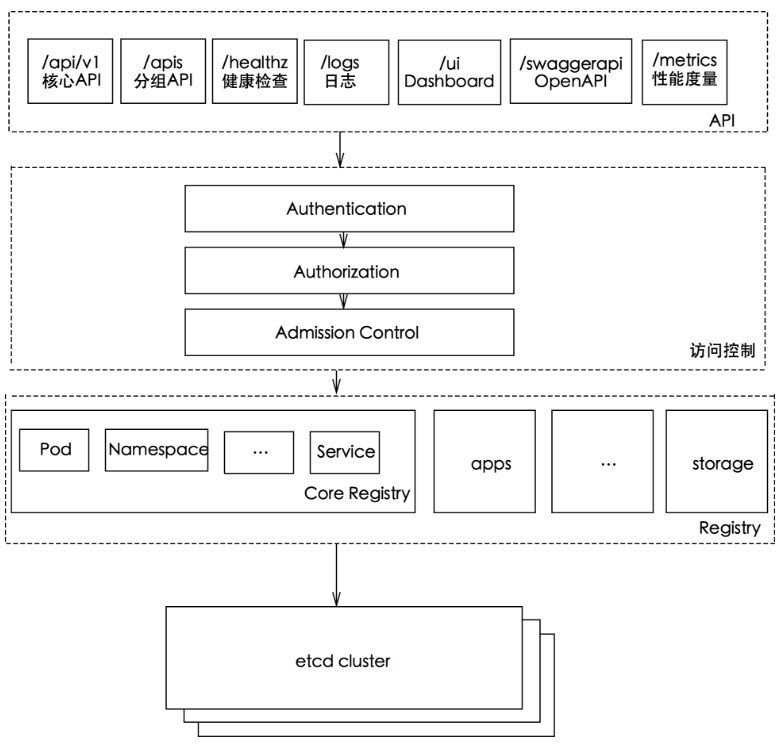
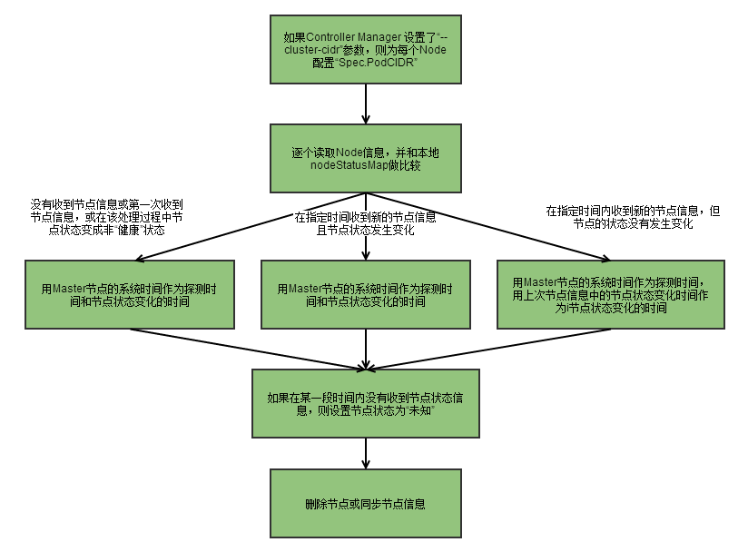
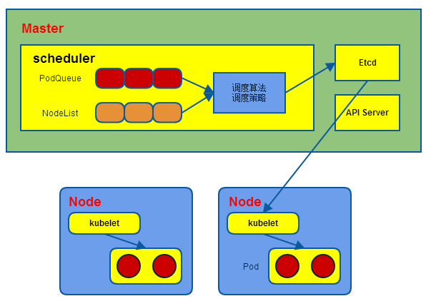

# Api Server

# 1. API Server简介

k8s API Server提供了k8s各类资源对象（pod,RC,Service等）的增删改查及watch等HTTP Rest接口，是整个系统的数据总线和数据中心。

kubernetes API Server的功能：

1. 提供了集群管理的REST API接口(包括认证授权、数据校验以及集群状态变更)；
2. 提供其他模块之间的数据交互和通信的枢纽（其他模块通过API Server查询或修改数据，只有API Server才直接操作etcd）;
3. 是资源配额控制的入口；
4. 拥有完备的集群安全机制.

**kube-apiserver工作原理图**

[](https://camo.githubusercontent.com/734858a0f40c467feb11098f431f16de50d78d4923d03a468228f0a96107cfc2/687474703a2f2f7265732e636c6f7564696e6172792e636f6d2f647178746e3069636b2f696d6167652f75706c6f61642f76313531303537393031372f61727469636c652f6b756265726e657465732f636f72652f6b7562652d6170697365727665722e706e67)

# 2. 如何访问kubernetes API

k8s通过kube-apiserver这个进程提供服务，该进程运行在单个k8s-master节点上。默认有两个端口。

## 2.1. 本地端口

1. 该端口用于接收HTTP请求；
2. 该端口默认值为8080，可以通过API Server的启动参数“--insecure-port”的值来修改默认值；
3. 默认的IP地址为“localhost”，可以通过启动参数“--insecure-bind-address”的值来修改该IP地址；
4. 非认证或授权的HTTP请求通过该端口访问API Server。

## 2.2. 安全端口

1. 该端口默认值为6443，可通过启动参数“--secure-port”的值来修改默认值；
2. 默认IP地址为非本地（Non-Localhost）网络端口，通过启动参数“--bind-address”设置该值；
3. 该端口用于接收HTTPS请求；
4. 用于基于Tocken文件或客户端证书及HTTP Base的认证；
5. 用于基于策略的授权；
6. 默认不启动HTTPS安全访问控制。

## 2.3. 访问方式

Kubernetes REST API可参考https://kubernetes.io/docs/api-reference/v1.6/

## 2.3.1. curl

```
curl localhost:8080/api
curl localhost:8080/api/v1/pods
curl localhost:8080/api/v1/services
curl localhost:8080/api/v1/replicationcontrollers
```


## 2.3.2. Kubectl Proxy

Kubectl Proxy代理程序既能作为API Server的反向代理，也能作为普通客户端访问API Server的代理。通过master节点的8080端口来启动该代理程序。

kubectl proxy --port=8080 &

具体见kubectl proxy --help

```
[root@node5 ~]# kubectl proxy --help
To proxy all of the kubernetes api and nothing else, use:
kubectl proxy --api-prefix=/
To proxy only part of the kubernetes api and also some static files:
kubectl proxy --www=/my/files --www-prefix=/static/ --api-prefix=/api/
The above lets you 'curl localhost:8001/api/v1/pods'.
To proxy the entire kubernetes api at a different root, use:
kubectl proxy --api-prefix=/custom/
The above lets you 'curl localhost:8001/custom/api/v1/pods'
Usage:
  kubectl proxy [--port=PORT] [--www=static-dir] [--www-prefix=prefix] [--api-prefix=prefix] [flags]
Examples:
# Run a proxy to kubernetes apiserver on port 8011, serving static content from ./local/www/
$ kubectl proxy --port=8011 --www=./local/www/
# Run a proxy to kubernetes apiserver on an arbitrary local port.
# The chosen port for the server will be output to stdout.
$ kubectl proxy --port=0
# Run a proxy to kubernetes apiserver, changing the api prefix to k8s-api
# This makes e.g. the pods api available at localhost:8011/k8s-api/v1/pods/
$ kubectl proxy --api-prefix=/k8s-api
Flags:
      --accept-hosts="^localhost$,^127//.0//.0//.1$,^//[::1//]$": Regular expression for hosts that the proxy should accept.
      --accept-paths="^/.*": Regular expression for paths that the proxy should accept.
      --api-prefix="/": Prefix to serve the proxied API under.
      --disable-filter[=false]: If true, disable request filtering in the proxy. This is dangerous, and can leave you vulnerable to XSRF attacks, when used with an accessible port.
  -p, --port=8001: The port on which to run the proxy. Set to 0 to pick a random port.
      --reject-methods="POST,PUT,PATCH": Regular expression for HTTP methods that the proxy should reject.
      --reject-paths="^/api/.*/exec,^/api/.*/run": Regular expression for paths that the proxy should reject.
  -u, --unix-socket="": Unix socket on which to run the proxy.
  -w, --www="": Also serve static files from the given directory under the specified prefix.
  -P, --www-prefix="/static/": Prefix to serve static files under, if static file directory is specified.
 
Global Flags:
      --alsologtostderr[=false]: log to standard error as well as files
      --api-version="": The API version to use when talking to the server
      --certificate-authority="": Path to a cert. file for the certificate authority.
      --client-certificate="": Path to a client key file for TLS.
      --client-key="": Path to a client key file for TLS.
      --cluster="": The name of the kubeconfig cluster to use
      --context="": The name of the kubeconfig context to use
      --insecure-skip-tls-verify[=false]: If true, the server's certificate will not be checked for validity. This will make your HTTPS connections insecure.
      --kubeconfig="": Path to the kubeconfig file to use for CLI requests.
      --log-backtrace-at=:0: when logging hits line file:N, emit a stack trace
      --log-dir="": If non-empty, write log files in this directory
      --log-flush-frequency=5s: Maximum number of seconds between log flushes
      --logtostderr[=true]: log to standard error instead of files
      --match-server-version[=false]: Require server version to match client version
      --namespace="": If present, the namespace scope for this CLI request.
      --password="": Password for basic authentication to the API server.
  -s, --server="": The address and port of the Kubernetes API server
      --stderrthreshold=2: logs at or above this threshold go to stderr
      --token="": Bearer token for authentication to the API server.
      --user="": The name of the kubeconfig user to use
      --username="": Username for basic authentication to the API server.
      --v=0: log level for V logs
      --vmodule=: comma-separated list of pattern=N settings for file-filtered logging
```


## 2.3.3. kubectl客户端

命令行工具kubectl客户端，通过命令行参数转换为对API Server的REST API调用，并将调用结果输出。

命令格式：kubectl [command] [options]

具体可参考[k8s常用命令](http://wiki.haplat.net/pages/viewpage.action?pageId=11899446)

## 2.3.4. 编程方式调用

使用场景：

1、运行在Pod里的用户进程调用kubernetes API,通常用来实现分布式集群搭建的目标。

2、开发基于kubernetes的管理平台，比如调用kubernetes API来完成Pod、Service、RC等资源对象的图形化创建和管理界面。可以使用kubernetes提供的Client Library。

具体可参考https://github.com/kubernetes/client-go。

# 3. 通过API Server访问Node、Pod和Service

k8s API Server最主要的REST接口是资源对象的增删改查，另外还有一类特殊的REST接口—k8s Proxy API接口，这类接口的作用是代理REST请求，即kubernetes API Server把收到的REST请求转发到某个Node上的kubelet守护进程的REST端口上，由该kubelet进程负责响应。

## 3.1. Node相关接口

关于Node相关的接口的REST路径为：/api/v1/proxy/nodes/{name}，其中{name}为节点的名称或IP地址。

```
/api/v1/proxy/nodes/{name}/pods/    #列出指定节点内所有Pod的信息
/api/v1/proxy/nodes/{name}/stats/   #列出指定节点内物理资源的统计信息
/api/v1/prxoy/nodes/{name}/spec/    #列出指定节点的概要信息
```


这里获取的Pod信息来自Node而非etcd数据库，两者时间点可能存在偏差。如果在kubelet进程启动时加--enable-debugging-handles=true参数，那么kubernetes Proxy API还会增加以下接口：

```
/api/v1/proxy/nodes/{name}/run      #在节点上运行某个容器
/api/v1/proxy/nodes/{name}/exec     #在节点上的某个容器中运行某条命令
/api/v1/proxy/nodes/{name}/attach   #在节点上attach某个容器
/api/v1/proxy/nodes/{name}/portForward   #实现节点上的Pod端口转发
/api/v1/proxy/nodes/{name}/logs     #列出节点的各类日志信息
/api/v1/proxy/nodes/{name}/metrics  #列出和该节点相关的Metrics信息
/api/v1/proxy/nodes/{name}/runningpods  #列出节点内运行中的Pod信息
/api/v1/proxy/nodes/{name}/debug/pprof  #列出节点内当前web服务的状态，包括CPU和内存的使用情况
```


## 3.2. Pod相关接口

```
/api/v1/proxy/namespaces/{namespace}/pods/{name}/{path:*}      #访问pod的某个服务接口
/api/v1/proxy/namespaces/{namespace}/pods/{name}               #访问Pod
#以下写法不同，功能一样
/api/v1/namespaces/{namespace}/pods/{name}/proxy/{path:*}      #访问pod的某个服务接口
/api/v1/namespaces/{namespace}/pods/{name}/proxy               #访问Pod
```


## 3.3. Service相关接口

```
/api/v1/proxy/namespaces/{namespace}/services/{name}
```

Pod的proxy接口的作用：在kubernetes集群之外访问某个pod容器的服务（HTTP服务），可以用Proxy API实现，这种场景多用于管理目的，比如逐一排查Service的Pod副本，检查哪些Pod的服务存在异常问题。

# 4. 集群功能模块之间的通信

kubernetes API Server作为集群的核心，负责集群各功能模块之间的通信，集群内各个功能模块通过API Server将信息存入etcd，当需要获取和操作这些数据时，通过API Server提供的REST接口（GET/LIST/WATCH方法）来实现，从而实现各模块之间的信息交互。

## 4.1. kubelet与API Server交互

每个Node节点上的kubelet定期就会调用API Server的REST接口报告自身状态，API Server接收这些信息后，将节点状态信息更新到etcd中。kubelet也通过API Server的Watch接口监听Pod信息，从而对Node机器上的POD进行管理。

| 监听信息                      | kubelet动作                       |
| ----------------------------- | --------------------------------- |
| 新的POD副本被调度绑定到本节点 | 执行POD对应的容器的创建和启动逻辑 |
| POD对象被删除                 | 删除本节点上相应的POD容器         |
| 修改POD信息                   | 修改本节点的POD容器               |

## 4.2. kube-controller-manager与API Server交互

kube-controller-manager中的Node Controller模块通过API Server提供的Watch接口，实时监控Node的信息，并做相应处理。

## 4.3. kube-scheduler与API Server交互

Scheduler通过API Server的Watch接口监听到新建Pod副本的信息后，它会检索所有符合该Pod要求的Node列表，开始执行Pod调度逻辑。调度成功后将Pod绑定到目标节点上。

## 4.4. 特别说明

为了缓解各模块对API Server的访问压力，各功能模块都采用缓存机制来缓存数据，各功能模块定时从API Server获取指定的资源对象信息（LIST/WATCH方法），然后将信息保存到本地缓存，功能模块在某些情况下不直接访问API Server，而是通过访问缓存数据来间接访问API Server。


# Controller Manager

# 1. Controller Manager简介

Controller Manager作为集群内部的管理控制中心，负责集群内的Node、Pod副本、服务端点（Endpoint）、命名空间（Namespace）、服务账号（ServiceAccount）、资源定额（ResourceQuota）的管理，当某个Node意外宕机时，Controller Manager会及时发现并执行自动化修复流程，确保集群始终处于预期的工作状态。

[](https://camo.githubusercontent.com/6647f6f0a3f7a53dd07254c68b29a2b5ce12d033fccdcd6090c8a362ece49563/687474703a2f2f7265732e636c6f7564696e6172792e636f6d2f647178746e3069636b2f696d6167652f75706c6f61642f76313531303537393031372f61727469636c652f6b756265726e657465732f636f72652f636f6e74726f6c6c65722d6d616e616765722e706e67)

每个Controller通过API Server提供的接口实时监控整个集群的每个资源对象的当前状态，当发生各种故障导致系统状态发生变化时，会尝试将系统状态修复到“期望状态”。

# 2. Replication Controller

为了区分，将资源对象Replication Controller简称RC,而本文中是指Controller Manager中的Replication Controller，称为副本控制器。副本控制器的作用即保证集群中一个RC所关联的Pod副本数始终保持预设值。

1. 只有当Pod的重启策略是Always的时候（RestartPolicy=Always），副本控制器才会管理该Pod的操作（创建、销毁、重启等）。
2. RC中的Pod模板就像一个模具，模具制造出来的东西一旦离开模具，它们之间就再没关系了。一旦Pod被创建，无论模板如何变化，也不会影响到已经创建的Pod。
3. Pod可以通过修改label来脱离RC的管控，该方法可以用于将Pod从集群中迁移，数据修复等调试。
4. 删除一个RC不会影响它所创建的Pod，如果要删除Pod需要将RC的副本数属性设置为0。
5. 不要越过RC创建Pod，因为RC可以实现自动化控制Pod，提高容灾能力。

## 2.1. Replication Controller的职责

1. 确保集群中有且仅有N个Pod实例，N是RC中定义的Pod副本数量。
2. 通过调整RC中的spec.replicas属性值来实现系统扩容或缩容。
3. 通过改变RC中的Pod模板来实现系统的滚动升级。

## 2.2. Replication Controller使用场景

| 使用场景 | 说明                                                         | 使用命令               |
| -------- | ------------------------------------------------------------ | ---------------------- |
| 重新调度 | 当发生节点故障或Pod被意外终止运行时，可以重新调度保证集群中仍然运行指定的副本数。 |                        |
| 弹性伸缩 | 通过手动或自动扩容代理修复副本控制器的spec.replicas属性，可以实现弹性伸缩。 | kubectl scale          |
| 滚动更新 | 创建一个新的RC文件，通过kubectl 命令或API执行，则会新增一个新的副本同时删除旧的副本，当旧副本为0时，删除旧的RC。 | kubectl rolling-update |

滚动升级，具体可参考kubectl rolling-update --help,官方文档：https://kubernetes.io/docs/tasks/run-application/rolling-update-replication-controller/

# 3. Node Controller

kubelet在启动时会通过API Server注册自身的节点信息，并定时向API Server汇报状态信息，API Server接收到信息后将信息更新到etcd中。

Node Controller通过API Server实时获取Node的相关信息，实现管理和监控集群中的各个Node节点的相关控制功能。流程如下

[](https://camo.githubusercontent.com/5d4373fd7f65b558243f7fc6c2547592a6a41c77ece381c0d1c54316ada95efd/68747470733a2f2f7265732e636c6f7564696e6172792e636f6d2f647178746e3069636b2f696d6167652f75706c6f61642f76313531303537393031372f61727469636c652f6b756265726e657465732f636f72652f4e6f6465436f6e74726f6c6c65722e706e67)

1、Controller Manager在启动时如果设置了--cluster-cidr参数，那么为每个没有设置Spec.PodCIDR的Node节点生成一个CIDR地址，并用该CIDR地址设置节点的Spec.PodCIDR属性，防止不同的节点的CIDR地址发生冲突。

2、具体流程见以上流程图。

3、逐个读取节点信息，如果节点状态变成非“就绪”状态，则将节点加入待删除队列，否则将节点从该队列删除。

# 4. ResourceQuota Controller

资源配额管理确保指定的资源对象在任何时候都不会超量占用系统物理资源。

支持三个层次的资源配置管理：

1）容器级别：对CPU和Memory进行限制

2）Pod级别：对一个Pod内所有容器的可用资源进行限制

3）Namespace级别：包括

- Pod数量
- Replication Controller数量
- Service数量
- ResourceQuota数量
- Secret数量
- 可持有的PV（Persistent Volume）数量

说明：

1. k8s配额管理是通过Admission Control（准入控制）来控制的；
2. Admission Control提供两种配额约束方式：LimitRanger和ResourceQuota；
3. LimitRanger作用于Pod和Container；
4. ResourceQuota作用于Namespace上，限定一个Namespace里的各类资源的使用总额。

**ResourceQuota Controller流程图**：

[](https://camo.githubusercontent.com/f6570a81d0ecec6aa7e905c23a40029856f232cd96a51a978411ac6ceff952b9/68747470733a2f2f7265732e636c6f7564696e6172792e636f6d2f647178746e3069636b2f696d6167652f75706c6f61642f76313531303537393031372f61727469636c652f6b756265726e657465732f636f72652f5265736f7572636551756f7461436f6e74726f6c6c65722e706e67)

# 5. Namespace Controller

用户通过API Server可以创建新的Namespace并保存在etcd中，Namespace Controller定时通过API Server读取这些Namespace信息。

如果Namespace被API标记为优雅删除（即设置删除期限，DeletionTimestamp）,则将该Namespace状态设置为“Terminating”,并保存到etcd中。同时Namespace Controller删除该Namespace下的ServiceAccount、RC、Pod等资源对象。

# 6. Endpoint Controller

**Service、Endpoint、Pod的关系：**

[](https://camo.githubusercontent.com/3ac639330747fd604a60ab729bd0df99cd27ed5a0151cf1475951264ecb99153/68747470733a2f2f7265732e636c6f7564696e6172792e636f6d2f647178746e3069636b2f696d6167652f75706c6f61642f76313531303537393031372f61727469636c652f6b756265726e657465732f636f72652f456e64706f696e74436f6e74726f6c6c65722e706e67)

Endpoints表示了一个Service对应的所有Pod副本的访问地址，而Endpoints Controller负责生成和维护所有Endpoints对象的控制器。它负责监听Service和对应的Pod副本的变化。

1. 如果监测到Service被删除，则删除和该Service同名的Endpoints对象；
2. 如果监测到新的Service被创建或修改，则根据该Service信息获得相关的Pod列表，然后创建或更新Service对应的Endpoints对象。
3. 如果监测到Pod的事件，则更新它对应的Service的Endpoints对象。

kube-proxy进程获取每个Service的Endpoints，实现Service的负载均衡功能。

# 7. Service Controller

Service Controller是属于kubernetes集群与外部的云平台之间的一个接口控制器。Service Controller监听Service变化，如果是一个LoadBalancer类型的Service，则确保外部的云平台上对该Service对应的LoadBalancer实例被相应地创建、删除及更新路由转发表。

# Scheduler

# 1. Scheduler简介

Scheduler负责Pod调度。在整个系统中起"承上启下"作用，承上：负责接收Controller Manager创建的新的Pod，为其选择一个合适的Node；启下：Node上的kubelet接管Pod的生命周期。

Scheduler：

1）通过调度算法为待调度Pod列表的每个Pod从Node列表中选择一个最适合的Node，并将信息写入etcd中

2）kubelet通过API Server监听到kubernetes Scheduler产生的Pod绑定信息，然后获取对应的Pod清单，下载Image，并启动容器。

[](https://camo.githubusercontent.com/a02c138904087b6c7ce39fb6dcd46b21725466235df5f524c7f2f855e0ed3855/68747470733a2f2f7265732e636c6f7564696e6172792e636f6d2f647178746e3069636b2f696d6167652f75706c6f61642f76313531303537393031372f61727469636c652f6b756265726e657465732f636f72652f7363686564756c65722e706e67)

# 2. 调度流程

1、预选调度过程，即遍历所有目标Node,筛选出符合要求的候选节点，kubernetes内置了多种预选策略（xxx Predicates）供用户选择

2、确定最优节点，在第一步的基础上采用优选策略（xxx Priority）计算出每个候选节点的积分，取最高积分。

调度流程通过插件式加载的“调度算法提供者”（AlgorithmProvider）具体实现，一个调度算法提供者就是包括一组预选策略与一组优选策略的结构体。

# 3. 预选策略

说明：返回true表示该节点满足该Pod的调度条件；返回false表示该节点不满足该Pod的调度条件。

## 3.1. NoDiskConflict

判断备选Pod的数据卷是否与该Node上已存在Pod挂载的数据卷冲突，如果是则返回false，否则返回true。

## 3.2. PodFitsResources

判断备选节点的资源是否满足备选Pod的需求，即节点的剩余资源满不满足该Pod的资源使用。

1. 计算备选Pod和节点中已用资源（该节点所有Pod的使用资源）的总和。
2. 获取备选节点的状态信息，包括节点资源信息。
3. 如果（备选Pod+节点已用资源>该节点总资源）则返回false，即剩余资源不满足该Pod使用；否则返回true。

## 3.3. PodSelectorMatches

判断节点是否包含备选Pod的标签选择器指定的标签，即通过标签来选择Node。

1. 如果Pod中没有指定spec.nodeSelector，则返回true。
2. 否则获得备选节点的标签信息，判断该节点的标签信息中是否包含该Pod的spec.nodeSelector中指定的标签，如果包含返回true，否则返回false。

## 3.4. PodFitsHost

判断备选Pod的spec.nodeName所指定的节点名称与备选节点名称是否一致，如果一致返回true，否则返回false。

## 3.5. CheckNodeLabelPresence

检查备选节点中是否有Scheduler配置的标签，如果有返回true，否则返回false。

## 3.6. CheckServiceAffinity

判断备选节点是否包含Scheduler配置的标签，如果有返回true，否则返回false。

## 3.7. PodFitsPorts

判断备选Pod所用的端口列表中的端口是否在备选节点中已被占用，如果被占用返回false，否则返回true。

# 4. 优选策略

## 4.1. LeastRequestedPriority

优先从备选节点列表中选择资源消耗最小的节点（CPU+内存）。

## 4.2. CalculateNodeLabelPriority

优先选择含有指定Label的节点。

## 4.3. BalancedResourceAllocation

优先从备选节点列表中选择各项资源使用率最均衡的节点。

# Kubelet

# 1. kubelet简介

在kubernetes集群中，每个Node节点都会启动kubelet进程，用来处理Master节点下发到本节点的任务，管理Pod和其中的容器。kubelet会在API Server上注册节点信息，定期向Master汇报节点资源使用情况，并通过cAdvisor监控容器和节点资源。可以把kubelet理解成【Server-Agent】架构中的agent，是Node上的pod管家。

更多kubelet配置参数信息可参考kubelet --help

# 2. 节点管理

节点通过设置kubelet的启动参数“--register-node”，来决定是否向API Server注册自己，默认为true。可以通过kubelet --help或者查看kubernetes源码【cmd/kubelet/app/server.go中】来查看该参数。

**kubelet的配置文件**

默认配置文件在/etc/kubernetes/kubelet中，其中

- --api-servers：用来配置Master节点的IP和端口。
- --kubeconfig：用来配置kubeconfig的路径，kubeconfig文件常用来指定证书。
- --hostname-override：用来配置该节点在集群中显示的主机名。
- --node-status-update-frequency：配置kubelet向Master心跳上报的频率，默认为10s。

# 3. Pod管理

kubelet有几种方式获取自身Node上所需要运行的Pod清单。但本文只讨论通过API Server监听etcd目录，同步Pod列表的方式。

kubelet通过API Server Client使用WatchAndList的方式监听etcd中/registry/nodes/${当前节点名称}和/registry/pods的目录，将获取的信息同步到本地缓存中。

kubelet监听etcd，执行对Pod的操作，对容器的操作则是通过Docker Client执行，例如启动删除容器等。

**kubelet创建和修改Pod流程：**

1. 为该Pod创建一个数据目录。
2. 从API Server读取该Pod清单。
3. 为该Pod挂载外部卷（External Volume）
4. 下载Pod用到的Secret。
5. 检查运行的Pod，执行Pod中未完成的任务。
6. 先创建一个Pause容器，该容器接管Pod的网络，再创建其他容器。
7. Pod中容器的处理流程： 1）比较容器hash值并做相应处理。 2）如果容器被终止了且没有指定重启策略，则不做任何处理。 3）调用Docker Client下载容器镜像，调用Docker Client运行容器。

# 4. 容器健康检查

Pod通过探针的方式来检查容器的健康状态，具体可参考[Pod详解#Pod健康检查](https://www.huweihuang.com/kubernetes-notes/concepts/pod/pod-probe.html)。

# 5. cAdvisor资源监控

kubelet通过cAdvisor获取本节点信息及容器的数据。cAdvisor为谷歌开源的容器资源分析工具，默认集成到kubernetes中。

cAdvisor自动采集CPU,内存，文件系统，网络使用情况，容器中运行的进程，默认端口为4194。可以通过Node IP+Port访问。

# 流程图


# Pod创建流程

# [Pod创建基本流程图](https://github.com/huweihuang/kubernetes-notes/blob/master/principle/flow/pod-flow.md#pod创建基本流程图)

[](https://camo.githubusercontent.com/6eb7a4d6a662789e29b105e7d6dc67c664ef37dbc0a20cb6cb144e00faf66c75/68747470733a2f2f7265732e636c6f7564696e6172792e636f6d2f647178746e3069636b2f696d6167652f75706c6f61642f76313539373830343239322f61727469636c652f6b756265726e657465732f666c6f772f6b38732d666c6f772e706e67)

# [Pod创建完整流程图](https://github.com/huweihuang/kubernetes-notes/blob/master/principle/flow/pod-flow.md#pod创建完整流程图)

[](https://camo.githubusercontent.com/c22a8ecb0b58d70d0d51faf5ee19b617ce2c1ec48be2b7ead4d1e86ccb8d5f15/68747470733a2f2f7265732e636c6f7564696e6172792e636f6d2f647178746e3069636b2f696d6167652f75706c6f61642f76313633313737393732342f61727469636c652f6b756265726e657465732f706f642f776861742d68617070656e732d7768656e2d6b38732e737667)


# PVC创建流程

# [pvc流程](https://github.com/huweihuang/kubernetes-notes/blob/master/principle/flow/pvc-flow.md#pvc流程)

[](https://camo.githubusercontent.com/8eeb162faab3c5234a93640230bfb290f448fcd324fd5fccb2847a3804f59ef2/68747470733a2f2f7265732e636c6f7564696e6172792e636f6d2f647178746e3069636b2f696d6167652f75706c6f61642f76313631383735393135342f61727469636c652f6b756265726e657465732f666c6f772f7076632d666c6f772e706e67)

流程如下：

1. 用户创建了一个包含 PVC 的 Pod，该 PVC 要求使用动态存储卷；
2. Scheduler 根据 Pod 配置、节点状态、PV 配置等信息，把 Pod 调度到一个合适的 Worker 节点上；
3. PV 控制器 watch 到该 Pod 使用的 PVC 处于 Pending 状态，于是调用 Volume Plugin（in-tree）创建存储卷，并创建 PV 对象（out-of-tree 由 External Provisioner 来处理）；
4. AD 控制器发现 Pod 和 PVC 处于待挂接状态，于是调用 Volume Plugin 挂接存储设备到目标 Worker 节点上
5. 在 Worker 节点上，Kubelet 中的 Volume Manager 等待存储设备挂接完成，并通过 Volume Plugin 将设备挂载到全局目录：**/var/lib/kubelet/pods/[pod uid]/volumes/kubernetes.io~iscsi/[PVname]**（以 iscsi 为例）；
6. Kubelet 通过 Docker 启动 Pod 的 Containers，用 bind mount 方式将已挂载到本地全局目录的卷映射到容器中。

# [详细流程图](https://github.com/huweihuang/kubernetes-notes/blob/master/principle/flow/pvc-flow.md#详细流程图)

[](https://camo.githubusercontent.com/645dcb047ba5c15e0f8f54b496b0abc3d3afb49b3ffbff51c3036f7d4e83b6cc/68747470733a2f2f7265732e636c6f7564696e6172792e636f6d2f647178746e3069636b2f696d6167652f75706c6f61642f76313631383735393135342f61727469636c652f6b756265726e657465732f666c6f772f7076632d776f726b666c6f772e706e67)


