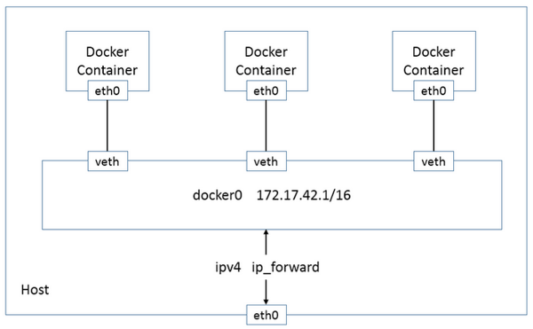
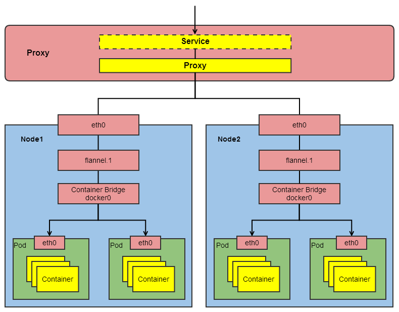
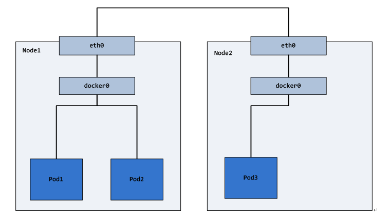
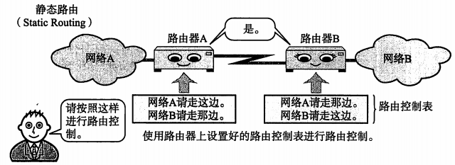
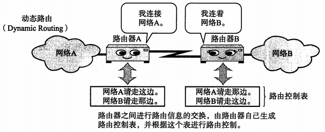
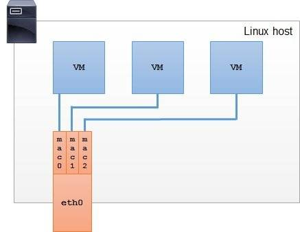
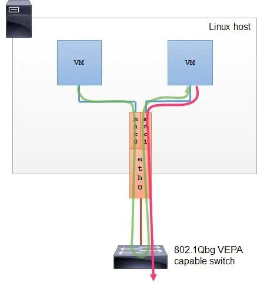
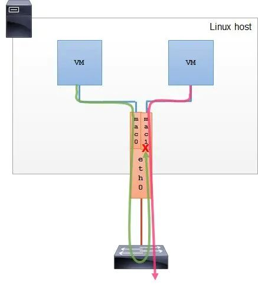

# Docker网络

## 1. Docker的网络基础

## 1.1. Network Namespace

不同的网络命名空间中，协议栈是独立的，完全隔离，彼此之间无法通信。同一个网络命名空间有独立的路由表和独立的`Iptables/Netfilter`来提供包的转发、NAT、IP包过滤等功能。

### 1.1.1. 网络命名空间的实现

将与网络协议栈相关的全局变量变成一个`Net Namespace`变量的成员，然后在调用协议栈函数中加入一个Namepace参数。

### 1.1.2. 网络命名空间的操作

1、创建网络命名空间

ip netns add `name`

2、在命名空间内执行命令

ip netns exec `name` `command`

3、进入命名空间

ip netns exec `name` bash

## 2. Docker的网络实现

## 2.1. 容器网络

Docker使用Linux桥接，在宿主机虚拟一个Docker容器网桥(docker0)，Docker启动一个容器时会根据Docker网桥的网段分配给容器一个IP地址，称为Container-IP，同时Docker网桥是每个容器的默认网关。因为在同一宿主机内的容器都接入同一个网桥，这样容器之间就能够通过容器的Container-IP直接通信。

Docker网桥是宿主机虚拟出来的，并不是真实存在的网络设备，外部网络是无法寻址到的，这也意味着外部网络无法通过直接Container-IP访问到容器。如果容器希望外部访问能够访问到，可以通过映射容器端口到宿主主机（端口映射），即docker run创建容器时候通过 -p 或 -P 参数来启用，访问容器的时候就通过[宿主机IP]:[容器端口]访问容器。

[](https://camo.githubusercontent.com/c595113c943ebda378bb77ac6e3c99ae26da07a604ab2fed4b87aa46be65136f/68747470733a2f2f7265732e636c6f7564696e6172792e636f6d2f647178746e3069636b2f696d6167652f75706c6f61642f76313531303537383935372f61727469636c652f6b756265726e657465732f6e6574776f726b2f636f6e7461696e65722d6e6574776f726b2e706e67)

## 2.2. 4类网络模式

| Docker网络模式 | 配置                         | 说明                                                         |
| -------------- | ---------------------------- | ------------------------------------------------------------ |
| host模式       | --net=host                   | 容器和宿主机共享Network namespace。                          |
| container模式  | --net=container:NAME_or_ID   | 容器和另外一个容器共享Network namespace。 kubernetes中的pod就是多个容器共享一个Network namespace。 |
| none模式       | --net=none                   | 容器有独立的Network namespace，但并没有对其进行任何网络设置，如分配veth pair 和网桥连接，配置IP等。 |
| bridge模式     | --net=bridge（默认为该模式） | 桥接模式                                                     |

##  3. Docker网络模式

## 3.1. bridge桥接模式

在bridge模式下，Docker可以使用独立的网络栈。实现方式是父进程在创建子进程的时候通过传入`CLONE_NEWNET`的参数创建出一个网络命名空间。

**实现步骤：**

1. Docker Daemon首次启动时会创建一个虚拟网桥docker0，地址通常为172.x.x.x开头，在私有的网络空间中给这个网络分配一个子网。
2. 由Docker创建处理的每个容器，都会创建一个虚拟以太设备对（veth pair），一端关联到网桥，另一端使用Namespace技术映射到容器内的eth0设备，然后从网桥的地址段内给eth0接口分配一个IP地址。

[](https://camo.githubusercontent.com/a5c16079ad8f777307841727725d9b7a5107e42ad7598d4cfe4d2a0dda94c7a5/68747470733a2f2f7265732e636c6f7564696e6172792e636f6d2f647178746e3069636b2f696d6167652f75706c6f61642f76313531303537383935372f61727469636c652f6b756265726e657465732f6e6574776f726b2f6272696467652e706e67)

一般情况，宿主机IP与docker0 IP、容器IP是不同的IP段，默认情况，外部看不到docker0和容器IP，对于外部来说相当于docker0和容器的IP为内网IP。

### 3.1.1. 外部网络访问Docker容器

外部访问docker容器可以通过`端口映射(NAT)`的方式，Docker使用NAT的方式将容器内部的服务与宿主机的某个端口port_1绑定。

外部访问容器的流程如下：

1. 外界网络通过宿主机的IP和映射的端口port_1访问。
2. 当宿主机收到此类请求，会通过DNAT将请求的目标IP即宿主机IP和目标端口即映射端口port_1替换成容器的IP和容器的端口port_0。
3. 由于宿主机上可以识别容器IP，所以宿主机将请求发给veth pair。
4. veth pair将请求发送给容器内部的eth0，由容器内部的服务进行处理。

### 3.1.2. Docker容器访问外部网络

docker容器访问外部网络的流程：

1. docker容器向外部目标IP和目标端口port_2发起请求，请求报文中的源IP为容器IP。
2. 请求通过容器内部的eth0到veth pair的另一端docker0网桥。
3. docker0网桥通过数据报转发功能将请求转发到宿主机的eth0。
4. 宿主机处理请求时通过SNAT将请求中的源IP换成宿主机eth0的IP。
5. 处理后的报文通过请求的目标IP发送到外部网络。

### 3.1.3. 缺点

使用NAT的方式可能会带来性能的问题，影响网络传输效率。

## 3.2. host模式

host模式并没有给容器创建一个隔离的网络环境，而是和宿主机共用一个网络命名空间，容器使用宿主机的eth0和外界进行通信，同样容器也共用宿主机的端口资源，即分配端口可能存在与宿主机已分配的端口冲突的问题。

实现的方式即父进程在创建子进程的时候不传入`CLONE_NEWNET`的参数，从而和宿主机共享一个网络空间。

host模式没有通过NAT的方式进行转发因此性能上相对较好，但是不存在网络隔离性，可能产生端口冲突的问题。

## 3.3. container模式

container模式即docker容器可以使用其他容器的网络命名空间，即和其他容器处于同一个网络命名空间。

步骤：

1. 查找其他容器的网络命名空间。
2. 新创建的容器的网络命名空间使用其他容器的网络命名空间。

通过和其他容器共享网络命名空间的方式，可以让不同的容器之间处于相同的网络命名空间，可以直接通过localhost的方式进行通信，简化了强关联的多个容器之间的通信问题。

k8s中的pod的概念就是通过一组容器共享一个网络命名空间来达到pod内部的不同容器可以直接通过localhost的方式进行通信。

## 3.4. none模式

none模式即不为容器创建任何的网络环境，用户可以根据自己的需要手动去创建不同的网络定制配置。

# K8S网络

## 1. kubernetes网络模型

## 1.1. 基础原则

1. 每个Pod都拥有一个独立的IP地址，而且假定所有Pod都在一个可以直接连通的、扁平的网络空间中，不管是否运行在同一Node上都可以通过Pod的IP来访问。
2. k8s中Pod的IP是最小粒度IP。同一个Pod内所有的容器共享一个网络堆栈，该模型称为IP-per-Pod模型。
3. Pod由docker0实际分配的IP，Pod内部看到的IP地址和端口与外部保持一致。同一个Pod内的不同容器共享网络，可以通过localhost来访问对方的端口，类似同一个VM内的不同进程。
4. IP-per-Pod模型从端口分配、域名解析、服务发现、负载均衡、应用配置等角度看，Pod可以看作是一台独立的VM或物理机。

## 1.2. k8s对集群的网络要求

1. 所有容器都可以不用NAT的方式同别的容器通信。
2. 所有节点都可以在不同NAT的方式下同所有容器通信，反之亦然。
3. 容器的地址和别人看到的地址是同一个地址。

以上的集群网络要求可以通过第三方开源方案实现，例如flannel。

## 1.3. 网络架构图

[](https://camo.githubusercontent.com/e9bc73657cb284ca1ba6ba3af46e639b4fef69564212fe79e94e22f12feb59cd/68747470733a2f2f7265732e636c6f7564696e6172792e636f6d2f647178746e3069636b2f696d6167652f75706c6f61642f76313531303537383935372f61727469636c652f6b756265726e657465732f6e6574776f726b2f6e6574776f726b2d617263682e706e67)

## 1.4. k8s集群IP概念汇总

由集群外部到集群内部：

| IP类型              | 说明                                                         |
| ------------------- | ------------------------------------------------------------ |
| Proxy-IP            | 代理层公网地址IP，外部访问应用的网关服务器。[实际需要关注的IP] |
| Service-IP          | Service的固定虚拟IP，Service-IP是内部，外部无法寻址到。      |
| Node-IP             | 容器宿主机的主机IP。                                         |
| Container-Bridge-IP | 容器网桥（docker0）IP，容器的网络都需要通过容器网桥转发。    |
| Pod-IP              | Pod的IP，等效于Pod中网络容器的Container-IP。                 |
| Container-IP        | 容器的IP，容器的网络是个隔离的网络空间。                     |

## 2. kubernetes的网络实现

k8s网络场景

1. 容器与容器之间的直接通信。
2. Pod与Pod之间的通信。
3. Pod到Service之间的通信。
4. 集群外部与内部组件之间的通信。

## 2.1. Pod网络

Pod作为kubernetes的最小调度单元，Pod是容器的集合，是一个逻辑概念，Pod包含的容器都运行在同一个宿主机上，这些容器将拥有同样的网络空间，容器之间能够互相通信，它们能够在本地访问其它容器的端口。 实际上Pod都包含一个网络容器，它不做任何事情，只是用来接管Pod的网络，业务容器通过加入网络容器的网络从而实现网络共享。Pod网络本质上还是容器网络，所以Pod-IP就是网络容器的Container-IP。

一般将容器云平台的网络模型打造成一个扁平化网络平面，在这个网络平面内，Pod作为一个网络单元同Kubernetes Node的网络处于同一层级。

## 2.2. Pod内部容器之间的通信

同一个Pod之间的不同容器因为共享同一个网络命名空间，所以可以直接通过localhost直接通信。

## 2.3. Pod之间的通信

### 2.3.1. 同Node的Pod之间的通信

同一个Node内，不同的Pod都有一个全局IP，可以直接通过Pod的IP进行通信。Pod地址和docker0在同一个网段。

在pause容器启动之前，会创建一个虚拟以太网接口对（veth pair），该接口对一端连着容器内部的eth0 ，一端连着容器外部的vethxxx，vethxxx会绑定到容器运行时配置使用的网桥bridge0上，从该网络的IP段中分配IP给容器的eth0。

当同节点上的Pod-A发包给Pod-B时，包传送路线如下：

```
pod-a的eth0—>   pod-a的vethxxx—>  bridge0—>  pod-b的vethxxx—>  pod-b的eth0
```


因为相同节点的bridge0是相通的，因此可以通过bridge0来完成不同pod直接的通信，但是不同节点的bridge0是不通的，因此不同节点的pod之间的通信需要将不同节点的bridge0给连接起来。

### 2.3.2. 不同Node的Pod之间的通信

不同的Node之间，Node的IP相当于外网IP，可以直接访问，而Node内的docker0和Pod的IP则是内网IP，无法直接跨Node访问。需要通过Node的网卡进行转发。

所以不同Node之间的通信需要达到两个条件：

1. 对整个集群中的Pod-IP分配进行规划，不能有冲突（可以通过第三方开源工具来管理，例如flannel）。
2. 将Node-IP与该Node上的Pod-IP关联起来，通过Node-IP再转发到Pod-IP。

不同节点的Pod之间的通信需要将不同节点的bridge0给连接起来。连接不同节点的bridge0的方式有好几种，主要有overlay和underlay，或常规的三层路由。

不同节点的bridge0需要不同的IP段，保证Pod IP分配不会冲突，节点的物理网卡eth0也要和该节点的网桥bridge0连接。因此，节点a上的pod-a发包给节点b上的pod-b，路线如下：

```
节点a上的pod-a的eth0—>pod-a的vethxxx—>节点a的bridge0—>节点a的eth0—>

节点b的eth0—>节点b的bridge0—>pod-b的vethxxx—>pod-b的eth0
```


[](https://camo.githubusercontent.com/32482cbb391472dea3cf5dcfb30bfec603e23d7ca59d88baa7a7085e575ccf3a/68747470733a2f2f7265732e636c6f7564696e6172792e636f6d2f647178746e3069636b2f696d6167652f75706c6f61642f76313531303537383935372f61727469636c652f6b756265726e657465732f6e6574776f726b2f706f642d6e6574776f726b2e706e67)

**1. Pod间实现通信**

例如：Pod1和Pod2（同主机），Pod1和Pod3(跨主机)能够通信

实现：因为Pod的Pod-IP是Docker网桥分配的，Pod-IP是同Node下全局唯一的。所以将不同Kubernetes Node的 Docker网桥配置成不同的IP网段即可。

**2. Node与Pod间实现通信**

例如：Node1和Pod1/ Pod2(同主机)，Pod3(跨主机)能够通信

实现：在容器集群中创建一个覆盖网络(Overlay Network)，联通各个节点，目前可以通过第三方网络插件来创建覆盖网络，比如Flannel和Open vSwitch等。

不同节点间的Pod访问也可以通过calico形成的Pod IP的路由表来解决。

## 2.4. Service网络

Service的就是在Pod之间起到服务代理的作用，对外表现为一个单一访问接口，将请求转发给Pod，Service的网络转发是Kubernetes实现服务编排的关键一环。Service都会生成一个虚拟IP，称为Service-IP， Kuberenetes Porxy组件负责实现Service-IP路由和转发，在容器覆盖网络之上又实现了虚拟转发网络。

Kubernetes Porxy实现了以下功能：

1. 转发访问Service的Service-IP的请求到Endpoints(即Pod-IP)。
2. 监控Service和Endpoints的变化，实时刷新转发规则。
3. 负载均衡能力。

## 3. 开源的网络组件

## 3.1. Flannel

具体参考[Flannel介绍](https://github.com/huweihuang/kubernetes-notes/blob/master/network/flannel/flannel-introduction.md)


# Pod的DNS策略


## 1. Pod的DNS策略

可以在pod中定义`dnsPolicy`字段来设置dns的策略。

- "`Default`": Pod 从运行所在的节点继承名称解析配置。就是该Pod的DNS配置会跟宿主机完全一致。
- "`ClusterFirst`": 如果没有配置，即为默认的DNS策略。预先把kube-dns（或CoreDNS）的信息当作预设参数写入到该Pod内的DNS配置。与配置的集群域后缀不匹配的任何 DNS 查询（例如 "[www.kubernetes.io](http://www.kubernetes.io/)"） 都会由 DNS 服务器转发到上游名称服务器。
- "`ClusterFirstWithHostNet`": 对于以 hostNetwork 方式运行的 Pod，应将其 DNS 策略显式设置为 "`ClusterFirstWithHostNet`"。否则，以 hostNetwork 方式和 `"ClusterFirst"` 策略运行的 Pod 将会做出回退至 `"Default"` 策略的行为。
- "`None`": 此设置允许 Pod 忽略 Kubernetes 环境中的 DNS 设置。Pod 会使用其 `dnsConfig` 字段所提供的 DNS 设置。

## 2. Pod DNS的配置

当 Pod 的 `dnsPolicy` 设置为 "`None`" 时，必须指定 `dnsConfig` 字段。

`dnsConfig` 字段中属性：

- `nameservers`：将用作于 Pod 的 DNS 服务器的 IP 地址列表。 最多可以指定 3 个 IP 地址。例如 coredns的Cluster IP。
- `searches`：用于在 Pod 中查找主机名的 DNS 搜索域的列表。此属性是可选的。
- `options`：可选的对象列表，其中每个对象可能具有 `name` 属性（必需）和 `value` 属性（可选）。

示例：

```
apiVersion: v1
kind: Pod
metadata:
  namespace: default
  name: dns-example
spec:
  containers:
    - name: test
      image: nginx
  dnsPolicy: "None"
  dnsConfig:
    nameservers:
      - 1.2.3.4
    searches:
      - ns1.svc.cluster-domain.example
      - my.dns.search.suffix
    options:
      - name: ndots
        value: "2"
      - name: edns0
```


通过以上配置，容器内的`/etc/resolv.conf`文件内容为：

```
kubectl exec -it dns-example -- cat /etc/resolv.conf
```


```
nameserver 1.2.3.4
search ns1.svc.cluster-domain.example my.dns.search.suffix
options ndots:2 edns0
```


## 3. 自定义DNS服务

默认一般使用coredns来作为k8s的dns服务器。默认使用deployment的方式来运行coredns，会创建一个名为`kube-dns`的service，并用ClusterIP（默认为10.96.0.10）来作为集群内的pod的nameserver。

kubelet 使用 `--cluster-dns=<DNS 服务 IP>` 标志将 DNS 解析器的信息传递给每个容器。使用 `--cluster-domain=<默认本地域名>` 标志配置本地域名。

可查看默认配置：

```
# cat /var/lib/kubelet/config.yaml
...
clusterDNS:
- 10.96.0.10
clusterDomain: cluster.local
```


总结：

当没有给pod设置任何dns策略时，则默认使用ClusterFirst的策略，即nameserver的IP为coredns的ClusterIP。通过coredns来解析服务。

## 3.1. 配置继承节点的DNS解析

- 如果 Pod 的 `dnsPolicy` 设置为 `default`，则它将从 Pod 运行所在节点继承名称解析配置。
- 使用 kubelet 的 `--resolv-conf` 标志设置为宿主机的/etc/resolv.conf文件。

## 3.2. 配置CoreDNS

 配置

```
apiVersion: v1
kind: ConfigMap
metadata:
  name: coredns
  namespace: kube-system
data:
  Corefi: |
    .:53 {
        errors
        health {
           lameduck 5s
        }
        ready
        kubernetes cluster.local in-addr.arpa ip6.arpa {
           pods insecure
           fallthrough in-addr.arpa ip6.arpa
           ttl 30
        }
        prometheus :9153
        forward . /etc/resolv.conf {
           max_concurrent 1000
        }
        cache 30
        loop
        reload
        loadbalance
    }
```


配置说明：

Corefile 配置包括以下 CoreDNS [插件](https://coredns.io/plugins/)：

- [errors](https://coredns.io/plugins/errors/)：错误记录到标准输出。
- [health](https://coredns.io/plugins/health/)：在 `http://localhost:8080/health` 处提供 CoreDNS 的健康报告。 在这个扩展语法中，`lameduck` 会使此进程不健康，等待 5 秒后进程被关闭。
- [ready](https://coredns.io/plugins/ready/)：在端口 8181 上提供的一个 HTTP 端点， 当所有能够表达自身就绪的插件都已就绪时，在此端点返回 200 OK。
- [kubernetes](https://coredns.io/plugins/kubernetes/)：CoreDNS 将基于服务和 Pod 的 IP 来应答 DNS 查询。 你可以在 CoreDNS 网站找到有关此插件的[更多细节](https://coredns.io/plugins/kubernetes/)。
  - 你可以使用 `ttl` 来定制响应的 TTL。默认值是 5 秒钟。TTL 的最小值可以是 0 秒钟， 最大值为 3600 秒。将 TTL 设置为 0 可以禁止对 DNS 记录进行缓存。
  - `pods insecure` 选项是为了与 kube-dns 向后兼容。
  - 你可以使用 `pods verified` 选项，该选项使得仅在相同名字空间中存在具有匹配 IP 的 Pod 时才返回 A 记录。
  - 如果你不使用 Pod 记录，则可以使用 `pods disabled` 选项。
- [prometheus](https://coredns.io/plugins/prometheus/)：CoreDNS 的度量指标值以 [Prometheus](https://prometheus.io/) 格式（也称为 OpenMetrics）在 `http://localhost:9153/metrics` 上提供。
- [forward](https://coredns.io/plugins/forward/): 不在 Kubernetes 集群域内的任何查询都将转发到预定义的解析器 (/etc/resolv.conf)。
- [cache](https://coredns.io/plugins/cache/)：启用前端缓存。
- [loop](https://coredns.io/plugins/loop/)：检测简单的转发环，如果发现死循环，则中止 CoreDNS 进程。
- [reload](https://coredns.io/plugins/reload)：允许自动重新加载已更改的 Corefile。 编辑 ConfigMap 配置后，请等待两分钟，以使更改生效。
- [loadbalance](https://coredns.io/plugins/loadbalance)：这是一个轮转式 DNS 负载均衡器， 它在应答中随机分配 A、AAAA 和 MX 记录的顺序。

## 3.3. 配置存根域和上游域名服务器

CoreDNS 能够使用 [forward 插件](https://coredns.io/plugins/forward/)配置存根域和上游域名服务器。

示例：

在 "10.150.0.1" 处运行了 [Consul](https://www.consul.io/) 域服务器， 且所有 Consul 名称都带有后缀 `.consul.local`。

```
consul.local:53 {
    errors
    cache 30
    forward . 10.150.0.1
}
```


要显式强制所有非集群 DNS 查找通过特定的域名服务器（位于 172.16.0.1），可将 `forward` 指向该域名服务器，而不是 `/etc/resolv.conf`。

```
forward .  172.16.0.1
```


完整示例；

```
apiVersion: v1
kind: ConfigMap
metadata:
  name: coredns
  namespace: kube-system
data:
  Corefile: |
    .:53 {
        errors
        health
        kubernetes cluster.local in-addr.arpa ip6.arpa {
           pods insecure
           fallthrough in-addr.arpa ip6.arpa
        }
        prometheus :9153
        forward . 172.16.0.1
        cache 30
        loop
        reload
        loadbalance
    }
    consul.local:53 {
        errors
        cache 30
        forward . 10.150.0.1
    }    
```


## 4. 调试DNS问题

创建一个调试的pod

```
apiVersion: v1
kind: Pod
metadata:
  name: dnsutils
  namespace: default
spec:
  containers:
  - name: dnsutils
    image: registry.k8s.io/e2e-test-images/jessie-dnsutils:1.3
    command:
      - sleep
      - "infinity"
    imagePullPolicy: IfNotPresent
  restartPolicy: Always
```


部署调试pod

## 4.1. 查看Coredns服务是否正常

```
kubectl get svc --namespace=kube-system 

NAME         TYPE        CLUSTER-IP     EXTERNAL-IP   PORT(S)             AGE
...
kube-dns     ClusterIP   10.0.0.10      <none>        53/UDP,53/TCP        1h
...
```


## 4.2. 查看/etc/resolv.conf

查看容器内dns配置是否符合预期。

```
kubectl exec -ti dnsutils -- cat /etc/resolv.conf
```


## 4.3. nslookup查看解析报错

```
kubectl exec -i -t dnsutils -- nslookup kubernetes.default


Server:    10.0.0.10
Address 1: 10.0.0.10

Name:      kubernetes.default
Address 1: 10.0.0.1
```

# 网络插件

# Flannel介绍


## 1. flannel是什么（what）

## 1.1. 概述

Flannel是CoreOS团队针对Kubernetes设计的一个网络规划服务，简单来说，它的功能是让集群中的不同节点主机创建的Docker容器都具有全集群唯一的虚拟IP地址。 Flannel官网：https://github.com/coreos/flannel

## 1.2. 补充知识点

## 1、覆盖网络overlay network

运行在一个网上的网（应用层网络），并不依靠ip地址来传递消息，而是采用一种映射机制，把ip地址和identifiers做映射来资源定位。

## 2、路由

互联网是由路由器连接的网络组合而成，路由器按照路由表、路由协议等机制实现对数据包正确地转发，从而到达目标主机。路由器根据数据包中目标主机的IP地址和路由控制表比较得出下一个接收数据的路由器。

**1）静态路由：事先设置好路由器和主机中的路由表信息。**

[](https://camo.githubusercontent.com/d83aa879f87629dc58682cd61675b8a6f0e4fd3f0d9d6bb0b32b9f6927486102/68747470733a2f2f7265732e636c6f7564696e6172792e636f6d2f647178746e3069636b2f696d6167652f75706c6f61642f76313531303537383536392f61727469636c652f666c616e6e656c2f7374617469632d726f7574652e706e67)

**2）动态路由：让路由协议在运行中自动修改并设置路由表信息。**

[](https://camo.githubusercontent.com/f24a3c8a347c30822a4effaab2d6549d74c6ceb0788498a5eea64ee08beb923b/68747470733a2f2f7265732e636c6f7564696e6172792e636f6d2f647178746e3069636b2f696d6167652f75706c6f61642f76313531303537383536382f61727469636c652f666c616e6e656c2f64796e616d69632d726f7574652e706e67)

## 2. 为什么使用flannel（why）

在默认的Docker配置中，每个节点上的Docker服务会分别负责所在节点容器的IP分配。这样导致的一个问题是，不同节点上容器可能获得相同的内外IP地址。

Flannel的设计目的就是为集群中的所有节点重新规划IP地址的使用规则，从而使得不同节点上的容器能够获得“同属一个内网”且”不重复的”IP地址，并让属于不同节点上的容器能够直接通过内网IP通信。

## 3. 如何实现flannel（how）

Flannel实质上是一种“覆盖网络(overlay network)”，也就是将TCP数据包装在另一种网络包里面进行路由转发和通信，目前已经支持UDP、VxLAN、AWS VPC和GCE路由等数据转发方式，默认的节点间数据通信方式是UDP转发。

## 3.1. flannel原理图

[](https://camo.githubusercontent.com/5d69c5e7671c22b81394c459dcf2d4cec47dcd23a8959d6faa6d918bb9cae610/68747470733a2f2f7265732e636c6f7564696e6172792e636f6d2f647178746e3069636b2f696d6167652f75706c6f61642f76313531303537383536382f61727469636c652f666c616e6e656c2f666c616e6e656c2e706e67)

1. 数据从源容器中发出后，经由所在主机的docker0虚拟网卡转发到flannel0虚拟网卡，这是个P2P的虚拟网卡，flanneld服务监听在网卡的另外一端。
2. Flannel通过Etcd服务维护了一张节点间的路由表。
3. 源主机的flanneld服务将原本的数据内容UDP封装后根据自己的路由表投递给目的节点的flanneld服务，数据到达以后被解包，然后直 接进入目的节点的flannel0虚拟网卡，然后被转发到目的主机的docker0虚拟网卡，最后就像本机容器通信一下的有docker0路由到达目标容 器。

## 3.2. 实现说明

## 1、UDP封装

原始数据是在起始节点的Flannel服务上进行UDP封装的，投递到目的节点后就被另一端的Flannel服务还原成了原始的数据包，两边的Docker服务都感觉不到这个过程的存在。 UDP的数据内容部分其实是另一个ICMP（也就是ping命令）的数据包。

[](https://camo.githubusercontent.com/56ecfffc5f925ce95cb46de20ed1a32335dc4d76ddc38750ae95f77279541fc6/68747470733a2f2f7265732e636c6f7564696e6172792e636f6d2f647178746e3069636b2f696d6167652f75706c6f61642f76313531303537383536392f61727469636c652f666c616e6e656c2f7564702e706e67)

## 2、为docker分配不同的IP段

Flannel通过Etcd分配了每个节点可用的IP地址段后，偷偷的修改了Docker的启动参数。

[](https://camo.githubusercontent.com/f1bf6e8fcd4754679c19d3e0215f87825fa7438e36f20aa8bdb2a4a395399bf3/68747470733a2f2f7265732e636c6f7564696e6172792e636f6d2f647178746e3069636b2f696d6167652f75706c6f61642f76313531303537383536382f61727469636c652f666c616e6e656c2f646f636b65722d696e69742d617267732e706e67)

注意其中的“--bip=172.17.18.1/24”这个参数，它限制了所在节点容器获得的IP范围。

这个IP范围是由Flannel自动分配的，由Flannel通过保存在Etcd服务中的记录确保它们不会重复。

## 3、路由规则

1）数据发送节点的路由表

[](https://camo.githubusercontent.com/157366e9697dc98bef4b32699a765db4337f25998681cee5850fd65c9c9ee5f7/68747470733a2f2f7265732e636c6f7564696e6172792e636f6d2f647178746e3069636b2f696d6167652f75706c6f61642f76313531303537383536382f61727469636c652f666c616e6e656c2f4461746153656e64526f7574655461626c652e706e67)

2）数据接收节点的路由表

[](https://camo.githubusercontent.com/15eaba79f2fae366ea3fc8e2a4e9cc3ffe91955d0bc3f67ee91c595eb95dcd41/68747470733a2f2f7265732e636c6f7564696e6172792e636f6d2f647178746e3069636b2f696d6167652f75706c6f61642f76313531303537383536382f61727469636c652f666c616e6e656c2f4461746152656365697665526f7574655461626c652e706e67)

例如现在有一个数据包要从IP为172.17.18.2的容器发到IP为172.17.46.2的容器。根据数据发送节点的路由表，它只与 172.17.0.0/16匹配这条记录匹配，因此数据从docker0出来以后就被投递到了flannel0。同理在目标节点，由于投递的地址是一个容 器，因此目的地址一定会落在docker0对于的172.17.46.0/24这个记录上，自然的被投递到了docker0网卡。

## 3.3. flannel的安装与配置

## 1、安装

```
wget http://<官网>/flannel/flannel-0.2.0-10.el7.x86_64.rpm
yum localinstall -y flannel-0.2.0-10.el7.x86_64.rpm
```


## 2、配置

vi /etc/sysconfig/flanneld

```
# Flanneld configuration options
 
# etcd url location. Point this to the server where etcd runs
FLANNEL_ETCD="http://127.0.0.1:4001"
  
# etcd config key. This is the configuration key that flannel queries
# For address range assignment
FLANNEL_ETCD_KEY="/xxx/flannel/product/network"
  
# Any additional options that you want to pass
FLANNEL_OPTIONS=" -iface=eth0"
```


## 3、初始化flannel的etcd配置

```
etcdctl set /xxx/flannel/network/config '{
   "Network": "10.0.0.0/16",
   "Backend": {
       "Type": "vxlan"
   }
}'
```

# CNI


# CNI接口介绍

## 1. CNI（Container Network Interface）

CNI（Container Network Interface）即容器网络接口，通过约定统一的容器网络接口，从而kubelet可以通过这个标准的API来调用不同的网络插件实现不同的网络功能。

kubelet启动参数--network-plugin=cni来指定CNI插件，kubelet从`--cni-conf-dir` （默认是 `/etc/cni/net.d`） 读取文件并使用 该文件中的 CNI 配置来设置各个 Pod 的网络。 CNI 配置文件必须与 [CNI 规约](https://github.com/containernetworking/cni/blob/master/SPEC.md#network-configuration) 匹配，并且配置所引用的所有所需的 CNI 插件都应存在于 `--cni-bin-dir`（默认是 `/opt/cni/bin`）下。如果有多个CNI配置文件，kubelet 将会使用按文件名的字典顺序排列 的第一个作为配置文件。

CNI规范定义：

- 网络配置文件的格式
- 容器runtime与CNI插件的通信协议
- 基于提供的配置执行网络插件的步骤
- 网络插件调用其他功能插件的步骤
- 插件返回给runtime结果的数据格式

## 2. CNI配置文件格式

CNI配置文件的格式为JSON格式，配置文件的默认路径：/etc/cni/net.d。插件二进制默认的路径为：/opt/cni/bin。

## 2.1. 主配置的字段

- `cniVersion` (string)：CNI规范使用的版本，例如版本为0.4.0。
- `name` (string)：目标网络的名称。
- `disableCheck` (boolean)：关闭CHECK操作。
- `plugins` (list)：CNI插件列表及插件配置。

## 2.2. 插件配置字段

根据不同的插件，插件配置所需的字段不同。

必选字段：

- `type` (string)：节点上插件二进制的名称，比如bridge，sriov，macvlan等。

可选字段：

- `capabilities` (dictionary)

- `ipMasq` (boolean)：为目标网络配上Outbound Masquerade(地址伪装)，即：由容器内部通过网关向外发送数据包时，对数据包的源IP地址进行修改。

  当我们的容器以宿主机作为网关时，这个参数是必须要设置的。否则，从容器内部发出的数据包就没有办法通过网关路由到其他网段。因为容器内部的IP地址无法被目标网段识别，所以这些数据包最终会被丢弃掉。

- `ipam` (dictionary)：IPAM(IP Adderss Management)即IP地址管理，提供了一系列方法用于对IP和路由进行管理。它对应的是由CNI提供的一组标准IPAM插件，比如像host-local，dhcp，static等。比如文中用到的bridge插件，会调用我们所指定的IPAM插件，实现对网络设备IP地址的分配和管理。**如果是自己开发的ipam插件，则相关的入参可以自己定义和实现。

  以下以host-local为例说明。

  - type：指定所用IPAM插件的名称，在我们的例子里，用的是host-local。
  - subnet：为目标网络分配网段，包括网络ID和子网掩码，以CIDR形式标记。在我们的例子里为`10.15.10.0/24`，也就是目标网段为`10.15.10.0`，子网掩码为`255.255.255.0`。
  - routes：用于指定路由规则，插件会为我们在容器的路由表里生成相应的规则。其中，dst表示希望到达的目标网段，以CIDR形式标记。gw对应网关的IP地址，也就是要到达目标网段所要经过的“next hop(下一跳)”。如果省略gw的话，那么插件会自动帮我们选择默认网关。在我们的例子里，gw选择的是默认网关，而dst为`0.0.0.0/0`则代表“任何网络”，表示数据包将通过默认网关发往任何网络。实际上，这对应的是一条默认路由规则，即：当所有其他路由规则都不匹配时，将选择该路由。
  - rangeStart：允许分配的IP地址范围的起始值
  - rangeEnd：允许分配的IP地址范围的结束值
  - gateway：为网关（也就是我们将要在宿主机上创建的bridge）指定的IP地址。如果省略的话，那么插件会自动从允许分配的IP地址范围内选择起始值作为网关的IP地址。

- `dns` (dictionary, optional)：dns配置

  - `nameservers` (list of strings, optional)
  - `domain` (string, optional)
  - `search` (list of strings, optional)
  - `options` (list of strings, optional)

## 2.3. 配置文件示例

```
$ mkdir -p /etc/cni/net.d
$ cat >/etc/cni/net.d/10-mynet.conf <<EOF
{
  "cniVersion": "1.0.0",
  "name": "dbnet",
  "plugins": [
    {
      "type": "bridge",
      // plugin specific parameters
      "bridge": "cni0",
      "keyA": ["some more", "plugin specific", "configuration"],

      "ipam": {
        "type": "host-local",
        // ipam specific
        "subnet": "10.1.0.0/16",
        "gateway": "10.1.0.1",
        "routes": [
            {"dst": "0.0.0.0/0"}
        ]
      },
      "dns": {
        "nameservers": [ "10.1.0.1" ]
      }
    },
    {
      "type": "tuning",
      "capabilities": {
        "mac": true
      },
      "sysctl": {
        "net.core.somaxconn": "500"
      }
    },
    {
        "type": "portmap",
        "capabilities": {"portMappings": true}
    }
  ]
}
```


## 3. CNI插件

## 3.1. 安装插件

安装CNI二进制插件，插件下载地：https://github.com/containernetworking/plugins/releases

```
# 下载二进制
wget https://github.com/containernetworking/plugins/releases/download/v1.1.0/cni-plugins-linux-amd64-v1.1.0.tgz

# 解压文件
tar -zvxf cni-plugins-linux-amd64-v1.1.0.tgz -C /opt/cni/bin/

# 查看解压文件
# ll -h
总用量 63M
-rwxr-xr-x 1 root root 3.7M 2月  24 01:01 bandwidth
-rwxr-xr-x 1 root root 4.1M 2月  24 01:01 bridge
-rwxr-xr-x 1 root root 9.3M 2月  24 01:01 dhcp
-rwxr-xr-x 1 root root 4.2M 2月  24 01:01 firewall
-rwxr-xr-x 1 root root 3.7M 2月  24 01:01 host-device
-rwxr-xr-x 1 root root 3.1M 2月  24 01:01 host-local
-rwxr-xr-x 1 root root 3.8M 2月  24 01:01 ipvlan
-rwxr-xr-x 1 root root 3.2M 2月  24 01:01 loopback
-rwxr-xr-x 1 root root 3.8M 2月  24 01:01 macvlan
-rwxr-xr-x 1 root root 3.6M 2月  24 01:01 portmap
-rwxr-xr-x 1 root root 4.0M 2月  24 01:01 ptp
-rwxr-xr-x 1 root root 3.4M 2月  24 01:01 sbr
-rwxr-xr-x 1 root root 2.7M 2月  24 01:01 static
-rwxr-xr-x 1 root root 3.3M 2月  24 01:01 tuning
-rwxr-xr-x 1 root root 3.8M 2月  24 01:01 vlan
-rwxr-xr-x 1 root root 3.4M 2月  24 01:01 vrf
```


## 3.2. 插件分类

参考：https://www.cni.dev/plugins/current/

| 分类 | 插件                                                         | 说明                                                         |
| ---- | ------------------------------------------------------------ | ------------------------------------------------------------ |
| main | bridge                                                       | Creates a bridge, adds the host and the container to it      |
|      | ipvlan                                                       | Adds an ipvlan interface in the container                    |
|      | **macvlan**                                                  | Creates a new MAC address, forwards all traffic to that to the container |
|      | ptp                                                          | Creates a veth pair                                          |
|      | [host-device](https://www.cni.dev/plugins/current/main/host-device/) | Moves an already-existing device into a container            |
|      | vlan                                                         | Creates a vlan interface off a master                        |
| IPAM | dhcp                                                         | Runs a daemon on the host to make DHCP requests on behalf of a container |
|      | host-local                                                   | Maintains a local database of allocated IPs                  |
|      | static                                                       | Allocates static IPv4/IPv6 addresses to containers           |
| meta | tuning                                                       | Changes sysctl parameters of an existing interface           |
|      | portmap                                                      | An iptables-based portmapping plugin. Maps ports from the host’s address space to the container |
|      | **bandwidth**                                                | Allows bandwidth-limiting through use of traffic control tbf (ingress/egress) |
|      | sbr                                                          | A plugin that configures source based routing for an interface (from which it is chained) |
|      | firewall                                                     | A firewall plugin which uses iptables or firewalld to add rules to allow traffic to/from the container |

## 4. CNI插件接口

具体可参考：https://github.com/containernetworking/cni/blob/master/SPEC.md#cni-operations

CNI定义的接口操作有：

- `ADD`：添加容器网络，在容器启动时调用。
- `DEL`：删除容器网络，在容器删除时调用。
- `CHECK`：检查容器网络是否正常。
- `VERSION`：显示插件版本。

这些操作通过`CNI_COMMAND`环境变量来传递给CNI插件二进制。

其中环境变量包括：

- `CNI_COMMAND`：命令操作，包括 `ADD`, `DEL`, `CHECK`, or `VERSION`。
- `CNI_CONTAINERID`:容器的ID，有runtime分配，不为空。
- `CNI_NETNS`:容器的网络命名空间，命名空间路径，例如：/run/netns/[nsname]
- `CNI_IFNAME`:容器内的网卡名称。
- `CNI_ARGS`:其他参数。
- `CNI_PATH`:CNI插件二进制的路径。

## 4.1. ADD接口：添加容器网络

在容器的网络命名空间`CNI_NETNS`中创建`CNI_IFNAME`网卡设备，或者调整网卡配置。

必选参数：

- `CNI_COMMAND`
- `CNI_CONTAINERID`
- `CNI_NETNS`
- `CNI_IFNAME`

可选参数：

- `CNI_ARGS`
- `CNI_PATH`

## 4.2. DEL接口：删除容器网络

删除容器网络命名空间`CNI_NETNS`中的容器网卡`CNI_IFNAME`，或者撤销ADD修改操作。

必选参数：

- `CNI_COMMAND`
- `CNI_CONTAINERID`
- `CNI_IFNAME`

可选参数：

- `CNI_NETNS`
- `CNI_ARGS`
- `CNI_PATH`

## 4.3. CHECK接口：检查容器网络

## 4.4. VERSION接口：输出CNI的版本

# Macvlan介绍

## 1. 简介

macvlan可以看做是物理接口eth（父接口）的子接口，每个macvlan都拥有独立的mac地址，可以被绑定IP作为正常的网卡接口使用。通过这个特性，可以实现在一个物理网络设备绑定多个IP，每个IP拥有独立的mac地址。该特性经常被应用在容器虚拟化中（容器可以配置macvlan的网络，将macvlan interface移动到容器的namespace中）。

示意图：

[](https://camo.githubusercontent.com/4461ac821ea4a8199146b92655aadb2f7bc6d62f791d901f61db840b70232301/68747470733a2f2f7265732e636c6f7564696e6172792e636f6d2f647178746e3069636b2f696d6167652f75706c6f61642f76313539353736343531322f61727469636c652f6b756265726e657465732f6d6163766c616e2f6d6163766c616e2e6a7067)

## 2. 四种工作模式

## 2.1. VEPA (Virtual Ethernet Port Aggregator)

[](https://camo.githubusercontent.com/a9f23c22b974d4b566f3434b48772a1aea6cbf7ffede41c34d024b41c54a5944/68747470733a2f2f7265732e636c6f7564696e6172792e636f6d2f647178746e3069636b2f696d6167652f75706c6f61642f76313539353736343531322f61727469636c652f6b756265726e657465732f6d6163766c616e2f6d6163766c616e5f766570612e6a7067)

VEPA为默认的工作模式，该模式下，所有macvlan发出的流量都会经过父接口，不管目的地是否与该macvlan共用一个父接口。

## 2.2. Bridge mode

[](https://camo.githubusercontent.com/97448c095f8320cef9de38ff210b2cf8a7ca5c6950a301e4dcb9c11bd4ce4db8/68747470733a2f2f7265732e636c6f7564696e6172792e636f6d2f647178746e3069636b2f696d6167652f75706c6f61642f76313539353736343531322f61727469636c652f6b756265726e657465732f6d6163766c616e2f6d6163766c616e5f6272696467652e6a7067)

该bridge模式类似于传统的网桥模式，拥有相同父接口的macvlan可以直接进行通信，不需要将数据发给父接口转发。该模式下不需要交换机支持hairpin模式，性能比VEPA模式好。另外相对于传统的网桥模式，该模式不需要学习mac地址，不需要STP，使得其性能比传统的网桥性能好得多。但是如果父接口down掉，则所有子接口也会down，同时无法通信。

## 2.3. Private mode

[](https://camo.githubusercontent.com/39b9abc476e907b437a539f5e842356242d6b125c6771c149e07c80b39d77d4d/68747470733a2f2f7265732e636c6f7564696e6172792e636f6d2f647178746e3069636b2f696d6167652f75706c6f61642f76313539353736343531322f61727469636c652f6b756265726e657465732f6d6163766c616e2f6d6163766c616e5f707269766174652e6a7067)

该模式是VEPA模式的增强版，

## 2.4. Passthru mode

[](https://camo.githubusercontent.com/5b55db2986e38580e50e5f357f3ffe14a7ed8590379c680d86908c44388c276f/68747470733a2f2f7265732e636c6f7564696e6172792e636f6d2f647178746e3069636b2f696d6167652f75706c6f61642f76313539353736343531322f61727469636c652f6b756265726e657465732f6d6163766c616e2f6d6163766c616e5f70617373746872752e6a7067)