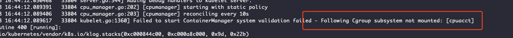

# 节点相关问题

# keycreate permission denied

# 问题描述

```
write /proc/self/attr/keycreate: permission denied
```


具体报错：

```
kuberuntime_manager.go:758] createPodSandbox for pod "ecc-hostpath-provisioner-8jbhf_kube-system(b8050fd3-4ffe-11eb-a82e-c6090b53405b)" failed: rpc error: code = Unknown desc = failed to start sandbox container for pod "ecc-hostpath-provisioner-8jbhf": Error response from daemon: OCI runtime create failed: container_linux.go:349: starting container process caused "process_linux.go:449: container init caused \"write /proc/self/attr/keycreate: permission denied\"": unknown
```


# 解决办法

SELINUX未设置成disabled

```
# 将SELINUX设置成disabled
setenforce 0 # 临时生效
# 永久生效，但需重启，配合上述命令可以不用立即重启
sed -i "s/SELINUX=enforcing/SELINUX=disabled/g" /etc/selinux/config

# 查看SELinux状态
$ /usr/sbin/sestatus -v 
SELinux status:                 disabled

$ getenforce
Disabled
```


# Cgroup不支持pid资源

# 问题描述

机器内核版本较低，kubelet启动异常，报错如下：

```
Failed to start ContainerManager failed to initialize top level QOS containers: failed to update top level Burstable QOS cgroup : failed to set supported cgroup subsystems for cgroup [kubepods burstable]: Failed to find subsystem mount for required subsystem: pids
```


# 原因分析

低版本内核的cgroup不支持pids资源的功能，

```
cat /proc/cgroups
#subsys_name	hierarchy	num_cgroups	enabled
cpuset	5	6	1
cpu	2	76	1
cpuacct	2	76	1
memory	4	76	1
devices	10	76	1
freezer	7	6	1
net_cls	3	6	1
blkio	8	76	1
perf_event	9	6	1
hugetlb	6	6	1
```


正常机器的cgroup

```
root@host:~# cat /proc/cgroups
#subsys_name	hierarchy	num_cgroups	enabled
cpuset	5	17	1
cpu	7	80	1
cpuacct	7	80	1
memory	12	80	1
devices	10	80	1
freezer	2	17	1
net_cls	4	17	1
blkio	8	80	1
perf_event	6	17	1
hugetlb	11	17	1
pids	3	80	1    # 此处支持pids资源
oom	9	1	1
```


# 解决方案

1、升级内核版本，使得cgroup支持pids资源。

或者

2、将kubelet的启动参数添加 SupportPodPidsLimit=false,SupportNodePidsLimit=false

```
vi /etc/systemd/system/kubelet.service

# 添加 kubelet 启动参数 
--feature-gates=... ,SupportPodPidsLimit=false,SupportNodePidsLimit=false \

systemctl daemon-reload && systemctl restart kubelet.service
```


文档参考：

- [Kubernetes 1.14 稳定性改进中的进程ID限制](https://kubernetes.io/zh/blog/2019/04/15/kubernetes-1.14-稳定性改进中的进程id限制/)
- https://blog.csdn.net/qq_38900565/article/details/100707025
- https://adoyle.me/Today-I-Learned/k8s/k8s-deployment.html

# Cgroup子系统无法挂载

# 问题描述

内核版本： 5.4.56-200.el7.x86_64

docker报错

```
May 13 16:54:26 8b26d7a8 dockerd[44352]: time="2021-05-13T16:54:26.565235530+08:00" level=warning msg="failed to load plugin io.containerd.snapshotter.v1.devmapper" error="devmapper not configured"
May 13 16:54:26 8b26d7a8 dockerd[44352]: time="2021-05-13T16:54:26.565525512+08:00" level=warning msg="could not use snapshotter devmapper in metadata plugin" error="devmapper not configured"
May 13 16:54:26 8b26d7a8 dockerd[44352]: time="2021-05-13T16:54:26.574734345+08:00" level=warning msg="Your kernel does not support CPU realtime scheduler"
May 13 16:54:26 8b26d7a8 dockerd[44352]: time="2021-05-13T16:54:26.574792864+08:00" level=warning msg="Your kernel does not support cgroup blkio weight"
May 13 16:54:26 8b26d7a8 dockerd[44352]: time="2021-05-13T16:54:26.574800326+08:00" level=warning msg="Your kernel does not support cgroup blkio weight_device"
```


kubelet报错

[](https://github.com/huweihuang/kubernetes-notes/blob/master/images/troubleshooting/cgroup-not-mount.png)

# 解决

cgroup问题解决：

1、curl https://pi-ops.oss-cn-hangzhou.aliyuncs.com/scripts/cgroupfs-mount.sh | bash

2、重启设备即可解决

# Pod驱逐

# 问题描述

节点Pod被驱逐

# 原因

## 1. 查看节点和该节点pod状态

查看节点状态为Ready，查看该节点的所有pod，发现存在被驱逐的pod和nvidia-device-plugin为pending

```
root@host:~$ kgpoallowide |grep 192.168.1.1
department-56   173e397c-ea35-4aac-85d8-07106e55d7b7   0/1       Evicted             0          52d       <none>            192.168.1.1   <none>
kube-system     nvidia-device-plugin-daemonset-d58d2   0/1       Pending             0          1s        <none>            192.168.1.1   <none>
```


## 2. 查看对应节点kubelet的日志

```
0905 15:42:13.182280   23506 eviction_manager.go:142] Failed to admit pod rdma-device-plugin-daemonset-8nwb8_kube-system(acc28a85-cfb0-11e9-9729-6c92bf5e2432) - node has conditions: [DiskPressure]
I0905 15:42:14.827343   23506 kubelet.go:1836] SyncLoop (ADD, "api"): "nvidia-device-plugin-daemonset-88sm6_kube-system(adbd9227-cfb0-11e9-9729-6c92bf5e2432)"
W0905 15:42:14.827372   23506 eviction_manager.go:142] Failed to admit pod nvidia-device-plugin-daemonset-88sm6_kube-system(adbd9227-cfb0-11e9-9729-6c92bf5e2432) - node has conditions: [DiskPressure]
I0905 15:42:15.722378   23506 kubelet_node_status.go:607] Update capacity for nvidia.com/gpu-share to 0
I0905 15:42:16.692488   23506 kubelet.go:1852] SyncLoop (DELETE, "api"): "rdma-device-plugin-daemonset-8nwb8_kube-system(acc28a85-cfb0-11e9-9729-6c92bf5e2432)"
W0905 15:42:16.698445   23506 status_manager.go:489] Failed to delete status for pod "rdma-device-plugin-daemonset-8nwb8_kube-system(acc28a85-cfb0-11e9-9729-6c92bf5e2432)": pod "rdma-device-plugin-daemonset-8nwb8" not found
I0905 15:42:16.698490   23506 kubelet.go:1846] SyncLoop (REMOVE, "api"): "rdma-device-plugin-daemonset-8nwb8_kube-system(acc28a85-cfb0-11e9-9729-6c92bf5e2432)"
I0905 15:42:16.699267   23506 kubelet.go:2040] Failed to delete pod "rdma-device-plugin-daemonset-8nwb8_kube-system(acc28a85-cfb0-11e9-9729-6c92bf5e2432)", err: pod not found
W0905 15:42:16.777355   23506 eviction_manager.go:332] eviction manager: attempting to reclaim nodefs
I0905 15:42:16.777384   23506 eviction_manager.go:346] eviction manager: must evict pod(s) to reclaim nodefs
E0905 15:42:16.777390   23506 eviction_manager.go:357] eviction manager: eviction thresholds have been met, but no pods are active to evict
```


存在关于pod驱逐相关的日志，驱逐的原因为`node has conditions: [DiskPressure]`。

## 3. 查看磁盘相关信息

```
[root@host /]# df -h
Filesystem      Size  Used Avail Use% Mounted on
devtmpfs        126G     0  126G   0% /dev
tmpfs           126G     0  126G   0% /dev/shm
tmpfs           126G   27M  126G   1% /run
tmpfs           126G     0  126G   0% /sys/fs/cgroup
/dev/sda1        20G   19G     0 100% /   # 根目录磁盘满
/dev/nvme1n1    3.0T  191G  2.8T   7% /data2
/dev/nvme0n1    3.0T  1.3T  1.7T  44% /data1
/dev/sda4       182G   95G   87G  53% /data
/dev/sda3        20G  3.8G   15G  20% /usr/local
tmpfs            26G     0   26G   0% /run/user/0
```


发现根目录的磁盘盘，接着查看哪些文件占用磁盘。

```
[root@host ~/kata]# du -sh ./*
1.0M	./log
944K	./netlink
6.6G	./kernel3
```


/var/log/下存在7G 的日志。清理相关日志和无用文件后，根目录恢复空间。

```
[root@host /data]# df -h
Filesystem      Size  Used Avail Use% Mounted on
devtmpfs        126G     0  126G   0% /dev
tmpfs           126G     0  126G   0% /dev/shm
tmpfs           126G   27M  126G   1% /run
tmpfs           126G     0  126G   0% /sys/fs/cgroup
/dev/sda1        20G  5.8G   13G  32% /   # 根目录正常
/dev/nvme1n1    3.0T  191G  2.8T   7% /data2
```


查看节点pod状态，相关plugin的pod恢复正常。

```
root@host:~$ kgpoallowide |grep 192.168.1.1
kube-system     nvidia-device-plugin-daemonset-h4pjc   1/1       Running             0          16m       192.168.1.1   192.168.1.1   <none>
kube-system     rdma-device-plugin-daemonset-xlkbv     1/1       Running             0          16m       192.168.1.1   192.168.1.1   <none>
```


## 4. 查看kubelet配置

查看kubelet关于pod驱逐相关的参数配置，可见节点kubelet开启了驱逐机制，正常情况下该配置应该是关闭的。

```
ExecStart=/usr/local/bin/kubelet \
	...
  --eviction-hard=nodefs.available<1% \
```


# 解决方案

总结以上原因为，kubelet开启了pod驱逐的机制，根目录的磁盘达到100%，pod被驱逐，且无法再正常创建在该节点。

解决方案如下：

1、关闭kubelet的驱逐机制。

2、清除根目录的文件，恢复根目录空间，并后续增加根目录的磁盘监控。

# 镜像拉取失败问题

常见镜像拉取问题排查

## 1. Pod状态为ErrImagePull或ImagePullBackOff

```
docker-hub-75d4dfb984-5hggg           0/1     ImagePullBackOff   0          14m     192.168.1.30   <node ip>   
docker-hub-75d4dfb984-9r57b           0/1     ErrImagePull       0          53s     192.168.0.42   <node ip>   
```


- ErrImagePull：表示pod已经调度到node节点，kubelet调用docker去拉取镜像失败。
- ImagePullBackOff：表示kubelet拉取镜像失败后，不断重试去拉取仍然失败。

## 2. 查看pod的事件

通过kubectl describe pod 命令查看pod事件，该事件的报错信息在kubelet或docker的日志中也会查看到。

### 2.1. http: server gave HTTP response to HTTPS client

如果遇到以下报错，尝试将该镜像仓库添加到docker可信任的镜像仓库配置中。

```
Error getting v2 registry: Get https://docker.com:8080/v2/: http: server gave HTTP response to HTTPS client"
```


具体操作是修改/etc/docker/daemon.json的insecure-registries参数

```
#cat /etc/docker/daemon.json
{
	...
  "insecure-registries": [
	...
    "docker.com:8080"
  ],
  ...
}
```


### 2.2. no basic auth credentials

如果遇到`no basic auth credentials`报错，说明kubelet调用docker接口去拉取镜像时，镜像仓库的认证信息失败。

```
  Normal   BackOff    18s               kubelet, 192.168.1.1  Back-off pulling image "docker.com:8080/public/2048:latest"
  Warning  Failed     18s               kubelet, 192.168.1.1  Error: ImagePullBackOff
  Normal   Pulling    5s (x2 over 18s)  kubelet, 192.168.1.1  Pulling image "docker.com:8080/public/2048:latest"
  Warning  Failed     5s (x2 over 18s)  kubelet, 192.168.1.1  Failed to pull image "docker.com:8080/public/2048:latest": rpc error: code = Unknown desc = Error response from daemon: Get http://docker.com:8080/v2/public/2048/manifests/latest: no basic auth credentials
  Warning  Failed     5s (x2 over 18s)  kubelet, 192.168.1.1  Error: ErrImagePull
```


具体操作，在拉取镜像失败的节点上登录该镜像仓库，认证信息会更新到` $HOME/.docker/config.json`文件中。将该文件拷贝到`/var/lib/kubelet/config.json`中。

# PVC Terminating

# 问题描述

```
pvc terminating
```


pvc在删除时，卡在terminating中。

# 解决方法

```
kubectl patch pvc {PVC_NAME} -p '{"metadata":{"finalizers":null}}'
```


