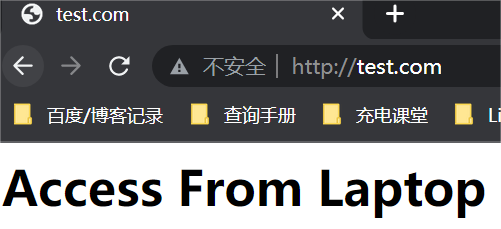

# [Ingress](https://kubernetes.io/zh-cn/docs/concepts/services-networking/ingress/)

Ingress 是对集群中服务的**外部访问进行管理的 API 对象**，提供从集群外部到集群内 服务 的 HTTP 和 HTTPS 路由。 流量路由由 Ingress 资源所定义的规则来控制。

下面是 Ingress 的一个简单示例，可将所有流量都发送到同一 Service：


通过配置，Ingress 可为 Service 提供外部可访问的 URL、对其流量作负载均衡、 终止 SSL/TLS，以及基于名称的虚拟托管等能力。 Ingress 控制器负责完成 Ingress 的工作，具体实现上通常会使用某个负载均衡器， 不过也可以配置边缘路由器或其他前端来帮助处理流量。

Ingress 不会随意公开端口或协议。 将 HTTP 和 HTTPS 以外的服务开放到 Internet 时，通常使用 Service.Type=NodePort 或 Service.Type=LoadBalancer 类型的 Service。

**Ingress 和 Service 区别**

都是 Kubernetes 中用于将流量路由到应用程序的机制，但它们在路由层面上有所不同，一个对内一个对外：

- Service 是 Kubernetes 中抽象的应用程序服务，它公开了一个单一的IP地址和端口，可以用于在 Kubernetes 集群内部的 Pod 之间进行流量路由。
- Ingress 是一个 Kubernetes 资源对象，它提供了对集群外部流量路由的规则。Ingress 通过一个公共IP地址和端口将流量路由到一个或多个Service。

## Ingress Controller

想要让 Ingress 工作，集群必须有一个正在运行的 Ingress 控制器。Ingress Controller 通常会运行在 Kubernetes 集群中，作为一组 Deployment 和 Service 的形式部署。

与作为 `kube-controller-manager` 可执行文件的一部分运行的其他类型的控制器不同， Ingress 控制器不是随集群自动启动的。你可选择最适合你的集群的 ingress 控制器实现功能。

Kubernetes 作为一个项目，目前支持和维护 [AWS](https://github.com/kubernetes-sigs/aws-load-balancer-controller#readme)、 [GCE](https://git.k8s.io/ingress-gce/README.md#readme) 和 [Nginx](https://git.k8s.io/ingress-nginx/README.md#readme) Ingress 控制器。[其他Ingress Controller控制器](https://kubernetes.io/zh-cn/docs/concepts/services-networking/ingress-controllers/)

常见的 Ingress Controller 包括：

1. [Nginx Ingress Controller](https://github.com/nginxinc/kubernetes-ingress) 是由 Kubernetes 社区维护的另一个 Ingress Controller，它也是使用 Nginx 作为反向代理实现的，可以支持 HTTP 和 HTTPS 等协议，支持负载均衡、路由、HTTPS证书管理等功能。
2. [Ingress Nginx Controller](https://kubernetes.github.io/ingress-nginx/deploy/) 是官方维护的一个 Ingress Controller，它是使用 Nginx 作为反向代理实现的，可以支持 HTTP 和 HTTPS 等协议，支持负载均衡、路由、HTTPS证书管理等功能。
3. Traefik Ingress Controller：基于 Go 语言开发的 Ingress Controller，支持多种路由匹配方式和多种后端服务发现方式。
   - **Traefik Ingress Controller: 标准实现 支持 官方 Ingress 路由规则 注意: 这种方式使用繁琐!**
   - **Traefik Route CRD(customer resuource definition)自定义资源  注意: 使用这种方式简单,自定义资源方式定义路由规则。**
4. Istio Ingress Controller：基于 Istio Service Mesh 实现的 Ingress Controller，提供了更丰富的负载均衡、流量控制和安全功能。
5. Kong Ingress Controller：使用 Kong 作为反向代理实现 Ingress 功能，支持 API 管理和 Gateway 功能。

[安装指南 - Ingress-Nginx 控制器 (kubernetes.github.io)](https://kubernetes.github.io/ingress-nginx/deploy/)

[使用清单进行安装 |NGINX 入口控制器](https://docs.nginx.com/nginx-ingress-controller/installation/installing-nic/installation-with-manifests/)

## [Ingress 示例](https://kubernetes.io/zh-cn/docs/reference/kubernetes-api/service-resources/ingress-v1/#IngressBackend)

一个小的 Ingress 资源示例：

```yaml
apiVersion: networking.k8s.io/v1
kind: Ingress
metadata:
  name: minimal-ingress
  annotations: # # 注解部分，用于配置 Ingress 控制器的行为
    nginx.ingress.kubernetes.io/rewrite-target: / # # 使用 NGINX Ingress 控制器时，重写目标路径为根路径
spec:
  ingressClassName: nginx-example	# 指定用于此 Ingress 的 Ingress 类名称 
  rules: 	# ingress规则配置，可以配置多个
    - host: *.helloworld.info # 域名配置，可以使用通配符 * 
      http:
        paths:	# 相当于 nginx 的 location 配置，可以配置多个
          - path: /		# 匹配路径为 /
            pathType: Prefix	# 路径匹配。Prefix：根据按 “/” 拆分的 URL 路径前缀进行匹配。Exact：与 URL 路径完全匹配
            backend: 	# 路由到的后端服务
              service:	# 代理到哪个service
                name: web	# 后端服务的名称
                port:
                  number: 8080	# 后端服务的端口号。number数字类型
```

## Ingress 类型

### 基于URI控制

根据请求的 HTTP URI 将来自同一 IP 地址的流量路由到多个 Service。 Ingress 允许你将负载均衡器的数量降至最低。例如，这样的设置：


这将需要一个如下所示的 Ingress：

```yaml
apiVersion: networking.k8s.io/v1
kind: Ingress
metadata:
  name: simple-fanout-example
spec:
  rules:
  - host: foo.bar.com
    http:
      paths:
      - path: /foo
        pathType: Prefix
        backend:
          service:
            name: service1
            port:
              number: 4200
      - path: /bar
        pathType: Prefix
        backend:
          service:
            name: service2
            port:
              number: 8080
```

当你使用 `kubectl apply -f` 创建 Ingress 时：

```shell
$ kubectl describe ingress simple-fanout-example
Name:             simple-fanout-example
Namespace:        default
Address:          178.91.123.132
Default backend:  default-http-backend:80 (10.8.2.3:8080)
Rules:
  Host         Path  Backends
  ----         ----  --------
  foo.bar.com
               /foo   service1:4200 (10.8.0.90:4200)
               /bar   service2:8080 (10.8.0.91:8080)
Annotations:
  nginx.ingress.kubernetes.io/rewrite-target:  /
Events:
  Type     Reason  Age                From                     Message
  ----     ------  ----               ----                     -------
  Normal   ADD     22s                loadbalancer-controller  default/test
```

此 Ingress 控制器构造一个特定于实现的负载均衡器来供 Ingress 使用， 前提是 Service （`service1`、`service2`）存在。 当它完成负载均衡器的创建时，你会在 Address 字段看到负载均衡器的地址。

**说明：**

取决于你所使用的 [Ingress 控制器](https://kubernetes.io/zh-cn/docs/concepts/services-networking/ingress-controllers/)， 你可能需要创建默认 HTTP 后端[服务](https://kubernetes.io/zh-cn/docs/concepts/services-networking/service/)。

### 基于域名控制

基于名称的虚拟主机支持将针对多个主机名的 HTTP 流量路由到同一 IP 地址上。


以下 Ingress 让后台负载均衡器基于 [host 头部字段](https://tools.ietf.org/html/rfc7230#section-5.4)来路由请求。

```yaml
apiVersion: networking.k8s.io/v1
kind: Ingress
metadata:
  name: name-virtual-host-ingress
spec:
  rules:
  - host: foo.bar.com
    http:
      paths:
      - pathType: Prefix
        path: "/"
        backend:
          service:
            name: service1
            port:
              number: 80
  - host: bar.foo.com
    http:
      paths:
      - pathType: Prefix
        path: "/"
        backend:
          service:
            name: service2
            port:
              number: 80
```

如果你所创建的 Ingress 资源没有在 `rules` 中定义主机，则规则可以匹配指向 Ingress 控制器 IP 地址的所有网络流量，而无需基于名称的虚拟主机。

例如，下面的 Ingress 对象会将请求 `first.bar.com` 的流量路由到 `service1`，将请求 `second.bar.com` 的流量路由到 `service2`，而将所有其他流量路由到 `service3`。

```yaml
apiVersion: networking.k8s.io/v1
kind: Ingress
metadata:
  name: name-virtual-host-ingress-no-third-host
spec:
  rules:
  - host: first.bar.com
    http:
      paths:
      - pathType: Prefix
        path: "/"
        backend:
          service:
            name: service1
            port:
              number: 80
  - host: second.bar.com
    http:
      paths:
      - pathType: Prefix
        path: "/"
        backend:
          service:
            name: service2
            port:
              number: 80
  - http:
      paths:
      - pathType: Prefix
        path: "/"
        backend:
          service:
            name: service3
            port:
              number: 80
```

### 单个 Service 来支持的 Ingress

现有的 Kubernetes 概念允许你暴露单个 Service（参见[替代方案](https://kubernetes.io/zh-cn/docs/concepts/services-networking/ingress/#alternatives)）。 你也可以使用 Ingress 并设置无规则的**默认后端**来完成这类操作。

```yaml
apiVersion: networking.k8s.io/v1
kind: Ingress
metadata:
  name: test-ingress
spec:
  defaultBackend:
    service:
      name: test
      port:
        number: 80
```

如果使用 `kubectl apply -f` 创建此 Ingress，则应该能够查看刚刚添加的 Ingress 的状态：

```shell
# kubectl get ingress test-ingress
NAME           CLASS         HOSTS   ADDRESS         PORTS   AGE
test-ingress   external-lb   *       203.0.113.123   80      59s
```

其中 `203.0.113.123` 是由 Ingress 控制器分配的 IP，用以服务于此 Ingress。

**说明：**

Ingress 控制器和负载平衡器的 IP 地址分配操作可能需要一两分钟。 在此之前，你通常会看到地址字段的取值为 `<pending>`。

### TLS

你可以通过设定包含 TLS 私钥和证书的[Secret](https://kubernetes.io/zh-cn/docs/concepts/configuration/secret/) 来保护 Ingress。 Ingress 资源只支持一个 TLS 端口 443，并假定 TLS 连接终止于 Ingress 节点 （与 Service 及其 Pod 间的流量都以明文传输）。 如果 Ingress 中的 TLS 配置部分指定了不同主机，那么它们将通过 SNI TLS 扩展指定的主机名（如果 Ingress 控制器支持 SNI）在同一端口上进行复用。 TLS Secret 的数据中必须包含键名为 `tls.crt` 的证书和键名为 `tls.key` 的私钥， 才能用于 TLS 目的。例如：

首先创建证书，生产环境的证书为公司购买的证书：

```sh
kubectl -n default create secret tls nginx-test-tls --key=tls.key --cert=tls.crt
```

或者

```yaml
apiVersion: v1
kind: Secret
metadata:
  name: testsecret-tls
  namespace: default
data:
  tls.crt: base64 编码的证书
  tls.key: base64 编码的私钥
type: kubernetes.io/tls
```

在 Ingress 中引用此 Secret 将会告诉 Ingress 控制器使用 TLS 加密从客户端到负载均衡器的通道。 你要确保所创建的 TLS Secret 创建自包含 `https-example.foo.com` 的公共名称 （Common Name，CN）的证书。这里的公共名称也被称为全限定域名（Fully Qualified Domain Name，FQDN）。

**说明：**

注意，不能针对默认规则使用 TLS，因为这样做需要为所有可能的子域名签发证书。 因此，`tls` 字段中的 `hosts` 的取值需要与 `rules` 字段中的 `host` 完全匹配。

```yaml
apiVersion: networking.k8s.io/v1
kind: Ingress
metadata:
  name: tls-example-ingress
spec:
  tls:
  - hosts:
      - https-example.foo.com
    secretName: testsecret-tls
  rules:
  - host: https-example.foo.com
    http:
      paths:
      - path: /
        pathType: Prefix
        backend:
          service:
            name: service1
            port:
              number: 80
```

**说明：**

各种 Ingress 控制器在所支持的 TLS 特性上参差不齐。请参阅与 [nginx](https://kubernetes.github.io/ingress-nginx/user-guide/tls/)、 [GCE](https://git.k8s.io/ingress-gce/README.md#frontend-https) 或者任何其他平台特定的 Ingress 控制器有关的文档，以了解 TLS 如何在你的环境中工作。

### 负载均衡

Ingress 控制器启动引导时使用一些适用于所有 Ingress 的负载均衡策略设置， 例如负载均衡算法、后端权重方案等。 更高级的负载均衡概念（例如持久会话、动态权重）尚未通过 Ingress 公开。 你可以通过用于 Service 的负载均衡器来获取这些功能。

值得注意的是，尽管健康检查不是通过 Ingress 直接暴露的，在 Kubernetes 中存在[就绪态探针](https://kubernetes.io/zh-cn/docs/tasks/configure-pod-container/configure-liveness-readiness-startup-probes/) 这类等价的概念，供你实现相同的目的。 请查阅特定控制器的说明文档（例如：[nginx](https://git.k8s.io/ingress-nginx/README.md)、 [GCE](https://git.k8s.io/ingress-gce/README.md#health-checks)） 以了解它们是怎样处理健康检查的。


## 4 使用 [Traefik Ingress CRD](https://doc.traefik.io/traefik/) 方式

具体参考: https://doc.traefik.io/traefik/user-guides/crd-acme/

### 1 pod 无法访问 Service 解决方案

```shell
$ kubectl edit cm kube-proxy -n kube-system
ipvs:
excludeCIDRs: null
minSyncPeriod: 0s
scheduler: ""
strictARP: false
syncPeriod: 0s
tcpFinTimeout: 0s
tcpTimeout: 0s
udpTimeout: 0s
kind: KubeProxyConfiguration
metricsBindAddress: ""
mode: "ipvs" #这里默认为空，填写ipvs保存

$ cat > /etc/sysconfig/modules/ipvs.modules << EOF
#!/bin/bash
modprobe -- ip_vs
modprobe -- ip_vs_rr
modprobe -- ip_vs_wrr
modprobe -- ip_vs_sh
modprobe -- nf_conntrack
modprobe -- br_netfilter
EOF

$ chmod 755 /etc/sysconfig/modules/ipvs.modules && bash /etc/sysconfig/modules/ipvs.modules && lsmod | grep -e ip_vs -e nf_conntrack_ipv4

$ kubectl get pod -n kube-system | grep kube-proxy |awk '{system("kubectl delete pod "$1" -n kube-system")}'
```

# [Ingress Nginx Controller](https://kubernetes.github.io/ingress-nginx/deploy/)使用

**在使用Example示例时，先查看官网具体使用**

要将Kubernetes集群内的服务发布到集群外来使用，通常的办法是

1. 配置NodePort
2. 配置LoadBalancer的Service
3. 配置ExternalIP的Service
4. 通过Pod模板中的HostPort进行配置等。

但这些方式都存在比较严重的问题。它们几乎都是通过节点端口形式向外暴露服务的，Service一旦变多，每个节点上开启的端口也会 变多。这样不仅维护起来相当复杂，安全性还会大大降低。

Ingress可以避免这个问题，除了Ingress自身的服务需要向外发布之外，其他服务不必使用节点端口形式向外发布。

在服务发布基础篇，我们介绍了Ingress这个抽象概念，并且对Ingress的配置进行了简单的讲解。

但是在实际使用时，对于应用的发布，场景更为复杂，之前讲解的内容不足以满足生产环境的需求。 本章将会进一步介绍Ingress的使用，以满足实际使用时的各种需求。

首先回顾一下用户访问一个业务的流程：

1）用户在浏览器中输入域名。

2）域名解析至业务的入口IP（一般为外部负载均衡器，比如阿里云的SLB或者DMZ的网关）。

3）外部负载均衡器反向代理至Kubernetes的入口（一般为Ingress，或者通过NodePort暴露的服务等）。

4）Ingress根据自身的配置找到对应的Service，再代理到对应的Service上。

5）最后到达Service对应的某一个Pod上。

Ingress Controller 可以理解为一个监听器，通过不断地监听 kube-apiserver，实时的感知后端 Service、Pod 的变化，当得到这些信息变化后，Ingress Controller 再结合 Ingress 的配置，更新反向代理负载均衡器，达到服务发现的作用。其实这点和服务发现工具 consul、 consul-template 非常类似。


可见，在一般情况下，Ingress主要是一个用于Kubernetes集群业务的入口。

[Ingress Nginx Controller](https://kubernetes.github.io/ingress-nginx/deploy/)更多使用Example参考 

## 1. 安装Ingress Nginx Controller

之前提到过，由于Ingress Controller相当于Kubernetes集群中服务的“大门”，因此在生产环境中，一定要保障Controller的稳定性和可用性。

为了提高Ingress Controller的可用性，我们一般采用单独的服务器作为Controller节点，以此保障Ingress Controller的Pod资源不会被其他服务的 Pod影响。

由于 nginx-ingress 所在的节点需要能够访问外网，这样域名可以解析到这些节点上直接使用，所以需要让 nginx-ingress 绑定节点的 80 和 443 端口，所以可以使用 hostPort 来进行访问，当然对于线上环境来说为了保证高可用，一般是需要运行多个 nginx-ingress 实例的，然后可以用一个 nginx/haproxy 作为入口，通过 keepalived 来访问边缘节点的 vip 地址。

**边缘节点**

所谓的边缘节点即集群内部用来向集群外暴露服务能力的节点，集群外部的服务通过该节点来调用集群内部的服务，边缘节点是集群内外交流的一个Endpoint。


**生产环境**：我们部署2个ingress节点，做ha高可用，对外发布服务。

1. 设置污点和标签

```
# kubectl taint node k8s-node1 GiteeCommonAddonsOnly=yes:NoSchedule
# kubectl taint node k8s-node2 GiteeCommonAddonsOnly=yes:NoSchedule
```

1. 打标签

```
## 打上2个标签。
## 带有ingress标识符的标签
# kubectl label nodes k8s-node01 node-role.kubernetes.io/ingress="true"
# kubectl label nodes k8s-node02 node-role.kubernetes.io/ingress="true"

## 查看节点是否设置 Label 成功
## 查看所有节点
# kubectl get nodes --show-labels

## 查看单个节点
# kubectl get nodes k8s-node01 --show-labels


## 删除带有node-role.kubernetes.io/edge标识符的标签
# kubectl label k8s-node01 node-role.kubernetes.io/ingress-
# kubectl label k8s-node02 node-role.kubernetes.io/ingress-

## 更新deployment，增加nodeSelector配置
# $ kubectl -n kube-system patch deployment nginx-ingress-controller -p '{"spec": {"template": {"spec": {"nodeSelector": {"node-role.kubernetes.io/ingress": "true"}}}}}'
```

1. 安装keepalived+haproxy

设置边缘节点高可用，在k8s-node01和k8s-node02上安装keepalived+haproxy

> 参考[在指定节点部署Ingress服务](https://sre.ink/deploy-ingress-on-single-node/)
>

**测试环境**

这里将k8s-node01作为边缘节点，打上Label：

```
$ kubectl label nodes k8s-node01 node-role.kubernetes.io/ingress="true"
$ kubectl  get nodes
NAME           STATUS   ROLES           AGE   VERSION
k8s-master01   Ready    control-plane   19h   v1.25.6
k8s-master02   Ready    control-plane   19h   v1.25.6
k8s-master03   Ready    control-plane   19h   v1.25.6
k8s-node01     Ready    ingress         19h   v1.25.6

# kubectl get nodes k8s-node01 --show-labels
NAME         STATUS   ROLES     AGE   VERSION   LABELS
k8s-node01   Ready    ingress   19h   v1.25.6   beta.kubernetes.io/arch=amd64,beta.kubernetes.io/os=linux,kubernetes.io/arch=amd64,kubernetes.io/hostname=k8s-node01,kubernetes.io/os=linux,node-role.kubernetes.io/ingress=true
```

下载ingress-nginx的helm chart:

```sh
# 如果你不喜欢使用 helm chart 进行安装也可以使用下面的命令一键安装
# kubectl apply -f https://raw.githubusercontent.com/kubernetes/ingress-nginx/controller-v1.1.0/deploy/static/provider/cloud/deploy.yaml
➜ helm repo add ingress-nginx https://kubernetes.github.io/ingress-nginx
➜ helm repo update
➜ helm fetch ingress-nginx/ingress-nginx
➜ tar -xvf ingress-nginx-4.4.2.tgz
```

我们这里测试环境只有 k8s-node01节点可以访问外网，这里我们就直接讲 ingress-nginx 固定到 k8s-node01节点上，采用 hostNetwork 模式(生产环境可以使用 LB + DaemonSet hostNetwork 模式)。

然后新建一个名为 values-prod.yaml 的 Values 文件，用来覆盖 ingress-nginx 默认的 Values 值，对应的数据如下所示：

```
➜ helm show values ingress-nginx > values-prod.yaml
➜ vim values-prod.yaml
controller:
  name: controller
  image:
    repository: cnych/ingress-nginx
    tag: "v1.1.0"
    digest:

  dnsPolicy: ClusterFirstWithHostNet

  config:
    apiVersion: v1
    client_max_body_size: 20m
    custom-http-errors: "404,415,503"

  hostNetwork: true

  publishService:  # hostNetwork 模式下设置为false，通过节点IP地址上报ingress status数据
    enabled: false

  # 是否需要处理不带 ingressClass 注解或者 ingressClassName 属性的 Ingress 对象
  # 设置为 true 会在控制器启动参数中新增一个 --watch-ingress-without-class 标注
  watchIngressWithoutClass: false

  kind: DaemonSet

  nodeSelector:   # 固定到k8s-node1节点
    node-role.kubernetes.io/ingress: 'true'

  service:  # HostNetwork 模式不需要创建service
    enabled: false

  admissionWebhooks: # 强烈建议开启 admission webhook
    enabled: true
    createSecretJob:
      resources:
        limits:
          cpu: 10m
          memory: 20Mi
        requests:
          cpu: 10m
          memory: 20Mi
    patchWebhookJob:
      resources:
        limits:
          cpu: 10m
          memory: 20Mi
        requests:
          cpu: 10m
          memory: 20Mi
    patch:
      enabled: true
      image:
        repository: cnych/ingress-nginx-webhook-certgen
        tag: v1.1.1
        digest:

defaultBackend:
  enabled: true
  name: defaultbackend
  image:
    repository: cnych/ingress-nginx-defaultbackend
    tag: "1.5"
```

使用如下命令安装 ingress-nginx 应用到 ingress-nginx 的命名空间中：

```
➜ helm install ingress-nginx ingress-nginx -f ./values-prod.yaml --namespace ingress-nginx  --create-namespace
NAME: ingress-nginx
LAST DEPLOYED: Thu Feb  9 14:21:40 2023
NAMESPACE: ingress-nginx
STATUS: deployed
REVISION: 1
TEST SUITE: None
NOTES:
The ingress-nginx controller has been installed.
It may take a few minutes for the LoadBalancer IP to be available.
You can watch the status by running 'kubectl --namespace ingress-nginx get services -o wide -w ingress-nginx-controller'

An example Ingress that makes use of the controller:
  apiVersion: networking.k8s.io/v1
  kind: Ingress
  metadata:
    name: example
    namespace: foo
  spec:
    ingressClassName: nginx
    rules:
      - host: www.example.com
        http:
          paths:
            - pathType: Prefix
              backend:
                service:
                  name: exampleService
                  port:
                    number: 80
              path: /
    # This section is only required if TLS is to be enabled for the Ingress
    tls:
      - hosts:
        - www.example.com
        secretName: example-tls

If TLS is enabled for the Ingress, a Secret containing the certificate and key must also be provided:

  apiVersion: v1
  kind: Secret
  metadata:
    name: example-tls
    namespace: foo
  data:
    tls.crt: <base64 encoded cert>
    tls.key: <base64 encoded key>
  type: kubernetes.io/tls
```

部署完成后查看 Pod 的运行状态：

```
➜ kubectl get svc -n ingress-nginx
NAME                                 TYPE        CLUSTER-IP       EXTERNAL-IP   PORT(S)   AGE
ingress-nginx-controller-admission   ClusterIP   192.168.5.132    <none>        443/TCP   2m6s
ingress-nginx-defaultbackend         ClusterIP   192.168.230.39   <none>        80/TCP    2m6s

➜ kubectl get pods -n ingress-nginx
NAME                                           READY   STATUS    RESTARTS   AGE
ingress-nginx-controller-j9w5j                 1/1     Running   0          2m36s
ingress-nginx-defaultbackend-f67985f77-t766q   1/1     Running   0          2m36s
➜  POD_NAME=$(kubectl get pods -l app.kubernetes.io/name=ingress-nginx -n ingress-nginx -o jsonpath='{.items[0].metadata.name}')
➜  kubectl exec -it $POD_NAME -n ingress-nginx -- /nginx-ingress-controller --version
-------------------------------------------------------------------------------
NGINX Ingress controller
  Release:       v1.1.0
  Build:         cacbee86b6ccc45bde8ffc184521bed3022e7dee
  Repository:    https://github.com/kubernetes/ingress-nginx
  nginx version: nginx/1.19.9

-------------------------------------------------------------------------------
```

当看到上面的信息证明 `ingress-nginx` 部署成功了，这里我们安装的是最新版本的控制器，安装完成后会自动创建一个 名为 `nginx` 的 `IngressClass` 对象：

```
➜  kubectl get ingressclass
NAME    CONTROLLER             PARAMETERS   AGE
nginx   k8s.io/ingress-nginx   <none>       3m55s

➜  kubectl get ingressclass nginx -o yaml
apiVersion: networking.k8s.io/v1
kind: IngressClass
metadata:
......
  labels:
    app.kubernetes.io/component: controller
    app.kubernetes.io/instance: ingress-nginx
    app.kubernetes.io/managed-by: Helm
    app.kubernetes.io/name: ingress-nginx
    app.kubernetes.io/part-of: ingress-nginx
    app.kubernetes.io/version: 1.5.1
    helm.sh/chart: ingress-nginx-4.4.2
  name: nginx
  resourceVersion: "124250"
  uid: 0745abff-fc05-4ca8-a3fe-3e6218ed94b6
spec:
  controller: k8s.io/ingress-nginx
```

不过这里我们只提供了一个 `controller` 属性，如果还需要配置一些额外的参数，则可以在安装的 values 文件中进行配置。

## 2. [Ingress Nginx入门](https://kubernetes.github.io/ingress-nginx/user-guide/basic-usage/)

首先从最简单的配置开始，假如公司有一个Web服务的容器，需要为其添加一个域名，此时可以使用Ingress实现该功能。

创建一个用于学习Ingress的Namespace，之后所有的操作都在此Namespace进行：

```
$ kubectl create ns study-ingress
namespace/study-ingress created
```

创建一个简单的Nginx模拟Web服务：

```
$ kubectl create deploy nginx --image=registry.cn-beijing.aliyuncs.com/dotbalo/nginx:1.15.12 -n study-ingress                             deployment.apps/nginx created
```

创建该Web容器的Service：

```
$ kubectl expose deploy nginx --port 80 -n study-ingress
service/nginx exposed
```

之后创建Ingress指向上面创建的Service：

web-ingress.yaml

```
apiVersion: networking.k8s.io/v1
kind: Ingress
metadata:
  name: nginx-ingress
  namespace: study-ingress
spec:
  ingressClassName: nginx
  rules:
  - host: nginx.test.com
    http:
      paths:
      - backend:
          service:
            name: nginx
            port:
              number: 80
        path: /
        pathType: ImplementationSpecific
```

提示:

本章内容均采用networking.k8s.io/v1版本创建Ingress资源，如果Kubernetes版本低于1.19，可以使用networking.k8s.io/v1beta1替代，配 置可以参考上述的networking.k8s.io/v1beta1，只有backend配置不一样。

**v1beta1**

```
apiVersion: networking.k8s.io/v1beta1
kind: Ingress
metadata:
  name: nginx-ingress
  namespace: study-ingress
spec:
  rules:
  - host: nginx.test.com
    http:
      paths:
      - backend:
          serviceName: nginx
          servicePort: 80
        path: /
        pathType: ImplementationSpecific
```

创建该Ingress：

```
$ kubectl create -f web-ingress.yaml
```

创建的Ingress绑定的域名为nginx.test.com，由于本书的IngressController是以hostNetwork模式部署的，因此将域 名解析至Ingress Controller所在的节点即可。(修改hosts文件，或者DNS指向)

如果Ingress Controller上层还有一层网关，解析至网关IP即可。接下来通过域名nginx.test.com即可访问Web服务器，如


可以看到通过上述简单的Ingress资源定义就可以实现以域名的方式访问服务，不需要再去维护复杂的Nginx配置文件，大大降低了运维的复杂度和出错的频率。

接下来通过一些其他配置实现企业内常用的功能，比如重定向、前后端分离、错误友好页面等。

## 3. [Ingress Nginx域名重定向Redirect](https://kubernetes.github.io/ingress-nginx/user-guide/nginx-configuration/annotations/#redirect-fromto-www)

当一个服务需要更换域名时，并不能对其直接更改，需要一个过渡的过程。

在这个过程中，需要将旧域名的访问跳转到新域名，此时可以使用Redirect功能。

待旧域名无访问时，再停止旧域名。在Nginx作为代理服务器时，Redirect可用于域名的重定向，比如访问old.com被重定向到new.com。

Ingress可以更简单地实现Redirect功能。接下来用nginx.redirect.com作为旧域名，baidu.com作为新域名进行演示：

redirect.yaml

```
apiVersion: networking.k8s.io/v1
kind: Ingress
metadata:
  annotations:
    nginx.ingress.kubernetes.io/permanent-redirect: https://www.baidu.com
  name: nginx-redirect
  namespace: study-ingress
spec:
  ingressClassName: nginx
  rules:
  - host: nginx.redirect.com
    http:
      paths:
      - backend:
          service:
            name: nginx
            port:
              number: 80
        path: /
        pathType: ImplementationSpecific
```

可以看到配置重定向功能只需要填加一个annotations即可，key为nginx.ingress.kubernetes.io/permanent-redirect ， 值 为 目 标 URL ：[https://www.baidu.com](https://www.baidu.com/)。

接下来同样的方式将nginx.redirect.com解析到Controller所在节点（接下来的示例不再提示添加Host），在浏览器访问或者使用curl访问，即可看到重定向信息。

使用curl访问域名nginx.redirect.com，可以看到301（请求被重定向的返回值）：

```
$ curl -I nginx.redirect.com
HTTP/1.1 301 Moved Permanently
Date: Fri, 10 Feb 2023 05:39:03 GMT
Content-Type: text/html
Content-Length: 162
Connection: keep-alive
Location: https://www.baidu.com
```

## 4. Ingress Nginx前后端分离Rewrite

现在大部分应用都是前后端分离的架构，也就是前端用某个域名的根路径进行访问，后端接口采用/api进行访问，用来区分前端和后端。

或者同时具有很多个后端，需要使用/api-a到A服务，/api-b到B服务，但是由于A和B服务可能并没有/api-a和/api-b的路径，因此需要将/api-x重写为“/”，才 可以正常到A或者B服务，否则将会出现404的报错。

此时可以通过Rewrite功能达到这种效果，首先创建一个应用模拟后端服务：

```
$ kubectl create deploy backend-api --image=registry.cn-beijing.aliyuncs.com/dotbalo/nginx:backend-api -n study-ingress                   deployment.apps/backend-api created
```

创建Service暴露该应用：

```
$ kubectl expose deploy backend-api --port 80 -n study-ingress
service/backend-api exposed
```

查看该Service的地址，并且通过/api-a访问测试：

```
$ kubectl get svc -n study-ingress
NAME          TYPE        CLUSTER-IP       EXTERNAL-IP   PORT(S)   AGE
backend-api   ClusterIP   192.168.27.166   <none>        80/TCP    31s

# curl 192.168.27.166/api-a
<html>
<head><title>404 Not Found</title></head>
<body>
<center><h1>404 Not Found</h1></center>
<hr><center>nginx/1.15.12</center>
</body>
</html>
```

直接访问根路径也是可以的：

```
$ curl 192.168.27.166
<h1> backend for ingress rewrite </h1>
<h2> Path: /api-a </h2>
<a href="http://gaoxin.kubeasy.com"> Kubeasy </a>
```

所以此时需要通过Ingress Nginx的Rewrite功能将/api-a重写为“/”，配置示例如下：redirect.yaml

```
apiVersion: networking.k8s.io/v1
kind: Ingress
metadata:
  annotations:
    nginx.ingress.kubernetes.io/rewrite-target: /$2
  name: backend-api
  namespace: study-ingress
spec:
  ingressClassName: nginx
  rules:
  - host: nginx.test.com
    http:
      paths:
      - backend:
          service:
            name: backend-api
            port:
              number: 80
        path: /api-a(/|$)(.*)
        pathType: ImplementationSpecific
$ kubectl apply -f redirect.yaml
```

需要添加一个key为nginx.ingress.kubernetes.io/rewrite-target的annotation，并且value是$2，此时访问/api-a就会被重写为“/”，访问/api-a/xxx会被重写为/xxx。

再次访问nginx.test.com/api-a即可访问到后端服务。

## 5. Ingress Nginx错误代码重定向

在之前的演示中，如果访问一些不存在的路径或域名，就会抛出404的异常页面。

对于生产环境，这个提示并不友好，会暴露Nginx的版本号，我们可以利用Nginx的错误代码重定向功能，将某些错误代码（比如404、403、 503）重定向到一个固定的页面。

本节主要演示当访问链接返回值为404、503等错误时，如何自动跳转到自定义的错误页面。

如果读者是采用Helm安装的Ingress Controller ， 推荐直接更改values.yaml，之后执行helm upgrade即可（如果是静态文件安装，需要更改 ingress-nginx 的 ConfigMap 文 件 ） 。 首先开启defaultBackend ，修改values.yaml。

更新values.yaml的ConfigMap：

```yaml
  config:
    apiVersion: v1
    client_max_body_size: 20m
    custom-http-errors: "404,415,503"
```

之后更新Release：

```sh
$ helm upgrade ingress-nginx ingress-nginx -f ./values-prod.yaml --namespace ingress-nginx  --create-namespace
```

更新后Pod会自动重启，并且会创建一个defaultBackend：

```sh
$ kubectl get pod -n ingress-nginx
NAME                                           READY   STATUS    RESTARTS   AGE
ingress-nginx-controller-rvgbx                 1/1     Running   0          7h16m
ingress-nginx-defaultbackend-f67985f77-99cxx   1/1     Running   0          7h16m
```

更新完成后访问一个不存在的页面，比如之前定义的nginx.test.com。访问一个不存在的页面123，就会跳转到Error Server中的页面：

```sh
$ curl nginx.test.com/123
HTTP/1.1 404 Not Found
```

## 6. Ingress Nginx SSL

生产环境对外的服务一般需要配置HTTPS协议，使用Ingress也可以非常方便地添加HTTPS的证书。

由于是学习环境，并没有权威证书，因此需要使用OpenSSL生成一个测试证书（如果是生产环境，那么证书为在第三方公司购买的证书，无须自行生 成）：

```sh
$ openssl req -x509 -nodes -days 365 -newkey rsa:2048 -keyout tls.key -out tls.crt -subj "/CN=nginx/O=nginx"
Generating a 2048 bit RSA private key
..................+++
...................................+++
writing new private key to 'tls.key'
-----
```

创建 `secret`

```sh
$ kubectl create secret tls tls-secret --key tls.key --cert tls.crt
secret/tls-secret created
```

为Ingress添加TLS配置：ingress-ssl.yaml

```yaml
apiVersion: networking.k8s.io/v1
kind: Ingress
metadata:
  creationTimestamp: null
  name: nginx-ingress
spec:
  ingressClassName: nginx
  rules:
  - host: nginx.test.com
    http:
      paths:
      - backend:
          service:
            name: nginx
            port:
              number: 80
        path: /
        pathType: ImplementationSpecific
  tls:
  - hosts:
    - nginx.test.com
    secretName: tls-secret
```

可以看到Ingress添加?LS配置也非常简单，只需要在spec下添加一个tls字段即可：

- hosts：证书所授权的域名列表。
- secretName：证书的Secret名字。

接下来更新该Ingress：

```sh
$ kubectl apply -f ingress-ssl.yaml
ingress.networking.k8s.io/nginx-ingress created
```

使用curl进行测试，域名已经被重定向到H??PS：

```sh
$ curl -I nginx.test.com
HTTP/1.1 308 Permanent Redirect
Date: Fri, 10 Feb 2023 11:12:58 GMT
Content-Type: text/html
Content-Length: 164
Connection: keep-alive
Location: https://nginx.test.com
```

使用浏览器访问会自动跳转到HTTPS。

## 7. Ingress Nginx匹配请求头

开发一个网页或者应用时，往往会适配计算机端和手机端，通常会将移动客户端访问的页面重定向到移动端的服务上，读者也有可能经常见到 m.xxx.com此类的域名，基本都属于移动端服务。

Nginx可以通过一个请求的请求头判断客户端来源，并将其路由到指定的服务上。灰度发布

本节将演示把来自移动端的访问重定向到移动端服务，计算机端访问保持默认即可。

首先部署移动端应用：

```
$ kubectl create deploy phone --image=registry.cn-beijing.aliyuncs.com/dotbalo/nginx:phone -n study-ingress
deployment.apps/phone created

$ kubectl expose deploy phone --port 80 -n study-ingress
service/phone exposed
```

Ingress实例也可以通过kubectl create创建，只需要一条命令即可：

```
$ kubectl create ingress phone --class=nginx  --rule=m.test.com/*=phone:80 -n study-ingress
ingress.networking.k8s.io/phone created
```

部署计算机端应用：

```
$ kubectl create deploy laptop --image=registry.cn-beijing.aliyuncs.com/dotbalo/nginx:laptop -n study-ingress
deployment.apps/laptop created

$ kubectl expose deploy laptop --port 80 -n study-ingress
service/laptop exposed

$ kubectl  get pod -n study-ingress -l app=laptop
NAME                      READY   STATUS    RESTARTS   AGE
laptop-684698ddb4-csv6z   1/1     Running   0          78s
```

之后创建计算机端的Ingress，注意Ingress annotations的nginx.ingress.kubernetes.io/server-snippet配置。

Snippet配置专门用于一些复杂的Nginx配置，和Nginx配置通用。

匹配移动端实例如下：

**vim laptop-ingress.yaml**

```
apiVersion: networking.k8s.io/v1
kind: Ingress
metadata:
  annotations:
    nginx.ingress.kubernetes.io/server-snippet: |
      set $agentflag 0;
              if ($http_user_agent ~* "(Android|iPhone|Windows Phone|UC|Kindle)" ){
                set $agentflag 1;
              }
              if ( $agentflag = 1 ) {
                return 301 http://m.test.com;
              }
  name: laptop
  namespace: study-ingress
spec:
  ingressClassName: nginx
  rules:
  - host: test.com
    http:
      paths:
      - backend:
          service:
            name: laptop
            port:
              number: 80
        path: /
        pathType: ImplementationSpecific
$ kubectl apply -f laptop-ingress.yaml
ingress.networking.k8s.io/laptop created
```

首先通过浏览器访问test.com，可以看到页面是Laptop。

 

接下来使用浏览器的开发者工具将终端类型改为iPhone，或者直接用iPhone手机访问（线上业务一般配置的都有DNS，可以直接解析域名，测试环境可能需要自己单独配置），如图16.8所示。


刷新页面会自动跳转至m.test.com。


## 8. Ingress Nginx基本认证

有些网站可能需要通过密码来访问，对于这类网站可以使用Nginx的basic-auth设置密码访问，具体方法如下，由于需要使用htpasswd工具，因 此需要安装httpd：

```sh
$ yum install httpd -y
```

使用htpasswd创建foo用户的密码：

```
$ htpasswd -c auth foo
New password:
Re-type new password:
Adding password for user foo

$ cat auth
foo:$apr1$drc3/UbL$TjUp.ZEVK3q6ImJVT/ZYy0
```

基于之前创建的密码文件创建Secret：

```
$ kubectl create secret generic basic-auth --from-file=auth -n study-ingress
secret/basic-auth created
```

创建包含密码认证的Ingress：

ingress-with-auth.yaml

```
apiVersion: networking.k8s.io/v1
kind: Ingress
metadata:
  annotations:
    nginx.ingress.kubernetes.io/auth-realm: Please Input Your Username and Password
    nginx.ingress.kubernetes.io/auth-secret: basic-auth
    nginx.ingress.kubernetes.io/auth-type: basic
  name: ingress-with-auth
  namespace: study-ingress
spec:
  ingressClassName: nginx
  rules:
  - host: auth.test.com
    http:
      paths:
      - backend:
          service:
            name: nginx
            port:
              number: 80
        path: /
        pathType: ImplementationSpecific 
```

- nginx.ingress.kubernetes.io/auth-type ： 认证类型,可以是basic和digest。
- nginx.ingress.kubernetes.io/auth-secret：密码文件的Secret名称。
- nginx.ingress.kubernetes.io/auth-realm：需要密码认证的消息提醒。

创建该Ingress，并访问测试，如图16.10所示。

```
$ kubectl create deploy nginx --image=registry.cn-beijing.aliyuncs.com/dotbalo/nginx:1.15.12 -n study-ingress
deployment.apps/nginx created

$ kubectl expose deploy nginx --port 80 -n study-ingress
service/nginx exposed

$ kubectl apply -f ingress-with-auth.yaml
ingress.networking.k8s.io/ingress-with-auth created
```

创建该Ingress，并访问测试，如图16.10所示。 


图16.10　配置账号和密码

输入密码后即可进入页面，在此不再演示。

## 9. Ingress Nginx黑/白名单

有些网页可能只需要指定用户访问，比如公司的ERP只能公司内部访问，此时可以使用白名单限制访问的IP。

有些网页不允许某些IP访问，比如一些有异常流量的IP，此时可以使用黑名单禁止该IP访问。

### 9.1 配置黑名单

配置黑名单禁止某一个或某一段IP，需要在Nginx Ingress的ConfigMap中配置，比如将192.168.10.130（多个配置使用逗号分隔）添加至黑名单：

**vim values-prod.yaml**

```yaml
controller:
  name: controller
  image:
    repository: cnych/ingress-nginx
    tag: "v1.1.0"
    digest:
  dnsPolicy: ClusterFirstWithHostNet
  config:
    block-cidrs: 192.168.1.190
    apiVersion: v1
    client_max_body_size: 20m
    custom-http-errors: "404,415,503"
    .......
```

滚动更新Nginx Ingress：

```sh
$ helm upgrade ingress-nginx ingress-nginx -f ./values-prod.yaml --namespace ingress-nginx
```

使用192.168.1.190主机再次访问，发现该IP已经被禁止：

```sh
$ curl -I auth.test.com
HTTP/1.1 403 Forbidden
Date: Mon, 13 Feb 2023 07:18:48 GMT
Content-Type: text/html
Content-Length: 146
Connection: keep-alive
```

### 9.2 配置白名单

白名单表示只允许某个IP访问，直接在YAML文件中配置即可（也可以通过ConfigMap配置）。

比如只允许192.168.10.128访问，只需要添加一个 nginx.ingress.kubernetes.io/whitelist-source-range注释即可：

网段和多个IP设置白名单

```
nginx.ingress.kubernetes.io/whitelist-source-range: 192.168.1.0/24,192.168.2.8
```

**vim auth-whitelist.yaml**

```
apiVersion: networking.k8s.io/v1
kind: Ingress
metadata:
  annotations:
    nginx.ingress.kubernetes.io/auth-realm: Please Input Your Username and Password
    nginx.ingress.kubernetes.io/auth-secret: basic-auth
    nginx.ingress.kubernetes.io/auth-type: basic
    nginx.ingress.kubernetes.io/whitelist-source-range: 192.168.1.190
  name: ingress-with-auth
  namespace: study-ingress
spec:
  ingressClassName: nginx
  rules:
  - host: auth.test.com
    http:
      paths:
      - backend:
          service:
            name: nginx
            port:
              number: 80
        path: /
        pathType: ImplementationSpecific 
```

更新该Ingress：

```
$ kubectl apply -f auth-whitelist.yaml
ingress.networking.k8s.io/ingress-with-auth configured
```

此时192.168.1.190主机是可以访问的：

```
$ curl auth.test.com -I
HTTP/1.1 401 Unauthorized
Date: Mon, 13 Feb 2023 07:48:26 GMT
Content-Type: text/html
Content-Length: 172
Connection: keep-alive
WWW-Authenticate: Basic realm="Please Input Your Username and Password"
```

其他IP访问被禁止：

```
$ curl -I auth.test.com
HTTP/1.1 403 Forbidden
Date: Mon, 13 Feb 2023 07:49:31 GMT
Content-Type: text/html
Content-Length: 146
Connection: keep-alive
```

## 10. Ingress Nginx速率限制

有时候可能需要限制速率以降低后端压力，或者限制单个IP每秒的访问速率防止攻击，此时可以使用Nginx的rate limit进行配置。

首先没有加速率限制，使用ab进行访问，Failed为0：

```sh
$ yum -y install httpd-tools
$ ab -c 10 -n 100 http://auth.test.com/ | grep requests
Complete requests:      100
Failed requests:        0
Time per request:       0.579 [ms] (mean, across all concurrent requests)
Percentage of the requests served within a certain time (ms)
```

添加速率限制，限制只能有一个连接， 只需要添加nginx.ingress.kubernetes.io/limit-connections为1即可：

**vim auth-rate-limit.yaml**

```yaml
apiVersion: networking.k8s.io/v1
kind: Ingress
metadata:
  annotations:
    nginx.ingress.kubernetes.io/auth-realm: Please Input Your Username and Password
    nginx.ingress.kubernetes.io/auth-secret: basic-auth
    nginx.ingress.kubernetes.io/auth-type: basic
    nginx.ingress.kubernetes.io/limit-connections: "1"
  name: ingress-with-auth
  namespace: study-ingress
spec:
  ingressClassName: nginx
  rules:
  - host: auth.test.com
    http:
      paths:
      - backend:
          service:
            name: nginx
            port:
              number: 80
        path: /
        pathType: ImplementationSpecific
$ kubectl apply -f auth-rate-limit.yaml
ingress.networking.k8s.io/ingress-with-auth created
```

再次使用ab测试，Failed为32：

```sh
$ ab -c 10 -n 100 http://auth.test.com/ | grep requests
Complete requests:      100
Failed requests:        32
Time per request:       0.511 [ms] (mean, across all concurrent requests)
Percentage of the requests served within a certain time (ms)
```

还有很多其他方面的限制，常用的配置如下：

```sh
#限制每秒的连接，单个IP
nginx.ingress.kubernetes.io/limit-rps
nginx.ingress.kubernetes.io/limit-rps: '100'

#限制每分钟的连接，单个IP
nginx.ingress.kubernetes.io/limit-rpm

#限制客户端每秒传输的字节数，单位为KB，需要开启proxy-buffering
nginx.ingress.kubernetes.io/limit-rate

# 速率限制白名单
nginx.ingress.kubernetes.io/limit-whitelist
```

比如如下配置：

```yaml
apiVersion: networking.k8s.io/v1beta1
kind: Ingress
metadata:
  name: ingress-nginx
  annotations:
    kubernetes.io/ingress.class: "nginx"
    nginx.ingress.kubernetes.io/limit-rate: "100K"	# 限制客户端每秒传输的字节数
    nginx.ingress.kubernetes.io/limit-whitelist: "10.1.10.100"	# 白名单中的IP不限速
    nginx.ingress.kubernetes.io/limit-rps: "1"		# 单个IP每秒的连接数
    nginx.ingress.kubernetes.io/limit-rpm: "30"		# 单个IP每分钟的连接数
spec:
  rules:
  - host: iphone.coolops.cn 
    http:
      paths:
      - path: 
        backend:
          serviceName: ng-svc
          servicePort: 80
```

更多请点 [这里](https://kubernetes.github.io/ingress-nginx/user-guide/nginx-configuration/annotations/#whitelist-source-range)。

## 11. Ingress Nginx跨域配置

```
apiVersion: extensions/v1beta1
kind: Ingress
metadata:
  annotations:
    nginx.ingress.kubernetes.io/cors-allow-headers: >-
      DNT,X-CustomHeader,Keep-Alive,User-Agent,X-Requested-With,If-Modified-Since,Cache-Control,Content-Type,Authorization
    nginx.ingress.kubernetes.io/cors-allow-methods: 'PUT, GET, POST, OPTIONS'
    nginx.ingress.kubernetes.io/cors-allow-origin: '*'
    nginx.ingress.kubernetes.io/enable-cors: 'true'
    nginx.ingress.kubernetes.io/service-weight: ''
  creationTimestamp: '2019-06-27T12:36:08Z'
  generation: 1
  name: hs-http
  namespace: default
  resourceVersion: '81912785'
  selfLink: /apis/extensions/v1beta1/namespaces/default/ingresses/hs-http
  uid: 2343101d-98d8-11e9-8792-7a7bebcd6704
spec:
  rules:
    - host: hs.k8s.test.com
      http:
        paths:
          - backend:
              serviceName: custom-hs
              servicePort: 80
            path: /
  tls:
    - hosts:
        - hs.k8s.test.com
      secretName: hs-secret0
status:
  loadBalancer:
    ingress:
      - ip: 1.2.3.4
```

将这个配置添加到Ingress的注解中即可，

> 详见https://kubernetes.github.io/ingress-nginx/user-guide/nginx-configuration/annotations/#enable-cors
>

## 12. 使用Nginx实现灰度/金丝雀发布

**灰度发布（又名 金丝雀 发布）是指在黑与白之间，能够平滑过渡的一种发布方式**。 在其上可以进行A/B testing，即让一部分用户继续用 产品特性 A，一部分用户开始用产品特性B，如果用户对B没有什么 反对意见 ，那么逐步扩大范围，把所有用户都迁移到B上面来。

Nginx可以实现一些简单的灰度、蓝绿发布，当某个服务需要在上线之前进行一些逻辑测试时，可以使用此功能。

### 12.1 创建v1版本

假设我们有两个命名空间，一个是正在使用的生产环境Production，另一个是用于灰度测试的Canary。

在发布应用时，可以将应用先发布至Canary，然后切一部分流量到Canary，之后慢慢将流量全部切换到上面即可。

首先创建模拟生产（Production）环境的命名空间和服务：

```sh
$ kubectl create ns production
namespace/production created

$ kubectl create deploy canary-v1 --image=registry.cn-beijing.aliyuncs.com/dotbalo/canary:v1 -n production
deployment.apps/canary-v1 created

$ kubectl expose deploy canary-v1 --port 8080 -n production
service/canary-v1 exposed

$ kubectl create ingress canary-v1 --class=nginx  --rule=canary.com/*=canary-v1:8080 -n production
ingress.networking.k8s.io/canary-v1 created

$ k get ingress -n production
NAME        CLASS   HOSTS        ADDRESS   PORTS   AGE
canary-v1   nginx   canary.com             80      22s
```

使用浏览器访问该服务，可以看到Canary v1的页面，访问灰度v1版本。


### 12.2 创建v2版本

接下来创建v2版本，充当灰度环境

```sh
$ kubectl create ns canary
namespace/canary created
```

创建v2版本的应用和Service：

```sh
$ kubectl create deploy canary-v2 --image=registry.cn-beijing.aliyuncs.com/dotbalo/canary:v2 -n canary
deployment.apps/canary-v2 created

$ kubectl expose deploy canary-v2 --port 8080 -n canary
service/canary-v2 exposed

$ kubectl create ingress canary-v1 --class=nginx  --rule=canary.com/*=canary-v1:8080 -n production
ingress.networking.k8s.io/canary-v1 created
```

待程序启动完成后，通过Service访问该服务，会返回Canary v2：

```sh
$ kubectl get svc -n canary
NAME        TYPE        CLUSTER-IP      EXTERNAL-IP   PORT(S)    AGE
canary-v2   ClusterIP   192.168.87.20   <none>        8080/TCP   34s

$ curl 192.168.87.20:8080
<h1>Canary v2</h1>
```

接下来通过Ingress控制流量。

### 12.3 Canary版本切入部分流量

创建v2版本的Ingress时,需要添加两个注释：

- nginx.ingress.kubernetes.io/canary，表明是灰度环境 ；
- nginx.ingress.kubernetes.io/canary-weight，表明分配多少流量到该环境，本示例为10%：

canary-v2.yaml

```yaml
apiVersion: networking.k8s.io/v1
kind: Ingress
metadata:
  annotations:
    nginx.ingress.kubernetes.io/canary: "true"
    nginx.ingress.kubernetes.io/canary-weight: "10"	# 设置的权重是10，即v1:v2为9:1。
  name: canary-v2
  namespace: canary
spec:
  ingressClassName: nginx
  rules:
  - host: canary.com
    http:
      paths:
      - backend:
          service:
            name: canary-v2
            port:
              number: 8080
        path: /
        pathType: ImplementationSpecific
```

### 12.4 测试灰度发布

接下来使用shell脚本进行测试，此脚本会输出v1和v2的访问次数比值：

test-canary.sh

```sh
v1=0;v2=0
for i in $(seq 1 100);
do
        if $(curl -s "canary.com"|grep "v1" >/dev/null);then
                v1=$[$v1+1]
        else
                v2=$[$v2+1]
        fi
done
printf "v1:%d  v2:%d\n" $v1 $v2
```

可以看到比例差不多是9:1，接下来读者可以更改权重，再次测试，在此不再演示。

```sh
$ bash test-canary.sh
v1:89  v2:11

$ bash test-canary.sh
v1:91  v2:9

$ bash test-canary.sh
v1:91  v2:9
```

## 13. 环境清理

测试无误后，可以清理之前的学习数据：

```sh
$ kubectl delete deploy,svc,ingress -n production --all
$ kubectl delete deploy,svc,ingress -n canary --all
$ kubectl delete deploy,svc,ingress -n study-ingress --all
$ kubectl delete ns study-ingress production canary
```

参考文献

[Ingress企业实战：金丝雀与蓝绿发布篇](https://mp.weixin.qq.com/s/z6cwm4U_YAFwH2DJ0tgXqA)

[使用Nginx Ingress实现灰度发布和蓝绿发布](https://www.cnblogs.com/deny/p/17523919.html)

## 14. 小结

本章讲解的是Ingress在实际应用时常用的案例，其实不难看出，采用Ingress充当网关，没有了针对Nginx、HAProxy等工具的配置文件的学习。

无论何种Ingress Controller方案，其配置方式都是类似的，只需要找到对应控制器的官方文档即可，可能只是注释（IngressClass成熟后，可能并不再 需要注释的方式）的区别，对于Ingress的配置大致都是一样的。

目前比较流行的Ingress Controller有ingress-nginx(本书讲解的，由Kubernetes 官方维护)、nginx-ingress(由Nginx官方维护，注意和ingress-nginx的区别)、Traefik、Istio等。

如果读者今后需要接入Istio，推荐采用Istio的ingressgateway作为Ingress（其实已经不能再称为Ingress，因为ingressgateway配置方式并非Ingress资源，而是Istio自定义的Gateway和VirtualService资源）。