# Kubernetes日志收集

## 1. 日志收集架构

前面我们学习了 Kubernetes 集群中监控系统的搭建，除了对集群的监控报警之外，还有一项运维工作是非常重要的，那就是日志的收集。

应用程序和系统日志可以帮助我们了解集群内部的运行情况，日志对于我们调试问题和监视集群情况也是非常有用的。而且大部分的应用都会有日志记录，对于传统的应用大部分都会写入到本地的日志文件之中。对于容器化应用程序来说则更简单，只需要将日志信息写入到 stdout 和 stderr 即可，容器默认情况下就会把这些日志输出到宿主机上的一个 JSON 文件之中，同样我们也可以通过 `docker logs` 或者 `kubectl logs` 来查看到对应的日志信息。

但是，通常来说容器引擎或运行时提供的功能不足以记录完整的日志信息，比如，如果容器崩溃了、Pod 被驱逐了或者节点挂掉了，我们仍然也希望访问应用程序的日志。所以，日志应该独立于节点、Pod 或容器的生命周期，这种设计方式被称为 `cluster-level-logging`，即完全独立于 Kubernetes 系统，需要自己提供单独的日志后端存储、分析和查询工具。

### 1.1 Kubernetes 中的基本日志

下面这个示例是 Kubernetes 中的一个基本日志记录的示例，直接将数据输出到标准输出流，如下：

```yaml
apiVersion: v1
kind: Pod
metadata:
  name: counter
spec:
  containers:
    - name: count
      image: busybox
      args:
        [
          /bin/sh,
          -c,
          'i=0; while true; do echo "$i: $(date)"; i=$((i+1)); sleep 1; done',
        ]
```

将上面文件保存为 counter-pod.yaml，该 Pod 每秒输出一些文本信息，创建这个 Pod：

```shell
$ kubectl apply -f counter-pod.yaml
pod "counter" created
```

创建完成后，可以使用 `kubectl logs` 命令查看日志信息：

```shell
$ kubectl logs counter
0: Thu Dec 27 15:47:04 UTC 2018
1: Thu Dec 27 15:47:05 UTC 2018
2: Thu Dec 27 15:47:06 UTC 2018
3: Thu Dec 27 15:47:07 UTC 2018
......
```

### 1.2 Kubernetes 日志收集

Kubernetes 集群本身不提供日志收集的解决方案，一般来说有主要的 3 种方案来做日志收集：

- 在节点上运行一个 agent 来收集日志
- 在 Pod 中包含一个 sidecar 容器来收集应用日志
- 直接在应用程序中将日志信息推送到采集后端

#### 1.2.1 节点日志采集代理

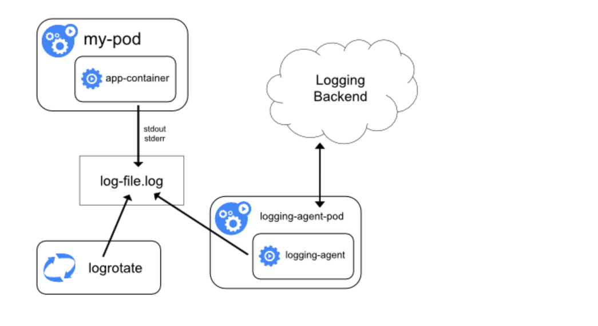

通过在每个节点上运行一个日志收集的 agent 来采集日志数据，日志采集 agent 是一种专用工具，用于将日志数据推送到统一的后端。

一般来说，这种 agent 用一个容器来运行，可以访问该节点上所有应用程序容器的日志文件所在目录。

由于这种 agent 必须在每个节点上运行，所以直接使用 DaemonSet 控制器运行该应用程序即可。

在节点上运行一个日志收集的 agent 这种方式是最常见的一种方法，因为它只需要在每个节点上运行一个代理程序，并不需要对节点上运行的应用程序进行更改，对应用程序没有任何侵入性，但是这种方法也仅仅适用于收集输出到 stdout 和 stderr 的应用程序日志。

#### 1.2.2 以 sidecar 容器收集日志

我们看上面的图可以看到有一个明显的问题就是我们采集的日志都是通过输出到容器的 stdout 和 stderr 里面的信息，这些信息会在本地的容器对应目录中保留成 JSON 日志文件，所以直接在节点上运行一个 agent 就可以采集到日志。但是如果我们的应用程序的日志是输出到容器中的某个日志文件的话呢？这种日志数据显然只通过上面的方案是采集不到的了。

**用 sidecar 容器重新输出日志**


对于上面这种情况我们可以直接在 Pod 中启动另外一个 sidecar 容器，直接将应用程序的日志通过这个容器重新输出到 stdout，这样是不是通过上面的节点日志收集方案又可以完成了。

由于这个 sidecar 容器的主要逻辑就是将应用程序中的日志进行重定向打印，所以背后的逻辑非常简单，开销很小，而且由于输出到了 stdout 或者 stderr，所以我们也可以使用 kubectl logs 来查看日志了。

下面的示例是在 Pod 中将日志记录在了容器的两个本地文件之中：

```yaml
apiVersion: v1
kind: Pod
metadata:
  name: counter
spec:
  containers:
    - name: count
      image: busybox
      args:
        - /bin/sh
        - -c
        - >
          i=0;
          while true;
          do
            echo "$i: $(date)" >> /var/log/1.log;
            echo "$(date) INFO $i" >> /var/log/2.log;
            i=$((i+1));
            sleep 1;
          done
      volumeMounts:
        - name: varlog
          mountPath: /var/log
  volumes:
    - name: varlog
      emptyDir: {}
```


由于 Pod 中容器的特性，我们可以利用另外一个 sidecar 容器去获取到另外容器中的日志文件，然后将日志重定向到自己的 stdout 流中，可以将上面的 YAML 文件做如下修改：（two-files-counter-pod-streaming-sidecar.yaml）

```yaml
apiVersion: v1
kind: Pod
metadata:
  name: counter
spec:
  containers:
    - name: count
      image: busybox
      args:
        - /bin/sh
        - -c
        - >
          i=0;
          while true;
          do
            echo "$i: $(date)" >> /var/log/1.log;
            echo "$(date) INFO $i" >> /var/log/2.log;
            i=$((i+1));
            sleep 1;
          done
      volumeMounts:
        - name: varlog
          mountPath: /var/log
    - name: count-log-1
      image: busybox
      args: [/bin/sh, -c, "tail -n+1 -f /var/log/1.log"]
      volumeMounts:
        - name: varlog
          mountPath: /var/log
    - name: count-log-2
      image: busybox
      args: [/bin/sh, -c, "tail -n+1 -f /var/log/2.log"]
      volumeMounts:
        - name: varlog
          mountPath: /var/log
  volumes:
    - name: varlog
      emptyDir: {}
```

直接创建上面的 Pod：

```shell
$ kubectl apply -f two-files-counter-pod-streaming-sidecar.yaml
pod "counter" created
```

运行成功后，我们可以通过下面的命令来查看日志的信息：

```shell
$ kubectl logs counter count-log-1
0: Mon Jan  1 00:00:00 UTC 2001
1: Mon Jan  1 00:00:01 UTC 2001
2: Mon Jan  1 00:00:02 UTC 2001
...
$ kubectl logs counter count-log-2
Mon Jan  1 00:00:00 UTC 2001 INFO 0
Mon Jan  1 00:00:01 UTC 2001 INFO 1
Mon Jan  1 00:00:02 UTC 2001 INFO 2
...
```

这样前面节点上的日志采集 agent 就可以自动获取这些日志信息，而不需要其他配置。

这种方法虽然可以解决上面的问题，但是也有一个明显的缺陷，就是日志不仅会在原容器文件中保留下来，还会通过 stdout 输出后占用磁盘空间，这样无形中就增加了一倍磁盘空间。

**使用 sidecar 运行日志采集 agent**

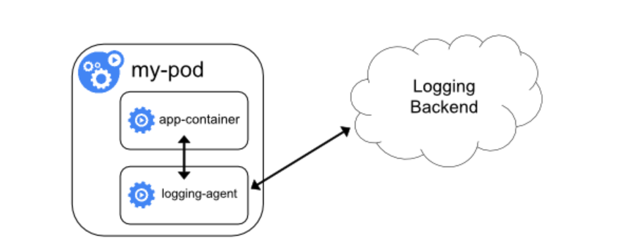

如果你觉得在节点上运行一个日志采集的代理不够灵活的话，那么你也可以创建一个单独的日志采集代理程序的 sidecar 容器，不过需要单独配置和应用程序一起运行。

不过这样虽然更加灵活，但是在 sidecar 容器中运行日志采集代理程序会导致大量资源消耗，因为你有多少个要采集的 Pod，就需要运行多少个采集代理程序，另外还无法使用 kubectl logs 命令来访问这些日志，因为它们不受 kubelet 控制。

举个例子，你可以使用的 Stackdriver，它使用 fluentd 作为记录剂。以下是两个可用于实现此方法的配置文件。第一个文件包含配置流利的 ConfigMap。

下面是 Kubernetes 官方的一个 fluentd 的配置文件示例，使用 ConfigMap 对象来保存：

```yaml
apiVersion: v1
kind: ConfigMap
metadata:
  name: fluentd-config
data:
  fluentd.conf: |
    <source>
      type tail
      format none
      path /var/log/1.log
      pos_file /var/log/1.log.pos
      tag count.format1
    </source>

    <source>
      type tail
      format none
      path /var/log/2.log
      pos_file /var/log/2.log.pos
      tag count.format2
    </source>

    <match **>
      type google_cloud
    </match>
```

上面的配置文件是配置收集原文件 /var/log/1.log 和 /var/log/2.log 的日志数据，然后通过 google_cloud 这个插件将数据推送到 Stackdriver 后端去。

下面是我们使用上面的配置文件在应用程序中运行一个 fluentd 的容器来读取日志数据：

```yaml
apiVersion: v1
kind: Pod
metadata:
  name: counter
spec:
  containers:
    - name: count
      image: busybox
      args:
        - /bin/sh
        - -c
        - >
          i=0;
          while true;
          do
            echo "$i: $(date)" >> /var/log/1.log;
            echo "$(date) INFO $i" >> /var/log/2.log;
            i=$((i+1));
            sleep 1;
          done
      volumeMounts:
        - name: varlog
          mountPath: /var/log
    - name: count-agent
      image: k8s.gcr.io/fluentd-gcp:1.30
      env:
        - name: FLUENTD_ARGS
          value: -c /etc/fluentd-config/fluentd.conf
      volumeMounts:
        - name: varlog
          mountPath: /var/log
        - name: config-volume
          mountPath: /etc/fluentd-config
  volumes:
    - name: varlog
      emptyDir: {}
    - name: config-volume
      configMap:
        name: fluentd-config
```

上面的 Pod 创建完成后，容器 count-agent 就会将 count 容器中的日志进行收集然后上传。

当然，这只是一个简单的示例，我们也完全可以使用其他的任何日志采集工具来替换 fluentd，比如 logstash、fluent-bit 等等。

#### 1.2.3 直接从应用程序收集日志


除了上面的几种方案之外，我们也完全可以通过直接在应用程序中去显示的将日志推送到日志后端，但是这种方式需要代码层面的实现，也超出了 Kubernetes 本身的范围。


## 2. 搭建 EFK 日志系统

前面大家介绍了 Kubernetes 集群中的几种日志收集方案，Kubernetes 中比较流行的日志收集解决方案是 Elasticsearch、Fluentd 和 Kibana（EFK）技术栈，也是官方现在比较推荐的一种方案。

Elasticsearch 是一个实时的、分布式的可扩展的搜索引擎，允许进行全文、结构化搜索，它通常用于索引和搜索大量日志数据，也可用于搜索许多不同类型的文档。

Elasticsearch 通常与 Kibana 一起部署，Kibana 是 Elasticsearch 的一个功能强大的数据可视化 Dashboard，Kibana 允许你通过 web 界面来浏览 Elasticsearch 日志数据。

Fluentd是一个流行的开源数据收集器，我们将在 Kubernetes 集群节点上安装 Fluentd，通过获取容器日志文件、过滤和转换日志数据，然后将数据传递到 Elasticsearch 集群，在该集群中对其进行索引和存储。

我们先来配置启动一个可扩展的 Elasticsearch 集群，然后在 Kubernetes 集群中创建一个 Kibana 应用，最后通过 DaemonSet 来运行 Fluentd，以便它在每个 Kubernetes 工作节点上都可以运行一个 Pod。

### 2.1 安装 Elasticsearch 集群

在创建 Elasticsearch 集群之前，我们先创建一个命名空间，我们将在其中安装所有日志相关的资源对象。

```shell
$ kubectl create ns logging
```

#### 2.1.1 环境准备

ElasticSearch 安装有最低安装要求，如果安装后 Pod 无法正常启动，请检查是否符合最低要求的配置，要求如下：

| 节点名称      | 节点类型 | CPU 配置 | Memory 配置 |
| ------------- | :------: | :------: | :---------: |
| k8s-master    |  master  |    4C    |     4Gi     |
| k8s-node-2-12 |  worker  |    8C    |     8Gi     |
| k8s-node-2-13 |  worker  |    8C    |     8Gi     |
| k8s-node-2-14 |  worker  |    8C    |     8Gi     |

es集群要求

| ElasticSearch节点    | CPU最小要求 | Memory 最小要求 |
| -------------------- | :---------: | :-------------: |
| elasticsearch-master |    >2核     |      >2Gi       |
| elasticsearch-data   |    >1核     |      >2Gi       |
| elasticsearch-client |    >1核     |      >2Gi       |

这里我们要安装的 ES 集群环境信息如下所示：


| 集群名称      | 节点类型 | 副本数目 | 存储大小 | 网络模式  | 描述               |
| ------------- | :------: | :------: | :------: | :-------: | ------------------ |
| elasticsearch |  Master  |    3     |   5Gi    | ClusterIP | 主节点             |
| elasticsearch |   Data   |    3     |   50Gi   | ClusterIP | 数据节点           |
| elasticsearch |  Client  |    2     |    无    | NodePort  | 处理用户请求、转发 |

这里我们使用一个 NFS 类型的 StorageClass 来做持久化存储，当然如果你是线上环境建议使用 Local PV 或者 Ceph RBD 之类的存储来持久化 Elasticsearch 的数据。


安装nfs-storageClass存储

```shell
$ helm repo add azure http://mirror.azure.cn/kubernetes/charts/
$ helm repo update

# 或者下载到本地再安装
$ helm pull azure/nfs-client-provisioner
$ tar xvf nfs-client-provisioner-*.tgz

$ kubectl create ns nfs

$ helm install efk-nfs-storage -n nfs \
--set nfs.server=192.168.1.46 \
--set nfs.path=/efk  \
--set storageClass.name=efk-nfs,storageClass.reclaimPolicy=Retain \
--set storageClass.defaultClass=true \
nfs-client-provisioner
```

此外由于 ElasticSearch 7.x 版本默认安装了 X-Pack 插件，并且部分功能免费，需要我们配置一些安全证书文件。

**1、生成证书文件**

```shell
# 运行容器生成证书
$ docker run --name elastic-certs -i -w /app elasticsearch:7.12.0 /bin/sh -c  \
  "elasticsearch-certutil ca --out /app/elastic-stack-ca.p12 --pass '' && \
    elasticsearch-certutil cert --name security-master --dns \
    security-master --ca /app/elastic-stack-ca.p12 --pass '' --ca-pass '' --out /app/elastic-certificates.p12"

# 从容器中将生成的证书拷贝出来
$ docker cp elastic-certs:/app/elastic-certificates.p12 .

# 删除容器
$ docker rm -f elastic-certs

# 将 pcks12 中的信息分离出来，写入文件
$ openssl pkcs12 -nodes -passin pass:'' -in elastic-certificates.p12 -out elastic-certificate.pem
```

**2、添加证书到 Kubernetes**

```shell
# 添加证书
$ kubectl create secret -n logging generic elastic-certs --from-file=elastic-certificates.p12

# 设置集群用户名密码
$ kubectl create secret -n logging generic elastic-auth --from-literal=username=elastic --from-literal=password=oschina
```

#### 2.1.2 安装 ES 集群

首先添加 ELastic 的 Helm 仓库：

```shell
$ helm repo add elastic https://helm.elastic.co
$ helm repo update
```

ElaticSearch 安装需要安装三次，分别安装 Master、Data、Client 节点，Master 节点负责集群间的管理工作；Data 节点负责存储数据；Client 节点负责代理 ElasticSearch Cluster 集群，负载均衡。

首先使用 helm pull 拉取 Chart 并解压：

```shell
$ helm pull elastic/elasticsearch --untar --version 7.17.3
$ cd elasticsearch
```

在 Chart 目录下面创建用于 Master 节点安装配置的 values 文件：

`values-master.yaml`

```yaml
# values-master.yaml
## 设置集群名称
clusterName: "elasticsearch"
## 设置节点名称
nodeGroup: "master"

## 设置角色
roles:
  master: "true"
  ingest: "false"
  data: "false"

# ============镜像配置============
## 指定镜像与镜像版本
image: "elasticsearch"
imageTag: "7.17.3"
imagePullPolicy: "IfNotPresent"

## 副本数
replicas: 3

# ============资源配置============
## JVM 配置参数
esJavaOpts: "-Xmx1g -Xms1g"
## 部署资源配置(生成环境要设置大些)
resources:
  requests:
    cpu: "2000m"
    memory: "2Gi"
  limits:
    cpu: "2000m"
    memory: "2Gi"
## 数据持久卷配置
persistence:
  enabled: true
## 存储数据大小配置
volumeClaimTemplate:
  storageClassName: efk-nfs
  accessModes: ["ReadWriteOnce"]
  resources:
    requests:
      storage: 50Gi

# ============安全配置============
## 设置协议，可配置为 http、https
protocol: http
## 证书挂载配置，这里我们挂入上面创建的证书
secretMounts:
  - name: elastic-certs
    secretName: elastic-certs
    path: /usr/share/elasticsearch/config/certs
    defaultMode: 0755

## 允许您在/usr/share/elasticsearch/config/中添加任何自定义配置文件,例如 elasticsearch.yml、log4j2.properties
## ElasticSearch 7.x 默认安装了 x-pack 插件，部分功能免费，这里我们配置下
## 下面注掉的部分为配置 https 证书，配置此部分还需要配置 helm 参数 protocol 值改为 https
esConfig:
  elasticsearch.yml: |
    xpack.security.enabled: true
    xpack.security.transport.ssl.enabled: true
    xpack.security.transport.ssl.verification_mode: certificate
    xpack.security.transport.ssl.keystore.path: /usr/share/elasticsearch/config/certs/elastic-certificates.p12
    xpack.security.transport.ssl.truststore.path: /usr/share/elasticsearch/config/certs/elastic-certificates.p12
    # xpack.security.http.ssl.enabled: true
    # xpack.security.http.ssl.truststore.path: /usr/share/elasticsearch/config/certs/elastic-certificates.p12
    # xpack.security.http.ssl.keystore.path: /usr/share/elasticsearch/config/certs/elastic-certificates.p12
## 环境变量配置，这里引入上面设置的用户名、密码 secret 文件
extraEnvs:
  - name: ELASTIC_USERNAME
    valueFrom:
      secretKeyRef:
        name: elastic-auth
        key: username
  - name: ELASTIC_PASSWORD
    valueFrom:
      secretKeyRef:
        name: elastic-auth
        key: password

# ============调度配置============
## 设置调度策略
## - hard：只有当有足够的节点时 Pod 才会被调度，并且它们永远不会出现在同一个节点上
## - soft：尽最大努力调度
antiAffinity: "soft"
# tolerations:
#   - operator: "Exists" ##容忍全部污点
```

然后创建用于 Data 节点安装的 values 文件：

```yaml
# values-data.yaml
# ============设置集群名称============
## 设置集群名称
clusterName: "elasticsearch"
## 设置节点名称
nodeGroup: "data"
## 设置角色
roles:
  master: "false"
  ingest: "true"
  data: "true"

# ============镜像配置============
## 指定镜像与镜像版本
image: "elasticsearch"
imageTag: "7.17.3"
## 副本数(建议设置为3，我这里资源不足只用了1个副本)
replicas: 3

# ============资源配置============
## JVM 配置参数
esJavaOpts: "-Xmx1g -Xms1g"
## 部署资源配置(生成环境一定要设置大些)
resources:
  requests:
    cpu: "1000m"
    memory: "2Gi"
  limits:
    cpu: "1000m"
    memory: "2Gi"
## 数据持久卷配置
persistence:
  enabled: true
## 存储数据大小配置
volumeClaimTemplate:
  storageClassName: efk-nfs
  accessModes: ["ReadWriteOnce"]
  resources:
    requests:
      storage: 200Gi

# ============安全配置============
## 设置协议，可配置为 http、https
protocol: http
## 证书挂载配置，这里我们挂入上面创建的证书
secretMounts:
  - name: elastic-certs
    secretName: elastic-certs
    path: /usr/share/elasticsearch/config/certs
## 允许您在/usr/share/elasticsearch/config/中添加任何自定义配置文件,例如 elasticsearch.yml
## ElasticSearch 7.x 默认安装了 x-pack 插件，部分功能免费，这里我们配置下
## 下面注掉的部分为配置 https 证书，配置此部分还需要配置 helm 参数 protocol 值改为 https
esConfig:
  elasticsearch.yml: |
    xpack.security.enabled: true
    xpack.security.transport.ssl.enabled: true
    xpack.security.transport.ssl.verification_mode: certificate
    xpack.security.transport.ssl.keystore.path: /usr/share/elasticsearch/config/certs/elastic-certificates.p12
    xpack.security.transport.ssl.truststore.path: /usr/share/elasticsearch/config/certs/elastic-certificates.p12
    # xpack.security.http.ssl.enabled: true
    # xpack.security.http.ssl.truststore.path: /usr/share/elasticsearch/config/certs/elastic-certificates.p12
    # xpack.security.http.ssl.keystore.path: /usr/share/elasticsearch/config/certs/elastic-certificates.p12
## 环境变量配置，这里引入上面设置的用户名、密码 secret 文件
extraEnvs:
  - name: ELASTIC_USERNAME
    valueFrom:
      secretKeyRef:
        name: elastic-auth
        key: username
  - name: ELASTIC_PASSWORD
    valueFrom:
      secretKeyRef:
        name: elastic-auth
        key: password

# ============调度配置============
## 设置调度策略
## - hard：只有当有足够的节点时 Pod 才会被调度，并且它们永远不会出现在同一个节点上
## - soft：尽最大努力调度
antiAffinity: "soft"
## 容忍配置
# tolerations:
#   - operator: "Exists" ##容忍全部污点
```

最后一个是用于创建 Client 节点的 values 文件：

`values-client.yaml`

```yaml
# values-client.yaml
# ============设置集群名称============
## 设置集群名称
clusterName: "elasticsearch"
## 设置节点名称
nodeGroup: "client"
## 设置角色
roles:
  master: "false"
  ingest: "false"
  data: "false"

# ============镜像配置============
## 指定镜像与镜像版本
image: "elasticsearch"
imageTag: "7.17.3"
## 副本数
replicas: 1

# ============资源配置============
## JVM 配置参数
esJavaOpts: "-Xmx1g -Xms1g"
## 部署资源配置(生成环境一定要设置大些)
resources:
  requests:
    cpu: "1000m"
    memory: "2Gi"
  limits:
    cpu: "1000m"
    memory: "2Gi"
## 数据持久卷配置
persistence:
  enabled: false

# ============安全配置============
## 设置协议，可配置为 http、https
protocol: http
## 证书挂载配置，这里我们挂入上面创建的证书
secretMounts:
  - name: elastic-certs
    secretName: elastic-certs
    path: /usr/share/elasticsearch/config/certs
## 允许您在/usr/share/elasticsearch/config/中添加任何自定义配置文件,例如 elasticsearch.yml
## ElasticSearch 7.x 默认安装了 x-pack 插件，部分功能免费，这里我们配置下
## 下面注掉的部分为配置 https 证书，配置此部分还需要配置 helm 参数 protocol 值改为 https
esConfig:
  elasticsearch.yml: |
    xpack.security.enabled: true
    xpack.security.transport.ssl.enabled: true
    xpack.security.transport.ssl.verification_mode: certificate
    xpack.security.transport.ssl.keystore.path: /usr/share/elasticsearch/config/certs/elastic-certificates.p12
    xpack.security.transport.ssl.truststore.path: /usr/share/elasticsearch/config/certs/elastic-certificates.p12
    # xpack.security.http.ssl.enabled: true
    # xpack.security.http.ssl.truststore.path: /usr/share/elasticsearch/config/certs/elastic-certificates.p12
    # xpack.security.http.ssl.keystore.path: /usr/share/elasticsearch/config/certs/elastic-certificates.p12
## 环境变量配置，这里引入上面设置的用户名、密码 secret 文件
extraEnvs:
  - name: ELASTIC_USERNAME
    valueFrom:
      secretKeyRef:
        name: elastic-auth
        key: username
  - name: ELASTIC_PASSWORD
    valueFrom:
      secretKeyRef:
        name: elastic-auth
        key: password

# ============Service 配置============
service:
  type: NodePort
  nodePort: "30200"
```

现在用上面的 values 文件来安装：

```shell
# 安装 master 节点
$ helm upgrade --install es-master -f values-master.yaml --namespace logging .
# 安装 data 节点
$ helm upgrade --install es-data -f values-data.yaml --namespace logging .
# 安装 client 节点
$ helm upgrade --install es-client -f values-client.yaml --namespace logging .
```

> 在安装 Master 节点后 Pod 启动时候会抛出异常，就绪探针探活失败，这是个正常现象。在执行安装 Data 节点后 Master 节点 Pod 就会恢复正常。


#### 2.1.3 安装 Kibana

Elasticsearch 集群安装完成后接下来配置安装 Kibana

使用 helm pull 命令拉取 Kibana Chart 包并解压：

```shell
$ helm pull elastic/kibana --untar --version 7.17.3
$ cd kibana
```

创建用于安装 Kibana 的 values 文件：
`values-prod.yaml`

```yaml
# values-prod.yaml
## 指定镜像与镜像版本
image: "kibana"
imageTag: "7.17.3"

## 配置 ElasticSearch 地址
elasticsearchHosts: "http://elasticsearch-client:9200"

# ============环境变量配置============
## 环境变量配置，这里引入上面设置的用户名、密码 secret 文件
extraEnvs:
  - name: "ELASTICSEARCH_USERNAME"
    valueFrom:
      secretKeyRef:
        name: elastic-auth
        key: username
  - name: "ELASTICSEARCH_PASSWORD"
    valueFrom:
      secretKeyRef:
        name: elastic-auth
        key: password

# ============资源配置============
resources:
  requests:
    cpu: "500m"
    memory: "1Gi"
  limits:
    cpu: "500m"
    memory: "1Gi"

# ============配置 Kibana 参数============
## kibana 配置中添加语言配置，设置 kibana 为中文
kibanaConfig:
  kibana.yml: |
    i18n.locale: "zh-CN"

# ============Service 配置============
service:
  type: NodePort
  nodePort: "30601"
```

使用上面的配置直接安装即可：

```shell
$ helm install kibana -f values-prod.yaml --namespace logging .
```

下面是安装完成后的 ES 集群和 Kibana 资源：

```shell
$ kubectl get pods -n logging
NAME                            READY   STATUS    RESTARTS   AGE
elasticsearch-client-0          1/1     Running   0          12m
elasticsearch-data-0            1/1     Running   0          12m
elasticsearch-data-1            1/1     Running   0          12m
elasticsearch-data-2            1/1     Running   0          12m
elasticsearch-master-0          1/1     Running   0          13m
elasticsearch-master-1          1/1     Running   0          13m
elasticsearch-master-2          1/1     Running   0          13m
kibana-kibana-f76c9758d-9ndrn   1/1     Running   0          5m34s

$ kubectl get svc -n logging
NAME                            TYPE        CLUSTER-IP       EXTERNAL-IP   PORT(S)                         AGE
elasticsearch-client            NodePort    172.16.131.20    <none>        9200:30200/TCP,9300:31868/TCP   10m
elasticsearch-client-headless   ClusterIP   None             <none>        9200/TCP,9300/TCP               10m
elasticsearch-data              ClusterIP   172.16.180.25    <none>        9200/TCP,9300/TCP               10m
elasticsearch-data-headless     ClusterIP   None             <none>        9200/TCP,9300/TCP               10m
elasticsearch-master            ClusterIP   172.16.182.14    <none>        9200/TCP,9300/TCP               10m
elasticsearch-master-headless   ClusterIP   None             <none>        9200/TCP,9300/TCP               10m
kibana-kibana                   NodePort    172.16.244.211   <none>        5601:30601/TCP                  2m4s

```

上面我们安装 Kibana 的时候指定了 30601 的 NodePort 端口，所以我们可以从任意节点 http://IP:30601 来访问 Kibana。

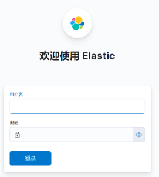
我们可以看到会跳转到登录页面，让我们输出用户名、密码，这里我们输入上面配置的用户名 elastic、密码 oschina进行登录。

登录成功后点击自己浏览，进入如下所示的 Kibana 主页：
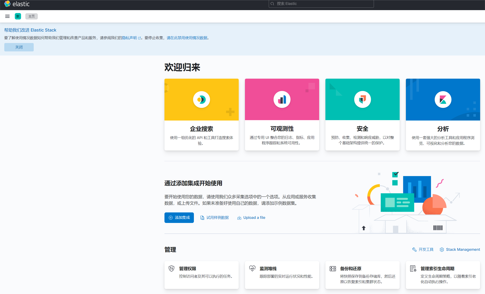{: .zoom}


### 2.2 部署 Fluentd

Fluentd 是一个高效的日志聚合器，是用 Ruby 编写的，并且可以很好地扩展。
对于大部分企业来说，Fluentd 足够高效并且消耗的资源相对较少，另外一个工具 Fluent-bit 更轻量级，占用资源更少，
但是插件相对 Fluentd 来说不够丰富，所以整体来说，Fluentd 更加成熟，使用更加广泛，所以这里我们使用 Fluentd 来作为日志收集工具。

#### 2.2.1 工作原理

Fluentd 通过一组给定的数据源抓取日志数据，处理后（转换成结构化的数据格式）将它们转发给其他服务，比如 Elasticsearch、对象存储等等。Fluentd 支持超过 300 个日志存储和分析服务，所以在这方面是非常灵活的。主要运行步骤如下：

- 首先 Fluentd 从多个日志源获取数据 
- 结构化并且标记这些数据 
- 然后根据匹配的标签将数据发送到多个目标服务去


#### 2.2.2 配置

一般来说我们是通过一个配置文件来告诉 Fluentd 如何采集、处理数据的，下面简单和大家介绍下 Fluentd 的配置方法。

**日志源配置**
比如我们这里为了收集 Kubernetes 节点上的所有容器日志，就需要做如下的日志源配置：

```yaml
<source>
  @id fluentd-containers.log
  @type tail                             # Fluentd 内置的输入方式，其原理是不停地从源文件中获取新的日志。
  path /var/log/containers/*.log         # 挂载的宿主机容器日志地址
  pos_file /var/log/es-containers.log.pos
  tag raw.kubernetes.*                   # 设置日志标签
  read_from_head true
  <parse>                                # 多行格式化成JSON
    @type multi_format                   # 使用 multi-format-parser 解析器插件
    <pattern>
      format json                        # JSON 解析器
      time_key time                      # 指定事件时间的时间字段
      time_format %Y-%m-%dT%H:%M:%S.%NZ  # 时间格式
    </pattern>
    <pattern>
      format /^(?<time>.+) (?<stream>stdout|stderr) [^ ]* (?<log>.*)$/
      time_format %Y-%m-%dT%H:%M:%S.%N%:z
    </pattern>
  </parse>
</source>
```

上面配置部分参数说明如下：

- id：表示引用该日志源的唯一标识符，该标识可用于进一步过滤和路由结构化日志数据 
- type：Fluentd 内置的指令，tail 表示 Fluentd 从上次读取的位置通过 tail 不断获取数据，另外一个是 http 表示通过一个 GET 请求来收集数据。 
- path：tail 类型下的特定参数，告诉 Fluentd 采集 /var/log/containers 目录下的所有日志，这是 docker 在 Kubernetes 节点上用来存储运行容器 stdout 输出日志数据的目录。 
- pos_file：检查点，如果 Fluentd 程序重新启动了，它将使用此文件中的位置来恢复日志数据收集。 
- tag：用来将日志源与目标或者过滤器匹配的自定义字符串，Fluentd 匹配源/目标标签来路由日志数据。


**路由配置**

上面是日志源的配置，接下来看看如何将日志数据发送到 Elasticsearch：

```yaml
<match **>
  @id elasticsearch
  @type elasticsearch
  @log_level info
  include_tag_key true
  type_name fluentd
  host "#{ENV['OUTPUT_HOST']}"
  port "#{ENV['OUTPUT_PORT']}"
  logstash_format true
  <buffer>
    @type file
    path /var/log/fluentd-buffers/kubernetes.system.buffer
    flush_mode interval
    retry_type exponential_backoff
    flush_thread_count 2
    flush_interval 5s
    retry_forever
    retry_max_interval 30
    chunk_limit_size "#{ENV['OUTPUT_BUFFER_CHUNK_LIMIT']}"
    queue_limit_length "#{ENV['OUTPUT_BUFFER_QUEUE_LIMIT']}"
    overflow_action block
  </buffer>
</match>
```


- match：标识一个目标标签，后面是一个匹配日志源的正则表达式，我们这里想要捕获所有的日志并将它们发送给 Elasticsearch，所以需要配置成**。 
- id：目标的一个唯一标识符。 
- type：支持的输出插件标识符，我们这里要输出到 Elasticsearch，所以配置成 elasticsearch，这是 Fluentd 的一个内置插件。 
- log_level：指定要捕获的日志级别，我们这里配置成 info，表示任何该级别或者该级别以上（INFO、WARNING、ERROR）的日志都将被路由到 Elsasticsearch。 
- host/port：定义 Elasticsearch 的地址，也可以配置认证信息，我们的 Elasticsearch 不需要认证，所以这里直接指定 host 和 port 即可。 
- logstash_format：Elasticsearch 服务对日志数据构建反向索引进行搜索，将 logstash_format 设置为 true，Fluentd 将会以 logstash 格式来转发结构化的日志数据。 
- Buffer： Fluentd 允许在目标不可用时进行缓存，比如，如果网络出现故障或者 Elasticsearch 不可用的时候。缓冲区配置也有助于降低磁盘的 IO。


**过滤**
由于 Kubernetes 集群中应用太多，也还有很多历史数据，所以我们可以只将某些应用的日志进行收集，比如我们只采集具有 logging=true 这个 Label 标签的 Pod 日志，这个时候就需要使用 filter，如下所示：

```yaml
# 删除无用的属性
<filter kubernetes.**>
  @type record_transformer
  remove_keys $.docker.container_id,$.kubernetes.container_image_id,$.kubernetes.pod_id,$.kubernetes.namespace_id,$.kubernetes.master_url,$.kubernetes.labels.pod-template-hash
</filter>
# 只保留具有logging=true标签的Pod日志
<filter kubernetes.**>
  @id filter_log
  @type grep
  <regexp>
    key $.kubernetes.labels.logging
    pattern ^true$
  </regexp>
</filter>
```

#### 2.2.3 安装

要收集 Kubernetes 集群的日志，直接用 DasemonSet 控制器来部署 Fluentd 应用，这样，它就可以从 Kubernetes 节点上采集日志，确保在集群中的每个节点上始终运行一个 Fluentd 容器。
当然可以直接使用 Helm 来进行一键安装，为了能够了解更多实现细节，我们这里还是采用手动方法来进行安装。

> 可以直接使用官方的对于 Kubernetes 集群的安装文档: https://docs.fluentd.org/container-deployment/kubernetes。

首先，我们通过 ConfigMap 对象来指定 Fluentd 配置文件，新建 fluentd-configmap.yaml 文件，文件内容如下：
` fluentd-configmap.yaml`

```yaml
kind: ConfigMap
apiVersion: v1
metadata:
  name: fluentd-conf
  namespace: logging
data:
  # 容器日志
  containers.input.conf: |-
    <source>
      @id fluentd-containers.log
      @type tail
      path /var/log/containers/*.log
      pos_file /var/log/es-containers.log.pos
      tag raw.kubernetes.*
      read_from_head true
      <parse>
        @type multi_format
        <pattern>
          format json
          time_key time
          time_format %Y-%m-%dT%H:%M:%S.%NZ
        </pattern>
        <pattern>
          format /^(?<time>.+) (?<stream>stdout|stderr) [^ ]* (?<log>.*)$/
          time_format %Y-%m-%dT%H:%M:%S.%N%:z
        </pattern>
      </parse>
    </source>

    # 在日志输出中检测异常(多行日志)，并将其作为一条日志转发
    # https://github.com/GoogleCloudPlatform/fluent-plugin-detect-exceptions
    <match raw.kubernetes.**>
      @id raw.kubernetes
      @type detect_exceptions
      remove_tag_prefix raw
      message log
      multiline_flush_interval 5
    </match>

    <filter **>
      @id filter_concat
      @type concat
      key message
      multiline_end_regexp /\n$/
      separator ""
    </filter>

    # 添加 Kubernetes metadata 数据
    <filter kubernetes.**>
      @id filter_kubernetes_metadata
      @type kubernetes_metadata
    </filter>

    # 修复 ES 中的 JSON 字段
    # 插件地址：https://github.com/repeatedly/fluent-plugin-multi-format-parser
    <filter kubernetes.**>
      @id filter_parser
      @type parser
      key_name log
      reserve_data true
      remove_key_name_field true
      <parse>
        @type multi_format
        <pattern>
          format json
        </pattern>
        <pattern>
          format none
        </pattern>
      </parse>
    </filter>

    # 删除一些多余的属性
    <filter kubernetes.**>
      @type record_transformer
      remove_keys $.docker.container_id,$.kubernetes.container_image_id,$.kubernetes.pod_id,$.kubernetes.namespace_id,$.kubernetes.master_url,$.kubernetes.labels.pod-template-hash
    </filter>

##   我注释掉这里的用意就是所有pod的日志都进行采集
#    ##只保留具有logging=true标签的Pod日志
#    <filter kubernetes.**>
#      @id filter_log
#      @type grep
#      <regexp>
#        key $.kubernetes.labels.logging
#        pattern ^true$
#      </regexp>
#    </filter>

  ###### 监听配置，一般用于日志聚合用 ######
  forward.input.conf: |-
    # 监听通过TCP发送的消息
    <source>
      @id forward
      @type forward
    </source>

  output.conf: |-
    <match **>
      @id elasticsearch
      @type elasticsearch
      @log_level info
      include_tag_key true
      host elasticsearch-client
      port 9200
      user elastic
      password oschina
      logstash_format true
      logstash_prefix k8s
      request_timeout 30s
      <buffer>
        @type file
        path /var/log/fluentd-buffers/kubernetes.system.buffer
        flush_mode interval
        retry_type exponential_backoff
        flush_thread_count 2
        flush_interval 5s
        retry_forever
        retry_max_interval 30
        chunk_limit_size 2M
        queue_limit_length 8
        overflow_action block
      </buffer>
    </match>
```

上面配置文件中我们只配置了 docker 容器日志目录，收集到数据经过处理后发送到 elasticsearch-client:9200 服务。

然后新建一个 `fluentd-daemonset.yaml` 的文件，文件内容如下：

```yaml
apiVersion: v1
kind: ServiceAccount
metadata:
  name: fluentd-es
  namespace: logging
  labels:
    k8s-app: fluentd-es
    kubernetes.io/cluster-service: "true"
    addonmanager.kubernetes.io/mode: Reconcile
---
kind: ClusterRole
apiVersion: rbac.authorization.k8s.io/v1
metadata:
  name: fluentd-es
  labels:
    k8s-app: fluentd-es
    kubernetes.io/cluster-service: "true"
    addonmanager.kubernetes.io/mode: Reconcile
rules:
  - apiGroups:
      - ""
    resources:
      - "namespaces"
      - "pods"
    verbs:
      - "get"
      - "watch"
      - "list"
---
kind: ClusterRoleBinding
apiVersion: rbac.authorization.k8s.io/v1
metadata:
  name: fluentd-es
  labels:
    k8s-app: fluentd-es
    kubernetes.io/cluster-service: "true"
    addonmanager.kubernetes.io/mode: Reconcile
subjects:
  - kind: ServiceAccount
    name: fluentd-es
    namespace: logging
    apiGroup: ""
roleRef:
  kind: ClusterRole
  name: fluentd-es
  apiGroup: ""
---
apiVersion: apps/v1
kind: DaemonSet
metadata:
  name: fluentd
  namespace: logging
  labels:
    app: fluentd
    kubernetes.io/cluster-service: "true"
spec:
  selector:
    matchLabels:
      app: fluentd
  template:
    metadata:
      labels:
        app: fluentd
        kubernetes.io/cluster-service: "true"
    spec:
      tolerations:
        - key: node-role.kubernetes.io/master
          effect: NoSchedule
      serviceAccountName: fluentd-es
      containers:
        - name: fluentd
          image: quay.io/fluentd_elasticsearch/fluentd:v3.4.0
          volumeMounts:
            - name: fluentconfig
              mountPath: /etc/fluent/config.d
            - name: varlog
              mountPath: /var/log
      nodeSelector:
        beta.kubernetes.io/fluentd-ds-ready: "true"
      terminationGracePeriodSeconds: 30
      volumes:
        - name: fluentconfig
          configMap:
            name: fluentd-conf
        - name: varlog
          hostPath:
            path: /var/log
```

我们将上面创建的 fluentd-config 这个 ConfigMap 对象通过 volumes 挂载到了 Fluentd 容器中，另外为了能够灵活控制哪些节点的日志可以被收集，还可以添加了一个 nodSelector 属性：

```yaml
nodeSelector:
  beta.kubernetes.io/fluentd-ds-ready: "true"
```

意思就是要想采集节点的日志，那么我们就需要给节点打上上面的标签。


**提示**：如果你需要在其他节点上采集日志，则需要给对应节点打上标签，使用如下命令：

    kubectl label nodes node名 beta.kubernetes.io/fluentd-ds-ready=true。


```shell
$ kubectl label nodes giteego-k8s-n1 beta.kubernetes.io/fluentd-ds-ready=true
$ kubectl label nodes giteego-k8s-n2 beta.kubernetes.io/fluentd-ds-ready=true
$ kubectl label nodes giteego-k8s-n3 beta.kubernetes.io/fluentd-ds-ready=true
$ kubectl label nodes giteego-k8s-n4 beta.kubernetes.io/fluentd-ds-ready=true
```

另外由于我们的集群使用的是 kubeadm 搭建的，默认情况下 master 节点有污点，所以如果要想也收集 master 节点的日志，则需要添加上容忍：

```yaml
tolerations:
  - operator: Exists
```


**提示**："注意"

    另外需要注意的地方是，如果更改了 docker 的根目录，则在 volumes 和 volumeMount 里面都需要更改，保持一致


!!! info "举例"

    ```yaml
      containers:
        - name: fluentd
          image: quay.io/fluentd_elasticsearch/fluentd:v3.4.0
          volumeMounts:
            - name: fluentconfig
              mountPath: /etc/fluent/config.d
            - name: varlog
              mountPath: /var/log
            - name: varlibdockercontainers
              mountPath: /home/cce/docker/containers
              readOnly: true
      nodeSelector:
        beta.kubernetes.io/fluentd-ds-ready: "true"
      terminationGracePeriodSeconds: 30
      volumes:
        - name: fluentconfig
          configMap:
            name: fluentd-conf
        - name: varlog
          hostPath:
            path: /var/log
        - name: varlibdockercontainers
          hostPath:
            path: /home/cce/docker/containers
    ```

分别创建上面的 ConfigMap 对象和 DaemonSet：

```shell
$ kubectl create -f fluentd-configmap.yaml
configmap "fluentd-conf" created
$ kubectl create -f fluentd-daemonset.yaml
serviceaccount "fluentd-es" created
clusterrole.rbac.authorization.k8s.io "fluentd-es" created
clusterrolebinding.rbac.authorization.k8s.io "fluentd-es" created
daemonset.apps "fluentd" created
```

创建完成后，查看对应的 Pods 列表，检查是否部署成功：

```shell
$ kubectl get pod -n logging
NAME                            READY   STATUS    RESTARTS   AGE
elasticsearch-client-0          1/1     Running   0          38m
elasticsearch-data-0            1/1     Running   0          38m
elasticsearch-data-1            1/1     Running   0          38m
elasticsearch-data-2            1/1     Running   0          38m
elasticsearch-master-0          1/1     Running   0          39m
elasticsearch-master-1          1/1     Running   0          39m
elasticsearch-master-2          1/1     Running   0          39m
fluentd-hmg9k                   1/1     Running   0          56s
fluentd-hpmmh                   1/1     Running   0          56s
fluentd-j6nws                   1/1     Running   0          56s
fluentd-v969z                   1/1     Running   0          56s
kibana-kibana-f76c9758d-9ndrn   1/1     Running   0          31m
```

Fluentd 启动成功后，这个时候就可以发送日志到 ES 了，但是我们这里是过滤了只采集具有 logging=true 标签的 Pod 日志，所以现在还没有任何数据会被采集。


下面我们部署一个简单的测试应用， 新建 `counter.yaml` 文件，文件内容如下：

```yaml
apiVersion: v1
kind: Pod
metadata:
  name: counter
  labels:
    logging: "true"
spec:
  containers:
    - name: count
      image: busybox
      args:
        [
          /bin/sh,
          -c,
          'i=0; while true; do echo "$i: $(date)"; i=$((i+1)); sleep 1; done',
        ]
```

该 Pod 只是简单将日志信息打印到 stdout，所以正常来说 Fluentd 会收集到这个日志数据，在 Kibana 中也就可以找到对应的日志数据了，使用 kubectl 工具创建该 Pod：

```shell
$ kubectl create -f counter.yaml
$ kubectl get pods
NAME                             READY   STATUS    RESTARTS   AGE
counter                          1/1     Running   0          9h
```

Pod 创建并运行后，回到 Kibana Dashboard 页面，点击左侧最下面的 Management -> Stack Management，进入管理页面，点击左侧 Kibana 下面的 索引模式，点击 创建索引模式 开始导入索引数据：
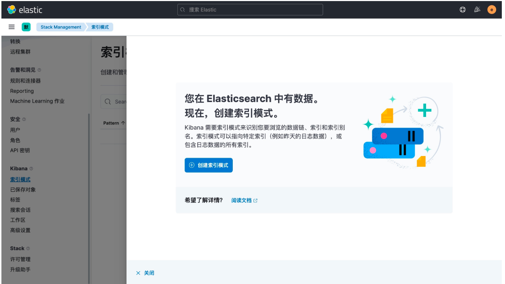{: .zoom}


在这里可以配置我们需要的 Elasticsearch 索引，前面 Fluentd 配置文件中我们采集的日志使用的是 logstash 格式，定义了一个 k8s 的前缀，
所以这里只需要在文本框中输入 `k8s-*` 即可匹配到 Elasticsearch 集群中采集的 Kubernetes 集群日志数据，然后点击下一步，进入以下页面：
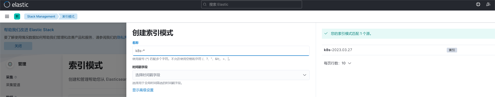{: .zoom}


在该页面中配置使用哪个字段按时间过滤日志数据，在下拉列表中，选择@timestamp字段，然后点击 创建索引模式，创建完成后，
点击左侧导航菜单中的 Discover，然后就可以看到一些直方图和最近采集到的日志数据了：

{: .zoom}


现在的数据就是上面 Counter 应用的日志，如果还有其他的应用，我们也可以筛选过滤：

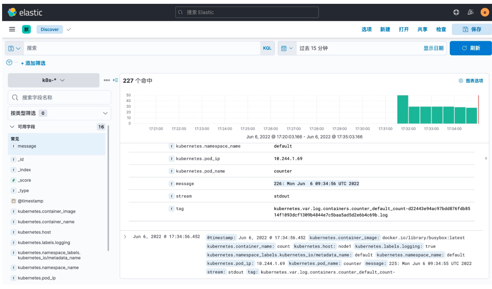{: .zoom}


我们也可以通过其他元数据来过滤日志数据，比如您可以单击任何日志条目以查看其他元数据，如容器名称，Kubernetes 节点，命名空间等。


### 2.3 安装 Kafka

对于大规模集群来说，日志数据量是非常巨大的，如果直接通过 Fluentd 将日志打入 Elasticsearch，对 ES 来说压力是非常巨大的，我们可以在中间加一层消息中间件来缓解 ES 的压力，一般情况下我们会使用 Kafka，然后可以直接使用 kafka-connect-elasticsearch 这样的工具将数据直接打入 ES，也可以在加一层 Logstash 去消费 Kafka 的数据，然后通过 Logstash 把数据存入 ES，这里我们来使用 Logstash 这种模式来对日志收集进行优化。

首先在 Kubernetes 集群中安装 Kafka，同样这里使用 Helm 进行安装：

```shell
$ helm repo add bitnami https://charts.bitnami.com/bitnami
$ helm repo update
```

首先使用 helm pull 拉取 Chart 并解压：

```shell
$ helm pull bitnami/kafka --untar --version 17.2.3
$ cd kafka
```

这里面我们指定使用一个 StorageClass 来提供持久化存储，在 Chart 目录下面创建用于安装的 values 文件：
`values-prod.yaml`

```yaml
# values-prod.yaml
## @section Persistence parameters
persistence:
  enabled: true
  storageClass: "efk-nfs"
  accessModes:
    - ReadWriteOnce
  size: 8Gi

  mountPath: /bitnami/kafka

# 配置zk volumes
zookeeper:
  enabled: true
  persistence:
    enabled: true
    storageClass: "efk-nfs"
    accessModes:
      - ReadWriteOnce
    size: 8Gi
```

直接使用上面的 values 文件安装 kafka：

```shell
$ helm upgrade --install kafka -f values-prod.yaml --namespace logging .
Release "kafka" does not exist. Installing it now.
NAME: kafka
LAST DEPLOYED: Thu Jun  9 14:02:01 2022
NAMESPACE: logging
STATUS: deployed
REVISION: 1
TEST SUITE: None
NOTES:
CHART NAME: kafka
CHART VERSION: 17.2.3
APP VERSION: 3.2.0

** Please be patient while the chart is being deployed **

Kafka can be accessed by consumers via port 9092 on the following DNS name from within your cluster:

    kafka.logging.svc.cluster.local

Each Kafka broker can be accessed by producers via port 9092 on the following DNS name(s) from within your cluster:

    kafka-0.kafka-headless.logging.svc.cluster.local:9092

To create a pod that you can use as a Kafka client run the following commands:

    kubectl run kafka-client --restart='Never' --image docker.io/bitnami/kafka:3.2.0-debian-10-r4 --namespace logging --command -- sleep infinity
    kubectl exec --tty -i kafka-client --namespace logging -- bash

    PRODUCER:
        kafka-console-producer.sh \

            --broker-list kafka-0.kafka-headless.logging.svc.cluster.local:9092 \
            --topic test

    CONSUMER:
        kafka-console-consumer.sh \

            --bootstrap-server kafka.logging.svc.cluster.local:9092 \
            --topic test \
            --from-beginning
```

安装完成后我们可以使用上面的提示来检查 Kafka 是否正常运行：

```shell
$ kubectl get pods -n logging -l app.kubernetes.io/instance=kafka
kafka-0             1/1     Running   0          7m58s
kafka-zookeeper-0   1/1     Running   0          7m58s
```

用下面的命令创建一个 Kafka 的测试客户端 Pod：

```shell
$ kubectl run kafka-client --restart='Never' --image docker.io/bitnami/kafka:3.2.0-debian-10-r4 --namespace logging --command -- sleep infinity
pod/kafka-client created
```

然后启动一个终端进入容器内部生产消息：

```shell
# 生产者
$ kubectl exec --tty -i kafka-client --namespace logging -- bash
I have no name!@kafka-client:/$ kafka-console-producer.sh --broker-list kafka-0.kafka-headless.logging.svc.cluster.local:9092 --topic test
>hello kafka on k8s
>
```

启动另外一个终端进入容器内部消费消息：

```shell
# 消费者
$ kubectl exec --tty -i kafka-client --namespace logging -- bash
I have no name!@kafka-client:/$ kafka-console-consumer.sh --bootstrap-server kafka.logging.svc.cluster.local:9092 --topic test --from-beginning
hello kafka on k8s
```

如果在消费端看到了生产的消息数据证明我们的 Kafka 已经运行成功了。


### 2.4 Fluentd 配置 Kafka

现在有了 Kafka，我们就可以将 Fluentd 的日志数据输出到 Kafka 了，只需要将 Fluentd 配置中的 <match> 更改为使用 Kafka 插件即可，但是在 Fluentd 中输出到 Kafka，
需要使用到 fluent-plugin-kafka 插件，所以需要我们自定义下 Docker 镜像，最简单的做法就是在上面 Fluentd 镜像的基础上新增 kafka 插件即可，Dockerfile 文件如下所示：

`Dockerfile`

```
FROM quay.io/fluentd_elasticsearch/fluentd:v3.4.0
RUN echo "source 'https://mirrors.tuna.tsinghua.edu.cn/rubygems/'" > Gemfile && gem install bundler
RUN gem install fluent-plugin-kafka -v 0.17.5 --no-document
```

```shell
$ docker build -t giteeops/fluentd-kafka:v0.17.5 .
$ docker push giteeops/fluentd-kafka:v0.17.5
```

使用上面的 Dockerfile 文件构建一个 Docker 镜像即可，我这里构建过后的镜像名为 `giteeops/fluentd-kafka:v0.17.5`。接下来替换 Fluentd 的 Configmap 对象中的 <match> 部分，如下所示：

```yaml
# fluentd-configmap.yaml
kind: ConfigMap
apiVersion: v1
metadata:
  name: fluentd-conf
  namespace: logging
data:
  ......
  output.conf: |-
    <match **>
      @id kafka
      @type kafka2
      @log_level info

      # list of seed brokers
      brokers kafka-0.kafka-headless.logging.svc.cluster.local:9092
      use_event_time true

      # topic settings
      topic_key k8slog
      default_topic messages  # 注意，kafka中消费使用的是这个topic
      # buffer settings
      <buffer k8slog>
        @type file
        path /var/log/td-agent/buffer/td
        flush_interval 3s
      </buffer>

      # data type settings
      <format>
        @type json
      </format>

      # producer settings
      required_acks -1
      compression_codec gzip

    </match>
```

**提示**：node节点会创建一个/var/log/td-agent/buffer/td目录。此目录数据很大，考虑到磁盘空间的问题，可以将buffer settings为memory的方式

```yaml
  output.conf: |-
    <match **>
      @id kafka
      @type kafka2
      @log_level info

      # list of seed brokers
      brokers kafka-0.kafka-headless.logging.svc.cluster.local:9092
      use_event_time true

      # topic settings
      topic_key k8slog
      default_topic messages  # 注意，kafka中消费使用的是这个topic
      # buffer settings
      <buffer k8slog>
        @type memory
        path /var/log/td-agent/buffer/td
        flush_interval 3s
      </buffer>

      # data type settings
      <format>
        @type json
      </format>

      # producer settings
      required_acks -1
      compression_codec gzip

    </match>
```

然后替换运行的 Fluentd 镜像：

```yaml
# fluentd-daemonset.yaml
image: giteeops/fluentd-kafka:v0.17.5
```

直接更新 Fluentd 的 Configmap 与 DaemonSet 资源对象即可：

```shell
$ kubectl apply -f fluentd-configmap.yaml
$ kubectl apply -f fluentd-daemonset.yaml
```

更新成功后我们可以使用上面的测试 Kafka 客户端来验证是否有日志数据：

```shell
$ kubectl exec --tty -i kafka-client --namespace logging -- bash
I have no name!@kafka-client:/$ kafka-console-consumer.sh --bootstrap-server kafka.logging.svc.cluster.local:9092 --topic messages --from-beginning
{"stream":"stdout","docker":{},"kubernetes":{"container_name":"count","namespace_name":"default","pod_name":"counter","container_image":"busybox:latest","host":"node1","labels":{"logging":"true"}},"message":"43883: Tue Apr 27 12:16:30 UTC 2021\n"}
......
```


### 2.5 安装 Logstash

虽然数据从 Kafka 到 Elasticsearch 的方式多种多样，比如可以使用 [Kafka Connect Elasticsearch Connector](https://github.com/confluentinc/kafka-connect-elasticsearch) 来实现，

我们这里还是采用更加流行的 `Logstash` 方案，上面我们已经将日志从 Fluentd 采集输出到 Kafka 中去了，接下来我们使用 Logstash 来连接 Kafka 与 Elasticsearch 间的日志数据。

首先使用 helm pull 拉取 Chart 并解压：

```shell
$ helm pull elastic/logstash --untar --version 7.17.3
$ cd logstash
```

同样在 Chart 根目录下面创建用于安装的 Values 文件，如下所示：

```yaml
# values-prod.yaml
fullnameOverride: logstash

persistence:
  enabled: true

logstashConfig:
  logstash.yml: |
    http.host: 0.0.0.0
    # 如果启用了xpack，需要做如下配置
    xpack.monitoring.enabled: true
    xpack.monitoring.elasticsearch.hosts: ["http://elasticsearch-client:9200"]
    xpack.monitoring.elasticsearch.username: "elastic"
    xpack.monitoring.elasticsearch.password: "oschina"

# 要注意下格式
logstashPipeline:
  logstash.conf: |
    input { kafka { bootstrap_servers => "kafka-0.kafka-headless.logging.svc.cluster.local:9092" codec => json consumer_threads => 3 topics => ["messages"] } }
    filter {}  # 过滤配置（比如可以删除key、添加geoip等等）
    output { elasticsearch { hosts => [ "elasticsearch-client:9200" ] user => "elastic" password => "oschina" index => "logstash-k8s-%{+YYYY.MM.dd}" } stdout { codec => rubydebug } }

volumeClaimTemplate:
  accessModes: ["ReadWriteOnce"]
  storageClassName: efk-nfs
  resources:
    requests:
      storage: 10Gi
```

其中最重要的就是通过 logstashPipeline 配置 logstash 数据流的处理配置，通过 input 指定日志源 kafka 的配置，通过 output 输出到 Elasticsearch，同样直接使用上面的 Values 文件安装 logstash 即可：


```shell
$ helm upgrade --install logstash -f values-prod.yaml --namespace logging .
Release "logstash" does not exist. Installing it now.
NAME: logstash
LAST DEPLOYED: Thu Jun  9 15:02:49 2022
NAMESPACE: logging
STATUS: deployed
REVISION: 1
TEST SUITE: None
NOTES:
1. Watch all cluster members come up.
  $ kubectl get pods --namespace=logging -l app=logstash -w
```

安装启动完成后可以查看 logstash 的日志：

```shell
$ kubectl get pods --namespace=logging -l app=logstash
NAME         READY   STATUS    RESTARTS   AGE
logstash-0   1/1     Running   0          2m8s

$ kubectl logs -f logstash-0 -n logging
......
{
      "@version" => "1",
        "stream" => "stdout",
    "@timestamp" => 2022-06-09T07:09:16.889Z,
       "message" => "4672: Thu Jun  9 07:09:15 UTC 2022",
    "kubernetes" => {
         "container_image" => "docker.io/library/busybox:latest",
          "container_name" => "count",
                  "labels" => {
            "logging" => "true"
        },
                "pod_name" => "counter",
          "namespace_name" => "default",
                  "pod_ip" => "10.244.2.118",
                    "host" => "node2",
        "namespace_labels" => {
            "kubernetes_io/metadata_name" => "default"
        }
    },
        "docker" => {}
}
```

由于我们启用了 debug 日志调试，所以我们可以在 logstash 的日志中看到我们采集的日志消息，到这里证明我们的日志数据就获取成功了。

现在我们可以登录到 Kibana 可以看到有如下所示的索引数据了：

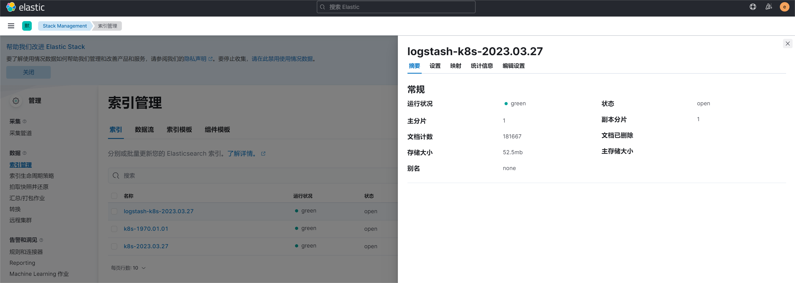{: .zoom}


然后同样创建索引模式，匹配上面的索引即可：
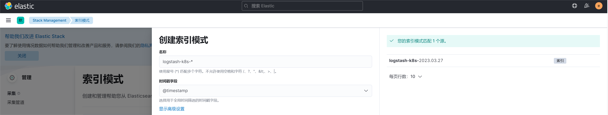{: .zoom}


创建完成后就可以前往发现页面过滤日志数据了。

到这里我们就实现了一个使用 Fluentd+Kafka+Logstash+Elasticsearch+Kibana 的 Kubernetes 日志收集工具栈，这里我们完整的 Pod 信息如下所示：

```shell
$ kubectl get pods -n logging
NAME                            READY   STATUS    RESTARTS   AGE
elasticsearch-client-0          1/1     Running   0          128m
elasticsearch-data-0            1/1     Running   0          128m
elasticsearch-master-0          1/1     Running   0          128m
fluentd-6k52h                   1/1     Running   0          61m
fluentd-cw72c                   1/1     Running   0          61m
fluentd-dn4hs                   1/1     Running   0          61m
kafka-0                         1/1     Running   3          134m
kafka-client                    1/1     Running   0          125m
kafka-zookeeper-0               1/1     Running   0          134m
kibana-kibana-66f97964b-qqjgg   1/1     Running   0          128m
logstash-0                      1/1     Running   0          13m
```

当然在实际的工作项目中还需要我们根据实际的业务场景来进行参数性能调优以及高可用等设置，以达到系统的最优性能。

上面我们在配置 logstash 的时候是将日志输出到 "logstash-k8s-%{+YYYY.MM.dd}" 这个索引模式的，可能有的场景下只通过日期去区分索引不是很合理，
那么我们可以根据自己的需求去修改索引名称，比如可以根据我们的服务名称来进行区分，那么这个服务名称可以怎么来定义呢？可以是 Pod 的名称或者通过 label 标签去指定，
比如我们这里去做一个规范，要求需要收集日志的 Pod 除了需要添加 logging: true 这个标签之外，还需要添加一个`logIndex: <索引名> `的标签。

比如重新更新我们测试的 counter 应用：

```yaml
apiVersion: v1
kind: Pod
metadata:
  name: counter
  labels:
    logging: "true" # 一定要具有该标签才会被采集
    logIndex: "test"  # 指定索引名称
spec:
  containers:
    - name: count
      image: busybox
      args:
        [
          /bin/sh,
          -c,
          'i=0; while true; do echo "$i: $(date)"; i=$((i+1)); sleep 1; done',
        ]
```

然后重新更新 logstash 的配置，修改 values 配置：

```yaml
# ......
logstashPipeline:
  logstash.conf: |
    input { kafka { bootstrap_servers => "kafka-0.kafka-headless.logging.svc.cluster.local:9092" codec => json consumer_threads => 3 topics => ["messages"] } }
    filter {}  # 过滤配置（比如可以删除key、添加geoip等等）
    output { elasticsearch { hosts => [ "elasticsearch-client:9200" ] user => "elastic" password => "oschina" index => "k8s-%{[kubernetes][labels][logIndex]}-%{+YYYY.MM.dd}" } stdout { codec => rubydebug } }
# ......
```

使用上面的 values 值更新 logstash，正常更新后上面的 counter 这个 Pod 日志会输出到一个名为 k8s-test-2022.06.09 的索引去。
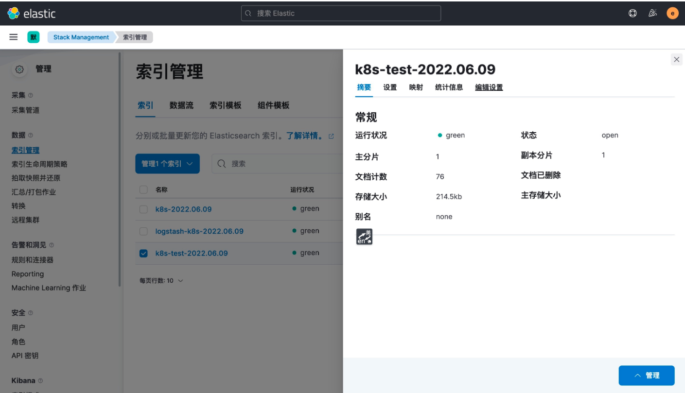{: .zoom}


这样我们就实现了自定义索引名称，当然你也可以使用 Pod 名称、容器名称、命名空间名称来作为索引的名称，这完全取决于你自己的需求。


"Elasticsearch集群性能优化实践"

    https://cloud.tencent.com/developer/article/1775059


## 3. 参考文献

 "参考文献"

    https://mp.weixin.qq.com/s/lPeYavvFJ6GdivkT0iwTGw
    https://docs.youdianzhishi.com/k8s/logging/efk/

# Kubernetes监控告警

本章将带领读者学习如何对Kubernetes集群以及部署的应用进行监控。

传统架构中比较流行的监控工具有Zabbix、Nagios等，这些监控工具对于Kubernetes这类云平台监控不是很友好，特别是当Kubernetes集群中有了成千上万的容器后更是如此，本章将带领读者学习下一代的云原生监控平台—Prometheus。

## 1.Prometheus的架构介绍

Prometheus是一个开源的系统监控和报警框架，其本身也是一个时间序列数据库（Time Series Database，TSDB),它的设计灵感来源于Google的Borgmon，就像Kubernetes是基于Borg系统开源的。

Prometheus是由Sound Cloud的Google前员工设计并开源的，官方网站为https://prometheus.io/。
Prometheus于2016年加入云原生计算基金会（Cloud Native Computing Foundation，CNCF）,成为受欢迎程度仅次于Kubernetes的开源项目。

该项目拥有非常活跃的开发者和用户社区，目前已经被很多公司采用，并且部分公司也参与了该项目的维护。

Prometheus被称为下一代的监控平台，具有很多和“老牌”监控不一样的特性，比如：

- 一个多维的数据模型，具有由指标名称和键-值对标识的时间序列数据。
- 使用PromQL查询和聚合数据，可以非常灵活地对数据进行检索。
- 不依赖额外的数据存储，Prometheus本身就是一个时序数据库，提供本地存储和分布式存储，并且每个Prometheus都是自治的。
- 应用程序暴露Metrics接口，Prometheus通过基于HTTP的Pull模型采集数据。
- 同时可以使用PushGateway进行Push数据。
- Prometheus同时支持动态服务和静态配置发现目标机器。
- 支持多种图形和仪表盘，和Grafana堪称“绝配”

Prometheus生态系统由多个组件组成。

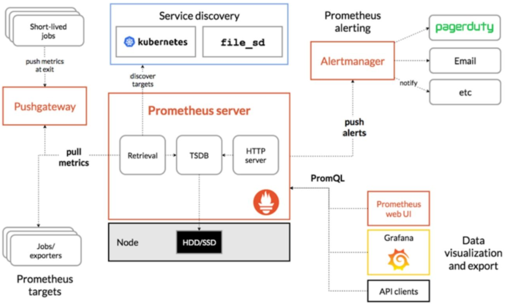

虽然Prometheus的组件有很多，但是很多组件都是可选的，所以Prometheus要比其他监控平台更灵活。接下来看一下每个组件的用途。

Prometheus Server：Prometheus生态最重要的组件，主要用于抓取和存储时间序列数据，同时提供数据的查询和告警策略的配置管
理。

- Alertmanager：Prometheus生态用于告警的组件，Prometheus Server会将告警发送给Alertmanager，Alertmanager根据路由配置
  将告警信息发送给指定的人或组。Alertmanager支持邮件、Webhook、微信、钉钉、短信等媒介进行告警通知。

- Grafana：用于展示数据，便于数据的查询和观测。

- Push Gateway：Prometheus本身是通过Pull的方式拉取数据的，但是有些监控数据可能是短期的，如果没有采集数据可能会出现丢
  失。Push Gateway可以用来解决此类问题，它可以用来接收数据，也就是客户端可以通过Push的方式将数据推送到Push Gateway，之后Prometheus可以通过Pull拉取该数据。

- Exporter：主要用来采集监控数据，比如主机的监控数据可以通过node_exporter采集，MySQL的监控数据可以通过mysql_exporter采集，之后Exporter暴露一个接口，比如/metrics，Prometheus可以通过该接口采集到数据。

- PromQL：PromQL其实不算Prometheus的组件，它是用来查询数据的
  一种语法，比如可以通过SQL语句查询数据库的数据，通过LogQL语句查询Loki的数据，通过PromQL语句查询Prometheus的数据。

- Service Discovery：用来发现监控目标的自动发现，常用的有基于Kubernetes、Consul、Eureka、文件的自动发现等。

以上对Prometheus进行了简单的介绍，接下来我们上手体验Prometheus的强大之处。

## 2.Prometheus的安装

Prometheus有多种安装方式，比如二进制安装、容器安装和Kubernetes
集群中安装，由于本书是基于Kubernetes展开的，因此会将Prometheus安装到Kubernetes集群中，当然这也是官方推荐的部署方式。

将Prometheus安装到Kubernetes集群也有很多方式，比如之前提到过的Helm、Operator等，Prometheus也是支持上述安装方式的。

但是Prometheus是一个生态系统，有很多组件都需要安装，并且也有很多监控需要单独配置，于是Prometheus官方开源了一个kube-prometheus项目，该项目不仅仅是用来安装Prometheus的，也包含很多其他的组件，如下所示：

- Prometheus Operator。
- 高可用的Prometheus。
- 高可用的Alertmanager。
- 主机监控Node Exporter。
- Prometheus Adapter。
- 容器监控kube-state-metrics。
- 图形化展示Grafana。

具体可以通过https://github.com/prometheus-operator/kube-prometheus/找到该项目进行查看。

有了kube-prometheus项目，对其的安装也变得非常简单，只需要两条命令即可。

首先需要通过该项目地址找到和自己Kubernetes版本对应的Kube Prometheus Stack的版本，如图15.2所示。

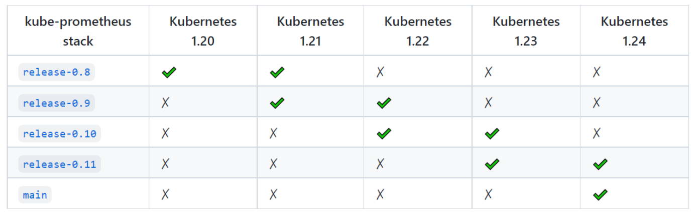{: .zoom}

图15.2　Prometheus版本选择

之后将该项目对应分支克隆到本地：

kubernetes1.21使用如下方式

```shell
$ git clone -b release-0.9 https://github.com/prometheus-operator/kube-prometheus.git
$ cd kube-prometheus/manifests
```


kubernetes1.20使用如下方式

```shell
$ git clone https://github.com/prometheus-operator/kube-prometheus.git
$ cd kube-prometheus
$ git checkout -b origin/release-0.8 remotes/origin/release-0.8
$ cd manifests/
```

首先安装Prometheus Operator：

```shell
$ kubectl create -f setup/
namespace/monitoring created
...
deployment.apps/prometheus-operator created
service/prometheus-operator created
serviceaccount/prometheus-operator created
```

查看Operator容器的状态：

```shell
$ kubectl get pod -n monitoring
NAME                                   READY   STATUS    RESTARTS   AGE
prometheus-operator-75d9b475d9-pk8qb   2/2     Running   0          4m16s
```


**数据持久化**

配置prometheus持久化的配置清单：

prometheus-prometheus.yaml

```yaml
  image: quay.io/prometheus/prometheus:v2.26.0
  env:
  - name: TZ
    value: "Asia/Shanghai"
......
  retention: 15d
  storage:
    volumeClaimTemplate:
      spec:
        storageClassName: gitee-nfs-client
        resources:
          requests:
            storage: 20Gi
```

配置grafana持久化的配置清单：

grafana-pvc.yaml

```shell
$ mkdir grafana-pvc 
$ vim grafana-pvc.yaml

```

```yaml
apiVersion: v1
kind: PersistentVolumeClaim
metadata:
  name: grafana-pvc
  namespace: monitoring
spec:
  accessModes:
  - ReadWriteMany
  resources:
    requests:
      storage: 20M
  storageClassName: gitee-nfs-client
```


grafana-deployment.yaml

```yaml
.......

    spec:
      containers:
      # 固定grafana的登陆密码
      - env:
         - name: GF_SECURITY_ADMIN_USER
            value: admin
          - name: GF_SECURITY_ADMIN_PASSWORD
            value: oschina123
          - name: TZ
            value: Asia/Shanghai
        # image: grafana/grafana:8.1.1
        image: grafana/grafana:8.4.7
        name: grafana
        ports:
        - containerPort: 3000
          name: http
        readinessProbe:
          httpGet:
            path: /api/health
            port: http
        resources:
          limits:
            cpu: 200m
            memory: 200Mi
          requests:
            cpu: 100m
            memory: 100Mi
      .......

      nodeSelector:
        kubernetes.io/os: linux
      securityContext:
        fsGroup: 65534
        runAsNonRoot: true
        runAsUser: 65534
      serviceAccountName: grafana
      volumes:
      # 持久化pvc
      - name: grafana-storage
        persistentVolumeClaim:
          claimName: grafana-pvc
.......
```


配置alertmanager持久化的配置清单：alertmanager-alertmanager.yaml

```yaml
....
  retention: 24h
  storage:
    volumeClaimTemplate:
      spec:
        storageClassName: gitee-nfs-client
        resources:
          requests:
            storage: 10Gi
```


 "参考文献"

    https://www.lhl.zone/virtualization/kube-prometheus/102.html


Operator容器启动后，安装Prometheus Stack：

```sh
$ kubectl create -f .
alertmanager.monitoring.coreos.com/main created
Warning: policy/v1beta1 PodDisruptionBudget is deprecated in v1.21+, unavailable in v1.25+; use policy/v1 PodDisruptionBudget
poddisruptionbudget.policy/alertmanager-main created
prometheusrule.monitoring.coreos.com/alertmanager-main-rules created
....
role.rbac.authorization.k8s.io/prometheus-k8s-config created
role.rbac.authorization.k8s.io/prometheus-k8s created
role.rbac.authorization.k8s.io/prometheus-k8s created
role.rbac.authorization.k8s.io/prometheus-k8s created
service/prometheus-k8s created
serviceaccount/prometheus-k8s created
servicemonitor.monitoring.coreos.com/prometheus-k8s created
```


不过需要注意有一些资源的镜像来自于 `k8s.gcr.io`，如果不能正常拉取，则可以将镜像替换成可拉取的：

- `prometheusAdapter-deployment.yaml`：将 `image: k8s.gcr.io/prometheus-adapter/prometheus-adapter:v0.9.1` 替换为 `cnych/prometheus-adapter:v0.9.1`
- `kubeStateMetrics-deployment.yaml`：将 `image: k8s.gcr.io/kube-state-metrics/kube-state-metrics:v2.4.2` 替换为 `cnych/kube-state-metrics:v2.4.2`


```shell
$ sed 's#k8s.gcr.io/kube-state-metrics/kube-state-metrics:v2.1.1#cnych/kube-state-metrics:v2.4.2#g' -i *.yaml
$ sed 's#k8s.gcr.io/prometheus-adapter/prometheus-adapter:v0.9.0#cnych/prometheus-adapter:v0.9.1#g' -i *.yaml
```


这会自动安装 prometheus-operator、node-exporter、kube-state-metrics、grafana、prometheus-adapter 以及 prometheus 和 alertmanager 等大量组件，如果没成功可以多次执行上面的安装命令。

查看Prometheus容器的状态：

```sh
$ kubectl get pods -n monitoring
NAME                                   READY   STATUS    RESTARTS   AGE
alertmanager-main-0                    2/2     Running   0          6m41s
alertmanager-main-1                    2/2     Running   0          6m41s
alertmanager-main-2                    2/2     Running   0          6m41s
blackbox-exporter-6798fb5bb4-9rg5s     3/3     Running   0          6m41s
grafana-7476b4c65b-6qrxh               1/1     Running   0          6m40s
kube-state-metrics-64c7ff87dc-8b4bs    3/3     Running   0          6m40s
node-exporter-2f2h2                    2/2     Running   0          6m40s
node-exporter-2zcbr                    2/2     Running   0          6m40s
node-exporter-5txxx                    2/2     Running   0          6m40s
node-exporter-7wxp6                    2/2     Running   0          6m40s
node-exporter-99wrh                    2/2     Running   0          6m40s
node-exporter-dcfdn                    2/2     Running   0          6m40s
node-exporter-g7hl9                    2/2     Running   0          6m40s
node-exporter-hsgwx                    2/2     Running   0          6m40s
node-exporter-jp8qs                    2/2     Running   0          6m40s
prometheus-adapter-77774d7447-r7m9p    1/1     Running   0          6m40s
prometheus-adapter-77774d7447-xjcm5    1/1     Running   0          6m40s
prometheus-k8s-0                       2/2     Running   0          6m39s
prometheus-k8s-1                       2/2     Running   0          6m39s
prometheus-operator-75d9b475d9-pk8qb   2/2     Running   0          97m

$ kubectl get svc -n monitoring
NAME                    TYPE        CLUSTER-IP       EXTERNAL-IP   PORT(S)                      AGE
alertmanager-main       ClusterIP   10.111.159.143   <none>        9093/TCP                     6m58s
alertmanager-operated   ClusterIP   None             <none>        9093/TCP,9094/TCP,9094/UDP   6m58s
blackbox-exporter       ClusterIP   10.103.27.127    <none>        9115/TCP,19115/TCP           6m58s
grafana                 ClusterIP   10.102.99.88     <none>        3000/TCP                     6m57s
kube-state-metrics      ClusterIP   None             <none>        8443/TCP,9443/TCP            6m57s
node-exporter           ClusterIP   None             <none>        9100/TCP                     6m57s
prometheus-adapter      ClusterIP   10.110.138.216   <none>        443/TCP                      6m57s
prometheus-k8s          ClusterIP   10.106.193.178   <none>        9090/TCP                     6m56s
prometheus-operated     ClusterIP   None             <none>        9090/TCP                     6m56s
prometheus-operator     ClusterIP   None             <none>        8443/TCP                     97m
```

待容器全部下载完成(首次安装镜像下载可能会很慢)并且启动后，可以访问Grafana和Prometheus 。

在执行安装时会自动创建Grafana和Prometheus的Service，可以通过NodePort或者Ingress的方式访问，在此演示的为NodePort方式。

首先将Grafana的Service改成NodePort类型：

```sh
$ kubectl edit svc grafana -n monitoring
  selector:
    app.kubernetes.io/component: grafana
    app.kubernetes.io/name: grafana
    app.kubernetes.io/part-of: kube-prometheus
  sessionAffinity: None
  # 更改Grafana的Service类型
  type: NodePort
```

或者直接修改`grafana-service.yaml`文件内容

```yaml
apiVersion: v1
kind: Service
metadata:
  labels:
    app.kubernetes.io/component: grafana
    app.kubernetes.io/name: grafana
    app.kubernetes.io/part-of: kube-prometheus
    app.kubernetes.io/version: 7.5.4
  name: grafana
  namespace: monitoring
spec:
  type: NodePort
  ports:
  - name: http
    port: 3000
    nodePort: 30030
    targetPort: http
  selector:
    app.kubernetes.io/component: grafana
    app.kubernetes.io/name: grafana
    app.kubernetes.io/part-of: kube-prometheus
```


查看Grafana Service的NodePort：

```sh
$ kubectl get svc grafana -n monitoring
NAME      TYPE       CLUSTER-IP     EXTERNAL-IP   PORT(S)          AGE
grafana   NodePort   10.102.99.88   <none>        3000:31790/TCP   8m55s
```

之后通过任意一个安装了kube-proxy服务的节点IP+31790端口即可访问Grafana，如图15.4所示。


Grafana默认登录的账号和密码为admin/admin，登录会提示更改密码，也可以单击skip不更改密码。然后以相同的方式更改Prometheus的Service为NodePort：

```sh
$ kubectl edit svc prometheus-k8s -n monitoring
  selector:
    app: prometheus
    app.kubernetes.io/component: prometheus
    app.kubernetes.io/name: prometheus
    app.kubernetes.io/part-of: kube-prometheus
    prometheus: k8s
  sessionAffinity: ClientIP
  sessionAffinityConfig:
    clientIP:
      timeoutSeconds: 10800
  # 更改prometheus的Service类型
  type: NodePort

$ kubectl get svc prometheus-k8s -n monitoring
NAME             TYPE       CLUSTER-IP       EXTERNAL-IP   PORT(S)          AGE
prometheus-k8s   NodePort   10.106.193.178   <none>        9090:31635/TCP   13m
```

最后通过任意一个安装了kube-proxy服务的节点IP+31635端口即可访问Prometheus的Web UI，如图15.5所示。

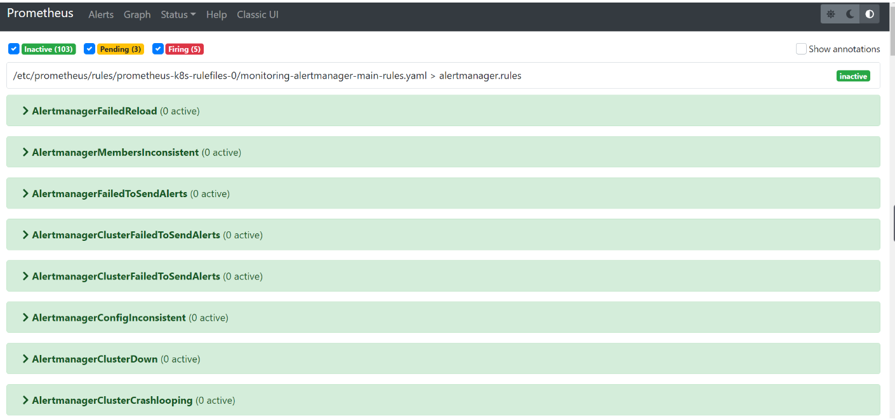{: .zoom}

>
> "提示"：默认安装完成后，会有几个告警，先忽略。
>


如果要清理 Prometheus-Operator，可以直接删除对应的资源清单即可：

```shell
$ kubectl delete -f kube-prometheus/manifests/
$ kubectl delete -f kube-prometheus/manifests/setup/
```

## 3.云原生和非云原生应用的监控流程

通过前面的学习，可以看到只需要几条命令即可完成Prometheus Stack的安装，接下来开始介绍Prometheus是如何抓取数据的。

### 3.1 监控数据来源

从Prometheus的架构中了解到，Prometheus通常采用Pull的形式来拉取数据，也就意味着被监控应用只要有一个能获取到监控数据的接口，就可以采集到监控数据，所以接下来讲一下这个接口从何而来。

如果读者从事云相关的工作，肯定都听说过云原生这个词语，其中云原生涉及12个关键要素，其中一项就是应用的开发者在进行相关程序开发时，要考虑程序本身一些内部的运行情况，比如程序当前的连接数、资源占用情况等，此时可以引用Prometheus的客户端工具来采集并暴露数据，也就是基于云原生理念开发的程序自己会暴露Metrics接口，就像Kubernetes本身的组件、Etcd等，都有一个/metrics接口，Prometheus只需要请求这个接口即可获取到相关数据。

基于云原生理念开发的程序大部分都有相关接口，但是有很多应用并非是基于云原生理念开发的，所以没有此类接口，比如MySQL、Redis等。

那么如何采集这类程序的监控数据呢？这个时候在讲解Prometheus架构时提到的Exporter就派上用场了，Exporter主要用来采集非云原生应用的内部数据，它可以通过某些机制（比如调用接口、执行客户端命名）来获取内部一些比较重要的数据，然后将其转换成Prometheus能够识别的数据，并且由Exporter暴露/metrics，此时Prometheus就可以采集到由Exporter暴露的非云原生应用的内部运行状态。目前比较常用的Exporter工具如表15.1所示。

表15.1　目前比较常用的Exporter工具

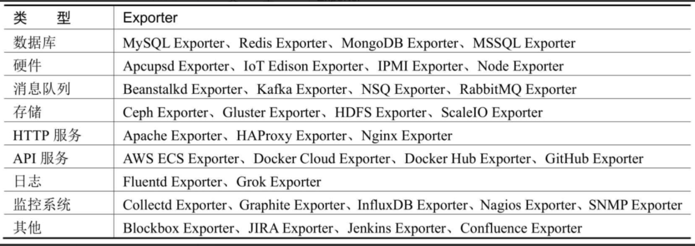

在安装了Prometheus Stack后，默认会安装一些常用的监控，比如Kubernetes组件、集群状态、主机状态的监控等。其中Kubernetes组件是基于云原生理念开发的，它自身提供了Metrics接口，比如Kubelet组件可以通过主机的10255端口访问监控数据：

```shell
$ curl -s 127.0.0.1:10255/metrics| tail -5
```

如果读者的Kubelet不是10255端口，可以通过netstat查看监听的端口号：

```shell
$ netstat -lnpt|grep kubelet
tcp        0      0 127.0.0.1:10248         0.0.0.0:*               LISTEN      96284/kubelet
tcp6       0      0 :::10250                :::*                    LISTEN      96284/kubelet
```

之后在Grafana页面即可看到相关的监控数据，依次单击General/Home→Default→Kubernetes/Kubelet即可看到面板，如图15.6所示。

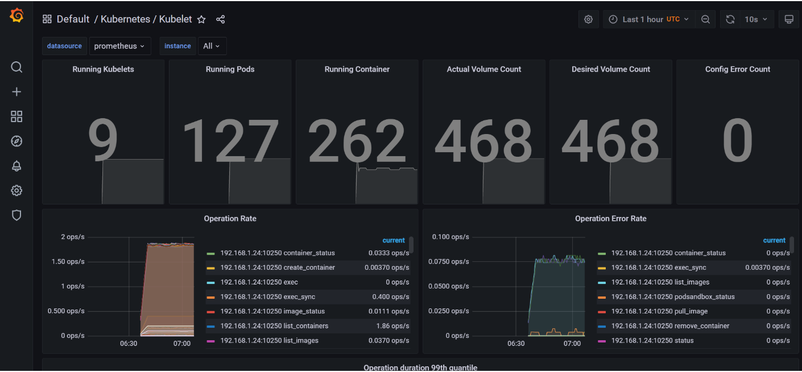{: .zoom}

Kubernetes节点（也就是服务器本身）肯定不是云原生应用，或者说它不算一个应用，而是一个系统，那么系统本身肯定没有类似的Metrics接口。

按照之前的讲解，需要有一个Exporter采集宿主机信息，然后暴露给Prometheus，此时可以使用专用于主机信息采集的node-exporter应用来采集数据，并暴露Metrics接口给Prometheus。

安装Prometheus Stack时，默认用DaemonSet安装了node-exporter，它会在每个Kubernetes节点部署一个node-exporter：

```shell
$ kubectl get ds -n monitoring
NAME            DESIRED   CURRENT   READY   UP-TO-DATE   AVAILABLE   NODE SELECTOR            AGE
node-exporter   9         9         9       9            9           kubernetes.io/os=linux   34m

$ kubectl get pod -n monitoring|grep node-exporter
node-exporter-2f2h2                    2/2     Running   0          34m
node-exporter-2zcbr                    2/2     Running   0          34m
node-exporter-5txxx                    2/2     Running   0          34m
node-exporter-7wxp6                    2/2     Running   0          34m
node-exporter-99wrh                    2/2     Running   0          34m
node-exporter-dcfdn                    2/2     Running   0          34m
node-exporter-g7hl9                    2/2     Running   0          34m
node-exporter-hsgwx                    2/2     Running   0          34m
node-exporter-jp8qs                    2/2     Running   0          34m
```

此时可以在每个宿主机看到node-exporter监听的9100端口：

```shell
$ netstat -lntp|grep node_exporter
tcp        0      0 127.0.0.1:9100          0.0.0.0:*               LISTEN      40711/node_exporter
```

此时访问9100即可访问到主机的监控信息：

```shell
$ curl -s 127.0.0.1:9100/metrics| tail -5
# HELP promhttp_metric_handler_requests_total Total number of scrapes by HTTP status code.
# TYPE promhttp_metric_handler_requests_total counter
promhttp_metric_handler_requests_total{code="200"} 281
promhttp_metric_handler_requests_total{code="500"} 0
promhttp_metric_handler_requests_total{code="503"} 0
```

同时在Grafana上也可以看到监控面板,单击General/Home→Default→Node Exporter。

通过上面的理解，我们知道了针对云原生应用或非云原生应用的监控数据来源，但是Prometheus是如何知道要采集哪些数据的呢？接下来我们介绍如何配置Prometheus采集指定目标应用的监控数据。


### 3.2 什么是ServiceMonitor

如果读者体验过容器化或者二进制的方式安装Prometheus，就会注意到Prometheus有一个配置文件，用于配置需要监控哪些数据，或者配置一些告警策略。

这个配置文件的维护非常麻烦，特别是监控项非常多的情况下，很容易出现配置错误，而在Kubernetes上部署Prometheus，可以不用去维护这个配置文件，而是通过一个叫ServiceMonitor的资源来自动发现监控目标并动态生成配置。

比如上述展示的Kubelet和NodeExporter的监控 ， 都有一个ServiceMonitor：

```shell
$ kubectl get servicemonitor -n monitoring
NAME                      AGE
alertmanager              42m
blackbox-exporter         42m
coredns                   42m
grafana                   42m
kube-apiserver            42m
kube-controller-manager   42m
kube-scheduler            42m
kube-state-metrics        42m
kubelet                   42m
node-exporter             42m
prometheus-adapter        42m
prometheus-k8s            42m
prometheus-operator       42m
```

可以通过-o命令查看配置详情：

```shell
$ kubectl get servicemonitor -n monitoring kubelet -o yaml
apiVersion: monitoring.coreos.com/v1
kind: ServiceMonitor
metadata:
  creationTimestamp: "2022-12-28T06:35:18Z"
  generation: 1
  labels:
    app.kubernetes.io/name: kubelet
  name: kubelet
  namespace: monitoring
  resourceVersion: "269124093"
  selfLink: /apis/monitoring.coreos.com/v1/namespaces/monitoring/servicemonitors/kubelet
  uid: 0295ed26-49c4-4b15-ba92-f63a0bc5e7ec
spec:
  endpoints:
  - bearerTokenFile: /var/run/secrets/kubernetes.io/serviceaccount/token
    honorLabels: true
    interval: 30s
    metricRelabelings:
......

  jobLabel: app.kubernetes.io/name
  namespaceSelector:
    matchNames:
    - kube-system
  selector:
    matchLabels:
      app.kubernetes.io/name: kubelet
```

上述展示的是一个Kubelet的ServiceMonitor配置，可以看到它的kind配置为ServiceMonitor，并非标准的Kubernetes提供的资源类型。

在第13章，我们讲过Operator和CRD，Prometheus Stack也是一种CRD和Operator的实现。我们定义了一个类型为ServiceMonitor的自定义资源，Prometheus的Operator会解析该资源类型的配置，然后动态生成Prometheus的配置，

这就是ServiceMonitor的作用,它可以让我们用资源定义的方式去配置Prometheus需要监控谁，不用再处理成百上千行的Prometheus配置，也不需要每次更改Prometheus配置后重启Prometheus实例。

接下来看一个ServiceMonitor配置示例：

```yaml
apiVersion: monitoring.coreos.com/v1
kind: ServiceMonitor
metadata:
  labels:
    k8s-app: elasticsearch-exporter
    release: es-exporter
  name: es-exporter-elasticsearch-exporter
  namespace: monitoring
spec:
  endpoints:
  - honorLabels: true
    interval: 10s
    path: /metrics
    port: http
    scheme: http
  jobLabel: es-exporter
  namespaceSelector:
    matchNames:
    - monitoring
  selector:
    matchLabels:
      k8s-app: elasticsearch-exporter
      release: es-exporter
```

- honorLabels：如果目标标签和服务器标签冲突，是否保留目标标签。
- interval：监控数据抓取的时间间隔。
- path：Metrics接口路径。
- port：Metrics端口。
- scheme：Metrics接口的协议。
- namespaceSelector：监控目标Service所在的命名空间。
- selector：监控目标Service的标签。

反过来再看Kubelet的ServiceMonitor：

```yaml
  namespaceSelector:
    matchNames:
    - kube-system
  selector:
    matchLabels:
      app.kubernetes.io/name: kubelet
```

可以看到该ServiceMonitor的监控目标是kube-system命名空间下具有app.kubernetes.io/name=kubelet标签的Service,此时可以查 看该Service：

```shell
$ kubectl get svc -n kube-system -l app.kubernetes.io/name=kubelet
NAME      TYPE        CLUSTER-IP   EXTERNAL-IP   PORT(S)                        AGE
kubelet   ClusterIP   None         <none>        10250/TCP,10255/TCP,4194/TCP   161m
```

通过上面的学习，我们简单总结一下，在使用Prometheus监控应用时，有云原生和非云原生应用之分，说白了就是监控数据是由程序本身提供还是通过Exporter提供。对于不同的应用，可以采用不同的管控流程，具体说明如下：

- 云原生应用：找到本身提供的Metrics接口，然后配置一个Service指向该应用的Pod，最后创建一个ServiceMonitor指定该应用的Service即可完成监控数据的采集。

- 非云原生应用：需要找到合适该应用的Exporter，之后Exporter链接至该应用并采集相关数据，然后配置一个Service指向该Exporter的Pod，最后创建一个ServiceMonitor指定该Exporter的Service即可完成监控数据的采集。

### 3.3 ServiceMonitor找不到监控主机排查

通过上面的学习，我们知道了Prometheus监控应用的流程，接下来趁热打铁看一个Kubernetes组件的监控问题。

如果读者采用的是二进制方式安装的Kubernetes集群，安装Prometheus后，kube-controller-manager和kube-
scheduler可能处于无法监控的状态，也就是找不到目标主机。

可以通过Prometheus的Web UI的Status→Service Discovery查看，如图15.7所示。

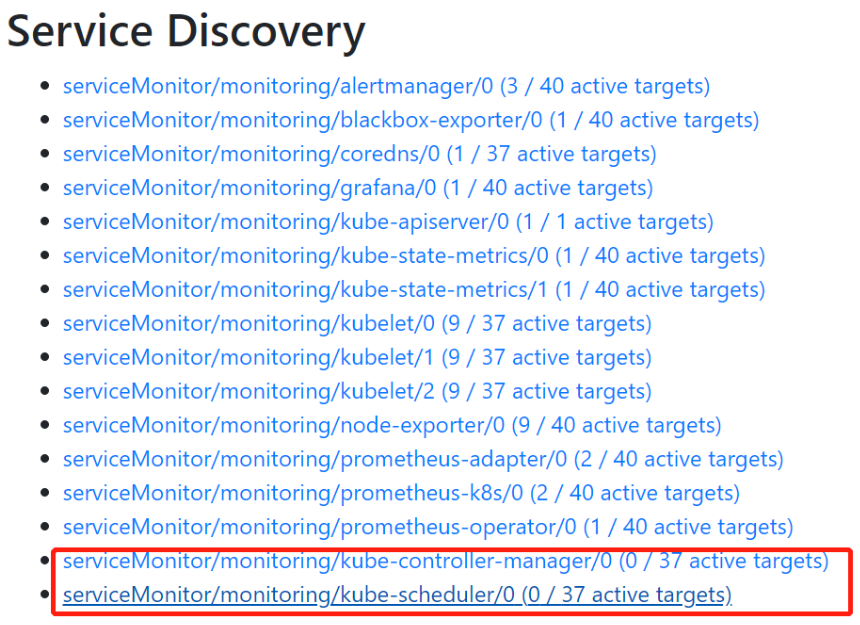{: .zoom}

同时在Alerts页面也能看到Controller Manager和Scheduler的告警，如图15.8所示。

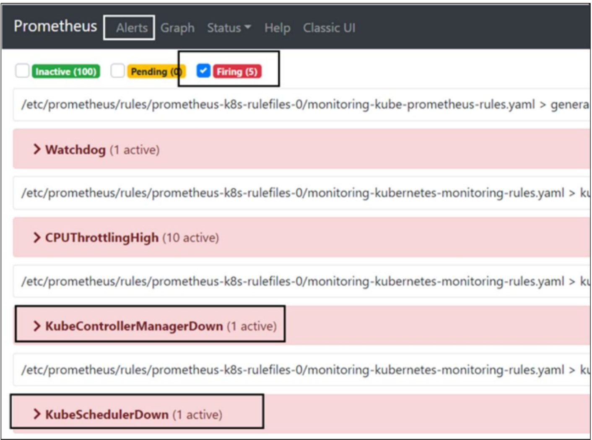

图15.8　查看告警

此时虽然有kube-controller-manager和kube-scheduler的监控配置，但是并没有发现可用的监控目标。接下来我们分析一下为什么找不到监控目标。

---

注意
本节的排查思路是通用步骤，不仅仅局限于controller和scheduler。

其次Kubernetes版本不一致，针对controller和scheduler的问题解决方式可能并不一致，但是ServiceMonitor找不到主机的排查步骤是一致的。

---

首先我们注意到Prometheus是有相关配置的，说明ServiceMonitor已经创建成功，可以通过以下命令查看：

```shell
$ kubectl get servicemonitors -n monitoring kube-controller-manager kube-scheduler
NAME                      AGE
kube-controller-manager   127m
kube-scheduler            127m
```

接下来进一步分析 ,首先查看kube-controller-manager的ServiceMonitor配置：

```shell
$ kubectl get servicemonitor -n monitoring kube-controller-manager -o yaml
apiVersion: monitoring.coreos.com/v1
kind: ServiceMonitor
......
    port: https-metrics
    scheme: https
    tlsConfig:
      insecureSkipVerify: true
  jobLabel: app.kubernetes.io/name
  namespaceSelector:
    matchNames:
    - kube-system
  selector:
    matchLabels:
      app.kubernetes.io/name: kube-controller-manager
```

看到该ServiceMonitor 匹配的是kube-system 命名空间下具有app.kubernetes.io/name=kubecontroller-manager的标签，接下来通过该标签查看是否有该Service：

```shell
$ kubectl get svc -n kube-system -l app.kubernetes.io/name=kube-controller-manager
No resources found in kube-system namespace.
```

可以看到并没有此标签的Service，所以导致找不到需要监控的目标，此时可以手动创建该Service和Endpoint指向自己的Controller Manager：

`kubernetesControlPlane-serviceMonitorKubeControllerManager.yaml`

```yaml
apiVersion: v1
kind: Service
metadata:
  namespace: kube-system
  name: kube-controller-manager
  labels:
    app.kubernetes.io/name: kube-controller-manager
spec:
  selector:
    component: kube-controller-manager
  ports:
    - name: https-metrics
      port: 10257
      targetPort: 10257 # controller-manager 的安全端口为10257
```

注意需要更改Endpoint配置的YOUR_CONTROLLER_IP为自己的Controller Manager的IP，接下来创建该Service和Endpoint：

```shell
$ kubectl create -f kubernetesControlPlane-serviceMonitorKubeControllerManager.yaml
service/kube-controller-manager created
```

查看创建的Service和Endpoint：

```shell
$ kubectl get svc -n kube-system kube-controller-manager
NAME                      TYPE        CLUSTER-IP     EXTERNAL-IP   PORT(S)     AGE
kube-controller-manager   ClusterIP   10.99.49.192   <none>        10257/TCP   37s
```

此时该Service可能是不通的，因为在集群搭建时，Controller Manager和Scheduler监听的可能是127.0.0.1，导致无法被外部访问，此时需要更改它的监听地址为0.0.0.0（如果读者的集群原本监听的就是0.0.0.0，则无须更改，kubeadm安装方式配置文件在/etc/kubernetes/manifests目录）：

```shell
$ sed -i 's#address=127.0.0.1#address=0.0.0.0#g' /usr/lib/systemd/system/kube-controller-manager.service
$ systemctl daemon-reload
$ systemctl restart kube-controller-manager
```

如果使用kubeadm启动的集群，初始化时加入如下参数

```
controllerManagerExtraArgs:
  address: 0.0.0.0
schedulerExtraArgs:
  address: 0.0.0.0
```

如果是已经启动之后的集群，可以使用如下命令修改

```shell
$ sed -e "s/- --address=127.0.0.1/- --address=0.0.0.0/" -i /etc/kubernetes/manifests/kube-controller-manager.yaml
$ sed -e "s/- --address=127.0.0.1/- --address=0.0.0.0/" -i /etc/kubernetes/manifests/kube-scheduler.yaml
```

> 提示：如果读者的Kubernetes版本大于1.22，到此步骤后，controller的问题就已经解决了。
>

---

通过该Service的ClusterIP访问Controller Manager的Metrics接口：

```shell
$ kubectl get svc -n kube-system kube-controller-manager
NAME                      TYPE        CLUSTER-IP     EXTERNAL-IP   PORT(S)     AGE
kube-controller-manager   ClusterIP   10.99.49.192   <none>        10257/TCP   37s

$ curl -s 10.99.49.192:10257/metrics| tail -1
```

到此时，读者可能会以为有了这个Service之后，Prometheus就能发现该目标，但其实不然，细心的读者会发现ServiceMonitor的port和scheme配置的和该Service的不一致。

在创建Service之前，如果读者的集群已经有了符合ServiceMonitor选择的Service，依旧不能发现监控目标，就需要检查端口和协议是否和Service配置的一致。更改ServiceMonitor的配置和Service一致，如下所示。

```yaml
    port: https-metrics
    scheme: https
    tlsConfig:
      insecureSkipVerify: true
```

配置Service Monitor

```shell
$ kubectl edit servicemonitor kube-controller-manager -n monitoring
```

等待几分钟后， 就可以在Prometheus 的Web UI上看到Controller Manager的监控目标，如图15.10和图15.11所示。

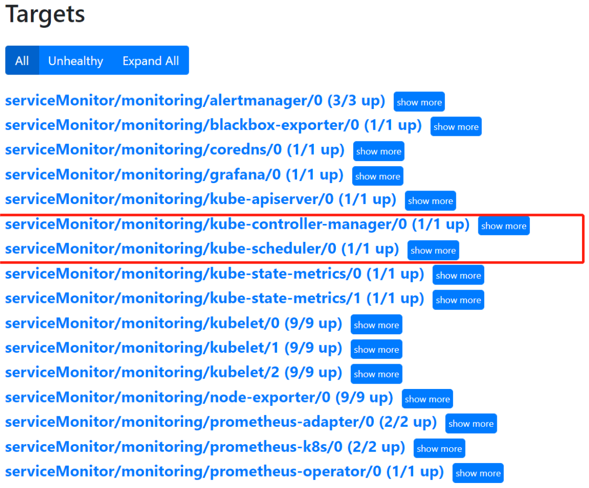
图15.10　查看Targets

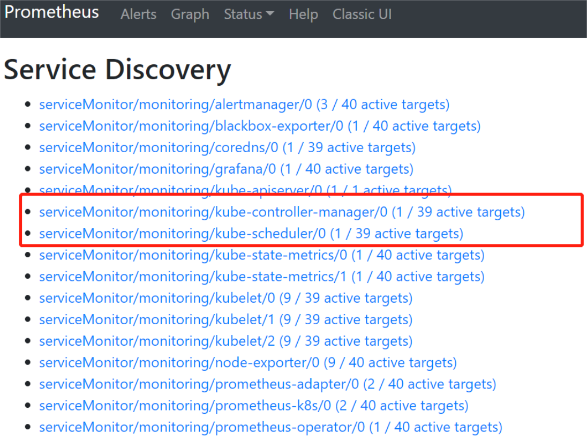
图15.11　查看Service Discovery

> "参考"：https://p8s.io/docs/operator/install/
>


此时告警也会消失，Grafana也能查看到Controller Manager的监控数据。Scheduler的排查和Controller Manager一致。

`kubernetesControlPlane-serviceMonitorKubeScheduler.yaml`

```yaml
apiVersion: monitoring.coreos.com/v1
kind: ServiceMonitor
metadata:
  labels:
    app.kubernetes.io/name: kube-scheduler
    app.kubernetes.io/part-of: kube-prometheus
  name: kube-scheduler
  namespace: monitoring
spec:
  endpoints:
  - bearerTokenFile: /var/run/secrets/kubernetes.io/serviceaccount/token
    interval: 30s
    port: https-metrics
    scheme: https
    tlsConfig:
      insecureSkipVerify: true
  jobLabel: app.kubernetes.io/name
  namespaceSelector:
    matchNames:
    - kube-system
  selector:
    matchLabels:
      app.kubernetes.io/name: kube-scheduler

---

apiVersion: v1
kind: Service
metadata:
  namespace: kube-system
  name: kube-scheduler
  labels: # 必须和上面的 ServiceMonitor 下面的 matchLabels 保持一致
    app.kubernetes.io/name: kube-scheduler
spec:
  selector:
    component: kube-scheduler
  ports:
    - name: https-metrics
      port: 10259
      # 需要注意现在版本默认的安全端口是10259
      targetPort: 10259 
```

综上所述，通过ServiceMonitor监控应用时，如果监控没有找到目标主机的排查步骤，排查步骤大致如下：

- 确认ServiceMonitor是否成功创建。
- 确认Prometheus是否生成了相关配置。
- 确认存在ServiceMonitor匹配的Service。
- 确认通过Service能够访问程序的Metrics接口。
- 确认Service的端口和Scheme、ServiceMonitor一致。

### 3.4 云原生应用监控

通过前面的学习，我们对Prometheus相关知识做了一些了解，也理解了云原生和非云原生应用的监控流程，接下来通过两个示例演示应用监控的基本流程。

除了 Kubernetes 集群中的一些资源对象、节点以及组件需要监控，有的时候我们可能还需要根据实际的业务需求去添加自定义的监控项，添加一个自定义监控的步骤也是非常简单的。

第一步建立一个 ServiceMonitor 对象，用于 Prometheus 添加监控项

第二步为 ServiceMonitor 对象关联 metrics 数据接口的一个 Service 对象

第三步确保 Service 对象可以正确获取到 metrics 数据

接下来我们就来为大家演示如何添加 etcd 集群的监控。无论是 Kubernetes 集群外的还是使用 kubeadm 安装在集群内部的 etcd 集群，我们这里都将其视作集群外的独立集群，因为对于二者的使用方法没什么特殊之处。


在安装Prometheus时，并没有对Etcd集群进行监控，Etcd集群是Kubernetes的数据库，掌握着Kubernetes最核心的数据，Etcd的状态和性能直接影响Kubernetes集群的状态，所以对Etcd集群的监控是非常重要的。

接下来通过Etcd的监控学习如何对云原生应用进行监控。

之前讲了，云原生应用会提供一个Metrics接口，可以直接获取到内部的运行信息，比如Etcd的内部数据可以通过2379的/metrics得到，和之前的kubelet类似。不同的是，Etcd对外的接口必须通过HTTPS协议访问，所以在请求时需要加上对应的证书，比如：

```shell
$ curl -s --cert /etc/kubernetes/pki/etcd/etcd.pem --key /etc/kubernetes/pki/etcd/etcd-key.pem https://YOUR_ETCD_IP:2379/metrics -k | tail -1
```

证书的位置可以在Etcd配置文件中获得（注意配置文件的位置，不同的集群位置可能不同 ， Kubeadm 安 装 方 式 可 能 会在/etc/kubernetes/manifests/etcd.yml中)：

```shell
$ grep -E "key-file|cert-file" /etc/kubernetes/manifests/etcd.yaml
    - --cert-file=/etc/kubernetes/pki/etcd/server.crt
    - --key-file=/etc/kubernetes/pki/etcd/server.key
    - --peer-cert-file=/etc/kubernetes/pki/etcd/peer.crt
    - --peer-key-file=/etc/kubernetes/pki/etcd/peer.key

```

可以看到，此时加上--cert和--key参数才可以访问Etcd的Metrics接口，所以在配置ServiceMonitor时需要加上证书的配置。

**1．创建Etcd ServiceMonitor**

首先，需要配置Etcd的Service和Endpoint：

`kubernetesControlPlane-serviceMonitorEtcd.yaml`

```yaml
apiVersion: monitoring.coreos.com/v1
kind: ServiceMonitor
metadata:
  name: etcd-k8s
  namespace: monitoring
  labels:
    k8s-app: etcd-k8s
spec:
  jobLabel: k8s-app
  endpoints:
    - port: port
      interval: 15s
  selector:
    matchLabels:
      k8s-app: etcd
  namespaceSelector:
    matchNames:
      - kube-system
```

需要注意将YOUR_ETCD_IP改成自己的Etcd主机IP，另外需要注意port的名称为https-metrics，要和后面的ServiceMonitor保持一致。之后创建该资源并查看Service的ClusterIP：

```sh
$ kubectl create -f kubernetesControlPlane-serviceMonitorEtcd.yaml
servicemonitor.monitoring.coreos.com/etcd-k8s created
```

**2.创建Etcd Service**

但实际上现在并不能监控到 etcd 集群，因为并没有一个满足 ServiceMonitor 条件的 Service 对象与之关联：

```sh
$ kubectl get svc -n kube-system -l k8s-app=etcd
No resources found in kube-system namespace.
```

所以接下来我们需要创建一个满足上面条件的 Service 对象，由于我们把 etcd 当成是集群外部的服务，所以要引入到集群中来我们就需要自定义 Endpoints 对象来创建 Service 对象了：

`etcd-service.yaml`

```yaml
apiVersion: v1
kind: Service
metadata:
  name: etcd-k8s
  namespace: kube-system
  labels:
    k8s-app: etcd
spec:
  type: ClusterIP
  clusterIP: None # 一定要设置 clusterIP:None
  ports:
    - name: port
      port: 2381
---
apiVersion: v1
kind: Endpoints
metadata:
  name: etcd-k8s
  namespace: kube-system
  labels:
    k8s-app: etcd
subsets:
  - addresses:
      - ip: 192.168.1.56 # 指定etcd节点地址，如果是集群则继续向下添加
        nodeName: etc-master
    ports:
      - name: port
        port: 2381
```

```sh
$ kubectl create -f etcd-service.yaml
service/etcd-k8s created
endpoints/etcd-k8s created
```

我们这里创建的 Service 没有采用前面通过 label 标签的形式去匹配 Pod 的做法，因为前面我们说过很多时候我们创建的 etcd 集群是独立于集群之外的，这种情况下面我们就需要自定义一个 Endpoints，要注意 `metadata` 区域的内容要和 Service 保持一致，Service 的 clusterIP 设置为 None，新版本的 etcd 将 metrics 接口数据放置到了 2381 端口。直接创建该资源对象即可：

```sh
$ kubectl get svc -n kube-system -l k8s-app=etcd
NAME       TYPE        CLUSTER-IP   EXTERNAL-IP   PORT(S)    AGE
etcd-k8s   ClusterIP   None         <none>        2381/TCP   37s
```

创建完成后，隔一会儿去Prometheus的Dashboard中查看targets，便会有etcd的监控项了：

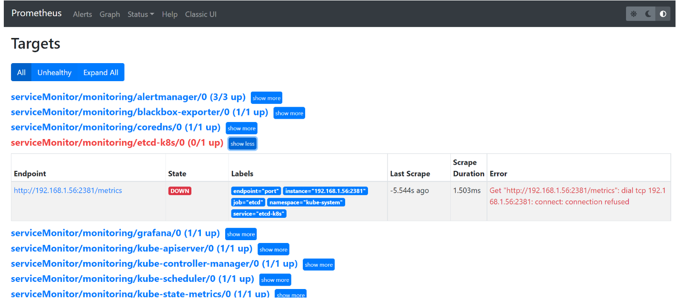{: .zoom}

可以看到有一个明显的错误，2381 端口链接被拒绝，这是因为我们这里的 etcd 的 metrics 接口是监听在 `127.0.0.1` 这个 IP 上面的，所以访问会拒绝：

```
--listen-metrics-urls=http://127.0.0.1:2381
```

我们只需要在 `/etc/kubernetes/manifests/`目录下面（静态Pod默认的目录）的 `etcd.yaml` 文件中将上面的`listen-metrics-urls` 更改成节点IP即可：

```
--listen-metrics-urls=http://0.0.0.0:2381
```

当etcd重启生效后，查看etcd这个监控任务就正常了：
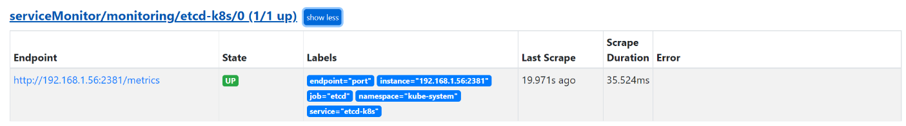{: .zoom}

**3．配置Grafana**

依次单击“+”→Import，之后输入Etcd的Grafana Dashboard地址

数据采集到后，可以在 grafana 中导入编号为 `3070` 的 dashboard，就可以获取到 etcd 的监控图表：

之后就可以看到Etcd集群的状态，如图15.16所示。

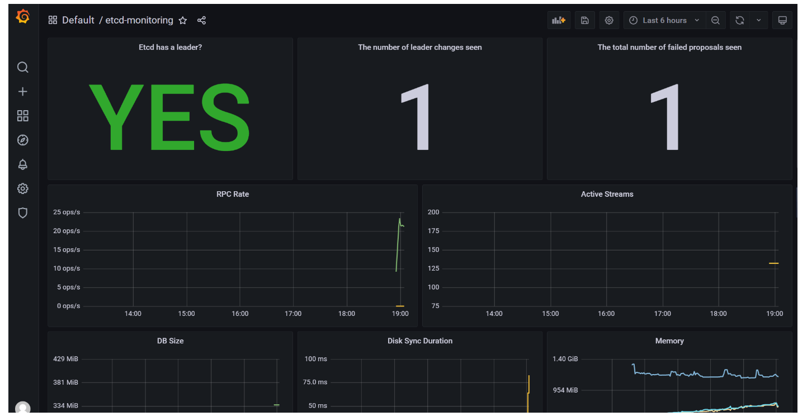{: .zoom}

图15.16　查看Etcd监控

>
> "参考文献"：https://p8s.io/docs/operator/custom/?h=etc#etcd-%E7%9B%91%E6%8E%A7
>


### 3.5 非云原生监控Exporter

上一小节针对云原生应用Etcd进行了监控，可以看到符合云原生要素开发的应用，自带的都有一个Metrics接口，可以让监控平台直接采集到监控数据。

而非原生应用（如MySQL、Redis、Kakfa等）没有暴露Metrics接口，所以可以使用对应的Exporter采集数据，并暴露Metrics接口。本小节将使用MySQL作为一个测试用例，演示如何使用Exporter监控非云原生应用。

1．部署测试用例

首先部署MySQL至Kubernetes集群中，如果读者有需要监控的MySQL，可以忽略此步骤，直接配置MySQL的权限即可：

```shell
$ kubectl create deploy mysql --image=registry.cn-beijing.aliyuncs.com/dotbalo/mysql:5.7.23
deployment.apps/mysql created

$ kubectl set env deploy/mysql MYSQL_ROOT_PASSWORD=mysql
deployment.apps/mysql env updated

# 查看pod是否正常
$ kubectl get po -l app=mysql
NAME                     READY   STATUS    RESTARTS   AGE
mysql-69d6f69557-8hdg6   1/1     Running   0          52s
```

创建Service暴露MySQL：

```shell
$ kubectl expose deploy mysql --port 3306
service/mysql exposed

$ kubectl get svc -l app=mysql
NAME    TYPE        CLUSTER-IP       EXTERNAL-IP   PORT(S)    AGE
mysql   ClusterIP   10.110.161.154   <none>        3306/TCP   24s
```

检查Service是否可用：

```shell
$ telnet 10.110.161.154 3306
Trying 10.110.161.154...
Connected to 10.110.161.154.
Escape character is '^]'.
J
5.7.23/adMH4SqV,w+b'y?E8mysql_native_password
```

登录MySQL，创建Exporter所需的用户和权限（如果已经有需要监控的MySQL，直接执行此步骤即可）：

```sh
$ kubectl exec -ti mysql-69d6f69557-5vnvg -- bash
root@mysql-69d6f69557-5vnvg:/# mysql -uroot -pmysql

mysql> CREATE USER 'exporter'@'%' IDENTIFIED BY 'exporter' WITH MAX_USER_CONNECTIONS 3;
Query OK, 0 rows affected (0.00 sec)

mysql> GRANT PROCESS, REPLICATION CLIENT, SELECT ON *.* TO 'exporter'@'%';
Query OK, 0 rows affected (0.00 sec)
mysql> quit
Bye
root@mysql-69d6f69557-5vnvg:/# exit
exit
```

配置MySQL Exporter采集MySQL监控数据：

mysql-exporter.yaml

```yaml
---
apiVersion: apps/v1
kind: Deployment
metadata:
  name: mysql-exporter
  namespace: monitoring
spec:
  replicas: 1
  selector:
    matchLabels:
      k8s-app: mysql-exporter
  template:
    metadata:
      labels:
        k8s-app: mysql-exporter
    spec:
      containers:
      - name: mysql-exporter
        image: registry.cn-beijing.aliyuncs.com/dotbalo/mysqld-exporter 
        env:
         - name: DATA_SOURCE_NAME
           value: "root:mysql@(mysql.default:3306)/"
        imagePullPolicy: IfNotPresent
        ports:
        - containerPort: 9104
---
apiVersion: v1
kind: Service
metadata:
  name: mysql-exporter
  namespace: monitoring
  labels:
    k8s-app: mysql-exporter
spec:
  type: ClusterIP
  selector:
    k8s-app: mysql-exporter
  ports:
  - name: api
    port: 9104
    protocol: TCP
```

注 意 DATA_SOURCE_NAME 的 配 置 ， 需要将
`exporter:exporter@(mysql.default:3306)/`改成自己的实际配置，格式为：
`USERNAME:PASSWORD@MYSQL_HOST_ADDRESS:MYSQL_PORT`。

创建Exporter：

```shell
$ kubectl create -f mysql-exporter.yaml
deployment.apps/mysql-exporter created
service/mysql-exporter created

$ kubectl get -f mysql-exporter.yaml
NAME                             READY   UP-TO-DATE   AVAILABLE   AGE
deployment.apps/mysql-exporter   1/1     1            1           9s

NAME                     TYPE        CLUSTER-IP       EXTERNAL-IP   PORT(S)    AGE
service/mysql-exporter   ClusterIP   10.105.237.248   <none>        9104/TCP   9s
```

通过该Service地址检查是否能正常获取Metrics数据：

```shell
$ curl -s 10.105.237.248:9104/metrics | tail -1
promhttp_metric_handler_requests_total{code="503"} 0
```

2．配置ServiceMonitor和Grafana

配置Exporter后，Metrics接口已经有了，剩下的配置其实和云原生监控流程已经一样了。

首先配置ServiceMonitor，然后导入Grafana Dashboard即可。配置ServiceMonitor：

mysql-sm.yaml

```yaml
apiVersion: monitoring.coreos.com/v1
kind: ServiceMonitor
metadata:
  name: mysql-exporter
  namespace: monitoring
  labels:
    k8s-app: mysql-exporter
    namespace: monitoring
spec:
  jobLabel: k8s-app
  endpoints:
  - port: api
    interval: 30s
    scheme: http
  selector:
    matchLabels:
      k8s-app: mysql-exporter
  namespaceSelector:
    matchNames:
    - monitoring
```

需要注意matchLabels和endpoints的配置，要和MySQL的Service一致。
之后创建该ServiceMonitor：

```sh
$ kubectl create -f mysql-sm.yaml
servicemonitor.monitoring.coreos.com/mysql-exporter created
```

接下来即可在Prometheus Web UI看到该监控，如图15.17所示。

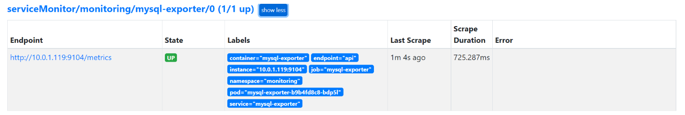{: .zoom}

导入Grafana Dashboard, 地址为https://grafana.com/grafana/dashboards/6239，导入步骤和之前类似，在此不再演示。


导入完成后，即可在Grafana看到监控数据，如图15.18所示。

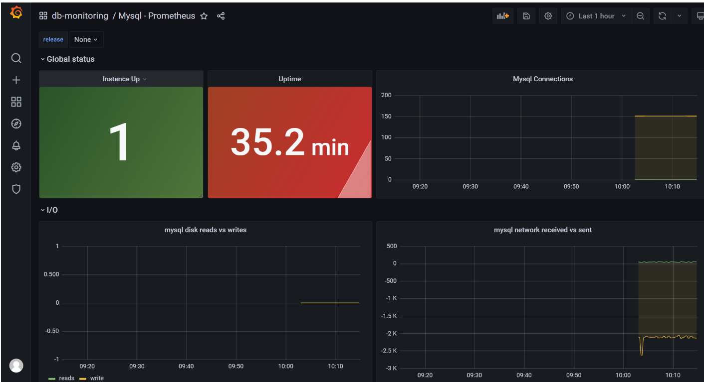{: .zoom}


## 4.黑盒监控

前面的章节对MySQL或者Etcd的监控都是监控应用本身，也就是程序内部的一些指标，这类监控关注的是原因，一般为出现问题的根本，此类监控称为白盒监控。

还有一类监控关注的是现象，也就是正在发生的告警，比如某个网站突然慢了，或者打不开了。此类告警是站在用户的角度看到的东西，比较关注现象，表示正在发生的问题，这类监控称为黑盒监控。

白盒监控可以通过Exporter采集数据，黑盒监控也可以通过Exporter采集数据，新版本的Prometheus Stack已经默认安装了Blackbox Exporter，可以用其采集某个域名、接口或者TCP连接的状态、是否可用等。

新版Prometheus Stack已经默认安装了Blackbox Exporter，可以通过以下命令查看：

```shell
$ kubectl get po -n monitoring -l app.kubernetes.io/name=blackbox-exporter
NAME                                 READY   STATUS    RESTARTS   AGE
blackbox-exporter-6798fb5bb4-nqstp   3/3     Running   0          14h
```

同时也会创建一个Service，可以通过该Service访问Blackbox Exporter并传递一些参数：

```shell
$ kubectl get svc -n monitoring -l app.kubernetes.io/name=blackbox-exporter
NAME                TYPE        CLUSTER-IP       EXTERNAL-IP   PORT(S)              AGE
blackbox-exporter   ClusterIP   10.105.208.175   <none>        9115/TCP,19115/TCP   14h
```

比如检测www.baidu.com（使用任何一个公网域名或者公司内的域名探测即可）网站的状态，可以通过如下命令进行检查：

```shell
$ curl -s "http://10.105.208.175:19115/probe?target=www.baidu.com&module=http_2xx" |tail -3
# HELP probe_success Displays whether or not the probe was a success
# TYPE probe_success gauge
probe_success 1
```

probe是接口地址，target是检测的目标，module是指使用哪个模块进行探测。

> 如果集群中没有配置Blackbox Exporter, 可以参考如下进行安装：https://github.com/prometheus/blackbox_exporter 
>

## 5.Prometheus静态配置

前面几个小节配置监控目标时，用的都是ServiceMonitor，但是ServiceMonitor可能会有一些限制 。 比如 ， 如果没有安装 Prometheus
Operator，可能就无法使用ServiceMonitor，另外并不是所有的监控都能使用ServiceMonitor进行配置，或者使用ServiceMonitor配置显得过于烦琐。

上一节讲解的黑盒监控使用ServiceMonitor就显得过于复杂，使用传统的配置方式，直接将target传递给Blackbox Exporter即可。虽然本书使用的是Operator安装Prometheus，但是它也是支持静态配置的，可以通过以下步骤开启Prometheus的静态配置。

首先创建一个空文件，然后通过该文件创建一个Secret，这个Secret即可作为Prometheus的静态配置：

```sh
$ touch prometheus-additional.yaml
$ kubectl create secret generic additional-configs --from-file=prometheus-additional.yaml -n monitoring
secret/additional-configs created
```

创建完Secret后，需要编辑Prometheus的配置（见图15.19）：

```sh
$ kubectl edit prometheus -n monitoring k8s
```

```yaml
spec:
  additionalScrapeConfigs:
    key: prometheus-additional.yaml
    name: additional-configs
    optional: true
  alerting:
    alertmanagers:
    - apiVersion: v2
      name: alertmanager-main
      namespace: monitoring
      port: web
  enableFeatures: []
  externalLabels: {}
  image: quay.io/prometheus/prometheus:v2.29.1
  nodeSelector:
    kubernetes.io/os: linux
```

添加上述配置后保存退出，无须重启Prometheus的Pod即可生效。

之后在prometheusadditional.yaml文件内编辑一些静态配置，此处用黑盒监控的配置进行演示：

```yaml
- job_name: "blackbox"
  # 这里的指标路径是 /probe
  metrics_path: /probe
  params:
    # 使用 http 模块
    modelus: [http_2xx]
  static_configs:
    # 检测的目标
    - targets:
        - https://www.baidu.com
        - https://youdianzhishi.com
  relabel_configs:
    - source_labels: [__address__]
      target_label: __param_target
    - source_labels: [__param_target]
      target_label: instance
    - target_label: __address__
      replacement: blackbox-exporter:19115
      
- job_name: 'other-node_exporter'
  static_configs:
  - targets: ['172.18.0.85:9100',"172.18.0.84:9100","172.18.0.83:9100","172.18.0.82:9100"]
  
  
- job_name: 'node-exporter-others'
  static_configs:
    - targets:
      - *.*.*.149:31190
      - *.*.*.150:31190
      - *.*.*.122:31190

- job_name: 'mysql-exporter'
  static_configs:
    - targets:
      - *.*.*.104:9592
      - *.*.*.125:9592
      - *.*.*.128:9592

- job_name: 'nacos-exporter'
  metrics_path: '/nacos/actuator/prometheus'
  static_configs:
    - targets:
      - *.*.*.113:8848
      - *.*.*.114:8848
      - *.*.*.118:8848

- job_name: 'elasticsearch-exporter'
  static_configs:
  - targets:
    - *.*.*.110:9597
    - *.*.*.107:9597
    - *.*.*.117:9597

- job_name: 'zookeeper-exporter'
  static_configs:
  - targets:
    - *.*.*.115:9595
    - *.*.*.121:9595
    - *.*.*.120:9595

- job_name: 'nginx-exporter'
  static_configs:
  - targets:
    - *.*.*.149:9593
    - *.*.*.150:9593
    - *.*.*.122:9593

- job_name: 'redis-exporter'
  static_configs:
  - targets:
    - *.*.*.109:9594

- job_name: 'redis-exporter-targets'
  static_configs:
    - targets:
      - redis://*.*.*.146:7090
      - redis://*.*.*.144:7090
      - redis://*.*.*.133:7091
  metrics_path: /scrape
  relabel_configs:
    - source_labels: [__address__]
      target_label: __param_target
    - source_labels: [__param_target]
      target_label: instance
    - target_label: __address__
      replacement: *.*.*.109:9594
```


- targets：探测的目标，根据实际情况进行更改。
- params：使用哪个模块进行探测。
- replacement：Blackbox Exporter的地址。

可以看到此处的内容和传统配置的内容一致，只需要添加对应的job即可。之后通过该文件更新该Secret：

```sh
$ kubectl create secret generic additional-configs --from-file=prometheus-additional.yaml --dry-run=client -o yaml |kubectl replace -f - -n monitoring
secret/additional-configs replaced
```

更新完成后，稍等一分钟即可在Prometheus Web UI看到该配置，如图15.20所示。

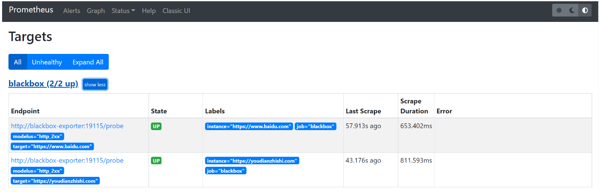{: .zoom}

图15.20　查看黑盒监控Target

监控状态为UP后, 导入黑盒监控的模板（https://grafana.com/grafana/dashboards/13659）即可,如图15.21所示。

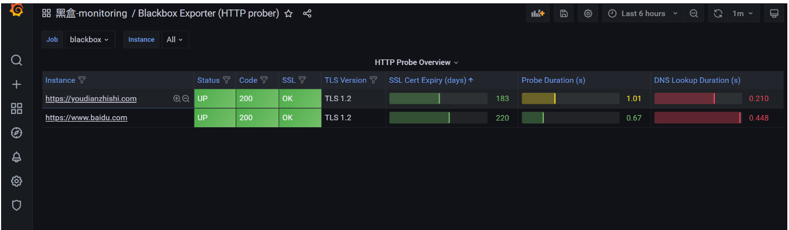{: .zoom}

以上演示了黑盒监控的HTTP模块的使用，其他模块的使用方法类似，可以参考：


> https://github.com/prometheus/blackbox_exporter。

## 6.Prometheus监控Windows(外部)主机

上一节演示了使用Prometheus静态配置监控网站的可用性，接下来再通过一个实例演示静态配置的使用，同时也学习一下Kubernetes集群外部的服务是如何监控的。

使用Prometheus监控Windows主机和Linux主机并无太大区别，都是使用社区的Exporter采集数据，之后暴露一个Metrics接口，可以让Prometheus采集到主机的数据。

其中 

> 监控Linux的Exporter是 https://github.com/prometheus/node_exporter
>
> 监控Windows主机的Exporter是https://github.com/prometheus-community/windows_exporter
>


首先下载对应的Exporter至Windows主机[MSI文件下载地址](https://github.com/prometheus-community/windows_exporter/releases)，如图15.22所示。

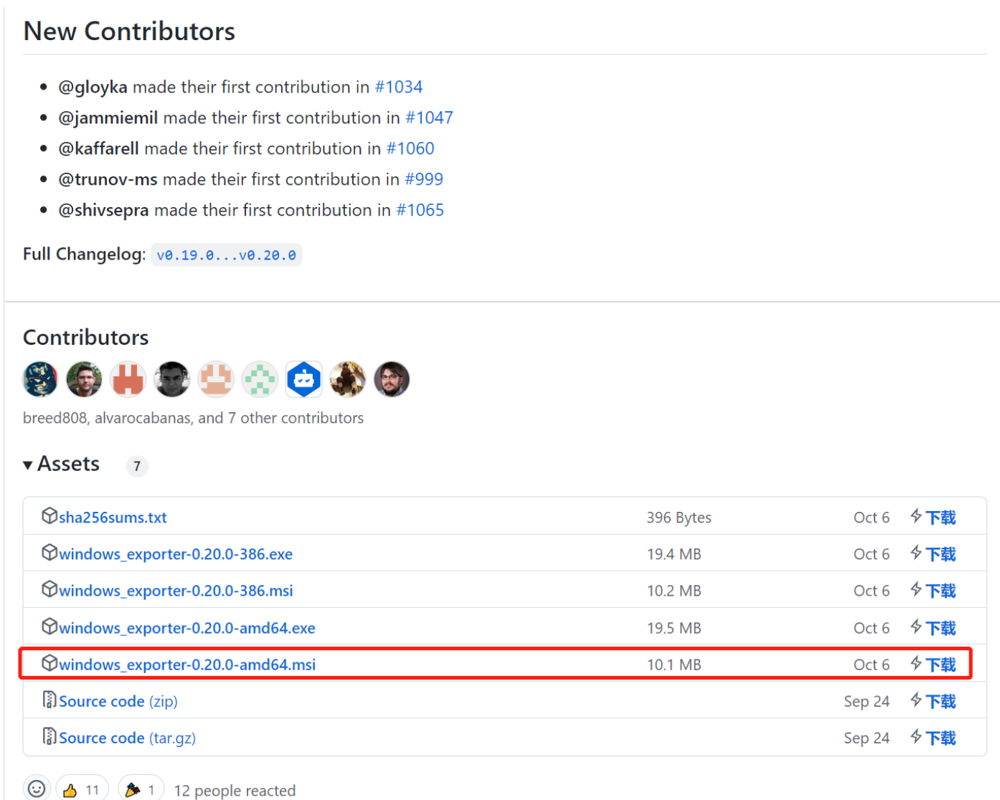


图15.22　下载Windows监控组件


下载完成后，双击打开即可完成安装，之后可以在任务管理器上看到对应的进程，如图15.23所示。

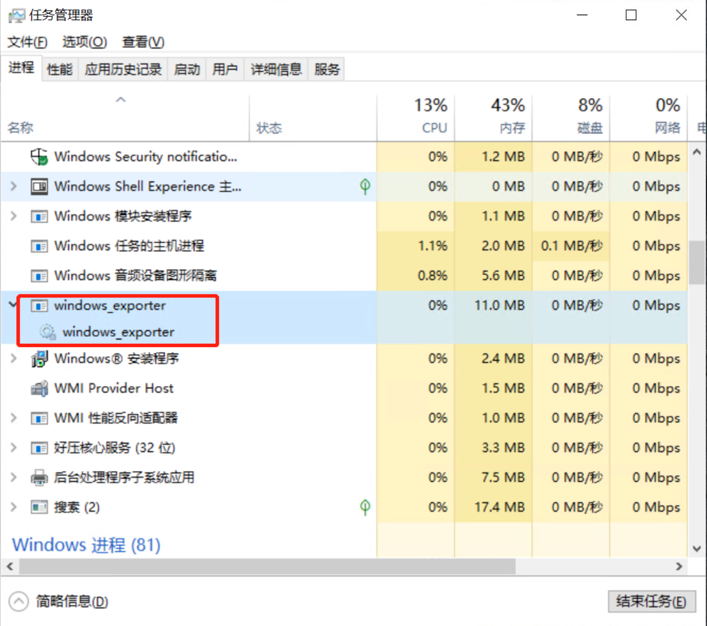

Windows Exporter会暴露一个9182端口，可以通过该端口访问Windows的监控数据。接下来在静态配置文件中添加以下配置：

Targets配置的是监控主机，如果是多台Windows主机，配置多行即可，当然每台主机都需要配置Exporter。之后可以在Prometheus Web UI看到监控数据，如图15.24所示。

```yaml
- job_name: 'WindowsServerMonitor'
  static_configs:
    - targets:
      - "192.168.1.164:9182"
      labels:
        server_type: 'windows'
  relabel_configs:
    - source_labels: [__address__]
      target_label: instance
```

Targets配置的是监控主机，如果是多台Windows主机，配置多行即可，当然每台主机都需要配置Exporter。

之后可以在Prometheus Web UI看到监控数据，如图15.24所示。

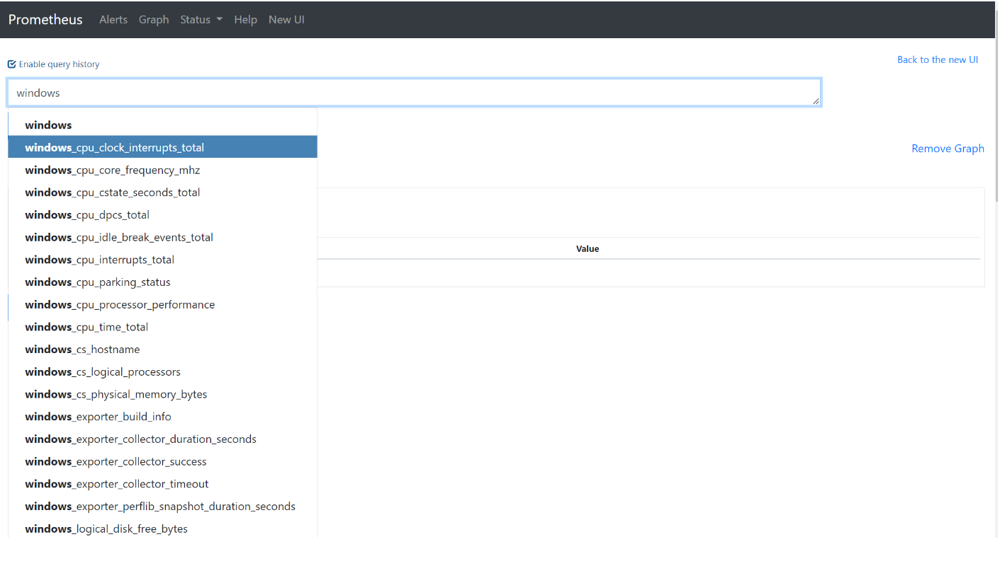

图15.24　查看Windows监控指标

之后导入模板(地 址:https://grafana.com/grafana/dashboards/12566)即可，如图15.25所示。

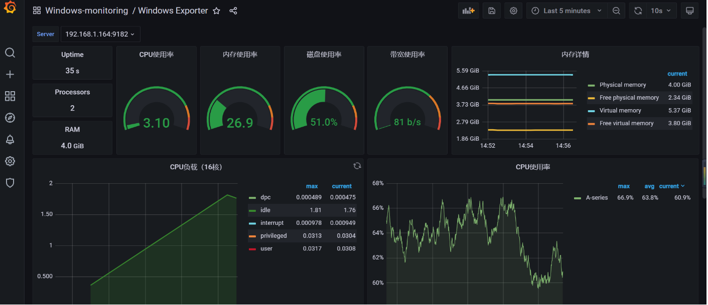{: .zoom}

可以看到Prometheus的静态配置大致流程一致，配置内容也类似，所以一些不方便使用ServiceMonitor进行配置的，可以采用静态配置的方式，当然静态配置也可以采用ServiceMonitor方式。

## 7.Prometheus语法PromQL入门

前面学习了云原生应用、非云原生应用、黑盒监控和集群外部主机监控，同时学习了ServiceMonitor和静态配置的使用，掌握这些以后，生产环境的大部分场景都可以进行监控。

但是监控并不是最终的目的，虽然通过Grafana的Dashboard能看到一些监控大屏，但是需要监控的地方太多，并且技术人员不可能随时随地都盯着Dashboard，所以需要对严重的告警进行通知。

接下来就需要用到Prometheus的另一个组件—Alertmanager，主要用来进行告警的通知，可以采用邮箱、钉钉、微信、Slack、Webhook等进行通知。


### 7.1 PromQL语法初体验

在学习告警之前，必须掌握基础的Prometheus数据查询语法 。Prometheus查询语法叫PromQL，就像MySQL的SQL语句。

首先根据查询语法查出来想要的数据，之后根据条件判断即可进行告警。

PromQL Web UI的Graph选项卡提供了简单的用于查询数据的入口，对于PromQL的编写和校验都可以在此位置，如图15.26所示。

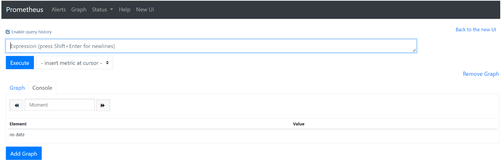{: .zoom}
图15.26　选择Graph

我们可以先输入up，然后单击Execute，就能查到监控正常的Target，如图15.27所示。

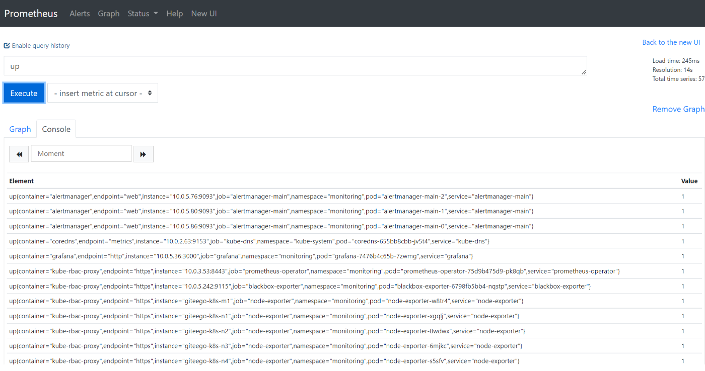{: .zoom}

up命令可以查到所有正常监控的目标，如果监控的目标过多，可能会查询出来很多数据。此时可以根据一些条件进行过滤，就像SQL语句的where语法。比如通过标签选择器过滤出job为node-exporter的监控，语法为：up{job="node-exporter"}，如图15.28所示。

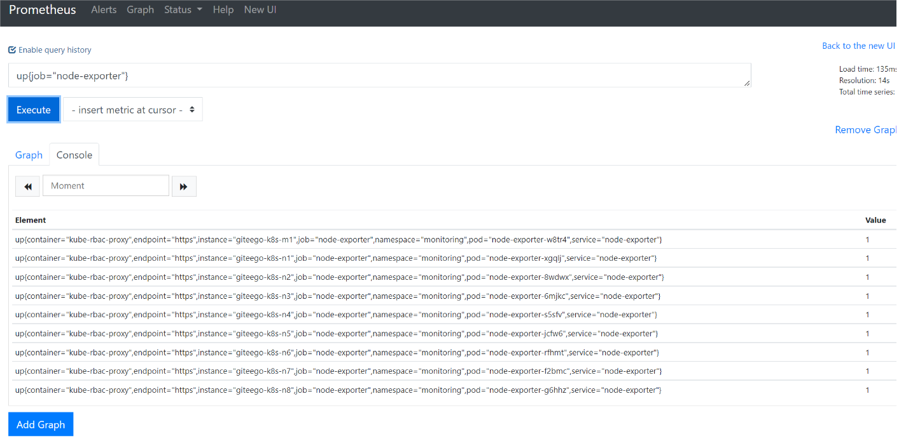{: .zoom}
图15.28　查看主机监控

注意此时up{job="node-exporter"}属于绝对匹配，Prom?L也支持如下表达式：

- !=：表示不等于某个值的指标，比如up{job!="node-exporter"}表示job不为node-exporter的指标。
- =\~：表示符合正则表达式的指标，比如up{job=~"node.*"}表示所有以node开头的指标。
- !~：和=~类似，=~表示正则匹配，!~表示正则不匹配，也就是排除一些指标。

如果想要查看主机监控的指标有哪些，可以输入node，会提示所有主机监控的指标，如图15.29所示。
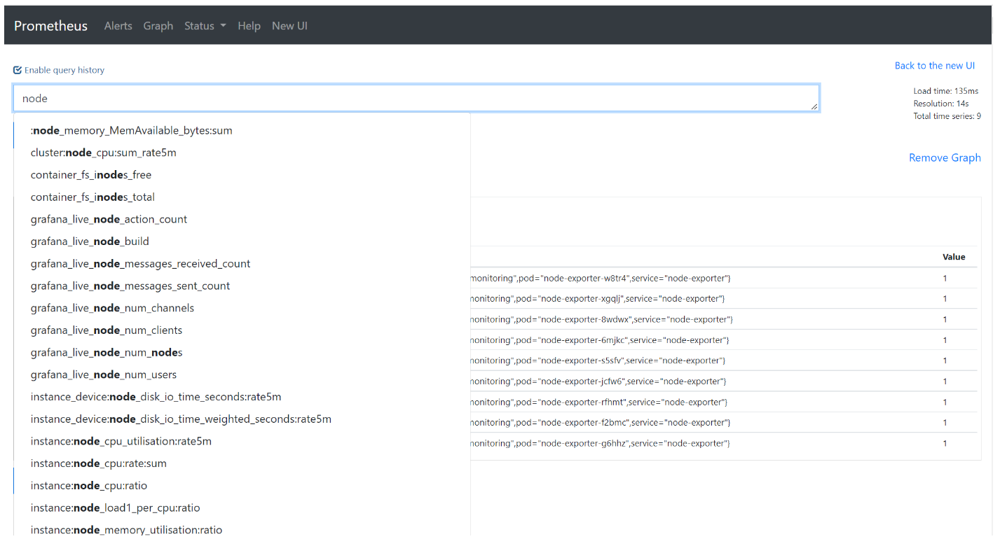{: .zoom}
图15.29　查看主机监控指标


假如想要查询Kubernetes集群中每个宿主机的磁盘总量，可以使用node_filesystem_size_bytes，如图15.30所示。

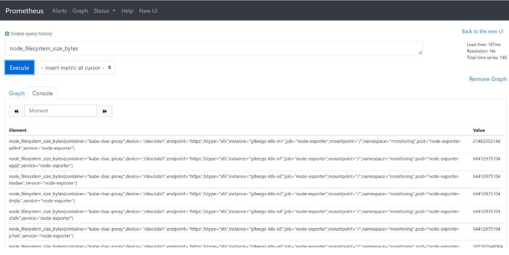{: .zoom}
图15.30　查看磁盘空间

可以看到此时查询结果过多，我们可以进一步进行处理，比如只查询根分区的大小，根据前文提到的标签选择器，加上mountpoint匹配规则node_filesystem_size_bytes{mountpoint="/"}即可，如图15.31所示。

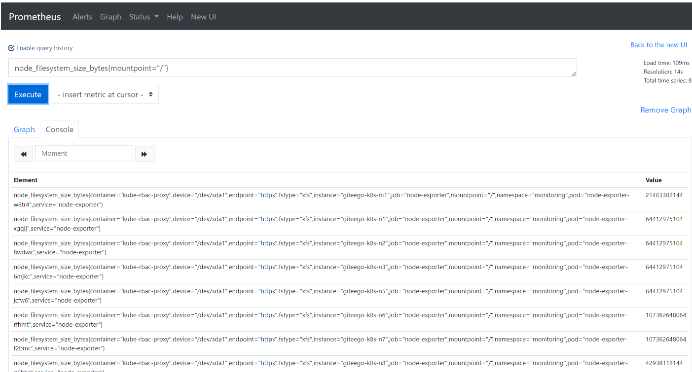{: .zoom}
图15.31　查看根分区空间大小


或者查询分区不是/boot，且磁盘是/dev/开头的分区大小（结果不再展示）：

```
node_filesystem_size_bytes{device=~"/dev/.*",mountpoint!="/boot"}
```

上述的PromQL查询出来的数据都是瞬时值，也就是Prometheus采集到的最新的数据，在时序数据库中被称为瞬时向量。因为Prometheus本身是一个时序数据库，所以也可以查询某个指标一段时间内的数据，比如查询主机k8s-master01在最近5分钟可用的磁盘空间变化（见图15.32）：

```
node_filesystem_avail_bytes{instance="giteego-k8s-m1",mountpoint="/",device="/dev/sda1"}[5m]
```

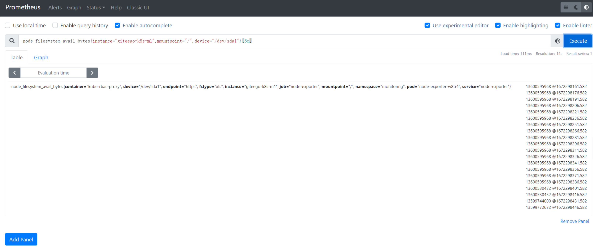{: .zoom}
图15.32　查看最近5分钟的数据


可以看到查询的数据有一个时间戳（查询结果@符号后面），这个时间戳记录了数据样本的记录时间。

并且能看到有多条查询结果为这5分钟内的所有数据，这种查询一段时间范围内的数据结果被称为区间向量。目前支持的范
围单位如下：

- s：秒。
- m：分钟。
- h：小时。
- d：天。
- w：周。
- y：年。

除了能查询区间向量和瞬时向量的数据，Prometheus也支持查询几分钟之前的数据或者几分钟之前的一段时间范围内的数据，比如查询10分钟之前磁盘的可用空间，只需要指定offset参数即可：

```
node_filesystem_avail_bytes{instance="giteego-k8s-m1",mountpoint="/",device="/dev/sda1"} offset 10m
```

或者查询10分钟之前，5分钟区间的磁盘可用空间的变化：

```
node_filesystem_avail_bytes{instance="giteego-k8s-m1",mountpoint="/",device="/dev/sda1"}[5m] offset 10m
```

### 7.2 PromQL操作符

上一小节我们通过PromQL的语法查到了主机磁盘的空间数据，查询结果如图15.33所示。

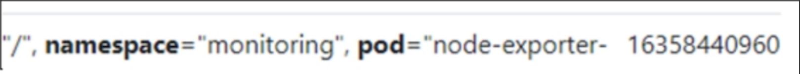{: .zoom}
图15.33　查看主机磁盘空间数据

可以看到此时的数据为16358440960，这个结果并不适合直接阅读，因为它返回的数据单位为字节（bytes，其他指标可能是其他单位）。可以通过以下命令将字节转换为GB或者MB：

```
node_filesystem_avail_bytes{instance="giteego-k8s-m1",mountpoint="/",device="/dev/sda1"} / 1024 / 1024 / 1024
```

也可以将1024/1024/1024改为(1024 ^ 3)：

```
node_filesystem_avail_bytes{instance="giteego-k8s-m1",mountpoint="/",device="/dev/sda1"} / (1024 ^3) 
```

查询结果如图15.34所示，此时为12GB左右。

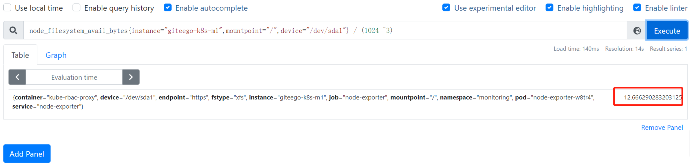{: .zoom}
图15.34　查看空间大小


此时可以在宿主机上比对数据是否正确：

```sh
$ df -Th|grep /dev/sda1
/dev/sda1      xfs        20G  7.4G   13G  37% /
```

上述使用的“/”为数学运算的“除”，“^”为幂运算，同时也支持如下运算符：

- +：加。
- ‒：减。
- *：乘。
- /：除。
- ^：幂运算。
- %：求余。

通过不同的指标结合不同的表达式可以查询到不同的数据，比如要查询k8s-master01根区分磁盘的可用率，可以通过如下指令进行计算：

```
node_filesystem_avail_bytes{instance="giteego-k8s-m1",mountpoint="/",device="/dev/sda1"}  /node_filesystem_size_bytes{instance="giteego-k8s-m1",mountpoint="/",device="/dev/sda1"}
```

node_filesystem_avail_bytes 为 系 统 可 用 的 磁 盘 空 间 ，node_filesystem_size_bytes为磁盘空间的总大小，所以两者的比值即为磁
盘空间的可用率。当然也可以去掉instance参数，查询所有主机根分区的可用率（见图15.35）：

```
node_filesystem_avail_bytes{mountpoint="/"} /node_filesystem_size_bytes{mountpoint="/"}
```

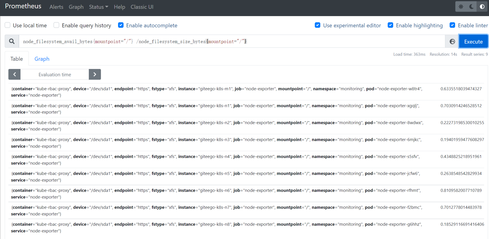{: .zoom}
图15.35　查看磁盘可用率


也可以将结果乘以100直接得到百分比：

```
node_filesystem_avail_bytes{mountpoint="/"} /node_filesystem_size_bytes{mountpoint="/"} * 100
```


通过上述操作符的学习，我们可以查询到主机磁盘的使用信息，读者可以根据上述语句尝试查询其他指标信息，比如CPU、内存的使用率等，如图15.36所示。

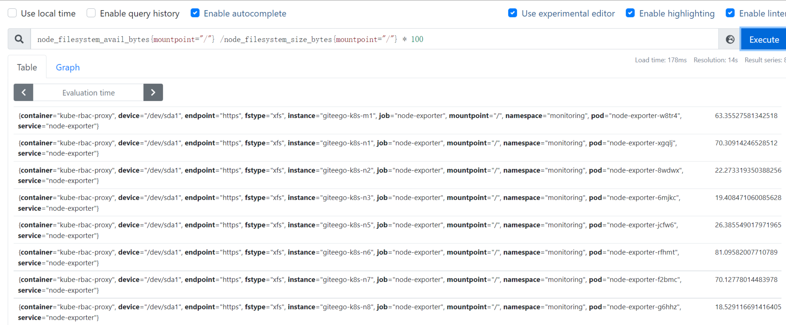{: .zoom}

图15.36　查看磁盘可用百分比

虽然可以通过上述语句查询到一些指标，但是这些指标可能并非我们最终想要的。

比如想要找到集群中根分区空间可用率大于60%的主机，此时可以将查询语句添加一个判断条件，得到自己想要的结果，比如：

```
node_filesystem_avail_bytes{mountpoint="/"} /node_filesystem_size_bytes{mountpoint="/"} * 100 >60
```

结果如图15.37所示。

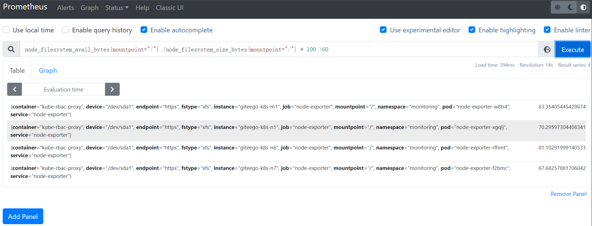{: .zoom}
图15.37　查看磁盘可用率大于60%的主机


此时得到的结果为监控目标主机磁盘可用率大于60%的主机，如果将大于60改为小于20，就是查询所有磁盘可用率小于20%的主机，此时是不是就应该产生告警？所以说将PromQL的语法稍加改造即为我们想要的告警条件。

```
node_filesystem_avail_bytes{mountpoint="/"} /node_filesystem_size_bytes{mountpoint="/"} * 100 <20
```

除了以上判断语法外，PromQL也支持如下判断：

- ==：相等。
- !=：不相等。
- ：大于。
- <：小于。
- =：大于等于。
- <=：小于等于。

上述语法只是做了一个简单的判断，比如只过滤了磁盘可用率大于60%的指标，如果想要过滤其他范围也是支持的，比如磁盘可用率大于30%小于等于60%的主机：

```
30 < node_filesystem_avail_bytes{mountpoint="/"} /node_filesystem_size_bytes{mountpoint="/"} * 100 <=60
```

在语句的前面加上“30<”，后面加上“<=”60。也可以用and进行联合查询：

```
(node_filesystem_avail_bytes{mountpoint="/"} /node_filesystem_size_bytes{mountpoint="/"}) * 100 > 30 and (node_filesystem_avail_bytes{mountpoint="/"} /node_filesystem_size_bytes{mountpoint="/"}) * 100 <= 60
```

除了and外，也支持or和unless：

- and：并且。
- or：或者。
- unless：排除。

由上可知，and是必须两个条件都符合，or只需要符合其中一个即可，读者可以自行练习。

而unless是排除某个指标，比如查询主机磁盘剩余空间，并且排除掉shm和tmpfs的磁盘：

```
node_filesystem_free_bytes unless node_filesystem_free_bytes{device=~"shm|tmpfs"}
```

当然，这个语法也可以直接写为：

```
node_filesystem_free_bytes{device!~"shm|tmpfs"}
```

### 7.3 PromQL常用函数

上一小节使用PromQL查询了一些指标，接下来通过PromQL一些常用的函数对数据进一步处理。比如使用sum函数统计当前监控目标所有主机根分区剩余的空间（见图15.38）：

```
sum(node_filesystem_free_bytes{mountpoint="/"}) / 1024^3
```

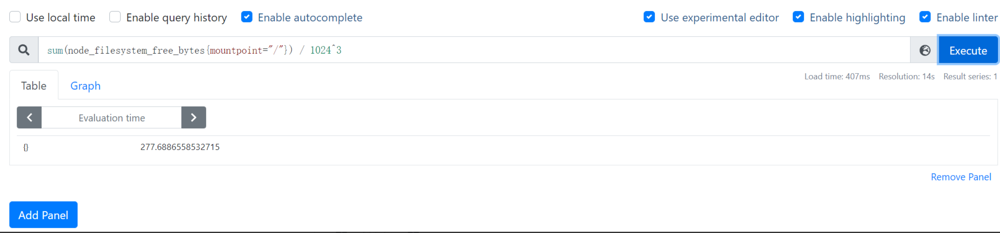{: .zoom}
图15.38　sum统计


也可以用同样方式计算所有的请求总量：

```
sum(http_requests_total)
```

sum(http_request_total)是对所有的请求进行汇总，如果想要统计更加细粒度的指标，可以加上对应的匹配条件，比如想要统计所有状态码为200的请求。

接下来通过http_request_total学习细粒度的统计，首先看一下http_request_total的数据类型是怎样的 。 

可以直接查询http_request_total的数据（见图15.39）：

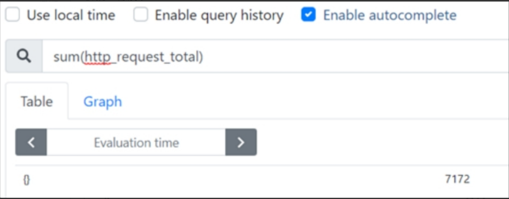
图15.39　sum统计请求数


上面只展示了一条数据，可以看到有handler、statuscode和method，也就是该条数据可以代表访问根路径状态为200且请求方式为get的统计，数量为10。

由该条数据结合sum函数，可以根据statuscode字段统计请求数据（见图15.40）：

```
sum(http_request_total) by (statuscode)
```

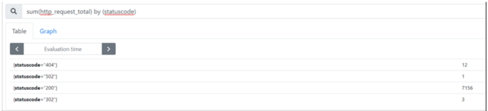{: .zoom}
图15.40　根据字段进行统计


可以看到状态码为404的请求次数是12，状态码为200的请求次数是7156。同时也可以根据statuscode和handler两个指标进一步统计（见图15.41）：

```
sum(http_request_total) by (statuscode, handler)
```

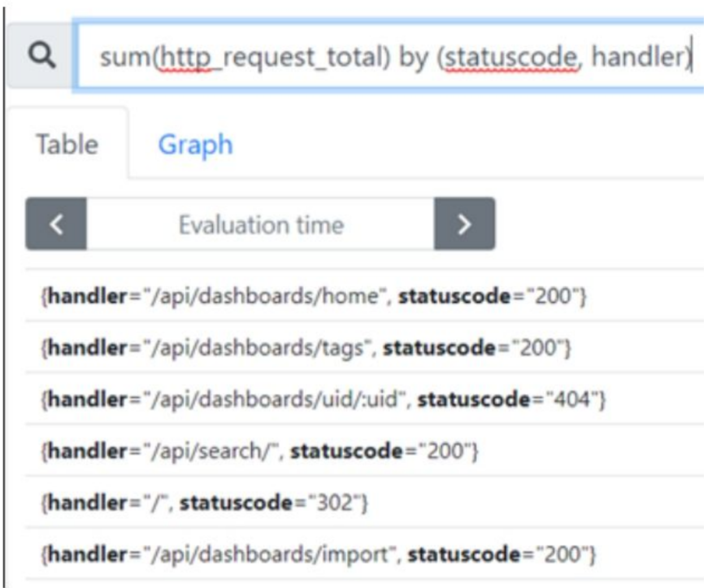
图15.41　根据多个字段统计


上述语句可以统计出访问某个路径且状态码为某个值的统计结果。

此时我们可以继续使用topk函数，找到统计结果中次数最多的几个结果。比如找到排名前5的数据（为节省篇幅，结果不再展示）：

```
topk(5, sum(http_request_total) by (statuscode, handler))
```

PromQL开箱即用的函数有很多，比如取最后3个数据：

```
grafana(3, sum(http_request_total) by (statuscode, handler))
```

找出统计结果中最小的数据：

```
min(node_filesystem_avail_bytes{mountpoint="/"})
```

最大的数据：

```
max(node_filesystem_avail_bytes{mountpoint="/"})
```

平均值：

```
avg(node_filesystem_avail_bytes{mountpoint="/"})
```

四舍五入，向上取最接近的整数，比如2.79→3：

```
ceil(node_filesystem_files_free{mountpoint="/"} / 1024 / 1024)
```

向下取整数，比如2.79→2：

```
floor(node_filesystem_files_free{mountpoint="/"} / 1024 / 1024)
```

对结果进行正向排序：

```
sort(sum(http_request_total) by (handler, statuscode))
```

对结果进行逆向排序：

```
sort_desc(sum(http_request_total) by (handler, statuscode))
```

predict_linear函数可以用于预测分析和预测性告警，比如可以根据一天的数据预测4个小时后磁盘分区的空间会不会小于0：

```
predict_linear(node_filesystem_files_free{mountpoint="/"}[1d],4*3600) < 0
```

除了上述函数，还有几个比较重要的函数，比如increase、rate、irate。

其中increase用于计算在一段时间范围内数据的增长，rate和irate用于计算增长率。比如查询某个请求在1小时内增长了多少：

```
increase(http_request_total{handler="/api/datasources/proxy/:id/*",method="get",namespace="monitoring",service="grafana",statuscode="200"}[1h])
```

将1小时增长的数量除以该时间即为增长率：

```
increase(http_request_total{handler="/api/datasources/proxy/:id/*",method="get",namespace="monitoring",service="grafana",statuscode="200"}[1h]) / 3600
```

当然，increase也可以用于磁盘、CPU、内存等指标，读者可以发挥一下自己的想象。

相对于increase，rate可以直接计算出某个指标在给定时间范围内的增长率，比如还是计算1小时的增长率，可以用rate函数进行计算：

```
rate(http_request_total{handler="/api/datasources/proxy/:id/*",method="get",namespace="monitoring",service="grafana",statuscode="200"}[1h])
```

在使用rate和increase时，难免会遇到一个问题，就是常说的“长尾效应”，也就是某个指标一直处于一个数值，这个增长率即为0，此时会出现误判。

比如某个主机的磁盘空间已经在昨天达到了100%，此时查询1小时的增长率，由于没有变化，因此无法计算在这个时间窗口的平均增长率，就意味着无法反映此问题。


PromQL针对“长尾效应”提供了一个更加灵敏的函数：

irate，同样用于计算区间向量的增长速率，但是irate计算的是瞬时增长率，即irate是通过
区间向量中最后两个样本数据来计算区间向量的增长率的，这种方式可以适当避免一些指标的“长尾效应”。

虽然irate较rate提供了更高的灵敏度，但是如果需要分析长期趋势，或者在配置告警规则时，irate过高的灵敏度会造成干扰，针对长期趋势分析和告警规则，更推荐使用rate函数。

实际应用环境中如果需要了解更多关于PromQL函数的内容，读者可以从官网https://prometheus.io/docs/prometheus/2.4/querying/functions/中继续学习。

## 8.Alertmanager告警入门

前面介绍了一些比较常用的Prometheus查询语法，同时也学习了告警语法的编写方法。

本节我们学习Prometheus的告警组件Alertmanager，看一下如何使用一些常用的媒介发送告警通知，同时也会学习Alertmanager的路由
规则，将告警进行分组。

### 8.1 Alertmanager配置文件解析

首先看一个简单的Alertmanager配置示例：

```yaml
## Alertmanager 配置文件
global:
  resolve_timeout: 5m
  # smtp配置
  smtp_from: "prom-alert@example.com"
  smtp_smarthost: 'email-smtp.us-west-2.amazonaws.com:465'
  smtp_auth_username: "user"
  smtp_auth_password: "pass"
  smtp_require_tls: true
  
# email、企业微信的模板配置存放位置，钉钉的模板会单独讲如果配置。
templates:
  - '/data/alertmanager/templates/*.tmpl'
# 路由分组
route:
  receiver: Default
  group_by:
  - namespace
  - job
  - alertname
  routes:
  - receiver: Watchdog
    match:
      alertname: Watchdog
  - receiver: Critical
    match:
      severity: critical
  group_wait: 30s
  group_interval: 5m
  repeat_interval: 10m
  
# 抑制器配置
inhibit_rules:
  - source_match: # 源标签警报触发时抑制含有目标标签的警报，在当前警报匹配 status: 'High'
      severity: critical
    target_match_re:
      severity: warning|info
    equal:
    - namespace
    - alertname
  - source_match:
  	  severity: warning
    target_match_re:
      severity: info
    equal:
    - namespace
    - alertname
      
# 接收器指定发送人以及发送渠道
receivers:
# ops分组的定义
- name: ops
  email_configs:
  - to: '9935226@qq.com,10000@qq.com'
    send_resolved: true
    headers: 
      subject: "[operations] 报警邮件"
      from: "警报中心"
      to: "小煜狼皇" 
  # 钉钉配置
  webhook_configs:
  - url: http://localhost:8070/dingtalk/ops/send
    # 企业微信配置
  wechat_configs:
  - corp_id: 'ww5421dksajhdasjkhj'
    api_url: 'https://qyapi.weixin.qq.com/cgi-bin/'
    send_resolved: true
    to_party: '2'
    agent_id: '1000002'
    api_secret: 'Tm1kkEE3RGqVhv5hO-khdakjsdkjsahjkdksahjkdsahkj'

# web
- name: web
  email_configs:
  - to: '9935226@qq.com'
    send_resolved: true
    headers: { Subject: "[web] 报警邮件"} # 接收邮件的标题
  webhook_configs:
  - url: http://localhost:8070/dingtalk/web/send
  - url: http://localhost:8070/dingtalk/ops/send
# db
- name: db
  email_configs:
  - to: '9935226@qq.com'
    send_resolved: true
    headers: { Subject: "[db] 报警邮件"} # 接收邮件的标题
  webhook_configs:
  - url: http://localhost:8070/dingtalk/db/send
  - url: http://localhost:8070/dingtalk/ops/send
# hadoop
- name: hadoop
  email_configs:
  - to: '9935226@qq.com'
    send_resolved: true
    headers: { Subject: "[hadoop] 报警邮件"} # 接收邮件的标题
  webhook_configs:
  - url: http://localhost:8070/dingtalk/hadoop/send
  - url: http://localhost:8070/dingtalk/ops/send
```

从配置文件可以看出，Alertmanager的配置主要分为5大块：

- Global：全局配置，主要进行一些通用的配置，比如邮件通知的账号、密码、SMTP服务器、微信告警等。Global块配置下的配置选项在本配置文件内的所有配置项下可见，但是文件内其他位置的子配置可以覆盖Global配置。

- Templates：用于放置自定义模板的位置。
- Route：告警路由配置，用于告警信息的分组路由，可以将不同分组的告警发送给不同的收件人。比如将数据库告警发送给DBA，服务器告警发送给OPS。
- Inhibit_rules：告警抑制，主要用于减少告警的次数，防止“告警轰炸”。比如某个宿主机宕机，可能会引起容器重建、漂移、服务
  不可用等一系列问题，如果每个异常均有告警，会一次性发送很多告警，造成告警轰炸，并且也会干扰定位问题的思路，所以可以使
  用告警抑制，屏蔽由宿主机宕机引来的其他问题，只发送宿主机宕机的消息即可。
- Receivers：告警收件人配置，每个receiver都有一个名字，经过route分组并且路由后需要指定一个receiver，就是在此位置配置
  的。

了解完Alertmanager主要的配置块后，接下来对Alertmanager比较重要的Route单独讲解，其他配置会在实践中进行补充。

### 8.2 Alertmanager路由规则

前文提到过Route是告警的路由配置，它可以让告警根据分组发送给对应的人或者小组，这一块的配置是Alertmanager比较复杂且经常变更的配置，所以本小节将讲解一下Alertmanager的路由配置。

从上述配置文件中，截取Route配置：

```yaml
# 路由分组
route:
  receiver: Default
  group_by:
  - namespace
  - job
  - alertname
  routes:
  - receiver: Watchdog
    match:
      alertname: Watchdog
  - receiver: Critical
    match:
      severity: critical
  group_wait: 30s
  group_interval: 5m
  repeat_interval: 10m
```

从配置文件可以看出，路由配置块的顶级配置由route开始，它是整个路由的入口，称作根路由。

每一条告警进来后，都先进入route，之后根据告警自身的标签和route.group_by配置的字段进行分组。比如可以根据job、
cluster或者其他自定义的标签名称进行分组，分组后进入子路由（通过route.routes配置子路由），进一步进行更加细粒度的划分，比如job名称包含mysql的发送给DBA组。

除了group_by和routes外，Route还有以下常用的配置：

- receiver：告警的通知目标，需要和receivers配置中的name进行匹配。需要注意的是，route.routes下也可以有receiver配置，优先级高于route.receiver配置的默认接收人，当告警没有匹配到子路由时,会使用route.receiver进行通知,比如上述配置中的Default。

- group_by ： 分组配置,值类型为列表。比如配置成['job','severity']，代表告警信息包含job和severity标签的会进行分组，且标签的key和value都相同才会被分到一组。

- continue：决定匹配到第一个路由后，是否继续后续匹配。默认为false，即匹配到第一个子节点后停止继续匹配。

- match：一对一匹配规则，比如match配置的为job: mysql，那么具有job=mysql的告警会进入该路由。

- match_re：和match类似，只不过match_re是正则匹配。

- matchers：这是Alertmanager 0.22版本新添加的一个配置项，用于替换match和match_re，如果读者用0.22以上版本的Alertmanager，可以尝试使用该参数。Matchers设计理念参考了PromQL和OpenMetrics，可以直接写成如下格式：

  - 匹配foo等于bar且dings不等于bums

    ```
    matchers:
      - foo = bar
      - dings != bums
    ```

  - 匹配foo等于bar和baz，且dings不等于bums：

    ```
    matchers：[ "foo = bar,baz", "dings != bums" ]
    ```

  - 匹配foo等于bar且dings不等于bums的另一种写法，和PromQL类似：

    ```
    matchers：[ '{foo="bar", dings!="bums"}' ]
    ```


- group_wait：告警通知等待，值类型为字符串。若一组新的告警产生，则会等group_wait后再发送通知，该功能主要用于当告警在很短时间内接连产生时，在group_wait内合并为单一的告警后再发送，防止告警过多，默认值为30s。

- group_interval：同一组告警通知后，如果有新的告警添加到该组中，再次发送告警通知的时间，默认值为5ms。
- repeat_interval：如果一条告警通知已成功发送，且在间隔repeat_interval后，该告警仍然未被设置为resolved，则会再次发
  送该告警通知，默认值为4h。

以上即为Alertmanager常用的路由配置，可以看到Alertmanager的路由和匹配规则非常灵活，通过不同的路由嵌套和匹配规则可以达到不同的通知效果。

对于Alertmanager的其他配置，会在实践中进行补充。接下来学习如何将告警通过不同的媒介进行通知。

### 8.3 Alertmanager邮件通知

告警邮件通知是企业内最常用的一种通知方式，Alertmanager原生支持邮件告警方式，其配置方式相对简单。首先进入在安装小节（本书15.2节）clone的代码目录，找到Alertmanager的配置文件（其他安装方式的位置可能不同，需要自行找到配置文件的位置，配置文件的内容是一致的）：

```sh
[root@centos7-base kube-prometheus]# cd manifests/
[root@centos7-base manifests]# ls alertmanager-secret.yaml
alertmanager-secret.yaml
```

使用Operator形式安装的Prometheus和Alertmanager，配置都会存储在Kubernetes的ConfigMap和Secret中。

Alertmanager的配置文件是通过Secret进行存储的，其原始文件为alertmanagersecret.yaml，内容大致如下：

```yaml
cat alertmanager-secret.yaml
apiVersion: v1
kind: Secret
metadata:
  labels:
    alertmanager: main
    app.kubernetes.io/component: alert-router
    app.kubernetes.io/name: alertmanager
    app.kubernetes.io/part-of: kube-prometheus
    app.kubernetes.io/version: 0.22.2
  name: alertmanager-main
  namespace: monitoring
stringData:
  alertmanager.yaml: |-
    "global":
      "resolve_timeout": "5m"
......
```

前文提到过，一般通用配置会放置在global配置中，进行邮件通知的SMTP配置也是放在global下。

接下来通过163邮箱配置邮件通知，首先在163邮箱平台将SMTP功能打开（本书不做演示），之后在alertmanager-
secret.yaml文件的global下添加如下配置：

```yaml
  alertmanager.yaml: |-
    "global":
      resolve_timeout: "5m"
      # smtp配置
      smtp_from: "1879324764@qq.com"
      smtp_smarthost: 'smtp.qq.com:25'
      smtp_hello: "smtp.qq.com"
      smtp_auth_username: "1879324764@qq.com"
      smtp_auth_password: "ucpkvebqnkysecgh"
      smtp_require_tls: false
```

之后将名称为Default的receiver配置更改为邮件通知,修改alertmanager-secret.yaml文件的receivers配置如下：

```yaml
	"receivers":
	- "name": "Default"
	  "email_configs":
	  - to: "notification@163.com"
	  	send_resolved: true
	- "name": "Watchdog"
	- "name": "Critical"
```

- email_configs：代表使用邮件通知。
- to：收件人，此处为notification@163.com，可以配置多个，用逗号隔开。
- send_resolved：如果告警被解决，是否发送解决通知

至此，即完成了告警的邮件通知。接下来分析一下路由规则（默认分组只有namespace，在此添加job和alertname，当然不添加也可以）：

```yaml
# 路由分组
route:
  group_wait: 30s
  group_interval: 5m
  repeat_interval: 10m
  receiver: Default
  "group_by":
  - "namespace"
  - "job"
  - "alertname"
  routes:
  - receiver: Watchdog
    match:
      alertname: Watchdog
  - receiver: Critical
    match:
      severity: critical
```

该告警规则对namespace标签进行分组（group_by字段），没有匹配到子路由的告警默认发送给名为Default的receiver（receiver字段）。

如果匹配到alertname=Watchdog的告警，则将通知发送给Watchdog，如果匹配到severity=critical的告警，则将通知发送给Critical。


我们可以通过Alertmanager提供的Web UI查看分组信息，和Prometheus一致，将Alertmanager的Service更改为NodePort（见图15.42）：

```sh
# kubectl edit svc -n monitoring alertmanager-main
```

```yaml
  ports:
  - name: web
    nodePort: 32234
    port: 9093
    protocol: TCP
    targetPort: web
  selector:
    alertmanager: main
    app: alertmanager
    app.kubernetes.io/component: alert-router
    app.kubernetes.io/name: alertmanager
    app.kubernetes.io/part-of: kube-prometheus
  sessionAffinity: ClientIP
  sessionAffinityConfig:
    clientIP:
      timeoutSeconds: 10800
  type: NodePort
```

查看监听的端口号：

```sh
$ kubectl get svc -n monitoring alertmanager-main
NAME                TYPE       CLUSTER-IP    EXTERNAL-IP   PORT(S)          AGE
alertmanager-main   NodePort   10.99.53.46   <none>        9093:32234/TCP   21h

```

将更改好的Alertmanager配置加载到Alertmanager：

```sh
$ kubectl replace -f alertmanager-secret.yaml
secret/alertmanager-main replaced
```

稍等几分钟，即可在Alertmanager的Web界面看到更改的配置(Status），如图15.43所示。

{: .zoom}
图15.43　查看Alertmanager配置

也可以查看分组信息，如图15.44所示。
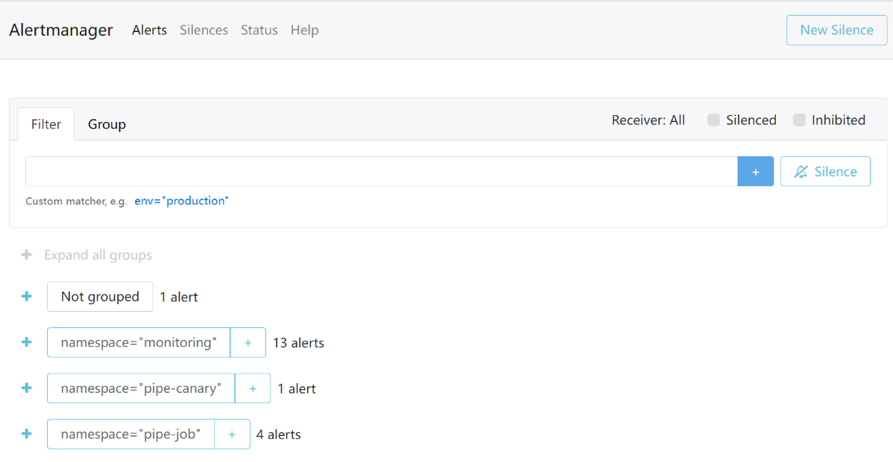{: .zoom}
图15.44　查看告警分组

在安装Prometheus后，如果没有做任何更改，可能会在Prometheus页面看到如下告警：

- KubeSchedulerDown和KubeControllerManagerDown可以参考15.3.3节的ServiceMonitor进行解决。
- Watchdog：并非是一个异常的告警，而是Prometheus集群的状态监控，它表示Prometheus集群的状态是正常的，可以将此告警关闭。
- CPU?hrottlingHigh：该告警反映的是最近5分钟超过25%的CPU执行周期受到限制的容器，一般是limit设置得低或者未设置引起的。可以将此告警关闭，或者合理配置容器的resources参数。
- NodeClockNotSynchronising：该告警是由于主机和时间服务器无法连接导致的，读者可能并没有此告警，该告警可以直接关闭，也可以通过配置NTP服务器来解决。

接下来单击任意一个告警，可以查看到该条告警信息的告警语法，如图15.45和图15.46所示。

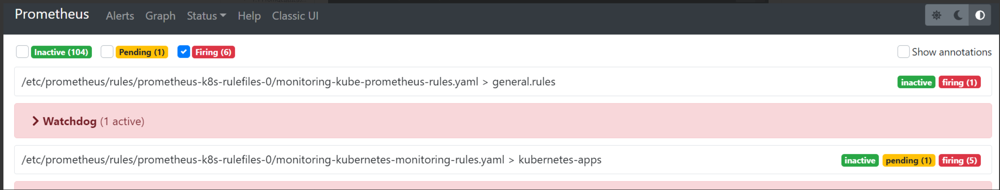{: .zoom}
图15.45　查看告警


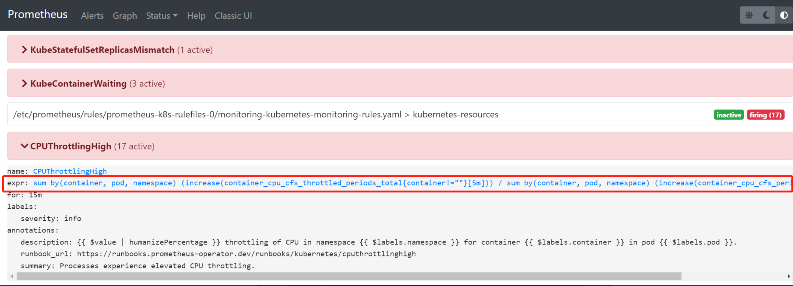{: .zoom}
图15.46　查看告警语法


之后单击expr的语法，可以进入查询页面，如图15.47所示。
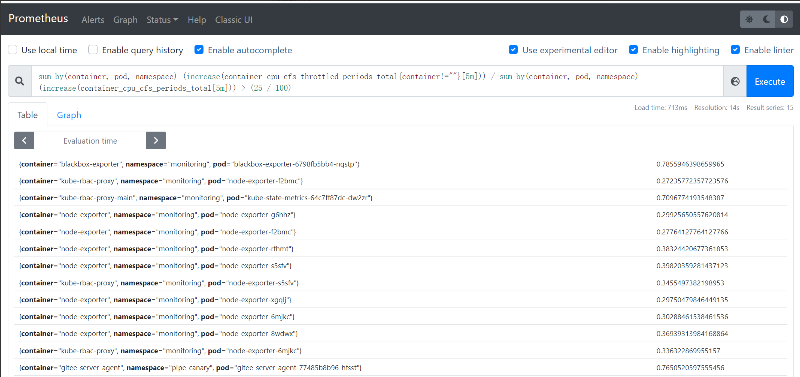{: .zoom}
图15.47　查看expr语法


此时可以看到每个metric的标签，如果查看每个已经告警的详细语法，可以看到Watchdog具有alertname="Watchdog"标签，两个Kube的告警（如有）具有severity="critical"标签，这两条告警均被子路由匹配，分别将告警发送给了Watchdog和Critical，由于两者并没有配置实际的媒介，因此暂时无法收到该告警。

而CPUThrottlingHigh和NodeClockNotSynchronising没有匹配到任何子路由，所以将告警信息发送到了默认的receiver，也就是Default，此时Default receiver配置的邮箱会收到两者的告警信息，如图15.48和图15.49所示。

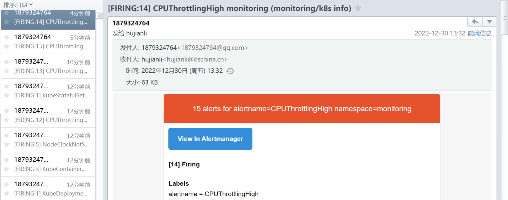{: .zoom}
图15.48　查看邮件告警


通过以上步骤即可实现告警的邮件通知，在实际使用时，可以根据不同的分组将告警发送给不同的收件人。

### 8.4 Alertmanager企业微信通知

上一小节已经实现了使用邮件进行告警的通知，本小节演示使用企业微信进行告警。

首先在企业微信官网（https://work.weixin.qq.com/）注册一个企业(任何人都可以注册，注册过程不再演示），如果读者所在的公司已经有相关企业微信，可以无须注册，只需要有创建通讯录和创建应用的权限即可。

**1．企业微信配置**

注册完成后进行登录，登录后单击“我的企业”，如图15.50所示。

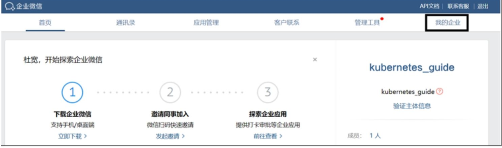
图15.50　查看我的企业

在页面的最下面找到企业ID（对应Alertmanager的corp_id字段）并记录，稍后会用到，如图15.51所示。


图15.51　查看企业ID

之后创建一个部门，用于接收告警通知，如图15.52所示。
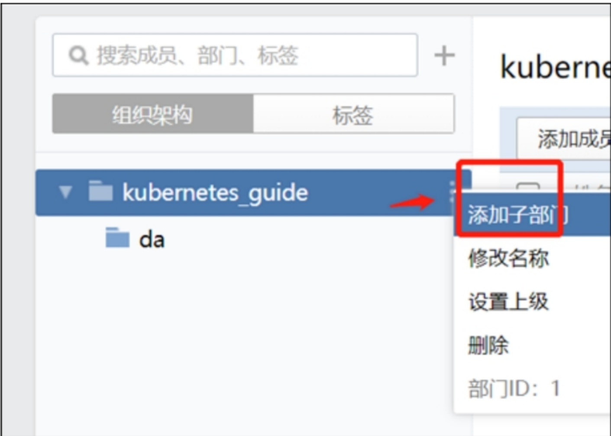
图15.52　添加子部门

输入Prom告警，之后单击“确定”按钮，如图15.53所示。
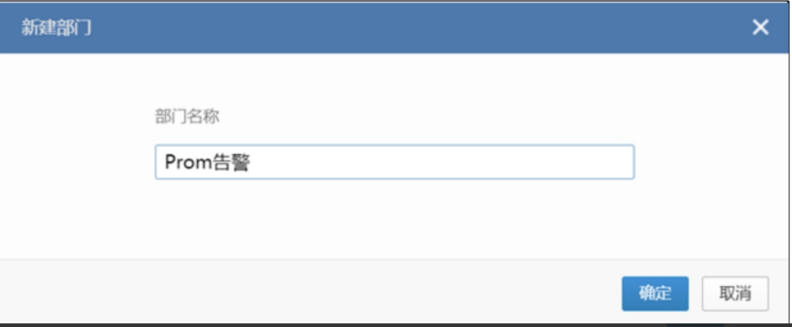
图15.53　配置部门名称

之后在Prom告警子部门添加相关的成员即可，如图15.54所示，在此不再演示。
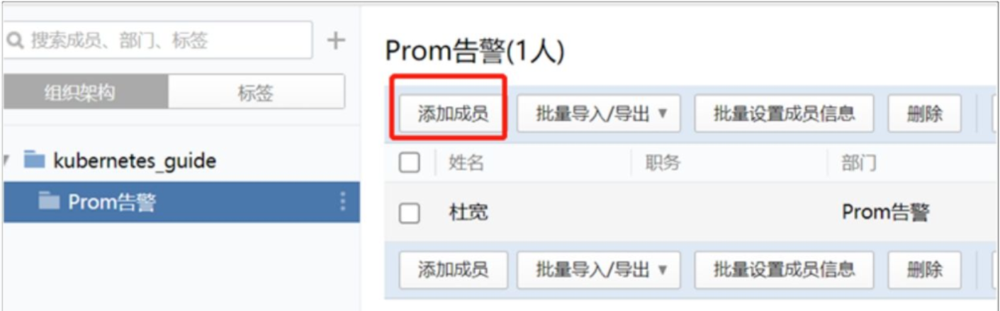
图15.54　添加成员

查看该部门ID（对应Alertmanager的to_party字段）并记录，如图15.55所示。
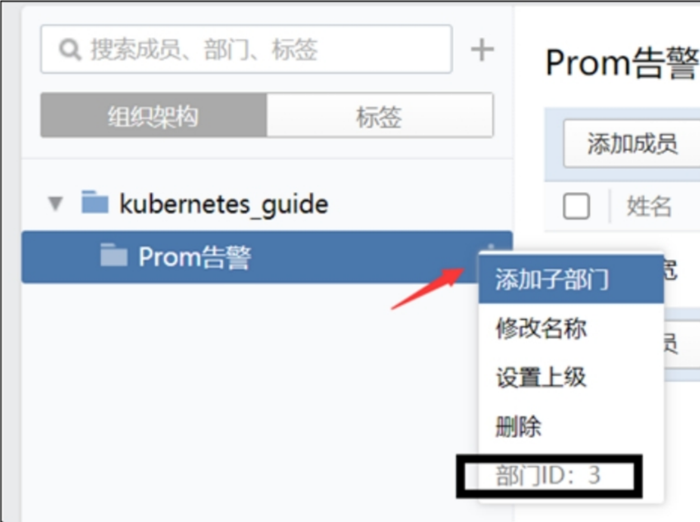
图15.55　查看部门ID

之后创建机器人应用，首先单击应用管理→创建应用，如图15.56所示。

图15.56　添加告警应用


选择一个logo，输入应用名称并选择可见范围，如图15.57和图15.58所示。

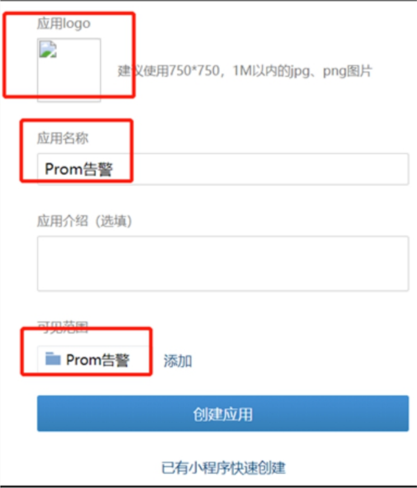
图15.57　配置应用可见权限

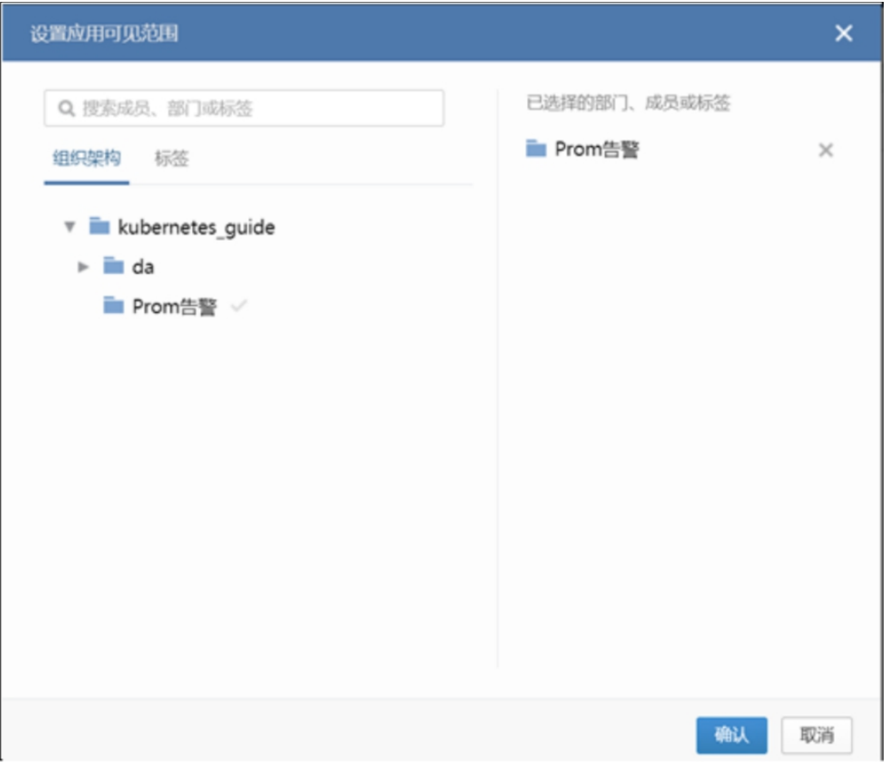
图15.58　配置应用可见范围


创建完成后，查看AgentId和Secret（对应Alertmanager的api_secret字段）并记录，如图15.59所示。

单击Secret后的“查看”，此时会将Secret发送至企业微信，单击“前往查看”并记录即可，如图15.60所示。
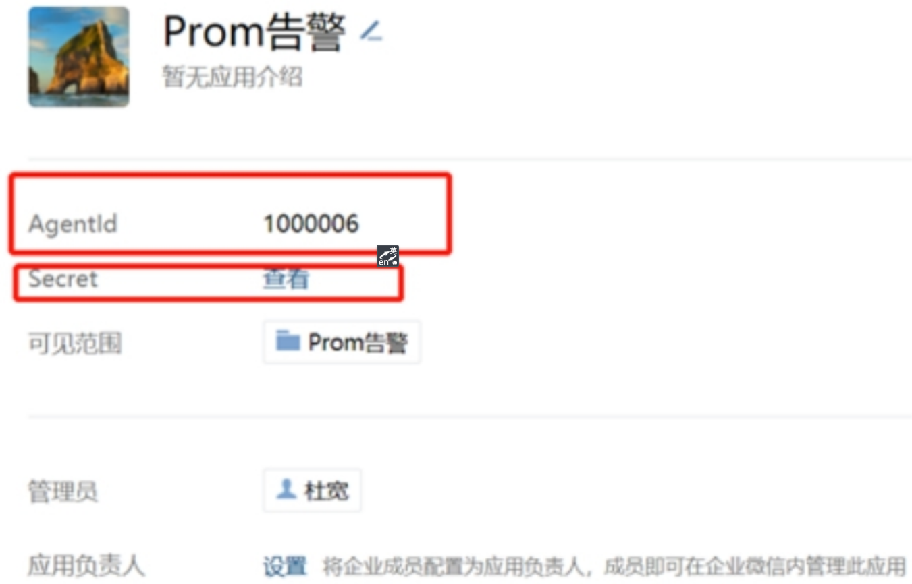
图15.59　查看AgentId和Secret


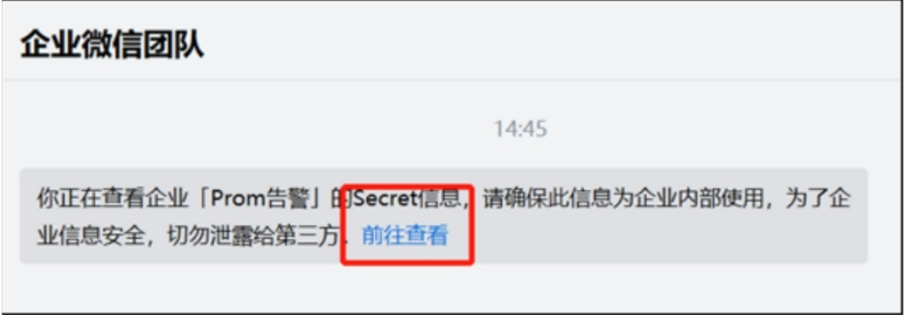
图15.60　查看Secret详情


**2．Alertmanager配置**

修改Alertmanager配置文件，添加企业微信告警。首先修改global，添加一些通用配置，wechat_api_url是固定配置，corp_id为企业ID：

```yaml
    "global":
      resolve_timeout: "5m"
	  wechat_api_url: "https://qyapi.weixin.qq.com/cgi-bin/"
	  wechat api corp id: "wwef86a30xxxxxxxxxxxx"
```

receivers添加微信通知：

```yaml
	"receivers":
	- "name": wechat-ops
	  wechat_configs:
	  - send_resolved: true
	    to_party: 3
	    to_user: "@all"
	    agent_id: 1000006
	    api_secret: "3bB350Sxxxxxxxxxxxxxxxxxxxxxxxxxxxxxx"
	- "name": "Default"
	  "email_configs":
	  - to: "notification@163.com"
	  	send_resolved: true
	- "name": "Watchdog"
	- "name": "Critical"
```

此处配置的receiver名字为wechat-ops，可根据实际情况划分不同的部门。此时配置的to_user为@all，代表发送给所有人，也可以只发送给部门的某一个人，只需要将此处改为USER_ID即可， 
如图15.61所示。


图15.61　用户ID

更改路由配置，将Watchdog的告警发送给该部门（也可以根据自己的实际情况将其他告警发送给该部门）：

```yaml
route:
  group_wait: 30s
  group_interval: 5m
  repeat_interval: 10m
  receiver: Default
  "group_by":
  - "namespace"
  - "job"
  - "alertname"
  routes:
  - "match":
    "alertname": "Watchdog"
    "receiver": "wechat-ops"
    "repeat_interval": "10m"
```

之后更新Alertmanager的配置：

```sh
$ kubectl replace -f alertmanager-secret.yaml
secret/alertmanager-main replaced
```

等待几分钟后，可以在Alertmanager Web UI看到新配置，并且企业微信可以收到Watchdog的告警，如图15.62所示。

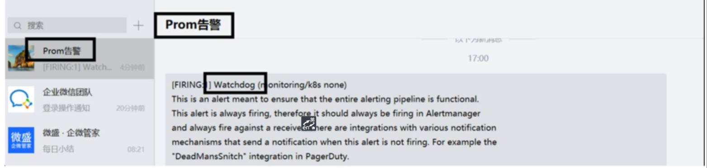
图15.62　查看微信告警


### 8.5 自定义告警模板

上一小节使用企业微信进行了告警通知，相对于邮箱通知，企业微信的告警通知并不是很容易阅读，此时可以通过Alertmanager的模板功能配置一些自定义模板。

首先修改alertmanager-secret.yaml添加自定义模板（注意wechat.tmpl和alertmanager.yaml需要对齐，模板的内容也是通过go-template编写的）：

```yaml
        app.kubernetes.io/part-of: kube-prometheus
        app.kubernetes.io/version: 0.21.0
      name: alertmanager-main
      namespace: monitoring
	stringData:
	  wechat.tmpl: |-
	    {{ define "wechat.default.message" }}
	    ... 
	    {{- end }}
	  alertmanager.yaml: |-
	    "global":
	      "resolve_timeout": "5m"
```

在templates字段添加模板位置：

```yaml
templates:
- '/etc/alertmanager/config/*.tmpl'
"inhibit_rules":
```

配置wechat-ops receiver使用该模板：

```yaml
	"receivers":
	- "name": wechat-ops
	  wechat_configs:
	  - send_resolved: true
	    to_party: 3
		...
		message: '{{ template "wechat.default.message" . }}'
```

---

**提示**："注意"

    {{  template  "wechat.default.message"  .  }} 配 置 的wechat.default.message 是 模 板 文 件 define 定 义 的 名 称 ： {{ define
    "wechat.default.message" }}，并非文件名称。


将配置更新至Alertmanager：

```sh
$ kubectl replace -f alertmanager-secret.yaml
secret/alertmanager-main replaced
```

更新完成后，可以在Secret中查看该配置：

```shell
$ kubectl describe secrets alertmanager-main -n monitoring
Name:         alertmanager-main
Namespace:    monitoring
Labels:       alertmanager=main
              app.kubernetes.io/component=alert-router
              app.kubernetes.io/name=alertmanager
              app.kubernetes.io/part-of=kube-prometheus
              app.kubernetes.io/version=0.22.2
Annotations:  <none>

Type:  Opaque

Data
====
alertmanager.yaml:  1438 bytes
wechat.tmpl:	 1823 bytes
```

之后再次收到告警，即为自定义告警模板，如图15.63所示。

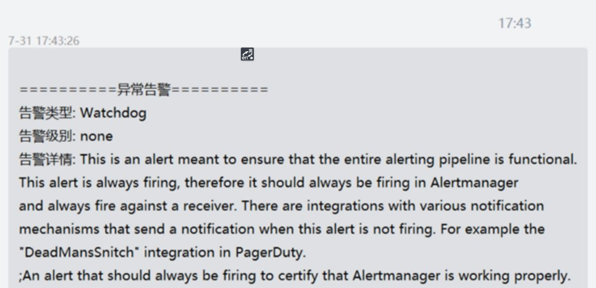

图15.63　查看微信告警


---

> "提示"：新版的kube-prometheus提供了Alertmanager 配置的自定义资源AlertmanagerConfig，上述配置均可以通过AlertmanagerConfig进行配
> 置，但是由于AlertmanagerConfig还不够成熟，并且并不是所有的公司都将Prometheus技术栈部署至Kubernetes，
>
> 因此本书还是以传统的配置文件进行讲解，
> 有兴趣的读者可以参考 https://github.com/prometheus-operator/prometheus-operator/blob/master/Documentation/design.md#alertmanagerconfig 进行学习。


## 9.Prometheus告警实战

前面的章节基本上对Prometheus和Alertmanager常用的配置进行了全面的学习，并且学习了PromQL语法，实现了常用媒介的告警通知。接下来我们介绍如何使用PromQL自定义告警策略。

### 9.1 PrometheusRule

在安装Prometheus后，默认配置了很多告警策略，那么这些告警配置是如何加载到Prometheus的呢？

在传统架构中，通过直接修改Prometheus的配置文件即可加载相应的告警策略，但是在Prometheus Operator中，无须再直接修改Prometheus的配置，通过自定义的资源PrometheusRule即可配置告警策略。可以通过如下命令查看默认配置的告警策略：

```sh
$ kubectl get prometheusrule -n monitoring
NAME                              AGE
alertmanager-main-rules           44h
kube-prometheus-rules             44h
kube-state-metrics-rules          44h
kubernetes-monitoring-rules       44h
node-exporter-rules               44h
prometheus-k8s-prometheus-rules   44h
prometheus-operator-rules         44h
```

也可以通过-oyaml查看某个rules的详细配置：

```sh
$ kubectl get prometheusrule node-exporter-rules -n monitoring -o yaml
apiVersion: monitoring.coreos.com/v1
kind: PrometheusRule
.... 	
spec:
  groups:
  - name: node-exporter
    rules:
    - alert: NodeFilesystemSpaceFillingUp
      annotations:
        description: Filesystem on {{ $labels.device }} at {{ $labels.instance }}
          has only {{ printf "%.2f" $value }}% available space left and is filling
          up.
        runbook_url: https://runbooks.prometheus-operator.dev/runbooks/node/nodefilesystemspacefillingup
        summary: Filesystem is predicted to run out of space within the next 24 hours.
      expr: |
        (
          node_filesystem_avail_bytes{job="node-exporter",fstype!=""} / node_filesystem_size_bytes{job="node-exporter",fstype!=""} * 100 < 40
        and
          predict_linear(node_filesystem_avail_bytes{job="node-exporter",fstype!=""}[6h], 24*60*60) < 0
        and
          node_filesystem_readonly{job="node-exporter",fstype!=""} == 0
        )
      for: 1h
      labels:
        severity: warning
```

groups下的配置即为告警策略,如果读者学习过传统配置的Prometheus，其实可以看出并无区别，只是Operator是通过kind为
PrometheusRule进行单独管理的。

接下来进行每个配置的解析。

- alert：告警策略的名称。
- annotations：告警注释信息，一般写为告警信息。
- expr：告警表达式。
- for：评估等待时间，告警持续多久才会发送告警数据。
- labels：告警的标签，用于告警的路由。

了解了PrometheusRule写法规则后，可以自定义一个告警策略。

实际使用时可以按照监控的目标划分PrometheusRule，比如之前配置了黑盒监控，那么可以创建一个名为blackbox的PrometheusRule。

### 9.2 告警通用配置步骤

假设需要对域名访问延迟进行监控，访问延迟大于1秒进行告警（生产环境可以按需调节，为了实现告警测试，可以将该值设置得小一些），此时可以创建一个PrometheusRule，代码如下：


# [在k8s中部署Prometheus监控全家桶](https://zhuanlan.zhihu.com/p/674028745)

### **前言**

K8s本身不包含内置的监控工具，所以市场上有不少这样监控工具来填补这一空白，但是没有一个监控工具有Prometheus全家桶使用率高，因为它由 CNCF维护，已经成为了监控 k8s 集群的事实上的行业标准，下面介绍一下如何在K8s快速部署一个kube-prometheus项目，来实现对k8s 相关资源监控与告警

### **kube-prometheus介绍**

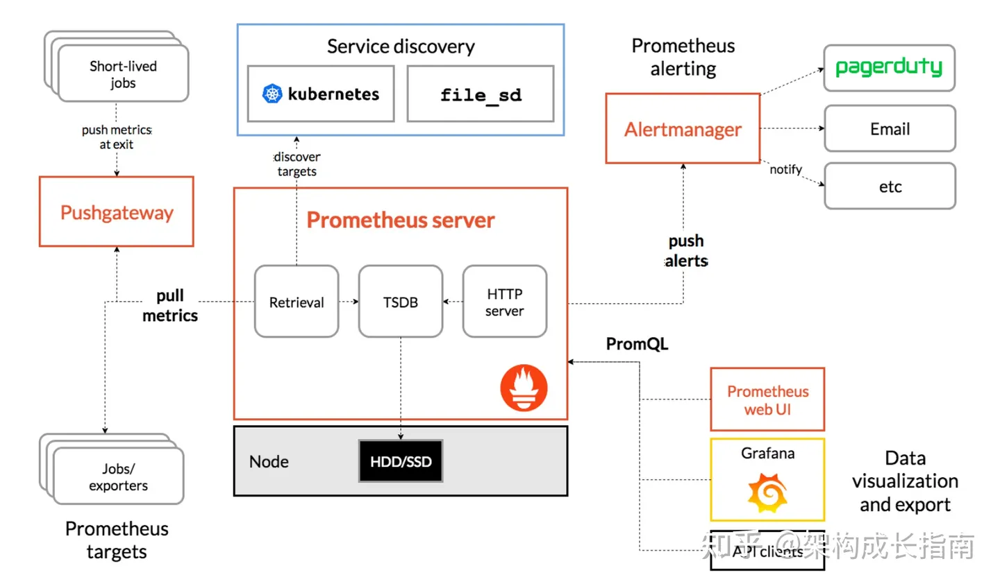

kube-prometheus是一个完整的监控解决方案，可以轻松地将其部署到 Kubernetes 集群中，它包括以下内容

1. Prometheus 用于度量收集
2. Alertmanager 用于指标警报和通知
3. Grafana 用于图形用户界面
4. 一组特定于K8s的exporters，用作指标收集代理
5. 使用 Prometheus Operator 来简化和自动化该堆栈的设置

### **快速安装**

在将 kube-prometheus部署到 k8s 集群之前，先确认与你的 k8s匹配的是版本，然后在下载

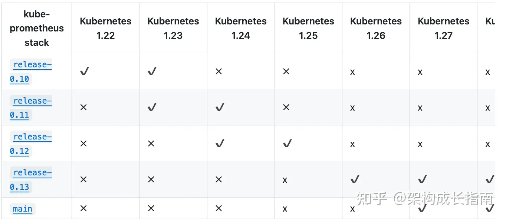


### **下载**

执行`kubectl version` 查看k8s 版本，下载对应版本

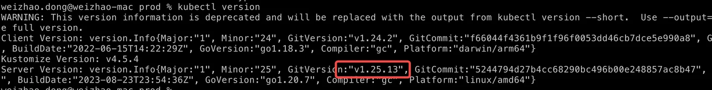

由于本人的 k8s 版本为 `v1.25.13`，所以下载kube-prometheus-0.12.0

```text
wget https://github.com/prometheus-operator/kube-prometheus/archive/refs/tags/v0.12.0.zip
tar -zxvf kube-prometheus-0.12.0.zip & cd kube-prometheus-0.12.0
```

### **修改镜像地址**

由于网络原因，kube-state-metrics和prometheus-adapter镜像地址，在国内无法下载，因此需要修改以下地址

> vi manifests/kubeStateMetrics-deployment.yaml

```text
image: bitnami/kube-state-metrics:2.7.0
```

> vi manifests/prometheusAdapter-deployment.yaml

```text
image: cloveropen/prometheus-adapter:v0.10.0
```

### **访问配置**

为了可以从外部访问 `Prometheus`、`Grafana`、`Alertmanager`，需要修改 `service` 类型为 `NodePort` 类型。

### **修改 Prometheus 的 service**

> vi manifests/prometheus-service.yaml

```text
# 设置对外访问端口，增加如下两行
type: NodePort
nodePort: 31922
```

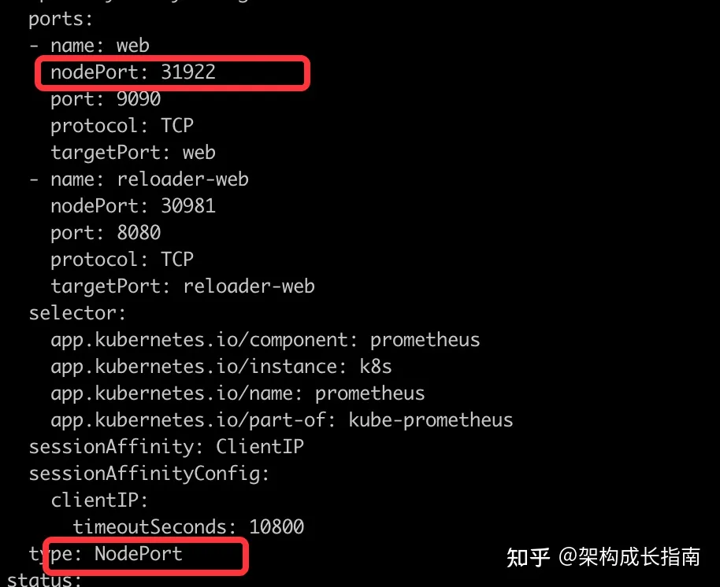

### **修改 Grafana 的 service**

> vi manifests/grafana-service.yaml

```text
# 设置对外访问端口，增加如下两行
type: NodePort
nodePort: 30300
```


### **修改 Alertmanager 的 service**

> vi manifests/alertmanager-service.yaml

```text
# 设置对外访问端口，增加如下两行
type: NodePort
nodePort: 30200
```


### **安装**

在kube-prometheus-0.12.0目录下执行以下命令进行安装

```text
kubectl apply --server-side -f manifests/setup
kubectl apply -f manifests/
```

执行完成以后，访问monitoring 空间，查看部署状态，可以看到启动成功，并且都是高可用部署

```text
kubectl get pods -n monitoring
```


### **验证**

### **Prometheus验证**

选一台 node 节点ip+31922，即可访问prometheus的 Web UI


### **Alertmanager验证**

选一台 node 节点ip+30200，即可访问alertmanager的 Web UI，可以看到有一些报警，由于alertmanager的报警配置比较复杂同时对国内的通讯工具支持有限，因此可以使用`PrometheusAlert`进行告警配置


### **Grafana验证**

选一台 node 节点ip+30300，即可访问grafana的 Web UI，默认用户名密码：admin/admin，登录会提示更改密码，登录以后，可以看到已经内置了不少监控大盘


集群资源监控


节点资源监控，可以看到当前节点部署了哪些 pod，以及对应的负载是多少

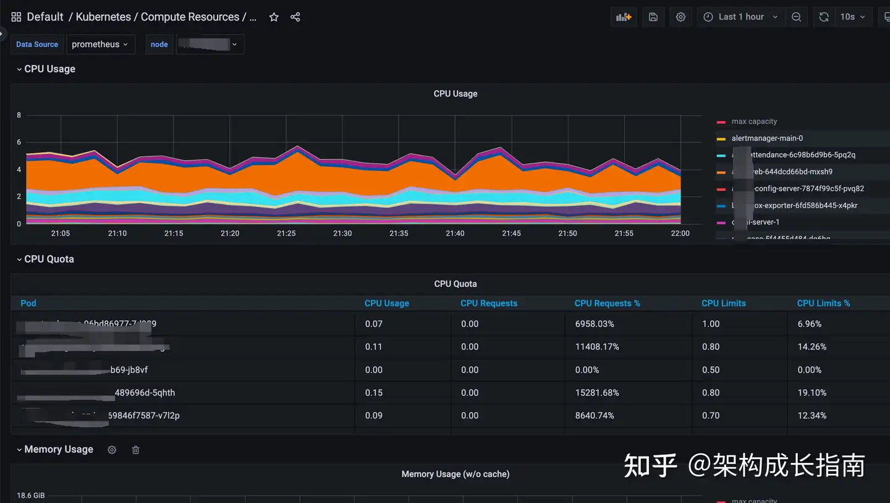

### **卸载**

执行以下命令即可卸载相关组件

```text
kubectl delete --ignore-not-found=true -f manifests/ -f manifests/setup
```

### **存在的问题**

### **持久存储**

以上我们安装未使用持久化存储，所以如果Prometheus或者Grafana重启，那么采集的数据和自定义的仪表盘等数据会丢失，因此如果考虑在生产环境使用，需要把数据使用存储卷挂载至文件系统。

### **Grafana显示时间问题**

由于grafana默认时区是UTC，比中国时间慢了8小时，很不便于日常监控查看，需要进行修改，如下图

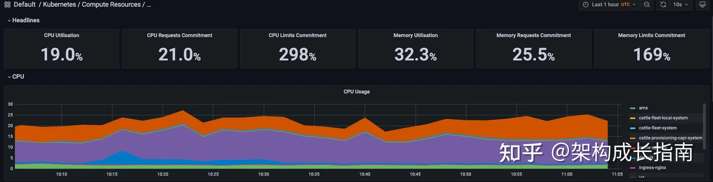

因此需要调整成中国时间，utc+8，替换grafana-dashboardDefinitions.yaml

```text
sed -i '' 's/utc/utc+8/g' grafana-dashboardDefinitions.yaml
sed -i '' 's/UTC/UTC+8/g' grafana-dashboardDefinitions.yaml
grep -i timezone grafana-dashboardDefinitions.yaml
```

