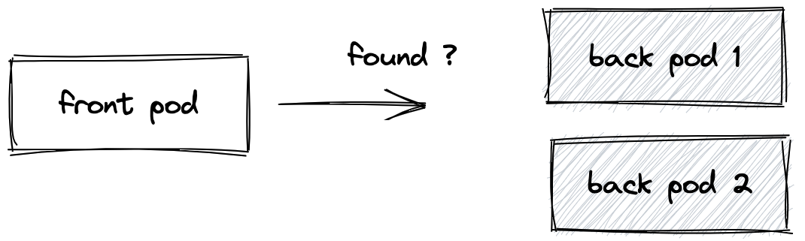
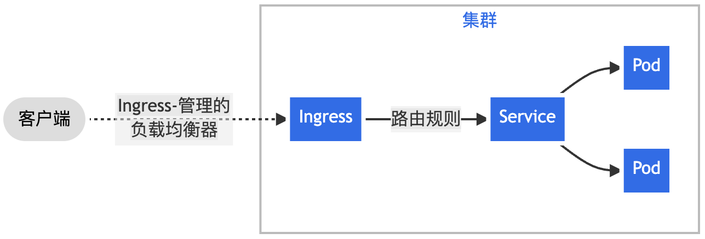

# [第三章 Pod]()

## 1 什么是 Pod？

Pod 的共享上下文包括一组 Linux 名字空间、控制组（cgroup）和可能一些其他的隔离方面， 即用来隔离[容器](https://kubernetes.io/zh-cn/docs/concepts/containers/)的技术。 在 Pod 的上下文中，每个独立的应用可能会进一步实施隔离。

Pod 类似于共享名字空间并共享文件系统卷的一组容器。

Kubernetes 集群中的 Pod 主要有两种用法：

- **运行单个容器的 Pod**。"每个 Pod 一个容器"模型是最常见的 Kubernetes 用例； 在这种情况下，可以将 Pod 看作单个容器的包装器，并且 Kubernetes 直接管理 Pod，而不是容器。

- **运行多个协同工作的容器的 Pod**。 Pod 可以封装由紧密耦合且需要共享资源的[多个并置容器](https://kubernetes.io/zh-cn/docs/concepts/workloads/pods/#how-pods-manage-multiple-containers)组成的应用。 这些位于同一位置的容器构成一个内聚单元。

  将多个并置、同管的容器组织到一个 Pod 中是一种相对高级的使用场景。 只有在一些场景中，容器之间紧密关联时你才应该使用这种模式。

  你不需要运行多个容器来扩展副本（为了弹性或容量）； 如果你需要多个副本，请参阅[工作负载管理](https://kubernetes.io/zh-cn/docs/concepts/workloads/controllers/)。

### 1.1 **简介**

Pod 是可以在 Kubernetes 中**创建和管理的、最小的可部署的计算单元**。

**Pod**（就像在鲸鱼荚或者豌豆荚中）**是一组（一个或多个）容器**； 这些容器共享存储、网络、以及怎样运行这些容器的声明。 Pod 中的**内容总是并置（colocated）的并且一同调度，在共享的上下文中运行**。简言之如果用 Docker 的术语来描述，**Pod 类似于共享名字空间并共享文件系统卷的一组容器。**

`定义: Pod 就是用来管理一组(一个|多个)容器的集合 特点: 共享网络 共享存储 共享上下文环境`

### 1.2 Pod 怎样管理多个容器?

Pod 中的容器被自动安排到集群中的同一物理机或虚拟机上，并可以一起进行调度。 容器之间可以共享资源和依赖、彼此通信、协调何时以及何种方式终止自身。例如，你可能有一个容器，为共享卷中的文件提供 Web 服务器支持，以及一个单独的 "边车 (sidercar)" 容器负责从远端更新这些文件，如下图所示：


### 1.3 如何使用 Pod?

通常你不需要直接创建 Pod，甚至单实例 Pod。 相反，你会使用诸如 Deployment 或 Job 这类工作负载资源来创建 Pod。 如果 Pod 需要跟踪状态，可以考虑 StatefulSet 资源。

Kubernetes 集群中的 Pod 主要有两种用法：

- **运行单个容器的 Pod**。"每个 Pod 一个容器" 模型是最常见的 Kubernetes 用例； 在这种情况下，可以将 Pod 看作单个容器的包装器，并且 Kubernetes 直接管理 Pod，而不是容器。
- **运行多个协同工作的容器 的 Pod**。 Pod 可能封装由多个紧密耦合且需要共享资源的共处容器组成的应用程序。 这些位于同一位置的容器可能形成单个内聚的服务单元 —— 一个容器将文件从共享卷提供给公众， 而另一个单独的 “边车”（sidecar）容器则刷新或更新这些文件。 Pod 将这些容器和存储资源打包为一个可管理的实体。

**说明: **

- 将多个并置、同管的容器组织到一个 Pod 中是一种相对高级的使用场景。 只有在一些场景中，容器之间紧密关联时你才应该使用这种模式。
- 每个 Pod 都旨在运行给定应用程序的单个实例。如果希望横向扩展应用程序 （例如，运行多个实例以提供更多的资源），则应该使用多个 Pod，每个实例使用一个 Pod。 在 Kubernetes 中，这通常被称为**副本（Replication）**。 通常使用一种工作负载资源及其控制器来创建和管理一组 Pod 副本。

## 2 Pod 基本操作

### 2.1 查看 pod

```shell
$ kubectl get pods|pod -A					# 查看所有命名空间的 pod
$ kubectl get pods|pod|po -n 命名空间名称
$ kubectl get pods -o wide 					# 查看默认命名空间下 pod 的详细信息
$ kubectl get pods -o wide -A				# 查看所有命名空间下 pod 的详细信息
$ kubectl get pod -w						# 实时监控 pod 的状态
```

### 2.2 [创建 pod](https://kubernetes.io/zh-cn/docs/reference/kubernetes-api/workload-resources/pod-v1/)

```sh
pod      :  kubectl run nginx(pod名称) --image=nginx:1.19
container:  docker run --name nginx nginx:1.19
```

```yml
# nginx-pod.yml
apiVersion: v1			# 指定 Kubernetes API 版本
kind: Pod				# 定义 Kubernetes 资源的类型为 Pod
metadata:				# 元数据部分，包含有关 Pod 的元信息
  name: nginx			# 指定 Pod 的名称为 nginx
spec:					# Pod 的规范部分，描述了 Pod 的规格
  containers:			# 容器列表，指定 Pod 中运行的容器
    - name: nginx		# 第一个容器的配置
      image: nginx:1.19	# 使用的镜像为 nginx 版本 1.19
      ports:			# 容器暴露的端口
        - containerPort: 80		# 容器监听的端口为 80
```

```shell
# 使用 kubectl apply/create -f 创建 pod
$ kubectl create -f nginx-pod.yml
$ kubectl apply -f nginx-pod.yml
```

> `注意: create 仅仅是不存在时创建,如果已经存在则报错！apply 不存在创建，存在更新配置。推荐使用 apply！`

### 2.3 删除 pod

```shell
$ kubectl delete pod  pod名称
$ kubectl delete -f pod.yml
```

### 2.4 进入 pod 中容器

```shell
$ kubectl exec -it nginx(pod名称) --(固定写死) bash(执行命令)		# 注意: 这种方式进入容器默认只会进入 pod 中第一个容器
$ kubectl exec -it pod名称 -c 容器名称 --(固定写死) bash(执行命令) # 注意: 进入指定 pod 中指定容器
```

### 2.5 查看 pod 日志

```shell
$ kubectl logs -f(可选,实时) nginx(pod 名称)	# 注意: 查看 pod 中第一个容器日志
$ kubect logs -f pod名称 -c 容器名称			# 注意: 查看 pod 中指定容器的日志
```

### 2.6 查看 pod 描述信息

```shell
$ kubectl describe pod nginx(pod名称)
```

### 2.7 快速构建yaml模板

idea中安装kubernetes插件

新建nginx-pod.yaml--->输入kpod一键生成yaml模板文档

## 3 Pod 运行多个容器

### 3.1 创建 pod

```yml
# myapp-pod.yml
apiVersion: v1
kind: Pod
metadata:
  name: myapp
spec:
  containers:
    - name: nginx
      image: nginx:1.19
      ports:
    		- containerPort: 80
      imagePullPolicy: IfNotPresent

    - name: redis
      image: redis:5.0.10
      ports:
    		- containerPort: 6379
      imagePullPolicy: IfNotPresent
```

```shell
$ kubectl apply -f myapp-pod.yml
```

### 3.2 查看指定容器日志

```shell
# 查看日志 (默认只查看第一个容器日志，这里是展示 nginx 日志)
$ kubectl logs -f myapp

# 查看 pod 中指定容器的日志
$ kubectl logs -f myapp -c nginx(容器名称)
$ kubectl logs -f myapp -c redis(容器名称)
```

### 3.3 进入容器

```shell
# 进入 pod 的容器 (默认进入第一个容器内部，这里会进入 nginx 容器内部)
$ kubectl exec -it myapp -- sh

# 进入 pod 中指定容器内部
$ kubectl exec -it myapp -c nginx -- sh
$ kubectl exec -it myapp -c redis -- sh
```

## 4 Pod 的 Labels(标签)

`标签（Labels）` 是附加到 Kubernetes 对象（比如 Pod）上的键值对。 标签旨在用于指定对用户有意义且相关的对象的标识属性。标签可以在创建时附加到对象，随后可以随时添加和修改。每个对象都可以定义一组键(key)/值(value)标签，但是每个键(key)对于给定对象必须是唯一的。

标签作用: 就是用来给 k8s 中对象起别名, 有了别名可以过滤和筛选

### 4.1 语法

`标签由键值对组成`，其有效标签值：

- 必须为 63 个字符或更少（可以为空）
- 除非标签值为空，必须以字母数字字符（`[a-z0-9A-Z]`）开头和结尾
- 包含破折号（`-`）、下划线（`_`）、点（`.`）和字母或数字

### 4.2 示例

```yml
apiVersion: v1
kind: Pod
metadata:
  name: myapp
  labels:
    name: myapp #创建时添加
spec:
  containers:
    - name: nginx
      image: nginx:1.21
      imagePullPolicy: IfNotPresent

    - name: redis
      image: redis:5.0.10
      imagePullPolicy: IfNotPresent
  restartPolicy: Always
```

### 4.3 标签基本操作

```shell
# 查看标签
$ kubectl get pods --show-labels

# kubectl label pod pod名称 标签键值对
$ kubectl label pod myapp env=prod

# 覆盖标签 --overwrite
$ kubectl label --overwrite pod myapp env=test

# 删除标签 -号代表删除标签
$ kubectl label pod myapp env-

# 根据标签筛选 env=test/env  > = < 
$ kubectl get po -l env=test
$ kubectl get po -l env
$ kubectl get po -l '!env' # 不包含的 pod
$ kubectl get po -l 'env in (test,prod)' #选择含有指定值的 pod
$ kubectl get po -l 'env notin (test,prod)' #选择含有指定值的 pod
```

## 5 Pod 的[生命周期](https://kubernetes.io/zh-cn/docs/concepts/workloads/pods/pod-lifecycle/)

 Pod 遵循预定义的生命周期，起始于 `Pending` 阶段， 如果至少其中有一个主要容器正常启动，则进入 `Running`，之后取决于 Pod 中是否有容器以失败状态结束而进入 `Succeeded` 或者 `Failed` 阶段。与此同时Pod 在其生命周期中只会被调度一次。 一旦 Pod 被调度（分派）到某个节点，Pod 会一直在该节点运行，直到 Pod 停止或者被终止。

### 5.1 生命周期

和一个个独立的应用容器一样，Pod 也被认为是相对临时性（而不是长期存在）的实体。 Pod 会被创建、赋予一个唯一的 ID(UID)， 并被调度到节点，并在终止（根据重启策略）或删除之前一直运行在该节点。如果一个节点死掉了，调度到该节点的 Pod 也被计划在给定超时期限结束后删除。

Pod 自身不具有自愈能力。如果 Pod 被调度到某节点而该节点之后失效， Pod 会被删除；类似地，Pod 无法在因节点资源耗尽或者节点维护而被驱逐期间继续存活。 Kubernetes 使用一种高级抽象来管理这些相对而言可随时丢弃的 Pod 实例， 称作控制器。

任何给定的 Pod （由 UID 定义）从不会被“重新调度（rescheduled）”到不同的节点； 相反，这一 Pod 可以被一个新的、几乎完全相同的 Pod 替换掉。 如果需要，新 Pod 的名字可以不变，但是其 UID 会不同。

如果某物声称其生命期与某 Pod 相同，例如存储卷， 这就意味着该对象在此 Pod （UID 亦相同）存在期间也一直存在。 如果 Pod 因为任何原因被删除，甚至完全相同的替代 Pod 被创建时， 这个相关的对象（例如这里的卷）也会被删除并重建。

### 5.2 pod 阶段

Pod 的 `status` 字段是一个 [PodStatus](https://kubernetes.io/docs/reference/generated/kubernetes-api/v1.30/#podstatus-v1-core) 对象，其中包含一个 `phase` 字段。

Pod 的阶段（Phase）是 Pod 在其生命周期中所处位置的简单宏观概述。 该阶段并不是对容器或 Pod 状态的综合汇总，也不是为了成为完整的状态机。

Pod 阶段的数量和含义是严格定义的。 除了本文档中列举的内容外，不应该再假定 Pod 有其他的 `phase` 值。

| 取值                | 描述                                                         |
| :------------------ | :----------------------------------------------------------- |
| `Pending`（悬决）   | Pod 已被 Kubernetes 系统接受，但有一个或者多个容器尚未创建亦未运行。此阶段包括等待 Pod 被调度的时间和通过网络下载镜像的时间。 |
| `Running`（运行中） | Pod 已经绑定到了某个节点，Pod 中所有的容器都已被创建。至少有一个容器仍在运行，或者正处于启动或重启状态。 |
| `Succeeded`（成功） | Pod 中的所有容器都已成功终止，并且不会再重启。               |
| `Failed`（失败）    | Pod 中的所有容器都已终止，并且至少有一个容器是因为失败终止。也就是说，容器以非 0 状态退出或者被系统终止。 |
| `Unknown`（未知）   | 因为某些原因无法取得 Pod 的状态。这种情况通常是因为与 Pod 所在主机通信失败。 |

> **说明：**
>
> 1. 当一个 Pod 被删除时，执行一些 kubectl 命令会展示这个 Pod 的状态为 `Terminating`（终止）。 这个 `Terminating` 状态并不是 Pod 阶段之一。 Pod 被赋予一个可以体面终止的期限，默认为 30 秒。 你可以使用 `--force` 参数来强制终止 Pod。
>
> 2. 如果某节点死掉或者与集群中其他节点失联，Kubernetes 会实施一种策略，将失去的节点上运行的所有 Pod 的 `phase` 设置为 `Failed`。

### 5.3 Pod 状况

Pod 有一个 PodStatus 对象，其中包含一个 [PodConditions](https://kubernetes.io/docs/reference/generated/kubernetes-api/v1.30/#podcondition-v1-core) 数组。Pod 可能通过也可能未通过其中的一些状况测试。 Kubelet 管理以下 PodCondition：

- `PodScheduled`：Pod 已经被调度到某节点；
- `PodReadyToStartContainers`：Pod 沙箱被成功创建并且配置了网络（Beta 特性，[默认](https://kubernetes.io/zh-cn/docs/concepts/workloads/pods/pod-lifecycle/#pod-has-network)启用）；
- `ContainersReady`：Pod 中所有容器都已就绪；
- `Initialized`：所有的 [Init 容器](https://kubernetes.io/zh-cn/docs/concepts/workloads/pods/init-containers/)都已成功完成；
- `Ready`：Pod 可以为请求提供服务，并且应该被添加到对应服务的负载均衡池中。

这里是一个例子：

```sh
$ kubectl get pod -o yaml
kind: Pod
...
spec:
  readinessGates:
    - conditionType: "www.example.com/feature-1"
status:
  conditions:
    - type: Ready                              # Pod 状况的名称
      status: "False"							# 表明该状况是否适用，可能的取值有 "True"、"False" 或 "Unknown"
      lastProbeTime: null						# 上次探测 Pod 状况时的时间戳
      lastTransitionTime: 2018-01-01T00:00:00Z	# Pod 上次从一种状态转换到另一种状态时的时间戳
    - type: "www.example.com/feature-1"        # 额外的 Pod 状况
      status: "False"
      lastProbeTime: null
      lastTransitionTime: 2018-01-01T00:00:00Z
  containerStatuses:
    - containerID: docker://abcd...
      ready: true
...
```


## 7 Pod 中 init 容器

Init 容器是一种特殊容器，在Pod 内的应用容器启动之前运行。Init 容器可以包括一些应用镜像中不存在的实用工具和安装脚本。

### 7.1 init 容器特点

init 容器与普通的容器非常像，除了如下几点：

- 它们总是运行到完成。如果 Pod 的 Init 容器失败，kubelet 会不断地重启该 Init 容器直到该容器成功为止。 然而，如果 Pod 对应的 `restartPolicy` 值为 "Never"，并且 Pod 的 Init 容器失败， 则 Kubernetes 会将整个 Pod 状态设置为失败。
- 每个都必须在下一个启动之前成功完成。
- 同时 Init 容器不支持 `lifecycle`、`livenessProbe`、`readinessProbe` 和 `startupProbe`， 因为它们必须在 Pod 就绪之前运行完成。
- 如果为一个 Pod 指定了多个 Init 容器，这些容器会按顺序逐个运行。 每个 Init 容器必须运行成功，下一个才能够运行。当所有的 Init 容器运行完成时， Kubernetes 才会为 Pod 初始化应用容器并像平常一样运行。
- Init 容器支持应用容器的全部字段和特性，包括资源限制、数据卷和安全设置。 然而，Init 容器对资源请求和限制的处理稍有不同。

### 7.2 [使用 init 容器](https://kubernetes.io/zh-cn/docs/concepts/workloads/pods/init-containers/)

一个应用容器和一个 Init 容器的 Pod。Init 容器在应用容器启动前运行完成。

```yaml
apiVersion: v1
kind: Pod
metadata:
  name: init-demo
spec:
  containers:
  - name: nginx
    image: nginx
    ports:
    - containerPort: 80
    volumeMounts:
    - name: workdir
      mountPath: /usr/share/nginx/html
  # 这些容器在 Pod 初始化期间运行
  initContainers:
  - name: install
    image: busybox:1.28
    command:
    - wget
    - "-O"
    - "/work-dir/index.html"
    - http://info.cern.ch
    volumeMounts:
    - name: workdir
      mountPath: "/work-dir"
  dnsPolicy: Default
  volumes:
  - name: workdir
    emptyDir: {}
```

配置文件中，你可以看到应用容器和 Init 容器共享了一个卷。

Init 容器将共享卷挂载到了 `/work-dir` 目录，应用容器将共享卷挂载到了 `/usr/share/nginx/html` 目录。 Init 容器执行完下面的命令就终止：

```shell
wget -O /work-dir/index.html http://info.cern.ch
```

请注意 Init 容器在 nginx 服务器的根目录写入 `index.html`。

## 8 [静态pod](https://kubernetes.io/zh-cn/docs/tasks/configure-pod-container/static-pod/)

**静态 Pod** 在指定的节点上由 kubelet 守护进程直接管理，不需要 [API 服务器](https://kubernetes.io/zh-cn/docs/concepts/overview/components/#kube-apiserver)监管。 与由控制面管理的 Pod（例如，[Deployment](https://kubernetes.io/zh-cn/docs/concepts/workloads/controllers/deployment/)） 不同；kubelet 监视每个静态 Pod（在它失败之后重新启动）。

kubelet 会尝试通过 Kubernetes API 服务器为每个静态 Pod 自动创建一个[镜像 Pod](https://kubernetes.io/zh-cn/docs/reference/glossary/?all=true#term-mirror-pod)。 这意味着节点上运行的静态 Pod 对 API 服务来说是可见的，但是不能通过 API 服务器来控制。 Pod 名称将把以连字符开头的节点主机名作为后缀。

> **说明：**如果你在运行一个 Kubernetes 集群，并且在每个节点上都运行一个静态 Pod， 就可能需要考虑使用 [DaemonSet](https://kubernetes.io/zh-cn/docs/concepts/workloads/controllers/daemonset/) 替代这种方式。

创建静态 Pod 有两种方式：`配置文件方式`和 `HTTP方式`。

### 1 配置文件方式

声明文件是标准的 Pod 定义文件，以 JSON 或者 YAML 格式存储在指定目录。路径设置在 [Kubelet 配置文件](https://kubernetes.io/zh-cn/docs/reference/config-api/kubelet-config.v1beta1/)的 `staticPodPath: <目录>` 字段，kubelet 会定期的扫描这个文件夹下的 YAML/JSON 文件来创建/删除静态 Pod。 注意 kubelet 扫描目录的时候会忽略以点开头的文件。

例如：下面是如何以静态 Pod 的方式启动一个简单 web 服务：

1. 选择一个要运行静态 Pod 的节点。在这个例子中选择 `my-node1`。

   ```shell
   ssh my-node1
   ```

1. 选择一个目录，比如在 `/etc/kubernetes/manifests` 目录来保存 Web 服务 Pod 的定义文件，例如 `/etc/kubernetes/manifests/static-web.yaml`：

   ```shell
   # 在 kubelet 运行的节点上执行以下命令
   mkdir -p /etc/kubernetes/manifests/
   cat <<EOF >/etc/kubernetes/manifests/static-web.yaml
   apiVersion: v1
   kind: Pod
   metadata:
     name: static-web
     labels:
       role: myrole
   spec:
     containers:
       - name: web
         image: nginx
         ports:
           - name: web
             containerPort: 80
             protocol: TCP
   EOF
   ```

1. 在该节点上配置 kubelet，在 [kubelet 配置文件](https://kubernetes.io/zh-cn/docs/reference/config-api/kubelet-config.v1beta1/)中设定 `staticPodPath` 值。 欲了解更多信息，请参考[通过配置文件设定 kubelet 参数](https://kubernetes.io/zh-cn/docs/tasks/administer-cluster/kubelet-config-file/)。

   另一个已弃用的方法是，在该节点上通过命令行参数配置 kubelet，以便从本地查找静态 Pod 清单。 若使用这种弃用的方法，请启动 kubelet 时加上 `--pod-manifest-path=/etc/kubernetes/manifests/` 参数。

1. 重启 kubelet。在 Fedora 上，你将使用下面的命令：

   ```shell
   systemctl restart kubelet	# 在 kubelet 运行的节点上执行以下命令
   ```

### 2 Web 网上的静态 Pod 声明文件

Kubelet 根据 `--manifest-url=<URL>` 参数的配置定期的下载指定文件，并且转换成 JSON/YAML 格式的 Pod 定义文件。 与[文件系统上的清单文件](https://kubernetes.io/zh-cn/docs/tasks/configure-pod-container/static-pod/#configuration-files)使用方式类似，kubelet 调度获取清单文件。 如果静态 Pod 的清单文件有改变，kubelet 会应用这些改变。

按照下面的方式来：

1. 创建一个 YAML 文件，并保存在 Web 服务器上，这样你就可以将该文件的 URL 传递给 kubelet。

   ```yaml
   apiVersion: v1
   kind: Pod
   metadata:
     name: static-web
     labels:
       role: myrole
   spec:
     containers:
       - name: web
         image: nginx
         ports:
           - name: web
             containerPort: 80
             protocol: TCP
   ```

1. 通过在选择的节点上使用 `--manifest-url=<manifest-url>` 配置运行 kubelet。 在 Fedora 添加下面这行到 `/etc/kubernetes/kubelet`：

   ```shell
   KUBELET_ARGS="--cluster-dns=10.254.0.10 --cluster-domain=kube.local --manifest-url=<manifest-url>"
   ```

1. 重启 kubelet。在 Fedora 上，你将运行如下命令：

   ```shell
   systemctl restart kubelet # 在 kubelet 运行的节点上执行以下命令
   ```

### 3 观察静态 Pod 的行为

当 kubelet 启动时，会自动启动所有定义的静态 Pod。 当定义了一个静态 Pod 并重新启动 kubelet 时，新的静态 Pod 就应该已经在运行了。

回到 kubelet 运行所在的节点上，你可以手动停止容器。 可以看到过了一段时间后 kubelet 会发现容器停止了并且会自动重启 Pod

## 8 [节点亲和性分配 Pod](http://kubernetes.p2hp.com/docs/concepts/scheduling-eviction/assign-pod-node.html)

你可以约束一个 Pod 以便 **限制** 其只能在特定的节点上运行， 或优先在特定的节点上运行。 

有几种方法可以实现这点，推荐的方法都是用 **标签选择算符**来进行选择。 通常这样的约束不是必须的，因为调度器将自动进行合理的放置（比如，将 Pod 分散到节点上， 而不是将 Pod 放置在可用资源不足的节点上等等）。但在某些情况下，你可能需要进一步控制 Pod 被部署到哪个节点。例如，确保 Pod 最终落在连接了 SSD 的机器上， 或者将来自两个不同的服务且有大量通信的 Pods 被放置在同一个可用区。

你可以使用下列方法中的任何一种来选择 Kubernetes 对特定 Pod 的调度：

- 与节点标签匹配的 nodeSelector  **推荐**
- 亲和性与反亲和性 **推荐**
- nodeName
- Pod 拓扑分布约束 **推荐**

>  **`定义: 使用节点亲和性可以把 Kubernetes Pod 分配到特定节点。`**

### 8.1 给节点添加标签

- 列出集群中的节点及其标签：

  ```shell
  $ kubectl get nodes --show-labels
  #输出类似于此：
  NAME        STATUS   ROLES           AGE   VERSION   LABELS
  k8s-node1   Ready    control-plane   10d   v1.26.0   beta.kubernetes.io/arch=arm64,beta.kubernetes.io/os=linux...
  k8s-node2   Ready    <none>          10d   v1.26.0   beta.kubernetes.io/arch=arm64,beta.kubernetes.io/os=linux...
  k8s-node3   Ready    <none>          10d   v1.26.0   beta.kubernetes.io/arch=arm64,beta.kubernetes.io/os=linux...
  ```

- 选择一个节点，给它添加一个标签：

  ```shell
  kubectl label nodes k8s-node1(节点名称) disktype=ssd
  ```

- 验证你所选节点具有 `disktype=ssd` 标签：

  ```shell
  $ kubectl get nodes --show-labels
  #输出类似于此：
  NAME        STATUS   ROLES           AGE   VERSION   LABELS
  k8s-node1   Ready    control-plane   10d   v1.26.0   beta.kubernetes.io/arch=arm64,beta.kubernetes.io/os=linux,disktype=ssd...
  k8s-node2   Ready    <none>          10d   v1.26.0   beta.kubernetes.io/arch=arm64,beta.kubernetes.io/os=linux...
  k8s-node3   Ready    <none>          10d   v1.26.0   beta.kubernetes.io/arch=arm64,beta.kubernetes.io/os=linux...
  ```

### 8.2 根据选择节点标签[nodeSelector]分配

```yml
apiVersion: v1
kind: Pod
metadata:
  name: nginx
  labels:
    env: nginx
spec:
  containers:
  - name: nginx
    image: nginx:1.19
    imagePullPolicy: IfNotPresent
  nodeSelector:
    disktype: ssd  # 选择节点为标签为 ssd 的节点
```

### 8.3 根据节点名称[nodeName]分配

```yml
apiVersion: v1
kind: Pod
metadata:
  name: nginx
spec:
  nodeName: worker1    # 调度 Pod 到特定的节点
  containers:
  - name: nginx
    image: nginx
    imagePullPolicy: IfNotPresent
```

### 8.4 根据 亲和性和反亲和性 指派 pod 到指定节点

官网地址: http://kubernetes.p2hp.com/docs/concepts/scheduling-eviction/assign-pod-node.html

**说明**

`nodeSelector` 提供了一种最简单的方法来将 Pod 约束到具有特定标签的节点上。 亲和性和反亲和性扩展了你可以定义的约束类型。使用亲和性与反亲和性的一些好处有：

- 亲和性、反亲和性语言的表达能力更强。`nodeSelector` 只能选择拥有所有指定标签的节点。 亲和性、反亲和性为你提供对选择逻辑的更强控制能力。
- 你可以标明某规则是“软需求”或者“偏好”，这样调度器在无法找到匹配节点时仍然调度该 Pod。
- 你可以使用节点上（或其他拓扑域中）运行的其他 Pod 的标签来实施调度约束， 而不是只能使用节点本身的标签。这个能力让你能够定义规则允许哪些 Pod 可以被放置在一起。

**亲和性功能由两种类型的亲和性组成：**

- **节点亲和性**功能类似于 `nodeSelector` 字段，但它的表达能力更强，并且允许你指定软规则。
- Pod 间亲和性/反亲和性允许你根据其他 Pod 的标签来约束 Pod。


节点亲和性概念上类似于 `nodeSelector`， 它使你可以根据节点上的标签来约束 Pod 可以调度到哪些节点上。 节点亲和性有两种：

- `requiredDuringSchedulingIgnoredDuringExecution`： 调度器只有在规则被满足的时候才能执行调度。此功能类似于 `nodeSelector`， 但其语法表达能力更强。
- `preferredDuringSchedulingIgnoredDuringExecution`： 调度器会尝试寻找满足对应规则的节点。如果找不到匹配的节点，调度器仍然会调度该 Pod。

**注意：在上述类型中，`IgnoredDuringExecution` 意味着如果节点标签在 Kubernetes 调度 Pod 后发生了变更，Pod 仍将继续运行。**

```yml
apiVersion: v1
kind: Pod
metadata:
  name: with-node-affinity
spec:
  affinity:
    nodeAffinity:
    	#节点必须包含一个键名为 ssd 的标签， 并且该标签的取值必须为 fast 或 superfast。
      requiredDuringSchedulingIgnoredDuringExecution: 
        nodeSelectorTerms:
        - matchExpressions:
          - key: ssd
            operator: In
            values:
            - fast
            - superfast
  containers:
  - name: nginx
    image: nginx:1.19
```

**注意: 你可以使用 `In`、`NotIn`、`Exists`、`DoesNotExist`、`Gt` 和 `Lt` 之一作为操作符。`NotIn` 和 `DoesNotExist` 可用来实现节点反亲和性行为。**

### 8.5 节点亲和性权重

你可以为 `preferredDuringSchedulingIgnoredDuringExecution` 亲和性类型的每个实例设置 `weight` 字段，其取值范围是 1 到 100。 

```yml
apiVersion: v1
kind: Pod
metadata:
  name: with-node-affinity
spec:
  affinity:
    nodeAffinity:
      #节点最好具有一个键名为 app 且取值为 fast 的标签。
      preferredDuringSchedulingIgnoredDuringExecution:
      - weight: 1 #取值范围是 1 到 100
        preference:
          matchExpressions:
          - key: ssd
            operator: In
            values:
            - fast
      - weight: 50
        preference:
          matchExpressions:
          - key: app
            operator: In
            values:
            - demo
  containers:
  - name: nginx
    image: nginx:1.19
```

### 8.6 pod 间亲和性和反亲和性及权重

与节点亲和性类似，Pod 的亲和性与反亲和性也有两种类型：

- `requiredDuringSchedulingIgnoredDuringExecution`
- `preferredDuringSchedulingIgnoredDuringExecution`

例如，你可以使用 `requiredDuringSchedulingIgnoredDuringExecution` 亲和性来告诉调度器， 将两个服务的 Pod 放到同一个云提供商可用区内，因为它们彼此之间通信非常频繁。 类似地，你可以使用 `preferredDuringSchedulingIgnoredDuringExecution` 反亲和性来将同一服务的多个 Pod 分布到多个云提供商可用区中。

要使用 Pod 间亲和性，可以使用 Pod 规约中的 `spec.affinity.podAffinity` 字段。 对于 Pod 间反亲和性，可以使用 Pod 规约中的 `spec.affinity.podAntiAffinity` 字段。

```yml
apiVersion: v1
kind: Pod
metadata:
  name: redis
  labels:
    app: redis
spec:
  containers:
    - name: redis
      image: redis:5.0.10
      imagePullPolicy: IfNotPresent
  restartPolicy: Always
  affinity:
    podAffinity:
      requiredDuringSchedulingIgnoredDuringExecution:
        #更确切的说，调度器必须将 Pod 调度到具有 cpu 标签的节点上，并且集群中至少有一个位于该可用区的节点上运行着带有 app=nginx 标签的 Pod。
        - topologyKey: cpu
          labelSelector:
            matchExpressions:
              - key: app
                operator: In
                values:
                  - nginx
```

- **pod 间亲和性权重**

```yml
apiVersion: v1
kind: Pod
metadata:
  name: redis
  labels:
    app: redis
spec:
  containers:
    - name: redis
      image: redis:5.0.10
      imagePullPolicy: IfNotPresent
  restartPolicy: Always
  affinity:
    podAffinity:
      preferredDuringSchedulingIgnoredDuringExecution:
        #更确切的说，调度器必须将 Pod 调度到具有 cpu 标签的节点上，并且集群中至少有一个位于该可用区的节点上运行着带有 app=nginx 标签的 Pod。
        - podAffinityTerm:
            topologyKey: cpu
            labelSelector:
              matchExpressions:
                - key: app
                  operator: In
                  values:
                    - nginx
          weight: 1
        - podAffinityTerm:
            topologyKey: cpu
            labelSelector:
              matchExpressions:
                - key: app
                  operator: In
                  values:
                    - web
          weight: 30
```

### 8.7 污点和容忍度

参考: http://kubernetes.p2hp.com/docs/concepts/scheduling-eviction/taint-and-toleration.html

### 8.8 Pod 拓扑分布约束

参考: http://kubernetes.p2hp.com/docs/concepts/scheduling-eviction/topology-spread-constraints/

## Pod 的终止

通常 Pod 体面终止的过程为：kubelet 先发送一个带有体面超时限期的 TERM（又名 SIGTERM） 信号到每个容器中的主进程，将请求发送到容器运行时来尝试停止 Pod 中的容器。 停止容器的这些请求由容器运行时以异步方式处理。 这些请求的处理顺序无法被保证。许多容器运行时遵循容器镜像内定义的 `STOPSIGNAL` 值， 如果不同，则发送容器镜像中配置的 STOPSIGNAL，而不是 TERM 信号。 一旦超出了体面终止限期，容器运行时会向所有剩余进程发送 KILL 信号，之后 Pod 就会被从 [API 服务器](https://kubernetes.io/zh-cn/docs/concepts/overview/components/#kube-apiserver)上移除。 如果 `kubelet` 或者容器运行时的管理服务在等待进程终止期间被重启， 集群会从头开始重试，赋予 Pod 完整的体面终止限期。

下面是一个例子：

1、你使用 `kubectl` 工具手动删除某个特定的 Pod，而该 Pod 的体面终止限期是默认值（30 秒）。

2、API 服务器中的 Pod 对象被更新，记录涵盖体面终止限期在内 Pod 的最终死期，超出所计算时间点则认为 Pod 已死（dead）。 如果你使用 `kubectl describe` 来查验你正在删除的 Pod，该 Pod 会显示为 "Terminating" （正在终止）。 在 Pod 运行所在的节点上：`kubelet` 一旦看到 Pod 被标记为正在终止（已经设置了体面终止限期），`kubelet` 即开始本地的 Pod 关闭过程。

- 1、如果 Pod 中的容器之一定义了 `preStop` [回调](https://kubernetes.io/zh-cn/docs/concepts/containers/container-lifecycle-hooks)， `kubelet` 开始在容器内运行该回调逻辑。如果超出体面终止限期时， `preStop` 回调逻辑仍在运行，`kubelet` 会请求给予该 Pod 的宽限期一次性增加 2 秒钟。

如果 `preStop` 回调在体面期结束后仍在运行，kubelet 将请求短暂的、一次性的体面期延长 2 秒。

**说明：**

```sh
  如果 `preStop` 回调所需要的时间长于默认的体面终止限期，你必须修改
  `terminationGracePeriodSeconds` 属性值来使其正常工作。
```

- 2、`kubelet` 接下来触发容器运行时发送 TERM 信号给每个容器中的进程 1。

**说明：**

```sh
  Pod 中的容器会在不同时刻收到 TERM 信号，接收顺序也是不确定的。
  如果关闭的顺序很重要，可以考虑使用 `preStop` 回调逻辑来协调。
```

3、在 `kubelet` 启动 Pod 的体面关闭逻辑的同时，控制平面会评估是否将关闭的 Pod 从对应的 EndpointSlice（和端点）对象中移除，过滤条件是 Pod 被对应的[服务](https://kubernetes.io/zh-cn/docs/concepts/services-networking/service/)以某 [选择算符](https://kubernetes.io/zh-cn/docs/concepts/overview/working-with-objects/labels/)选定。 [ReplicaSet](https://kubernetes.io/zh-cn/docs/concepts/workloads/controllers/replicaset/) 和其他工作负载资源不再将关闭进程中的 Pod 视为合法的、能够提供服务的副本。

关闭动作很慢的 Pod 不应继续处理常规服务请求，而应开始终止并完成对打开的连接的处理。 一些应用程序不仅需要完成对打开的连接的处理，还需要更进一步的体面终止逻辑 - 比如：排空和完成会话。

任何正在终止的 Pod 所对应的端点都不会立即从 EndpointSlice 中被删除，EndpointSlice API（以及传统的 Endpoints API）会公开一个状态来指示其处于 [终止状态](https://kubernetes.io/zh-cn/docs/concepts/services-networking/endpoint-slices/#conditions)。 正在终止的端点始终将其 `ready` 状态设置为 `false`（为了向后兼容 1.26 之前的版本）， 因此负载均衡器不会将其用于常规流量。

如果需要排空正被终止的 Pod 上的流量，可以将 `serving` 状况作为实际的就绪状态。你可以在教程 [探索 Pod 及其端点的终止行为](https://kubernetes.io/zh-cn/docs/tutorials/services/pods-and-endpoint-termination-flow/) 中找到有关如何实现连接排空的更多详细信息。

### 强制终止 Pod

默认情况下，所有的删除操作都会附有 30 秒钟的宽限期限。 `kubectl delete` 命令支持 `--grace-period=<seconds>` 选项，允许你重载默认值， 设定自己希望的期限值。将宽限期限强制设置为 `0` 意味着立即从 API 服务器删除 Pod。 如果 Pod 仍然运行于某节点上，强制删除操作会触发 `kubelet` 立即执行清理操作。

```sh
kubectl delete pods <pod> --grace-period=0 --force
```

执行强制删除操作时，API 服务器不再等待来自 `kubelet` 的、关于 Pod 已经在原来运行的节点上终止执行的确认消息。 API 服务器直接删除 Pod 对象，这样新的与之同名的 Pod 即可以被创建。 在节点侧，被设置为立即终止的 Pod 仍然会在被强行杀死之前获得一点点的宽限时间。

如果在执行这些命令后 Pod 仍处于 `Unknown` 状态，请使用以下命令从集群中删除 Pod：

```shell
kubectl patch pod <pod> -p '{"metadata":{"finalizers":null}}'
```


## 调试运行中的 Pod

1、使用 `kubectl describe pod` 命令获取 Pod 详情

2、查看events 事件

```sh
kubectl get events 
```

3、查看yaml格式详细信息

```sh
kubectl get pod nginx-deployment-1006230814-6winp -o yaml
```

4、检查 Pod 的日志

- 首先，查看受到影响的容器的日志：

```shell
kubectl logs ${POD_NAME} ${CONTAINER_NAME}
```

- 如果你的容器之前崩溃过，你可以通过下面命令访问之前容器的崩溃日志：

```shell
kubectl logs --previous ${POD_NAME} ${CONTAINER_NAME}
```

5、使用容器 exec 进行调试

在 `kubectl exec` 命令后面加上 `-i` 和 `-t` 来运行一个连接到你的终端的 Shell

```sh
kubectl exec -it cassandra -- sh
```

6、使用临时调试容器来进行调试

### 7、通过 Pod 副本调试

有些时候 Pod 的配置参数使得在某些情况下很难执行故障排查。 例如，在容器镜像中不包含 shell 或者你的应用程序在启动时崩溃的情况下， 就不能通过运行 `kubectl exec` 来排查容器故障。 在这些情况下，你可以使用 `kubectl debug` 来创建 Pod 的副本，通过更改配置帮助调试。

#### 在添加新的容器时创建 Pod 副本

当应用程序正在运行但其表现不符合预期时，你会希望在 Pod 中添加额外的调试工具， 这时添加新容器是很有用的。

例如，应用的容器镜像是建立在 `busybox` 的基础上， 但是你需要 `busybox` 中并不包含的调试工具。 你可以使用 `kubectl run` 模拟这个场景:

```shell
kubectl run myapp --image=busybox:1.28 --restart=Never -- sleep 1d
```

通过运行以下命令，建立 `myapp` 的一个名为 `myapp-debug` 的副本， 新增了一个用于调试的 Ubuntu 容器，

```shell
kubectl debug myapp -it --image=ubuntu --share-processes --copy-to=myapp-debug
Defaulting debug container name to debugger-w7xmf.
If you don't see a command prompt, try pressing enter.
root@myapp-debug:/#
```

**说明：**

- 如果你没有使用 `--container` 指定新的容器名，`kubectl debug` 会自动生成的。
- 默认情况下，`-i` 标志使 `kubectl debug` 附加到新容器上。 你可以通过指定 `--attach=false` 来防止这种情况。 如果你的会话断开连接，你可以使用 `kubectl attach` 重新连接。
- `--share-processes` 允许在此 Pod 中的其他容器中查看该容器的进程。 参阅[在 Pod 中的容器之间共享进程命名空间](https://kubernetes.io/zh-cn/docs/tasks/configure-pod-container/share-process-namespace/) 获取更多信息。

#### 在改变 Pod 命令时创建 Pod 副本

有时更改容器的命令很有用，例如添加调试标志或因为应用崩溃。

为了模拟应用崩溃的场景，使用 `kubectl run` 命令创建一个立即退出的容器：

```sh
kubectl run --image=busybox:1.28 myapp -- false
```

使用 `kubectl describe pod myapp` 命令，你可以看到容器崩溃了：

```sh
Containers:
  myapp:
    Image:         busybox
    ...
    Args:
      false
    State:          Waiting
      Reason:       CrashLoopBackOff
    Last State:     Terminated
      Reason:       Error
      Exit Code:    1
```

你可以使用 `kubectl debug` 命令创建该 Pod 的一个副本， 在该副本中命令改变为交互式 shell：

```sh
kubectl debug myapp -it --copy-to=myapp-debug --container=myapp -- sh
If you don't see a command prompt, try pressing enter.
/ #
```

现在你有了一个可以执行类似检查文件系统路径或者手动运行容器命令的交互式 shell。

**说明：**

- 要更改指定容器的命令，你必须用 `--container` 命令指定容器的名字， 否则 `kubectl debug` 将建立一个新的容器运行你指定的命令。
- 默认情况下，标志 `-i` 使 `kubectl debug` 附加到容器。 你可通过指定 `--attach=false` 来防止这种情况。 如果你的断开连接，可以使用 `kubectl attach` 重新连接。

#### 在更改容器镜像时拷贝 Pod

在某些情况下，你可能想要改动一个行为异常的 Pod，即从其正常的生产容器镜像更改为包含调试构建程序或其他实用程序的镜像。

下面的例子，用 `kubectl run` 创建一个 Pod：

```
kubectl run myapp --image=busybox:1.28 --restart=Never -- sleep 1d
```

现在可以使用 `kubectl debug` 创建一个拷贝并将其容器镜像更改为 `ubuntu`：

```
kubectl debug myapp --copy-to=myapp-debug --set-image=*=ubuntu
```

`--set-image` 与 `container_name=image` 使用相同的 `kubectl set image` 语法。 `*=ubuntu` 表示把所有容器的镜像改为 `ubuntu`。

```shell
kubectl delete pod myapp myapp-debug
```

### 8、在节点上通过 shell 来进行调试

如果这些方法都不起作用，你可以找到运行 Pod 的节点，然后创建一个 Pod 运行在该节点上。 你可以通过 `kubectl debug` 在节点上创建一个交互式 Shell：

```shell
kubectl debug node/mynode -it --image=ubuntu
Creating debugging pod node-debugger-mynode-pdx84 with container debugger on node mynode.
If you don't see a command prompt, try pressing enter.
root@ek8s:/#
```

当在节点上创建调试会话，注意以下要点：

- `kubectl debug` 基于节点的名字自动生成新的 Pod 的名字。
- 节点的根文件系统会被挂载在 `/host`。
- 新的调试容器运行在主机 IPC 名字空间、主机网络名字空间以及主机 PID 名字空间内， Pod 没有特权，因此读取某些进程信息可能会失败，并且 `chroot /host` 也可能会失败。
- 如果你需要一个特权 Pod，需要手动创建。

## Pod QoS服务质量

**服务质量（Quality of Service，QoS）** 类， 阐述 Kubernetes 如何根据为 Pod 中的容器指定的资源约束为每个 Pod 设置 QoS 类。 Kubernetes 依赖这种分类来决定当 Node 上没有足够可用资源时要驱逐哪些 Pod


# 第三章 Contrainer 容器特性

## 1 Contrainer的生命周期

Kubernetes 会跟踪 Pod 中每个容器的状态，就像它跟踪 Pod 总体上的阶段一样。 你可以使用容器生命周期回调来在容器生命周期中的特定时间点触发事件。

一旦调度器将 Pod 分派给某个节点，`kubelet` 就通过容器运行时开始为 Pod 创建容器。容器的状态有三种：`Waiting`（等待）、`Running`（运行中）和 `Terminated`（已终止）。

要检查 Pod 中容器的状态，你可以使用 `kubectl describe pod <pod 名称>`。 其输出中包含 Pod 中每个容器的状态。

每种状态都有特定的含义：

- `Waiting` （等待）

如果容器并不处在 `Running` 或 `Terminated` 状态之一，它就处在 `Waiting` 状态。 处于 `Waiting` 状态的容器仍在运行它完成启动所需要的操作：例如， 从某个容器镜像仓库拉取容器镜像，或者向容器应用 Secret 数据等等。 当你使用 `kubectl` 来查询包含 `Waiting` 状态的容器的 Pod 时，你也会看到一个 Reason 字段，其中给出了容器处于等待状态的原因。

- `Running`（运行中）

`Running` 状态表明容器正在执行状态并且没有问题发生。 如果配置了 `postStart` 回调，那么该回调已经执行且已完成。 如果你使用 `kubectl` 来查询包含 `Running` 状态的容器的 Pod 时， 你也会看到关于容器进入 `Running` 状态的信息。

- `Terminated`（已终止）

处于 `Terminated` 状态的容器已经开始执行并且或者正常结束或者因为某些原因失败。 如果你使用 `kubectl` 来查询包含 `Terminated` 状态的容器的 Pod 时， 你会看到容器进入此状态的原因、退出代码以及容器执行期间的起止时间。

如果容器配置了 `preStop` 回调，则该回调会在容器进入 `Terminated` 状态之前执行。

## 2 容器生命周期回调/事件/钩子

类似于许多具有生命周期回调组件的编程语言框架，例如 Angular、Vue、Kubernetes 为容器提供了生命周期回调。 回调使容器能够了解其管理生命周期中的事件，并在执行相应的生命周期回调时运行在处理程序中实现的代码。

有两个回调暴露给容器：

- `PostStart` 这个回调在容器被创建之后立即被执行。 但是，不能保证回调会在容器入口点（ENTRYPOINT）之前执行。 没有参数传递给处理程序。
- `PreStop` 在容器因 API 请求或者管理事件（诸如存活态探针、启动探针失败、资源抢占、资源竞争等） 而被终止之前，此回调会被调用。 如果容器已经处于已终止或者已完成状态，则对 preStop 回调的调用将失败。 在用来停止容器的 TERM 信号被发出之前，回调必须执行结束。 Pod 的终止宽限周期在 `PreStop` 回调被执行之前即开始计数， 所以无论回调函数的执行结果如何，容器最终都会在 Pod 的终止宽限期内被终止。 没有参数会被传递给处理程序。

```yaml
apiVersion: v1
kind: Pod
metadata:
  name: lifecycle-demo
spec:
  containers:
  - name: lifecycle-demo-container
    image: nginx
    lifecycle:
      postStart:
        exec:
          command: ["/bin/sh", "-c", "echo Hello from the postStart handler > /usr/share/message"]
      preStop:
        exec:
          command: ["/bin/sh","-c","nginx -s quit; while killall -0 nginx; do sleep 1; done"]
```

## 3 容器重启策略

Pod 的 `spec` 中包含一个 `restartPolicy` 字段，其可能取值包括 `Always(总是重启)、OnFailure(容器异常退出状态码非 0,重启) 和 Never`。默认值是 `Always`。

`restartPolicy` 适用于 Pod 中的所有容器。`restartPolicy` 仅针对同一节点上 `kubelet` 的容器重启动作。当 Pod 中的容器退出时，`kubelet` 会按指数回退方式计算重启的延迟（10s、20s、40s、...），其最长延迟为 5 分钟。 一旦某容器执行了 10 分钟并且没有出现问题，`kubelet` 对该容器的重启回退计时器执行重置操作。

```yaml
apiVersion: v1
kind: Pod
metadata:
  name: nginx
  labels:
    app: nginx
spec:
  containers:
    - name: nginx
      image: nginx:1.19
      imagePullPolicy: IfNotPresent
  restartPolicy: Always # OnFailure Never
```

## 4 容器启动命令定义

和 Docker 容器一样,k8s中容器也可以通过command、args 用来修改容器启动默认执行命令以及传递相关参数。**但一般推荐使用 command 修改启动命令，使用 args 为启动命令传递参数。**

```yaml
apiVersion: v1
kind: Pod
metadata:
  name: redis
  labels:
    app: redis
spec:
  containers:
    - name: redis
      image: redis:5.0.10
      command: ["redis-server"] #用来指定启动命令
      args: ["--appendonly yes"] # 用来为启动命令传递参数
      #args: ["redis-server","--appendonly yes"] # 单独使用修改启动命令并传递参数
      #args:                                     # 另一种语法格式
      #  - redis-server
      #  - "--appendonly yes"
      imagePullPolicy: IfNotPresent
  restartPolicy: Always
```

## 5 [容器探针](https://kubernetes.io/zh-cn/docs/tasks/configure-pod-container/configure-liveness-readiness-startup-probes/)

probe 是由 kubelet对容器执行的定期诊断的方法。 要执行诊断，kubelet 既可以在容器内执行代码，也可以发出一个网络请求。

**探针机制**

使用探针来检查容器有四种不同的方法。 每个探针都必须准确定义为这四种机制中的一种：

- `exec`在容器内执行指定命令。如果命令退出时返回码为 0 则认为诊断成功。

- `grpc`使用 gRPC 执行一个远程过程调用。 目标应该实现 gRPC健康检查。 如果响应的状态是 "SERVING"，则认为诊断成功。 gRPC 探针是一个 Alpha 特性，只有在你启用了 "GRPCContainerProbe" 特性门控时才能使用。

- `httpGet`对容器的 IP 地址上指定端口和路径执行 HTTP `GET` 请求。如果响应的状态码大于等于 200 且小于 400，则诊断被认为是成功的。

- `tcpSocket`对容器的 IP 地址上的指定端口执行 TCP 检查。如果端口打开，则诊断被认为是成功的。 如果远程系统（容器）在打开连接后立即将其关闭，这算作是健康的。

**探测类型**

针对运行中的容器，`kubelet` 可以选择是否执行以下三种探针，以及如何针对探测结果作出反应：

- `livenessProbe` **指示容器是否正在运行**。如果存活态探测失败，则 kubelet 会杀死容器， 并且容器将根据其重启策略决定未来。如果容器不提供存活探针， 则默认状态为 `Success`。
- `readinessProbe`**指示容器是否准备好为请求提供服**。如果就绪态探测失败， 端点控制器将从与 Pod 匹配的所有服务的端点列表中删除该 Pod 的 IP 地址。 初始延迟之前的就绪态的状态值默认为 `Failure`。 如果容器不提供就绪态探针，则默认状态为 `Success`。
- `startupProbe 1.7+`**指示容器中的应用是否已经启动**。如果提供了启动探针，则所有其他探针都会被 禁用，直到此探针成功为止。如果启动探测失败，`kubelet` 将杀死容器， 而容器依其重启策略进行重启。 如果容器没有提供启动探测，则默认状态为 `Success`。

**探针结果**

每次探测都将获得以下三种结果之一：

- `Success`（成功）容器通过了诊断。
- `Failure`（失败）容器未通过诊断。
- `Unknown`（未知）诊断失败，因此不会采取任何行动。

**探针参数**

```yml
initialDelaySeconds: 5  #初始化时间5s
periodSeconds: 4    	#检测间隔时间4s
timeoutSeconds: 1  		#默认检测超时时间为1s
failureThreshold: 3  	#默认失败次数为3次，达到3次后重启pod
successThreshold: 1   	#默认成功次数为1次，1次监测成功代表成功
```

**使用探针**

- **exec**

```yaml
apiVersion: v1
kind: Pod
metadata:
  name: liveness-exec
  labels:
    action: exec
spec:
  containers:
  - name: nginx
    image: nginx:1.19
    ports:
    - containerPort: 80
    args:
    - /bin/sh
    - -c
    - sleep 7;nginx -g "daemon off;" #这一步会和初始化同时开始运行，也就是在初始化5s后和7秒之间，会检测出一次失败，7秒后启动后检测正常，所以pod不会重启
    imagePullPolicy: IfNotPresent
    livenessProbe:
      exec:    #这里使用 exec 执行 shell 命令检测容器状态
        command:  
        - ls
        - /var/run/nginx.pid  #查看是否有pid文件
      initialDelaySeconds: 5	#初始化时间5s。容器启动5s后就去检测一次
      periodSeconds: 4    		#检测间隔时间4s。距离上次检测时间
      timeoutSeconds: 1   		#默认检测超时时间为1s
      failureThreshold: 3		#默认失败次数为3次，达到3次后重启pod
      successThreshold: 1		#默认成功次数为1次，1 次代表容器启动成功
```

> `说明：`
>
> 	1. 如果 sleep 7s，第一次检测发现失败，但是第二次检测发现成功后容器就一直处于健康状态不会重启。
> 	2. 如果 sleep 30s，第一次检测失败，超过 3 次检测同样失败，k8s 就回杀死容器进行重启，反复循环这个过程。

- **tcpSocket**

```yaml
apiVersion: v1
kind: Pod
metadata:
  name: goproxy
  labels:
    app: goproxy
spec:
  containers:
  - name: goproxy
    image: registry.k8s.io/goproxy:0.1
    ports:
    - containerPort: 8080
    readinessProbe:
      tcpSocket:
        port: 8080
      initialDelaySeconds: 15
      periodSeconds: 10
    livenessProbe:
      tcpSocket:
        port: 8080
      initialDelaySeconds: 15
      periodSeconds: 20
```

- **httpGet**

```yaml
apiVersion: v1
kind: Pod
metadata:
  labels:
    test: liveness
  name: liveness-http
spec:
  containers:
  - name: liveness
    image: registry.k8s.io/e2e-test-images/agnhost:2.40
    args:
    - liveness
    livenessProbe:
      httpGet:
        path: /healthz
        port: 8080
        httpHeaders:	# 请求中自定义的 HTTP 头。HTTP 头字段允许重复。
        - name: Custom-Header
          value: Awesome
      initialDelaySeconds: 3
      periodSeconds: 3
```

- GRPC 探针


```yaml
apiVersion: v1
kind: Pod
metadata:
  name: etcd-with-grpc
spec:
  containers:
  - name: etcd
    image: registry.k8s.io/etcd:3.5.1-0
    command: [ "/usr/local/bin/etcd", "--data-dir",  "/var/lib/etcd", "--listen-client-urls", "http://0.0.0.0:2379", "--advertise-client-urls", "http://127.0.0.1:2379", "--log-level", "debug"]
    ports:
    - containerPort: 2379
    livenessProbe:
      grpc:
        port: 2379
      initialDelaySeconds: 10
```

## 6 [init临时容器](https://kubernetes.io/zh-cn/docs/concepts/workloads/pods/ephemeral-containers/)

一种特殊的容器，该容器在现有 Pod 中临时运行。以便完成例如：故障排查。 

当由于容器崩溃或容器镜像不包含调试工具而导致 `kubectl exec` 无用时， 临时容器对于交互式故障排查很有用。

使用临时容器时， 需要启用[进程名字空间共享](https://kubernetes.io/zh-cn/docs/tasks/configure-pod-container/share-process-namespace/)， 这样可以查看其他容器中的进程。

### 为什么会有临时容器？

由于 Pod 是一次性且可替换的，因此一旦 Pod 创建，就无法将容器加入到 Pod 中。 取而代之的是，通常使用 [Deployment](https://kubernetes.io/zh-cn/docs/concepts/workloads/controllers/deployment/) 以受控的方式来删除并替换 Pod。

有时有必要检查现有 Pod 的状态。例如，对于难以复现的故障进行排查。 在这些场景中，可以在现有 Pod 中运行临时容器来检查其状态并运行任意命令。

### 临时容器的特点

临时容器与其他容器的不同之处在于，它们缺少对资源或执行的保证，并且永远不会自动重启， 因此不适用于构建应用程序。 临时容器使用与常规容器相同的 `ContainerSpec` 节来描述，但许多字段是不兼容和不允许的。

- 临时容器没有端口配置，因此像 `ports`、`livenessProbe`、`readinessProbe` 这样的字段是不允许的。
- Pod 资源分配是不可变的，因此 `resources` 配置是不允许的。
- 有关允许字段的完整列表，请参见 [EphemeralContainer 参考文档](https://kubernetes.io/docs/reference/generated/kubernetes-api/v1.30/#ephemeralcontainer-v1-core)。

临时容器是使用 API 中的一种特殊的 `ephemeralcontainers` 处理器进行创建的， 而不是直接添加到 `pod.spec` 段，因此无法使用 `kubectl edit` 来添加一个临时容器。

与常规容器一样，将临时容器添加到 Pod 后，将不能更改或删除临时容器。

### 使用临时容器

你可以使用 `kubectl debug` 命令来给正在运行中的 Pod 增加一个临时容器。 首先，像示例一样创建一个 pod：

```shell
kubectl run ephemeral-demo --image=registry.aliyuncs.com/google_containers/pause:3.1 --restart=Never
```

本节示例中使用 `pause` 容器镜像，因为它不包含调试程序，但是这个方法适用于所有容器镜像。

如果你尝试使用 `kubectl exec` 来创建一个 shell，你将会看到一个错误，因为这个容器镜像中没有 shell。

```shell
kubectl exec -it ephemeral-demo -- sh
OCI runtime exec failed: exec failed: container_linux.go:346: starting container process caused "exec: \"sh\": executable file not found in $PATH": unknown
```

你可以改为使用 `kubectl debug` 添加调试容器。 如果你指定 `-i` 或者 `--interactive` 参数，`kubectl` 将自动挂接到临时容器的控制台。

```shell
kubectl debug -it ephemeral-demo --image=busybox:1.28 --target=ephemeral-demo
Defaulting debug container name to debugger-8xzrl.
If you don't see a command prompt, try pressing enter.
/ #
```

此命令添加一个新的 busybox 容器并将其挂接到该容器。`--target` 参数指定另一个容器的进程命名空间。 这个指定进程命名空间的操作是必需的，因为 `kubectl run` 不能在它创建的 Pod 中启用[共享进程命名空间](https://kubernetes.io/zh-cn/docs/tasks/configure-pod-container/share-process-namespace/)。

**说明：** [容器运行时](https://kubernetes.io/zh-cn/docs/setup/production-environment/container-runtimes)必须支持 `--target` 参数。 如果不支持，则临时容器可能不会启动，或者可能使用隔离的进程命名空间启动， 导致 `ps` 不显示其他容器内的进程。

## 7  [Sidecar边车容器](https://kubernetes.io/zh-cn/docs/concepts/workloads/pods/sidecar-containers/)

init容器的分支，是与主应用容器在同一个 [Pod](https://kubernetes.io/zh-cn/docs/concepts/workloads/pods/) 中运行的辅助容器。 这些容器通过提供额外的服务或功能（如日志记录、监控、安全性或数据同步）来增强或扩展主应用容器的功能， 而无需直接修改主应用代码。

### 边车容器和 Pod 生命周期

如果创建 Init 容器时将 `restartPolicy` 设置为 `Always`， 则它将在整个 Pod 的生命周期内启动并持续运行。这对于运行与主应用容器分离的支持服务非常有帮助。

如果为此 Init 容器指定了 `readinessProbe`，其结果将用于确定 Pod 的 `ready` 状态。

由于这些容器被定义为 Init 容器，所以它们享有与其他 Init 容器相同的顺序和按序执行保证， 可以将它们与其他 Init 容器混合在一起，形成复杂的 Pod 初始化流程。

与常规 Init 容器相比，在 `initContainers` 中定义的边车容器在启动后继续运行。 当 Pod 的 `.spec.initContainers` 中有多个条目时，这一点非常重要。 在边车风格的 Init 容器运行后（kubelet 将该 Init 容器的 `started` 状态设置为 true）， kubelet 启动 `.spec.initContainers` 这一有序列表中的下一个 Init 容器。 该状态要么因为容器中有一个正在运行的进程且没有定义启动探针而变为 true， 要么是其 `startupProbe` 成功而返回的结果。

边车容器和init容器配置相同。以下是一个具有两个容器的 Deployment 示例，其中一个是边车：

```yaml
apiVersion: apps/v1
kind: Deployment
metadata:
  name: myapp
  labels:
    app: myapp
spec:
  replicas: 1
  selector:
    matchLabels:
      app: myapp
  template:
    metadata:
      labels:
        app: myapp
    spec:
      containers:
        - name: myapp
          image: alpine:latest
          command: ['sh', '-c', 'echo "logging" > /opt/logs.txt']
          volumeMounts:
            - name: data
              mountPath: /opt
      initContainers:
        - name: logshipper
          image: alpine:latest
          restartPolicy: Always
          command: ['sh', '-c', 'tail /opt/logs.txt']
          volumeMounts:
            - name: data
              mountPath: /opt
  volumes:
    - name: data
      emptyDir: {}
```


## 8 Pause容器

Pause容器、Init容器和Sidecar容器都是用于支持应用程序容器的辅助容器。

1. **Pause容器**：Pause容器是Pod中的一个特殊容器，它主要负责维持Pod的生命周期。当Pod中的其他容器启动前，Pause容器首先被创建并启动，然后进入暂停状态。这样做的目的是为了让Pod的生命周期与Pause容器的生命周期一致，从而确保所有容器都能够在同一时间启动和停止。Pause容器通常不执行任何实际的任务，只是保持运行状态。
2. **Init容器**：Init容器是一种在Pod中运行的短暂容器，它负责在应用容器启动之前执行特定的初始化任务。这些任务可以包括数据准备、配置加载、文件下载等。Init容器可以确保在应用容器启动之前，所需的环境或资源已经准备好。
3. **Sidecar容器**：Sidecar容器是与主应用容器并行运行的辅助容器，它们共享相同的资源和生命周期。Sidecar容器通常用于扩展主应用容器的功能，例如日志收集、监控、安全代理等。通过将这些功能从主应用容器中分离出来，可以提高应用的可维护性和灵活性。


## 9 [资源限制](https://kubernetes.io/zh-cn/docs/concepts/workloads/pods/pod-qos/)

在k8s中对于容器资源限制主要分为以下两类:

- 内存资源限制: 内存**请求**（request）和内存**限制**（limit）分配给一个容器。 我们保障容器拥有它请求数量的内存，但不允许使用超过限制数量的内存。[官网参考地址](https://kubernetes.io/zh-cn/docs/tasks/configure-pod-container/assign-memory-resource/) 
- CPU 资源限制: 为容器设置 CPU **request（请求）** 和 CPU **limit（限制）**。 容器使用的 CPU 不能超过所配置的限制。 如果系统有空闲的 CPU 时间，则可以保证给容器分配其所请求数量的 CPU 资源。[官网参考地址](https://kubernetes.io/zh-cn/docs/tasks/configure-pod-container/assign-cpu-resource/)

请求 request memory cpu :可以使用的基础资源  100M

限制 limit   memory cpu :可以使用的最大资源  200M 超过最大资源之后容器会被 kill , OOM 错误

#### 1 metrics-server

> [metrics-server官网地址](https://github.com/kubernetes-sigs/metrics-server)。默认不安装

**Kubernetes Metrics Server** (Kubernetes指标服务器)，它是一个**可扩展的、高效的容器资源度量源**。Metrics Server 用于监控每个 Node 和 Pod 的负载（用于Kubernetes内置自动扩缩管道）。Metrics Server 从Kubelets 收集资源指标，并通过 Metrics API 在Kubernetes apiserver中公开，供 Horizontal Pod Autoscaler 和 Vertical Pod Autoscaler 使用。Metrics API 也可以通过 kubectl top 访问，使其更容易调试自动扩缩管道。

- 查看 metrics-server（或者其他资源指标 API `metrics.k8s.io` 服务提供者）是否正在运行， 请键入以下命令：

```shell
kubectl get apiservices
```

- 如果资源指标 API 可用，则会输出将包含一个对 `metrics.k8s.io` 的引用。

```
NAME
v1beta1.metrics.k8s.io
```

- 安装 metrics-server

```yaml
# components.yaml
apiVersion: v1
kind: ServiceAccount
metadata:
  labels:
    k8s-app: metrics-server
  name: metrics-server
  namespace: kube-system
---
apiVersion: rbac.authorization.k8s.io/v1
kind: ClusterRole
metadata:
  labels:
    k8s-app: metrics-server
    rbac.authorization.k8s.io/aggregate-to-admin: "true"
    rbac.authorization.k8s.io/aggregate-to-edit: "true"
    rbac.authorization.k8s.io/aggregate-to-view: "true"
  name: system:aggregated-metrics-reader
rules:
  - apiGroups:
      - metrics.k8s.io
    resources:
      - pods
      - nodes
    verbs:
      - get
      - list
      - watch
---
apiVersion: rbac.authorization.k8s.io/v1
kind: ClusterRole
metadata:
  labels:
    k8s-app: metrics-server
  name: system:metrics-server
rules:
  - apiGroups:
      - ""
    resources:
      - nodes/metrics
    verbs:
      - get
  - apiGroups:
      - ""
    resources:
      - pods
      - nodes
    verbs:
      - get
      - list
      - watch
---
apiVersion: rbac.authorization.k8s.io/v1
kind: RoleBinding
metadata:
  labels:
    k8s-app: metrics-server
  name: metrics-server-auth-reader
  namespace: kube-system
roleRef:
  apiGroup: rbac.authorization.k8s.io
  kind: Role
  name: extension-apiserver-authentication-reader
subjects:
  - kind: ServiceAccount
    name: metrics-server
    namespace: kube-system
---
apiVersion: rbac.authorization.k8s.io/v1
kind: ClusterRoleBinding
metadata:
  labels:
    k8s-app: metrics-server
  name: metrics-server:system:auth-delegator
roleRef:
  apiGroup: rbac.authorization.k8s.io
  kind: ClusterRole
  name: system:auth-delegator
subjects:
  - kind: ServiceAccount
    name: metrics-server
    namespace: kube-system
---
apiVersion: rbac.authorization.k8s.io/v1
kind: ClusterRoleBinding
metadata:
  labels:
    k8s-app: metrics-server
  name: system:metrics-server
roleRef:
  apiGroup: rbac.authorization.k8s.io
  kind: ClusterRole
  name: system:metrics-server
subjects:
  - kind: ServiceAccount
    name: metrics-server
    namespace: kube-system
---
apiVersion: v1
kind: Service
metadata:
  labels:
    k8s-app: metrics-server
  name: metrics-server
  namespace: kube-system
spec:
  ports:
    - name: https
      port: 443
      protocol: TCP
      targetPort: https
  selector:
    k8s-app: metrics-server
---
apiVersion: apps/v1
kind: Deployment
metadata:
  labels:
    k8s-app: metrics-server
  name: metrics-server
  namespace: kube-system
spec:
  selector:
    matchLabels:
      k8s-app: metrics-server
  strategy:
    rollingUpdate:
      maxUnavailable: 0
  template:
    metadata:
      labels:
        k8s-app: metrics-server
    spec:
      containers:
        - args:
            - --cert-dir=/tmp
            - --secure-port=4443
            - --kubelet-preferred-address-types=InternalIP,ExternalIP,Hostname
            - --kubelet-use-node-status-port
            - --metric-resolution=15s
            - --kubelet-insecure-tls #修改去掉证书验证
          image: dyrnq/metrics-server:v0.6.2 #修改官方无法下载
          imagePullPolicy: IfNotPresent
          livenessProbe:
            failureThreshold: 3
            httpGet:
              path: /livez
              port: https
              scheme: HTTPS
            periodSeconds: 10
          name: metrics-server
          ports:
            - containerPort: 4443
              name: https
              protocol: TCP
          readinessProbe:
            failureThreshold: 3
            httpGet:
              path: /readyz
              port: https
              scheme: HTTPS
            initialDelaySeconds: 20
            periodSeconds: 10
          resources:
            requests:
              cpu: 100m
              memory: 200Mi
          securityContext:
            allowPrivilegeEscalation: false
            readOnlyRootFilesystem: true
            runAsNonRoot: true
            runAsUser: 1000
          volumeMounts:
            - mountPath: /tmp
              name: tmp-dir
      hostNetwork: true  #必须指定这个才行
      nodeSelector:
        kubernetes.io/os: linux
      priorityClassName: system-cluster-critical
      serviceAccountName: metrics-server
      volumes:
        - emptyDir: {}
          name: tmp-dir
---
apiVersion: apiregistration.k8s.io/v1
kind: APIService
metadata:
  labels:
    k8s-app: metrics-server
  name: v1beta1.metrics.k8s.io
spec:
  group: metrics.k8s.io
  groupPriorityMinimum: 100
  insecureSkipTLSVerify: true
  service:
    name: metrics-server
    namespace: kube-system
  version: v1beta1
  versionPriority: 100
```

```shell
$ kubectl appply -f components.yaml
```

#### 2 指定内存请求和限制

官网: https://kubernetes.io/zh-cn/docs/tasks/configure-pod-container/assign-memory-resource/

为容器指定内存请求，请在容器资源清单中包含 `resources：requests` 字段。 同理，要指定内存限制，请包含 `resources：limits`。

```yaml
# nginx-memory-demo.yaml
#内存资源的基本单位是字节（byte）。你可以使用这些后缀之一，将内存表示为 纯整数或定点整数：E、P、T、G、M、K、Ei、Pi、Ti、Gi、Mi、Ki。 例如，下面是一些近似相同的值：128974848, 129e6, 129M, 123Mi
apiVersion: v1
kind: Pod
metadata:
  name: nginx-memory-demo
spec:
  containers:
  - name: nginx-memory-demo
    image: nginx:1.19
    resources:
      requests:
        memory: "100Mi"
      limits:
        memory: "200Mi"
```

- `查看容器内存使用情况`

```shell
$ kubectl get pod nginx-memory-demo --output=yaml
```

- `查看容器正在使用内存情况`

```shell
$ kubectl top pod nginx-memory-demo
```

- `内存请求和限制的目的`

  通过为集群中运行的容器配置内存请求和限制，你可以有效利用集群节点上可用的内存资源。 通过将 Pod 的内存请求保持在较低水平，你可以更好地安排 Pod 调度。 通过让内存限制大于内存请求，你可以完成两件事：

  - Pod 可以进行一些突发活动，从而更好的利用可用内存。
  - Pod 在突发活动期间，可使用的内存被限制为合理的数量。

- `没有指定内存限制`

  如果你没有为一个容器指定内存限制，则自动遵循以下情况之一：

  - 容器可无限制地使用内存。容器可以使用其所在节点所有的可用内存， 进而可能导致该节点调用 OOM Killer。 此外，如果发生 OOM Kill，没有资源限制的容器将被杀掉的可行性更大。
  - 运行的容器所在命名空间有默认的内存限制，那么该容器会被自动分配默认限制。

#### 3 指定 CPU 请求和限制

官网: https://kubernetes.io/zh-cn/docs/tasks/configure-pod-container/assign-cpu-resource/

为容器指定 CPU 请求，请在容器资源清单中包含 `resources: requests` 字段。 要指定 CPU 限制，请包含 `resources:limits`。

```yaml
# nginx-cpu-demo.yaml
#CPU 资源以 CPU 单位度量。小数值是可以使用的。一个请求 0.5 CPU 的容器保证会获得请求 1 个 CPU 的容器的 CPU 的一半。 你可以使用后缀 m 表示毫。例如 100m CPU、100 milliCPU 和 0.1 CPU 都相同。 CPU 请求只能使用绝对数量，而不是相对数量。0.1 在单核、双核或 48 核计算机上的 CPU 数量值是一样的。
apiVersion: v1
kind: Pod
metadata:
  name: nginx-cpu-demo
spec:
  containers:
  - name: nginx-cpu-demo
    image: nginx:1.19
    resources:
      limits:
        cpu: "1"
      requests:
        cpu: "0.5"
```

- 显示 pod 详细信息

```shell
$ kubectl get pod nginx-cpu-demo --output=yaml 
```

- 显示 pod 运行指标

```shell
$ kubectl top pod nginx-cpu-demo
```

- `CPU 请求和限制的初衷`

  通过配置你的集群中运行的容器的 CPU 请求和限制，你可以有效利用集群上可用的 CPU 资源。 通过将 Pod CPU 请求保持在较低水平，可以使 Pod 更有机会被调度。 通过使 CPU 限制大于 CPU 请求，你可以完成两件事：

  - Pod 可能会有突发性的活动，它可以利用碰巧可用的 CPU 资源。
  - Pod 在突发负载期间可以使用的 CPU 资源数量仍被限制为合理的数量。

- `如果不指定 CPU 限制`

  如果你没有为容器指定 CPU 限制，则会发生以下情况之一：

  - 容器在可以使用的 CPU 资源上没有上限。因而可以使用所在节点上所有的可用 CPU 资源。

  - 容器在具有默认 CPU 限制的名字空间中运行，系统会自动为容器设置默认限制。

- `如果你设置了 CPU 限制但未设置 CPU 请求`

​	如果你为容器指定了 CPU 限制值但未为其设置 CPU 请求，Kubernetes 会自动为其 设置与 CPU 限制相同的 CPU 请求值。类似的，如果容器设置了内存限制值但未设置 内存请求值，Kubernetes 也会为其设置与内存限制值相同的内存请求。


# 第四章 Controller 控制器

## 1 [Controller 控制器](http://kubernetes.p2hp.com/docs/concepts/architecture/controller.html)

### 1.1 什么是 Controller

Kubernetes 通常不会直接创建 Pod， 而是通过 Controller 来管理 Pod 的。**Controller 中定义了 Pod 的部署特性，比如有几个副本、在什么样的 Node 上运行等**。通俗的说可以认为 Controller 就是用来管理 Pod 一个对象。其核心作用可以通过一句话总结： **`通过监控集群的公共状态，并致力于将当前状态转变为期望的状态。`**

**通俗定义:  controller 可以管理 pod 让 pod 更具有运维能力**

### 1.2 常见的 Controller 控制器

-  `Deployment` 是最常用的 Controller。Deployment 可以管理 Pod 的多个副本，并确保 Pod 按照期望的状态运行。
   -  ReplicaSet 实现了 Pod 的多副本管理。使用 Deployment 时会自动创建 ReplicaSet,也就是说 Deployment 是通过 ReplicaSet 来管理 Pod 的多个副本的，我们通常不需要直接使用 ReplicaSet。

-  `Daemonset` 用于每个Node 最多只运行一个 Pod 副本的场景。正如其名称所揭示的，DaemonSet 通常用于运行 daemon。
-  `Statefuleset` 能够保证 Pod 的每个副本在整个生命周期中名称是不变的，而其他Controller 不提供这个功能。当某个 Pod 发生故障需要删除并重新启动时，Pod 的名称会发生变化，同时 StatefuleSet 会保证副本按照固定的顺序启动、更新或者删除。
-  `Job`  用于运行结束就删除的应用，而其他 Controller 中的 Pod 通常是长期持续运行。

### 1.3 Controller 如何管理 Pod

**`注意: Controller 通过 label 关联起来 Pods`**


## 2 [Deployment](http://kubernetes.p2hp.com/docs/concepts/workloads/controllers/deployment.html)

一个 Deployment 为 Pod 和 ReplicaSet提供声明式的更新能力。

你负责描述 Deployment 中的 **目标状态**，而 Deployment 控制器（Controller）以受控速率更改实际状态， 使其变为期望状态。你可以定义 Deployment 以创建新的 ReplicaSet，或删除现有 Deployment， 并通过新的 Deployment 收养其资源。

### 2.1 创建 deployment

[deploy字段说明](https://kubernetes.io/zh-cn/docs/reference/kubernetes-api/workload-resources/deployment-v1/)

```yml
apiVersion: apps/v1
kind: Deployment
metadata:
  name: nginx-deployment
  labels:
    app: nginx
spec:
  replicas: 3		# replicast 设置副本数量。默认值是1
  selector:			# 选择器，定义所创建的 ReplicaSet 如何查找要管理的 Pod
    matchLabels:	# 选择标签
      app: nginx	# key = value
  template:			# template 描述将要创建的 Pod。
    metadata:
      labels:
        app: nginx
    spec:
      containers:
        - name: nginx
          image: nginx:1.19
          ports:
            - containerPort: 80
```

### 2.2 查看 deployment

```shell
$ kubectl apply -f app.yaml			# 部署应用
$ kubectl get deployment			# 查看 deployment
$ kubectl get pod -o wide			# 查看 pod
$ kubectl describe pod pod-name		# 查看 pod 详情
$ kubectl describe deployment 名称	# 查看 deployment 详细
$ kubectl logs pod-name				# 查看 log
$ kubectl exec -it pod-name -- bash	# 进入 Pod 容器终端， -c container-name 可以指定进入哪个容器。
$ kubectl get deployment nginx-deployment -o yaml >> test.yaml	# 输出到文件
```

```sh
[root@k8s-node1 ~]# kubectl get deployments/nginx
NAME    READY   UP-TO-DATE   AVAILABLE   AGE
nginx   1/1     1            1           12h
```

- `NAME` 列出了名字空间中 Deployment 的名称。
- `READY` 显示应用程序的可用的“副本”数。显示的模式是“就绪个数/期望个数”。
- `UP-TO-DATE` 显示为了达到期望状态已经更新的副本数。
- `AVAILABLE` 显示应用可供用户使用的副本数。
- `AGE` 显示应用程序运行的时间。

### 更新 Deployment

仅当 Deployment Pod 模板（即 `.spec.template`）发生改变时，例如模板的标签或容器镜像被更新， 才会触发 Deploy回滚版本。其他更新（如对 Deployment 执行扩缩容的操作）不会触发上线动作。

1、更新 nginx Pod 以使用 nginx:1.16.1 镜像

```sh
$ kubectl set image deployment/nginx-deployment nginx=nginx:1.16.1	
```

2、查看上线状态

```sh
$ kubectl rollout status deployment/nginx-deployment
NAME               READY   UP-TO-DATE   AVAILABLE   AGE
nginx-deployment   3/3     3            3           36s
```

### 2.3 扩缩 deployment

```shell
$ kubectl get rs|replicaset						# 查询副本
$ kubectl scale deployment nginx --replicas=5	# 伸缩扩展副本
```

#### 比例缩放

RollingUpdate 的 Deployment 支持同时运行应用程序的多个版本。 当自动缩放器缩放处于上线进程（仍在进行中或暂停）中的 RollingUpdate Deployment 时， Deployment 控制器会平衡现有的活跃状态的 ReplicaSet（含 Pod 的 ReplicaSet）中的额外副本， 以降低风险。这称为 *比例缩放（Proportional Scaling）*。

例如，你正在运行一个 10 个副本的 Deployment，其 [maxSurge](https://kubernetes.io/zh-cn/docs/concepts/workloads/controllers/deployment/#max-surge)=3，[maxUnavailable](https://kubernetes.io/zh-cn/docs/concepts/workloads/controllers/deployment/#max-unavailable)=2。

```yaml
apiVersion: apps/v1
kind: Deployment
metadata:
  name: nginx-deployment
  labels:
    app: nginx
spec:
  replicas: 3
  selector:
    matchLabels:
      app: nginx
  template:
    metadata:
      labels:
        app: nginx
    spec:
      containers:
      - name: nginx
        image: nginx:1.14.2
        ports:
        - containerPort: 80
  strategy:
    type: RollingUpdate
    rollingUpdate:
      maxSurge: 3
      maxUnavailable: 2
```

镜像更新使用 ReplicaSet `nginx-deployment-1989198191` 启动新的上线过程， 但由于上面提到的 `maxUnavailable` 要求，该进程被阻塞了。检查上线状态：

```sh
$ kubectl get rs
NAME                          DESIRED   CURRENT   READY     AGE
nginx-deployment-1989198191   5         5         0         9s
nginx-deployment-618515232    8         8         8         1m
```

### 2.4 回滚 deployment

有时，你可能想要回滚 Deployment；例如，当 Deployment 不稳定时（例如进入反复崩溃状态）。 默认情况下，Deployment 的所有上线记录都保留在系统中，以便可以随时回滚 （你可以通过修改修订历史记录限制来更改这一约束）。

```shell
# 查看历史
$ kubectl rollout history deployment nginx-deployment
deployments "nginx-deployment"
REVISION    CHANGE-CAUSE
1           kubectl apply --filename=https://k8s.io/examples/controllers/nginx-deployment.yaml
2           kubectl set image deployment/nginx-deployment nginx=nginx:1.16.1
3           kubectl set image deployment/nginx-deployment nginx=nginx:1.161
```

```sh
# 查看扩缩容 上线状态
$ kubectl rollout status deployment/nginx
# 查看某次历史的详细信息
$ kubectl rollout history deployment/nginx-deployment --revision=2
# 回到上个版本
$ kubectl rollout undo deployment nginx-deployment
# 回到指定版本
$ kubectl rollout undo deployment nginx-deployment --to-revision=2
# 重新部署
$ kubectl rollout restart deployment nginx-deployment
```

#### 暂停、恢复 Deployment 的上线过程

在你更新一个 Deployment 的时候，或者计划更新它的时候， 你可以在触发一个或多个更新之前暂停 Deployment 的上线过程。 当你准备应用这些变更时，你可以重新恢复 Deployment 上线过程。 这样做使得你能够在暂停和恢复执行之间应用多个修补程序，而不会触发不必要的上线操作。

```sh
# 暂停运行，暂停后，对 deployment 的修改不会立刻生效，恢复后才应用设置
$ kubectl rollout pause deployment ngixn-deployment
# 恢复
$ kubectl rollout resume deployment nginx-deployment
```

#### 回滚清理策略

你可以在 Deployment 中设置 `.spec.revisionHistoryLimit` 字段以指定保留此 Deployment 的多少个旧有 ReplicaSet。其余的 ReplicaSet 将在后台被垃圾回收。 默认情况下，此值为 10。

### 2.5 删除 deployment

```shell
# 删除 Deployment
$ kubect delete -f nginx-deployment.yml			#推荐
$ kubectl delete deployment nginx-deployment

$ kubectl delete all --all						# 删除默认命名空间下全部资源
$ kubectl delete all --all -n 命名空间的名称		# 删除指定命名空间的资源
```

## 3 [StatefulSet](https://kubernetes.io/zh-cn/docs/concepts/workloads/controllers/statefulset/)

StatefulSet 是用来管理`有状态应用`的工作负载 API 对象。

- **无状态应用**: 应用本身**不存储任何数据的应用**称之为无状态应用。

- **有状态应用**: 应用本身需要**存储相关数据应用**称之为有状态应用。

StatefulSet 用来管理某 Pod 集合的部署和扩缩， **并为这些 Pod 提供持久存储和持久标识符。**

和 Deployment 不同的是， **StatefulSet 为它们的每个 Pod 维护了一个有粘性的 ID。这些 Pod 是基于相同的规约来创建的， 但是不能相互替换：无论怎么调度，每个 Pod 都有一个永久不变的 ID。**

如果希望使用存储卷为工作负载提供持久存储，可以使用 StatefulSet 作为解决方案的一部分。 尽管 StatefulSet 中的单个 Pod 仍可能出现故障， 但持久的 Pod 标识符使得将现有卷与替换已失败 Pod 的新 Pod 相匹配变得更加容易。

### 3.2 使用StatefulSet的特点

StatefulSet 对于需要满足以下一个或多个需求的应用程序很有价值：

- 稳定的、唯一的网络标识符。`$(服务名称).$(名字空间).svc.cluster.local`
- 稳定的、持久的存储。
- 有序的、优雅的部署和扩缩。
- 有序的、自动的滚动更新。

在上面描述中，“稳定的”意味着 Pod 调度或重调度的整个过程是有持久性的。

如果应用程序不需要任何稳定的标识符或有序的部署、删除或扩缩， 则应该使用由一组无状态的副本控制器提供的工作负载来部署应用程序，Deployment可能更适用于你的无状态应用部署需要。

### 3.3 限制

- 给定 Pod 的存储必须由 PersistentVolume Provisioner 基于所请求的 `storage class` 来制备，或者由管理员预先制备。
- 删除或者扩缩 StatefulSet 并**不会**删除它关联的存储卷。 这样做是为了保证数据安全，它通常比自动清除 StatefulSet 所有相关的资源更有价值。
- StatefulSet 当前需要[无头服务](https://kubernetes.io/zh-cn/docs/concepts/services-networking/service/#headless-services)来负责 Pod 的网络标识。你需要负责创建此服务。
- 当删除一个 StatefulSet 时，该 StatefulSet 不提供任何终止 Pod 的保证。 为了实现 StatefulSet 中的 Pod 可以有序且体面地终止，可以在删除之前将 StatefulSet 缩容到 0。
- 在默认 Pod 管理策略(`OrderedReady`) 时使用滚动更新， 可能进入需要人工干预才能修复的损坏状态。

### 3.4 使用 StatefulSet

#### 1 搭建 NFS 服务

```shell
# 安装nfs-utils
$ yum install -y rpcbind nfs-utils
# 创建nfs目录
mkdir -p /root/nfs/data
# 编辑/etc/exports输入如下内容
# insecure:通过 1024 以上端口发送 rw: 读写 sync:请求时写入共享 no_root_squash:root用户有完全根目录访问权限
echo  "/root/nfs/data *(insecure,rw,sync,no_root_squash)" >> /etc/exports
# 启动相关服务并配置开机自启动
systemctl start rpcbind
systemctl start nfs-server
systemctl enable rpcbind
systemctl enable nfs-server

exportfs -r		# 重新挂载 使 /etc/exports生效
exportfs		# 查看共享情况
```

#### 2 客户端测试

```shell
# 1.安装客户端 所有节点安装
$ yum install -y nfs-utils
# 2.创建本地目录
$ mkdir -p /root/nfs
# 3.挂载远程nfs目录到本地
$ mount -t nfs 10.15.0.9:/root/nfs /root/nfs
# 4.写入一个测试文件
$ echo "hello nfs server" > /root/nfs/test.txt
# 5.去远程 nfs 目录查看
$ cat /root/nfs/test.txt

# 挂取消载
$ umount -f -l nfs目录
```

#### 3 使用 statefulset

- class.yml

```yml
apiVersion: storage.k8s.io/v1
kind: StorageClass
metadata:
  name: nfs-client
provisioner: k8s-sigs.io/nfs-subdir-external-provisioner # or choose another name, must match deployment's env PROVISIONER_NAME'
parameters:
  archiveOnDelete: "false"
```

- nfs-client-provider

```yaml
apiVersion: apps/v1
kind: Deployment
metadata:
  name: nfs-client-provisioner
  labels:
    app: nfs-client-provisioner
  # replace with namespace where provisioner is deployed
  namespace: kube-system
spec:
  replicas: 1
  strategy:
    type: Recreate
  selector:
    matchLabels:
      app: nfs-client-provisioner
  template:
    metadata:
      labels:
        app: nfs-client-provisioner
    spec:
      serviceAccountName: nfs-client-provisioner
      containers:
        - name: nfs-client-provisioner
          image: chronolaw/nfs-subdir-external-provisioner:v4.0.2
          volumeMounts:
            - name: nfs-client-root
              mountPath: /persistentvolumes
          env:
            - name: PROVISIONER_NAME
              value: k8s-sigs.io/nfs-subdir-external-provisioner
            - name: NFS_SERVER
              value: 10.15.0.10
            - name: NFS_PATH
              value: /root/nfs/data
      volumes:
        - name: nfs-client-root
          nfs:
            server: 10.15.0.10
            path: /root/nfs/data
```

- rbac.yml  	rbac = role base access controller	resource base access controller

```yml
apiVersion: v1
kind: ServiceAccount
metadata:
  name: nfs-client-provisioner
  # replace with namespace where provisioner is deployed
  namespace: kube-system
---
kind: ClusterRole
apiVersion: rbac.authorization.k8s.io/v1
metadata:
  name: nfs-client-provisioner-runner
rules:
  - apiGroups: [""]
    resources: ["nodes"]
    verbs: ["get", "list", "watch"]
  - apiGroups: [""]
    resources: ["persistentvolumes"]
    verbs: ["get", "list", "watch", "create", "delete"]
  - apiGroups: [""]
    resources: ["persistentvolumeclaims"]
    verbs: ["get", "list", "watch", "update"]
  - apiGroups: ["storage.k8s.io"]
    resources: ["storageclasses"]
    verbs: ["get", "list", "watch"]
  - apiGroups: [""]
    resources: ["events"]
    verbs: ["create", "update", "patch"]
---
kind: ClusterRoleBinding
apiVersion: rbac.authorization.k8s.io/v1
metadata:
  name: run-nfs-client-provisioner
subjects:
  - kind: ServiceAccount
    name: nfs-client-provisioner
    # replace with namespace where provisioner is deployed
    namespace: kube-system
roleRef:
  kind: ClusterRole
  name: nfs-client-provisioner-runner
  apiGroup: rbac.authorization.k8s.io
---
kind: Role
apiVersion: rbac.authorization.k8s.io/v1
metadata:
  name: leader-locking-nfs-client-provisioner
  # replace with namespace where provisioner is deployed
  namespace: kube-system
rules:
  - apiGroups: [""]
    resources: ["endpoints"]
    verbs: ["get", "list", "watch", "create", "update", "patch"]
---
kind: RoleBinding
apiVersion: rbac.authorization.k8s.io/v1
metadata:
  name: leader-locking-nfs-client-provisioner
  # replace with namespace where provisioner is deployed
  namespace: kube-system
subjects:
  - kind: ServiceAccount
    name: nfs-client-provisioner
    # replace with namespace where provisioner is deployed
    namespace: kube-system
roleRef:
  kind: Role
  name: leader-locking-nfs-client-provisioner
  apiGroup: rbac.authorization.k8s.io
```

- mysql.yml

```YAML
apiVersion: v1
kind: Namespace
metadata:
  name: ems
---
apiVersion: storage.k8s.io/v1
kind: StorageClass
metadata:
  name: mysql-nfs-sc
  namespace: ems
provisioner: k8s-sigs.io/nfs-subdir-external-provisioner
parameters:
  onDelete: "remain"
---
apiVersion: apps/v1
kind: StatefulSet
metadata:
  name: mysql
  labels:
    app: mysql
  namespace: ems
spec:
  serviceName: mysql #headless 无头服务  保证网络标识符唯一  必须存在
  replicas: 1
  template:
    metadata:
      name: mysql
      labels:
        app: mysql
    spec:
      containers:
        - name: mysql
          image: mysql/mysql-server:8.0
          imagePullPolicy: IfNotPresent
          env:
            - name: MYSQL_ROOT_PASSWORD
              value: root
          volumeMounts:
            - mountPath: /var/lib/mysql #自己容器写入数据目录
              name: data    #保存到指定一个变量中 变量名字就是 data
          ports:
            - containerPort: 3306
      restartPolicy: Always
  volumeClaimTemplates:  #声明动态创建数据卷模板
    - metadata:
        name: data      # 数据卷变量名称
        namespace: ems  # 在哪个命名空间创建数据卷
      spec:
        accessModes:    # 访问数据卷模式是什么  
          - ReadWriteMany
        storageClassName: mysql-nfs-sc # 使用哪个 storage class 模板存储数据
        resources:
          requests:
            storage: 2G
  selector:
    matchLabels:
      app: mysql
---
```

## 4 [DaemonSet](https://kubernetes.io/zh-cn/docs/concepts/workloads/controllers/daemonset/)

**DaemonSet** 确保全部（或者某些）节点上运行一个 Pod 的副本。 当有节点加入集群时， 也会为他们新增一个 Pod 。 当有节点从集群移除时，这些 Pod 也会被回收。删除 DaemonSet 将会删除它创建的所有 Pod。

DaemonSet 的一些典型用法：

- 在每个节点上运行集群守护进程
- 在每个节点上运行日志收集守护进程
- 在每个节点上运行监控守护进程

一种简单的用法是为每种类型的守护进程在所有的节点上都启动一个 DaemonSet。 一个稍微复杂的用法是为同一种守护进程部署多个 DaemonSet；每个具有不同的标志， 并且对不同硬件类型具有不同的内存、CPU 要求。

### 4.2 使用 DaemonSet

```yml
apiVersion: apps/v1
kind: DaemonSet
metadata:
  labels:
    app: nginx
  name: nginx
spec:
  selector:
    matchLabels:
      app: nginx
  template:
    metadata:
      labels:
        app: nginx
    spec:
      containers:
      - image: nginx:1.19
        imagePullPolicy: IfNotPresent
        name: nginx
        resources: {}
      restartPolicy: Always
```

## 5 [Job](https://kubernetes.io/zh-cn/docs/concepts/workloads/controllers/job/)

运行一次性任务的pod。Job 会创建一个或者多个 Pod，并将继续重试 Pod 的执行，直到指定数量的 Pod 成功终止。 随着 Pod 成功结束，Job 跟踪记录成功完成的 Pod 个数。 当数量达到指定的成功个数阈值时，任务（即 Job）结束。 删除 Job 的操作会清除所创建的全部 Pod。 挂起 Job 的操作会删除 Job 的所有活跃 Pod，直到 Job 被再次恢复执行。

一种简单的使用场景下，你会创建一个 Job 对象以便以一种可靠的方式运行某 Pod 直到完成。 当第一个 Pod 失败或者被删除（比如因为节点硬件失效或者重启）时，Job 对象会启动一个新的 Pod。

你也可以使用 Job 以并行的方式运行多个 Pod。

### 5.2 使用 Job

```yaml
apiVersion: batch/v1
kind: Job
metadata:
  name: pi
spec:
  template:
    spec:
      containers:
      - name: pi
        image: perl:5.34.0
        command: ["perl",  "-Mbignum=bpi", "-wle", "print bpi(2000)"]
      restartPolicy: Never
  backoffLimit: 4	# 当前任务出现失败 最大的重试次数
```

### 5.3 自动清理完成的 Job

完成的 Job 通常不需要留存在系统中。在系统中一直保留它们会给 API 服务器带来额外的压力。 如果 Job 由某种更高级别的控制器来管理，例如 [CronJob](https://kubernetes.io/zh-cn/docs/concepts/workloads/controllers/cron-jobs/)， 则 Job 可以被 CronJob 基于特定的根据容量裁定的清理策略清理掉。

- **已完成 Job 的 TTL 机制**
  
  自动清理已完成 Job （状态为 `Complete` 或 `Failed`）的另一种方式是使用由 TTL 控制器所提供的 TTL 机制。 通过设置 Job 的 `.spec.ttlSecondsAfterFinished` 字段，可以让该控制器清理掉已结束的资源。TTL 控制器清理 Job 时，会级联式地删除 Job 对象。 换言之，它会删除所有依赖的对象，包括 Pod 及 Job 本身。 注意，当 Job 被删除时，系统会考虑其生命周期保障，例如其 Finalizers。

```yaml
apiVersion: batch/v1
kind: Job
metadata:
  name: pi-with-ttl
spec:
  ttlSecondsAfterFinished: 100 # TTL 机制，自动清理完成的 Job
  template:
    spec:
      containers:
      - name: pi
        image: perl:5.34.0
        command: ["perl",  "-Mbignum=bpi", "-wle", "print bpi(2000)"]
      restartPolicy: Never
```

Job `pi-with-ttl` 在结束 100 秒之后，可以成为被自动删除的对象。如果该字段设置为 `0`，Job 在结束之后立即成为可被自动删除的对象。 如果该字段没有设置，Job 不会在结束之后被 TTL 控制器自动清除。

### 了解运行 Job 的不同的方式：

- [使用工作队列进行粗粒度并行处理](https://kubernetes.io/zh-cn/docs/tasks/job/coarse-parallel-processing-work-queue/)
- [使用工作队列进行精细的并行处理](https://kubernetes.io/zh-cn/docs/tasks/job/fine-parallel-processing-work-queue/)
- [使用索引作业完成静态工作分配下的并行处理](https://kubernetes.io/zh-cn/docs/tasks/job/indexed-parallel-processing-static/)
- 基于一个模板运行多个 Job：[使用展开的方式进行并行处理](https://kubernetes.io/zh-cn/docs/tasks/job/parallel-processing-expansion/)

## 6 [CronJob](https://kubernetes.io/zh-cn/docs/concepts/workloads/controllers/cron-jobs/)

**CronJob** 创建基于时隔重复调度的 [Job](https://kubernetes.io/zh-cn/docs/concepts/workloads/controllers/job/)。

CronJob 用于执行排期操作，例如备份、生成报告等。 一个 CronJob 对象就像 Unix 系统上的 **crontab**（cron table）文件中的一行。 它用 [Cron](https://zh.wikipedia.org/wiki/Cron) 格式进行编写， 并周期性地在给定的调度时间执行 Job。

CronJob 有所限制，也比较特殊。 例如在某些情况下，单个 CronJob 可以创建多个并发任务。

下面的 CronJob 示例清单会在每分钟打印出当前时间和问候消息：

```yaml
apiVersion: batch/v1
kind: CronJob
metadata:
  name: hello
spec:
  schedule: "* * * * *"		# 分 时 日 月 周
  jobTemplate:
    spec:
      template:
        spec:
          containers:
          - name: hello
            image: busybox:1.28
            imagePullPolicy: IfNotPresent
            command:
            - /bin/sh
            - -c
            - date; echo Hello from the Kubernetes cluster
          restartPolicy: OnFailure
```

### 时区设置

对于没有指定时区的 CronJob， [kube-controller-manager](https://kubernetes.io/zh-cn/docs/reference/command-line-tools-reference/kube-controller-manager/) 基于本地时区解释排期表（Schedule）。

你可以通过将 `.spec.timeZone` 设置为一个有效[时区](https://en.wikipedia.org/wiki/List_of_tz_database_time_zones)的名称， 为 CronJob 指定一个时区。例如设置 `.spec.timeZone: "Etc/UTC"` 将告诉 Kubernetes 基于世界标准时间解读排期表。

### 修改 CronJob 后的执行顺序

按照设计，CronJob 包含一个用于**新** Job 的模板。 如果你修改现有的 CronJob，你所做的更改将应用于修改完成后开始运行的新任务。 已经开始的任务（及其 Pod）将继续运行而不会发生任何变化。 也就是说，CronJob **不** 会更新现有任务，即使这些任务仍在运行。

# 第五章 [Service](https://kubernetes.io/zh-cn/docs/concepts/services-networking/service/)

Service 主要用于提供网络服务，通过 Service 的定义，能够为客户端应用提供稳定的访问地址（域名或 IP 地址）和负载均衡功能。

**通俗定义: Service 用来为 pod 提供网络服务的一种方式。**

## 1 为什么需要 Service

我们有一组在一个扁平的、集群范围的地址空间中运行 Nginx 服务的 Pod。 理论上，你可以直接连接到这些 Pod，但如果某个节点宕机会发生什么呢？ Pod 会终止，Deployment 内的 ReplicaSet 将创建新的 Pod，且使用不同的 IP。这正是 Service 要解决的问题。



Service 是集群中提供相同功能的一组 Pod 的抽象表达。 当每个 Service 创建时，会被分配一个唯一的 IP 地址（也称为 clusterIP）。 这个 IP 地址与 Service 的生命周期绑定在一起，只要 Service 存在，它就不会改变。 可以配置 Pod 使它与 Service 进行通信，Pod 知道与 Service 通信将被自动地负载均衡到该 Service 中的某些 Pod 上。


**特性**

- Service 通过 label 关联对应的 Pod
- Servcie 生命周期不跟 Pod 绑定，不会因为 Pod 重新创建而改变 IP
- 提供了负载均衡功能，自动转发流量到不同 Pod
- 可对集群外部提供访问端口
- 集群内部可通过服务名字访问

## 2 定义 Service

例如，假定有一组 Pod，每个 Pod 都在侦听 TCP 端口 9376，并且它们还被打上 `app.kubernetes.io/name=MyApp` 标签。你可以定义一个 Service 来发布该 TCP 侦听器。

```yaml
apiVersion: v1
kind: Service
metadata:
  name: my-service
spec:
  selector:
    app.kubernetes.io/name: MyApp
  ports:
  - name: name-of-service-port
    protocol: TCP
    port: 80	# service 端口。可以配置多个端口组
    targetPort: 9376  # 容器端口
```

上述清单中，系统将创建一个名为 "my-service" 的、 [服务类型](https://kubernetes.io/zh-cn/docs/concepts/services-networking/service/#publishing-services-service-types)默认为 ClusterIP 的 Service。 该 Service 指向带有标签 `app.kubernetes.io/name: MyApp` 的所有 Pod 的 TCP 端口 9376。

Kubernetes 为该服务分配一个 IP 地址（称为 “集群 IP”），供虚拟 IP 地址机制使用。 有关该机制的更多详情，请阅读[虚拟 IP 和服务代理](https://kubernetes.io/zh-cn/docs/reference/networking/virtual-ips/)。

此 Service 的控制器不断扫描与其selector选择算符匹配的 Pod 集合，然后对 Service 的 EndpointSlice 集合执行必要的更新。

> **说明：**Service 能够将**任意**入站 `port` 映射到某个 `targetPort`。 默认情况下，出于方便考虑，`targetPort` 会被设置为与 `port` 字段相同的值。

## 3 [service类型](https://kubernetes.io/zh-cn/docs/concepts/services-networking/service/)

对一些应用的某些部分（如前端），你可能希望将其公开于某外部 IP 地址， 也就是可以从集群外部访问的某个地址。

Kubernetes Service 类型允许指定你所需要的 Service 类型。可用的 `type` 值及其行为有：

- `ClusterIP`：通过集群的内部 IP 公开 Service，选择该值时 Service 只能够在集群内部访问。 这也是你没有为服务显式指定 `type` 时使用的默认值。 你可以使用 [Ingress](https://kubernetes.io/zh-cn/docs/concepts/services-networking/ingress/) 或者 [Gateway API](https://gateway-api.sigs.k8s.io/) 向公共互联网公开服务。
- `NodePort`：通过每个节点上的 IP 和静态端口（`NodePort`）公开 Service。 为了让 Service 可通过节点端口访问，Kubernetes 会为 Service 配置集群 IP 地址， 相当于你请求了 `type: ClusterIP` 的服务。

- `LoadBalancer`：使用云平台的负载均衡器向外部公开 Service。Kubernetes 不直接提供负载均衡组件； 你必须提供一个，或者将你的 Kubernetes 集群与某个云平台集成。
- `ExternalName `：将服务映射到 `ExternalName ` 字段的内容（例如，映射到主机名 `api.foo.bar.example`）。 该映射将集群的 DNS 服务器配置为返回具有该外部主机名值的 `CNAME` 记录。 集群不会为之创建任何类型代理。

服务 API 中的 `type` 字段被设计为层层递进的形式 - 每层都建立在前一层的基础上。 但是，这种层层递进的形式有一个例外。 你可以在定义 `LoadBalancer` 服务时[禁止负载均衡器分配 `NodePort`](https://kubernetes.io/zh-cn/docs/concepts/services-networking/service/#load-balancer-nodeport-allocation)

### 1 [ClusterIP](https://kubernetes.io/zh-cn/docs/concepts/services-networking/cluster-ip-allocation/) 类型

`默认 Service 类型`。此默认 Service 类型从你的集群中为此预留的 IP 地址池中分配一个 IP 地址。它可以被其他在同一集群内的 Pod 访问，但不能被集群外部的请求所访问。

> 这种类型的服务通常用于内部服务的暴露，例如数据库或者缓存服务。比如在一个 Web 应用中，你可能需要连接到一个数据库，但是这个数据库并不需要在应用之外暴露。这时候，你可以使用 ClusterIP 类型的 Service，让应用可以访问到数据库。

其他几种 Service 类型在 `ClusterIP` 类型的基础上进行构建。

- **选择自己的 IP 地址**

  在创建 `Service` 的请求中，你可以通过设置 `spec.clusterIP` 字段来指定自己的集群 IP 地址。 比如，希望复用一个已存在的 DNS 条目，或者遗留系统已经配置了一个固定的 IP 且很难重新配置。

  你所选择的 IP 地址必须是合法的 IPv4 或者 IPv6 地址，并且这个 IP 地址在 API 服务器上所配置的 `service-cluster-ip-range` CIDR 范围内。 如果你尝试创建一个带有非法 `clusterIP` 地址值的 Service，API 服务器会返回 HTTP 状态码 422， 表示值不合法。

### 使用

创建deployment

```yaml
apiVersion: apps/v1
kind: Deployment
metadata:
  name: my-nginx
spec:
  selector:
    matchLabels:
      run: my-nginx
  replicas: 2
  template:
    metadata:
      labels:
        run: my-nginx
    spec:
      containers:
      - name: my-nginx
        image: nginx
        ports:
        - containerPort: 80
```

方法一：可以使用 `kubectl expose` 命令为上面deployment创建一个 Service：

```sh
kubectl expose deployment/my-nginx
```

方法二：上面命令等价于使用 `kubectl create -f` 命令及如下的 yaml 文件创建：

```yml
apiVersion: v1
kind: Service
metadata:
  name: my-nginx
  labels:
    run: my-nginx
spec:
  selector:
    run: my-nginx
  ports:
  - port: 80
    protocol: TCP
```

上述规约将创建一个 Service，该 Service 会将所有具有标签 `run: my-nginx` 的 Pod 的 TCP 80 端口暴露到一个抽象的 Service 端口上（`targetPort`：容器接收流量的端口；`port`： 可任意取值的抽象的 Service 端口，其他 Pod 通过该端口访问 Service）。 查看 [Service](https://kubernetes.io/docs/reference/generated/kubernetes-api/v1.30/#service-v1-core) API 对象以了解 Service 所能接受的字段列表。 查看你的 Service 资源:

```shell
$ kubectl get svc my-nginx
NAME       TYPE        CLUSTER-IP     EXTERNAL-IP   PORT(S)   AGE
my-nginx   ClusterIP   10.0.162.149   <none>        80/TCP    21s
```

正如前面所提到的，一个 Service 由一组 Pod 提供支撑。这些 Pod 通过 [EndpointSlices](https://kubernetes.io/zh-cn/docs/concepts/services-networking/endpoint-slices/) 暴露出来。 Service Selector 将持续评估，结果被 POST 到使用[标签](https://kubernetes.io/zh-cn/docs/concepts/overview/working-with-objects/labels/)与该 Service 连接的一个 EndpointSlice。

当 Pod 终止后，它会自动从包含该 Pod 的 EndpointSlices 中移除。 新的能够匹配上 Service Selector 的 Pod 将被自动地为该 Service 添加到 EndpointSlice 中。 检查 Endpoint，注意到 IP 地址与在第一步创建的 Pod 是相同的。

```shell
$ kubectl describe svc my-nginx
Name:                my-nginx
Namespace:           default
Labels:              run=my-nginx
Annotations:         <none>
Selector:            run=my-nginx
Type:                ClusterIP
IP Family Policy:    SingleStack
IP Families:         IPv4
IP:                  10.0.162.149
IPs:                 10.0.162.149
Port:                <unset> 80/TCP
TargetPort:          80/TCP
Endpoints:           10.244.2.5:80,10.244.3.4:80
Session Affinity:    None
Events:              <none>

$ kubectl get endpointslices -l kubernetes.io/service-name=my-nginx
NAME             ADDRESSTYPE   PORTS   ENDPOINTS               AGE
my-nginx-7vzhx   IPv4          80      10.244.2.5,10.244.3.4   21s
```

现在，你应该能够从集群中任意节点上使用 curl 命令向 `<CLUSTER-IP>:<PORT>` 发送请求以访问 Nginx Service。 注意 Service IP 完全是虚拟的，它从来没有走过网络，如果对它如何工作的原理感到好奇， 可以进一步阅读[服务代理](https://kubernetes.io/zh-cn/docs/reference/networking/virtual-ips/)的内容。

### 3.2 NodePort 类型

这种类型的 Service 将会创建一个端口，并绑定到每个集群节点上，从而允许外部流量访问 Service。

> 这个类型通常用于公共服务的暴露，例如 Web 应用或者 API。比如你需要在集群外部访问到一个运行在集群中的 Web 应用，你就可以创建一个 NodePort 类型的 Service，通过指定 Service 的 `nodePort` 字段，来将 Service 暴露给集群外部。

如果你将 `type` 字段设置为 `NodePort`，则 Kubernetes 控制平面将在 `--service-node-port-range` 标志指定的范围内分配端口（默认值：30000-32767）。 

```sh
kubectl expose deployment hello-world --type=NodePort --name=example-service
```

或者

```sh
apiVersion: v1
kind: Service
metadata:
  name: nginx
spec:
  selector:
    app: nginx
  ports:
    - port: 8080 		# service 端口。可以配置多个端口组
      targetPort: 80 	# 容器端口
      nodePort: 31001 	# node 节点端口 固定在 30000-32767 之间
#   - port: 8081
#     name: read
#     targetPort: 80
#     nodePort: 31002
  type: NodePort
```

使用节点地址和 node port 来访问 Hello World 应用：

```sh
curl http://<public-node-ip>:<node-port>
```

### 3.3 LoadBalancer 类型

这种类型的 Service 类似于 NodePort，但是会在云厂商中创建一个负载均衡器。这个类型通常用于在云平台上部署应用。云平台的负载均衡器将流量分发到集群中的节点。这个类型的 Service 只能在云平台上使用，并且需要云厂商提供支持。

```yaml
apiVersion: v1
kind: Service
metadata:
  name: my-service
spec:
  selector:
    app.kubernetes.io/name: MyApp
  ports:
    - protocol: TCP
      port: 80
      targetPort: 9376
  clusterIP: 10.0.171.239
  type: LoadBalancer
status:
  loadBalancer:
    ingress:
    - ip: 192.0.2.127
```

### 3.4 ExternalName 类型

这种类型的 Service 允许 Service 到任何需要访问的 CNAME DNS 条目的转发。与其它类型的 Service 不同，它并不会代理请求到任何 Pod。相反，它将请求转发到配置的外部地址。这种类型的 Service 通常用于将服务代理到集群外部的其他服务。

> 比如你有一个运行在外部网络上的服务，你希望在 Kubernetes 集群中使用该服务，这时候你可以创建一个 ExternalName 类型的 Service，将服务的 DNS 解析到 Kubernetes 集群中。

例如，以下 Service 定义将 prod 名字空间中的 my-service 服务映射到 my.database.example.com：

```yaml
apiVersion: v1
kind: Service
metadata:
  name: my-service
  namespace: prod
spec:
  type: ExternalName
  externalName: my.database.example.com
```

## 4 [EndpointSlice](https://kubernetes.io/zh-cn/docs/concepts/services-networking/endpoint-slices/)

 *EndpointSlice* API 提供了一种简单的方法来跟踪 Kubernetes 集群中的网络端点（network endpoints）。EndpointSlices 为 [Endpoints](https://kubernetes.io/zh-cn/docs/concepts/services-networking/service/#endpoints) 提供了一种可扩缩和可拓展的替代方案。

### EndpointSlice API

在 Kubernetes 中，`EndpointSlice` 包含对一组网络端点的引用。 控制面会自动为设置了[选择算符](https://kubernetes.io/zh-cn/docs/concepts/overview/working-with-objects/labels/)的 Kubernetes Service 创建 EndpointSlice。 这些 EndpointSlice 将包含对与 Service 选择算符匹配的所有 Pod 的引用。 EndpointSlice 通过唯一的协议、端口号和 Service 名称将网络端点组织在一起。 EndpointSlice 的名称必须是合法的 [DNS 子域名](https://kubernetes.io/zh-cn/docs/concepts/overview/working-with-objects/names#dns-subdomain-names)。

例如，下面是 Kubernetes Service `example` 所拥有的 EndpointSlice 对象示例。

```yaml
apiVersion: discovery.k8s.io/v1
kind: EndpointSlice
metadata:
  name: example-abc
  labels:
    kubernetes.io/service-name: example
addressType: IPv4
ports:
  - name: http
    protocol: TCP
    port: 80
endpoints:
  - addresses:
      - "10.1.2.3"
    conditions:
      ready: true
    hostname: pod-1
    nodeName: node-1
    zone: us-west2-a
```

默认情况下，控制面创建和管理的 EndpointSlice 将包含不超过 100 个端点。 你可以使用 [kube-controller-manager](https://kubernetes.io/zh-cn/docs/reference/command-line-tools-reference/kube-controller-manager/) 的 `--max-endpoints-per-slice` 标志设置此值，最大值为 1000。

当涉及如何路由内部流量时，EndpointSlice 可以充当 [kube-proxy](https://kubernetes.io/zh-cn/docs/reference/command-line-tools-reference/kube-proxy/) 的决策依据


## 5 Headless Services无头服务

有时你并不需要负载均衡，也不需要单独的 Service IP。遇到这种情况，可以通过显式设置 集群 IP（`spec.clusterIP`）的值为 `"None"` 来创建**无头服务（Headless Service）**。

你可以使用无头 Service 与其他服务发现机制交互，而不必绑定到 Kubernetes 的实现。

无头 Service 不会获得集群 IP，kube-proxy 不会处理这类 Service， 而且平台也不会为它们提供负载均衡或路由支持。 取决于 Service 是否定义了选择算符，DNS 会以不同的方式被自动配置。

### 带选择算符的服务

对定义了选择算符的无头 Service，Kubernetes 控制平面在 Kubernetes API 中创建 EndpointSlice 对象，并且修改 DNS 配置返回 A 或 AAAA 记录（IPv4 或 IPv6 地址）， 这些记录直接指向 Service 的后端 Pod 集合。

### 无选择算符的服务

对没有定义选择算符的无头 Service，控制平面不会创建 EndpointSlice 对象。 然而 DNS 系统会执行以下操作之一：

- 对于 [`type: ExternalName`](https://kubernetes.io/zh-cn/docs/concepts/services-networking/service/#externalname) Service，查找和配置其 CNAME 记录；
- 对所有其他类型的 Service，针对 Service 的就绪端点的所有 IP 地址，查找和配置 DNS A / AAAA 记录：
  - 对于 IPv4 端点，DNS 系统创建 A 记录。
  - 对于 IPv6 端点，DNS 系统创建 AAAA 记录。

当你定义无选择算符的无头 Service 时，`port` 必须与 `targetPort` 匹配。

## 6 内部通信

```yml
apiVersion: apps/v1
kind: Deployment
metadata:
  name: mysql
  labels:
    app: mysql
spec:
  selector:
    matchLabels:
      app: mysql
  replicas: 1
  template:
    metadata:
      labels:
        app: mysql
    spec:
      containers:
      - name: mysql
        image: mysql/mysql-server:8.0
        env:
        - name: MYSQL_ROOT_PASSWORD
          value: root
        ports:
        - name: mysql
          containerPort: 3306
---
apiVersion: v1
kind: Service
metadata:
  name: mysql
spec:
  selector:
    app: mysql
  ports:
  - name: mysql
    port: 3306
    targetPort: 3306
	type: ClusterIP
```

```yml
apiVersion: apps/v1
kind: Deployment
metadata:
  name: nginx
  labels:
    app: nginx
spec:
  selector:
    matchLabels:
      app: nginx
  replicas: 1
  template:
    metadata:
      labels:
        app: nginx
    spec:
      hostNetwork: true
      containers:
      - name: nginx
        image: nginx:latest
        #command: ["/bin/sh", "-c"]
        #args:
        #- apt-get update && apt-get install -y mysql-client && nginx -g 'daemon off;'
        ports:
        - name: http
          containerPort: 80
---
apiVersion: v1
kind: Service
metadata:
  name: nginx
spec:
  selector:
    app: nginx
  ports:
  - name: http
    port: 8081
    targetPort: 80
	type: ClusterIP
```

### 相互访问

```shell
# 进入 nginx 访问mysql
$ mysql -h mysql -uroot -ppassword
# 注意：这里的 mysql 是 MySQL Service 的名称，而不是 Pod 的名称。
```

## 7 外部 IP

如果有外部 IP 能够路由到一个或多个集群节点上，则 Kubernetes Service 可以在这些 `externalIPs` 上公开出去。当网络流量进入集群时，如果外部 IP（作为目的 IP 地址）和端口都与该 Service 匹配， Kubernetes 所配置的规则和路由会确保流量被路由到该 Service 的端点之一。

定义 Service 时，你可以为任何[服务类型](https://kubernetes.io/zh-cn/docs/concepts/services-networking/service/#publishing-services-service-types)指定 `externalIPs`。

在下面的例子中，名为 `my-service` 的服务可以在 "`198.51.100.32:80`" （根据 `.spec.externalIPs[]` 和 `.spec.ports[].port` 得出）上被客户端使用 TCP 协议访问。

```yaml
apiVersion: v1
kind: Service
metadata:
  name: my-service
spec:
  selector:
    app.kubernetes.io/name: MyApp
  ports:
    - name: http
      protocol: TCP
      port: 80
      targetPort: 49152
  externalIPs:
    - 198.51.100.32
```

## [把前端连接到后端示例](https://kubernetes.io/zh-cn/docs/tasks/access-application-cluster/connecting-frontend-backend/)

# 第六章 [Volume](https://kubernetes.io/zh-cn/docs/concepts/storage/volumes/)

Container 中的文件在磁盘上是临时存放的，这给 Container 中运行的较重要的应用程序带来一些问题。

- 问题一：当容器崩溃或停止时会出现一个问题。此时容器状态未保存， 因此在容器生命周期内创建或修改的所有文件都将丢失。 在崩溃期间，kubelet 会以干净的状态重新启动容器。 
- 另一个问题：当多个容器在一个 Pod 中运行并且需要共享文件时。在所有容器之间设置和访问共享文件系统可能会很具挑战性。

## 1 卷

Kubernetes 支持很多类型的卷。 Pod 可以同时使用任意数目的卷类型。 临时卷类型的生命周期与 Pod 相同，但持久卷可以比 Pod 的存活期长。 当 Pod 不再存在时，Kubernetes 也会销毁临时卷；不过 Kubernetes 不会销毁持久卷。 对于给定 Pod 中任何类型的卷，在容器重启期间数据都不会丢失。

卷的核心是一个目录，其中可能存有数据，Pod 中的容器可以访问该目录中的数据。 所采用的不同卷的类型将决定该目录如何形成的、使用何种介质保存数据以及目录中存放的内容。

使用卷时, 在 `.spec.volumes` 字段中设置为 Pod 提供的卷，并在 `.spec.containers[*].volumeMounts` 字段中声明卷在容器中的挂载位置。 容器中的进程看到的文件系统视图是由它们的容器镜像的初始内容以及挂载在容器中的卷（如果定义了的话）所组成的。 其中根文件系统同容器镜像的内容相吻合。 任何在该文件系统下的写入操作，如果被允许的话，都会影响接下来容器中进程访问文件系统时所看到的内容。

```yaml
apiVersion: v1
kind: Pod
metadata:
  name: configmap-pod
spec:
  containers:
    - name: test
      image: busybox:1.28
      volumeMounts:
     		..........
  volumes:
  	............
```

## 2 [临时卷](https://kubernetes.io/zh-cn/docs/concepts/storage/ephemeral-volumes/)

**为什么有临时卷？**

有些应用程序需要额外的存储，但并不关心数据在重启后是否仍然可用。 例如，缓存服务经常受限于内存大小，而且可以将不常用的数据转移到比内存慢的存储中，对总体性能的影响并不大。

另有些应用程序需要以文件形式注入的只读数据，比如配置数据或密钥。

**临时卷（Ephemeral Volume）**就是为此类用例设计的。因为卷会遵从 Pod 的生命周期，与 Pod 一起创建和删除， 所以停止和重新启动 Pod 时，不会受持久卷在何处可用的限制。

临时卷在 Pod 规约中以 **内联** 方式定义，这简化了应用程序的部署和管理。

## 卷类型及使用

- **ConfigMap**：可以将配置文件以键值对的形式保存到 ConfigMap 中，并且可以在 Pod 中以文件或环境变量的形式使用。ConfigMap 可以用来存储不敏感的配置信息，如应用程序的配置文件。

- **EmptyDir**：Pod 启动时为空，存储空间来自本地的 kubelet 根目录（通常是根磁盘）或内存。当 Pod 被删除时，该目录也会被删除。

- **[DownwardAPI](https://kubernetes.io/zh-cn/docs/concepts/workloads/pods/downward-api/)**：允许容器在不使用 Kubernetes 客户端或 API 服务器的情况下获得自己或集群的信息。

- **Local**：将本地文件系统的目录或文件映射到 Pod 中的一个 Volume 中，可以用来在 Pod 中共享文件或数据。

- **NFS**：将网络上的一个或多个 NFS 共享目录挂载到 Pod 中的 Volume 中，可以用来在多个 Pod 之间共享数据。

- [CSI 临时卷](https://kubernetes.io/zh-cn/docs/concepts/storage/ephemeral-volumes/#csi-ephemeral-volumes)： 类似于前面的卷类型，但由专门[支持此特性](https://kubernetes-csi.github.io/docs/ephemeral-local-volumes.html) 的指定 [CSI](https://kubernetes.io/zh-cn/docs/concepts/storage/volumes/#csi) 驱动程序提供

- [通用临时卷](https://kubernetes.io/zh-cn/docs/concepts/storage/ephemeral-volumes/#generic-ephemeral-volumes)： 它可以由所有支持持久卷的存储驱动程序提供

`emptyDir`、`configMap`、`downwardAPI`、`secret` 是作为 [本地临时存储](https://kubernetes.io/zh-cn/docs/concepts/configuration/manage-resources-containers/#local-ephemeral-storage) 提供的。它们由各个节点上的 kubelet 管理。

CSI 临时卷 **必须** 由第三方 CSI 存储驱动程序提供。

通用临时卷 **可以** 由第三方 CSI 存储驱动程序提供，也可以由支持动态制备的任何其他存储驱动程序提供。 一些专门为 CSI 临时卷编写的 CSI 驱动程序，不支持动态制备：因此这些驱动程序不能用于通用临时卷。

使用第三方驱动程序的优势在于，它们可以提供 Kubernetes 本身不支持的功能， 例如，与 kubelet 管理的磁盘具有不同性能特征的存储，或者用来注入不同的数据。

### 2.1 configMap

[`configMap`](https://kubernetes.io/zh-cn/docs/tasks/configure-pod-container/configure-pod-configmap/) 卷提供了向 Pod 注入配置数据的方法。 ConfigMap 对象中存储的数据可以被 `configMap` 类型的卷引用，然后被 Pod 中运行的容器化应用使用。

引用 configMap 对象时，你可以在卷中通过它的名称来引用。 你可以自定义 ConfigMap 中特定条目所要使用的路径。 下面的配置显示了如何将名为 `log-config` 的 ConfigMap 挂载到名为 `configmap-pod` 的 Pod 中：

```yaml
apiVersion: v1
kind: Pod
metadata:
  name: configmap-pod
spec:
  containers:
    - name: test
      image: busybox:1.28
      command: ['sh', '-c', 'echo "The app is running!" && tail -f /dev/null']
      volumeMounts:
        - name: config-vol
          mountPath: /etc/config
  volumes:
    - name: config-vol
      configMap:
        name: log-config
        items:
          - key: log_level
            path: log_level
```

`log-config` ConfigMap 以卷的形式挂载，并且存储在 `log_level` 条目中的所有内容都被挂载到 Pod 的 `/etc/config/log_level` 路径下。 请注意，这个路径来源于卷的 `mountPath` 和 `log_level` 键对应的 `path`。

### 2.2 emptyDir

对于定义了 `emptyDir` 卷的 Pod，在 Pod 被指派到某节点时此卷会被创建。 就像其名称所表示的那样，`emptyDir` 卷最初是空的。尽管 Pod 中的容器挂载 `emptyDir` 卷的路径可能相同也可能不同，但这些容器都可以读写 `emptyDir` 卷中相同的文件。 当 Pod 因为某些原因被从节点上删除时，`emptyDir` 卷中的数据也会被永久删除。

> 说明：容器崩溃并**不**会导致 Pod 被从节点上移除，因此容器崩溃期间 `emptyDir` 卷中的数据是安全的。

`emptyDir` 的一些用途：

- 缓存空间，例如基于磁盘的归并排序。
- 为耗时较长的计算任务提供检查点，以便任务能方便地从崩溃前状态恢复执行。
- 在 Web 服务器容器服务数据时，保存内容管理器容器获取的文件。

`emptyDir.medium` 字段用来控制 `emptyDir` 卷的存储位置。 默认情况下，`emptyDir` 卷存储在该节点所使用的介质上； 此处的介质可以是磁盘、SSD 或网络存储，这取决于你的环境。 你可以将 `emptyDir.medium` 字段设置为 `"Memory"`， 以告诉 Kubernetes 为你挂载 tmpfs（基于 RAM 的文件系统）。 虽然 tmpfs 速度非常快，但是要注意它与磁盘不同， 并且你所写入的所有文件都会计入容器的内存消耗，受容器内存限制约束。

你可以通过为默认介质指定大小限制，来限制 `emptyDir` 卷的存储容量。 此存储是从[节点临时存储](https://kubernetes.io/zh-cn/docs/concepts/configuration/manage-resources-containers/#setting-requests-and-limits-for-local-ephemeral-storage)中分配的。 如果来自其他来源（如日志文件或镜像分层数据）的数据占满了存储，`emptyDir` 可能会在达到此限制之前发生存储容量不足的问题。

**说明：**当启用 `SizeMemoryBackedVolumes` [特性门控](https://kubernetes.io/zh-cn/docs/reference/command-line-tools-reference/feature-gates/)时， 你可以为基于内存提供的卷指定大小。 如果未指定大小，内存提供的卷的大小根据节点可分配内存进行调整。

```yaml
apiVersion: v1
kind: Pod
metadata:
  name: test-pd
spec:
  containers:
  - image: registry.k8s.io/test-webserver
    name: test-container
    volumeMounts:
    - mountPath: /cache		# 容器内路径
      name: cache-volume
  volumes:
  - name: cache-volume
    emptyDir:
      sizeLimit: 500Mi
```

### downwardAPI

[downwardAPI示例| 通过文件将 Pod 信息呈现给容器](https://kubernetes.io/zh-cn/docs/tasks/inject-data-application/downward-api-volume-expose-pod-information/#准备开始)

### 2.3 hostPath

`hostPath` 卷能将主机节点文件系统上的文件或目录挂载到你的 Pod 中。 虽然这不是大多数 Pod 需要的，但是它为一些应用程序提供了强大的逃生舱。例如，`hostPath` 的一些用法有：

- 运行一个需要访问 Docker 内部机制的容器；可使用 `hostPath` 挂载 `/var/lib/docker` 路径。
- 在容器中运行 cAdvisor 时，以 `hostPath` 方式挂载 `/sys`。
- 允许 Pod 指定给定的 `hostPath` 在运行 Pod 之前是否应该存在，是否应该创建以及应该以什么方式存在。

除了必需的 `path` 属性之外，你可以选择性地为 `hostPath` 卷指定 `type`。支持的 `type` 值如下：

| 取值                | 行为                                                         |
| :------------------ | :----------------------------------------------------------- |
|                     | 空字符串（默认）用于向后兼容，这意味着在安装 hostPath 卷之前不会执行任何检查。 |
| `DirectoryOrCreate` | 如果在给定路径上什么都不存在，那么将根据需要创建空目录，权限设置为 0755，具有与 kubelet 相同的组和属主信息。 |
| `Directory`         | 在给定路径上必须存在的目录。                                 |
| `FileOrCreate`      | 如果在给定路径上什么都不存在，那么将在那里根据需要创建空文件，权限设置为 0644，具有与 kubelet 相同的组和所有权。 |
| `File`              | 在给定路径上必须存在的文件。                                 |
| `Socket`            | 在给定路径上必须存在的 UNIX 套接字。                         |
| `CharDevice`        | 在给定路径上必须存在的字符设备。                             |
| `BlockDevice`       | 在给定路径上必须存在的块设备。                               |

```yaml
apiVersion: v1
kind: Pod
metadata:
  name: test-pd
spec:
  containers:
  - image: registry.k8s.io/test-webserver
    name: test-container
    volumeMounts:
    - mountPath: /test-pd
      name: test-volume
  volumes:
  - name: test-volume
    hostPath:
      path: /data		# 宿主机上目录位置
      type: Directory	 # 此字段为可选
```

> **警告：**HostPath 卷存在许多安全风险，最佳做法是尽可能避免使用 HostPath。 当必须使用 HostPath 卷时，它的范围应仅限于所需的文件或目录，并以只读方式挂载。
>
> 如果通过 AdmissionPolicy 限制 HostPath 对特定目录的访问，则必须要求 `volumeMounts` 使用 `readOnly` 挂载以使策略生效
>
> 当使用这种类型的卷时要小心，因为：
>
> - HostPath 卷可能会暴露特权系统凭据（例如 Kubelet）或特权 API（例如容器运行时套接字），可用于容器逃逸或攻击集群的其他部分。
> - 具有相同配置（例如基于同一 PodTemplate 创建）的多个 Pod 会由于节点上文件的不同而在不同节点上有不同的行为。
> - 下层主机上创建的文件或目录只能由 root 用户写入。 你需要在[特权容器](https://kubernetes.io/zh-cn/docs/tasks/configure-pod-container/security-context/)中以 root 身份运行进程，或者修改主机上的文件权限以便容器能够写入 `hostPath` 卷

### 4.4 nfs

`nfs` 卷能将 NFS (network filesystem网络文件系统) 挂载到你的 Pod 中。 不像 `emptyDir` 那样会在删除 Pod 的同时也会被删除，`nfs` 卷的内容在删除 Pod 时会被保存，卷只是被卸载。 这意味着 `nfs` 卷可以被预先填充数据，并且这些数据可以在 Pod 之间共享。

```yaml
apiVersion: v1
kind: Pod
metadata:
  name: test-pd
spec:
  containers:
  - image: registry.k8s.io/test-webserver
    name: test-container
    volumeMounts:
    - mountPath: /my-nfs-data
      name: test-volume
  volumes:
  - name: test-volume
    nfs:
      server: my-nfs-server.example.com
      path: /my-nfs-volume
      readOnly: true
```

> **说明：**在使用 NFS 卷之前，你必须运行自己的 NFS 服务器并将目标 share 导出备用。
>
> 还需要注意，不能在 Pod spec 中指定 NFS 挂载可选项。 可以选择设置服务端的挂载可选项，或者使用 [/etc/nfsmount.conf](https://man7.org/linux/man-pages/man5/nfsmount.conf.5.html)。 此外，还可以通过允许设置挂载可选项的持久卷挂载 NFS 卷。

如需了解用持久卷挂载 NFS 卷的示例，请参考 [NFS 示例](https://github.com/kubernetes/examples/tree/master/staging/volumes/nfs)。

## 3 [PV &  PVC](https://kubernetes.io/zh-cn/docs/concepts/storage/persistent-volumes/#reserving-a-persistentvolume)

**持久卷（PersistentVolume，PV）** 是集群中的一块存储，可以由管理员事先制备， 或者使用[存储类（Storage Class）](https://kubernetes.io/zh-cn/docs/concepts/storage/storage-classes/)来动态制备。 持久卷是集群资源，就像节点也是集群资源一样。PV 持久卷和普通的 Volume 一样， 也是使用卷插件来实现的，只是它们拥有独立于任何使用 PV 的 Pod 的生命周期。 PV的存储是CSI插件决定的。

**持久卷申领（PersistentVolumeClaim，PVC）** 表达的是用户对存储的请求。概念上与 Pod 类似。 Pod 会耗用节点资源，而 PVC 申领会耗用 PV 资源。Pod 可以请求特定数量的资源（CPU 和内存）。同样 PVC 申领也可以请求特定的大小和访问模式 （例如，可以挂载为 ReadWriteOnce、ReadOnlyMany、ReadWriteMany 或 ReadWriteOncePod）。

尽管 PersistentVolumeClaim 允许用户消耗抽象的存储资源， 常见的情况是针对不同的问题用户需要的是具有不同属性（如，性能）的 PersistentVolume 卷。 集群管理员需要能够提供不同性质的 PersistentVolume， 并且这些 PV 卷之间的差别不仅限于卷大小和访问模式，同时又不能将卷是如何实现的这些细节暴露给用户。 为了满足这类需求，就有了**存储类（StorageClass）** 资源。

参见[基于运行示例的详细演练](https://kubernetes.io/zh-cn/docs/tasks/configure-pod-container/configure-persistent-volume-storage/)。


PersistentVolume(PV）是外部存储系统中的一块存储空间，由管理员创建和维护。与 Volume 一样，PV 具有持久性，生命周期独立于 Pod。

Persistent Volume Claim (PVC)是对 PV 的申请 (Claim）。PVC 通常由普通用户创建和维护。需要为 Pod 分配存储资源时，用户可以创建一个PVC，指明存储资源的容量大小和访问模式 （比如只读）等信息，Kubernetes 会查找并提供满足条件的 PV。有了 PersistentVolumeClaim，用户只需要告诉 Kubernetes 需要什么样的存储资源，而不必关心真正的空间从哪里分配、如何访问等底层细节信息。这些 Storage Provider 的底层信息交给管理员来处理，只有管理员才应该关心创建 PersistentVolume 的细节信息。

### PV和PVC的生命周期

PV 卷是集群中的资源。PVC 申领是对这些资源的请求，也被用来执行对资源的申领检查。 PV 卷和 PVC 申领之间的互动遵循如下生命周期：

### 制备

PV 卷的制备有两种方式：静态制备或动态制备。

- 静态制备：集群管理员创建若干 PV 卷。这些卷对象带有真实存储的细节信息， 并且对集群用户可用（可见）。PV 卷对象存在于 Kubernetes API 中，可供用户消费（使用）。

- 动态制备：如果管理员所创建的所有静态 PV 卷都无法与用户的 PersistentVolumeClaim 匹配， 集群可以尝试为该 PVC 申领动态制备一个存储卷。 这一制备操作是基于 StorageClass 来实现的：PVC 申领必须请求某个 [存储类](https://kubernetes.io/zh-cn/docs/concepts/storage/storage-classes/)， 同时集群管理员必须已经创建并配置了该类，这样动态制备卷的动作才会发生。 如果 PVC 申领指定存储类为 `""`，则为禁止使用动态制备的卷。

为了基于存储类完成动态的存储制备，集群管理员需要在 API 服务器上启用 `DefaultStorageClass` [准入控制器](https://kubernetes.io/zh-cn/docs/reference/access-authn-authz/admission-controllers/#defaultstorageclass)。

### 绑定

用户创建（或在动态配置的情况下，已经创建了）一个具有特定存储请求量和特定访问模式的 PersistentVolumeClaim（PVC）。控制平面中的控制循环会监视新的 PVC，找到匹配的 PV（如果可能的话），并将它们绑定在一起。如果为新的 PVC 动态配置了 PV，该循环将始终将该 PV 绑定到 PVC。否则，用户将始终至少获得他们请求的内容，但卷可能超出了请求的内容。一旦绑定，PersistentVolumeClaim 的绑定是排他的，无论它们是如何绑定的。PVC 到 PV 的绑定是一对一的映射，使用 ClaimRef 进行双向绑定，它是 PersistentVolume 和 PersistentVolumeClaim 之间的双向绑定。

如果没有匹配的卷存在，声明将无限期地保持未绑定状态。当匹配的卷可用时，声明将被绑定。例如，一个具有许多 50Gi PV 的集群将不会与请求 100Gi 的 PVC 匹配。当将 100Gi 的 PV 添加到集群时，可以绑定 PVC。

### 使用

Pods使用PVC作为卷。集群检查PVC以找到绑定的PV卷，并为Pod挂载该卷。对于支持多个访问模式的卷，用户在将声明用作Pod卷时指定所需的模式。

一旦用户有了PVC对象并且该PVC已经被绑定， 则所绑定的 PV 卷在用户仍然需要它期间一直属于该用户。用户通过在 Pod 的 `volumes` 块中包含 `persistentVolumeClaim` 节区来调度 Pod，访问所申领的 PV 卷。 相关细节可参阅[使用申领作为卷](https://kubernetes.io/zh-cn/docs/concepts/storage/persistent-volumes/#claims-as-volumes)。

### 保护使用中的存储对象

保护使用中的存储对象（Storage Object in Use Protection） 这一功能特性的目的是确保仍被 Pod 使用的 PersistentVolumeClaim（PVC） 对象及其所绑定的 PersistentVolume（PV）对象在系统中不会被删除，因为这样做可能会引起数据丢失。

> 如果用户删除被某 Pod 使用的 PVC 对象，该 PVC 申领不会被立即移除。 PVC 对象的移除会被推迟，直至其不再被任何 Pod 使用。 此外，如果管理员删除已绑定到某 PVC 申领的 PV 卷，该 PV 卷也不会被立即移除。 PV 对象的移除也要推迟到该 PV 不再绑定到 PVC。

你可以看到当 PVC 的状态为 `Terminating` 且其 `Finalizers` 列表中包含 `kubernetes.io/pvc-protection` 时，PVC 对象是处于被保护状态的。

```sh
kubectl describe pvc hostpath
Name:          hostpath
Namespace:     default
StorageClass:  example-hostpath
Status:        Terminating
Volume:
Labels:        <none>
Annotations:   volume.beta.kubernetes.io/storage-class=example-hostpath
               volume.beta.kubernetes.io/storage-provisioner=example.com/hostpath
Finalizers:    [kubernetes.io/pvc-protection]
...
```

你也可以看到当 PV 对象的状态为 `Terminating` 且其 `Finalizers` 列表中包含 `kubernetes.io/pv-protection` 时，PV 对象是处于被保护状态的。

```shell
kubectl describe pv task-pv-volume
Name:            task-pv-volume
Labels:          type=local
Annotations:     <none>
Finalizers:      [kubernetes.io/pv-protection]
StorageClass:    standard
Status:          Terminating
Claim:
Reclaim Policy:  Delete
Access Modes:    RWO
Capacity:        1Gi
Message:
Source:
    Type:          HostPath (bare host directory volume)
    Path:          /tmp/data
    HostPathType:
Events:            <none>
```

### 回收（Reclaiming）

当用户不再使用其存储卷时，他们可以从 API 中将 PVC 对象删除， 从而允许该资源被回收再利用。PersistentVolume 对象的回收策略告诉集群， 当其被从申领中释放时如何处理该数据卷。 目前，数据卷可以被 Retained（保留）、Recycled（回收）或 Deleted（删除）。

## 5 PV的类型

PV 持久卷是用插件的形式来实现的。Kubernetes 目前支持以下插件：

- [`csi`](https://kubernetes.io/zh-cn/docs/concepts/storage/volumes/#csi) - 容器存储接口（CSI）
- [`fc`](https://kubernetes.io/zh-cn/docs/concepts/storage/volumes/#fc) - Fibre Channel（FC）存储
- [`hostPath`](https://kubernetes.io/zh-cn/docs/concepts/storage/volumes/#hostpath) - HostPath 卷 （仅供单节点测试使用；不适用于多节点集群；请尝试使用 `local` 卷作为替代）
- [`iscsi`](https://kubernetes.io/zh-cn/docs/concepts/storage/volumes/#iscsi) - iSCSI（IP 上的 SCSI）存储
- [`local`](https://kubernetes.io/zh-cn/docs/concepts/storage/volumes/#local) - 节点上挂载的本地存储设备
- [`nfs`](https://kubernetes.io/zh-cn/docs/concepts/storage/volumes/#nfs) - 网络文件系统（NFS）存储

## 创建 PV

```yaml
apiVersion: v1
kind: PersistentVolume
metadata:
  name: pv0003
spec:
  capacity:
    storage: 5Gi	 #指定容量大小
  volumeMode: Filesystem
  accessModes:		# 访问模式 
    - ReadWriteOnce
  persistentVolumeReclaimPolicy: Retain	# { Retain保留 | Delete删除 | Recycle回收 }
  storageClassName: slow	# 存储类标记
  mountOptions:	# 管理员可以指定持久卷被挂载到节点上时使用的附加挂载选项。并非所有持久卷类型都支持挂载选项。
    - hard
    - nfsvers=4.1
  nfs:
    path: /tmp
    server: 172.17.0.2
```

### volumeMode卷模式

针对 PV 持久卷，Kubernetes 支持两种卷模式（`volumeModes`）：`Filesystem（文件系统）` 和 `Block（块）`。 `volumeMode` 默认是 `Filesystem`模式。

`volumeMode` 属性设置为 `Filesystem` 的卷会被 Pod **挂载（Mount）** 到某个目录。 如果卷的存储来自某Block块设备而该设备目前为空，Kuberneretes 会在第一次挂载卷之前在设备上创建文件系统。你可以将 `volumeMode` 设置为 `Block`，以便将卷作为原始块设备来使用。 这类卷以Block块设备的方式交给 Pod 使用，其上没有任何文件系统。 这种模式对于为 Pod 提供一种使用最快可能方式来访问卷而言很有帮助， Pod 和卷之间不存在文件系统层。

### accessModes访问模式

- `ReadWriteOnce`：卷可以被一个节点以读写方式挂载。该访问模式仍然可以在同一节点上运行的多个 Pod 访问该卷。 
- `ReadOnlyMany`：卷可以被多个节点以只读方式挂载。
- `ReadWriteMany`：卷可以被多个节点以读写方式挂载。
- `ReadWriteOncePod`：卷可以被单个 Pod 以读写方式挂载。 如果你想确保整个集群中只有一个 Pod 可以读取或写入该 PVC， 请使用 ReadWriteOncePod 访问模式。

### storageClassName类

每个 PV 可以属于某个类（Class），通过将其 `storageClassName` 属性设置为某个 [StorageClass](https://kubernetes.io/zh-cn/docs/concepts/storage/storage-classes/) 的名称来指定。 特定类的 PV 卷只能绑定到请求该类存储卷的 PVC 申领。 未设置 `storageClassName` 的 PV 卷没有类设定，只能绑定到那些没有指定特定存储类的 PVC 申领。

### persistentVolumeReclaimPolicy回收策略

目前的回收策略有：

- Retain -- 手动回收
- Recycle -- 简单擦除（`rm -rf /thevolume/*`）
- Delete -- 删除存储卷

对于 Kubernetes 1.30 来说，只有 `nfs` 和 `hostPath` 卷类型支持回收（Recycle）。

## 创建 PVC

```yaml
apiVersion: v1
kind: PersistentVolumeClaim
metadata:
  name: myclaim
spec:
  accessModes:	# 与 PV 一致
    - ReadWriteOnce
  volumeMode: Filesystem	# 与 PV 一致
  resources:
    requests:
      storage: 8Gi
  storageClassName: slow	# 存储类来请求动态制备的存储
  selector:			
    matchLabels:
      release: "stable"
    matchExpressions:
      - {key: environment, operator: In, values: [dev]}
```

### selector选择算符

申领可以设置[标签选择算符](https://kubernetes.io/zh-cn/docs/concepts/overview/working-with-objects/labels/#label-selectors) 来进一步过滤卷集合。只有标签与选择算符相匹配的卷能够绑定到申领上。 选择算符包含两个字段：

- `matchLabels` - 卷必须包含带有此值的标签
- `matchExpressions` - 通过设定键（key）、值列表和操作符（operator） 来构造的需求。合法的操作符有 In、NotIn、Exists 和 DoesNotExist。

来自 `matchLabels` 和 `matchExpressions` 的所有需求都按逻辑与的方式组合在一起。 这些需求都必须被满足才被视为匹配。

### storageClassName类

申领可以通过为 `storageClassName` 属性设置 [StorageClass](https://kubernetes.io/zh-cn/docs/concepts/storage/storage-classes/) 的名称来请求特定的存储类。 只有所请求的类的 PV 卷，即 `storageClassName` 值与 PVC 设置相同的 PV 卷， 才能绑定到 PVC 申领。

PVC 不必一定要请求某个类。如果 PVC 的 `storageClassName` 属性值设置为 `""`， 则被视为要请求的是没有设置存储类的 PV 卷，因此这一 PVC 申领只能绑定到未设置存储类的 PV 卷（未设置注解或者注解值为 `""` 的 PV对象 在系统中不会被删除， 因为这样做可能会引起数据丢失）。未设置 `storageClassName` 的 PVC 与此大不相同， 也会被集群作不同处理。具体筛查方式取决于 [`DefaultStorageClass` 准入控制器插件](https://kubernetes.io/zh-cn/docs/reference/access-authn-authz/admission-controllers/#defaultstorageclass) 是否被启用。

- 如果准入控制器插件被启用，则管理员可以设置一个默认的 StorageClass。 所有未设置 `storageClassName` 的 PVC 都只能绑定到隶属于默认存储类的 PV 卷。 设置默认 StorageClass 的工作是通过将对应 StorageClass 对象的注解 `storageclass.kubernetes.io/is-default-class` 赋值为 `true` 来完成的。 如果管理员未设置默认存储类，集群对 PVC 创建的处理方式与未启用准入控制器插件时相同。 如果设定的默认存储类不止一个，当 PVC 被动态制备时将使用最新的默认存储类。
- 如果准入控制器插件被关闭，则不存在默认 StorageClass 的说法。 所有将 `storageClassName` 设为 `""` 的 PVC 只能被绑定到也将 `storageClassName` 设为 `""` 的 PV。 不过，只要默认的 StorageClass 可用，就可以稍后更新缺少 `storageClassName` 的 PVC。 如果这个 PVC 更新了，它将不再绑定到也将 `storageClassName` 设为 `""` 的 PV。

当某 PVC 除了请求 StorageClass 之外还设置了 `selector`，则这两种需求会按逻辑与关系处理： 只有隶属于所请求类且带有所请求标签的 PV 才能绑定到 PVC。

> **说明：**设置了非空 `selector` 的 PVC 对象无法让集群为其动态制备 PV 卷。

### 使用PVC作为卷

Pod 将申领作为卷来使用，并藉此访问存储资源。 申领必须位于使用它的 Pod 所在的同一名字空间内。 集群在 Pod 的名字空间中查找申领，并使用它来获得申领所使用的 PV 卷。 之后，卷会被挂载到宿主上并挂载到 Pod 中。

```yaml
apiVersion: v1
kind: Pod
metadata:
  name: mypod
spec:
  containers:
    - name: myfrontend
      image: nginx
      volumeMounts:
      - mountPath: "/var/www/html"
        name: mypd
  volumes:
    - name: mypd
      persistentVolumeClaim:
        claimName: myclaim
```


## 动态卷制备

在前面的例子中，我们提前创建了PV，然后通过 PVC 申请 PV 并在Pod 中使用，这种方式叫作静态供给 ( Static Provision)与之对应的是动态供给 (Dynamical Provision），即如果没有满足PVC 条件的PV，会动态创建 PV。相比静态供给，动态供给有明显的优势：不需要提前创建 PV，减少了管理员
的工作量，效率高。动态供给是通过 StorageClass 实现的，StorageClass 定义了如何创建 PV，但需要注意的是每个 StorageClass 都有一个制备器（Provisioner），用来决定使用哪个卷插件制备 PV。 该字段必须指定。(https://kubernetes.io/zh-cn/docs/concepts/storage/storage-classes/) 才能实现动态创建，下面我们以 NFS 为例：

- 定义 NFS Provider

  ```yaml
  apiVersion: apps/v1
  kind: Deployment
  metadata:
    name: nfs-client-provisioner
    labels:
      app: nfs-client-provisioner
    # replace with namespace where provisioner is deployed
    namespace: kube-system
  spec:
    replicas: 1
    strategy:
      type: Recreate
    selector:
      matchLabels:
        app: nfs-client-provisioner
    template:
      metadata:
        labels:
          app: nfs-client-provisioner
      spec:
        serviceAccountName: nfs-client-provisioner
        containers:
          - name: nfs-client-provisioner
            image: chronolaw/nfs-subdir-external-provisioner:v4.0.2
            volumeMounts:
              - name: nfs-client-root
                mountPath: /persistentvolumes
            env:
              - name: PROVISIONER_NAME
                value: k8s-sigs.io/nfs-subdir-external-provisioner
              - name: NFS_SERVER
                value: 10.15.0.25
              - name: NFS_PATH
                value: /root/nfs/data
        volumes:
          - name: nfs-client-root
            nfs:
              server: 10.15.0.25
              path: /root/nfs/data
  ```

  ```yaml
  apiVersion: v1
  kind: ServiceAccount
  metadata:
    name: nfs-client-provisioner
    # replace with namespace where provisioner is deployed
    namespace: kube-system
  ---
  kind: ClusterRole
  apiVersion: rbac.authorization.k8s.io/v1
  metadata:
    name: nfs-client-provisioner-runner
  rules:
    - apiGroups: [""]
      resources: ["nodes"]
      verbs: ["get", "list", "watch"]
    - apiGroups: [""]
      resources: ["persistentvolumes"]
      verbs: ["get", "list", "watch", "create", "delete"]
    - apiGroups: [""]
      resources: ["persistentvolumeclaims"]
      verbs: ["get", "list", "watch", "update"]
    - apiGroups: ["storage.k8s.io"]
      resources: ["storageclasses"]
      verbs: ["get", "list", "watch"]
    - apiGroups: [""]
      resources: ["events"]
      verbs: ["create", "update", "patch"]
  ---
  kind: ClusterRoleBinding
  apiVersion: rbac.authorization.k8s.io/v1
  metadata:
    name: run-nfs-client-provisioner
  subjects:
    - kind: ServiceAccount
      name: nfs-client-provisioner
      # replace with namespace where provisioner is deployed
      namespace: kube-system
  roleRef:
    kind: ClusterRole
    name: nfs-client-provisioner-runner
    apiGroup: rbac.authorization.k8s.io
  ---
  kind: Role
  apiVersion: rbac.authorization.k8s.io/v1
  metadata:
    name: leader-locking-nfs-client-provisioner
    # replace with namespace where provisioner is deployed
    namespace: kube-system
  rules:
    - apiGroups: [""]
      resources: ["endpoints"]
      verbs: ["get", "list", "watch", "create", "update", "patch"]
  ---
  kind: RoleBinding
  apiVersion: rbac.authorization.k8s.io/v1
  metadata:
    name: leader-locking-nfs-client-provisioner
    # replace with namespace where provisioner is deployed
    namespace: kube-system
  subjects:
    - kind: ServiceAccount
      name: nfs-client-provisioner
      # replace with namespace where provisioner is deployed
      namespace: kube-system
  roleRef:
    kind: Role
    name: leader-locking-nfs-client-provisioner
    apiGroup: rbac.authorization.k8s.io
  ```

- 定义 StorageClass

  ```yaml
  apiVersion: storage.k8s.io/v1
  kind: StorageClass
  metadata:
    name: mysql-nfs-sc
  provisioner: k8s-sigs.io/nfs-subdir-external-provisioner
  parameters:
    onDelete: "remain"
  ```

- 使用 StorageClass 动态创建

  ```yaml
  apiVersion: apps/v1
  kind: StatefulSet
  metadata:
    name: mysql
    labels:
      app: mysql
  spec:
    serviceName: mysql #headless 无头服务  保证网络标识符唯一  必须存在
    replicas: 1
    template:
      metadata:
        name: mysql
        labels:
          app: mysql
      spec:
        containers:
          - name: mysql
            image: mysql/mysql-server:8.0
            imagePullPolicy: IfNotPresent
            env:
              - name: MYSQL_ROOT_PASSWORD
                value: root
            volumeMounts:
              - mountPath: /var/lib/mysql #自己容器写入数据目录
                name: data    #保存到指定一个变量中 变量名字就是 data
            ports:
              - containerPort: 3306
        restartPolicy: Always
    volumeClaimTemplates:  #声明动态创建数据卷模板
      - metadata:
          name: data      # 数据卷变量名称
        spec:
          accessModes:    # 访问模式
            - ReadWriteMany
          storageClassName: mysql-nfs-sc # 使用哪个 storage class 模板存储数据
          resources:
            requests:
              storage: 2G
    selector:
      matchLabels:
        app: mysql
  ```

##  PVC的扩充

现在，对 PVC的扩充 默认处于被启用状态。你可以扩充以下类型的卷：

- csi
- rbd

只有当 PVC 的存储类中将 `allowVolumeExpansion` 设置为 true 时，你才可以扩充该 PVC 申领。

```yaml
apiVersion: storage.k8s.io/v1
kind: StorageClass
metadata:
  name: example-vol-default
provisioner: vendor-name.example/magicstorage
parameters:
  resturl: "http://192.168.10.100:8080"
  restuser: ""
  secretNamespace: ""
  secretName: ""
allowVolumeExpansion: true
```

如果要为某 PVC 请求较大的存储卷，可以编辑 PVC 对象，设置一个更大的尺寸值。 这一编辑操作会触发为下层 PersistentVolume 提供存储的卷的扩充。 Kubernetes 不会创建新的 PV 卷来满足此申领的请求。 与之相反，现有的卷会被调整大小。

> **警告：**直接编辑 PersistentVolume 的大小可以阻止该卷自动调整大小。 如果对 PersistentVolume 的容量进行编辑，然后又将其所对应的 PersistentVolumeClaim 的 `.spec` 进行编辑，使该 PersistentVolumeClaim 的大小匹配 PersistentVolume 的话，则不会发生存储大小的调整。 Kubernetes 控制平面将看到两个资源的所需状态匹配， 并认为其后备卷的大小已被手动增加，无需调整。

更多资料查看官网

## [Pod使用PVC挂载临时卷示例](https://kubernetes.io/zh-cn/docs/tasks/configure-pod-container/configure-persistent-volume-storage/#create-a-pod)

## [Pod使用PVC挂载 NFS 卷示例](https://github.com/kubernetes/examples/tree/master/staging/volumes/nfs)

## [使用原始block块卷示例](https://kubernetes.io/zh-cn/docs/concepts/storage/persistent-volumes/#claims-as-volumes)

## [VolumeSnapshot卷快照](https://kubernetes.io/zh-cn/docs/concepts/storage/volume-snapshots/)

## [CSI 卷克隆](https://kubernetes.io/zh-cn/docs/concepts/storage/volume-pvc-datasource/)

## [Projected Volumes投射卷](https://kubernetes.io/zh-cn/docs/concepts/storage/projected-volumes/)

一个 `projected` 卷可以将若干现有的卷源映射到同一个目录之上。

## [存储容量](https://kubernetes.io/zh-cn/docs/concepts/storage/storage-capacity/)

存储容量是有限的，并且会因为运行 Pod 的节点不同而变化： 网络存储可能并非所有节点都能够访问，或者对于某个节点存储是本地的。

本页面描述了 Kubernetes 如何跟踪存储容量以及调度程序如何为了余下的尚未挂载的卷使用该信息将 Pod 调度 到能够访问到足够存储容量的节点上。 如果没有跟踪存储容量，调度程序可能会选择一个没有足够容量来提供卷的节点，并且需要多次调度重试

# 第七章 ConfigMap

ConfigMap 是一种 API 对象，用来将非机密性的数据保存到键值对中。使用时，Pod 可以将其用作环境变量、命令行参数或者存储卷中的配置文件。

目的：ConfigMap 将你的环境配置信息和 容器镜像 解耦，便于应用配置的修改。

**优点**：

1. 避免了硬编码，将配置数据与应用代码分离。
2. 便于维护和更新，可以单独修改 ConfigMap 而不需要重新构建镜像。
3. 可以通过多种方式注入配置数据，更加灵活。
4. 可以通过 Kubernetes 的自动化机制对 ConfigMap 进行版本控制和回滚。
5. ConfigMap 可以被多个 Pod 共享，减少了配置数据的重复存储。

## 定义 ConfigMap

**通过配置文件创建**：

可以通过创建YAML文件的方式来定义configmap的内容。例如，创建一个名为`my-config`的configmap，内容如下：

```sh
apiVersion: v1
kind: ConfigMap
metadata:
  name: game-demo
data:
  # 方式一 类属性键；每一个键都映射到一个简单的值
  player_initial_lives: "3"
  ui_properties_file_name: "user-interface.properties"

  # 方式二 类文件键
  game.properties: |
    enemy.types=aliens,monsters
    player.maximum-lives=5    
  user-interface.properties: |
    color.good=purple
    color.bad=yellow
    allow.textmode=true   
```

你可以使用四种方式来使用 ConfigMap 配置 Pod 中的容器：

1. 在容器命令和参数内
2. 容器的环境变量
3. 在只读卷里面添加一个文件，让应用来读取
4. 编写代码在 Pod 中运行，使用 Kubernetes API 来读取 ConfigMap。

**[命令行创建](https://kubernetes.io/zh-cn/docs/tasks/configure-pod-container/configure-pod-configmap/)**：

可以使用`kubectl create configmap`命令来创建configmap，具体命令如下：

```shell
$ kubectl create configmap my-config --from-literal=key1=value1 --from-literal=key2=value2

# 通过环境变量创建
$ kubectl create configmap my-config --from-env-file=<(env)	
# 通过文件夹创建
$ kubectl create configmap my-config --from-file=config-files/
# 通过文件创建
$ echo -n admin >./username
$ echo -n 123456 > ./password
$ kubectl create configmap myconfigmap --from-file=./username --from-file=./password
```

**基本操作**

```shell
$ kubectl get configmap/cm  				# 查看 configmap
$ kubectl describe configmap/cm my-config	# 查看详细
$ kubectl delete cm my-config				# 删除 cm
```

## Pod使用ConfigMap

```yml
apiVersion: v1
kind: Pod
metadata:
  name: configmap-demo-pod
spec:
  containers:
    - name: demo
      image: alpine
      command: ["sleep", "3600"]
      env: # 使用 Configmap 作为环境变量
        - name: PLAYER_INITIAL_LIVES 	# 创建pod中用到的键
          valueFrom:
            configMapKeyRef:
              name: game-demo           # 使用的ConfigMap
              key: player_initial_lives # 需要取值的键
        - name: UI_PROPERTIES_FILE_NAME
          valueFrom:
            configMapKeyRef:
              name: game-demo
              key: ui_properties_file_name
      volumeMounts:	# 作为卷挂载
      - name: config
        mountPath: "/config"
        readOnly: true
  volumes:
  - name: config	# 你可以在 Pod 级别设置卷，然后将其挂载到 Pod 内的容器中
    configMap:
      name: game-demo	# 提供你想要挂载的 ConfigMap 的名字
      items:	# 来自 ConfigMap 的一组键，将被创建为文件
      - key: "game.properties"
        path: "game.properties"
      - key: "user-interface.properties"
        path: "user-interface.properties"
```

上面的例子，configMap定义为卷并将它作为 `/config` 目录挂载到 `demo` 容器内。

创建两个文件，`/config/game.properties` 和 `/config/user-interface.properties`， 尽管 ConfigMap 中包含了四个键。 这是因为 Pod 定义中在 `volumes` 节指定了一个 `items` 数组。

如果去除忽略 `items` 内容，则 ConfigMap 中的每个键都会变成一个与该键同名的文件， 因此你会得到四个文件。

```sh
/config # ls
game.properties            player_initial_lives       ui_properties_file_name    user-interface.properties
```

## 不可变更的 ConfigMap

Kubernetes 特性 *Immutable Secret 和 ConfigMaps* 提供了一种将各个 Secret 和 ConfigMap 设置为不可变更的选项。对于大量使用 ConfigMap 的集群 （至少有数万个各不相同的 ConfigMap 给 Pod 挂载）而言，禁止更改 ConfigMap 的数据有以下好处：

- 保护应用，使之免受意外（不想要的）更新所带来的负面影响。
- 通过大幅降低对 kube-apiserver 的压力提升集群性能， 这是因为系统会关闭对已标记为不可变更的 ConfigMap 的监视操作。

你可以通过将 `immutable` 字段设置为 `true` 创建不可变更的 ConfigMap。 例如：

```yaml
apiVersion: v1
kind: ConfigMap
metadata:
  ...
data:
  ...
immutable: true
```

一旦某 ConfigMap 被标记为不可变更，则 *无法* 逆转这一变化，，也无法更改 `data` 或 `binaryData` 字段的内容。你只能删除并重建 ConfigMap。 因为现有的 Pod 会维护一个已被删除的 ConfigMap 的挂载点，建议重新创建这些 Pods。

# Secret

在 Kubernetes 中，Secret 是一种用于存储和管理敏感信息的对象类型，如密码、API密钥、证书等等。它们与 ConfigMap 相似，但在处理敏感信息时，Secret 会提供更高的安全性和保密性。

Secret 可以用于将这些敏感信息注入到容器中，并确保这些信息在运行时不会被意外泄漏或暴露给其他人。Secret 可以通过多种方式定义和使用，例如直接定义、从文件中加载、从环境变量中加载等。

在 Kubernetes 中，Secrets 通常被用于以下场景：

- 作为卷挂载到 Pod 中，用于存储证书、密钥等敏感文件
- 在 Pod 中使用环境变量，用于存储用户名和密码等敏感信息
- 用于存储 Docker 镜像仓库的登录信息
- 用于存储外部服务的 API 密钥

Secrets 可以在 Pod 的 spec 中通过 volume 和环境变量的方式引用。当容器使用 volume 来引用 Secret 时，Secret 会以文件的形式挂载到容器中。当容器使用环境变量来引用 Secret 时，Secret 中的数据会以 base64 编码后，以键值对的形式注入到容器的环境变量中。

`需要注意的是，Secret 并不提供强大的安全保证，只是简单地将数据存储在 base64 编码的形式下，并不提供加密或其他安全措施，因此不要将高度敏感的信息存储在 Secret 中。在处理高度敏感的信息时，需要使用更高级别的保护机制，如使用加密数据的 Volume 类型，或者使用第三方加密解决方案等。`

## Secret 的类型

创建 Secret 时，你可以使用 Secret 资源的 `type` 字段。

Kubernetes 提供若干种内置的类型，用于一些常见的使用场景。 针对这些类型，Kubernetes 所执行的合法性检查操作以及对其所实施的限制各不相同。

| 内置类型                              | 用法                                     |
| ------------------------------------- | ---------------------------------------- |
| `Opaque`                              | 用户定义的任意数据                       |
| `kubernetes.io/service-account-token` | 服务账号令牌                             |
| `kubernetes.io/dockercfg`             | `~/.dockercfg` 文件的序列化形式          |
| `kubernetes.io/dockerconfigjson`      | `~/.docker/config.json` 文件的序列化形式 |
| `kubernetes.io/basic-auth`            | 用于基本身份认证的凭据                   |
| `kubernetes.io/ssh-auth`              | 用于 SSH 身份认证的凭据                  |
| `kubernetes.io/tls`                   | 用于 TLS 客户端或者服务器端的数据        |
| `bootstrap.kubernetes.io/token`       | 启动引导令牌数据                         |

### 2.2 Opaque Secret类型

默认的 Secret 类型是 `Opaque`。

**使用命令行创建**：

可以使用 kubectl create secret 命令来创建 secret，例如：

```shell
$ kubectl create secret generic my-secret --from-literal=username=admin --from-literal=password=admin123
NAME           TYPE     DATA   AGE		# DATA 列显示 Secret 中保存的数据条目个数
empty-secret   Opaque   2      2m6s

# 通过环境变量创建
$ kubectl create secret generic  my-config --from-env-file=<(env)
# 使用文件创建
$ echo -n admin >./username
$ echo -n 123456 > ./password
$ kubectl create secret generic mysecret --from-file=./username --from-file=./password
```

**使用 YAML 文件定义**：

可以创建一个 YAML 文件来定义 Secret 对象，例如：

```yaml
apiVersion: v1
kind: Secret
metadata:
  name: my-secret
type: Opaque	# 默认的 Secret 类型
data:
  username: YWRtaW4= # base64 编码后的用户名 admin
  password: MWYyZDFlMmU2N2Rm # base64 编码后的密码 1f2d1e2e67df
```

### dockerconfigjson Secret类型

如果你要创建 Secret 用来存放用于访问容器镜像仓库的凭据，则必须选用以下 `type` 值之一来创建 Secret：

- `kubernetes.io/dockercfg`：存放 `~/.dockercfg` 文件的序列化形式，它是配置 Docker 命令行的一种老旧形式。Secret 的 `data` 字段包含名为 `.dockercfg` 的主键， 其值是用 base64 编码的某 `~/.dockercfg` 文件的内容。
- `kubernetes.io/dockerconfigjson`：存放 JSON 数据的序列化形式， 该 JSON 也遵从 `~/.docker/config.json` 文件的格式规则，而后者是 `~/.dockercfg` 的新版本格式。使用此 Secret 类型时，Secret 对象的 `data` 字段必须包含 `.dockerconfigjson` 键，其键值为 base64 编码的字符串包含 `~/.docker/config.json` 文件的内容。

**使用 YAML 文件定义**：

下面是一个 `kubernetes.io/dockerconfigjson` 类型 Secret 的示例：

```yaml
apiVersion: v1
kind: Secret
metadata:
  name: secret-dockerconfigjson
type: kubernetes.io/dockerconfigjson
data:
  .dockerconfigjson: |
    eyJhdXRocyI6eyJodHRwczovL2V4YW1wbGUvdjEvIjp7ImF1dGgiOiJvcGVuc2VzYW1lIn19fQo=
```

**说明：**如果你不希望执行 base64 编码转换，可以使用 `stringData` 字段代替。

当你使用清单文件通过 Docker 配置来创建 Secret 时，API 服务器会检查 `data` 字段中是否存在所期望的主键， 并且验证其中所提供的键值是否是合法的 JSON 数据。 不过，API 服务器不会检查 JSON 数据本身是否是一个合法的 Docker 配置文件内容。

**使用命令行创建**：

你还可以使用 `kubectl` 创建一个 Secret 来访问容器仓库时， 当你没有 Docker 配置文件时你可以这样做：

```shell
kubectl create secret docker-registry secret-tiger-docker \
  --docker-email=tiger@acme.example \
  --docker-username=tiger \
  --docker-password=pass1234 \
  --docker-server=my-registry.example:5000
```

从这个新的 Secret 中获取 `.data.dockerconfigjson` 字段并执行数据解码：

```shell
kubectl get secret secret-tiger-docker -o jsonpath='{.data.*}' | base64 -d
```

输出等价于以下 JSON 文档（这也是一个有效的 Docker 配置文件）：

```json
{
  "auths": {
    "my-registry.example:5000": {
      "username": "tiger",
      "password": "pass1234",
      "email": "tiger@acme.example",
      "auth": "dGlnZXI6cGFzczEyMzQ="
    }
  }
}
```

## 2.3 Pod使用Secret

### 以环境变量方式使用 Secret

如果需要在 Pod 中以 环境变量 的形式使用 Secret：

1. 对于 Pod 规约中的每个容器，针对你要使用的每个 Secret 键，将对应的环境变量添加到 `env[].valueFrom.secretKeyRef` 中。
2. 更改你的镜像或命令行，以便程序能够从指定的环境变量找到所需要的值。

```yaml
apiVersion: v1
kind: Pod
metadata:
  name: my-pod
spec:
  containers:
    - name: myapp-container
      image: busybox
      command: ["/bin/sh","-c","sleep 3600"]
      env:
        - name: USERNAME
          valueFrom:
            secretKeyRef:
              name: my-secret
              key: username
        - name: PASSWORD
          valueFrom:
            secretKeyRef:
              name: my-secret
              key: password
      envFrom:	 # 一次性注入这个 secret
        - secretRef:
        	  name: my-secret
```

### 以文件形式使用 Secret

当你在 Pod 中引用 Secret 时，你可以将该 Secret 标记为**可选**，如下。 如果可选的 Secret 不存在，Kubernetes 将忽略它。

```yaml
apiVersion: v1
kind: Pod
metadata:
  name: mypod
spec:
  containers:
  - name: mypod
    image: redis
    volumeMounts:
    - name: foo
      mountPath: "/etc/foo"
      readOnly: true
  volumes:
  - name: foo
    secret:
      secretName: mysecret
      optional: true	# 将该 Secret 标记为 可选
```

# 第八章 [Ingress](https://kubernetes.io/zh-cn/docs/concepts/services-networking/ingress/)

Ingress 是对集群中服务的**外部访问进行管理的 API 对象**，提供从集群外部到集群内 服务 的 HTTP 和 HTTPS 路由。 流量路由由 Ingress 资源所定义的规则来控制。

下面是 Ingress 的一个简单示例，可将所有流量都发送到同一 Service：



通过配置，Ingress 可为 Service 提供外部可访问的 URL、对其流量作负载均衡、 终止 SSL/TLS，以及基于名称的虚拟托管等能力。 Ingress 控制器负责完成 Ingress 的工作，具体实现上通常会使用某个负载均衡器， 不过也可以配置边缘路由器或其他前端来帮助处理流量。

Ingress 不会随意公开端口或协议。 将 HTTP 和 HTTPS 以外的服务开放到 Internet 时，通常使用 Service.Type=NodePort 或 Service.Type=LoadBalancer 类型的 Service。

**Ingress 和 Service 区别**

都是 Kubernetes 中用于将流量路由到应用程序的机制，但它们在路由层面上有所不同，一个对内一个对外：

- Service 是 Kubernetes 中抽象的应用程序服务，它公开了一个单一的IP地址和端口，可以用于在 Kubernetes 集群内部的 Pod 之间进行流量路由。
- Ingress 是一个 Kubernetes 资源对象，它提供了对集群外部流量路由的规则。Ingress 通过一个公共IP地址和端口将流量路由到一个或多个Service。

## 3 Ingress Controller

想要让 Ingress 工作，集群必须有一个正在运行的 Ingress 控制器。Ingress Controller 通常会运行在 Kubernetes 集群中，作为一组 Deployment 和 Service 的形式部署。

与作为 `kube-controller-manager` 可执行文件的一部分运行的其他类型的控制器不同， Ingress 控制器不是随集群自动启动的。你可选择最适合你的集群的 ingress 控制器实现功能。

Kubernetes 作为一个项目，目前支持和维护 [AWS](https://github.com/kubernetes-sigs/aws-load-balancer-controller#readme)、 [GCE](https://git.k8s.io/ingress-gce/README.md#readme) 和 [Nginx](https://git.k8s.io/ingress-nginx/README.md#readme) Ingress 控制器。[其他Ingress Controller控制器](https://kubernetes.io/zh-cn/docs/concepts/services-networking/ingress-controllers/)

常见的 Ingress Controller 包括：

1. [Nginx Ingress Controller](https://github.com/nginxinc/kubernetes-ingress) 是由 Kubernetes 社区维护的另一个 Ingress Controller，它也是使用 Nginx 作为反向代理实现的，可以支持 HTTP 和 HTTPS 等协议，支持负载均衡、路由、HTTPS证书管理等功能。
2. [Ingress Nginx Controller](https://kubernetes.github.io/ingress-nginx/deploy/) 是官方维护的一个 Ingress Controller，它是使用 Nginx 作为反向代理实现的，可以支持 HTTP 和 HTTPS 等协议，支持负载均衡、路由、HTTPS证书管理等功能。
3. Traefik Ingress Controller：基于 Go 语言开发的 Ingress Controller，支持多种路由匹配方式和多种后端服务发现方式。
   - **Traefik Ingress Controller: 标准实现 支持 官方 Ingress 路由规则 注意: 这种方式使用繁琐!**
   - **Traefik Route CRD(customer resuource definition)自定义资源  注意: 使用这种方式简单,自定义资源方式定义路由规则。**
4. Istio Ingress Controller：基于 Istio Service Mesh 实现的 Ingress Controller，提供了更丰富的负载均衡、流量控制和安全功能。
5. Kong Ingress Controller：使用 Kong 作为反向代理实现 Ingress 功能，支持 API 管理和 Gateway 功能。

[安装指南 - Ingress-Nginx 控制器 (kubernetes.github.io)](https://kubernetes.github.io/ingress-nginx/deploy/)

[使用清单进行安装 |NGINX 入口控制器](https://docs.nginx.com/nginx-ingress-controller/installation/installing-nic/installation-with-manifests/)

## [Ingress 示例](https://kubernetes.io/zh-cn/docs/reference/kubernetes-api/service-resources/ingress-v1/#IngressBackend)

一个小的 Ingress 资源示例：

```yaml
apiVersion: networking.k8s.io/v1
kind: Ingress
metadata:
  name: minimal-ingress
  annotations: # # 注解部分，用于配置 Ingress 控制器的行为
    nginx.ingress.kubernetes.io/rewrite-target: / # # 使用 NGINX Ingress 控制器时，重写目标路径为根路径
spec:
  ingressClassName: nginx-example	# 指定用于此 Ingress 的 Ingress 类名称 
  rules: 	# ingress规则配置，可以配置多个
    - host: *.helloworld.info # 域名配置，可以使用通配符 * 
      http:
        paths:	# 相当于 nginx 的 location 配置，可以配置多个
          - path: /		# 匹配路径为 /
            pathType: Prefix	# 路径匹配。Prefix：根据按 “/” 拆分的 URL 路径前缀进行匹配。Exact：与 URL 路径完全匹配
            backend: 	# 路由到的后端服务
              service:	# 代理到哪个service
                name: web	# 后端服务的名称
                port:
                  number: 8080	# 后端服务的端口号。number数字类型
```

## Ingress 类型

### 基于URI控制

根据请求的 HTTP URI 将来自同一 IP 地址的流量路由到多个 Service。 Ingress 允许你将负载均衡器的数量降至最低。例如，这样的设置：


这将需要一个如下所示的 Ingress：

```yaml
apiVersion: networking.k8s.io/v1
kind: Ingress
metadata:
  name: simple-fanout-example
spec:
  rules:
  - host: foo.bar.com
    http:
      paths:
      - path: /foo
        pathType: Prefix
        backend:
          service:
            name: service1
            port:
              number: 4200
      - path: /bar
        pathType: Prefix
        backend:
          service:
            name: service2
            port:
              number: 8080
```

当你使用 `kubectl apply -f` 创建 Ingress 时：

```shell
kubectl describe ingress simple-fanout-example
Name:             simple-fanout-example
Namespace:        default
Address:          178.91.123.132
Default backend:  default-http-backend:80 (10.8.2.3:8080)
Rules:
  Host         Path  Backends
  ----         ----  --------
  foo.bar.com
               /foo   service1:4200 (10.8.0.90:4200)
               /bar   service2:8080 (10.8.0.91:8080)
Annotations:
  nginx.ingress.kubernetes.io/rewrite-target:  /
Events:
  Type     Reason  Age                From                     Message
  ----     ------  ----               ----                     -------
  Normal   ADD     22s                loadbalancer-controller  default/test
```

此 Ingress 控制器构造一个特定于实现的负载均衡器来供 Ingress 使用， 前提是 Service （`service1`、`service2`）存在。 当它完成负载均衡器的创建时，你会在 Address 字段看到负载均衡器的地址。

**说明：**

取决于你所使用的 [Ingress 控制器](https://kubernetes.io/zh-cn/docs/concepts/services-networking/ingress-controllers/)， 你可能需要创建默认 HTTP 后端[服务](https://kubernetes.io/zh-cn/docs/concepts/services-networking/service/)。

### 基于域名控制

基于名称的虚拟主机支持将针对多个主机名的 HTTP 流量路由到同一 IP 地址上。



以下 Ingress 让后台负载均衡器基于 [host 头部字段](https://tools.ietf.org/html/rfc7230#section-5.4)来路由请求。

```yaml
apiVersion: networking.k8s.io/v1
kind: Ingress
metadata:
  name: name-virtual-host-ingress
spec:
  rules:
  - host: foo.bar.com
    http:
      paths:
      - pathType: Prefix
        path: "/"
        backend:
          service:
            name: service1
            port:
              number: 80
  - host: bar.foo.com
    http:
      paths:
      - pathType: Prefix
        path: "/"
        backend:
          service:
            name: service2
            port:
              number: 80
```

如果你所创建的 Ingress 资源没有在 `rules` 中定义主机，则规则可以匹配指向 Ingress 控制器 IP 地址的所有网络流量，而无需基于名称的虚拟主机。

例如，下面的 Ingress 对象会将请求 `first.bar.com` 的流量路由到 `service1`，将请求 `second.bar.com` 的流量路由到 `service2`，而将所有其他流量路由到 `service3`。

```yaml
apiVersion: networking.k8s.io/v1
kind: Ingress
metadata:
  name: name-virtual-host-ingress-no-third-host
spec:
  rules:
  - host: first.bar.com
    http:
      paths:
      - pathType: Prefix
        path: "/"
        backend:
          service:
            name: service1
            port:
              number: 80
  - host: second.bar.com
    http:
      paths:
      - pathType: Prefix
        path: "/"
        backend:
          service:
            name: service2
            port:
              number: 80
  - http:
      paths:
      - pathType: Prefix
        path: "/"
        backend:
          service:
            name: service3
            port:
              number: 80
```

### 单个 Service 来支持的 Ingress

现有的 Kubernetes 概念允许你暴露单个 Service（参见[替代方案](https://kubernetes.io/zh-cn/docs/concepts/services-networking/ingress/#alternatives)）。 你也可以使用 Ingress 并设置无规则的**默认后端**来完成这类操作。

```yaml
apiVersion: networking.k8s.io/v1
kind: Ingress
metadata:
  name: test-ingress
spec:
  defaultBackend:
    service:
      name: test
      port:
        number: 80
```

如果使用 `kubectl apply -f` 创建此 Ingress，则应该能够查看刚刚添加的 Ingress 的状态：

```shell
kubectl get ingress test-ingress
NAME           CLASS         HOSTS   ADDRESS         PORTS   AGE
test-ingress   external-lb   *       203.0.113.123   80      59s
```

其中 `203.0.113.123` 是由 Ingress 控制器分配的 IP，用以服务于此 Ingress。

**说明：**

Ingress 控制器和负载平衡器的 IP 地址分配操作可能需要一两分钟。 在此之前，你通常会看到地址字段的取值为 `<pending>`。

### TLS

你可以通过设定包含 TLS 私钥和证书的[Secret](https://kubernetes.io/zh-cn/docs/concepts/configuration/secret/) 来保护 Ingress。 Ingress 资源只支持一个 TLS 端口 443，并假定 TLS 连接终止于 Ingress 节点 （与 Service 及其 Pod 间的流量都以明文传输）。 如果 Ingress 中的 TLS 配置部分指定了不同主机，那么它们将通过 SNI TLS 扩展指定的主机名（如果 Ingress 控制器支持 SNI）在同一端口上进行复用。 TLS Secret 的数据中必须包含键名为 `tls.crt` 的证书和键名为 `tls.key` 的私钥， 才能用于 TLS 目的。例如：

```yaml
apiVersion: v1
kind: Secret
metadata:
  name: testsecret-tls
  namespace: default
data:
  tls.crt: base64 编码的证书
  tls.key: base64 编码的私钥
type: kubernetes.io/tls
```

在 Ingress 中引用此 Secret 将会告诉 Ingress 控制器使用 TLS 加密从客户端到负载均衡器的通道。 你要确保所创建的 TLS Secret 创建自包含 `https-example.foo.com` 的公共名称 （Common Name，CN）的证书。这里的公共名称也被称为全限定域名（Fully Qualified Domain Name，FQDN）。

**说明：**

注意，不能针对默认规则使用 TLS，因为这样做需要为所有可能的子域名签发证书。 因此，`tls` 字段中的 `hosts` 的取值需要与 `rules` 字段中的 `host` 完全匹配。

```yaml
apiVersion: networking.k8s.io/v1
kind: Ingress
metadata:
  name: tls-example-ingress
spec:
  tls:
  - hosts:
      - https-example.foo.com
    secretName: testsecret-tls
  rules:
  - host: https-example.foo.com
    http:
      paths:
      - path: /
        pathType: Prefix
        backend:
          service:
            name: service1
            port:
              number: 80
```

**说明：**

各种 Ingress 控制器在所支持的 TLS 特性上参差不齐。请参阅与 [nginx](https://kubernetes.github.io/ingress-nginx/user-guide/tls/)、 [GCE](https://git.k8s.io/ingress-gce/README.md#frontend-https) 或者任何其他平台特定的 Ingress 控制器有关的文档，以了解 TLS 如何在你的环境中工作。

### 负载均衡

Ingress 控制器启动引导时使用一些适用于所有 Ingress 的负载均衡策略设置， 例如负载均衡算法、后端权重方案等。 更高级的负载均衡概念（例如持久会话、动态权重）尚未通过 Ingress 公开。 你可以通过用于 Service 的负载均衡器来获取这些功能。

值得注意的是，尽管健康检查不是通过 Ingress 直接暴露的，在 Kubernetes 中存在[就绪态探针](https://kubernetes.io/zh-cn/docs/tasks/configure-pod-container/configure-liveness-readiness-startup-probes/) 这类等价的概念，供你实现相同的目的。 请查阅特定控制器的说明文档（例如：[nginx](https://git.k8s.io/ingress-nginx/README.md)、 [GCE](https://git.k8s.io/ingress-gce/README.md#health-checks)） 以了解它们是怎样处理健康检查的。


## 4 使用 [Traefik Ingress CRD](https://doc.traefik.io/traefik/) 方式

具体参考: https://doc.traefik.io/traefik/user-guides/crd-acme/

### 1 pod 无法访问 Service 解决方案

```shell
$ kubectl edit cm kube-proxy -n kube-system
ipvs:
excludeCIDRs: null
minSyncPeriod: 0s
scheduler: ""
strictARP: false
syncPeriod: 0s
tcpFinTimeout: 0s
tcpTimeout: 0s
udpTimeout: 0s
kind: KubeProxyConfiguration
metricsBindAddress: ""
mode: "ipvs" #这里默认为空，填写ipvs保存

$ cat > /etc/sysconfig/modules/ipvs.modules << EOF
#!/bin/bash
modprobe -- ip_vs
modprobe -- ip_vs_rr
modprobe -- ip_vs_wrr
modprobe -- ip_vs_sh
modprobe -- nf_conntrack
modprobe -- br_netfilter
EOF

$ chmod 755 /etc/sysconfig/modules/ipvs.modules && bash /etc/sysconfig/modules/ipvs.modules && lsmod | grep -e ip_vs -e nf_conntrack_ipv4

$ kubectl get pod -n kube-system | grep kube-proxy |awk '{system("kubectl delete pod "$1" -n kube-system")}'
```


# 第九章 命名空间

- 命名空间 以及 作用
- 命名空间基本操作
- 跨命名空间说明

## 1 命名空间

Kubernetes 中命名空间（Namespace）是用来隔离 Kubernetes 集群内的不同资源对象的一种方式。每个 Kubernetes 对象都必须被分配到一个命名空间中，而且默认情况下，一个对象只能被同一命名空间内的其他对象访问。Kubernetes 可以帮助用户在同一集群内部部署多个独立的应用程序，每个应用程序都在自己的命名空间内运行。

## 2 基本操作

```shell
$ kubectl create namespace|ns testapp				# 创建命名空间
$ kubectl apply -f app.yml --namespace testapp		# 部署应用到指定的命名空间
$ kubectl get pod --namespace kube-system			# 查询
```

- 使用 yml 形式创建

```yaml
apiVersion: v1
kind: Namespace
metadata:
  name: ems
```

可以用 [kubens](https://github.com/ahmetb/kubectx) 快速切换 namespace

```shell
$ kubens				# 列出所有命名空间
$ kubens kube-system	# 切换命名空间
$ kubens -				# 回到上个命名空间
```

## 3 命名空间说明

下面是一些常见的可以跨命名空间的资源对象：

- `Node`
- `Namespace`
- `ClusterRole`
- `ClusterRoleBinding`
- `CustomResourceDefinition`

下面是一些不能跨命名空间的资源对象：

- `Pod`
- `ReplicaSet`
- `Deployment`
- `Service`
- `ConfigMap`
- `Secret`
- `Ingress`
- `PersistentVolume`
- `PersistentVolumeClaim`
- `Role`
- `RoleBinding`
- `ServiceAccount`

# 第十章 [Helm](https://helm.sh/zh/)

​	Helm是一个Kubernetes应用程序包管理工具，它允许你轻松管理和部署Kubernetes应用程序。Helm通过使用称为Charts的预定义模板来简化Kubernetes应用程序的部署和管理。Chart包含了一组Kubernetes对象定义，可以描述一个应用程序的完整部署和资源需求，包括Deployment、Service、ConfigMap、Secret等。使用Helm，你可以轻松地安装、升级、卸载和回滚Kubernetes应用程序。

​	同时，Helm还提供了一些便捷的功能，如依赖管理、全局变量、条件渲染等，可以帮助你更好地管理应用程序的部署。Helm有两个主要的组件：Helm客户端（helm）和Helm服务器（Tiller）。Helm客户端可以在本地运行，而Tiller则运行在Kubernetes集群中，并负责将Charts转换为Kubernetes对象。

## 2 安装

> [Helm下载地址](https://github.com/helm/helm/releases)： 每个Helm [版本](https://github.com/helm/helm/releases)都提供了各种操作系统的二进制版本，这些版本可以手动下载和安装。

1. 下载 [需要的版本](https://github.com/helm/helm/releases)
2. 解压(`tar -zxvf helm-v3.0.0-linux-amd64.tar.gz`)
3. 在解压目录中找到`helm`程序，移动到需要的目录中(`mv linux-amd64/helm /usr/local/bin/helm`)
4. 添加仓库: helm repo add bitnami https://charts.bitnami.com/bitnami

5. 验证安装: `helm help`.

## 3 重要概念

- ***Chart*** 代表着 Helm 包。它包含在 Kubernetes 集群内部运行应用程序，工具或服务所需的所有资源定义。你可以把它看作是 Homebrew formula，Apt dpkg，或 Yum RPM 在Kubernetes 中的等价物。

- ***Repository**（仓库）* 是用来存放和共享 charts 的地方。它就像 Perl 的 [CPAN 档案库网络](https://www.cpan.org/) 或是 Fedora 的 [软件包仓库](https://src.fedoraproject.org/)，只不过它是供 Kubernetes 包所使用的。

- ***Release*** 是运行在 Kubernetes 集群中的 chart 的实例。一个 chart 通常可以在同一个集群中安装多次。每一次安装都会创建一个新的 *release*。以 MySQL chart为例，如果你想在你的集群中运行两个数据库，你可以安装该chart两次。每一个数据库都会拥有它自己的 *release* 和 *release name*。

## 4 使用 

### 4.1 搜索 charts

Helm 自带一个强大的搜索命令，可以用来从两种来源中进行搜索：

- `helm search hub` 从 [Artifact Hub](https://artifacthub.io/) 中查找并列出 helm charts。 Artifact Hub中存放了大量不同的仓库。
- `helm search repo` 从你添加（使用 `helm repo add`）到本地 helm 客户端中的仓库中进行查找。该命令基于本地数据进行搜索，无需连接互联网。

```sh
[root@k8s-node1 ~]# helm search repo nginx
NAME                                    CHART VERSION   APP VERSION     DESCRIPTION
bitnami/nginx                           16.0.6          1.25.5          NGINX Open Source is a web server that can be a...
bitnami/nginx-ingress-controller        11.1.1          1.10.1          NGINX Ingress Controller is an Ingress controll...
.......
```

### 4.2 安装

使用 `helm install` 命令来安装一个新的 helm 包。最简单的使用方法只需要传入两个参数：你命名的release名字和你想安装的chart的名称。

```shell
[root@k8s-node1 ~]# helm install nginx bitnami/nginx
NAME: nginx
LAST DEPLOYED: Wed Apr  5 07:18:04 2023
NAMESPACE: kube-system
STATUS: deployed
REVISION: 1
TEST SUITE: None
NOTES:
CHART NAME: nginx
CHART VERSION: 13.2.34
APP VERSION: 1.23.4

** Please be patient while the chart is being deployed **
NGINX can be accessed through the following DNS name from within your cluster:

    nginx.kube-system.svc.cluster.local (port 80)

To access NGINX from outside the cluster, follow the steps below:

1. Get the NGINX URL by running these commands:

  NOTE: It may take a few minutes for the LoadBalancer IP to be available.
        Watch the status with: 'kubectl get svc --namespace kube-system -w nginx'

    export SERVICE_PORT=$(kubectl get --namespace kube-system -o jsonpath="{.spec.ports[0].port}" services nginx)
    export SERVICE_IP=$(kubectl get svc --namespace kube-system nginx -o jsonpath='{.status.loadBalancer.ingress[0].ip}')
    echo "http://${SERVICE_IP}:${SERVICE_PORT}"
```

>  注意: 安装chart时创建了一个新的 *release* 对象。上述发布被命名为 `nginx`。 （如果想让Helm生成一个名称，删除发布名称并使用`--generate-name`。）

helm 安装顺序: https://helm.sh/zh/docs/intro/using_helm/

---

### 4.3 查看列表

你可以通过 `helm list` 命令看到当前部署的所有 release：

```shell
[root@k8s-node1 ~]# helm list
NAME    NAMESPACE       REVISION        UPDATED                                 STATUS          CHART           APP VERSION
nginx   kube-system     1               2023-04-05 07:34:48.421708425 -0400 EDT deployed        nginx-13.2.34   1.23.4 
```

### 4.4 查看状态

你可以使用 `helm status` 来追踪 release 的状态，或是重新读取配置信息：

```shell
[root@k8s-node1 ~]# helm status nginx
NAME: nginx
LAST DEPLOYED: Wed Apr  5 07:18:04 2023
NAMESPACE: kube-system
STATUS: deployed
REVISION: 1
TEST SUITE: None
NOTES:
CHART NAME: nginx
CHART VERSION: 13.2.34
APP VERSION: 1.23.4

** Please be patient while the chart is being deployed **
NGINX can be accessed through the following DNS name from within your cluster:

    nginx.kube-system.svc.cluster.local (port 80)

To access NGINX from outside the cluster, follow the steps below:

1. Get the NGINX URL by running these commands:

  NOTE: It may take a few minutes for the LoadBalancer IP to be available.
        Watch the status with: 'kubectl get svc --namespace kube-system -w nginx'

    export SERVICE_PORT=$(kubectl get --namespace kube-system -o jsonpath="{.spec.ports[0].port}" services nginx)
    export SERVICE_IP=$(kubectl get svc --namespace kube-system nginx -o jsonpath='{.status.loadBalancer.ingress[0].ip}')
    echo "http://${SERVICE_IP}:${SERVICE_PORT}"
```

### 4.5 卸载

```shell
[root@k8s-node1 ~]# helm uninstall nginx
release "nginx" uninstalled
```

## 5 安装自定义 Chart

上述安装方式只会使用 chart 的默认配置选项。很多时候，我们需要自定义 chart 来指定我们想要的配置。

### 5.1 创建自定义的 chart

```shell
[root@k8s-node1 ~]# helm create app
```

> `注意: 当前目录中会出现一个 nginx-xxx.tgz 文件 这个文件就是 charts 的包。`

### 5.2 查看 chart 目录结构

```shell
app/
  Chart.yaml
  values.yaml
  charts/
  templates/
  ...
```

- `templates/` 目录包括了模板文件。当Helm评估chart时，会通过模板渲染引擎将所有文件发送到`templates/`目录中。 然后收集模板的结果并发送给Kubernetes。

- `values.yaml` 文件也导入到了模板。这个文件包含了chart的 *默认值* 。这些值会在用户执行`helm install` 或 `helm upgrade`时被覆盖。

- `Chart.yaml` 文件包含了该chart的描述。你可以从模板中访问它。`charts/`目录 *可以* 包含其他的chart(称之为 *子chart*)。 

### 5.3 自定义模板

```shell
$ rm -rf mychart/templates/*
```

- 编写 namespace.yaml

```yaml
apiVersion: v1
kind: Namespace
metadata:
  name: {{ .Chart.Name }}
  namespace: {{ .Values.namespace }}
```

- 编写 deployment.yml

```yaml
apiVersion: apps/v1
kind: Deployment
metadata:
  name: {{ .Chart.Name}}
  namespace: {{.Values.namespace}}
  labels:
    app: {{ .Chart.Name}}
spec:
  replicas: {{ .Values.replicas }}
  template:
    metadata:
      name: {{ .Chart.Name}}
      labels:
        app: {{ .Chart.Name}}
    spec:
      containers:
        - name: {{ .Chart.Name}}
          image: {{ .Values.image}}
          imagePullPolicy: {{.Values.imagePullPolicy}}
          ports:
            - containerPort: {{.Values.containerPort}}
      restartPolicy: {{ .Values.restartPolicy }}
  selector:
    matchLabels:
      app: {{ .Chart.Name}}
```

- 编写 service.yml

```yaml
apiVersion: v1
kind: Service
metadata:
  name: {{.Chart.Name}}
  namespace: {{.Values.namespace}}
spec:
  selector:
    app: {{.Chart.Name}}
  ports:
    - port: {{.Values.service.port}}
      targetPort: {{.Values.containerPort}}
  type: {{ .Values.service.type }}
```

- 编写 Chart.yml

```yaml
apiVersion: v2
name: app
description: A Helm chart for Kubernetes
# A chart can be either an 'application' or a 'library' chart.
#
# Application charts are a collection of templates that can be packaged into versioned archives
# to be deployed.
#
# Library charts provide useful utilities or functions for the chart developer. They're included as
# a dependency of application charts to inject those utilities and functions into the rendering
# pipeline. Library charts do not define any templates and therefore cannot be deployed.
type: application

# This is the chart version. This version number should be incremented each time you make changes
# to the chart and its templates, including the app version.
# Versions are expected to follow Semantic Versioning (https://semver.org/)
version: 0.1.0

# This is the version number of the application being deployed. This version number should be
# incremented each time you make changes to the application. Versions are not expected to
# follow Semantic Versioning. They should reflect the version the application is using.
# It is recommended to use it with quotes.
appVersion: "1.16.0"
```

- 编写 values.yaml

```yml
replicas: 1
namespace: app
image: nginx:1.19
imagePullPolicy: IfNotPresent
restartPolicy: Always
containerPort: 80

service:
  port: 80
  type: ClusterIP
```

###  打包自定义 chart

验证是否存在错误

```shell
$ helm lint app
```

打包自定义 chart

```shell
$ helm package app
```

安装 chart

```shell
$ helm install app myapp-1.tgz
```


