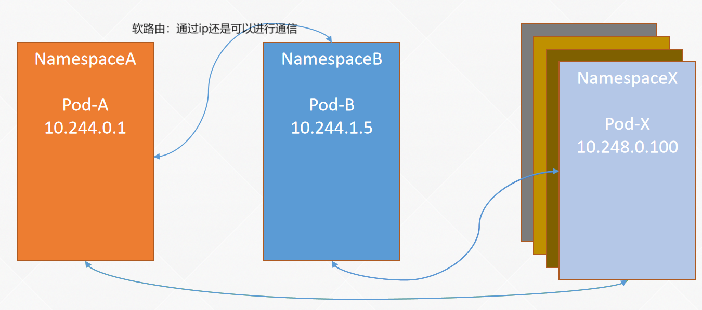
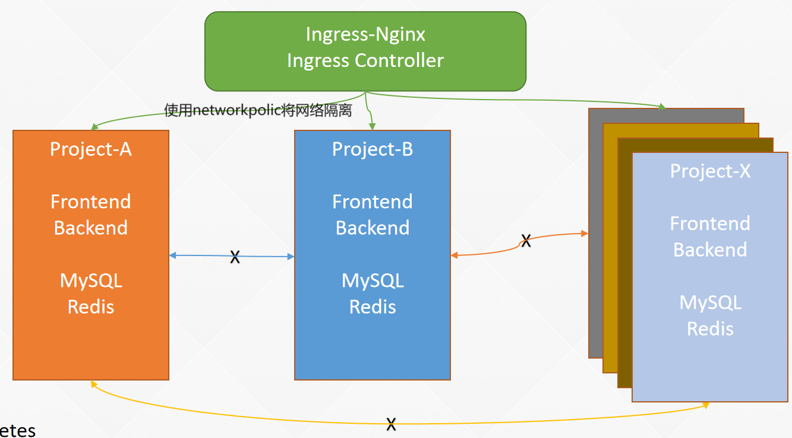

# NetworkPolicy网络策略

如果你希望针对 TCP、UDP 和 SCTP 协议在 IP 地址或端口层面控制网络流量， 则你可以考虑为集群中特定应用使用 Kubernetes 网络策略（NetworkPolicy）。 NetworkPolicy 是一种以应用为中心的结构，允许你设置如何允许 [Pod](https://kubernetes.io/zh-cn/docs/concepts/workloads/pods/) 与网络上的各类网络“实体” （我们这里使用实体以避免过度使用诸如“端点”和“服务”这类常用术语， 这些术语在 Kubernetes 中有特定含义）通信。 NetworkPolicy 适用于一端或两端与 Pod 的连接，与其他连接无关。

Pod 可以与之通信的实体是通过如下三个标识符的组合来辩识的：

1. 其他被允许的 Pod（例外：Pod 无法阻塞对自身的访问）
2. 被允许的名字空间
3. IP 组块（例外：与 Pod 运行所在的节点的通信总是被允许的， 无论 Pod 或节点的 IP 地址）

在定义基于 Pod 或名字空间的 NetworkPolicy 时， 你会使用[选择算符](https://kubernetes.io/zh-cn/docs/concepts/overview/working-with-objects/labels/)来设定哪些流量可以进入或离开与该算符匹配的 Pod。

另外，当创建基于 IP 的 NetworkPolicy 时，我们基于 IP 组块（CIDR 范围）来定义策略。





### NetworkPolic网络策略的使用

网络策略的配置示例：

```yaml
apiVersion: networking.k8s.io/v1
kind: NetworkPolicy
metadata:
  name: test-network-policy
  namespace: default
spec:
  podSelector:
    matchLabels:
      role: db
  policyTypes:
  - Ingress
  - Egress
  ingress:
  - from:
    - ipBlock:
        cidr: 172.17.0.0/16
        except:
        - 172.17.1.0/24
    - namespaceSelector:
        matchLabels:
          project: myproject
    - podSelector:
        matchLabels:
          role: frontend
    ports:
    - protocol: TCP
      port: 6379
  egress:
  - to:
    - ipBlock:
        cidr: 10.0.0.0/24
    ports:
    - protocol: TCP
      port: 5978
```

和其它资源一样，NetworkPolicy也需要apiVersion、kind和metadata字段，配置方法和其它资源类似，对于NetworkPolicy的策略配置，从Spec开始，下面对每个字段进行讲解：

Ø podSelector：表示该策略对哪些Pod生效。示例中配置的是role=db，代表该策略应用于该NetworkPolicy所在的Namespace（NetworkPolicy具有Namespace隔离性）下符合role=db的Pod上。如果该选项为空，则对该Namespace下所有的Pod生效。

Ø policyTypes：网络策略的类型。目前网络策略支持入站（Ingress）和出站（Egress）的规则配置，出站代表符合podSelector规则的Pod的出口流量限制，入站是其它Pod对符合podSelector规则的Pod的访问流量限制。如果未指定policyTypes，则默认为Ingress，如果未指定policyTypes，且有出口规则的话，也会配置Egress。

Ø ingress：如policyTypes所述，Ingress是对入口流量的管控。每个NetworkPolicy可以包含一个Ingress白名单列表，每个规则都允许匹配from和ports部分的流量。其中from表示访问来源，可以配置为ipBlock、namespaceSelector、podSelector，如果此项为空则表示匹配所有来源。另外一个ports表示可被访问的端口列表，如果此项为空则表示匹配所有端口。

Ø egress：如policyTypes所述，Egress是对出口流量的管控。同样，NetworkPolicy可以包含一个Egress白名单列表，不同的是Egress的可配置参数为to和ports。其中ports表示可以访问的目标端口，to表示可以访问的目的，也可以配置为ipBlock、namespaceSelector、podSelector。

Ø namespaceSelector：匹配具有指定标签的Namespace下的所有Pod。当前示例的ingress的from参数配置了namespaceSelector，表示匹配具有project=myproject标签的Namespace下的所有Pod。

Ø ipBlock：表示匹配的IP块，可以是单个IP，也可以是网段，同时也支持IPV6格式。Except为可选参数，表示从IPBlock排除一些地址。

根据上述的概念，就可以知道上面示例的含义如下：

Ø 隔离default命名空间下具有role=db标签的Pod；

Ø 允许IP地址范围为172.17.0.0–172.17.0.255 和 172.17.2.0–172.17.255.255访问default命名空间下具有role=db的Pod的6379且协议为TCP的端口；

Ø 允许具有project=myproject的Namespace下的所有Pod访问default命名空间下具有role=db的Pod的6379且协议为TCP的端口；

Ø 允许default命名空间（和NetworkPolicy同一命名空间）下具有role=frontend标签的Pod访问default命名空间下具有role=db的Pod的6379且协议为TCP的端口；

Ø 允许带有role=db标签的Pod可以访问10.0.0.0/24网段下的5978且协议为TCP的端口

### 网络策略注意事项

在配置网络策略时，有很多细节需要注意，比如上述的示例中，一段关于ingress的from配置：

```yaml
  - from:
    - ipBlock:
        cidr: 172.17.0.0/16
        except:
        - 172.17.1.0/24
    - namespaceSelector:
        matchLabels:
          project: myproject
    - podSelector:
        matchLabels:
          role: frontend
```

需要注意的是在ipBlock、namespaceSelector和podSelector前面都有一个“-”，如果前面没有这个横杠将是另外一个完全不同的概念。可以看一下下面的示例：

```yaml
  ingress:
  - from:
    - namespaceSelector:
        matchLabels:
          user: alice
      podSelector:
        matchLabels:
          role: client
```

此时的namespaceSelector有“-”，podSelector没有“-”，那此时的配置，代表的含义是允许具有user=alice标签的Namespace下，并且具有role=client标签的所有Pod访问，namespaceSelector和podSelector是且的关系。那我们继续看一下示例：

```yaml
  ingress:
  - from:
    - namespaceSelector:
        matchLabels:
          user: alice
    - podSelector:
        matchLabels:
          role: client
```

此时的namespaceSelector和podSelector都有“-”，配置的含义是允许具有user=alice标签的Namespace下的所有Pod和当前Namespace下具有role=client标签的Pod访问，namespaceSelector和podSelector是或的关系。

除了上述的差别外，在配置ipBlock时，可能也会出现差异性。因为我们在接收或者发送流量时，很有可能伴随着数据包中源IP和目标IP的重写，也就是SNAT和DNAT，此时会造成流量的目标IP和源IP与配置的ipBlock出现了差异性，造成网络策略不生效，所以在配置IPBlock时，需要确认网络交换中是否存在源目地址转换，并且IPBlock最好不要配置Pod的IP，因为Pod发生重建时，它的IP地址一般就会发生变更，所以IPBlock一般用于配置集群的外部IP。

### 示例1：隔离中间件服务

1) 有一个项目，它有自己数据库MySQL和缓存Redis中间件，我们只希望这个项目的应用能够访问该中间件
2) 假如有一个项目需要通过Ingress进行对外发布，我们想要除了Ingress外，其他任何Namespace下的Pod都不能访问该项目。

假设有一个项目叫nw-demo，里面部署了三个微服务，分别是MySQL、Redis和Nginx。现需要对MySQL、Redis、Nginx进行隔离，分别实现如下效果：

l MySQL、Redis只能被该Namespace下的Pod访问；

l Nginx可以被Ingress-nginx命名空间下的Pod和该Namespace下的Pod访问；

首先创建该项目所用的Namespace（如果已经存在，或者用其他Namespace测试，也可以不创建）：

```sh
# kubectl  create ns nw-demo
```

创建MySQL服务，MySQL以容器启动时，必须配置root的密码，或者设置密码为空，所以需要设置一个MYSQL_ROOT_PASSWORD的变量：

```sh
# kubectl create deploy mysql --image=registry.cn-beijing.aliyuncs.com/dotbalo/mysql:5.7.23 -n nw-demo
deployment.apps/mysql created
# 设置密码
# kubectl  set env deploy/mysql  MYSQL_ROOT_PASSWORD=mysql -n nw-demo
deployment.apps/mysql env updated
```

创建Redis服务：

```sh
# kubectl create deploy redis --image=registry.cn-beijing.aliyuncs.com/dotbalo/redis:5.0.9-alpine3.11 -n nw-demo
deployment.apps/redis created
```

确认容器是否启动：

```sh
# kubectl  get po -n nw-demo -owide
NAME                     READY   STATUS    RESTARTS   AGE         IP              NODE           NOMINATED NODE   READINESS GATES
mysql-69d6f69557-x9d2s   1/1     Running   0          <invalid>   172.25.92.93    k8s-master02   <none>           <none>
redis-c9fdb57d5-xxn9v    1/1     Running   0          6m30s       172.17.125.28   k8s-node01     <none>           <none>
```

在没有配置任何网络策略时，测试下网络的连通性，可以在任意Kubernetes节点上执行telnet命令：

```sh
[root@k8s-master01 ~]# telnet 172.25.92.93 3306
Trying 172.25.92.93...
Connected to 172.25.92.93.
Escape character is '^]'.
J
5.7.23.BhMU;.BiH1]D](m=mysql_native_password^CConnection closed by foreign host.
[root@k8s-master01 ~]# telnet 172.17.125.28 6379
Trying 172.17.125.28...
Connected to 172.17.125.28.
Escape character is '^]'.
^C^]
telnet> quit
Connection closed.
```

> 注意：本小节进行测试的IP和Pod名字可能与实际测试的不一致，需要与实际情况为准

可以看到此时的网络都是可以通信的。接下来可以根据Pod的标签进行网络隔离，首先查看一下Pod的标签：

```sh
# kubectl  get po -n nw-demo --show-labels
NAME                     READY   STATUS    RESTARTS   AGE    LABELS
mysql-69d6f69557-x9d2s   1/1     Running   0          109m   app=mysql,pod-template-hash=69d6f69557
redis-c9fdb57d5-xxn9v    1/1     Running   0          116m   app=redis,pod-template-hash=c9fdb57d5
```

然后根据标签配置网络策略，本示例的配置将MySQL和Redis进行了拆分，配置了两个网络策略，当然也可以给两个Pod配置一个相同的标签，这样就可以使用同一个网络策略进行限制。但是在生产环境中，并不推荐使用同一个网络策略，因为有时候需要更细粒度的策略，同一个网络策略可能会有局限性，也会导致配置失败，所以本示例采用分开的网络策略进行配置：

```yaml
# cat mysql-redis-nw.yaml 
apiVersion: networking.k8s.io/v1
kind: NetworkPolicy
metadata:
  name: mysql-np
  namespace: nw-demo
spec:
  podSelector:
    matchLabels:
      app: mysql
  policyTypes:
  - Ingress
  ingress:
  - from:
    - namespaceSelector:
        matchLabels:
          access-nw-mysql-redis: "true"
    ports:
    - protocol: TCP
      port: 3306
---
apiVersion: networking.k8s.io/v1
kind: NetworkPolicy
metadata:
  name: redis-np
  namespace: nw-demo
spec:
  podSelector:
    matchLabels:
      app: redis 
  policyTypes:
  - Ingress
  ingress:
  - from:
    - namespaceSelector:
        matchLabels:
          access-nw-mysql-redis: "true"
    ports:
    - protocol: TCP
      port: 6379
```

该yaml含有两个NetworkPolicy，其中mysql-np是对具有app=mysql标签的Pod进行管理，redis-np是对具有app=redis标签的Pod进行管理。但是需要注意的是该网络策略的ingress from是以namespaceSelector的标签进行匹配的，并非podSelector，或者是两者的结合。因为在生产环境中，同一个Namespace下可能会有很多不同类型、不同标签的Pod，并且它们可能并不具有一个相同的标签，所以如果通过podSelector进行选择，可能会比较麻烦，因为Pod一旦创建，对其标签的修改是很不方便的（apps/v1一旦创建就不可修改）。而使用namespaceSelector另一个好处是，可以很方便的对某个Namespace下的Pod进行管控，直接给指定Namespace添加标签即可，当然，如果需要更细粒度的管控，也可以结合podSelector使用。

​	接下来创建该NetworkPolicy：

```sh
# kubectl  create -f mysql-redis-nw.yaml -n nw-demo
networkpolicy.networking.k8s.io/mysql-np created
networkpolicy.networking.k8s.io/redis-np created
# kubectl  get networkpolicy -n nw-demo
NAME       POD-SELECTOR   AGE
mysql-np   app=mysql      23s
redis-np   app=redis      23s
```

创建后宿主机和任何Pod都已不能访问该Namespace下的MySQL和Redis：

```sh
# telnet 172.25.92.93 3306
Trying 172.25.92.93...
^C
# telnet 172.17.125.28 6379
Trying 172.17.125.28...
^C
```

在nw-demo命名空间下创建一个用于测试连通性的工具，然后进行测试，也是不能访问该服务的：

```sh
# kubectl  run -ti debug-tools --image=registry.cn-beijing.aliyuncs.com/dotbalo/debug-tools:latest -n nw-demo 
If you don't see a command prompt, try pressing enter.
(06:33 debug-tools:/) 
(06:34 debug-tools:/) curl 172.25.92.93:3306 --connect-timeout 3
curl: (28) Connection timed out after 3001 milliseconds
```

由于之前的from配置的是namespaceSelector，所以如果想要某一个Namespace下的Pod能够访问，直接给该Namespace添加一个NetworkPolicy中配置的标签即可，比如允许nw-demo命名空间下的所以Pod访问该NetworkPolicy隔离的服务：

```sh
# kubectl  label ns nw-demo access-nw-mysql-redis=true
namespace/nw-demo labeled
```

使用nw-demo命名空间下的debug-tools再次测试：

```sh
# kubectl  exec -ti debug-tools  -n nw-demo -- curl 172.25.92.93:3306
5.7.239ehm 
2ÿÿ󿿕+%qd`8tA'mysql_native_passwordot packets out of order
```

此时nw-demo下的Pod已经可以访问MySQL和Redis，可以对其他Namespace下的Pod进行测试，比如在default命名空间进行测试：

```sh
# kubectl  run -ti debug-tools --image=registry.cn-beijing.aliyuncs.com/dotbalo/debug-tools:latest -n default 
If you don't see a command prompt, try pressing enter.
(06:38 debug-tools:/) 
(130 06:38 debug-tools:/) curl 172.25.92.93:3306 --connect-timeout 3
curl: (28) Connection timed out after 3000 milliseconds
```

可以看到此时default命名空间下的Pod并不能访问nw-demo的服务，如果想要MySQL和Redis对default命名空间开放，只需要添加一个***\*access-nw-mysql-redis=true\****的标签即可。

相对于传统架构，对中间件的访问限制，在Kubernetes中实现同样的效果，可能配置更加方便且易于管理。

### 示例2：服务发布限制于Ingress

一般情况下，一个项目的服务发布，会把域名的根路径指向前端应用，接口路径指向对应的网关或者微服务。假设现在创建一个Nginx服务充当前端页面，配置网络策略只让Ingress Controller访问该应用：

```sh
# 创建应用
# kubectl  create deploy nginx --image=registry.cn-beijing.aliyuncs.com/dotbalo/nginx:latest -n nw-demo
# 暴露服务
# kubectl expose deploy nginx -n nw-demo --port=80
# 查看创建的服务
# kubectl  get svc,po -n nw-demo -l app=nginx
NAME            TYPE        CLUSTER-IP      EXTERNAL-IP   PORT(S)   AGE
service/nginx   ClusterIP   192.168.32.50   <none>        80/TCP    26s

NAME                         READY   STATUS    RESTARTS   AGE
pod/nginx-67d8d8bffb-spkx8   1/1     Running   0          26s
```

在没有任何网络策略的情况下，该服务可以被任何Pod访问：

```sh
# kubectl  exec debug-tools -- curl -Is nginx.nw-demo
HTTP/1.1 200 OK
...
# kubectl  -n nw-demo exec debug-tools -- curl -Is nginx.nw-demo
HTTP/1.1 200 OK
...
```

配置网络策略只让Ingress Controller访问该服务：

```yaml
# cat nginx-nw.yaml 
apiVersion: networking.k8s.io/v1
kind: NetworkPolicy
metadata:
  name: nginx-np
  namespace: nw-demo
spec:
  podSelector:
    matchLabels:
      app: nginx
  policyTypes:
  - Ingress
  ingress:
  - from:
    - namespaceSelector:
        matchLabels:
          app.kubernetes.io/name: ingress-nginx
      podSelector:
        matchLabels:
          "app.kubernetes.io/name": ingress-nginx
    - podSelector: {}
    ports:
    - protocol: TCP
      port: 80
```

> 注意：该条策略对具有app=nginx标签的Pod生效，只让具有app.kubernetes.io/name=ingress-nginx标签的Namespace下的具有app.kubernetes.io/name=ingress-nginx标签的Pod访问，同时还有一个允许当前Namespace下的Pod访问的策略***\*- podSelector: {}\****。需要注意的是，读者的集群中已经安装了相关Ingress，并且需要根据实际的标签进行更改，如果读者集群目前并未安装Ingress，可以完成Ingress的学习后，再来测试该实验。


创建该NetworkPolicy，并测试连通性：

```sh
# kubectl  create -f nginx-nw.yaml 
networkpolicy.networking.k8s.io/nginx-np created
# 没有被允许的命名空间无法访问
# kubectl  exec debug-tools -- curl --connect-timeout 2 -Is nginx.nw-demo 
command terminated with exit code 28
# 允许范围内的Pod可以访问
# kubectl  exec debug-tools -n nw-demo -- curl --connect-timeout 2 -Is nginx.nw-demo 
HTTP/1.1 200 OK
...
# kubectl  get po -n ingress-nginx -owide
NAME                                   READY   STATUS      RESTARTS   AGE    IP               NODE           NOMINATED NODE   READINESS GATES
ingress-nginx-admission-create-7fkc7   0/1     Completed   0          7d1h   172.25.92.83     k8s-master02   <none>           <none>
ingress-nginx-admission-patch-t8k9v    0/1     Completed   1          7d1h   172.17.125.27    k8s-node01     <none>           <none>
ingress-nginx-controller-vb4f4         1/1     Running     0          92s    10.103.236.205   k8s-node02     <none>           <none>

# kubectl exec  ingress-nginx-controller-vb4f4  -n ingress-nginx -- curl -Is nginx.nw-demo 
HTTP/1.1 200 OK
...
```

可以看到Ingress Controller和该Namespace下的Pod可以访问，其他Namespace不可以访问。此时可以创建一个Ingress，然后用域名测试：

```sh
# kubectl  create ingress nginx  --rule="testnp.com/*=nginx:80" -n nw-demo
# curl -H "Host:testnp.com" 10.103.236.205
...
<p><em>Thank you for using nginx.</em></p>
</body>
</html>
```

此时已经用NetworkPolicy实现了对该资源的访问限制。

