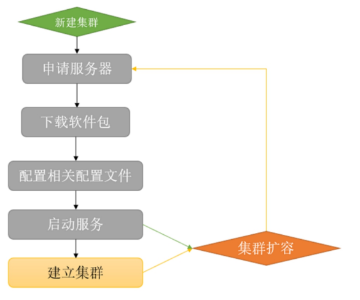
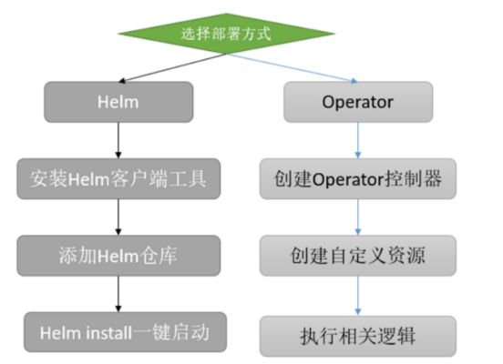
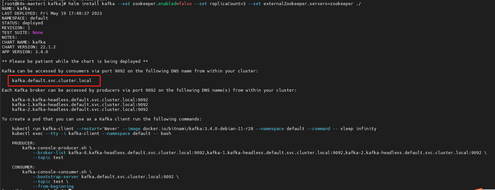

# 中间件容器化

通过前面的学习，我们基本掌握了Kubernetes的核心概念，相信读者已经能够部署一些比较简单的服务，同时也可以将公司的应用迁移至 Kubernetes。

但是在使用Kubernetes时，只部署一些简单的单体应用并非我们的最终目标。

在很多情况下，我们还需要将一些复杂的中间件部署到Kubernetes，比如Redis、RabbitMQ、Kafka、Zookeeper集群等。

由于这些应用比较复杂，并且搭建时涉及的资源文件比较多，因此使用传统的管理方式显得很麻烦，我 们需要一种简单的方式就可以部署、管理Kubernetes上的比较复杂的应用，在Kubernetes中，可以使用包管理工具Operator和Helm来管理比较复杂的中 间件，本章的内容就是使用Kubernetes包管理工具将比较复杂的中间件部署至Kubernetes。

## 传统架构如何管理中间件集群

使用Kubernetes部署中间件集群之前，我们先来回顾一下，在传统架构中是如何管理中间件集群的。

在传统架构中，管理一个中间件集群的流程大致如图

1）假设现在需要中间件集群，比如需要一个三主三从的Redis集群。

2）如果公司环境目前没有服务器，需要新申请3～6（有可能是复用之前的服务器搭建集群）台服务器用来部署Redis集群。

3）从Redis官方网站下载某个版本的Redis安装包，并且安装到每一台服务器上，同时可能每台服务器也需要做相关的优化配置，比如修改提升性能 的内核等。

4）进行每台服务器的Redis配置，如果是一台服务器部署两个Redis实例，可能还需要配置不同的端口号等。

传统架构管理中间件 

5）启动每台服务器上的Redis实例。

6）通过相关命令建立集群，当然有的中间件是没有此步骤的，可以直接通过相关配置文件直接建立集群。

7）如果集群想要添加节点，可能就需要重复2）～6）的步骤。

综上可知，在传统架构中想要搭建一个类似于Redis的中间件集群，其实是一件挺烦琐且非常具有重复性的事，并且由于服务器的环境不同，在安装 过程中可能还会遇到各种各样的问题，浪费很多时间和精力。

但是在Kubernetes中，可以利用Kubernetes的特性非常方便且迅速地启动一个对应的集群。接下来讲解如何在Kubernetes中部署相关的中间件。

# Operator

## Kubernetes如何管理中间件集群

在Kubernetes中，可以使用Kubernetes的包管理工具非常方便地搭建一个中间件集群，最为常用的包管理工具还是以Operator和Helm为主，首先我 们来简单看一下Operator和Helm的区别。

### Operator和Helm的区别

简而言之，包管理工具就是把相关文件的定义统一管理，然后可以很方便地通过这些工具管理比较复杂的应用，比如MyS?L集群、Redis集群等，实 现一键创建集群、扩容、备份等。当然，公司内开发的应用程序也可以通过Kubernetes的包管理工具进行管理，目前常用的两种包管理工具是Operator 和Helm，类似的还有Kustomize、CNAB等。

虽然Operator和Helm实现的功能类似，但是两者还是有很大的区别的。

Operator更倾向于管理复杂的有状态服务，比如MySQL集群、Redis集群、TiDB集群等，而Helm更倾向于管理无状态应用的部署，比如公司的服务、某 些不需要持久化数据的中间件、不需要实现额外功能的服务等。

如果读者之前使用Operator和Helm部署过一些服务，就会知道很多中间件的部署都有Helm和Operator两种方式可以选择，比如RabbitMQ可以通过Helm部署，也可以通过Operator部署。读者可能会有一些疑惑，既然功能类似，为何还要大费周章地重复“造轮子”呢？

前文提到过，Helm适合部署不需要额外功能的服务，这里提到的额外功能有备份、回滚以及更高级的用法。

如果想要实现这些逻辑，使用Helm不容易实现，或者无法实现，而Operator可以通过代码来实现相关的逻辑，这也是为什么**Operator更倾向于管理更为复杂的服务。**

另外，还有一个很大的区别，就是两种工具的实现难度是不一样的。

比如自己写一个Helm的Chart（Helm包的名称叫Chart），只需要将相关的模板文件放在Chart的templates目录， 然后抽离相关的配置， 放置于 values.yaml，模板文件通过go template语法即可生成相关的资源文件并加载到Kubernetes中。

而Operator需要自己动手编写一个控制器，这个控制器可以解析自己定义的CRD（Custom Resource Define，自定义资源类型），然 后生成相关的资源文件并加载到Kubernetes中。想要实现上述所讲的备份、回滚等功能，也需要自己编写相应的代码实现。

所以Operator需要一定的开发能力，可以用Golang、Java等语言。

在实际使用时，两者没有最佳选择，只有更合适的选择。

比如想要搭建某个流行的中间件集群（比如Redis集群），我们不需要从头开始写一个Redis集群的Operator或者Helm的Chart。

因为像Redis这样比较流行的中间件，官方或者第三方平台（比如Bitnami）已经为我们提供了一些非常好用且 功能齐全的Operator或者Helm Chart，直接使用即可。

在企业内部编写Operator或者Helm Chart大部分都是基于公司自己的业务系统展开的（当然，一些公司也会为开源项目做出自己的贡献，也会为中间件编写相应的 Operator，比如UCloud提供的Redis Cluster Operator也是非常好用的），比如公司的某个产品，可以一键式部署或者迁移等。

**而像这类一键式搭建业务系统的需求，编写Helm要比Operator简单很多，但是如果想要实现更多、更复杂的逻辑，Operator可能更为合适。**

### Kubernetes管理中间件集群的流程

之前我们已经介绍了传统架构管理中间件集群的流程，接下来介绍Kubernetes是如何利用包管理工具来管理中间件集群的。

无论是选择Helm还是Operator来管理中间件，都是非常简单的。Helm和Operator管理中间件的流程如图



比如使用Helm管理中间件集群的流程如下：

1）首先集群中需要有一个Helm的客户端，用来执行增删改查命令，和Kubectl类似。

2）之后需要找到对应的Chart（可以在中间件的官网或者GitHub中查找），比如安装Redis、Zookeeper集群的包。这个包和镜像类似，都是放在 一个仓库中，镜像放在镜像仓库，Chart放在Chart仓库。

3）如果是新建集群，只需要执行helm install命令即可一键式创建该集群。如果想要更新配置，直接使用helm upgrade即可。

使用Operator管理中间件的流程如下：

1）相对于Helm需要安装单独的客户端工具，Operator不需要单独的客户端工具，使用kubectl即可。所以第一步就是找到对应的Operator（和Helm类 似，可以在GitHub或者其官方网站上查找）。

2）创建对应的控制器，用来解析一些自定义资源逻辑的程序。

3）之后创建自定义资源即可，对应的控制器会解析自定义资源实现相关功能，比如创建集群、扩容、备份等。

由此看来，Helm和Operator可以很方便地实现中间件集群的管理和维护。接下来我们通过几个简单的例子实践一下Helm和Operator的使用。

# 3. Operator的使用

## 3.1 使用Operator安装Redis集群

本小节演示的Operator是由UCloud开源的一个项目。

项目地址

https://github.com/ucloud/redis-cluster-operator，

接下来根据前文提到的流程创建一个具有6个实例的Redis集群。

首先需要下载该项目至服务器：

```
$ git clone https://github.com/ucloud/redis-cluster-operator.git
$ cd redis-cluster-operator
```


之后创建对应的CRD，然后就可以通过这些CRD声明一个创建Redis集群的YAML文件：

```
$ kubectl create -f deploy/crds/redis.kun_distributedredisclusters_crd.yaml
$ kubectl create -f deploy/crds/redis.kun_redisclusterbackups_crd.yaml
```

假设需要将Redis集群部署至redis-cluster命名空间，需要先创建redis-cluster命名空间和对应的一些权限，并且将Operator控制器安装至该 命名空间：

```
$ kubectl create ns redis-cluster
$ kubectl create -f deploy/service_account.yaml -n redis-cluster
$ kubectl create -f deploy/namespace/role.yaml -n redis-cluster
$ kubectl create -f deploy/namespace/role_binding.yaml -n redis-cluster
$ kubectl create -f deploy/namespace/operator.yaml -n redis-cluster
```

查看Redis Operator的Pod状态：

```
$ kubectl get pod -n redis-cluster
NAME                                      READY   STATUS    RESTARTS   AGE
redis-cluster-operator-675ccbc697-c6m2t   1/1     Running   0          37s
```

接下来通过一个自定义类型的YAML文件一键式启动一个三主三从的节点，在启动之前先来看一下这个文件的内容：

```
$ cat deploy/example/redis.kun_v1alpha1_distributedrediscluster_cr.yaml
apiVersion: redis.kun/v1alpha1
kind: DistributedRedisCluster
metadata:
  annotations:
    # if your operator run as cluster-scoped, add this annotations
    #redis.kun/scope: cluster-scoped
  name: example-distributedrediscluster
spec:
  # Add fields here
  masterSize: 3
  clusterReplicas: 1
  image: redis:5.0.4-alpine
```


注意看该文件的kind和apiVersion，在标准的Kubernetes中，是没有apiVersion为redis.kun/v1alpha1、kind为DistributedRedisCluster这种类 型的资源的。

我们常用的是类似于Deployment、StatefulSet的资源，这种不属于原生资源的资源称为自定义资源类型（Custom Resource Definition， CRD )。

上述是通过命令`kubectl create -f deploy/crds/redis.kun_distributedredisclusters_crd.yaml`创建了“扩展资源类型”。

继续看该文件的spec定义，也是和原生的资源定义有所不同，所以标准Kubernetes解析不了该类型的资源，该类型的资源创建后，由Redis Operator负责解析。接下来看一下这段YAML代码具体的含义：

- masterSize：新建的Redis集群有几个主节点。
- clusterReplicas：每个主节点有几个从节点。
- image：该集群使用哪个镜像。

注意

由于我们创建的是命名空间基本的Operator，因此需要将annotations的redis.kun/scope:cluster-scoped注释掉。

在明白其配置含义后，通过一条命令即可创建一个Redis集群：

```
$ kubectl create -f deploy/example/redis.kun_v1alpha1_distributedrediscluster_cr.yaml -n redis-cluster
distributedrediscluster.redis.kun/example-distributedrediscluster created
```


创建完成后，可以通过查看自定义distributedrediscluster资源的状态来判断Redis集群是否完成了初始化：

```
$ kubectl get distributedrediscluster -n redis-cluster
NAME                              MASTERSIZE   STATUS    AGE
example-distributedrediscluster   3            Scaling   42s
```

此时也可以查看Pod的状态，虽然都是正常状态，但是由于没有完成槽的分配，因此当前集群还是不可用的状态：


```
$ kubectl get pod -n redis-cluster -w
NAME                                      READY   STATUS    RESTARTS   AGE
drc-example-distributedrediscluster-0-0   1/1     Running   0          7m3s
drc-example-distributedrediscluster-0-1   1/1     Running   0          6m3s
drc-example-distributedrediscluster-1-0   1/1     Running   0          7m3s
drc-example-distributedrediscluster-1-1   1/1     Running   0          6m23s
drc-example-distributedrediscluster-2-0   1/1     Running   0          7m3s
drc-example-distributedrediscluster-2-1   1/1     Running   0          6m23s
redis-cluster-operator-675ccbc697-c6m2t   1/1     Running   0          14m
```

当状态由Scaling变成了Healthy（此过程可能需要30分钟左右的时间），即表示Redis集群已经创建完成，并完成了槽的配置，此时已经可以正 常使用：


```
$ kubectl get distributedrediscluster -n redis-cluster
NAME                              MASTERSIZE   STATUS    AGE
example-distributedrediscluster   3            Healthy   7m7s
```

在创建Redis集群后，会创建如下几个Service：

```
$ kubectl get svc -n redis-cluster
NAME                                TYPE        CLUSTER-IP      EXTERNAL-IP   PORT(S)              AGE
example-distributedrediscluster     ClusterIP   10.104.160.70   <none>        6379/TCP,16379/TCP   7m52s
example-distributedrediscluster-0   ClusterIP   None            <none>        6379/TCP,16379/TCP   7m52s
example-distributedrediscluster-1   ClusterIP   None            <none>        6379/TCP,16379/TCP   7m52s
example-distributedrediscluster-2   ClusterIP   None            <none>        6379/TCP,16379/TCP   7m52s
redis-cluster-operator-metrics      ClusterIP   10.101.25.137   <none>        8383/TCP,8686/TCP    14m
```

其中example-distributedrediscluster为程序端用来操作Redis集群的Service名称，可以通过redis://example-distributedrediscluster.redis-cluster:6379链接至该集群。

接下来我们可以使用任意具有Redis客户端工具的Pod进行连接测试，比如使用drc-example-distributedrediscluster-0-0这个Pod进行测试，首先 登录至该Pod（由于Redis客户端和Redis集群是同一个Namespace，因此.redis-cluster可以省略）：

```
$ kubectl exec -it drc-example-distributedrediscluster-0-0 -n redis-cluster -- sh
/data # redis-cli -h example-distributedrediscluster
example-distributedrediscluster:6379> info
.....

# Replication
role:slave
master_host:10.0.14.130
master_port:6379
master_link_status:up
master_last_io_seconds_ago:10
master_sync_in_progress:0
slave_repl_offset:728
slave_priority:100
slave_read_only:1
connected_slaves:0
master_replid:a303475b201463f9c7476f9356f73fb5511b8e57
master_replid2:0000000000000000000000000000000000000000
master_repl_offset:728
second_repl_offset:-1
repl_backlog_active:1
repl_backlog_size:1048576
repl_backlog_first_byte_offset:1
repl_backlog_histlen:728
```

使用redis-cli连接到Redis集群后，可以执行Redis的相关命令查看一些信息，在此不再演示，有兴趣的读者可以自行查找学习。接下来我们进行数 据的写入。

请注意框内的提示，我们在执行set命令时，Redis抛出一个异常MOVED，这就是Redis集群的机制，了解过Redis集群架构的读者 可能有所了解。

Redis集群采用分片机制，每个数据插入时会选择一个对应的槽存放数据，如果该槽位不在这个已经连接的实例上，就需要进行“下一 跳”，也就是会连接到具有该槽位的节点上，再写入数据，当然如果该槽位正好位于正在连接的这个实例上，就会直接写入数据。

```
/data # redis-cli -h example-distributedrediscluster
example-distributedrediscluster:6379> set a 1
(error) MOVED 15495 10.0.20.225:6379
```

接下来连接到10.0.20.225:6379这个实例上，尝试写入数据

```
/data # redis-cli -h 10.0.20.225
10.0.20.225:6379> set a 1
OK
10.0.20.225:6379> get a
"1"
10.0.20.225:6379> quit
/data #
```

可以看到当连接至172.27.14.202节点时，就可以设置key为a的值，当查看a的值的时候，也能直接返回结果，当然如果连接的不是10.0.20.225这 个实例，也是返回MOVED错误。

由于Redis集群的这种机制，因此在Kubernetes集群外部的客户端无法正常使用Kubernetes中的Redis集群，因为在它需要MOVED时，会返回一个Pod的 IP，这个IP为Kubernetes内部IP，标准的Kubernetes不会让外部网络和其直接通信，如果需要集群外部连接至Kubernetes内部的Redis集群，可以采用 Redis集群的代理工具进行解决，有兴趣的读者可以自行尝试。

但是生产环境的Redis集群一般不会直接暴露在外，这也是一种安全的手段，非生产环境采用单示例的Redis即可满足需要，单示例的Redis是没有此类问题的，可以直接通过NodePort类型的Service进行连接。

> 注意 以上演示的集群安装并没有进行Redis集群数据的持久化，如果想要持久化数 据 ， 需要有StorageClass的支持，提供动态存储。
>
> 之后使用deploy/example/persistent.yaml文件创建具有持久化数据的Redis集群，只需要修改class字段为集群内块存储的StorageClass名字即可，size按需修改。当然，不要忘记注释redis.kun/scope: cluster-scoped字段。

## 3.2 Redis集群一键扩容

上一小节通过Operator很方便、迅速地搭建了一个Redis集群，接下来介绍如何通过Operator完成一键式集群扩容。

前面提到过自定义资源的配置，有一个参数为masterSize: 3，该参数决定了该集群一共有多少个Master节点，clusterReplicas参数决定了每个 Master节点有几个从节点，如果想要扩容该集群，只需要更改这两个参数即可。

比如将集群扩容为具有4个Master节点的集群：

```
$ grep "master" deploy/example/redis.kun_v1alpha1_distributedrediscluster_cr.yaml
  masterSize: 4

$ kubectl replace -f deploy/example/redis.kun_v1alpha1_distributedrediscluster_cr.yaml -n redis-cluster
distributedrediscluster.redis.kun/example-distributedrediscluster replaced
```

再次查看Pod，会发现创建了两个新的Pod：

```
$ kubectl get pod -n redis-cluster
NAME                                      READY   STATUS    RESTARTS   AGE
drc-example-distributedrediscluster-0-0   1/1     Running   0          54m
drc-example-distributedrediscluster-0-1   1/1     Running   0          53m
drc-example-distributedrediscluster-1-0   1/1     Running   0          54m
drc-example-distributedrediscluster-1-1   1/1     Running   0          53m
drc-example-distributedrediscluster-2-0   1/1     Running   0          54m
drc-example-distributedrediscluster-2-1   1/1     Running   0          53m
drc-example-distributedrediscluster-3-0   1/1     Running   0          2m37s
drc-example-distributedrediscluster-3-1   1/1     Running   0          97s
redis-cluster-operator-675ccbc697-c6m2t   1/1     Running   0          61m
```

此时集群的状态又会变成Scaling然后变成Healthy状态：

```
$ kubectl get distributedredisclusters -n redis-cluster
NAME                              MASTERSIZE   STATUS    AGE
example-distributedrediscluster   4            Healthy   55m
```

------

注意

> 在扩容和缩容的过程中，Redis集群是不可用状态，所以最好在非业务时间段进行扩容。Redis集群的可用性测试和创建小节一致， 此处不再演示。

## 3.3 集群清理

如果只是用来测试和学习，在操作完成后可以清理该集群，清理步骤较传统架构简单，只需要将安装的create改成delete即可：

```
$ kubectl delete -f deploy/example/redis.kun_v1alpha1_distributedrediscluster_cr.yaml -n redis-cluster
$ kubectl delete -f deploy/cluster/operator.yaml -n redis-cluster
$ kubectl delete -f deploy/cluster/cluster_role_binding.yaml -n redis-cluster
$ kubectl delete -f deploy/cluster/cluster_role -n redis-cluster
$ kubectl delete -f deploy/service_account.yaml -n redis-cluster
$ kubectl delete -f deploy/crds/redis.kun_redisclusterbackups_crd.yaml -n redis-cluster
$ kubectl delete -f deploy/crds/redis.kun_distributedredisclusters_crd.yaml -n redis-cluster
$ kubectl delete ns redis-cluster
```

如果以后不需要再创建Redis集群，可以把CRD也删除：

```
$ kubectl delete -f deploy/crds/redis.kun_distributedredisclusters_crd.yaml
$ kubectl delete -f deploy/crds/redis.kun_redisclusterbackups_crd.yaml
```


# [Helm](https://helm.sh/zh/)

​	Helm是一个k8s应用编排工具，它允许你轻松管理和部署Kubernetes应用程序。Helm通过使用称为Charts的预定义模板来简化Kubernetes应用程序的部署和管理。Chart包含了一组Kubernetes对象定义，可以描述一个应用程序的完整部署和资源需求，包括Deployment、Service、ConfigMap、Secret等。使用Helm，你可以轻松地安装、升级、卸载和回滚Kubernetes应用程序。

​	同时，Helm还提供了一些便捷的功能，如依赖管理、全局变量、条件渲染等，可以帮助你更好地管理应用程序的部署。Helm有两个主要的组件：Helm客户端（helm）和Helm服务器（Tiller）。Helm客户端可以在本地运行，而Tiller则运行在Kubernetes集群中，并负责将Charts转换为Kubernetes对象。

**安装**

> [Helm下载地址](https://github.com/helm/helm/releases)： 每个Helm [版本](https://github.com/helm/helm/releases)都提供了各种操作系统的二进制版本，这些版本可以手动下载和安装。

1. 解压(`tar -zxvf helm-v3.0.0-linux-amd64.tar.gz`)

2. 在解压目录中找到`helm`程序，移动到需要的目录中(`mv linux-amd64/helm /usr/local/bin/helm`)

3. 添加仓库: 

   ```sh
   helm repo add bitnami https://charts.bitnami.com/bitnami
   ```

4. 验证安装: `helm help`.

**重要概念**

- ***Chart*** 代表着 Helm 包。它包含在 Kubernetes 集群内部运行应用程序，工具或服务所需的所有资源定义。你可以把它看作是 Homebrew formula，Apt dpkg，或 Yum RPM 在Kubernetes 中的等价物。

- ***Repository**（仓库）* 是用来存放和共享 charts 的地方。它就像 Perl 的 [CPAN 档案库网络](https://www.cpan.org/) 或是 Fedora 的 [软件包仓库](https://src.fedoraproject.org/)，只不过它是供 Kubernetes 包所使用的。

- ***Release*** 是运行在 Kubernetes 集群中的 chart 的实例。一个 chart 通常可以在同一个集群中安装多次。每一次安装都会创建一个新的 *release*。以 MySQL chart为例，如果你想在你的集群中运行两个数据库，你可以安装该chart两次。每一个数据库都会拥有它自己的 *release* 和 *release name*。


## 使用charts

### 4.1 搜索 charts

Helm 自带一个强大的搜索命令，可以用来从两种来源中进行搜索：

- `helm search hub` 从 [Artifact Hub](https://artifacthub.io/) 中查找并列出 helm charts。 Artifact Hub中存放了大量不同的仓库。
- `helm search repo` 从你添加（使用 `helm repo add`）到本地 helm 客户端中的仓库中进行查找。该命令基于本地数据进行搜索，无需连接互联网。

```sh
[root@k8s-node1 ~]# helm search repo nginx
NAME                                    CHART VERSION   APP VERSION     DESCRIPTION
bitnami/nginx                           16.0.6          1.25.5          NGINX Open Source is a web server that can be a...
bitnami/nginx-ingress-controller        11.1.1          1.10.1          NGINX Ingress Controller is an Ingress controll...
.......
```

### 安装helm应用

使用 `helm install` 命令来安装一个新的 helm 包。最简单的使用方法只需要传入两个参数：你命名的release名字和你想安装的chart的名称。

```shell
[root@k8s-node1 ~]# helm install nginx bitnami/nginx -n test
NAME: nginx
LAST DEPLOYED: Wed Apr  5 07:18:04 2023
NAMESPACE: kube-system
STATUS: deployed
REVISION: 1
TEST SUITE: None
NOTES:
CHART NAME: nginx
CHART VERSION: 13.2.34
APP VERSION: 1.23.4

** Please be patient while the chart is being deployed **
NGINX can be accessed through the following DNS name from within your cluster:

    nginx.kube-system.svc.cluster.local (port 80)

To access NGINX from outside the cluster, follow the steps below:

1. Get the NGINX URL by running these commands:

  NOTE: It may take a few minutes for the LoadBalancer IP to be available.
        Watch the status with: 'kubectl get svc --namespace kube-system -w nginx'

    export SERVICE_PORT=$(kubectl get --namespace kube-system -o jsonpath="{.spec.ports[0].port}" services nginx)
    export SERVICE_IP=$(kubectl get svc --namespace kube-system nginx -o jsonpath='{.status.loadBalancer.ingress[0].ip}')
    echo "http://${SERVICE_IP}:${SERVICE_PORT}"
```

>  注意: 安装chart时创建了一个新的 *release* 对象。上述发布被命名为 `nginx`。 （如果想让Helm生成一个名称，删除发布名称并使用`--generate-name`。）

helm 安装顺序: https://helm.sh/zh/docs/intro/using_helm/

---

### 查看列表

你可以通过 `helm list` 命令看到当前部署的所有 release：

```shell
[root@k8s-node1 ~]# helm list
NAME    NAMESPACE       REVISION        UPDATED                                 STATUS          CHART           APP VERSION
nginx   kube-system     1               2023-04-05 07:34:48.421708425 -0400 EDT deployed        nginx-13.2.34   1.23.4 
```

### 查看状态

你可以使用 `helm status` 来追踪 release 的状态，或是重新读取配置信息：

```shell
[root@k8s-node1 ~]# helm status nginx
NAME: nginx
LAST DEPLOYED: Wed Apr  5 07:18:04 2023
NAMESPACE: kube-system
STATUS: deployed
REVISION: 1
TEST SUITE: None
NOTES:
CHART NAME: nginx
CHART VERSION: 13.2.34
APP VERSION: 1.23.4

** Please be patient while the chart is being deployed **
NGINX can be accessed through the following DNS name from within your cluster:

    nginx.kube-system.svc.cluster.local (port 80)

To access NGINX from outside the cluster, follow the steps below:

1. Get the NGINX URL by running these commands:

  NOTE: It may take a few minutes for the LoadBalancer IP to be available.
        Watch the status with: 'kubectl get svc --namespace kube-system -w nginx'

    export SERVICE_PORT=$(kubectl get --namespace kube-system -o jsonpath="{.spec.ports[0].port}" services nginx)
    export SERVICE_IP=$(kubectl get svc --namespace kube-system nginx -o jsonpath='{.status.loadBalancer.ingress[0].ip}')
    echo "http://${SERVICE_IP}:${SERVICE_PORT}"
```

### 卸载

```shell
[root@k8s-node1 ~]# helm uninstall nginx
release "nginx" uninstalled
```


# Helm目录层级

[Helm模板指南](https://helm.sh/zh/docs/chart_template_guide/getting_started/)

```yaml
├── charts # 依赖文件
├── Chart.yaml # 存放chart的版本信息
├── templates # 模板
│   ├── deployment.yaml
│   ├── _helpers.tpl # 自定义的模板或者函数
│   ├── ingress.yaml
│   ├── NOTES.txt 	# chart的"帮助文本"。这会在你的用户执行helm install时展示给他们。
│   ├── serviceaccount.yaml
│   ├── service.yaml
│   └── tests
│       └── test-connection.yaml
└── values.yaml #配置全局变量或者一些参数
```

# Helm自定义 Chart

很多时候，我们需要自定义 chart 来指定我们想要的配置。创建一个名为`mychart`的chart，然后会在chart中创建一些模板。

```sh
$ helm create mychart
```

## 5.3 自定义模板

```shell
$ rm -rf mychart/templates/*
```

- 编写 namespace.yaml

```yaml
apiVersion: v1
kind: Namespace
metadata:
  name: {{ .Chart.Name }}
  namespace: {{ .Values.namespace }}
```

- 编写 deployment.yml

```yaml
apiVersion: apps/v1
kind: Deployment
metadata:
  name: {{ .Chart.Name}}
  namespace: {{.Values.namespace}}
  labels:
    app: {{ .Chart.Name}}
spec:
  replicas: {{ .Values.replicas }}
  template:
    metadata:
      name: {{ .Chart.Name}}
      labels:
        app: {{ .Chart.Name}}
    spec:
      containers:
        - name: {{ .Chart.Name}}
          image: {{ .Values.image}}
          imagePullPolicy: {{.Values.imagePullPolicy}}
          ports:
            - containerPort: {{.Values.containerPort}}
      restartPolicy: {{ .Values.restartPolicy }}
  selector:
    matchLabels:
      app: {{ .Chart.Name}}
```

- 编写 service.yml

```yaml
apiVersion: v1
kind: Service
metadata:
  name: {{.Chart.Name}}
  namespace: {{.Values.namespace}}
spec:
  selector:
    app: {{.Chart.Name}}
  ports:
    - port: {{.Values.service.port}}
      targetPort: {{.Values.containerPort}}
  type: {{ .Values.service.type }}
```

- 编写 Chart.yml

```yaml
apiVersion: v2
name: app
description: A Helm chart for Kubernetes
# A chart can be either an 'application' or a 'library' chart.
#
# Application charts are a collection of templates that can be packaged into versioned archives
# to be deployed.
#
# Library charts provide useful utilities or functions for the chart developer. They're included as
# a dependency of application charts to inject those utilities and functions into the rendering
# pipeline. Library charts do not define any templates and therefore cannot be deployed.
type: application

# This is the chart version. This version number should be incremented each time you make changes
# to the chart and its templates, including the app version.
# Versions are expected to follow Semantic Versioning (https://semver.org/)
version: 0.1.0

# This is the version number of the application being deployed. This version number should be
# incremented each time you make changes to the application. Versions are not expected to
# follow Semantic Versioning. They should reflect the version the application is using.
# It is recommended to use it with quotes.
appVersion: "1.16.0"
```

- 编写 values.yaml

```yml
replicas: 1
namespace: app
image: nginx:1.19
imagePullPolicy: IfNotPresent
restartPolicy: Always
containerPort: 80

service:
  port: 80
  type: ClusterIP
```

##  打包自定义 chart

验证是否存在错误

```shell
$ helm lint app
```

打包自定义 chart

```shell
$ helm package app
```

安装 chart

```shell
$ helm install app myapp-1.tgz
```


# 示例：部署 zookeeper+kafka 集群

安装方式有两种，在线安装和离线安装，在线安装方便快捷，但是无法修改参数。由于需要修改配置，故本文采用离线安装方式。

## 在线安装zookeeper+kafka集群

**1. 部署zookeeper集群**

```sh
helm install zookeeper bitnami/zookeeper \
  --set replicaCount=3 \
  --set auth.enabled=false \
  --set allowAnonymousLogin=true
```


> 提示：由于这个ApacheZookeeper集群不会公开，所以在部署时禁用了身份验证。对于生产环境，请考虑使用生产配置。
>
> 生产环境参考：https://github.com/bitnami/charts/tree/main/bitnami/zookeeper#production-configuration

**2. 部署kafka集群**

```sh
helm install kafka bitnami/kafka \
  --set zookeeper.enabled=false \
  --set replicaCount=3 \
  --set externalZookeeper.servers=ZOOKEEPER-SERVICE-NAME    # ZOOKEEPER-SERVICE-NAME  替换为上一步结束时获得的Apache ZOOKEEPER服务名称
```


## 离线安装zookeeper+kafka集群

由于在线安装，zookeeper的pod起不来，一直处于pending的状态，原因是因为pvc存储卷挂载的问题，所以这里选择把zookeeper和kafka的包下载下来，修改配置文件，然后进行离线安装。

我这里将zookeeper和kafka安装在default命名空间下，如果您想按在指定namespace下，命令后加`-n [namespace] `就可以了。

**1. 下载离线包**

```sh
# 创建存放压缩包目录
mkdir /bsm/zookeeper-kafka && cd /bsm/zookeeper-kafka

# 拉取压缩包
helm pull bitnami/zookeeper
helm pull bitnami/kafka

# 解压
tar -zvxf kafka-22.1.2.tgz
tar -zvxf zookeeper-11.4.1.tgz
```

### 修改zookeeper配置

根据需要修改配置文件`values.yaml`

主要修改内容：enabled设为false ；注释掉 storageClass: “”、existingClaim: “”

```yaml
cd /bsm/zookeeper-kafka/zookeeper  
vim values.yaml

# 修改配置文件，主要修改存储storageclass（kafka的配置文件类似）
persistence:
  ## @param persistence.enabled Enable ZooKeeper data persistence using PVC. If false, use emptyDir
  ##
  enabled: false    # 测试环境可设置为false
  ## @param persistence.existingClaim Name of an existing PVC to use (only when deploying a single replica)
  ##
#  existingClaim: ""
  ## @param persistence.storageClass PVC Storage Class for ZooKeeper data volume
  ## If defined, storageClassName: <storageClass>
  ## If set to "-", storageClassName: "", which disables dynamic provisioning
  ## If undefined (the default) or set to null, no storageClassName spec is
  ##   set, choosing the default provisioner.  (gp2 on AWS, standard on
  ##   GKE, AWS & OpenStack)
  ##
#  storageClass: ""      # 注释掉storageClass。如果创建好了storageclass可打开注释，并写入storageClass的名称
```

### 安装zookeeper集群

```sh
cd  /bsm/zookeeper-kafka/zookeeper
helm install zookeeper --set replicaCount=3 --set auth.enabled=false --set allowAnonymousLogin=true ./
# ./ 表示zookeeper的value.yaml文件所在路径
```


查看pod状态：

```sh
[root@k8s-master1 rabbitmq]# kubectl get pods
NAME                                      READY   STATUS    RESTARTS   AGE
zookeeper-0                               1/1     Running   0          85s
zookeeper-1                               1/1     Running   0          85s
zookeeper-2                               1/1     Running   0          84s
```

### 修改kafka配置

**修改配置文件`values.yaml`**
主要修改内容：enabled设为false ；注释掉 storageClass: “”、existingClaim: “”；kraft.enable 修改为 false

```
cd /bsm/zookeeper-kafka/kafka
vim values.yaml
```

修改一：

```
persistence:
  ## @param persistence.enabled Enable Kafka data persistence using PVC, note that ZooKeeper persistence is unaffected
  ##
  enabled: false    #改为false
  ## @param persistence.existingClaim A manually managed Persistent Volume and Claim
  ## If defined, PVC must be created manually before volume will be bound
  ## The value is evaluated as a template
  ##
#  existingClaim: ""
  ## @param persistence.storageClass PVC Storage Class for Kafka data volume
  ## If defined, storageClassName: <storageClass>
  ## If set to "-", storageClassName: "", which disables dynamic provisioning
  ## If undefined (the default) or set to null, no storageClassName spec is
  ## set, choosing the default provisioner.
  ##
#  storageClass: ""
  ## @param persistence.accessModes Persistent Volume Access Modes
```

修改二：

```
  kraft:
  ## @param kraft.enabled Switch to enable or disable the Kraft mode for Kafka
  ##
  enabled: false    #改为false
  ## @param kraft.processRoles Roles of your Kafka nodes. Nodes can have 'broker', 'controller' roles or both of them.
  ##
  processRoles: broker,controller
```


### 安装 kafka 集群

```
cd  /bsm/zookeeper-kafka/kafka
helm install kafka --set zookeeper.enabled=false --set replicaCount=3 --set externalZookeeper.servers=ZOOKEEPER-SERVICE-NAME ./      
# ZOOKEEPER-SERVICE-NAME  替换为上一步结束时获得的Apache ZOOKEEPER服务名称
# ./ 表示kafka的value.yaml文件所在路径
```


查看：

```sh
[root@k8s-master1 kafka]# kubectl get pods 
NAME                                      READY   STATUS    RESTARTS   AGE
kafka-0                                   1/1     Running   0          3m58s
kafka-1                                   1/1     Running   0          3m58s
kafka-2                                   1/1     Running   0          3m58s
```

> 报错：Error: INSTALLATION FAILED: execution error at (kafka/templates/NOTES.txt:314:4):
>
> VALUES VALIDATION:
>
> kafka: Kraft mode
>
> You cannot use Kraft mode and Zookeeper at the same time. They are mutually exclusive. Disable zookeeper in ‘.Values.zookeeper.enabled’ and delete values from ‘.Values.externalZookeeper.servers’ if you want to use Kraft mode
>
> 原因：新版kafka新增了一个kraft模式，他与zookeeper是冲突的，不能同时使用，所以如果使用指定的zookeeper，kraft模式要关闭。
>
> 解决办法：修改kafka的配置文件“value.yaml”，将 kraft.enable 的值改为false


## 三、验证kafka与zookeeper是否绑定

查看kafka日志中有以下信息：

```
kubectl logs -f kafka-0  | grep socket
```


## 四、测试集群


进入kafka的pod创建一个topic

```sh
[root@k8s-master1 kafka]# kubectl exec -it kafka-0 bash
I have no name!@kafka-0:/$ kafka-topics.sh --create --bootstrap-server localhost:9092 --replication-factor 1 --partitions 1 --topic testtopic
heCreated topic testtopic.
```

启动一个消费者

```sh
[root@k8s-master1 ~]# kubectl exec -it kafka-0 bash
I have no name!@kafka-0:/$ kafka-console-consumer.sh --bootstrap-server localhost:9092 --topic testtopic
```

新开一个窗口，进入kafka的pod，启动一个生产者，输入消息；在消费者端可以收到消息

```sh
[root@k8s-master1 ~]# kubectl exec -it kafka-0 bash
I have no name!@kafka-0:/$ kafka-console-producer.sh --bootstrap-server localhost:9092 --topic testtopic
```

在生产者页面输入信息，可以在消费者页面查看到。


部署成功。

### 4.7 部署Kubenetes-Dashboard

#### 1. 目标

1. 使用Helm3快速完成Dashboard部署
2. 调整session的默认失效时间
3. 本次部署的dashboard版本2.0.4

#### 2. Helm部署

[chart地址](https://artifacthub.io/packages/helm/k8s-dashboard/kubernetes-dashboard/2.8.1)

**参数示例**

```yaml
extraArgs:
  - --token-ttl=0
  - --system-banner="Welcome to 3IN Kubernetes Cluster. 操作需谨慎！！！"
ingress:
  enabled: true
  annotations:
    kubernetes.io/ingress.class: nginx
    kubernetes.io/tls-acme: 'true'
    nginx.ingress.kubernetes.io/backend-protocol: "HTTPS"
  paths:
  - /
  hosts:
  - kube-dashboard.3incloud.cn
  tls:
  - secretName: tls-3incloudcn
    hosts:
    - kube-dashboard.3incloud.cn
metricsScraper:
  enabled: true
```

> \- token-ttl=0配置用来表示登陆后session不失效

**安装**

```sh
# add repo
$ helm repo add k8s-dashboard https://kubernetes.github.io/dashboard/

# install
$ helm install kube-dashboard k8s-dashboard/kubernetes-dashboard -n kube-dashboard -f value.yaml
```

**错误修正**

修改Deployment kube-dashboard-metrics-server镜像为`registry.cn-hangzhou.aliyuncs.com/vcors/metrics-server-amd64:v0.3.6`，gcr仓库镜像国内访问不到。

#### 3. 创建账户

创建账户

```yaml
$ cat <<EOF | kubectl apply -f -
apiVersion: v1
kind: ServiceAccount
metadata:
  name: test
  namespace: kube-dashboard
EOF
```

绑定角色

```yaml
$ cat <<EOF | kubectl apply -f -
apiVersion: rbac.authorization.k8s.io/v1
kind: ClusterRoleBinding
metadata:
  name: test
roleRef:
  apiGroup: rbac.authorization.k8s.io
  kind: ClusterRole
  name: cluster-admin
subjects:
- kind: ServiceAccount
  name: test
  namespace: kube-dashboard
EOF
```

获取Token

```sh
$ kubectl -n kube-dashboard describe secret $(kubectl -n monitor get secret | grep wuyuexin | awk '{print $1}')
```

> [dashboard参考文献](https://github.com/kubernetes/dashboard)


### 4.8 Helm部署DevOps工具

参考文献

> https://www.yuque.com/wuyuexin/bu3d95/aqrvn9
>
> **在Kubernetes上使用Jenkins**
>
> https://www.yuque.com/wuyuexin/bu3d95/eikxqa

# 小结

本章演示了Operator和Helm的简单使用，可以看到，基本上常用的一些 服务都能找到对应的Operator或者Helm进行部署，一些常用的开源项目一般 不需要我们自行编写Operator控制器或者Helm的包， 只需要在官方网站或者 GitHub找到相关资料即可。

通过上述演示也能看出来，无论是什么中间件， 部署步骤都是一致的，基本没有太大的区别。

Operator就是创建CRD和控制 器，然后创建自定义资源，Helm就是找到对应的包，然后通过install安装。

将一些中间件服务部署到Kubernetes中，可以很大程度地降低应用部署 的复杂度，同时可以提升部署的效率。如果企业内部有完善的存储平台供 Kubernetes使用，基本上可以将任何中间件部署至Kubernetes集群，也就是 实现“一切皆容器”的思想。

通常情况下，在Kubernetes集群外部会有一个Ceph这样的分布式存储平台供Kubernetes使用，在Kubernetes上部署对应的CSI进行存储编排，之后即可非常方便地实现中间件数据的持久化，这也是常用的一种方式和架构。