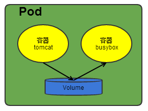
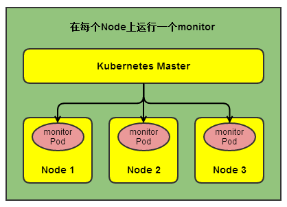
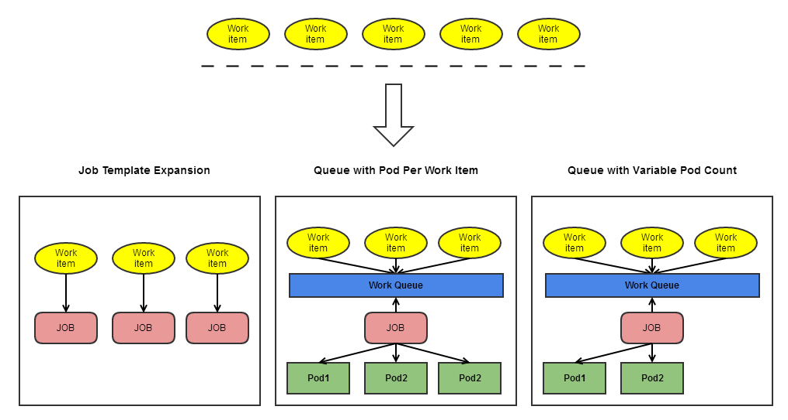

# Pod介绍

## 1. Pod是什么（what）

### 1.1. Pod概念

- Pod是kubernetes集群中最小的部署和管理的`基本单元`，协同寻址，协同调度。
- Pod是一个或多个容器的集合，是一个或一组服务（进程）的抽象集合。
- Pod中可以共享网络和存储（可以简单理解为一个逻辑上的虚拟机，但并不是虚拟机）。
- Pod被创建后用一个`UID`来唯一标识，当Pod生命周期结束，被一个等价Pod替代，UID将重新生成。

**Pod与Docker**

- Docker是目前Pod最常用的容器环境，但仍支持其他容器环境。
- Pod是一组被模块化的拥有共享命名空间和共享存储卷的容器，但并没有共享PID 命名空间（即同个Pod的不同容器中进程的PID是独立的，互相看不到非自己容器的进程）。

**Pod中容器的运行方式**

1. **只运行一个单独的容器**

即`one-container-per-Pod`模式，是最常用的模式，可以把这样的Pod看成单独的一个容器去管理。

1. **运行多个强关联的容器**

即`sidecar`模式，Pod 封装了一组紧耦合、共享资源、协同寻址的容器，将这组容器作为一个管理单元。

### 1.2. Pod管理多个容器

Pod是一组紧耦合的容器的集合，Pod内的容器作为一个整体以Pod形式进行协同寻址，协同调度、协同管理。相同Pod内的容器共享网络和存储。


### 1.2.1. 网络

- 每个Pod被分配了唯一的IP地址，该Pod内的所有容器共享一个网络空间，包括IP和端口。
- 同个Pod不同容器之间通过`localhos`t通信，Pod内端口不能冲突。
- 不同Pod之间的通信则通过IP+端口的形式来访问到Pod内的具体服务（容器）。

### 1.2.2. 存储

- 可以在Pod中创建共享`存储卷`的方式来实现不同容器之间数据共享。

## 2. 为什么需要Pod(why)

### 2.1. 管理需求

Pod 是一种模式的抽象：互相协作的多个进程（容器）共同形成一个完整的服务。以一个或多个容器的方式组合成一个整体，作为管理的基本单元，通过Pod可以方便部署、水平扩展，协同调度等。

### 2.2. 资源共享和通信

Pod作为多个紧耦合的容器的集合，通过共享网络和存储的方式来简化紧耦合容器之间的通信，从这个角度，可以将Pod简单理解为一个逻辑上的“虚拟机”。而不同的Pod之间的通信则通过Pod的IP和端口的方式。

### 2.3. Pod设计的优势

- 调度器和控制器的可拔插性。
- 将Pod 的生存期从 controller 中剥离出来，从而减少相互影响。
- 高可用--在终止和删除 Pod 前，需要提前生成替代 Pod。
- 集群级别的功能和 Kubelet（Pod Controller） 级别的功能组合更加清晰。

## 3. Pod的使用(how)

Pod一般是通过各种不同类型的`Controller`对Pod进行管理和控制，包括自我恢复（例如Pod因异常退出，则会再起一个相同的Pod替代该Pod，而该Pod则会被清除）。也可以不通过Controller单独创建一个Pod，但一般很少这么操作，因为这个Pod是一个孤立的实体，并不会被Controller管理。

### 3.1. Controller

`Controller`是kubernetes中用于对Pod进行管理的控制器，通过该控制器让Pod始终维持在一个用户原本设定或期望的状态。如果节点宕机或者Pod因其他原因死亡，则会在其他节点起一个相同的Pod来替代该Pod。

常用的Controller有：

- `Deployment`
- `StatefulSet`
- `DaemonSet`

`Controller`是通过用户提供的Pod模板来创建和控制Pod。

### 3.2. Pod模板

Pod模板用来定义Pod的各种属性，Controller通过Pod模板来生成对应的Pod。

Pod模板类似一个饼干模具，通过模具已经生成的饼干与原模具已经没有关系，即对原模具的修改不会影响已经生成的饼干，只会对通过修改后的模具生成的饼干有影响。这种方式可以更加方便地控制和管理Pod。

## 4. Pod的终止

用户发起一个删除Pod的请求，系统会先发送`TERM`信号给每个容器的主进程，如果在宽限期（默认30秒）主进程没有自主终止运行，则系统会发送`KILL`信号给该进程，接着Pod将被删除。

### 4.1. Pod终止的流程

1. 用户发送一个删除 Pod 的命令， 并使用默认的宽限期（30s)。
2. 把 API server 上的 pod 的时间更新成 Pod 与宽限期一起被认为 “dead” 之外的时间点。
3. 使用客户端的命令，显示出的Pod的状态为 `terminating`。
4. （与第3步同时发生）Kubelet 发现某一个 Pod 由于时间超过第2步的设置而被标志成 terminating 状态时， Kubelet 将启动一个停止进程。
   1. 如果 pod 已经被定义成一个 `preStop hook`，这会在 pod 内部进行调用。如果宽限期已经过期但 preStop 锚依然还在运行，将调用第2步并在原来的宽限期上加一个小的时间窗口（2 秒钟）。
   2. 把 Pod 里的进程发送到 `TERM `信号。
5. （与第3步同时发生），Pod 被从终端的服务列表里移除，同时也不再被 replication controllers 看做时一组运行中的 pods。 在负载均衡（比如说 service proxy）会将它们从轮询中移除前， Pods 这种慢关闭的方式可以继续为流量提供服务。
6. 当宽期限过期时， 任何还在 Pod 里运行的进程都会被 `SIGKILL `杀掉。
7. Kubelet 通过在 API server 把宽期限设置成0(立刻删除)的方式完成删除 Pod的过程。 这时 Pod 在 API 里消失，也不再能被用户看到。

### 4.2. 强制删除Pod

强制删除Pod是指从k8s集群状态和Etcd中立刻删除对应的Pod数据，API Server不会等待kubelet的确认信息。被强制删除后，即可重新创建一个相同名字的Pod。

删除默认的宽限期是30秒，通过将宽限期设置为0的方式可以强制删除Pod。

通过`kubectl delete` 命令后加`--force`和`--grace-period=0`的参数强制删除Pod。

```
kubectl delete pod <pod_name> --namespace=<namespace>  --force --grace-period=0
```


### 4.3. Pod特权模式

特权模式是指让Pod中的进程具有访问宿主机系统设备或使用网络栈操作等的能力，例如编写网络插件和卷插件。

通过将`container spec`中的`SecurityContext`设置为`privileged`即将该容器赋予了特权模式。特权模式的使用要求k8s版本高于`v1.1`。

## 5、静态Pod

静态 Pod 是指在 Kubernetes 中直接创建的 Pod，而不是通过控制器管理（比如 Deployment 或 StatefulSet）。静态 Pod 的配置文件通常存储在特定目录下，Kubernetes 会监视该目录并自动创建 Pod。这种方式适用于在特定节点上运行系统级别的 Pod，比如网络代理、日志收集器等。

静态 Pod 的配置文件通常存储在 `/etc/kubernetes/manifests` 目录下（kubelet 的启动参数 `--pod-manifest-path` 可以指定其他目录），当 kubelet 启动或者检测到该目录下有变化时，它会自动创建、更新或删除对应的 Pod。这样可以保证这些核心组件始终在特定节点上运行，即使失去了集群 API 的连接。


# Pod定义文件

## 1. Pod的基本用法

1. Pod实际上是**容器的集合**，在k8s中对运行容器的要求为：容器的主程序需要一直在前台运行，而不是后台运行。应用可以改造成前台运行的方式，例如Go语言的程序，直接运行二进制文件；java语言则运行主类；tomcat程序可以写个运行脚本。或者通过supervisor的进程管理工具，即supervisor在前台运行，应用程序由supervisor管理在后台运行。具体可参考[supervisord](http://blog.csdn.net/huwh_/article/details/77108245)。
2. 当多个应用之间是紧耦合的关系时，可以将多个应用一起放在一个Pod中，同个Pod中的多个容器之间互相访问可以通过localhost来通信（可以把Pod理解成一个虚拟机，共享网络和存储卷）。

### 1.2. Pod相关命令

| 操作            | 命令                                                        | 说明                                |
| --------------- | ----------------------------------------------------------- | ----------------------------------- |
| 创建            | kubectl create -f frontend-localredis-pod.yaml              |                                     |
| 查询Pod运行状态 | kubectl get pods --namespace=`<NAMESPACE>`                  |                                     |
| 查询Pod详情     | kebectl describe pod `<POD_NAME>` --namespace=`<NAMESPACE>` | 该命令常用来排查问题，查看Event事件 |
| 删除            | kubectl delete pod `<POD_NAME>` ;kubectl delete pod --all   |                                     |
| 更新            | kubectl replace pod.yaml                                    |                                     |

## 2. Pod的定义文件

```yaml
apiVersion: v1
kind: Pod
metadata:
  name: string
  namaspace: string
  labels:
  - name: string
      annotations:
  - name: string
  spec:
    containers:
  - name: string
    images: string
    imagePullPolice: [Always | Never | IfNotPresent]
    command: [string]
    args: [string]
    workingDir: string
    volumeMounts:
    - name: string
      mountPath: string
      readOnly: boolean
      ports:
    - name: string
      containerPort: int
      hostPort: int
      protocol: string
      env:
    - name: string
      value: string
      resources:
      limits:
        cpu: string
        memory: string
      requests:
        cpu: string
        memory: string
      livenessProbe:
      exec:
        command: [string]
      httpGet:
        path: string
        port: int
        host: string
        scheme: string
        httpHeaders:
        - name: string
          value: string
          tcpSocket:
            port: int
          initialDelaySeconds: number
          timeoutSeconds: number
          periodSeconds: number
          successThreshold: 0
          failureThreshold: 0
          securityContext:
          privileged: false
          restartPolicy: [Always | Never | OnFailure]   
          nodeSelector: object
          imagePullSecrets:
  - name: string
      hostNetwork: false
        volumes:
  - name: string
    emptyDir: {}
    hostPath:
      path: string
    secret:
      secretName: string
      items:
      - key: string
        path: string
        configMap:
          name: string
          items:
      - key: string
        path: string
```


## 3. 静态pod

静态Pod是由kubelet进行管理，仅存在于特定Node上的Pod。它们不能通过API Server进行管理，无法与ReplicationController、Deployment或DaemonSet进行关联，并且kubelet也无法对其健康检查。

静态Pod总是由kubelet创建，并且总在kubelet所在的Node上运行。

创建静态Pod的方式：

### 3.1. 通过配置文件方式

需要设置kubelet的启动参数“–config”，指定kubelet需要监控的配置文件所在目录，kubelet会定期扫描该目录，并根据该目录的.yaml或.json文件进行创建操作。静态Pod无法通过API Server删除（若删除会变成pending状态），如需删除该Pod则将yaml或json文件从这个目录中删除。

例如：

配置目录为/etc/kubelet.d/，配置启动参数：--config=/etc/kubelet.d/，该目录下放入static-web.yaml。

```yaml
apiVersion: v1
kind: Pod
metadata:
  name: static-web
  labels:
    name: static-web
spec:
  containers:
  - name: static-web
  image: nginx
  ports:
  - name: web
    containerPort: 80
```


# Pod生命周期

## 1. Pod phase

Pod的`phase`是Pod生命周期中的简单宏观描述，定义在Pod的`PodStatus`对象的`phase` 字段中。

`phase`有以下几种值：

| 状态值              | 说明                                                         |
| ------------------- | ------------------------------------------------------------ |
| `挂起（Pending）`   | Pod 已被 Kubernetes 系统接受，但有一个或者多个容器镜像尚未创建。等待时间包括调度 Pod 的时间和通过网络下载镜像的时间。 |
| `运行中（Running）` | 该 Pod 已经绑定到了一个节点上，Pod 中所有的容器都已被创建。至少有一个容器正在运行，或者正处于启动或重启状态。 |
| `成功（Succeeded）` | Pod 中的所有容器都被成功终止，并且不会再重启。               |
| `失败（Failed）`    | Pod 中的所有容器都已终止了，并且至少有一个容器是因为失败终止。也就是说，容器以非0状态退出或者被系统终止。 |
| `未知（Unknown）`   | 因为某些原因无法取得 Pod 的状态，通常是因为与 Pod 所在主机通信失败。 |

## 2. Pod 状态

Pod 有一个 `PodStatus` 对象，其中包含一个 [PodCondition](https://kubernetes.io/docs/reference/generated/kubernetes-api/v1.11/#podcondition-v1-core) 数组。 `PodCondition`包含以下以下字段：

- `lastProbeTime`：Pod condition最后一次被探测到的时间戳。
- `lastTransitionTime`：Pod最后一次状态转变的时间戳。
- `message`：状态转化的信息，一般为报错信息，例如：containers with unready status: [c-1]。
- `reason`：最后一次状态形成的原因，一般为报错原因，例如：ContainersNotReady。
- `status`：包含的值有 True、False 和 Unknown。
- `type`：Pod状态的几种类型。

其中type字段包含以下几个值：

- `PodScheduled`：Pod已经被调度到运行节点。
- `Ready`：Pod已经可以接收请求提供服务。
- `Initialized`：所有的init container已经成功启动。
- `Unschedulable`：无法调度该Pod，例如节点资源不够。
- `ContainersReady`：Pod中的所有容器已准备就绪。

## 3. 重启策略

Pod通过`restartPolicy`字段指定重启策略，重启策略类型为：Always、OnFailure 和 Never，默认为 Always。

`restartPolicy` 仅指通过同一节点上的 kubelet 重新启动容器。

| 重启策略  | 说明                                                   |
| --------- | ------------------------------------------------------ |
| Always    | 当容器失效时，由kubelet自动重启该容器                  |
| OnFailure | 当容器终止运行且退出码不为0时，由kubelet自动重启该容器 |
| Never     | 不论容器运行状态如何，kubelet都不会重启该容器          |

**说明**：

可以管理Pod的控制器有Replication Controller，Job，DaemonSet，及kubelet（静态Pod）。

1. RC和DaemonSet：必须设置为Always，需要保证该容器持续运行。
2. Job：OnFailure或Never，确保容器执行完后不再重启。
3. kubelet：在Pod失效的时候重启它，不论RestartPolicy设置为什么值，并且不会对Pod进行健康检查。

## 4. Pod的生命

Pod的生命周期一般通过`Controler` 的方式管理，每种`Controller`都会包含`PodTemplate`来指明Pod的相关属性，Controller可以自动对pod的异常状态进行重新调度和恢复，除非通过Controller的方式删除其管理的Pod，不然kubernetes始终运行用户预期状态的Pod。

**控制器的分类**

- 使用 `Job`运行预期会终止的 Pod，例如批量计算。Job 仅适用于重启策略为 `OnFailure` 或 `Never` 的 Pod。
- 对预期不会终止的 Pod 使用 `ReplicationController`、`ReplicaSet`和 `Deployment`，例如 Web 服务器。 ReplicationController 仅适用于具有 `restartPolicy` 为 Always 的 Pod。
- 提供特定于机器的系统服务，使用 `DaemonSet`为每台机器运行一个 Pod 。

如果节点死亡或与集群的其余部分断开连接，则 Kubernetes 将应用一个策略将丢失节点上的所有 Pod 的 `phase` 设置为 `Failed`。

## 5. Pod状态转换

**常见的状态转换**

| Pod的容器数  | Pod当前状态 | 发生的事件      | Pod结果状态          |                         |                     |
| ------------ | ----------- | --------------- | -------------------- | ----------------------- | ------------------- |
|              |             |                 | RestartPolicy=Always | RestartPolicy=OnFailure | RestartPolicy=Never |
| 包含一个容器 | Running     | 容器成功退出    | Running              | Succeeded               | Succeeded           |
| 包含一个容器 | Running     | 容器失败退出    | Running              | Running                 | Failure             |
| 包含两个容器 | Running     | 1个容器失败退出 | Running              | Running                 | Running             |
| 包含两个容器 | Running     | 容器被OOM杀掉   | Running              | Running                 | Failure             |

### 5.1. 容器运行时内存超出限制

- 容器以失败状态终止。

- 记录 OOM 事件。

- 如果

  ```
  restartPolicy
  ```

  为：

  - Always：重启容器；Pod `phase` 仍为 Running。
  - OnFailure：重启容器；Pod `phase` 仍为 Running。
  - Never: 记录失败事件；Pod `phase` 仍为 Failed。

### 5.2. 磁盘故障

- 杀掉所有容器。
- 记录适当事件。
- Pod `phase` 变成 Failed。
- 如果使用控制器来运行，Pod 将在别处重建。

### 5.3. 运行节点挂掉

- 节点控制器等待直到超时。
- 节点控制器将 Pod `phase` 设置为 Failed。
- 如果是用控制器来运行，Pod 将在别处重建。


# Pod健康检查

Pod的健康状态由两类探针来检查：`LivenessProbe`和`ReadinessProbe`。

## 1. 探针类型

**1. livenessProbe(存活探针)**

- 表明容器是否正在运行。
- 如果存活探测失败，则 kubelet 会杀死容器，并且容器将受到其 `重启策略`的影响。
- 如果容器不提供存活探针，则默认状态为 `Success`。

**2. readinessProbe(就绪探针)**

- 表明容器是否可以正常接受请求。
- 如果就绪探测失败，端点控制器将从与 Pod 匹配的所有 Service 的端点中删除该 Pod 的 IP 地址。
- 初始延迟之前的就绪状态默认为 `Failure`。
- 如果容器不提供就绪探针，则默认状态为 `Success`。

## 2. Handler

`探针`是`kubelet`对容器执行定期的诊断，主要通过调用容器配置的三类`Handler`实现：

**Handler的类型**：

- `ExecAction`：在容器内执行指定命令。如果命令退出时返回码为 0 则认为诊断成功。
- `TCPSocketAction`：对指定端口上的容器的 IP 地址进行 TCP 检查。如果端口打开，则诊断被认为是成功的。
- `HTTPGetAction`：对指定的端口和路径上的容器的 IP 地址执行 HTTP Get 请求。如果响应的状态码大于等于200 且小于 400，则诊断被认为是成功的。

**探测结果**为以下三种之一：

- `成功`：容器通过了诊断。
- `失败`：容器未通过诊断。
- `未知`：诊断失败，因此不会采取任何行动。

## 3. 探针使用方式

- 如果容器异常可以自动崩溃，则不一定要使用探针，可以由Pod的`restartPolicy`执行重启操作。
- `存活探针`适用于希望容器探测失败后被杀死并重新启动，需要指定`restartPolicy` 为 Always 或 OnFailure。
- `就绪探针`适用于希望Pod在不能正常接收流量的时候被剔除，并且在就绪探针探测成功后才接收流量。

存活探针由 kubelet 来执行，因此所有的请求都在 kubelet 的网络命名空间中进行。

### 3.1. LivenessProbe参数

- **initialDelaySeconds**：启动容器后首次进行健康检查的等待时间，单位为秒。
- **timeoutSeconds**:健康检查发送请求后等待响应的时间，如果超时响应kubelet则认为容器非健康，重启该容器，单位为秒。

### 3.2. LivenessProbe三种实现方式

1）ExecAction:在一个容器内部执行一个命令，如果该命令状态返回值为0，则表明容器健康。

```
apiVersion: v1
kind: Pod
metadata:
  name: liveness-exec
spec:
  containers:
  - name: liveness
    image: tomcagcr.io/google_containers/busybox
    args:
    - /bin/sh
    - -c
    - echo ok > /tmp/health;sleep 10;rm -fr /tmp/health;sleep 600
    livenessProbe:
      exec:
        command:
        - cat
        - /tmp/health
      initialDelaySeconds: 15
      timeoutSeconds: 1
```


2）TCPSocketAction:通过容器IP地址和端口号执行TCP检查，如果能够建立TCP连接，则表明容器健康。

```
apiVersion: v1
kind: Pod
metadata:
  name: pod-with-healthcheck
spec:
  containers:
  - name: nginx
    image: nginx
    ports:
    - containnerPort: 80
    livenessProbe:
      tcpSocket:
        port: 80
      initialDelaySeconds: 15
      timeoutSeconds: 1
```


3）HTTPGetAction:通过容器的IP地址、端口号及路径调用HTTP Get方法，如果响应的状态码大于等于200且小于等于400，则认为容器健康。

```yaml
apiVersion: v1
kind: Pod
metadata:
  name: pod-with-healthcheck
spec:
  containers:
  - name: nginx
    image: nginx
    ports:
    - containnerPort: 80
    livenessProbe:
      httpGet:
        path: /_status/healthz
        port: 80
      initialDelaySeconds: 15
      timeoutSeconds: 1
```


# Pod存储卷

## Pod Volume

同一个Pod中的多个容器可以共享Pod级别的存储卷Volume,Volume可以定义为各种类型，多个容器各自进行挂载，将Pod的Volume挂载为容器内部需要的目录。

例如：Pod级别的Volume:"app-logs",用于tomcat向其中写日志文件，busybox读日志文件。

[](https://camo.githubusercontent.com/26bbbf923901bb8b835700839ff54b88927614804421b1f1bda9ac66658dd33b/687474703a2f2f7265732e636c6f7564696e6172792e636f6d2f647178746e3069636b2f696d6167652f75706c6f61642f76313531323830343238372f61727469636c652f6b756265726e657465732f706f642f706f645f766f6c756d652e706e67)

**pod-volumes-applogs.yaml**

```
apiVersion: v1
kind: Pod
metadata:
  name: volume-pod
spec:
  containers:
  - name: tomcat
    image: tomcat
    ports:
    - containerPort: 8080
    volumeMounts:
    - name: app-logs
      mountPath: /usr/local/tomcat/logs
  - name: busybox
    image: busybox
    command: ["sh","-c","tailf /logs/catalina*.log"]
    volumeMounts:
    - name: app-logs
      mountPath: /logs
  volumes:
  - name: app-logs
    emptuDir: {}
```

**查看日志**

1. kubectl logs `<pod_name>` -c `<container_name>`
2. kubectl exec -it `<pod_name>` -c `<container_name>` – tail /usr/local/tomcat/logs/catalina.xx.log


# Pod控制器

## Pod调度

在kubernetes集群中，Pod（container）是应用的载体，一般通过RC、Deployment、DaemonSet、Job等对象来完成Pod的调度与自愈功能。

## 1. RC、Deployment[全自动调度]

RC的功能即保持集群中始终运行着指定个数的Pod。

在调度策略上主要有：

- 系统内置调度算法[最优Node]
- NodeSelector[定向调度]
- NodeAffinity[亲和性调度]

## 2. NodeSelector[定向调度]

k8s中kube-scheduler负责实现Pod的调度，内部系统通过一系列算法最终计算出最佳的目标节点。如果需要将Pod调度到指定Node上，则可以通过Node的标签（Label）和Pod的nodeSelector属性相匹配来达到目的。

1、kubectl label nodes {node-name} {label-key}={label-value}

2、nodeSelector: {label-key}:{label-value}

如果给多个Node打了相同的标签，则scheduler会根据调度算法从这组Node中选择一个可用的Node来调度。

如果Pod的nodeSelector的标签在Node中没有对应的标签，则该Pod无法被调度成功。

**Node标签的使用场景：**

对集群中不同类型的Node打上不同的标签，可控制应用运行Node的范围。例如role=frontend;role=backend;role=database。

## 3. NodeAffinity[亲和性调度]

NodeAffinity意为Node亲和性调度策略，NodeSelector为精确匹配，NodeAffinity为条件范围匹配，通过In（属于）、NotIn（不属于）、Exists（存在一个条件）、DoesNotExist（不存在）、Gt（大于）、Lt（小于）等操作符来选择Node，使调度更加灵活。

- RequiredDuringSchedulingRequiredDuringExecution：类似于NodeSelector，但在Node不满足条件时，系统将从该Node上移除之前调度上的Pod。
- RequiredDuringSchedulingIgnoredDuringExecution：与上一个类似，区别是在Node不满足条件时，系统不一定从该Node上移除之前调度上的Pod。
- PreferredDuringSchedulingIgnoredDuringExecution：指定在满足调度条件的Node中，哪些Node应更优先地进行调度。同时在Node不满足条件时，系统不一定从该Node上移除之前调度上的Pod。

如果同时设置了NodeSelector和NodeAffinity，则系统将需要同时满足两者的设置才能进行调度。

## 4. DaemonSet：特定场景调度

DaemonSet是kubernetes1.2版本新增的一种资源对象，用于管理在集群中**每个Node**上**仅运行一份Pod**的副本实例。

[](https://camo.githubusercontent.com/e503be16e3a5b0fe7aed7ca09d68c3ed6b8be6e88715ce2340175f2687486207/687474703a2f2f7265732e636c6f7564696e6172792e636f6d2f647178746e3069636b2f696d6167652f75706c6f61642f76313531323830343238372f61727469636c652f6b756265726e657465732f706f642f6d6f6e69746f725f706f642e706e67)

该用法适用的应用场景：

- 在每个Node上运行一个GlusterFS存储或者Ceph存储的daemon进程。
- 在每个Node上运行一个日志采集程序：fluentd或logstach。
- 在每个Node上运行一个健康程序，采集该Node的运行性能数据，例如：Prometheus Node Exportor、collectd、New Relic agent或Ganglia gmond等。

DaemonSet的Pod调度策略与RC类似，除了使用系统内置算法在每台Node上进行调度，也可以通过NodeSelector或NodeAffinity来指定满足条件的Node范围进行调度。

## 5. Job：批处理调度

kubernetes从1.2版本开始支持批处理类型的应用，可以通过kubernetes Job资源对象来定义并启动一个批处理任务。批处理任务通常并行（或串行）启动多个计算进程去处理一批工作项（work item），处理完后，整个批处理任务结束。

### 5.1. 批处理的三种模式

[](https://camo.githubusercontent.com/0f82d9d43a53f547c63e43fb866976fb9af31e7ff1ae23763ed359b019cb04e4/687474703a2f2f7265732e636c6f7564696e6172792e636f6d2f647178746e3069636b2f696d6167652f75706c6f61642f76313531323830343238362f61727469636c652f6b756265726e657465732f706f642f6b38735f6a6f622e706e67)

批处理按任务实现方式不同分为以下几种模式：

- **Job Template Expansion模式** 一个Job对象对应一个待处理的Work item，有几个Work item就产生几个独立的Job，通过适用于Work item数量少，每个Work item要处理的数据量比较大的场景。例如有10个文件（Work item）,每个文件（Work item）为100G。
- **Queue with Pod Per Work Item** 采用一个任务队列存放Work item，一个Job对象作为消费者去完成这些Work item，其中Job会启动N个Pod，每个Pod对应一个Work item。
- **Queue with Variable Pod Count** 采用一个任务队列存放Work item，一个Job对象作为消费者去完成这些Work item，其中Job会启动N个Pod，每个Pod对应一个Work item。**但Pod的数量是可变的**。

### 5.2. Job的三种类型

**1）Non-parallel Jobs**

通常一个Job只启动一个Pod,除非Pod异常才会重启该Pod,一旦此Pod正常结束，Job将结束。

**2）Parallel Jobs with a fixed completion count**

并行Job会启动多个Pod，此时需要设定Job的.spec.completions参数为一个正数，当正常结束的Pod数量达到该值则Job结束。

**3）Parallel Jobs with a work queue**

任务队列方式的并行Job需要一个独立的Queue，Work item都在一个Queue中存放，不能设置Job的.spec.completions参数。

此时Job的特性：

- 每个Pod能独立判断和决定是否还有任务项需要处理
- 如果某个Pod正常结束，则Job不会再启动新的Pod
- 如果一个Pod成功结束，则此时应该不存在其他Pod还在干活的情况，它们应该都处于即将结束、退出的状态
- 如果所有的Pod都结束了，且至少一个Pod成功结束，则整个Job算是成功结束


# Pod伸缩与升级

## 1. Pod伸缩

k8s中RC的用来保持集群中始终运行指定数目的实例，通过RC的scale机制可以完成Pod的扩容和缩容（伸缩）。

## 1.1. 手动伸缩（scale）

```
kubectl scale rc redis-slave --replicas=3
```


## 1.2. 自动伸缩（HPA）

Horizontal Pod Autoscaler（HPA）控制器用于实现基于CPU使用率进行自动Pod伸缩的功能。HPA控制器基于Master的kube-controller-manager服务启动参数--horizontal-pod-autoscaler-sync-period定义是时长（默认30秒），周期性监控目标Pod的CPU使用率，并在满足条件时对ReplicationController或Deployment中的Pod副本数进行调整，以符合用户定义的平均Pod CPU使用率。Pod CPU使用率来源于heapster组件，因此需安装该组件。

可以通过kubectl autoscale命令进行快速创建或者使用yaml配置文件进行创建。创建之前需已存在一个RC或Deployment对象，并且该RC或Deployment中的Pod必须定义resources.requests.cpu的资源请求值，以便heapster采集到该Pod的CPU。

### 1.2.1. 通过kubectl autoscale创建

例如：

php-apache-rc.yaml

```
apiVersion: v1
kind: ReplicationController
metadata:
  name: php-apache
spec:
  replicas: 1
  template:
    metadata:
      name: php-apache
      labels:
        app: php-apache
    spec:
      containers:
      - name: php-apache
        image: gcr.io/google_containers/hpa-example
        resources:
          requests:
            cpu: 200m
        ports:
        - containerPort: 80
```


创建php-apache的RC

```
kubectl create -f php-apache-rc.yaml
```


php-apache-svc.yaml

```
apiVersion: v1
kind: Service
metadata:
  name: php-apache
spec:
  ports:
  - port: 80
  selector:
    app: php-apache
```


创建php-apache的Service

```
kubectl create -f php-apache-svc.yaml
```


创建HPA控制器

```
kubectl autoscale rc php-apache --min=1 --max=10 --cpu-percent=50
```


### 1.2.2. 通过yaml配置文件创建

hpa-php-apache.yaml

```
apiVersion: v1
kind: HorizontalPodAutoscaler
metadata:
  name: php-apache
spec:
  scaleTargetRef:
    apiVersion: v1
    kind: ReplicationController
    name: php-apache
  minReplicas: 1
  maxReplicas: 10
  targetCPUUtilizationPercentage: 50
```


创建hpa

```
kubectl create -f hpa-php-apache.yaml
```


查看hpa

```
kubectl get hpa
```


## 2. Pod滚动升级

k8s中的滚动升级通过执行kubectl rolling-update命令完成，该命令创建一个新的RC（与旧的RC在同一个命名空间中），然后自动控制旧的RC中的Pod副本数逐渐减少为0，同时新的RC中的Pod副本数从0逐渐增加到附加值，但滚动升级中Pod副本数（包括新Pod和旧Pod）保持原预期值。

## 2.1. 通过配置文件实现

redis-master-controller-v2.yaml

```
apiVersion: v1
kind: ReplicationController
metadata:
  name: redis-master-v2
  labels:
    name: redis-master
    version: v2
spec:
  replicas: 1
  selector:
    name: redis-master
    version: v2
  template:
    metadata:
      labels:
        name: redis-master
        version: v2
    spec:
      containers:
      - name: master
        image: kubeguide/redis-master:2.0
        ports:
        - containerPort: 6371
```


注意事项：

1. RC的名字（name）不能与旧RC的名字相同
2. 在selector中应至少有一个Label与旧的RC的Label不同，以标识其为新的RC。例如本例中新增了version的Label。

运行kubectl rolling-update

```
kubectl rolling-update redis-master -f redis-master-controller-v2.yaml
```


## 2.2. 通过kubectl rolling-update命令实现]

```
kubectl rolling-update redis-master --image=redis-master:2.0
```


与使用配置文件实现不同在于，该执行结果旧的RC被删除，新的RC仍使用旧的RC的名字。

## 2.3. 升级回滚

kubectl rolling-update加参数--rollback实现回滚操作

```
kubectl rolling-update redis-master --image=kubeguide/redis-master:2.0 --rollback
```


# ConfigMap配置

## Pod的配置管理

Kubernetes v1.2的版本提供统一的集群配置管理方案–ConfigMap。

## 1. ConfigMap：容器应用的配置管理

使用场景：

1. 生成为容器内的环境变量。
2. 设置容器启动命令的启动参数（需设置为环境变量）。
3. 以Volume的形式挂载为容器内部的文件或目录。

ConfigMap以一个或多个key:value的形式保存在kubernetes系统中供应用使用，既可以表示一个变量的值（例如：apploglevel=info），也可以表示完整配置文件的内容（例如：server.xml=<?xml...>...）。

可以通过yaml配置文件或者使用kubectl create configmap命令的方式创建ConfigMap。

## 2. 创建ConfigMap

### 2.1. 通过yaml文件方式

cm-appvars.yaml

```
apiVersion: v1
kind: ConfigMap
metadata:
  name: cm-appvars
data:
  apploglevel: info
  appdatadir: /var/data
```


常用命令

kubectl create -f cm-appvars.yaml

kubectl get configmap

kubectl describe configmap cm-appvars

kubectl get configmap cm-appvars -o yaml

### 2.2. 通过kubectl命令行方式

通过kubectl create configmap创建，使用参数--from-file或--from-literal指定内容，可以在一行中指定多个参数。

1）通过--from-file参数从文件中进行创建，可以指定key的名称，也可以在一个命令行中创建包含多个key的ConfigMap。

kubectl create configmap NAME --from-file=[key=]source --from-file=[key=]source

2）通过--from-file参数从目录中进行创建，该目录下的每个配置文件名被设置为key，文件内容被设置为value。

kubectl create configmap NAME --from-file=config-files-dir

3）通过--from-literal从文本中进行创建，直接将指定的key=value创建为ConfigMap的内容。

kubectl create configmap NAME --from-literal=key1=value1 --from-literal=key2=value2

容器应用对ConfigMap的使用有两种方法：

1. 通过环境变量获取ConfigMap中的内容。
2. 通过Volume挂载的方式将ConfigMap中的内容挂载为容器内部的文件或目录。

### 2.3. 通过环境变量的方式

ConfigMap的yaml文件:cm-appvars.yaml

```
apiVersion: v1
kind: ConfigMap
metadata:
  name: cm-appvars
data:
  apploglevel: info
  appdatadir: /var/data
```


Pod的yaml文件：cm-test-pod.yaml

```
apiVersion: v1
kind: Pod
metadata:
  name: cm-test-pod
spec:
  containers:
  - name: cm-test
    image: busybox
    command: ["/bin/sh","-c","env|grep APP"]
    env:
    - name: APPLOGLEVEL
      valueFrom:
        configMapKeyRef:
          name: cm-appvars
          key: apploglevel
    - name: APPDATADIR
      valueFrom:
        configMapKeyRef:
          name: cm-appvars
          key: appdatadir
```


创建命令：

kubectl create -f cm-test-pod.yaml

kubectl get pods --show-all

kubectl logs cm-test-pod

## 3. 使用ConfigMap的限制条件

- ConfigMap必须在Pod之前创建
- ConfigMap也可以定义为属于某个Namespace。只有处于相同Namespace中的Pod可以引用它。
- kubelet只支持可以被API Server管理的Pod使用ConfigMap。静态Pod无法引用。
- 在Pod对ConfigMap进行挂载操作时，容器内只能挂载为“目录”，无法挂载为文件。

