# 一、计算机组成

 

控制器：计算机的指挥系统，负责控制计算机所有的其他组件如何运行		控制器-->大脑

运算器：逻辑运算和数学运算		运算器-->大脑

控制器+运算器=大脑

存储器 / IO设备：计算机的记忆功能，负责数据存储

输入设备input：如键盘、鼠标

输出设备output：如显示器、打印机

平台=计算机物理硬件+操作系统

软件跨平台性：一款软件是否可以在任意平台上运行，是衡量软件质量的一个重要指标

# 二、操作系统

操作系统是一个协调、管理、控制计算机硬件资源与应用软件资源的一个控制程序

应用程序（暴风影音）：

控制程序（系统接口）：控制计算机硬件的基本运行（把控制硬件的复杂操作封装成简单指令），供上层软件程序使用

# 三、计算机系统三层应用结构

应用程序		--	操作系统		--	计算机硬件

 

cpu分类与指令集的概念：

简单指令集：即使用一些简单的指令，特点快捷高效

复杂指令集：通过多个指令完成，集成性高能单个完成任务

#注释

\#或 Crtl+/：注释，进行解释说明，放哪里都行

多行注释："""						'''

这是多行注释			这也是多行注释

第二行注释			第二行注释

"""					'''

# 变量

```python
变量名 = 值
```

变量：就是存储数据的时候，当前数据所在的内存地址的名字

定义变量：

1、不能由数字开头、不能使用内置关键字	

2、由数字、字母、下划线组成	

3、严格区分大小写

# 关键字

```python
False     None    True   and      as       assert   break     class  
continue  def     del    elif     else     except   finally   for
from      global  if     import   in       is       lambda    nonlocal
not       or      pass   raise    return   try      while     with  	yield
```

 

nonlocal关键字使外函数中的内函数能使用局部变量

变量名 = 值	例：my_name = 'TOM'	#定义字符

命名习惯：

大驼峰：首字母大写法，例：MyName

小驼峰：第二个及以后的单词，首字母大写，例：myName

下划线：例：my_name

# 数据类型

 

> 检测数据类型的方法：`type()`

```python
a = 1
print(type(a))  # <class 'int'> -- 整型

b = 1.1
print(type(b))  # <class 'float'> -- 浮点型

c = True
print(type(c))  # <class 'bool'> -- 布尔型

d = '12345'
print(type(d))  # <class 'str'> -- 字符串

e = [10, 20, 30]
print(type(e))  # <class 'list'> -- 列表

f = (10, 20, 30)
print(type(f))  # <class 'tuple'> -- 元组

h = {10, 20, 30}
print(type(h))  # <class 'set'> -- 集合

g = {'name': 'TOM', 'age': 20}
print(type(g))  # <class 'dict'> -- 字典
```


# print输出

格式化字符串除了%s，还可以写为`f'{表达式}'`

```python
age = 18 
name = 'TOM'
weight = 75.5
student_id = 1

# 我的名字是TOM
print('我的名字是%s' % name)

# 我的学号是0001
print('我的学号是%4d' % student_id)

# 我的体重是75.50公斤
print('我的体重是%.2f公斤' % weight)

# 我的名字是TOM，今年18岁了
print('我的名字是%s，今年%d岁了' % (name, age))

# 我的名字是TOM，明年19岁了
print('我的名字是%s，明年%d岁了' % (name, age + 1))

# 我的名字是TOM，明年19岁了
print(f'我的名字是{name}, 明年{age + 1}岁了')
```

> f-格式化字符串是Python3.6中新增的格式化方法，该方法更简单易读。

## 格式化输出数据

| 格式符号 | 转换                   |
| :------- | :--------------------- |
| ==%s==   | 字符串                 |
| ==%d==   | 有符号的十进制整数     |
| ==%f==   | 浮点数                 |
| %c       | 字符                   |
| %u       | 无符号十进制整数       |
| %o       | 八进制整数             |
| %x       | 十六进制整数（小写ox） |
| %X       | 十六进制整数（大写OX） |
| %e       | 科学计数法（小写'e'）  |
| %E       | 科学计数法（大写'E'）  |
| %g       | %f和%e的简写           |
| %G       | %f和%E的简写           |

> 技巧

- %06d，表示输出的整数显示位数，不足以0补全，超出当前位数则原样输出
- %.2f，表示小数点后显示的小数位数。
- #%d即有+正或-负符号的整数

## 转义字符

- \n：换行		

- \t：制表符，一个tab键（4个空格）的距离


# input输入

```python
input("提示信息")
```

## 输入的特点

- 当程序执行到`input`，等待用户输入，输入完成之后才继续向下执行。
- 在Python中，`input`接收用户输入后，一般存储到变量，方便使用。
- 在Python中，`input`会把接收到的任意用户输入的数据都当做字符串处理。

```python
password = input('请输入您的密码：')

print(f'您输入的密码是{password}')
# <class 'str'>
print(type(password))
```


# 运算符


## 1. 算数运算符

| 运算符 |  描述  | 实例                                                  |
| :----: | :----: | ----------------------------------------------------- |
|   +    |   加   | 1 + 1 输出结果为 2                                    |
|   -    |   减   | 1-1 输出结果为 0                                      |
|   *    |   乘   | 2 * 2 输出结果为 4                                    |
|   /    |   除   | 10 / 2 输出结果为 5                                   |
|   //   |  整除  | 9 // 4 输出结果为2                                    |
|   %    |  取余  | 9 % 4 输出结果为 1                                    |
|   **   |  指数  | 2 ** 4 输出结果为 16，即 2 * 2 * 2 * 2                |
|   ()   | 小括号 | 小括号用来提高运算优先级，即 (1 + 2) * 3 输出结果为 9 |

> 注意：

- 混合运算优先级顺序：`()`高于 `**` 高于 `*` `/` `//` `%` 高于 `+` `-`


## 2. 赋值运算符

| 运算符 | 描述 | 实例                                |
| ------ | ---- | ----------------------------------- |
| =      | 赋值 | 将`=`右侧的结果赋值给等号左侧的变量 |

- 多个变量赋值


```python
num1, float1, str1 = 10, 0.5, 'hello world'
print(num1)
print(float1)
print(str1)
```

- 多变量赋相同值

```python
a = b = 10
print(a)
print(b)
```

## 3. 复合赋值运算符 

| 运算符 | 描述           | 实例                       |
| ------ | -------------- | -------------------------- |
| +=     | 加法赋值运算符 | c += a 等价于 c = c + a    |
| -=     | 减法赋值运算符 | c -= a 等价于 c = c- a     |
| *=     | 乘法赋值运算符 | c *= a 等价于 c = c * a    |
| /=     | 除法赋值运算符 | c /= a 等价于 c = c / a    |
| //=    | 整除赋值运算符 | c //= a 等价于 c = c // a  |
| %=     | 取余赋值运算符 | c %= a 等价于 c = c % a    |
| **=    | 幂赋值运算符   | c ** = a 等价于 c = c ** a |


## 4. 比较运算符

比较运算符也叫关系运算符， 通常用来判断。

| 运算符 | 描述                                                         | 实例                                                        |
| ------ | ------------------------------------------------------------ | ----------------------------------------------------------- |
| ==     | 判断相等。如果两个操作数的结果相等，则条件结果为真(True)，否则条件结果为假(False) | 如a=3,b=3，则（a == b) 为 True                              |
| !=     | 不等于 。如果两个操作数的结果不相等，则条件为真(True)，否则条件结果为假(False) | 如a=3,b=3，则（a == b) 为 True如a=1,b=3，则(a != b) 为 True |
| >      | 运算符左侧操作数结果是否大于右侧操作数结果，如果大于，则条件为真，否则为假 | 如a=7,b=3，则(a > b) 为 True                                |
| <      | 运算符左侧操作数结果是否小于右侧操作数结果，如果小于，则条件为真，否则为假 | 如a=7,b=3，则(a < b) 为 False                               |
| >=     | 运算符左侧操作数结果是否大于等于右侧操作数结果，如果大于，则条件为真，否则为假 | 如a=7,b=3，则(a < b) 为 False如a=3,b=3，则(a >= b) 为 True  |
| <=     | 运算符左侧操作数结果是否小于等于右侧操作数结果，如果小于，则条件为真，否则为假 |                                                             |


## 5. 逻辑运算符

| 运算符 | 逻辑表达式 | 描述                                                         | 实例                                     |
| ------ | ---------- | ------------------------------------------------------------ | ---------------------------------------- |
| and    | x and y    | 布尔"与"：如果 x 为 False，x and y 返回 False，否则它返回 y 的值。 | True and False， 返回 False。            |
| or     | x or y     | 布尔"或"：如果 x 是 True，它返回 True，否则它返回 y 的值。   | False or True， 返回 True。              |
| not    | not x      | 布尔"非"：如果 x 为 True，返回 False 。如果 x 为 False，它返回 True。 | not True 返回 False, not False 返回 True |

```python
a = 1
b = 2
c = 3
print((a < b) and (b < c))  # True
print((a > b) and (b < c))  # False
print((a > b) or (b < c))   # True
print(not (a > b))          # True
```

# 流程控制语句

continue关键字：退出当前循环，进入下一次循环

break关键字：终止此循环

return关键字：并不是专门用于跳出循环的，return的功能是结束一整个方法，不管这个return处于多少层循环之内

## if语法（条件语句）

基础版：

```py
if 变量 判断式 数据：
	print('为ture时输出的内容')
```

进阶版：

```py
if 变量 判断式 input('请输入内容：')：
	print('为ture时输出的内容')
```

多条件版 ：

```python
if 变量 判断式 input('请输入内容：')：
	print('为ture时输出的内容')
else：
	print('为false时输出的内容')
```

多重判断：

```python
age = input('请输入内容：')

if age变量(age) 判断式 数据：
	print('符合该条件时输出的内容')
elif 变量(age) 判断式 数据：
	print('符合该条件时输出的内容')
else：
	print('为false时输出的内容')
```

- 三目运算符 ：

  ```python
  a = 1 	b = 2	c = a 
  if a > b else b		#if语句成立取a，否则取b值
  ```

  

\#导入模块			import random(随机模块)

\#使用模块生成随机数	random.randint(0, 2)	#int表示整型


## while语法（循环）

基础格式 ：	

```python
while 变量 判断式 数据：
print('符合条件时输出的内容')	#当输出该行内容时，继续回到while进行判断，直到不符合条件
```

循环判断式：	

```python
while 变量 判断式 数据：
	print('符合条件时输出的内容')
	#break	#break终止循环的情况else下的代码将不会被执行
	#continue #continue退出当前循环且按正常循环走流程结束
else：#else循环：正常的循环及走流程结束
	print('符合条件时输出的内容')
```

嵌套格式 ：	

```python
while 变量 判断式 数据：
	print('符合条件时输出的内容')	
	while 变量 判断式 数据：
		print('符合条件时输出的内容')	
```


## for语法

基本格式：

```python
for 临时变量 in 序列：				#当然我们也可以使用break和continue语法
```

循环判断正常格式：

```python
for 临时变量 in 序列：
	print('符合条件时，执行的代码')
    #break	#break终止循环的情况else下的代码将不会被执行
	#continue	#continue退出当前循环且按正常循环走流程结束
else：
	print('循环正常结束之后要执行的代码')
```


# 容器数据类型使用总结

str和list都可以通过下标的方式取出数据、list还能通过列表循环，即for和while取出

dict字典，能按照指定key查找数据、能返回所有key、能返回所有数据、能将字典数据返回成元组数据

**下标**：通过下标快速找到对应的数据（用于标识字符串中某一子串（字符））

```python
语法：str5 = "love"		print(str5[0])	#下标标识，从0开始计识
```

**切片**：指对操作的对象截取其中一部分操作。字符串、列表、元组都支持切片操作

```python
语法：序列[开始位置下标：结束位置下标：步长]
```

\#切片输出的数据，包含开始位置下标对应的数据、包含步长位置对应的数据、不包含结束位置下标对应的数据

\#我们把切片看成是个在一条带有正负方向的轴

\#正数下标默认为0，步数默认为1

\#负数下标默认为-1，负步数（表示从右开始）

```python
str6 = '0123456789'
print(str6[-3:-1:1])	输出内容：78

str[2:6]='a' 对指定下标数据进行更新
del str[2:6]对指定下标数据进行删除
```


# str字符串

字符串是 Python 中最常用的数据类型。我们一般使用引号来创建字符串。创建字符串很简单，只要为变量分配一个值即可。

``` python
a = 'hello world'
b = "abcdefg"
print(type(a))
print(type(b))
```

> 注意：控制台显示结果为`<class 'str'>`， 即数据类型为str(字符串)。

\#单双引号和三引号的区别：

```python
# 单引号不能进行分行内容输出
'Hello' # 单引号不能用于带有引号‘的表示式(如上)字符串(也可用\转义字符解决)
"I’m TOM"		
'''Tom'''	
"""Rose""" # 三引号可以进行分行内容输出
```

### str取下标

```python
name = "abcdef"

print(name[1])
print(name[0])
print(name[2])

>b
>a
>c
```

### str切片操作

切片是指对操作的对象截取其中一部分的操作。**字符串、列表、元组**都支持切片操作。

#### 语法

```python
序列[开始位置下标:结束位置下标:步长]

# 注意：
# 1. 不包含结束位置下标对应的数据， 正负整数均可；
# 2. 步长是选取间隔，正负整数均可，默认步长为1。
```

```python
name = "abcdefg"
print(name[2:5:1])  # cde
print(name[2:5])  # cde
print(name[:5])  # abcde
print(name[1:])  # bcdefg
print(name[:])  # abcdefg
print(name[::2])  # aceg
print(name[:-1])  # abcdef, 负1表示倒数第一个数据
print(name[-4:-1])  # def
print(name[::-1])  # gfedcba
```


### str常用操作方法

字符串的常用操作方法有查找、修改和判断三大类。

#### 查找

所谓字符串查找方法即是查找子串在字符串中的位置或出现的次数。

- find()：检测某个子串是否包含在这个字符串中，如果在返回这个子串开始的位置下标，否则则返回-1。

1. 语法

``` python
字符串序列.find(子串, 开始位置下标, 结束位置下标)
```

> 注意：开始和结束位置下标可以省略，表示在整个字符串序列中查找。

2. 快速体验

``` python
mystr = "hello world and itcast and itheima and Python"

print(mystr.find('and'))  # 12
print(mystr.find('and', 15, 30))  # 23
print(mystr.find('ands'))  # -1
```

- index()：检测某个子串是否包含在这个字符串中，如果在返回这个子串开始的位置下标，否则则报异常。

1. 语法

``` python
字符串序列.index(子串, 开始位置下标, 结束位置下标)
```

> 注意：开始和结束位置下标可以省略，表示在整个字符串序列中查找。

2. 快速体验

``` python
mystr = "hello world and itcast and itheima and Python"

print(mystr.index('and'))  # 12
print(mystr.index('and', 15, 30))  # 23
print(mystr.index('ands'))  # 报错
```

- rfind()： 和find()功能相同，但查找方向为==右侧==开始。
- rindex()：和index()功能相同，但查找方向为==右侧==开始。
- count()：返回某个子串在字符串中出现的次数

1. 语法

``` python
字符串序列.count(子串, 开始位置下标, 结束位置下标)
```

> 注意：开始和结束位置下标可以省略，表示在整个字符串序列中查找。

2. 快速体验

``` python
mystr = "hello world and itcast and itheima and Python"

print(mystr.count('and'))  # 3
print(mystr.count('ands'))  # 0
print(mystr.count('and', 0, 20))  # 1
```

####  修改

所谓修改字符串，指的就是通过函数的形式修改字符串中的数据。

- replace()：替换

1. 语法

``` python
字符串序列.replace(旧子串, 新子串, 替换次数)
```

> 注意：替换次数如果查出子串出现次数，则替换次数为该子串出现次数。

2. 快速体验

``` python
mystr = "hello world and itcast and itheima and Python"

print(mystr.replace('and', 'he')) # 结果：hello world he itcast he itheima he Python
print(mystr.replace('and', 'he', 10)) # 结果：hello world he itcast he itheima he Python
print(mystr) # 结果：hello world and itcast and itheima and Python
```

> 注意：数据按照是否能直接修改分为==可变类型==和==不可变类型==两种。字符串类型的数据修改的时候不能改变原有字符串，属于不能直接修改数据的类型即是不可变类型。


- split()：按照指定字符分割字符串。

1. 语法

``` python
字符串序列.split(分割字符, num)
```

> 注意：num表示的是分割字符出现的次数，即将来返回数据个数为num+1个。

2. 快速体验

``` python
mystr = "hello world and itcast and itheima and Python"

# 结果：['hello world ', ' itcast ', ' itheima ', ' Python']
print(mystr.split('and'))
# 结果：['hello world ', ' itcast ', ' itheima and Python']
print(mystr.split('and', 2))
# 结果：['hello', 'world', 'and', 'itcast', 'and', 'itheima', 'and', 'Python']
print(mystr.split(' '))
# 结果：['hello', 'world', 'and itcast and itheima and Python']
print(mystr.split(' ', 2))
```

> 注意：如果分割字符是原有字符串中的子串，分割后则丢失该子串。
>
> 

- join()：用一个字符或子串合并字符串，即是将多个字符串合并为一个新的字符串。

1. 语法

``` python
字符或子串.join(多字符串组成的序列)
```

2. 快速体验

``` python
list1 = ['chuan', 'zhi', 'bo', 'ke']
t1 = ('aa', 'b', 'cc', 'ddd')

print('_'.join(list1)) # 结果：chuan_zhi_bo_ke
print('...'.join(t1)) # 结果：aa...b...cc...ddd
```


- capitalize()：将字符串第一个字符转换成大写。

``` python
mystr = "hello world and itcast and itheima and Python"
print(mystr.capitalize()) # 结果：Hello world and itcast and itheima and python
```

> 注意：capitalize()函数转换后，只字符串第一个字符大写，其他的字符全都小写。


- title()：将字符串每个单词首字母转换成大写。

``` python
mystr = "hello world and itcast and itheima and Python"
print(mystr.title()) # 结果：Hello World And Itcast And Itheima And Python
```


- lower()：将字符串中大写转小写。

``` python
mystr = "hello world and itcast and itheima and Python"
print(mystr.lower()) # 结果：hello world and itcast and itheima and python
```


- upper()：将字符串中小写转大写。

``` python
mystr = "hello world and itcast and itheima and Python"
print(mystr.upper()) # 结果：HELLO WORLD AND ITCAST AND ITHEIMA AND PYTHON
```


- lstrip()：删除字符串左侧空白字符。

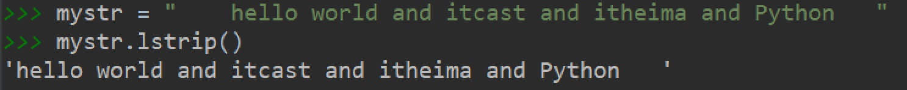


- rstrip()：删除字符串右侧空白字符。

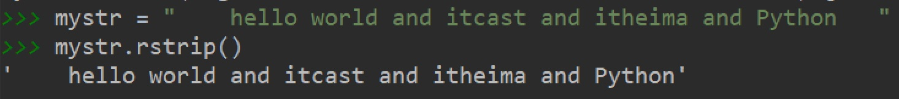


- strip()：删除字符串两侧空白字符。

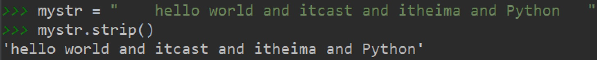


- ljust()：返回一个原字符串左对齐,并使用指定字符(默认空格)填充至对应长度 的新字符串。

1. 语法

``` python
字符串序列.ljust(长度, 填充字符)
```

2. 输出效果

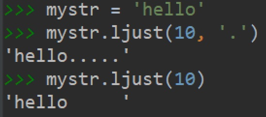


- rjust()：返回一个原字符串右对齐,并使用指定字符(默认空格)填充至对应长度 的新字符串，语法和ljust()相同。
- center()：返回一个原字符串居中对齐,并使用指定字符(默认空格)填充至对应长度 的新字符串，语法和ljust()相同。

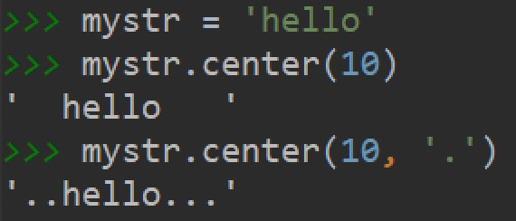


#### 判断

所谓判断即是判断真假，返回的结果是布尔型数据类型：True 或 False。

- startswith()：检查字符串是否是以指定子串开头，是则返回 True，否则返回 False。如果设置开始和结束位置下标，则在指定范围内检查。

1. 语法

``` python
字符串序列.startswith(子串, 开始位置下标, 结束位置下标)
```

2. 快速体验

``` python
mystr = "hello world and itcast and itheima and Python   "

print(mystr.startswith('hello')) # 结果：True
print(mystr.startswith('hello', 5, 20)) # 结果False
```

- endswith()：：检查字符串是否是以指定子串结尾，是则返回 True，否则返回 False。如果设置开始和结束位置下标，则在指定范围内检查。

1. 语法

``` python
字符串序列.endswith(子串, 开始位置下标, 结束位置下标)
```

2. 快速体验

``` python
mystr = "hello world and itcast and itheima and Python"

print(mystr.endswith('Python')) # 结果：True
print(mystr.endswith('python')) # 结果：False
print(mystr.endswith('Python', 2, 20)) # 结果：False
```

- isalpha()：如果字符串至少有一个字符并且所有字符都是字母则返回 True, 否则返回 False。

``` python
mystr1 = 'hello'
mystr2 = 'hello12345'

print(mystr1.isalpha()) # 结果：True
print(mystr2.isalpha()) # 结果：False
```

- isdigit()：如果字符串只包含数字则返回 True 否则返回 False。

``` python
mystr1 = 'aaa12345'
mystr2 = '12345'

print(mystr1.isdigit()) # 结果： False
print(mystr2.isdigit()) # 结果：False
```

- isalnum()：如果字符串至少有一个字符并且所有字符都是字母或数字则返 回 True,否则返回 False。

``` python
mystr1 = 'aaa12345'
mystr2 = '12345-'

print(mystr1.isalnum()) # 结果：True
print(mystr2.isalnum()) # 结果：False
```

- isspace()：如果字符串中只包含空白，则返回 True，否则返回 False。

``` python
mystr1 = '1 2 3 4 5'
mystr2 = '     '

print(mystr1.isspace()) # 结果：False
print(mystr2.isspace()) # 结果：True
```


# list列表（序列）

列表：可以一次性存储多个数据，且可以为不同数据类型。

格式定义：[]使用一对方括号表示空列表、[a],[a, b, c]用逗号分隔项目

```python
[数据1, 数据2, 数据3, 数据4......]
```

[x for x in iterable]使用列表推导器、list()或list(iterable)使用类型构造器

## 查找

### 下标

``` python
name_list = ['Tom', 'Lily', 'Rose']

print(name_list[0])  # Tom
print(name_list[1])  # Lily
print(name_list[2])  # Rose
```

### 函数

- index()：返回指定数据所在位置的下标 。

1. 语法

``` python
列表序列.index(数据, 开始位置下标, 结束位置下标)
```

2. 快速体验

``` python
name_list = ['Tom', 'Lily', 'Rose']

print(name_list.index('Lily', 0, 2))  # 1
```

> 注意：如果查找的数据不存在则报错。

- count()：统计指定数据在当前列表中出现的次数。

``` python
name_list = ['Tom', 'Lily', 'Rose']

print(name_list.count('Lily'))  # 1
```

- len()：访问列表长度，即列表中数据的个数。

``` python
name_list = ['Tom', 'Lily', 'Rose']

print(len(name_list))  # 3
```


### 判断是否存在

- in：判断指定数据在某个列表序列，如果在返回True，否则返回False

``` python
name_list = ['Tom', 'Lily', 'Rose']

print('Lily' in name_list) # 结果：True
print('Lilys' in name_list) # 结果：False
```


- not in：判断指定数据不在某个列表序列，如果不在返回True，否则返回False

``` python
name_list = ['Tom', 'Lily', 'Rose']

print('Lily' not in name_list) # 结果：False
print('Lilys' not in name_list) # 结果：True
```

- 体验案例

需求：查找用户输入的名字是否已经存在。

``` python
name_list = ['Tom', 'Lily', 'Rose']

name = input('请输入您要搜索的名字：')

if name in name_list:
    print(f'您输入的名字是{name}, 名字已经存在')
else:
    print(f'您输入的名字是{name}, 名字不存在')
```


## 增加

作用：增加指定数据到列表中。

- append()：列表结尾追加数据。

1. 语法

``` python
列表序列.append(数据)
```

2. 体验

``` python
name_list = ['Tom', 'Lily', 'Rose']
name_list.append('xiaoming')

print(name_list) # 结果：['Tom', 'Lily', 'Rose', 'xiaoming']
```

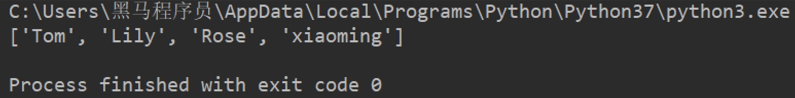

> 列表追加数据的时候，直接在原列表里面追加了指定数据，即修改了原列表，故列表为可变类型数据。

3. 注意点

如果append()追加的数据是一个序列，则追加整个序列到列表

``` python
name_list = ['Tom', 'Lily', 'Rose']
name_list.append(['xiaoming', 'xiaohong'])

print(name_list) # 结果：['Tom', 'Lily', 'Rose', ['xiaoming', 'xiaohong']]
```


- extend()：列表结尾追加数据，如果数据是一个序列，则将这个序列的数据逐一添加到列表。

1. 语法

```python
列表序列.extend(数据)
```

2. 快速体验

   2.1 单个数据

```python
name_list = ['Tom', 'Lily', 'Rose']
name_list.extend('xiaoming')

print(name_list) # 结果：['Tom', 'Lily', 'Rose', 'x', 'i', 'a', 'o', 'm', 'i', 'n', 'g']
```

​	2.2 序列数据

```python
name_list = ['Tom', 'Lily', 'Rose']
name_list.extend(['xiaoming', 'xiaohong'])

print(name_list) # 结果：['Tom', 'Lily', 'Rose', 'xiaoming', 'xiaohong']
```


- insert()：指定位置新增数据。

1. 语法

``` python
列表序列.insert(位置下标, 数据)
```

2. 快速体验

``` python
name_list = ['Tom', 'Lily', 'Rose']
name_list.insert(1, 'xiaoming')

print(name_list) # 结果：['Tom', 'xiaoming', 'Lily', 'Rose']
```


## 删除

- del

1. 语法

``` python
del 目标
```

2. 快速体验

   2.1 删除列表

``` python
name_list = ['Tom', 'Lily', 'Rose']

del name_list # 结果：报错提示：name 'name_list' is not defined
print(name_list)
```

​	2.2 删除指定数据

``` python
name_list = ['Tom', 'Lily', 'Rose']

del name_list[0]
 
print(name_list) # 结果：['Lily', 'Rose']
```


- pop()：删除指定下标的数据(默认为最后一个)，并返回该数据。

1. 语法

``` python
列表序列.pop(下标)
```

2. 快速体验

``` python
name_list = ['Tom', 'Lily', 'Rose']

del_name = name_list.pop(1)

print(del_name) # 结果：Lily
print(name_list) # 结果：['Tom', 'Rose']
```


- remove()：移除列表中某个数据的第一个匹配项。

1. 语法

``` python
列表序列.remove(数据)
```

2. 快速体验

``` python
name_list = ['Tom', 'Lily', 'Rose']
name_list.remove('Rose')

print(name_list) # 结果：['Tom', 'Lily']
```


- clear()：清空列表

``` python
name_list = ['Tom', 'Lily', 'Rose']
name_list.clear()

print(name_list) # 结果： []
```


## 修改

- 修改指定下标数据

``` python
name_list = ['Tom', 'Lily', 'Rose']
name_list[0] = 'aaa'

print(name_list) # 结果：['aaa', 'Lily', 'Rose']
```


- 逆置：reverse()

``` python
num_list = [1, 5, 2, 3, 6, 8]
num_list.reverse()

print(num_list) # 结果：[8, 6, 3, 2, 5, 1]
```


- 排序：sort()

1. 语法

``` python
列表序列.sort( key=None, reverse=False)
```

> 注意：reverse表示排序规则，**reverse = True** 降序， **reverse = False** 升序（默认）

2. 快速体验

``` python
num_list = [1, 5, 2, 3, 6, 8]
num_list.sort()

print(num_list) # 结果：[1, 2, 3, 5, 6, 8]
```


## 复制

函数：copy()

``` python
name_list = ['Tom', 'Lily', 'Rose']

name_li2 = name_list.copy()

print(name_li2) # 结果：['Tom', 'Lily', 'Rose']
```


## 列表的循环遍历

需求：依次打印列表中的各个数据。

### while

- 代码

``` python
name_list = ['Tom', 'Lily', 'Rose']

i = 0
while i < len(name_list):
    print(name_list[i])
    i += 1
```

- 执行结果


### for

- 代码

``` python
name_list = ['Tom', 'Lily', 'Rose']

for i in name_list:
    print(i)
```

- 执行结果

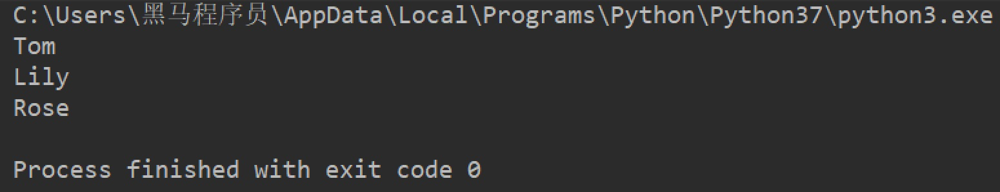

## 列表嵌套

所谓列表嵌套指的就是一个列表里面包含了其他的子列表。

应用场景：要存储班级一、二、三三个班级学生姓名，且每个班级的学生姓名在一个列表。

``` python
name_list = [['小明', '小红', '小绿'], ['Tom', 'Lily', 'Rose'], ['张三', '李四', '王五']]
```

> 思考： 如何查找到数据"李四"？

``` python
print(name_list[2]) # 第一步：按下标查找到李四所在的列表
print(name_list[2][1]) # 第二步：从李四所在的列表里面，再按下标找到数据李四
```


## list相关函数

1、cmp(list1, list2)比较两个列表的元素			2、len(list)列表元素个数

3、max(list)返回列表元素最大值				    4、min(list)返回列表元素最小值

5、list(seq)将元组转换为列表

# tuple元组

## 定义元组

元组特点：定义元组使用==小括号==，且==逗号==隔开各个数据，数据可以是不同的数据类型且不能修改。

``` python
t1 = (10, 20, 30) # 多个数据元组
t2 = (10,) # 单个数据元组
```

> 注意：如果定义的元组只有一个数据，那么这个数据后面也好添加逗号，否则数据类型为唯一的这个数据的数据类型

``` python
t2 = (10,)
print(type(t2))  # tuple

t3 = (20)
print(type(t3))  # int

t4 = ('hello')
print(type(t4))  # str
```


## tuple的常见操作

元组数据不支持修改，只支持查找，具体如下：

- 按下标查找数据

``` python
tuple1 = ('aa', 'bb', 'cc', 'bb')
print(tuple1[0])  # aa
```


- index()：查找某个数据，如果数据存在返回对应的下标，否则报错，语法和列表、字符串的index方法相同。

``` python
tuple1 = ('aa', 'bb', 'cc', 'bb')
print(tuple1.index('aa'))  # 0
```


- count()：统计某个数据在当前元组出现的次数。

``` python
tuple1 = ('aa', 'bb', 'cc', 'bb')
print(tuple1.count('bb'))  # 2
```


- len()：统计元组中数据的个数。

``` python
tuple1 = ('aa', 'bb', 'cc', 'bb')
print(len(tuple1))  # 4
```

> 注意：元组内的直接数据如果修改则立即报错

``` python
tuple1 = ('aa', 'bb', 'cc', 'bb')
tuple1[0] = 'aaa'
```

> 但是如果元组里面有列表，修改列表里面的数据则是支持的，故自觉很重要。

``` python
tuple2 = (10, 20, ['aa', 'bb', 'cc'], 50, 30)
print(tuple2[2])  # 访问到列表

tuple2[2][0] = 'aaaaa' # 结果：(10, 20, ['aaaaa', 'bb', 'cc'], 50, 30)
print(tuple2)
```


## tuple常用操作方法

能实现一般队列操作

```python
print(tuple1[1])
index()函数：查找数据					格式：元组.index('数据')
count()函数：统计某个数据出现的次数		格式：元组.count('数据')
len()函数：统计元组中数据的个数			格式：len(元组)
yield关键字：返回结果并记住当前返回代码位置，下次调用以上次位置开始
```


# dict字典

字典：里面的数据是以==键值对==形式出现，字典数据和数据顺序没有关系，只需要按照对应的键的名字查找数据即可

## 创建字典的语法

字典特点：

- 符号为==大括号==
- 数据为==键值对==形式出现
- 各个键值对之间用==逗号==隔开

``` python
dict1 = {'name': 'Tom', 'age': 20, 'gender': '男'} # 有数据字典
dict2 = {} # 空字典
dict3 = dict()
```

> 注意：一般称冒号前面的为键(key)，简称k；冒号后面的为值(value)，简称v。

使用字典推导式

```python
{}, {x: x ** 2 for x in range(10)}
```

使用类型构造器

```python
dict(), dict([('foo', 100), ('bar', 200)]), dict(foo=100, bar=200)
```

## 常用操作：

### 增

写法：==字典序列[key] = 值==

> 注意：如果key存在则修改这个key对应的值；如果key不存在则新增此键值对。

``` python
dict1 = {'name': 'Tom', 'age': 20, 'gender': '男'}

dict1['name'] = 'Rose'
# 结果：{'name': 'Rose', 'age': 20, 'gender': '男'}
print(dict1)

dict1['id'] = 110

# {'name': 'Rose', 'age': 20, 'gender': '男', 'id': 110}
print(dict1)
```

> 注意：字典为可变类型。


### 删

- del() / del：删除字典或删除字典中指定键值对。

``` python
dict1 = {'name': 'Tom', 'age': 20, 'gender': '男'}

del dict1['gender']

print(dict1) # 结果：{'name': 'Tom', 'age': 20}
```

- clear()：清空字典

``` python
dict1 = {'name': 'Tom', 'age': 20, 'gender': '男'}
dict1.clear()

print(dict1)  # {}
```


### 改

写法：==字典序列[key] = 值==

> 注意：如果key存在则修改这个key对应的值 ；如果key不存在则新增此键值对。

### 查

#### key值查找

``` python
dict1 = {'name': 'Tom', 'age': 20, 'gender': '男'}
print(dict1['name'])  # Tom
print(dict1['id'])  # 报错
```

> 如果当前查找的key存在，则返回对应的值；否则则报错。


#### get()

- 语法

``` python
字典序列.get(key, 默认值)
```

> 注意：如果当前查找的key不存在则返回第二个参数(默认值)，如果省略第二个参数，则返回None。

- 快速体验

``` python 
dict1 = {'name': 'Tom', 'age': 20, 'gender': '男'}
print(dict1.get('name'))  # Tom
print(dict1.get('id', 110))  # 110
print(dict1.get('id'))  # None
```

#### keys()

``` python
dict1 = {'name': 'Tom', 'age': 20, 'gender': '男'}
print(dict1.keys())  # dict_keys(['name', 'age', 'gender'])
```

#### values()

``` python
dict1 = {'name': 'Tom', 'age': 20, 'gender': '男'}
print(dict1.values())  # dict_values(['Tom', 20, '男'])
```

#### items()

``` python
dict1 = {'name': 'Tom', 'age': 20, 'gender': '男'}
print(dict1.items())  # dict_items([('name', 'Tom'), ('age', 20), ('gender', '男')])
```

## 字典的循环遍历

### 遍历字典的key

``` python
dict1 = {'name': 'Tom', 'age': 20, 'gender': '男'}
for key in dict1.keys():
    print(key)
```

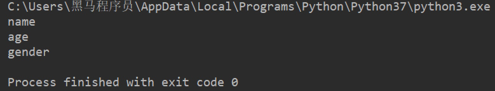

### 遍历字典的value

``` python
dict1 = {'name': 'Tom', 'age': 20, 'gender': '男'}
for value in dict1.values():
    print(value)
```

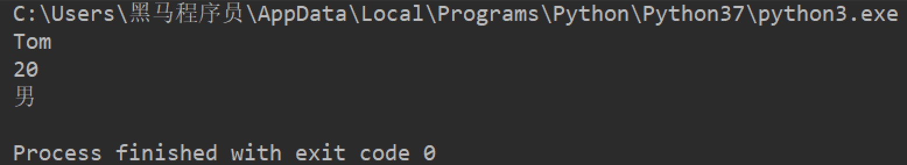

### 遍历字典的元素

``` python
dict1 = {'name': 'Tom', 'age': 20, 'gender': '男'}
for item in dict1.items():
    print(item)
```

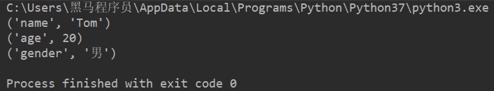

### 遍历字典的键值对

``` python
dict1 = {'name': 'Tom', 'age': 20, 'gender': '男'}
for key, value in dict1.items():
    print(f'{key} = {value}')
```

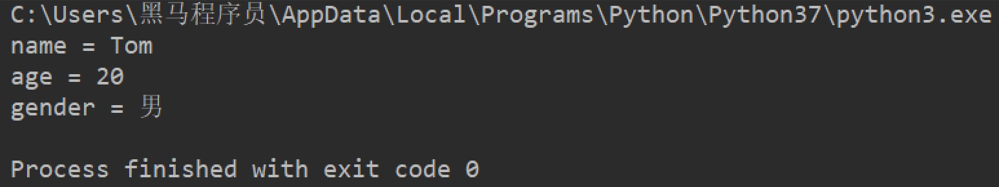


## 常用内置方法

list(d)返回字典 d 中使用的所有键的列表			len(d)返回字典 d 中的项数

keys()返回由字典键组成的一个新视图			values()返回由字典值组成的一个新视图

items()获取字典项 ((键, 值) 对) 组成的一个新视图

iter(d)返回字典中键为元素的迭代器 这是 iter(d.keys()) 的快捷方式

get(key[, default])如果 key 存在于字典中则返回 key 的值， 如果 default 未给出则默认为 None，

pop(key[, default])如果 key 存在于字典中则将其移除并返回其值，如没有返回为default

popitem()从字典中移除并返回一个 (键, 值) 对 键值对会按 LIFO后进先出顺序被返回

reversed(d)返回一个逆序获取字典键的迭代器 这是 reversed(d.keys()) 的快捷方式

update([other])使用来自 other 的键/值对更新字典，覆盖原有的键 返回 None

update()接受另一个字典对象，或者一个包含键/值对（以长度为二的元组或其他可迭代对象表示）的可迭代对象 如果给出了关键字参数，则会以其所指定的键/值对更新字典: d.update(red=1, blue=2)

setdefault(key[, default])如果字典存在键 key ，返回它的值如果不存在，插入值为 default 的键 key ，并返回 default  default 默认为 None

clear()移除字典中的所有元素					copy()返回原字典的浅拷贝


# set集合

定义：集合是由不重复元素组成的无序容器，不支持下标		

set()创建空集合，{}是用来创建字典的		格式：s2 = set()

```python
s1 = {10, 20, 30, 40, 50}
print(s1)

s2 = {10, 30, 20, 10, 30, 40, 30, 50}
print(s2)

s3 = set('abcdefg')
print(s3)

s4 = set()
print(type(s4))  # set

s5 = {}
print(type(s5))  # dict
```


## 集合常见操作方法

### 增加数据

- add()

``` python
s1 = {10, 20}
s1.add(100)
s1.add(10)
print(s1)  # {100, 10, 20}
```

> 因为集合有去重功能，所以，当向集合内追加的数据是当前集合已有数据的话，则不进行任何操作。

- update(), 追加的数据是序列。

``` python
s1 = {10, 20}
# s1.update(100)  # 报错
s1.update([100, 200])
s1.update('abc')
print(s1)
```

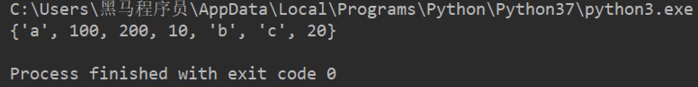

### 删除数据

- remove()，删除集合中的指定数据，如果数据不存在则报错。

``` python
s1 = {10, 20}

s1.remove(10)
print(s1)

s1.remove(10)  # 报错
print(s1)
```


- discard()，删除集合中的指定数据，如果数据不存在也不会报错。

``` python
s1 = {10, 20}

s1.discard(10)
print(s1)

s1.discard(10)
print(s1)
```


- pop()，随机删除集合中的某个数据，并返回这个数据。

``` python
s1 = {10, 20, 30, 40, 50}

del_num = s1.pop()
print(del_num)
print(s1)
```


### 查找数据

- in：判断数据在集合序列
- not in：判断数据不在集合序列

``` python
s1 = {10, 20, 30, 40, 50}

print(10 in s1)
print(10 not in s1)
```

## 其他操作

False在集合中表示为0，所以0和false只能存在一个

frozenset()冰冻集合函数：定义不能修改，可以将任何容器类型数据进行转化

支持推导式frozenset({i*2 for i in range(6)})

## 常用内置方法

```python
add(elem)将元素 elem 添加到集合中
copy()返回原集合的浅拷贝
update(*others)更新集合，添加来自 others 中的所有元素
len(s)返回集合 s 中的元素数量（即 s 的基数）
discard(elem)如果元素 elem 存在于集合中则将其移除
remove(elem)从集合中移除元素 elem，如果 elem 不存在于集合中则会引发 KeyError
pop()从集合中移除并返回任意一个元素，如果集合为空则会引发 KeyError
clear()从集合中移除所有元素							
```

## 集合运算

| 运算        | 方法                                                     |                                                              |
| ----------- | -------------------------------------------------------- | ------------------------------------------------------------ |
| 交集符：&   | intersection_update(*others)以交集方式更新引用方法的集合 |                                                              |
| 并集：      | union(*others)以并集方式返回一个新集合                   | difference_update(*others)以差集方式更新引用方法的集合       |
| 差集：-     | difference(*others)以差集方式返回一个新集合              |                                                              |
| 对称差集：^ | symmetric_difference(other)以对称差集方式返回一个新集合  | symmetric_difference_update(other)以对称差集方式更新引用方法的集合 |


 

issuperset(other)检测引用方法集合是否为超集，是则返回Ture

issubset(other)检测引用方法集合是否为other集合的子集，是则返回Ture

isdisjoint(other)检测引用方法集合和other集合是否为交集，不相交则返回Ture

intersection(*others)返回一个新集合，其中包含原集合以及 others 指定的所有集合中共有的元素

# 公共操作

## 一. 运算符

| 运算符 |      描述      |      支持的容器类型      |
| :----: | :------------: | :----------------------: |
|   +    |      合并      |    字符串、列表、元组    |
|   *    |      复制      |    字符串、列表、元组    |
|   in   |  元素是否存在  | 字符串、列表、元组、字典 |
| not in | 元素是否不存在 | 字符串、列表、元组、字典 |

### 1.1 +

``` python
# 1. 字符串 
str1 = 'aa'
str2 = 'bb'
str3 = str1 + str2
print(str3)  # aabb

# 2. 列表 
list1 = [1, 2]
list2 = [10, 20]
list3 = list1 + list2
print(list3)  # [1, 2, 10, 20]

# 3. 元组 
t1 = (1, 2)
t2 = (10, 20)
t3 = t1 + t2
print(t3)  # (10, 20, 100, 200)
```

### 1.2 *

``` python
# 1. 字符串
print('-' * 10)  # ----------

# 2. 列表
list1 = ['hello']
print(list1 * 4)  # ['hello', 'hello', 'hello', 'hello']

# 3. 元组
t1 = ('world',)
print(t1 * 4)  # ('world', 'world', 'world', 'world')
```

### 1.3 in或not in

``` python
# 1. 字符串
print('a' in 'abcd')  # True
print('a' not in 'abcd')  # False

# 2. 列表
list1 = ['a', 'b', 'c', 'd']
print('a' in list1)  # True
print('a' not in list1)  # False

# 3. 元组
t1 = ('a', 'b', 'c', 'd')
print('aa' in t1)  # False
print('aa' not in t1)  # True
```


## 二. 公共方法

| 函数                    | 描述                                                         |
| ----------------------- | ------------------------------------------------------------ |
| len()                   | 计算容器中元素个数                                           |
| del 或 del()            | 删除                                                         |
| max()                   | 返回容器中元素最大值                                         |
| min()                   | 返回容器中元素最小值                                         |
| range(start, end, step) | 生成从start到end的数字，步长为 step，供for循环使用           |
| enumerate()             | 函数用于将一个可遍历的数据对象(如列表、元组或字符串)组合为一个索引序列，同时列出数据和数据下标，一般用在 for 循环当中。 |

### 2.1 len()

``` python
str1 = 'abcdefg' # 1. 字符串
print(len(str1))  # 7

list1 = [10, 20, 30, 40] # 2. 列表
print(len(list1))  # 4

t1 = (10, 20, 30, 40, 50) # 3. 元组
print(len(t1))  # 5

s1 = {10, 20, 30} # 4. 集合
print(len(s1))  # 3

dict1 = {'name': 'Rose', 'age': 18} # 5. 字典
print(len(dict1))  # 2
```

### 2.2 del()

``` python
str1 = 'abcdefg' # 1. 字符串
del str1
print(str1)

list1 = [10, 20, 30, 40] # 2. 列表
del(list1[0])
print(list1)  # [20, 30, 40]
```

### 2.3 max()

``` python
str1 = 'abcdefg' # 1. 字符串
print(max(str1))  # g

list1 = [10, 20, 30, 40] # 2. 列表
print(max(list1))  # 40
```

### 2.4 min()

``` python
str1 = 'abcdefg' # 1. 字符串
print(min(str1))  # a

list1 = [10, 20, 30, 40] # 2. 列表
print(min(list1))  # 10
```

### 2.5 range()

``` python
for i in range(1, 10, 1):
    print(i) # 1 2 3 4 5 6 7 8 9

for i in range(1, 10, 2):
    print(i) # 1 3 5 7 9

for i in range(10):
    print(i) # 0 1 2 3 4 5 6 7 8 9
```

> 注意：range()生成的序列不包含end数字。

### 2.6 enumerate()

- 语法

``` python
enumerate(可遍历对象, start=0)
```

> 注意：start参数用来设置遍历数据的下标的起始值，默认为0。

- 快速体验

``` python
list1 = ['a', 'b', 'c', 'd', 'e']

for i in enumerate(list1):
    print(i)

for index, char in enumerate(list1, start=1):
    print(f'下标是{index}, 对应的字符是{char}')
```

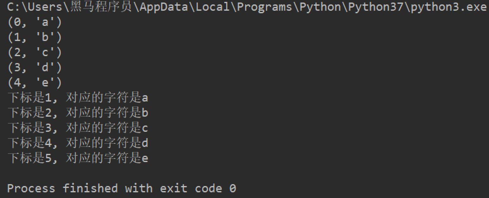

## 三. 容器类型转换

### 3.1 tuple()

作用：将某个序列转换成元组

``` python
list1 = [10, 20, 30, 40, 50, 20]
s1 = {100, 200, 300, 400, 500}

print(tuple(list1))
print(tuple(s1))
```


### 3.2 list()

作用：将某个序列转换成列表

``` python
t1 = ('a', 'b', 'c', 'd', 'e')
s1 = {100, 200, 300, 400, 500}

print(list(t1))
print(list(s1))
```


### 3.3 set()

作用：将某个序列转换成集合

``` python
list1 = [10, 20, 30, 40, 50, 20]
t1 = ('a', 'b', 'c', 'd', 'e')

print(set(list1))
print(set(t1))
```

> 注意：

 	1. 集合可以快速完成列表去重
 	2. 集合不支持下标

# 推导式

作用：用一个表达式创建一个有规律的列表或控制一个有规律列表。

列表推导式又叫列表生成式。

## 1.1 快速体验

需求：创建一个0-10的列表。

- while循环实现

``` python
list1 = [] # 1. 准备一个空列表

i = 0
while i < 10:
    list1.append(i) # 2. 书写循环，依次追加数字到空列表list1中
    i += 1

print(list1)
```

- for循环实现

``` python
list1 = []
for i in range(10):
    list1.append(i)

print(list1)
```

- 列表推导式实现

``` python 
list1 = [i for i in range(10)]
print(list1)
```

## 1.2 带if的列表推导式

需求：创建0-10的偶数列表

- 方法一：range()步长实现

``` python
list1 = [i for i in range(0, 10, 2)]
print(list1)
```

- 方法二：if实现

``` python
list1 = [i for i in range(10) if i % 2 == 0]
print(list1)
```

## 1.3 多个for循环实现列表推导式

需求：创建列表如下：

``` html
[(1, 0), (1, 1), (1, 2), (2, 0), (2, 1), (2, 2)]
```

- 代码如下：

``` python
list1 = [(i, j) for i in range(1, 3) for j in range(3)]
print(list1)
```


## 二. 字典推导式

思考：如果有如下两个列表：

``` python
list1 = ['name', 'age', 'gender']
list2 = ['Tom', 20, 'man']
```

如何快速合并为一个字典？

答：字典推导式

字典推导式作用：快速合并列表为字典或提取字典中目标数据。

## 2.1 快速体验

1. 创建一个字典：字典key是1-5数字，value是这个数字的2次方。

``` python
dict1 = {i: i**2 for i in range(1, 5)}
print(dict1)  # {1: 1, 2: 4, 3: 9, 4: 16}
```

2. 将两个列表合并为一个字典

``` python 
list1 = ['name', 'age', 'gender']
list2 = ['Tom', 20, 'man']

dict1 = {list1[i]: list2[i] for i in range(len(list1))}
print(dict1)
```

3. 提取字典中目标数据

``` python
counts = {'MBP': 268, 'HP': 125, 'DELL': 201, 'Lenovo': 199, 'acer': 99}

# 需求：提取上述电脑数量大于等于200的字典数据
count1 = {key: value for key, value in counts.items() if value >= 200}
print(count1)  # {'MBP': 268, 'DELL': 201}
```


## 三. 集合推导式

需求：创建一个集合，数据为下方列表的2次方。

``` python
list1 = [1, 1, 2]
```

代码如下：

``` python
list1 = [1, 1, 2]
set1 = {i ** 2 for i in list1}
print(set1)  # {1, 4}
```

> 注意：集合有数据去重功能。

# 函数

函数就是一段具有独立功能的代码快整合到一个整体并命名，在需要的位置调用这个名称即可完成对应的需求

1、函数在开发过程中，可以更高效的实现代码重用

2、如果不调用函数，定义函数内的代码将不会被执行

3、当调用函数时，解释器会回到定义函数的地方执行下方缩进的代码，执行完继续回到调用函数的地方

## 定义函数

``` python
def 函数名(参数1,参数2,*args,...): # *args为不定长参数
    代码1
    代码2
    ......
    return # 返回值
```

**调用函数**

``` python
函数名(参数)
```

> 注意：

 	1. 不同的需求，参数可有可无。
 	2. 在Python中，函数必须==先定义后使用==。

## 定义函数的说明文档

``` python
def 函数名(参数):
    """ 说明文档的位置 """
    代码
    ......
```

- 查看函数的说明文档

```python
help(函数名)
```

快速体验

``` python
def sum_num(a, b):
    """ 求和函数 """
    return a + b


help(sum_num)
```

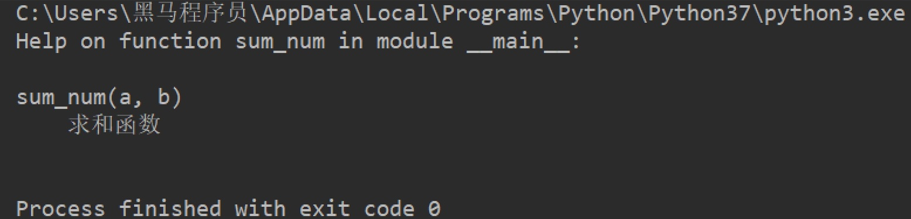

## 不定参数

不定长参数也叫可变参数。用于不确定调用的时候会传递多少个参数(不传参也可以)的场景。此时，可用包裹(packing)位置参数，或者包裹关键字参数，来进行参数传递，会显得非常方便。

- 包裹位置传递

``` python
def user_info(*args):
    print(args)

# ('TOM',)
user_info('TOM')
# ('TOM', 18)
user_info('TOM', 18)
```

> 注意：传进的所有参数都会被args变量收集，它会根据传进参数的位置合并为一个元组(tuple)，args是元组类型，这就是包裹位置传递。

- 包裹关键字传递

``` python
def user_info(**kwargs):
    print(kwargs)

# {'name': 'TOM', 'age': 18, 'id': 110}
user_info(name='TOM', age=18, id=110)
```

> 综上：无论是包裹位置传递还是包裹关键字传递，都是一个组包的过程。


## 引用

### 了解引用

在python中，值是靠引用来传递来的。

**我们可以用`id()`来判断两个变量是否为同一个值的引用。** 我们可以将id值理解为那块内存的地址标识。

``` python
# 1. int类型
a = 1
b = a

print(b)  # 1
print(id(a))  # 140708464157520
print(id(b))  # 140708464157520

a = 2
print(b)  # 1,说明int类型为不可变类型 
print(id(a))  # 140708464157552，此时得到是的数据2的内存地址
print(id(b))  # 140708464157520


# 2. 列表
aa = [10, 20]
bb = aa

print(id(aa))  # 2325297783432
print(id(bb))  # 2325297783432


aa.append(30)
print(bb)  # [10, 20, 30], 列表为可变类型
print(id(aa))  # 2325297783432
print(id(bb))  # 2325297783432
```

### 引用当做实参

代码如下：

``` python
def test1(a):
    print(a)
    print(id(a))

    a += a

    print(a)
    print(id(a))


# int：计算前后id值不同
b = 100
test1(b)

# 列表：计算前后id值相同
c = [11, 22]
test1(c)
```

效果图如下：

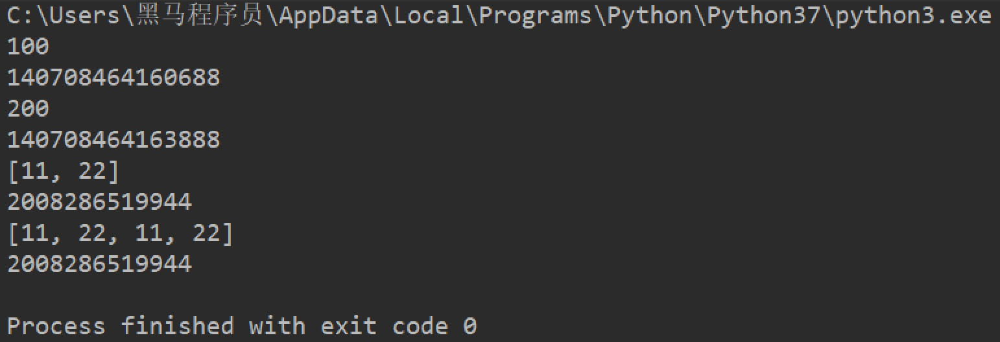

### 可变和不可变类型

所谓可变类型与不可变类型是指：数据能够直接进行修改，如果能直接修改那么就是可变，否则是不可变.

- 可变类型
  - 列表
  - 字典
  - 集合
- 不可变类型
  - 整型
  - 浮点型
  - 字符串
  - 元组


## 常用函数

format()格式化函数

根据对象所在的位置：print('{0} and {1}'.format('spam', 'eggs'))

关键字参数名引用值：print('The story of {0}, {1}, and {other}.'.format('Bill', 'Manfred',other='Georg'))

名称引用变量：table = {'Sjoerd': 4127, 'Jack': 4098, 'Dcab': 8637678}

print('Jack: {Jack:d}; Sjoerd: {Sjoerd:d}; Dcab: {Dcab:d}'.format(**table))Jack: 4098; Sjoerd: 4127; Dcab: 8637678

{}数字格式化{:.2f}保留小数点后两位3.14、	{:.0f}不带小数、			{:>10d}右对齐 (默认, 宽度为10)    13

{:+.2f}带符号保留小数点后两位+3.14、		{:.2%}百分比格式25.00%、	{:x<4d}数字补x (填充右边, 宽度为4) 5xxx

print(f'我的名字{b},我的学号是{d}')

另一种表达方法：f'{表达式}' 

print(type(num1)) #输出num1的数据类型type


## lambda函数

如果一个函数有一个返回值，并且只有一句话代码，可以使用lambda简化

语法：lambda  参数：表达式(返回值)			#直接打印lambda表达式，输出的是此lambda的内存地址

1、 参数可有可无，参数为1、可变参数*args时，默认输出元组

2、不定长可变参数**args时，默认输出字典

3、表达式能接收任意数量的参数但只能返回一个表达式的值

格式：fn1 = lambda  a，b：a + b		print(fn1(1, 2))		输出内容：3


## 可迭代对象常用处理函数

type(num1) #type()函数输出num1的数据类型

bin(num)将num十进制转换为二进制

iter(num).next()迭代器：将num容器类型数据作为对象传入迭代器，next()方法进行迭代

zip([iterable, ...])压缩函数，接收多个可迭代对象，后把每个传送对象中第i个元素组成一个新的迭代器(元组类型的)

sorted(iterable, cmp=None, key=function, reverse=False)排序函数对所有可迭代的对象进行排序操作，返回一个新的列表

参数：iterable=(容器型数据、range序列、迭代器)、reverse排序默认为true、key=自定义或内置函数

map(function, iterable, ...)根据提供的函数对传入对象中每个元素进行处理，返回一个新的迭代器

reduce(function, iterable[, initializer])对传入的可迭代对象中的元素进行function函数运算累积

需要引入 functools 模块导入该函数

filter(function, iterable)过滤函数，function返回Ture或false过滤掉不符合条件的元素，返回由符合条件元素组成的新列表


## 函数参数类型

变量的作用域：变量生效的范围

局部变量：只在某个函数体内部生效的变量		全局变量：在函数体内外部生效的变量	global a=20

函数的参数：传递和定义的参数顺序必须一致

1、 位置参数：根据前后位置来传递参数def user_info(name，age，gender)	user_info('TOM'，20，'男')

2、 关键字参数：函数调用，通过"键=值"形式加以指定。让函数更加清晰、容易使用，同时也清除了参数的顺序需求

格式：def user_info(name，age，gender)		user_info('TOM'，age=20，gender='男')

\#TOM位置参数必须在关键字参数前，关键字参数无顺序要求

3、 缺省参数(默认参数)：定义函数时，为参数提供默认值（传递参数时，没有对该参数进行传递，则使用默认值）

格式1：def user_info(name，age，gender='男')		user_info('TOM'，age=20)

格式2：def user_info(name，age，gender='男')		user_info('TOM'，age=20，gender='女')

4、不定长参数(可变参数)：用于不确定调用时会传递多少个参数(不传递也可以)的场景

包裹位置传递：接收所有不定个数的位置参数用的

格式：def user_info(*args)		user_info('TOM')

\#传递进的所有数据都被args变量收集，根据传进参数的位置合并成一个元组(tuple)

包裹关键字传递：接收关键字参数且不确定个数时

格式：def user_info(**args)		user_info(name='TOM'，age=20，gender='男')

\#无论是包裹位置还是关键字传递，都是一个组包的过程

拆包：将函数的返回数据进行拆分

拆包：元组：格式：def return_num():		return 100,200		n1，n2=return()

字典：dict1 = {'name'：'TOM'，'age'：18}	a，b=dict1

交换：将多个变量的值进行互换

1、 借助第三变量储存数据	c=0	c=a	a=b	b=c

2、 借助多重赋值			a，b=1，2	a，b=b，a

引用：在python中，值是靠引用来传递来的

\#id()函数查看变量的id值(可以理解为在内存的地址标识)，即判断两个变量是否为同一个值引用

格式：print(id(b))

可变和不可变类型：

不可变类型：int整型、float浮点型、str字符串、tuple元组

可变类型：list[]列表、dict{}字典、{}集合

## 递归函数

特点：1、函数内部自己调用自己，2、必须有出口

```python
格式解析：def num_sum(num):
  		 if num == 1:
			return 1
  			return num + num_sum(num-1)	#递归口

print(num_sum(3))
```

 

## 数据类型转换函数

| 函数           | 描述                                             | 函数                 | 描述                                                |
| -------------- | ------------------------------------------------ | -------------------- | --------------------------------------------------- |
| int(x [,base]) | 将x转换为一个整数                                | eval(str)            | 用来计算在字符串中的有效Python表达式,并返回一个对象 |
| long(x[,base]) | 将x转换为一个长整数                              | repr(x)              | 将对象 x 转换为表达式字符串                         |
| float(x)       | 将x转换到一个浮点数                              | complex(real[,imag]) | 创建一个复数                                        |
| str(x)         | 将对象 x 转换为字符串                            | frozenset(s)         | 转换为不可变集合                                    |
| tuple(s)       | 将序列 s 转换为一个元组                          | unichr(x)            | 将一个整数转换为Unicode字符                         |
| list(s)        | 将序列 s 转换为一个列表                          | ord(x)               | 将一个字符转换为它的整数值                          |
| set(s)         | 转换为可变集合                                   | hex(x)               | 将一个整数转换为一个十六进制字符串                  |
| dict(d)        | 创建一个字典。d 必须是一个序列 (key,value)元组。 | oct(x)               | 将一个整数转换为一个八进制字符串                    |
| chr(x)         | 将一个整数转换为一个字符                         |                      |                                                     |

## 高阶函数

==把函数作为参数传入==，这样的函数称为高阶函数，高阶函数是函数式编程的体现。函数式编程就是指这种高度抽象的编程范式。

在Python中，`abs()`函数可以完成对数字求绝对值计算。

``` python
abs(-10)  # 10
```

`round()`函数可以完成对数字的四舍五入计算。

``` python
round(1.2)  # 1
round(1.9)  # 2
```

需求：任意两个数字，按照指定要求整理数字后再进行求和计算。

- 方法1

``` python
def add_num(a, b):
    return abs(a) + abs(b)


result = add_num(-1, 2)
print(result)  # 3
```

- 方法2

``` python
def sum_num(a, b, f):
    return f(a) + f(b)


result = sum_num(-1, 2, abs)
print(result)  # 3
```

> 注意：两种方法对比之后，发现，方法2的代码会更加简洁，函数灵活性更高。

函数式编程大量使用函数，减少了代码的重复，因此程序比较短，开发速度较快。


### map()

map(func, lst)，将传入的函数变量func作用到lst变量的每个元素中，并将结果组成新的列表(Python2)/迭代器(Python3)返回。

需求：计算`list1`序列中各个数字的2次方。

``` python
list1 = [1, 2, 3, 4, 5]

def func(x):
    return x ** 2

result = map(func, list1)

print(result)  # <map object at 0x0000013769653198>
print(list(result))  # [1, 4, 9, 16, 25]
```


### reduce()

reduce(func，lst)，其中func必须有两个参数。每次func计算的结果继续和序列的下一个元素做累积计算。

> 注意：reduce()传入的参数func必须接收2个参数。

需求：计算`list1`序列中各个数字的累加和。

``` python
import functools

list1 = [1, 2, 3, 4, 5]


def func(a, b):
    return a + b


result = functools.reduce(func, list1)

print(result)  # 15
```


### filter()

filter(func, lst)函数用于过滤序列, 过滤掉不符合条件的元素, 返回一个 filter 对象。如果要转换为列表, 可以使用 list() 来转换。

``` python
list1 = [1, 2, 3, 4, 5, 6, 7, 8, 9, 10]


def func(x):
    return x % 2 == 0


result = filter(func, list1)

print(result)  # <filter object at 0x0000017AF9DC3198>
print(list(result))  # [2, 4, 6, 8, 10]
```


# 文件操作

input输入/output输出	

步骤：1、打开文件方法

open(file, mode='r', buffering=-1, encoding=None, errors=None, newline=None, closefd=True, opener=None)

file: 必需，文件路径（相对路径：../1.txt或者C:/users/appdata/1.txt绝对路径）		

mode: 可选，文件打开模式(1、'r'读取（默认）、不存在则报错，存在则打开文件，指针在文件最前面 

2、'w'写入，不存在文件则创建，存在则打开并清空，打开后文件的指针在文件的最前面、

3、'x'排它性创建，如果文件已存在则失败、

4、'a'打开文件用于写入，如果文件存在则指针在末尾追加、5、'b'二进制模式、6、't'文本模式（默认）、

7、'+'打开用于更新（读取与写入）)，'w+'对文件先写后读(w先清空文件所以什么内容都没有)

encoding: 默认为二进制字符集，一般使用utf-8

buffering: 设置缓冲							errors: 报错级别							

newline: 区分换行符

closefd: 传入的file参数类型					opener: 设置自定义开启器，开启器的返回值必须是一个打开的文件描述符

 

2、读写文件

file.read([size])方法，从当前指针位置开始读，到指定size字节数的地方，如果未给定或为负则读取所有

file.readline([size])严格且只读取当前指针所在的行，包括 "\n" 字符

file.readlines([sizeint])读取所有行并返回一个由每行组成一个元素的列表

file.write(str)只能将字符串类型内容写入文件

file.writelines(iterable)只能向文件写入一个字符串类型元素的容器，换行需要自己加入每行的换行符

3、关闭文件cloese()方法

 

常用方法：

seek([offset,] whence)：指针位置修改函数，offset偏移字节数，

whence：指针的位置，默认为0即从文件开头开始算起，1 代表从当前位置开始算起，2 代表从文件末尾算起

file.tell()返回当前指针位置

file.truncate([size])从当前指针位置截取 size 个字符进行保留其他全部去掉

# 内置模块(需导入)

## 序列化模块

序列化是指可以把python中的数据，以文本或进制的方式进行转换， 并且还能反序列化为原来的数据

将对象转换为可通过网络传输或可以存储到本地磁盘的数据格式（如：XML、JSON或特定格式的字节串）的过程称为序列化

python中各种容器类型数据都是对象


pickle二进制序列化模块

dumps(python对象)序列化函数，可以把一个python的任意对象序列化成为一个二进制对象并返回

loads()反序列化函数，可以把一个序列化后的二进制数据反序列化为python对象并返回

dump(obj对象，open的文件对象)文件序列化函数， 把一个数据对象进行序列化并写入到文件中

load()文件反序列化，在一个文件中读取序列化的数据，并且返回一个反序列化对象

json文本序列化模块(JavaScript Object Notation)

可以把一些符合转换的python数据对象，转为json格式的数据

JSON在js语言中是一个对象的表示方法，和Python中字典的定义规则和语法几乎一样

JSON在互联网中又是轻量级的文本数据交换格式， 数据传输，数据定义的一种数据格式

dumps(python对象)序列化函数

loads()反序列化函数

dump(python对象，open的文件对象): 对数据进行编码

load(open的文件对象): 对数据进行解码，一个文件中读取序列化的数据，并且返回一个反序列化对象

## 数学模块

math.ceil(x)向上取整函数，返回一个大于或者等于 x 的最小整数

math.floor(x)向下取整函数，返回一个小于或等于 x 的最大整数

math.pow(x, y)幂函数函数，x 的 y 次幂，返回浮点型数据

math.sqrt(x)平方根函数，返回 x 的开平方根，返回浮点型数据

math.fabs(x)绝对值函数，返回 x 的绝对值，返回浮点型数据

math.modf(x)浮点数据拆分， 将x 的小数和整数拆分。返回一个浮点型元素组成的元组

math.copysign(x, y)将y的正负赋值给x并返回浮点型元素，如：copysign(1.0, -0.0) 返回 -1.0

math.fsum(iterable)将可迭代对象内的元素进行求和并返回一个浮点数型的结果

math.pi数学常数 π = 3.141592...，精确到可用精度

math.e数学常数 e = 2.718281...，精确到可用精度

## random随机模块

random.random()返回 [0.0, 1.0) 范围内的一个随机浮点数（左闭右开）

random.randrange([start=0,] stop[, step])从指定范围内返回一个随机整数

random.randint(a, b)返回随机整数 N 满足 a <= N <= b

random.uniform(a, b)返回一个随机浮点数 N

random.choice(seq)从非空容器 seq 返回一个随机元素。 如果 seq 为空，则引发 IndexError

random.shuffle(x[, random])将非空容器x内元素随机打乱位置，并返回

## 系统接口模块

os.getcwd()返回当前工作目录

os.chdir('path')改变当前工作目录为path路径

os.listdir(['path])返回path路径下所有的文件或文件夹的名字组成的str类型元素的列表

os.makedirs(path[, mode])递归创建文件夹函数

os.mkdir('path'[, 0777])创建一个权限数字为名为path的文件夹（无法递归创建），默认mode=0777 (八进制)

os.removedirs('path')递归删除空文件夹

os.rmdir('path')删除path指定的空文件夹，如果目录非空，则抛出一个OSError异常

os.remove('path')删除路径为path的文件。如果path 是一个文件夹，将抛出OSError

os.renames(old, new)递归地对目录/文件进行更名

os.rename(src, dst)重命名文件或目录，将src命名为dst

os.system('command')在子外壳程序中执行命令

os.path路径模块，获取文件的属性信息

os.path.abspath(path)将相对路径转换为绝对路径，并返回

os.path.basename(path)返回路径 path 的基本名称（文件名/目录名）

os.path.dirname(path)返回路径 path 的基本名称外的路径

os.path.join(path, *paths)拼接一个或多个路径部分，并返回

os.path.split(path)将path中的路径和文件名拆分，并以str类型元素存储在元组中返回，若无文件则为空

os.path.splitext(path)将path中的路径和文件后缀名拆分，并以str类型元素存储在元组中返回，若无文件则为空

os.path.getsize(path)返回 path路径中文件的大小，以字节为单位，没有文件则报错

os.path.isdir(path)如果 path 是 现有的 目录，则返回 True

os.path.isfile(path)如果 path 是现有的 常规文件/link符号链接，则返回 True

os.path.islink(path)如果 path 指向的 现有 目录条目是一个符号链接，则返回 True

os.path.exists(path)检测 path路径中的文件或文件夹是否存在，返回 True

os.path.samefile(path1, path2)检测两个路径是否指向相同的文件或目录，则返回 True。这由设备号和 inode 号确定

## shutil(shell utility)高阶文件操作模块

shutil.copyfile(src, dst, *, follow_symlinks=True)将名为 src 的文件的内容（不包括元数据）拷贝到名为 dst 的文件，并返回 dst

shutil.copy2('src', 'dst', *, follow_symlinks=True)将文件src拷贝到文件或目录 dst并保留源文件信息（操作时间、权限等），follow_symlinks=True即src为符号链接进行拷贝

shutil.copy('src', 'dst', *, follow_symlinks=True)将文件 src 拷贝到文件或目录 dst

shutil.copytree(src, dst[, symlinks=False, ignore=None, copy_function=copy2, ignore_dangling_symlinks=False, dirs_exist_ok=False])将src整个目录树结构及其内容拷贝到名为 dst 的目录并返回目标目录，要求dst目录不存在，

shutil.rmtree(path[, ignore_errors=False, onerror=None])删除一个整个目录树，path必须指向一个目录（不能是一个目录的符号链接）,ignore_errors=True删除失败导致的错误将被忽略,此类错误将通过调用由 onerror 所指定的处理程序来处理

shutil.move(src, dst[, copy_function=copy2])递归地将一个文件或目录 (src) 移至另一位置 (dst) 并返回目标位置，若是文件存在则覆盖，也可用于修改文件或文件夹的名称

## zipfile解压缩模块

和file文件操作类似

zipfile.ZipFile(file, mode='r', compression=ZIP_STORED, allowZip64=True, compresslevel=None, *, strict_timestamps=True)

1.参数file表示文件的路径或类文件对象(file-like object);

2.参数mode指示打开zip文件的模式，默认值为'r'，表示读已经存在的zip文件，也可以为'w'或'a'，w'表示新建一个zip文档或覆盖一个已经存在的zip文档，'a'表示将数据附加到一个现存的zip文档中;

3.参数compression表示在写zip文档时使用的压缩方法，它的值可以是zipfile. ZIP_STORED 或zipfile. ZIP_DEFLATED。如果要操作的zip文件大小超过2G，应该将allowZip64设置为True。

ZipFile.write(filename, arcname=None, compress_type=None, compresslevel=None)

将名为 filename 的文件写入归档，arcname=指定的归档名

ZipFile.extract(member, path=None, pwd=None)

从归档中提取出一个成员放入当前工作目录

 

 

 

# 面向对象OOP

创建对象的时候，并不会把类中的属性和方法复制一份给对象，而是在对象中引用父类的方法

因此在访问对象的属性时，会先去找对象自己的属性，如果没有就去找这个类的属性和方法

对象：对象的属性/方法能进行引用、添加、修改、覆盖、删除（不能对引用的类方法和类属性操作），

类：支持实例化，属性能进行引用、添加、修改、覆盖、删除，类的方法除了不能进行访问可以进行其他操作

\#对类的操作会直接影响引用该类的对象

 

self：类的实例（引用该类的对象）		#不含self的方法不能被对象调用，但能使用类调用

 

属性：对象属性、类属性、私有属性

内置属性：__dict__返回类/对象所有的属性，组成的字典

__name__返回类、函数、方法的名字，组成的字符串

__module__获取类所在的文件名称，如果是当前文件，显示为_ _mian_ _

__class__返回对象或类所属的类  只是返回基类

__bases__获取当前类的父类列表，__base__获取当前类的父类

__doc__返回类/函数的文档字符串，如果没有定义则为None

__mro__获取当前类的继承链

方法：对象方法、类方法(方法中有cls这个形参，使用了@classmethod装饰器)、静态方法(使用@staticmethod修饰)、

私有方法(_ _方法名)、

内置方法： __init__(self,[...])初始化方法，在类实例化对象后，自动触发的一个方法

__del__(self)析构方法()类实例化对象被销毁时自动触发

_ _dict_ _ 方法：能获取当前类/对象的的

__new__(cls,[...)是对象实例化时第一个调用的方法，只取下 cls 参数并把其他参数传给 __init__ 

通过return object.__new__(cls)返回一个对象给init和del方法，否则init和del方法无self参数无法执行

__call__(self)方法，需在类中自己定义，可以将对象当成函数进行调用，用于类的解释说明调用

__length__(self)方法，需在类中自己定义，返回对象的长度

__str__(self)方法,需在类中自己定义，使用print打印对象时，会被调用

__repr__(self)方法,需在类中自己定义，使用print打印对象时，会被调用

__bool__(self)方法,需在类中自己定义，返回一个bool类型的值

成员相关魔术方法：

__getattribute__(self, name)当访问属性时(无论属性是否存在)，触发该方法

作用：可以在获取对象成员时，对数据进行一些处理

如果想要访问对象的成员必须使用object.__getattr__(self, item)来进行访问

__getattr__(self, name)当访问属性不存在时，触发该方法，#优先触发getattribute方法

作用：防止访问不存在的成员时报错，也可以为不存在的成员进行赋值操作

__setattr__(self，key，value)当给对象成员进行添加、修改时，触发该方法

作用：可以限制或管理对象成员中key键和值value的添加和修改操作

__delattr__(self，item)当删除对象成员时，自动触发

作用：可以去限制对象成员的删除，还可以删除不存在成员时防止报错

如果想要访问对象的成员必须使用object.__delattr__(self, item)来进行访问

 

访问成员顺序：1.调用__getattribute__魔术方法		2.调用数据描述符[后面会讲]

3.调用当前对象的成员							4.调用当前类的成员

5.调用非数据描述符[后面会讲]					6.调用父类的成员

7.调用__getattr__魔术方法

 

描述符类：当一个类中，包含(_ _get__.__set__，__del__ )中至少一个魔术方法时，都包含时为数据描述符

作用：定义描述符类对另一个类中的某个成员进行一个详细的管理操作(获取，赋值，删除)

__get__(self, instance, owner)：调用一个属性时触发

__set__(self, instance, value)：每次属性赋值时触发，instance，value值

__del__(self, instance)：删除属性时触发

 

对象销毁情况：1、程序执行完毕，内存中所有的资源都被销毁

2、使用del删除时

3、对象不再被引用时，会自动销毁

 

 

 

## 三大特性

封装：public公有的（默认）、protected受保护（_属性/方法）、prviate私有的（_ _属性/方法）

 

\#在python中给成员进行私有化，其实就是改了成员的名字		私有化==》 _类名_ _成员

 

继承：def 子类(父类，母类)

\#私有成员不能继承、#子类可以多继承（区别于java）、#所有类默认继承object类

继承对象属性的获取：实例对象的属性==>类的属性===>继承的父类===>__getattr__()方法

菱形继承：class d(b,c)	继承顺序：d>b父类>c母类>a祖先类>object类(采用广度优先算法)

super()方法.父类方法()：让子类可以调用父类的方法/属性（实际上是super调用mro列表的上一级中的方法/属性）

类.mro()方法：获取类继承关系列表

 

多态：子类实现的父类的方法，由于重写的方法内容不同，最终实现不同的结果		# obj.方法()

 

常用方法：

issubclass(A，B)方法：检测A类是否继承自B类，返回Ture或False

isinstance(A，B) 方法：检测A对象是否为B类的实例化对象

hasattr(D，'属性') 方法： 检测D 类/对象是否包含指定名称的属性/方法，返回Ture或False

getattr(D，'成员') 方法：获取D类/对象成员的属性值

setattr(D，'成员'，‘属性值’) 方法：设置D类/对象的成员的属性值

delattr(D，‘属性’) 方法：删除D类/对象的属性

 

 

 

单例模式：是一种创建型设计模式，它确保一个类有且只有一个特定类型的对象，并提供全局访问点。

1、确保类有且只有一个对象被创建

2、为对象提供一个访问点，使程序可以全局访问该对象

3、控制共享资源的并行访问

4、可以避免消耗过多的内存或CPU资源

 

Mixin混合设计模式：python中的Mixin是通过多继承实现的

Mixin必须是表示一种功能，而不是一个对象。

Mixin的功能必须单一，如果有多个功能，那就多定义Mixin类

Mixin类通常不单独使用，而是混合到其它类中，去增加功能的

Mixin 类不依赖子类的实现，即便子类没有继承这个Mixin,子类也能正常运行，可能就是缺少了一些功能。。

 

抽象类;与java一样，python也有抽象类的概念但是同样需要借助模块实现，**抽象类是一个特殊的类，它的特殊之处在于只能被继承，不能被实例化,需要子类实现抽象方法**

 

装饰器：在不改变原有函数代码，且保持原函数调用方法不变的情况下，给原函数增加新的功能(或者给类增加属性和

方法)

 

 

 

 

 

 

# pip工具使用

curl https://bootstrap.pypa.io/get-pip.py -o get-pip.py  # 下载安装脚本

yum install python3-pip -y	# linux安装pip


python get-pip.py   #运行安装脚本

pip3 list --outdated #pip检查哪些包需要更新

pip3 install 包名(模块) #安装

pip3 install -U pip #升级 pip  或easy_install --upgrade pip命令

pip3 uninstall SomePackage #卸载包

pip3 search SomePackage #搜索包

pip3 config set global.index-url https://pypi.tuna.tsinghua.edu.cn/simple	#永久安装源，清华的镜像源每五分钟更新一次，大而全

pip3 install -i https://pypi.tuna.tsinghua.edu.cn/simple package --trusted-host mirrors.aliyun.com

\#临时使用清华大学开源软件镜像站


## 离线依赖包安装

[Python库 搜索](https://pypi.org/)

pip3 download flask #下载flask依赖库，到本级路径

pip3 install pocketsphinx-0.1.15-cp39-cp39-win_amd64.whl #python3安装本地whl


# 升级Python 编译安装

[Python Release Python 3.12.1 下载](https://www.python.org/downloads/release/python-3121/)

1、解压源码包

```sh
root@master ~# tar -xf Python-3.12.0.tar.xz
```

2、编译安装

```sh
root@master ~# ./configure
root@master ~# make
root@master ~# make altinstall
```

注意：

​	这将安装新的Python版本并将其设置为系统的默认Python。如果你不想更改系统的默认Python，你可以在配置步骤中使用`--prefix`选项指定一个安装位置，然后将该位置添加到你的PATH环境变量中。

```bash
./configure --prefix=/path/to/install
make
sudo make install
export PATH=/path/to/install/bin:$PATH
```

这样，你就可以通过指定的路径访问新安装的Python版本，而不会影响系统的默认Python。


# python修改系统默认版本命令

要修改 `pip` 默认使用的 Python 版本，可以使用以下命令：

```sh
$ sudo update-alternatives --install /usr/bin/python python /usr/bin/python3.12 1
$ sudo update-alternatives --install /usr/bin/pip pip /usr/local/bin/pip3.12 1
```

以上命令将 `/usr/bin/python` 和 `/usr/bin/pip` 两个命令的默认路径分别指向 Python 3.12 版本和对应版本的 `pip` 命令。

执行完上述命令后，你可以通过以下命令验证是否已成功修改 `pip` 的默认 Python 版本：

```sh
$ pip -V
```

如果输出的版本号与你选择的 Python 版本相同，则说明已成功修改默认版本。
