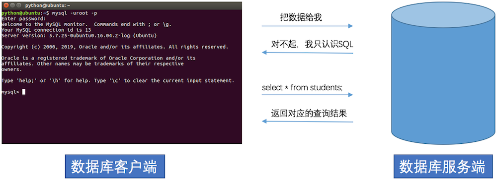

#  MySQL数据库的基本使用

## 关系型数据库管理系统

### 1. 关系型数据库管理系统的介绍

数据库管理系统（英语全拼：Relational Database Management System，简称RDBMS）是**为管理关系型数据库而设计的软件系统，如果大家想要使用关系型数据库就需要安装数据库管理系统，其实就是一个应用软件**。

**关系型数据库管理系统可以分为:**

- 关系型数据库服务端软件
- 关系型数据库客户端软件

**关系型数据库服务端软件:**

主要负责管理不同的数据库，而每个数据库里面会有一系列数据文件，数据文件是用来存储数据的, 其实数据库就是一系列数据文件的集合。

**关系型数据库客户端软件:**

主要负责和关系型数据库服务端软件进行通信, 向服务端传输数据或者从服务端获取数据.

**关系型数据库管理系统的效果图:**


**说明:**

1. 用户操作关系型数据库客户端，实现数据库相关操作。
2. 关系数据库客户端借助网络使用SQL语言和关系型数据库服务端进行数据通信
3. 关系型数据库服务端管理着不同的数据库，每个数据库会有一系列的数据文件，数据都保存在数据文件里面，每个数据库可以理解成是一个文件夹。

通过上面的效果图我们可以得知，数据库客户端和数据库服务器想要通信需要使用SQL

**通信流程效果图**



# PyMySQL的使用

### 1. 思考

如何实现将100000条数据插入到MySQL数据库?

**答案:**

如果使用之前学习的MySQL客户端来完成这个操作，那么这个工作量无疑是巨大的，我们可以通过使用程序代码的方式去连接MySQL数据库，然后对MySQL数据库进行增删改查的方式，实现10000条数据的插入，像这样使用代码的方式操作数据库就称为数据库编程。

### 2. Python程序操作MySQL数据库

**安装pymysql第三方包:**

```
sudo pip3 install pymysql
```

**说明:**

- 安装命令使用 sudo pip3 install 第三方包名
- 卸载命令使用 sudo pip3 uninstall 第三方包
- 大家现在使用的虚拟机已经安装了这个第三方包，可以使用： **pip3 show pymysql** 命令查看第三方包的信息
- **pip3 list** 查看使用pip命令安装的第三方包列表

**pymysql的使用:**

1. 导入 pymysql 包

   ```py
    import pymysql
   ```

2. 创建连接对象

   调用pymysql模块中的connect()函数来创建连接对象,代码如下:

   ```py
    conn=connect(参数列表)
   
    * 参数host：连接的mysql主机，如果本机是'localhost'
    * 参数port：连接的mysql主机的端口，默认是3306
    * 参数user：连接的用户名
    * 参数password：连接的密码
    * 参数database：数据库的名称
    * 参数charset：通信采用的编码方式，推荐使用utf8
   ```

   **连接对象操作说明:**

   - 关闭连接 conn.close()
   - 提交数据 conn.commit()
   - 撤销数据 conn.rollback()

3. 获取游标对象

   获取游标对象的目标就是要执行sql语句，完成对数据库的增、删、改、查操作。代码如下:

   ```py
   cur =conn.cursor()  # 调用连接对象的cursor()方法获取游标对象  
   ```

   **游标操作说明:**

   - 使用游标执行SQL语句: execute(operation [parameters ]) 执行SQL语句，返回受影响的行数，主要用于执行insert、update、delete、select等语句
   - 获取查询结果集中的一条数据:cur.fetchone()返回一个元组, 如 (1,'张三')
   - 获取查询结果集中的所有数据: cur.fetchall()返回一个元组,如((1,'张三'),(2,'李四'))
   - 关闭游标: cur.close(),表示和数据库操作完成

4. pymysql完成数据的查询操作

   ```py
   import pymysql
   
   # 创建连接对象
   conn = pymysql.connect(host='localhost', port=3306, user='root', password='mysql',database='python', charset='utf8')
   cursor = conn.cursor() # 获取游标对象
   
   sql = "select * from students;" # 查询 SQL 语句
   row_count = cursor.execute(sql) # 执行 SQL 语句 返回值就是 SQL 语句在执行过程中影响的行数
   print("SQL 语句执行影响的行数%d" % row_count)
   
   # 取出结果集中一行数据,　例如:(1, '张三')
   # print(cursor.fetchone())
   
   # 取出结果集中的所有数据, 例如:((1, '张三'), (2, '李四'), (3, '王五'))
   for line in cursor.fetchall():
       print(line)
   
   cursor.close() # 关闭游标
   conn.close() # 关闭连接
   ```
   
5. pymysql完成对数据的增删改

   ```py
   import pymysql
   
   # 创建连接对象
   conn = pymysql.connect(host='localhost', port=3306, user='root', password='mysql',database='python', charset='utf8')
   
   cursor = conn.cursor() # 获取游标对象
   
   try:
       # 添加 SQL 语句
       # sql = "insert into students(name) values('刘璐'), ('王美丽');"
       # 删除 SQ L语句
       # sql = "delete from students where id = 5;"
       # 修改 SQL 语句
       sql = "update students set name = '王铁蛋' where id = 6;"
       # 执行 SQL 语句
       row_count = cursor.execute(sql)
       print("SQL 语句执行影响的行数%d" % row_count)
       conn.commit()  # 提交数据到数据库
   except Exception as e:
       conn.rollback()  # 回滚数据， 即撤销刚刚的SQL语句操作
   
   
   cursor.close() # 关闭游标
   conn.close() # 关闭连接
   ```
   
   **说明:**
   
   - conn.commit() 表示将修改操作提交到数据库
   - conn.rollback() 表示回滚数据
   
6. 防止SQL注入

   什么是SQL注入?

   用户提交带有恶意的数据与SQL语句进行字符串方式的拼接，从而影响了SQL语句的语义，最终产生数据泄露的现象。

   如何防止SQL注入?

   SQL语句参数化

   - SQL语言中的参数使用%s来占位，此处不是python中的字符串格式化操作
   - 将SQL语句中%s占位所需要的参数存在一个列表中，把参数列表传递给execute方法中第二个参数

   **防止SQL注入的示例代码:**

   ```py
   from pymysql import connect
   
   def main():
       find_name = input("请输入物品名称：")
       # 创建Connection连接
       conn = connect(host='localhost',port=3306,user='root',password='mysql',database='jing_dong',charset='utf8')
       cs1 = conn.cursor() # 获得Cursor对象
   
       # 非安全的方式
       # 输入 ' or 1 = 1 or '   (单引号也要输入)
       # sql = "select * from goods where name='%s'" % find_name
       # print("""sql===>%s<====""" % sql)
       # # 执行select语句，并返回受影响的行数：查询所有数据
       # count = cs1.execute(sql)
   
       # 安全的方式
       # 构造参数列表
       params = [find_name]
       # 执行select语句，并返回受影响的行数：查询所有数据
       count = cs1.execute("select * from goods where name=%s", params)
       # 注意：
       # 如果要是有多个参数，需要进行参数化
       # 那么params = [数值1, 数值2....]，此时sql语句中有多个%s即可
       # %s 不需要带引号
   
       print(count)  # 打印受影响的行数
       # result = cs1.fetchone() # 获取查询的结果
       result = cs1.fetchall()
       print(result) # 打印查询的结果
       cs1.close() # 关闭Cursor对象
       conn.close()  # 关闭Connection对象
   
   if __name__ == '__main__':
       main()
   ```
   
   **说明:**

   - execute方法中的 %s 占位不需要带引号


# Python操作redis

## 一、python对redis基本操作

#### （1）连接redis

```python
# 方式1
import redis

r = redis.Redis(host='127.0.0.1', port=6379)
r.set('foo', 'Bar')
print(r.get('foo'))


# 方式2
import redis

pool = redis.ConnectionPool(host='127.0.0.1', port=6379)
r = redis.Redis(connection_pool=pool)
r.set('bar', 'Foo')
print(r.get('bar'))
```

通常情况下, 当我们需要做redis操作时, 会创建一个连接, 并基于这个连接进行redis操作, 操作完成后, 释放连接,一般情况下, 这是没问题的, 但当并发量比较高的时候, 频繁的连接创建和释放对性能会有较高的影响。于是, 连接池就发挥作用了。连接池的原理是, 通过预先创建多个连接, 当进行redis操作时, 直接获取已经创建的连接进行操作, 而且操作完成后, 不会释放, 用于后续的其他redis操作。这样就达到了避免频繁的redis连接创建和释放的目的, 从而提高性能。

#### （2）数据类型操作

```python
import redis

pool = redis.ConnectionPool(host='127.0.0.1', port=6379, db=0, decode_responses=True)
r = redis.Redis(connection_pool=pool)

# （1）字符串操作：不允许对已经存在的键设置值
ret = r.setnx("name", "yuan")
print(ret)  # False
# （2）字符串操作：设置键有效期
r.setex("good_1001", 10, "2")
# （3）字符串操作：自增自减
r.set("age", 20)
r.incrby("age", 2)
print(r.get("age"))  # b'22'

# （4）hash操作：设置hash
r.hset("info", "name", "rain")
print(r.hget("info", "name"))  # b'rain'
r.hmset("info", {"gedner": "male", "age": 22})
print(r.hgetall("info"))  # {b'name': b'rain', b'gender': b'male', b'age': b'22'}

# （5）list操作：设置list
r.rpush("scores", "100", "90", "80")
r.rpush("scores", "70")
r.lpush("scores", "120")
print(r.lrange("scores", 0, -1))  # ['120', '100', '90', '80', '70']
r.linsert("scores", "AFTER", "100", 95)
print(r.lrange("scores", 0, -1))  # ['120', '100', '95', '90', '80', '70']
print(r.lpop("scores"))  # 120
print(r.rpop("scores"))  # 70
print(r.lindex("scores", 1)) # '95'

# （6）集合操作
# key对应的集合中添加元素
r.sadd("name_set", "zhangsan", "lisi", "wangwu")
# 获取key对应的集合的所有成员
print(r.smembers("name_set"))  # {'lisi', 'zhangsan', 'wangwu'}
# 从key对应的集合中随机获取 numbers 个元素
print(r.srandmember("name_set", 2))
r.srem("name_set", "lisi")
print(r.smembers("name_set"))  # {'wangwu', 'zhangsan'}

# （7）有序集合操作
# 在key对应的有序集合中添加元素
r.zadd("jifenbang", {"yuan": 78, "rain": 20, "alvin": 89, "eric": 45})
# 按照索引范围获取key对应的有序集合的元素
# zrange( name, start, end, desc=False, withscores=False, score_cast_func=float)
print(r.zrange("jifenbang", 0, -1))  # ['rain', 'eric', 'yuan', 'alvin']
print(r.zrange("jifenbang", 0, -1, withscores=True))  # ['rain', 'eric', 'yuan', 'alvin']
print(r.zrevrange("jifenbang", 0, -1, withscores=True))  # ['rain', 'eric', 'yuan', 'alvin']

print(r.zrangebyscore("jifenbang", 0, 100))
print(r.zrangebyscore("jifenbang", 0, 100, start=0, num=1))

# 删除key对应的有序集合中值是values的成员
print(r.zrem("jifenbang", "yuan"))  # 删除成功返回1
print(r.zrange("jifenbang", 0, -1))  # ['rain', 'eric', 'alvin']

# （8）键操作
r.delete("scores")
print(r.exists("scores"))
print(r.keys("*"))
r.expire("name",10)
```


## 二、关于redis的实战案例

### （1）案例1：KV缓存


第1个是最基础也是最常?的就是KV功能，我们可以用Redis来缓存用户信息、会话信息、商品信息等等。下面这段代码就是通过缓存读取逻辑。

```python
import redis

pool = redis.ConnectionPool(host='127.0.0.1', port=6379, db=6, decode_responses=True)
r = redis.Redis(connection_pool=pool)


def get_user(user_id):
    user = r.get(user_id)
    if not user:
        user = UserInfo.objects.get(pk=user_id)
        r.setex(user_id, 3600, user)

    return user
```

### （2）案例2：分布式锁

什么是分布式锁

> ❝
>
> 分布式锁其实就是，控制分布式系统不同进程共同访问共享资源的一种锁的实现。如果不同的系统或同一个系统的不同主机之间共享了某个临界资源，往往需要互斥来防止彼此干扰，以保证一致性。
>
> ❞

提到Redis的分布式锁，很多小伙伴马上就会想到`setnx`+ `expire`命令。即先用`setnx`来抢锁，如果抢到之后，再用`expire`给锁设置一个过期时间，防止锁忘记了释放。

> ❝
>
> SETNX 是SET IF NOT EXISTS的简写.日常命令格式是SETNX key value，如果 key不存在，则SETNX成功返回1，如果这个key已经存在了，则返回0。
>
> ❞

假设某电商网站的某商品做秒杀活动，key可以设置为key_resource_id,value设置任意值，伪代码如下：

#### 方案1

```python
import redis

pool = redis.ConnectionPool(host='127.0.0.1')
r = redis.Redis(connection_pool=pool)
ret = r.setnx("key_resource_id", "ok")
if ret:
    r.expire("key_resource_id", 5)  # 设置过期时间
    print("抢购成功！")
    r.delete("key_resource_id")  # 释放资源
else:
    print("抢购失败！")

```

但是这个方案中，`setnx`和`expire`两个命令分开了，**「不是原子操作」**。如果执行完`setnx`加锁，正要执行`expire`设置过期时间时，进程crash或者要重启维护了，那么这个锁就“长生不老”了，**「别的线程永远获取不到锁啦」**。

#### 方案2：SETNX + value值是(系统时间+过期时间)

为了解决方案一，**「发生异常锁得不到释放的场景」**，可以把过期时间放到`setnx`的value值里面。如果加锁失败，再拿出value值校验一下即可。加锁代码如下：

````python
import time


def foo():
    expiresTime = time.time() + 10
    ret = r.setnx("key_resource_id", expiresTime)
    if ret:
        print("当前锁不存在，加锁成功")
        return True

    oldExpiresTime = r.get("key_resource_id")
    if float(oldExpiresTime) < time.time():  # 如果获取到的过期时间，小于系统当前时间，表示已经过期
        # 锁已过期，获取上一个锁的过期时间，并设置现在锁的过期时间
        newExpiresTime = r.getset("key_resource_id", expiresTime)
        if oldExpiresTime == newExpiresTime:
            #  考虑多线程并发的情况，只有一个线程的设置值和当前值相同，它才可以加锁
            return True  # 加锁成功

    return False  # 其余情况加锁皆失败


foo()
````

#### 方案3

实际上，我们还可以使用Py的redis模块中的set函数来保证原子性（包含setnx和expire两条指令）代码如下：

```python
r.set("key_resource_id", "1", nx=True, ex=10)
```

### （3）案例4：延迟队列

延时队列可以通过Redis的zset(有序列表)来实现。我们将消息序列化为一个字符串作为zset的值。这个消息的到期时间处理时间作为score，然后用多个线程轮询zset获取到期的任务进行处理，多线程时为了保障可用性，万一挂了一个线程还有其他线程可以继续处理。因为有多个线程，所有需要考虑并发争抢任务，确保任务不能被多次执行。


```python
import time
import uuid

import redis

pool = redis.ConnectionPool(host='127.0.0.1', port=6379, decode_responses=True)
r = redis.Redis(connection_pool=pool)


def delay_task(task_name, delay_time):
    # 保证value唯一
    task_id = task_name + str(uuid.uuid4())

    retry_ts = time.time() + delay_time
    r.zadd("delay-queue", {task_id: retry_ts})


def loop():
    print("循环监听中...")
    while True:
        # 最多取1条
        task_list = r.zrangebyscore("delay-queue", 0, time.time(), start=0, num=1)

        if not task_list:
            # 延时队列空的，休息1s
            print("cost 1秒钟")
            time.sleep(1)
            continue
        task_id = task_list[0]
        success = r.zrem("delay-queue", task_id)
        if success:
            # 处理消息逻辑函数
            handle_msg(task_id)

def handle_msg(msg):
    """消息处理逻辑"""
    print(f"消息{msg}已经被处理完成！")


import threading

t = threading.Thread(target=loop)
t.start()

delay_task("任务1延迟5", 5)
delay_task("任务2延迟2", 2)
delay_task("任务3延迟3", 3)
delay_task("任务4延迟10", 10)
```

redis的zrem方法是对多线程争抢任务的关键，它的返回值决定了当前实例有没有抢到任务，因为loop方法可能会被多个线程、多个进程调用， 同一个任务可能会被多个进程线程抢到，通过zrem来决定唯一的属主。同时，一定要对handle_msg进行异常捕获， 避免因为个别任务处理问题导致的循环异常退出。

### （4）案例5：发布订阅

```bash
subscribe channel # 订阅
publish channel mes # 发布消息
```

````python
import threading

import redis

r = redis.Redis(host='127.0.0.1')


def recv_msg():
    pub = r.pubsub()

    pub.subscribe("fm104.5")
    pub.parse_response()

    while 1:
        msg = pub.parse_response()
        print(msg)


def send_msg():
    msg = input(">>>")
    r.publish("fm104.5", msg)


t = threading.Thread(target=send_msg)
t.start()

recv_msg()
````

### （5）案例3：定时任务

利用 Redis 也能实现订单30分钟自动取消。

用户下单之后，在规定时间内如果不完成付款，订单自动取消，并且释放库存使用技术：Redis键空间通知（过期[回调](https://so.csdn.net/so/search?q=回调&spm=1001.2101.3001.7020)）用户下单之后将订单id作为key，任意值作为值存入redis中，给这条数据设置过期时间，也就是订单超时的时间启用键空间通知

#### 开启过期key监听

```python
from redis import StrictRedis

redis = StrictRedis(host='localhost', port=6379)

# 监听所有事件
# pubsub = redis.pubsub()
# pubsub.psubscribe('__keyspace@0__:*')
#
# print('Starting message loop')
# while True:
#     message = pubsub.get_message()
#     if message:
#         print(message)

# 监听过期key
def event_handler(msg):
    print("sss",msg)
    thread.stop()

pubsub = redis.pubsub()
pubsub.psubscribe(**{'__keyevent@0__:expired': event_handler})
thread = pubsub.run_in_thread(sleep_time=0.01)

```

### 