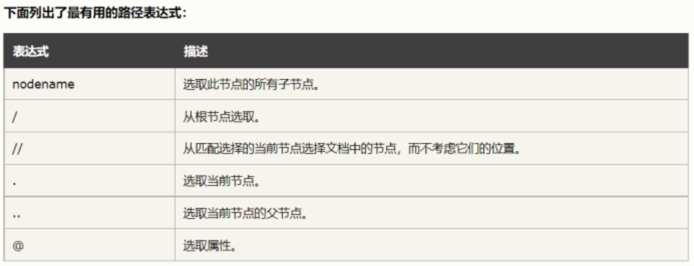

# 爬虫

GET是默认的HTTP请求方法，用于直接输入网址的方式去访问网页

POST方法主是向Web服务器提交表单数据，通常表单提交时采用POST方法

GET把请求参数包含在URL中，POST通过请求体传递参数

GET相对POST不安全，参数直接暴露在URL上，用来传递敏感信息

安装：pip install requests

XPath,全称XML Path Language,即XML路径语言，它是一门在XML文档中查找信息的语言。

最初是用来搜寻XML文档的，但同样适用于HTML文档的搜索。所以在做爬虫时完全可以使用XPath 

做相应的信息抽取。

 

 

1. XPath概览

XPath的选择功能十分强大，它提供了非常简洁明了的路径选择表达式。另外，它还提供了超过

100个内建函数，用于字符串、数值、时间的匹配以及节点、序列的处理等，几乎所有想要定位的节点

都可以用XPath来选择。

官方文档: https://www.w3.org/TR/xpath/

 

 

2. XPath常用规则

 

 

这里列出了XPath的常用匹配规则，示例如下:

//title[@lang=’eng’]

这是一个XPath规则，代表的是选择所有名称为title,同时属性lang的值为eng的节点，后面会

通过Python的lxml库，利用XPath进行HTML的解析。

 

3、安装

windows->python3环境下: pip install lxml

linux环境下: pip3 install lxml

 

 

4、实例引入