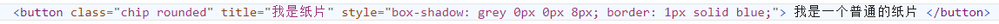
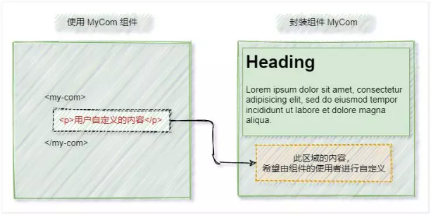

## 7.1：注册组件
一个`Vue`组件在使用前需要先被“注册”，这样`Vue`才能在渲染模板时找到其对应的实现；组件注册有两种方式：全局注册、局部注册

### 7.1.1：全局注册
可使用`app.component(name, Component)` 注册组件的方法，在此应用的任意组件的模板中使用
- `name`：注册的名字

- `Component`：需要注册的组件

  main.js 中全局注册组件
```vue  
import {createApp} from 'vue'
import App from './App.vue'
import login from "@/components/login.vue";

createApp(App).mount('#app')
createApp(App).component('login', login)
```

```vue
<template>
    <Login/>  <!-- 使用注册的组件 -->
</template>
```

### 7.1.2：局部注册
局部注册的组件需要在使用它的父组件中显式导入，并且只能在该父组件中使用
在选项式 API 中，我们可以使用`components`选项来局部注册组件
```vue
<template>
    <h3>登录系统</h3>
    <LoginVue/><!-- 3：使用全局注册的组件 -->
</template>

<script>
import LoginVue from 'login.vue'; // 1：引入需要注册的组件
export default {
    components: {LoginVue} // 2：注册组件选项
}
</script>
```

在组合式 API 中的`<script setup>`内，直接导入的组件就可以在模板中直接可用，无需注册
```vue
<script setup>
import LoginVue from 'login.vue';// 1：引入需要注册的组件，无需注册
</script>
```

## 7.2：数据传递【父 -> 子】
如果父组件向子组件进行传递数据，那么我们需要在子组件中声明`props`来接收传递数据的属性，可采用字符串数组式或对象式来声明`props`

父组件向子组件传递数据，在使用组件的标签上采用属性方式传递的`props`值，可使用`v-bind:`或`:`来绑定属性

组件中`props`中的数据是只读的，不可直接更改，只能通过父组件进行更改
声明与使用
1.  在选项式 API 中
	（1.  我们可以提供`props`选项来声明接收传递的数据
	（2.  在`JS`中可使用`this.$props`来访问声明的自定义的属性
	（3.  在视图模板中，可直接访问`props`中声明的自定义属性
2.  在组合式 API 中
	(1.  我们可以采用`defineProps`宏来声明接收传递的数据
	(2.  在`JS`中可使用`defineProps`返回的对象来访问声明的自定义的属性
	(3.  在视图模板中，可直接访问`defineProps`中声明的自定义属性

#### 7.2.1：字符串数组的形式

```vue
<script> //字符串数组的形式【选项式】
export default {
	props: ['flat', 'title'] // 使用 props 选项
}
</script>

<script setup> //字符串数组的形式【组合式】
defineProps(['flat', 'title']) // 使用 defineProps 宏来声明
</script>
```

例子：

需要注册的组件 Button.vue【选项式】

父组件使用 Button.vue 组件【选项式】

需要注册的组件 Button.vue【组合式】

父组件使用 Button.vue 组件【组合式】


#### 7.2.2：对象的形式
对象形式声明的`props`，可以对传来的值进行校验，如果传入的值不满足类型要求，会在浏览器控制台中抛出警告来提醒使用者

对象形式声明的`props`，`key`是`prop`的名称，值则为约束的条件

对象中的属性：
`type`：类型，如`String`、`Number`、`Boolean`、`Array`、`Object`、`Date`、`Function`、`Symbol`
`default`：默认值；对象或者数组应当用工厂函数返回
`required`：是否必填，布尔值
`validator`：自定义校验，函数类型

```vue
<script> //对象形式声明 props【选项式】
    export default {
        props: {  // 基础类型检查
            propA: Number, //（给出 `null` 和 `undefined` 值则会跳过任何类型检查）
            propB: [String, Number],  // 多种可能的类型
            propC: {
                type: String, 
                required: true // 必传，且为 String 类型
            },
            propD: {
                type: Number, 
                default: 100  // Number 类型的默认值
            },
            propE: {
                type: Object, // 对象类型的默认值
                default(rawProps) { // 工厂函数会收到组件所接收的原始 props , 作为参数
                    return { message: 'hello' } // 对象或者数组应当用工厂函数返回
                }
            },
            propF: {
                validator(value) { // 自定义类型校验函数
                    return ['success', 'warning', 'danger'].includes(value) // The value must match one of these strings
                }
            },
            propG: {
                type: Function, // 函数类型的默认值
                default() { // 不像对象或数组的默认，这不是一个工厂函数。这会是一个用来作为默认值的函数
                    return 'Default function'
                }
            }
        }
    }
</script>

<script> //对象形式声明 props【组合式】
    defineProps({  // 基础类型检查
        propA: Number, // （给出 `null` 和 `undefined` 值则会跳过任何类型检查）
        propB: [String, Number], // 多种可能的类型
        propC: { 
            type: String,
            required: true // 必传，且为 String 类型
        },
        propD: {
            type: Number, 
            default: 100 // Number 类型的默认值
        },
        propE: {  
            type: Object, // 对象类型的默认值
            default(rawProps) { // 该函数接收组件所接收到的原始 prop 作为参数。
                return { message: 'hello' }  // 必须从一个工厂函数返回, 对象或数组的默认值
            }
        },
        propF: { 
            validator(value) {// 自定义类型校验函数
                return ['success', 'warning', 'danger'].includes(value) // The value must match one of these strings
            }
        },
        propG: { 
            type: Function, // 函数类型的默认值
            default() { 
                return 'Default function' // 不像对象或数组的默认，这不是一个工厂函数。这会是一个用来作为默认值的函数
            }
        }
    })
</script>
```


例子：  
需要注册的组件 Button.vue【选项式】
父组件使用 Button.vue 组件【选项式】
需要注册的组件 Button.vue【组合式】
父组件使用 Button.vue 组件【组合式】

注意：

1.  所有`prop`默认都是可选的，除非声明了`required: true`
2.  除`Boolean`外的未传递的可选`prop`将会有一个默认值`undefined`
3.  `Boolean`类型的未传递`prop`将被转换为`false`；
4.  当`prop`的校验失败后，Vue 会抛出一个控制台警告【在开发模式下】
5.  注意`prop`的校验是在组件实例被创建之前
    1.  在选项式 API 中，实例的属性（比如`data`、`computed`等) 将在`default`或`validator`函数中不可用
    2.  在组合式 API 中，`defineProps`宏中的参数不可以访问`<script setup>`中定义的其他变量，因为在编译时整个表达式都会被移到外部的函数中

特别提醒：
关于`Boolean`类型转换：
为了更贴近原生`boolean attributes`的行为，声明为`Boolean`类型的`props`有特别的类型转换规则

如声明时：`defineProps({ error: Boolean })`
传递数据时：

-   `<MyComponent error/>`：相当于 `<MyComponent :error="true" />`
-   `<MyComponent />`：相当于 `<MyComponent :error="false" />`

## 7.3：组件事件【子 -> 父】

有的时候，父组件在使用子组件时，子组件如何给父组件传值呢？
1.  子组件声明自定义的事件
2.  子组件中触发自定义事件（可传值）
3.  父组件使用子组件时监听对应的自定义事件，并执行父组件中的函数（获取子组件传递的值）

### 7.3.1：【子组件】声明组件事件
1.  在选项式 API 中，子组件可通过`emits`选项来声明自定义的事件
2.  在组合式 API 中，子组件可通过`defineEmits()`宏来声明自定义的事件

### 7.3.1：【子组件】声明组件事件
1.  在选项式 API 中，子组件可通过`emits`选项来声明自定义的事件
2.  在组合式 API 中，子组件可通过`defineEmits()`宏来声明自定义的事件

#### 7.3.1.1：字符串数组式声明自定义事件  
采用字符串数组可以声明简单的自定义事件：  
```vue
<script> //数组式自定义事件【选项式】
    export default {
        emits: ['inFocus', 'submit']
    }
</script>

<script setup> //数组式自定义事件【组合式】
    defineEmits(['inFocus', 'submit'])
</script>
```

#### 7.3.1.2：对象式声明自定义事件  
采用对象式声明自定义事件，还可以进行校验传递的参数是否符合预期要求  
对象式声明自定义事件中，属性名为自定义事件名，属性值则是是否验证传递的参数：  
1.  属性值为null则不需要验证  
2. 属性值为函数时，参数为传递的数据，函数返回true则验证通过，返回false则验证失败，验证失败可以用警告语句提示开发者【注意：无论是true还是false都会继续执行下去的，父组件都会获取到传递的值】  

```vue
<script> //对象式自定义事件【选项式】
    export default {
        emits: {
            autoEvent1: null, // 无需校验
            autoEvent2: (param) => {  // 需要校验，param 可以是多个参数，返回布尔值来表明事件是否合法
	            // true 则通过, false 则不通过，可以在控制台输入警告语句
            }
        }
    }
</script>

<script setup> //对象式自定义事件【组合式】
defineEmits({
    autoEvent1: null, // 无需校验
    // 需要校验，param 可以是多个参数，返回布尔值来表明事件是否合法
    autoEvent2: (param) => {
        // true 则通过, false 则不通过，可以在控制台输入警告语句
    }
})
</script>
```

### 7.3.2：【子组件】触发组件事件  
在选项式 API 中，可通过组件当前实例this.$emit(event, ...args)来触发当前组件自定义的事件
在组合式 API 中，可调用defineEmits宏返回的emit(event, ...args)函数来触发当前组件自定义的事件
其中上方两个参数分别为：
	●event：触发事件名，字符串类型 
	●...args：传递参数，可没有，可多个

```vue
<template>
    <button @click="emitAgeEvent">触发自定义事件</button>
    <hr>
    <!-- 触发自定义事件 changeAge，并传递参数 30 -->
    <button @click="$emit('changeAge', 30)">触发自定义事件</button>
</template>

<script> //Button.vue 触发自定义事件【选项式】
export default {
    emits: ['changeAge'], // 自定义事件
    methods: {
        emitAgeEvent() {
            this.$emit('changeAge', 1, 20) // 触发自定义事件 changeAge，并传递参数 1，20
        }
    }
}
</script>

<script setup> //Button.vue 触发自定义事件【组合式】
const emit = defineEmits(['changeAge']) // 自定义事件，并返回 emit 函数

function emitAgeEvent() {
    emit('changeAge', 1, 20) // 触发自定义事件 changeAge，并传递参数 1，20
}
</script>
```

### 7.3.3：【父组件】监听子组件自定义事件  
使用`v-on:event="callback"`或者`@event="callback"`来监听子组件是否触发了该事件
1、`event`：事件名字（camelCase 形式命名的事件，在父组件中可以使用kebab-case形式来监听）
2、`callback`：回调函数，如果子组件触发该事件，那么在父组件中执行对应的回调函数，回调函数声明参数可自动接收到触发事件传来的值  

```vue
<template>
    <h3> 开始年龄：{{ startAge }}</h3>
    <h3>结束年龄：{{ endAge }}</h3>

    <ButtonVue @change-age="addAge" /> <!-- 使用引入的组件，并通过属性传递数据 -->
</template>

<script> //监听子组件自定义事件【选项式】
import ButtonVue from './components/Button.vue';
export default {
    components: { ButtonVue },
    data: () => ({
        startAge: 0, // 开始年龄 
        endAge: 0 // 结束年龄
    }),
    methods: {
        addAge(start_age, end_age) { // 子组件触发事件的回调函数
            console.log('----------------');
            console.log(start_age)
            console.log(end_age)
            this.startAge = start_age
            this.endAge = end_age
        }
    }
}
</script>

<script setup> //监听子组件自定义事件【组合式】
import { ref } from 'vue';
import ButtonVue from './components/Button.vue';

let startAge = ref(0)
let endAge = ref(0)

function addAge(start_age, end_age) { // 子组件触发事件的回调函数
    console.log('----------------');
    console.log(start_age)
    console.log(end_age)
    startAge.value = start_age
    endAge.value = end_age
}
</script>
```

### 7.3.4：组件事件例子  
##### 7.3.4.1：字符串数组式声明自定义事件
```vue
<template>
  {{ student }}
    <hr>
    <StudentVue
            @change-student="getNewStudent"
            @change-age-and-name="getNewAgeAndName"
            @change-age="getNewAge"/> <!-- 监听子组件事件，并与触发本地事件 -->
</template>

<script>
import StudentVue from './组件事件--子.vue';
export default {
    components: {StudentVue},
    data: () => ({
        student: {
            name: 'Jack',
            age: 18,
            sex: '男'
        }
    }),
    methods: {
        getNewAge(newAge) { // 获取子组件传递值
            console.log('年龄的新值：' + newAge)
            this.student.age = newAge
        },
    }
}
</script>

<script setup>
import {reactive} from 'vue';
import StudentVue from './组件事件--子.vue';

let student = reactive({
    name: 'Jack',
    age: 18,
    sex: '男'
})

function getNewAge(newAge) {// 获取子组件传递值
    console.log('年龄的新值：' + newAge)
    student.age = newAge
}

</script>
```

```vue
<template>
    <button @click="emitEventAge">更改年龄</button>
    <br>
    <br>
    <button @click="$emit('changeAgeAndName', 10, 'Annie')">
        更改年龄和名字
    </button>
    <br>
    <br>
    <button @click="$emit('changeStudent', { age: 40, name: 'Tom', sex: '男' })">
        更改学生
    </button>
</template>

<script>
export default {
    emits: ['changeAge', 'changeAgeAndName', 'changeStudent'], // 自定义事件选项
    methods: {
        emitEventAge() {
            this.$emit('changeAge', 30) // 选项式通过 this.$emit 触发自定义事件，并传值
        }
    }
}
</script>

<script setup>
let emit = defineEmits(['changeAge', 'changeAgeAndName', 'changeStudent']) // 自定义事件

function emitEventAge() {
    emit('changeAge', 30) // 选项式通过 this.$emit 触发自定义事件，并传值
}
</script>
```

##### 7.3.4.2：对象式声明自定义事件
```vue
<template>
    <button @click="emitEventAge">更改年龄</button>
    <br>
    <br>
    <button @click="$emit('changeAgeAndName', 10, 'Annie')">
        更改年龄和名字
    </button>
    <br>
    <br>
    <button @click="$emit('changeStudent', { age: 40, name: 'Drew', sex: '男' })">
        更改学生（验证通过）
    </button>
    <br>
    <br>
    <button @click="$emit('changeStudent', { age: -10, name: 'Tom', sex: '男' })">
        更改学生（验证失败）
    </button>
</template>

<script>
export default {
    emits: { // 自定义事件选项
        changeAge: null,  // 无需验证
        changeAgeAndName: null,  // 无需验证
        changeStudent: stu => {
            if (stu.age <= 0) {
                console.warn('年龄不得小于等于0')
                return false // false：验证不通过，会有警告语句，父组件依旧可以获取该值
            }
            return true // true：验证通过
        }
    },
    methods: {
        emitEventAge() {
            this.$emit('changeAge', 30) // 选项式通过 this.$emit 触发自定义事件，并传值
        }
    }
}
</script>

<script setup>
let emit = defineEmits({ // 自定义事件
    changeAge: null, // 无需验证
    changeAgeAndName: null, // 无需验证
    changeStudent: stu => {
        if (stu.age <= 0) {
            console.warn('年龄不得小于等于0')
            return false // false：验证不通过，会有警告语句，父组件依旧可以获取该值
        }
        return true // true：验证通过
    }
})

function emitEventAge() {
    emit('changeAge', 30)  // 选项式通过 this.$emit 触发自定义事件，并传值
}
</script>
```

```vue
<template>
  {{ student }}
    <hr>
    <StudentVue
            @change-student="getNewStudent"
            @change-age-and-name="getNewAgeAndName"
            @change-age="getNewAge"/>
</template>

<script>
import StudentVue from './组件事件--对象式--子.vue';

export default {
    components: {StudentVue},
    data: () => ({
        student: {
            name: 'Jack',
            age: 18,
            sex: '男'
        }
    }),
    methods: {
        getNewAge(newAge) { // 获取子组件传递值
            console.log('年龄的新值：' + newAge)
            this.student.age = newAge
        },
    }
}
</script>


<script setup>
import {reactive} from 'vue';
import StudentVue from './组件事件--对象式--子.vue';

let student = reactive({
    name: 'Jack',
    age: 18,
    sex: '男'
})

function getNewAge(newAge) { // 获取子组件传递值
    console.log('年龄的新值：' + newAge)
    student.age = newAge
}
</script>
```

## 7.4：透传属性和事件
### 7.4.1：如何“透传属性和事件”
父组件在使用子组件的时候，如何“透传属性和事件”给子组件呢？
1透传属性和事件并没有在子组件中用props和emits声明
2透传属性和事件最常见的如@click和class、id、style
3当子组件只有一个根元素时，透传属性和事件会自动添加到该根元素上；如果根元素已有class或style属性，它会自动合并  

```vue
<template>
  <!-- 透传的属性（style，class，title）在子组件中并没有在 props 声明 -->
  <!-- 透传的事件（click）在子组件中并没有在 emits 声明 -->
    <ChipVue
            class="rounded"
            style="border: 1px solid blue;"
            title="纸片"
            @click="say"
    />
</template>

<script> //父组件 APP.vue【选项式】
import ChipVue from './子组件 Chip.vue'

export default {
    components: {ChipVue},
    methods: {
        say() {
            alert('Hello')
        }
    }
}
</script>

<script setup> //父组件 APP.vue【组合式】
import ChipVue from './子组件 Chip.vue'

function say() {
    alert('Hello')
}
</script>
```

```vue
<template> //子组件 Chip.vue
  <!--当子组件只有一个根元素时，透传属性和事件会自动添加到该根元素上
      如果根元素已有 class 或 style 属性，它会自动合并-->
    <button class="chip" style="box-shadow: 0 0 8px grey;">
        普通纸片
    </button>
</template>

<style>
.chip {
    border: none;
    background-color: rgb(231, 231, 231);
    padding: 8px 15px;
}

.rounded {
    border-radius: 100px;
}
</style>
```
渲染的结果：


### 7.4.2：如何禁止“透传属性和事件”

1.  当子组件_只有一个根元素时_，透传属性和事件会自动添加到该根元素上，那怎么阻止呢？
2.  在选项式 API 中，你可以在组件选项中设置`inheritAttrs: false`来阻止；
3.  在组合式 API 的`<script setup>`中，你需要一个额外的`<script>`块来书写`inheritAttrs: false`选项声明来禁止
```vue
<script>
export default {
    inheritAttrs: false // 阻止自动透传给唯一的根组件
}
</script>
```

### 7.4.3：多根元素的“透传属性和事件”
多根节点的组件并没有自动“透传属性和事件”的行为，由于`Vue`不确定要将“透传属性和事件”透传到哪里，所以我们需要`v-bind="$attrs"`来显式绑定，否则将会抛出一个运行时警告
```vue
<script> //父组件 App.vue
import ChipVue from './多根元素的“透传属性和事件”--子.vue'

export default {
    components: {ChipVue},
    methods: {
        say() {
            alert('Hello')
        }
    }
}
</script>

<template>
  <!-- 透传的属性（style，class，title）在子组件中并没有在 props 声明 -->
  <!-- 透传的事件（click）在子组件中并没有在 emits 声明 -->
    <ChipVue
            class="rounded"
            style="border: 1px solid blue;"
            title="纸片"
            @click="say"
    />
</template>
```

```vue
<template> //子组件 Chip
    <button class="chip">  <!-- 多根节点的组件并没有自动“透传属性和事件”的行为 -->
        普通纸片
    </button>

    <hr>
    <button class="chip" v-bind="$attrs">
        普通纸片
    </button>

    <hr>
    <button class="chip" v-bind="$attrs">
        普通纸片
    </button>
</template>

<style>
.chip {
    border: none;
    background-color: rgb(231, 231, 231);
    padding: 8px 15px;
}

.rounded {
    border-radius: 100px;
}
</style>
```

### 7.4.4：访问“透传属性和事件”
1.  在选项式 API 中，我们可通过`this.$attrs`来访问“透传属性和事件”
2.  在组合式 API 中的`<script setup>`中引入`useAttrs()`来访问一个组件的“透传属性和事件”
```vue
<template>
    <button class="chip" v-bind="$attrs">
        普通纸片
    </button>

    <hr>
    <h6>{{ $attrs }}</h6>
    <ul>
        <li>{{ $attrs.title }}</li>
        <li>{{ $attrs.class }}</li>
        <li>{{ $attrs.style }}</li>
    </ul>
    <button @click="$attrs.onClick()">执行透传的事件</button>

    <hr>
    <button @click="showAttrs">在 JS 中访问透传的属性和事件</button>
</template>

<script>
export default {
    methods: {
        showAttrs() { // 在 JS 中访问透传的属性和事件
            console.log(this.$attrs)
            console.log(this.$attrs.class)
            console.log(this.$attrs.title)
            console.log(this.$attrs.style)
            this.$attrs.onClick()
        }
    }
}
</script>
```
注意：
-   虽然这里的`attrs`对象总是反映为最新的“透传属性和事件”，但它并不是响应式的 (考虑到性能因素)，你不能通过侦听器去监听它的变化
-   如果你需要响应性，可以使用`prop`或者你也可以使用`onUpdated()`使得在每次更新时结合最新的`attrs`执行副作用


## 7.5：插槽
在某些场景中，我们可能想要为子组件传递一些模板片段，让子组件在它们的组件中渲染这些片段，为此 vue 提供了组件的插槽

### 7.5.1：什么是插槽
在封装组件时，可以使用`<slot>`元素把不确定的、希望由用户指定的部分定义为插槽；插槽可以理解为给预留的内容提供占位符
插槽也可以提供默认内容，如果组件的使用者没有为插槽提供任何内容，则插槽内的默认内容会生效

注意：如果在封装组件时没有预留任何`<slot>`插槽，用户提供传递一些模板片段将会被遗弃


```vue
<template>
    <CardVue>
        <!-- 向子组件插槽中提供内容 -->
        <button>关闭</button>
    </CardVue>
</template>

<script>
import CardVue from './slot插槽--子.vue'
export default {
    components: {CardVue},
}
</script>
```

```vue
<template> //子组件 Card.vue
    <div class="card">
        <h2 class="title"></h2>
        <div class="subtitle"></div>
        <div class="content"></div>
        <div class="action">
            <!-- 定义一个插槽 -->
            <slot>卡片功能区域</slot> <!-- 插槽的默认内容，只有没有提供内容时，才会显示 -->
        </div>
    </div>
</template>
```

### 7.5.2：具名插槽
1.  如果在封装组件时需要预留多个插槽节点，则需要为每个`<slot>`插槽指定具体的`name`名称，这种带有具体名称的插槽叫做“具名插槽”
2.  没有指定`name`名称的插槽，默认隐含的名称叫 `#default`
3.  在`<template>`元素上使用 `v-slot:slotName`或者`#slotName`向指定的具名插槽提供内容

```vue
<template> //父组件
    <CardVue>
        <!-- v-slot:slotName 向具名插槽提供内容 -->
        <template v-slot:cardTitle>博客</template>

        <!-- #slotName 向具名插槽提供内容 -->
        <template #cardSubtitle><i>百万博主分享经验</i></template>

        <!-- 向子组件默认插槽中提供内容 -->
        <template #default><button>关闭</button></template>
    </CardVue>
</template>
```

```vue
<template> //子组件 Card.vue
    <div class="card">
        <h2 class="title">
            <slot name="cardTitle"></slot> <!-- 带有 name 的属性的插槽，称为具名插槽 -->
        </h2>
        <div class="subtitle">
            <slot name="cardSubtitle"></slot>
        </div>
        <div class="content">
            <slot name="cardContent"></slot>
        </div>
        <div class="action">
            <!-- 定义一个插槽 --> <!-- 插槽的默认内容，只有没有提供内容时，才会显示 -->
            <slot>卡片功能区域</slot> <!-- 没有 name 属性的插槽称为默认插槽，会有一个隐含的名字：default -->
        </div>
    </div>
</template>
```

### 7.5.3：作用域插槽
在声明插槽时使用属性值的方式来传递子组件的数据，这种带有数据的插槽称之为作用域插槽

如何在向插槽提供的内容时获得子组件域内的数据呢？
1.  在`<template>`元素上使用`v-slot:slotName="slotProps"`或`#slotName="slotProps"`的方式来访问插槽传递属性值
2.  如果没有使用`<template>`元素，而是直接在使用子组件中直接给默认插槽提供内容，可以在使用该子组件时用`v-slot="slotProps"`来接收该插槽传递的数据对象

注意：`<slot>`插槽上的`name`是一个`Vue`特别保留的属性，不会在作用域插槽中访问到
```vue
<template> //父组件
    <CardVue>
        <template #cardContent="dataProps"><!-- 访问插槽中提供的数据 -->
            <ul>
                <li>{{ dataProps }}</li>
                <li>博客的标题：{{ dataProps.cardBlog.title }}</li>
                <li>博客的时间：{{ dataProps.cardBlog.time }}</li>
                <li>博主：{{ dataProps.cardAuthor }}</li>
            </ul>
        </template>
    </CardVue>
</template>
```

```vue
<template> //子组件
    <div class="card">
        <div class="content">
            <!-- 带有数据的插槽称之为作用域插槽 -->
            <!-- <slot>插槽上的 name 是一个Vue特别保留的属性，不会在作用域插槽中访问到 -->
            <slot :cardAuthor="author" :cardBlog="blog" name="cardContent"></slot>
        </div>
    </div>
</template>

<script>
export default {
    data: () => ({
        blog: {
            title: 'Java 如何实现上传文件',
            time: '2021-12-25 15:33:25'
        },
        author: '爱思考的飞飞',
        closeBth: '关闭',
        determine: '确定'
    })
}
</script>
```
