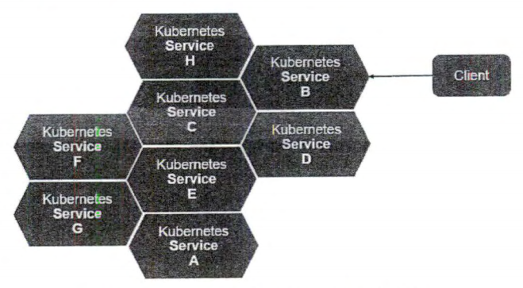
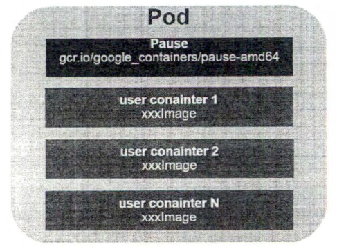
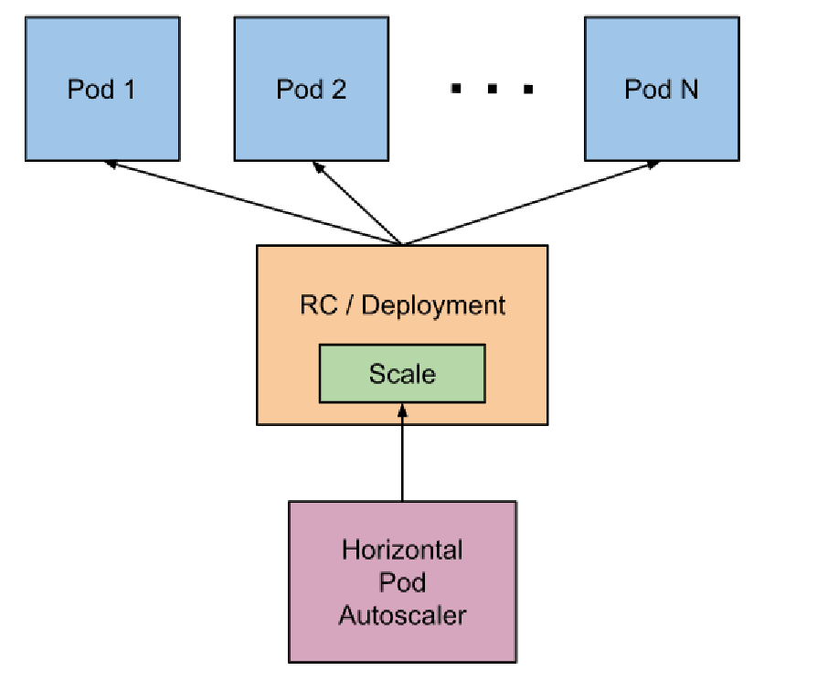
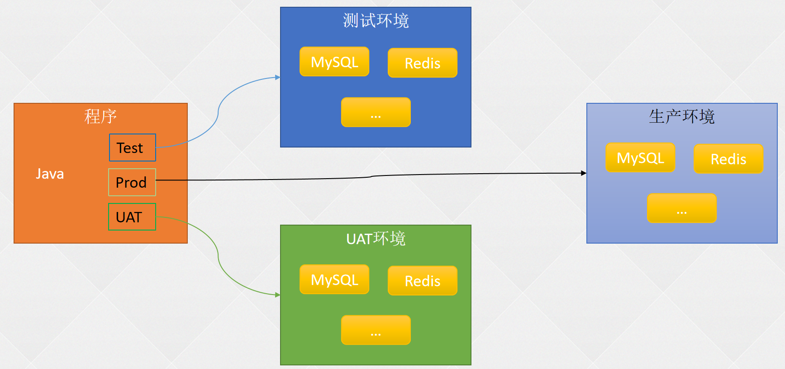
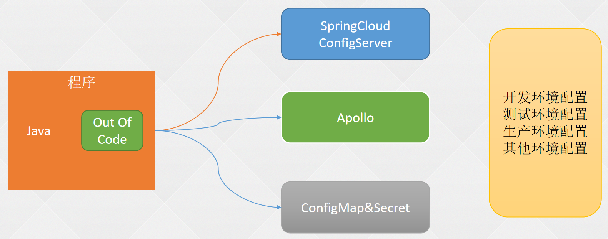
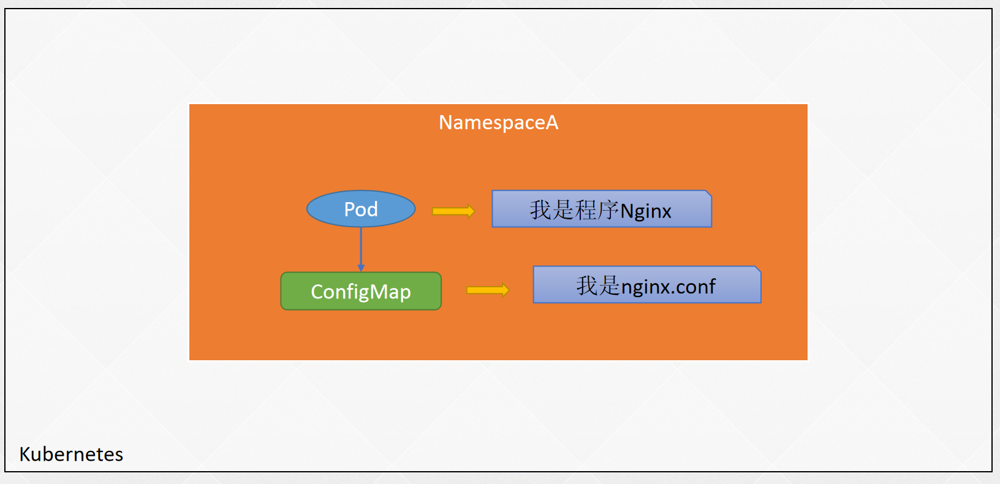

#   kubernetes基础

Kubernetes是谷歌以Borg为前身，基于谷歌15年生产环境经验的基础上开源的一个项目，Kubernetes致力于提供跨主机集群的自动部署、扩展、高可用以及运行应用程序容器的平台。

kubectl (Command line tool)


## 1 Master节点：整个集群的控制中枢

Ø Kube-APIServer：集群的控制中枢，各个模块之间信息交互都需要经过Kube-APIServer，同时它也是集群管理、资源配置、整个集群安全机制的入口。

Ø Controller-Manager：集群的状态管理器，保证Pod或其他资源达到期望值，也是需要和APIServer进行通信，在需要的时候创建、更新或删除它所管理的资源。

Ø Scheduler：集群的调度中心，它会根据指定的一系列条件，选择一个或一批最佳的节点，然后部署我们的Pod。

Ø Etcd：键值数据库，报错一些集群的信息，一般生产环境中建议部署三个以上节点（奇数个）。

 

## 2  Node：工作节点

​	Worker、node节点、minion节点

Ø Kubelet：负责监听节点上Pod的状态，同时负责上报节点和节点上面Pod的状态，负责与Master节点通信，并管理节点上面的Pod。

Ø Kube-proxy：负责Pod之间的通信和负载均衡，将指定的流量分发到后端正确的机器上。

​		查看Kube-proxy工作模式：curl 127.0.0.1:10249/proxyMode

​			1、Ipvs：监听Master节点增加和删除service以及endpoint的消息，调用Netlink接口创建相应的IPVS规则。通过IPVS规则，将流量转发至相应的Pod上。

​			2、Iptables：监听Master节点增加和删除service以及endpoint的消息，对于每一个Service，他都会场景一个iptables规则，将service的clusterIP代理到后端对应的Pod。


### 其他组件

Ø Calico：符合CNI标准的网络插件，给每个Pod生成一个唯一的IP地址，并且把每个节点当做一个路由器。Cilium

Ø CoreDNS：用于Kubernetes集群内部Service的解析，可以让Pod把Service名称解析成IP地址，然后通过Service的IP地址进行连接到对应的应用上。

Ø Docker：容器引擎，负责对容器的管理。

# 基本概念和术语

## 资源对象概述

​	Kubernetes 的基本概念和术语大多是围绕资源对象 Resource Object 来说的，而

资源对象在总体上可分为以下两类

1、某种资源的对象，例如节点 Node) Pod 服务 (Service) 、存储卷 (Volume）
2、与资源对象相关的事物与动作，例 如标签 Label 、注解(Annotation）、命名空间（Namespace）、部署(Deployment)、HPA、PVC


## 集群类

集群 (Cluster) 表示一个由 Master Node 组成的 ubernetes 集群
1、Master 上运行着以下关键进程：

-  Kubemetes API Server(kube-apiserver) ：提供 HTTP RESTful API 接口的主要服务，


   Kubernetes 里对所有资源进行增、删 查等操作的唯 入口，也是集群控

   制的入口进程

- Kubernetes Controller Manager ( kube-controller-manager): Kubernetes 里所有 资源

对象的自动化控制中心 ，可以将其理解为资源对象的“大总管”。

- Kubemetes Scheduler kube-scheduler) ：负责资源调度 Pod 调度 的进程，相当

  千公交公司的调度室

2、Node上运行着以下关键进程：

- kubelet: 负责 Pod 对应容器的创建 启停等任务，同时与 Master 密切协作，实现

  集群管理的基本功能

- kube-proxy: 实现 Kubemetes Service 的通信与负载均衡机制的服务


  容器运行时（如 Docker ：负责本机的容器创建和管理


## 应用类

### Service 和 Pod

Service 指的是无状态服务 ，通常由多个程序副本提供服务 ，在特殊情况下也可以是有状态的单实例服务，比如 MySQL 这种数据存储类的服务。



Pod 是Kubernetes 中最重要的基本概念之 ，如图所示是 Pod 的组成示意图，我们看到每个 Pod 都有一个特殊的被称为“根容祥＂的 Pause 容器 Pause 器对应的镜像属千 Kubernetes 平台的一部分，除了 Pause 容器，每个 Pod 都还包含一个或多个紧密相关的用户业务容器。



pod的yaml文件定义

```yaml
apiVersion : vl 
kind : Pod 
metadata : 
name: myweb 
labels: 
name : myweb 
spec: 
containers: 
- name : myweb 
image: kubeguideltomcat-app :vl 
ports : 
- containerPort : BOBO
```

Endpoint, 表此 Pod 里的 一个服务进程的对外通信地址

Even 是一个事的记录，记录了事件的最早产生时间、最后重现时间、重复次数、发起者、类型，以及导致此事 的原因等众多信息。

> 当我们发现某个Pod 迟迟无法创建时，可以用 ubectl describe pod xxxx 来查看它的描述信息，以定位问题的成因。


### Label 与Selector标签选择器

一个 Label（标签）是一个 key=value 的键值对，其中的 key、value由用户自己指定。

常用的 Label 示例：

> 版本标签： release : stable release : canary
>
> 环境标签： environment : dev nvironment : qa env onment : production
>
> 架构标签： tier : frontend tier : backend tier : middleware
>
> 分区标签： partition : customerA partition : customerB
>
> 质量管控标签 track : daily track : weekly

Label Selector 表达式

```
narne=redis-slave,env!=preduction 
name notin (php-frontend),env != production
```

Label Selector在Deployment中的应用

​	管理对象RC和Service通过Selector字段设置需要关联的Pod的Label

```
apiVersion : apps/vl
kind: Deployment
spec:
	replicas: 2	# Pod 的副本数量
	selector:	# 目标 Pod 的标签选择器
		matchLabels:	# 用于定义一组Label
		app: myweb
		matchExpressions:  # 用于定义一组Label集合
		- {key: tier, operator : In , values : [frontend]}
	template:	# 用于自动创建新 Pod 副本的模板
		metadata:
			labels:
			app: myweb 
		spec:
```


### Pod与Deployment

大部分 Service 都是无状态的服务，可以由多个 Pod 副本实例提供服务。通常情况下，每个 Service 对应的 Pod 服务实例数量都是固定的，如果一个一个地手工创Pod 实例，就太麻烦了，最好是用模板的思路，即提供一个 Pod 模板 (Template) ，然后由程序根据我们指定的模板自动创建指定数盘的 Pod 实例 。这就是 Deployment 这个源对象所要完成的事情了。

```
apiVersion : apps/vl 
kind: Deployment 
spec: 
	replicas : 2 	# Pod 的副本数量
	selector:		# 目标 Pod 的标签选择器
		matchLabels: 
			app: myweb 
	template:		# 用于自动创建新 Pod 副本的模板
		metadata : 
			labels: 
				app: myweb 
		spec:
```


## 存储类


## 安全类


# Pod基本概念

## 1 什么是Pod？

Pod是Kubernetes中最小的单元，它由一组、一个或多个容器组成，每个Pod还包含了一个Pause容器，Pause容器是Pod的父容器，主要负责僵尸进程的回收管理，通过Pause容器可以使同一个Pod里面的多个容器共享存储、网络、PID、IPC等。

## 2 定义一个Pod

pod的yaml文件格式

```yaml
apiVersion: v1 # 必选，API的版本号
kind: Pod       # 必选，类型Pod
metadata:       # 必选，元数据
  name: nginx   # 必选，符合RFC 1035规范的Pod名称
  # namespace: default # 可选，Pod所在的命名空间，不指定默认为default，可以使用-n 指定namespace 
  labels:       # 可选，标签选择器，一般用于过滤和区分Pod
    app: nginx
    role: frontend # 可以写多个
  annotations:  # 可选，注释列表，可以写多个
    app: nginx
    
spec:   # 必选，用于定义容器的详细信息
#  initContainers: # 初始化容器，在容器启动之前执行的一些初始化操作
#  - command:
#    - sh
#    - -c
#    - echo "I am InitContainer for init some configuration"
#    image: busybox
#    imagePullPolicy: IfNotPresent
#    name: init-container
  containers:   # 必选，容器列表
  - name: nginx # 必选，符合RFC 1035规范的容器名称
    image: nginx:1.15.2    # 必选，容器所用的镜像的地址
    imagePullPolicy: IfNotPresent     # 可选，镜像拉取策略, IfNotPresent: 如果宿主机有这个镜像，那就不需要拉取了. Always: 总是拉取, Never: 不管是否存储都不拉去
    command: # 可选，容器启动执行的命令 ENTRYPOINT, arg --> cmd
    - nginx 
    - -g
    - "daemon off;"
    workingDir: /usr/share/nginx/html       # 可选，容器的工作目录
#    volumeMounts:   # 可选，存储卷配置，可以配置多个
#    - name: webroot # 存储卷名称
#      mountPath: /usr/share/nginx/html # 挂载目录
#      readOnly: true        # 只读
    ports:  # 可选，容器需要暴露的端口号列表
    - name: http    # 端口名称
      containerPort: 80     # 端口号
      protocol: TCP # 端口协议，默认TCP
    env:    # 可选，环境变量配置列表
    - name: TZ      # 变量名
      value: Asia/Shanghai # 变量的值
    - name: LANG
      value: en_US.utf8
#    resources:      # 可选，资源限制和资源请求限制
#      limits:       # 最大限制设置
#        cpu: 1000m
#        memory: 1024Mi
#      requests:     # 启动所需最小资源设置
#        cpu: 100m
#        memory: 512Mi
#    startupProbe: # 可选，检测容器内进程是否完成启动。注意三种检查方式同时只能使用一种。
#      httpGet:      # httpGet检测方式，生产环境建议使用httpGet实现接口级健康检查，健康检查由应用程序提供。
#            path: /api/successStart # 检查路径
#            port: 80
#    readinessProbe: # 可选，健康检查。注意三种检查方式同时只能使用一种。
#      httpGet:      # httpGet检测方式，生产环境建议使用httpGet实现接口级健康检查，健康检查由应用程序提供。
#            path: / # 检查路径
#            port: 80        # 监控端口
#    livenessProbe:  # 可选，健康检查
      #exec:        # 执行容器命令检测方式
            #command: 
            #- cat
            #- /health
    #httpGet:       # httpGet检测方式
    #   path: /_health # 检查路径
    #   port: 8080
    #   httpHeaders: # 检查的请求头
    #   - name: end-user
    #     value: Jason 
#      tcpSocket:    # 端口检测方式
#            port: 80
#      initialDelaySeconds: 60       # 初始化时间
#      timeoutSeconds: 2     # 超时时间
#      periodSeconds: 5      # 检测间隔
#      successThreshold: 1 # 检查成功为2次表示就绪
#      failureThreshold: 2 # 检测失败1次表示未就绪
#    lifecycle:
#      postStart: # 容器创建完成后执行的指令, 可以是exec httpGet TCPSocket
#        exec:
#          command:
#          - sh
#          - -c
#          - 'mkdir /data/ '
#      preStop:
#        httpGet:      
#              path: /
#              port: 80
      #  exec:
      #    command:
      #    - sh
      #    - -c
      #    - sleep 9
  restartPolicy: Always   # 可选，默认为Always，容器故障或者没有启动成功，那就自动该容器，Onfailure: 容器以不为0的状态终止，自动重启该容器, Never:无论何种状态，都不会重启
  #nodeSelector: # 可选，指定Node节点
  #      region: subnet7
#  imagePullSecrets:     # 可选，拉取镜像使用的secret，可以配置多个
#  - name: default-dockercfg-86258
#  hostNetwork: false    # 可选，是否为主机模式，如是，会占用主机端口
#  volumes:      # 共享存储卷列表
#  - name: webroot # 名称，与上述对应
#    emptyDir: {}    # 挂载目录
#        #hostPath:              # 挂载本机目录
#        #  path: /etc/hosts
```

endpoint：代表此 Pod 里的 一个服务进程的对外通信地址

k8s的Event概念：是一个事件的记录，记录了事件的最早产生时间、最后重现时间、重复次数、发起者、类型，以及导致此事的原因等众多信息。

```sh
# kubectl describe pod xxxx #来查看它的描述信息,event事件以定位问题的成因
Events: 
	FirstSeen LastSeenCount From SubobjectPa Type Reason Message 
    ---------	------------ -- 	---------	---	-----	-------------
10h		12m		32		{kubelet k8s node 1}		spec.containers {kube2sky}		Warning		Unhealthy	Liveness probe failed: Get
http://172.17.1.2:8080/healthz:net/http:request canceled (Client.Timeout exceeded while awaiting headers)
```


## 3 Pod探针

**Readiness 探针（就绪检测）**：
检查应用程序是否准备好为请求提供服务。

如果 Readiness 探针失败，该 Pod 的 IP 地址不会被列入与该 Pod 关联的 Service 的 Endpoints。

使用场景：确保流量只发送到已经准备好处理请求的 Pod。例如，在容器中的数据库或其他依赖服务启动并准备好之前，一个 Web 服务器可能还没准备好接受请求。

**Liveness 探针（活性检测）**：
检查应用程序是否还在运行。

如果 Liveness 探针失败，Kubelet 会杀死容器，然后根据 Pod 的重启策略决定是否重启容器。

使用场景：确保应用程序处于运行状态，如果应用程序挂起或死锁，Liveness 探针可以确保它被重新启动。

**Startup 探针（启动检测）**

检查容器应用是否已经开始。

如果 Startup 探针失败，Kubelet 将杀死容器，并且容器根据其重启策略进行重启。

使用场景：某些应用程序在启动时可能需要较长的初始化时间，这种情况下，Liveness 探针可能会因为时间过长而失败，Startup探针可以用来专门检查启动状态，而不影响 Liveness 探针的其他检查。

## 4 Pod探针的检测方式

HTTPGetAction：通过应用程序暴露的API地址来检查程序是否是正常的，如果状态码为200~400之间，则认为容器健康。生产环境使用

ExecAction：在容器内执行一个命令，如果返回值为0，则认为容器健康。

TCPSocketAction：通过TCP连接检查容器内的端口是否是通的，如果是通的就认为容器健康。

## 5 探针检查参数配置

initialDelaySeconds: 60    # 初始化时间
timeoutSeconds: 2   # 超时时间
periodSeconds: 5    # 检测间隔
successThreshold: 1 # 检查成功为1次表示就绪
failureThreshold: 2 # 检测失败2次表示未就绪

```yaml
# 探针示例文件
apiVersion: apps/v1
kind: Deployment
metadata:
  name: nginx-deployment
spec:
  replicas: 1
  selector:
    matchLabels:
      app: nginx
  template:
    metadata:
      labels:
        app: nginx
    spec:
      containers:
      - name: nginx
        image: nginx:latest
        readinessProbe: # 就绪探针检测
          httpGet: # Http Get方式
            path: /index.html # 目标路径
            port: 80 # 目标端口
          failureThreshold: 5 # 失败多少次才真的失效
          periodSeconds: 10 # 检测间隔时间
          timeoutSeconds: 10 # 请求超时时间
```

terminationGracePeriodSeconds：30  #优雅地关闭你的服务

Prestop：先去请求eureka接口，把自己的IP地址和端口号，进行下线，eureka从注册表中删除该应用的IP地址。然后容器进行sleep 90；kill `pgrep java`


PostStart：这个钩子在容器创建后立即执行。但是，并不能保证钩子将在容器ENTRYPOINT之前运行，因为没有参数传递给处理程序。主要用于资源部署、环境准备等。不过需要注意的是如果钩子花费太长时间以至于不能运行或者挂起， 容器将不能达到running状态。

PreStop：这个钩子在容器终止之前立即被调用。它是阻塞的，意味着它是同步的， 所以它必须在删除容器的调用发出之前完成。主要用于优雅关闭应用程序、通知其他系统等。如果钩子在执行期间挂起， Pod阶段将停留在running状态并且永不会达到failed状态。


## 6 pod退出流程

终止过程主要分为如下几个步骤：

1. 用户发出删除 pod 命令
2. K8S 会给旧POD发送SIGTERM信号；将 pod 标记为“Terminating”状态；pod 被视为“dead”状态，此时将不会有新的请求到达旧的pod；
3. 并且等待宽限期（terminationGracePeriodSeconds 参数定义，默认情况下30秒）这么长的时间
4. 第三步同时运行，监控到 pod 对象为“Terminating”状态的同时启动 pod 关闭过程
5. 第三步同时进行，endpoints 控制器监控到 pod 对象关闭，将pod与service匹配的 endpoints 列表中删除
6. 如果 pod 中定义了 preStop 处理程序，则 pod 被标记为“Terminating”状态时以同步的方式启动执行；若宽限期结束后，preStop 仍未执行结束，第二步会重新执行并额外获得一个2秒的小宽限期(最后的宽限期，所以定义prestop 注意时间,和terminationGracePeriodSeconds 参数配合使用),
7. Pod 内对象的容器收到 TERM 信号
8. 宽限期结束之后，若存在任何一个运行的进程，pod 会收到 SIGKILL 信号
9. Kubelet 请求 API Server 将此 Pod 资源宽限期设置为0从而完成删除操作


# 资源调度

## Deployment

### 1、Deployment概念

用于部署无状态的服务，这个最常用的控制器。

一般用于管理维护企业内部无状态的微服务，比如configserver、zuul、springboot。

他可以管理多个副本的Pod实现无缝迁移、自动扩容缩容、自动灾难恢复、一键回滚等功能。

### 2、创建一个Deployment

手动创建：

```
kubectl create deployment nginx --image=nginx:1.15.2
```

修改deploy文本：

```
kubectl edit deploy nginx
```

从文件创建：

```
# cat nginx-deploy.yaml 
apiVersion: apps/v1
kind: Deployment
metadata:
 annotations:
  deployment.kubernetes.io/revision: "1"
 creationTimestamp: "2020-09-19T02:41:11Z"
 generation: 1
 labels:
  app: nginx
 name: nginx
 namespace: default
spec:
 progressDeadlineSeconds: 600
 replicas: 2 #副本数
 revisionHistoryLimit: 10 # 历史记录保留的个数
 selector:
  matchLabels:
   app: nginx
 strategy:
  rollingUpdate:
   maxSurge: 25%
   maxUnavailable: 25%
  type: RollingUpdate
 template:
  metadata:
   creationTimestamp: null
   labels:
​    app: nginx
  spec:
   containers:
   - image: nginx:1.15.2
​    imagePullPolicy: IfNotPresent
​    name: nginx
​    resources: {}
​    terminationMessagePath: /dev/termination-log
​    terminationMessagePolicy: File
   dnsPolicy: ClusterFirst
   restartPolicy: Always
   schedulerName: default-scheduler
   securityContext: {}
   terminationGracePeriodSeconds: 30
```


状态解析：

```
# kubectl get deploy -owide
NAME   READY  UP-TO-DATE  AVAILABLE  AGE   CONTAINERS  IMAGES     SELECTOR
nginx  2/2   	2      		 2      9m29s  nginx     	nginx:1.15.2  app=nginx	
```

Ø NAME： Deployment名称

Ø READY：Pod的状态，已经Ready的个数

Ø UP-TO-DATE：已经达到期望状态的被更新的副本数

Ø AVAILABLE：已经可以用的副本数

Ø AGE：显示应用程序运行的时间

Ø CONTAINERS：容器名称

Ø IMAGES：容器的镜像

Ø SELECTOR：管理的Pod的标签

 

### 3、Deployment的更新

更改deployment的镜像并记录：

```
kubectl set image deploy nginx nginx=nginx:1.15.3 –record
```

查看更新过程：

```
# kubectl rollout status deploy nginx
deployment "nginx" successfully rolled out
[root@k8s-master01 ~]# kubectl rollout status deploy nginx
Waiting for deployment "nginx" rollout to finish: 1 out of 2 new replicas have been updated...
Waiting for deployment "nginx" rollout to finish: 1 out of 2 new replicas have been updated...
Waiting for deployment "nginx" rollout to finish: 1 out of 2 new replicas have been updated...
Waiting for deployment "nginx" rollout to finish: 1 old replicas are pending termination...
Waiting for deployment "nginx" rollout to finish: 1 old replicas are pending termination...
deployment "nginx" successfully rolled out
```

或者使用describe查看：

```
# kubectl describe deploy nginx  
Normal  ScalingReplicaSet  25m          deployment-controller  Scaled up replica set nginx-66bbc9fdc5 to 1
 Normal  ScalingReplicaSet  18m (x2 over 23m)   deployment-controller  Scaled up replica set nginx-66bbc9fdc5 to 2
 Normal  ScalingReplicaSet  7m7s         deployment-controller  Scaled up replica set nginx-5dfc8689c6 to 1
 Normal  ScalingReplicaSet  6m28s (x2 over 23m)  deployment-controller  Scaled down replica set nginx-66bbc9fdc5 to 1
 Normal  ScalingReplicaSet  6m27s         deployment-controller  Scaled up replica set nginx-5dfc8689c6 to 2
 Normal  ScalingReplicaSet  5m58s         deployment-controller  Scaled down replica set nginx-66bbc9fdc5 to 0
 Normal  ScalingReplicaSet  4m19s         deployment-controller  Scaled up replica set nginx-6cdd5dd489 to 1
 Normal  ScalingReplicaSet  3m44s         deployment-controller  Scaled down replica set nginx-5dfc8689c6 to 1
 Normal  ScalingReplicaSet  3m44s         deployment-controller  Scaled up replica set nginx-6cdd5dd489 to 2
 Normal  ScalingReplicaSet  3m6s         deployment-controller  Scaled down replica set nginx-5dfc8689c6 to 0
```


### 4、Deployment回滚

执行更新操作

```sh
[root@k8s-master01 ~]# kubectl set image deploy nginx nginx=nginx:787977da --record
deployment.apps/nginx image updated
[root@k8s-master01 ~]# kubectl get po
NAME           READY  STATUS        RESTARTS  AGE
nginx-6cdd5dd489-lv28z  1/1   Running       0      7m12s
nginx-6cdd5dd489-nqqz7  1/1   Running       0      6m37s
nginx-7d79b96f68-x7t67  0/1   ContainerCreating  0      19s
```

查看历史版本

```sh
[root@k8s-master01 ~]# kubectl rollout history deploy nginx
deployment.apps/nginx 
REVISION  CHANGE-CAUSE
1     <none>
2     kubectl set image deploy nginx nginx=nginx:1.15.3 --record=true
3     kubectl set image deploy nginx nginx=nginx:1.15.4 --record=true
4     kubectl set image deploy nginx nginx=nginx:787977da --record=true
```

回滚到上一个版本

```sh
[root@k8s-master01 ~]# kubectl rollout undo deploy nginx 
deployment.apps/nginx rolled back
[root@k8s-master01 ~]# kubectl get po
NAME           READY  STATUS   RESTARTS  AGE
nginx-6cdd5dd489-lv28z  1/1   Running  0      9m8s
nginx-6cdd5dd489-nqqz7  1/1   Running  0      8m33s
[root@k8s-master01 ~]# kubectl get deploy nginx -oyaml | grep nginx
  kubernetes.io/change-cause: kubectl set image deploy nginx nginx=nginx:1.15.4
  app: nginx
​       k:{"name":"nginx"}:
​       k:{"name":"nginx"}:
 name: nginx
 selfLink: /apis/apps/v1/namespaces/default/deployments/nginx
   app: nginx
​    app: nginx
   - image: nginx:1.15.4
​    name: nginx
  message: ReplicaSet "nginx-6cdd5dd489" has successfully progressed.
```

进行多次更新

```sh
[root@k8s-master01 ~]# kubectl set image deploy nginx nginx=nginx:787977da --record
deployment.apps/nginx image updated
[root@k8s-master01 ~]# kubectl set image deploy nginx nginx=nginx:787977dadaa --record
deployment.apps/nginx image updated
[root@k8s-master01 ~]# kubectl set image deploy nginx nginx=nginx:787977xxxxxdadaa --record
deployment.apps/nginx image updated
[root@k8s-master01 ~]# kubectl set image deploy nginx nginx=nginx:787977dadxxxxxdadaa --record
deployment.apps/nginx image updated
```

查看历史记录

```
[root@k8s-master01 ~]# kubectl  rollout history deploy nginx
deployment.apps/nginx 
REVISION  CHANGE-CAUSE
1     <none>
2     kubectl set image deploy nginx nginx=nginx:1.15.3 --record=true
5     kubectl set image deploy nginx nginx=nginx:1.15.4 --record=true
6     kubectl set image deploy nginx nginx=nginx:787977da --record=true
7     kubectl set image deploy nginx nginx=nginx:787977dadaa --record=true
8     kubectl set image deploy nginx nginx=nginx:787977xxxxxdadaa --record=true
9     kubectl set image deploy nginx nginx=nginx:787977dadxxxxxdadaa --record=true
```

查看指定版本的详细信息

```
[root@k8s-master01 ~]# kubectl rollout history deploy nginx --revision=5
deployment.apps/nginx with revision #5
Pod Template:
 Labels:	app=nginx
​	pod-template-hash=6cdd5dd489
 Annotations:	kubernetes.io/change-cause: kubectl set image deploy nginx nginx=nginx:1.15.4 --record=true
 Containers:
  nginx:
  Image:	nginx:1.15.4
  Port:	<none>
  Host Port:	<none>
  Environment:	<none>
  Mounts:	<none>
 Volumes:	<none>
```

回滚到执行的版本

```
[root@k8s-master01 ~]# kubectl rollout undo deploy nginx --to-revision=5
deployment.apps/nginx rolled back
```

查看deploy状态

```
[root@k8s-master01 ~]# kubectl get deploy -oyaml
```

### 5、deployment扩容/缩容

Deployment扩容缩容的本质其实就是改变ReplicaSet的数量来控制Pod的数量，增加就是扩容，缩小就是缩容。

- 方式一：kubectl scale deploy deploy名称 --replicas=pod数量 -n 命名空间
- 方式二：kubectl edit deploy deploy名字 -n 命名空间

注：以上两种方式均可以实现扩缩容，根据实际情况选择即可

**1）扩容示例：假设我们要将nginx从3个pod扩展到5个pod**

```
[root@k8s-master yaml]# kubectl scale deploy nginx-deployment --replicas=5 -n default
deployment.apps/nginx-deployment scaled
[root@k8s-master yaml]# kubectl get deploy,rs,po
NAME                               READY   UP-TO-DATE   AVAILABLE   AGE
deployment.apps/nginx-deployment   5/5     5            5           19m

NAME                                          DESIRED   CURRENT   READY   AGE
replicaset.apps/nginx-deployment-5d9c9b97bb   5         5         5       19m

NAME                                    READY   STATUS    RESTARTS   AGE
pod/nginx-deployment-5d9c9b97bb-4p2hx   1/1     Running   0          19m
pod/nginx-deployment-5d9c9b97bb-bjnbs   1/1     Running   0          29s
pod/nginx-deployment-5d9c9b97bb-p58lf   1/1     Running   0          19m
pod/nginx-deployment-5d9c9b97bb-sm9zz   1/1     Running   0          19m
pod/nginx-deployment-5d9c9b97bb-x92nj   1/1     Running   0          29s
```

**2）缩容示例：假设我们将nginx从5个缩容到3个**

```
[root@k8s-master yaml]# kubectl edit deploy nginx-deployment -n default
deployment.apps/nginx-deployment edited
#找到replicas，将其数量改为3
spec:
  progressDeadlineSeconds: 600
  replicas: 3
[root@k8s-master yaml]# kubectl get deploy,rs,po
NAME                               READY   UP-TO-DATE   AVAILABLE   AGE
deployment.apps/nginx-deployment   3/3     3            3           29m

NAME                                          DESIRED   CURRENT   READY   AGE
replicaset.apps/nginx-deployment-5d9c9b97bb   3         3         3       29m

NAME                                    READY   STATUS    RESTARTS   AGE
pod/nginx-deployment-5d9c9b97bb-4p2hx   1/1     Running   0          29m
pod/nginx-deployment-5d9c9b97bb-bjnbs   1/1     Running   0          9m47s
pod/nginx-deployment-5d9c9b97bb-p58lf   1/1     Running   0          29m
```


### 6、Deployment的暂停和恢复

Deployment 暂停功能

```
[root@k8s-master01 ~]# kubectl rollout pause deployment nginx 
deployment.apps/nginx paused
```

进行第二次配置变更：

​	1、进行镜像升级

```sh
[root@k8s-master01 ~]# kubectl set image deploy nginx nginx=nginx:1.15.3 --record
deployment.apps/nginx image updated

[root@k8s-master01 ~]# kubectl get po			#检查，此时没有被更新
NAME           READY  STATUS   RESTARTS  AGE
nginx-6cdd5dd489-lv28z  1/1   Running  0      30m
nginx-6cdd5dd489-nqqz7  1/1   Running  0      30m
```

​	2、添加内存CPU配置

```
[root@k8s-master01 ~]# kubectl set -h
Configure application resources
 These commands help you make changes to existing application resources.
Available Commands:
 env       Update environment variables on a pod template
 image      Update image of a pod template
 resources    Update resource requests/limits on objects with pod templates
 selector    Set the selector on a resource
 serviceaccount Update ServiceAccount of a resource
 subject     Update User, Group or ServiceAccount in a RoleBinding/ClusterRoleBinding

Usage:
 kubectl set SUBCOMMAND [options]
Use "kubectl <command> --help" for more information about a given command.
Use "kubectl options" for a list of global command-line options (applies to all commands).

[root@k8s-master01 ~]# kubectl set resources deploy nginx -c nginx --limits=cpu=200m,memory=128Mi --requests=cpu=10m,memory=16Mi
deployment.apps/nginx resource requirements updated
```

```
[root@k8s-master01 ~]# kubectl get deploy nginx -oyaml
apiVersion: apps/v1
kind: Deployment
metadata:
 annotations:
  deployment.kubernetes.io/revision: "11"
  kubernetes.io/change-cause: kubectl set image deploy nginx nginx=nginx:1.15.3
   --record=true
 creationTimestamp: "2020-09-19T02:41:11Z"
 generation: 18
 labels:
  app: nginx
 name: nginx
 namespace: default
 resourceVersion: "2660534"
 selfLink: /apis/apps/v1/namespaces/default/deployments/nginx
 uid: 1d9253a5-a36c-48cc-aefe-56f95967db66
spec:
 paused: true
 progressDeadlineSeconds: 600
 replicas: 2
 revisionHistoryLimit: 10
 selector:
  matchLabels:
   app: nginx
 strategy:
  rollingUpdate:
   maxSurge: 25%
   maxUnavailable: 25%
  type: RollingUpdate
 template:
  metadata:
   creationTimestamp: null
   labels:
​    app: nginx
  spec:
   containers:
   - image: nginx:1.15.3
​    imagePullPolicy: IfNotPresent
​    name: nginx
​    resources:
​     limits:
​      cpu: 200m
​      memory: 128Mi
​     requests:
​      cpu: 10m
​      memory: 16Mi
​    terminationMessagePath: /dev/termination-log
​    terminationMessagePolicy: File
   dnsPolicy: ClusterFirst
   restartPolicy: Always
   schedulerName: default-scheduler
   securityContext: {}
   terminationGracePeriodSeconds: 30
status:
 availableReplicas: 2
 conditions:
 - lastTransitionTime: "2020-09-19T03:26:50Z"
  lastUpdateTime: "2020-09-19T03:26:50Z"
  message: Deployment has minimum availability.
  reason: MinimumReplicasAvailable
  status: "True"
  type: Available
 - lastTransitionTime: "2020-09-19T03:30:15Z"
  lastUpdateTime: "2020-09-19T03:30:15Z"
  message: Deployment is paused
  reason: DeploymentPaused
  status: Unknown
  type: Progressing
 observedGeneration: 18
 readyReplicas: 2
 replicas: 2
```

查看pod是否被更新

```

[root@k8s-master01 ~]# kubectl rollout resume deploy nginx 
deployment.apps/nginx resumed
[root@k8s-master01 ~]# kubectl get rs
NAME        DESIRED  CURRENT  READY  AGE
nginx-5475c49ffb  0     0     0    21m
nginx-5dfc8689c6  0     0     0    33m
nginx-66bbc9fdc5  0     0     0    52m
nginx-68db656dd8  1     1     0    15s
nginx-6cdd5dd489  2     2     2    31m
nginx-799b8478d4  0     0     0    21m
nginx-7d79b96f68  0     0     0    24m
nginx-f974656f7   0     0     0    21m
```

 

### 7、Deployment注意事项

```
# kubectl get deploy nginx -oyaml
apiVersion: apps/v1
kind: Deployment
metadata:
 annotations:
  deployment.kubernetes.io/revision: "12"
  kubernetes.io/change-cause: kubectl set image deploy nginx nginx=nginx:1.15.3
   --record=true
 creationTimestamp: "2020-09-19T02:41:11Z"
 generation: 19
 labels:
  app: nginx
 name: nginx
 namespace: default
spec:
 progressDeadlineSeconds: 600
 replicas: 2
 revisionHistoryLimit: 10
 selector:
  matchLabels:
   app: nginx
 strategy:
  rollingUpdate:
   maxSurge: 25%
   maxUnavailable: 25%
  type: RollingUpdate
 template:
  metadata:
   creationTimestamp: null
   labels:
​    app: nginx
  spec:
   containers:
   - image: nginx:1.15.3
​    imagePullPolicy: IfNotPresent
​    name: nginx
​    resources:
​     limits:
​      cpu: 200m
​      memory: 128Mi
​     requests:
​      cpu: 10m
​      memory: 16Mi
​    terminationMessagePath: /dev/termination-log
​    terminationMessagePolicy: File
   dnsPolicy: ClusterFirst
   restartPolicy: Always
   schedulerName: default-scheduler
   securityContext: {}
   terminationGracePeriodSeconds: 30
```

.spec.revisionHistoryLimit：设置保留RS旧的revision的个数，设置为0的话，不保留历史数据。默认：10个

.spec.minReadySeconds：可选参数，指定新创建的Pod在没有任何容器崩溃的情况下视为Ready最小的秒数，默认为0，即一旦被创建就视为可用。

滚动更新的策略：

.spec.strategy.type：更新deployment的方式，默认是RollingUpdate

- RollingUpdate：滚动更新，可以指定maxSurge和maxUnavailable

  - maxUnavailable：指定在回滚或更新时最大不可用的Pod的数量，可选字段，默认25%，可以设置成数字或百分比，如果该值为0，那么maxSurge就不能0


  - maxSurge：可以超过期望值的最大Pod数，可选字段，默认为25%，可以设置成数字或百分比，如果该值为0，那么maxUnavailable不能为0


- Recreate：重建，先删除旧的Pod，在创建新的Pod


## StatefulSet

### 1、有状态应用管理StatefulSet

StatefulSet（有状态集，缩写为sts）常用于部署有状态的且需要有序启动的应用程序，比如在进行SpringCloud项目容器化时，Eureka的部署是比较适合用StatefulSet部署方式的，可以给每个Eureka实例创建一个唯一且固定的标识符，并且每个Eureka实例无需配置多余的Service，其余Spring Boot应用可以直接通过Eureka的Headless Service即可进行注册。

Eureka的statefulset的资源名称是eureka，eureka-0 eureka-1 eureka-2

Service：headless service，没有ClusterIP	eureka-svc

​	连接Eureka集群内部：Eureka-0.eureka-svc.NAMESPACE_NAME  eureka-1.eureka-svc …

### 2、StatefulSet的基本概念

StatefulSet主要用于管理有状态应用程序的工作负载API对象。比如在生产环境中，可以部署ElasticSearch集群、MongoDB集群或者需要持久化的RabbitMQ集群、Redis集群、Kafka集群和ZooKeeper集群等。

和Deployment类似，一个StatefulSet也同样管理着基于相同容器规范的Pod。不同的是，StatefulSet为每个Pod维护了一个粘性标识。这些Pod是根据相同的规范创建的，但是不可互换，每个Pod都有一个持久的标识符，在重新调度时也会保留，一般格式为StatefulSetName-Number。比如定义一个名字是Redis-Sentinel的StatefulSet，指定创建三个Pod，那么创建出来的Pod名字就为Redis-Sentinel-0、Redis-Sentinel-1、Redis-Sentinel-2。而StatefulSet创建的Pod一般使用Headless Service（无头服务）进行通信，和普通的Service的区别在于Headless Service没有ClusterIP，它使用的是Endpoint进行互相通信，Headless一般的格式为：

statefulSetName-{0..N-1}.serviceName.namespace.svc.cluster.local。

说明：

> serviceName为Headless Service的名字，创建StatefulSet时，必须指定Headless Service名称；
>
> 0..N-1为Pod所在的序号，从0开始到N-1；
>
> statefulSetName为StatefulSet的名字；
>
> namespace为服务所在的命名空间；
>
> cluster.local为Cluster Domain（集群域）。
>

假如公司某个项目需要在Kubernetes中部署一个主从模式的Redis，此时使用StatefulSet部署就极为合适，因为StatefulSet启动时，只有当前一个容器完全启动时，后一个容器才会被调度，并且每个容器的标识符是固定的，那么就可以通过标识符来断定当前Pod的角色。

比如用一个名为redis-ms的StatefulSet部署主从架构的Redis，第一个容器启动时，它的标识符为redis-ms-0，并且Pod内主机名也为redis-ms-0，此时就可以根据主机名来判断，当主机名为redis-ms-0的容器作为Redis的主节点，其余从节点，那么Slave连接Master主机配置就可以使用不会更改的Master的Headless Service，此时Redis从节点（Slave）配置文件如下：

```
port 6379
slaveof redis-ms-0.redis-ms.public-service.svc.cluster.local 6379
tcp-backlog 511
timeout 0
tcp-keepalive 0
……
```

其中redis-ms-0.redis-ms.public-service.svc.cluster.local是Redis Master的Headless Service，在同一命名空间下只需要写redis-ms-0.redis-ms即可，后面的public-service.svc.cluster.local可以省略。

### 3、StatefulSet注意事项

一般StatefulSet用于有以下一个或者多个需求的应用程序：

> 需要稳定的独一无二的网络标识符。
>
> 需要持久化数据。
>
> 需要有序的、优雅的部署和扩展。
>
> 需要有序的自动滚动更新。
>

如果应用程序不需要任何稳定的标识符或者有序的部署、删除或者扩展，应该使用无状态的控制器部署应用程序，比如Deployment或者ReplicaSet。

 

StatefulSet是Kubernetes 1.9版本之前的beta资源，在1.5版本之前的任何Kubernetes版本都没有。

Pod所用的存储必须由PersistentVolume Provisioner（持久化卷配置器）根据请求配置StorageClass，或者由管理员预先配置，当然也可以不配置存储。

为了确保数据安全，删除和缩放StatefulSet不会删除与StatefulSet关联的卷，可以手动选择性地删除PVC和PV（关于PV和PVC请参考2.2.12节）。

StatefulSet目前使用Headless Service（无头服务）负责Pod的网络身份和通信，需要提前创建此服务。

删除一个StatefulSet时，不保证对Pod的终止，要在StatefulSet中实现Pod的有序和正常终止，可以在删除之前将StatefulSet的副本缩减为0。

### 4、定义一个StatefulSet资源文件

定义一个简单的StatefulSet的示例如下：

```
apiVersion: v1
kind: Service
metadata:
 name: nginx
 labels:
  app: nginx
spec:
 ports:
 - port: 80
  name: web
 clusterIP: None
 selector:
  app: nginx

---
apiVersion: apps/v1
kind: StatefulSet
metadata:
 name: web
spec:
 serviceName: "nginx"
 replicas: 2
 selector:
  matchLabels:
   app: nginx
 template:
  metadata:
   labels:
​    app: nginx
  spec:
   containers:
   - name: nginx
​    image: nginx
​    ports:
​    - containerPort: 80
​     name: web
```

注意

此示例没有添加存储配置，后面的章节会单独讲解存储相关的知识点

其中：

kind: Service定义了一个名字为Nginx的Headless Service，创建的Service格式为nginx-0.nginx.default.svc.cluster.local，其他的类似，因为没有指定Namespace（命名空间），所以默认部署在default。

kind: StatefulSet定义了一个名字为web的StatefulSet，replicas表示部署Pod的副本数，本实例为2。

在StatefulSet中必须设置Pod选择器（.spec.selector）用来匹配其标签（.spec.template.metadata.labels）。在1.8版本之前，如果未配置该字段（.spec.selector），将被设置为默认值，在1.8版本之后，如果未指定匹配Pod Selector，则会导致StatefulSet创建错误。

当StatefulSet控制器创建Pod时，它会添加一个标签statefulset.kubernetes.io/pod-name，该标签的值为Pod的名称，用于匹配Service。

 

### 5、创建一个StatefulSet

创建一个sts

```
[root@k8s-master01 ~]# kubectl create -f nginx-sts.yaml # -n namespace_name
service/nginx created
statefulset.apps/web created
[root@k8s-master01 ~]# kubectl get svc
NAME     TYPE     CLUSTER-IP  EXTERNAL-IP  PORT(S)  AGE
kubernetes  ClusterIP  10.96.0.1   <none>     443/TCP  14d
nginx     ClusterIP  None     <none>     80/TCP   <invalid>
[root@k8s-master01 ~]# kubectl get po 
NAME   READY  STATUS   RESTARTS  AGE
web-0  1/1   Running  0      24s
web-1  1/1   Running  0      19s
```

更改副本数为3

```
[root@k8s-master01 ~]# kubectl scale --replicas=3 sts web 
```

查看Pod

```
[root@k8s-master01 ~]# kubectl get po
NAME   READY  STATUS        RESTARTS  AGE
web-0  1/1   Running       0      58s
web-1  1/1   Running       0      53s
web-2  0/1   ContainerCreating  0      13s
[root@k8s-master01 ~]# # 解析无头service
cat<<EOF | kubectl apply -f -
apiVersion: v1
kind: Pod
metadata:
 name: busybox
 namespace: default
spec:
 containers:
 \- name: busybox
  image: busybox:1.28
  command:
   \- sleep
   \- "3600"
  imagePullPolicy: IfNotPresent
 restartPolicy: Always
EOF
```

 进入解析

```
[root@k8s-master01 ~]# kubectl exec -ti busybox -- sh
/ # ls
bin  dev  etc  home  proc  root  sys  tmp  usr  var
/ # nslookup web-0.nginx
Server:   10.96.0.10
Address 1: 10.96.0.10 kube-dns.kube-system.svc.cluster.local
 
Name:    web-0.nginx
Address 1: 10.244.32.152 web-0.nginx.default.svc.cluster.local
/ # exit
```

### 6、StatefulSet扩容缩容

```
kubectl scale sts web --replicas=4 -n killer
```


### 7、StatefulSet更新策略

```
[root@k8s-master01 ~]# kubectl edit sts web
[root@k8s-master01 ~]# kubectl get sts web -o yaml
apiVersion: apps/v1
kind: StatefulSet
metadata:
 creationTimestamp: "2020-09-19T07:46:49Z"
 generation: 5
 name: web
 namespace: default
spec:
 podManagementPolicy: OrderedReady
 replicas: 2
 revisionHistoryLimit: 10
 selector:
  matchLabels:
   app: nginx
 serviceName: nginx
 template:
  metadata:
   creationTimestamp: null
   labels:
​    app: nginx
  spec:
   containers:
   - image: nginx:1.15.2
​    imagePullPolicy: IfNotPresent
​    name: nginx
​    ports:
​    - containerPort: 80
​     name: web
​     protocol: TCP
​    resources: {}
​    terminationMessagePath: /dev/termination-log
​    terminationMessagePolicy: File
   dnsPolicy: ClusterFirst
   restartPolicy: Always
   schedulerName: default-scheduler
   securityContext: {}
   terminationGracePeriodSeconds: 30
 updateStrategy:
  rollingUpdate:
   partition: 0
  type: RollingUpdate	
```

 

### 8、StatefulSet灰度发布

灰度发布（Gray Release）是一种流行的发布策略，可以使我们在不中断整个生产环境的情况下逐步将新版本的应用程序发布给一小部分用户，以确保它们能够正常运行。在Kubernetes中，我们可以使用StatefulSet来实现灰度发布。

```sh
[root@k8s-master ~]# kubectl edit sts web```
updateStrategy:
    rollingUpdate:
      partition: 2  #小于2的不会被更新
    type: RollingUpdate

[root@k8s-master ~]# kubectl set image sts web nginx=nginx:1.21.6 --record
Flag --record has been deprecated, --record will be removed in the future
statefulset.apps/web image updated

[root@k8s-master ~]# kubectl get po -l app=nginx -w		#显示只更新了大于 1 的 web-4  web-3 web-2
NAME    READY   STATUS    RESTARTS   AGE
web-0   1/1     Running   0          22m
web-1   1/1     Running   0          22m
web-2   1/1     Running   0          22m
web-3   1/1     Running   0          21m
web-4   1/1     Running   0          21m
web-4   1/1     Terminating   0          22m
web-4   0/1     Terminating   0          22m
web-4   0/1     Terminating   0          22m
web-4   0/1     Terminating   0          22m
web-4   0/1     Pending       0          0s
web-4   0/1     Pending       0          1s
web-4   0/1     ContainerCreating   0          1s
web-4   1/1     Running             0          2s
web-3   1/1     Terminating         0          22m
web-3   0/1     Terminating         0          22m
web-3   0/1     Terminating         0          22m
web-3   0/1     Terminating         0          22m
web-3   0/1     Pending             0          0s
web-3   0/1     Pending             0          0s
web-3   0/1     ContainerCreating   0          0s
web-3   1/1     Running             0          2s
web-2   1/1     Terminating         0          22m
web-2   0/1     Terminating         0          22m
web-2   0/1     Terminating         0          22m
web-2   0/1     Terminating         0          22m
web-2   0/1     Pending             0          0s
web-2   0/1     Pending             0          0s
web-2   0/1     ContainerCreating   0          0s
```

可以使用这种机制实现灰度机制，先发布一两个实例，确认没有问题之后再发布所有实例，这就是stateful的分段更新，相当于灰度发布的机制，也可以使用其它的方式，比如服务网格，或者myservices

### 9、StatefulSet级联删除/非级联删除

级联删除：删除sts时同时删除Pod

非级联删除：删除sts时不删除Pod

```sh
[root@k8s-master01 ~]# kubectl delete sts web --cascade=false
```

删除sts后，Pod变成了孤儿Pod，此时删除Pod不会被重建


## DaemonSet

### 1、monSet是什么？

DaemonSet：守护进程集，缩写为ds，在所有节点或者是匹配的节点上都部署一个Pod。

使用DaemonSet的场景

Ø 运行集群存储的daemon，比如ceph或者glusterd

Ø 节点的CNI网络插件，calico

Ø 节点日志的收集：fluentd或者是filebeat

Ø 节点的监控：node exporter

Ø 服务暴露：部署一个ingress nginx

 

### 2、DaemonSet创建

```
[root@k8s-master01 ~]# cat nginx-ds.yaml 
apiVersion: apps/v1
kind: DaemonSet
metadata:
 labels:
  app: nginx
 name: nginx
spec:
 revisionHistoryLimit: 10
 selector:
  matchLabels:
   app: nginx
 template:
  metadata:
   creationTimestamp: null
   labels:
​    app: nginx
  spec:
   containers:
   - image: nginx:1.15.2
​    imagePullPolicy: IfNotPresent
​    name: nginx
​    resources: {}
​    terminationMessagePath: /dev/termination-log
​    terminationMessagePolicy: File
   dnsPolicy: ClusterFirst
   restartPolicy: Always
   schedulerName: default-scheduler
   securityContext: {}
   terminationGracePeriodSeconds: 30
```

创建一个ds

```
[root@k8s-master01 ~]# kubectl create -f nginx-ds.yaml 
daemonset.apps/nginx created
[root@k8s-master01 ~]# kubectl get node -owide
NAME      STATUS  ROLES   AGE  VERSION  INTERNAL-IP   EXTERNAL-IP  OS-IMAGE         KERNEL-VERSION        CONTAINER-RUNTIME
k8s-master01  Ready   master  13d  v1.19.0  192.168.0.201  <none>     CentOS Linux 8 (Core)  5.8.5-1.el8.elrepo.x86_64  docker://19.3.12
k8s-master02  Ready   <none>  13d  v1.19.0  192.168.0.202  <none>     CentOS Linux 8 (Core)  5.8.3-1.el8.elrepo.x86_64  docker://19.3.12
k8s-master03  Ready   <none>  13d  v1.19.0  192.168.0.203  <none>     CentOS Linux 8 (Core)  5.8.3-1.el8.elrepo.x86_64  docker://19.3.12
k8s-node01   Ready   <none>  13d  v1.19.0  192.168.0.204  <none>     CentOS Linux 8 (Core)  5.8.3-1.el8.elrepo.x86_64  docker://19.3.12
k8s-node02   Ready   <none>  13d  v1.19.0  192.168.0.205  <none>     CentOS Linux 8 (Core)  5.8.3-1.el8.elrepo.x86_64  docker://19.3.12
[root@k8s-master01 ~]# kubectl get po -owide
NAME      READY  STATUS   RESTARTS  AGE   IP        NODE      NOMINATED NODE  READINESS GATES
busybox    1/1   Running  1      108m  10.244.32.153   k8s-master01  <none>      <none>
nginx-8vrcz  1/1   Running  0      24s   10.244.195.20   k8s-master03  <none>      <none>
nginx-dt2bx  1/1   Running  0      24s   10.244.32.165   k8s-master01  <none>      <none>
nginx-gv8bd  1/1   Running  0      24s   10.244.122.145  k8s-master02  <none>      <none>
nginx-k6dj6  1/1   Running  0      24s   10.244.85.219   k8s-node01   <none>      <none>
nginx-mgrks  1/1   Running  0      24s   10.244.58.204   k8s-node02   <none>      <none>
[root@k8s-master01 ~]# kubectl label node k8s-node01 k8s-node02 ds=true
node/k8s-node01 labeled
node/k8s-node02 labeled
[root@k8s-master01 ~]# kubectl get node --show-labels
NAME      STATUS  ROLES   AGE  VERSION  LABELS
k8s-master01  Ready   master  13d  v1.19.0  beta.kubernetes.io/arch=amd64,beta.kubernetes.io/os=linux,kubernetes.io/arch=amd64,kubernetes.io/hostname=k8s-master01,kubernetes.io/os=linux,node-role.kubernetes.io/master=,node.kubernetes.io/master=,node.kubernetes.io/node=
k8s-master02  Ready   <none>  13d  v1.19.0  beta.kubernetes.io/arch=amd64,beta.kubernetes.io/os=linux,kubernetes.io/arch=amd64,kubernetes.io/hostname=k8s-master02,kubernetes.io/os=linux,node.kubernetes.io/node=
k8s-master03  Ready   <none>  13d  v1.19.0  beta.kubernetes.io/arch=amd64,beta.kubernetes.io/os=linux,kubernetes.io/arch=amd64,kubernetes.io/hostname=k8s-master03,kubernetes.io/os=linux,node.kubernetes.io/node=
k8s-node01   Ready   <none>  13d  v1.19.0  beta.kubernetes.io/arch=amd64,beta.kubernetes.io/os=linux,ds=true,kubernetes.io/arch=amd64,kubernetes.io/hostname=k8s-node01,kubernetes.io/os=linux,node.kubernetes.io/node=
k8s-node02   Ready   <none>  13d  v1.19.0  beta.kubernetes.io/arch=amd64,beta.kubernetes.io/os=linux,ds=true,kubernetes.io/arch=amd64,kubernetes.io/hostname=k8s-node02,kubernetes.io/os=linux,node.kubernetes.io/node=
[root@k8s-master01 ~]# vim nginx-ds.yaml 
[root@k8s-master01 ~]# kubectl replace -f nginx-ds.yaml 
daemonset.apps/nginx replaced
[root@k8s-master01 ~]# kubectl get po
NAME      READY  STATUS     RESTARTS  AGE
busybox    1/1   Running    1      110m
nginx-8vrcz  1/1   Terminating  0      2m17s
nginx-dt2bx  1/1   Terminating  0      2m17s
nginx-gv8bd  1/1   Terminating  0      2m17s
nginx-k6dj6  1/1   Running    0      2m17s
nginx-mgrks  1/1   Running    0      2m17s
[root@k8s-master01 ~]# kubectl get po
NAME      READY  STATUS     RESTARTS  AGE
busybox    1/1   Running    1      110m
nginx-8vrcz  0/1   Terminating  0      2m36s
nginx-k6dj6  0/1   Terminating  0      2m36s
nginx-mgrks  1/1   Running    0      2m36s
[root@k8s-master01 ~]# kubectl get po
NAME      READY  STATUS        RESTARTS  AGE
busybox    1/1   Running       1      110m
nginx-8vrcz  0/1   Terminating     0      2m38s
nginx-mgrks  1/1   Running       0      2m38s
nginx-n9q4d  0/1   ContainerCreating  0      12s
[root@k8s-master01 ~]# kubectl get po
NAME      READY  STATUS        RESTARTS  AGE
busybox    1/1   Running       1      110m
nginx-mgrks  1/1   Running       0      2m28s
nginx-n9q4d  0/1   ContainerCreating  0      2s
[root@k8s-master01 ~]# kubectl get po
NAME      READY  STATUS     RESTARTS  AGE
busybox    1/1   Running    1      110m
nginx-mgrks  1/1   Terminating  0      2m42s
nginx-n9q4d  1/1   Running    0      16s
[root@k8s-master01 ~]# kubectl get po -owide
NAME      READY  STATUS        RESTARTS  AGE   IP        NODE      NOMINATED NODE  READINESS GATES
busybox    1/1   Running       1      110m  10.244.32.153  k8s-master01  <none>      <none>
nginx-2khfj  0/1   ContainerCreating  0      13s   <none>      k8s-node02   <none>      <none>
nginx-n9q4d  1/1   Running       0      21s   10.244.85.220  k8s-node01   <none>      <none>
[root@k8s-master01 ~]# kubectl get po -owide
NAME      READY  STATUS        RESTARTS  AGE   IP        NODE      NOMINATED NODE  READINESS GATES
busybox    1/1   Running       1      110m  10.244.32.153  k8s-master01  <none>      <none>
nginx-2khfj  0/1   ContainerCreating  0      3s   <none>      k8s-node02   <none>      <none>
nginx-n9q4d  1/1   Running       0      11s   10.244.85.220  k8s-node01   <none>      <none>

[root@k8s-master01 ~]# kubectl get po -owide
kuNAME      READY  STATUS   RESTARTS  AGE   IP        NODE      NOMINATED NODE  READINESS GATES
busybox    1/1   Running  1      110m  10.244.32.153  k8s-master01  <none>      <none>
nginx-2khfj  1/1   Running  0      27s   10.244.58.205  k8s-node02   <none>      <none>
nginx-n9q4d  1/1   Running  0      35s   10.244.85.220  k8s-node01   <none>      <none>
[root@k8s-master01 ~]# kubectl rollout history ds nginx
daemonset.apps/nginx 
REVISION  CHANGE-CAUSE
1     <none>
2     <none>
```

 

```
[root@k8s-master01 ~]# kubectl get po -owide
NAME      READY  STATUS   RESTARTS  AGE   IP        NODE      NOMINATED NODE  READINESS GATES
busybox    1/1   Running  1      111m  10.244.32.153  k8s-master01  <none>      <none>
nginx-2khfj  1/1   Running  0      45s   10.244.58.205  k8s-node02   <none>      <none>
nginx-n9q4d  1/1   Running  0      53s   10.244.85.220  k8s-node01   <none>      <none>
[root@k8s-master01 ~]# kubectl label node k8s-master03 ds=true
node/k8s-master03 labeled
[root@k8s-master01 ~]# kubectl get po 
NAME      READY  STATUS        RESTARTS  AGE
busybox    1/1   Running       1      111m
nginx-2khfj  1/1   Running       0      53s
nginx-6s9cj  0/1   ContainerCreating  0      2s
nginx-n9q4d  1/1   Running       0      61s
[root@k8s-master01 ~]# kubectl get po  -owide
NAME      READY  STATUS   RESTARTS  AGE   IP        NODE      NOMINATED NODE  READINESS GATES
busybox    1/1   Running  1      111m  10.244.32.153  k8s-master01  <none>      <none>
nginx-2khfj  1/1   Running  0      67s   10.244.58.205  k8s-node02   <none>      <none>
nginx-6s9cj  1/1   Running  0      16s   10.244.195.21  k8s-master03  <none>      <none>
nginx-n9q4d  1/1   Running  0      75s   10.244.85.220  k8s-node01   <none>      <none>
```


### 3、DaemonSet更新/回滚

Statefulset和DaemonSet更新回滚和Deployment一致

 


## HPA自动扩缩容

Horizontal Pod Autoscaler



HPA 接口类型

```
HPA v1为稳定版自动水平伸缩，只支持CPU指标
V2为beta版本，分为v2beta1(支持CPU、内存和自定义指标)
v2beta2(支持CPU、内存、自定义指标Custom和额外指标ExternalMetrics)
```

HPA 实践

```
kubectl run nginx-server-hpa --requests=cpu=10m --image=registry.cn-beijing.aliyuncs.com/dotbalo/nginx --port=80

kubectl expose deployment hpa-nginx --port=80

kubectl autoscale deployment hpa-nginx --cpu-percent=10 --min=1 --max=10

while true; do wget -q -O- http://192.168.42.44 > /dev/null; done
```

必须安装metrics-server或其他自定义metrics-server

必须配置requests参数

不能扩容无法缩放的对象，比如DaemonSet


## RC & RS

### 1、Replication Controller和ReplicaSet

Replication Controller（复制控制器，RC）和ReplicaSet（复制集，RS）是两种简单部署Pod的方式。因为在生产环境中，主要使用更高级的Deployment等方式进行Pod的管理和部署，所以本节只对Replication Controller和Replica Set的部署方式进行简单介绍。

### 2、Replication Controller

Replication Controller（简称RC）可确保Pod副本数达到期望值，也就是RC定义的数量。换句话说，Replication Controller可确保一个Pod或一组同类Pod总是可用。

如果存在的Pod大于设定的值，则Replication Controller将终止额外的Pod。如果太小，Replication Controller将启动更多的Pod用于保证达到期望值。与手动创建Pod不同的是，用Replication Controller维护的Pod在失败、删除或终止时会自动替换。因此即使应用程序只需要一个Pod，也应该使用Replication Controller或其他方式管理。Replication Controller类似于进程管理程序，但是Replication Controller不是监视单个节点上的各个进程，而是监视多个节点上的多个Pod。

定义一个Replication Controller的示例如下。

```
apiVersion: v1
kind: **ReplicationController**
metadata:
 name: nginx
spec:
 replicas: 3
 selector:
  app: nginx
 template:
  metadata:
   name: nginx
   labels:
​    app: nginx
  spec:
   containers:
   - name: nginx
​    image: nginx
​    ports:
​    - containerPort: 80
```


### 3、ReplicaSet

ReplicaSet是支持基于集合的标签选择器的下一代Replication Controller，它主要用作Deployment协调创建、删除和更新Pod，和Replication Controller唯一的区别是，ReplicaSet支持标签选择器。在实际应用中，虽然ReplicaSet可以单独使用，但是一般建议使用Deployment来自动管理ReplicaSet，除非自定义的Pod不需要更新或有其他编排等。

定义一个ReplicaSet的示例如下：

```
apiVersion: apps/v1
kind: ReplicaSet
metadata:
 name: frontend
 labels:
  app: guestbook
  tier: frontend
spec:
 \# modify replicas according to your case
 replicas: 3
 selector:
  matchLabels:
   tier: frontend
  matchExpressions:
   \- {key: tier, operator: In, values: [frontend]}
 template:
  metadata:
   labels:
​    app: guestbook
​    tier: frontend
  spec:
   containers:
   \- name: php-redis
​    image: gcr.io/google_samples/gb-frontend:v3
​    resources:
​     requests:
​      cpu: 100m
​      memory: 100Mi
​    env:
​    \- name: GET_HOSTS_FROM
​     value: dns
​     \# If your cluster config does not include a dns service, then to
​     \# instead access environment variables to find service host
​     \# info, comment out the 'value: dns' line above, and uncomment the
​     \# line below.
​     \# value: env
​    ports:
​    \- containerPort: 80
```

​	Replication Controller和ReplicaSet的创建删除和Pod并无太大区别，Replication Controller目前几乎已经不在生产环境中使用，ReplicaSet也很少单独被使用，都是使用更高级的资源Deployment、DaemonSet、StatefulSet进行管理Pod。

# 服务发布入门

Label：对k8s中各种资源进行分类、分组，添加一个具有特别属性的一个标签。

Selector：通过一个过滤的语法进行查找到对应标签的资源

 

## Label & Selector

当Kubernetes对系统的任何API对象如Pod和节点进行“分组”时，会对其添加Label（key=value形式的“键-值对”）用以精准地选择对应的API对象。而Selector（标签选择器）则是针对匹配对象的查询方法。注：键-值对就是key-value pair。

例如，常用的标签tier可用于区分容器的属性，如frontend、backend；或者一个release_track用于区分容器的环境，如canary、production等。

### 定义Label

应用案例：

公司与xx银行有一条专属的高速光纤通道，此通道只能与192.168.7.0网段进行通信，因此只能将与xx银行通信的应用部署到192.168.7.0网段所在的节点上，此时可以对节点进行Label（即加标签）：

```
[root@k8s-master01 ~]# kubectl label node k8s-node02 region=subnet7
node/k8s-node02 labeled
```

然后，可以通过Selector对其筛选：

```
[root@k8s-master01 ~]# kubectl get no -l region=subnet7
NAME     STATUS  ROLES   AGE   VERSION
k8s-node02  Ready   <none>  3d17h  v1.17.3
```

最后，在Deployment或其他控制器中指定将Pod部署到该节点：

```
containers:
 ......
dnsPolicy: ClusterFirst
nodeSelector:
 region: subnet7
restartPolicy: Always
......
```

也可以用同样的方式对Service进行Label：

```
[root@k8s-master01 ~]# kubectl label svc canary-v1 -n canary-production env=canary version=v1
service/canary-v1 labeled
```

查看Labels：

```
[root@k8s-master01 ~]# kubectl get svc -n canary-production --show-labels
NAME     TYPE     CLUSTER-IP    EXTERNAL-IP  PORT(S)   AGE  LABELS
canary-v1  ClusterIP  10.110.253.62  <none>     8080/TCP  24h  env=canary,version=v1
```

还可以查看所有Version为v1的svc：

```
[root@k8s-master01 canary]# kubectl get svc --all-namespaces -l version=v1
NAMESPACE      NAME     TYPE     CLUSTER-IP    EXTERNAL-IP  PORT(S)   AGE
canary-production  canary-v1  ClusterIP  10.110.253.62  <none>     8080/TCP  25h
```

其他资源的Label方式相同。

### Selector条件匹配

Selector主要用于资源的匹配，只有符合条件的资源才会被调用或使用，可以使用该方式对集群中的各类资源进行分配。

假如对Selector进行条件匹配，目前已有的Label如下：

```
[root@k8s-master01 ~]# kubectl get svc --show-labels
NAME      TYPE     CLUSTER-IP    EXTERNAL-IP  PORT(S)   AGE   LABELS
details    ClusterIP  10.99.9.178    <none>     9080/TCP  45h   app=details
kubernetes   ClusterIP  10.96.0.1     <none>     443/TCP   3d19h  component=apiserver,provider=kubernetes
nginx     ClusterIP  10.106.194.137  <none>     80/TCP   2d21h  app=productpage,version=v1
nginx-v2    ClusterIP  10.108.176.132  <none>     80/TCP   2d20h  <none>
productpage  ClusterIP  10.105.229.52   <none>     9080/TCP  45h   app=productpage,tier=frontend
ratings    ClusterIP  10.96.104.95   <none>     9080/TCP  45h   app=ratings
reviews    ClusterIP  10.102.188.143  <none>     9080/TCP  45h   app=reviews
```

选择app为reviews或者productpage的svc：

```
[root@k8s-master01 ~]# kubectl get svc -l  'app in (details, productpage)' --show-labels
NAME      TYPE     CLUSTER-IP    EXTERNAL-IP  PORT(S)   AGE   LABELS
details    ClusterIP  10.99.9.178    <none>     9080/TCP  45h   app=details
nginx     ClusterIP  10.106.194.137  <none>     80/TCP   2d21h  app=productpage,version=v1
productpage  ClusterIP  10.105.229.52   <none>     9080/TCP  45h   app=productpage,tier=frontend
```

选择app为productpage或reviews但不包括version=v1的svc：

```
[root@k8s-master01 ~]# kubectl get svc -l  version!=v1,'app in (details, productpage)' --show-labels
NAME      TYPE     CLUSTER-IP    EXTERNAL-IP  PORT(S)   AGE  LABELS
details    ClusterIP  10.99.9.178   <none>     9080/TCP  45h  app=details
productpage  ClusterIP  10.105.229.52  <none>     9080/TCP  45h  app=productpage,tier=frontend
```

选择labelkey名为app的svc：

```
[root@k8s-master01 ~]# kubectl get svc -l app --show-labels
NAME      TYPE     CLUSTER-IP    EXTERNAL-IP  PORT(S)   AGE   LABELS
details    ClusterIP  10.99.9.178    <none>     9080/TCP  45h   app=details
nginx     ClusterIP  10.106.194.137  <none>     80/TCP   2d21h  app=productpage,version=v1
productpage  ClusterIP  10.105.229.52   <none>     9080/TCP  45h   app=productpage,tier=frontend
ratings    ClusterIP  10.96.104.95   <none>     9080/TCP  45h   app=ratings
reviews    ClusterIP  10.102.188.143  <none>     9080/TCP  45h   app=reviews
```

### 修改标签（Label）

在实际使用中，Label的更改是经常发生的事情，可以使用overwrite参数修改标签。

修改标签，比如将version=v1改为version=v2：

```
[root@k8s-master01 canary]# kubectl get svc -n canary-production --show-labels
NAME     TYPE     CLUSTER-IP    EXTERNAL-IP  PORT(S)   AGE  LABELS
canary-v1  ClusterIP  10.110.253.62  <none>     8080/TCP  26h  env=canary,version=v1
[root@k8s-master01 canary]# kubectl label svc canary-v1 -n canary-production version=v2 **--overwrite**
service/canary-v1 labeled
[root@k8s-master01 canary]# kubectl get svc -n canary-production --show-labels
NAME     TYPE     CLUSTER-IP    EXTERNAL-IP  PORT(S)   AGE  LABELS
canary-v1  ClusterIP  10.110.253.62  <none>     8080/TCP  26h  env=canary,version=v2
```

### 删除标签（Label）

删除标签，比如删除version：

```
[root@k8s-master01 canary]# kubectl label svc canary-v1 -n canary-production **version-**
service/canary-v1 labeled
[root@k8s-master01 canary]# kubectl get svc -n canary-production --show-labels
NAME     TYPE     CLUSTER-IP    EXTERNAL-IP  PORT(S)   AGE  LABELS
canary-v1  ClusterIP  10.110.253.62  <none>     8080/TCP  26h  env=canary
```


## Service

### 1  什么是Service？

Service可以简单的理解为逻辑上的一组Pod。一种可以访问Pod的策略，而且其他Pod可以通过这个Service访问到这个Service代理的Pod。相对于Pod而言，它会有一个固定的名称，一旦创建就固定不变。

### 2  创建一个Service

cat nginx-deploy.yaml

```
apiVersion: apps/v1
kind: Deployment
metadata:
 labels:
  app: nginx
 name: nginx
 namespace: default
spec:
 progressDeadlineSeconds: 600
 replicas: 2
 revisionHistoryLimit: 10
 selector:
  matchLabels:
   app: nginx
 strategy:
  rollingUpdate:
   maxSurge: 25%
   maxUnavailable: 25%
  type: RollingUpdate
 template:
  metadata:
   creationTimestamp: null
   labels:
​    app: nginx
  spec:
   containers:
   \- image: nginx:1.15.2
​    imagePullPolicy: IfNotPresent
​    name: nginx
​    resources: {}
​    terminationMessagePath: /dev/termination-log
​    terminationMessagePolicy: File
​    terminationMessagePath: /dev/termination-log
​    terminationMessagePolicy: File
   dnsPolicy: ClusterFirst
   restartPolicy: Always
   schedulerName: default-scheduler
   securityContext: {}
   terminationGracePeriodSeconds: 30
```

 

```
# cat nginx-svc.yaml
apiVersion: v1
kind: Service
metadata:
 labels:
  app: nginx-svc
 name: nginx-svc
spec:
 ports:
 \- name: http # Service端口的名称
  port: 80 # Service自己的端口, servicea --> serviceb http://serviceb,  http://serviceb:8080 
  protocol: TCP # UDP TCP SCTP default: TCP
  targetPort: 80 # 后端应用的端口
 \- name: https
  port: 443
  protocol: TCP
  targetPort: 443
 selector:
  app: nginx
 sessionAffinity: None
 type: ClusterIP
```


### 3、使用Service代理k8s外部应用

使用场景：

Ø 希望在生产环境中使用某个固定的名称而非IP地址进行访问外部的中间件服务

Ø 希望Service指向另一个Namespace中或其他集群中的服务

Ø 某个项目正在迁移至k8s集群，但是一部分服务仍然在集群外部，此时可以使用service代理至k8s集群外部的服务

```
\# cat nginx-svc-external.yaml 
apiVersion: v1
kind: Service
metadata:
 labels:
  app: nginx-svc-external
 name: nginx-svc-external
spec:
 ports:
 \- name: http # Service端口的名称
  port: 80 # Service自己的端口, servicea --> serviceb http://serviceb,  http://serviceb:8080 
  protocol: TCP # UDP TCP SCTP default: TCP
  targetPort: 80 # 后端应用的端口
 sessionAffinity: None
 type: ClusterIP
```


```
# cat nginx-ep-external.yaml 
apiVersion: v1
kind: Endpoints
metadata:
 labels:
  app: nginx-svc-external
 name: nginx-svc-external
 namespace: default
subsets:
- addresses:
 - ip: 140.205.94.189 
 ports:
 - name: http
  port: 80
  protocol: TCP
```

 

 

### 4、使用Service反代域名

```
# cat nginx-externalName.yaml 
apiVersion: v1
kind: Service
metadata:
 labels:
  app: nginx-externalname
 name: nginx-externalname
spec:
 type: ExternalName
 externalName: www.baidu.com
```

 

### 5、Service类型

Ø ClusterIP：在集群内部使用，也是默认值。

Ø ExternalName：通过返回定义的CNAME别名。

Ø NodePort：在所有安装了kube-proxy的节点上打开一个端口，此端口可以代理至后端Pod，然后集群外部可以使用节点的IP地址和NodePort的端口号访问到集群Pod的服务。NodePort端口范围默认是30000-32767。

Ø LoadBalancer：使用云提供商的负载均衡器公开服务。


## Ingress

### 1、ngress概念

通俗来讲，ingress和之前提到的Service、Deployment，也是一个k8s的资源类型，ingress用于实现用域名的方式访问k8s内部应用。

 

### 2、Ingress安装

首先安装helm管理工具：https://helm.sh/docs/intro/install/

使用helm安装ingress：[https://kubernetes.github.io/ingress-nginx/deploy/#using-helm](#using-helm)

1. 添加ingress的helm仓库（课程讲解的版本已经上传至百度网盘）

```
helm repo add ingress-nginx https://kubernetes.github.io/ingress-nginx
```

2. 下载ingress的helm包至本地

```
helm pull ingress-nginx/ingress-nginx
```

3. 更改对应的配置

```
tar xf ingress-nginx-3.6.0.tgz
cd ingress-nginx
vim values.yaml
```

4. 需要修改的位置

a) Controller和admissionWebhook的镜像地址，需要将公网镜像同步至公司内网镜像仓库（和课程不一致的版本，需要自行同步gcr镜像的，可以百度查一下使用阿里云同步gcr的镜像，也可以参考这个连接https://blog.csdn.net/weixin_39961559/article/details/80739352，或者参考这个连接： https://blog.csdn.net/sinat_35543900/article/details/103290782）

b) hostNetwork设置为true

c) dnsPolicy设置为 ClusterFirstWithHostNet

d) NodeSelector添加ingress: "true"部署至指定节点

e) 类型更改为kind: DaemonSet

5. 部署ingress

给需要部署ingress的节点上打标签

kubectl label node k8s-master03 ingress=true

kubectl create ns ingress-nginx

helm install ingress-nginx -n ingress-nginx .

6. 将ingress controller部署至Node节点（ingress controller不能部署在master节点，需要安装视频中的步骤将ingress controller部署至Node节点，生产环境最少三个ingress controller，并且最好是独立的节点）

kubectl label node k8s-node01 ingress=true

kubectl label node k8s-master03 ingress-

 

### 3、Ingress入门使用

创建一个ingress：

```
# cat ingress.yaml 
apiVersion: networking.k8s.io/v1beta1 # networking.k8s.io/v1 / extensions/v1beta1 
kind: Ingress
metadata:
 annotations:
  kubernetes.io/ingress.class: "nginx"
 name: example
spec:
 rules: # 一个Ingress可以配置多个rules
 - host: foo.bar.com # 域名配置，可以不写，匹配*， *.bar.com
  http:
   paths: # 相当于nginx的location配合，同一个host可以配置多个path / /abc
   - backend:
​     serviceName: nginx-svc 
​     servicePort: 80
​    path: /
```

创建一个多域名ingress

```
# cat ingress-mulDomain.yaml 
apiVersion: networking.k8s.io/v1beta1 # networking.k8s.io/v1 / extensions/v1beta1 
kind: Ingress
metadata:
 annotations:
  kubernetes.io/ingress.class: "nginx"
 name: example
spec:
 rules: # 一个Ingress可以配置多个rules
 - host: foo.bar.com # 域名配置，可以不写，匹配*， *.bar.com
  http:
   paths: # 相当于nginx的location配合，同一个host可以配置多个path / /abc
   - backend:
​     serviceName: nginx-svc 
​     servicePort: 80
​    path: /
 - host: foo2.bar.com # 域名配置，可以不写，匹配*， *.bar.com
  http:
   paths: # 相当于nginx的location配合，同一个host可以配置多个path / /abc
   - backend:
​     serviceName: nginx-svc-external
​     servicePort: 80
​    path: /
```


# 配置管理

## ConfigMap&Secret









创建ConfigMap的几种形式

```
kubectl create configmap -h
kubectl create cm cmfromdir --from-file=conf/
kubectl create cm cmfromfile --from-file=conf/redis.conf 
kubectl create cm cmspecialname --from-file=game-conf=game.conf
kubectl create cm cmspecialname2 --from-file=game-conf=game.conf  --from-file=redis-conf=redis.conf
kubectl create cm gameenvcm --from-env-file=game.conf
kubectl  create cm envfromliteral --from-literal=level=INFO --from-literal=PASSWORD=redis123
kubectl  create -f cm.yaml
```

使用valueFrom定义环境变量

```
kubectl create deploy dp-cm \ 
--image=registry.cn-beijing.aliyuncs.com/dotbalo/nginx \
--dry-run=client -oyaml > dp-cm.yaml

env:
        - name: TEST_ENV
          value: testenv
        - name: LIVES
          valueFrom:
            configMapKeyRef:
              name: gameenvcm
              key: lives
        - name: test_env
          valueFrom:
            configMapKeyRef:
              name: gameenvcm
              key: test_env
```


使用envFrom定义环境变量

```
containers:
      - image: registry.cn-beijing.aliyuncs.com/dotbalo/nginx 
        name: nginx
        envFrom:
        - configMapRef:
            name: gameenvcm
          prefix: fromCm_
        env:
        - name: TEST_ENV
          value: testenv
        - name: LIVES
          valueFrom:
            configMapKeyRef:
              name: gameenvcm
              key: lives
        #- name: test_env
        #  valueFrom:
        #    configMapKeyRef:
        #      name: gameenvcm
        #      key: test_env
```

以文件的形式挂载ConfigMap

```
 spec:
      containers:
        - image: registry.cn-beijing.aliyuncs.com/dotbalo/nginx 
          name: nginx
          volumeMounts:
            - name: redisconf
              mountPath: /etc/config
            - name: cmfromfile 
              mountPath: /etc/config2
      volumes:
        - name: redisconf
          configMap:
            name: redis-conf
        - name: cmfromfile
          configMap:
            name: cmfromfile
```

自定义挂载权限及名称

```
volumes:
        - name: redisconf
          configMap:
            name: redis-conf
        - name: cmfromfile
          configMap:
            name: cmfromfile
            items:
              - key: redis.conf
                path: redis.conf.bak
              - key: redis.conf
                path: redis.conf.bak2
                mode: 0644 # 优先级高
            defaultMode: 0666  # 328
```

### Secret常用类型

```
Opaque：通用型Secret，默认类型；
kubernetes.io/service-account-token：作用于ServiceAccount，包含一个令牌，用于标识API服务账户；
kubernetes.io/dockerconfigjson：下载私有仓库镜像使用的Secret，
     和宿主机的/root/.docker/config.json一致，宿主机登录后即可产生该文件；
kubernetes.io/basic-auth：用于使用基本认证（账号密码）的Secret，可以使用Opaque取代；
kubernetes.io/ssh-auth：用于存储ssh密钥的Secret；
kubernetes.io/tls：用于存储HTTPS域名证书文件的Secret，可以被Ingress使用；
bootstrap.kubernetes.io/token：一种简单的 bearer token，
     用于创建新集群或将新节点添加到现有集群，在集群安装时可用于自动颁发集群的证书。
```

Secret：https://kubernetes.io/docs/concepts/configuration/secret/#creating-a-secret


### 使用Secret拉取私有仓库镜像

```
kubectl create secret docker-registry myregistrykey \
--docker-server=DOCKER_REGISTRY_SERVER \
--docker-username=DOCKER_USER \
--docker-password=DOCKER_PASSWORD \
--docker-email=DOCKER_EMAIL
```


```
docker-registry：指定Secret的类型
myregistrykey： Secret名称
DOCKER_REGISTRY_SERVER：镜像仓库地址
DOCKER_USER：镜像仓库用户名，需要有拉取镜像的权限
DOCKER_PASSWORD：镜像仓库密码
DOCKER_EMAIL：邮箱信息，可以为空
```


```
 spec:
      imagePullSecrets:
      - name: myregistry
      containers:
```

### 使用Secret管理HTTPS证书

```
openssl req -x509 -nodes -days 365 \
-newkey rsa:2048 -keyout tls.key -out tls.crt -subj "/CN=test.com"

kubectl -n default create secret tls nginx-test-tls --key=tls.key --cert=tls.crt
```


```
apiVersion: networking.k8s.io/v1beta1
kind: Ingress
metadata:
  name: nginx-https-test
  namespace: default
  annotations:
    kubernetes.io/ingress.class: "nginx"
spec:
  rules:
  - host: https-test.com
    http:
      paths:
      - backend:
          serviceName: nginx-svc
          servicePort: 80
  tls:
   - secretName: nginx-test-tls
```

ConfigMap&Secret热更新

```
kubectl  create cm nginx-conf --from-file=nginx.conf  --dry-run=client -oyaml | kubectl replace -f -
```


ConfigMap&Secret使用限制

```
提前场景ConfigMap和Secret
引用Key必须存在
envFrom、valueFrom无法热更新环境变量
envFrom配置环境变量，如果key是无效的，它会忽略掉无效的key
ConfigMap和Secret必须要和Pod或者是引用它资源在同一个命名空间
subPath也是无法热更新的
ConfigMap和Secret最好不要太大
```

